# 01.运维概述与CentOS7.6系统安装部署

# 一、学习目标
1. <font style="color:rgb(51, 51, 51);">了解运维的基本概念</font>
2. <font style="color:rgb(51, 51, 51);">了解企业的运行模式</font>
3. <font style="color:rgb(51, 51, 51);">了解操作系统发展史以及作用</font>
4. <font style="color:rgb(51, 51, 51);">掌握虚拟机软件安装</font>
5. <font style="color:rgb(51, 51, 51);">新建虚拟机以及CentOS系统安装</font>

# <font style="color:rgb(51, 51, 51);">二、运维概述</font>
## <font style="color:rgb(51, 51, 51);">运维岗位收入情况（职友集）</font>
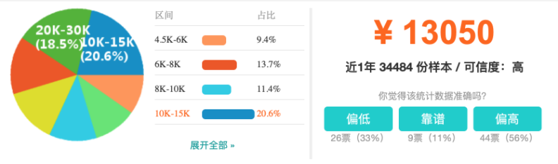


数据来源：[职友集](https://www.jobui.com/salary/?cityKw=北京&jobKw=运维)

## <font style="color:rgb(51, 51, 51);">运维岗位的定义</font>
**<font style="color:rgb(51, 51, 51);">什么是运维？</font>**

<font style="color:rgb(51, 51, 51);">在技术人员（写代码的）之间，一致对运维有一个开玩笑的认知：运维就是修电脑的、装网线的、背锅的岗位。</font>

**<font style="color:rgb(51, 51, 51);">IT运维管理</font>**<font style="color:rgb(51, 51, 51);">是指为了保障企业IT系统及网络的可用性、安全性、稳定性，保障业务的连续性，通过专业技术手段，对计算机网络、应用系统、电信网络、软硬件环境及运维服务流程等进行的综合管理。</font>

<font style="color:rgb(51, 51, 51);">随着企业数字化转型升级进程加快，企业IT系统架构越来越复杂，软件更新迭代越来越快。企业信息化建设使得大量业务和数据需要依靠信息系统来完成，稳定可用的IT系统是企业业务发展的基础条件，IT运维管理随之成为企业信息化建设的重要环节。</font>

<font style="color:rgb(51, 51, 51);">近年来，因为IT系统突然出现故障导致业务瘫痪甚至造成巨额损失的现象频出不穷。而大型数据中心由于对系统、数据的高度依赖，IT风险更大，对IT运维管理的重视也就更高。</font>

<font style="color:rgb(51, 51, 51);"></font>

**<font style="color:rgb(51, 51, 51);">运维领域经常看到的技术及概念</font>**

**<font style="color:rgb(51, 51, 51);">1）云计算架构</font>**

<font style="color:rgb(51, 51, 51);">云计算 = 公有云(阿里云、百度云、华为云) + 私有云（OpenStack） + 混合云</font>

<font style="color:rgb(51, 51, 51);">云服务器是由云服务厂商提供的性能卓越、稳定可靠、弹性扩展的IaaS（Infrastructure as a Service）级别云计算服务。云服务器免去了采购IT硬件的前期准备，让企业像使用水、电、天然气等公共资源一样便捷、高效地使用服务器，实现计算资源的即开即用和弹性伸缩。</font>

**<font style="color:rgb(51, 51, 51);">2） DevOps运维开发工程师</font>**<font style="color:rgb(51, 51, 51);"> DevOps（Development和Operations的组合词），它是一组过程、方法与系统的统称，主要用于促进开发和运营保障团队之间的协作与沟通，从而提高应用程序和服务的交付响应速度。 大概6:4 = 6运维:4开发（Python/Go）</font>

<font style="color:rgb(51, 51, 51);">DevOps把原本独立的开发和运营工作融合到一起，运营团队时刻了解开发人员的进展，并与他们形成互动，共同监控IT业务进展。在运维方面，DevOps可以打通从需求到结果运行的所有环节，以提高业务价值为目标</font>

**<font style="color:rgb(51, 51, 51);">3） AIOps</font>**<font style="color:rgb(51, 51, 51);"> 2016年，Gartner提出利用AI技术的新一代IT运维，即AIOps（智能运维），可以解决未来企业可能遭遇的因IT故障而导致的业务中断，AIOps是ITOM的升级和进步，它结合了大数据和机器算法、机器学习技术，通过海量信息的搜集和处理，发现、预测、解决故障，进一步推动了IT运维自动化，减少了人力成本。</font>

**<font style="color:rgb(51, 51, 51);">4）CI/CD</font>**<font style="color:rgb(51, 51, 51);"> CI/CD 是一种通过在应用开发阶段引入自动化来频繁向客户交付应用的方法。CI/CD 的核心概念是持续集成、持续交付和持续部署。作为一个面向开发和运营团队的解决方案，CI/CD 主要针对在集成新代码时所引发的问题</font>

**<font style="color:rgb(51, 51, 51);">5）Docker容器化技术</font>**<font style="color:rgb(51, 51, 51);"> Docker 是一个开源的应用容器引擎，通常包括客户端、守护进程、镜像、容器，让开发者可以打包他们的应用以及依赖包到一个可移植的镜像中，再发布出去。类似于一个集装箱，可以把货物规整的摆放起来。</font>

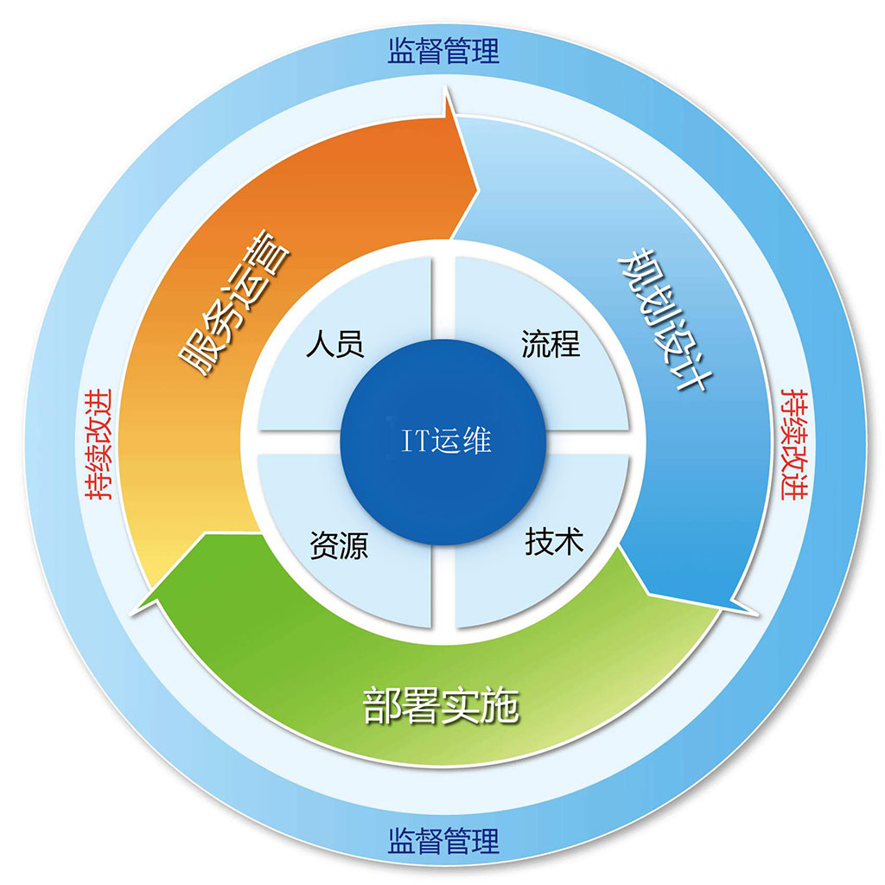

## <font style="color:rgb(51, 51, 51);">运维的诞生</font>
<font style="color:rgb(51, 51, 51);">从最早的网管开始，九十年代初期，互联网欠发达的时候，还少有服务器的概念，电脑价格昂贵，大多数人并不具备在家上网的条件，网吧应运而生。</font>

<font style="color:rgb(51, 51, 51);">早期计算机没有硬盘=>软驱=>软盘，1万多块钱 = 8-10万</font>

<font style="color:rgb(51, 51, 51);">网吧的电脑、猫等设备需要进行日常维护，于是“网管”岗位应运而生，这就是早期运维的雏形。</font>

## <font style="color:rgb(51, 51, 51);">90年代初网吧图</font>
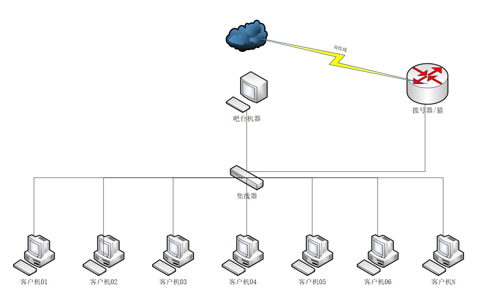

## <font style="color:rgb(51, 51, 51);">运维行业背景</font>
<font style="color:rgb(51, 51, 51);">① 从行业角度来看，随着中国互联网的高速发展(BAT)、网站规模越来越来大、架构越来越复杂，对专职网站运维工程师、网站架构师的要求会越来越急迫，特别是对有经验的优秀运维人才需求量大，而且是越老越值钱。</font>

<font style="color:rgb(51, 51, 51);">② 从个人角度，运维工程师技术含量及要求会越来越高，同时也是对公司应用、架构最了解最熟悉的人，越来越得到重视。</font>

<font style="color:rgb(51, 51, 51);">③ 运维工作的相关经验将会变得非常重要，而且也将成为个人的核心竞争力，优秀的运维工程师具备很好的各层面问题的解决能力及方案提供、全局思考的能力等。</font>

<font style="color:rgb(51, 51, 51);">④ 由于运维岗位所接触的知识面非常广阔，更容易培养或发挥出个人某些方面的特长或爱好，如内核、网络、开发、数据库等方面，可以做得非常深入精通、成为这方面的专家。</font>

<font style="color:rgb(51, 51, 51);">⑤ 当前国内外对运维人才的需求非常迫切，运维工程师的薪资也水涨船高，与研发、测试等技术部门持平，甚至超出。</font>

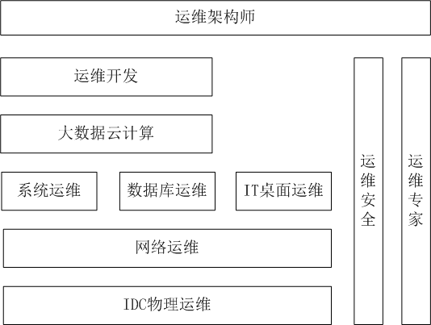

# <font style="color:rgb(51, 51, 51);">三、企业运行模式</font>
## <font style="color:rgb(51, 51, 51);">铁三角</font>
<font style="color:rgb(51, 51, 51);">铁三角 = 产品 + 研发 + 运维</font>

<font style="color:rgb(51, 51, 51);">流程走向：产品设计 → 项目研发 → 项目测试 → 项目上线 → 系统运维</font>

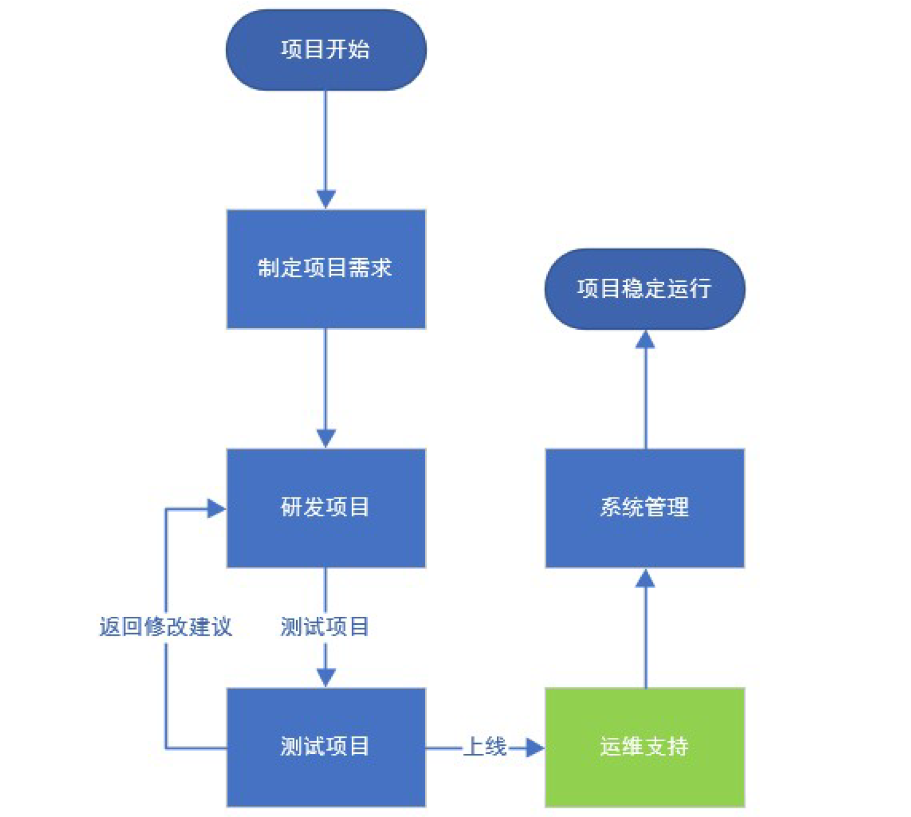

<font style="color:rgb(51, 51, 51);">研发 = 前端（HTML+CSS+JavaScript） + 后端（Java/Python/Go）</font>

<font style="color:rgb(51, 51, 51);">运维：产品上线、后期的运行与维护工作都属于运维工程师范畴</font>

## <font style="color:rgb(51, 51, 51);">部门与部门职责 </font>
<font style="color:rgb(51, 51, 51);">产品部门（PM、UI、UE，3-5 个）：设计产品的需求，确定需要做的项目的功能和细节问题</font>

<font style="color:rgb(51, 51, 51);">研发部门（5-7 个）：根据产品部门/测试部门提供的项目模块需求进行编程</font>

<font style="color:rgb(51, 51, 51);">测试部门（2 个左右即可）：对于研发部门提供的代码进行运行测试，检查是否存在bug和一些需要改善的体验</font>

<font style="color:rgb(51, 51, 51);">运维部门（3-4 个）：负责项目环境部署、上线、架构的搭建等等</font>

## <font style="color:rgb(51, 51, 51);">上线与生产</font>
<font style="color:rgb(51, 51, 51);">成熟企业中的系统环境：</font>

<font style="color:rgb(51, 51, 51);">开发环境： 根据系统要求，设计和搭建系统环境</font>

<font style="color:rgb(51, 51, 51);">测试环境：搭建系统环境，实现自动化发布</font>

<font style="color:rgb(51, 51, 51);">准生产环境：搭建系统环境，沟通第三方厂商，自动化发布，监控</font>

<font style="color:rgb(51, 51, 51);">生产环境：搭建系统环境，沟通第三方厂商，自动化发布，监控，发起持续改进</font>

**<font style="color:rgb(51, 51, 51);">上线</font>**<font style="color:rgb(51, 51, 51);">：发布项目的过程，包含准生产上线，生产上线等。内测/公测 → 开服</font>

**<font style="color:rgb(51, 51, 51);">生产</font>**<font style="color:rgb(51, 51, 51);">：正式提供对外服务的环境，叫生产环境，需要运维重点关注。</font>

<font style="color:rgb(51, 51, 51);">在项目的从无到有的过程中，可以将其分为两个阶段：研发/测试阶段、生产运行阶段。</font>

<font style="color:rgb(51, 51, 51);">运维工作贯穿了开发，测试，生产的各个阶段，是其中重要的一环。</font>

## <font style="color:rgb(51, 51, 51);">网站的概念</font>
<font style="color:rgb(51, 51, 51);">简单地说，网站是一种沟通工具，人们可以通过网站来发布自己想要公开的资讯，或者利用网站来提供相关的网络服务。人们可以通过网页浏览器来访问网站，获取自己需要的资讯或者享受网络服务。</font>

<font style="color:rgb(51, 51, 51);">网站开发 = 前端开发 + 后端开发（ASP/PHP/JSP）</font>

```powershell
扩展：了解网站的分类
根据网站所用编程语言分类：例如ASP/PHP/JSP网站等；
根据网站的用途分类：例如门户网站、行业网站、娱乐网站等
根据网站的功能分类：例如单一网站（企业网站）、多功能网站（网络商城）等
根据网站的持有者分类：例如个人网站、商业网站、政府网站、教育网站等
根据网站的商业目的分类：营利型网站（企业/行业网站）、非营利性型网站（政府网站/教育网站）
根据网站的面向终端的分类：Web网站（电脑端或PC端）和 WAP网站（手机端）
```

## <font style="color:rgb(51, 51, 51);">网站运行模式（重点）</font>
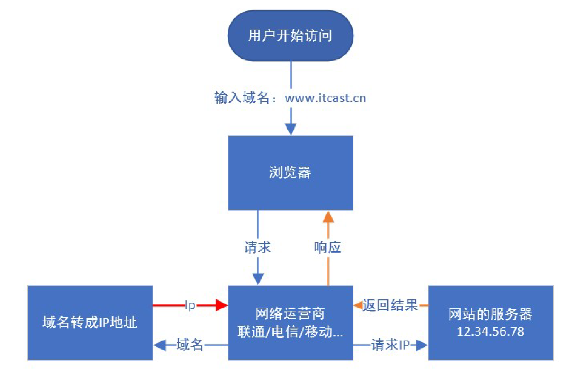

> DNS 作用：将域名转换成IP 地址。
>

从上图中可以看出如果一个网站项目需要正常的运行，则需要的前提条件有：

① 域名（方便用户记忆）

② 需要对域名和ip 的关系进行关联（DNS 服务器）

③ 服务器

④ 服务器的项目运行环境

## <font style="color:rgb(51, 51, 51);">几个重要概念</font>
### **<font style="color:rgb(51, 51, 51);">服务器</font>**
<font style="color:rgb(51, 51, 51);">就是给用户提供服务的机器（电脑）。服务器可以分为四大类：塔式服务器、机式服务器、刀片服务器、柜式服务器。</font>

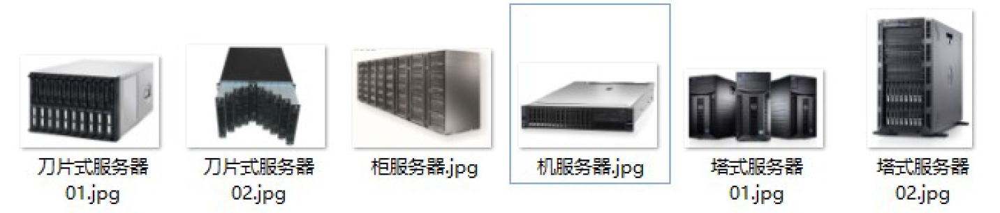

> #### <font style="color:rgb(119, 119, 119);">问题一：普通台式机/笔记本能否充当服务器来使用？</font>

<font style="color:rgb(51, 51, 51);">标准的回答：如果从提供服务的实现角度来考虑的话的确是可以，但是如果要想稳定、高效的提供服务，则在这个角度考虑家用电脑和笔记就无法取代服务器地位。</font>

<font style="color:rgb(51, 51, 51);">家用台式机/笔记本从系统角度来看，一般都会使用Windows 系统（易用），并不适合作为服务器来使用。</font>

<font style="color:rgb(51, 51, 51);">家用台式机/笔记本硬件和专门的服务器相比标准不统一。</font>

> #### <font style="color:rgb(119, 119, 119);">问题二：服务器有哪些特性？</font>

<font style="color:rgb(51, 51, 51);">高性能特性 + 标准化统一特性。</font>

### **<font style="color:rgb(51, 51, 51);">IP地址</font>**
<font style="color:rgb(51, 51, 51);">形式ipv4（常见）、ipv6（不考虑）。Ipv4 形式：x.x.x.x，x 有取值范围（第1 位x取值1-223，从第二位开始0-255）。由于资源有限为了保证全球这么多台电脑都可以使用，ip 可以分为公网/外网ip 和私网/内网ip 地址。</font>

> <font style="color:rgb(119, 119, 119);">0.0.0.0，表示任意地方，anywhere...</font>
>

### **<font style="color:rgb(51, 51, 51);">域名</font>**
<font style="color:rgb(51, 51, 51);">就是在浏览器地址栏中输入的那一串字母和数字的组合，例如：</font>[<font style="color:rgb(51, 51, 51);">www.baidu.com</font>](https://www.baidu.com)<font style="color:rgb(51, 51, 51);">，这个就是域名，域名主要是方便用户记忆。</font>

> <font style="color:rgb(119, 119, 119);">问：</font>[<font style="color:rgb(119, 119, 119);">www.baidu.com</font>](https://www.baidu.com)<font style="color:rgb(119, 119, 119);"> 这个域名是几级的域名？二级域名，看域名的级别只要看有几个"."，日常所说的注册域名指的是注册顶级域名（一级）】</font>
>

<font style="color:rgb(51, 51, 51);">额外购买：中国万网（已经被阿里云收购），域名属于有限资源，先买先得（按年付费）</font>

### **<font style="color:rgb(51, 51, 51);">公网</font>**
<font style="color:rgb(51, 51, 51);">www（万维网），全世界都可以互相访问的网。 </font>

### **<font style="color:rgb(51, 51, 51);">局域网</font>**
<font style="color:rgb(51, 51, 51);">局域网/内网/私网：在某个单元内部（家庭/教室/公司）能够进行互相访问的网络，红色警戒游戏对战平台。</font>

## <font style="color:rgb(51, 51, 51);">服务器的重要结构组成</font>
<font style="color:rgb(51, 51, 51);">家用电脑组成： CPU、主板、内存条、显卡、硬盘、电源、风扇、网卡、显示器、机箱、键盘鼠标等等。</font>

### <font style="color:rgb(51, 51, 51);">CPU</font>
<font style="color:rgb(51, 51, 51);">CPU是电脑的大脑，如下图所示：</font>

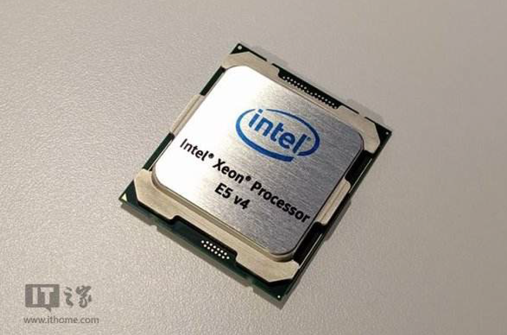

<font style="color:rgb(51, 51, 51);">CPU发展史：</font>

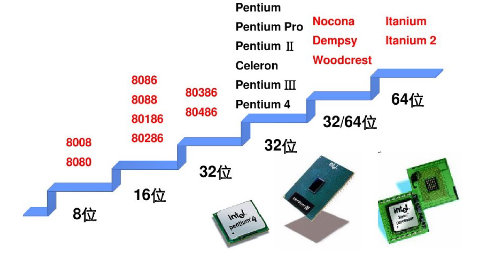

<font style="color:rgb(51, 51, 51);">32 位CPU：最大的内存寻址地址2^32，大约4G的大小。</font>

<font style="color:rgb(51, 51, 51);">CPU很傻，只认识0和1</font>

<font style="color:rgb(51, 51, 51);">32位的CPU，其支持的内存最大值 = 2的32次方 ≈ 3.80G，大约4G的大小</font>

<font style="color:rgb(51, 51, 51);">64位的CPU，其支持的内存最大值 = 2的64次方</font>


> <font style="color:rgb(119, 119, 119);">聊聊2的32次方怎么算？</font>
>
> <font style="color:rgb(119, 119, 119);">1T = 1024GB 1GB = 1024MB 1MB = 1024KB 1KB = 1024B</font>
>
> <font style="color:rgb(119, 119, 119);">2^32B = 2^32 /1024/1024 /1024 = 4GB</font>
>

<font style="color:rgb(51, 51, 51);">CPU i3、i5、i7、i9、志强系列（移动工作站或者企业级服务器），现在买计算机，看CPU还要看几代的。i5，十代U</font>

### <font style="color:rgb(51, 51, 51);">内存</font>
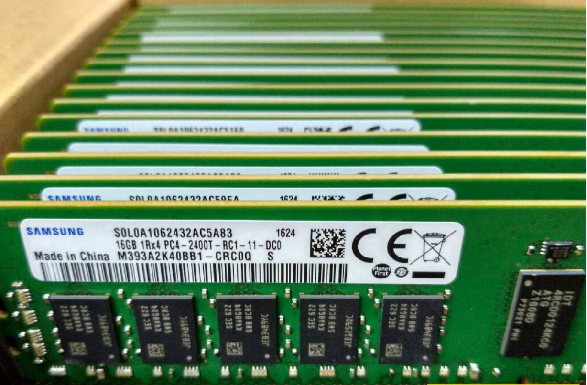

<font style="color:rgb(51, 51, 51);">内存也是电脑必需组件之一。</font>

<font style="color:rgb(51, 51, 51);">计算机是一个商铺：CPU相当于人，内存相当于仓库。商品必须上架才能显示。</font>

### <font style="color:rgb(51, 51, 51);">风扇</font>
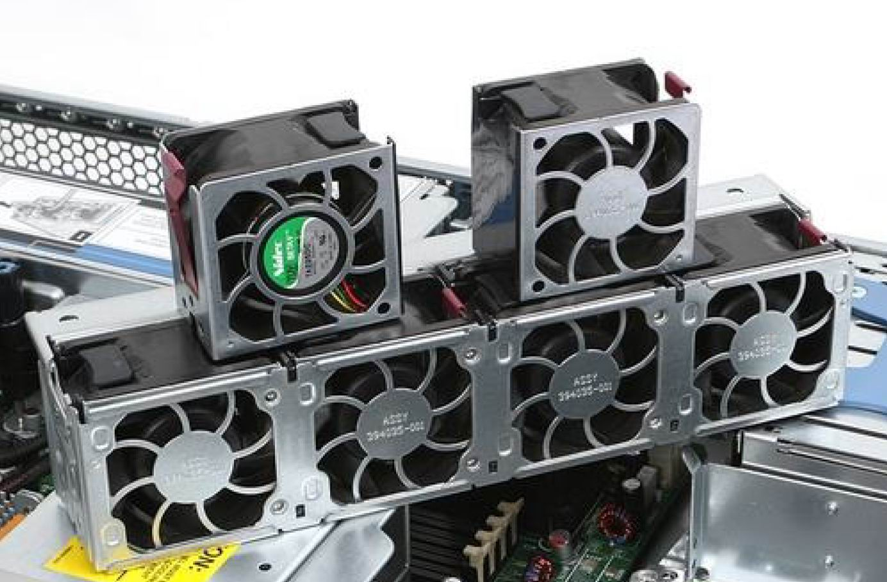

### <font style="color:rgb(51, 51, 51);">电源</font>
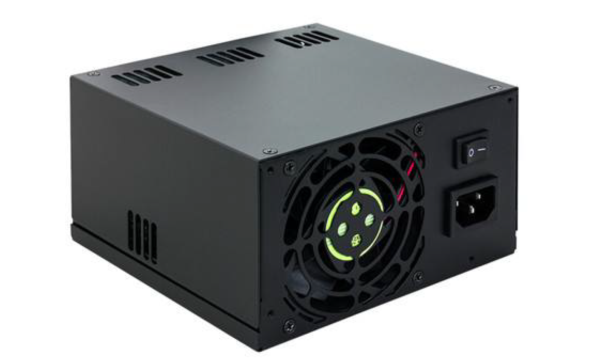

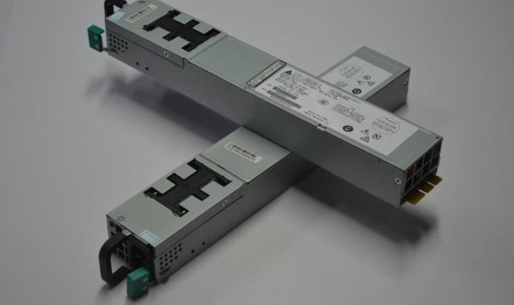

### <font style="color:rgb(51, 51, 51);">硬盘</font>
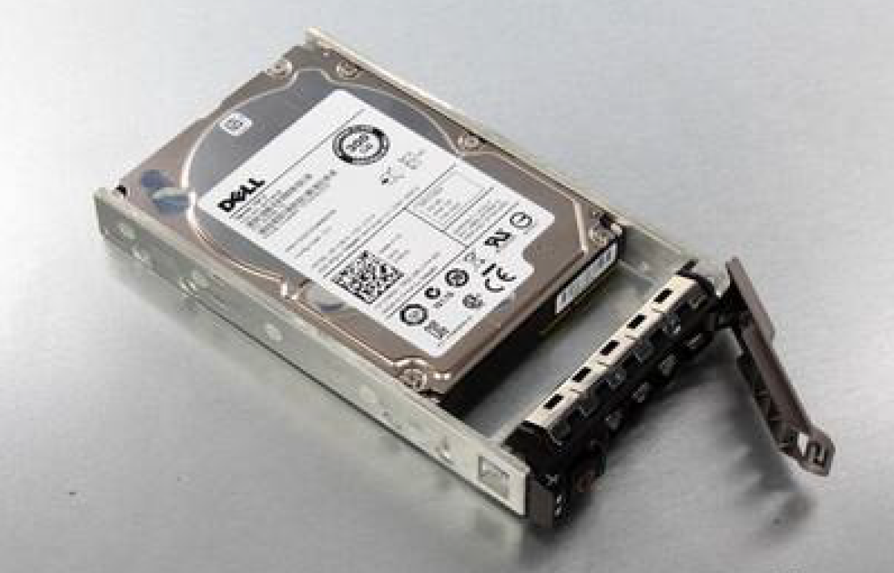

<font style="color:rgb(51, 51, 51);">硬盘的作用：存储数据。</font>

<font style="color:rgb(51, 51, 51);">硬盘可以分为机械硬盘、固态硬盘。</font>

<font style="color:rgb(51, 51, 51);">机械硬盘与固态硬盘的区别？</font>

<font style="color:rgb(51, 51, 51);">① 速度：固态硬盘更快，不受转速影响</font>

<font style="color:rgb(51, 51, 51);">② 安全性：机械硬盘的安全性较高，即使损坏了，也有80%以上的恢复概率</font>

<font style="color:rgb(51, 51, 51);">企业级固态硬盘（安全性也有所提高）</font>

<font style="color:rgb(51, 51, 51);">扩展：固态硬盘（价格千差万别，因为使用的芯片不一样）</font>

<font style="color:rgb(51, 51, 51);">QLC(很差) < TLC(一般) < MLC(最好)，芯片不同有何影响</font>

<font style="color:rgb(51, 51, 51);">一方面是速度不一样，另外一方面安全性和寿命不同</font>

### <font style="color:rgb(51, 51, 51);">主板</font>
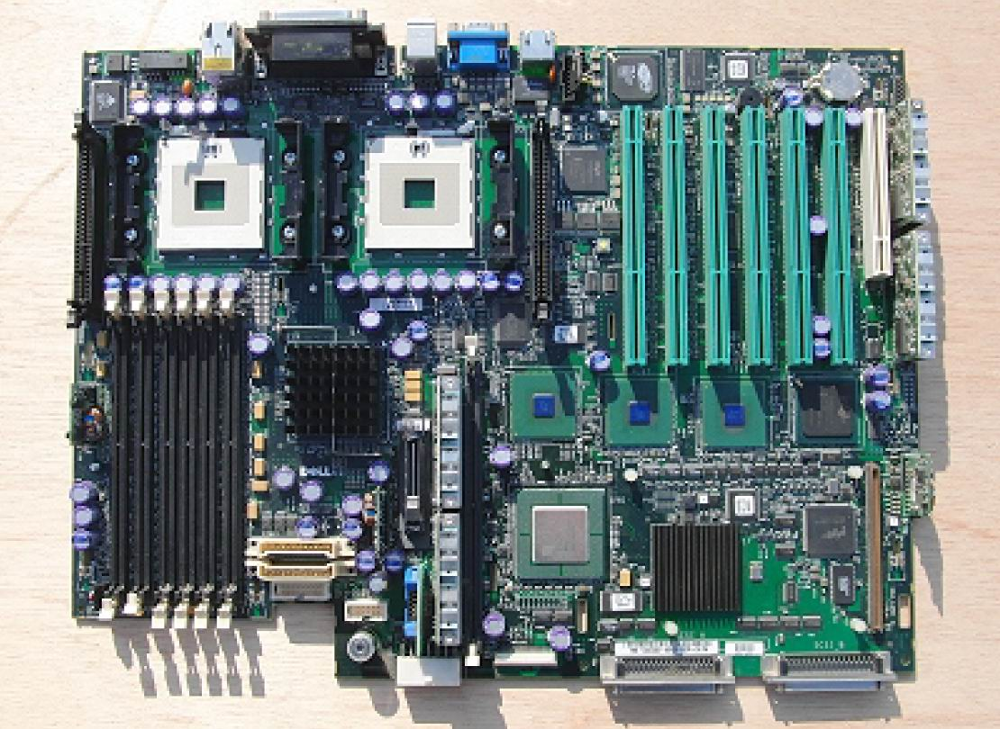

<font style="color:rgb(51, 51, 51);">主要的作用：</font>

<font style="color:rgb(51, 51, 51);">自身包含了一些集成电路，负责各个不同的功能和数据通信。</font>

<font style="color:rgb(51, 51, 51);">主板上有很多空的插槽，插槽的作用在于扩展外部的硬件设备。</font>

# <font style="color:rgb(51, 51, 51);">四、操作系统概述</font>
## <font style="color:rgb(51, 51, 51);">计算机发展史</font>
<font style="color:rgb(51, 51, 51);">第一台计算机是1946 年2 月14 日诞生日，第一台名称ENIAC。体积一间屋子的大小，重量高达28t。</font>

<font style="color:rgb(51, 51, 51);">第一代：1946 – 1958 => 12 年 （电子管）</font>


<font style="color:rgb(51, 51, 51);">第二代：1958 – 1964 => 6 年 （晶体管）</font>


<font style="color:rgb(51, 51, 51);">第三代：1964 – 1970 => 6 年 （集成电路）</font>

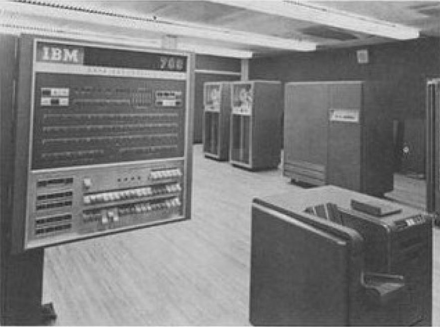

<font style="color:rgb(51, 51, 51);">第四代：1970 – 至今 （大规模集成电路）</font>

## <font style="color:rgb(51, 51, 51);">计算机组成</font>
<font style="color:rgb(51, 51, 51);">CPU、内存、风扇、硬盘、显示器、主板、电源、声卡、网卡、显卡、鼠标、键盘等</font>

## <font style="color:rgb(51, 51, 51);">计算机资源（重点）</font>
<font style="color:rgb(51, 51, 51);">计算机资源分为2 部分：硬件资源、软件资源</font>

<font style="color:rgb(51, 51, 51);">硬件：一般硬件是指计算机的物理组成，由真实（看得见，摸得着）的设备组成的</font>

<font style="color:rgb(51, 51, 51);">软件：软件一般是指应用程序，应用程序程序是由开发人员去按照编程语言的特定的规则去</font>

<font style="color:rgb(51, 51, 51);">编写的程序。除了上述的应用程序之外，操作系统也属于软件资源的范畴，它属特殊的软件。</font>

> <font style="color:rgb(119, 119, 119);">问题：为什么在打开一个应用程序之后（吃鸡游戏），当玩家在敲击键盘和移动鼠标的时候里</font>
>
> <font style="color:rgb(119, 119, 119);">面人物会有对应的行为表现呢？</font>
>

<font style="color:rgb(51, 51, 51);">答：用户敲击键盘/移动鼠标（硬件操作） → 硬件的驱动（软件资源） → 操作系统（软件） → 硬件支持（cpu） → 操作系统（软件） → 驱动（显卡驱动） → 显示在屏幕上（硬件）</font>

<font style="color:rgb(51, 51, 51);">所以由此可知，操作系统是软件资源与硬件资源之间的桥梁。</font>

## <font style="color:rgb(51, 51, 51);">操作系统</font>
<font style="color:rgb(51, 51, 51);">常见操作系统有：Windows、MacOS、Unix/Linux。 类UNIX</font>

<font style="color:rgb(51, 51, 51);">Windows：其是微软公司研发的收费操作系统（闭源）。</font>

<font style="color:rgb(51, 51, 51);">Windows 系统体系分为两类：用户操作系统、Server 操作系统。</font>

<font style="color:rgb(51, 51, 51);">用户操作系统：win 95、win 98、win NT、win Me、win xp、vista、win7、win8、win10。</font>

<font style="color:rgb(51, 51, 51);"></font>

<font style="color:rgb(51, 51, 51);">MacOS：其是由苹果公司开发的一款收费（变相收费，买电脑送系统）操作系统。该系统从</font>

<font style="color:rgb(51, 51, 51);">终端角度来看分为：watch OS、IOS、MacOS。其表现突出的地方：底层优化实现的很好、安全性要更加高点（闭源）。</font>

<font style="color:rgb(51, 51, 51);"></font>

<font style="color:rgb(51, 51, 51);">Linux：Linux 是目前全球使用量最多的服务器操作系统（开源）。其体系很强大，其分支有很多（数不胜数），其目前主要的分支有：RedHat（红帽）、CentOS、Debian、乌班图（ubuntu）</font>

<font style="color:rgb(51, 51, 51);">等等。其在世界范围最大的使用分支是安卓。</font>

<font style="color:rgb(51, 51, 51);"></font>

<font style="color:rgb(51, 51, 51);">闭源：不开放源代码，用户是没有办法看到软件的底层实现（闭源≠收费）。</font>

<font style="color:rgb(51, 51, 51);">开源：表示开放源代码（开源≠免费）。</font>

## <font style="color:rgb(51, 51, 51);">为什么需要Linux操作系统</font>
> <font style="color:rgb(119, 119, 119);">问题：windows 既然可以使用傻瓜式的方式进行操作，例如使用ctrl+c 表示复制，ctrl+v 表示粘贴等，为什么还需要使用/学习Linux 系统？</font>
>

<font style="color:rgb(51, 51, 51);">① 性能问题，Windows 服务器操作系统不如Linux 高；</font>

<font style="color:rgb(51, 51, 51);">② 稳定性问题：</font>

<font style="color:rgb(51, 51, 51);">底层架构：Linux 更加稳定，其开机时间可以达到好几年不关机；</font>

<font style="color:rgb(51, 51, 51);">开源：因为开源，人人都可以看到源代码，就可以为其提供自己的补丁，补丁可以提高稳定性和安全性；</font>

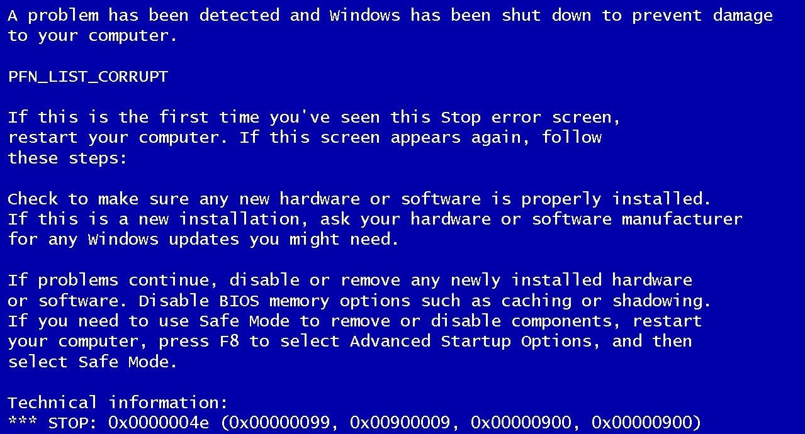

<font style="color:rgb(51, 51, 51);">③ 安全性问题：</font>

<font style="color:rgb(51, 51, 51);">Linux 操作系统，相对于Windows 操作系统要更加安全；</font>

<font style="color:rgb(51, 51, 51);">④ 远程管理方面：</font>

<font style="color:rgb(51, 51, 51);">Windows 不及Linux 操作高效。</font>

<font style="color:rgb(51, 51, 51);">⑤ 服务器价格昂贵的，需要对资源进行充分利用，充分把计算机资源用到项目上（访问并发、性能），而不是把资源浪费在图形化界面或者方便程度上；</font>

# <font style="color:rgb(51, 51, 51);">五、Linux发展史</font>
## <font style="color:rgb(51, 51, 51);">Linux 起源</font>
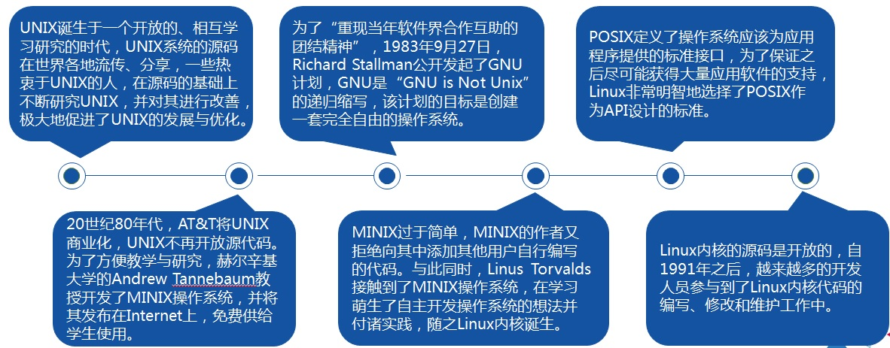


**<font style="color:rgb(51, 51, 51);">Linus(林纳斯·托瓦兹)</font>**<font style="color:rgb(51, 51, 51);">：Linux 的开发作者，被称为Linux 之父，Linux 诞生时是芬兰赫尔辛基大学的在校大学生。</font>**<font style="color:rgb(51, 51, 51);">Stallman 斯特曼</font>**<font style="color:rgb(51, 51, 51);">：开源文化的倡导人。</font>

## <font style="color:rgb(51, 51, 51);">Linux 的含义</font>
<font style="color:rgb(51, 51, 51);">狭义：由Linus 编写的一段内核代码。</font>

<font style="color:rgb(51, 51, 51);">广义：广义上的Linux 是指由Linux内核衍生的各种Linux发行版本。（CentOS、Ubuntu）</font>

> <font style="color:rgb(119, 119, 119);">注意：以后提及到的Linux 都是广义上的Linux</font>
>

## <font style="color:rgb(51, 51, 51);">Linux特点</font>
<font style="color:rgb(51, 51, 51);">开放性（开源）、多用户、多任务、良好的用户界面、优异的性能与稳定性</font>

<font style="color:rgb(51, 51, 51);">多用户多任务：</font>

<font style="color:rgb(51, 51, 51);">单用户：一个用户，在登录计算机（操作系统），只能允许同时登录一个用户；</font>

<font style="color:rgb(51, 51, 51);">单任务：一个任务，允许用户同时进行的操作任务数量；</font>

<font style="color:rgb(51, 51, 51);">多用户：多个用户，在登录计算机（操作系统），允许同时登录多个用户进行操作；</font>

<font style="color:rgb(51, 51, 51);">多任务：多个任务，允许用户同时进行多个操作任务；</font>

<font style="color:rgb(51, 51, 51);"></font>

<font style="color:rgb(51, 51, 51);">Windows 属于：单用户、多任务。</font>

<font style="color:rgb(51, 51, 51);">而Linux系统则属于：多用户、多任务。</font>

## <font style="color:rgb(51, 51, 51);">Linux分支(Linux衍生版：Linux厂商基于Linux内核)</font>
<font style="color:rgb(51, 51, 51);">分支：Linux 分支有很多，现在比较有名的redhat、ubuntu、debian、centos（Community Enterprise Operating System）、suse 等等。</font>

<font style="color:rgb(51, 51, 51);">redhat红帽（redhat企业版、centos社区版）、ubuntu（乌班图）、debian、suse</font>

<font style="color:rgb(51, 51, 51);">中国Linux系统：红旗（Redflag）、麒麟、深度OS（推荐，和Windows基本一致）</font>

<font style="color:rgb(51, 51, 51);">XP操作系统（番茄家园、雨林木风xp.com、深度家园）=> Linux操作系统</font>

<font style="color:rgb(51, 51, 51);">CentOS7.6</font>

# <font style="color:rgb(51, 51, 51);">六、Linux系统安装</font>
## <font style="color:rgb(51, 51, 51);">Linux系统安装方式</font>
<font style="color:rgb(51, 51, 51);">目前安装操作系统方式有2 种：真机安装、虚拟机安装。</font>

<font style="color:rgb(51, 51, 51);">真机安装：使用真实的电脑进行安装，像安装windows 操作系统一样，真机安装的结果就是替换掉当前的windows 操作系统；（缺点：对系统进行格式化，重新安装）</font>

<font style="color:rgb(51, 51, 51);">虚拟机安装：通过一些特定的手段，来进行模拟安装，并不会影响当前计算机的真实操作系统；</font>

> <font style="color:rgb(119, 119, 119);">如果是学习或者测试使用，强烈建议使用虚拟机安装方式。</font>
>

## <font style="color:rgb(51, 51, 51);">虚拟机概念</font>
<font style="color:rgb(51, 51, 51);">什么是虚拟机？</font>

<font style="color:rgb(51, 51, 51);">虚拟机，有些时候想模拟出一个真实的电脑环境，碍于使用真机安装代价太大，因此而诞生的一款可以模拟操作系统运行的软件。</font>

<font style="color:rgb(51, 51, 51);">虚拟机目前有2 个比较有名的产品：vmware 出品的vmware workstation、oracle 出品的virtual Box。</font>

## <font style="color:rgb(51, 51, 51);">虚拟机的安装</font>
<font style="color:rgb(51, 51, 51);">第一步：复制VMware软件包到Windows系统中</font>


<font style="color:rgb(51, 51, 51);">第二步：双击VMware安装包，进行软件的安装</font>


<font style="color:rgb(51, 51, 51);">第三步：勾选软件的许可协议</font>


<font style="color:rgb(51, 51, 51);">第四步：设置VMware安装路径以及勾选增强型的键盘程序</font>

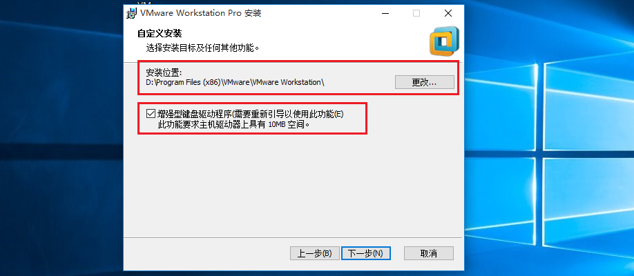

<font style="color:rgb(51, 51, 51);">第五步：用户体验设置</font>


<font style="color:rgb(51, 51, 51);">下一步、下一步，直到软件安装完成即可。</font>

<font style="color:rgb(51, 51, 51);">第六步：安装完成后，输入许可证密钥，破解VMware软件</font>


<font style="color:rgb(51, 51, 51);">输入密钥：</font>


> <font style="color:rgb(119, 119, 119);">特别注意：VMware WorkStation安装完毕后，其在网络适配器中会产生两张虚拟网卡。</font>
>
> <font style="color:rgb(119, 119, 119);">VMnet1与VMnet8，如果没有产生这两张网卡，则操作系统必须重装！</font>
>


## <font style="color:rgb(51, 51, 51);">Linux系统环境部署</font>
<font style="color:rgb(51, 51, 51);">Linux系统版本选择：CentOS7.6 x64，【镜像一般都是CentOS*.iso文件】</font>

> <font style="color:rgb(119, 119, 119);">问题：为什么不选择最新版的8 版本？</font>
>
> <font style="color:rgb(119, 119, 119);">7.x 目前依然是主流</font>
>
> <font style="color:rgb(119, 119, 119);">7.x 的各种系统操作模式是基础</font>
>

<font style="color:rgb(51, 51, 51);">官网：</font>[<font style="color:rgb(51, 51, 51);">https://www.centos.org/</font>](https://www.centos.org/)<font style="color:rgb(51, 51, 51);"> ，从官网下载得到的镜像文件：</font>


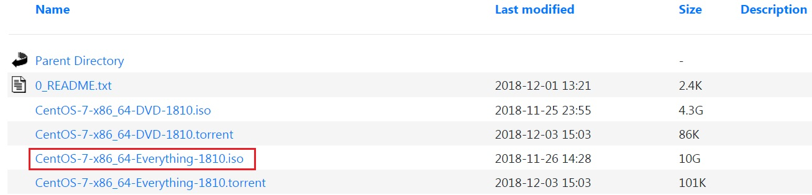

<font style="color:rgb(51, 51, 51);">Centos7.6版本下载地址：</font>

[<font style="color:rgb(51, 51, 51);">http://vault.centos.org/7.6.1810/isos/x86_64/CentOS-7-x86_64-Everything-1810.iso</font>](http://vault.centos.org/7.6.1810/isos/x86_64/CentOS-7-x86_64-Everything-1810.iso)

<font style="color:rgb(51, 51, 51);"></font>

**<font style="color:rgb(51, 51, 51);">第一步：创建新的虚拟机</font>**


<font style="color:rgb(51, 51, 51);">第二步：选择自定义设置</font>


<font style="color:rgb(51, 51, 51);">第三步：选择稍后安装操作系统</font>


<font style="color:rgb(51, 51, 51);">第四步：选择要安装的操作系统类型</font>

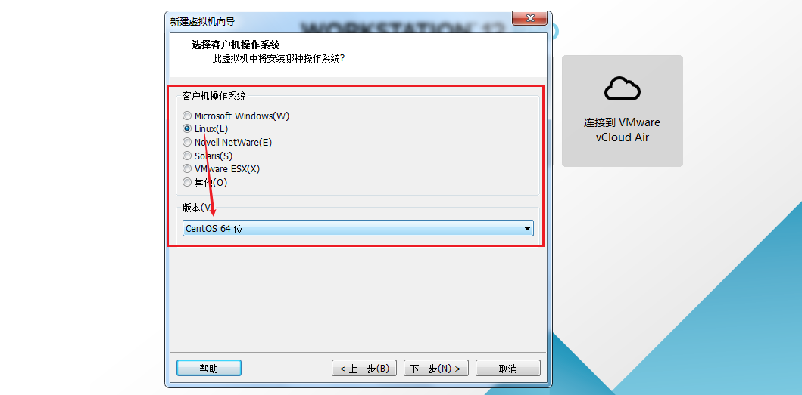

<font style="color:rgb(51, 51, 51);">第五步：设置操作系统的名称与安装路径</font>


<font style="color:rgb(51, 51, 51);">第六步：CPU选择1颗2核</font>


<font style="color:rgb(51, 51, 51);">第七步：内存设置为2048MB（2GB）</font>


<font style="color:rgb(51, 51, 51);">第八步：设置网络模式为NAT模式（共享上网）</font>


<font style="color:rgb(51, 51, 51);">设置完毕后，下一步、下一步、下一步...直到虚拟机创建完成。</font>

## <font style="color:rgb(51, 51, 51);">安装CentOS7.6操作系统(上)</font>
<font style="color:rgb(51, 51, 51);">第一步：选择CD/DVD光驱，如下图所示</font>


<font style="color:rgb(51, 51, 51);">第二步：选择CentOS7.6光盘文件（CentOS-7.6-x86_64-DVD-1810.iso，不需要解压）</font>


<font style="color:rgb(51, 51, 51);">第三步：启动CentOS7.6操作系统光盘镜像</font>


<font style="color:rgb(51, 51, 51);">使用方向键向上移动到第一个菜单</font>


<font style="color:rgb(51, 51, 51);">回车，进入安装菜单</font>


<font style="color:rgb(51, 51, 51);">再次按回车，进入到CentOS7.6的安装界面。</font>

## <font style="color:rgb(51, 51, 51);">安装CentOS7.6操作系统(中)</font>
<font style="color:rgb(51, 51, 51);">第一步：选择安装时使用的语言（全英文）</font>


<font style="color:rgb(51, 51, 51);">第二步：设置时间 => 亚洲/上海 => Asia/Shanghai</font>

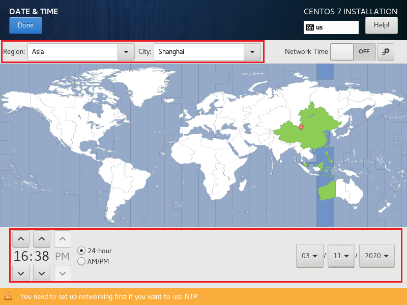

<font style="color:rgb(51, 51, 51);">第三步：选择安装系统界面以及需要安装的软件（非常重要）</font>


<font style="color:rgb(51, 51, 51);">第四步：自动分区</font>


<font style="color:rgb(51, 51, 51);">由于还没有学习过Linux的分区技术，所以我们暂时选择自动分区。</font>


<font style="color:rgb(51, 51, 51);">第五步：连接网络</font>


<font style="color:rgb(51, 51, 51);">第六步：给root管理员设置密码以及创建一个普通的用户</font>


<font style="color:rgb(51, 51, 51);">root账号默认已经存在，但是没有密码，需要人为设置。设置完成后，还需要创建一个普通的账号如lhp。</font>

> <font style="color:rgb(119, 119, 119);">root密码：123456，超级管理员，实际工作中越复杂越好</font>
>
> <font style="color:rgb(119, 119, 119);">lhp密码：123456，普通账号</font>
>

## <font style="color:rgb(51, 51, 51);">安装CentOS7.6操作系统(下)</font>
<font style="color:rgb(51, 51, 51);">第一步：安装完成后，单击Reboot按钮，重启计算机</font>


<font style="color:rgb(51, 51, 51);">第二步：选择同意CentOS7授权</font>


<font style="color:rgb(51, 51, 51);">第三步：勾选同意以上许可协议</font>

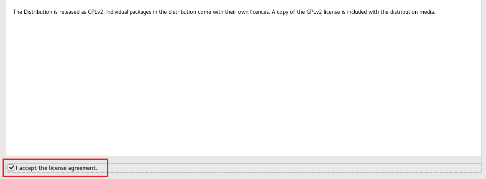

<font style="color:rgb(51, 51, 51);">设置完成后，单击完成配置，到此CentOS7.6就全部安装完成了！</font>

# <font style="color:rgb(51, 51, 51);">七、给CentOS7操作系统拍摄快照</font>
## <font style="color:rgb(51, 51, 51);">什么是快照</font>
<font style="color:rgb(51, 51, 51);">快照可以理解就是一个快速的备份操作。</font>

<font style="color:rgb(51, 51, 51);">为什么要拍摄快照：就是为了做一个系统的备份，防止小伙伴们误操作，导致系统不可用。</font>

## <font style="color:rgb(51, 51, 51);">VMware实现快照</font>
<font style="color:rgb(51, 51, 51);">第一步：选择虚拟机=>快照=>拍摄快照</font>


<font style="color:rgb(51, 51, 51);">第二步：设置快照的名称</font>


<font style="color:rgb(51, 51, 51);">设置完成后，单击拍摄快照，一闪，备份完成。</font>

## <font style="color:rgb(51, 51, 51);">恢复快照</font>
<font style="color:rgb(51, 51, 51);">当有一天，我们的Linux系统不小心损坏了，不用单击。单击虚拟机菜单=>快照=>恢复到快照即可立即恢复。</font>

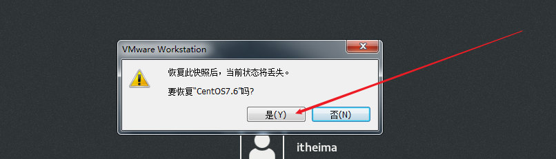

# <font style="color:rgb(51, 51, 51);">八、锁屏时间配置</font>
## <font style="color:rgb(51, 51, 51);">什么是锁屏</font>
<font style="color:rgb(51, 51, 51);">当我们的计算机静止不动，5分钟后，会自动锁定屏幕。</font>

<font style="color:rgb(51, 51, 51);">解锁还需要重新输入密码，很麻烦，所以应该解除5分钟限制。</font>

## <font style="color:rgb(51, 51, 51);">解除5分钟锁屏限制</font>
<font style="color:rgb(51, 51, 51);">第一步：单击设置菜单</font>


<font style="color:rgb(51, 51, 51);">第二步：选择Power（节能）</font>


<font style="color:rgb(51, 51, 51);">第三步：设置锁屏时间</font>


> 更新: 2025-03-17 10:52:51  
> 原文: <https://www.yuque.com/u41736172/az9urv/rk64fn6g1zkllxk1>