# 02.Linux入门级命令

# <font style="color:rgb(51, 51, 51);">一、学习目标</font>
1. <font style="color:rgb(51, 51, 51);">了解VMware备份的两种方式</font>
2. <font style="color:rgb(51, 51, 51);">能说出快照与克隆的区别</font>
3. <font style="color:rgb(51, 51, 51);">了解Linux系统文件</font>
4. <font style="color:rgb(51, 51, 51);">掌握Linux基础命令</font>
5. <font style="color:rgb(51, 51, 51);">知道vmware tools的作用</font>

# <font style="color:rgb(51, 51, 51);">二、备份操作系统</font>
<font style="color:rgb(51, 51, 51);">在VMware中备份的方式有2 种：快照或克隆。</font>

## <font style="color:rgb(51, 51, 51);">快照</font>
<font style="color:rgb(51, 51, 51);">快照：又称还原点，就是保存在拍快照时候的系统的状态（包含了所有的内容），在后期的时候随时可以恢复。</font>

> <font style="color:rgb(119, 119, 119);">注意：侧重在于短期备份，需要频繁备份的时候都可以使用快照，做快照的时候虚拟机中操作系统一般处于开启状态</font>
>

**<font style="color:rgb(51, 51, 51);"></font>**

**<font style="color:rgb(51, 51, 51);">使用VMware实现拍摄快照，具体操作步骤，参考如下</font>**

<font style="color:rgb(51, 51, 51);">第一步：启动Linux的操作系统（快照备份是在系统启动后进行操作的）</font>

<font style="color:rgb(51, 51, 51);">第二步：单击VMware菜单栏=>虚拟机=>快照=>选择拍摄快照</font>


<font style="color:rgb(51, 51, 51);">第三步：输入拍摄快照的名称（为什么要有名字？为了方便后期的恢复操作）</font>


**<font style="color:rgb(51, 51, 51);">使用VMware实现恢复快照，具体操作步骤，参考如下</font>**

<font style="color:rgb(51, 51, 51);">第一步：模拟Linux操作系统故障（比如系统文件被删除、系统损坏等等）</font>

<font style="color:rgb(51, 51, 51);">第二步：选择VMware菜单栏=>虚拟机=>快照=>恢复到快照（根据拍摄时的名称进行恢复）</font>

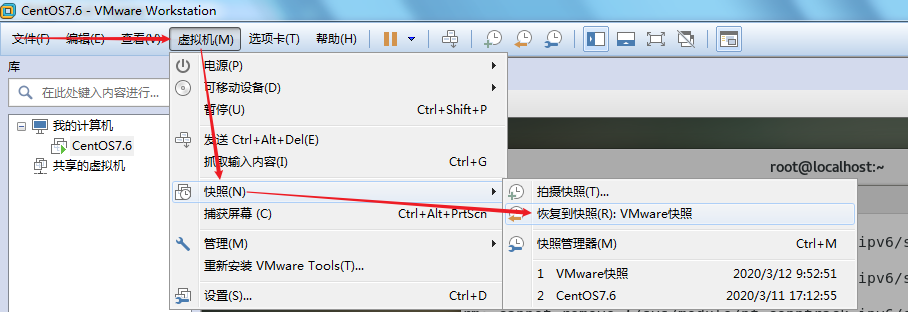

## <font style="color:rgb(51, 51, 51);">克隆</font>
<font style="color:rgb(51, 51, 51);">克隆：就是复制的意思。</font>

> <font style="color:rgb(119, 119, 119);">注意：克隆侧重长期备份，做克隆的时候是必须得关闭（了解）</font>
>

**<font style="color:rgb(51, 51, 51);">克隆：使用VMware实现克隆，具体操作步骤，参考如下</font>**

<font style="color:rgb(51, 51, 51);">第一步：使用关机按钮或相关的关机命令对Linux进行关机操作</font>


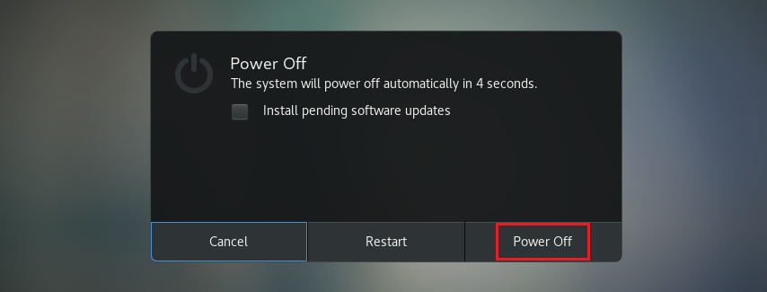

<font style="color:rgb(51, 51, 51);">第二步：在要克隆的操作系统菜单上，鼠标右键，选择管理，选择克隆</font>

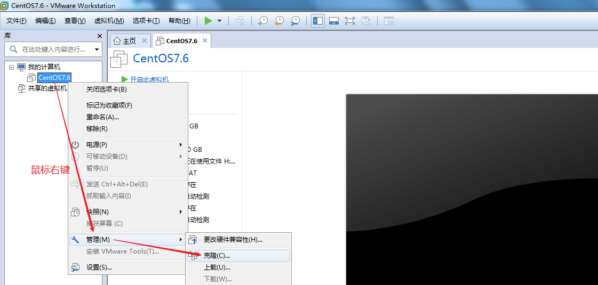

<font style="color:rgb(51, 51, 51);">第三步：根据向导进行克隆备份</font>

<font style="color:rgb(51, 51, 51);">下一步、下一步，选择克隆类型，一定要选择完整克隆</font>

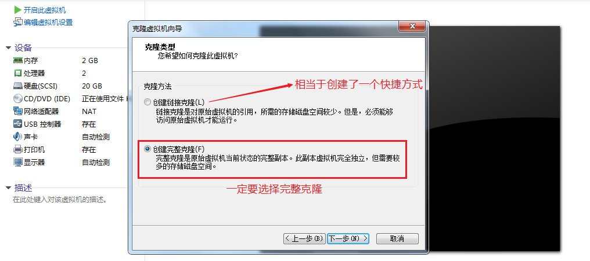

<font style="color:rgb(51, 51, 51);">设置克隆机的名称以及存储路径（此路径剩余可用空间必须>=10G）</font>

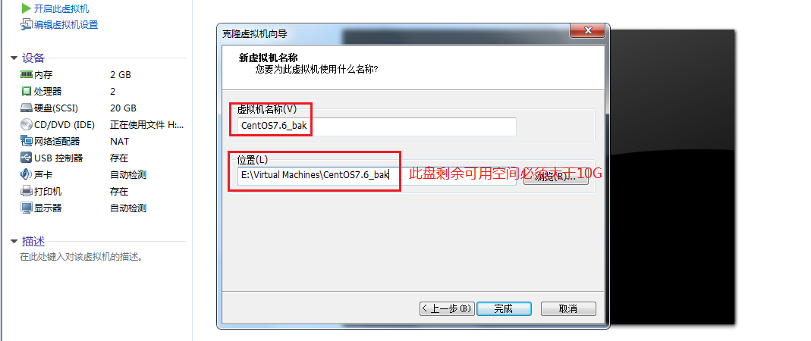

<font style="color:rgb(51, 51, 51);">克隆完成后，效果如下图所示：产生了一个全新的操作系统</font>

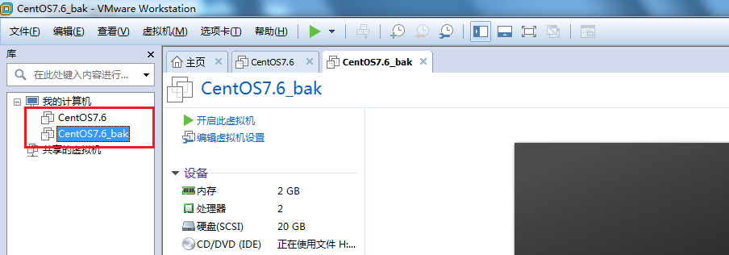

<font style="color:rgb(51, 51, 51);">克隆侧重长期备份，做克隆的时候是必须得关闭操作系统（了解）</font>

<font style="color:rgb(51, 51, 51);">应用场景：快速创建多台计算机</font>

## <font style="color:rgb(51, 51, 51);">快照与克隆的区别</font>
<font style="color:rgb(51, 51, 51);">克隆与快照的最大的区别：克隆之后是2 台机器，而快照之后依旧是1 台机器（类似windows的还原点）。后期的危险操作前建议使用快照。</font>

# <font style="color:rgb(51, 51, 51);">三、Linux系统使用注意</font>
## <font style="color:rgb(51, 51, 51);">Linux严格区分大小写</font>
```shell
Linux 和Windows不同，Linux严格区分大小写的，包括文件名和目录名、命令、命令选项、配置文件设置选项等。

例如，Win7 系统桌面上有文件夹叫做Test，当我们在桌面上再新建一个名为 test 的文件夹时，系统会提示文件夹命名冲突；
```

<font style="color:rgb(51, 51, 51);">Windows演示：</font>

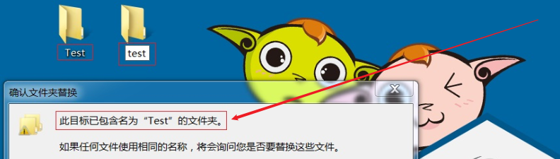

<font style="color:rgb(51, 51, 51);">Linux演示：</font>


<font style="color:rgb(51, 51, 51);">Linux 系统不会，Linux 系统认为 Test 文件和 test 文件不是同一个文件，因此在 Linux 系统中，Test文件和 test 文件可以位于同一目录下。</font>

<font style="color:rgb(51, 51, 51);">我们在操作 Linux 系统时要注意区分大小写的不同。</font>

## <font style="color:rgb(51, 51, 51);">Linux文件"扩展名"</font>
<font style="color:rgb(51, 51, 51);">我们都知道，Windows 是依赖扩展名区分文件类型的，比如，".txt" 是文本文件、".exe" 是执行文件，但 Linux 不是。 Linux 系统通过权限位标识来确定文件类型，常见的文件类型有普通文件、目录、链接文件、块设备文件、字符设备文件等几种。Linux 的可执行文件就是普通文件被赋予了可执行权限。</font>


<font style="color:rgb(51, 51, 51);">Linux 中的一些特殊文件还是要求写 "扩展名" 的，但 Linux 不依赖扩展名来识别文件类型，写这些扩展名是为了帮助运维人员来区分不同的文件类型。</font>

<font style="color:rgb(51, 51, 51);">这样的文件扩展名主要有以下几种：</font>

**<font style="color:rgb(51, 51, 51);">压缩包</font>**<font style="color:rgb(51, 51, 51);">：Linux 下常见的压缩文件名有 </font>_<font style="color:rgb(51, 51, 51);">.gz、</font>_<font style="color:rgb(51, 51, 51);">.bz2、</font>_<font style="color:rgb(51, 51, 51);">.zip、</font>_<font style="color:rgb(51, 51, 51);">.tar.gz、</font>_<font style="color:rgb(51, 51, 51);">.tar.bz2、</font>_<font style="color:rgb(51, 51, 51);">.tgz 等。 为什么压缩包一定要写扩展名呢？很简单，如果不写清楚扩展名，那么管理员不容易判断压缩包的格式，虽然有命令可以帮助判断，但是直观一点更加方便。就算没写扩展名，在 Linux 中一样可以解压缩，不影响使用。</font>

**<font style="color:rgb(51, 51, 51);">二进制软件包</font>**<font style="color:rgb(51, 51, 51);">：CentOS 中所使用的二进制安装包是 RPM 包，所有的 RPM 包都用".rpm"扩展名结尾，目的同样是让管理员一目了然。</font>

**<font style="color:rgb(51, 51, 51);">程序文件</font>**<font style="color:rgb(51, 51, 51);">：Shell 脚本一般用 ".sh" 扩展名结尾。</font>

**<font style="color:rgb(51, 51, 51);">网页文件</font>**<font style="color:rgb(51, 51, 51);">：网页文件一般使用 ".php" 等结尾，不过这是网页服务器的要求，而不是 Linux 的要求。</font>

## <font style="color:rgb(51, 51, 51);">Linux中所有内容以文件形式保存</font>
**<font style="color:rgb(51, 51, 51);">Linux中，一切皆文件</font>**

> <font style="color:rgb(119, 119, 119);">在Windows是文件的，在Linux下也是文件。在Windows中不是文件的，在Linux系统中也是文件。</font>
>

<font style="color:rgb(51, 51, 51);">问题：我们目前还没有学习权限标识符，怎么判断文件的类型呢？</font>

<font style="color:rgb(51, 51, 51);">答：可以通过文件的颜色</font>

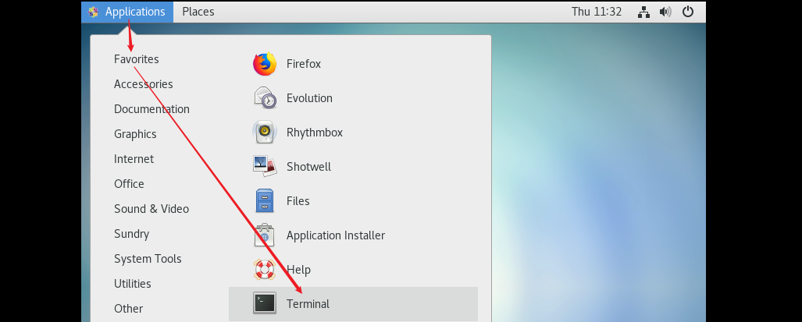

<font style="color:rgb(51, 51, 51);">然后使用ls命令，查看文件的颜色</font>

```shell
# ls
l : L的小写形式
```

<font style="color:rgb(51, 51, 51);">普通文件：通过ls命令查看时，如果显示</font><font style="color:red;">黑色</font><font style="color:rgb(51, 51, 51);">，代表其是一个普通的文件</font>

<font style="color:rgb(51, 51, 51);">文件夹：通过ls命令查看时，如果显示</font><font style="color:red;">天蓝色</font><font style="color:rgb(51, 51, 51);">，代表其是一个文件夹</font>

## <font style="color:rgb(51, 51, 51);">Linux中所有存储设备都必须在挂载之后才能使用</font>
**<font style="color:rgb(51, 51, 51);">挂载</font>**<font style="color:rgb(51, 51, 51);">其实就是给这些存储设备分配盘符，只不过 Windows 中的盘符用英文字母表示，例如c:,d:,而 Linux 中的盘符则是一个已经建立的空目录。我们把这些空目录叫作</font>**<font style="color:rgb(51, 51, 51);">挂载点</font>**<font style="color:rgb(51, 51, 51);">（可以理解为 Windows 的盘符），把设备文件（如 /dev/sdb）和挂载点（已经建立的空目录）连接的过程叫作挂载。</font>

<font style="color:rgb(51, 51, 51);">挂载过程是通过挂载命令实现的，具体的挂载命令后续会讲。</font>

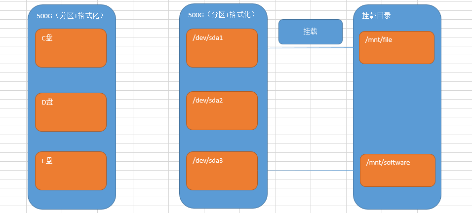

<font style="color:rgb(51, 51, 51);">Windows：分区+格式化</font>

<font style="color:rgb(51, 51, 51);">Linux操作系统：分区+格式化+挂载，存储设备必须挂载后才能使用（硬盘、光盘、U盘）</font>

> <font style="color:rgb(119, 119, 119);">mount命令： mount 空格 /dev/sda1 空格 /mnt/file</font>
>

## <font style="color:rgb(51, 51, 51);">Linux系统的文件目录结构</font>
<font style="color:rgb(51, 51, 51);">Linux 系统不同于 Windows，没有 C 盘、D 盘、E 盘那么多的盘符，只有一个根目录（/），所有的文件（资源）都存储在以根目录（/）为树根的树形目录结构中。</font>

<font style="color:rgb(51, 51, 51);">Windows：</font>

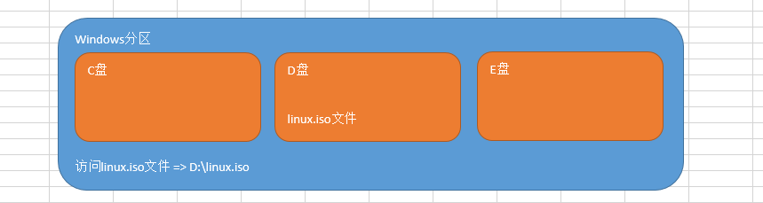

<font style="color:rgb(51, 51, 51);">Linux：</font>

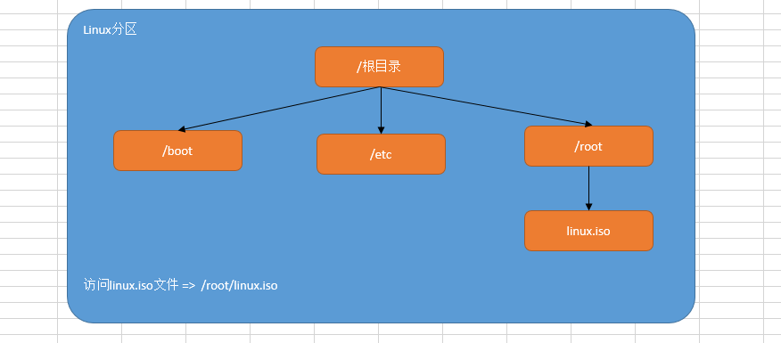

<font style="color:rgb(51, 51, 51);"></font>

**<font style="color:rgb(51, 51, 51);">Linux系统文件架构</font>**

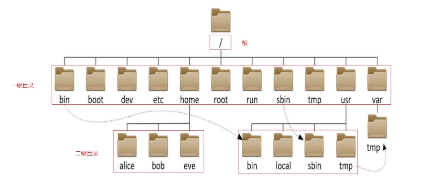

<font style="color:rgb(51, 51, 51);">在 Linux 根目录（/）下包含很多的子目录，称为一级目录。</font><font style="color:rgb(51, 51, 51);">例如 bin、boot、dev 等。</font>

<font style="color:rgb(51, 51, 51);">同时，各一级目录下还含有很多子目录，称为二级目录。例如 /bin/bash、/bin/ed 等。</font>

## <font style="color:rgb(51, 51, 51);">Linux系统的文件目录用途</font>
<font style="color:rgb(51, 51, 51);">Linux 基金会发布了 FHS （Filesystem Hierarchy Standard 文件系统层次化标准）。规定了主要文件夹的用途。</font>

| **<font style="color:rgb(51, 51, 51);">一级目录</font>** | **<font style="color:rgb(51, 51, 51);">功能（作用）</font>** |
| :--- | :--- |
| <font style="color:rgb(51, 51, 51);">/bin/</font> | <font style="color:rgb(51, 51, 51);">存放系统命令，普通用户和 root 都可以执行。放在 /bin 下的命令在单用户模式下也可以执行</font> |
| <font style="color:rgb(51, 51, 51);">/boot/</font> | <font style="color:rgb(51, 51, 51);">系统启动目录，保存与系统启动相关的文件，如内核文件和启动引导程序（grub）文件等</font> |
| <font style="color:rgb(51, 51, 51);">/dev/</font> | <font style="color:rgb(51, 51, 51);">设备文件保存位置</font> |
| <font style="color:rgb(51, 51, 51);">/etc/</font> | <font style="color:rgb(51, 51, 51);">配置文件保存位置。系统内所有采用默认安装方式（rpm 安装）的服务配置文件全部保存在此目录中，如用户信息、服务的启动脚本、常用服务的配置文件等</font> |
| <font style="color:rgb(51, 51, 51);">/home/</font> | <font style="color:rgb(51, 51, 51);">普通用户的主目录（也称为家目录）。在创建用户时，每个用户要有一个默认登录和保存自己数据的位置，就是用户的主目录，所有普通用户的主目录是在 /home/ 下建立一个和用户名相同的目录。如用户 liming 的主目录就是 /home/liming</font> |
| <font style="color:rgb(51, 51, 51);">/lib/</font> | <font style="color:rgb(51, 51, 51);">系统调用的函数库保存位置</font> |
| <font style="color:rgb(51, 51, 51);">/media/</font> | <font style="color:rgb(51, 51, 51);">挂载目录。系统建议用来挂载媒体设备，如软盘和光盘</font> |
| <font style="color:rgb(51, 51, 51);">/mnt/</font> | <font style="color:rgb(51, 51, 51);">挂载目录。早期 Linux 中只有这一个挂载目录，并没有细分。系统建议这个目录用来挂载额外的设备，如 U 盘、移动硬盘和其他操作系统的分区</font> |
| <font style="color:rgb(51, 51, 51);">/misc/</font> | <font style="color:rgb(51, 51, 51);">挂载目录。系统建议用来挂载 NFS 服务的共享目录。虽然系统准备了三个默认挂载目录 /media/、/mnt/、/misc/，但是到底在哪个目录中挂载什么设备可以由管理员自己决定。例如，笔者在接触 Linux 的时候，默认挂载目录只有 /mnt/，所以养成了在 /mnt/ 下建立不同目录挂载不同设备的习惯，如 /mnt/cdrom/ 挂载光盘、/mnt/usb/ 挂载 U 盘，都是可以的</font> |
| <font style="color:rgb(51, 51, 51);">/opt/</font> | <font style="color:rgb(51, 51, 51);">第三方安装的软件保存位置。这个目录是放置和安装其他软件的位置，手工安装的源码包软件都可以安装到这个目录中。不过笔者还是习惯把软件放到 /usr/local/ 目录中，也就是说，/usr/local/ 目录也可以用来安装软件</font> |
| <font style="color:rgb(51, 51, 51);">/root/</font> | <font style="color:rgb(51, 51, 51);">root 的主目录。普通用户主目录在 /home/ 下，root 主目录直接在“/”下</font> |
| <font style="color:rgb(51, 51, 51);">/sbin/</font> | <font style="color:rgb(51, 51, 51);">保存与系统环境设置相关的命令，只有 root 可以使用这些命令进行系统环境设置，但也有些命令可以允许普通用户查看</font> |
| <font style="color:rgb(51, 51, 51);">/srv/</font> | <font style="color:rgb(51, 51, 51);">服务数据目录。一些系统服务启动之后，可以在这个目录中保存所需要的数据</font> |
| <font style="color:rgb(51, 51, 51);">/tmp/</font> | <font style="color:rgb(51, 51, 51);">临时目录。系统存放临时文件的目录，在该目录下，所有用户都可以访问和写入。建议此目录中不能保存重要数据，最好每次开机都把该目录清理</font> |


<font style="color:rgb(51, 51, 51);">FHS 针对根目录中包含的子目录仅限于上表，但除此之外，Linux 系统根目录下通常还包含下面几个一级目录。</font>

| **<font style="color:rgb(51, 51, 51);">一级目录</font>** | **<font style="color:rgb(51, 51, 51);">功能（作用）</font>** |
| :--- | :--- |
| <font style="color:rgb(51, 51, 51);">/lost+found/</font> | <font style="color:rgb(51, 51, 51);">当系统意外崩溃或意外关机时，产生的一些文件碎片会存放在这里。在系统启动的过程中，fsck 工具会检查这里，并修复已经损坏的文件系统。这个目录只在每个分区中出现，例如，/lost+found 就是根分区的备份恢复目录，/boot/lost+found 就是 /boot 分区的备份恢复目录</font> |
| <font style="color:rgb(51, 51, 51);">/proc/</font> | <font style="color:rgb(51, 51, 51);">虚拟文件系统。该目录中的数据并不保存在硬盘上，而是保存到内存中。主要保存系统的内核、进程、外部设备状态和网络状态等。如 /proc/cpuinfo 是保存 CPU 信息的，/proc/devices 是保存设备驱动的列表的，/proc/filesystems 是保存文件系统列表的，/proc/net 是保存网络协议信息的......</font> |
| <font style="color:rgb(51, 51, 51);">/sys/</font> | <font style="color:rgb(51, 51, 51);">虚拟文件系统。和 /proc/ 目录相似，该目录中的数据都保存在内存中，主要保存与内核相关的信息</font> |


# <font style="color:rgb(51, 51, 51);">四、Linux命令入门</font>
## <font style="color:rgb(51, 51, 51);">开启终端</font>
<font style="color:rgb(51, 51, 51);">问题：后期Linux 服务器都是以纯命令行的形式运行的，那在桌面模式下是否有命令输入的地方？</font>

<font style="color:rgb(51, 51, 51);">答：有，可以使用终端输入命令，在顶部单击应用程序菜单，选择系统工具，选择终端即可。</font>


<font style="color:rgb(51, 51, 51);">打开后，效果如下图所示：</font>

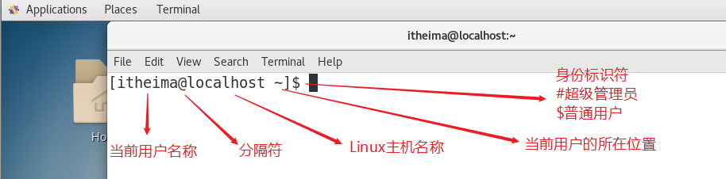

## <font style="color:rgb(51, 51, 51);">命令与选项</font>
<font style="color:rgb(51, 51, 51);">什么是Linux 的命令？</font>

<font style="color:rgb(51, 51, 51);">答：就是指在Linux 终端（命令行）中输入的内容就称之为命令。</font>

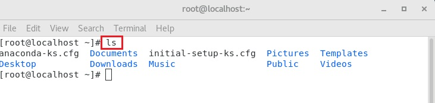

<font style="color:rgb(51, 51, 51);">一个完整的命令的标准格式：Linux 通用的格式</font>

<font style="color:rgb(51, 51, 51);">#命令（空格） [选项]（空格）[参数]</font>

```shell
#ls

#ls -l

#tail -n 3 readme.txt
```

<font style="color:rgb(51, 51, 51);">注意：后期被"[]"包裹的表示该项为可选项，可写可不写，具体得看需要一个命令可以包含多个选项。操作对象也可以是多个。</font>

## <font style="color:rgb(51, 51, 51);">Linux命令补全</font>
<font style="color:rgb(51, 51, 51);">键盘上有一个按键：Tab键</font>


<font style="color:rgb(51, 51, 51);">当我们在Linux系统的终端中，输入命令时，可以无需完整的命令，只需要记住命令的前几个字母即可，然后按Tab键，系统会自动进行补全操作。</font>

```shell
# syst + Tab键
# systemc + Tab键
# systemctl
```

<font style="color:rgb(51, 51, 51);">有些命令可能都以某几个字母开头，这个时候，只需要按两次Tab键，其就会显示所有命令。</font>

```shell
# clea + Tab键 + Tab键
```

> <font style="color:rgb(119, 119, 119);">Tab键的功能特别强大：其不仅可以补全命令还可以补全Linux的文件路径</font>
>

# <font style="color:rgb(51, 51, 51);">五、Linux基础命令</font>
## <font style="color:rgb(51, 51, 51);">切换用户命令</font>
<font style="color:rgb(51, 51, 51);">基本语法：</font>

```shell
# su - root
Password:123456
[root@localhost ~]# 切换成功
```

> <font style="color:rgb(119, 119, 119);">扩展：-横杠作用是什么？答：-横杠代表切换用户的同时，切换用户的家目录</font>
>

## <font style="color:rgb(51, 51, 51);">uname查看操作系统信息</font>
<font style="color:rgb(51, 51, 51);">命令：uname [选项]</font>

<font style="color:rgb(51, 51, 51);">作用：获取计算机操作系统相关信息</font>

<font style="color:rgb(51, 51, 51);">参数：-a，选项-a代表all，表示获取全部的系统信息（类型、全部主机名、内核版本、发布时间、开源计划）</font>

```shell
用法一：直接输入uname 或者 uname -a
示例代码：
# uname
# uname -a
含义：获取操作系统的信息
```

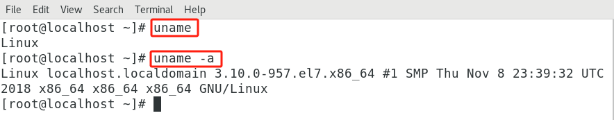

## <font style="color:rgb(51, 51, 51);">ls命令</font>
### <font style="color:rgb(51, 51, 51);">用法一</font>
<font style="color:rgb(51, 51, 51);">主要功能：ls完整写法list show，以平铺的形式显示当前目录下的文件信息</font>

<font style="color:rgb(51, 51, 51);">基本语法：</font>

```shell
# ls
```


### <font style="color:rgb(51, 51, 51);">用法二</font>
<font style="color:rgb(51, 51, 51);">主要功能：显示其他目录下的文件信息</font>

```shell
# ls 其他目录的绝对路径或相对路径
```

> <font style="color:rgb(119, 119, 119);">扩展：ls后面跟的路径既可以是绝对路径也可以是相对路径</font>
>

**<font style="color:rgb(51, 51, 51);">绝对路径</font>**<font style="color:rgb(51, 51, 51);">：不管当前工作路径是在哪，目标路径都会从“/”磁盘根下开始。案例：访问lhp用户的家目录，查看有哪些文件</font>

```shell
# ls /home/lhp
```

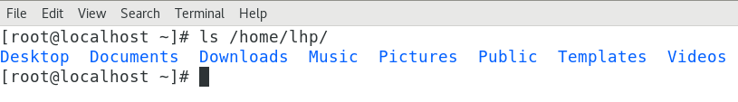

<font style="color:red;">绝对路径必须以左斜杠开头，一级一级向下访问，不能越级</font>

<font style="color:rgb(51, 51, 51);"></font>

**<font style="color:rgb(51, 51, 51);">相对路径</font>**<font style="color:rgb(51, 51, 51);">：除绝对路径之外的路径称之为相对路径，相对路径得有一个相对物（当前工作路径）。</font>

<font style="color:rgb(51, 51, 51);">只要看到路径以“/”开头则表示该路径是绝对路径，除了以“/”开头的路径称之为相对路径。</font>

<font style="color:rgb(51, 51, 51);">当前位置：/home/lhp目录下</font>

<font style="color:rgb(51, 51, 51);">../：表示上级目录（上一级）</font>

<font style="color:rgb(51, 51, 51);">./ ：表示当前目录（同级），普通文件./可以省略，可执行文件（绿色）必须加./</font>

<font style="color:rgb(51, 51, 51);">文件夹名称/：表示下级目录（下一级），注意这个斜杠/</font>

### <font style="color:rgb(51, 51, 51);">用法三</font>
<font style="color:rgb(51, 51, 51);">基本语法：</font>

```shell
# ls [选项] [路径]
选项说明：
-l ：ls -l，代表以详细列表的形式显示当前或其他目录下的文件信息(简写命令=>ll)
-h ：ls -lh，通常与-l结合一起使用，代表以较高的可读性显示文件的大小(kb/mb/gb)
-a ：ls -a，a是all缩写，代表显示所有文件（也包含隐藏文件=>大部分以.开头）
```

<font style="color:rgb(51, 51, 51);">计算机中的单位：</font>

```shell
# 1TB = 1024GB
# 1GB = 1024MB
# 1MB = 1024KB
# 1KB（千字节） = 1024B（字节）
```


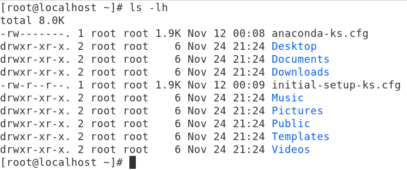


## <font style="color:rgb(51, 51, 51);">pwd命令</font>
<font style="color:rgb(51, 51, 51);">主要功能：pwd=print working directory，打印当前工作目录（告诉我们，我们当前位置）</font>

<font style="color:rgb(51, 51, 51);">基本语法：</font>

```shell
# pwd
```


## <font style="color:rgb(51, 51, 51);">cd命令</font>
<font style="color:rgb(51, 51, 51);">主要功能：cd全称change directory，切换目录（从一个目录跳转到另外一个目录）</font>

<font style="color:rgb(51, 51, 51);">基本语法：</font>

```shell
# cd [路径]
选项说明：
路径既可以是绝对路径，也可以是相对路径
```

<font style="color:rgb(51, 51, 51);">案例一：切换到/usr/local这个程序目录</font>

```shell
# cd /usr/local
```

<font style="color:rgb(51, 51, 51);">案例二：比如我们当前在/home/lhp下，切换到根目录/下</font>

```shell
# cd /home/lhp
# cd ../../
```

<font style="color:rgb(51, 51, 51);">案例三：当我们在某个路径下，如何快速回到自己的家目录</font>

```shell
# cd
或
# cd ~
```

## <font style="color:rgb(51, 51, 51);">clear命令</font>
<font style="color:rgb(51, 51, 51);">主要功能：清屏</font>

<font style="color:rgb(51, 51, 51);">基本语法：</font>

```shell
# clear
```

## <font style="color:rgb(51, 51, 51);">whoami命令</font>
<font style="color:rgb(51, 51, 51);">作用：用户获取当前用户的用户名</font>

```shell
用法：直接输入whoami回车
示例代码：
# whoami
含义：获取当前用户的用户名
```

## <font style="color:rgb(51, 51, 51);">reboot命令</font>
<font style="color:rgb(51, 51, 51);">主要功能：立即重启计算机</font>

<font style="color:rgb(51, 51, 51);">基本语法：</font>

```shell
# reboot
```

## <font style="color:rgb(51, 51, 51);">shutdown命令</font>
<font style="color:rgb(51, 51, 51);">主要功能：立即关机或延迟关机</font>

<font style="color:rgb(51, 51, 51);">立即关机基本语法：</font>

```shell
# shutdown -h 0或now
# shutdown -h 0
# shutdown -h now
选项说明：
-h ：halt缩写，代表关机
```

> <font style="color:rgb(119, 119, 119);">在Linux系统中，立即关机除了使用shutdown -h 0以外还可以使用halt -p命令</font>
>

<font style="color:rgb(51, 51, 51);">延迟关机基本语法：</font>

```shell
# shutdown -h 分钟数
代表多少分钟后，自动关机
```

<font style="color:rgb(51, 51, 51);">案例1：10分钟后自动关机</font>

```shell
# shutdown -h 10
```

<font style="color:rgb(51, 51, 51);">案例2：后悔了，取消关机</font>

```shell
光标一直不停的闪，取消关机
# 按Ctrl + C（CentOS6，中断关机。CentOS7中还需要使用shutdown -c命令）
# shutdown -c
```

## <font style="color:rgb(51, 51, 51);">type命令</font>
<font style="color:rgb(51, 51, 51);">主要功能：主要用来结合help命令，用于判断命令的类型（属于内部命令还是外部命令）</font>

<font style="color:rgb(51, 51, 51);">基本语法：</font>

```shell
# type 命令
内部命令：命令 is a shell builtin
外部命令：没有显示以上信息的就是外部命令
```

## <font style="color:rgb(51, 51, 51);">history命令</font>
<font style="color:rgb(51, 51, 51);">主要功能：显示系统以前输入的前1000条命令</font>

<font style="color:rgb(51, 51, 51);">基本语法：</font>

```shell
# history
```

## <font style="color:rgb(51, 51, 51);">hostnamectl命令</font>
<font style="color:rgb(51, 51, 51);">主要功能：用于设置计算机的主机名称（给计算机起个名字），此命令是CentOS7新增的命令。</font>

<font style="color:rgb(51, 51, 51);">hostnamectl ： hostname + control</font>

### <font style="color:rgb(51, 51, 51);">获取计算机的主机名称</font>
```shell
# hostname	CentOS6
# hostnamectl  CentOS7
```

### <font style="color:rgb(51, 51, 51);">设置计算机的主机名称</font>
<font style="color:rgb(51, 51, 51);">Centos7中主机名分3类，静态的（static）、瞬态的（transient）和灵活的（pretty）。</font>

<font style="color:rgb(51, 51, 51);">① 静态static主机名称：电脑关机或重启后，设置的名称亦然有效</font>

<font style="color:rgb(51, 51, 51);">② 瞬态transient主机名称：临时主机名称，电脑关机或重启后，设置的名称就失效了</font>

<font style="color:rgb(51, 51, 51);">③ 灵活pretty主机名称：可以包含一些特殊字符</font>

<font style="color:rgb(51, 51, 51);">CentOS 7中和主机名有关的文件为/etc/hostname，它是在系统初始化的时候被读取的，并且内核根据它的内容设置瞬态主机名。</font>

> <font style="color:rgb(119, 119, 119);">更改主机名称，让其永久生效？① 使用静态的 ② 改/etc/hostname文件</font>
>

#### <font style="color:rgb(51, 51, 51);">瞬态主机名称（临时设置）</font>
```shell
# hostnamectl --transient set-hostname 主机名称
主机名称 建议遵循 FQDN协议（功能+公司域名）
web01.lhp.cn
web02.lhp.cn
mysql.lhp.cn
```

<font style="color:rgb(51, 51, 51);">案例：临时设置主机名称为yunwei.lhp.cn</font>

```shell
# hostnamectl --transient set-hostname yunwei.itcast.cn
# su 立即生效
```

#### <font style="color:rgb(51, 51, 51);">静态主机名称（永久生效）</font>
```shell
# hostnamectl --static set-hostname 主机名称
温馨提示：--static也可以省略不写
```

<font style="color:rgb(51, 51, 51);">案例：把计算机的主机名称永久设置为yunwei.lhp.cn</font>

```shell
# hostnamectl --static set-hostname yunwei.lhp.cn
# su 立即生效
```

#### <font style="color:rgb(51, 51, 51);">灵活主机名称（主机名称可以添加特殊字符）</font>
```shell
# hostnamectl --pretty set-hostname 主机名称（包含特殊字符）
```

<font style="color:rgb(51, 51, 51);">案例：把计算机的主机名称通过灵活设置，设置为yunwei's server01</font>

```shell
# hostnamectl --pretty set-hostname "yunwei's server01"
查看灵活的主机名称
# hostnamectl --pretty
```


> 更新: 2025-07-03 15:20:03  
> 原文: <https://www.yuque.com/u41736172/az9urv/ciqivygoxn2t7kx0>