# 02.ELK日志分析系统

# <font style="color:rgb(51, 51, 51);">任务背景</font>

<font style="color:rgb(51, 51, 51);">运维人员需要对系统和业务日志进行精准把控，便于分析系统和业务状态。日志分布在不同的服务器上，传统的使用传统的方法依次登录每台服务器查看日志，既繁琐又效率低下。所以我们需要</font>**<font style="color:rgb(51, 51, 51);">集中化</font>**<font style="color:rgb(51, 51, 51);">的日志管理工具将</font>**<font style="color:rgb(51, 51, 51);">位于不同服务器上的日志收集到一起，然后进行分析，展示</font>**<font style="color:rgb(51, 51, 51);">。</font>

<font style="color:rgb(51, 51, 51);">前面我们学习过 rsyslog，它就可以实现集中化的日志管理，可是 rsyslog 集中后的日志实现统计与检索又成了一个问题。使用wc，grep，awk 等相关命令可以实现统计与检索，但如果要求更高的场景，这些命令也会力不从心。所以我们需要一套专业的日志收集分析展示系统。</font>

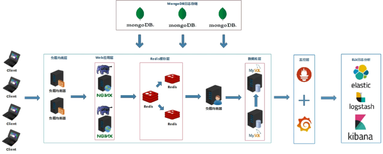

现在有几个新的需求：

问题1：老板提出需要网站1个月的 PV 和 UV 数据，时间周期可能会变动！

问题2：LB 负载均衡把一个网站的日志数据分到了多个 RealServer ，你需要先合并在统计!

问题3：统计出来的数据应该尽量使用图形化的方法来展示，更有说服力?

***

基于以上需求，我们需要有专门的日志分析系统，如 ELK、EFK 或 ELFK。

ELK = Elasticsearch(NoSQL) + LogStash(采集工具) + Kibana(日志分析工具)

EFK = Elasticsearch(NoSQL) + Filebeat(轻量级采集工具) + Kibana(日志分析工具)

ELFK = Elasticsearch(NoSQL) + LogStash(负责日志清洗) + Filebeat(轻量级采集工具) + Kibana(日志分析工具)

***

数据库运维/数据库 DBA = MySQL + Oracle + Redis + MongoDB+ Elasticsearch + 一款国产数据库(TiDB、达梦、高斯)

LogStash 类似之前学习的 Fluentd、Rsyslog

Kibana 类似之前学习的 GoAccess

# <font style="color:rgb(51, 51, 51);">任务要求</font>

1. <font style="color:rgb(51, 51, 51);">搭建 ELK 集群</font>
2. <font style="color:rgb(51, 51, 51);">收集日志信息并展示</font>

# <font style="color:rgb(51, 51, 51);">任务拆解</font>

1. <font style="color:rgb(51, 51, 51);">认识 ELK</font>
2. <font style="color:rgb(51, 51, 51);">部署 elasticsearch 集群并了解其基本概念</font>
3. <font style="color:rgb(51, 51, 51);">安装 elasticsearch-head 实现图形化操作</font>
4. <font style="color:rgb(51, 51, 51);">安装 logstash 收集日志</font>
5. <font style="color:rgb(51, 51, 51);">安装 kibana 日志展示</font>
6. <font style="color:rgb(51, 51, 51);">安装 file beat 实现轻量级日志收集</font>

# <font style="color:rgb(51, 51, 51);">学习目标</font>

* 能够说出 ELK 的应用场景
* 能够区分 ELK 架构中 elasticsearch、logstash、kibina 三个软件各自的主要功能
* 能够单机部署 elasticsearch
* 能够部署 elasticsearch 集群
* 理解 ELK 中索引的概念
* 能够部署 logstash
* 能够使用 logstash 做日志采集
* 能够部署 kibana 并连接 elasticsearch 集群
* 能够通过 kibana 查看 elasticsearch 索引信息知道用 flebeat 收集日志相对于 logstash 的优点
* 能够安装 filebeat
* 能够使用 filebeat 收集日志并传输给 logstash 进行清洗转换

# 一、ELK 概述

## ELK 介绍

<font style="color:rgb(51, 51, 51);">ELK 是一套开源的日志分析系统，由 elasticsearch+logstash+Kibana 组成。</font>

<font style="color:rgb(51, 51, 51);">官网说明：</font>[<font style="color:rgb(65, 131, 196);">https://www.elastic.co/cn/products</font>](https://www.elastic.co/cn/products)

<font style="color:rgb(51, 51, 51);">首先：先一句话简单了解 E、L、K 这三个软件</font>

<font style="color:rgb(51, 51, 51);">elasticsearch: 分布式搜索引擎</font>

<font style="color:rgb(51, 51, 51);">logstash: 日志收集与过滤，输出给 elasticsearch</font>

<font style="color:rgb(51, 51, 51);">Kibana: 图形化展示</font>

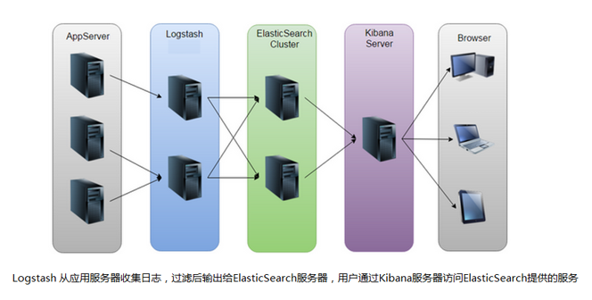

<font style="color:rgb(51, 51, 51);">elk 下载地址:</font>[<font style="color:rgb(65, 131, 196);">https://www.elastic.co/cn/downloads</font>](https://www.elastic.co/cn/downloads)

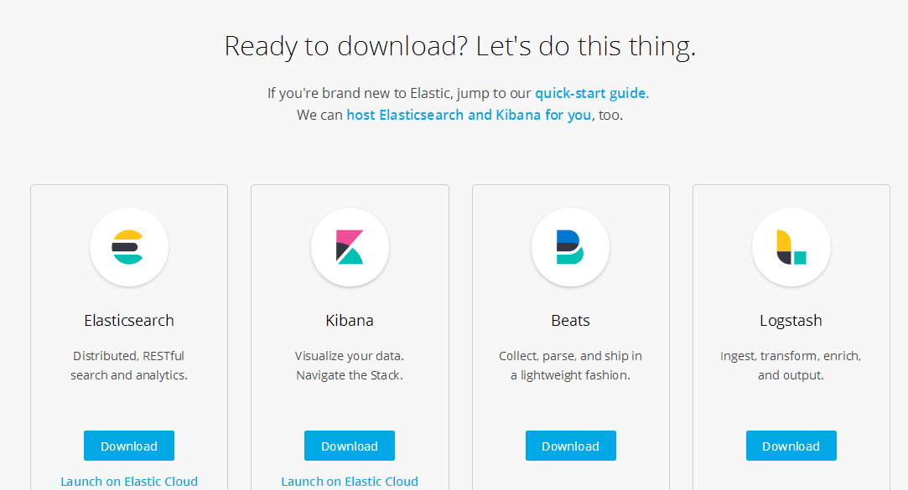

## 环境准备

| 编号 | IP | 主机名 | 作用 |
| --- | --- | --- | --- |
| 1 | 192.168.126.211 | kibana.lhp.cn | kibana 服务器 |
| 2 | 192.168.126.212 | es.lhp.cn | es 服务器 |
| 3 | 192.168.126.213 | logstash.lhp.cn | logstash 服务器 |
| 4 | 192.168.126.214 | filebeat.lhp.cn | filebeat 服务器 |

第一步：克隆 4 台机器，顺便改了 MAC 地址


第二步：修改 IP 地址，主机名

第三步：绑定 hosts 文件

第四步：关闭防火墙、SELinux

第五步：时间同步

第六步：安装必备软件

# 二、ElasticSearch 部署

## ES 单节点部署

<font style="color:rgb(51, 51, 51);">第1步：在 elasticsearch 服务器上，确认 jdk (使用系统自带的 </font>**<font style="color:rgb(51, 51, 51);">openjdk </font>**<font style="color:rgb(51, 51, 51);">就 OK)</font>

```shell
[root@es ~]# java -version
openjdk version "1.8.0_362"
OpenJDK Runtime Environment (build 1.8.0_362-b08)
OpenJDK 64-Bit Server VM (build 25.362-b08, mixed mode)
```

<font style="color:rgb(51, 51, 51);">第2步：es 的安装，配置（使用资料中提供的安装包即可）</font>

```shell
[root@es ~]# wget https://artifacts.elastic.co/downloads/elasticsearch/elasticsearch-6.5.2.rpm
[root@es ~]# dnf -y install elasticsearch-8.16.0-x86_64.rpm
```

<font style="color:rgb(51, 51, 51);">第3步：单机 es 的配置与服务启动</font>

```yaml
[root@es ~]# cat /etc/elasticsearch/elasticsearch.yml | egrep -v "#|^$"
cluster.name: my-cluster
node.name: 192.168.126.212
path.data: /var/lib/elasticsearch
path.logs: /var/log/elasticsearch
network.host: 0.0.0.0
http.port: 9200
xpack.security.enabled: false
xpack.security.enrollment.enabled: true
xpack.security.http.ssl:
  enabled: false
  keystore.path: certs/http.p12
xpack.security.transport.ssl:
  enabled: false
  verification_mode: certificate
  keystore.path: certs/transport.p12
  truststore.path: certs/transport.p12
http.host: 0.0.0.0
transport.port: 9300
discovery.type: single-node

整个ES的配置文件就上面这些内容，其他的不需要动。文件中有一行内容一定要注释掉：
# cluster.initial_master_nodes: ["localhost"]

ES是用Java开发的，启动特别慢，很占用内存
[root@es ~]# systemctl start elasticsearch
[root@es ~]# systemctl enable elasticsearch


启动有点慢和卡,稍等1分钟左右,查看到以下端口则表示启动OK
[root@es ~]# netstat -tnlp | grep java
tcp6       0      0 :::9300                 :::*                    LISTEN      1748/java
tcp6       0      0 :::9200                 :::*                    LISTEN      1748/java

9200则是数据传输端口
9300端口是集群通信端口(我们暂时还没有配置集群,现在是单点elasticsearch)
```

<font style="color:rgb(51, 51, 51);">第4步：查看状态</font>

<font style="color:rgb(51, 51, 51);">使用 curl 命令或浏览器访问 </font>[<font style="color:rgb(65, 131, 196);">http://192.168.126.212:9200/\_cluster/health?pretty</font>](http://10.1.1.12:9200/_cluster/health?pretty)<font style="color:rgb(51, 51, 51);"> 地址(IP 为 ES 服务器IP)</font>

```shell
[root@es ~]# curl http://192.168.126.212:9200/_cluster/health?pretty
{
  "cluster_name" : "my-cluster",
  "status" : "green",			表示ES没问题！
  "timed_out" : false,
  "number_of_nodes" : 1,
  "number_of_data_nodes" : 1,
  "active_primary_shards" : 0,
  "active_shards" : 0,
  "relocating_shards" : 0,
  "initializing_shards" : 0,
  "unassigned_shards" : 0,
  "unassigned_primary_shards" : 0,
  "delayed_unassigned_shards" : 0,
  "number_of_pending_tasks" : 0,
  "number_of_in_flight_fetch" : 0,
  "task_max_waiting_in_queue_millis" : 0,
  "active_shards_percent_as_number" : 100.0
}

记住uri关键命令：_cluster表示集群，health代表健康情况，pretty代表格式化输出
```

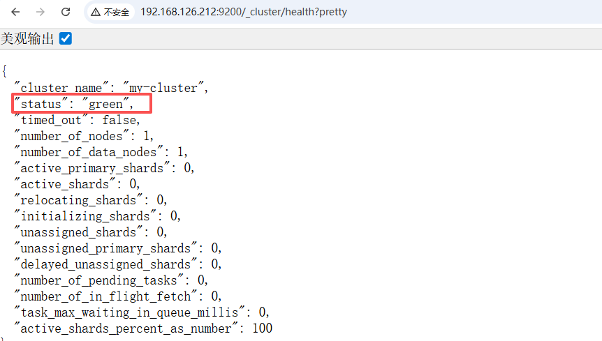

## ES 集群部署

集群部署主要注意以下几个方面

集群配置参数：

* 节点发现机制
* ES 8.x 默认使用 Cluster Coordination Service（CCS）进行节点发现和集群形成，替代了之前的 Zen Discovery
* 配置项：

```shell
# 指定初始master节点（集群首次启动时必须配置）
cluster.initial_master_nodes:
  - node1
  - node2
  - node3

# 配置主机发现列表（推荐静态设置）
discovery.seed_hosts:
  - 192.168.126.211
  - 192.168.126.212
  - 192.168.126.213
  - 192.168.126.214
  - 192.168.126.215
  - 192.168.126.216

# 设置发现时等待超时时间（默认30秒，可调整）
discovery.find_peers_interval: 30s
```

避免脑裂问题：

* 为了防止脑裂（split-brain）现象，需要设置以下参数：

```shell
# 集群中需要选举master的最少节点数，推荐(N / 2) + 1
cluster.voting_only_nodes: 3

--------------------------------------------------------------------------------
这表示集群中设置了3个“仅投票节点”(voting-only nodes)。这些节点不作为master候选，只参与master选举的投票过程。
1. 什么是master选举的最小节点数？
ES的master选举依赖仲裁机制，推荐设置最小master数为(N / 2) + 1，其中N是投票节点（包含master-eligible节点和voting-only节点）的总数。
node.roles: [master]		# 主节点

2. voting_only_nodes是什么？
这些节点：
不会当选为master（即使master节点宕机，它们不会接管）
只用于维持集群仲裁，提高选举容错能力
node.roles: [voting_only]	# 投票节点
```

集群节点设置

ES 8.x 支持以下节点类型，建议按业务需求分配：

* master 节点：负责集群管理和协调，建议单独部署
* data 节点：存储和处理索引数据
* coordinating 节点（仅协调节点）：用于客户端负载均衡（选用场景）
* Ingest 节点：用于预处理数据

```shell
# master节点
node.master: true
node.data: false
node.ingest: false
node.roles: [ "master" ]

# data节点
node.master: false
node.data: true
node.ingest: false
node.roles: [ "data" ]
```

注意：

* master 节点与 data 节点分离：master 需保证稳定性，data 节点可能因高 IO 负载而不稳定
* 数量建议：建议至少 3 个 master 节点（避免脑裂），data 节点根据数据量规划

内存设置：

* ES 默认堆内存大小为 1GB，需要根据实际业务进行调整：

```shell
# 比如服务器内存为32GB，设置堆内存大小为系统内存的一半，但不能超过32GB
export ES_JAVA_OPTS="-Xms16g -Xmx16g"
```

修改配置文件

```shell
# vim /etc/elasticsearch/jvm.options
...
-Xms16g
-Xmx16g
```

注意：

* 堆内存分配过大会导致垃圾回收延迟过高，建议不超过 32GB
* JVM 预留的直接内存大小可以通过 `-XX:MaxDirectMemorySize`参数调整

硬盘空间规划

* 数据路径
* ES 的数据默认存储在 `/var/lib/elasticsearch`，可以通过配置文件修改：

```shell
path.data: /var/lib/elasticsearch
path.logs: /var/log/elasticsearch
```

磁盘性能优化

* 挂载高性能存储（如 NVMe SSD）
* 启用数据压缩

```shell
index.codec: best_compression
```

配置磁盘分层存储（冷热分层）：在集群中配置冷热节点，热节点处理实时写入，冷接点处理长期存储：

```shell
node.roles: [ "data_hot" ]	# 热节点
node.roles: [ "data_cold" ] # 冷节点
```

网络与监听设置

配置 ES 接收外部连接：

```shell
# 允许http客户端从任何地方访问（生产环境需限制）
http.host: 0.0.0.0
# 配置传输层监听所有节点
transport.host: 0.0.0.0
```

配置参考文档：<https://www.elastic.co/guide/en/elasticsearch/reference/index.html>

首先在 ES 集群所有节点都安装 ES（步骤省略）

可以使用两台或两台以上 ES 做集群，以下就是两台 ES 做集群的配置

**<font style="background-color:#FBDE28;">ES master：（是上面的 es 服务器，212 服务器）</font>**

```shell
# dnf -y install elasticsearch-8.16.0-x86_64.rpm
# cat /etc/elasticsearch/elasticsearch.yml | egrep -v "#|^$"
cluster.name: my-cluster
node.name: 192.168.126.212
path.data: /var/lib/elasticsearch
path.logs: /var/log/elasticsearch
network.host: 0.0.0.0
http.port: 9200
xpack.security.enabled: false
xpack.security.enrollment.enabled: true
xpack.security.http.ssl:
  enabled: false
  keystore.path: certs/http.p12
xpack.security.transport.ssl:
  enabled: false
  verification_mode: certificate
  keystore.path: certs/transport.p12
  truststore.path: certs/transport.p12
http.host: 0.0.0.0
transport.port: 9300
discovery.seed_hosts: ["192.168.126.211", "192.168.126.212"]
cluster.initial_master_nodes: ["192.168.126.212"]
# 集群模式中，一定要注释这一行
# discovery.type: single-node
```

**<font style="background-color:#FBDE28;">ES data：（使用上面的 kibana 服务器，211 服务器）和上面的配置一样！</font>**

```shell
# dnf -y install elasticsearch-8.16.0-x86_64.rpm
# cat /etc/elasticsearch/elasticsearch.yml | egrep -v "#|^$"
cluster.name: my-cluster
node.name: 192.168.126.211
path.data: /var/lib/elasticsearch
path.logs: /var/log/elasticsearch
network.host: 0.0.0.0
http.port: 9200
xpack.security.enabled: false
xpack.security.enrollment.enabled: true
xpack.security.http.ssl:
  enabled: false
  keystore.path: certs/http.p12
xpack.security.transport.ssl:
  enabled: false
  verification_mode: certificate
  keystore.path: certs/transport.p12
  truststore.path: certs/transport.p12
http.host: 0.0.0.0
transport.port: 9300
discovery.seed_hosts: ["192.168.126.211", "192.168.126.212"]
cluster.initial_master_nodes: ["192.168.126.212"]
# 集群模式中，一定要注释这一行
# discovery.type: single-node
```

启动或重启服务

```shell
[root@es ~]# systemctl restart elasticsearch
[root@es ~]# systemctl enable elasticsearch

[root@kibana ~]# systemctl restart elasticsearch
[root@kibana ~]# systemctl enable elasticsearch
```

查看状态，浏览器输入地址：<http://192.168.126.212:9200/_cluster/health?pretty>

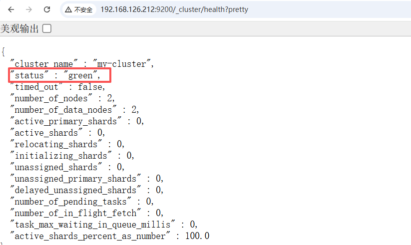

## ES 基础概念

主要的基础概念有：Node、Index、Type、Document、Field、shard 和 replicas。

Node（节点）：运行单个 ES 实例的服务器

Cluster（集群）：一个或多个节点构成集群

Index（索引）：索引是多个文档的集合（办公室的柜子）

Type（类型）：一个 Index 可以定义一种或多种类型，将 Document 逻辑分组（柜子中文件夹，每个文件夹放置不同类型资料）

Document（文档）：Index 里面每条记录成为 Document，若干文档构建一个 Index（相当于文件夹中具体的资料，类似一张 A4 纸）

Field（字段）：ES 存储的最小单元（一张 A4 纸有很多列，每一列就相当于一个 Field）

Shards（分片）：ES 将 Index 分为若干份，每一份就是一个分片（办公室中有很多柜子）

Replicas（副本）：Index 的一份或多份副本（相当于对柜子中的数据进行备份）

为了便于理解，我们和 MySQL 这种关系型数据库做一个对比：

| 关系型数据库（MySQL、Oracle 等） | ES |
| --- | --- |
| database 或 schema | index |
| table | type |
| row | document |
| column 或 field | field |

ES 是分布式搜索引擎，每个索引有一个或多个分片（shard），索引的数据被分配到各个分片上。你可以看作是一份数据分成了多份给不同的节点。

当 ES 集群增加或删除节点时，shard 会在多个节点中均衡分配。默认是 5 个 primary shard（主分片）和 1 个 replica shard（副本，用于容错）。

# 三、ES 基本 API 操作（重点、记住）

前面我们通过 <http://192.168.126.212:9200/_cluster/health?pretty> 查看 ES 集群状态，其实就是它的一种 API 操作。

> 什么是 API？
>
> API（Application Programming Interface）应用程序编程接口，就是无需访问程序源码或理解内部工作机制就能实现一些相关功能的接口。

所谓的 API 就是日常生活中的 URL 地址 => 别人编写好程序或代码，我们不需要了解其底层原理，只需要通过 URL 获取数据即可。通常返回数据格式有两种：XML 格式与 JSON 格式。

## RestFul API 格式

```shell
# curl -X<verb> '<protocol>://<host>:<port>/<path>?<query_string>' -d '<body>'
```

| 参数 | 描述 |
| --- | --- |
| verb | http 方法，比如：get、post、put、delete、head 等 |
| host | ES 集群中的任意节点主机名 |
| port | ES HTTP 服务端口，默认 9200 |
| path | 索引路径 |
| query\_string | 可选的查询请求参数。例如 ?pretty 参数将返回 json 格式数据 |
| -d | data 缩写，里面放一个 json 格式请求主体 |
| body | 自己写的 json 格式的请求主体 |

ES 的 API 有很多，我们运维人员主要用到以下几个要介绍的较简单的 API。

更多 API 参考：https://www.elastic.co/guide/en/elasticsearch/reference/8.17/index.html

## 查看节点信息

通过 curl 或浏览器访问：http://192.168.126.212:9200/\_cat/nodes?v（ip 为 ES 节点 IP，如果有 ES 集群，则为 ES 任意节点 IP）

```shell
[root@es ~]# curl http://192.168.126.212:9200/_cat/nodes?v

说明：在ES中，_cat 是"cat API"的入口，用于以人类可读的格式展示集群、索引、节点等状态信息。
```

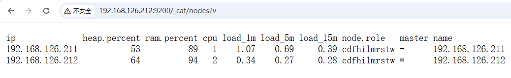

> curl 就是 Linux 命令行浏览器，没有界面，通过命令方式发起 HTTP 请求，既可以 GET、也可以是 POST，还可以是 PUT。
>
> curl http://www.baidu.com，以 http get 请求方式访问 www.baidu.com
>
> curl -X POST http://www.baidu.com/login.php

## 查看索引信息

通过 crul 或浏览器访问 <http://192.168.126.212:9200/_cat/indices?v>

```shell
[root@es ~]# curl http://192.168.126.212:9200/_cat/indices?v
health status index uuid pri rep docs.count docs.deleted store.size pri.store.size dataset.size
默认现在没有任何索引
```

## 新增索引

```shell
[root@es ~]# curl -X PUT http://192.168.126.212:9200/nginx_access_log
{"acknowledged":true,"shards_acknowledged":true,"index":"nginx_access_log"}

[root@es ~]# curl http://192.168.126.212:9200/_cat/indices?v
health status index            uuid                   pri rep docs.count docs.deleted store.size pri.store.size dataset.size
green  open   nginx_access_log pSYg1NF0Td-0NW59jBLyFQ   1   1          0            0       454b           227b         227b
```

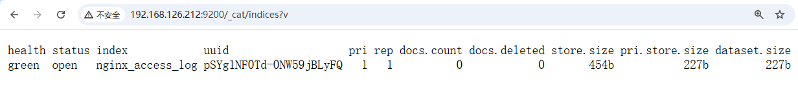

关键字段说明：

health：索引状态（是否监控）

index：索引名称

pri：主分片个数

rep：副本个数

count：索引中 document 的个数

***

green：所有的主分片和副本分片都已分配，你的集群是 100%可用的。

yellow：所有的主分片已经分片了，但至少还有一个副本是缺失的。不会有数据丢失，所以搜索结果依然是完整的。不过，你的高可用性在某种程度上被弱化。如果更多的分片消失，你就会丢数据。把 yellow 想象成一个需要及时调查的警告。

rea：至少一个主分片（以及它的全部副本）都在缺失中。这意味着你在缺少数据：搜索只能返回部分数据，而已分配到这个分片上的写入请求会返回一个异常。

## 删除索引

```shell
[root@es ~]# curl -X DELETE http://192.168.126.212:9200/nginx_access_log
{"acknowledged":true}
```

普及一个概念：

说明：ES 中主节点与数据节点关系和之前学习的 MySQL/Redis 中主从关系有所不同。

**主节点（master node）：**

* 负责管理和协调整个集群
* 决定如何分配数据
* 通常不负责处理数据的存储和搜索

**数据节点（data node）：**

* 实际存储数据和执行搜索操作
* 处理所有数据的增删改查请求

在小型或测试环境中，一个节点可能既是主节点也是数据节点。但在更复杂的环境中，主节点和数据节点通常是分开的，以确保效率和稳定性。主节点关注管理，而数据节点负责数据。

## ES 查询语句

ES 提供一种可用于执行查询 JSON 式的语言，被称为 Query DSL。

其实就是一个 url 地址 + JSON 数据格式 => Query DSL

> 针对 ES 的操作，可以分为增删改查四个动作。

查询匹配条件：

* match\_all
* from，size
* match
* bool
* range

查询应用案例：

导入数据源

使用官方提供的示例数据：

第一步：下载并导入进 ES 中

```shell
[root@es ~]# ll accounts.json
-rw-r--r-- 1 root root 242848 12月 19 08:52 accounts.json

导入数据到ES中
[root@es ~]# curl -H "Content-Type:application/x-ndjson" -XPOST "192.168.126.212:9200/bank/_bulk" --data-binary "@accounts.json"

查询确认
[root@es ~]# curl http://192.168.126.212:9200/_cat/indices?v
health status index uuid                   pri rep docs.count docs.deleted store.size pri.store.size dataset.size
green  open   bank  35K55XOwT0GgPiUfRM7tmg   1   1       1000            0    777.1kb        387.5kb      387.5kb

说明：
_bulk 是ES的REST API路径的一部分，意思是“批量处理”。适用于需要一次提交多条数据的场景，比如导入大批数据、批量更新文档等。批量操作可以显著提高性能，避免一次一条数据的发送http请求。
```

> 在操作 ES 的路径中，\_ 开头的单词都是 ES 内部提供的。

第二步：查询 bank 索引的数据（使用查询字符串进行查询）

RestFul：所有内容聚集在同一个 url 中

```shell
[root@es ~]# curl -X GET "http://192.168.126.212:9200/bank/_search?q=*&sort=account_number:asc&pretty"

说明：
默认结果为10条
_search 属于一类API，用于执行查询操作
q=* ES批量索引中的所有文档
sort=account_number:asc 表示根据account_number按升序对结果排序
pretty 调整显示格式
```

**第三步：查询 bank 索引的数据（使用 json 格式进行查询）=> 推荐使用**

Query DSL 风格：通过 json 来实现数据查询操作

Query DSL 文档：https://www.elastic.co/guide/en/elasticsearch/reference/8.16/query-dsl.html

```shell
[root@es ~]# curl \
  -X GET "http://192.168.126.212:9200/bank/_search?pretty" \
  -H 'Content-Type:application/json' \
  -d '
    {
      "query":{"match_all":{}},
      "sort":[
        {"account_number":"asc"}
      ]
    }
  '

说明：
-X GET 请求方法
API接口：http://192.168.126.212:9200/bank/_search?pretty，注意pretty表示期望返回结果为json格式数据
-H 请求头，告诉服务器我发送的数据是什么格式
-d data缩写，代表要请求的数据

注意：在Linux终端中，空格 + \，代表这条语句还没有编写结束，下面的一行也是这个命令的一部分。
```

问题：怎么将上面 json 格式进行 pretty 查询？

https://www.elastic.co/guide/en/elasticsearch/reference/current/query-filter-context.html

***

查询匹配动作及案例：

**match\_all**

* 匹配所有文档，默认查询
* 示例：查询所有，默认只返回 10 个文档

```shell
[root@es ~]# curl \
  -X GET "http://192.168.126.212:9200/bank/_search?pretty" \
  -H 'Content-Type:application/json' \
  -d '
    {
      "query":{
          "match_all":{}
      }
    }
  '

  query告诉我们查询什么
  match_all是我们查询的类型
  match_all查询仅仅在指定的索引的所有文件进行搜索
```

> select \* from bank

**from, size**

* 除了 query 参数外，还可以传递其他参数影响查询结果，比如前面提到的 sort，接下来使用的 size

```shell
[root@es ~]# curl -X GET "http://192.168.126.212:9200/bank/_search?pretty" \
  -H "Content-Type:application/json"
  -d '
      {
        "query":{"match_all":{}},
        "size":1
      }
  '

查询1条数据
```

指定位置与查询条件

```shell
[root@es ~]# curl -X GET "http://192.168.126.212:9200/bank/_search?pretty" \
  -H 'Content-Type:application/json' \
  -d '
    {
      "query":{"match_all":{}},
      "from":0,
      "size":2
    }
  '

from 0 表示从第1个开始
size 指定查询的个数
```

> 类比于 SQL，相当于 limit，只有 size => select \* from bank limit size; 既有 from，也有 size => select \* from bank limit from, size; 默认情况下，from 从 0 开始。

实例：查询 account\_number 从第 501 条到 510 条的数据

```shell
# curl \
  -X GET "http://192.168.126.212:9200/bank/_search?pretty" \
  -H 'Content-Type:application/json' \
  -d '
    {
      "query":{"match_all":{}},
      "from":500,
      "size":10,
      "sort":[
          {"account_number":"asc"}
      ]
    }
  ' 2> /dev/null | grep account_number
```

**匹配查询字段**

* 返回 \_source（内置）字段中的片段字段

```shell
# curl \
  -X GET "http://192.168.126.212:9200/bank/_search?pretty" \
  -H 'Content-Type:application/json' \
  -d '
    {
      "query":{"match_all":{}},
      "_source":["account_number", "balance"]
    }
  '
```

> 类比 SQL：select \* from bank; => \_source => select \_source 列出的字段 from bank;

**match**

* 基本搜索查询，针对特定字段或字段集合进行搜索（类似**模糊匹配**，底层基于全文搜索）

查询编号为 20 的账户

```shell
# curl \
  -X GET "http://192.168.126.212:9200/bank/_search?pretty" \
  -H 'Content-Type:application/json' \
  -d '
    {
      "query":{"match":{"account_number":20}}
    }
  '

特殊：match默认属于模糊匹配，但是如果是数字类型的匹配，相当于精准匹配，只有查询值为字符串类型，则相当于模糊匹配。
```

返回地址中包含 mill 的账户

```shell
# curl -X GET "http://192.168.126.212:9200/bank/_search?pretty" \
  -H 'Content-Type:application/json' \
  -d '
    {
      "query":{"match":{"address":"mill"}}
    }
  '
```

**term**

* 基本搜索查询，针对特定字段或字段集合进行搜索（类似精准匹配）

```shell
# curl \
  -X GET "http://192.168.126.212:9200/bank/_search?pretty" \
  -H 'Content-Type:application/json' \
  -d '
    {
      "query":{"term":{"account_number":20}}
    }
  '
```

问题：返回地址中包含 mill 或 lane 的所有账户：

```shell
# curl \
  -X GET "http://192.168.126.212:9200/bank/_search?pretty" \
  -H 'Content-Type:application/json' \
  -d '
    {
      "query":{"match":{"address":"mill"}}
    }
  '
```

> match 和 term 都属于匹配，适合于文本匹配（不适用于数字），match 擅长模糊匹配，只要指定字段包含搜索关键字即展示，term 属于精准匹配，匹配指定字段必须 = 搜索关键字

**bool**

```shell
bool must 查询的字段必须同时存在，must等价于and
查询包含mill和lane的所有账户

# curl \
  -X GET "http://192.168.126.212:9200/bank/_search?pretty" \
  -H 'Content-Type:application/json' \
  -d '
    {
      "query":{
          "bool": {
              "must":[
                {"match":{"address":"mill"}},
                {"match":{"address":"lane"}}
              ]
          }
      }
    }
  '


bool should 查询的字段仅存在一个即可，should 等价于 or
查询包含mill或者lane的所有账户
# curl \
  -X GET "http://192.168.126.212:9200/bank/_search?pretty" \
  -H 'Content-Type:application/json' \
  -d '
    {
      "query":{
        "bool":{
          "should":[
            {"match":{"address":"mill"}},
            {"match":{"address":"lane"}}
          ]
        }
      }
    }
  '
```

**range**

* 指定区间内的数字或者时间
* 操作符：gt 大于，gte 大于等于，lt 小于，lte 小于等于

```shell
查询余额大于或等于20000且小于等于30000的账户
# curl \
  -X GET "http://192.168.126.212:9200/bank/_search?pretty" \
  -H 'Content-Type:application/json' \
  -d '
    {
      "query":{
        "bool":{
          "must": {"match_all":{}},
          "filter":{
            "range": {
              "balance":{
                "gte":20000,
                "lte":30000
              }
            }
          }
        }
      }
    }
  '
```

> 类比于 SQL 语句，类似比较运算符以及 between...and 操作，filter 相当于 where 查询语句

## 扩展：AI 大模型带你玩转 ES 查询

如何设计提示词，让 AI 更懂你？

1. 尽量给 AI 搜索进行分类，相同类型的放在一起查询（也就是在同一个网页中就问同一类型问题，要问别的问题就再开一个网页）
2. 给 AI 一个角色定位，提前喂一些数据，规定大模型返回的数据格式（这样可以让大模型的回答更加精准）

***

参考：

提示：你是一个 ELK 运维工程师，擅长 ELK 搭建、分析以及 ES DSL 查询操作

提示：查看 bank 索引中前 10 条记录，然后安装 account\_num 进行升序排列

提示：记住数据集以及我们使用习惯

> 用 kimi 试试好使不。

```json
记住：索引叫bank，数据参考如下：
[
  {
    "_index" : "bank",
    "_id" : "49",
    "_score" : 1.0,
    "_source" : {
      "account_number" : 49,
      "balance" : 29104,
      "firstname" : "Fulton",
      "lastname" : "Holt",
      "age" : 23,
      "gender" : "F",
      "address" : "451 Humboldt Street",
      "employer" : "Anocha",
      "email" : "fultonholt@anocha.com",
      "city" : "Sunriver",
      "state" : "RI"
    }
  },
  {
    "_index" : "bank",
    "_id" : "102",
    "_score" : 1.0,
    "_source" : {
      "account_number" : 102,
      "balance" : 29712,
      "firstname" : "Dena",
      "lastname" : "Olson",
      "age" : 27,
      "gender" : "F",
      "address" : "759 Newkirk Avenue",
      "employer" : "Hinway",
      "email" : "denaolson@hinway.com",
      "city" : "Choctaw",
      "state" : "NJ"
    }
  },
  {
    "_index" : "bank",
    "_id" : "133",
    "_score" : 1.0,
    "_source" : {
      "account_number" : 133,
      "balance" : 26135,
      "firstname" : "Deena",
      "lastname" : "Richmond",
      "age" : 36,
      "gender" : "F",
      "address" : "646 Underhill Avenue",
      "employer" : "Sunclipse",
      "email" : "deenarichmond@sunclipse.com",
      "city" : "Austinburg",
      "state" : "SC"
    }
  }
]

平时查询时使用的语法如下：
# curl \
  -X GET "http://192.168.126.212:9200/bank/_search?pretty" \
  -H 'Content-Type:application/json' \
  -d '
    {
      "query":{
        "bool":{
          "must": {"match_all":{}},
          "filter":{
            "range":{
              "balance":{
                "gte":20000,
                "lte":30000
              }
            }
          }
        }
      }
    }
'
```

# 四、ElasticSearch-head 与 cerebro

## ElasticSearch-head

说明：功能类似 cerebro，只不过它是浏览器插件版。其实就是一个可视化的管理 ES 的客户端工具！

第一步：下载插件，资料中已经提供（科学上网，到 Google 商店）

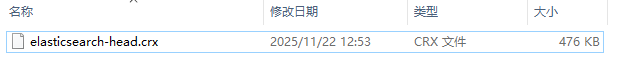

第二步：打开 Google Chrome 浏览器，找到扩展程序管理，如下图


第三步：打开开发者模式


第四步：拖拽插件到浏览器中，安装后如下图所示


第五步：点击插件，输入 ES 集群信息

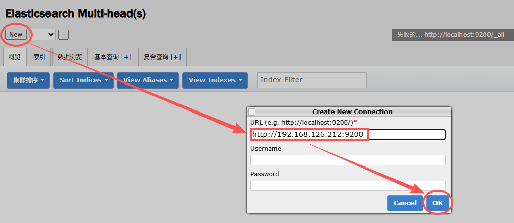

连接成功后，如下图所示

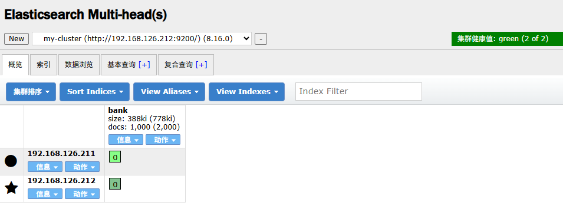

***

简单实用：

查看 ES 中目前的索引有哪些：（也就是数据库有哪些）

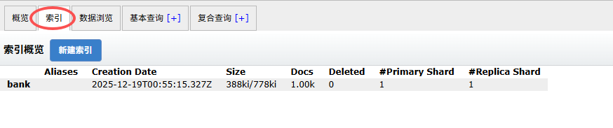

新建一个索引：

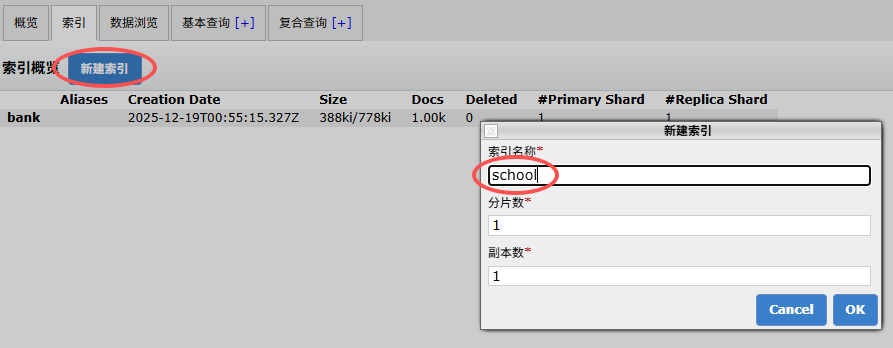

基本的查询：

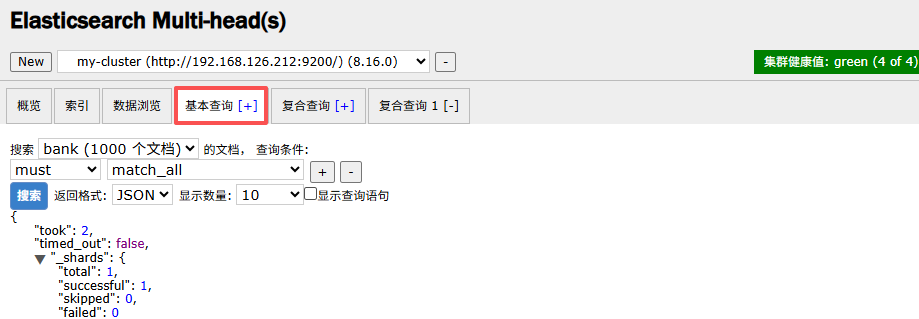

复杂的查询：里面就可以通过我们 AI 生成的语句去查询

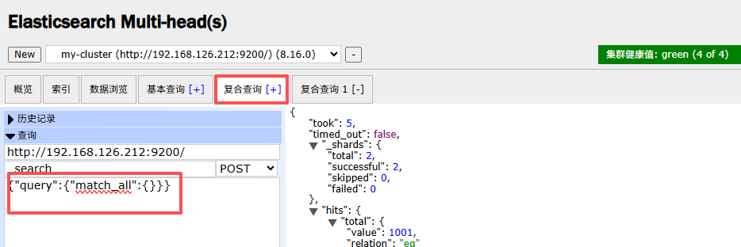

## Cerebro 工具

### Cerebro 介绍

Cerebro 是一个开源的 ES 集群管理工具，提供了直观的 web 界面，用于监控和管理 ES 集群。它是轻量级的、功能强大的工具，适合开发和生产环境中的 ES 管理工作。

### 配置 JDK

```shell
# sudo yum -y install java-1.8.0-openjdk

配置JDK环境变量
# sudo alternatives --config java
```

### 安装 cererbo

使用资料中提供的即可。

```shell
# wget https://github.com/lmenezes/cerebro/releases/download/v0.9.4/cerebro-0.9.4.tgz

# tar -xf cerebro-0.9.4.tgz
# cd cerebro-0.9.4
```

### 配置 cerebro

打开 conf/application.conf 文件：

```shell
# vim conf/application.conf
```

配置 cerebro 添加 ES 集群

```shell
70行 hosts = [
    {
        host = "http://192.168.126.212:9200"
        name = "My ES Cluster"
    }
]
```

启动 cerebro

```shell
# ./bin/cerebro
```

打开浏览器，输入 http://IP 地址:9000/，如下图所示

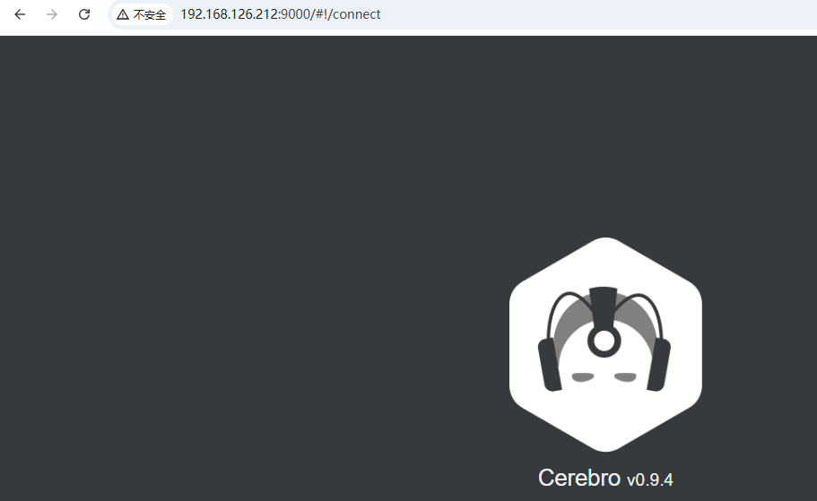

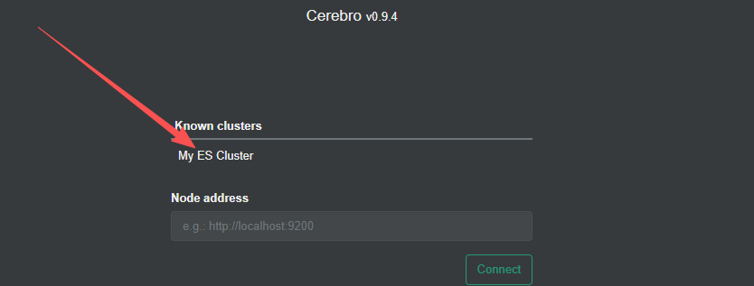

### cerebro 基本使用

获取集群信息：

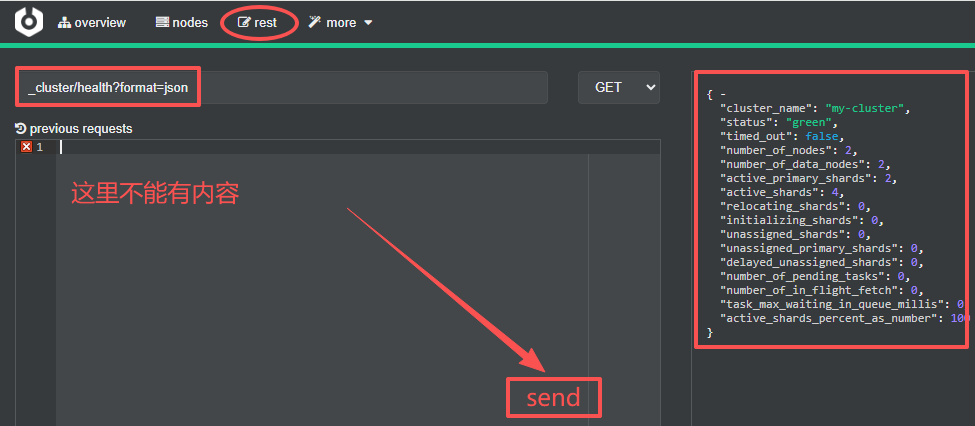

创建索引：

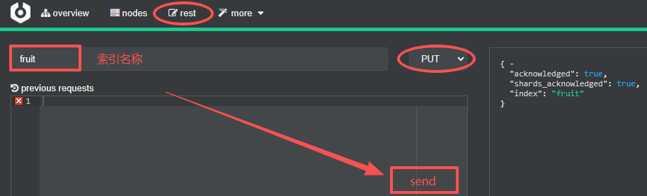

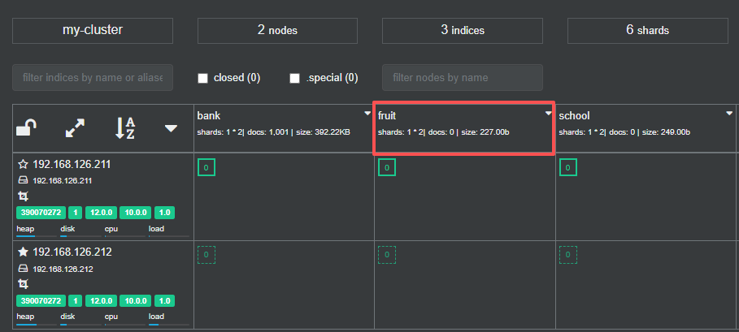

DSL 查询：

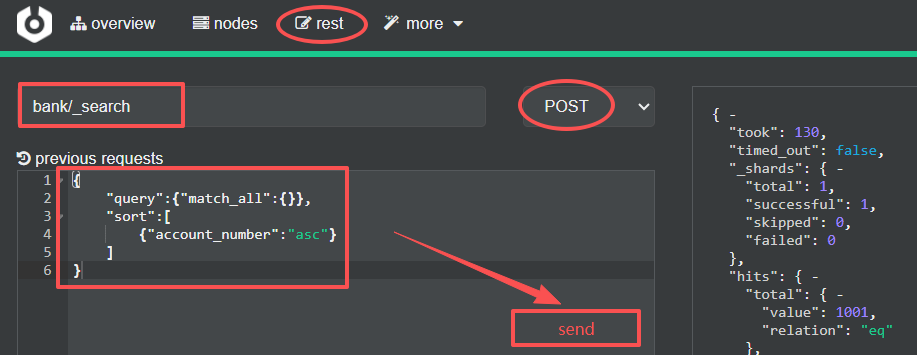

我们上面写的 DSL 语句都可以在这里写！

# 五、logstash

## logstash 简介

logstash 是一个开源的数据采集工具，通过数据源采集数据。然后进行过滤，并自定义格式输出到目的地。

数据分为：

1. 结构化数据，如：MySQL 数据库里的表等
2. 半结构化数据，如：xml、yaml、json 等
3. 非结构化数据，如：文档、图片、音频、视频等

logstash 可以采集任何格式的数据，当然我们这里主要是讨论采集系统日志、服务日志等日志类型数据。

官方产品介绍：https://www.elastic.co/cn/products/logstash

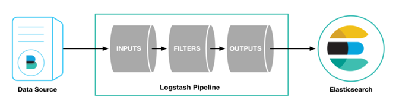

<font style="color:rgb(51, 51, 51);">input 插件: 用于导入日志源 (</font>**<font style="color:rgb(51, 51, 51);">配置必须</font>**<font style="color:rgb(51, 51, 51);">) </font>

[<font style="color:rgb(65, 131, 196);">https://www.elastic.co/guide/en/logstash/current/input-plugins.html</font>](https://www.elastic.co/guide/en/logstash/current/input-plugins.html)

<font style="color:rgb(51, 51, 51);">filter 插件: 用于过滤(</font>**<font style="color:rgb(51, 51, 51);">不是配置必须的</font>**<font style="color:rgb(51, 51, 51);">) => 对采集到的数据进行清洗以及过滤操作</font>

[<font style="color:rgb(65, 131, 196);">https://www.elastic.co/guide/en/logstash/current/filter-plugins.html</font>](https://www.elastic.co/guide/en/logstash/current/filter-plugins.html)

<font style="color:rgb(51, 51, 51);">output 插件: 用于导出(</font>**<font style="color:rgb(51, 51, 51);">配置必须</font>**<font style="color:rgb(51, 51, 51);">) </font>

[<font style="color:rgb(65, 131, 196);">https://www.elastic.co/guide/en/logstash/current/output-plugins.html</font>](https://www.elastic.co/guide/en/logstash/current/output-plugins.html)

## logstash 部署

在 logstash 服务器上确认 openjdk 安装

```shell
logstash# java -version
```

在 logstash 服务器上安装 logstash

下载地址：https://www.elastic.co/downloads/past-releases/logstash-8-16-0

使用资料中提供的即可：

```shell
logstash# rpm -ivh logstash-8.16.0-x86_64.rpm
```

配置 logstash 主配置文件

```shell
logstash# cat /etc/logstash/logstash.yml | grep -Ev '#|^$'
path.data: /var/lib/logstash
path.config: /etc/logstash/conf.d/	# 打开注释，并加上配置目录路径
api.http.host: 192.168.126.213			# 打开注释，并改为本机IP
path.logs: /var/log/logstash
```

启动测试

```shell
logstash# cd /usr/share/logstash/bin
使用下面的空输入和空输出启动测试一下
logstash# ./logstash -e 'input {stdin {}} output {stdout {}}'
运行后，输入字符将被stdout作为标准输出内容输出
logstash插件配置格式：
{
    input {
        stdin {}
    }

    output {
        stdout {}
    }
}
```

运行结果：

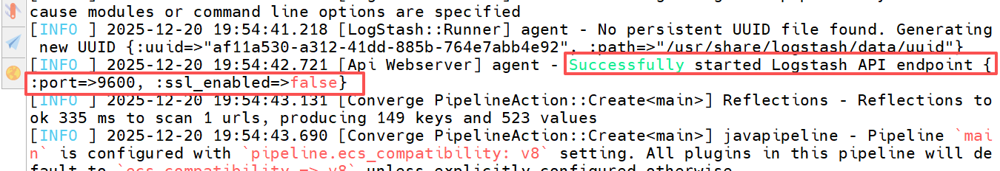

说明启动成功。然后我们在终端输入一些内容，logstash 就会捕获到，然后再直接给我们输出！

关闭启动

测试能启动成功后，ctrl + c 取消，则关闭了 logstash。

> 怎样知道一个软件安装到哪里了？（使用 rpm 或者 yum 安装的方式）
>
> 通过 `rpm -ql 软件包名`的方式可以查看该软件安装完之后产生了哪些文件，就可以看到安装目录。

***

另一种验证方法：pipeline 配置文件编写与校验

第一步：编写配置文件

```shell
logstash# vim /etc/logstash/conf.d/test.conf
input {
    stdin {
    }
}

filter {
}

output {
    stdout {
            codec => rubydebug				
    }
}

说明：
input中stdin就是采集标准输入，也就是终端的输入
filter就是对采集的输入进行处理
output就是将处理完的结果输出，stdout指的是标准输出，也就是输出到终端
codec => rubydebug这句可写可不定,默认就是这种输出方式
```

第二步：检测配置文件语法是否正确

```shell
logstash# cd /usr/share/logstash/bin
logstash# ./logstash --path.settings /etc/logstash -f /etc/logstash/conf.d/test.conf -t

......
Config Validation Result: OK. Exiting Logstash

--path.settings 指定logstash主配置文件目录
-f 指定片段配置文件
-t 测试配置文件是否正确
```

第三步：启动 logstash（logstash 启动特别耗内存，而我们内存又很小，所以多等一会！启动会比较慢）

```shell
logstash# ./logstash --path.settings /etc/logstash -r -f /etc/logstash/conf.d/test.conf
......

haha
{
    "@timestamp" => 2019-07-02T10:40:10.839Z,
       "message" => "haha",
          "host" => "vm3.cluster.com",
      "@version" => "1"
}
hehe
{
    "@timestamp" => 2019-07-02T10:40:11.794Z,
       "message" => "hehe",
          "host" => "vm3.cluster.com",
      "@version" => "1"
}

-r参数很强大,会动态装载配置文件,也就是说启动后,可以不用重启修改配置文件
```

## <font style="color:rgb(51, 51, 51);">日志采集</font>

### <font style="color:rgb(51, 51, 51);">采集 messages 日志</font>

logstash 配置文件，如 test.conf、messages.conf，专业名词来说叫做 pipeline（logstash）

<font style="color:rgb(51, 51, 51);">这里以 /var/log/messages 为例，让 logstash 进行日志采集，只定义 input 输入和 output 输出，不考虑过滤。最终将输出的日志输出到 ES 中！</font>

```shell
# 定义配置文件
logstash# cd /usr/share/logstash/bin
logstash# vim /etc/logstash/conf.d/messages.conf
input {
    file {
        path => "/var/log/messages"
        start_position => "beginning"
    }
}

output {
    elasticsearch{
        hosts => ["http://192.168.126.212:9200"]
        index => "messages-%{+YYYY.MM.dd}"
    }
}


# 启动logstash开始采集日志，注意先把之前启动的给停止掉！！！
logstash# nohup ./logstash --path.settings /etc/logstash/ -r -f /etc/logstash/conf.d/messages.conf &

后台运行如果要杀掉,请使用pkill java或ps查看PID再kill -9清除
```

**<font style="color:rgb(51, 51, 51);">请自行练习验证</font>**<font style="color:rgb(51, 51, 51);">：</font>

<font style="color:rgb(51, 51, 51);">第一步：在 logstash 服务器上做一些操作（比如：重启下 crond 服务等），让 /var/log/messages 有新的日志信息，然后通过cerebro 或者 es-head 验证 ES 集群中的数据。</font>

<font style="color:rgb(51, 51, 51);">结果：会自动更新，浏览器刷新就能在 cerebro 上看到更新的数据。</font>

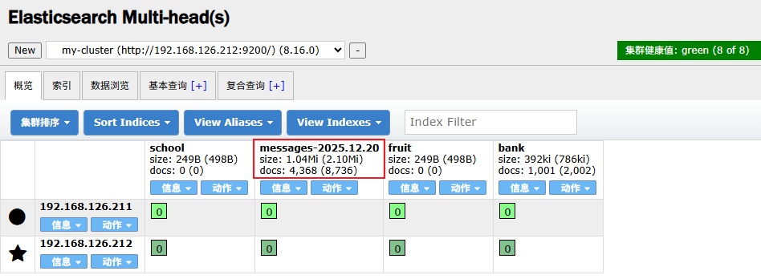

<font style="color:rgb(51, 51, 51);">第二步：kill 掉 logstash 进程（相当于关闭），也做一些操作让 /var/log/messages 日志有更新，然后再次启动 logstash。</font>

<font style="color:rgb(51, 51, 51);">结果：会自动连上 es 集群，es-head 里也能查看到数据的更新。</font>

### <font style="color:rgb(51, 51, 51);">采集多日志源</font>

我们使用 logstash 同时采集 messages.log 和 dnf.log 的日志信息，最终输出到 ES 服务器中。

```shell
# 定义配置文件
logstash# vim /etc/logstash/conf.d/test.conf
input {
    file {
        path => "/var/log/messages"
        start_position => "beginning"
        type => "messages"
    }

    file {
        path => "/var/log/dnf.log"
        start_position => "beginning"
        type => "dnf"
    }
}

filter {

}

output {
    if [type] == "messages" {
        elasticsearch {
            hosts => ["http://192.168.126.212:9200"]
            index => "messages-%{+YYYY-MM-dd}"
        }
    }

    if [type] == "dnf" {
        elasticsearch {
            hosts => ["http://192.168.126.212:9200"]
            index => "dnf-%{+YYYY-MM-dd}"
        }
    }
}

# 检测上面的配置文件是否有语法问题
logstash# ./logstash --path.settings /etc/logstash -f /etc/logstash/conf.d/test.conf -t

# 启动logstash开始采集，注意先把之前启动的给停止掉！！！
logstash# nohup ./logstash --path.settings /etc/logstash/ -r -f /etc/logstash/conf.d/test.conf  &
```

验证结果：

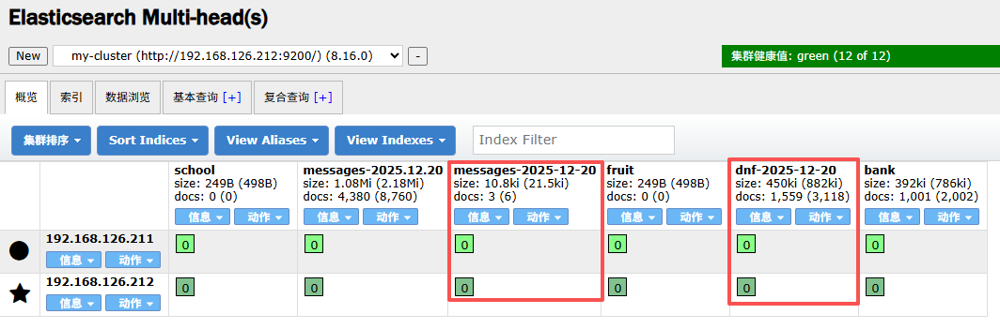

## logstash 插件安装（先不用做，后面用到再做）

我们经常用 logstash 采集 Nginx 的访问日志，获取到客户端的 IP 地址，然后可以根据 IP 地址获取到该 IP 对应的归属地！

通过 IP 地址获取归属地需要使用 logstash 的插件。下面是安装插件的步骤：

```shell
# cd /usr/share/logstash/bin
# ./logstash-plugin install logstash-filter-geoip
# ./logstash-plugin install logstash-filter-mutate
# ./logstash-plugin install logstash-filter-useragent

注：如果加载过慢，则更换国内ruby源
# yum -y install ruby
# gem sources --remove https://rubygems.org/
# gem sources --add https://mirrors.aliyun.com/rubygems/
# gem sources -l
```

放置 GeoLite2-City.mmdb 数据库到 /etc/logstash 目录（资料中已提供该数据库文件）

```shell
# ll /etc/logstash/GeoLite2-City.mmdb
```

> 这个插件：主要用于 IP 地址转 City，功能有二：① 可以把 IP 转经纬度 ② 可以把 IP 转换为具体城市，如背景、巴黎等。

# 六、kibana

## kibana 介绍

<font style="color:rgb(51, 51, 51);">Kibana 是一个开源的可视化平台，可以为 ElasticSearch 集群的管理提供友好的 Web 界面，帮助汇总，分析和搜索重要的日志数据。</font>

<font style="color:rgb(51, 51, 51);">文档路径：</font>[<font style="color:rgb(65, 131, 196);">https://www.elastic.co/guide/en/kibana/current/setup.html</font>](https://www.elastic.co/guide/en/kibana/current/setup.html)

## <font style="color:rgb(51, 51, 51);">kibana 部署</font>

<font style="color:rgb(51, 51, 51);">第 1 步: 在 kibana 服务器上安装 kibana</font>

<font style="color:rgb(51, 51, 51);">下载地址：</font>[<font style="color:rgb(65, 131, 196);">https://www.elastic.co/downloads/past-releases#kibana</font>](https://www.elastic.co/downloads/past-releases#kibana)

安装之前，建议把 Kibana 服务器内存调整为 6-8G 左右。

```shell
# 使用资料中提供的软件包
kibana# rpm -ivh kibana-8.16.0-x86_64.rpm 
```

第 2 步：配置 kibana

```yaml
kibana# cat /etc/kibana/kibana.yml | grep -Ev '#|^$'
server.port: 5601 # 端口号
server.host: "0.0.0.0"	# 监听所有，允许所有人能访问
elasticsearch.hosts: ["http://192.168.126.212:9200"]
logging:
  appenders:
    file:
      type: file
      fileName: /var/log/kibana/kibana.log
      layout:
        type: json
  root:
    appenders:
      - default
      - file
pid.file: /run/kibana/kibana.pid
```

第 3 步：启动 kibana 服务

```shell
kibana# systemctl start kibana
kibana# systemctl enable kibana

# kibana也是启动会比较慢
kibana# ps -ef | grep kibana
kibana# netstat -tnlp
```

第 4 步：通过浏览器访问 http://kibana 服务器 IP:5601

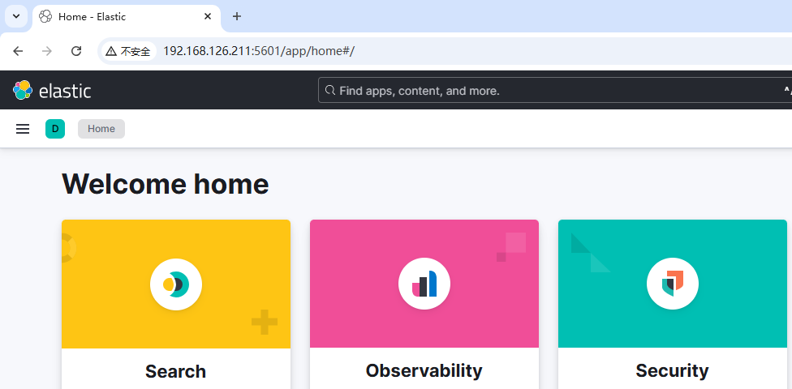

## kibana 汉化

Kibana 8.16.0 版本中，内置了中文语言支持。如果你希望将 Kibana 界面设置为中文，可以安装以下步骤进行配置：

修改 Kibana 配置文件

```shell
kibana# vim /etc/kibana/kibana.yml
```

然后添加或修改以下配置：

```shell
i18n.locale: "zh-CN"
```

重启 Kibana

```shell
kibana# systemctl restart kibana
kibana# netstat -tnlp
```

运行结果：

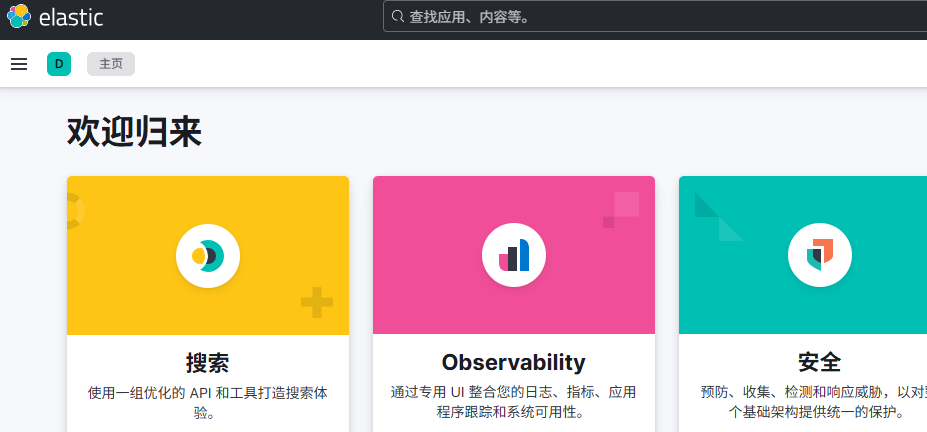

> 学到 ELK 这里对机器的配置要求比较高，因为他们都会用到 Java。而且一般 ES 需要 3 台机器，Kibana 需要一台机器，logstash 的话，在需要采集日志的那些台机器上安装即可。

## Kibana 连接 ES

第一步：找到分析 => Discover 发现菜单，如下图：

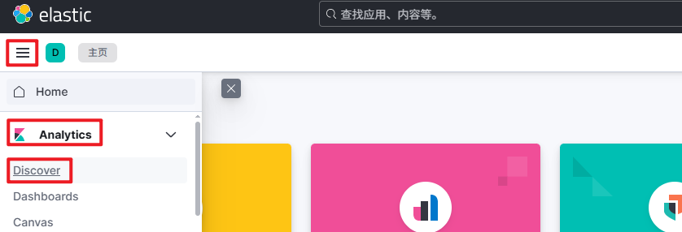

第二步：创建 ES 视图

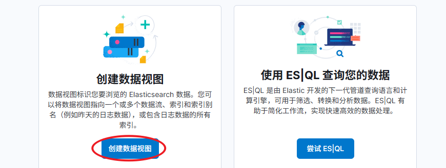

第三步：根据需要获取索引数据


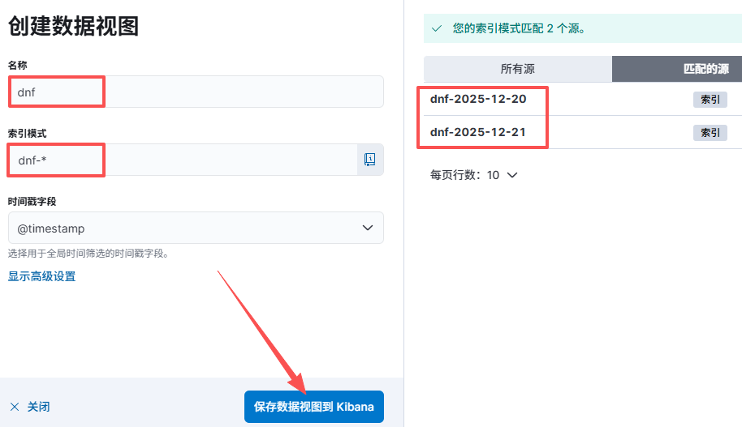

第四步：查询想要的数据字段并保存视图

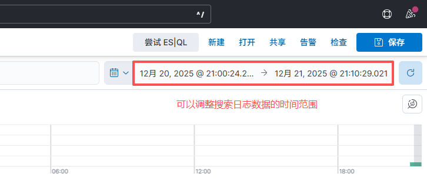

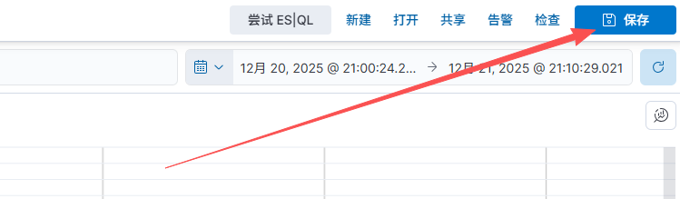

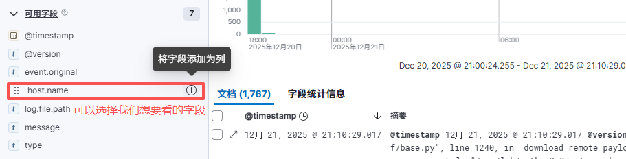

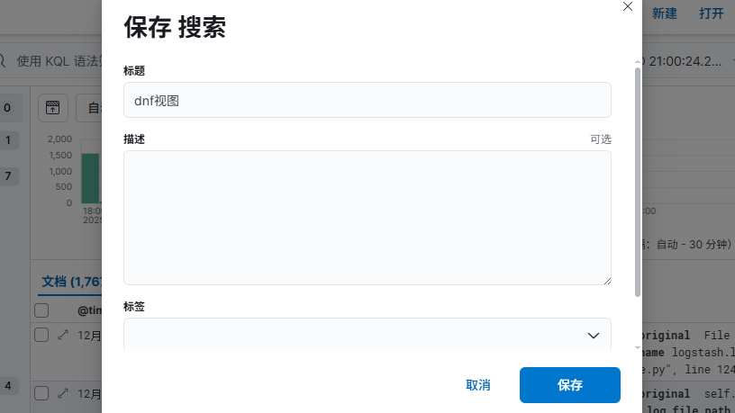

补充：也可以再次创建新视图

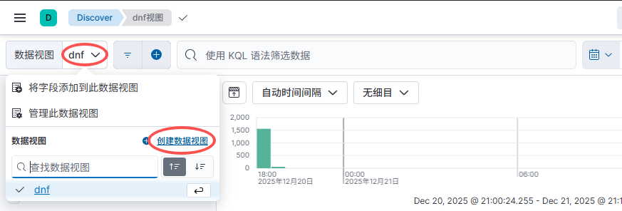


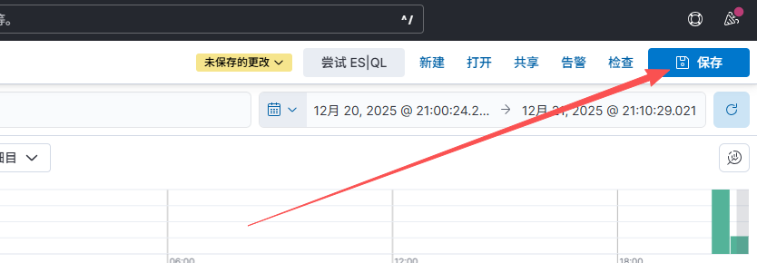

## Kibana 基于数据视图构建仪表板

第一步：选择分析菜单下面的 Dashboards（仪表板）

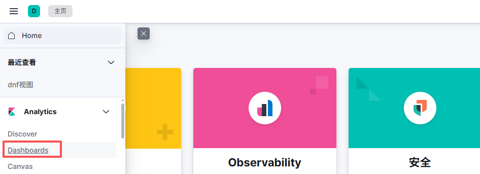

第二步：创建仪表板


第三步：拖入可用字段，选择合适图形

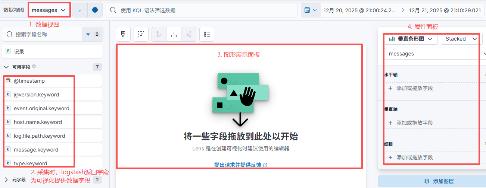

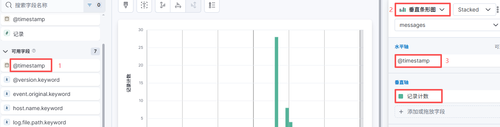

第四步：保存并返回

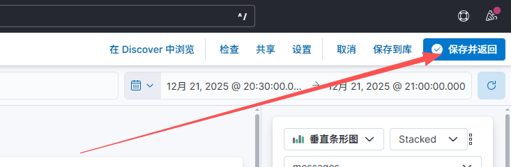

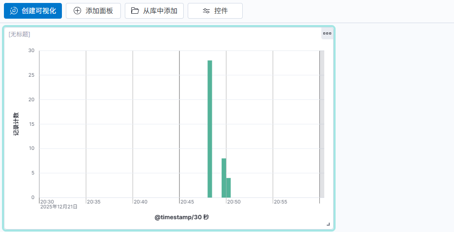

另外，我们在 logstash 机器上做一些操作，引起 messages 日志的变化，比如重启一些服务。那么上面的图表会跟着变化的！

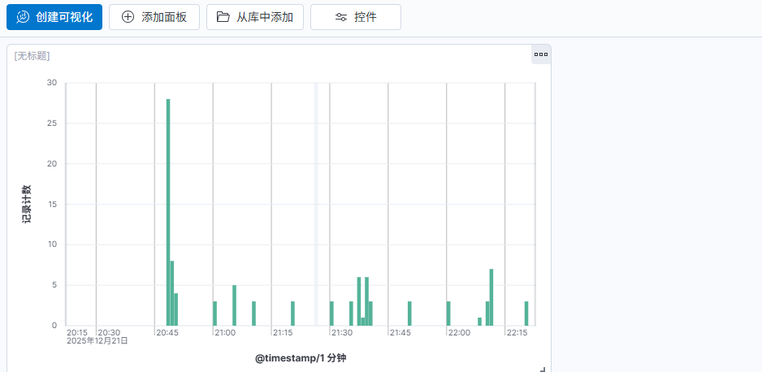

图表的右上角是可以选择时间范围的：

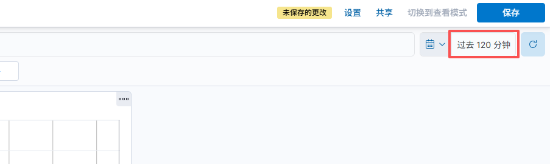

***

可以再添加一个可视化：

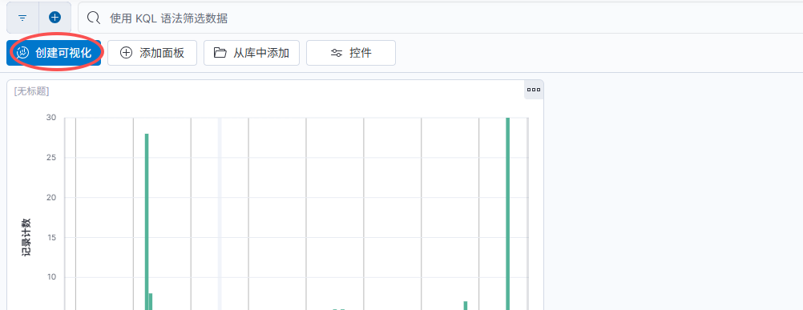

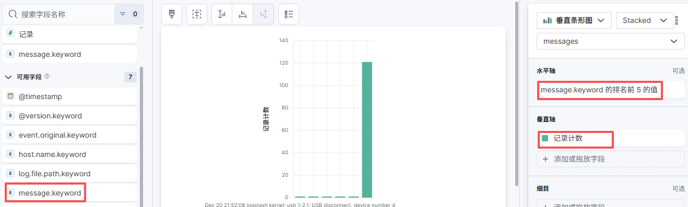

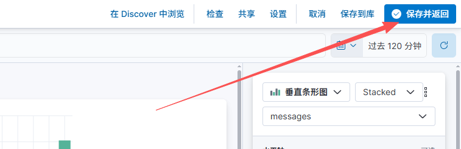

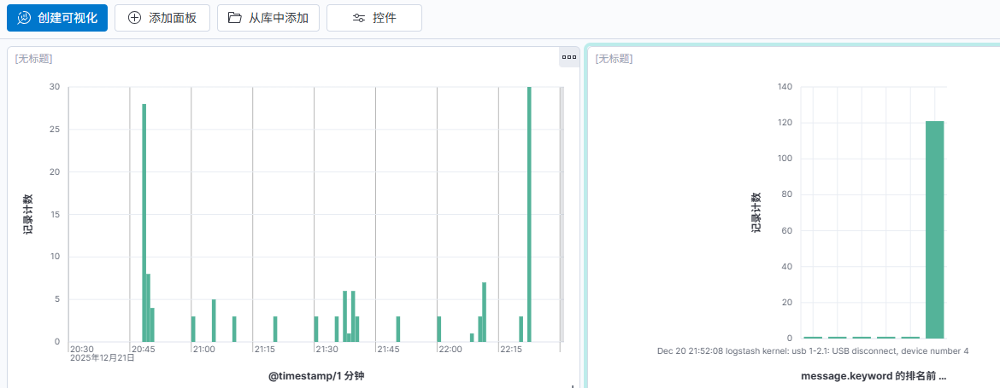

然后保存仪表板


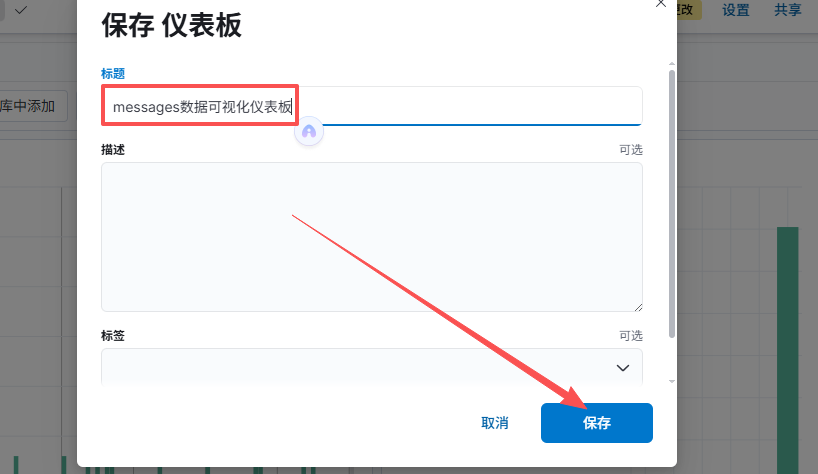


***

修改仪表板中可视化图的标题：


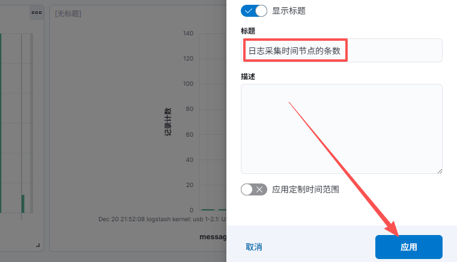

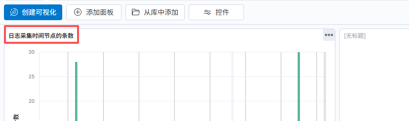


> 其实我们目前采集到的信息太少了，没办法做一些分析。在实际工作中，成百上千台的服务器我们才有必要搭建个 ELK 去采集存储分析日志信息！后面我们采集 Nginx 日志信息，分析的话就比较有点意思了。

# 七、ELK 项目实践

## web 服务器准备

在 logstash 服务器中安装 Nginx 软件（采集 web 服务器项目，比如 NiuShop 电商项目中的 web01/web02 上的 Nginx 访问日志 access.log）

如果资源有限，也可以在 logstash 服务器上安装 Nginx，实践此操作：

第一步：安装 Nginx 服务器，并准备一个测试页面

```shell
logstash# yum -y install nginx
logstash# echo 'web server' > /usr/share/nginx/html/index.html
logstash# systemctl start nginx
```

第二步：使用浏览器访问 Nginx，然后查看 Nginx 访问日志

访问 Nginx 日志信息（access.log）

```shell
logstash# ll /var/log/nginx/access.log
logstash# cat /var/log/nginx/access.log
```

第三步：更改 Nginx 访问日志格式为 json 格式

```shell
logstash# vim /etc/nginx/nginx.conf
其他的都没动，主要是修改了日志那块的配置
# For more information on configuration, see:
#   * Official English Documentation: http://nginx.org/en/docs/
#   * Official Russian Documentation: http://nginx.org/ru/docs/

user nginx;
worker_processes auto;
error_log /var/log/nginx/error.log;
pid /run/nginx.pid;

# Load dynamic modules. See /usr/share/doc/nginx/README.dynamic.
include /usr/share/nginx/modules/*.conf;

events {
    worker_connections 1024;
}

http {
    log_format json_geo escape=json '{'
    '"@timestamp":"$time_iso8601",'
    '"client_ip":"$proxy_add_x_forwarded_for",'  # 优先使用代理 IP
    '"remote_addr":"$remote_addr",'
    '"status":"$status",'
    '"method":"$request_method",'
    '"url":"$request_uri",'
    '"user_agent":"$http_user_agent"'
    '}';
    access_log  /var/log/nginx/access.log json_geo;

    sendfile            on;
    tcp_nopush          on;
    tcp_nodelay         on;
    keepalive_timeout   65;
    types_hash_max_size 4096;

    include             /etc/nginx/mime.types;
    default_type        application/octet-stream;

    # Load modular configuration files from the /etc/nginx/conf.d directory.
    # See http://nginx.org/en/docs/ngx_core_module.html#include
    # for more information.
    include /etc/nginx/conf.d/*.conf;

    server {
        listen       80;
        listen       [::]:80;
        server_name  _;
        root         /usr/share/nginx/html;

        # Load configuration files for the default server block.
        include /etc/nginx/default.d/*.conf;

        error_page 404 /404.html;
        location = /404.html {
        }

        error_page 500 502 503 504 /50x.html;
        location = /50x.html {
        }
    }

# Settings for a TLS enabled server.
#
#    server {
#        listen       443 ssl http2;
#        listen       [::]:443 ssl http2;
#        server_name  _;
#        root         /usr/share/nginx/html;
#
#        ssl_certificate "/etc/pki/nginx/server.crt";
#        ssl_certificate_key "/etc/pki/nginx/private/server.key";
#        ssl_session_cache shared:SSL:1m;
#        ssl_session_timeout  10m;
#        ssl_ciphers PROFILE=SYSTEM;
#        ssl_prefer_server_ciphers on;
#
#        # Load configuration files for the default server block.
#        include /etc/nginx/default.d/*.conf;
#
#        error_page 404 /404.html;
#            location = /40x.html {
#        }
#
#        error_page 500 502 503 504 /50x.html;
#            location = /50x.html {
#        }
#    }

}
```

## logstash 服务器操作

第一步：实际工作中，Nginx 肯定是会被各个地方的用户去访问的，所以后续我们会收集到 Nginx 的访问日志，来分析哪里的用户访问的最多等信息！所以，需要安装 IP => 区域地址 的插件。

```shell
logstash# cd /usr/share/logstash/bin
logstash# ./logstash-plugin install logstash-filter-geoip
logstash# ./logstash-plugin install logstash-filter-mutate
logstash# ./logstash-plugin install logstash-filter-useragent

注：如果加载过慢，则更换国内ruby源
logstash# yum -y install ruby
logstash# gem sources --remove https://rubygems.org/
logstash# gem sources --add https://mirrors.aliyun.com/rubygems/
logstash# gem sources -l
```

放置 GeoLite2-City.mmdb 数据库到 /etc/logstash 目录（资料中已提供该数据库文件）

```shell
# ll /etc/logstash/GeoLite2-City.mmdb
```

> 这个插件：主要用于 IP 地址转 City，功能有二：① 可以把 IP 转经纬度 ② 可以把 IP 转换为具体城市，如背景、巴黎等。

第二步：编写 logstash pipeline 文件，采集 Nginx 日志信息到 ES 中

`vim /etc/logstash/conf.d/nginx.conf`

```shell
input {
    file {
        path => "/var/log/nginx/access.log"
        start_position => "beginning"
    }
}

filter {
    json {
        source => "message"
    }

    if [client_ip] =~ /,/ {
        mutate {
            split => { "client_ip" => "," }
            add_field => { "real_ip" => "%{client_ip[0]}" }
        }
    } else {
        mutate {
            add_field => { "real_ip" => "%{client_ip}" }
        }
    }

    geoip {
        source => "real_ip"
        target => "geoip"
        database => "/etc/logstash/GeoLite2-City.mmdb"
        fields => ["country_name", "region_name", "city_name", "location"]
    }

    date {
        match => [ "@timestamp", "ISO8601" ]
    }
}

output {
    elasticsearch {
        hosts => ["192.168.126.212:9200"]
        index => "nginx-%{+YYYY.MM.dd}"
    }
}
```

第三步：验证 pipeline 文件

```shell
logstash# cd /usr/share/logstash/bin
# 检测上面的配置文件是否有语法问题
logstash# ./logstash --path.settings /etc/logstash -f /etc/logstash/conf.d/nginx.conf -t
```

第四步：将我们 Nginx 的访问日志替换为资料中提供的访问日志，目的是我们自己的 Nginx 访问日志，里面的 IP 都是局域网 IP，解析不出什么对应的地址，而资料中提供的 Nginx 访问日志，里面的 IP 基本都是外网 IP！可以通过 logstash 的插件去分析 IP 对应的地址信息。

也就是将资料中的 Nginx 的 access.log 上传到 `/var/log/nginx/`中，覆盖之前的访问日志。

第五步：启动 logstash，通过 pipeline 中配置的信息，采集 Nginx 的日志

```shell
logstash# cd /usr/share/logstash/bin

# 启动logstash开始采集，注意如果目前已经是启动的话，先给停掉，再重新启动！！！
logstash# nohup ./logstash --path.settings /etc/logstash/ -r -f /etc/logstash/conf.d/nginx.conf &
```

## Kibana web 界面操作

### 创建数据视图

第一步：访问 Kibana 的 web 页面，创建数据视图（可以删除之前的视图，避免对我们项目产生影响，不删除也没事，我们之前没有采集过 Nginx 的日志创建过 Nginx 相关的数据视图）

Management => Stack Management

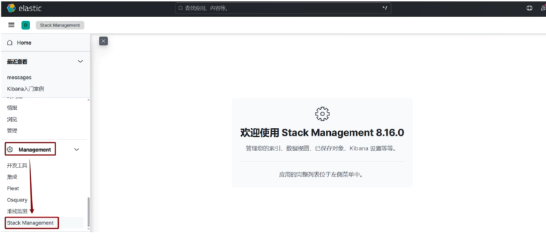

Kibana => 数据视图 => 勾选 nginx => 删除

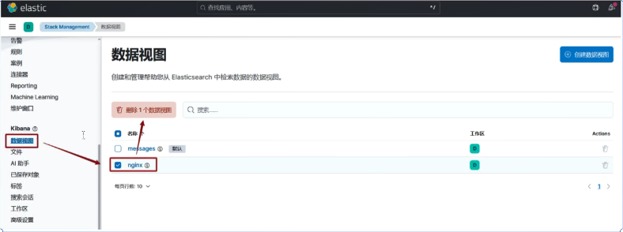

第二步：创建数据视图


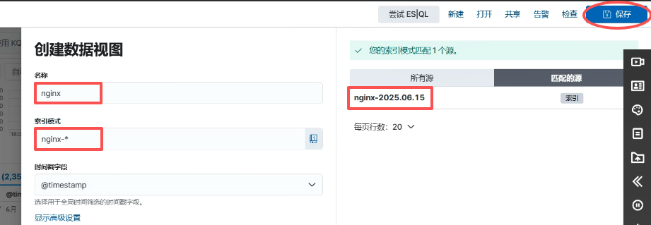


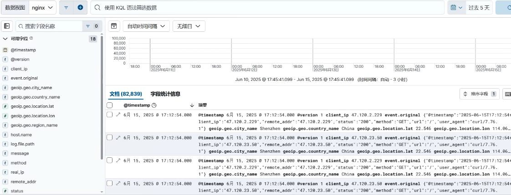

**其实有了视图，就相当于我们通过 Kibana 从 ES 库中那么多的日志数据中，找出来我们想要分析查看的基础数据！**

**之后的话，我们再创建与某个数据视图关联的仪表板，然后在仪表板中根据数据视图创建合适的可视化图表！**

**总的来说流程是：**

1. **创建数据视图（获取到 ES 中某个或某些索引的日志信息）**
2. **创建仪表板（某个数据视图）**
3. **创建可视化图表**

### 添加地图字段并创建地图可视化

第一步：更改上面的数据视图的字段信息，需要我们添加一个字段，后面才能分析出 IP 对应的区域地址信息

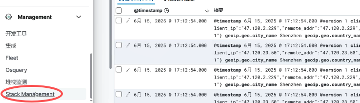

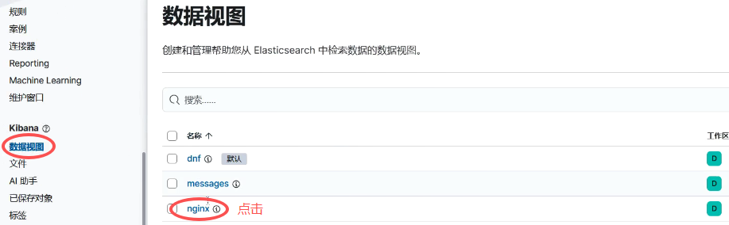

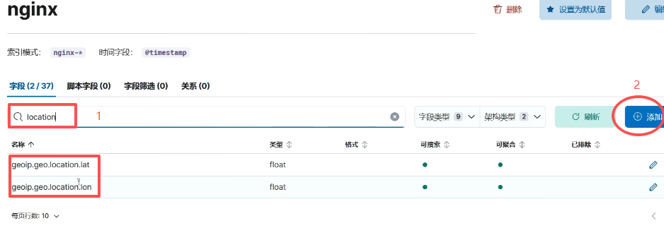

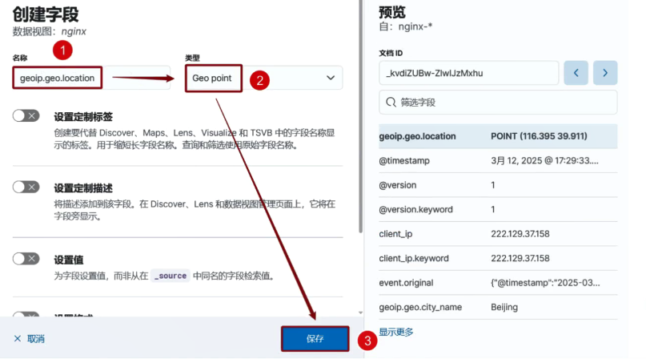

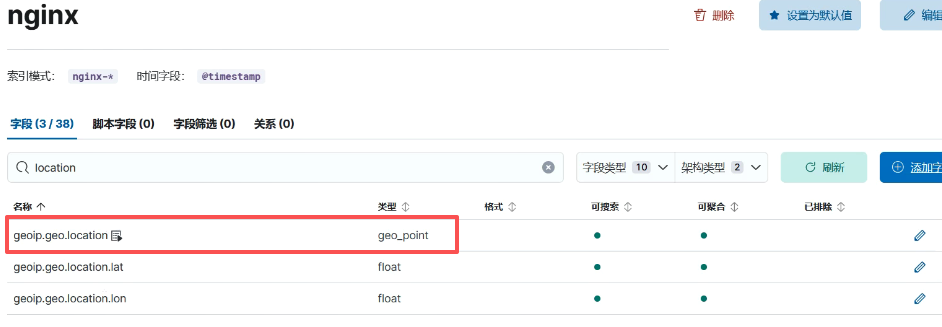

第二步：创建 Map 地图并添加图层

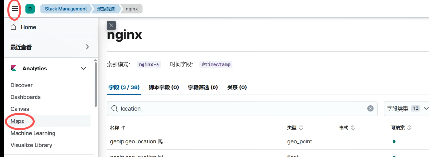

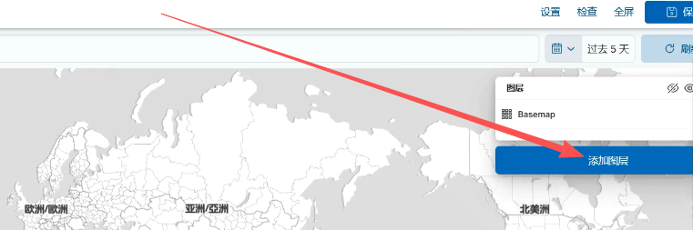

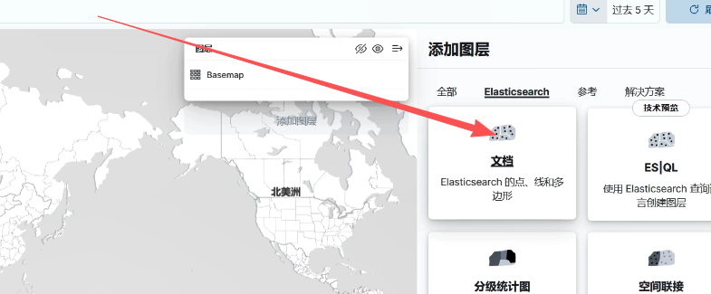

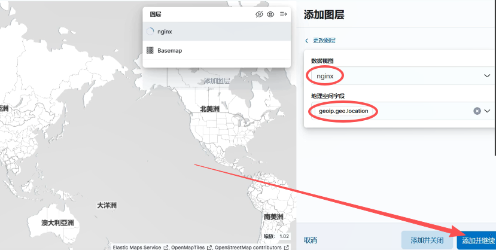

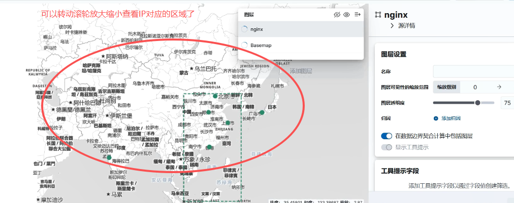

第三步：保存图层、保存地图

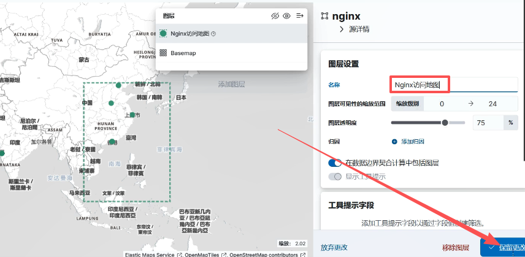

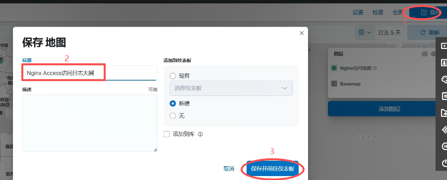

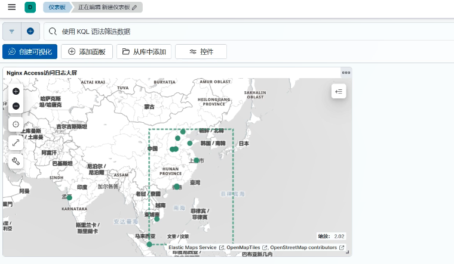

### 创建 IP 访问次数的可视化

第一步：再次创建一个可视化的视图，用来找出访问次数最多的 IP！

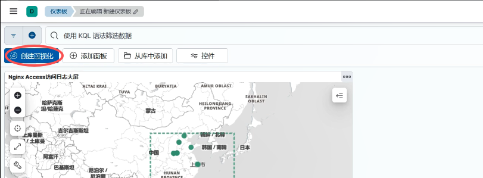

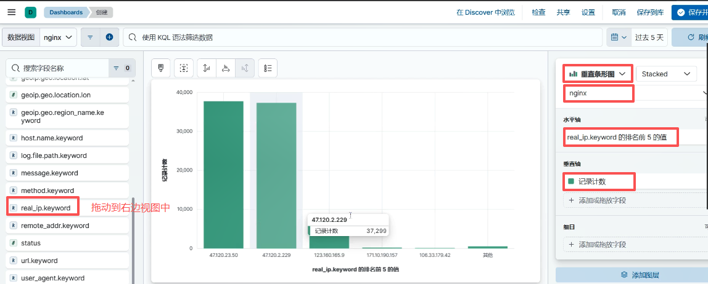

然后保存视图：

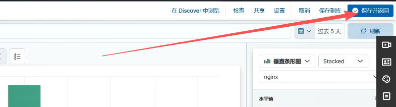

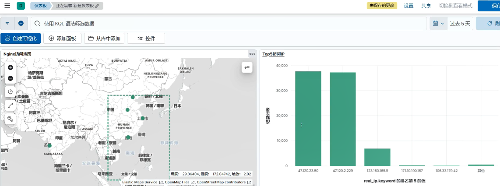

### 创建城市访问次数的可视化

第一步：再次创建一个可视化的视图，用来找出访问次数最多的城市！

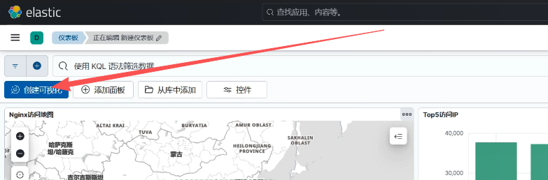

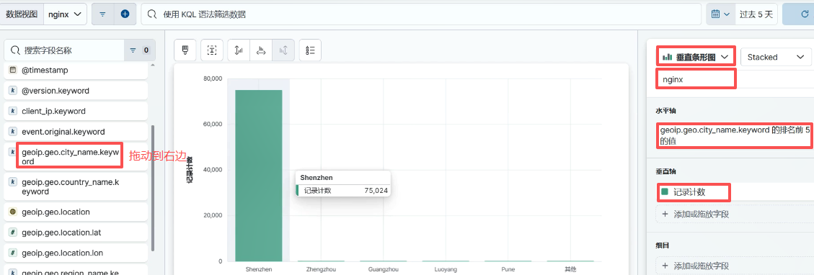

然后保存视图：

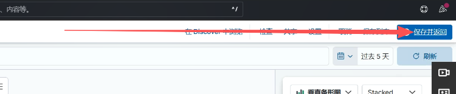

### 创建状态码的可视化

第一步：再次创建一个可视化的视图，用来分析请求的状态码等信息！

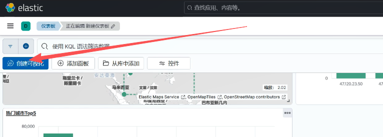

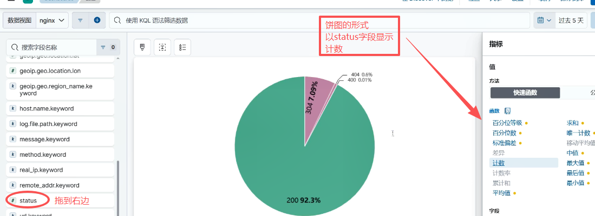

然后保存视图：

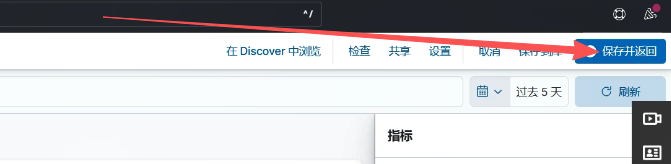

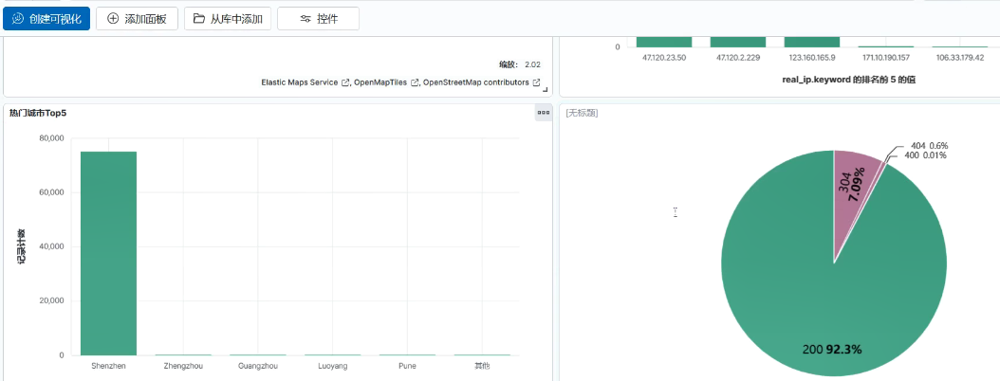

### 保存仪表板

第一步：保存仪表板

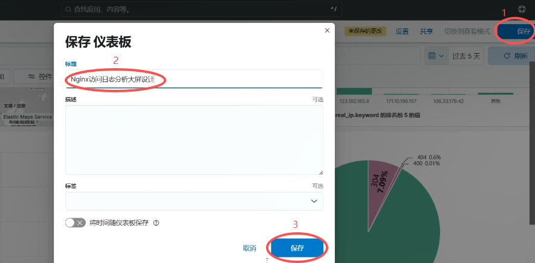

到此我们的案例就做完了！

> 一般在一个公司中，如果要用 ELK 的话，会专门有一个人员去负责 ELK 的工作，负责收集 MySQL 数据库的日志、Nginx 服务器的日志等等。所以说，我们可以在简历中单独写一个与 ELK 有关的项目经历！

# 八、扩展：filebeat

## Filebeat 介绍

作用：与 logstash 基本等价

ELK = ElasticSearch + Logstash + Kibana

EFK = ElasticSearch + Filebeat/Fluentd + Kibana

EFLK = ElasticSearch + Filebeat/Fluentd + Logstash + Kibana

因为 logstash 消耗内存等资源太高，如果在要采集日志的服务器上都安装 logstash，这样对应用服务器的压力会增加。所以我们要用轻量级的采集工具才更高效，更省资源。

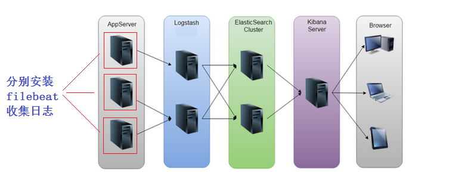

大概流程就是：

1. Filebeat/Fluentd 负责采集应用的日志信息，安装在业务服务器上
2. logstash 单独安装到服务器上，负责对第 1 步采集到的日志信息进行清洗、转化操作
3. ES 存储第 2 步得到的日志数据
4. Kibana 负责对 ES 中存储的日志数据进行分析、可视化展示

***

beats 是 ELK 官方推出的轻量级的日志收集处理工具，beats 占用资源少。

* Packetbeat：网络数据，收集网络流量数据
* Metricbeat：指标，收集系统、进程和文件系统级别的 CPU、内存使用情况等数据
* Filebeat：文件，收集日志文件数据
* Winlogbeat：Windows 事件日志，收集 Windows 事件日志数据
* Auditbeat：审计数据，收集审计日志
* Heartbeat：运行时间监控，收集系统运行时的数据

我们这里主要是收集日志信息，所以只讨论 filebeat。

filebeat 可以直接将采集的日志数据传输给 ES 集群（EFK），也可以给 logstash（5044 端口接收）。

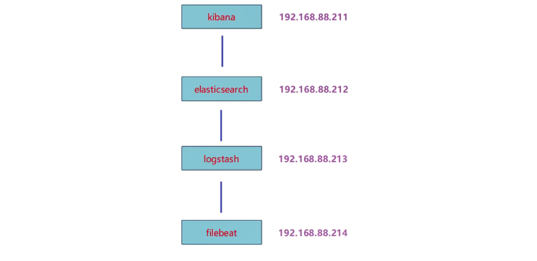

## EFK 搭建

EFK = ES + Filebeat + Kibana

Filebeat 负责收集应用服务器的日志信息，将日志信息直接传输存储到 ES 中，Kibana 负责分析、可视化 ES 中的日志数据。

第一步：克隆一台最小化安装的服务器，命名为 filebeat，内存 1G。

第二步：下载并安装 filebeat，下载地址：<font style="color:#117CEE;">https://www.elastic.co/cn/beats/filebeat</font>

```shell
# 使用资料中提供的安装包即可
filebeat# rpm -ivh filebeat-8.16.0-x86_64.rpm
```

第三步：配置 filebeat 收集日志数据

```yaml
filebeat# cat /etc/filebeat/filebeat.yml | grep -v '#' | grep -v '^$'
filebeat.inputs:
- type: filestream
  id: custom-logs
  enabled: true
  paths:
    - /var/log/*.log
    
  # 关闭所有可能自动设置数据流的模块
  filebeat.config.modules.enabled: false
  
  # -----------------------------彻底禁用模板和ILM---------------------------------
  # 禁用内置模板
  setup.template.enabled: false
  setup.template.overwrite: true
  
  # 禁用ILM
  setup.ilm.enabled: false
  setup.ilm.rollover_alias: ""
  setup.ilm.pattern: ""
  setup.ilm.policy_name: ""
  
  # -------------------------ES输出------------------------------
  output.elasticsearch:
    # 主机配置
    hosts: ["http://192.168.126.212:9200"]
    
    # 使用与filebeat完全不同的索引名前缀，避免触发数据流机制
    index: "filebeat1-%{+yyyy.MM.dd}"
    
    # 显式禁用ILM
    ilm.enabled: false
    
    # 禁用任何自动索引设置
    indices:
      - index: "filebeat1-%{+yyyy.MM.dd}"
        lifecycle:
          enabled: false
          name: ""
        data_stream:
          enabled: false
```

第四步：启动服务

```shell
filebeat# systemctl start filebeat
filebeat# systemctl enable filebeat
```

第五步：然后在浏览器中查看 ES 的索引信息

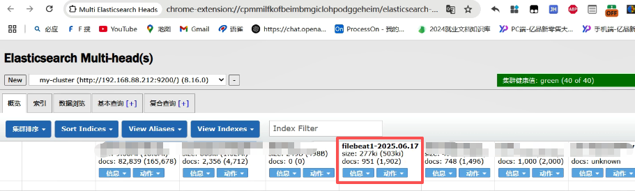

## ELFK 搭建

ELFK = ES + Logstash + Filebeat + Kibana

Filebeat 负责采集日志数据，然后交给 Logstash

Logstash 负责将日志数据进行过滤处理，将结果存储到 ES 中

ES 负责存储日志数据

Kibana 负责对日志进行过滤筛选展示

***

第一步：在 Logstash 上要重新配置，开放 5044 端口给 filebeat 连接，并重启 Logstash 服务

5044：logstash 默认端口

filebeat 可以把日志发送到 logstash 节点对应的 5044 端口，这样 logstash 就可以获取到 filebeat 采集的日志信息。

```shell
logstash# pkill java
logstash# vim /etc/logstash/conf.d/filebeat.conf
input {
  beats {
    port => 5044
  }
}

# 如果需要设置时区，在此处添加过滤器
filter {
  # 创建一个具有上海时区的时间戳字段供索引使用
  ruby {
    code => "event.set('indexDate', Time.now.getlocal('+08:00').strftime('%Y.%m.%d'))"
  }
}

output {
  elasticsearch {
    hosts => ["192.168.126.212:9200"]
    index => "filebeat2-%{indexDate}"
  }
  stdout {
    
  }
}

logstash# cd /usr/share/logstash/bin

如果前面有使用后台跑过logstash实例的请kill掉先
logstash# pkill java
logstash# ./logstash --path.settings /etc/logstash/ -r -f /etc/logstash/conf.d/filebeat.conf

目前是前台启动运行，可以看到测试效果，如果后期需要后台运行，可以使用 nohup + & 后台运行符
logstash# nohup ./logstash --path.settings /etc/logstash/ -r -f /etc/logstash/conf.d/filebeat.conf &
```

第二步：配置 filebeat 收集日志

```yaml
filebeat# cat /etc/filebeat/filebeat.yml | grep -v '#' | grep -v '^$'
filebeat.inputs:
- type: log
  enabled: true					# 改为true
  paths:
    - /var/log/*.log		# 收集的日志路径

filebeat.config.modules:
  path: ${path.config}/modules.d/*.yml
  reload.enabled: false
  
# 禁用模板设置，避免数据流问题
setup.template.enabled: false
# setup.template.settings:
# 	index.number_of_shards: 1

# 禁用Kibana自动配置
setup.kibana.enabled: false

output.logstash:										# 这两句非常重要，表示日志输出给logstash
  hosts: ["192.168.126.213:5044"]		# IP为logstash服务器的IP；端口5044对应logstash上的配置
  
processors:
  - add_host_metadata: ~
  - add_cloud_metadata: ~
```

第三步：启动或重启 filebeat

```yaml
filebeat# systemctl start filebeat
```

第四步：可以在浏览器中访问 Kibana 的 web 界面查看效果，也可以做成可视化的效果

> 以后我们就可以在每台业务服务器上安装 filebeat 去采集日志信息，将采集到的日志信息传递给 logstash，然后 logstash 进行过滤清晰将数据输出到 ES 中保存起来，最后使用 Kibana 去查询 ES 中的数据做成想要的可视化图表！
>
> 在业务系统上安装 filebeat 进行日志采集占用的内存比 logstash 要小很多。

## filebeat 收集 Nginx 日志（ELK 项目升级改造）

logstash 采集工作 => filebeat 采集

logstash 只负责日志处理，如 IP 解析、IP 过滤（127.0.0.1、本机）等等

第一步：在 filebeat 这台服务器上安装 Nginx，启动 Nginx 服务。并使用浏览器访问刷新一下，模拟产生一些相应的日志（强调：我们在这里是模拟的实验环境，一定要搞清楚，在实际情况下是将 filebeat 安装到 Nginx 所在的服务器上去收集日志的！）

```shell
filebeat# yum -y install nginx
filebeat# systemctl start nginx
filebeat# systemctl enable nginx
filebeat# echo 'filebeat server nginx' > /usr/share/nginx/html/index.html
```

第二步：修改 filebeat 配置文件，并重启服务

```yaml
filebeat# cat /etc/filebeat/filebeat.yml | grep -v '#' | grep -v '^$'
filebeat.inputs:
- type: log
  enabled: true
  paths:
    # 将Nginx日志路径单独指定，但需要排除以避免重复采集
    - /var/log/nginx/access.log
# 原始配置保持不变
filebeat.config.modules:
  path: ${path.config}/modules.d/*.yml
  reload.enabled: false

setup.template.settings:
  index.number_of_shards: 1
  
setup.kibana.enabled: false

output.logstash:
  hosts: ["192.168.126.213:5044"]

processors:
  - add_host_metadata: ~
  - add_cloud_metadata: ~
  
filebeat# systemctl stop filebeat
filebeat# systemctl start filebeat
```

第三步：验证是否在 ES 中有了数据（在 kibana 或 es-head 上查询），尽量使用 kibana 会显示更加详细一些。上面收集到的数据放在 ES 中索引是 filebeat2-xxxx.xx.xx 的了，因为我们本次没有修改 logstash 中的 xxx.conf 配置文件，最后一次使用的 xxx.conf 配置文件中定义了索引的名字！

> 注意：以上项目改造，省略了一个点，正常要采集 Nginx 的日志，需要把 Nginx 的日志转换为 json 格式，然后交给 logstash 进行处理。这个地方大家自行完成，详情参考 => ELK 项目实践

## 扩展：filebeat 日志简单过滤

filebeat 也可以进行日志或数据过滤操作，但是功能没有 logstash 那么强大：

https://www.elastic.co/guide/en/beats/filebeat/1.3/configuration-filebeat-options.html

```yaml
filebeat# grep -Ev '#|^$' /etc/filebeat/filebeat.yml
filebeat.inputs:
- type: log
  enabled: true
  paths:
    - /var/log/*.log
  # 过滤只包含"Installed"字样的日志行
  include_lines: ['Installed']

# 原始配置保持不变
filebeat.config.modules:
  path: ${path.config}/modules.d/*.yml
  reload.enabled: false

setup.template.settings:
  index.number_of_shards: 1

setup.kibana.enabled: false

output.logstash:
  hosts: ["192.168.126.213:5044"]

processors:
  - add_host_metadata: ~
  - add_cloud_metadata: ~
  
filebeat# systemctl stop filebeat
filebeat# systemctl start filebeat
```

测试方法：

通过 `yum install`和 `yum remove`产生日志，检验结果

结果为：`yum install`安装可以收集，`yum remove`卸载的不能收集

其他参数可以自行测试：

* exclude\_lines
* exclude\_files


> 更新: 2025-12-23 19:45:43  
> 原文: <https://www.yuque.com/u41736172/az9urv/ngvhk8uyl953wadi>