# 03.Kubernetes资源管理与Pod基础

# 一、【了解】node 节点管理

## 查看帮助

```shell
kubectl --help
```

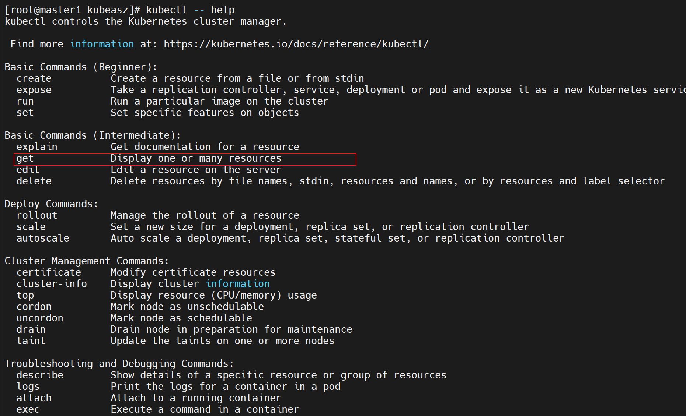

```shell
kubectl get --help
```

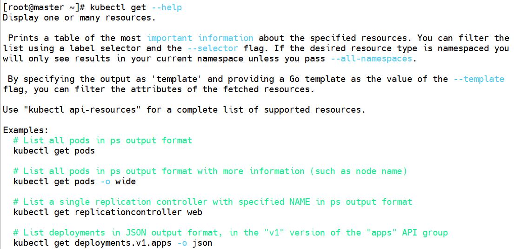

## 集群

查看集群信息

```shell
kubectl cluster-info
```

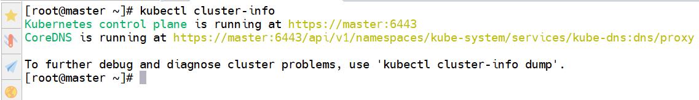

## 节点

1 查看节点（主机）信息

```shell
[root@master ~]# kubectl get nodes
NAME     STATUS   ROLES           AGE   VERSION
master   Ready    control-plane   24h   v1.30.14
node1    Ready    <none>          13h   v1.30.14
node2    Ready    <none>          13h   v1.30.14
```

2 查看节点详细信息

```shell
[root@master ~]# kubectl get nodes -o wide
```

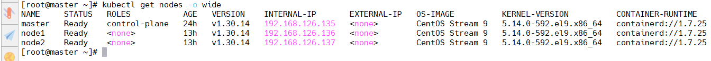

3 描述节点详细信息

经常用来定位节点错误信息

```shell
kubectl describe node 节点名称

[root@master ~]# kubectl describe node master
```

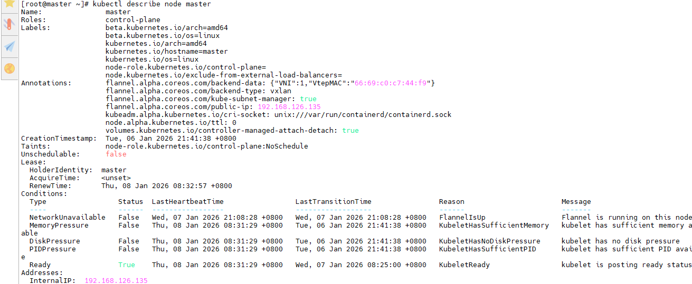

4 node 节点管理集群

**如果是kubeasz安装，所有节点(包括 master 与 node)都已经可以对集群进行管理**，在 $HOME/.kube/config 文件中配置的；

如果是 kubeadm 安装，有的情况下，在 node 节点上，管理时会报如下错误：

```shell
[root@node1 ~]# kubectl get nodes
```

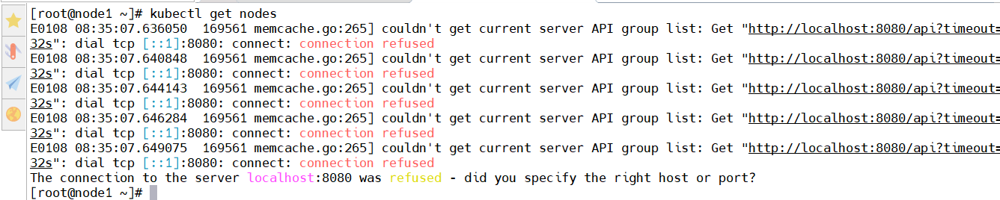

这是因为 master 管理节点和 node 工作节点它们的职责是分开的，不能在 node 工作节点中管理集群的信息。如果你想在 node 工作节点中管理集群信息，核心思路是：只要把 master 上的管理文件 /etc/kubernetes/admin.conf 拷贝到 node 节点的$HOME/.kube/config 就可以让 node 节点也可以实现 kubectl 命令管理。具体操作步骤：

第一步：在 node 节点的用户家目录创建 .kube 目录

```shell
[root@node1 ~]# mkdir /root/.kube
```

第二步：在 master 节点做如下操作

```shell
[root@master ~]# scp /etc/kubernetes/admin.conf node1:/root/.kube/config
```


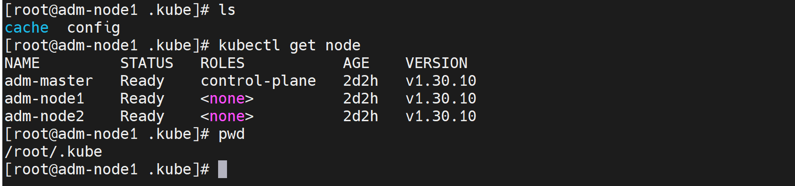

第三步：在 node 节点验证

```shell
[root@node1 ~]# kubectl get nodes
NAME     STATUS   ROLES    AGE    VERSION
master   Ready    master    2h    v1.15.1
node1    Ready    node      2h    v1.15.1
node2    Ready    node      2h    v1.15.1
```

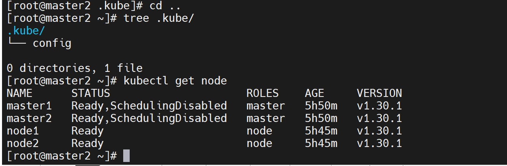

## 节点标签(label)

k8s 集群如果由大量节点组成，可将节点打上对应的标签，然后通过标签进行筛选，查看。

### 查看节点标签信息

```shell
[root@master ~]# kubectl get nodes --show-labels

其实就是比 kubectl get nodes 查看到的信息多一列
```

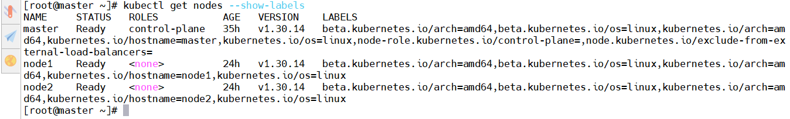

### 设置节点标签信息

为节点 master 打一个 region=huanan 的标签

```shell
kubectl label node 节点名称 region=xxx
[root@master ~]# kubectl label node master region=huanan
```

查看所有节点标签

```shell
[root@master ~]# kubectl get nodes --show-labels
```

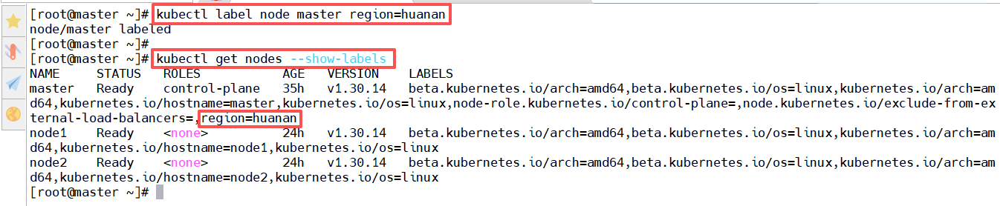

重复打标签：如果给一个已经有了标签的节点重新打个标签，需要加 --overwrite 参数

```shell
[root@master ~]# kubectl label node master region=shanxi --overwrite
```

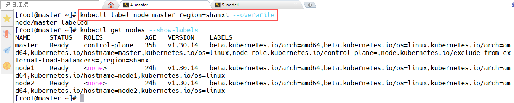

查看所有节点带 region 的标签

```shell
[root@master ~]# kubectl get nodes -L region
```

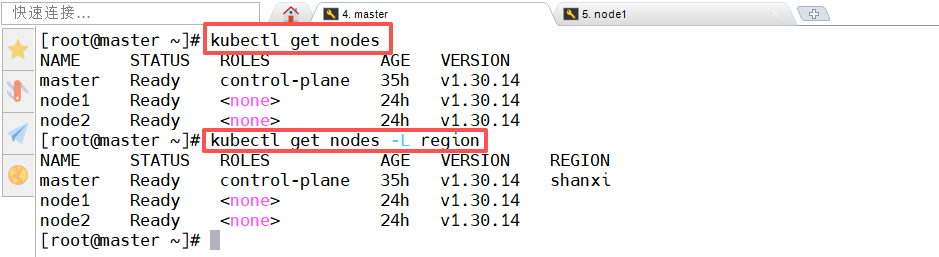

查看所有节点带 region，locate 的标签

```shell
[root@master ~]# kubectl get nodes -L region,locate
```

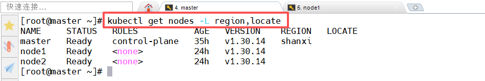

> 注意：标签定义时，大小写敏感。

### 标签的修改

```shell
kubectl label node 节点名称 标签名=标签值 --overwrite=true

[root@master ~]# kubectl label node master region=beijing --overwrite=true
```

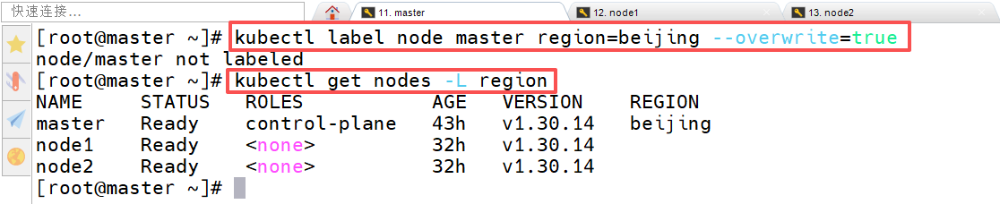

按照官方帮助手册，标签名称只能以数字或字母做开头或结尾，比如 country-、-country 都是非法的； coun-try 是合法的；

```shell
# 查询节点，并指定标签列
[root@master ~]# kubectl get nodes -L region
NAME     STATUS   ROLES           AGE   VERSION    REGION
master   Ready    control-plane   43h   v1.30.14   beijing
node1    Ready    <none>          32h   v1.30.14
node2    Ready    <none>          32h   v1.30.14
```

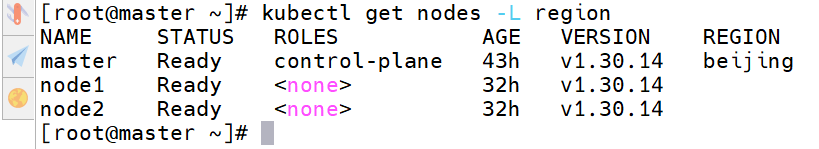

### **标签的删除**

使用 key 加一个减号的写法来取消标签

```shell
kubectl label node 节点名称 标签名-

[root@master ~]# kubectl label node master region-
```

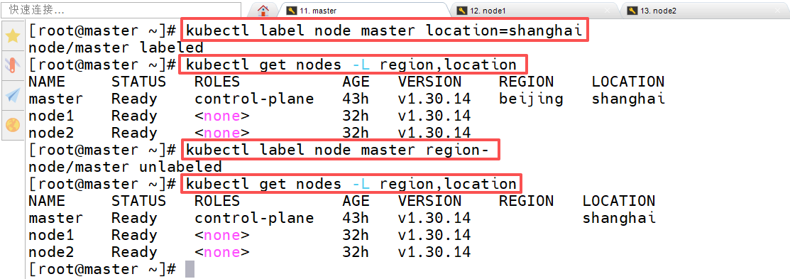

> 一个节点的标签是可以有多个的！
>
> 另外，上面 node 后面跟的可以是节点名称，也可以是节点的 IP！

### 标签选择器

标签选择器主要有 2 类:

* 等值关系: =, !=
* 集合关系: KEY in {VALUE1, VALUE2......}

```shell
# 给node1节点打标签bussiness=game
[root@master ~]# kubectl label node node1 bussiness=game

# 给node2节点打标签bussiness=ad
[root@master ~]# kubectl label node node2 bussiness=ad

# 查看节点信息并显示标签信息
[root@master ~]# kubectl get nodes --show-labels
NAME     STATUS   ROLES           AGE   VERSION    LABELS
master   Ready    control-plane   43h   v1.30.14   beta.kubernetes.io/arch=amd64,beta.kubernetes.io/os=linux,kubernetes.io/arch=amd64,kubernetes.io/hostname=master,kubernetes.io/os=linux,location=shanghai,node-role.kubernetes.io/control-plane=,node.kubernetes.io/exclude-from-external-load-balancers=
node1    Ready    <none>          32h   v1.30.14   beta.kubernetes.io/arch=amd64,beta.kubernetes.io/os=linux,bussiness=game,kubernetes.io/arch=amd64,kubernetes.io/hostname=node1,kubernetes.io/os=linux
node2    Ready    <none>          32h   v1.30.14   beta.kubernetes.io/arch=amd64,beta.kubernetes.io/os=linux,bussiness=ad,kubernetes.io/arch=amd64,kubernetes.io/hostname=node2,kubernetes.io/os=linux

# 查看节点信息，并显示标签列
[root@master ~]# kubectl get nodes -L bussiness
NAME     STATUS   ROLES           AGE   VERSION    BUSSINESS
master   Ready    control-plane   43h   v1.30.14
node1    Ready    <none>          32h   v1.30.14   game
node2    Ready    <none>          32h   v1.30.14   ad

# 查看节点标签是bussiness=ad的
[root@master ~]# kubectl get nodes -l bussiness=ad
NAME    STATUS   ROLES    AGE   VERSION
node2   Ready    <none>   32h   v1.30.14

# 查看节点标签是bussiness等于ad或者game的
[root@master ~]# kubectl get nodes -l "bussiness in (ad,game)"
NAME    STATUS   ROLES    AGE   VERSION
node1   Ready    <none>   32h   v1.30.14
node2   Ready    <none>   32h   v1.30.14

# 查看节点标签是bussiness等于ad或者game的，并且显示bussiness列
[root@master ~]# kubectl get nodes -l "bussiness in (ad,game)" -L bussiness
NAME    STATUS   ROLES    AGE   VERSION    BUSSINESS
node1   Ready    <none>   32h   v1.30.14   game
node2   Ready    <none>   32h   v1.30.14   ad
```

## 总结

k8s 集群中，node 是一种资源（后面还要学习很多的常见资源，如 namespace、pod、deployment、service 等)

很多资源类型都可以打标签

标签是为了更好的进行资源对象的相关选择与匹配

-l ？？？

-L ？？？

在企业里，对 K8S 进行二开的时候，会封装 Web 界面，进行打标签和检索；

常用命令：

1、kubectl cluster-info

<font style="color:rgb(216,57,49);">2、kubectl get node \[-o wide]</font>

<font style="color:rgb(216,57,49);">3、kubectl describe node \[node名称]</font>

4、kubectl --help 自主学习

# 二、【掌握】资源管理介绍

## YAML 语言介绍

YAML 是一个类似 XML、JSON 的标记性语言。它强调以**数据**为中心，并不是以标识语言为重点。因而 YAML 本身的定义比较简单，号称"一种人性化的数据格式语言"。

### YAML vs XML

XML：

```yaml
<emp>
  <name>zhangsan</name>
  <age>18</age>
</emp>
```

YAML：

```yaml
emp:
  name: zhangsan
  age: 18
```

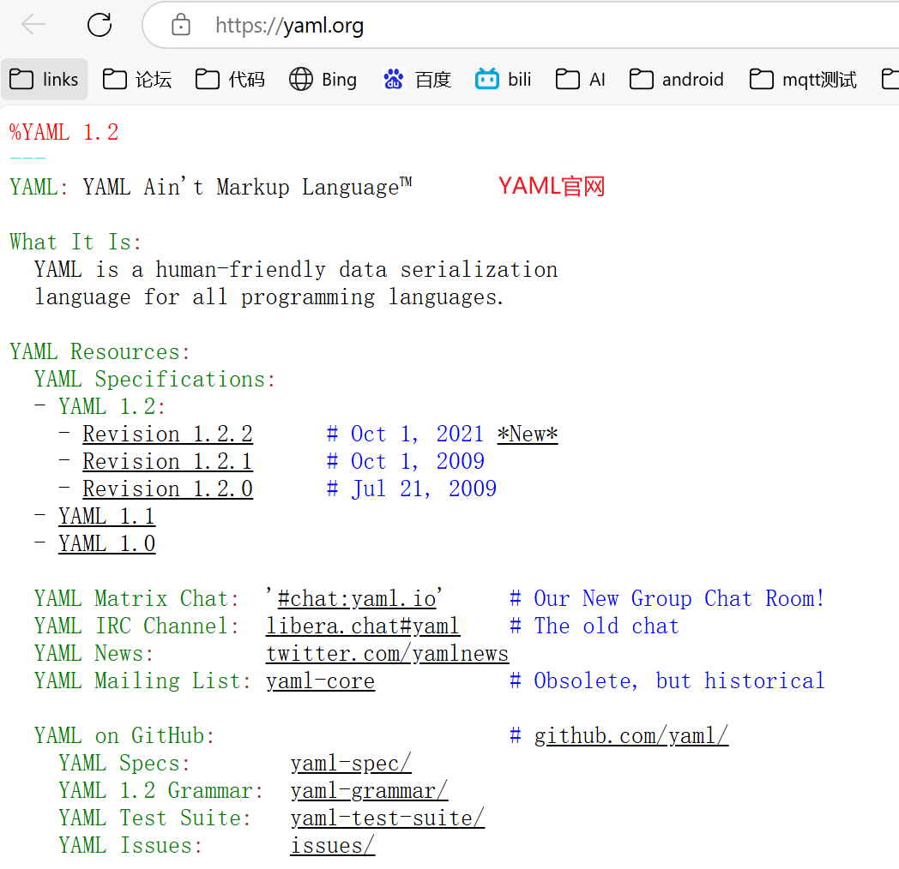

### 相关语法

YAML 的语法比较简单，主要有下面几个：

* 大小写敏感；
* '#'表示注释；
* 缩进
  * 使用缩进表示层级关系
  * 缩进不允许使用 tab，只允许空格( 低版本限制 )
  * 缩进的**空格数不重要**，只要**相同层级的元素左对齐**即可

> 【历史背景】
>
> 1、早期编程当中，语言功能单一，全都是大写字母，在英文中也比较正式。后来新诞生的一些语言（比如 1972 年的 C 语言），支持了更多字符，也支持了大小写，并带来了书写习惯的改变。因此，为了和老代码兼容，许多新编译器，就支持自动转换成大写，进行词法解析，由此产生了大小写不敏感的风格；
>
> 2、在传统的编程中，大部分是{}形式表示代码块，而不是缩进形式；
>
> 3、为了防止 tab（默认4个空格）和空格的误用和报错，现代的 IDE 对于 YAML，基本上是默认 2 个空格缩进

### 数据类型

* 标量类型（Scalar Types）：单个的、不可再分的值
* 序列类型（Sequence Types）：一组按次序排列的值，又称为数组 Array / 列表 List
* 映射类型（Mapping Types）：键值对的集合，又称为映射 Mapping/ 哈希 Hash / 字典 Dictionary

```yaml
# 纯量, 就是指的一个简单的值，字符串、布尔值、整数、浮点数、null、时间、日期
# 1 布尔类型
c1: true (或者True，不区分大小写)

# 2 整型
c2: 234

# 3 浮点型
c3: 3.14

# 4 null类型 
c4: ~  # 使用~或者null，或者什么都不输入

# 5 日期类型
c5: 2018-02-17    # 日期必须使用ISO 8601格式，即yyyy-MM-dd

# 6 时间类型
c6: 2018-02-17T15:02:31+08:00  # 时间使用ISO 8601格式，时间和日期之间使用T连接，最后使用+代表时区

UTC 统一世界协调时


# 7 字符串类型
c7: beijing     # 简单写法，直接写值，如果字符串中间有特殊字符，必须使用双引号或单引号包裹 

c8: shanghai
    tianjin     # 字符串过多的情况可以拆成多行，每一行前后的多个空格会被转化成一个空格
```

```yaml
# 序列类型
# 形式一(推荐):
address:
  - 海淀
  - 昌平

# 形式二(了解):
address: [海淀,昌平]
```

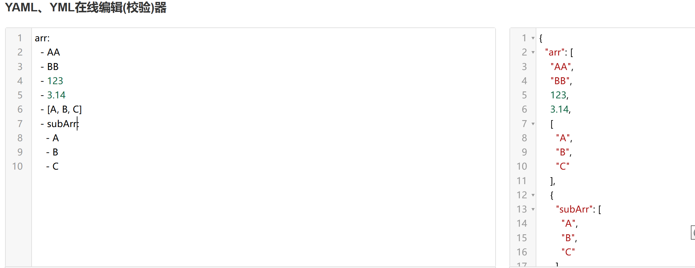

```yaml
# 映射(Mapping)类型
# 形式一(推荐):
emp:
  age: 15
  address: Beijing

# 形式二(了解):
emp: {age: 15,address: Beijing}  
```

学过的三种数据类型，可以随意组合嵌套，从而生成丰富的 Yaml 数据形式；

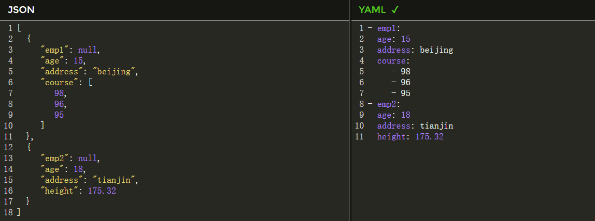

小提示：

1 书写 yaml 切记: 后面要加一个空格

2 如果需要将多段 Yaml 配置放在一个文件中，中间要使用---分隔

3 下面是一个 yaml 转 json 的网站，可以通过它验证 yaml 是否书写正确

[https://www.json2yaml.com/convert-yaml-to-json](about:blank)

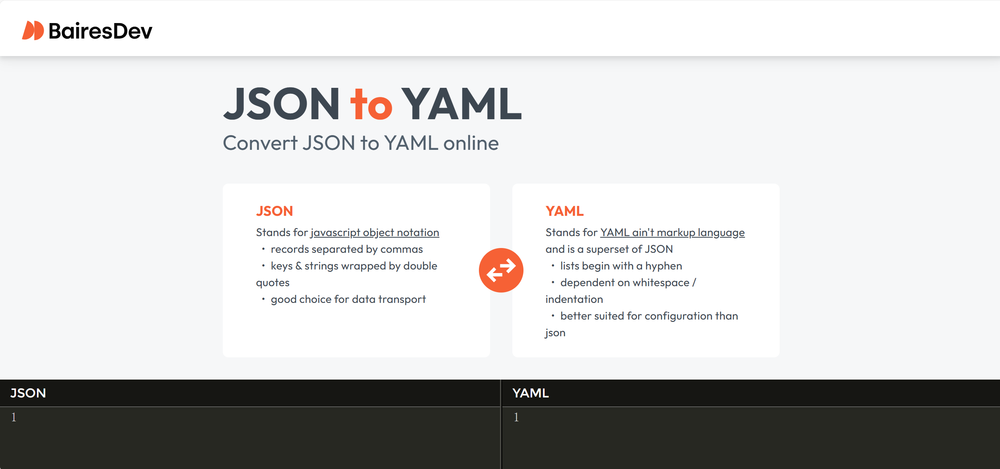

总结

1、Yaml 数据类型：\_\_\_\_类型、\_\_\_\_类型、\_\_\_\_类型；

2、Yaml 语法：大小写\_\_\_\_、缩进要左\_\_\_\_、注释是用\_\_\_\_；

3、在搜索引擎上搜索 Yaml 在线，就可以找到一些在线校验网站，进行自主学习。

## 资源管理方式

在 kubernetes 中，所有的内容都抽象为资源，用户需要通过操作资源来管理 kubernetes。

```yaml
kubectl --help
```

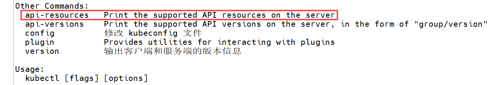

\*\*【容器】\*\*kubernetes 的本质上就是一个集群系统，用户可以在集群中部署各种服务，所谓的部署服务，其实就是在 kubernetes 集群中运行一个个的容器，并将指定的程序跑在容器中。

\*\*【Pod】\*\*kubernetes 的最小管理单元是 pod 而不是容器，所以只能将容器放在 Pod 中，而 kubernetes 一般也不会直接管理 Pod，而是通过 Pod 控制器来管理 Pod 的（可以把 Pod 理解成一个个逻辑主机）。

Pod 可以提供服务之后，就要考虑如何访问 Pod 中服务，kubernetes 提供了 Service 资源实现这个功能。

\*\*【存储】\*\*当然，如果 Pod 中程序的数据需要持久化，kubernetes 还提供了各种存储系统（ConfigMap、Secret）。

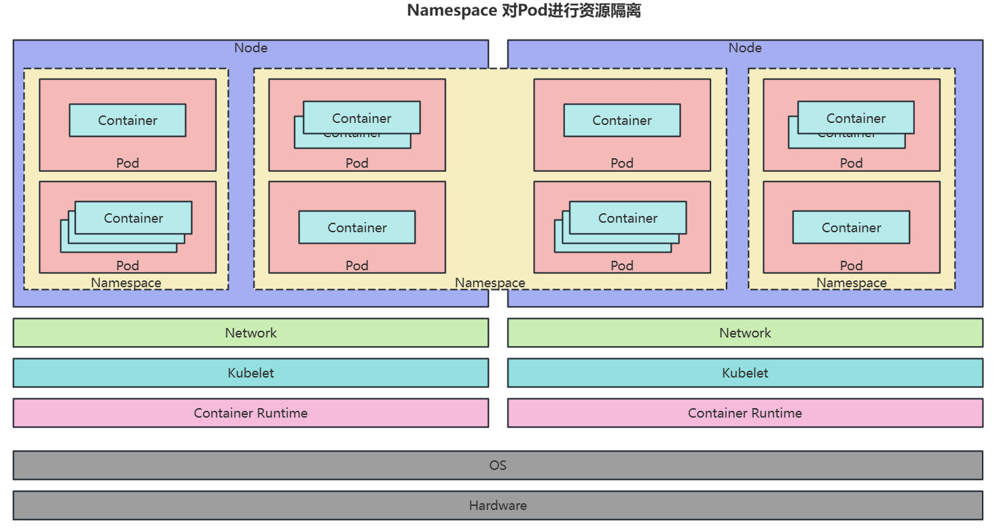

***

在 Kubernetes 当中，对资源的管理方式，整体分为两大类——**命令式**和**声明式**；

* 命令式对象**管理**：直接使用命令去操作 kubernetes 资源

`kubectl run nginx-pod --image=nginx:1.17.1 --port=80`

* **命令式**对象**配置**：通过命令配置和配置文件去操作 kubernetes 资源

`kubectl create/patch -f nginx-pod.yaml`

* **<font style="background-color:#FBDE28;">声明式</font>**<font style="background-color:#FBDE28;">对象</font>**<font style="background-color:#FBDE28;">配置</font>**<font style="background-color:#FBDE28;">：通过 apply 命令和配置文件去操作 kubernetes 资源</font>**<font style="background-color:#FBDE28;">（掌握）</font>**

<code><font style="background-color:#FBDE28;">kubectl apply -f nginx-pod.yaml</font></code>

| 类型 | 操作对象 | 适用环境 | 优点 | 缺点 |
| :--- | :--- | :--- | :--- | :--- |
| 命令式对象管理 | 对象 | 测试 | 简单 | 只能操作活动对象，无法审计、跟踪 |
| 命令式对象配置 | 文件 | 开发 | 可以审计、跟踪 | 项目大时，配置文件多，操作麻烦 |
| 声明式对象配置 | 文件或目录 | 开发 | 支持目录操作 | 意外情况下难以调试 |

**小结**

1、命令式和声明式是 Kubernetes 当中，常见的两种资源管理方式；

2、命令式适合测试和调试，由于没有审计和跟踪记录，生产上很少用；

3、声明式 apply 支持版本管理，操作记录；

### 命令式对象管理

#### **kubectl 命令**

集群中的管理操作几乎都可以使用 kubectl 命令完成。

kubectl 是 kubernetes 集群的命令行工具，通过它能够对集群本身进行管理，并能够在集群上进行容器化应用的安装部署。

kubectl 命令的语法如下：

```yaml
kubectl [command] [type] [name] [flags]

comand：指定要对资源执行的操作，例如 create、get、delete

type：指定资源类型，比如 deployment、pod、service

name：指定资源的名称，名称大小写敏感

flags：指定额外的可选参数
```

```yaml
[root@master ~]# kubectl get nodes
```

#### 资源类型

kubernetes 中所有的内容都抽象为资源，可以通过下面的命令进行查看：

```yaml
kubectl api-resources
```

#### 资源

经常使用的资源有下面这些：

| 资源分类 | 资源名称 | 缩写 | 资源作用 |
| :--- | :--- | :--- | :--- |
| 集群级别资源 | **nodes** | no | 集群组成部分 |
| namespaces | **namespaces** | ns | 隔离Pod |
| pod资源 | **pods** | po | 装载容器 |
| pod资源控制器 | replicationcontrollers | rc | 控制pod资源 |
| | replicasets | rs | 控制pod资源 |
| | **deployments** | deploy | 控制pod资源 |
| | daemonsets | ds | 控制pod资源 |
| | jobs | | 控制pod资源 |
| | cronjobs | cj | 控制pod资源 |
| | horizontalpodautoscalers | hpa | 控制pod资源 |
| | statefulsets | sts | 控制pod资源 |
| 服务发现资源 | **services** | svc | 统一pod对外接口 |
| | **ingress** | ing | 统一pod对外接口 |
| 存储资源 | volumeattachments | | 存储 |
| | persistentvolumes | pv | 存储 |
| | persistentvolumeclaims | pvc | 存储 |
| 配置资源 | **configmaps** | cm | 配置 |
| | **secrets** | | 配置 |

#### **操作**

kubernetes 允许对资源进行多种操作，可以通过 --help 查看详细的操作命令

```yaml
kubectl --help
```

经常使用的操作有下面这些：

| 命令分类 | 命令 | 翻译 | 命令作用 |
| :--- | :--- | :--- | :--- |
| 基本命令 | **create** | 创建 | 创建一个资源 |
| | **edit** | 编辑 | 编辑一个资源 |
| | **get** | 获取 | 获取一个资源 |
| | **patch** | 更新 | 更新一个资源 |
| | **delete** | 删除 | 删除一个资源 |
| | explain | 解释 | 展示资源文档 |
| 运行和调试 | run | 运行 | 在集群中运行一个指定的镜像 |
| | expose | 暴露 | 暴露资源为Service |
| | **describe** | 描述 | 显示资源内部信息 |
| | **logs** | 日志输出容器在\*\* pod\*\* 中的日志 | 输出容器在 pod 中的日志 |
| | attach | 缠绕进入运行中的容器 | 进入运行中的容器 |
| | **exec** | 执行容器中的一个命令 | 执行容器中的一个命令 |
| | **cp** | 复制 | 在Pod内外复制文件 |
| | rollout | 首次展示 | 管理资源的发布 |
| | scale | 规模 | 扩(缩)容Pod的数量 |
| | autoscale | 自动调整 | 自动调整Pod的数量 |
| 高级命令 | **apply** | 应用 | 通过文件对资源进行配置 |
| | label | 标签 | 更新资源上的标签 |
| 其他命令 | cluster-info | 集群信息 | 显示集群信息 |
| | version | 版本 | 显示当前Server和Client的版本 |

下面以一个 namespace / pod 的创建和删除简单演示下命令的使用：（**注意，了解即可，实际工作中我们不用下面的这种方式来操作**）

```yaml
# 创建一个namespace
[root@master ~]# kubectl create namespace dev
namespace/dev created

# 获取namespace，方式一：
[root@master ~]# kubectl get namespace
NAME              STATUS   AGE
default           Active   47h
dev               Active   25s
kube-flannel      Active   36h
kube-node-lease   Active   47h
kube-public       Active   47h
kube-system       Active   47h

# 获取namespace，方式二：也就是说namespace可以简写为ns
[root@master ~]# kubectl get ns
NAME              STATUS   AGE
default           Active   47h
dev               Active   36s
kube-flannel      Active   36h
kube-node-lease   Active   47h
kube-public       Active   47h
kube-system       Active   47h

# 在此namespace下创建并运行一个nginx的Pod
# 由于 docker.io 和镜像代理，有时遇到网速问题，这里我们直接指明镜像源
[root@master ~]# kubectl run nginx --image=docker.1ms.run/nginx:1.24.0 -n dev
pod/nginx created

# 查看新创建的pod
[root@master ~]# kubectl get pods -n dev
NAME    READY   STATUS    RESTARTS   AGE
nginx   1/1     Running   0          2m26s

# 查看详细信息
[root@master ~]# kubectl describe pod nginx -n dev

# 删除指定的pod
[root@master ~]# kubectl delete pod nginx -n dev
pod "nginx" deleted

# 查看指定命名空间中的pod
[root@master ~]# kubectl get pod -n dev
No resources found in dev namespace.

# 删除指定的namespace
[root@master ~]# kubectl delete ns dev
namespace "dev" deleted

# 查看命名空间，发现已经没有之前创建的dev了
[root@master ~]# kubectl get ns
NAME              STATUS   AGE
default           Active   47h
kube-flannel      Active   36h
kube-node-lease   Active   47h
kube-public       Active   47h
kube-system       Active   47h
```

### 命令式对象配置

命令式对象配置就是使用命令配合配置文件一起来操作 kubernetes 资源。

1 创建一个 pod-nginx.yaml，内容如下：（该文件大家能够看懂即可，不需要自己能手写出来！）

```yaml
apiVersion: v1                # API 版本  api-versions
kind: Namespace               # 资源类型
metadata:                     # 元数据
  name: dev                   # 名称，其实就是创建了一个命名空间，名字是dev

---

apiVersion: v1
kind: Pod											# 资源类型
metadata:
  name: nginx  								# pod名称
  namespace: dev							# pod所属的命名空间
spec:
  containers:
  - name: nginx-containers  	# pod中容器名称，可以与pod名称相同也可以不同
    image: docker.1ms.run/nginx:1.24.0 		# 为了拉取镜像较快，我们特别地，指定了镜像源
    imagePullPolicy: IfNotPresent        	# 默认值
```

2 执行 create 命令，创建资源：

```yaml
[root@master ~]# kubectl create -f pod-nginx.yaml
namespace/dev created
pod/nginx created
```

此时发现创建了两个资源对象，分别是 namespace 和 pod

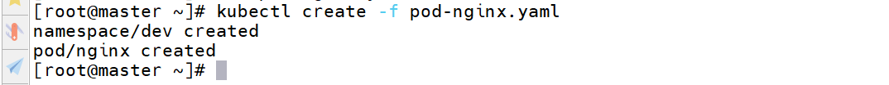

> 注意：如果重复执行 create 命令，那么会报错，因为命名空间已经有了，并且 pod 也已经有了，就不能再创建了！

3 执行 get 命令，查看资源：

```yaml
[root@master ~]# kubectl get -f pod-nginx.yaml
NAME            STATUS   AGE
namespace/dev   Active   96s

NAME        READY   STATUS    RESTARTS   AGE
pod/nginx   1/1     Running   0          96s
```

这样就显示了两个资源对象的信息

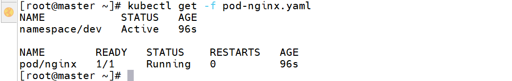

4 执行 delete 命令，删除资源：

```yaml
[root@master ~]# kubectl delete -f pod-nginx.yaml
namespace "dev" deleted
pod "nginx" deleted
```

此时发现两个资源对象被删除了

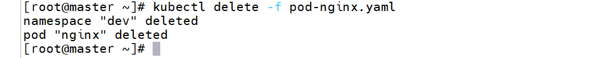

***

总结：

命令式对象配置的方式操作资源，可以简单的认为：命令 + Yaml 配置文件（里面是命令需要的各种参数）

命令：

`create -f`创建

`get -f`查看

`delete -f`删除

### 声明式对象配置（推荐）

**声明式对象配置**跟**命令式对象配置**很相似，但是它只有一个命令 **<font style="background-color:#FBDE28;">apply</font>**。

```yaml
# 首先执行一次kubectl apply -f yaml文件，发现创建了资源
[root@master ~]# kubectl apply -f pod-nginx.yaml
namespace/dev created
pod/nginx created

# 查看资源情况，发现确实创建了命名空间和pod（如果pod状态不是running，那就稍等会，正在拉取镜像呢。）
[root@master ~]# kubectl get -f pod-nginx.yaml
NAME            STATUS   AGE
namespace/dev   Active   58s

NAME        READY   STATUS    RESTARTS   AGE
pod/nginx   1/1     Running   0          58s

# 再次执行一次kubectl apply -f yaml文件，不会报错，提示说资源没有变动
[root@master ~]# kubectl apply -f pod-nginx.yaml
namespace/dev unchanged
pod/nginx unchanged
```

***

总结：

其实声明式对象配置就是使用 apply 描述一个资源最终的状态（在 yaml 中定义状态）

使用 apply 操作资源：

如果资源不存在，就创建，相当于 kubectl create

如果资源已存在，就更新，相当于 kubectl patch

apply 会记录历史数据，并存放到注解当中。如下操作可以看到：

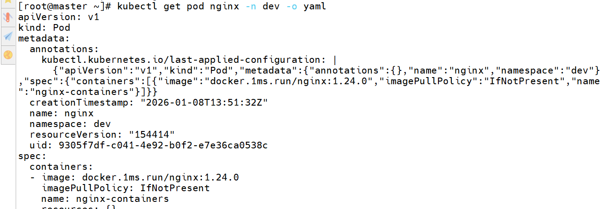

***

```yaml
# 使用如下命令可以编辑上面通过yaml创建的pod，而且是进入到一个文件中进行编辑。（了解，不需要操作）
[root@master ~]# kubectl edit pod nginx -n dev
```

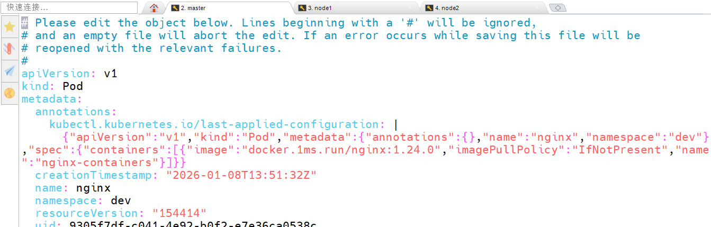

***

使用推荐：三种方式应该怎么用 ?

* 创建/更新资源 使用声明式对象配置 `kubectl apply -f XXX.yaml`
* 删除资源 使用命令式对象配置 `kubectl delete -f XXX.yaml`
* 查询资源 使用命令式对象管理 `kubectl get(describe) 资源名称`
* 查看详情 使用 `kubectl describe 资源名称`

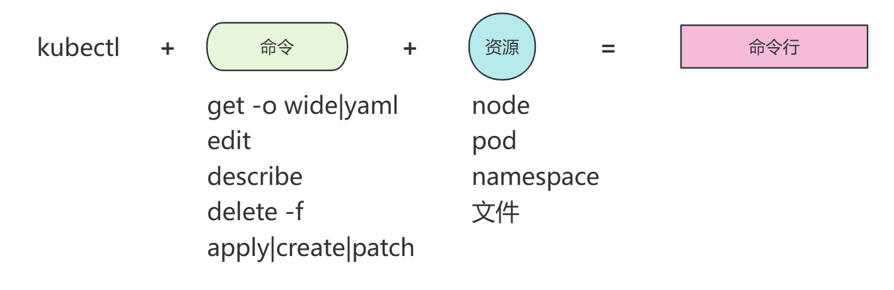

## 总结

1、Yaml 语言以\_\_\_\_\_\_为中心，没有复杂的标识语言；

2、Yaml 语言对大小写是否敏感？

3、Yaml 语言对缩进格数有没有要求？但是要求相同的缩进，必须左对齐；

4、以下是常用的命令

kubectl <font style="color:rgb(216,57,49);">get </font>node/pod/namespace/secret/configmap xxx

kubectl <font style="color:rgb(216,57,49);">edit </font>pod/deployment -n kube-system xxx

kubectl <font style="color:rgb(216,57,49);">describe </font>pod -n kube-system xxx

kubectl delete pod -n kube-system

kubectl create/<font style="color:rgb(216,57,49);">apply </font>-f xxx.yaml

5、以下命令有什么区别？

kubectl get pod -n dev nginx

kubectl get pod -n dev nginx <font style="color:rgb(216,57,49);">-o yaml</font>

# 三、【实践】部署 Nginx 服务

## Namespace

### 相关概念

Namespace 是 kubernetes 集群中的一种非常重要资源，它的主要作用是用来实现**多套环境的资源隔离**或者**多租户的资源隔离**。

默认情况下，kubernetes 集群中的所有的 Pod 都是可以相互访问的。但是在实际中，可能不想让两个 Pod 之间进行互相的访问，那此时就可以将两个 Pod 划分到不同的 namespace 下。kubernetes 通过将集群内部的资源分配到不同的 Namespace 中，可以形成逻辑上的"组"，以方便不同的组的资源进行隔离使用和管理。

可以通过 kubernetes 的授权机制，将不同的 namespace 交给不同租户进行管理，这样就实现了多租户的资源隔离。


kubernetes 在集群启动之后，会默认创建几个 namespace

```shell
[root@master ~]# kubectl get namespace
或者
[root@master ~]# kubectl get ns
NAME              STATUS   AGE			
default           Active   2d19h		# 所有未指定Namespace的对象都会被分配在default命名空间
kube-flannel      Active   2d8h			# flannel网络插件的命名空间
kube-node-lease   Active   2d19h		# 集群节点之间的心跳维护，v1.13开始引入
kube-public       Active   2d19h		# 此命名空间下的资源可以被所有人访问（包括未认证用户）
kube-system       Active   2d19h		# 所有由Kubernetes系统创建的资源都处于这个命名空间
```

```shell
# 查看所有的pod，没有指定命名空间，那么就是查看default这个默认的命名空间
[root@master ~]# kubectl get pod
No resources found in default namespace.

# 查看命令空间default中的pod
[root@master ~]# kubectl get pod -n default
No resources found in default namespace.
```

下面来看 namespace 资源的具体操作。

### **查看**

```shell
# 1 查看所有的ns  命令：kubectl get ns
[root@master ~]# kubectl get ns
NAME              STATUS   AGE
default           Active   2d19h
kube-flannel      Active   2d8h
kube-node-lease   Active   2d19h
kube-public       Active   2d19h
kube-system       Active   2d19h

# 2 查看指定的ns   命令：kubectl get ns ns名称
[root@master ~]# kubectl get ns default
NAME      STATUS   AGE
default   Active   2d19h

# 3 指定输出格式  命令：kubectl get ns ns名称  -o 格式参数
# kubernetes支持的格式有很多，比较常见的是wide、json、yaml
[root@master ~]# kubectl get ns default -o yaml
apiVersion: v1
kind: Namespace
metadata:
  creationTimestamp: "2026-01-06T13:41:37Z"
  labels:
    kubernetes.io/metadata.name: default
  name: default
  resourceVersion: "40"
  uid: 4145ebc4-32c9-4694-a75e-44312561c243
spec:
  finalizers:
  - kubernetes
status:
  phase: Active

# 4 查看ns详情  命令：kubectl describe ns ns名称
[root@master ~]# kubectl describe ns default
Name:         default
Labels:       kubernetes.io/metadata.name=default
Annotations:  <none>
Status:       Active

No resource quota.				# ResourceQuota 针对namespace做的资源限制

No LimitRange resource.		# LimitRange针对namespace中的每个组件做的资源限制
```

### **创建**

```shell
# 创建namespace
[root@master ~]# kubectl create ns dev
namespace/dev created
```

### **删除**

```shell
# 删除namespace
[root@master ~]# kubectl delete ns dev
namespace "dev" deleted
```

### **Yaml 形式**

首先准备一个 yaml 文件：ns-dev.yaml

```yaml
apiVersion: v1
kind: Namespace
metadata:
  name: dev
```

然后就可以执行对应的创建和删除命令了：

创建：kubectl <font style="color:rgb(216,57,49);">create</font> -f ns-dev.yaml

删除：kubectl <font style="color:rgb(216,57,49);">delete </font>-f ns-dev.yaml

## Pod

### 相关概念

Pod 是 kubernetes 集群进行管理的最小单元，<font style="color:rgb(216,57,49);">程序</font>要运行必须部署在<font style="color:rgb(216,57,49);">容器</font>中，而容器必须存在于 <font style="color:rgb(216,57,49);">Pod </font>中。

Pod 可以认为是容器的封装，一个 Pod 中可以存在一个或者多个容器。

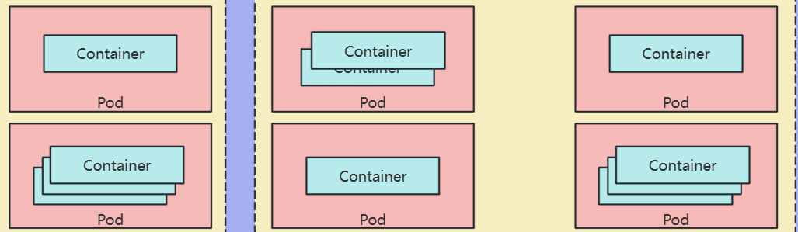

kubernetes 在集群启动之后，集群中的各个组件也都是以 Pod 方式运行的。可以通过下面命令查看：

```shell
[root@master ~]# kubectl get pod -n kube-system
NAME                             READY   STATUS    RESTARTS        AGE
coredns-cb4864fb5-lv4ll          1/1     Running   0               2d19h
coredns-cb4864fb5-qm96s          1/1     Running   0               2d19h
etcd-master                      1/1     Running   0               2d19h
kube-apiserver-master            1/1     Running   0               2d19h
kube-controller-manager-master   1/1     Running   0               2d19h
kube-proxy-nzq82                 1/1     Running   0               2d19h
kube-proxy-xjnws                 1/1     Running   0               2d8h
kube-proxy-z7rrq                 1/1     Running   3 (5h54m ago)   2d8h
kube-scheduler-master            1/1     Running   0               2d19h
```

### **创建并运行**

kubernetes 没有提供单独运行 Pod 的命令，都是通过 Pod 控制器来实现的。

```shell
# 命令格式： kubectl run (pod控制器名称) [参数] 
[root@master ~]# kubectl run pod-nginx --image=registry.openanolis.cn/openanolis/nginx:1.14.1-8.6 --port=80 --namespace=dev
pod/pod-nginx created

选项参数说明：
--image  指定Pod的镜像
--port   指定端口
--namespace  指定 namespace
具体参数，可以查看 
kubectl run --help
kubectl options
```

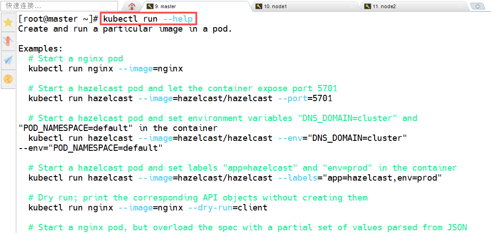

### **查看**

```shell
# 查看Pod基本信息
[root@master ~]# kubectl get pod -n dev
NAME        READY   STATUS    RESTARTS   AGE
pod-nginx   1/1     Running   0          3m

# 查看Pod的详细信息(排错用)
[root@master ~]# kubectl describe pod pod-nginx -n dev
Name:             pod-nginx
Namespace:        dev
Priority:         0
Service Account:  default
Node:             node2/192.168.126.137
Start Time:       Fri, 09 Jan 2026 17:15:50 +0800
Labels:           run=pod-nginx
Annotations:      <none>
Status:           Running
IP:               10.244.2.4
IPs:
  IP:  10.244.2.4
Containers:
  pod-nginx:
    Container ID:   containerd://4514a18fa97161a111b99fc6881f704a1710820a156a13219c6d298a02e8c657
    Image:          registry.openanolis.cn/openanolis/nginx:1.14.1-8.6
    Image ID:       registry.openanolis.cn/openanolis/nginx@sha256:55dcb729c46f2028126f2a57417712c4d77a947ecb409e445bf0c2e59d100640
    Port:           80/TCP
    Host Port:      0/TCP
    State:          Running
      Started:      Fri, 09 Jan 2026 17:18:31 +0800
    Ready:          True
    Restart Count:  0
    Environment:    <none>
    Mounts:
      /var/run/secrets/kubernetes.io/serviceaccount from kube-api-access-9r6qb (ro)
Conditions:
  Type                        Status
  PodReadyToStartContainers   True
  Initialized                 True
  Ready                       True
  ContainersReady             True
  PodScheduled                True
Volumes:
  kube-api-access-9r6qb:
    Type:                    Projected (a volume that contains injected data from multiple sources)
    TokenExpirationSeconds:  3607
    ConfigMapName:           kube-root-ca.crt
    ConfigMapOptional:       <nil>
    DownwardAPI:             true
QoS Class:                   BestEffort
Node-Selectors:              <none>
Tolerations:                 node.kubernetes.io/not-ready:NoExecute op=Exists for 300s
                             node.kubernetes.io/unreachable:NoExecute op=Exists for 300s
Events:
  Type    Reason     Age    From               Message
  ----    ------     ----   ----               -------
  Normal  Scheduled  4m25s  default-scheduler  Successfully assigned dev/pod-nginx to node2
  Normal  Pulling    4m24s  kubelet            Pulling image "registry.openanolis.cn/openanolis/nginx:1.14.1-8.6"
  Normal  Pulled     104s   kubelet            Successfully pulled image "registry.openanolis.cn/openanolis/nginx:1.14.1-8.6" in 2m39.622s (2m39.622s including waiting). Image size: 201664608 bytes.
  Normal  Created    104s   kubelet            Created container: pod-nginx
  Normal  Started    104s   kubelet            Started container pod-nginx
```

### **访问**

```shell
# 获取podIP
[root@master ~]# kubectl get pod -n dev -o wide
NAME        READY   STATUS    RESTARTS   AGE     IP           NODE    NOMINATED NODE   READINESS GATES
pod-nginx   1/1     Running   0          5m41s   10.244.2.4   node2   <none>           <none>

#访问pod
[root@master ~]# curl http://10.244.2.4:80
<!DOCTYPE html>
<html>
<head>
	<title>Welcome to nginx!</title>
</head>
<body>
	<p><em>Thank you for using nginx.</em></p>
</body>
</html>
```

### **删除**

```shell
# 删除pod
[root@master ~]# kubectl delete pod pod-nginx -n dev
pod "pod-nginx" deleted

# 强制删除pod
[root@master ~]# kubectl delete pod pod-nginx -n dev --force

# 查看指定命名空间中的pod
[root@master ~]# kubectl get pod -n dev
No resources found in dev namespace.
```

### **Yaml 形式**

创建一个 pod-nginx.yaml，内容如下：

```yaml
apiVersion: v1
kind: Pod
metadata:
  name: nginx
  namespace: dev
spec:
  containers:
  - image: registry.openanolis.cn/openanolis/nginx:1.14.1-8.6
    name: pod
    imagePullPolicy: IfNotPresent
    ports:
    - name: nginx-port
      containerPort: 80
      protocol: TCP
```

然后就可以执行对应的创建和删除命令了：

创建：kubectl <font style="color:rgb(216,57,49);">create </font>-f pod-nginx.yaml

删除：kubectl <font style="color:rgb(216,57,49);">delete </font>-f pod-nginx.yaml

### 常见报错

#### 镜像拉取失败

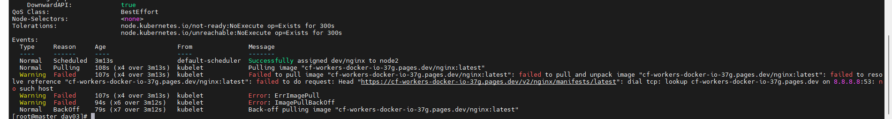

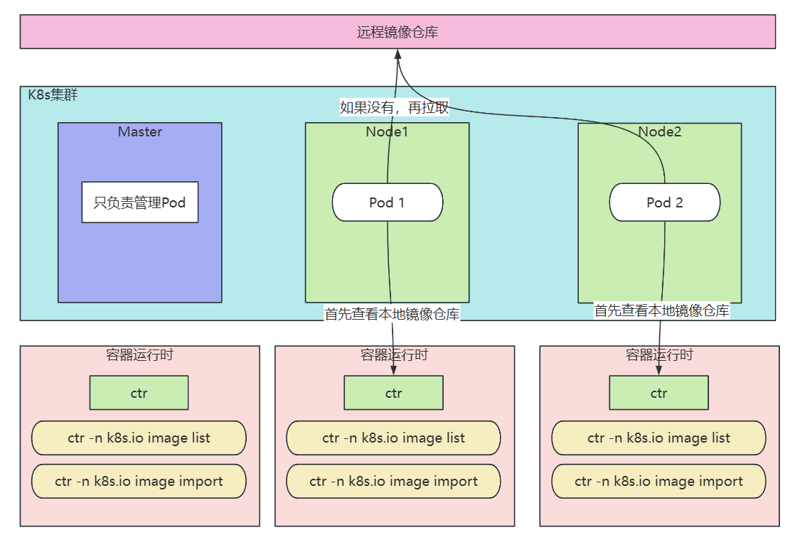

#### 命名空间没有创建

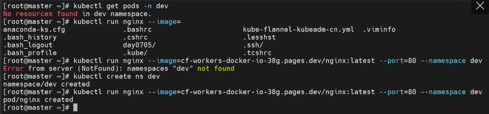

需要创建命名空间

```yaml
kubectl create ns dev
```

#### 名称中包含下划线，提示无效

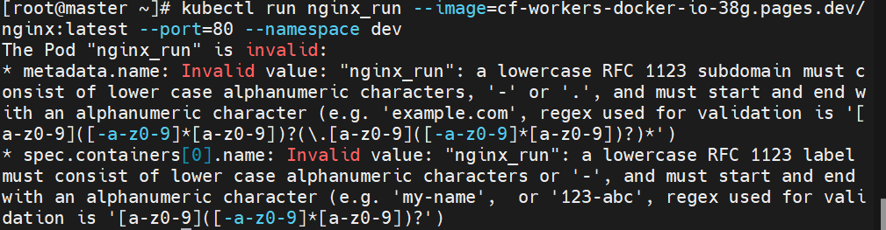

把 nginx\_run 改成 nginx-run 可以了，改成中划线。

## Label（上面已讲）

Label 是 kubernetes 系统中的一个重要概念。它的作用就是在资源上添加标识，用来对它们进行区分和选择。

### 相关特性

* 一个 Label 会以 <font style="color:rgb(216,57,49);">key/value 键值对 </font>的形式附加到各种对象上，如 Node、Pod、Service 等等
* 一个资源对象可以定义任意数量的 Label ，同一个 Label 也可以被添加到任意数量的资源对象上去
* Label 通常在资源对象定义时确定，当然也可以在对象创建后动态添加或者删除

可以通过 Label 实现资源的多维度分组，以便灵活、方便地进行资源分配、调度、配置、部署等管理工作。

### 相关案例

* 版本标签："version":"release", "version":"stable"......
* 环境标签："environment":"dev"，"environment":"test"，"environment":"pro"
* 架构标签："tier":"frontend"，"tier":"backend"

## Deployment 部署

在 kubernetes中，Pod 是最小的控制单元，但是 kubernetes 很少直接控制 Pod，一般都是通过 Pod 控制器来完成的。

### 相关概念

Pod 控制器用于 pod 的管理，确保 pod 资源符合预期的状态，**当 pod 的资源出现故障时，会尝试进行重启或重建 pod**。

在 kubernetes 中 Pod 控制器的种类有很多，本章节只介绍一种：Deployment。

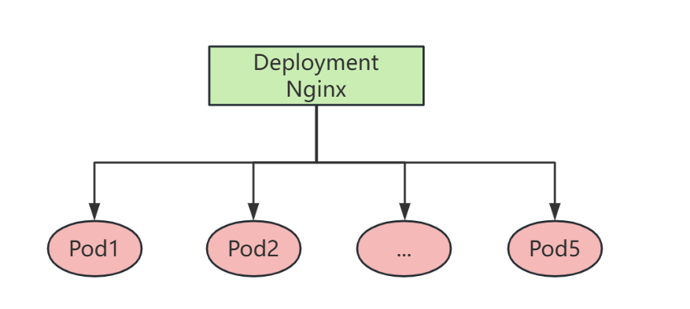

### **命令操作**

以下所有的 deployment 都可以简写为 deploy。

```yaml
# 命令格式: kubectl create deployment 名称  [参数] 
# --image  指定pod的镜像
# --port   指定端口
# --namespace  指定namespace
[root@master ~]# kubectl create deployment deploy-nginx --image=docker.1ms.run/nginx:1.24.0 -n dev
deployment.apps/deploy-nginx created

速查手册
kubectl options
kubectl run --help
kubectl run pod-nginx --image=xxx -n dev
kubectl create deploy --image=xxx -n dev
kubectl get deploy -n dev
kubectl get pod -n dev
kubectl delete pod -n dev xxx


# scale       弹性扩容
# --replicas  指定创建pod数量
[root@master ~]# kubectl scale deployment deploy-nginx --replicas=3 -n dev
deployment.apps/deploy-nginx scaled


# 查看创建的Pod
[root@master ~]# kubectl get pods -n dev
NAME                            READY   STATUS    RESTARTS   AGE
deploy-nginx-6cdb576bdd-45gpw   1/1     Running   0          92s
deploy-nginx-6cdb576bdd-7vx7v   1/1     Running   0          3m43s
deploy-nginx-6cdb576bdd-dqfvw   1/1     Running   0          92s


# 查看deployment的信息  ready是3/3 表示该deployment管理着3个pod
[root@master ~]# kubectl get deployment -n dev
NAME           READY   UP-TO-DATE   AVAILABLE   AGE
deploy-nginx   3/3     3            3           4m32s


# UP-TO-DATE：成功升级的副本数量
# AVAILABLE：可用副本的数量
[root@master ~]# kubectl get deploy -n dev -o wide
NAME           READY   UP-TO-DATE   AVAILABLE   AGE     CONTAINERS   IMAGES                        SELECTOR
deploy-nginx   3/3     3            3           6m46s   nginx        docker.1ms.run/nginx:1.24.0   app=deploy-nginx


kubectl get all
kubectl describe deploy
kubectl describe pod
kubectl describe node


# 查看deployment的详细信息
[root@master ~]# kubectl describe deploy deploy-nginx -n dev
Name:                   deploy-nginx
Namespace:              dev
CreationTimestamp:      Sat, 10 Jan 2026 10:30:16 +0800
Labels:                 app=deploy-nginx
Annotations:            deployment.kubernetes.io/revision: 1
Selector:               app=deploy-nginx
Replicas:               3 desired | 3 updated | 3 total | 3 available | 0 unavailable
StrategyType:           RollingUpdate
MinReadySeconds:        0
RollingUpdateStrategy:  25% max unavailable, 25% max surge
Pod Template:
  Labels:  app=deploy-nginx
  Containers:
   nginx:
    Image:         docker.1ms.run/nginx:1.24.0
    Port:          <none>
    Host Port:     <none>
    Environment:   <none>
    Mounts:        <none>
  Volumes:         <none>
  Node-Selectors:  <none>
  Tolerations:     <none>
Conditions:
  Type           Status  Reason
  ----           ------  ------
  Progressing    True    NewReplicaSetAvailable
  Available      True    MinimumReplicasAvailable
OldReplicaSets:  <none>
NewReplicaSet:   deploy-nginx-6cdb576bdd (3/3 replicas created)
Events:
  Type    Reason             Age    From                   Message
  ----    ------             ----   ----                   -------
  Normal  ScalingReplicaSet  9m42s  deployment-controller  Scaled up replica set deploy-nginx-6cdb576bdd to 1
  Normal  ScalingReplicaSet  7m31s  deployment-controller  Scaled up replica set deploy-nginx-6cdb576bdd to 3 from 1
  

# 删除deployment。删除deployment时，由它管理的那些pod也同时被删除了。
[root@master ~]# kubectl delete deploy deploy-nginx -n dev
deployment.apps "deploy-nginx" deleted


# 查看deployment的信息
[root@master ~]# kubectl get deploy -n dev
No resources found in dev namespace.
```

### 理论知识


通过这张图，我们要明白：

1. 在一个 node 节点中是可以运行很多个 pod 的（pod 是 k8s 中管理的最小的单位）
2. 每个 pod 中可以运行一个或多个容器
3. pod 之间使用 namespace 做资源隔离
4. 而且，同一个 namespace 中的 pod 可以分布在不同的 node 节点中

***

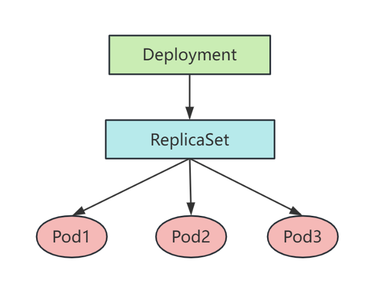

通过这张图我们要明白：

1. 我们在实际工作中不直接管理 pod，而是通过 pod 控制器去管理 pod，比如：deployment
2. 其实，在创建 deployment 时，deployment 会创建一个 replicaset（副本集），replicaset 又会创建一个 pod
3. 上面的案例中我们将 deployment 中的 pod 水平扩容，就是 deployment 通知 replicaset 扩容 pod
4. 删除 deployment 时，对应的 replicaset 和下面的 pod 就都会删除

***

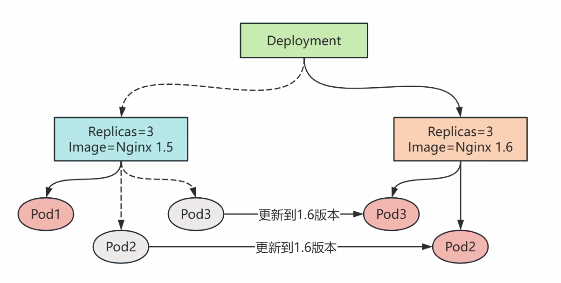

通过这张图我们先了解到：

1. 创建一个 deployment 时，deployment 会创建一个 replicaset 副本集
2. 而且我们在创建 deployment 的时候，需要指定 image 镜像，然后 replicaset 副本集通过 image 镜像创建相应的 pod
3. 当通过 deployment 进行水平扩容时，最终其实是通过 replicaset 来创建出多个 pod
4. 滚动更新，后面再讲

### **Yaml 形式**

创建 deployment，除了通过上面的命令的形式创建，还可以通过 yaml 的形式来创建。

创建一个 deploy-nginx.yaml，内容如下：

```yaml
apiVersion: v1
kind: Namespace
metadata:
  name: dev
---
apiVersion: apps/v1
kind: Deployment
metadata:
  name: nginx
  namespace: dev
spec:
  replicas: 3
  selector:
    matchLabels:
      app: nginx
  template:
    metadata:
      labels:
        app: nginx
    spec:
      containers:
      - name: nginx
        image: docker.1ms.run/nginx:1.24.0
        imagePullPolicy: IfNotPresent
        ports:
        - containerPort: 80
          protocol: TCP
```

上面的配置文件说明：

1 创建命名空间，名称是 dev

2 在命名空间 dev 中创建一个 deployment，名称是 nginx（deployment 会创建出一个 replicaset，通过 replicaset 来管理 pod）

3 创建 3 个副本，也就是 3 个 pod，并且给 pod 打标签 app=nginx

4 pod 中创建一个容器，容器的名字是 nginx，镜像是 docker.1ms.run/nginx:1.24.0，容器占用的端口号是 80

***

```yaml
# 应用上面的yaml文件创建相应的资源（注意，apply命令是可以重复执行的，重复执行也不会报错）
[root@master ~]# kubectl apply -f deploy-nginx.yaml
Warning: resource namespaces/dev is missing the kubectl.kubernetes.io/last-applied-configuration annotation which is required by kubectl apply. kubectl apply should only be used on resources created declaratively by either kubectl create --save-config or kubectl apply. The missing annotation will be patched automatically.
namespace/dev configured
deployment.apps/nginx created

# 查看资源情况，查看命名空间是dev的下面的所有资源
# 可以看到创建了一个deployment(pod控制器)，创建了一个replicaset副本集，创建了3个pod
[root@master ~]# kubectl get all -n dev
NAME                         READY   STATUS    RESTARTS   AGE
pod/nginx-788d75b68c-8bdsv   1/1     Running   0          83s
pod/nginx-788d75b68c-hcgrc   1/1     Running   0          83s
pod/nginx-788d75b68c-xwtrk   1/1     Running   0          83s

NAME                    READY   UP-TO-DATE   AVAILABLE   AGE
deployment.apps/nginx   3/3     3            3           83s

NAME                               DESIRED   CURRENT   READY   AGE
replicaset.apps/nginx-788d75b68c   3         3         3       83s

# 根据yaml配置文件删除相应的资源
[root@master ~]# kubectl delete -f deploy-nginx.yaml
namespace "dev" deleted
deployment.apps "nginx" deleted

# 再次查看dev命名空间中的资源，可以看到已经全部删除
[root@master ~]# kubectl get all -n dev
No resources found in dev namespace.
```

> replicaset 是不需要我们直接操作的，我们操作 deployment 即可，deployment 会操作 replicaset。

***

关于 pod 的其他演示 1：

```shell
# 查看k8s集群中所有的pod
[root@master ~]# kubectl get pod -A
NAMESPACE      NAME                             READY   STATUS    RESTARTS      AGE
kube-flannel   kube-flannel-ds-84ghn            1/1     Running   0             3d3h
kube-flannel   kube-flannel-ds-nrk7n            1/1     Running   5 (23h ago)   3d3h
kube-flannel   kube-flannel-ds-pcsqg            1/1     Running   0             3d3h
kube-system    coredns-cb4864fb5-lv4ll          1/1     Running   0             3d14h
kube-system    coredns-cb4864fb5-qm96s          1/1     Running   0             3d14h
kube-system    etcd-master                      1/1     Running   0             3d14h
kube-system    kube-apiserver-master            1/1     Running   0             3d14h
kube-system    kube-controller-manager-master   1/1     Running   0             3d14h
kube-system    kube-proxy-nzq82                 1/1     Running   0             3d14h
kube-system    kube-proxy-xjnws                 1/1     Running   0             3d3h
kube-system    kube-proxy-z7rrq                 1/1     Running   3 (24h ago)   3d3h
kube-system    kube-scheduler-master            1/1     Running   0             3d14h

# 查看命名空间是kube-flannel中的pod
[root@master ~]# kubectl get pod -n kube-flannel
NAME                    READY   STATUS    RESTARTS      AGE
kube-flannel-ds-84ghn   1/1     Running   0             3d3h
kube-flannel-ds-nrk7n   1/1     Running   5 (23h ago)   3d3h
kube-flannel-ds-pcsqg   1/1     Running   0             3d3h

# 查看命名空间是kube-flannel中的pod，并且显示详细信息
# 可以看到其实每个k8s集群的节点上都有一个flannel的pod，flannel是网络插件，集群节点之间需要通过它进行通信
[root@master ~]# kubectl get pod -n kube-flannel -o wide
NAME                    READY   STATUS    RESTARTS      AGE    IP                NODE     NOMINATED NODE   READINESS GATES
kube-flannel-ds-84ghn   1/1     Running   0             3d3h   192.168.126.136   node1    <none>           <none>
kube-flannel-ds-nrk7n   1/1     Running   5 (23h ago)   3d3h   192.168.126.137   node2    <none>           <none>
kube-flannel-ds-pcsqg   1/1     Running   0             3d3h   192.168.126.135   master   <none>           <none>

# 如果我们删除一个指定的kube-flannel命名空间中的pod呢？会怎么样？
# 删除kube-flannel命名空间中的一个pod
[root@master ~]# kubectl delete pod kube-flannel-ds-84ghn -n kube-flannel
pod "kube-flannel-ds-84ghn" deleted

# 然后我们再次查看命名空间是kube-flannel中的pod，并且显示详细信息
# 可以看到之前的pod确实删除了，但是又创建出来一个pod！！！这是因为这里用的其实是一个叫daemonset的pod控制器，它要确保每个k8s节点中都有一个flannel的pod，如果没有，那就创建一个！！！
[root@master ~]# kubectl get pod -n kube-flannel -o wide
NAME                    READY   STATUS    RESTARTS      AGE    IP                NODE     NOMINATED NODE   READINESS GATES
kube-flannel-ds-gvfgk   1/1     Running   0             31s    192.168.126.136   node1    <none>           <none>
kube-flannel-ds-nrk7n   1/1     Running   5 (24h ago)   3d3h   192.168.126.137   node2    <none>           <none>
kube-flannel-ds-pcsqg   1/1     Running   0             3d3h   192.168.126.135   master   <none>           <none>
```

***

关于 pod 的其他演示 2：我们上面的相关概念中提到，pod 控制器会维护 pod 的数量；比如我们创建的 pod 副本是 3 个，如果其中一个 pod 挂了，那么控制器会尝试拉起它，如果其中一个 pod 被删了，那么控制器会重新创建一个 pod（但是注意，重新创建的 pod 可能不会在原来的节点中，它是根据自己的调度算法分配节点的）！下面来演示下：

```shell
# 1.先删除之前根据deploy-nginx.yaml创建的相关资源（从下面的提示可以看到其实之前就已经删除了）
[root@master ~]# kubectl delete -f deploy-nginx.yaml
Error from server (NotFound): error when deleting "deploy-nginx.yaml": namespaces "dev" not found
Error from server (NotFound): error when deleting "deploy-nginx.yaml": deployments.apps "nginx" not found

# 2.应用deploy-nginx.yaml配置文件创建相应的资源
[root@master ~]# kubectl apply -f deploy-nginx.yaml
namespace/dev created
deployment.apps/nginx created

# 3.查看命名空间dev中的所有资源
[root@master ~]# kubectl get all -n dev
NAME                         READY   STATUS    RESTARTS   AGE
pod/nginx-788d75b68c-pqhng   1/1     Running   0          27s
pod/nginx-788d75b68c-qw7q7   1/1     Running   0          27s
pod/nginx-788d75b68c-xq9dj   1/1     Running   0          27s

NAME                    READY   UP-TO-DATE   AVAILABLE   AGE
deployment.apps/nginx   3/3     3            3           27s

NAME                               DESIRED   CURRENT   READY   AGE
replicaset.apps/nginx-788d75b68c   3         3         3       27s

# 4.删除其中一个pod
[root@master ~]# kubectl delete pod nginx-788d75b68c-pqhng -n dev
pod "nginx-788d75b68c-pqhng" deleted

# 5.再次查看命名空间dev中的资源情况，可以看到之前的pod确实删除了，但是它又创建了一个pod，因为deployment要确保pod副本数量是3个！！！
[root@master ~]# kubectl get all -n dev
NAME                         READY   STATUS    RESTARTS   AGE
pod/nginx-788d75b68c-qh2zz   1/1     Running   0          41s
pod/nginx-788d75b68c-qw7q7   1/1     Running   0          102s
pod/nginx-788d75b68c-xq9dj   1/1     Running   0          102s

NAME                    READY   UP-TO-DATE   AVAILABLE   AGE
deployment.apps/nginx   3/3     3            3           102s

NAME                               DESIRED   CURRENT   READY   AGE
replicaset.apps/nginx-788d75b68c   3         3         3       102s

# 注意：删除其中一个pod，也可以这么写命令
[root@master ~]# kubectl delete pod/nginx-788d75b68c-qh2zz -n dev
pod "nginx-788d75b68c-qh2zz" deleted
```

## Service 服务

通过上节课的学习，已经能够利用 Deployment 来创建一组 Pod 来提供具有高可用性的服务。

假设每个 pod 每天宕机的概率是10%，如果设置3个副本，每天服务宕机的概率是？ 	10% \* 10% \* 10% = 0.1%

虽然每个 Pod 都会分配一个单独的 Pod IP，然而却存在如下两问题：（其实 pod 就可以看作是一个逻辑上的电脑）

* Pod IP 会随着 Pod 的重建产生变化
* Pod IP 仅仅是集群内可见的虚拟 IP，外部无法访问

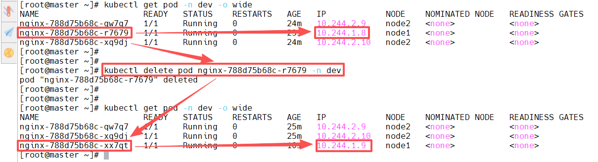

这样对于访问这个服务带来了难度。因此，kubernetes 设计了 Service 来解决这个问题。

### 相关概念

Service 可以看作是一组同类 Pod **对外的访问入口**。借助 Service，应用可以方便地实现服务发现和负载均衡。

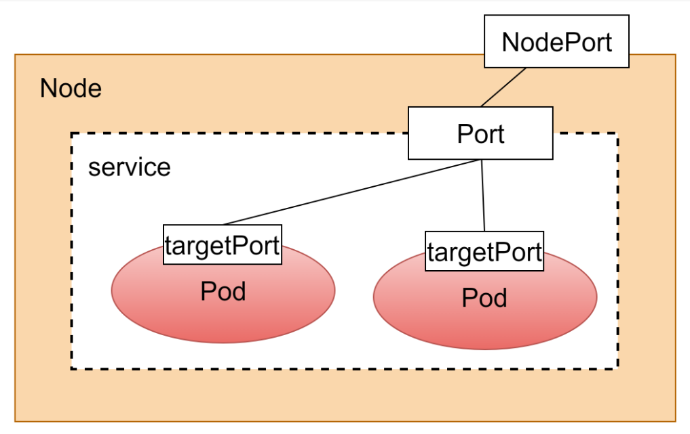

那么外界访问 pod 中的应用的流程是：客户端浏览器 => node 机器的 ip:NodePort => service 的 ip:Port => Pod 的 ip:targetPort

### 命令操作

#### 创建集群内部可访问的 Service

```shell
# 创建service(暴露service)
# kubectl exporse deployment deployment名称 --name=service名称 --type=ClusterIP --port=service端口 --target-port=pod端口 -n 命名空间
[root@master ~]# kubectl expose deployment nginx --name=service-nginx --type=ClusterIP --port=80 --target-port=80 -n dev
service/service-nginx exposed

# 查看service
[root@master ~]# kubectl get service service-nginx -n dev -o wide
NAME            TYPE        CLUSTER-IP     EXTERNAL-IP   PORT(S)   AGE     SELECTOR
service-nginx   ClusterIP   10.109.28.22   <none>        80/TCP    3m49s   app=nginx

# 这里产生了一个CLUSTER-IP，这就是service的IP，在Service的生命周期中，这个地址是不会变动的
# 可以通过这个IP访问当前service对应的POD
[root@master ~]# curl 10.109.28.22:80
<!DOCTYPE html>
<html>
<head>
<title>Welcome to nginx!</title>
<style>
html { color-scheme: light dark; }
body { width: 35em; margin: 0 auto;
font-family: Tahoma, Verdana, Arial, sans-serif; }
</style>
</head>
<body>
<h1>Welcome to nginx!</h1>
<p>If you see this page, the nginx web server is successfully installed and
working. Further configuration is required.</p>

<p>For online documentation and support please refer to
<a href="http://nginx.org/">nginx.org</a>.<br/>
Commercial support is available at
<a href="http://nginx.com/">nginx.com</a>.</p>

<p><em>Thank you for using nginx.</em></p>
</body>
</html>
```

> 创建集群内部访问的 service，它的 type 是 ClusterIP。

#### 创建集群外部也可访问的 Service

```shell
# 上面创建的Service的type类型为ClusterIP，这个ip地址只用集群内部可访问
# 如果需要创建外部也可以访问的Service，需要修改type为NodePort
[root@master ~]# kubectl expose deployment nginx --name=service-nginx2 --type=NodePort --port=80 --target-port=80 -n dev
service/service-nginx2 exposed

# 此时查看，会发现出现了NodePort类型的Service，而且有一对Port（80:32097/TCP）,其实NodePort的值是30000以上的一个随机值
[root@master ~]# kubectl get service service-nginx2 -n dev -o wide
NAME             TYPE       CLUSTER-IP      EXTERNAL-IP   PORT(S)        AGE   SELECTOR
service-nginx2   NodePort   10.102.14.248   <none>        80:32097/TCP   44s   app=nginx

# 接下来就可以通过集群外的主机访问 (k8s任意)节点IP:32097访问服务了
# 80:32097/TCP，对应上面的图中，80表示Port、32097表示NodePort
```

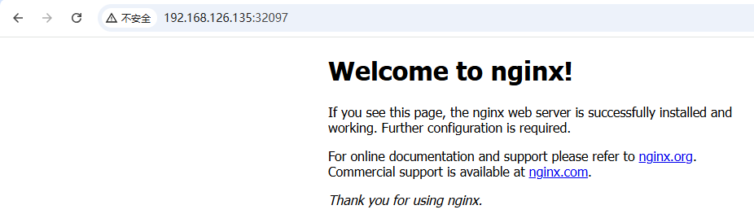

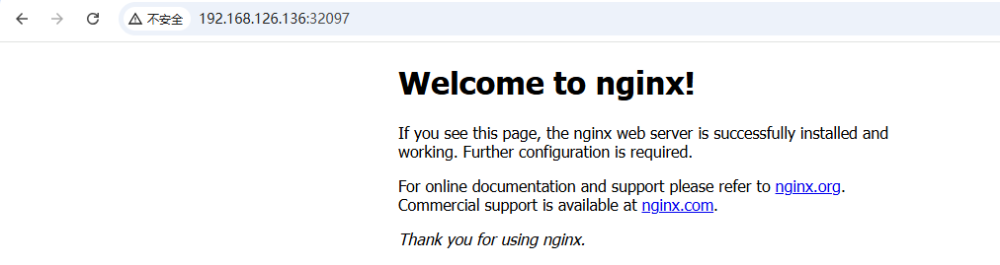

#### 删除 Service

```shell
# 1 查看dev命名空间中的service
[root@master ~]# kubectl get service -n dev
NAME             TYPE        CLUSTER-IP      EXTERNAL-IP   PORT(S)        AGE
service-nginx    ClusterIP   10.109.28.22    <none>        80/TCP         124m
service-nginx2   NodePort    10.102.14.248   <none>        80:32097/TCP   4m18s

# 2 删除dev命名空间中指定的service
[root@master ~]# kubectl delete service service-nginx -n dev
service "service-nginx" deleted

# 3 再次查看dev命名空间中的service
[root@master ~]# kubectl get service -n dev
NAME             TYPE       CLUSTER-IP      EXTERNAL-IP   PORT(S)        AGE
service-nginx2   NodePort   10.102.14.248   <none>        80:32097/TCP   4m37s


或者
kubectl get all -n dev 
kubectl delete -n dev service/service-nginx

另外，service可以简写为svc
```

### **Yaml 形式**

创建一个 svc-nginx.yaml，内容如下：

```yaml
apiVersion: v1
kind: Service
metadata:
  name: svc-nginx
  namespace: dev
spec:
  ports:
  - port: 80                  # Service 端口，NodePort不需要指定，会随机生成30000多的端口
    protocol: TCP
    targetPort: 80            # Pod 端口
  selector:
    app: nginx
  type: ClusterIP
```

然后就可以执行对应的创建和删除命令了。

创建：kubectl apply -f svc-nginx.yaml

删除：kubectl delete -f svc-nginx.yaml

## **总结**

至此，已经掌握了 Namespace、Pod、Deployment、Service 资源的基本操作。

有了这些操作，就可以在 kubernetes 集群中实现一个服务的简单部署和访问了。

但是如果想要更好的使用 kubernetes，就需要深入学习这几种资源的细节和原理。

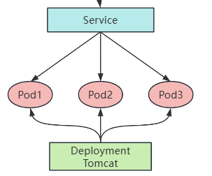

# 四、【掌握】Pod 基础

## Pod 基本概念


**Docker、Container、Pod 之间的关系**

Dock 表示码头。Docker 表示在码头上的工人，码头工，他们干的事情就是搬运集装箱（调度容器）。

Container就是表示容器。

DotCloud 公司开发了一款产品 Paas 云平台产品 docker。由于 docker 太火了，干脆就把自己公司的名字改成了 Docker。

* Pod 是 Kubernetes 最小的管理单位，一个 Pod 可以封装**一个容器或多个容器**
* 一个 Pod 里的多个容器可以**共享存储和网络**, 可以看作一个逻辑的主机
* 多个容器共享同一个 network namespace，由此在一个 Pod 里的多个容器共享 Pod 的 IP 和端口 namespace，所以一个 Pod 内的多个容器之间可以通过 localhost 来进行通信,所需要注意的是不同容器要注意不要有端口冲突即可。不同的 Pod 有不同的 IP,不同 Pod 内的多个容器之间通信，不可以使用IPC（如果没有特殊指定的话）通信，通常情况下使用 Pod 的 IP 进行通信。
* 一个 Pod 里的多个容器可以共享存储卷，这个存储卷会被定义为 Pod 的一部分，并且可以挂载到该 Pod 里的所有容器的文件系统上。

### 结构

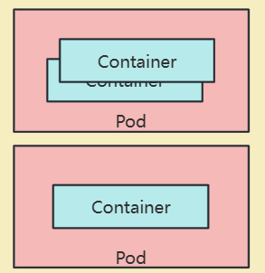

每个 Pod 中都可以包含一个或者多个容器，这些容器可以分为两类：

* 用户程序所在的容器，数量可多可少；
* Pause 容器，这是每个 Pod 都会有的一个**根容器**，它的作用有两个：
  * 可以以它为依据，评估整个 Pod 的健康状态
  * 可以在根容器上设置 IP 地址，其它容器都使用此 IP（Pod IP），以实现 Pod 内部的网路通信

这里是 Pod 内部的通讯，Pod 的之间的通讯采用**虚拟二层网络技术**来实现，我们当前环境用的是 Flannel

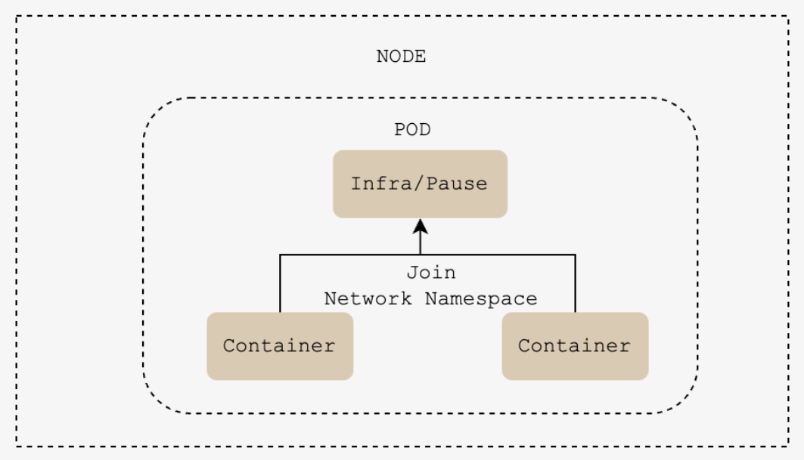

\*\*Pod -> 容器 \*\*可以理解为 **逻辑主机 -> 进程**

### 分类

pod 可分为:

* **无控制器管理的自主式 pod（不到10%）** 没有副本控制器控制，删除自主式 pod 后不会重新创建；（我们之前直接通过 `kubectl run --image=xxx`创建的 pod 就属于这种）
* **控制器管理的 pod（大于90%）** 控制器会按照定义的策略控制 pod 的数量，发现 pod 数量少了，会立即自动建立出来新的pod；一旦发现 pod 多了，也会自动杀死多余的 Pod；

有控制器(Controller)管理的 pod 也比较多，比如 Deployment、ReplicaSet、DaemonSet、StatefulSet 等。后续在讲到 Controller 时将会逐步学习。

* \*\*Deployment \*\*用于部署<font style="color:rgb(216,57,49);">无状态应用</font>，管理 Pod 的创建、更新等；
* ReplicaSet 确保 Pod 副本数量（一般没有人主动创建它）；
* **DaemonSet** 保证<font style="color:rgb(216,57,49);">每个节点</font>都运行<font style="color:rgb(216,57,49);">一个</font> Pod 副本；
* StatefulSet 用于管理有状态应用，为 Pod 提供稳定的<font style="color:rgb(216,57,49);">网络标识和存储。</font>

## Pod 的 YAML 格式

### 语法定义

先看一个 yaml 格式的 pod 定义文件解释

```yaml
kubectl get pod -o yaml/wide/json
```

```yaml
# yaml格式的pod定义文件完整内容：
apiVersion: v1       #必选，api版本号，例如v1
kind: Pod       	#必选，Pod
metadata:       	#必选，元数据
  name: string       #必选，Pod名称
  namespace: string    #Pod所属的命名空间,默认在default的namespace
  labels:     		 # 自定义标签
    - name: string     #自定义标签名字
  annotations:        #自定义注释列表
    - name: string
spec:         #必选，Pod中容器的详细定义(期望)
  containers:      #必选，Pod中容器列表
  - name: string     #必选，容器名称
    image: string    #必选，容器的镜像名称
    imagePullPolicy: [Always | Never | IfNotPresent] #获取镜像的策略 Alawys表示下载镜像 IfnotPresent表示优先使用本地镜像，否则下载镜像，Nerver表示仅使用本地镜像
    command: [string]    #容器的启动命令列表，如不指定，使用打包时使用的启动命令
    args: [string]     #容器的启动命令参数列表
    workingDir: string     #容器的工作目录
    volumeMounts:    #挂载到容器内部的存储卷配置
    - name: string     #引用pod定义的共享存储卷的名称，需用volumes[]部分定义的的卷名
      mountPath: string    #存储卷在容器内mount的绝对路径，应少于512字符
      readOnly: boolean    #是否为只读模式
    ports:       #需要暴露的端口号列表
    - name: string     #端口号名称
      containerPort: int   #容器需要监听的端口号
      hostPort: int    #容器所在主机需要监听的端口号，默认与Container相同
      protocol: string     #端口协议，支持TCP和UDP，默认TCP
    env:       #容器运行前需设置的环境变量列表
    - name: string     #环境变量名称
      value: string    #环境变量的值
    resources:       #资源限制和请求的设置
      limits:      #资源限制的设置
        cpu: string    #Cpu的限制，单位为core数，将用于docker run --cpu-shares参数
        memory: string     #内存限制，单位可以为Mib/Gib，将用于docker run --memory参数
      requests:      #资源请求的设置
        cpu: string    #Cpu请求，容器启动的初始可用数量
        memory: string     #内存清求，容器启动的初始可用数量
    livenessProbe:     #对Pod内个容器健康检查的设置，当探测无响应几次后将自动重启该容器，检查方法有exec、httpGet和tcpSocket，对一个容器只需设置其中一种方法即可
      exec:      #对Pod容器内检查方式设置为exec方式
        command: [string]  #exec方式需要制定的命令或脚本
      httpGet:       #对Pod内个容器健康检查方法设置为HttpGet，需要制定Path、port
        path: string
        port: number
        host: string
        scheme: string
        HttpHeaders:
        - name: string
          value: string
      tcpSocket:     #对Pod内个容器健康检查方式设置为tcpSocket方式
         port: number
       initialDelaySeconds: 0  #容器启动完成后首次探测的时间，单位为秒
       timeoutSeconds: 0   #对容器健康检查探测等待响应的超时时间，单位秒，默认1秒
       periodSeconds: 0    #对容器监控检查的定期探测时间设置，单位秒，默认10秒一次
       successThreshold: 0
       failureThreshold: 0
       securityContext:
         privileged:false
    restartPolicy: [Always | Never | OnFailure] # Pod的重启策略，Always表示一旦不管以何种方式终止运行，kubelet都将重启，OnFailure表示只有Pod以非0退出码退出才重启，Nerver表示不再重启该Pod
    nodeSelector: obeject  # 设置NodeSelector表示将该Pod调度到包含这个label的node上，以key：value的格式指定
    imagePullSecrets:    #Pull镜像时使用的secret名称，以key：secretkey格式指定
    - name: string
    hostNetwork:false      #是否使用主机网络模式，默认为false，如果设置为true，表示使用宿主机网络
    volumes:       #在该pod上定义共享存储卷列表
    - name: string     #共享存储卷名称 （volumes类型有很多种）
      emptyDir: {}     #类型为emtyDir的存储卷，与Pod同生命周期的一个临时目录。为空值
      hostPath: string     #类型为hostPath的存储卷，表示挂载Pod所在宿主机的目录
        path: string     #Pod所在宿主机的目录，将被用于同期中mount的目录
      secret:      #类型为secret的存储卷，挂载集群与定义的secret对象到容器内部
        scretname: string  
        items:     
        - key: string
          path: string
      configMap:     #类型为configMap的存储卷，挂载预定义的configMap对象到容器内部
        name: string
        items:
        - key: string
          path: string
```

#### 三大重启策略 restartPolicy

restartPolicy：\[Always | Never | OnFailure]

Pod 的重启策略，Always 表示一旦不管以何种方式终止运行，kubelet 都将重启，OnFailure 表示只有 Pod 以非 0 退出码退出才重启，Nerver 表示不再重启该 Pod。

| **<font style="color:rgba(0, 0, 0, 0.9);">策略类型</font>** | **<font style="color:rgba(0, 0, 0, 0.9);">适用控制器</font>** | **<font style="color:rgba(0, 0, 0, 0.9);">Pod终止后行为</font>** |
| :---: | :---: | :---: |
| <font style="color:#1f2329;">Always</font> | <font style="color:rgba(0, 0, 0, 0.9);">Deployment/StatefulSet</font> | <font style="color:rgba(0, 0, 0, 0.9);">自动重启（无限次）</font> |
| <font style="color:#f54a45;">OnFailure</font> | <font style="color:rgba(0, 0, 0, 0.9);">Job/CronJob</font> | <font style="color:rgba(0, 0, 0, 0.9);">非0退出码时重启（可设上限）</font> |
| <font style="color:rgba(0, 0, 0, 0.9);">Never</font> | <font style="color:rgba(0, 0, 0, 0.9);">Job/DaemonSet</font> | <font style="color:rgba(0, 0, 0, 0.9);">不重启（记录失败状态）</font> |

#### 三大拉取策略 imagePullPolicy

| **<font style="color:rgb(0, 0, 0);">策略值</font>** | **<font style="color:rgb(0, 0, 0);">含义</font>** | **<font style="color:rgb(0, 0, 0);">适用场景</font>** |
| :---: | --- | --- |
| <font style="color:rgb(0, 0, 0);">Always</font> | <font style="color:rgb(0, 0, 0);">每次启动 Pod 都强制拉取镜像</font> | <font style="color:rgb(0, 0, 0);">用于开发测试环境或镜像常更新</font> |
| <font style="color:#f54a45;">IfNotPresent</font> | <font style="color:rgb(0, 0, 0);">本地有就用本地镜像，没有再拉</font> | <font style="color:rgb(0, 0, 0);">默认策略(非 :latest 镜像)</font> |
| <font style="color:rgb(0, 0, 0);">Never</font> | <font style="color:rgb(0, 0, 0);">从不拉镜像，只用本地已有镜像</font> | <font style="color:rgb(0, 0, 0);">离线部署、镜像预加载场景</font> |

### api-versions 版本

查看 api 版本

```shell
[root@master ~]# kubectl api-versions
```

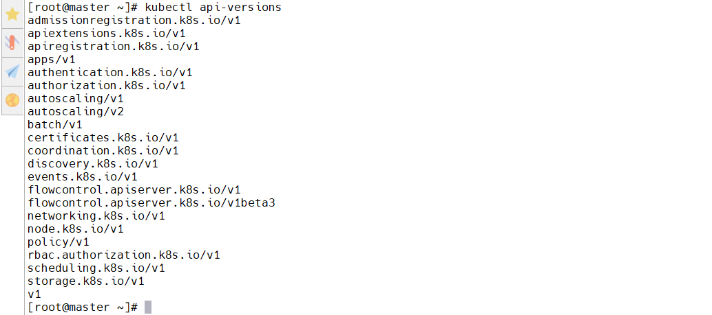

### explain 解释

查看 yaml 文件中各种资源的写法：

```shell
[root@master ~]# kubectl explain namespace
[root@master ~]# kubectl explain pod
[root@master ~]# kubectl explain pod.spec
[root@master ~]# kubectl explain pod.spec.containers
```

## 创建 Pod

第一步：准备 yaml 文件（yaml 中没有指定命名空间，默认使用的是 default）

```yaml
[root@master ~]# vim pod1.yaml
apiVersion: v1					# api版本(不同版本语法有少量差异),这里为v1.
kind: Pod					# 资源类型为Pod
metadata:						
  name: memory-demo				# 自定义pod的名称
spec:
  containers:					# 定义pod里包含的容器
  - name: demo					# 自定义pod中的容器名
    # image: polinux/stress:1.0.4		        # 启动容器的镜像名
    image: polinux/stress:1.0.4
    command: ["stress"]			# 自定义启动容器时要执行的命令(类似dockerfile里的CMD)
    args: ["--vm", "1", "--vm-bytes", "150M", "--timeout", "20"] # 自定义启动容器执行命令的参数
    
# polinux/stress这个镜像用于压力测试,在启动容器时传命令与参数就是相当于分配容器运行时需要的压力，相关参数如下：
--vm-bytes 表示malloc分配多少内存
--vm-hang 表示malloc分配的内存多少时间后在free()释放掉
--vm 指定进程数量
--timeout 表示执行时间，单位为s，执行20s之后，进程结束
```

说明：镜像拉取策略 imagePullPolicy

* Always：不管本地有没有镜像，都要从仓库中下载镜像
* Never：从来不从仓库下载镜像，只用本地镜像，本地没有就算了
* IfNotPresent：如果本地存在就直接使用，不存在才从仓库下载

默认的策略是：

* 当镜像标签版本是 latest，默认策略就是 Always
* 如果指定特定版本，默认拉取策略就是 IfNotPresent。

```shell
# 如果拉取镜像特别慢，也可以先拉取到本地，我们接下来介绍方法：
# 1、查看本地有哪些镜像的命名空间（我们用的 containerd 作为运行时）
[root@master ~]# ctr ns ls
NAME   LABELS
k8s.io

# 2、拉取镜像到指定的命名空间，比如 k8s.io
[root@master ~]# ctr -n k8s.io i pull docker.1ms.run/polinux/stress:1.0.4

# 3.1 、拉下来之后，就可以把上个章节 Yaml 中的 image 改成 
#  image: docker.1ms.run/polinux/stress:1.0.4

# 3.2 或者重新打一个标签 polinux/stress
ctr -n k8s.io i tag docker.1ms.run/polinux/stress:latest polinux/stress:1.0.4
```

第二步：通过 yaml 文件创建 pod

```shell
[root@master ~]# kubectl apply -f pod1.yaml
pod/memory-demo created
```

查看 pod 信息

```shell
[root@master ~]# kubectl get pod
NAME          READY   STATUS    RESTARTS      AGE
memory-demo   1/1     Running   3 (26s ago)   107s
```

查看 pod 详细信息

```shell
[root@master ~]# kubectl get pod -o wide

[root@master ~]# kubectl get pod -o yaml
```

描述 pod 详细信息，查看容器当前是否起来

```shell
[root@master ~]# kubectl describe pod memory-demo
```

由于压力测试进行了时长 --timeout 约束，我们在执行指定时间后，容器进程终止，为<font style="color:rgb(216,57,49);"> Completed</font>。

但是由于 <font style="color:rgb(216,57,49);">restartPolicy 参数默认是 Always</font>，所以，在短暂的完成后，容器又会重新拉起。

```shell
[root@master ~]# kubectl get pod
NAME          READY   STATUS    RESTARTS      AGE
memory-demo   1/1     Running   3 (36s ago)   112s

[root@master ~]# kubectl get pod
NAME          READY   STATUS      RESTARTS      AGE
memory-demo   0/1     Completed   2 (44s ago)   86s
```

## Pod 标签 Label

删除 pod

```shell
[root@master ~]# kubectl delete pod memory-demo
pod "memory-demo" deleted
```

重新建立带有 Label 标签的 Pod，修改 pod1.yaml 文件如下：

```yaml
apiVersion: v1
kind: Pod
metadata:
  name: memory-demo
  namespace: kube-system
  labels:
    version: "1.0" 
    env: "dev"
spec:
  containers:
  - name: demo
    # image: polinux/stress
    imagePullPolicy: IfNotPresent   # 优化拉取策略，本地没有再去拉取
    image: docker.1ms.run/polinux/stress:1.0.4
    command: ["stress"]
    args: ["--vm", "1", "--vm-bytes", "150M", "--timeout", "100"]
```

```yaml
# 1. 创建pod
[root@master ~]# kubectl apply -f pod1.yaml
pod/memory-demo created

# 2. 查看pod信息
[root@master ~]# kubectl get pod memory-demo -n kube-system --show-labels
NAME          READY   STATUS    RESTARTS   AGE   LABELS
memory-demo   1/1     Running   0          53s   env=dev,version=1.0
```

## Pod资源限制

准备 2 个不同限制方式的创建 pod 的 yaml 文件

```yaml
[root@master ~]# vim pod-150.yml
apiVersion: v1
kind: Namespace
metadata:
  name: namespace1
---
apiVersion: v1
kind: Pod
metadata:
  name: memory-demo-1
  namespace: namespace1
spec:
  restartPolicy: Never
  containers:
  - name: memory-demo-ctr1
    image: docker.1ms.run/polinux/stress:1.0.4
    imagePullPolicy: IfNotPresent
    resources:
      limits:
        memory: "200Mi"
      requests:
        memory: "100Mi"
    command: ["stress"]				    # 启动容器时执行的命令
    args: ["--vm", "1", "--vm-bytes", "150M", "--timeout", "30"]  # 产生1个进程分配150M内存30s后释放
```

```yaml
[root@master ~]# vim pod-250.yml
apiVersion: v1
kind: Namespace
metadata:
  name: namespace1
---
apiVersion: v1
kind: Pod
metadata:
  name: memory-demo-2
  namespace: namespace1
spec:
  restartPolicy: Never
  containers:
  - name: memory-demo-ctr2
    image: docker.1ms.run/polinux/stress:1.0.4
    imagePullPolicy: IfNotPresent
    resources:
      limits:
        memory: "200Mi"
      requests:
        memory: "100Mi"
    command: ["stress"]
    args: ["--vm", "1", "--vm-bytes", "250M", "--timeout", "30"]
```

创建 pod：

```shell
[root@master ~]# kubectl apply -f pod-150.yml
namespace/namespace1 created
pod/memory-demo-1 created

[root@master ~]# kubectl apply -f pod-250.yml
namespace/namespace1 unchanged
pod/memory-demo-2 created
```

查看 pod 信息：

```powershell
[root@master ~]# kubectl get pod -n namespace1
NAME            READY   STATUS      RESTARTS   AGE
memory-demo-1   0/1     Completed   0          78s
memory-demo-2   0/1     OOMKilled   0          74s

查看会发现memory-demo-2这个pod状态变为OOMKilled，因为它是内存不足所以显示Container被杀死
```

说明：一旦 pod 中的容器挂了，我们就把容器重启。策略包括如下：

* Always：表示容器挂了总是重启，这是默认策略
* OnFailures：表容器状态为错误时才重启，也就是容器正常终止时才重启
* <font style="color:rgb(216,57,49);">Never：表示容器挂了不予重启 </font>
* 对于 Always 这种策略，容器只要挂了，就会立即重启，这样是很耗费资源的。所以 Always 重启策略是这么做的：第一次容器挂了立即重启，如果再挂了就要延时 10s 重启，第三次挂了就等 20s 重启（**线性回退算法**）...... 依次类推

如果想要添加重启策略，把上述 Yaml 文件中的 spec 字段下的 restartPolicy 注释放开即可。

删除资源信息：

```shell
# 删除命名空间，就会将命名空间下的pod也给删除了
[root@master ~]# kubectl delete ns namespace1
或者
[root@master ~]# kubectl delete -f pod-150.yml
[root@master ~]# kubectl delete -f pod-250.yml
```

# 五、【掌握】Pod 交互操作

```shell
# 删除之前在命名空间kube-system中创建的pod
[root@master ~]# kubectl delete pod memory-demo -n kube-system
```

## 一个 Pod 包含多个容器

第一步：准备 yml 文件

```yaml
[root@master ~]# vim pod-multi-ctr.yml
apiVersion: v1
kind: Pod
metadata:
  name: memory-demo
  namespace: kube-system
spec:
  restartPolicy: Never
  containers:
  - name: memory-demo-ctr-1
    image: docker.1ms.run/polinux/stress:1.0.4
    imagePullPolicy: IfNotPresent
    resources:
      limits:
        memory: "200Mi"
      requests:
        memory: "100Mi"
    command: ["stress"]
    args: ["--vm", "1", "--vm-bytes", "150M", "--timeout", "300"]
    
  - name: memory-demo-ctr-2
    image: docker.1ms.run/polinux/stress:1.0.4
    imagePullPolicy: IfNotPresent
    resources:
      limits:
        memory: "200Mi"
      requests:
        memory: "100Mi"
    command: ["stress"]
    args: ["--vm", "1", "--vm-bytes", "150M", "--timeout", "300"]
```

第二步：应用 yml 文件创建 pod

```shell
[root@master ~]# kubectl apply -f pod-multi-ctr.yml
pod/memory-demo created
```

第三步：查看 pod 的信息

```shell
[root@master ~]# kubectl get pods -n kube-system -o wide
# 可以看到有2个容器,运行在node1节点
```


等待 timeout 时间后，容器运行结束，再次查看


> 在实际工作中，我们一般一个 pod 中只跑一个容器。
>
> 其实看 k8s 集群中自带的 pod 就能看出来，都是一个 pod 中跑一个容器！
>
> 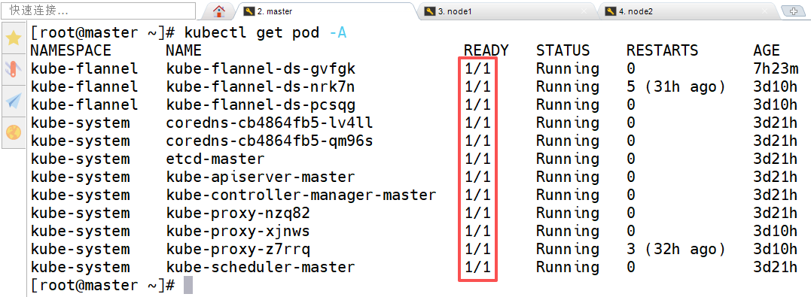

## 对 Pod 里的容器进行操作

命令帮助

```shell
[root@master ~]# kubectl exec -h
```

### **不用交互直接执行命令**

也就是不进入 pod 中的容器内部，直接让容器执行一些命令。

```shell
格式为: kubectl exec pod名 -c 容器名 -- 命令
```

**注意:**

-c 容器名为可选项：

* 如果在 pod 中只有 1 个容器，则不用指定；
* 如果在 pod 中有多个容器，不指定默认为第 1 个。

```shell
[root@master ~]# kubectl exec -n kube-system memory-demo -c memory-demo-ctr-1 -- touch /111
```

不指定容器名，则默认为 pod 里的第1个容器

```shell
[root@master ~]# kubectl exec -n kube-system memory-demo  -- touch /222
```

> **<font style="background-color:#FBDE28;">可能大家在执行上面的命令在容器中执行命令时，上面的容器已经停止了！可以删除，重新应用文件创建。</font>**
>
> <code>**kubectl delete -f pod-multi-ctr.yml**</code>
>
> <code>**kubectl apply -f pod-multi-ctr.yml**</code>

### **和容器交互操作**(最常用)

和 docker exec 几乎一样。

```shell
[root@master ~]# kubectl exec -n kube-system -it memory-demo -c memory-demo-ctr-1 -- /bin/bash
bash-5.0# touch /333
bash-5.0# ls /
111    333    dev    home   media  opt    root   sbin   sys    usr
222    bin    etc    lib    mnt    proc   run    srv    tmp    var
bash-5.0# exit
exit
```

删除 pod

```shell
[root@master ~]# kubectl delete pod memory-demo -n kube-system
pod "memory-demo" deleted
或者
[root@master ~]# kubectl delete -f pod-multi-ctr.yml
```

## 总结

1、Pod 中文意思是\_\_\_\_\_；一个 Pod 可以有一个或多个\_\_\_\_\_;

2、有控制器管理的 Pod，介绍了一个控制器 —— deployment；

3、Pod 的 Yaml 文件格式查看

4、学习 Pod 的 Yaml 字段：

namespace

label

imagePullPolicy

<font style="color:rgb(216,57,49);">restartPolicy</font>

resources

containers 创建多个容器

5、对 Pod 的容器进行操作

kubectl exec -it Pod名 -- /bin/bash


> 更新: 2026-01-15 08:56:30  
> 原文: <https://www.yuque.com/u41736172/az9urv/rud9h4nk1dg5vwtn>