# SSM 企业信息管理系统

# 一、课程介绍
## 课程的目的
+ 本课程不代表任何机构，纯属无聊，个人录制讲课视频
+ 帮助学生们在项目中综合使用 SSM 相关的技术，达到融会贯通的效果
+ 说明：学习本课程，学生需要会：Spring、SpringMVC、MyBatis、Maven 等核心技术

## 课程涉及的技术&工具
### 开发工具
+ IDEA 2019.3：Java 开发工具
+ Maven 3.5.2：项目构建管理工具
+ Tomcat 8.5：Web 应用服务器
+ MySQL 5.7：数据库

### 后端技术
+ Spring 5.3.20：容器框架
+ SpringMVC 5.2.20：web 层框架
+ Mybatis 3.4.3.4：MyBatis 框架的增强，ORM 持久层框架
+ log4j2：日志处理
+ EasyExcel：Excel 读写数据
+ MD5：密码加密
+ druid：数据库连接池

### 前端技术
+ HTML：网页的结构
+ CSS：网页的表现
+ jQuery：JS 的函数库
+ Thymeleaf：模板引擎
+ Echarts：可视化图表库

# 二、项目介绍
## 项目介绍
<font style="color:rgb(51, 51, 51);">该系统的功能涵盖了企业日常管理的各个方面，包括人事管理、考勤管理、报销管理、收支管理等功能，是企业提高整体运转能力不可缺少的软件工具。</font>

## <font style="color:rgb(51, 51, 51);">项目功能截图</font>
### 登录


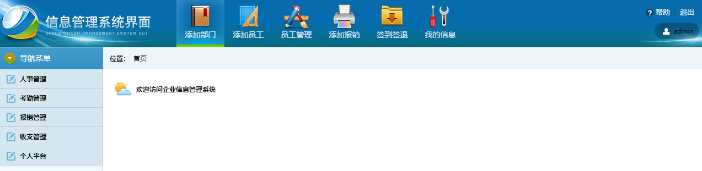

### 人事管理
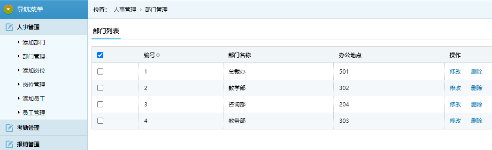

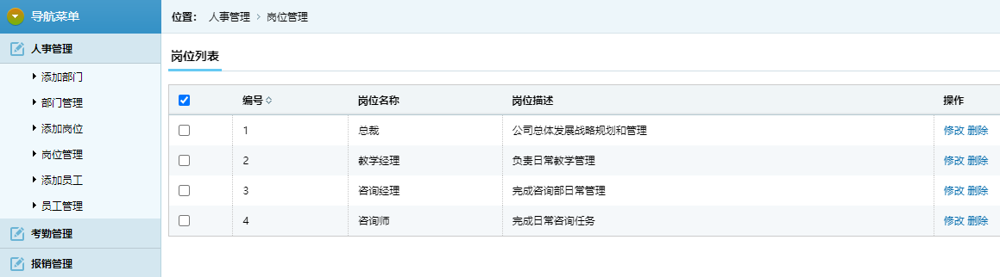

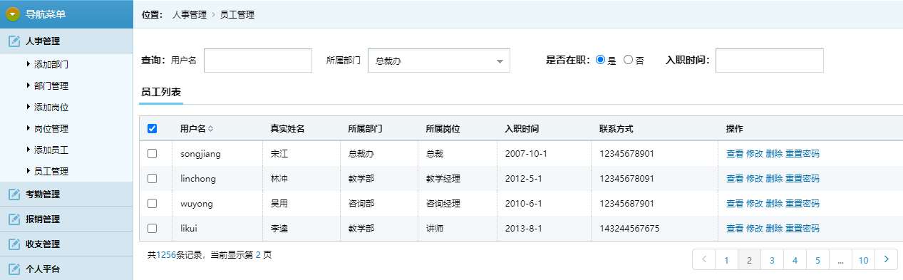

### 考勤管理
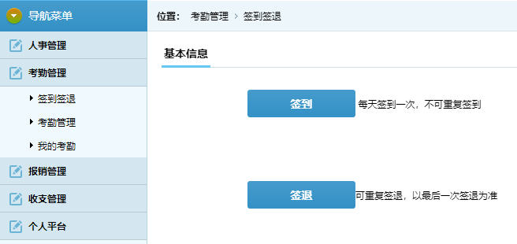

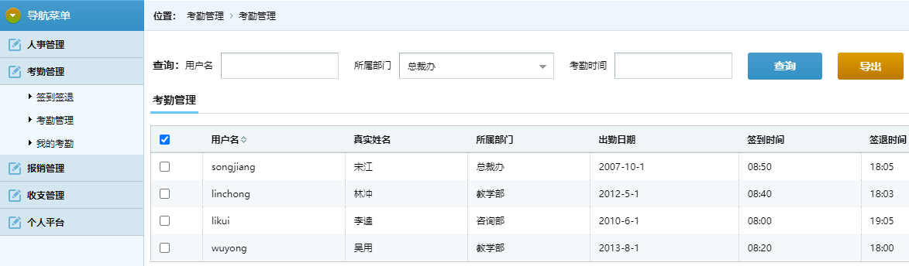

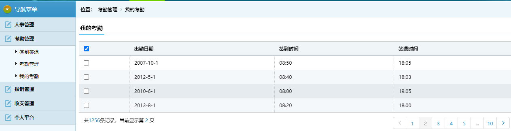

### 报销管理
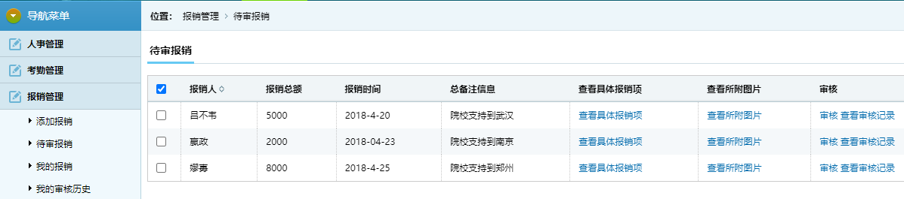

### 收支管理
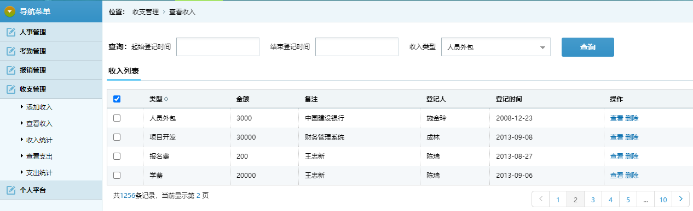

### 个人信息
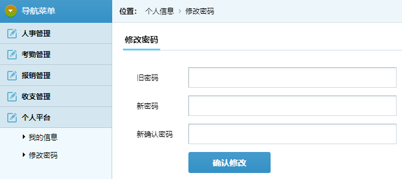

## 项目架构
使用上面提到的 SSM 等框架技术，进行单体项目的开发。

# 三、项目搭建
## 创建 Maven 项目
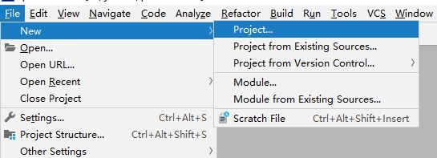

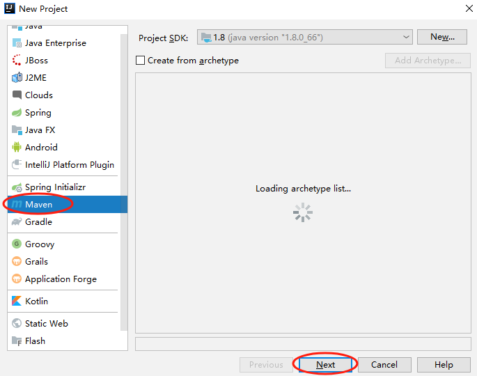

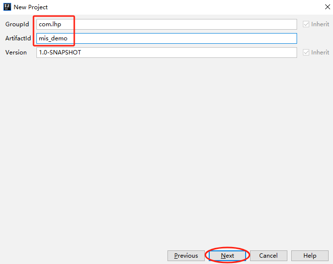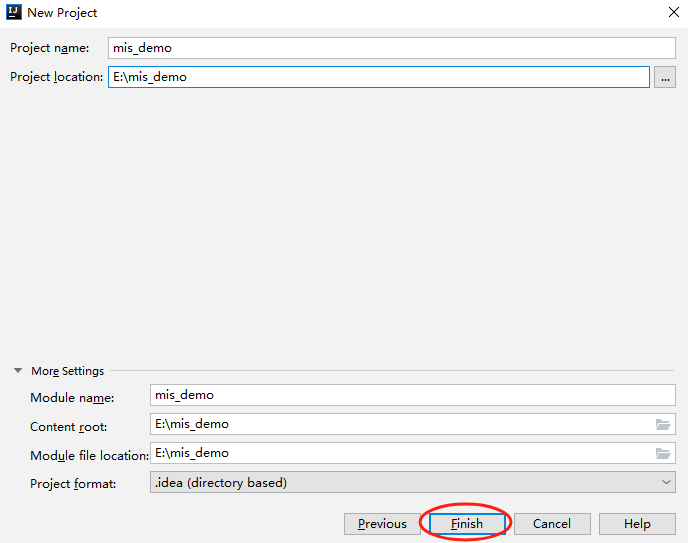

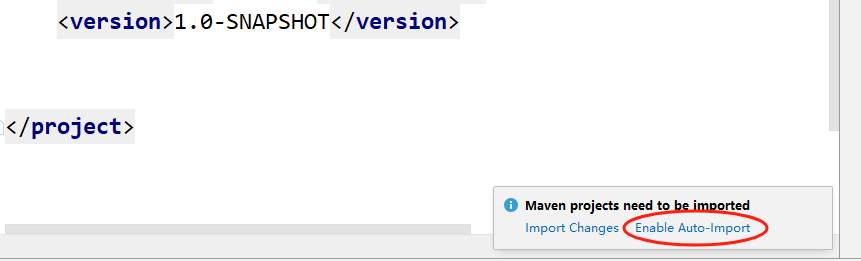

## 添加依赖
```xml
<?xml version="1.0" encoding="UTF-8"?>
<project xmlns="http://maven.apache.org/POM/4.0.0"
         xmlns:xsi="http://www.w3.org/2001/XMLSchema-instance"
         xsi:schemaLocation="http://maven.apache.org/POM/4.0.0 http://maven.apache.org/xsd/maven-4.0.0.xsd">
    <modelVersion>4.0.0</modelVersion>

    <groupId>com.lhp</groupId>
    <artifactId>mis_demo</artifactId>
    <version>1.0-SNAPSHOT</version>

    <!-- 项目打包方式 -->
    <packaging>war</packaging>

    <properties>
        <spring.version>5.3.20</spring.version>
        <servlet.version>3.1.0</servlet.version>
        <mysql.version>5.1.47</mysql.version>
        <druid.version>1.2.15</druid.version>
        <log4j2.version>2.19.0</log4j2.version>
        <mybatis.version>3.5.7</mybatis.version>
        <lombok.version>1.18.26</lombok.version>
        <pagehelper.version>5.2.0</pagehelper.version>
        <easyexcel.version>3.1.1</easyexcel.version>
        <common-fileupload>1.3.1</common-fileupload>
        <thymeleaf.version>3.0.12.RELEASE</thymeleaf.version>
        <spring.mybatis.version>1.3.2</spring.mybatis.version>
        <jackson.version>2.15.0</jackson.version>
    </properties>

    <dependencies>

        <dependency>
            <groupId>org.springframework</groupId>
            <artifactId>spring-webmvc</artifactId>
            <version>${spring.version}</version>
        </dependency>

        <!-- ServletAPI -->
        <dependency>
            <groupId>javax.servlet</groupId>
            <artifactId>javax.servlet-api</artifactId>
            <version>${servlet.version}</version>
            <scope>provided</scope>
        </dependency>

        <!--spring context依赖-->
        <!--当你引入Spring Context依赖之后，表示将Spring的基础依赖引入了-->
        <dependency>
            <groupId>org.springframework</groupId>
            <artifactId>spring-context</artifactId>
            <version>${spring.version}</version>
        </dependency>

        <!--spring jdbc  Spring 持久化层支持jar包-->
        <dependency>
            <groupId>org.springframework</groupId>
            <artifactId>spring-jdbc</artifactId>
            <version>${spring.version}</version>
        </dependency>

        <!-- MySQL驱动 -->
        <dependency>
            <groupId>mysql</groupId>
            <artifactId>mysql-connector-java</artifactId>
            <version>${mysql.version}</version>
        </dependency>

        <!-- 数据源 -->
        <dependency>
            <groupId>com.alibaba</groupId>
            <artifactId>druid</artifactId>
            <version>${druid.version}</version>
        </dependency>

        <!--log4j2的依赖-->
        <dependency>
            <groupId>org.apache.logging.log4j</groupId>
            <artifactId>log4j-core</artifactId>
            <version>${log4j2.version}</version>
        </dependency>
        <dependency>
            <groupId>org.apache.logging.log4j</groupId>
            <artifactId>log4j-slf4j2-impl</artifactId>
            <version>${log4j2.version}</version>
        </dependency>

        <!-- Mybatis核心 -->
        <dependency>
            <groupId>org.mybatis</groupId>
            <artifactId>mybatis</artifactId>
            <version>${mybatis.version}</version>
        </dependency>

        <!-- Spring 整合 MyBatis 的依赖 -->
        <dependency>
            <groupId>org.mybatis</groupId>
            <artifactId>mybatis-spring</artifactId>
            <version>${spring.mybatis.version}</version>
        </dependency>

        <dependency>
            <groupId>org.projectlombok</groupId>
            <artifactId>lombok</artifactId>
            <version>${lombok.version}</version>
        </dependency>

        <dependency>
            <groupId>com.github.pagehelper</groupId>
            <artifactId>pagehelper</artifactId>
            <version>${pagehelper.version}</version>
        </dependency>

        <dependency>
            <groupId>com.alibaba</groupId>
            <artifactId>easyexcel</artifactId>
            <version>${easyexcel.version}</version>
        </dependency>

        <dependency>
            <groupId>commons-fileupload</groupId>
            <artifactId>commons-fileupload</artifactId>
            <version>${common-fileupload}</version>
        </dependency>

        <!-- Spring5和Thymeleaf整合包 -->
        <dependency>
            <groupId>org.thymeleaf</groupId>
            <artifactId>thymeleaf-spring5</artifactId>
            <version>${thymeleaf.version}</version>
        </dependency>

        <dependency>
            <groupId>com.fasterxml.jackson.core</groupId>
            <artifactId>jackson-databind</artifactId>
            <version>${jackson.version}</version>
        </dependency>
    </dependencies>
</project>
```

## 修改项目目录结构
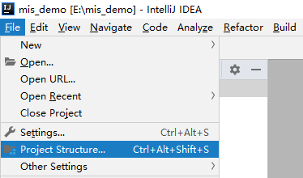

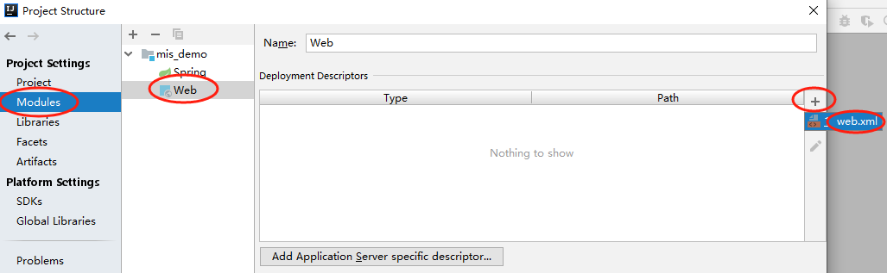

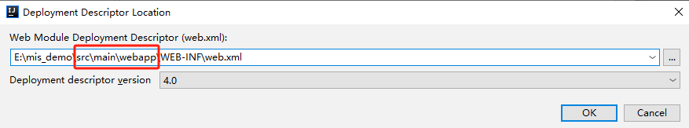

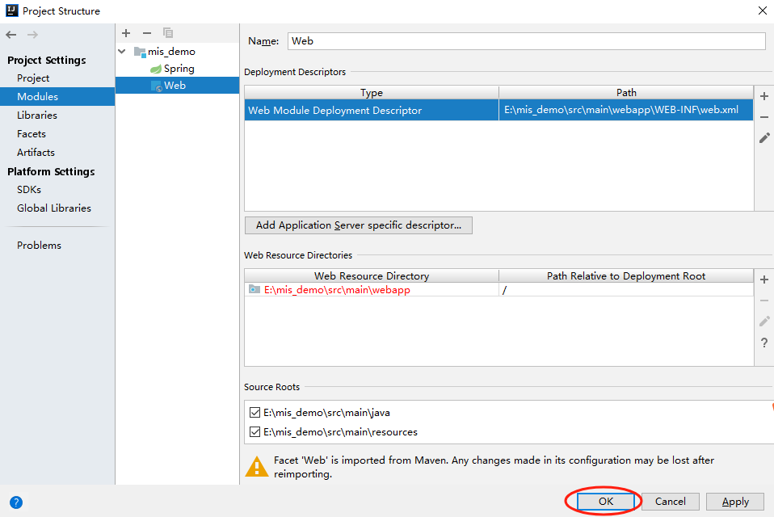

**最终的项目目录结构：**

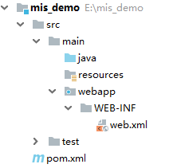

## 编写数据库配置文件
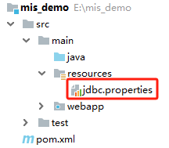

```properties
jdbc.user=root
jdbc.password=root
jdbc.url=jdbc:mysql://localhost:3306/mis?useUnicode=true&characterEncoding=utf-8
jdbc.driver=com.mysql.jdbc.Driver
```

## 编写日志配置文件
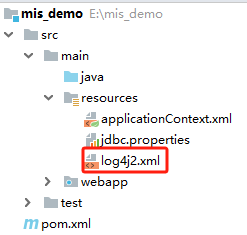

```xml
<?xml version="1.0" encoding="UTF-8"?>
<configuration>
    <loggers>
        <!--
            level指定日志级别，从低到高的优先级：
                TRACE < DEBUG < INFO < WARN < ERROR < FATAL
                trace：追踪，是最低的日志级别，相当于追踪程序的执行
                debug：调试，一般在开发中，都将其设置为最低的日志级别
                info：信息，输出重要的信息，使用较多
                warn：警告，输出警告的信息
                error：错误，输出错误信息
                fatal：严重错误
        -->
        <root level="debug">
            <appender-ref ref="springlog"/>
            <appender-ref ref="RollingFile"/>
            <appender-ref ref="log"/>
        </root>
    </loggers>

    <appenders>
        <!--输出日志信息到控制台-->
        <console name="springlog" target="SYSTEM_OUT">
            <!--控制日志输出的格式-->
            <PatternLayout pattern="%d{yyyy-MM-dd HH:mm:ss SSS} [%t] %-3level %logger{1024} - %msg%n"/>
        </console>

        <!--文件会打印出所有信息，这个log每次运行程序会自动清空，由append属性决定，适合临时测试用-->
        <File name="log" fileName="d:/spring_log/test.log" append="false">
            <PatternLayout pattern="%d{HH:mm:ss.SSS} %-5level %class{36} %L %M - %msg%xEx%n"/>
        </File>

        <!-- 这个会打印出所有的信息，
            每次大小超过size，
            则这size大小的日志会自动存入按年份-月份建立的文件夹下面并进行压缩，
            作为存档-->
        <RollingFile name="RollingFile" fileName="d:/spring_log/app.log"
                     filePattern="log/$${date:yyyy-MM}/app-%d{MM-dd-yyyy}-%i.log.gz">
            <PatternLayout pattern="%d{yyyy-MM-dd 'at' HH:mm:ss z} %-5level %class{36} %L %M - %msg%xEx%n"/>
            <SizeBasedTriggeringPolicy size="50MB"/>
            <!-- DefaultRolloverStrategy属性如不设置，
            则默认为最多同一文件夹下7个文件，这里设置了20 -->
            <DefaultRolloverStrategy max="20"/>
        </RollingFile>
    </appenders>
</configuration>
```

## 编写 Spring 配置文件
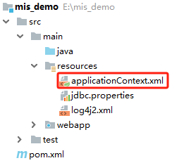

```xml
<?xml version="1.0" encoding="UTF-8"?>
<beans xmlns="http://www.springframework.org/schema/beans"
       xmlns:xsi="http://www.w3.org/2001/XMLSchema-instance"
       xmlns:context="http://www.springframework.org/schema/context" xmlns:tx="http://www.springframework.org/schema/tx"
       xsi:schemaLocation="http://www.springframework.org/schema/beans http://www.springframework.org/schema/beans/spring-beans.xsd http://www.springframework.org/schema/context https://www.springframework.org/schema/context/spring-context.xsd http://www.springframework.org/schema/tx http://www.springframework.org/schema/tx/spring-tx.xsd">

    <!-- 开启包扫描功能 -->
    <context:component-scan base-package="com.lhp">
        <!-- Spring扫描时排除标注了@Controller注解的类，因为Controller类都交给SpringMVC容器管理了 -->
        <context:exclude-filter type="annotation" expression="org.springframework.stereotype.Controller"/>
    </context:component-scan>

    <!-- 引入外部的属性配置文件 -->
    <context:property-placeholder location="classpath:jdbc.properties"></context:property-placeholder>

    <!-- 配置数据源 -->
    <bean id="dataSource" class="com.alibaba.druid.pool.DruidDataSource">
        <property name="driverClassName" value="${jdbc.driver}"></property>
        <property name="url" value="${jdbc.url}"></property>
        <property name="username" value="${jdbc.user}"></property>
        <property name="password" value="${jdbc.password}"></property>
    </bean>

    <!-- 整合MyBatis -->
    <bean id="sqlSessionFactory" class="org.mybatis.spring.SqlSessionFactoryBean">
        <property name="dataSource" ref="dataSource"></property>
        <!-- 设置映射文件的地址 -->
        <property name="mapperLocations" value="classpath:mapper/*.xml"></property>
        <!-- 给实体类起别名 -->
        <property name="typeAliasesPackage" value="com.lhp.entity"></property>
        <!-- 分页插件 -->
        <property name="plugins">
            <bean class="com.github.pagehelper.PageInterceptor"></bean>
        </property>
        <property name="configuration">
            <bean class="org.apache.ibatis.session.Configuration">
                <!-- 开启驼峰命名 -->
                <property name="mapUnderscoreToCamelCase" value="true"></property>
            </bean>
        </property>
    </bean>

    <!-- 扫描Mapper接口 -->
    <bean id="mapperScannerConfigurer" class="org.mybatis.spring.mapper.MapperScannerConfigurer">
        <property name="basePackage" value="com.lhp.mapper"></property>
    </bean>

    <!-- 配置事务管理器 -->
    <bean id="transactionManager" class="org.springframework.jdbc.support.JdbcTransactionManager">
        <property name="dataSource" ref="dataSource"></property>
    </bean>

    <!-- 开启事务注解驱动 -->
    <tx:annotation-driven></tx:annotation-driven>
</beans>
```

## 编写 SpringMVC 配置文件
```xml
<?xml version="1.0" encoding="UTF-8"?>
<beans xmlns="http://www.springframework.org/schema/beans"
       xmlns:xsi="http://www.w3.org/2001/XMLSchema-instance"
       xmlns:context="http://www.springframework.org/schema/context"
       xmlns:mvc="http://www.springframework.org/schema/mvc"
       xsi:schemaLocation="http://www.springframework.org/schema/beans http://www.springframework.org/schema/beans/spring-beans.xsd http://www.springframework.org/schema/context https://www.springframework.org/schema/context/spring-context.xsd http://www.springframework.org/schema/mvc https://www.springframework.org/schema/mvc/spring-mvc.xsd">

    <!-- 扫描Controller层 -->
    <context:component-scan base-package="com.lhp.controller"></context:component-scan>

    <!-- 开启注解驱动 -->
    <mvc:annotation-driven></mvc:annotation-driven>

    <mvc:default-servlet-handler></mvc:default-servlet-handler>

    <!-- 配置Thymeleaf视图解析器 -->
    <bean id="viewResolver" class="org.thymeleaf.spring5.view.ThymeleafViewResolver">
        <property name="order" value="1"/>
        <property name="characterEncoding" value="UTF-8"/>
        <property name="templateEngine">
            <bean class="org.thymeleaf.spring5.SpringTemplateEngine">
                <property name="templateResolver">
                    <bean class="org.thymeleaf.spring5.templateresolver.SpringResourceTemplateResolver">
                        <!-- 视图前缀 -->
                        <property name="prefix" value="/pages/"/>
                        <!-- 视图后缀 -->
                        <property name="suffix" value=".html"/>
                        <property name="templateMode" value="HTML5"/>
                        <property name="characterEncoding" value="UTF-8" />

                        <!-- 关闭缓存 -->
                        <property name="cacheable" value="false"></property>
                    </bean>
                </property>
            </bean>
        </property>
    </bean>

    <!--必须通过文件解析器的解析才能将文件转换为MultipartFile对象-->
    <bean id="multipartResolver" class="org.springframework.web.multipart.commons.CommonsMultipartResolver"></bean>
</beans>
```

## 编写 web.xml 配置文件
```xml
<?xml version="1.0" encoding="UTF-8"?>
<web-app xmlns="http://xmlns.jcp.org/xml/ns/javaee"
         xmlns:xsi="http://www.w3.org/2001/XMLSchema-instance"
         xsi:schemaLocation="http://xmlns.jcp.org/xml/ns/javaee http://xmlns.jcp.org/xml/ns/javaee/web-app_4_0.xsd"
         version="4.0">

    <!-- 监听服务器启动后，就加载Spring配置文件 -->
    <listener>
        <listener-class>org.springframework.web.context.ContextLoaderListener</listener-class>
    </listener>
    <context-param>
        <param-name>contextConfigLocation</param-name>
        <param-value>classpath:applicationContext.xml</param-value>
    </context-param>

    <servlet>
        <servlet-name>dispatcherServlet</servlet-name>
        <servlet-class>org.springframework.web.servlet.DispatcherServlet</servlet-class>
        <init-param>
            <param-name>contextConfigLocation</param-name>
            <param-value>classpath:springMVC.xml</param-value>
        </init-param>
        <load-on-startup>1</load-on-startup>
    </servlet>

    <servlet-mapping>
        <servlet-name>dispatcherServlet</servlet-name>
        <url-pattern>/</url-pattern>
    </servlet-mapping>

    <filter>
        <filter-name>characterEncodingFilter</filter-name>
        <filter-class>org.springframework.web.filter.CharacterEncodingFilter</filter-class>
        <init-param>
            <param-name>encoding</param-name>
            <param-value>utf-8</param-value>
        </init-param>
        <init-param>
            <param-name>forceResponseEncoding</param-name>
            <param-value>true</param-value>
        </init-param>
    </filter>

    <filter-mapping>
        <filter-name>characterEncodingFilter</filter-name>
        <url-pattern>/*</url-pattern>
    </filter-mapping>
</web-app>
```

## 复制静态资源
将资料中的静态页面内容复制到项目的 webapp 目录下。最终效果如下：

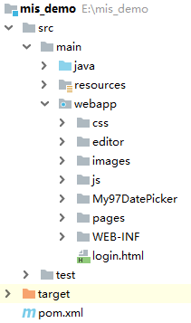

# 四、实现简单登录功能
## 实现验证码功能
### 需求分析
+ 访问登录页面时，需要发送请求到后端生成验证码的 Servlet 中生成验证码
+ 前端页面中点击验证码图片时，会再次发送请求到后端，生成最新的验证码
+ 每次生成的验证码需要存储到 session 中，后面登录时需要将用户输入的验证码和 session 中的进行比对

### 复制生成验证码的代码
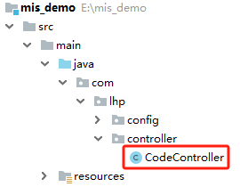

```java
package com.lhp.controller;

import java.awt.Color;
import java.awt.Font;
import java.awt.Graphics;
import java.awt.image.BufferedImage;
import java.io.IOException;
import java.util.Random;
import javax.imageio.ImageIO;
import javax.servlet.ServletException;
import javax.servlet.http.HttpServlet;
import javax.servlet.http.HttpServletRequest;
import javax.servlet.http.HttpServletResponse;

public class CodeController extends HttpServlet {


	public void doGet(HttpServletRequest request, HttpServletResponse response)
			throws ServletException, IOException {

		// 在内存中创建图象
		int width = 110, height = 30;
		BufferedImage image = new BufferedImage(width, height,
				BufferedImage.TYPE_INT_RGB);
		// 获取图形上下文
		Graphics g = image.getGraphics();
		// 生成随机类
		Random random = new Random();
		// 设定背景色
		g.setColor(getRandColor(200, 250));
		g.fillRect(0, 0, width, height);
		// 设定字体
		g.setFont(new Font("Times New Roman", Font.PLAIN, 20));
		// 随机产生155条干扰线，使图象中的认证码不易被其它程序探测到
		g.setColor(getRandColor(160, 200));
		for (int i = 0; i < 155; i++) {
			int x = random.nextInt(width);
			int y = random.nextInt(height);
			int xl = random.nextInt(12);
			int yl = random.nextInt(12);
			g.drawLine(x, y, x + xl, y + yl);
		}
		// 取随机产生的认证码(6位数字)
		String sRand = "";
		for (int i = 0; i < 6; i++) {
			String rand = String.valueOf(random.nextInt(10));
			sRand += rand;
			// 将认证码显示到图象中
			g.setColor(new Color(20 + random.nextInt(110), 20 + random
					.nextInt(110), 20 + random.nextInt(110)));
			// 调用函数出来的颜色相同，可能是因为种子太接近，所以只能直接生成
			g.drawString(rand, 13 * i + 6, 16);
		}
		// 图象生效
		g.dispose();

		try {
			ImageIO.write(image, "JPEG", response.getOutputStream());
		} catch (Exception e) {
			System.out.println("验证码图片产生出现错误：" + e.toString());
		}
		//保存验证码到Session
		request.getSession().setAttribute("code", sRand);
	}


	public void doPost(HttpServletRequest request, HttpServletResponse response)
			throws ServletException, IOException {

		this.doGet(request, response);
	}
	/*
	 * 给定范围获得随机颜色
	 */
	private Color getRandColor(int fc, int bc) {
		Random random = new Random();
		if (fc > 255)
			fc = 255;
		if (bc > 255)
			bc = 255;
		int r = fc + random.nextInt(bc - fc);
		int g = fc + random.nextInt(bc - fc);
		int b = fc + random.nextInt(bc - fc);
		return new Color(r, g, b);
	}
}
```

### 编写登录页面
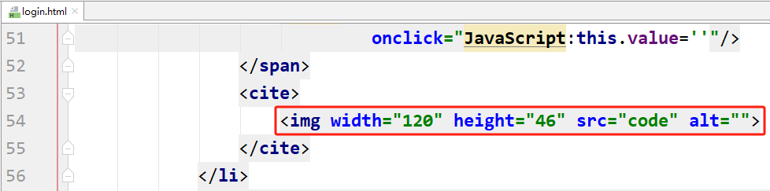

### 实现刷新验证码的功能
+ 给验证码图片绑定鼠标单击事件，重新发送请求到后端获取新的验证码图片

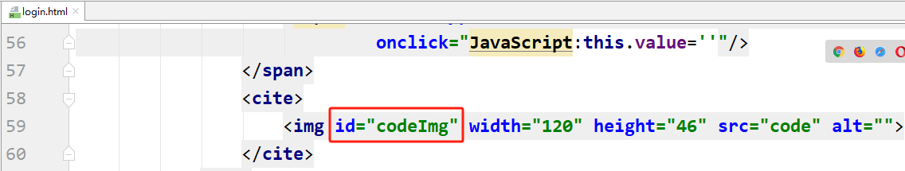

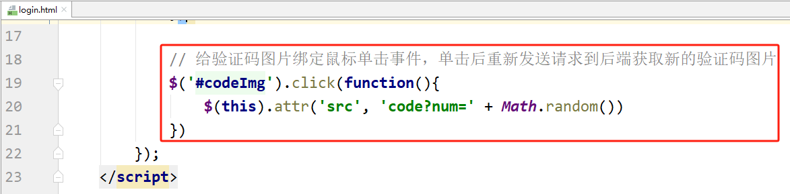

### 最终效果


## 实现登录功能
### 思路分析
+ 用户在页面输入账号、密码、验证码，点击登录按钮，提交请求到后端
+ 后端接收到这些请求参数，判断验证码是否正确（将用户输入的验证码和session中的验证码进行比较）
+ 如果验证码正确，再去根据账号和密码查询数据库，看能够查询到数据

### 表结构介绍
| 字段 | 说明 |
| --- | --- |
| id | 主键自增 |
| username | 用户名 |
| password | 密码 |
| deptno | 部门编号 |
| posid | 岗位编号 |
| mgrid | 上级领导编号 |
| realname | 真实姓名 |
| sex | 性别 |
| birthdate | 生日 |
| hiredate | 入职日期 |
| leavedate | 离职日期 |
| onduty | 0-在职/1-离职 |
| emptype | 1-基层员工/2-管理人员 |
| phone | 手机号 |
| qq | qq号 |
| emercontactperson | 紧急联系人 |
| idcard | 身份证 |


### 编写实体类
```java
package com.lhp.entity;

import lombok.Data;
import java.util.Date;

@Data
public class Employee {

    private Integer id;
    private String username;
    private String password;
    private Integer deptno;
    private Integer posid;
    private Integer mgrid;
    private String realname;
    private String sex;
    private Date birthday;
    private Date hiredate;
    private Date leavedate;
    private Integer onduty;
    private Integer emptype;
    private String phone;
    private String qq;
    private String emercontactperson;
    private String idcard;
}
```

```java
package com.lhp.entity.req;

import lombok.Data;

@Data
public class LoginReq {
    
    private String username;
    private String password;
    private String userCode;
}
```

### 编写 Mapper 接口
```java
package com.lhp.mapper;

import com.lhp.entity.Employee;
import com.lhp.entity.req.LoginReq;

public interface EmployeeMapper {
    
    Employee getEmpByUserNameAndPassword(LoginReq loginReq);
}
```

### 编写 Mapper 映射文件
```xml
<?xml version="1.0" encoding="UTF-8" ?>
<!DOCTYPE mapper
        PUBLIC "-//mybatis.org//DTD Mapper 3.0//EN"
        "http://mybatis.org/dtd/mybatis-3-mapper.dtd">
<mapper namespace="com.lhp.mapper.EmployeeMapper">

    <select id="getEmpByUserNameAndPassword" resultType="com.lhp.entity.Employee">
        select * 
        from employee
        where username = #{username}
        and password = #{password}
    </select>
</mapper>
```

### 编写 service 层代码
```java
package com.lhp.service;

import com.lhp.entity.req.LoginReq;
import javax.servlet.http.HttpSession;

public interface EmployeeService {

    Boolean login(LoginReq loginReq, HttpSession session);
}
```

```java
package com.lhp.service.impl;

import com.lhp.entity.Employee;
import com.lhp.entity.req.LoginReq;
import com.lhp.mapper.EmployeeMapper;
import com.lhp.service.EmployeeService;
import org.springframework.beans.factory.annotation.Autowired;
import org.springframework.stereotype.Service;

import javax.servlet.http.HttpSession;

@Service
public class EmployeeServiceImpl implements EmployeeService {

    @Autowired
    private EmployeeMapper employeeMapper;

    @Override
    public Boolean login(LoginReq loginReq, HttpSession session) {

        String code = (String) session.getAttribute("code");

        if(code != null && code.equals(loginReq.getUserCode())){
            Employee employee = employeeMapper.getEmpByUserNameAndPassword(loginReq);
            if(employee != null){
                session.setAttribute("emp", employee);
                return true;
            }else{
                return false;
            }
        }else{
            return false;
        }
    }
}
```

### 编写 controller 层代码
```java
package com.lhp.controller;

import com.lhp.entity.Employee;
import com.lhp.entity.req.LoginReq;
import com.lhp.service.EmployeeService;
import org.springframework.beans.factory.annotation.Autowired;
import org.springframework.stereotype.Controller;
import org.springframework.web.bind.annotation.RequestMapping;

import javax.servlet.http.HttpSession;

@Controller
public class LoginController {

    @Autowired
    private EmployeeService employeeService;

    @RequestMapping("/login")
    public Boolean login(LoginReq loginReq, HttpSession session){
        return employeeService.login(loginReq, session);
    }
}
```

### 编写登录页面
```html
<ul>
    <li>
        <input id="username" type="text" class="loginuser" value="admin" onclick="JavaScript:this.value=''"/>
    </li>
    <li>
        <input id="password" type="text" class="loginpwd" value="密码" onclick="JavaScript:this.value=''"/>
    </li>
    <li class="yzm">
        <span>
            <input id="userCode" type="text" value="验证码" onclick="JavaScript:this.value=''"/>
        </span>
        <cite>
            
        </cite>
    </li>
    <li>
        <input id="loginBtn" type="button" class="loginbtn" value="登录"/>
        <label>
            <input name="" type="checkbox" value="" checked="checked"/>记住密码
        </label>
        <label>
            <a href="#">忘记密码？</a>
        </label>
    </li>
</ul>


$('#loginBtn').click(function(){
    let username = $('#username').val();
    let password = $('#password').val();
    let userCode = $('#userCode').val();
    $.post('login', {username, password, userCode}, function(res){
        if(res === 'true'){
            location.href = 'pages/main.html'
        }else{
            alert('登录失败')
        }
    }, 'text');
})
```

### 测试
启动项目，测试登录功能。

### 设置欢迎页面
```xml
<welcome-file-list>
    <welcome-file>login.html</welcome-file>
</welcome-file-list>
```

# 五、登录功能完善
## 密码加密
使用 MD5 加密算法对密码进行加密，数据库存储的应该是加密后的密码！

### 添加依赖
```xml
<dependency>
    <groupId>cn.hutool</groupId>
    <artifactId>hutool-all</artifactId>
    <version>5.8.20</version>
</dependency>
```

### 修改 service 层代码
```java
@Override
public Boolean login(LoginReq loginReq, HttpSession session) {

    String code = (String) session.getAttribute("code");

    if(code != null && code.equals(loginReq.getUserCode())){

        String password = loginReq.getPassword();
        password = MD5.create().digestHex(password);
        loginReq.setPassword(password);

        Employee employee = employeeMapper.getEmpByUserNameAndPassword(loginReq);
        if(employee != null){
            session.setAttribute("emp", employee);
            return true;
        }else{
            return false;
        }
    }else{
        return false;
    }
}
```

### 测试
需要提前在数据库表中插入一个加密后的密码。


## 登录拦截器
实现完登录、退出等相关功能后，再做。

# 六、实现退出功能
## 思路分析
+ 页面点击退出按钮后，发请求到后端
+ 后端需要将 session 销毁
+ 跳转到登录页面

## 编写 top.html 页面
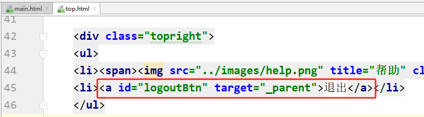

```javascript
$('#logoutBtn').click(function(){
    $.get('../logout', {}, function(res){
        top.location.href = '../login.html';
    })
})
```

## 编写退出方法
```java
@Controller
public class LoginController {

    @Autowired
    private EmployeeService employeeService;

    @RequestMapping("logout")
    @ResponseBody
    public void logout(HttpSession session){
        session.invalidate();
    }

    @ResponseBody
    @RequestMapping("/login")
    public String login(LoginReq loginReq, HttpSession session){
        return employeeService.login(loginReq, session) + "";
    }
}
```

# 七、显示登录人
## 需求分析
登录人的信息我们已经放在了 Session 中，从 Session 中取出信息显示在页面即可。

目前我们使用的是 Thymeleaf 模板引擎，所有的模板页面都需要经过模板引擎去解析才能有效果。

## 编写 controller 层
```java
package com.lhp.controller;

import org.springframework.stereotype.Controller;
import org.springframework.web.bind.annotation.GetMapping;
import org.springframework.web.bind.annotation.RequestMapping;

@Controller
@RequestMapping("/top")
public class TopController {

    @GetMapping
    public String top(){
        return "top";
    }
}
```

## 修改 main 页面
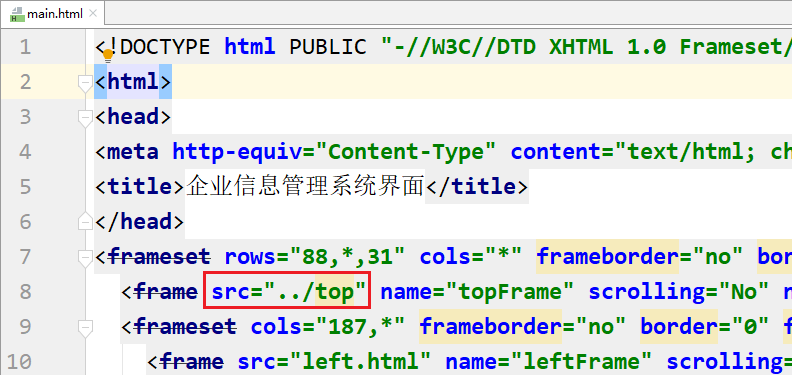

## 修改 top 页面
改造一下 html 根标签

```latex
<html xmlns:th="http://www.thymeleaf.org">
```

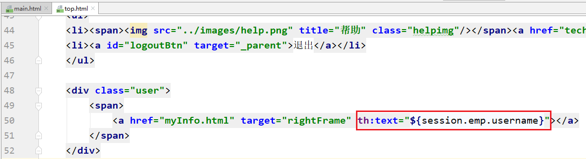

## 启动测试


# 八、部门管理功能
## 部门表介绍
| 字段 | 说明 |
| --- | --- |
| deptno | 部门编号，主键自增 |
| deptname | 部门名称 |
| location | 部门地址 |


## 添加部门功能
### 编写实体类
```java
package com.lhp.entity;

import lombok.Data;

@Data
public class Dept {

    private Integer deptno;
    private String deptname;
    private String location;
}
```

### 编写 mapper 层代码
```java
package com.lhp.mapper;

import com.lhp.entity.Dept;

public interface DeptMapper {
    
    int addDept(Dept dept);
}
```

```xml
<?xml version="1.0" encoding="UTF-8" ?>
<!DOCTYPE mapper
        PUBLIC "-//mybatis.org//DTD Mapper 3.0//EN"
        "http://mybatis.org/dtd/mybatis-3-mapper.dtd">
<mapper namespace="com.lhp.mapper.DeptMapper">

    <insert id="addDept">
        insert into dept values(null, #{deptname}, #{location})
    </insert>
</mapper>
```

### 编写 service 层代码
```java
package com.lhp.service;

import com.lhp.entity.Dept;

public interface DeptService {
    
    int addDept(Dept dept);
}
```

```java
package com.lhp.service.impl;

import com.lhp.entity.Dept;
import com.lhp.mapper.DeptMapper;
import com.lhp.service.DeptService;
import org.springframework.beans.factory.annotation.Autowired;
import org.springframework.stereotype.Service;

@Service
public class DeptServiceImpl implements DeptService {
    
    @Autowired
    private DeptMapper deptMapper;
    
    @Override
    public int addDept(Dept dept) {
        return deptMapper.addDept(dept);
    }
}
```

### 编写 controller 层代码
```java
package com.lhp.controller;

import com.lhp.entity.Dept;
import com.lhp.service.DeptService;
import org.springframework.beans.factory.annotation.Autowired;
import org.springframework.stereotype.Controller;
import org.springframework.web.bind.annotation.RequestMapping;
import org.springframework.web.bind.annotation.ResponseBody;

@Controller
@RequestMapping("/dept")
public class DeptController {
    
    @Autowired
    private DeptService deptService;

    @ResponseBody
    @RequestMapping("/addDept")
    public String addDept(Dept dept){
        int i = deptService.addDept(dept);
        return i + "";
    }
}
```

### 编写部门添加页面
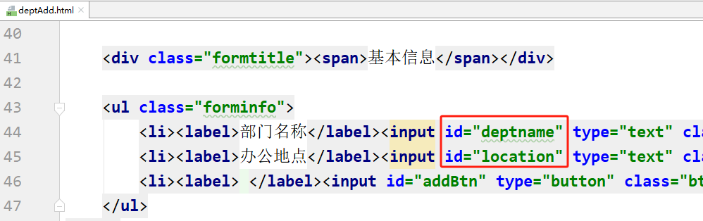

```javascript
$(function(){
    $('#addBtn').click(function(){
        var deptname = $('#deptname').val();
        var location = $('#location').val();
        $.get('../dept/addDept', {deptname, location}, function(res){
            if(res == '1'){
                alert('添加成功');
                $('#deptname').val('');
                $('#location').val('');
            }else{
                alert('添加失败');
            }
        })
    })
})
```

## 部门列表展示功能
### 思路分析
+ 点击部门列表展示菜单，发送请求到后端
+ 后端查询所有的部门数据，将数据存入到 model 中
+ 将请求转发到模板页面
+ 在页面中使用 thymeleaf 的循环指令将数据进行展示

### 编写 mapper 层代码
```java
package com.lhp.mapper;

import com.lhp.entity.Dept;

import java.util.List;

public interface DeptMapper {

    int addDept(Dept dept);
    
    List<Dept> findAll();
}
```

```xml
<select id="findAll" resultType="com.lhp.entity.Dept">
    select * from dept
</select>
```

### 编写 service 层代码
```java
package com.lhp.service;

import com.lhp.entity.Dept;

import java.util.List;

public interface DeptService {
    
    List<Dept> findAll();

    int addDept(Dept dept);
}
```

```java
package com.lhp.service.impl;

import com.lhp.entity.Dept;
import com.lhp.mapper.DeptMapper;
import com.lhp.service.DeptService;
import org.springframework.beans.factory.annotation.Autowired;
import org.springframework.stereotype.Service;

import java.util.List;

@Service
public class DeptServiceImpl implements DeptService {

    @Autowired
    private DeptMapper deptMapper;

    @Override
    public List<Dept> findAll() {
        return deptMapper.findAll();
    }

    @Override
    public int addDept(Dept dept) {
        return deptMapper.addDept(dept);
    }
}
```

### 编写 controller 层代码
```java
package com.lhp.controller;

import com.lhp.entity.Dept;
import com.lhp.service.DeptService;
import org.springframework.beans.factory.annotation.Autowired;
import org.springframework.stereotype.Controller;
import org.springframework.ui.Model;
import org.springframework.web.bind.annotation.RequestMapping;
import org.springframework.web.bind.annotation.ResponseBody;

import java.util.List;

@Controller
@RequestMapping("/dept")
public class DeptController {

    @Autowired
    private DeptService deptService;
    
    @RequestMapping("/findAll")
    public String findAll(Model model){
        List<Dept> list = deptService.findAll();
        model.addAttribute("list", list);
        return "deptList";
    }

    @RequestMapping("/addDept")
    @ResponseBody
    public String addDept(Dept dept){
        int i = deptService.addDept(dept);
        return i + "";
    }
}
```

### 编写页面代码
```html
<tbody>
    <tr th:each="dept : ${list}">
        <td><input name="" type="checkbox" value=""/></td>
        <td th:text="${dept.deptno}">1</td>
        <td th:text="${dept.deptname}">总裁办</td>
        <td th:text="${dept.location}">501</td>
        <td>
            <a href="deptUpdate.html" class="tablelink">修改</a> &nbsp;&nbsp;&nbsp;&nbsp;
            
        </td>
    </tr>
</tbody>
```

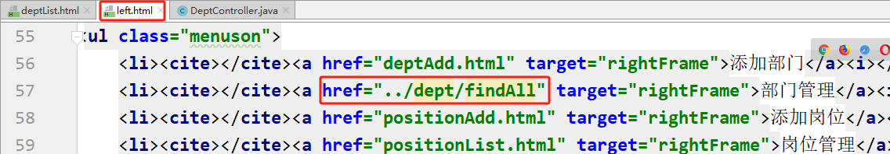

## 部门修改功能
### 功能分析
**回显：**

+ 点击修改按钮后，发送请求到后端，并携带部门编号参数
+ 后端收到请求及参数，查询该部门信息
+ 将部门信息放入 model 中，然后转发到部门修改的页面
+ 在部门修改页面将信息回显即可

### 编写 mapper 层代码
```java
package com.lhp.mapper;

import com.lhp.entity.Dept;

import java.util.List;

public interface DeptMapper {
    
    int updateDept(Dept dept);
    
    Dept getById(Integer deptno);

    List<Dept> findAll();

    int addDept(Dept dept);
}
```

```xml
<update id="updateDept">
    update dept set deptname=#{deptname}, location=#{location} where deptno=#{deptno}
</update>

<select id="getById" resultType="com.lhp.entity.Dept">
    select * from dept where deptno = #{deptno}
</select>
```

### 编写 service 层代码
```java
package com.lhp.service;

import com.lhp.entity.Dept;

import java.util.List;

public interface DeptService {
    
    int updateDept(Dept dept);

    Dept getById(Integer deptno);

    List<Dept> findAll();

    int addDept(Dept dept);
}
```

```java
package com.lhp.service.impl;

import com.lhp.entity.Dept;
import com.lhp.mapper.DeptMapper;
import com.lhp.service.DeptService;
import org.springframework.beans.factory.annotation.Autowired;
import org.springframework.stereotype.Service;

import java.util.List;

@Service
public class DeptServiceImpl implements DeptService {

    @Autowired
    private DeptMapper deptMapper;

    @Override
    public int updateDept(Dept dept) {
        return deptMapper.updateDept(dept);
    }

    @Override
    public Dept getById(Integer deptno) {
        return deptMapper.getById(deptno);
    }

    @Override
    public List<Dept> findAll() {
        return deptMapper.findAll();
    }

    @Override
    public int addDept(Dept dept) {
        return deptMapper.addDept(dept);
    }
}
```

### 编写 controller 层代码
```java
package com.lhp.controller;

import com.lhp.entity.Dept;
import com.lhp.service.DeptService;
import org.springframework.beans.factory.annotation.Autowired;
import org.springframework.stereotype.Controller;
import org.springframework.ui.Model;
import org.springframework.web.bind.annotation.RequestMapping;
import org.springframework.web.bind.annotation.ResponseBody;

import java.util.List;

@Controller
@RequestMapping("/dept")
public class DeptController {

    @Autowired
    private DeptService deptService;
    
    @RequestMapping("/updateDept")
    @ResponseBody
    public String updateDept(Dept dept){
        return deptService.updateDept(dept) + "";
    }
    
    @RequestMapping("/getById")
    public String getById(Integer deptno, Model model){
        Dept dept = deptService.getById(deptno);
        model.addAttribute("dept", dept);
        return "deptUpdate";
    }

    @RequestMapping("/findAll")
    public String findAll(Model model){

        List<Dept> list = deptService.findAll();
        model.addAttribute("list", list);
        return "deptList"; // 转发到页面
    }

    @ResponseBody
    @RequestMapping("/addDept")
    public String addDept(Dept dept){
        return deptService.addDept(dept) + "";
    }
}
```

### 编写页面代码
```html
<a th:href="@{/dept/getById(deptno=${dept.deptno})}" class="tablelink">修改</a>
```

```html
<ul class="forminfo">
    <li><label>部门编号</label><input readonly id="deptno" type="text" class="dfinput" th:value="${dept.deptno}"/></li>
    <li><label>部门名称</label><input id="deptname" type="text" class="dfinput" th:value="${dept.deptname}"/></li>
    <li><label>办公地点</label><input id="location" type="text" class="dfinput" th:value="${dept.location}"/></li>
    <li><label>&nbsp;</label><input id="saveBtn" type="button" class="btn" value="确认保存"/></li>
</ul>

<script type="text/javascript" src="../js/jquery.js"></script>
<script type="text/javascript">
    $(function(){
        $('#saveBtn').click(function(){
            var deptno = $('#deptno').val();
            var deptname = $('#deptname').val();
            var location = $('#location').val();
            $.post('../dept/updateDept', {deptno, deptname, location}, function(res){
                if(res == '1'){
                    alert('修改成功');
                    window.location.href = '../dept/findAll'
                }else{
                    alert('修改失败');
                }
            })
        })
    })
</script>
```

## 部门删除功能


> 更新: 2024-08-10 19:18:56  
> 原文: <https://www.yuque.com/u41736172/az9urv/gb3kl7egdbl9itzg>