# 实训项目-基于 JavaWeb 的商城项目

# 项目介绍
## 项目介绍
+ <font style="color:rgb(51, 51, 51);">该商城是一个全品类的电商购物网站（B2C）</font>
+ <font style="color:rgb(51, 51, 51);">用户可以在线购买商品、加入购物车、下单、支付</font>
+ <font style="color:rgb(51, 51, 51);">用户可以对商品进行点赞以及评论已购买商品</font>
+ <font style="color:rgb(51, 51, 51);">管理员可以在后台管理商品的上下架、促销活动</font>
+ <font style="color:rgb(51, 51, 51);">管理员可以监控商品销售状况</font>
+ <font style="color:rgb(51, 51, 51);">客服可以在后台处理退款操作</font>
+ <font style="color:rgb(51, 51, 51);">希望未来 3 到 5 年可以支持千万用户的使用</font>

## <font style="color:rgb(51, 51, 51);">项目效果</font>


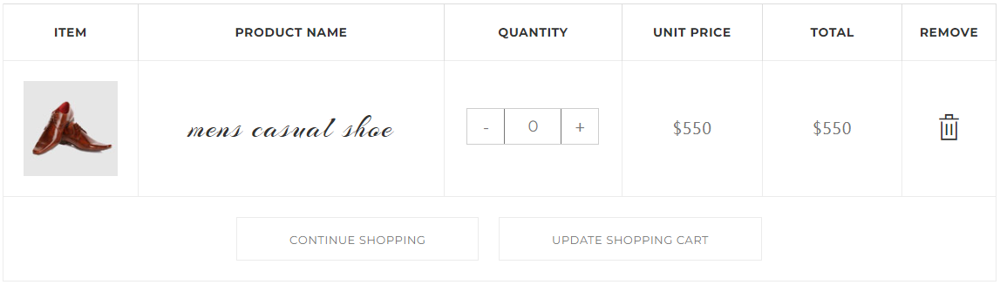

等等。

## 技术选型
### 前端技术
+ HTML：用于表示页面的结构，使用它里面常用的标签，比如：div、a、img 标签等等
+ CSS：用于给页面加样式，对页面进行美化
+ JavaScript：用于给页面加一些动作行为，比如：购物车数量的加减、总金额的计算等等
+ JSP：本质上是 Servlet，是一个动态的网页技术，可以动态展示后端传递的数据

### 后端技术
+ Servlet：服务端小程序，用于接收请求、响应结果
+ JDBC：用户操作数据库，对于数据库进行增删改查的操作

## 开发环境
+ IDEA：2019
+ JDK：1.8
+ MySQL：5.6
+ Tomcat：8.5

# 数据库设计
## 分析


分析页面中商品信息，我们需要设计一张商品表 goods，字段应该有：

| 字段名称 | 字段类型 | 说明 |
| --- | --- | --- |
| id | int | 主键、自增，商品编号 |
| name | varchar | 商品名称 |
| originalprice | int | 原价 |
| currentprice | int | 现价 |
| picture | varchar | 商品图片的路径 |


## 创建数据库及表
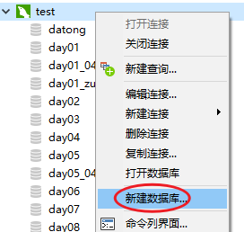

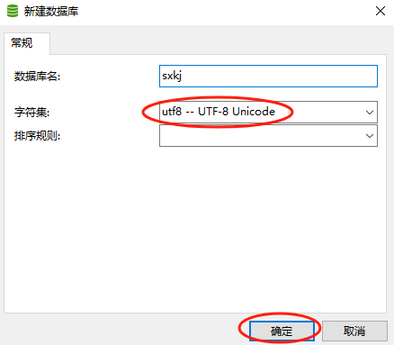


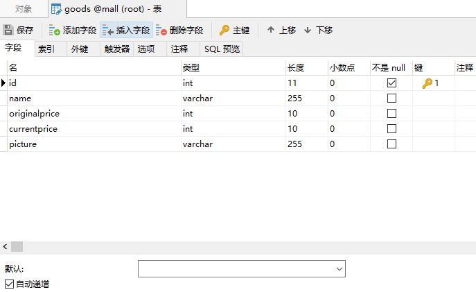


# 功能实现
## 创建 JavaEE 项目


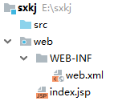

## 导入 jar 包
**在 WEB-INF 文件夹中创建 lib 文件夹：**


**粘贴我们用的 4 个 jar 包到 lib 文件夹：**

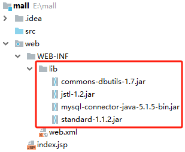

**使 jar 包生效：**

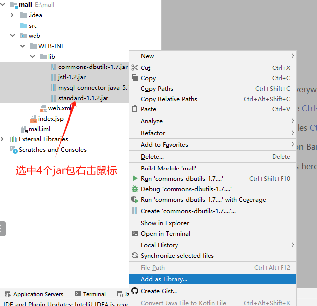

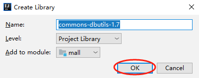

**jar 包变成下图效果，说明生效：**

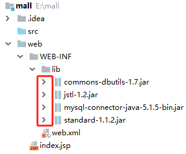

## 导入静态资源
将我们每个人选择的模板页面及资源复制粘贴到项目的 **web** 目录中。


最终效果：

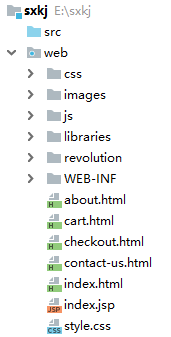

## 创建包结构
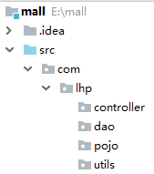

## 编写工具类
```java
package com.lhp.utils;

import java.sql.Connection;
import java.sql.DriverManager;
import java.sql.SQLException;

// 数据库的工具类
public class JDBCUtils {

    static{ // 静态代码块，在静态代码块中的代码只会执行一次！

        // 加载数据库驱动
        try {
            Class.forName("com.mysql.jdbc.Driver");
        } catch (ClassNotFoundException e) {
            e.printStackTrace();
        }
    }


    // 获取数据库连接的方法
    public static Connection getConnection(){

        String url = "jdbc:mysql:///mall?useUnicode=true&characterEncoding=utf8";
        String username = "root";
        String password = "123456";
        Connection connection = null;
        try {
            connection = DriverManager.getConnection(url, username, password);
        } catch (SQLException e) {
            e.printStackTrace();
        }

        return connection;
    }


    // 关闭数据库连接的方法
    public static void closeConnection(Connection connection){
        if(connection != null){
            try {
                connection.close();
            } catch (SQLException e) {
                e.printStackTrace();
            }
        }
    }
}
```

## 编写实体类
在 pojo 包中编写实体类。

```java
package com.lhp.pojo;

public class Goods {

    private int id;
    private String name;
    private int originalprice;
    private int currentprice;
    private String picture;

    public Goods() {
    }

    public Goods(int id, String name, int originalprice, int currentprice, String picture) {
        this.id = id;
        this.name = name;
        this.originalprice = originalprice;
        this.currentprice = currentprice;
        this.picture = picture;
    }

    public int getId() {
        return id;
    }

    public void setId(int id) {
        this.id = id;
    }

    public String getName() {
        return name;
    }

    public void setName(String name) {
        this.name = name;
    }

    public int getOriginalprice() {
        return originalprice;
    }

    public void setOriginalprice(int originalprice) {
        this.originalprice = originalprice;
    }

    public int getCurrentprice() {
        return currentprice;
    }

    public void setCurrentprice(int currentprice) {
        this.currentprice = currentprice;
    }

    public String getPicture() {
        return picture;
    }

    public void setPicture(String picture) {
        this.picture = picture;
    }

    @Override
    public String toString() {
        return "Goods{" +
                "id=" + id +
                ", name='" + name + '\'' +
                ", originalprice=" + originalprice +
                ", currentprice=" + currentprice +
                ", picture='" + picture + '\'' +
                '}';
    }
}
```

## 编写 dao 层代码
```java
package com.lhp.dao;

import com.lhp.pojo.Goods;
import com.lhp.utils.JDBCUtils;
import org.apache.commons.dbutils.QueryRunner;
import org.apache.commons.dbutils.handlers.BeanListHandler;

import java.sql.Connection;
import java.sql.SQLException;
import java.util.List;

public class GoodsDao {

    // 查询所有的商品
    public List<Goods> findAll(){

        // 1.获取数据库连接
        Connection connection = JDBCUtils.getConnection();

        // 2.编写sql语句
        String sql = "select * from goods limit 0, 8";

        // 3.创建QueryRunner对象
        QueryRunner queryRunner = new QueryRunner();

        // 4.调用方法执行sql语句
        List<Goods> list = null;
        try {
            list = queryRunner.query(connection, sql, new BeanListHandler<>(Goods.class));
        } catch (SQLException e) {
            e.printStackTrace();
        }

        // 5.关闭连接
        JDBCUtils.closeConnection(connection);
        
        return list;
    }
}
```

## 编写 controller 层代码
```java
package com.lhp.controller;

import com.lhp.dao.GoodsDao;
import com.lhp.pojo.Goods;

import javax.servlet.ServletException;
import javax.servlet.annotation.WebServlet;
import javax.servlet.http.HttpServlet;
import javax.servlet.http.HttpServletRequest;
import javax.servlet.http.HttpServletResponse;
import java.io.IOException;
import java.util.List;

@WebServlet("/findAll")
public class FindAllServlet extends HttpServlet {

    @Override
    protected void service(HttpServletRequest req, HttpServletResponse resp) throws ServletException, IOException {

        // 设置编码方式
        req.setCharacterEncoding("utf-8");
        resp.setCharacterEncoding("utf-8");
        resp.setContentType("text/html;charset=utf-8");

        // 调用dao层方法
        GoodsDao goodsDao = new GoodsDao();
        List<Goods> list = goodsDao.findAll();

        // 将数据放入request域对象中
        req.setAttribute("list", list);

        // 转发到index.jsp
        req.getRequestDispatcher("/index.jsp").forward(req, resp);
    }
}
```

## 删除页面及更改后缀
删除原有的 index.jsp 页面。

`

修改 index.html 文件的后缀，改为 index.jsp

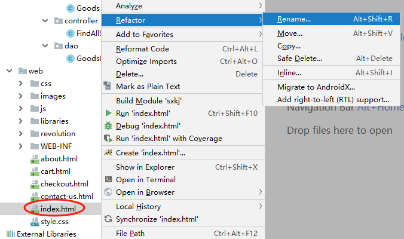

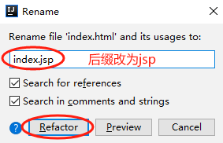


## 修改页面代码
在 index.jsp 页面中顶部加入下面两行代码：

```html
<%@ page contentType="text/html;charset=UTF-8" language="java" %>
<%@ taglib prefix="c" uri="http://java.sun.com/jsp/jstl/core" %>
```

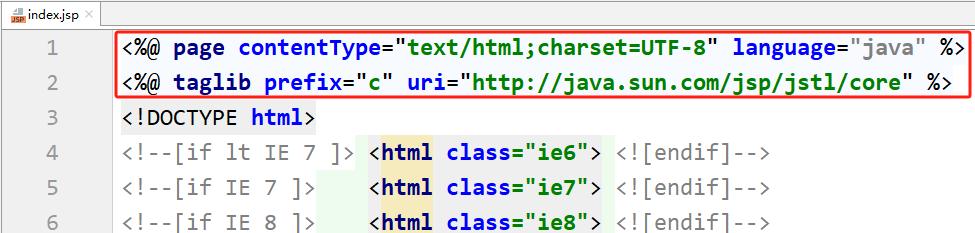

删除多余的 li 元素：

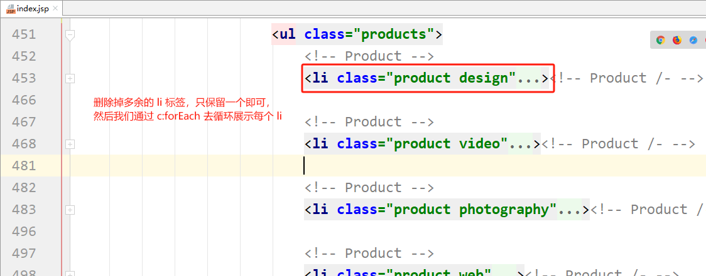

使用 c:forEach 循环展示数据：

```html
<c:forEach items="${list}" var="g">
  <li class="product design">
    <a href="#">
      
      <h5>${g.name}</h5>
      <span class="price"><del>￥${g.originalPrice}</del>￥${g.currentPrice}</span>
    </a>
    <div class="wishlist-box">
      <a href="#"><i class="fa fa-arrows-alt"></i></a>
      <a href="#"><i class="fa fa-heart-o"></i></a>
      <a href="#"><i class="fa fa-search"></i></a>
    </div>
    <a href="#" class="addto-cart" title="Add To Cart">加入购物车</a>
  </li><!-- Product /- -->
</c:forEach>
```

images/product-1.jpg

## 数据库插入测试数据


## 启动服务器访问


# 提交的资料
## 项目源码
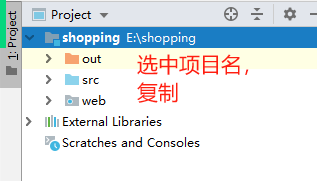

将项目复制到桌面，然后将项目打包，比如：xxx.zip、xxx.rar

## 数据库文件
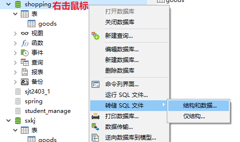

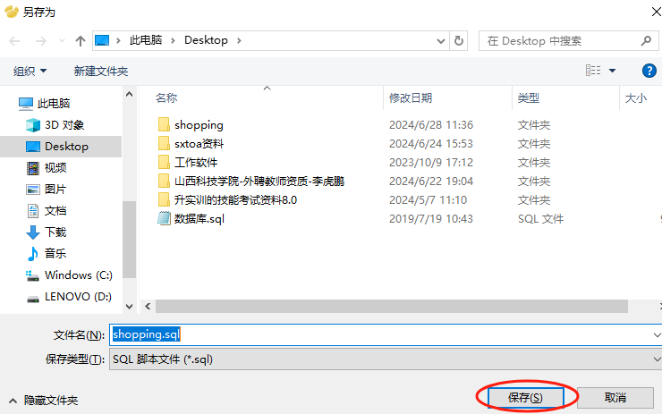

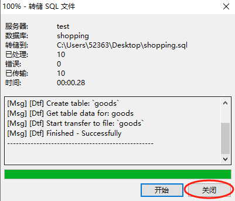


## 实训报告\答辩的 PPT
如果学校发了《实训报告》，那我们就只需要写好《实训报告》，根据它答辩就行。

如果学校没发《实训报告》，那需要每个同学写一份答辩的 PPT。包含但不限于：项目背景、项目介绍、技术选型、实现功能、遇到的问题及解决办法、总结、感悟、心得等等。


> 更新: 2024-09-13 16:37:09  
> 原文: <https://www.yuque.com/u41736172/az9urv/nxgot4btrrc25ih1>