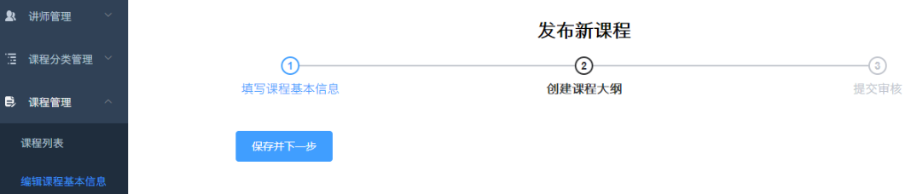
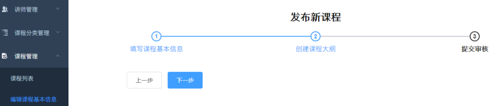
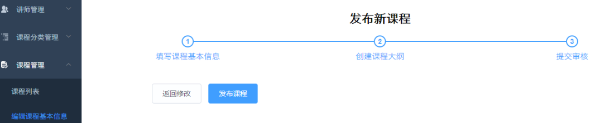
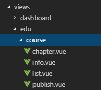
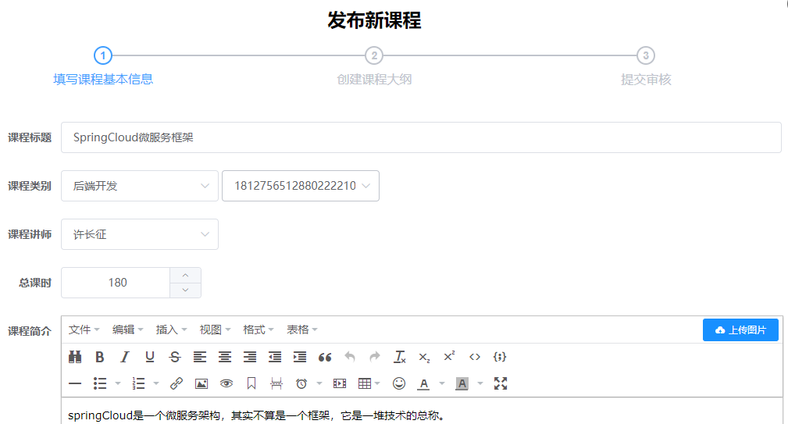
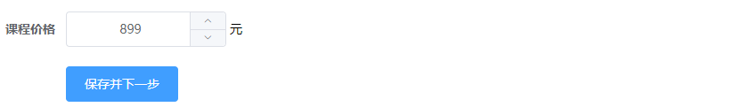
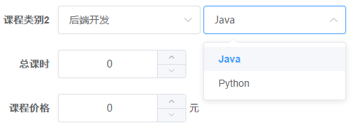
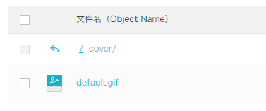

# 第七天【课程发布-添加课程信息】

# 一、课程发布表单-步骤导航
## 需求






## <font style="color:rgb(0, 0, 0);">配置路由</font>
### <font style="color:rgb(0, 0, 0);">添加路由</font>
```javascript
// 课程管理
{
  path: '/edu/course',
  component: Layout,
  redirect: '/edu/course/list',
  name: 'Course',
  meta: { title: '课程管理', icon: 'form' },
  children: [
    {
      path: 'list',
      name: 'EduCourseList',
      component: () => import('@/views/edu/course/list'),
      meta: { title: '课程列表' }
    },
    {
      path: 'info',
      name: 'EduCourseInfo',
      component: () => import('@/views/edu/course/info'),
      meta: { title: '发布课程' }
    },
    {
      path: 'info/:id',
      name: 'EduCourseInfoEdit',
      component: () => import('@/views/edu/course/info'),
      meta: { title: '编辑课程基本信息', noCache: true },
      hidden: true
    },
    {
      path: 'chapter/:id',
      name: 'EduCourseChapterEdit',
      component: () => import('@/views/edu/course/chapter'),
      meta: { title: '编辑课程大纲', noCache: true },
      hidden: true
    },
    {
      path: 'publish/:id',
      name: 'EduCoursePublishEdit',
      component: () => import('@/views/edu/course/publish'),
      meta: { title: '发布课程', noCache: true },
      hidden: true
    }
  ]
},
```

### <font style="color:rgb(0, 0, 0);">添加 vue 组件</font>


## <font style="color:rgb(0, 0, 0);">整合步骤条组件</font>
<font style="color:rgb(0, 0, 0);">参考 </font>[http://element-cn.eleme.io/#/zh-CN/component/steps](http://element-cn.eleme.io/#/zh-CN/component/steps)

### <font style="color:rgb(0, 0, 0);">课程信息页面</font>
<font style="color:rgb(0, 0, 0);">info.vue</font>

```html
<template>

  <div class="app-container">

    <h2 style="text-align: center;">发布新课程</h2>

    <el-steps :active="1" process-status="wait" align-center style="margin-bottom: 40px;">
      <el-step title="填写课程基本信息"/>
      <el-step title="创建课程大纲"/>
      <el-step title="提交审核"/>
    </el-steps>

    <el-form label-width="120px">

      <el-form-item>
        <el-button :disabled="saveBtnDisabled" type="primary" @click="next">保存并下一步</el-button>
      </el-form-item>
    </el-form>
  </div>
</template>

<script>
export default {
  data() {
    return {
      saveBtnDisabled: false // 保存按钮是否禁用
    }
  },

  created() {
    console.log('info created')
  },

  methods: {

    next() {
      console.log('next')
      this.$router.push({ path: '/edu/course/chapter/1' })
    }
  }
}
</script>
```

### <font style="color:rgb(0, 0, 0);">课程大纲页面</font>
<font style="color:rgb(0, 0, 0);">chapter.vue</font>

```html
<template>

  <div class="app-container">

    <h2 style="text-align: center;">发布新课程</h2>

    <el-steps :active="2" process-status="wait" align-center style="margin-bottom: 40px;">
      <el-step title="填写课程基本信息"/>
      <el-step title="创建课程大纲"/>
      <el-step title="提交审核"/>
    </el-steps>

    <el-form label-width="120px">

      <el-form-item>
        <el-button @click="previous">上一步</el-button>
        <el-button :disabled="saveBtnDisabled" type="primary" @click="next">下一步</el-button>
      </el-form-item>
    </el-form>
  </div>

</template>

<script>

export default {
  data() {
    return {
      saveBtnDisabled: false // 保存按钮是否禁用
    }
  },

  created() {
    console.log('chapter created')
  },

  methods: {
    previous() {
      console.log('previous')
      this.$router.push({ path: '/edu/course/info/1' })
    },

    next() {
      console.log('next')
      this.$router.push({ path: '/edu/course/publish/1' })
    }
  }
}
</script>
```

### <font style="color:rgb(0, 0, 0);">课程发布页面</font>
<font style="color:rgb(0, 0, 0);">publish.vue</font>

```html
<template>

  <div class="app-container">

    <h2 style="text-align: center;">发布新课程</h2>

    <el-steps :active="3" process-status="wait" align-center style="margin-bottom: 40px;">
      <el-step title="填写课程基本信息"/>
      <el-step title="创建课程大纲"/>
      <el-step title="提交审核"/>
    </el-steps>

    <el-form label-width="120px">

      <el-form-item>
        <el-button @click="previous">返回修改</el-button>
        <el-button :disabled="saveBtnDisabled" type="primary" @click="publish">发布课程</el-button>
      </el-form-item>
    </el-form>
  </div>

</template>

<script>

export default {
  data() {
    return {
      saveBtnDisabled: false // 保存按钮是否禁用
    }
  },

  created() {
    console.log('publish created')
  },

  methods: {
    previous() {
      console.log('previous')
      this.$router.push({ path: '/edu/course/chapter/1' })
    },

    publish() {
      console.log('publish')
      this.$router.push({ path: '/edu/course/list' })
    }
  }
}
</script>
```

# 二、编辑课程基本信息
## 表介绍
分析 edu_course、edu_course_description 表中的字段信息。

## 生成代码
使用代码生成器生成 edu_course、edu_course_description 的相关代码。

注意，修改如下生成的内容：

1. 主键 id 的类型：@TableId(value = "id", type = IdType.<font style="background-color:#FBDE28;">ID_WORKER_STR</font>)
2. 创建日期和修改日期使用自动填充：@TableField(fill = FieldFill.INSERT)、@TableField(fill = FieldFill.INSERT_UPDATE)
3. 添加逻辑删除注解
4. 修改课程表中，逻辑删字段默认是 0
5. 但是 CourseDescription 的主键生成策略先别改！

## 需求分析




## <font style="color:rgb(0, 0, 0);">后端 api</font>
### <font style="color:rgb(0, 0, 0);">定义 form 表单对象</font>
CourseInfoForm.java

```java
package com.xszx.serviceedu.entity.form;

import io.swagger.annotations.ApiModel;
import io.swagger.annotations.ApiModelProperty;
import lombok.Data;

import java.io.Serializable;
import java.math.BigDecimal;

@ApiModel(value = "课程基本信息", description = "编辑课程基本信息的表单对象")
@Data
public class CourseInfoForm implements Serializable {

    private static final long serialVersionUID = 1L;

    @ApiModelProperty(value = "课程ID")
    private String id;

    @ApiModelProperty(value = "课程讲师ID")
    private String teacherId;

    @ApiModelProperty(value = "课程专业ID")
    private String subjectId;

    @ApiModelProperty(value = "课程专业父ID")
    private String subjectParentId; // 二级分类

    @ApiModelProperty(value = "课程标题")
    private String title;

    @ApiModelProperty(value = "课程销售价格，设置为0则可免费观看")
    private BigDecimal price;

    @ApiModelProperty(value = "总课时")
    private Integer lessonNum;

    @ApiModelProperty(value = "课程封面图片路径")
    private String cover;

    @ApiModelProperty(value = "课程简介")
    private String description;
}
```

### <font style="color:rgb(0, 0, 0);">修改 CourseDescription 主键生成策略</font>
```java
@ApiModelProperty(value = "课程ID")
@TableId(value = "id", type = IdType.INPUT)
private String id;
```

### <font style="color:rgb(0, 0, 0);">定义常量</font>
<font style="color:rgb(0, 0, 0);">实体类 Course.java 中定义</font>

```java
public static final String COURSE_DRAFT = "Draft";
public static final String COURSE_NORMAL = "Normal";
```

### <font style="color:rgb(0, 0, 0);">定义控制层接口</font>
CourseAdminController.java

```java
package com.xszx.serviceedu.controller;


import com.xszx.commonutils.R;
import com.xszx.serviceedu.entity.Course;
import com.xszx.serviceedu.entity.form.CourseInfoForm;
import com.xszx.serviceedu.service.CourseService;
import io.swagger.annotations.Api;
import io.swagger.annotations.ApiOperation;
import io.swagger.annotations.ApiParam;
import org.springframework.beans.factory.annotation.Autowired;
import org.springframework.web.bind.annotation.*;

/**
 * <p>
 * 课程 前端控制器
 * </p>
 *
 * @author lhp
 * @since 2024-07-16
 */
@RestController
@RequestMapping("/serviceedu/course")
@CrossOrigin
@Api(tags = "课程管理")
public class CourseController {

    @Autowired
    private CourseService courseService;

    @PostMapping
    @ApiOperation("保存课程信息")
    public R saveCourseInfo(@ApiParam(name = "courseInfoForm", value = "课程信息对象", required = true)
                                        @RequestBody CourseInfoForm courseInfoForm){
        String courseId = courseService.saveCourseInfo(courseInfoForm);
        return R.ok().data("courseId", courseId);
    }
}
```

### <font style="color:rgb(0, 0, 0);">定义业务层方法</font>
<font style="color:rgb(0, 0, 0);">接口：CourseService.java</font>

```java
/**
 * 保存课程和课程详情信息
 * @param courseInfoForm
 * @return 新生成的课程id
 */
String saveCourseInfo(CourseInfoForm courseInfoForm);
```

<font style="color:rgb(0, 0, 0);">实现：CourseServiceImpl.java</font>

```java
package com.xszx.serviceedu.service.impl;

import com.xszx.servicebase.exceptionhandler.QinXueException;
import com.xszx.serviceedu.entity.Course;
import com.xszx.serviceedu.entity.CourseDescription;
import com.xszx.serviceedu.entity.form.CourseInfoForm;
import com.xszx.serviceedu.mapper.CourseMapper;
import com.xszx.serviceedu.service.CourseDescriptionService;
import com.xszx.serviceedu.service.CourseService;
import com.baomidou.mybatisplus.extension.service.impl.ServiceImpl;
import org.springframework.beans.BeanUtils;
import org.springframework.beans.factory.annotation.Autowired;
import org.springframework.stereotype.Service;

/**
 * <p>
 * 课程 服务实现类
 * </p>
 *
 * @author lhp
 * @since 2024-07-15
 */
@Service
public class CourseServiceImpl extends ServiceImpl<CourseMapper, Course> implements CourseService {

    @Autowired
    private CourseDescriptionService courseDescriptionService;

    @Override
    public String saveCourseInfo(CourseInfoForm courseInfoForm) {

        // 保存课程信息
        Course course = new Course();
        course.setStatus(Course.COURSE_DRAFT);
        BeanUtils.copyProperties(courseInfoForm, course);
        int insert = baseMapper.insert(course);
        if(insert == 0){
            throw new QinXueException(20001, "保存课程信息失败");
        }

        // 保存课程详情信息
        CourseDescription courseDescription = new CourseDescription();
        courseDescription.setId(course.getId());
        courseDescription.setDescription(courseInfoForm.getDescription());
        boolean save = courseDescriptionService.save(courseDescription);

        if(!save){
            throw new QinXueException(20001, "保存课程详情信息失败");
        }

        return course.getId();
    }
}
```

### <font style="color:rgb(0, 0, 0);">Swagger 测试</font>
## <font style="color:rgb(0, 0, 0);">前端实现</font>
### <font style="color:rgb(0, 0, 0);">定义 api</font>
src/api/edu/course.js

```javascript
import request from '@/utils/request'

const api_name = '/admin/edu/course'

export default {
  saveCourseInfo(courseInfo) {
    return request({
      url: `${api_name}/save-course-info`,
      method: 'post',
      data: courseInfo
    })
  }
}
```

### <font style="color:rgb(0, 0, 0);">组件模板</font>
src/views/edu/course/info.vue

```html
<el-form label-width="120px">

  <el-form-item label="课程标题">
    <el-input v-model="courseInfo.title" placeholder=" 示例：机器学习项目课：从基础到搭建项目视频课程。专业名称注意大小写"/>
  </el-form-item>

  <!-- 所属分类 TODO -->

  <!-- 课程讲师 TODO -->

  <el-form-item label="总课时">
    <el-input-number :min="0" v-model="courseInfo.lessonNum" controls-position="right" placeholder="请填写课程的总课时数"/>
  </el-form-item>

  <!-- 课程简介 TODO -->

  <!-- 课程封面 TODO -->

  <el-form-item label="课程价格">
    <el-input-number :min="0" v-model="courseInfo.price" controls-position="right" placeholder="免费课程请设置为0元"/> 元
  </el-form-item>

  <el-form-item>
    <el-button :disabled="saveBtnDisabled" type="primary" @click="next">保存并下一步</el-button>
  </el-form-item>
</el-form>
```

### <font style="color:rgb(0, 0, 0);">组件 js</font>
```html
<script>
import course from '@/api/edu/course'

const defaultForm = {
  title: '',
  subjectId: '',
  teacherId: '',
  lessonNum: 0,
  description: '',
  cover: '',
  price: 0
}

export default {
  data() {
    return {
      courseInfo: defaultForm,
      saveBtnDisabled: false // 保存按钮是否禁用
    }
  },

  watch: {
    $route(to, from) {
      console.log('watch $route')
      this.init()
    }
  },

  created() {
    console.log('info created')
    this.init()
  },

  methods: {

    init() {
      if (this.$route.params && this.$route.params.id) {
        const id = this.$route.params.id
        console.log(id)
      } else {
        this.courseInfo = { ...defaultForm }
      }
    },

    next() {
      console.log('next')
      this.saveBtnDisabled = true
      if (!this.courseInfo.id) {
        this.saveData()
      } else {
        this.updateData()
      }
    },

    // 保存
    saveData() {
      course.saveCourseInfo(this.courseInfo).then(response => {
        this.$message({
          type: 'success',
          message: '保存成功!'
        })
        return response// 将响应结果传递给then
      }).then(response => {
        this.$router.push({ path: '/edu/course/chapter/' + response.data.courseId })
      }).catch((response) => {
        this.$message({
          type: 'error',
          message: response.message
        })
      })
    },

    updateData() {
      this.$router.push({ path: '/edu/course/chapter/1' })
    }
  }
}
</script>
```

# 三、课程分类多级联动的实现
## <font style="color:rgb(0, 0, 0);">需求</font>


## <font style="color:rgb(0, 0, 0);">获取一级分类</font>
### <font style="color:rgb(0, 0, 0);">组件数据定义</font>
<font style="color:rgb(0, 0, 0);">定义在 data 中</font>

```javascript
subjectNestedList: [],//一级分类列表
subSubjectList: []//二级分类列表
```

### <font style="color:rgb(0, 0, 0);">组件模板</font>
```html
<!-- 所属分类：级联下拉列表 -->
<!-- 一级分类 -->
<el-form-item label="课程类别">
  <el-select
    v-model="courseInfo.subjectParentId"
    placeholder="请选择">
    <el-option
      v-for="subject in subjectNestedList"
      :key="subject.id"
      :label="subject.title"
      :value="subject.id"/>
  </el-select>
</el-form-item>
```

### <font style="color:rgb(0, 0, 0);">组件脚本</font>
<font style="color:rgb(0, 0, 0);">表单初始化时获取一级分类嵌套列表，引入subject api</font>

```javascript
import subject from '@/api/edu/subject'
```

<font style="color:rgb(0, 0, 0);">定义方法</font>

```javascript
init() {
  ......
  // 初始化分类列表
  this.initSubjectList()
},

initSubjectList() {
  subject.getNestedTreeList().then(response => {
    this.subjectNestedList = response.data.items
  })
},
```

## <font style="color:rgb(0, 0, 0);">级联显示二级分类</font>
### <font style="color:rgb(0, 0, 0);">组件模板</font>
```html
<!-- 二级分类 -->
<el-select v-model="courseInfo.subjectId" placeholder="请选择">
  <el-option
    v-for="subject in subSubjectList"
    :key="subject.value"
    :label="subject.title"
    :value="subject.id"/>
</el-select>
```

### <font style="color:rgb(0, 0, 0);">注册 change 事件</font>
<font style="color:rgb(0, 0, 0);">在一级分类的<el-select>组件中注册 change 事件</font>

```html
<el-select @change="subjectLevelOneChanged" ......
```

### <font style="color:rgb(0, 0, 0);">定义 change 事件方法</font>
```javascript
subjectLevelOneChanged(value) {
    console.log(value)
    for (let i = 0; i < this.subjectNestedList.length; i++) {
        if (this.subjectNestedList[i].id === value) {
            this.subSubjectList = this.subjectNestedList[i].children
            this.courseInfo.subjectId = ''
        }
    }
},
```

# 四、讲师下拉列表
## <font style="color:rgb(0, 0, 0);">前端实现</font>
### <font style="color:rgb(0, 0, 0);">组件模板</font>
```html
<!-- 课程讲师 -->
<el-form-item label="课程讲师">
  <el-select
    v-model="courseInfo.teacherId"
    placeholder="请选择">
    <el-option
      v-for="teacher in teacherList"
      :key="teacher.id"
      :label="teacher.name"
      :value="teacher.id"/>
  </el-select>
</el-form-item>
```

### <font style="color:rgb(0, 0, 0);">定义 api</font>
<font style="color:rgb(0, 0, 0);">api/edu/teacher.js</font>

```javascript
getList() {
    return request({
        url: api_name,
        method: 'get'
    })
},
```

<font style="color:rgb(0, 0, 0);">组件中引入 teacher api</font>

```javascript
import teacher from '@/api/edu/teacher'
```

### <font style="color:rgb(0, 0, 0);">组件脚本</font>
<font style="color:rgb(0, 0, 0);">定义 data</font>

```javascript
teacherList: [] // 讲师列表
```

<font style="color:rgb(0, 0, 0);">表单初始化时获取讲师列表</font>

```javascript
init() {
  ......
  // 获取讲师列表
  this.initTeacherList()
},

initTeacherList() {
  teacher.getList().then(response => {
    this.teacherList = response.data.items
  })
},
```

# 五、富文本编辑器 Tinymce
## <font style="color:rgb(0, 0, 0);">组件初始化</font>
<font style="color:rgb(0, 0, 0);">Tinymce 是一个传统 JS 插件，默认不能用于 Vue.js 因此需要做一些特殊的整合步骤</font>

### <font style="color:rgb(0, 0, 0);">复制脚本库</font>
<font style="color:rgb(0, 0, 0);">将脚本库复制到项目的 static 目录下（在 vue-element-admin-master 的 static 路径下）</font>

### <font style="color:rgb(0, 0, 0);">配置 html 变量</font>
<font style="color:rgb(0, 0, 0);">在 qinxue-admin/build/webpack.dev.conf.js 中添加配置</font>

<font style="color:rgb(0, 0, 0);">使在 html 页面中可以使用这里定义的 BASE_URL 变量</font>

<font style="color:rgb(0, 0, 0);">注意：改完要重启前端项目才会生效！</font>

```javascript
new HtmlWebpackPlugin({
    ......,
    templateParameters: {
        BASE_URL: config.dev.assetsPublicPath + config.dev.assetsSubDirectory
    }
})
```

### <font style="color:rgb(0, 0, 0);">引入 js 脚本</font>
<font style="color:rgb(0, 0, 0);">在 qinxue-admin/index.html 中引入 js 脚本</font>

```html
<script src='<%= BASE_URL %>/tinymce4.7.5/tinymce.min.js'></script>
<script src='<%= BASE_URL %>/tinymce4.7.5/langs/zh_CN.js'></script>
```

## <font style="color:rgb(0, 0, 0);">组件引入</font>
<font style="color:rgb(0, 0, 0);">为了让 Tinymce 能用于 Vue.js 项目，vue-element-admin-master 对 Tinymce 进行了封装，下面我们将它引入到我们的课程信息页面</font>

### <font style="color:rgb(0, 0, 0);">复制组件</font>
<font style="color:rgb(0, 0, 0);">src/components/Tinymce</font>

### <font style="color:rgb(0, 0, 0);">引入组件</font>
<font style="color:rgb(0, 0, 0);">课程信息组件中引入 Tinymce</font>

```javascript
import Tinymce from '@/components/Tinymce'

export default {
  components: { Tinymce },
  ......
}
```

### <font style="color:rgb(0, 0, 0);">组件模板</font>
```html
<!-- 课程简介-->
<el-form-item label="课程简介">
    <tinymce :height="300" v-model="courseInfo.description"/>
</el-form-item>
```

### <font style="color:rgb(0, 0, 0);">组件样式</font>
<font style="color:rgb(0, 0, 0);">在 info.vue 文件的最后添加如下代码，调整上传图片按钮的高度</font>

```html
<style scoped>
.tinymce-container {
  line-height: 29px;
}
</style>
```

### <font style="color:rgb(0, 0, 0);">图片的 base64 编码</font>
<font style="color:rgb(0, 0, 0);">Tinymce 中的图片上传功能直接存储的是图片的 base64 编码，因此无需图片服务器</font>

# <font style="color:rgb(0, 0, 0);">六、课程封面</font>
<font style="color:rgb(0, 0, 0);">参考 </font>[http://element-cn.eleme.io/#/zh-CN/component/upload](http://element-cn.eleme.io/#/zh-CN/component/upload)<font style="color:rgb(0, 0, 0);"> 用户头像上传</font>

## <font style="color:rgb(0, 0, 0);">整合上传组件</font>
### <font style="color:rgb(0, 0, 0);">上传默认封面</font>
<font style="color:rgb(0, 0, 0);">创建文件夹 cover，上传默认的课程封面</font>



### <font style="color:rgb(0, 0, 0);">定义默认封面</font>
```javascript
const defaultForm = {
  ......,
  cover: process.env.OSS_PATH + '/cover/default.jpg',
  ......
}
```

### <font style="color:rgb(0, 0, 0);">定义data数据</font>
```javascript
BASE_API: process.env.BASE_API // 接口API地址
```

### <font style="color:rgb(0, 0, 0);">组件模板</font>
<font style="color:rgb(0, 0, 0);">在 info.vue 中添加上传组件模板</font>

```html
<!-- 课程封面-->
<el-form-item label="课程封面">

  <el-upload
    :show-file-list="false"
    :on-success="handleAvatarSuccess"
    :before-upload="beforeAvatarUpload"
    :action="BASE_API+'/admin/oss/file/upload?host=cover'"
    class="avatar-uploader">
    
  </el-upload>
</el-form-item>
```

### <font style="color:rgb(0, 0, 0);">结果回调</font>
```javascript
handleAvatarSuccess(res, file) {
  console.log(res)// 上传响应
  console.log(URL.createObjectURL(file.raw))// base64编码
  this.courseInfo.cover = res.data.url
},

beforeAvatarUpload(file) {
  const isJPG = file.type === 'image/jpeg'
  const isLt2M = file.size / 1024 / 1024 < 2

  if (!isJPG) {
    this.$message.error('上传头像图片只能是 JPG 格式!')
  }
  if (!isLt2M) {
    this.$message.error('上传头像图片大小不能超过 2MB!')
  }
  return isJPG && isLt2M
}
```

## <font style="color:rgb(0, 0, 0);">修改后端 api</font>
### <font style="color:rgb(0, 0, 0);">修改上传 controller</font>
<font style="color:rgb(0, 0, 0);">添加 host 可选参数</font>

```java

/**
 * 文件上传
 *
 * @param file
 */
@ApiOperation(value = "文件上传")
@PostMapping("upload")
public R upload(
    @ApiParam(name = "file", value = "文件", required = true)
    @RequestParam("file") MultipartFile file,
    @ApiParam(name = "host", value = "文件上传路径", required = false)) {

    String uploadUrl = fileService.upload(file);
    //返回r对象
    return R.ok().message("文件上传成功").data("url", uploadUrl);
}
```

### <font style="color:rgb(0, 0, 0);">综合测试</font>
# 七、课程信息回显
## <font style="color:rgb(0, 0, 0);">后端实现</font>
### <font style="color:rgb(0, 0, 0);">业务层</font>
<font style="color:rgb(0, 0, 0);">接口：CourseService.java</font>

```java
CourseInfoForm getCourseInfoFormById(String id);
```

<font style="color:rgb(0, 0, 0);">实现：CourseServiceImpl.java</font>

```java
@Override
public CourseInfoForm getCourseInfoFormById(String id) {

    Course course = this.getById(id);
    if(course == null){
        throw new QinXueException(20001, "数据不存在");
    }
    CourseInfoForm courseInfoForm = new CourseInfoForm();
    BeanUtils.copyProperties(course, courseInfoForm);

    CourseDescription courseDescription = courseDescriptionService.getById(id);
    if(course != null){
        courseInfoForm.setDescription(courseDescription.getDescription());
    }

    return courseInfoForm;
}
```

### <font style="color:rgb(0, 0, 0);">web 层</font>
```java
@GetMapping("{id}")
@ApiOperation("根据课程ID查询课程信息用于回显")
public R getById(@ApiParam(name = "id", value = "课程ID", required = true)
                     @PathVariable String id){
    CourseInfoForm courseInfoForm = courseService.getCourseInfoFormById(id);
    return R.ok().data("item", courseInfoForm);
}
```

### <font style="color:rgb(0, 0, 0);">Swagger 中测试</font>
## <font style="color:rgb(0, 0, 0);">前端实现</font>
### <font style="color:rgb(0, 0, 0);">定义 api</font>
<font style="color:rgb(0, 0, 0);">api/edu/course.js</font>

```javascript
// 课程信息回显
getCourseInfoById(id){
  return request({
    url: `${api_name}/${id}`,
    method: 'get'
  })
}
```

### <font style="color:rgb(0, 0, 0);">组件 js</font>
```javascript
init() {
    if (this.$route.params && this.$route.params.id) {
        const id = this.$route.params.id
        //根据id获取课程基本信息
        this.fetchCourseInfoById(id)
    } 
    
    ......
},
    
fetchCourseInfoById(id) {
  course.getCourseInfoById(id).then(response => {
    this.courseInfo = response.data.item
  })
},
```

## <font style="color:rgb(0, 0, 0);">解决级联下拉菜单回显问题</font>
<font style="color:rgb(0, 0, 0);">修改 info.vue 页面中的 init 方法</font>

<font style="color:rgb(0, 0, 0);">修改 info.vue 页面中的 fetchCourseInfoById 方法</font>

```javascript
init() {
  // 初始化分类列表
  this.initSubjectList()

  // 获取讲师列表
  this.initTeacherList()

  if (this.$route.params && this.$route.params.id) {
    const id = this.$route.params.id
    console.log(id)
    // 回显信息
    this.fetchCourseInfoById(id)
  } else {
    this.courseInfo = { ...defaultForm }
  }
},

fetchCourseInfoById(id) {
  course.getCourseInfoById(id).then(response => {
    this.courseInfo = response.data.item
    // 根据一级分类将对应的二级分类数据准备好，用于回显二级分类数据
    for (let i = 0; i < this.subjectNestedList.length; i++) {
      if (this.subjectNestedList[i].id === this.courseInfo.subjectParentId) {
        this.subSubjectList = this.subjectNestedList[i].children
      }
    }
  })
},
```

# 八、更新课程信息
## <font style="color:rgb(0, 0, 0);">后端实现</font>
### <font style="color:rgb(0, 0, 0);">业务层</font>
<font style="color:rgb(0, 0, 0);">接口：CourseService.java</font>

```java
void updateCourseInfoById(CourseInfoForm courseInfoForm);
```

<font style="color:rgb(0, 0, 0);">实现：CourseServiceImpl.java</font>

```java
@Override
public void updateCourseInfoById(CourseInfoForm courseInfoForm) {

    // 1. 修改课程信息
    Course course = new Course();
    BeanUtils.copyProperties(courseInfoForm, course);
    int i = baseMapper.updateById(course);
    if(i == 0){
        throw new QinXueException(20001, "课程信息修改失败");
    }

    // 2. 修改课程描述信息
    CourseDescription courseDescription = new CourseDescription();
    courseDescription.setId(courseInfoForm.getId());
    courseDescription.setDescription(courseInfoForm.getDescription());
    boolean b = courseDescriptionService.updateById(courseDescription);
    
    if(!b){
        throw new QinXueException(20001, "课程描述信息修改失败");
    }
}
```

### <font style="color:rgb(0, 0, 0);">web 层</font>
```java
@ApiOperation(value = "更新课程")
@PutMapping("update-course-info/{id}")
public R updateCourseInfoById(
    @ApiParam(name = "CourseInfoForm", value = "课程基本信息", required = true)
    @RequestBody CourseInfoForm courseInfoForm,

    @ApiParam(name = "id", value = "课程ID", required = true)
    @PathVariable String id){

    courseService.updateCourseInfoById(courseInfoForm);
    return R.ok();
}
```

## <font style="color:rgb(0, 0, 0);">前端实现</font>
### <font style="color:rgb(0, 0, 0);">定义 api</font>
<font style="color:rgb(0, 0, 0);">course.js</font>

```javascript
updateCourseInfoById(courseInfo) {
  return request({
    url: `${api_name}/${courseInfo.id}`,
    method: 'put',
    data: courseInfo
  })
}
```

### <font style="color:rgb(0, 0, 0);">组件 js</font>
<font style="color:rgb(0, 0, 0);">info.vue</font>

```javascript
// 修改课程信息
updateData() {
  // 发请求到后端进行修改
  this.saveBtnDisabled = true
  course.updateCourseInfoById(this.courseInfo).then(response => {
    this.$message({
      type: 'success',
      message: response.message
    })
    this.$router.push({ path: '/edu/course/chapter/'+ response.data.courseId})
  })
},
```


> 更新: 2024-07-17 10:30:02  
> 原文: <https://www.yuque.com/u41736172/az9urv/qw9g1lcvgcxbhfyk>