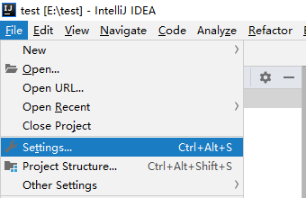
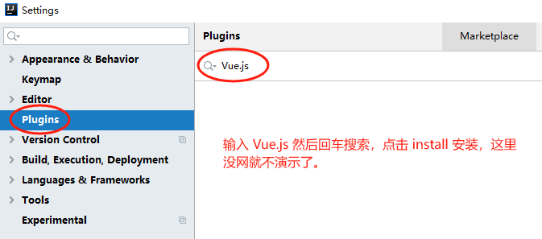
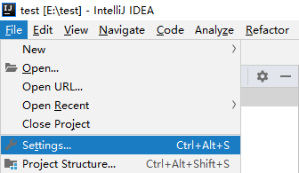
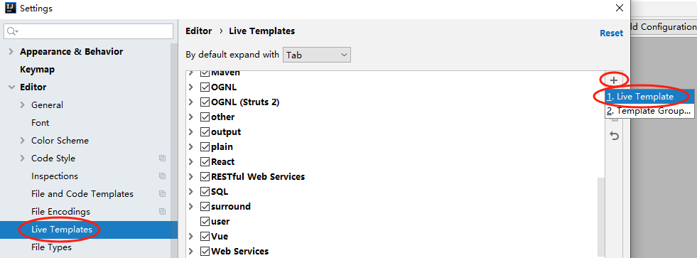
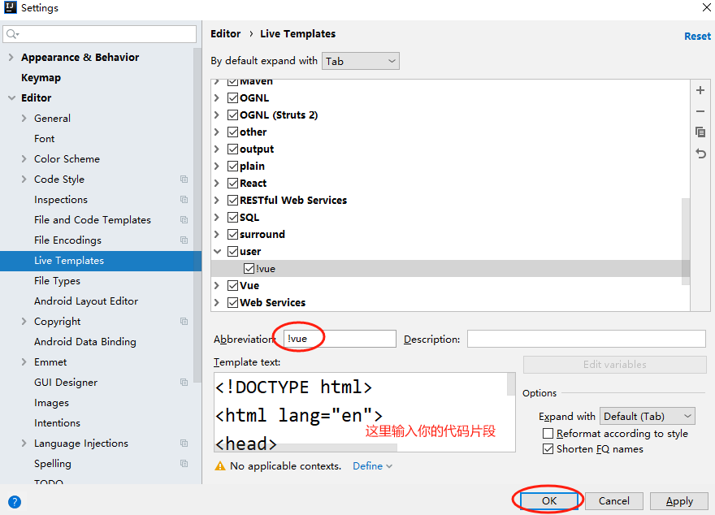
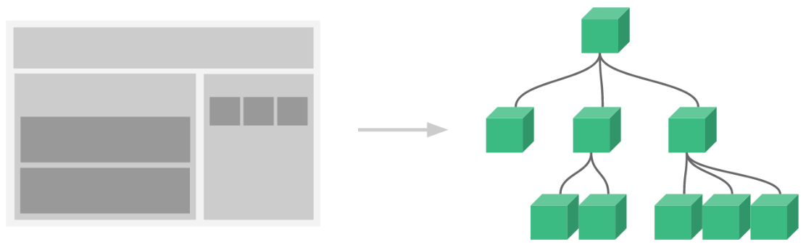
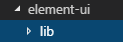
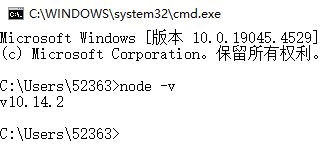

# 第三天【项目前端相关基础知识一】

# 一、前端开发介绍
## 概述
<font style="color:rgb(0, 0, 0);">前端工程师“Front-End-Developer”源自于美国。大约从2005年开始正式的前端工程师角色被行业所认可，到了2010年，互联网开始全面进入移动时代，前端开发的工作越来越重要。</font>

<font style="color:rgb(0, 0, 0);">最初所有的开发工作都是由后端工程师完成的，随着业务越来越繁杂，工作量变大，于是我们将项目中的可视化部分和一部分交互功能的开发工作剥离出来，形成了前端开发。</font>

<font style="color:rgb(0, 0, 0);">由于互联网行业的急速发展，导致了在不同的国家，有着截然不同的分工体制。</font>

<font style="color:rgb(0, 0, 0);">在日本和一些人口比较稀疏的国家，例如加拿大、澳洲等，流行“Full-Stack Engineer”，也就是我们通常所说的全栈工程师。通俗点说就是一个人除了完成前端开发和后端开发工作以外，有的公司从产品设计到项目开发再到后期运维可能都是同一个人，甚至可能还要负责 UI、配动画，也可以是扫地、擦窗、写文档、维修桌椅等等。</font>

<font style="color:rgb(0, 0, 0);">而在美国等互联网环境比较发达的国家项目开发的分工协作更为明确，整个项目开发分为前端、中间层和后端三个开发阶段，这三个阶段分别由三个或者更多的人来协同完成。</font>

<font style="color:rgb(0, 0, 0);">国内的大部分互联网公司只有前端工程师和后端工程师，中间层的工作有的由前端来完成，有的由后端来完成。</font>

<font style="color:rgb(255, 0, 0);">PRD（产品原型-产品经理） - PSD（视觉设计-UI工程师） - HTML/CSS/JavaScript（PC/移动端网页，实现网页端的视觉展示和交互-前端工程师）</font>

# 二、ES6 入门
## <font style="color:rgb(51, 51, 51);">ECMAScript 6 简介</font>
<font style="color:rgb(51, 51, 51);">ECMAScript 6.0（以下简称 ES6）是 JavaScript 语言的下一代标准，已经在 2015 年 6 月正式发布了。它的目标，是使得 JavaScript 语言可以用来编写复杂的大型应用程序，成为企业级开发语言。</font>

### <font style="color:rgb(51, 51, 51);">ECMAScript 和 JavaScript 的关系</font>
<font style="color:rgb(255, 0, 0);">一个常见的问题是，ECMAScript 和 JavaScript 到底是什么关系？</font>

<font style="color:rgb(51, 51, 51);">要讲清楚这个问题，需要回顾历史。1996 年 11 月，JavaScript 的创造者 Netscape 公司，决定将 JavaScript 提交给标准化组织 ECMA，希望这种语言能够成为国际标准。次年，ECMA 发布 262 号标准文件（ECMA-262）的第一版，规定了浏览器脚本语言的标准，并将这种语言称为 ECMAScript，这个版本就是 1.0 版。</font>

<font style="color:rgb(51, 51, 51);">因此，ECMAScript 和 JavaScript 的关系是，前者是后者的规格，后者是前者的一种实现（另外的 ECMAScript 方言还有 Jscript 和 ActionScript）。</font>

### <font style="color:rgb(51, 51, 51);">ES6 与 ECMAScript 2015 的关系</font>
<font style="color:rgb(255, 0, 0);">ECMAScript 2015（简称 ES2015）这个词，也是经常可以看到的。它与 ES6 是什么关系呢？</font>

<font style="color:rgb(51, 51, 51);">2011 年，ECMAScript 5.1 版发布后，就开始制定 6.0 版了。因此，ES6 这个词的原意，就是指 JavaScript 语言的下一个版本。</font>

<font style="color:rgb(51, 51, 51);">ES6 的第一个版本，在 2015 年 6 月发布，正式名称是《ECMAScript 2015 标准》（简称 ES2015）。</font>

<font style="color:rgb(51, 51, 51);">2016 年 6 月，小幅修订的《ECMAScript 2016 标准》（简称 ES2016）如期发布，这个版本可以看作是 ES6.1 版，因为两者的差异非常小</font><font style="color:rgb(51, 51, 51);">，基本上是同一个标准。根据计划，2017 年 6 月发布 ES2017 标准。</font><font style="color:rgb(51, 51, 51);">  
</font>

<font style="color:rgb(255, 0, 0);">因此，ES6 既是一个历史名词，也是一个泛指，含义是 5.1 版以后的 JavaScript 的下一代标准，涵盖了 ES2015、ES2016、ES2017 等等，</font><font style="color:rgb(51, 51, 51);">而 ES2015 则是正式名称，特指该年发布的正式版本的语言标准。本书中提到 ES6 的地方，一般是指 ES2015 标准，但有时也是泛指“下一代 JavaScript 语言”。</font>

## <font style="color:rgb(0, 0, 0);">基本语法</font>
<font style="color:rgb(51, 51, 51);">ES 标准中不包含 DOM 和 BOM 的定义，只涵盖基本数据类型、关键字、语句、运算符、内建对象、内建函数等通用语法。</font>

<font style="color:rgb(51, 51, 51);">本部分只学习前端开发中 ES6 的最少必要知识，方便后面项目开发中对代码的理解。</font>

### <font style="color:rgb(0, 0, 0);">let 声明变量</font>
```javascript
// var 声明的变量没有局部作用域
// let 声明的变量  有局部作用域
{
  var a = 0
  let b = 1
}
console.log(a)  // 0
console.log(b)  // ReferenceError: b is not defined
```

```javascript
// var 可以声明多次
// let 只能声明一次
var m = 1
var m = 2
let n = 3
let n = 4
console.log(m)  // 2
console.log(n)  // Identifier 'n' has already been declared
```

### <font style="color:rgb(0, 0, 0);">const 声明常量（只读变量）</font>
```javascript
// 1、声明之后不允许改变    
const PI = 3.1415926
PI = 3  // TypeError: Assignment to constant variable.

// 2、一但声明必须初始化，否则会报错
const MY_AGE  // SyntaxError: Missing initializer in const declaration
```

### <font style="color:rgb(51, 51, 51);">解构赋值</font>
<font style="color:rgb(51, 51, 51);">解构赋值是对赋值运算符的扩展。</font>

<font style="color:rgb(51, 51, 51);">他是一种针对数组或者对象进行模式匹配，然后对其中的变量进行赋值。</font>

<font style="color:rgb(51, 51, 51);">在代码书写上简洁且易读，语义更加清晰明了；也方便了复杂对象中数据字段获取。</font>

```javascript
//1、数组解构
// 传统
let a = 1, b = 2, c = 3
console.log(a, b, c)

// ES6
let [x, y, z] = [1, 2, 3]
console.log(x, y, z)


//2、对象解构
let user = {name: 'Helen', age: 18}
// 传统
let name1 = user.name
let age1 = user.age
console.log(name1, age1)

// ES6
let { name, age } =  user//注意：解构的变量必须是user中的属性
console.log(name, age)
```

### <font style="color:rgb(0, 0, 0);">模板字符串</font>
<font style="color:rgb(51, 51, 51);">模板字符串相当于加强版的字符串，用反引号 </font><font style="color:rgb(51, 51, 51);background-color:rgb(236, 234, 230);">`</font><font style="color:rgb(51, 51, 51);">，除了作为普通字符串，还可以用来定义多行字符串，还可以在字符串中加入变量和表达式。</font>

```javascript
// 1、多行字符串
let string1 =  `Hey,
can you stop angry now?`
console.log(string1)

// Hey,
// can you stop angry now?

// 2、字符串插入变量和表达式。变量名写在 ${} 中，${} 中可以放入 JavaScript 表达式。
let name = "Mike"
let age = 27
let info = `My Name is ${name},I am ${age+1} years old next year.`
console.log(info)
// My Name is Mike,I am 28 years old next year.

// 3、字符串中调用函数
function f(){
    return "have fun!"
}
let string2 = `Game start,${f()}`
console.log(string2);  // Game start,have fun!
```

### <font style="color:rgb(0, 0, 0);">声明对象简写</font>
```javascript
const age = 12
const name = "Amy"

// 传统
const person1 = {age: age, name: name}
console.log(person1)

// ES6
const person2 = {age, name}
console.log(person2) //{age: 12, name: "Amy"}
```

### <font style="color:rgb(0, 0, 0);">定义方法简写</font>
```javascript
// 传统
const person1 = {
    sayHi:function(){
        console.log("Hi")
    }
}

person1.sayHi();//"Hi"

// ES6
const person2 = {
    sayHi(){
        console.log("Hi")
    }
}

person2.sayHi()  //"Hi"
```

### <font style="color:rgb(0, 0, 0);">对象拓展运算符</font>
<font style="color:rgb(51, 51, 51);">拓展运算符（...）用于取出参数对象所有可遍历属性然后拷贝到当前对象。</font>

```javascript
// 1、拷贝对象
let person1 = {name: "Amy", age: 15}
let someone = { ...person1 }
console.log(someone)  //{name: "Amy", age: 15}

// 2、合并对象
let age = {age: 15}
let name = {name: "Amy"}
let person2 = {...age, ...name}
console.log(person2)  //{age: 15, name: "Amy"}
```

### <font style="color:rgb(0, 0, 0);">箭头函数</font>
<font style="color:rgb(0, 0, 0);">箭头函数提供了一种更加简洁的函数书写方式。基本语法是：参数 => 函数体</font>

```javascript
// 传统
var f1 = function(a){
    return a
}
console.log(f1(1))

// ES6
var f2 = a => a
console.log(f2(1))
```

```javascript
// 当箭头函数没有参数或者有多个参数，要用 () 括起来。
// 当箭头函数函数体有多行语句，用 {} 包裹起来，表示代码块，
// 当只有一行语句，并且需要返回结果时，可以省略 {} , 结果会自动返回。
var f3 = (a,b) => {
    let result = a+b
    return result
}
console.log(f3(6,2))  // 8

// 前面代码相当于：
var f4 = (a,b) => a+b
```

<font style="color:rgb(0, 0, 0);">箭头函数多用于匿名函数的定义。</font>

# <font style="color:rgb(0, 0, 0);">三、Vue.js 入门</font>
## <font style="color:rgb(0, 0, 0);">介绍</font>
### <font style="color:rgb(0, 0, 0);">Vue.js 是什么</font>
<font style="color:rgb(0, 0, 0);">Vue (读音 /vjuː/，类似于 view) 是一套用于构建用户界面的渐进式框架。</font>

<font style="color:rgb(0, 0, 0);">Vue 的核心库只关注视图层，不仅易于上手，还便于与第三方库或既有项目整合。另一方面，当与现代化的工具链以及各种支持类库结合使用时，Vue 也完全能够为复杂的单页应用提供驱动。</font>

<font style="color:rgb(0, 0, 0);">官方网站：</font>[https://cn.vuejs.org](https://cn.vuejs.org)

### IDEA 安装 Vue 插件




### 入门案例
```html
<!-- id标识vue作用的范围 -->
<div id="app">
    <!-- {{}} 插值表达式，绑定vue中的data数据 -->
    {{ message }}
</div>
<script src="vue.min.js"></script>
<script>
    // 创建一个vue对象
    new Vue({
        el: '#app',//绑定vue作用的范围
        data: {//定义页面中显示的模型数据
            message: 'Hello Vue!'
        }
    })
</script>
```

<font style="color:rgb(255, 0, 0);">这就是声明式渲染：</font><font style="color:rgb(52, 73, 94);">Vue.js 的核心是一个允许采用简洁的模板语法来声明式地将数据渲染进 DOM 的系统</font>

<font style="color:rgb(0, 0, 0);">这里的核心思想就是没有繁琐的 DOM 操作，例如 jQuery 中，我们需要先找到 div 节点，获取到 DOM 对象，然后进行一系列的节点操作。</font>

### <font style="color:rgb(0, 0, 0);">IDEA 设置 Vue 代码片段</font>






然后，以后创建好一个 html 文件后，删除里面所有的内容，在开始部分输入 !vue，然后按 tab 键，即可生成模板内容。

## <font style="color:rgb(0, 0, 0);">基本语法</font>
### <font style="color:rgb(0, 0, 0);">基本数据渲染和指令</font>
v-bind 指令的作用：给页面中标签的属性动态绑定值！

<font style="color:rgb(0, 0, 0);">你看到的</font><font style="color:rgb(0, 0, 0);"> </font><font style="color:rgb(255, 0, 0);">v-bind</font><font style="color:rgb(0, 0, 0);"> </font><font style="color:rgb(0, 0, 0);">特性被称为指令。指令带有前缀</font><font style="color:rgb(0, 0, 0);"> </font><font style="color:rgb(255, 0, 0);">v-</font><font style="color:rgb(0, 0, 0);"> </font>

<font style="color:rgb(0, 0, 0);">除了使用插值表达式{{}}进行数据渲染，也可以使用 v-bind指令，它的简写的形式就是一个</font><font style="color:rgb(255, 0, 0);">冒号（:）</font>

```javascript
data: {
    content: '我是标题',
    message: '页面加载于 ' + new Date().toLocaleString()
}
```

```html
<!-- 如果要将模型数据绑定在html属性中，则使用 v-bind 指令
     此时title中显示的是模型数据
-->
<h1 v-bind:title="message">
    {{content}}
</h1>

<!-- v-bind 指令的简写形式： 冒号（:） -->
<h1 :title="message">
    {{content}}
</h1>
```

### <font style="color:rgb(0, 0, 0);">双向数据绑定</font>
v-model：双向数据绑定指令，主要用在表单中，可以达到：表单项中的内容发生改变，vue 中定义的数据就跟着发生改变；vue 中定义的数据发生改变，则表单项中的内容也跟着发生改变。

<font style="color:rgb(0, 0, 0);">双向数据绑定和单向数据绑定：使用</font><font style="color:rgb(255, 0, 0);"> v-model</font><font style="color:rgb(0, 0, 0);"> 进行双向数据绑定</font>

```javascript
data: {
    searchMap:{
        keyWord: '苏明玉'
    }
}
```

```html
<!-- v-bind:value只能进行单向的数据渲染 -->
<input type="text" v-bind:value="searchMap.keyWord">

<!-- v-model 可以进行双向的数据绑定  -->
<input type="text" v-model="searchMap.keyWord">
<p>您要查询的是：{{searchMap.keyWord}}</p>
```

### <font style="color:rgb(0, 0, 0);">事件</font>
**<font style="color:rgb(0, 0, 255);">需求：</font>**<font style="color:rgb(0, 0, 255);">点击查询按钮，按照输入框中输入的内容查找公司相关信息</font>

<font style="color:rgb(0, 0, 0);">在前面的例子基础上，data 节点中增加 result，增加 methods 节点 并定义 search 方法</font>

```javascript
data: {
     searchMap:{
         keyWord: '苏明玉'
     },
     //查询结果
     result: {}
},

methods:{
    search(){
        console.log('search')
        //TODO
    }
}
```

<font style="color:rgb(0, 0, 0);">html 中增加 button 和 p</font>

<font style="color:rgb(0, 0, 0);">使用</font><font style="color:rgb(255, 0, 0);"> v-on</font><font style="color:rgb(0, 0, 0);"> 进行事件处理，</font><font style="color:rgb(255, 0, 0);">v-on:click</font><font style="color:rgb(0, 0, 0);"> 表示处理鼠标点击事件，事件调用的方法定义在</font><font style="color:rgb(255, 0, 0);"> vue </font><font style="color:rgb(0, 0, 0);">对象声明的 </font><font style="color:rgb(255, 0, 0);">methods</font><font style="color:rgb(0, 0, 0);"> 节点中</font>

```html
<!-- v-on 指令绑定事件，click指定绑定的事件类型，事件发生时调用vue中methods节点中定义的方法 -->
<button v-on:click="search()">查询</button>

<p>您要查询的是：{{searchMap.keyWord}}</p>
<p><a v-bind:href="result.site" target="_blank">{{result.title}}</a></p>
```

<font style="color:rgb(0, 0, 0);">完善 search 方法</font>

```javascript
search(){
    console.log('search');
    this.result = {
        "title":"苏明玉",
        "site":"https://baike.baidu.com/item/%E8%8B%8F%E6%98%8E%E7%8E%89"
    }
}
```

<font style="color:rgb(0, 0, 0);">简写</font>

```html
<!-- v-on 指令的简写形式 @ -->
<button @click="search()">查询</button>
```

**案例：**

```html
<!DOCTYPE html>
<html lang="en">
<head>
    <meta charset="UTF-8">
    <title>Title</title>
    <script src="js/vue.min.js"></script>
</head>
<body>
    <div id="app">
        <h1>购物车页面</h1>

        <!--
            v-on 可以给元素绑定事件
            v-on 可以简写为 @
        -->
        <button v-on:click="fun1()">点我</button>
        <hr>

        <button @click="reduce()">-</button>
        <input type="text" v-model="num">
        <button @click="add()">+</button>

    </div>

    <script>
        new Vue({
            el: '#app',
            data: {
                num: 1
            },
            methods: { // 这里写自己的函数
                fun1(){
                   alert('你好')
                },

                add(){ // 要在自己定义的方法中使用data中的变量，需要 this.xxxx
                    this.num++
                },

                reduce(){
                    this.num--
                    if(this.num <= 0){
                        this.num = 1
                    }
                }
            }
        })
    </script>
</body>
</html>
```

### <font style="color:rgb(0, 0, 0);">修饰符</font>
<font style="color:rgb(0, 0, 0);">修饰符 (Modifiers) 是以半角句号</font><font style="color:rgb(255, 0, 0);">（.）</font><font style="color:rgb(0, 0, 0);">指明的特殊后缀，用于指出一个指令应该以特殊方式绑定。</font>

<font style="color:rgb(0, 0, 0);">例如，.prevent 修饰符告诉 v-on 指令对于触发的事件调用 event.preventDefault()：</font>

<font style="color:rgb(0, 0, 0);">即阻止事件原本的默认行为。</font>

```javascript
data: {
    user: {}
}
```

```html
<!-- 修饰符用于指出一个指令应该以特殊方式绑定。
     这里的 .prevent 修饰符告诉 v-on 指令对于触发的事件调用js的 event.preventDefault()：
     即阻止表单提交的默认行为 -->
<form action="save" v-on:submit.prevent="onSubmit">
    <label for="username">
        <input type="text" id="username" v-model="user.username">
        <button type="submit">保存</button>
    </label>
</form>
```

```javascript
methods: {
    onSubmit() {
        if (this.user.username) {
            console.log('提交表单')
        } else {
            alert('请输入用户名')
        }
    }
}
```

### <font style="color:rgb(0, 0, 0);">条件渲染</font>
<font style="color:rgb(255, 0, 0);">v-if</font><font style="color:rgb(0, 0, 0);">：条件指令</font>

```javascript
data: {
    ok: false
}
```

<font style="color:rgb(255, 0, 0);">注意：</font><font style="color:rgb(0, 0, 0);">单个复选框绑定到布尔值</font>

```html
<input type="checkbox" v-model="ok">同意许可协议
<!-- v:if条件指令：还有v-else、v-else-if -->
<h1 v-if="ok">if：Lorem ipsum dolor sit amet.</h1>
<h1 v-else>no</h1>
```

<font style="color:rgb(255, 0, 0);">v-show</font><font style="color:rgb(0, 0, 0);">：条件指令</font>

<font style="color:rgb(0, 0, 0);">使用 v-show 完成和上面相同的功能</font>

```html
<!-- v:show 条件指令 初始渲染开销大 -->
<h1 v-show="ok">show：Lorem ipsum dolor sit amet.</h1>
<h1 v-show="!ok">no</h1>
```

+ <font style="color:rgb(233, 105, 0);">v-if</font><font style="color:rgb(0, 0, 0);"> 是“真正”的条件渲染，因为它会确保在切换过程中条件块内的事件监听器和子组件适当地被销毁和重建。</font>
+ <font style="color:rgb(233, 105, 0);">v-if</font><font style="color:rgb(0, 0, 0);"> 也是</font>**<font style="color:rgb(44, 62, 80);">惰性的</font>**<font style="color:rgb(0, 0, 0);">：如果在初始渲染时条件为假，则什么也不做——直到条件第一次变为真时，才会开始渲染条件块。</font>
+ <font style="color:rgb(0, 0, 0);">相比之下，</font><font style="color:rgb(233, 105, 0);">v-show</font><font style="color:rgb(0, 0, 0);"> 就简单得多——不管初始条件是什么，元素总是会被渲染，并且只是简单地基于 CSS 进行切换。</font>
+ <font style="color:rgb(0, 0, 0);">一般来说，</font><font style="color:rgb(233, 105, 0);">v-if</font><font style="color:rgb(0, 0, 0);"> 有更高的切换开销，而 </font><font style="color:rgb(233, 105, 0);">v-show</font><font style="color:rgb(0, 0, 0);"> 有更高的初始渲染开销。因此，如果需要非常频繁地切换，则使用 </font><font style="color:rgb(233, 105, 0);">v-show</font><font style="color:rgb(0, 0, 0);"> 较好；如果在运行时条件很少改变，则使用 </font><font style="color:rgb(233, 105, 0);">v-if</font><font style="color:rgb(0, 0, 0);"> 较好。</font>

### <font style="color:rgb(0, 0, 0);">列表渲染</font>
<font style="color:rgb(0, 0, 0);">v-for：列表循环指令</font>

**<font style="color:rgb(0, 0, 0);">例1：简单的列表渲染</font>**

```html
<!-- 1、简单的列表渲染 -->
<ul>
    <li v-for="n in 10">{{ n }} </li>
</ul>
<ul>
    <!-- 如果想获取索引，则使用index关键字，注意，圆括号中的index必须放在后面 -->
    <li v-for="(n, index) in 5">{{ n }} - {{ index }} </li>
</ul>
```

**<font style="color:rgb(0, 0, 0);">例2：遍历数据列表</font>**

```javascript
data: {
    userList: [
        { id: 1, username: 'helen', age: 18 },
        { id: 2, username: 'peter', age: 28 },
        { id: 3, username: 'andy', age: 38 }
    ]
}
```

```html
<!-- 2、遍历数据列表 -->
<table border="1">
    <!-- <tr v-for="item in userList"></tr> -->
    <tr v-for="(item, index) in userList">
        <td>{{index}}</td>
        <td>{{item.id}}</td>
        <td>{{item.username}}</td>
        <td>{{item.age}}</td>
    </tr>
</table>
```

# 四、Vue.js 进阶
## <font style="color:rgb(0, 0, 0);">组件</font>
### 概述
<font style="color:rgb(0, 0, 0);">组件（Component）是 Vue.js 最强大的功能之一。</font>

<font style="color:rgb(0, 0, 0);">组件可以扩展 HTML 元素，封装可重用的代码。</font>

<font style="color:rgb(0, 0, 0);">组件系统让我们可以用独立可复用的小组件来构建大型应用，几乎任意类型的应用的界面都可以抽象为一个组件树。</font>



### <font style="color:rgb(0, 0, 0);">局部组件</font>
<font style="color:rgb(0, 0, 0);">定义组件</font>

```javascript
var app = new Vue({
    el: '#app',
    // 定义局部组件，这里可以定义多个局部组件
    components: {
        //组件的名字
        'Navbar': {
            //组件的内容
            template: '<ul><li>首页</li><li>学员管理</li></ul>'
        }
    }
})
```

<font style="color:rgb(0, 0, 0);">使用组件</font>

```html
<div id="app">
    <Navbar></Navbar>
</div>
```

### <font style="color:rgb(0, 0, 0);">全局组件</font>
<font style="color:rgb(255, 0, 255);">定义全局组件：components/Navbar.js</font>

```javascript
// 定义全局组件
Vue.component('Navbar', {
    template: '<ul><li>首页</li><li>学员管理</li><li>讲师管理</li></ul>'
})
```

```html
<div id="app">
    <Navbar></Navbar>
</div>
<script src="vue.min.js"></script>
<script src="components/Navbar.js"></script>
<script>
    var app = new Vue({
        el: '#app'
    })
</script>
```

## <font style="color:rgb(0, 0, 0);">实例生命周期</font>
### 生命周期图


### 生命周期案例
```javascript
data: {
    message: '书山有路勤为径'
},

methods: {
    show() {
        console.log('执行show方法')
    },
    update() {
        this.message = '柳暗花明又一村'
    }
},
```

```html
<button @click="update()">update</button>
<h3 id="h3">{{ message }}</h3>
```

<font style="color:rgb(0, 0, 0);">分析生命周期相关方法的执行时机</font>

```javascript
//===创建时的四个事件
beforeCreate() { // 第一个被执行的钩子方法：实例被创建出来之前执行
    console.log(this.message) //undefined
    this.show() //TypeError: this.show is not a function
    // beforeCreate执行时，data 和 methods 中的 数据都还没有没初始化
},

created() { // 第二个被执行的钩子方法，创建vue对象之后执行
    console.log(this.message) //书山有路勤为径
    this.show() //执行show方法
    // created执行时，data 和 methods 都已经被初始化好了！
    // 如果要调用 methods 中的方法，或者操作 data 中的数据，最早，只能在 created 中操作
},

beforeMount() { // 第三个被执行的钩子方法
    console.log(document.getElementById('h3').innerText) //{{ message }}
    // beforeMount执行时，模板已经在内存中编辑完成了，尚未被渲染到页面中
},

mounted() { // 第四个被执行的钩子方法
    console.log(document.getElementById('h3').innerText) //书山有路勤为径
    // 内存中的模板已经渲染到页面，用户已经可以看见内容
},

//===运行中的两个事件
beforeUpdate() { // 数据更新的前一刻，在页面渲染之前执行，在内存数据更改之后执行
    console.log('界面显示的内容：' + document.getElementById('h3').innerText)
    console.log('data 中的 message 数据是：' + this.message)
    // beforeUpdate执行时，内存中的数据已更新，但是页面尚未被渲染
},

updated() { // 在页面渲染之后执行
    console.log('界面显示的内容：' + document.getElementById('h3').innerText)
    console.log('data 中的 message 数据是：' + this.message)
    // updated执行时，内存中的数据已更新，并且页面已经被渲染
}
```

## <font style="color:rgb(0, 0, 0);">路由</font>
### 概述
<font style="color:rgb(0, 0, 0);">Vue.js 路由允许我们通过不同的 URL 访问不同的内容。</font>

<font style="color:rgb(0, 0, 0);">通过 Vue.js 可以实现多视图的单页 Web 应用（single page web application，SPA）。</font>

<font style="color:rgb(0, 0, 0);">Vue.js 路由需要载入 vue-router 库。</font>

### <font style="color:rgb(0, 0, 0);">案例</font>
#### <font style="color:rgb(0, 0, 0);">引入 js</font>
```javascript
<script src="vue.min.js"></script>
<script src="vue-router.min.js"></script>
```

#### <font style="color:rgb(0, 0, 0);">编写 html</font>
```html
<div id="app">
    <h1>Hello App!</h1>
    <p>
        <!-- 使用 router-link 组件来导航. -->
        <!-- 通过传入 `to` 属性指定链接. -->
        <!-- <router-link> 默认会被渲染成一个 `<a>` 标签 -->
        <router-link to="/">首页</router-link>
        <router-link to="/student">会员管理</router-link>
        <router-link to="/teacher">讲师管理</router-link>
    </p>
    <!-- 路由出口 -->
    <!-- 路由匹配到的组件将渲染在这里 -->
    <router-view></router-view>
</div>
```

#### <font style="color:rgb(0, 0, 0);">编写 js</font>
```html
<script>
  // 1. 定义（路由）组件。
  // 可以从其他文件 import 进来
  const Welcome = { template: '<div>欢迎</div>' }
  const Student = { template: '<div>student list</div>' }
  const Teacher = { template: '<div>teacher list</div>' }

  // 2. 定义路由
  // 每个路由应该映射一个组件。
  const routes = [
    { path: '/welcome', component: Welcome },
    { path: '/student', component: Student },
    { path: '/teacher', component: Teacher }
  ]

  // 3. 创建 router 实例，然后传 `routes` 配置
  const router = new VueRouter({
      routes // （缩写）相当于 routes: routes
  })

  // 4. 创建和挂载根实例。
  // 从而让整个应用都有路由功能
  const app = new Vue({
      el: '#app',
      router
  })

  // 现在，应用已经启动了！
</script>
```

# <font style="color:rgb(0, 0, 0);">五、axios</font>
## 概述
+ <font style="color:rgb(47, 47, 47);">axios 是独立于 vue 的一个项目，基于 promise 用于浏览器和 node.js 的 http 客户端</font>
+ <font style="color:rgb(47, 47, 47);">在浏览器中可以帮助我们完成 ajax 请求的发送</font>
+ <font style="color:rgb(47, 47, 47);">在 node.js 中可以向远程接口发送请求</font>

## 入门案例
### <font style="color:rgb(47, 47, 47);">引入 js</font>
```html
<script src="vue.min.js"></script>
<script src="axios.min.js"></script>
```

### 编写 js
<font style="color:rgb(255, 0, 0);">注意：测试时需要开启后端服务器，并且后端开启跨域访问权限</font>

```javascript
var app = new Vue({
    el: '#app',
    data: {
        memberList: []//数组
    },
    created() {
        this.getList()
    },

    methods: {
        getList() {
            //vm = this
            axios.get('http://localhost:8081/admin/ucenter/member')
            .then(response => {
                console.log(response)
                this.memberList = response.data.data.items
            })
            .catch(error => {
                console.log(error)
            })
        }
    }
})
```

**<font style="color:rgb(0, 0, 0);">控制台查看输出。</font>**

### <font style="color:rgb(0, 0, 0);">编写 html</font>
```html
<div id="app">
    <table border="1">
        <tr>
            <td>id</td>
            <td>姓名</td>
        </tr>

        <tr v-for="item in memberList">
            <td>{{item.memberId}}</td>
            <td>{{item.nickname}}</td>
        </tr>
  </table>
</div>
```

# <font style="color:rgb(0, 0, 0);">六、element-ui</font>
## 概述
<font style="color:rgb(51, 51, 51);">element-ui 是饿了么前端出品的基于 Vue.js 的后台组件库，方便程序员进行页面快速布局和构建</font>

<font style="color:rgb(51, 51, 51);">官网： </font>[http://element-cn.eleme.io/#/zh-CN](http://element-cn.eleme.io/#/zh-CN)

## 入门案例
### 导入 element-ui


### <font style="color:rgb(51, 51, 51);">引入 css</font>
```html
<!-- import CSS -->
<link rel="stylesheet" href="element-ui/lib/theme-chalk/index.css">
```

### <font style="color:rgb(0, 0, 0);">引入 js</font>
```html
<!-- import Vue before Element -->
<script src="vue.min.js"></script>
<!-- import JavaScript -->
<script src="element-ui/lib/index.js"></script>
```

### <font style="color:rgb(0, 0, 0);">编写 html</font>
```html
<div id="app">
    <el-button @click="visible = true">Button</el-button>
    <el-dialog :visible.sync="visible" title="Hello world">
        <p>Try Element</p>
    </el-dialog>
</div>
```

### <font style="color:rgb(0, 0, 0);">编写 js</font>
```html
<script>
    new Vue({
      el: '#app',
      data: function () {//定义Vue中data的另一种方式
        return { visible: false }
      }
    })
</script>
```

<font style="color:rgb(0, 0, 0);">其他 ui 组件我们在项目中学习。</font>

# <font style="color:rgb(0, 0, 0);">七、Node</font>
## 概述
### <font style="color:rgb(0, 0, 0);">什么是 Node.js</font>
<font style="color:rgb(0, 0, 0);">简单的说 Node.js 就是运行在服务端的 JavaScript。</font>

<font style="color:rgb(0, 0, 0);">Node.js 是一个事件驱动 I/O 服务端 JavaScript 环境，基于 Google 的 V8 引擎，V8 引擎执行 JavaScript的速度非常快，性能非常好。</font>

### <font style="color:rgb(0, 0, 0);">Node.js 有什么用</font>
<font style="color:rgb(51, 51, 51);">如果你是一个前端程序员，你不懂得像 PHP、Python 或 Ruby 等动态编程语言，然后你想创建自己的服务，那么 Node.js 是一个非常好的选择。</font>

<font style="color:rgb(51, 51, 51);">Node.js 是运行在服务端的 JavaScript，如果你熟悉 JavaScript，那么你将会很容易的学会 Node.js。</font>

<font style="color:rgb(51, 51, 51);">当然，如果你是后端程序员，想部署一些高性能的服务，那么学习 Node.js 也是一个非常好的选择。</font>

## <font style="color:rgb(51, 51, 51);">安装</font>
### <font style="color:rgb(0, 0, 0);">下载</font>
+ <font style="color:rgb(51, 51, 51);">官网：</font>[https://nodejs.org/en/](https://nodejs.org/en/)
+ <font style="color:rgb(51, 51, 51);">中文网：</font>[http://nodejs.cn/](http://nodejs.cn/)
+ <font style="color:rgb(51, 51, 51);">LTS：长期支持版本</font>
+ <font style="color:rgb(51, 51, 51);">Current：最新版</font>

### <font style="color:rgb(0, 0, 0);">安装</font>
双击安装包 <font style="color:#DF2A3F;">node-v10.14.2-x64.msi</font>，一路 next 即可。

### 查看版本
打开 cmd 命令窗口，输入：node -v



### 注意
<font style="color:#DF2A3F;">安装完 Node 后，如果 IDEA 是开启状态，请重启一下 IDEA，不然 Node 环境 IDEA 识别不到！</font>

## <font style="color:rgb(0, 0, 0);">快速入门</font>
### 编写 js
创建一个 hello.js 文件，内容如下：

```javascript
console.log('Hello Node.js')
```

### 运行
打开 IDEA 的命令行终端，进入到 hello.js 所在目录，输入：

```shell
node hello.js
```

<font style="color:rgb(0, 0, 0);">浏览器的内核包括两部分核心：</font>

+ <font style="color:rgb(0, 0, 0);">DOM 渲染引擎；</font>
+ <font style="color:rgb(0, 0, 0);">js 解析器（js 引擎）</font>
+ <font style="color:rgb(0, 0, 0);">js 运行在浏览器中的内核中的 js 引擎内部</font>

<font style="color:rgb(0, 0, 0);">Node.js 是脱离浏览器环境运行的 JavaScript 程序，基于 V8 引擎（Chrome 的 JavaScript 的引擎）</font>

## <font style="color:rgb(0, 0, 0);">服务器端应用开发（了解）</font>
创建 server_app.js 文件，内容如下：

```javascript
const http = require('http');
http.createServer(function (request, response) {
    // 发送 HTTP 头部 
    // HTTP 状态值: 200 : OK
    // 内容类型: text/plain
    response.writeHead(200, {'Content-Type': 'text/plain'});
    // 发送响应数据 "Hello World"
    response.end('Hello Server');
}).listen(8888);
// 终端打印如下信息
console.log('Server running at http://127.0.0.1:8888/');
```

<font style="color:rgb(0, 0, 0);">运行服务器程序</font>

```shell
node server_app.js
```

<font style="color:rgb(0, 0, 0);">服务器启动成功后，在浏览器中输入：</font>[http://localhost:8888/](http://localhost:8888/)<font style="color:rgb(0, 0, 0);"> 查看 web server 成功运行，并输出 html 页面。</font>

<font style="color:rgb(0, 0, 0);">停止服务：ctrl + c</font>


> 更新: 2024-07-10 15:33:49  
> 原文: <https://www.yuque.com/u41736172/az9urv/dvx46hm96g0f4vzd>