# 第九天【课程列表和整合阿里云视频点播】

# 一、课程列表的显示
## 效果图
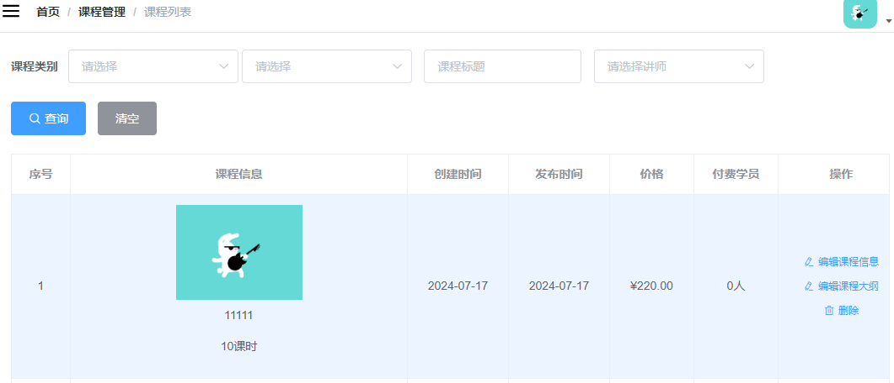

## <font style="color:rgb(0, 0, 0);">后端实现</font>
### <font style="color:rgb(0, 0, 0);">定义搜索对象</font>
CourseQuery

```java
package com.xszx.edu.query;

@ApiModel(value = "Course查询对象", description = "课程查询对象封装")
@Data
public class CourseQuery implements Serializable {

    private static final long serialVersionUID = 1L;

    @ApiModelProperty(value = "课程名称")
    private String title;

    @ApiModelProperty(value = "讲师id")
    private String teacherId;

    @ApiModelProperty(value = "一级类别id")
    private String subjectParentId;

    @ApiModelProperty(value = "二级类别id")
    private String subjectId;
}
```

### <font style="color:rgb(0, 0, 0);">定义 service 方法</font>
接口

```java
void pageQuery(Page<Course> pageParam, CourseQuery courseQuery);
```

实现

```java
@Override
public void pageQuery(Page<Course> pageParam, CourseQuery courseQuery) {

    QueryWrapper<Course> queryWrapper = new QueryWrapper<>();
    queryWrapper.orderByDesc("gmt_create");

    if (courseQuery == null){
        baseMapper.selectPage(pageParam, queryWrapper);
        return;
    }

    String title = courseQuery.getTitle();
    String teacherId = courseQuery.getTeacherId();
    String subjectParentId = courseQuery.getSubjectParentId();
    String subjectId = courseQuery.getSubjectId();

    if (!StringUtils.isEmpty(title)) {
        queryWrapper.like("title", title);
    }

    if (!StringUtils.isEmpty(teacherId) ) {
        queryWrapper.eq("teacher_id", teacherId);
    }

    if (!StringUtils.isEmpty(subjectParentId)) {
        queryWrapper.eq("subject_parent_id", subjectParentId);
    }

    if (!StringUtils.isEmpty(subjectId)) {
        queryWrapper.eq("subject_id", subjectId);
    }

    baseMapper.selectPage(pageParam, queryWrapper);
}
```

### <font style="color:rgb(0, 0, 0);">定义 web 层方法</font>
```java
@ApiOperation(value = "分页课程列表")
@GetMapping("{page}/{limit}")
public R pageQuery(
        @ApiParam(name = "page", value = "当前页码", required = true)
        @PathVariable Long page,

        @ApiParam(name = "limit", value = "每页记录数", required = true)
        @PathVariable Long limit,

        @ApiParam(name = "courseQuery", value = "查询对象", required = false)
                CourseQuery courseQuery){

    Page<Course> pageParam = new Page<>(page, limit);

    courseService.pageQuery(pageParam, courseQuery);
    List<Course> records = pageParam.getRecords();

    long total = pageParam.getTotal();

    return  R.ok().data("total", total).data("rows", records);
}
```

## <font style="color:rgb(0, 0, 0);">前端分页查询列表</font>
### <font style="color:rgb(0, 0, 0);">定义 api</font>
<font style="color:rgb(0, 0, 0);">course.js</font>

```javascript
getPageList(page, limit, searchObj) {
  return request({
    url: `${api_name}/${page}/${limit}`,
    method: 'get',
    params: searchObj
  })
},
```

### <font style="color:rgb(0, 0, 0);">组件中的 js</font>
<font style="color:rgb(0, 0, 0);">src/views/edu/list.vue</font>

```html
<script>
import course from '@/api/edu/course'
import teacher from '@/api/edu/teacher'
import subject from '@/api/edu/subject'

export default {

  data() {
    return {
      listLoading: true, // 是否显示loading信息
      list: null, // 数据列表
      total: 0, // 总记录数
      page: 1, // 页码
      limit: 10, // 每页记录数
      searchObj: {
        subjectParentId: '',
        subjectId: '',
        title: '',
        teacherId: ''
      }, // 查询条件
      teacherList: [], // 讲师列表
      subjectNestedList: [], // 一级分类列表
      subSubjectList: [] // 二级分类列表,
    }
  },

  created() { // 当页面加载时获取数据
    this.fetchData()
    // 初始化分类列表
    this.initSubjectList()
    // 获取讲师列表
    this.initTeacherList()
  },

  methods: {
    fetchData(page = 1) { // 调用api层获取数据库中的数据
      console.log('加载列表')
      // 当点击分页组件的切换按钮的时候，会传输一个当前页码的参数page
      // 解决分页无效问题
      this.page = page
      this.listLoading = true
      course.getPageList(this.page, this.limit, this.searchObj).then(response => {
        // debugger 设置断点调试
        if (response.success === true) {
          this.list = response.data.rows
          this.total = response.data.total
        }
        this.listLoading = false
      })
    },

    initTeacherList() {
      teacher.getList().then(response => {
        this.teacherList = response.data.items
      })
    },

    initSubjectList() {
      subject.getNestedTreeList().then(response => {
        this.subjectNestedList = response.data.items
      })
    },

    subjectLevelOneChanged(value) {
      for (let i = 0; i < this.subjectNestedList.length; i++) {
        if (this.subjectNestedList[i].id === value) {
          this.subSubjectList = this.subjectNestedList[i].children
          this.searchObj.subjectId = ''
        }
      }
    },

    resetData() {
      this.searchObj = {}
      this.subSubjectList = [] // 二级分类列表
      this.fetchData()
    }
  }
}
</script>
```

### <font style="color:rgb(0, 0, 0);">组件模板</font>
<font style="color:rgb(0, 0, 0);">查询表单</font>

```html
<!--查询表单-->
<el-form :inline="true" class="demo-form-inline">

  <!-- 所属分类：级联下拉列表 -->
  <!-- 一级分类 -->
  <el-form-item label="课程类别">
    <el-select
      v-model="searchObj.subjectParentId"
      placeholder="请选择"
      @change="subjectLevelOneChanged">
      <el-option
        v-for="subject in subjectNestedList"
        :key="subject.id"
        :label="subject.title"
        :value="subject.id"/>
    </el-select>

    <!-- 二级分类 -->
    <el-select v-model="searchObj.subjectId" placeholder="请选择">
      <el-option
        v-for="subject in subSubjectList"
        :key="subject.id"
        :label="subject.title"
        :value="subject.id"/>
    </el-select>
  </el-form-item>

  <!-- 标题 -->
  <el-form-item>
    <el-input v-model="searchObj.title" placeholder="课程标题"/>
  </el-form-item>

  <!-- 讲师 -->
  <el-form-item>
    <el-select
      v-model="searchObj.teacherId"
      placeholder="请选择讲师">
      <el-option
        v-for="teacher in teacherList"
        :key="teacher.id"
        :label="teacher.name"
        :value="teacher.id"/>
    </el-select>
  </el-form-item>

  <el-button type="primary" icon="el-icon-search" @click="fetchData()">查询</el-button>
  <el-button type="default" @click="resetData()">清空</el-button>
</el-form>
```

<font style="color:rgb(0, 0, 0);">表格和分页</font>

<font style="color:rgb(0, 0, 0);">表格添加了 row-class-name="myClassList" 样式定义</font>

```html
<!-- 表格 -->
<el-table
  v-loading="listLoading"
  :data="list"
  element-loading-text="数据加载中"
  border
  fit
  highlight-current-row
  row-class-name="myClassList">

  <el-table-column
    label="序号"
    width="70"
    align="center">
    <template slot-scope="scope">
      {{ (page - 1) * limit + scope.$index + 1 }}
    </template>
  </el-table-column>

  <el-table-column label="课程信息" width="470" align="center">
    <template slot-scope="scope">
      <div class="info">
        <div class="pic">
          
        </div>
        <div class="title">
          <a href="">{{ scope.row.title }}</a>
          <p>{{ scope.row.lessonNum }}课时</p>
        </div>
      </div>

    </template>
  </el-table-column>

  <el-table-column label="创建时间" align="center">
    <template slot-scope="scope">
      {{ scope.row.gmtCreate.substr(0, 10) }}
    </template>
  </el-table-column>
  <el-table-column label="发布时间" align="center">
    <template slot-scope="scope">
      {{ scope.row.gmtModified.substr(0, 10) }}
    </template>
  </el-table-column>
  <el-table-column label="价格" width="100" align="center" >
    <template slot-scope="scope">
      {{ Number(scope.row.price) === 0 ? '免费' :
      '¥' + scope.row.price.toFixed(2) }}
    </template>
  </el-table-column>
  <el-table-column prop="buyCount" label="付费学员" width="100" align="center" >
    <template slot-scope="scope">
      {{ scope.row.buyCount }}人
    </template>
  </el-table-column>

  <el-table-column label="操作" width="150" align="center">
    <template slot-scope="scope">
      <router-link :to="'/edu/course/info/'+scope.row.id">
        <el-button type="text" size="mini" icon="el-icon-edit">编辑课程信息</el-button>
      </router-link>
      <router-link :to="'/edu/course/chapter/'+scope.row.id">
        <el-button type="text" size="mini" icon="el-icon-edit">编辑课程大纲</el-button>
      </router-link>
      <el-button type="text" size="mini" icon="el-icon-delete">删除</el-button>
    </template>
  </el-table-column>
</el-table>

<!-- 分页 -->
<el-pagination
  :current-page="page"
  :page-size="limit"
  :total="total"
  style="padding: 30px 0; text-align: center;"
  layout="total, prev, pager, next, jumper"
  @current-change="fetchData"
/>
```

### <font style="color:rgb(0, 0, 0);">css 的定义</font>
```html
<style scoped>
.myClassList .info {
    width: 450px;
    overflow: hidden;
}

.myClassList .info .pic {
    width: 150px;
    height: 90px;
    overflow: hidden;
    float: left;
}

.myClassList .info .pic a {
    display: block;
    width: 100%;
    height: 100%;
    margin: 0;
    padding: 0;
}

.myClassList .info .pic img {
    display: block;
    width: 100%;
}

.myClassList td .info .title {
    width: 280px;
    float: right;
    height: 90px;
}

.myClassList td .info .title a {
    display: block;
    height: 48px;
    line-height: 24px;
    overflow: hidden;
    color: #00baf2;
    margin-bottom: 12px;
}

.myClassList td .info .title p {
    line-height: 20px;
    margin-top: 5px;
    color: #818181;
}
</style>
```

# 二、删除课程
删除课程的话，需要：

1. 删除该课程下面的所有的小节及对应的阿里云上的视频
2. 删除该课程下面的所有的章节
3. 删除该课程及阿里云OSS上的封面

## <font style="color:rgb(0, 0, 0);">后端实现</font>
### <font style="color:rgb(0, 0, 0);">web 层</font>
<font style="color:rgb(0, 0, 0);">定义删除 api 方法：CourseAdminController.java</font>

```java
@ApiOperation(value = "根据ID删除课程")
@DeleteMapping("{id}")
public R removeById(
    @ApiParam(name = "id", value = "课程ID", required = true)
    @PathVariable String id){

    boolean result = courseService.removeCourseById(id);
    if(result){
        return R.ok();
    }else{
        return R.error().message("删除失败");
    }
}
```

### <font style="color:rgb(0, 0, 0);">service 层</font>
<font style="color:rgb(0, 0, 0);">如果用户确定删除，则首先删除 video 记录，然后删除 chapter 记录，最后删除 Course 记录</font>

#### <font style="color:rgb(0, 0, 0);">在 VideoService 中定义根据 courseId 删除 video 业务方法</font>
<font style="color:rgb(0, 0, 0);">接口</font>

```java
boolean removeByCourseId(String courseId);
```

<font style="color:rgb(0, 0, 0);">实现</font>

```java
@Override
public boolean removeByCourseId(String courseId) {
    QueryWrapper<Video> queryWrapper = new QueryWrapper<>();
    queryWrapper.eq("course_id", courseId);
    Integer count = baseMapper.delete(queryWrapper);
    return null != count && count > 0;
}
```

#### <font style="color:rgb(0, 0, 0);">在 ChapterService 中定义根据 courseId 删除 chapter 业务方法</font>
<font style="color:rgb(0, 0, 0);">接口</font>

```java
boolean removeByCourseId(String courseId);
```

<font style="color:rgb(0, 0, 0);">实现</font>

```java
@Override
public boolean removeByCourseId(String courseId) {
    QueryWrapper<Chapter> queryWrapper = new QueryWrapper<>();
    queryWrapper.eq("course_id", courseId);
    Integer count = baseMapper.delete(queryWrapper);
    return null != count && count > 0;
}
```

#### <font style="color:rgb(0, 0, 0);">删除当前 course 记录</font>
<font style="color:rgb(0, 0, 0);">接口：CourseService.java</font>

```java
boolean removeCourseById(String id);
```

<font style="color:rgb(0, 0, 0);">实现：CourseServiceImpl.java</font>

```java
@Override
public boolean removeCourseById(String id) {

    //根据id删除所有视频
    videoService.removeByCourseId(id);

    //根据id删除所有章节
    chapterService.removeByCourseId(id);
    Integer result = baseMapper.deleteById(id);
    return null != result && result > 0;
}
```

## <font style="color:rgb(0, 0, 0);">前端实现</font>
### <font style="color:rgb(0, 0, 0);">定义 api</font>
<font style="color:rgb(0, 0, 0);">course.js 中添加删除方法</font>

```javascript
removeById(id) {
    return request({
        url: `${api_name}/${id}`,
        method: 'delete'
    })
}
```

### <font style="color:rgb(0, 0, 0);">修改删除按钮</font>
<font style="color:rgb(0, 0, 0);">src/api/edu/course.js 删除按钮注册 click 事件</font>

```html
<el-button type="text" size="mini" icon="el-icon-delete" @click="removeDataById(scope.row.id)">删除</el-button>
```

### <font style="color:rgb(0, 0, 0);">编写删除方法</font>
```javascript
removeDataById(id) {
    // debugger
    this.$confirm('此操作将永久删除该课程，以及该课程下的章节和视频，是否继续?', '提示', {
        confirmButtonText: '确定',
        cancelButtonText: '取消',
        type: 'warning'
    }).then(() => {
        return course.removeById(id)
    }).then(() => {
        this.fetchData()
        this.$message({
            type: 'success',
            message: '删除成功!'
        })
    }).catch((response) => { // 失败
        if (response === 'cancel') {
            this.$message({
                type: 'info',
                message: '已取消删除'
            })
        }
    })
}
```

# 三、视频点播介绍
## <font style="color:rgb(0, 0, 0);">阿里云视频点播技术能力盘点</font>
### <font style="color:rgb(0, 0, 0);">介绍</font>
随着近几年在线视频市场规模不断扩大，内容不断创新，用户粘性增加，在线视频市场的商业价值不断增长，各垂直行业纷纷引入视频能力，一时之间，视频已经成为了众多移动 APP 和在线平台沉淀用户的有效方法。

为了让更多用户可以快速拥有视频能力，阿里云视频点播（VoD）自从上线以来，不断迭代升级，已经全面覆盖点播业务场景，并支持定制化的开发需求。为了让用户更方便的了解视频点播，今天我们将对几个时兴的场景下，视频点播的相应能力做一个盘点。

视频点播是集音视频采集、编辑、上传、自动化转码处理、媒体资源管理、分发加速、视频播放于一体的一站式音视频点播解决方案，为用户提供了 Web 管理控制台和软件开发工具包（API+SDK，包括视频上传、播放器等），用户可以通过它们使用、管理视频点播服务，也可以与自己的应用或服务集成，快速搭建安全、弹性、高可定制的视频点播功能。

所有服务按使用付费，服务能力自动伸缩，告别复杂的架构设计和编程开发，维护成本几近于零，用户可以专注于业务逻辑实现及最终客户端体验的提升。

**<font style="color:rgb(0, 0, 0);">视频点播（ApsaraVideo for VoD）是集音视频采集、编辑、上传、自动化转码处理、媒体资源管理、分发加速于一体的一站式音视频点播解决方案。</font>**

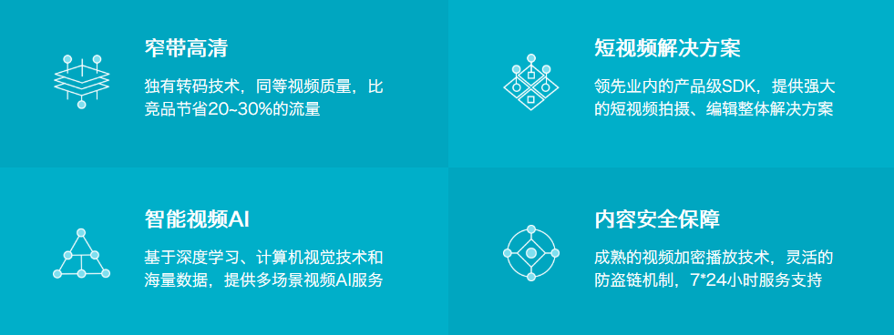

### <font style="color:rgb(0, 0, 0);">应用场景</font>
+ <font style="color:rgb(0, 0, 0);">音视频网站：无论是初创视频服务企业，还是已拥有海量视频资源，可定制化的点播服务帮助客户快速搭建拥有极致观看体验、安全可靠的视频点播应用。</font>
+ <font style="color:rgb(0, 0, 0);">短视频：集音视频拍摄、特效编辑、本地转码、高速上传、自动化云端转码、媒体资源管理、分发加速、播放于一体的完整短视频解决方案。目前已帮助 1000+APP 快速实现手机短视频功能。</font>
+ <font style="color:rgb(0, 0, 0);">直播转点播：将直播流同步录制为点播视频，用于回看。并支持媒资管理、媒体处理（转码及内容审核/智能首图等 AI 处理）、内容制作（云剪辑）、CDN 分发加速等一系列操作。</font>
+ <font style="color:rgb(0, 0, 0);">在线教育：为在线教育客户提供简单易用、安全可靠的视频点播服务。可通过控制台/API等多种方式上传教学视频，强大的转码能力保证视频可以快速发布，覆盖全网的加速节点保证学生观看的流畅度。防盗链、视频加密等版权保护方案保护教学内容不被窃取。</font><font style="color:rgb(51, 51, 51);"></font>
+ <font style="color:rgb(0, 0, 0);">视频生产制作：提供在线可视化剪辑平台及丰富的 OpenAPI，帮助客户高效处理、制作视频内容。除基础的剪切拼接、混音、遮标、特效、合成等一系列功能外，依托云剪辑及点播一体化服务还可实现标准化、智能化剪辑生产，大大降低视频制作的槛，缩短制作时间，提升内容生产效率。</font>
+ <font style="color:rgb(0, 0, 0);">内容审核：应用于短视频平台、传媒行业审核等场景，帮助客户从从语音、文字、视觉等多维度精准识别视频、封面、标题或评论的违禁内容进行AI智能审核与人工审核。</font>

### <font style="color:rgb(0, 0, 0);">功能介绍</font>
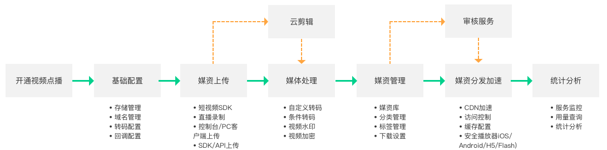

## <font style="color:rgb(0, 0, 0);">开通视频点播云平台</font>
### <font style="color:rgb(0, 0, 0);">选择视频点播服务</font>
<font style="color:rgb(0, 0, 0);">产品->媒体服务->视频点播</font>

### <font style="color:rgb(0, 0, 0);">开通视频点播</font>
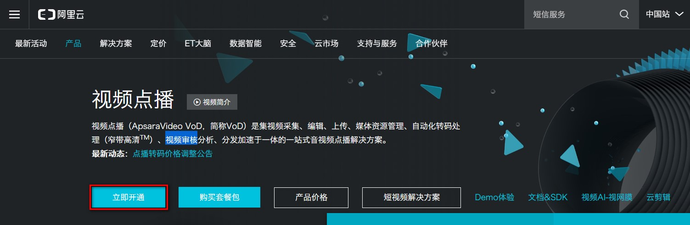

### <font style="color:rgb(0, 0, 0);">选择按使用流量计费</font>
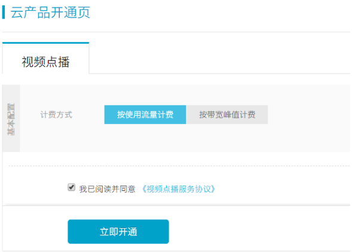

### <font style="color:rgb(0, 0, 0);">资费说明</font>
+ <font style="color:rgb(0, 0, 0);">官网网址：</font>[<font style="color:rgb(0, 0, 0);">https://www.aliyun.com/price/product?spm=a2c4g.11186623.2.12.7fbd59b9vmXVN6#/vod/detail</font>](https://www.aliyun.com/price/product?spm=a2c4g.11186623.2.12.7fbd59b9vmXVN6#/vod/detail)
+ <font style="color:rgb(0, 0, 0);">资费</font>
    - <font style="color:rgb(0, 0, 0);">后付费</font>
    - <font style="color:rgb(0, 0, 0);">套餐包</font>
    - <font style="color:rgb(0, 0, 0);">欠费说明</font>
    - <font style="color:rgb(0, 0, 0);">计费案例：</font>[<font style="color:rgb(0, 0, 0);">https://help.aliyun.com/document_detail/64032.html?spm=a2c4g.11186623.4.3.363db1bcfdvxB5</font>](https://help.aliyun.com/document_detail/64032.html?spm=a2c4g.11186623.4.3.363db1bcfdvxB5)

### <font style="color:rgb(0, 0, 0);">整体流程</font>
<font style="color:rgb(0, 0, 0);">使用视频点播实现音视频上传、存储、处理和播放的整体流程如下：</font>

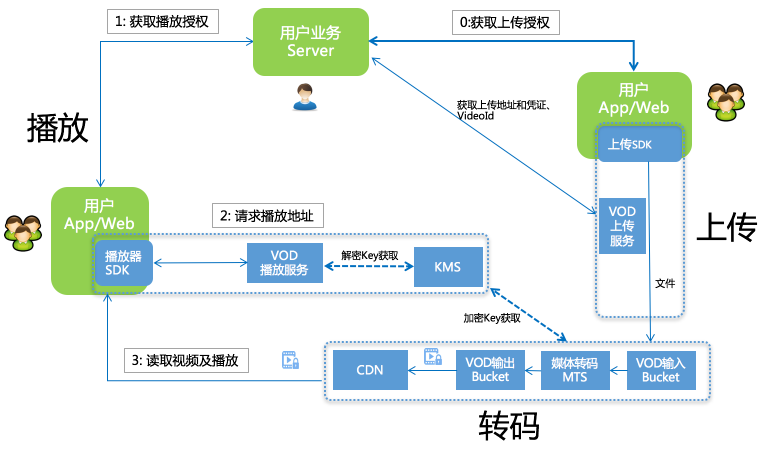

+ <font style="color:rgb(0, 0, 0);">用户获取上传授权。</font>
+ <font style="color:rgb(0, 0, 0);">VoD 下发上传地址和凭证及 VideoId。</font>
+ <font style="color:rgb(0, 0, 0);">用户上传视频保存视频 ID(VideoId)。</font>
+ <font style="color:rgb(0, 0, 0);">用户服务端获取播放凭证。</font>
+ <font style="color:rgb(0, 0, 0);">VoD 下发带时效的播放凭证。</font>
+ <font style="color:rgb(0, 0, 0);">用户服务端将播放凭证下发给客户端完成视频播放。</font>

## <font style="color:rgb(0, 0, 0);">视频点播服务的基本使用</font>
完整的参考文档

[https://help.aliyun.com/product/29932.html?spm=a2c4g.11186623.6.540.3c356a58OEmVZJ](https://help.aliyun.com/product/29932.html?spm=a2c4g.11186623.6.540.3c356a58OEmVZJ)

### <font style="color:rgb(0, 0, 0);">设置转码格式</font>
<font style="color:rgb(0, 0, 0);">选择全局设置 > 转码设置，单击添加转码模板组。</font>

<font style="color:rgb(0, 0, 0);">在视频转码模板组页面，根据业务需求选择封装格式和清晰度。</font>

<font style="color:rgb(255, 0, 0);">或直接将已有的模板设置为默认即可</font>

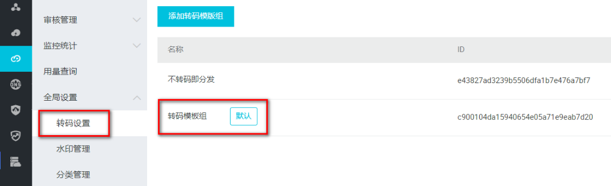

### <font style="color:rgb(0, 0, 0);">分类管理</font>
<font style="color:rgb(0, 0, 0);">选择全局设置 > 分类管理</font>

### <font style="color:rgb(0, 0, 0);">上传视频文件</font>
选择媒资库 > 音视频，单击上传音视频

### <font style="color:rgb(0, 0, 0);">配置域名</font>
<font style="color:rgb(0, 0, 0);">音视频上传完成后，必须配一个已备案的域名，并完成 CNAME 绑定</font>

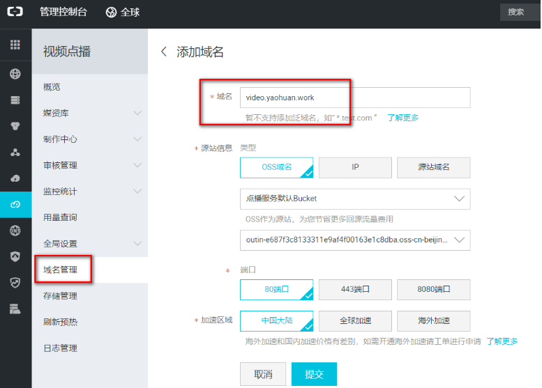

<font style="color:rgb(0, 0, 0);">得到 CNAME</font>

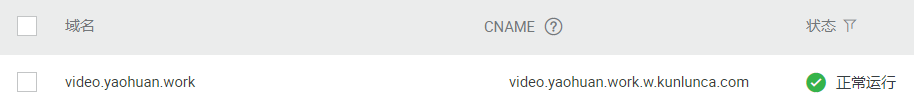

<font style="color:rgb(0, 0, 0);">在购买域名的服务商处的管理控制台配置域名解析</font>

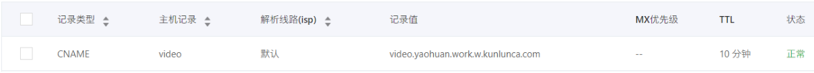

### <font style="color:rgb(0, 0, 0);">在控制台查看视频</font>
<font style="color:rgb(0, 0, 0);">此时视频可以在阿里云控制台播放</font>

### <font style="color:rgb(0, 0, 0);">获取 web 播放器代码</font>
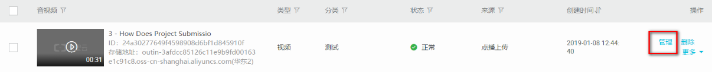

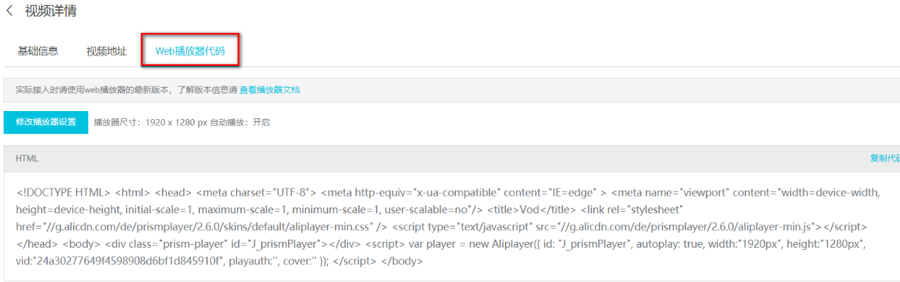

# 四、使用服务端 SDK
## <font style="color:rgb(0, 0, 0);">服务端 SDK</font>
### <font style="color:rgb(0, 0, 0);">简介</font>
<font style="color:rgb(0, 0, 0);">sdk 的方式将 api 进行了进一步的封装，不用自己创建工具类。</font>

<font style="color:rgb(0, 0, 0);">我们可以基于服务端 SDK 编写代码来调用点播 API，实现对点播产品和服务的快速操作。</font>

### <font style="color:rgb(0, 0, 0);">功能介绍</font>
+ <font style="color:rgb(0, 0, 0);">SDK 封装了对 API 的调用请求和响应，避免自行计算较为繁琐的 API 签名。</font>
+ <font style="color:rgb(0, 0, 0);">支持所有点播服务的 API，并提供了相应的示例代码。</font>
+ <font style="color:rgb(0, 0, 0);">支持7种开发语言，包括：Java、Python、PHP、.NET、Node.js、Go、C/C++。</font>
+ <font style="color:rgb(0, 0, 0);">通常在发布新的 API 后，我们会及时同步更新 SDK，所以即便您没有找到对应 API 的示例代码，也可以参考旧的示例自行实现调用。</font>

## <font style="color:rgb(0, 0, 0);">使用 SDK</font>
### <font style="color:rgb(0, 0, 0);">安装</font>
<font style="color:rgb(0, 0, 0);">参考文档：</font>[<font style="color:rgb(0, 0, 0);">https://help.aliyun.com/document_detail/57756.html</font>](https://help.aliyun.com/document_detail/57756.html)

<font style="color:rgb(0, 0, 0);">添加 maven 仓库的配置和依赖到 pom</font>

```xml
<repositories>
    <repository>
        <id>sonatype-nexus-staging</id>
        <name>Sonatype Nexus Staging</name>
        <url>https://oss.sonatype.org/service/local/staging/deploy/maven2/</url>
        <releases>
            <enabled>true</enabled>
        </releases>
        <snapshots>
            <enabled>true</enabled>
        </snapshots>
    </repository>
</repositories>
```

```xml
<dependency>
  <groupId>com.aliyun</groupId>
  <artifactId>aliyun-java-sdk-core</artifactId>
  <version>4.3.3</version>
</dependency>
<dependency>
  <groupId>com.aliyun</groupId>
  <artifactId>aliyun-java-sdk-vod</artifactId>
  <version>2.15.5</version>
</dependency>
<dependency>
  <groupId>com.google.code.gson</groupId>
  <artifactId>gson</artifactId>
  <version>2.8.2</version>
</dependency>
```

### <font style="color:rgb(0, 0, 0);">初始化</font>
<font style="color:rgb(0, 0, 0);">参考文档：</font>[<font style="color:rgb(0, 0, 0);">https://help.aliyun.com/document_detail/61062.html</font>](https://help.aliyun.com/document_detail/61062.html)

<font style="color:rgb(255, 0, 0);">根据文档示例创建 AliyunVODSDKUtils.java</font>

```java
package com.xszx.aliyunvod.util;

public class AliyunVodSDKUtils {

    public static DefaultAcsClient initVodClient(String accessKeyId, String accessKeySecret) throws ClientException {
        String regionId = "cn-shanghai";  // 点播服务接入区域
        DefaultProfile profile = DefaultProfile.getProfile(regionId, accessKeyId, accessKeySecret);
        DefaultAcsClient client = new DefaultAcsClient(profile);
        return client;
    }
}
```

### <font style="color:rgb(0, 0, 0);">创建测试类</font>
<font style="color:rgb(0, 0, 0);">创建 VodSdkTest.java</font>

```java
package com.atguigu.aliyunvod;

public class VodSdkTest {

    String accessKeyId = "你的accessKeyId";
    String accessKeySecret = "你的accessKeySecret";
}
```

## <font style="color:rgb(0, 0, 0);">创建测试用例</font>
<font style="color:rgb(0, 0, 0);">参考文档：</font>[https://help.aliyun.com/document_detail/61064.html](https://help.aliyun.com/document_detail/61064.html)

### <font style="color:rgb(0, 0, 0);">获取视频播放凭证</font>
<font style="color:rgb(0, 0, 0);">根据文档中的代码，修改如下</font>

```java
/**
 * 获取视频播放凭证
 * @throws ClientException
 */
@Test
public void testGetVideoPlayAuth() throws ClientException {

    //初始化客户端、请求对象和相应对象
    DefaultAcsClient client = AliyunVodSDKUtils.initVodClient(accessKeyId, accessKeySecret);
    GetVideoPlayAuthRequest request = new GetVideoPlayAuthRequest();
    GetVideoPlayAuthResponse response = new GetVideoPlayAuthResponse();

    try {

        //设置请求参数
        request.setVideoId("视频ID");
        //获取请求响应
        response = client.getAcsResponse(request);

        //输出请求结果
        //播放凭证
        System.out.print("PlayAuth = " + response.getPlayAuth() + "\n");
        //VideoMeta信息
        System.out.print("VideoMeta.Title = " + response.getVideoMeta().getTitle() + "\n");
    } catch (Exception e) {
        System.out.print("ErrorMessage = " + e.getLocalizedMessage());
    }

    System.out.print("RequestId = " + response.getRequestId() + "\n");
}
```

### <font style="color:rgb(0, 0, 0);">获取视频播放地址</font>
```java
/**
 * 获取视频播放地址
 * @throws ClientException
 */
@Test
public void testGetPlayInfo() throws ClientException {

    //初始化客户端、请求对象和相应对象
    DefaultAcsClient client = AliyunVodSDKUtils.initVodClient(accessKeyId, accessKeySecret);
    GetPlayInfoRequest request = new GetPlayInfoRequest();
    GetPlayInfoResponse response = new GetPlayInfoResponse();

    try {

        //设置请求参数
        //注意：这里只能获取非加密视频的播放地址
        request.setVideoId("视频ID");
        //获取请求响应
        response = client.getAcsResponse(request);

        //输出请求结果
        List<GetPlayInfoResponse.PlayInfo> playInfoList = response.getPlayInfoList();
        //播放地址
        for (GetPlayInfoResponse.PlayInfo playInfo : playInfoList) {
            System.out.print("PlayInfo.PlayURL = " + playInfo.getPlayURL() + "\n");
        }
        //Base信息
        System.out.print("VideoBase.Title = " + response.getVideoBase().getTitle() + "\n");

    } catch (Exception e) {
        System.out.print("ErrorMessage = " + e.getLocalizedMessage());
    }

    System.out.print("RequestId = " + response.getRequestId() + "\n");
}
```

# 五、文件上传测试
<font style="color:rgb(0, 0, 0);">参考文档：</font>[https://help.aliyun.com/document_detail/53406.html](https://help.aliyun.com/document_detail/53406.html)

## <font style="color:rgb(0, 0, 0);">安装 SDK</font>
### <font style="color:rgb(0, 0, 0);">配置 pom</font>
```xml
<dependency>
    <groupId>com.aliyun</groupId>
    <artifactId>aliyun-java-sdk-core</artifactId>
    <version>4.3.3</version>
</dependency>
<dependency>
    <groupId>com.aliyun.oss</groupId>
    <artifactId>aliyun-sdk-oss</artifactId>
    <version>3.1.0</version>
</dependency>
 <dependency>
    <groupId>com.aliyun</groupId>
    <artifactId>aliyun-java-sdk-vod</artifactId>
    <version>2.15.2</version>
</dependency>
<dependency>
    <groupId>com.alibaba</groupId>
    <artifactId>fastjson</artifactId>
    <version>1.2.28</version>
</dependency>
<dependency>
    <groupId>org.json</groupId>
    <artifactId>json</artifactId>
    <version>20170516</version>
</dependency>
<dependency>
    <groupId>com.google.code.gson</groupId>
    <artifactId>gson</artifactId>
    <version>2.8.2</version>
</dependency>
```

### <font style="color:rgb(0, 0, 0);">安装非开源 jar 包</font>
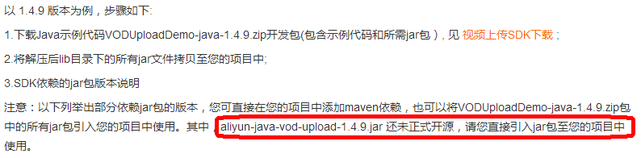

<font style="color:rgb(0, 0, 0);">在本地 Maven 仓库中安装 jar 包：</font>

<font style="color:rgb(0, 0, 0);">下载视频上传 SDK，解压，命令行进入 lib 目录，执行以下代码</font>

```shell
mvn install:install-file -DgroupId=com.aliyun -DartifactId=aliyun-sdk-vod-upload -Dversion=1.4.11 -Dpackaging=jar -Dfile=aliyun-java-vod-upload-1.4.11.jar
```

<font style="color:rgb(0, 0, 0);">然后在 pom 中引入 jar 包</font>

```xml
<dependency>
    <groupId>com.aliyun</groupId>
    <artifactId>aliyun-sdk-vod-upload</artifactId>
    <version>1.4.11</version>
</dependency>
```

## <font style="color:rgb(0, 0, 0);">测试</font>
### <font style="color:rgb(0, 0, 0);">创建测试文件</font>
```java
package com.xszx.aliyunvod;

public class UploadTest {

    //账号AK信息请填写(必选)
    private static final String accessKeyId = "你的accessKeyId";
    //账号AK信息请填写(必选)
    private static final String accessKeySecret = "你的accessKeySecret";
}
```

### <font style="color:rgb(0, 0, 0);">测试本地文件上传</font>
```java
/**
 * 视频上传
 */
@Test
public void testUploadVideo(){

    //1.音视频上传-本地文件上传
    //视频标题(必选)
    String title = "3 - How Does Project Submission Work - upload by sdk";
    //本地文件上传和文件流上传时，文件名称为上传文件绝对路径，如:/User/sample/文件名称.mp4 (必选)
    //文件名必须包含扩展名
    String fileName = "E:/共享/资源/课程视频/3 - How Does Project Submission Work.mp4";
    //本地文件上传
    UploadVideoRequest request = new UploadVideoRequest(accessKeyId, accessKeySecret, title, fileName);
    /* 可指定分片上传时每个分片的大小，默认为1M字节 */
    request.setPartSize(1 * 1024 * 1024L);
    /* 可指定分片上传时的并发线程数，默认为1，(注：该配置会占用服务器CPU资源，需根据服务器情况指定）*/
    request.setTaskNum(1);
    /* 是否开启断点续传, 默认断点续传功能关闭。当网络不稳定或者程序崩溃时，再次发起相同上传请求，可以继续未完成的上传任务，适用于超时3000秒仍不能上传完成的大文件。
        注意: 断点续传开启后，会在上传过程中将上传位置写入本地磁盘文件，影响文件上传速度，请您根据实际情况选择是否开启*/
    request.setEnableCheckpoint(false);

    UploadVideoImpl uploader = new UploadVideoImpl();
    UploadVideoResponse response = uploader.uploadVideo(request);
    System.out.print("RequestId=" + response.getRequestId() + "\n");  //请求视频点播服务的请求ID
    if (response.isSuccess()) {
        System.out.print("VideoId=" + response.getVideoId() + "\n");
    } else {
        /* 如果设置回调URL无效，不影响视频上传，可以返回VideoId同时会返回错误码。其他情况上传失败时，VideoId为空，此时需要根据返回错误码分析具体错误原因 */
        System.out.print("VideoId=" + response.getVideoId() + "\n");
        System.out.print("ErrorCode=" + response.getCode() + "\n");
        System.out.print("ErrorMessage=" + response.getMessage() + "\n");
    }
}
```

# 六、视频点播微服务的创建
## <font style="color:rgb(0, 0, 0);">创建视频点播微服务</font>
### <font style="color:rgb(0, 0, 0);">创建微服务模块</font>
<font style="color:rgb(255, 0, 0);">Artifact：service-vod</font>

### <font style="color:rgb(0, 0, 0);">pom</font>
service-vod 中引入依赖

```xml
<dependencies>
    <dependency>
        <groupId>com.aliyun</groupId>
        <artifactId>aliyun-java-sdk-core</artifactId>
    </dependency>
    <dependency>
        <groupId>com.aliyun.oss</groupId>
        <artifactId>aliyun-sdk-oss</artifactId>
    </dependency>
    <dependency>
        <groupId>com.aliyun</groupId>
        <artifactId>aliyun-java-sdk-vod</artifactId>
    </dependency>
    <dependency>
        <groupId>com.aliyun</groupId>
        <artifactId>aliyun-sdk-vod-upload</artifactId>
    </dependency>
    <dependency>
        <groupId>com.alibaba</groupId>
        <artifactId>fastjson</artifactId>
    </dependency>
    <dependency>
        <groupId>org.json</groupId>
        <artifactId>json</artifactId>
    </dependency>
    <dependency>
        <groupId>com.google.code.gson</groupId>
        <artifactId>gson</artifactId>
    </dependency>

    <dependency>
        <groupId>joda-time</groupId>
        <artifactId>joda-time</artifactId>
    </dependency>
</dependencies>
```

### <font style="color:rgb(0, 0, 0);">application.properties</font>
```properties
# 服务端口
server.port=8003

# 服务名
spring.application.name=service-vod

# 环境设置：dev、test、prod
spring.profiles.active=dev

#阿里云 vod
#不同的服务器，地址不同
aliyun.vod.file.keyid=your accessKeyId
aliyun.vod.file.keysecret=your accessKeySecret

# 最大上传单个文件大小：默认1M
spring.servlet.multipart.max-file-size=1024MB
# 最大置总上传的数据大小 ：默认10M

spring.servlet.multipart.max-request-size=1024MB
```

### <font style="color:rgb(0, 0, 0);">logback.xml</font>
和之前模块的一样。复制过来就行。

### <font style="color:rgb(0, 0, 0);">启动类</font>
<font style="color:rgb(0, 0, 0);">VodApplication.java</font>

```java
package com.xszx.vod;

@SpringBootApplication(exclude = DataSourceAutoConfiguration.class)
@ComponentScan(basePackages={"com.xszx"})
public class VodApplication {

    public static void main(String[] args) {
        SpringApplication.run(VodApplication.class, args);
    }
}
```

## <font style="color:rgb(0, 0, 0);">整合阿里云 vod 实现视频上传</font>
### <font style="color:rgb(0, 0, 0);">创建常量类</font>
<font style="color:rgb(0, 0, 0);">ConstantPropertiesUtil.java</font>

```java
package com.xszx.vod.util;

@Component
//@PropertySource("classpath:application.properties")
public class ConstantPropertiesUtil implements InitializingBean {

    @Value("${aliyun.vod.file.keyid}")
    private String keyId;

    @Value("${aliyun.vod.file.keysecret}")
    private String keySecret;

    public static String ACCESS_KEY_ID;
    public static String ACCESS_KEY_SECRET;

    @Override
    public void afterPropertiesSet() throws Exception {
        ACCESS_KEY_ID = keyId;
        ACCESS_KEY_SECRET = keySecret;
    }
}
```

### <font style="color:rgb(0, 0, 0);">复制工具类到项目中</font>
<font style="color:rgb(0, 0, 0);">AliyunVodSDKUtils.java</font>

```java
package com.xszx.vod.util;

public class AliyunVodSDKUtils {

    public static DefaultAcsClient initVodClient(String accessKeyId, String accessKeySecret) throws ClientException {
        String regionId = "cn-shanghai";  // 点播服务接入区域
        DefaultProfile profile = DefaultProfile.getProfile(regionId, accessKeyId, accessKeySecret);
        DefaultAcsClient client = new DefaultAcsClient(profile);
        return client;
    }
}
```

### <font style="color:rgb(0, 0, 0);">配置 swagger</font>
<font style="color:rgb(0, 0, 0);"></font>

### <font style="color:rgb(0, 0, 0);">创建 service</font>
<font style="color:rgb(0, 0, 0);">接口：VideoService.java</font>

```java
package com.xszx.vod.service;

public interface VideoService {
    String uploadVideo(MultipartFile file);
}
```

<font style="color:rgb(0, 0, 0);">实现：VideoServiceImpl.java</font>

```java
package com.xszx.vod.service.impl;

@Service
public class VideoServiceImpl implements VideoService {

    @Override
    public String uploadVideo(MultipartFile file) {

        try {
            InputStream inputStream = file.getInputStream();
            String originalFilename = file.getOriginalFilename();
            String title = originalFilename.substring(0, originalFilename.lastIndexOf("."));

            UploadStreamRequest request = new UploadStreamRequest(
                    ConstantPropertiesUtil.ACCESS_KEY_ID,
                    ConstantPropertiesUtil.ACCESS_KEY_SECRET,
                    title, originalFilename, inputStream);

            UploadVideoImpl uploader = new UploadVideoImpl();
            UploadStreamResponse response = uploader.uploadStream(request);

            //如果设置回调URL无效，不影响视频上传，可以返回VideoId同时会返回错误码。
            // 其他情况上传失败时，VideoId为空，此时需要根据返回错误码分析具体错误原因
            String videoId = response.getVideoId();
            if (!response.isSuccess()) {
                String errorMessage = "阿里云上传错误：" + "code：" + response.getCode() + ", message：" + response.getMessage();
                log.warn(errorMessage);
                if(StringUtils.isEmpty(videoId)){
                    throw new QinXueException(20001, errorMessage);
                }
            }

            return videoId;
        } catch (IOException e) {
            throw new QinXueException(20001, "qinxue vod 服务上传失败");
        }
    }
}
```

### <font style="color:rgb(0, 0, 0);">创建 controller</font>
<font style="color:rgb(0, 0, 0);">VideoAdminController.java</font>

```java
package com.xszx.vod.controller.admin;

@Api(description="阿里云视频点播微服务")
@CrossOrigin //跨域
@RestController
@RequestMapping("/admin/vod/video")
public class VideoAdminController {

    @Autowired
    private VideoService videoService;

    @PostMapping("upload")
    public R uploadVideo(
            @ApiParam(name = "file", value = "文件", required = true)
            @RequestParam("file") MultipartFile file) throws Exception {

        String videoId = videoService.uploadVideo(file);
        return R.ok().message("视频上传成功").data("videoId", videoId);
    }
}
```

### <font style="color:rgb(0, 0, 0);">启动后端 vod 微服务</font>
### <font style="color:rgb(0, 0, 0);">swagger 测试</font>
# 七、前端整合视频上传
## <font style="color:rgb(0, 0, 0);">配置 nginx 反向代理</font>
<font style="color:rgb(0, 0, 0);">将接口地址加入 nginx 配置</font>

```latex
location ~ /vod/ {           
    proxy_pass http://localhost:8003;
}
```

<font style="color:rgb(0, 0, 0);">配置 nginx 上传文件大小，否则上传时会有</font><font style="color:rgb(255, 0, 0);"> 413 (Request Entity Too Large) </font><font style="color:rgb(0, 0, 0);">异常</font>

<font style="color:rgb(0, 0, 0);">打开 nginx 主配置文件 nginx.conf，找到 http{}，添加</font>

```latex
client_max_body_size 1024m;
```

<font style="color:rgb(0, 0, 0);">重启 nginx</font>

```shell
nginx -s reload
```

## <font style="color:rgb(0, 0, 0);">前端实现</font>
### <font style="color:rgb(0, 0, 0);">数据定义</font>
```json
fileList: [],//上传文件列表
BASE_API: process.env.BASE_API // 接口API地址
```

### <font style="color:rgb(0, 0, 0);">整合上传组件</font>
```html
<el-form-item label="上传视频">
    <el-upload
           :on-success="handleVodUploadSuccess"
           :on-remove="handleVodRemove"
           :before-remove="beforeVodRemove"
           :on-exceed="handleUploadExceed"
           :file-list="fileList"
           :action="BASE_API+'/admin/vod/video/upload'"
           :limit="1"
           class="upload-demo">
    <el-button size="small" type="primary">上传视频</el-button>
    <el-tooltip placement="right-end">
        <div slot="content">最大支持1G，<br>
            支持3GP、ASF、AVI、DAT、DV、FLV、F4V、<br>
            GIF、M2T、M4V、MJ2、MJPEG、MKV、MOV、MP4、<br>
            MPE、MPG、MPEG、MTS、OGG、QT、RM、RMVB、<br>
            SWF、TS、VOB、WMV、WEBM 等视频格式上传</div>
        <i class="el-icon-question"/>
    </el-tooltip>
    </el-upload>
</el-form-item>
```

### <font style="color:rgb(0, 0, 0);">方法定义</font>
```javascript
//成功回调
handleVodUploadSuccess(response, file, fileList) {
  this.video.videoSourceId = response.data.videoId
},

//视图上传多于一个视频
handleUploadExceed(files, fileList) {
  this.$message.warning('想要重新上传视频，请先删除已上传的视频')
},
```

# 八、删除云端视频
<font style="color:rgb(0, 0, 0);">文档：服务端SDK->Java SDK->媒资管理</font>

[<font style="color:rgb(0, 0, 0);">https://help.aliyun.com/document_detail/61065.html?spm=a2c4g.11186623.6.831.654b3815cIxvma#h2--div-id-deletevideo-div-7</font>](https://help.aliyun.com/document_detail/61065.html?spm=a2c4g.11186623.6.831.654b3815cIxvma#h2--div-id-deletevideo-div-7)

## <font style="color:rgb(0, 0, 0);">后端</font>
在 service-vod 模块写下面的代码，我们操作阿里云 VOD 的东西需要写在 vod 模块。

### <font style="color:rgb(0, 0, 0);">service</font>
<font style="color:rgb(0, 0, 0);">接口</font>

```java
void removeVideo(String videoId);
```

<font style="color:rgb(0, 0, 0);">实现</font>

```java
@Override
public void removeVideo(String videoId) {
    try{
        DefaultAcsClient client = AliyunVodSDKUtils.initVodClient(
            ConstantPropertiesUtil.ACCESS_KEY_ID,
            ConstantPropertiesUtil.ACCESS_KEY_SECRET);

        DeleteVideoRequest request = new DeleteVideoRequest();

        request.setVideoIds(videoId);

        DeleteVideoResponse response = client.getAcsResponse(request);

        System.out.print("RequestId = " + response.getRequestId() + "\n");

    }catch (ClientException e){
        throw new QinXueException(20001, "视频删除失败");
    }
}
```

### <font style="color:rgb(0, 0, 0);">controller</font>
```java
@DeleteMapping("{videoId}")
public R removeVideo(@ApiParam(name = "videoId", value = "云端视频id", required = true)
                     @PathVariable String videoId){

    videoService.removeVideo(videoId);
    return R.ok().message("视频删除成功");
}
```

## <font style="color:rgb(0, 0, 0);">前端</font>
### <font style="color:rgb(0, 0, 0);">定义 api</font>
<font style="color:rgb(0, 0, 0);">api/edu/vod.js</font>

```javascript
import request from '@/utils/request'

const api_name = '/admin/vod/video'

export default {

  removeById(id) {
    return request({
      url: `${api_name}/${id}`,
      method: 'delete'
    })
  }
}
```

### <font style="color:rgb(0, 0, 0);">组件方法</font>
<font style="color:rgb(0, 0, 0);">views/edu/course/chapter.vue</font>

```javascript
import vod from '@/api/edu/vod'
```

```javascript
beforeVodRemove(file, fileList) {
  return this.$confirm(`确定移除 ${file.name}？`)
},

handleVodRemove(file, fileList) {
  console.log(file)
  vod.removeById(this.video.videoSourceId).then(response=>{
    this.$message({
      type: 'success',
      message: response.message
    })
  })
},
```

# 九、视频文件回显
## <font style="color:rgb(0, 0, 0);">数据库优化冗余字段</font>
### <font style="color:rgb(0, 0, 0);">video 表中添加一列</font>
<font style="color:rgb(0, 0, 0);">video_original_name varchar 100 原始文件名称</font>

### <font style="color:rgb(0, 0, 0);">pojo 中定义新增字段</font>
<font style="color:rgb(0, 0, 0);">Video.java、VideoForm.java</font>

```java
@ApiModelProperty(value = "云服务器上存储的视频文件名称")
private String videoOriginalName;
```

## <font style="color:rgb(0, 0, 0);">前端修改</font>
### <font style="color:rgb(0, 0, 0);">chapter.vue</font>
<font style="color:rgb(0, 0, 0);">添加 videoOriginalName 的数据定义</font>

```javascript
video: {// 课时对象
  title: '',
  sort: 0,
  free: false,
  videoSourceId: '',
  videoOriginalName: ''
},
```

### <font style="color:rgb(0, 0, 0);">上传成功回调</font>
<font style="color:rgb(0, 0, 0);">添加对 videoOriginalName 的赋值</font>

```javascript
handleVodUploadSuccess(response, file, fileList) {
    this.video.videoSourceId = response.data.videoId
    this.video.videoOriginalName = file.name;
},
```

### <font style="color:rgb(0, 0, 0);">修改回调 Video</font>
```javascript
editVideo(videoId) {
    this.dialogVideoFormVisible = true
        video.getVideoInfoById(videoId).then(response => {
        this.video = response.data.item
        if(this.video.videoOriginalName){
          this.fileList = [{'name': this.video.videoOriginalName}]
        }
    })
},
```

### <font style="color:rgb(0, 0, 0);">删除云端 video 回调</font>
```javascript
handleVodRemove(file, fileList) {
    console.log(file)
    vod.removeById(this.video.videoSourceId).then(response => {
        this.video.videoSourceId = ''
        this.video.videoOriginalName = ''
        this.fileList = []
        this.$message({
            type: 'success',
            message: response.message
        })
    })
},
```

### 点击编辑课程对话框的取消按钮和 x 关闭按钮
```javascript
cancelVideoSave(){
  this.dialogVideoFormVisible = false
  this.video = {// 课时对象
    id: '',
    title: '',
    sort: 0,
    isFree: 0,
    videoSourceId: '',
    videoOriginalName: ''
  }
  this.fileList = [] // 视频组件那里就清空了
},

closeVideoDialog(){
  // alert('对话框关了！')
  this.video = {// 课时对象
    id: '',
    title: '',
    sort: 0,
    isFree: 0,
    videoSourceId: '',
    videoOriginalName: ''
  }
  this.fileList = []
}
```


> 更新: 2024-07-19 14:11:32  
> 原文: <https://www.yuque.com/u41736172/az9urv/bblm8bp1vethggzr>