# 第二天【环境搭建和讲师管理接口开发】

# 一、数据库设计
## 数据库
数据库名称：qinxue_edu

## 数据库表
执行资料文件夹中的 qinxue_edu.sql 文件即可创建。

# <font style="color:rgb(0, 0, 0);">二、数据库设计规约</font>
## 数据库设计规约
> <font style="color:rgb(255, 0, 0);">以下规约只针对本模块，更全面的文档参考《阿里巴巴Java开发手册》：五、MySQL数据库</font>
>

1. <font style="color:rgb(0, 0, 0);">库名与应用名称尽量一致</font>
2. <font style="color:rgb(0, 0, 0);">表名、字段名必须使用小写字母或数字，禁止出现数字开头</font>
3. <font style="color:rgb(0, 0, 0);">表名不使用复数名词</font>
4. <font style="color:rgb(0, 0, 0);">表的命名最好是加上“业务名称_表的作用”。如，edu_teacher</font>
5. <font style="color:rgb(0, 0, 0);">表必备三字段：id, gmt_create, gmt_modified。说明：</font>
    1. <font style="color:rgb(0, 0, 0);">其中 id 必为主键，类型为 bigint unsigned、单表时自增、步长为 1。（如果使用分库分表集群部署，则 id 类型为 varchar，非自增，业务中使用分布式 id 生成器）</font>
    2. <font style="color:rgb(0, 0, 0);">gmt_create, gmt_modified 的类型均为 datetime 类型，前者现在时表示主动创建，后者过去分词表示被动更新。</font>
6. <font style="color:rgb(0, 0, 0);">单表行数超过 500 万行或者单表容量超过 2GB，才推荐进行分库分表。 说明：如果预计三年后的数据量根本达不到这个级别，请不要在创建表时就分库分表。 </font>
7. <font style="color:rgb(0, 0, 0);">表达是与否概念的字段，必须使用 is_xxx 的方式命名，数据类型是 unsigned tinyint （1 表示是，0 表示否）。 说明：</font>
    1. <font style="color:rgb(0, 0, 0);">任何字段如果为非负数，必须是 unsigned。 </font>
    2. <font style="color:rgb(0, 0, 0);">注意：POJO 类中的任何布尔类型的变量，都不要加 is 前缀。数据库表示是与否的值，使用 tinyint 类型，坚持 is_xxx 的 命名方式是为了明确其取值含义与取值范围。 </font>
    3. <font style="color:rgb(0, 0, 0);">正例：表达逻辑删除的字段名 is_deleted，1 表示删除，0 表示未删除。 </font>
8. <font style="color:rgb(0, 0, 0);">小数类型为 decimal，禁止使用 float 和 double。 说明：float 和 double 在存储的时候，存在精度损失的问题，很可能在值的比较时，得到不到正确的结果。如果存储的数据范围超过 decimal 的范围，建议将数据拆成整数和小数分开存储。</font>
9. <font style="color:rgb(0, 0, 0);">如果存储的字符串长度几乎相等，使用 char 定长字符串类型。 </font>
10. <font style="color:rgb(0, 0, 0);">varchar 是可变长字符串，不预先分配存储空间，长度不要超过 5000，如果存储长度大于此值，定义字段类型为 text，独立出来一张表，用主键来对应，避免影响其它字段索引效率。</font>
11. <font style="color:rgb(0, 0, 0);">唯一索引名为 uk_字段名；普通索引名则为 idx_字段名。说明：uk_ 即 unique key；idx_ 即 index 的简称</font>
12. <font style="color:rgb(0, 0, 0);">不得使用外键与级联，一切外键概念必须在应用层解决。外键与级联更新适用于单机低并发，不适合分布式、高并发集群；级联更新是强阻塞，存在数据库更新风暴的风险；外键影响数据库的插入速度。 </font>

# <font style="color:rgb(0, 0, 0);">三、搭建项目工程（父工程）</font>
## 创建项目
创建 Maven 项目，因为是父项目，打包方式为 pom。

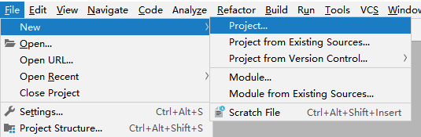

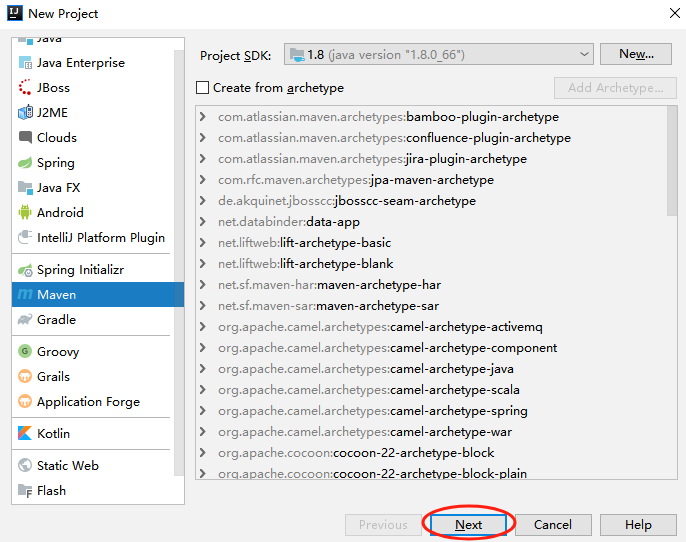

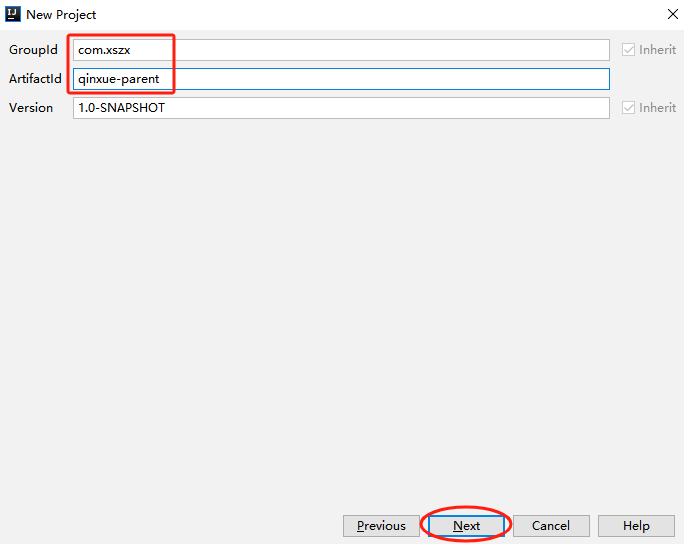

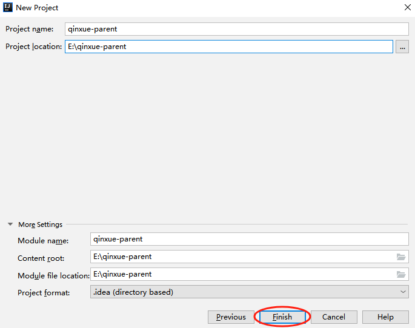

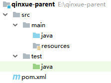

## 删除 src 目录
因为父工程只是对依赖进行管理，不写代码，所以我们将 src 目录删除。


## 编写 pom.xml 文件
```xml
<?xml version="1.0" encoding="UTF-8"?>
<project xmlns="http://maven.apache.org/POM/4.0.0"
         xmlns:xsi="http://www.w3.org/2001/XMLSchema-instance"
         xsi:schemaLocation="http://maven.apache.org/POM/4.0.0 http://maven.apache.org/xsd/maven-4.0.0.xsd">
    <modelVersion>4.0.0</modelVersion>

    <groupId>com.xszx</groupId>
    <artifactId>qinxue-parent</artifactId>
    <version>1.0-SNAPSHOT</version>

    <packaging>pom</packaging>

    <parent>
        <groupId>org.springframework.boot</groupId>
        <artifactId>spring-boot-starter-parent</artifactId>
        <version>2.2.1.RELEASE</version>
    </parent>

    <properties>
        <java.version>1.8</java.version>
        <mybatis-plus.version>3.0.5</mybatis-plus.version>
        <velocity.version>2.0</velocity.version>
        <swagger.version>2.7.0</swagger.version>
        <aliyun.oss.version>2.8.3</aliyun.oss.version>
        <jodatime.version>2.10.1</jodatime.version>
        <poi.version>3.17</poi.version>
        <commons-fileupload.version>1.3.1</commons-fileupload.version>
        <commons-io.version>2.6</commons-io.version>
        <httpclient.version>4.5.1</httpclient.version>
        <jwt.version>0.7.0</jwt.version>
        <aliyun-java-sdk-core.version>4.3.3</aliyun-java-sdk-core.version>
        <aliyun-sdk-oss.version>3.1.0</aliyun-sdk-oss.version>
        <aliyun-java-sdk-vod.version>2.15.2</aliyun-java-sdk-vod.version>
        <aliyun-java-vod-upload.version>1.4.11</aliyun-java-vod-upload.version>
        <aliyun-sdk-vod-upload.version>1.4.11</aliyun-sdk-vod-upload.version>
        <fastjson.version>1.2.28</fastjson.version>
        <gson.version>2.8.2</gson.version>
        <json.version>20170516</json.version>
        <commons-dbutils.version>1.7</commons-dbutils.version>
        <canal.client.version>1.1.0</canal.client.version>
        <docker.image.prefix>zx</docker.image.prefix>
        <cloud-alibaba.version>0.2.2.RELEASE</cloud-alibaba.version>
    </properties>

    <dependencyManagement>
        <dependencies>
            <!--Spring Cloud-->
            <dependency>
                <groupId>org.springframework.cloud</groupId>
                <artifactId>spring-cloud-dependencies</artifactId>
                <version>Hoxton.RELEASE</version>
                <type>pom</type>
                <scope>import</scope>
            </dependency>

            <dependency>
                <groupId>org.springframework.cloud</groupId>
                <artifactId>spring-cloud-alibaba-dependencies</artifactId>
                <version>${cloud-alibaba.version}</version>
                <type>pom</type>
                <scope>import</scope>
            </dependency>

            <!--mybatis-plus 持久层-->
            <dependency>
                <groupId>com.baomidou</groupId>
                <artifactId>mybatis-plus-boot-starter</artifactId>
                <version>${mybatis-plus.version}</version>
            </dependency>

            <!-- velocity 模板引擎, Mybatis Plus 代码生成器需要 -->
            <dependency>
                <groupId>org.apache.velocity</groupId>
                <artifactId>velocity-engine-core</artifactId>
                <version>${velocity.version}</version>
            </dependency>

            <!--swagger-->
            <dependency>
                <groupId>io.springfox</groupId>
                <artifactId>springfox-swagger2</artifactId>
                <version>${swagger.version}</version>
            </dependency>

            <!--swagger ui-->
            <dependency>
                <groupId>io.springfox</groupId>
                <artifactId>springfox-swagger-ui</artifactId>
                <version>${swagger.version}</version>
            </dependency>

            <!--aliyunOSS-->
            <dependency>
                <groupId>com.aliyun.oss</groupId>
                <artifactId>aliyun-sdk-oss</artifactId>
                <version>${aliyun.oss.version}</version>
            </dependency>

            <!--日期时间工具-->
            <dependency>
                <groupId>joda-time</groupId>
                <artifactId>joda-time</artifactId>
                <version>${jodatime.version}</version>
            </dependency>

            <!--xls-->
            <dependency>
                <groupId>org.apache.poi</groupId>
                <artifactId>poi</artifactId>
                <version>${poi.version}</version>
            </dependency>

            <!--xlsx-->
            <dependency>
                <groupId>org.apache.poi</groupId>
                <artifactId>poi-ooxml</artifactId>
                <version>${poi.version}</version>
            </dependency>

            <!--文件上传-->
            <dependency>
                <groupId>commons-fileupload</groupId>
                <artifactId>commons-fileupload</artifactId>
                <version>${commons-fileupload.version}</version>
            </dependency>

            <!--commons-io-->
            <dependency>
                <groupId>commons-io</groupId>
                <artifactId>commons-io</artifactId>
                <version>${commons-io.version}</version>
            </dependency>

            <!--httpclient-->
            <dependency>
                <groupId>org.apache.httpcomponents</groupId>
                <artifactId>httpclient</artifactId>
                <version>${httpclient.version}</version>
            </dependency>

            <dependency>
                <groupId>com.google.code.gson</groupId>
                <artifactId>gson</artifactId>
                <version>${gson.version}</version>
            </dependency>

            <!-- JWT -->
            <dependency>
                <groupId>io.jsonwebtoken</groupId>
                <artifactId>jjwt</artifactId>
                <version>${jwt.version}</version>
            </dependency>

            <!--aliyun-->
            <dependency>
                <groupId>com.aliyun</groupId>
                <artifactId>aliyun-java-sdk-core</artifactId>
                <version>${aliyun-java-sdk-core.version}</version>
            </dependency>

            <dependency>
                <groupId>com.aliyun.oss</groupId>
                <artifactId>aliyun-sdk-oss</artifactId>
                <version>${aliyun-sdk-oss.version}</version>
            </dependency>

            <dependency>
                <groupId>com.aliyun</groupId>
                <artifactId>aliyun-java-sdk-vod</artifactId>
                <version>${aliyun-java-sdk-vod.version}</version>
            </dependency>

            <dependency>
                <groupId>com.aliyun</groupId>
                <artifactId>aliyun-java-vod-upload</artifactId>
                <version>${aliyun-java-vod-upload.version}</version>
            </dependency>

            <dependency>
                <groupId>com.aliyun</groupId>
                <artifactId>aliyun-sdk-vod-upload</artifactId>
                <version>${aliyun-sdk-vod-upload.version}</version>
            </dependency>

            <dependency>
                <groupId>com.alibaba</groupId>
                <artifactId>fastjson</artifactId>
                <version>${fastjson.version}</version>
            </dependency>

            <dependency>
                <groupId>org.json</groupId>
                <artifactId>json</artifactId>
                <version>${json.version}</version>
            </dependency>

            <dependency>
                <groupId>commons-dbutils</groupId>
                <artifactId>commons-dbutils</artifactId>
                <version>${commons-dbutils.version}</version>
            </dependency>

            <dependency>
                <groupId>com.alibaba.otter</groupId>
                <artifactId>canal.client</artifactId>
                <version>${canal.client.version}</version>
            </dependency>
        </dependencies>
    </dependencyManagement>
</project>
```

# 四、搭建项目工程（service 模块）
## 创建模块
在父项目下创建 service 模块。因为 service 模块以后也是一个父项目，它底下还有子模块，所以 service 模块的打包方式是 pom。

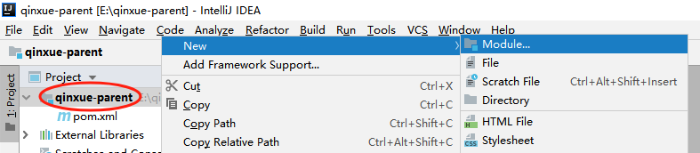

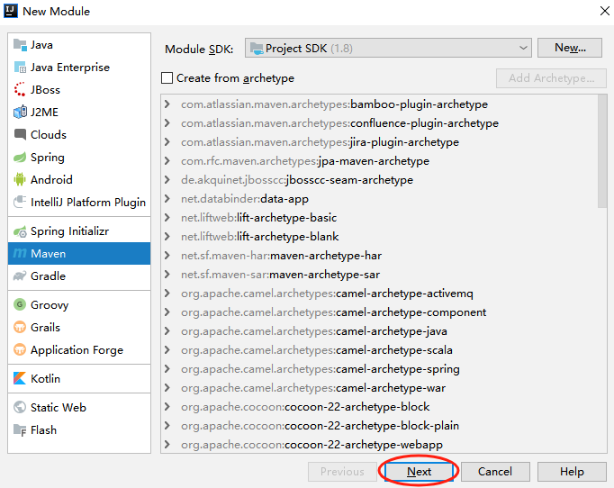

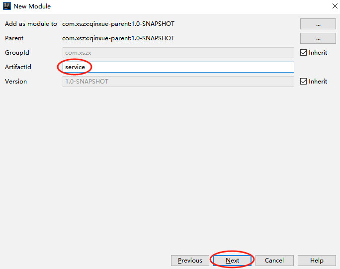

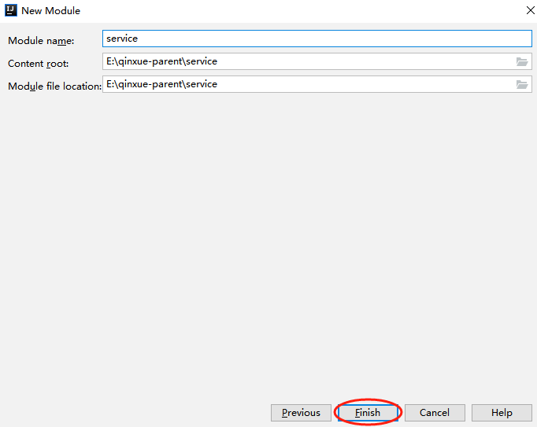

## 删除 src 目录


## 编写 pom.xml 文件
```xml
<?xml version="1.0" encoding="UTF-8"?>
<project xmlns="http://maven.apache.org/POM/4.0.0"
         xmlns:xsi="http://www.w3.org/2001/XMLSchema-instance"
         xsi:schemaLocation="http://maven.apache.org/POM/4.0.0 http://maven.apache.org/xsd/maven-4.0.0.xsd">
    <parent>
        <artifactId>qinxue-parent</artifactId>
        <groupId>com.xszx</groupId>
        <version>1.0-SNAPSHOT</version>
    </parent>
    <modelVersion>4.0.0</modelVersion>

    <artifactId>service</artifactId>

    <packaging>pom</packaging>

    <dependencies>
        <dependency>
            <groupId>org.springframework.cloud</groupId>
            <artifactId>spring-cloud-starter-netflix-ribbon</artifactId>
        </dependency>

        <!--hystrix依赖，主要是用  @HystrixCommand -->
        <dependency>
            <groupId>org.springframework.cloud</groupId>
            <artifactId>spring-cloud-starter-netflix-hystrix</artifactId>
        </dependency>

        <!--服务注册-->
        <dependency>
            <groupId>org.springframework.cloud</groupId>
            <artifactId>spring-cloud-starter-alibaba-nacos-discovery</artifactId>
        </dependency>

        <!--服务调用-->
        <dependency>
            <groupId>org.springframework.cloud</groupId>
            <artifactId>spring-cloud-starter-openfeign</artifactId>
        </dependency>

        <dependency>
            <groupId>org.springframework.boot</groupId>
            <artifactId>spring-boot-starter-web</artifactId>
        </dependency>

        <!--mybatis-plus-->
        <dependency>
            <groupId>com.baomidou</groupId>
            <artifactId>mybatis-plus-boot-starter</artifactId>
        </dependency>

        <!--mysql-->
        <dependency>
            <groupId>mysql</groupId>
            <artifactId>mysql-connector-java</artifactId>
        </dependency>

        <!-- velocity 模板引擎, Mybatis Plus 代码生成器需要 -->
        <dependency>
            <groupId>org.apache.velocity</groupId>
            <artifactId>velocity-engine-core</artifactId>
        </dependency>

        <!--swagger-->
        <dependency>
            <groupId>io.springfox</groupId>
            <artifactId>springfox-swagger2</artifactId>
        </dependency>

        <dependency>
            <groupId>io.springfox</groupId>
            <artifactId>springfox-swagger-ui</artifactId>
        </dependency>

        <!--lombok用来简化实体类：需要安装lombok插件-->
        <dependency>
            <groupId>org.projectlombok</groupId>
            <artifactId>lombok</artifactId>
        </dependency>

        <!--xls-->
        <dependency>
            <groupId>org.apache.poi</groupId>
            <artifactId>poi</artifactId>
        </dependency>

        <dependency>
            <groupId>org.apache.poi</groupId>
            <artifactId>poi-ooxml</artifactId>
        </dependency>

        <dependency>
            <groupId>commons-fileupload</groupId>
            <artifactId>commons-fileupload</artifactId>
        </dependency>

        <!--httpclient-->
        <dependency>
            <groupId>org.apache.httpcomponents</groupId>
            <artifactId>httpclient</artifactId>
        </dependency>

        <!--commons-io-->
        <dependency>
            <groupId>commons-io</groupId>
            <artifactId>commons-io</artifactId>
        </dependency>

        <!--gson-->
        <dependency>
            <groupId>com.google.code.gson</groupId>
            <artifactId>gson</artifactId>
        </dependency>

        <dependency>
            <groupId>junit</groupId>
            <artifactId>junit</artifactId>
            <version>4.12</version>
        </dependency>
    </dependencies>
</project>
```

# 五、搭建项目工程（service-edu 模块）
## 创建模块
在 service 模块下面创建子模块 service-edu。

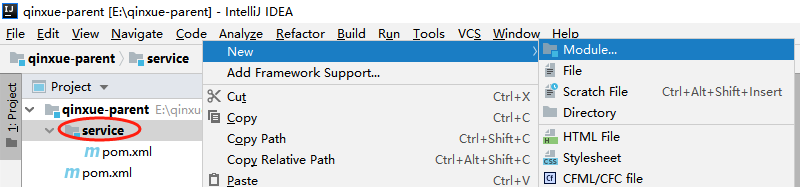

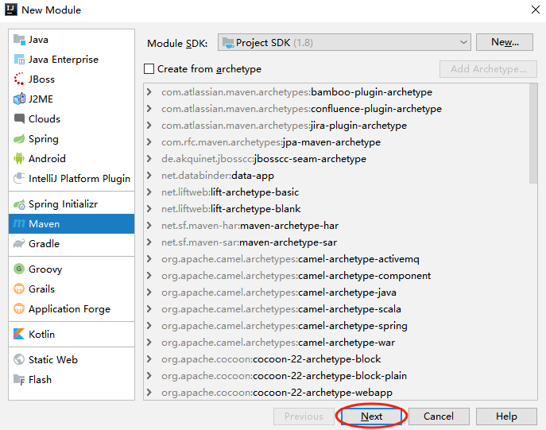

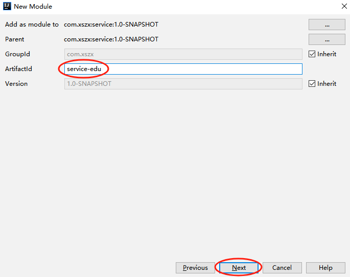

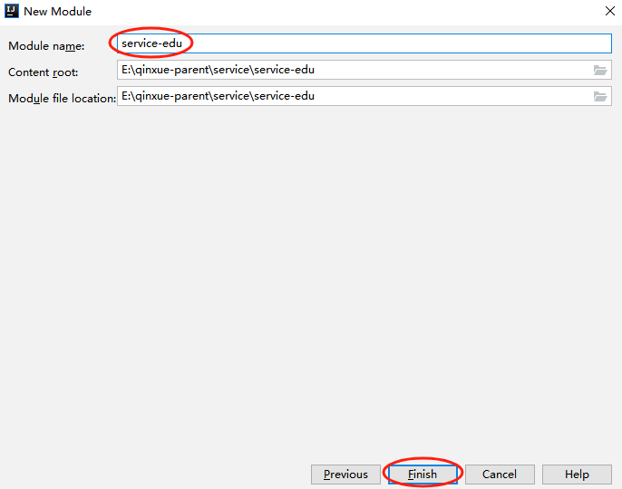

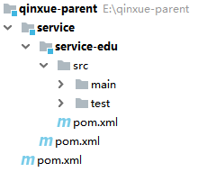

## 编写 SpringBoot 配置文件
<font style="color:rgb(0, 0, 0);">在 resources 目录下创建文件 application.properties 配置文件。</font>

```properties
# 服务端口
server.port=8001

# 服务名
spring.application.name=service-edu

# 环境设置：dev、test、prod
spring.profiles.active=dev

# mysql数据库连接
spring.datasource.driver-class-name=com.mysql.cj.jdbc.Driver
spring.datasource.url=jdbc:mysql://localhost:3306/qinxue_edu?serverTimezone=GMT%2B8&useUnicode=true&characterEncoding=utf-8
spring.datasource.username=root
spring.datasource.password=root

#mybatis日志
mybatis-plus.configuration.log-impl=org.apache.ibatis.logging.stdout.StdOutImpl
```

## 问题说明
IDEA 2019 版本中，创建的子模块有些情况下 java 目录和 resources 目录变为了普通目录，这不合适。

解决：

选中 java 目录右击鼠标 --> Make Directory as --> Sources Root

选中 resources 目录右击鼠标 --> Make Directory as --> Resources Root

## <font style="color:rgb(0, 0, 0);">编写 MP 代码生成器</font>
在 test/java 目录下创建包 com.xszx.eduservice，创建代码生成器：CodeGenerator.java

```java
package com.xszx.eduservice;

import com.baomidou.mybatisplus.annotation.DbType;
import com.baomidou.mybatisplus.annotation.IdType;
import com.baomidou.mybatisplus.generator.AutoGenerator;
import com.baomidou.mybatisplus.generator.config.DataSourceConfig;
import com.baomidou.mybatisplus.generator.config.GlobalConfig;
import com.baomidou.mybatisplus.generator.config.PackageConfig;
import com.baomidou.mybatisplus.generator.config.StrategyConfig;
import com.baomidou.mybatisplus.generator.config.rules.DateType;
import com.baomidou.mybatisplus.generator.config.rules.NamingStrategy;
import org.junit.Test;

public class CodeGenerator {

    @Test
    public void main1() {

        // 1、创建代码生成器
        AutoGenerator mpg = new AutoGenerator();

        // 2、全局配置
        GlobalConfig gc = new GlobalConfig();
        String projectPath = System.getProperty("user.dir");
        System.out.println(projectPath);
        gc.setOutputDir(projectPath + "/src/main/java");
        gc.setAuthor("lhp");
        gc.setOpen(false); //生成后是否打开资源管理器
        gc.setFileOverride(false); //重新生成时文件是否覆盖
        /*
         * mp生成service层代码，默认接口名称第一个字母有 I
         * UcenterService
         */
        gc.setServiceName("%sService"); //去掉Service接口的首字母I
        gc.setIdType(IdType.ID_WORKER); //主键策略
        gc.setDateType(DateType.ONLY_DATE);//定义生成的实体类中日期类型
        gc.setSwagger2(true);//开启Swagger2模式

        mpg.setGlobalConfig(gc);

        // 3、数据源配置
        DataSourceConfig dsc = new DataSourceConfig();
        dsc.setUrl("jdbc:mysql://localhost:3306/qinxue_edu?serverTimezone=GMT%2B8");
        dsc.setDriverName("com.mysql.cj.jdbc.Driver");
        dsc.setUsername("root");
        dsc.setPassword("root");
        dsc.setDbType(DbType.MYSQL);
        mpg.setDataSource(dsc);

        // 4、包配置
        PackageConfig pc = new PackageConfig();
        pc.setModuleName("serviceedu"); //模块名
        pc.setParent("com.xszx");
        pc.setController("controller");
        pc.setEntity("entity");
        pc.setService("service");
        pc.setMapper("mapper");
        mpg.setPackageInfo(pc);

        // 5、策略配置
        StrategyConfig strategy = new StrategyConfig();
        strategy.setInclude("edu_teacher");
        strategy.setNaming(NamingStrategy.underline_to_camel);//数据库表映射到实体的命名策略
        strategy.setTablePrefix(pc.getModuleName() + "_"); //生成实体时去掉表前缀

        strategy.setColumnNaming(NamingStrategy.underline_to_camel);//数据库表字段映射到实体的命名策略
        strategy.setEntityLombokModel(true); // lombok 模型 @Accessors(chain = true) setter链式操作

        strategy.setRestControllerStyle(true); //restful api风格控制器
        strategy.setControllerMappingHyphenStyle(true); //url中驼峰转连字符
        strategy.setTablePrefix("edu"); // 设置生成的代码过滤掉表前缀
        mpg.setStrategy(strategy);

        // 6、执行
        mpg.execute();
    }
}
```

## 运行代码生成器
运行代码生成器后，得到如下结果：

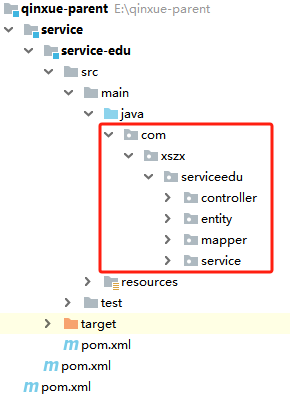

## 编写 SpringBoot 配置类
在 serviceedu 包下创建 config 包，创建 MyBatisPlusConfig.java

```java
package com.xszx.serviceedu.config;

import org.mybatis.spring.annotation.MapperScan;
import org.springframework.context.annotation.Configuration;
import org.springframework.transaction.annotation.EnableTransactionManagement;

@Configuration
@EnableTransactionManagement // 开启注解管理事务
@MapperScan("com.xszx.serviceedu.mapper")
public class MyBatisPlusConfig {
    
}
```

## 配置 sql 执行性能分析插件
```java
package com.xszx.serviceedu.config;

import com.baomidou.mybatisplus.extension.plugins.PerformanceInterceptor;
import org.mybatis.spring.annotation.MapperScan;
import org.springframework.context.annotation.Bean;
import org.springframework.context.annotation.Configuration;
import org.springframework.context.annotation.Profile;
import org.springframework.transaction.annotation.EnableTransactionManagement;

@Configuration
@EnableTransactionManagement // 开启注解管理事务
@MapperScan("com.xszx.serviceedu.mapper")
public class MyBatisPlusConfig {

    /**
     * SQL 执行性能分析插件
     * 开发环境使用，线上不推荐。 maxTime 指的是 sql 最大执行时长
     */
    @Bean
    @Profile({"dev","test"})// 设置 dev test 环境开启
    public PerformanceInterceptor performanceInterceptor() {
        PerformanceInterceptor performanceInterceptor = new PerformanceInterceptor();
        performanceInterceptor.setMaxTime(1000);//ms，超过此处设置的ms则sql不执行
        performanceInterceptor.setFormat(true);
        return performanceInterceptor;
    }
}
```

## 编写启动类
```java
package com.xszx.serviceedu;

import org.springframework.boot.SpringApplication;
import org.springframework.boot.autoconfigure.SpringBootApplication;

@SpringBootApplication
public class EduApplication {

    public static void main(String[] args) {
        SpringApplication.run(EduApplication.class, args);
    }
}
```

## 统一返回的 json 时间格式
<font style="color:rgb(0, 0, 0);">默认情况下 json 时间格式带有时区，并且是世界标准时间，和我们的时间差了八个小时</font>

<font style="color:rgb(0, 0, 0);">在 application.properties 中设置：</font>

```properties
#返回json的全局时间格式
spring.jackson.date-format=yyyy-MM-dd HH:mm:ss
spring.jackson.time-zone=GMT+8
```

# 六、实现讲师列表展示功能--后端
## 编写 controller 层代码
```java
package com.xszx.serviceedu.controller;


import com.xszx.serviceedu.entity.Teacher;
import com.xszx.serviceedu.service.TeacherService;
import org.springframework.beans.factory.annotation.Autowired;
import org.springframework.web.bind.annotation.GetMapping;
import org.springframework.web.bind.annotation.RequestMapping;
import org.springframework.web.bind.annotation.RestController;
import java.util.List;

/**
 * 讲师 前端控制器
 * @author lhp
 * @since 2024-07-05
 */
@RestController
@RequestMapping("/serviceedu/teacher")
public class TeacherController {

    @Autowired
    private TeacherService teacherService;

    @GetMapping
    public List<Teacher> list(){
        return teacherService.list(null);
    }
}
```

## 插入测试数据
给 edu_teacher 讲师表中插入测试用的数据。

| 字段 | 说明 |
| --- | --- |
| id | 讲师ID |
| name | 讲师姓名 |
| intro | 讲师简介 |
| career | 讲师资历,一句话说明讲师 |
| level | 头衔 1高级讲师 2首席讲师 |
| avatar | 讲师头像 |
| sort | 排序 |
| is_deleted | 逻辑删除 1（true）已删除， 0（false）未删除 |
| gmt_create | 创建时间 |
| gmt_modified | 更新时间 |


## 启动项目
运行启动类，会报如下错误：

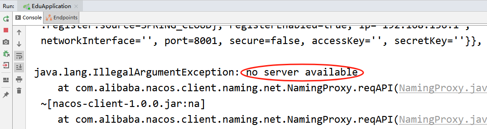

是因为我们目前还没有使用 nacos 服务注册中心，所以报错。**将 service 模块的 springcloud 相关的依赖注释掉**，重启就不会报错了，后面用到的时候我们再放开。

+ spring-cloud-starter-netflix-ribbon
+ spring-cloud-starter-netflix-hystrix
+ spring-cloud-starter-alibaba-nacos-discovery
+ spring-cloud-starter-openfeign

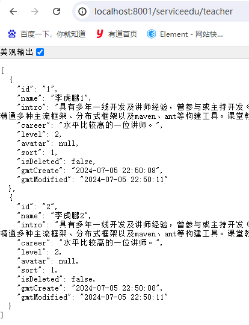

# 七、实现讲师逻辑删除功能--后端
## 编写 controller 层代码
```java
@DeleteMapping("{id}")
public boolean removeById(@PathVariable String id){
    return teacherService.removeById(id);
}
```

## 配置逻辑删除插件
在 MyBatisPlusConfig 中配置：

```java
/**
 * 逻辑删除插件
 */
@Bean
public ISqlInjector sqlInjector() {
    return new LogicSqlInjector();
}
```

## 修改 Teacher 实体类
给属性上添加逻辑删除的注解。

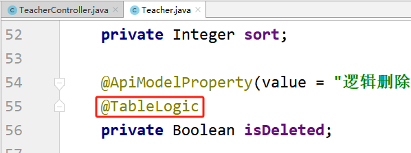

## 使用 postman 测试删除
启动项目，使用 postman 测试删除。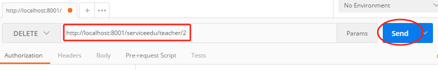

可以看到数据库表中，对应数据的 is_deleted 字段的值变为了 1。

# 八、跨域配置
## 什么是跨域
<font style="color:rgb(0, 0, 0);">浏览器从一个域名的网页去请求另一个域名的资源时，</font><font style="color:rgb(255, 0, 0);">域名、端口、协议任一不同，都是跨域 </font><font style="color:rgb(0, 0, 0);">。前后端分离开发中，需要考虑 ajax 跨域的问题。</font>

<font style="color:rgb(0, 0, 0);">这里我们可以从服务端解决这个问题。</font>

<font style="color:rgb(0, 0, 0);">http://IP地址:端口号/资源名</font>

## 配置
<font style="color:rgb(0, 0, 0);">在 Controller 类上添加注解：</font>**<font style="color:rgb(0, 0, 0);">@CrossOrigin</font>**

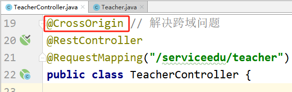

# 九、Swagger2 回顾
<font style="color:rgb(0, 0, 0);">前后端分离开发模式中，api 文档是最好的沟通方式。</font>

<font style="color:rgb(63, 63, 63);">Swagger 是一个规范和完整的框架，用于生成、描述、调用和可视化 RESTful 风格的 Web 服务。</font><font style="color:rgb(0, 0, 255);"></font>

1. <font style="color:rgb(63, 63, 63);">及时性</font><font style="color:rgb(0, 0, 255);"> </font><font style="color:rgb(0, 0, 255);">(接口变更后，能够及时准确地通知相关前后端开发人员)</font>
2. <font style="color:rgb(63, 63, 63);">规范性</font><font style="color:rgb(63, 63, 63);"> </font><font style="color:rgb(0, 0, 255);">(并且保证接口的规范性，如接口的地址，请求方式，参数及响应格式和错误信息)</font>
3. <font style="color:rgb(63, 63, 63);">一致性</font><font style="color:rgb(0, 0, 255);"> </font><font style="color:rgb(0, 0, 255);">(接口信息一致，不会出现因开发人员拿到的文档版本不一致，而出现分歧)</font>
4. <font style="color:rgb(63, 63, 63);">可测性</font><font style="color:rgb(0, 0, 255);"> (直接在接口文档上进行测试，以方便理解业务)</font>

# <font style="color:rgb(0, 0, 0);">十、配置 Swagger2</font>
## 创建 common 模块
在 qinxue-parent 父工程下创建 common 模块。

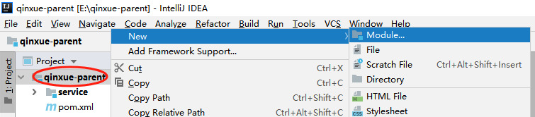

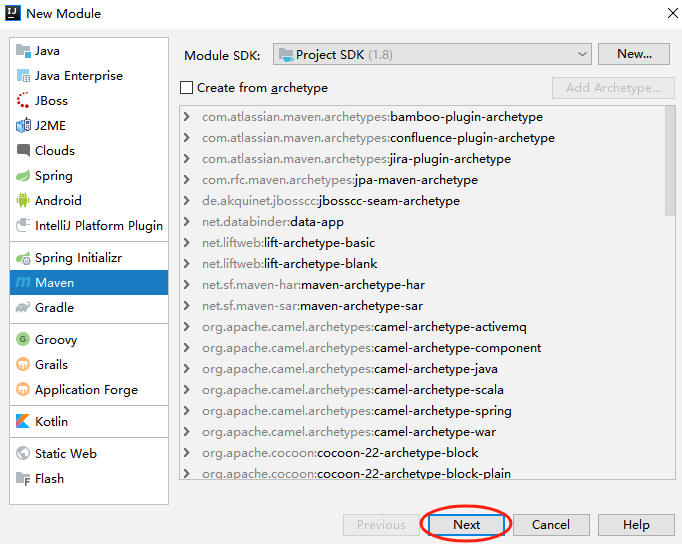


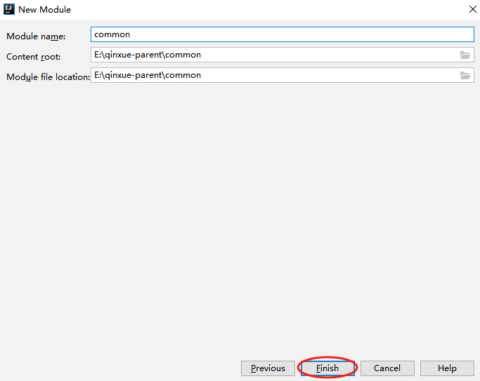


## 添加依赖
```xml
<?xml version="1.0" encoding="UTF-8"?>
<project xmlns="http://maven.apache.org/POM/4.0.0"
         xmlns:xsi="http://www.w3.org/2001/XMLSchema-instance"
         xsi:schemaLocation="http://maven.apache.org/POM/4.0.0 http://maven.apache.org/xsd/maven-4.0.0.xsd">
    <parent>
        <artifactId>qinxue-parent</artifactId>
        <groupId>com.xszx</groupId>
        <version>1.0-SNAPSHOT</version>
    </parent>
    <modelVersion>4.0.0</modelVersion>

    <artifactId>common</artifactId>

    <packaging>pom</packaging>

    <dependencies>
        <dependency>
            <groupId>org.springframework.boot</groupId>
            <artifactId>spring-boot-starter-web</artifactId>
            <scope>provided</scope>
        </dependency>

        <!--mybatis-plus-->
        <dependency>
            <groupId>com.baomidou</groupId>
            <artifactId>mybatis-plus-boot-starter</artifactId>
            <scope>provided</scope>
        </dependency>

        <!--lombok用来简化实体类：需要安装lombok插件-->
        <dependency>
            <groupId>org.projectlombok</groupId>
            <artifactId>lombok</artifactId>
            <scope>provided</scope>
        </dependency>

        <!--swagger-->
        <dependency>
            <groupId>io.springfox</groupId>
            <artifactId>springfox-swagger2</artifactId>
            <scope>provided</scope>
        </dependency>

        <dependency>
            <groupId>io.springfox</groupId>
            <artifactId>springfox-swagger-ui</artifactId>
            <scope>provided</scope>
        </dependency>

        <!-- redis -->
        <dependency>
            <groupId>org.springframework.boot</groupId>
            <artifactId>spring-boot-starter-data-redis</artifactId>
        </dependency>

        <!-- spring2.X集成redis所需common-pool2
        <dependency>
            <groupId>org.apache.commons</groupId>
            <artifactId>commons-pool2</artifactId>
            <version>2.6.0</version>
        </dependency>-->
    </dependencies>
</project>
```

## 删除 src 目录
common 模块要作为父模块使用，所以不写代码，将 src 目录删除。

## 创建子模块 service-base
在 common 模块下创建子模块 service-base。

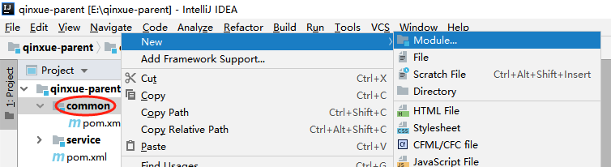

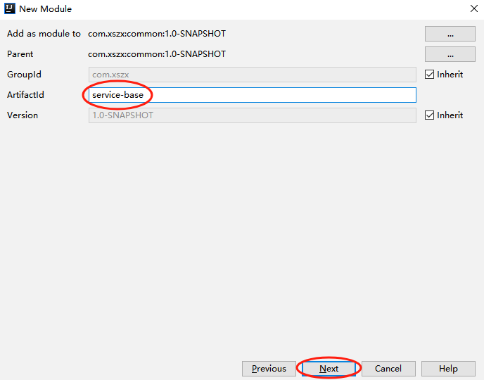

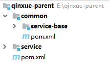

## <font style="color:rgb(0, 0, 0);">创建 swagger 的配置类</font>
在 service-base 模块中创建 swagger 配置类。

创建包 com.xszx.servicebase.config，创建类 SwaggerConfig。

```java
package com.xszx.servicebase.config;

import com.google.common.base.Predicates;
import org.springframework.context.annotation.Bean;
import org.springframework.context.annotation.Configuration;
import springfox.documentation.builders.ApiInfoBuilder;
import springfox.documentation.builders.PathSelectors;
import springfox.documentation.service.ApiInfo;
import springfox.documentation.service.Contact;
import springfox.documentation.spi.DocumentationType;
import springfox.documentation.spring.web.plugins.Docket;
import springfox.documentation.swagger2.annotations.EnableSwagger2;

@Configuration
@EnableSwagger2
public class SwaggerConfig {

    @Bean
    public Docket webApiConfig(){

        return new Docket(DocumentationType.SWAGGER_2)
                .groupName("webApi")
                .apiInfo(webApiInfo())
                .select()
                .paths(Predicates.not(PathSelectors.regex("/admin/.*")))
                .paths(Predicates.not(PathSelectors.regex("/error.*")))
                .build();
    }

    private ApiInfo webApiInfo(){

        return new ApiInfoBuilder()
                .title("网站-课程中心API文档")
                .description("本文档描述了课程中心微服务接口定义")
                .version("1.0")
                .contact(new Contact("lhp", "http://lhp.com", "523635392@qq.com"))
                .build();
    }
}
```

## <font style="color:rgb(0, 0, 0);">在模块 service 模块中引入 service-base</font>
```xml
<dependency>
    <groupId>com.xszx</groupId>
    <artifactId>service-base</artifactId>
    <version>1.0-SNAPSHOT</version>
</dependency>
```

## <font style="color:rgb(0, 0, 0);">在 service-edu 启动类上添加注解，进行测试</font>
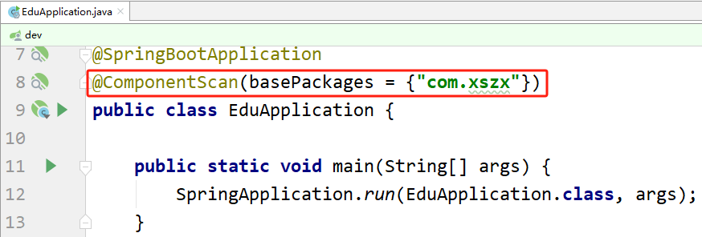

## 使用 Swagger 注解
```java
package com.xszx.serviceedu.controller;


import com.xszx.serviceedu.entity.Teacher;
import com.xszx.serviceedu.service.TeacherService;
import io.swagger.annotations.Api;
import io.swagger.annotations.ApiOperation;
import io.swagger.annotations.ApiParam;
import org.springframework.beans.factory.annotation.Autowired;
import org.springframework.web.bind.annotation.*;

import java.util.List;

/**
 * <p>
 * 讲师 前端控制器
 * </p>
 *
 * @author lhp
 * @since 2024-07-05
 */
@CrossOrigin // 解决跨域问题
@RestController
@RequestMapping("/serviceedu/teacher")
@Api(tags = "讲师管理")
public class TeacherController {

    @Autowired
    private TeacherService teacherService;

    @ApiOperation("根据ID删除讲师")
    @DeleteMapping("{id}")
    public boolean removeById(@PathVariable
                              @ApiParam(value = "讲师ID", required = true) String id){
        return teacherService.removeById(id);
    }

    @ApiOperation("讲师列表展示")
    @GetMapping
    public List<Teacher> list(){
        return teacherService.list(null);
    }
}
```

## 启动测试 Swagger
启动 service-edu 模块，访问，测试 Swagger。

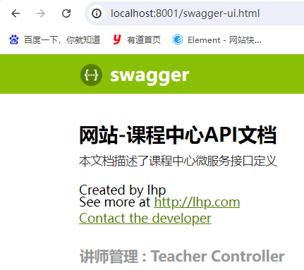

# 十一、统一返回数据格式
## 概述
<font style="color:rgb(0, 0, 0);">项目中我们会将响应封装成 json 返回，一般我们会将所有接口的数据格式统一， 使前端(iOS Android, Web)对数据的操作更一致、轻松。</font>

<font style="color:rgb(0, 0, 0);">一般情况下，统一返回数据格式没有固定的格式，只要能描述清楚返回的数据状态以及要返回的具体数据就可以。但是一般会包含状态码、返回消息、数据这几部分内容。</font>

<font style="color:rgb(0, 0, 0);">例如，我们的系统要求返回的基本数据格式如下：</font>

```json
{
  "success": true,
  "code": 20000,
  "message": "成功",
  "data": {
    "items": [
      {
        "id": "1",
        "name": "刘德华",
        "intro": "毕业于师范大学数学系，热爱教育事业，执教数学思维6年有余"
      }
    ]
  }
}
```

**分页：**

```json
{
  "success": true,
  "code": 20000,
  "message": "成功",
  "data": {
    "total": 17,
    "rows": [
      {
        "id": "1",
        "name": "刘德华",
        "intro": "毕业于师范大学数学系，热爱教育事业，执教数学思维6年有余"
      }
    ]
  }
}
```

**没有返回数据：**

```json
{
  "success": true,
  "code": 20000,
  "message": "成功",
  "data": {}
}
```

**失败：**

```json
{
  "success": false,
  "code": 20001,
  "message": "失败",
  "data": {}
}
```

<font style="color:rgb(0, 0, 0);">因此，我们定义统一结果</font>

```json
{
  "success": 布尔, //响应是否成功
  "code": 数字, //响应码
  "message": 字符串, //返回消息
  "data": HashMap //返回数据，放在键值对中
}
```

## 创建统一结果返回类
### <font style="color:rgb(0, 0, 0);">在 common 模块下创建子模块 common-utils</font>
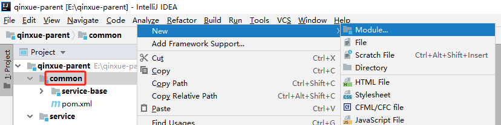

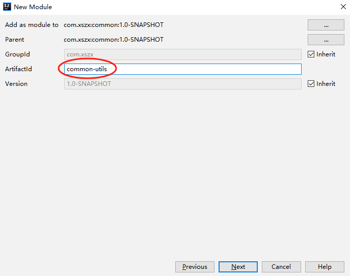

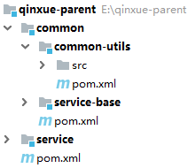

### <font style="color:rgb(0, 0, 0);">创建接口定义返回码</font>
**<font style="color:rgb(0, 0, 0);">创建包 com.xszx.commonutils，创建接口 ResultCode.java</font>**

```java
package com.xszx.commonutils;

public interface ResultCode {

    Integer SUCCESS = 20000;
    Integer ERROR = 20001;
}
```

### <font style="color:rgb(0, 0, 0);">创建结果类</font>
```java
package com.xszx.commonutils;

import io.swagger.annotations.ApiModelProperty;
import lombok.Data;
import java.util.HashMap;
import java.util.Map;

@Data
public class R {
 
    @ApiModelProperty(value = "是否成功")
    private Boolean success;

    @ApiModelProperty(value = "返回码")
    private Integer code;

    @ApiModelProperty(value = "返回消息")
    private String message;

    @ApiModelProperty(value = "返回数据")
    private Map<String, Object> data = new HashMap<String, Object>();

    private R(){}

    public static R ok(){

        R r = new R();
        r.setSuccess(true);
        r.setCode(ResultCode.SUCCESS);
        r.setMessage("成功");
        return r;
    }

    public static R error(){
        R r = new R();
        r.setSuccess(false);
        r.setCode(ResultCode.ERROR);
        r.setMessage("失败");
        return r;
    }

    public R success(Boolean success){
        this.setSuccess(success);
        return this;
    }

    public R message(String message){
        this.setMessage(message);
        return this;
    }

    public R code(Integer code){
        this.setCode(code);
        return this;
    }

    public R data(String key, Object value){
        this.data.put(key, value);
        return this;
    }

    public R data(Map<String, Object> map){
        this.setData(map);
        return this;
    }
}
```

## 使用统一返回结果
### <font style="color:rgb(0, 0, 0);">在 service 模块中添加依赖</font>
```xml
<dependency>
    <groupId>com.xszx</groupId>
    <artifactId>common-utils</artifactId>
    <version>1.0-SNAPSHOT</version>
</dependency>
```

### <font style="color:rgb(0, 0, 0);">修改 Controller 中的返回结果</font>
```java
@CrossOrigin // 解决跨域问题
@RestController
@RequestMapping("/serviceedu/teacher")
@Api(tags = "讲师管理")
public class TeacherController {

    @Autowired
    private TeacherService teacherService;

    @ApiOperation("根据ID删除讲师")
    @DeleteMapping("{id}")
    public R removeById(@PathVariable
                              @ApiParam(value = "讲师ID", required = true) String id){
        teacherService.removeById(id);
        return R.ok().message("删除成功");
    }

    @ApiOperation("讲师列表展示")
    @GetMapping
    public R list(){
        List<Teacher> list = teacherService.list(null);
        return R.ok().data("items", list);
    }
}
```

### 使用 Swagger 测试
启动项目，使用 Swagger 测试。

# 十二、实现讲师分页查询
## <font style="color:rgb(0, 0, 0);">MyBatisPlusConfig 中配置分页插件</font>
```java
/**
 * 分页插件
 */
@Bean
public PaginationInterceptor paginationInterceptor() {
    return new PaginationInterceptor();
}
```

## controller 添加分页方法
```java
@ApiOperation("分页讲师列表")
@GetMapping("{page}/{limit}")
public R pageList(@PathVariable
                  @ApiParam(value = "当前页码", required = true) Long page,

                  @PathVariable
                  @ApiParam(value = "每页记录数", required = true) Long limit){

    Page<Teacher> pageParam = new Page<>(page, limit);
    teacherService.page(pageParam, null);

    List<Teacher> records = pageParam.getRecords();
    long total = pageParam.getTotal();
    return R.ok().data("total", total)
            .data("rows", records);
}
```

## Swagger 测试分页
启动 service-edu，使用 Swagger 进行测试分页方法。

# 十三、实现讲师分页+条件查询
## 需求
<font style="color:rgb(0, 0, 0);">根据讲师名称 name、讲师头衔 level、讲师入驻时间 gmt_create（时间段）查询，并带上分页。</font>

## <font style="color:rgb(0, 0, 0);">创建查询对象</font>
<font style="color:rgb(0, 0, 0);">创建 entity.query 包，创建 TeacherQuery.java 查询对象。</font>

```java
package com.xszx.serviceedu.entity.query;

import io.swagger.annotations.ApiModel;
import io.swagger.annotations.ApiModelProperty;
import lombok.Data;

import java.io.Serializable;

@Data
@ApiModel("讲师查询对象封装")
public class TeacherQuery implements Serializable {

    private static final long serialVersionUID = 1L;
    
    @ApiModelProperty("教师名称,模糊查询")
    private String name;

    @ApiModelProperty("头衔 1高级讲师 2首席讲师")
    private Integer level;

    @ApiModelProperty(value = "查询开始时间", example = "2019-01-01 10:10:10")
    private String begin;//注意，这里使用的是String类型，前端传过来的数据无需进行类型转换

    @ApiModelProperty(value = "查询结束时间", example = "2019-12-01 10:10:10")
    private String end;
}
```

## 编写 service 层代码
```java
public interface TeacherService extends IService<Teacher> {

    void pageQuery(Page<Teacher> pageParam, TeacherQuery teacherQuery);
}
```

```java
@Service
public class TeacherServiceImpl extends ServiceImpl<TeacherMapper, Teacher> implements TeacherService {

    @Override
    public void pageQuery(Page<Teacher> pageParam, TeacherQuery teacherQuery) {

        QueryWrapper<Teacher> wrapper = new QueryWrapper<>();
        wrapper.orderByAsc("sort");

        if(teacherQuery == null){
            baseMapper.selectPage(pageParam, null);
            return;
        }

        if(StringUtils.isNotEmpty(teacherQuery.getName())){
            wrapper.like("name", teacherQuery.getName());
        }

        if(teacherQuery.getLevel() != null){
            wrapper.eq("level", teacherQuery.getLevel());
        }

        if(StringUtils.isNotEmpty(teacherQuery.getBegin())){
            wrapper.ge("gmt_create", teacherQuery.getBegin());
        }

        if(StringUtils.isNotEmpty(teacherQuery.getEnd())){
            wrapper.le("gmt_create", teacherQuery.getEnd());
        }

        baseMapper.selectPage(pageParam, wrapper);
    }
}
```

## 修改 controller 方法
<font style="color:rgb(0, 0, 0);">TeacherController 中修改 pageList 方法：</font>

<font style="color:rgb(255, 0, 0);">增加参数 TeacherQuery teacherQuery，非必选。</font>

```java
@ApiOperation("分页讲师列表")
@GetMapping("{page}/{limit}")
public R pageList(@PathVariable
                  @ApiParam(value = "当前页码", required = true) Long page,

                  @PathVariable
                  @ApiParam(value = "每页记录数", required = true) Long limit,

                  @ApiParam(value = "查询对象", required = false)
                  TeacherQuery teacherQuery){

    Page<Teacher> pageParam = new Page<>(page, limit);

    // 调用我们自己写的service中的分页方法
    teacherService.pageQuery(pageParam, teacherQuery);

    List<Teacher> records = pageParam.getRecords();
    long total = pageParam.getTotal();
    return R.ok().data("total", total)
            .data("rows", records);
}
```

## 使用 Swagger 测试
启动 service-edu 模块，使用 Swagger 进行测试。

# 十四、实现讲师新增和修改功能
## <font style="color:rgb(0, 0, 0);">自动填充封装</font>
### <font style="color:rgb(0, 0, 0);">在 service-base 模块中添加</font>
<font style="color:rgb(0, 0, 0);">创建包 handler，创建自动填充类 MyMetaObjectHandler</font>

```java
package com.xszx.servicebase.handler;

import com.baomidou.mybatisplus.core.handlers.MetaObjectHandler;
import org.apache.ibatis.reflection.MetaObject;
import org.springframework.stereotype.Component;
import java.util.Date;

@Component
public class MyMetaObjectHandler implements MetaObjectHandler {

    @Override
    public void insertFill(MetaObject metaObject) {
        this.setFieldValByName("gmtCreate", new Date(), metaObject);
        this.setFieldValByName("gmtModified", new Date(), metaObject);
    }

    @Override
    public void updateFill(MetaObject metaObject) {
        this.setFieldValByName("gmtModified", new Date(), metaObject);
    }
}
```

### <font style="color:rgb(0, 0, 0);">在实体类添加自动填充注解</font>
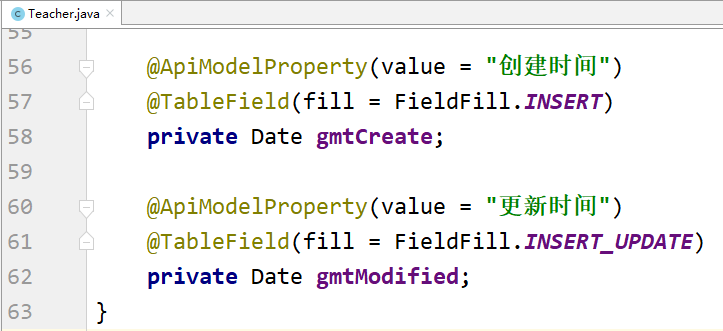

## 编写 controller 方法
```java
@ApiOperation(value = "新增讲师")
@PostMapping
public R save(@ApiParam(name = "teacher", value = "讲师对象", required = true)
                  @RequestBody Teacher teacher){
    teacherService.save(teacher);
    return R.ok().message("添加讲师成功");
}

@ApiOperation(value = "根据ID查询讲师")
@GetMapping("{id}")
public R getById(@ApiParam(name = "id", value = "讲师ID", required = true)
                     @PathVariable String id){
    Teacher teacher = teacherService.getById(id);
    return R.ok().data("item", teacher);
}

@ApiOperation(value = "根据ID修改讲师")
@PutMapping("{id}")
public R updateById(@PathVariable @ApiParam(name = "id", value = "讲师ID", required = true) String id,
                    @RequestBody @ApiParam(name = "teacher", value = "讲师对象", required = true) Teacher teacher){
    teacher.setId(id);
    teacherService.updateById(teacher);
    return R.ok();
}
```

## 使用 Swagger 测试
启动 service-edu 模块，使用 Swagger 进行测试。

**问题1：**

测试添加方法时会报错：

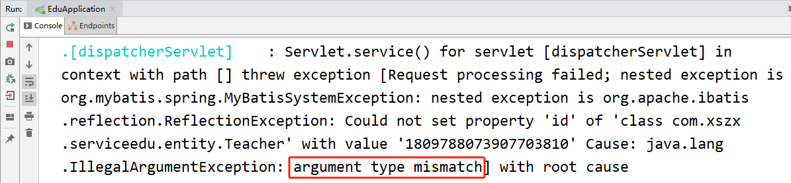

这是因为，目前我们使用代码生成器生成的实体类 ID 属性上的生成策略是 ID_WORKER，是生成一个 Long 类型的数据，而我们数据库用的 ID 是 varchar 类型。

解决：

将 ID 生成策略由 ID_WORKER 改为 ID_WORKER_STR 即可。

**问题2：**

添加到数据库的数据中文乱码了，需要给数据库的 url 地址上添加编码方式即可。

```properties
spring.datasource.url=jdbc:mysql://localhost:3306/qinxue_edu?serverTimezone=GMT%2B8&useUnicode=true&characterEncoding=utf-8
```

# 十五、统一异常处理
## 概述
### <font style="color:rgb(0, 0, 0);">制造异常</font>
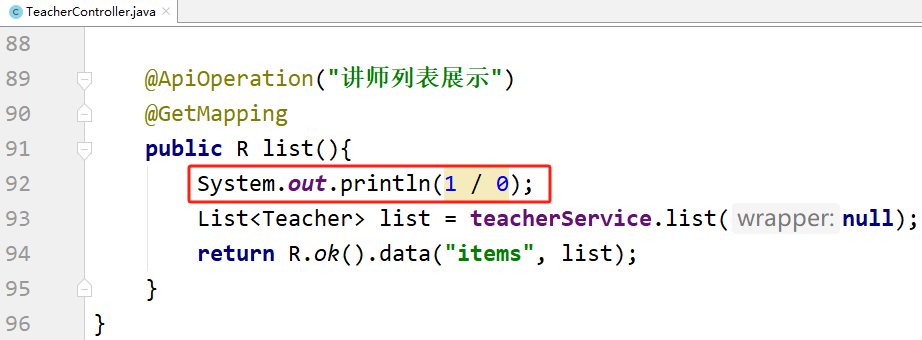

访问后，报错如下：

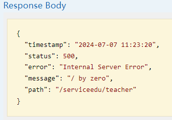

### <font style="color:rgb(0, 0, 0);">什么是统一异常处理</font>
<font style="color:rgb(0, 0, 0);">我们想要统一处理系统的异常信息，并且让异常结果也显示为统一的返回结果对象，那么需要统一异常处理。</font>

## <font style="color:rgb(0, 0, 0);">统一异常处理</font>
### service-base 模块添加依赖
```xml
<dependency>
    <artifactId>common-utils</artifactId>
    <groupId>com.xszx</groupId>
    <version>1.0-SNAPSHOT</version>
</dependency>
```

### <font style="color:rgb(0, 0, 0);">创建统一异常处理器</font>
<font style="color:rgb(0, 0, 0);">在 service-base 中的 com.xszx.servicebase.exceptionhandler 包中创建统一异常处理类 GlobalExceptionHandler.java：</font>

```java
package com.xszx.servicebase.exceptionhandler;

import com.xszx.commonutils.R;
import org.springframework.web.bind.annotation.ControllerAdvice;
import org.springframework.web.bind.annotation.ExceptionHandler;
import org.springframework.web.bind.annotation.ResponseBody;

/**
 * 统一异常处理类
 */
@ControllerAdvice
public class GlobalExceptionHandler {

    @ExceptionHandler(Exception.class)
    @ResponseBody
    public R error(Exception e){
        e.printStackTrace();
        return R.error().message("发生错误了，请联系管理员！");
    }
}
```

### 测试统一异常
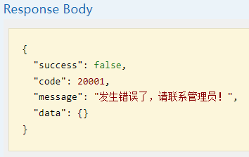

## <font style="color:rgb(0, 0, 0);">处理特定异常</font>
### <font style="color:rgb(0, 0, 0);">添加异常处理方法</font>
在 <font style="color:rgb(0, 0, 0);">GlobalExceptionHandler.java 中添加</font>

```java
@ExceptionHandler(ArithmeticException.class)
@ResponseBody
public R error(ArithmeticException e){
    e.printStackTrace();
    return R.error().message("执行了算术异常处理。");
}
```

### 测试
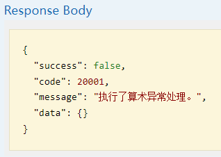

## <font style="color:rgb(0, 0, 0);">自定义异常</font>
### <font style="color:rgb(0, 0, 0);">创建自定义异常类</font>
在 com.xszx.servicebase.exceptionhandler 包中创建自定义异常类：

```java
package com.xszx.servicebase.exceptionhandler;

import lombok.AllArgsConstructor;
import lombok.Data;
import lombok.NoArgsConstructor;
import lombok.ToString;

@Data
@AllArgsConstructor
@NoArgsConstructor
@ToString
public class QinXueException extends RuntimeException {

    private Integer code; // 状态码
    private String msg; // 异常信息
}
```

### <font style="color:rgb(0, 0, 0);">业务中需要的位置抛出 QinXueException</font>
```java
try {
    System.out.println(1 / 0);
}catch (Exception e){
    throw new QinXueException(20001, "出现自定义异常");
}
```

### <font style="color:rgb(0, 0, 0);">添加异常处理方法</font>
在 <font style="color:rgb(0, 0, 0);">GlobalExceptionHandler.java 中添加</font>

```java
@ExceptionHandler(QinXueException.class)
@ResponseBody
public R error(QinXueException e){
    e.printStackTrace();
    return R.error().message(e.getMsg()).code(e.getCode());
}
```

### 测试
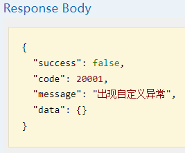

# 十六、统一日志处理
## <font style="color:rgb(0, 0, 0);">日志级别</font>
<font style="color:rgb(0, 0, 0);">日志记录器（Logger）的行为是分等级的。如下所示：</font>

<font style="color:rgb(0, 0, 0);">分为：OFF、FATAL、</font>**<font style="color:rgb(0, 0, 0);">ERROR、WARN、INFO、DEBUG</font>**<font style="color:rgb(0, 0, 0);">、ALL</font>

## <font style="color:rgb(0, 0, 0);">Logback 日志概述</font>
<font style="color:rgb(0, 0, 0);">SpringBoot 内部使用 Logback 作为日志实现的框架。</font>

<font style="color:rgb(0, 0, 0);">Logback 和 log4j 非常相似，如果你对 log4j 很熟悉，那对 logback 很快就会得心应手。</font>

<font style="color:rgb(0, 0, 0);">logback 相对于 log4j 的一些优点：</font>[https://blog.csdn.net/caisini_vc/article/details/48551287](https://blog.csdn.net/caisini_vc/article/details/48551287)

## <font style="color:rgb(0, 0, 0);">配置 logback 日志</font>
<font style="color:rgb(0, 0, 0);">删除 application.properties 中的日志配置</font>

<font style="color:rgb(0, 0, 0);">安装 idea 彩色日志插件：grep-console</font>

<font style="color:rgb(0, 0, 0);">resources 中创建 logback-spring.xml</font>

```xml
<?xml version="1.0" encoding="UTF-8"?>
<configuration  scan="true" scanPeriod="10 seconds">
    <!-- 日志级别从低到高分为TRACE < DEBUG < INFO < WARN < ERROR < FATAL，如果设置为WARN，则低于WARN的信息都不会输出 -->
    <!-- scan:当此属性设置为true时，配置文件如果发生改变，将会被重新加载，默认值为true -->
    <!-- scanPeriod:设置监测配置文件是否有修改的时间间隔，如果没有给出时间单位，默认单位是毫秒。当scan为true时，此属性生效。默认的时间间隔为1分钟。 -->
    <!-- debug:当此属性设置为true时，将打印出logback内部日志信息，实时查看logback运行状态。默认值为false。 -->

    <contextName>logback</contextName>
    <!-- name的值是变量的名称，value的值时变量定义的值。通过定义的值会被插入到logger上下文中。定义变量后，可以使“${}”来使用变量。 -->
    <property name="log.path" value="D:/qinxue/edu" />

    <!-- 彩色日志 -->
    <!-- 配置格式变量：CONSOLE_LOG_PATTERN 彩色日志格式 -->
    <!-- magenta:洋红 -->
    <!-- boldMagenta:粗红-->
    <!-- cyan:青色 -->
    <!-- white:白色 -->
    <!-- magenta:洋红 -->
    <property name="CONSOLE_LOG_PATTERN"
              value="%yellow(%date{yyyy-MM-dd HH:mm:ss}) |%highlight(%-5level) |%blue(%thread) |%blue(%file:%line) |%green(%logger) |%cyan(%msg%n)"/>


    <!--输出到控制台-->
    <appender name="CONSOLE" class="ch.qos.logback.core.ConsoleAppender">
        <!--此日志appender是为开发使用，只配置最底级别，控制台输出的日志级别是大于或等于此级别的日志信息-->
        <!-- 例如：如果此处配置了INFO级别，则后面其他位置即使配置了DEBUG级别的日志，也不会被输出 -->
        <filter class="ch.qos.logback.classic.filter.ThresholdFilter">
            <level>INFO</level>
        </filter>
        <encoder>
            <Pattern>${CONSOLE_LOG_PATTERN}</Pattern>
            <!-- 设置字符集 -->
            <charset>UTF-8</charset>
        </encoder>
    </appender>


    <!--输出到文件-->

    <!-- 时间滚动输出 level为 INFO 日志 -->
    <appender name="INFO_FILE" class="ch.qos.logback.core.rolling.RollingFileAppender">
        <!-- 正在记录的日志文件的路径及文件名 -->
        <file>${log.path}/log_info.log</file>
        <!--日志文件输出格式-->
        <encoder>
            <pattern>%d{yyyy-MM-dd HH:mm:ss.SSS} [%thread] %-5level %logger{50} - %msg%n</pattern>
            <charset>UTF-8</charset>
        </encoder>
        <!-- 日志记录器的滚动策略，按日期，按大小记录 -->
        <rollingPolicy class="ch.qos.logback.core.rolling.TimeBasedRollingPolicy">
            <!-- 每天日志归档路径以及格式 -->
            <fileNamePattern>${log.path}/info/log-info-%d{yyyy-MM-dd}.%i.log</fileNamePattern>
            <timeBasedFileNamingAndTriggeringPolicy class="ch.qos.logback.core.rolling.SizeAndTimeBasedFNATP">
                <maxFileSize>100MB</maxFileSize>
            </timeBasedFileNamingAndTriggeringPolicy>
            <!--日志文件保留天数-->
            <maxHistory>15</maxHistory>
        </rollingPolicy>
        <!-- 此日志文件只记录info级别的 -->
        <filter class="ch.qos.logback.classic.filter.LevelFilter">
            <level>INFO</level>
            <onMatch>ACCEPT</onMatch>
            <onMismatch>DENY</onMismatch>
        </filter>
    </appender>

    <!-- 时间滚动输出 level为 WARN 日志 -->
    <appender name="WARN_FILE" class="ch.qos.logback.core.rolling.RollingFileAppender">
        <!-- 正在记录的日志文件的路径及文件名 -->
        <file>${log.path}/log_warn.log</file>
        <!--日志文件输出格式-->
        <encoder>
            <pattern>%d{yyyy-MM-dd HH:mm:ss.SSS} [%thread] %-5level %logger{50} - %msg%n</pattern>
            <charset>UTF-8</charset> <!-- 此处设置字符集 -->
        </encoder>
        <!-- 日志记录器的滚动策略，按日期，按大小记录 -->
        <rollingPolicy class="ch.qos.logback.core.rolling.TimeBasedRollingPolicy">
            <fileNamePattern>${log.path}/warn/log-warn-%d{yyyy-MM-dd}.%i.log</fileNamePattern>
            <timeBasedFileNamingAndTriggeringPolicy class="ch.qos.logback.core.rolling.SizeAndTimeBasedFNATP">
                <maxFileSize>100MB</maxFileSize>
            </timeBasedFileNamingAndTriggeringPolicy>
            <!--日志文件保留天数-->
            <maxHistory>15</maxHistory>
        </rollingPolicy>
        <!-- 此日志文件只记录warn级别的 -->
        <filter class="ch.qos.logback.classic.filter.LevelFilter">
            <level>warn</level>
            <onMatch>ACCEPT</onMatch>
            <onMismatch>DENY</onMismatch>
        </filter>
    </appender>


    <!-- 时间滚动输出 level为 ERROR 日志 -->
    <appender name="ERROR_FILE" class="ch.qos.logback.core.rolling.RollingFileAppender">
        <!-- 正在记录的日志文件的路径及文件名 -->
        <file>${log.path}/log_error.log</file>
        <!--日志文件输出格式-->
        <encoder>
            <pattern>%d{yyyy-MM-dd HH:mm:ss.SSS} [%thread] %-5level %logger{50} - %msg%n</pattern>
            <charset>UTF-8</charset> <!-- 此处设置字符集 -->
        </encoder>
        <!-- 日志记录器的滚动策略，按日期，按大小记录 -->
        <rollingPolicy class="ch.qos.logback.core.rolling.TimeBasedRollingPolicy">
            <fileNamePattern>${log.path}/error/log-error-%d{yyyy-MM-dd}.%i.log</fileNamePattern>
            <timeBasedFileNamingAndTriggeringPolicy class="ch.qos.logback.core.rolling.SizeAndTimeBasedFNATP">
                <maxFileSize>100MB</maxFileSize>
            </timeBasedFileNamingAndTriggeringPolicy>
            <!--日志文件保留天数-->
            <maxHistory>15</maxHistory>
        </rollingPolicy>
        <!-- 此日志文件只记录ERROR级别的 -->
        <filter class="ch.qos.logback.classic.filter.LevelFilter">
            <level>ERROR</level>
            <onMatch>ACCEPT</onMatch>
            <onMismatch>DENY</onMismatch>
        </filter>
    </appender>

    <!--
        <logger>用来设置某一个包或者具体的某一个类的日志打印级别、以及指定<appender>。
        <logger>仅有一个name属性，
        一个可选的level和一个可选的addtivity属性。
        name:用来指定受此logger约束的某一个包或者具体的某一个类。
        level:用来设置打印级别，大小写无关：TRACE, DEBUG, INFO, WARN, ERROR, ALL 和 OFF，
              如果未设置此属性，那么当前logger将会继承上级的级别。
    -->
    <!--
        使用mybatis的时候，sql语句是debug下才会打印，而这里我们只配置了info，所以想要查看sql语句的话，有以下两种操作：
        第一种把<root level="INFO">改成<root level="DEBUG">这样就会打印sql，不过这样日志那边会出现很多其他消息
        第二种就是单独给mapper下目录配置DEBUG模式，代码如下，这样配置sql语句会打印，其他还是正常DEBUG级别：
     -->
    <!--开发环境:打印控制台-->
    <springProfile name="dev">
        <!--可以输出项目中的debug日志，包括mybatis的sql日志-->
        <logger name="com.xszx" level="INFO" />

        <!--
            root节点是必选节点，用来指定最基础的日志输出级别，只有一个level属性
            level:用来设置打印级别，大小写无关：TRACE, DEBUG, INFO, WARN, ERROR, ALL 和 OFF，默认是DEBUG
            可以包含零个或多个appender元素。
        -->
        <root level="INFO">
            <appender-ref ref="CONSOLE" />
            <appender-ref ref="INFO_FILE" />
            <appender-ref ref="WARN_FILE" />
            <appender-ref ref="ERROR_FILE" />
        </root>
    </springProfile>


    <!--生产环境:输出到文件-->
    <springProfile name="pro">

        <root level="INFO">
            <appender-ref ref="CONSOLE" />
            <appender-ref ref="DEBUG_FILE" />
            <appender-ref ref="INFO_FILE" />
            <appender-ref ref="ERROR_FILE" />
            <appender-ref ref="WARN_FILE" />
        </root>
    </springProfile>
</configuration>
```

## <font style="color:rgb(0, 0, 0);">将错误日志输出到文件</font>
<font style="color:rgb(0, 0, 0);">在 GlobalExceptionHandler.java 的类上添加注解：@Slf4j</font>

<font style="color:rgb(0, 0, 0);">异常输出语句：log.error(e.getMessage());</font>

## <font style="color:rgb(0, 0, 0);">将日志堆栈信息输出到文件</font>
<font style="color:rgb(0, 0, 0);">定义工具类，在 common-utils 模块的 commonutils 包中，创建 ExceptionUtil.java 工具类</font>

```java
package com.xszx.commonutils;

import java.io.IOException;
import java.io.PrintWriter;
import java.io.StringWriter;

public class ExceptionUtil {

    public static String getMessage(Exception e) {
        StringWriter sw = null;
        PrintWriter pw = null;
        try {
            sw = new StringWriter();
            pw = new PrintWriter(sw);
            // 将出错的栈信息输出到printWriter中
            e.printStackTrace(pw);
            pw.flush();
            sw.flush();
        } finally {
            if (sw != null) {
                try {
                    sw.close();
                } catch (IOException e1) {
                    e1.printStackTrace();
                }
            }
            if (pw != null) {
                pw.close();
            }
        }
        return sw.toString();
    }
}
```

<font style="color:rgb(0, 0, 0);">输入日志，需要调用：</font>

<font style="color:rgb(0, 0, 0);">log.error(ExceptionUtil.getMessage(e));</font>

## <font style="color:rgb(0, 0, 0);">测试</font>
启动 service-edu，测试发生异常后日志的效果，重点看生成的日志文件中的内容。


> 更新: 2026-03-04 23:15:21  
> 原文: <https://www.yuque.com/u41736172/az9urv/cansbcg97b2mbirf>