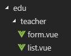
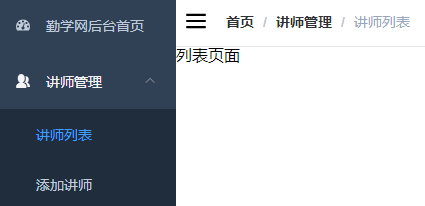
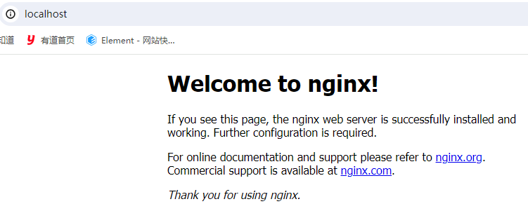
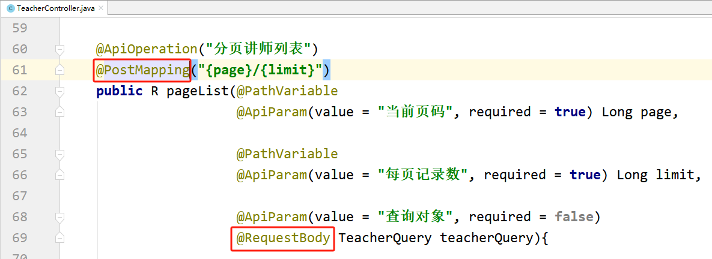

# 第五天【讲师管理模块前端开发】

# 一、项目中的路由
## 前端项目写代码的步骤
通过观察前端项目自带的功能，我们知道，写前端项目代码的步骤：

1. 编写一个自己的路由
2. 编写自己的路由对应的页面，注意页面中 div 的 class 是固定 app-container
3. 编写访问后端的 API 方法，发送 ajax 请求
4. 在页面中调用第三步写好的 API 方法，展示数据

## <font style="color:rgb(0, 0, 0);">后台系统路由实现分析</font>
### <font style="color:rgb(0, 0, 0);">入口文件中调用路由</font>
<font style="color:rgb(0, 0, 0);">src/main.js</font>

```javascript
......
import router from './router' //引入路由模块
......
new Vue({
  el: '#app',
  router, //挂载路由
  store,
  render: h => h(App)
})
```

### <font style="color:rgb(0, 0, 0);">路由模块中定义路由</font>
<font style="color:rgb(0, 0, 0);">src/router/index.js</font>

```javascript
......
export const constantRouterMap = [
  ......
]

export default new Router({
  ......
  routes: constantRouterMap
})  
```

## <font style="color:rgb(0, 0, 0);">勤学网路由定义</font>
### <font style="color:rgb(0, 0, 0);">复制 icon 图标</font>
<font style="color:rgb(0, 0, 0);">将 vue-element-admin/src/icons/svg 中的图标复制到 qinxue-admin 项目中</font>

### <font style="color:rgb(0, 0, 0);">修改路由</font>
<font style="color:rgb(0, 0, 0);">修改 src/router/index.js 文件，重新定义 constantRouterMap</font>

**<font style="color:rgb(255, 0, 0);">注意：</font>**<font style="color:rgb(255, 0, 0);">每个路由的 name 不能相同</font>

```javascript
export const constantRouterMap = [
  { path: '/login', component: () => import('@/views/login/index'), hidden: true },
  { path: '/404', component: () => import('@/views/404'), hidden: true },

  // 首页
  {
    path: '/',
    component: Layout,
    redirect: '/dashboard',
    name: 'Dashboard',
    children: [{
      path: 'dashboard',
      component: () => import('@/views/dashboard/index'),
      meta: { title: '勤学网后台首页', icon: 'dashboard' }
    }]
  },

  // 讲师管理
  {
    path: '/teacher',
    component: Layout,
    redirect: '/edu/teacher/list',
    name: 'Teacher',
    meta: { title: '讲师管理', icon: 'peoples' },
    children: [
      {
        path: 'list',
        name: 'EduTeacherList',
        component: () => import('@/views/edu/teacher/list'),
        meta: { title: '讲师列表' }
      },
      {
        path: 'create',
        name: 'EduTeacherCreate',
        component: () => import('@/views/edu/teacher/form'),
        meta: { title: '添加讲师' }
      },
      {
        path: 'edit/:id',
        name: 'EduTeacherEdit',
        component: () => import('@/views/edu/teacher/form'),
        meta: { title: '编辑讲师', noCache: true },
        hidden: true
      }
    ]
  },

  { path: '*', redirect: '/404', hidden: true }
]
```

### <font style="color:rgb(0, 0, 0);">创建 vue 组件</font>
<font style="color:rgb(0, 0, 0);">在 src/views 文件夹下创建以下文件夹和文件</font>



### <font style="color:rgb(0, 0, 0);">form.vue</font>
```html
<template>
  <div class="app-container">
    讲师表单
  </div>
</template>
```

### <font style="color:rgb(0, 0, 0);">list.vue</font>
```html
<template>
  <div class="app-container">
    讲师列表
  </div>
</template>
```

# 二、使用 Nginx 配置后台多服务器 API
## <font style="color:rgb(0, 0, 0);">项目中的 Easy Mock</font>
<font style="color:rgb(255, 0, 0);">config/dev.env.js</font><font style="color:rgb(51, 51, 51);"> 中 BASE_API 为项目的 easymock 地址，我们需要改为我们自己后端的基本地址。</font>

```json
BASE_API: '"http://localhost:8001"'
```

## <font style="color:rgb(0, 0, 0);">完成登录功能</font>
### 编写 controller 层代码
查看：前端项目中 src/store/modules/user.js 可以看到：

+ 访问登录方法，前端想要得到 token。
+ 访问登录信息的方法，前端想要得到  roles、name 和 avatar 值。
+ 目前我们登录是写死的，后面使用了 SpringSecurity 再写活！

```java
package com.xszx.serviceedu.controller;

import com.xszx.commonutils.R;
import org.springframework.web.bind.annotation.*;

@RestController
@RequestMapping("/serviceedu/user")
@CrossOrigin
public class LoginController {

    @PostMapping("/login")
    public R login(){
        return R.ok().data("token", "admin");
    }

    @GetMapping("/info")
    public R info(){
        return R.ok().data("roles","[admin]")
                .data("name","admin")
                .data("avatar","https://wpimg.wallstcn.com/f778738c-e4f8-4870-b634-56703b4acafe.gif");
    }
}
```

### <font style="color:rgb(0, 0, 0);">修改前端登录接口</font>
修改 src/api/login.js

```javascript
import request from '@/utils/request'

export function login(username, password) {
  return request({
    url: '/serviceedu/user/login',
    method: 'post',
    data: {
      username,
      password
    }
  })
}

export function getInfo(token) {
  return request({
    url: '/serviceedu/user/info',
    method: 'get',
    params: { token }
  })
}

export function logout() {
  return request({
    url: '/user/logout',
    method: 'post'
  })
}
```

### 启动测试
点击登录页面登录后，出现如下效果：



### 说明
<font style="color:rgb(255, 0, 0);">config/dev.env.js</font><font style="color:rgb(0, 0, 0);">，只有一个 api 地址的配置位置，而我们实际的后端有很多微服务，所以接口地址有很多，我们可以使用 nginx 反向代理让不同的 api 路径分发到不同的 api 服务器中。</font>

### <font style="color:rgb(0, 0, 0);">总结</font>
1. 修改前端项目中 config/dev.env.js 中的 BASE_API，改为我们自己的后端的地址：[http://localhost:8001](http://localhost:8001)
2. 观察了 src/api/login.js，这里面有点击登录发请求到后端的方法和获取登录人信息的方法，通过观察修改访问后端的地址改为：/serviceedu/user/login	/serviceedu/user/info
3. 编写后端项目中的登录的 Controller
4. 后端控制层中登录的方法、获取登录人信息的方法返回哪些内容？ 是参考的前端项目的：src/store/modules/user.js

## <font style="color:rgb(0, 0, 0);">配置 nginx 反向代理</font>
### <font style="color:rgb(0, 0, 0);">安装 window 版的 nginx</font>
<font style="color:rgb(0, 0, 0);">将 nginx-1.12.0.zip 解压到开发目录中</font>

<font style="color:rgb(0, 0, 0);">如：E:\development\nginx-1.12.0-qinxue-api</font>

<font style="color:rgb(0, 0, 0);">双击 nginx.exe 运行 nginx</font>

<font style="color:rgb(0, 0, 0);">访问：localhost</font>



### <font style="color:rgb(0, 0, 0);">配置 nginx 代理</font>
<font style="color:rgb(0, 0, 0);">在 Nginx 中配置对应的微服务服务器地址即可，修改：nginx/conf/nginx.conf 文件</font>

<font style="color:rgb(255, 0, 0);">注意：最好修改默认的 80 端口到 81</font>

```latex
http {
    server {
        listen       81;
        ......
    }，
    
    ......
    server {
        listen 8201;
        server_name localhost;

        location ~ /serviceedu/ {           
             proxy_pass http://localhost:8001;
        }

        location ~ /user/ {   
             rewrite /(.+)$ /mock/5950a2419adc231f356a6636/vue-admin/$1  break; 
             proxy_pass https://www.easy-mock.com;
        }
    }
}
```

### <font style="color:rgb(0, 0, 0);">重启 nginx</font>
```shell
nginx -s reload
```

### <font style="color:rgb(0, 0, 0);">测试</font>
启动后台系统：

<font style="color:rgb(0, 0, 0);">访问讲师列表接口：</font>[http://localhost:8201/serviceedu/teacher](http://localhost:8201/admin/edu/teacher)

<font style="color:rgb(0, 0, 0);">访问获取用户信息接口：</font>[http://localhost:8201/serviceedu/user/info?token=admin](http://localhost:8201/user/info?token=admin)

## <font style="color:rgb(0, 0, 0);">配置开发环境</font>
### <font style="color:rgb(0, 0, 0);">修改 </font>config/dev.env.js
```javascript
BASE_API: '"http://127.0.0.1:8201"'
```

### <font style="color:rgb(0, 0, 0);">重启前端程序</font>
<font style="color:rgb(0, 0, 0);">修改配置文件后，需要手动重启前端程序。然后再次测试看的登录功能是否还正常。</font>

# <font style="color:rgb(0, 0, 0);">三、讲师管理列表组件</font>
## <font style="color:rgb(0, 0, 0);">分页列表</font>
### <font style="color:rgb(0, 0, 0);">定义 api</font>
<font style="color:rgb(0, 0, 0);">创建文件 src/api/edu/teacher.js</font>

```javascript
import request from '@/utils/request'

const api_name = '/serviceedu/teacher'
export default {

  getPageList(page, limit, searchObj) {
    return request({
      url: `${api_name}/${page}/${limit}`,
      method: 'post',
      data: searchObj
    })
  }
}
```

### <font style="color:rgb(0, 0, 0);">初始化 vue 组件</font>
<font style="color:rgb(0, 0, 0);">src/views/edu/teacher/list.vue</font>

```html
<template>
  <div class="app-container">
    讲师列表
  </div>
</template>

<script>
import * as teacher from '@/api/edu/teacher'
export default {

  data() {// 定义数据
      return {}
  },
    

  created() { // 当页面加载时获取数据
    this.fetchData()
  },
    

  methods: {
    fetchData() { // 调用api层获取数据库中的数据
      console.log('加载列表')
    }
  }
}
</script>
```

### <font style="color:rgb(0, 0, 0);">定义 data</font>
```javascript
data() {
  return {
    listLoading: true, // 是否显示loading信息
    list: null, // 数据列表
    total: 0, // 总记录数
    page: 1, // 页码
    limit: 10, // 每页记录数
    searchObj: {}// 查询条件
  }
},
```

### <font style="color:rgb(0, 0, 0);">定义 methods</font>
```javascript
methods: {
  fetchData(page = 1) { // 调用api层获取数据库中的数据
    console.log('加载列表')
    this.page = page
    this.listLoading = true
    teacher.getPageList(this.page, this.limit, this.searchObj).then(response => {
      // debugger 设置断点调试
      if (response.success === true) {
        this.list = response.data.rows
        this.total = response.data.total
      }
      this.listLoading = false
    })
  }
}
```

### <font style="color:rgb(0, 0, 0);">表格渲染</font>
```html
<!-- 表格 -->
<el-table
  v-loading="listLoading"
  :data="list"
  element-loading-text="数据加载中"
  border
  fit
  highlight-current-row>

  <el-table-column
    label="序号"
    width="70"
    align="center">
    <template slot-scope="scope">
      {{ (page - 1) * limit + scope.$index + 1 }}
    </template>
  </el-table-column>

  <el-table-column prop="name" label="名称" width="80" />

  <el-table-column label="头衔" width="80">
    <template slot-scope="scope">
      {{ scope.row.level===1?'高级讲师':'首席讲师' }}
    </template>
  </el-table-column>

  <el-table-column prop="intro" label="资历" />

  <el-table-column prop="gmtCreate" label="添加时间" width="160"/>

  <el-table-column prop="sort" label="排序" width="60" />

  <el-table-column label="操作" width="200" align="center">
    <template slot-scope="scope">
      <router-link :to="'/serviceedu/teacher/edit/'+scope.row.id">
        <el-button type="primary" size="mini" icon="el-icon-edit">修改</el-button>
      </router-link>
      <el-button type="danger" size="mini" icon="el-icon-delete" @click="removeDataById(scope.row.id)">删除</el-button>
    </template>
  </el-table-column>
</el-table>
```

### <font style="color:rgb(0, 0, 0);">分页组件</font>
```html
<!-- 分页 -->
<el-pagination
  :current-page="page"
  :page-size="limit"
  :total="total"
  style="padding: 30px 0; text-align: center;"
  layout="total, prev, pager, next, jumper"
  @current-change="fetchData"
/>
```

### <font style="color:rgb(0, 0, 0);">顶部查询表单</font>
**<font style="color:rgb(255, 0, 0);">注意：</font>**

<font style="color:rgb(0, 0, 0);">element-ui 的 date-picker 组件默认绑定的时间值是默认世界标准时间，和中国时间差8小时</font>

<font style="color:rgb(255, 0, 0);">设置 value-format="yyyy-MM-dd HH:mm:ss" 改变绑定的值</font>

```html
<!--查询表单-->
<el-form :inline="true" class="demo-form-inline">
  <el-form-item>
    <el-input v-model="searchObj.name" placeholder="讲师名"/>
  </el-form-item>

  <el-form-item>
    <el-select v-model="searchObj.level" clearable placeholder="讲师头衔">
      <el-option :value="1" label="高级讲师"/>
      <el-option :value="2" label="首席讲师"/>
    </el-select>
  </el-form-item>

  <el-form-item label="添加时间">
    <el-date-picker
      v-model="searchObj.begin"
      type="datetime"
      placeholder="选择开始时间"
      value-format="yyyy-MM-dd HH:mm:ss"
      default-time="00:00:00"
    />
  </el-form-item>
  <el-form-item>
    <el-date-picker
      v-model="searchObj.end"
      type="datetime"
      placeholder="选择截止时间"
      value-format="yyyy-MM-dd HH:mm:ss"
      default-time="00:00:00"
    />
  </el-form-item>

  <el-button type="primary" icon="el-icon-search" @click="fetchData()">查询</el-button>
  <el-button type="default" @click="resetData()">清空</el-button>
</el-form>
```

<font style="color:rgb(0, 0, 0);">清空方法</font>

```javascript
resetData() {
    this.searchObj = {}
    this.fetchData()
}
```

### 修改 TeacherController 中代码


因为前端需要发送查询条件对象，前端使用 application/json 的形式发送的，后端需要使用 @PostMapping 及 @RequestBody 注解。

### <font style="color:rgb(0, 0, 0);">测试</font>
## <font style="color:rgb(0, 0, 0);">删除</font>
### <font style="color:rgb(0, 0, 0);">定义 api</font>
<font style="color:rgb(0, 0, 0);">src/api/edu/teacher.js</font>

```javascript
removeById(teacherId) {
    return request({
        url: `${api_path}/${teacherId}`,
        method: 'delete'
    })
}
```

### <font style="color:rgb(0, 0, 0);">定义 methods</font>
<font style="color:rgb(0, 0, 0);">src/views/</font><font style="color:rgb(0, 0, 0);">edu/teacher/list</font><font style="color:rgb(0, 0, 0);">.vue</font>

<font style="color:rgb(0, 0, 0);">使用 MessageBox 弹框组件</font>

```javascript
// 删除讲师
removeDataById(id){
  this.$confirm('此操作将永久删除该文件, 是否继续?', '提示', {
    confirmButtonText: '确定',
    cancelButtonText: '取消',
    type: 'warning'
  }).then(() => {

    teacher.removeById(id).then(response => {
      if(response.success){
        this.$message({
          type: 'success',
          message: '删除成功!'
        });
        this.fetchData(this.page)
      }else{
        this.$message({
          type: 'error',
          message: '删除失败!'
        });
      }
    }).catch(err => {
      console.log(err)
    })
  }).catch(() => {
    this.$message({
      type: 'info',
      message: '已取消删除'
    });
  });
}
```

# 四、讲师管理表单组件
## <font style="color:rgb(0, 0, 0);">新增</font>
### <font style="color:rgb(0, 0, 0);">定义 api</font>
<font style="color:rgb(0, 0, 0);">src/api/edu/teacher.js</font>

```javascript
save(teacher) {
    return request({
        url: api_path,
        method: 'post',
        data: teacher
    })
}
```

### <font style="color:rgb(0, 0, 0);">初始化组件</font>
<font style="color:rgb(0, 0, 0);">src/views/edu/teacher/form.vue</font>

<font style="color:rgb(0, 0, 0);">html</font>

```html
<template>
  <div class="app-container">
    <el-form label-width="120px">
      <el-form-item label="讲师名称">
        <el-input v-model="teacher.name"/>
      </el-form-item>
      <el-form-item label="讲师排序">
        <el-input-number v-model="teacher.sort" controls-position="right" :min="0"/>
      </el-form-item>
      <el-form-item label="讲师头衔">
        <el-select v-model="teacher.level" clearable placeholder="请选择">
          <!--
            数据类型一定要和取出的json中的一致，否则没法回填
            因此，这里value使用动态绑定的值，保证其数据类型是number
          -->
          <el-option :value="1" label="高级讲师"/>
          <el-option :value="2" label="首席讲师"/>
        </el-select>
      </el-form-item>
      <el-form-item label="讲师资历">
        <el-input v-model="teacher.career"/>
      </el-form-item>
      <el-form-item label="讲师简介">
        <el-input v-model="teacher.intro" :rows="10" type="textarea"/>
      </el-form-item>

      <!-- 讲师头像：TODO -->

      <el-form-item>
        <el-button :disabled="saveBtnDisabled" type="primary" @click="saveOrUpdate">保存</el-button>
      </el-form-item>
    </el-form>
  </div>
</template>
```

<font style="color:rgb(0, 0, 0);">js</font>

```javascript
<script>
export default {
  data() {
    return {
      teacher: {
        name: '',
        sort: 0,
        level: 1,
        career: '',
        intro: '',
        avatar: ''
      },
      saveBtnDisabled: false // 保存按钮是否禁用,
    }
  },

  methods: {

    saveOrUpdate() {
      this.saveBtnDisabled = true
      this.saveData()
    },

    // 保存
    saveData() {

    }
  }
}
</script>
```

### <font style="color:rgb(0, 0, 0);">实现新增功能</font>
<font style="color:rgb(0, 0, 0);">引入 teacher api 模块</font>

```javascript
import teacher from '@/api/edu/teacher'
```

<font style="color:rgb(0, 0, 0);">完善 save 方法</font>

```javascript
// 添加讲师
saveData(){
  teacher.save(this.teacher)
    .then(response => {
      if(response.success){
        this.$message({
          type: 'success',
          message: '添加成功!'
        });
        // 使用路由回到列表展示页面
        this.$router.push({path: '/serviceedu/teacher/list'})
      }else{
        this.$message({
          type: 'error',
          message: '添加失败!'
        });
      }
    })
    .catch(error => {
      console.log(error)
    })
}
```

## <font style="color:rgb(0, 0, 0);">回显</font>
### <font style="color:rgb(0, 0, 0);">定义 api</font>
<font style="color:rgb(0, 0, 0);"> src/api/edu/teacher.js</font>

```javascript
getById(id) {
    return request({
        url: `${api_path}/${id}`,
        method: 'get'
    })
}
```

### <font style="color:rgb(0, 0, 0);">组件中调用 api</font>
<font style="color:rgb(0, 0, 0);">methods 中定义 fetchDataById</font>

```javascript
// 根据id查询记录
fetchDataById(id) {
    teacher.getById(id).then(response => {
        this.teacher = response.data.item
    }).catch((response) => {
        this.$message({
            type: 'error',
            message: '获取数据失败'
        })
    })
}
```

### <font style="color:rgb(0, 0, 0);">页面渲染前调用 fetchDataById</font>
```javascript
created() {
  console.log('created')
  if (this.$route.params && this.$route.params.id) {
    const id = this.$route.params.id
    this.fetchDataById(id)
  }
}
```

## <font style="color:rgb(0, 0, 0);">更新</font>
### <font style="color:rgb(0, 0, 0);">定义 api</font>
```javascript
updateById(teacher) {
    return request({
        url: `${api_name}/${teacher.id}`,
        method: 'put',
        data: teacher
    })
}
```

### <font style="color:rgb(0, 0, 0);">组件中调用 api</font>
<font style="color:rgb(0, 0, 0);">methods 中定义 updateData</font>

```javascript
// 修改讲师
updateData(){
  this.saveBtnDisabled = true
  teacher.updateById(this.teacher)
    .then(response => {
      this.$message({
        type: 'success',
        message: '修改成功!'
      })
      this.$router.push({path: '/serviceedu/teacher/list'})
    })
    .catch(error => {
      console.log(error)
    })
}
```

### <font style="color:rgb(0, 0, 0);">完善 saveOrUpdate 方法</font>
```javascript
saveOrUpdate() {
    this.saveBtnDisabled = true
    if (!this.teacher.id) {
        this.saveData()
    } else {
        this.updateData()
    }
}
```

## <font style="color:rgb(0, 0, 0);">存在问题</font>
<font style="color:rgb(0, 0, 0);">vue-router 导航切换时，如果两个路由都渲染同个组件，组件会重（chong）用，组件的生命周期钩子（created）不会再被调用, 使得组件的一些数据无法根据 path 的改变得到更新</font>

<font style="color:rgb(0, 0, 0);">因此：</font>

<font style="color:rgb(0, 0, 0);">1、我们可以在 watch 中监听路由的变化，当路由变化时，重新调用 created 中的内容</font>

<font style="color:rgb(0, 0, 0);">2、在 init 方法中我们判断路由的变化，如果是修改路由，则从 api 获取表单数据，如果是新增路由，则重新初始化表单数据</font>

```html
<script>
import teacher from '@/api/edu/teacher'

const defaultForm = {
  name: '',
  sort: 0,
  level: '',
  career: '',
  intro: '',
  avatar: ''
}

export default {
  data() {
    return {
      teacher: defaultForm,
      saveBtnDisabled: false // 保存按钮是否禁用,
    }
  },

  watch: {
    $route(to, from) {
      console.log('watch $route')
      this.init()
    }
  },

  created() {
    console.log('created')
    this.init()
  },

  methods: {

    init() {
      if (this.$route.params && this.$route.params.id) {
        const id = this.$route.params.id
        this.fetchDataById(id)
      } else {
        // 使用对象拓展运算符，拷贝对象，而不是引用，
        // 否则新增一条记录后，defaultForm就变成了之前新增的teacher的值
        this.teacher = { ...defaultForm }
      }
    },

    ......
  }
}
</script>
```

# 五、后端业务的灵活化
## <font style="color:rgb(0, 0, 0);">返回操作是否成功</font>
### <font style="color:rgb(0, 0, 0);">删除业务逻辑</font>
TeacherServiceImpl

```java
@Override
public boolean removeById(Serializable id) {
    Integer result = baseMapper.deleteById(id);
    return null != result && result > 0;
}
```

TeacherController

```java
@ApiOperation(value = "根据ID删除讲师")
@DeleteMapping("{id}")
public R removeById(
    @ApiParam(name = "id", value = "讲师ID", required = true)
    @PathVariable String id){

    boolean result = teacherService.removeById(id);
    if(result){
        return R.ok();
    }else{
        return R.error().message("删除失败");
    }
}
```

### <font style="color:rgb(0, 0, 0);">前端</font>
<font style="color:rgb(0, 0, 0);">在 catch 中处理错误信息</font>


> 更新: 2024-07-12 15:49:19  
> 原文: <https://www.yuque.com/u41736172/az9urv/sdttpw9q9ktw69o2>