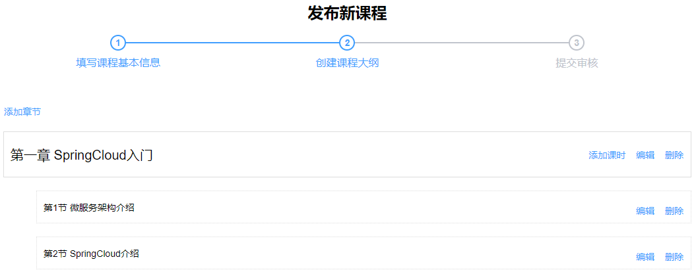
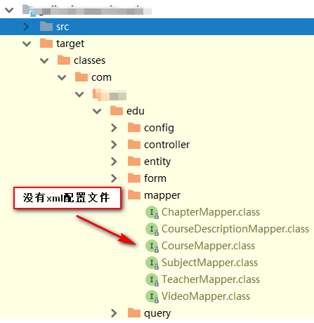
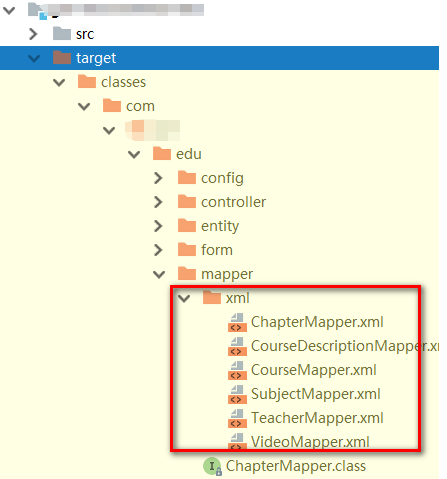

# 第八天【课程发布-课程大纲和课程发布】

# 一、课程大纲列表显示
## 需求分析


## <font style="color:rgb(0, 0, 0);">后端实现</font>
### 表结构介绍
章节、小节涉及到的表：edu_chapter、edu_video

### 生成相关代码
利用代码生成器生成 edu_chapter、edu_video 表的相关代码。

注意：

+ 修改主键生成策略
+ 添加自动填充日期的注解

### <font style="color:rgb(0, 0, 0);">定义 vo</font>
<font style="color:rgb(0, 0, 0);">ChapterVo</font>

```java
package com.xszx.edu.vo;

@ApiModel(value = "章节信息")
@Data
public class ChapterVo implements Serializable {

    private static final long serialVersionUID = 1L;

    private String id;
    private String title;
    private List<VideoVo> children = new ArrayList<>();
}
```

<font style="color:rgb(0, 0, 0);">VideoVo</font>

```java
package com.xszx.edu.vo;

@ApiModel(value = "课时信息")
@Data
public class VideoVo implements Serializable {

    private static final long serialVersionUID = 1L;

    private String id;
    private String title;
}
```

### <font style="color:rgb(0, 0, 0);">服务层</font>
<font style="color:rgb(0, 0, 0);">接口</font>

```java
package com.xszx.edu.service;

public interface ChapterService extends IService<Chapter> {

    List<ChapterVo> nestedList(String courseId);
}
```

<font style="color:rgb(0, 0, 0);">实现</font>

```java
package com.xszx.serviceedu.service.impl;

import com.baomidou.mybatisplus.core.conditions.query.QueryWrapper;
import com.xszx.serviceedu.entity.Chapter;
import com.xszx.serviceedu.entity.Video;
import com.xszx.serviceedu.entity.vo.ChapterVo;
import com.xszx.serviceedu.entity.vo.VideoVo;
import com.xszx.serviceedu.mapper.ChapterMapper;
import com.xszx.serviceedu.service.ChapterService;
import com.baomidou.mybatisplus.extension.service.impl.ServiceImpl;
import com.xszx.serviceedu.service.VideoService;
import org.springframework.beans.BeanUtils;
import org.springframework.beans.factory.annotation.Autowired;
import org.springframework.stereotype.Service;

import java.util.ArrayList;
import java.util.List;

/**
 * <p>
 * 课程 服务实现类
 * </p>
 *
 * @author lhp
 * @since 2024-07-17
 */
@Service
public class ChapterServiceImpl extends ServiceImpl<ChapterMapper, Chapter> implements ChapterService {

    @Autowired
    private VideoService videoService;

    @Override
    public List<ChapterVo> nestedList(String courseId) {
        List<ChapterVo> result = new ArrayList<>();

        // 1. 根据课程id查询所有的章节
        QueryWrapper<Chapter> wrapper1 = new QueryWrapper<>();
        wrapper1.eq("course_id", courseId);
        wrapper1.orderByAsc("sort", "id"); // 升序
        List<Chapter> chapterList = baseMapper.selectList(wrapper1);

        // 2. 根据课程id查询所有的小节
        QueryWrapper<Video> wrapper2 = new QueryWrapper<>();
        wrapper2.eq("course_id", courseId);
        wrapper2.orderByAsc("sort", "id");
        List<Video> videoList = videoService.list(wrapper2);

        // 3. 将章节和小节组装好
        for (Chapter chapter : chapterList) {
            ChapterVo chapterVo = new ChapterVo();
            BeanUtils.copyProperties(chapter, chapterVo);
            result.add(chapterVo);

            List<VideoVo> children = new ArrayList<>();

            for (Video video : videoList) {
                if(video.getChapterId().equals(chapter.getId())){
                    VideoVo videoVo = new VideoVo();
                    BeanUtils.copyProperties(video, videoVo);
                    children.add(videoVo);
                }
            }

            chapterVo.setChildren(children);
        }

        return result;
    }
}
```

### <font style="color:rgb(0, 0, 0);">web 层</font>
```java
package com.xszx.serviceedu.controller;


import com.xszx.commonutils.R;
import com.xszx.serviceedu.entity.vo.ChapterVo;
import com.xszx.serviceedu.service.ChapterService;
import io.swagger.annotations.Api;
import io.swagger.annotations.ApiOperation;
import io.swagger.annotations.ApiParam;
import org.springframework.beans.factory.annotation.Autowired;
import org.springframework.web.bind.annotation.*;

import java.util.List;

/**
 * <p>
 * 课程 前端控制器
 * </p>
 *
 * @author lhp
 * @since 2024-07-17
 */
@RestController
@RequestMapping("/serviceedu/chapter")
@CrossOrigin
@Api(tags = "章节管理")
public class ChapterController {

    @Autowired
    private ChapterService chapterService;

    @GetMapping("{courseId}")
    @ApiOperation("根据课程ID查询章节小节列表信息")
    public R nestedListByCourseId(@ApiParam(name = "courseId", value = "课程ID", required = true)
                                      @PathVariable String courseId){
        List<ChapterVo> list = chapterService.nestedList(courseId);
        return R.ok().data("items", list);
    }
}
```

### <font style="color:rgb(0, 0, 0);">Swagger 测试</font>
## <font style="color:rgb(0, 0, 0);">前端实现</font>
### <font style="color:rgb(0, 0, 0);">定义 api</font>
<font style="color:rgb(0, 0, 0);">chapter.js</font>

```javascript
import request from '@/utils/request'

const api_name = '/serviceedu/chapter'

export default {

  // 获取指定课程的大纲信息
  getNestedTreeList(courseId) {
    return request({
      url: `${api_name}/${courseId}`,
      method: 'get'
    })
  }
}
```

### <font style="color:rgb(0, 0, 0);">定义组件脚本</font>
<font style="color:rgb(0, 0, 0);">定义 data</font>

```json
courseId: '', // 所属课程
chapterNestedList: [] // 章节嵌套课时列表
```

<font style="color:rgb(0, 0, 0);">created 中调用 init 方法</font>

```javascript
created() {
    console.log('chapter created')
    this.init()
},
```

<font style="color:rgb(0, 0, 0);">定义相关 methods 获取章节和课时列表，记得需要在 chapter.vue 页面中导入 chapter.js 模块</font>

```javascript
init() {
  if (this.$route.params && this.$route.params.id) {
    this.courseId = this.$route.params.id
    // 根据id获取课程基本信息
    this.fetchChapterNestedListByCourseId()
  }
},

fetchChapterNestedListByCourseId() {
  chapter.getNestedTreeList(this.courseId).then(response => {
    this.chapterNestedList = response.data.items
  })
},
```

### <font style="color:rgb(0, 0, 0);">定义组件模板</font>
```html
<el-button type="text">添加章节</el-button>
<!-- 章节 -->
<ul class="chanpterList">
    <li
        v-for="chapter in chapterNestedList"
        :key="chapter.id">
        <p>
            {{ chapter.title }}

            <span class="acts">
                <el-button type="text">添加课时</el-button>
                <el-button style="" type="text">编辑</el-button>
                <el-button type="text">删除</el-button>
            </span>
        </p>

        <!-- 视频 -->
        <ul class="chanpterList videoList">
            <li
                v-for="video in chapter.children"
                :key="video.id">
                <p>{{ video.title }}
                    <span class="acts">
                        <el-button type="text">编辑</el-button>
                        <el-button type="text">删除</el-button>
                    </span>
                </p>
            </li>
        </ul>
    </li>
</ul>

<div>
    <el-button @click="previous">上一步</el-button>
    <el-button :disabled="saveBtnDisabled" type="primary" @click="next">下一步</el-button>
</div>
```

### <font style="color:rgb(0, 0, 0);">定义样式</font>
<font style="color:rgb(0, 0, 0);">将样式的定义放在页面的最后</font>

<font style="color:rgb(0, 0, 0);">scope 表示这里定义的样式只在当前页面范围内生效，不会污染到其他的页面</font>

```html
<style scoped>
.chanpterList{
    position: relative;
    list-style: none;
    margin: 0;
    padding: 0;
}

.chanpterList li{
  position: relative;
}

.chanpterList p{
  float: left;
  font-size: 20px;
  margin: 10px 0;
  padding: 10px;
  height: 70px;
  line-height: 50px;
  width: 100%;
  border: 1px solid #DDD;
}

.chanpterList .acts {
    float: right;
    font-size: 14px;
}

.videoList{
  padding-left: 50px;
}

.videoList p{
  float: left;
  font-size: 14px;
  margin: 10px 0;
  padding: 10px;
  height: 50px;
  line-height: 30px;
  width: 100%;
  border: 1px dotted #DDD;
}
</style>
```

# 二、章节管理后端接口开发
## <font style="color:rgb(0, 0, 0);">新增章节</font>
<font style="color:rgb(0, 0, 0);">web 层</font>

```java
@ApiOperation("新增章节")
@PostMapping
public R save(@ApiParam(name = "chapter", value = "章节对象", required = true)
                  @RequestBody Chapter chapter){
    chapterService.save(chapter);
    return R.ok().message("章节添加成功");
}
```

## <font style="color:rgb(0, 0, 0);">根据 id 查询</font>
<font style="color:rgb(0, 0, 0);">web 层</font>

```java
@ApiOperation(value = "根据ID查询章节")
@GetMapping("/getById/{id}")
public R getById(
    
    @ApiParam(name = "id", value = "章节ID", required = true)
    @PathVariable String id){

    Chapter chapter = chapterService.getById(id);
    return R.ok().data("item", chapter);
}
```

## <font style="color:rgb(0, 0, 0);">更新</font>
<font style="color:rgb(0, 0, 0);">web 层</font>

```java
@ApiOperation("修改章节信息")
@PutMapping("{id}")
public R updateById(@ApiParam(name = "id", value = "章节的ID", required = true)
                        @PathVariable String id,
                    @ApiParam(name = "chapter", value = "章节对象", required = true)
                    @RequestBody Chapter chapter){
    chapterService.updateById(chapter);
    return R.ok().message("章节修改成功");
}
```

## <font style="color:rgb(0, 0, 0);">删除</font>
### <font style="color:rgb(0, 0, 0);">web 层</font>
```java
@ApiOperation(value = "根据ID删除章节")
@DeleteMapping("{id}")
public R removeById(

    @ApiParam(name = "id", value = "章节ID", required = true)
    @PathVariable String id){

    boolean result = chapterService.removeChapterById(id);
    if(result){
        return R.ok();
    }else{
        return R.error().message("删除失败");
    }
}
```

### <font style="color:rgb(0, 0, 0);">Service</font>
<font style="color:rgb(0, 0, 0);">ChapterService 层：接口</font>

```java
Boolean removeChapterById(String id);
```

<font style="color:rgb(0, 0, 0);">ChapterService 层：实现</font>

```java
@Override
public Boolean removeChapterById(String id) {

    // 1. 根据该章节id，查询它是否有小节
    QueryWrapper<Video> wrapper = new QueryWrapper<>();
    wrapper.eq("chapter_id", id);
    List<Video> list = videoService.list(wrapper);

    // 2. 如果没有小节，直接删除章节
    if(list == null || list.size() == 0){
        int i = baseMapper.deleteById(id);
        return i > 0;
    }else{
        // 3. 如果有小节，不能删除，给与提示！
        throw new QinXueException(20001, "该章节下面有小节，请先删除小节！");
    }
}
```

## <font style="color:rgb(0, 0, 0);">Swagger 测试</font>
# 三、章节管理前端页面实现
## <font style="color:rgb(0, 0, 0);">定义 api</font>
```javascript
removeById(id) {
  return request({
    url: `${api_name}/${id}`,
    method: 'delete'
  })
},

save(chapter) {
  return request({
    url: api_name,
    method: 'post',
    data: chapter
  })
},

getById(id) {
  return request({
    url: `${api_name}/getById/${id}`,
    method: 'get'
  })
},

updateById(chapter) {
  return request({
    url: `${api_name}/${chapter.id}`,
    method: 'put',
    data: chapter
  })
}
```

## <font style="color:rgb(0, 0, 0);">新增章节页面功能</font>
### <font style="color:rgb(0, 0, 0);">定义 data 数据</font>
```javascript
dialogChapterFormVisible: false, //是否显示章节表单
chapter: {// 章节对象
  title: '',
  sort: 0
}
```

### <font style="color:rgb(0, 0, 0);">添加章节按钮</font>
```html
<el-button type="text" @click="dialogChapterFormVisible = true">添加章节</el-button>
```

### <font style="color:rgb(0, 0, 0);">章节表单 dialog</font>
```html
<!-- 添加和修改章节表单 -->
<el-dialog :visible.sync="dialogChapterFormVisible" title="添加章节">
    <el-form :model="chapter" label-width="120px">
        <el-form-item label="章节标题">
            <el-input v-model="chapter.title"/>
        </el-form-item>
        <el-form-item label="章节排序">
            <el-input-number v-model="chapter.sort" :min="0" controls-position="right"/>
        </el-form-item>
    </el-form>
    <div slot="footer" class="dialog-footer">
        <el-button @click="dialogChapterFormVisible = false">取 消</el-button>
        <el-button type="primary" @click="saveOrUpdate">确 定</el-button>
    </div>
</el-dialog>
```

### <font style="color:rgb(0, 0, 0);">添加章节 methods</font>
```javascript
saveOrUpdate() {
  this.saveBtnDisabled = true
  if (!this.chapter.id) {
    this.saveData()
  } else {
    this.updateData()
  }
},

saveData() {
  this.chapter.courseId = this.courseId
  chapter.save(this.chapter).then(response => {
    this.$message({
      type: 'success',
      message: '保存成功!'
    })
    this.helpSave()
  }).catch((response) => {
    this.$message({
      type: 'error',
      message: response.message
    })
  })
},

updateData() {

},
    
helpSave(){
  this.dialogChapterFormVisible = false// 如果保存成功则关闭对话框
  this.fetchChapterNestedListByCourseId()// 刷新列表
  this.chapter.title = ''// 重置章节标题
  this.chapter.sort = 0// 重置章节标题
  this.saveBtnDisabled = false
},
```

## <font style="color:rgb(0, 0, 0);">修改章节信息</font>
### <font style="color:rgb(0, 0, 0);">编辑章节按钮</font>
```html
<el-button type="text" @click="editChapter(chapter.id)">编辑</el-button>
```

### <font style="color:rgb(0, 0, 0);">定义编辑方法</font>
```javascript
editChapter(chapterId) {
    this.dialogChapterFormVisible = true
    chapter.getById(chapterId).then(response => {
        this.chapter = response.data.item
    })
},
```

### <font style="color:rgb(0, 0, 0);">定义更新方法</font>
```javascript
updateData() {
  chapter.updateById(this.chapter).then(response => {
    this.$message({
      type: 'success',
      message: '修改成功!'
    })
    this.helpSave()
  }).catch((response) => {
    // console.log(response)
    this.$message({
      type: 'error',
      message: response.message
    })
  })
},
```

## <font style="color:rgb(0, 0, 0);">删除章节</font>
### <font style="color:rgb(0, 0, 0);">按钮</font>
```html
<el-button type="text" @click="removeChapter(chapter.id)">删除</el-button>
```

### <font style="color:rgb(0, 0, 0);">定义删除方法</font>
```javascript
removeChapter(id){
  this.$confirm('确定要删除该章节吗？', '提示', {
    confirmButtonText: '确定',
    cancelButtonText: '取消',
    type: 'warning'
  }).then(() => {
    chapter.removeById(id).then(response => {
      this.$message({
        type: 'success',
        message: '删除成功!'
      });
    })
  })
}
```

# 四、课时管理后端开发
## <font style="color:rgb(0, 0, 0);">定义 Form 表单对象</font>
VideoInfoForm.java

```java
package com.xszx.serviceedu.entity.form;

import io.swagger.annotations.ApiModel;
import io.swagger.annotations.ApiModelProperty;
import lombok.Data;

@ApiModel(value = "课时基本信息", description = "编辑课时基本信息的表单对象")
@Data
public class VideoInfoForm {

    @ApiModelProperty(value = "视频ID")
    private String id;

    @ApiModelProperty(value = "节点名称")
    private String title;

    @ApiModelProperty(value = "课程ID")
    private String courseId;

    @ApiModelProperty(value = "章节ID")
    private String chapterId;

    @ApiModelProperty(value = "视频资源")
    private String videoSourceId;

    @ApiModelProperty(value = "显示排序")
    private Integer sort;

    @ApiModelProperty(value = "是否可以试听：0默认 1免费")
    private Boolean isFree;
}
```

## <font style="color:rgb(0, 0, 0);">课时保存</font>
### <font style="color:rgb(0, 0, 0);">web 层接口的定义</font>
<font style="color:rgb(0, 0, 0);">VideoController.java</font>

```java
package com.xszx.edu.controller.admin;

@Api(description="课时管理")
@CrossOrigin //跨域
@RestController
@RequestMapping("/admin/edu/video")
public class VideoAdminController {

    @Autowired
    private VideoService videoService;

    @ApiOperation(value = "新增课时")
    @PostMapping("save-video-info")
    public R save(
            @ApiParam(name = "videoForm", value = "课时对象", required = true)
            @RequestBody VideoInfoForm videoInfoForm){

        videoService.saveVideoInfo(videoInfoForm);
        return R.ok();
    }
}
```

### <font style="color:rgb(0, 0, 0);">业务层</font>
<font style="color:rgb(0, 0, 0);">VideoService.java</font>

```java
void saveVideoInfo(VideoInfoForm videoInfoForm);
```

<font style="color:rgb(0, 0, 0);">VideoServiceImpl.java</font>

```java
@Override
public void saveVideoInfo(VideoInfoForm videoInfoForm) {

    Video video = new Video();
    BeanUtils.copyProperties(videoInfoForm, video);
    boolean result = this.save(video);

    if(!result){
        throw new QinXueException(20001, "课时信息保存失败");
    }
}
```

## <font style="color:rgb(0, 0, 0);">课时的修改</font>
### <font style="color:rgb(0, 0, 0);">web 层接口的定义</font>
<font style="color:rgb(0, 0, 0);">VideoAdminController.java</font>

```java
@ApiOperation(value = "根据ID查询课时")
@GetMapping("video-info/{id}")
public R getVideInfoById(

    @ApiParam(name = "id", value = "课时ID", required = true)
    @PathVariable String id){

    VideoInfoForm videoInfoForm = videoService.getVideoInfoFormById(id);
    return R.ok().data("item", videoInfoForm);
}

@ApiOperation(value = "更新课时")
@PutMapping("update-video-info/{id}")
public R updateCourseInfoById(
    
    @ApiParam(name = "VideoInfoForm", value = "课时基本信息", required = true)
    @RequestBody VideoInfoForm videoInfoForm,

    @ApiParam(name = "id", value = "课时ID", required = true)
    @PathVariable String id){

    videoService.updateVideoInfoById(videoInfoForm);
    return R.ok();
}
```

### <font style="color:rgb(0, 0, 0);">业务层</font>
<font style="color:rgb(0, 0, 0);">VideoService.java</font>

```java
VideoInfoForm getVideoInfoFormById(String id);

void updateVideoInfoById(VideoInfoForm videoInfoForm);
```

<font style="color:rgb(0, 0, 0);">VideoServiceImpl.java</font>

```java
@Override
public VideoInfoForm getVideoInfoFormById(String id) {

    //从video表中取数据
    Video video = this.getById(id);
    if(video == null){
        throw new QinXueException(20001, "数据不存在");
    }

    //创建videoInfoForm对象
    VideoInfoForm videoInfoForm = new VideoInfoForm();
    BeanUtils.copyProperties(video, videoInfoForm);

    return videoInfoForm;
}

@Override
public void updateVideoInfoById(VideoInfoForm videoInfoForm) {
    //保存课时基本信息
    Video video = new Video();
    BeanUtils.copyProperties(videoInfoForm, video);
    boolean result = this.updateById(video);
    if(!result){
        throw new QinXueException(20001, "课时信息保存失败");
    }
}
```

## <font style="color:rgb(0, 0, 0);">课时的删除</font>
### <font style="color:rgb(0, 0, 0);">web 层接口的定义</font>
<font style="color:rgb(0, 0, 0);">VideoAdminController.java</font>

```java
@ApiOperation(value = "根据ID删除课时")
@DeleteMapping("{id}")
public R removeById(

    @ApiParam(name = "id", value = "课时ID", required = true)
    @PathVariable String id){

    boolean result = videoService.removeVideoById(id);
    if(result){
        return R.ok();
    }else{
        return R.error().message("删除失败");
    }
}
```

### <font style="color:rgb(0, 0, 0);">业务层</font>
<font style="color:rgb(0, 0, 0);">VideoService.java</font>

```java
boolean removeVideoById(String id);
```

<font style="color:rgb(0, 0, 0);">VideoServiceImpl.java</font>

```java
@Override
public boolean removeVideoById(String id) {

    //删除视频资源 TODO

    Integer result = baseMapper.deleteById(id);
    return null != result && result > 0;
}
```

# 五、课时管理前端开发
## <font style="color:rgb(0, 0, 0);">定义 api</font>
<font style="color:rgb(0, 0, 0);">创建 video.js</font>

<font style="color:rgb(0, 0, 0);">参考 course.js </font>

```javascript
import request from '@/utils/request'

const api_name = '/serviceedu/video'

export default {

  saveVideoInfo(videoInfo) {
    return request({
      url: `${api_name}`,
      method: 'post',
      data: videoInfo
    })
  },

  getVideoInfoById(id) {
    return request({
      url: `${api_name}/${id}`,
      method: 'get'
    })
  },

  updateVideoInfoById(videoInfo) {
    return request({
      url: `${api_name}/${videoInfo.id}`,
      method: 'put',
      data: videoInfo
    })
  },

  removeById(id) {
    return request({
      url: `${api_name}/${id}`,
      method: 'delete'
    })
  }
}
```

## <font style="color:rgb(0, 0, 0);">新增课时页面功能</font>
### <font style="color:rgb(0, 0, 0);">定义 data 数据</font>
```yaml
saveVideoBtnDisabled: false, // 课时按钮是否禁用
dialogVideoFormVisible: false, // 是否显示课时表单
chapterId: '', // 课时所在的章节id
video: {// 课时对象
  title: '',
  sort: 0,
  isFree: 0,
  videoSourceId: ''
},
```

### <font style="color:rgb(0, 0, 0);">添加课时按钮</font>
```html
<el-button type="text" @click="dialogVideoFormVisible = true; chapterId = chapter.id">添加课时</el-button>
```

### <font style="color:rgb(0, 0, 0);">课时表单 dialog</font>
```html
<!-- 添加和修改课时表单 -->
<el-dialog :visible.sync="dialogVideoFormVisible" title="添加课时">
  <el-form :model="video" label-width="120px">
    <el-form-item label="课时标题">
      <el-input v-model="video.title"/>
    </el-form-item>
    <el-form-item label="课时排序">
      <el-input-number v-model="video.sort" :min="0" controls-position="right"/>
    </el-form-item>

    <el-form-item label="是否免费">
      <el-radio-group v-model="video.isFree">
        <el-radio :label="true">免费</el-radio>
        <el-radio :label="false">默认</el-radio>
      </el-radio-group>
    </el-form-item>
    
    <el-form-item label="上传视频">
      <!-- TODO -->
    </el-form-item>
  </el-form>

  <div slot="footer" class="dialog-footer">
    <el-button @click="dialogVideoFormVisible = false">取 消</el-button>
    <el-button :disabled="saveVideoBtnDisabled" type="primary" @click="saveOrUpdateVideo">确 定</el-button>
  </div>
</el-dialog>
```

### <font style="color:rgb(0, 0, 0);">添加课时 methods</font>
<font style="color:rgb(0, 0, 0);">引入 video 模块</font>

```javascript
import video from '@/api/edu/video'
```

<font style="color:rgb(0, 0, 0);">方法的定义</font>

```javascript
saveOrUpdateVideo() {
  this.saveVideoBtnDisabled = true
  if (!this.video.id) {
    this.saveDataVideo()
  } else {
    this.updateDataVideo()
  }
},

saveDataVideo() {
  this.video.courseId = this.courseId
  this.video.chapterId = this.chapterId
  video.saveVideoInfo(this.video).then(response => {
    this.$message({
      type: 'success',
      message: '保存成功!'
    })
    this.helpSaveVideo()
  })
},

updateDataVideo() {

},

helpSaveVideo() {
  this.dialogVideoFormVisible = false// 如果保存成功则关闭对话框
  this.fetchChapterNestedListByCourseId()// 刷新列表
  this.video.title = ''// 重置章节标题
  this.video.sort = 0// 重置章节标题
  this.video.videoSourceId = ''// 重置视频资源id
  this.saveVideoBtnDisabled = false
},
```

## <font style="color:rgb(0, 0, 0);">修改课时信息</font>
### <font style="color:rgb(0, 0, 0);">编辑课时按钮</font>
```html
<el-button type="text" @click="editVideo(video.id)">编辑</el-button>
```

### <font style="color:rgb(0, 0, 0);">定义编辑方法</font>
```javascript
editVideo(videoId) {
  this.dialogVideoFormVisible = true
  video.getVideoInfoById(videoId).then(response => {
    this.video = response.data.item
  })
},
```

### <font style="color:rgb(0, 0, 0);">定义更新方法</font>
```javascript
updateDataVideo() {
  video.updateVideoInfoById(this.video).then(response => {
    this.$message({
      type: 'success',
      message: '修改成功!'
    })
    this.helpSaveVideo()
  })
},
```

## <font style="color:rgb(0, 0, 0);">删除课时</font>
### <font style="color:rgb(0, 0, 0);">按钮</font>
```html
<el-button type="text" @click="removeVideo(video.id)">删除</el-button>
```

### <font style="color:rgb(0, 0, 0);">定义删除方法</font>
```javascript
removeVideo(videoId) {
  this.$confirm('此操作将永久删除该记录, 是否继续?', '提示', {
    confirmButtonText: '确定',
    cancelButtonText: '取消',
    type: 'warning'
  }).then(() => {
    return video.removeById(videoId)
  }).then(() => {
    this.fetchChapterNestedListByCourseId()// 刷新列表
    this.$message({
      type: 'success',
      message: '删除成功!'
    })
  }).catch((response) => { // 失败
    if (response === 'cancel') {
      this.$message({
        type: 'info',
        message: '已取消删除'
      })
    }
  })
}
```

# 六、课程最终发布前端
## <font style="color:rgb(0, 0, 0);">前端代码</font>
### <font style="color:rgb(0, 0, 0);">定义 api</font>
<font style="color:rgb(0, 0, 0);">分析这个页面一共有两个远程方法：一个是根据课程 id 获取课程基本预览信息，第二个是发布课程</font>

```javascript
getCoursePublishInfoById(id) {
  return request({
    url: `${api_name}/course-publish-info/${id}`,
    method: 'get'
  })
},

publishCourse(id) {
  return request({
    url: `${api_name}/publish-course/${id}`,
    method: 'put'
  })
}
```

### <font style="color:rgb(0, 0, 0);">定义数据模型</font>
```javascript
data() {
    return {
        saveBtnDisabled: false, // 保存按钮是否禁用
        courseId: '', // 所属课程
        coursePublish: {}
    }
},
```

### <font style="color:rgb(0, 0, 0);">完善步骤导航</font>
<font style="color:rgb(0, 0, 0);">edu/course/chapter.vue</font>

```javascript
previous() {
  console.log('previous')
  this.$router.push({ path: '/edu/course/info/' + this.courseId })
},

next() {
  console.log('next')
  this.$router.push({ path: '/edu/course/publish/' + this.courseId })
}
```

<font style="color:rgb(0, 0, 0);">edu/course/pubish.vue</font>

```html
<div>
    <el-button @click="previous">返回修改</el-button>
    <el-button :disabled="saveBtnDisabled" type="primary" @click="publish">发布课程</el-button>
</div>
```

```javascript
previous() {
  console.log('previous')
  this.$router.push({ path: '/edu/course/chapter/' + this.courseId  })
},

publish() {
  console.log('publish')
  course.publishCourse(this.courseId).then(response => {
    this.$router.push({ path: '/edu/course/list' })
  })
}
```

### <font style="color:rgb(0, 0, 0);">组件方法定义</font>
<font style="color:rgb(0, 0, 0);">import</font>

```javascript
import course from '@/api/edu/course'
```

<font style="color:rgb(0, 0, 0);">created</font>

```javascript
created() {
    console.log('chapter created')
    this.init()
},
```

<font style="color:rgb(0, 0, 0);">获取数据的方法</font>

```javascript
init() {
  if (this.$route.params && this.$route.params.id) {
    this.courseId = this.$route.params.id
    // 根据id获取课程基本信息
    this.fetchCoursePublishInfoById()
  }
},

fetchCoursePublishInfoById() {
  course.getCoursePublishInfoById(this.courseId).then(response => {
    this.coursePublish = response.data.item
  })
},
```

### <font style="color:rgb(0, 0, 0);">组件模板</font>
```html
<template>

  <div class="app-container">

    <h2 style="text-align: center;">发布新课程</h2>

    <el-steps :active="3" process-status="wait" align-center style="margin-bottom: 40px;">
      <el-step title="填写课程基本信息"/>
      <el-step title="创建课程大纲"/>
      <el-step title="发布课程"/>
    </el-steps>

    <div class="ccInfo">
      
      <div class="main">
        <h2>{{ coursePublish.title }}</h2>
        <p class="gray"><span>共{{ coursePublish.lessonNum }}课时</span></p>
        <p><span>所属分类：{{ coursePublish.subjectLevelOne }} — {{ coursePublish.subjectLevelTwo }}</span></p>
        <p>课程讲师：{{ coursePublish.teacherName }}</p>
        <h3 class="red">￥{{ coursePublish.price }}</h3>
      </div>
    </div>

    <div>
      <el-button @click="previous">返回修改</el-button>
      <el-button :disabled="saveBtnDisabled" type="primary" @click="publish">发布课程</el-button>
    </div>
  </div>
</template>
```

### <font style="color:rgb(0, 0, 0);">css 样式</font>
```html
<style scoped>
.ccInfo {
    background: #f5f5f5;
    padding: 20px;
    overflow: hidden;
    border: 1px dashed #DDD;
    margin-bottom: 40px;
    position: relative;
}

.ccInfo img {
    background: #d6d6d6;
    width: 500px;
    height: 278px;
    display: block;
    float: left;
    border: none;
}

.ccInfo .main {
    margin-left: 520px;
}

.ccInfo .main h2 {
    font-size: 28px;
    margin-bottom: 30px;
    line-height: 1;
    font-weight: normal;
}

.ccInfo .main p {
    margin-bottom: 10px;
    word-wrap: break-word;
    line-height: 24px;
    max-height: 48px;
    overflow: hidden;
}

.ccInfo .main p {
    margin-bottom: 10px;
    word-wrap: break-word;
    line-height: 24px;
    max-height: 48px;
    overflow: hidden;
}

.ccInfo .main h3 {
    left: 540px;
    bottom: 20px;
    line-height: 1;
    font-size: 28px;
    color: #d32f24;
    font-weight: normal;
    position: absolute;
}
</style>
```

# 七、课程最终发布后端
## <font style="color:rgb(0, 0, 0);">根据 id 查询课程发布信息</font>
<font style="color:rgb(0, 0, 0);">方式一：业务层组装多个表多次的查询结果</font>

<font style="color:rgb(0, 0, 0);">方式二：数据访问层进行关联查询</font>

<font style="color:rgb(0, 0, 0);">我们使用第二种方式实现</font>

### <font style="color:rgb(0, 0, 0);">定义 vo</font>
```java
package com.xszx.edu.vo;

@ApiModel(value = "课程发布信息")
@Data
public class CoursePublishVo implements Serializable {

    private static final long serialVersionUID = 1L;

    private String title;
    private String cover;
    private Integer lessonNum;
    private String subjectLevelOne;
    private String subjectLevelTwo;
    private String teacherName;
    private String price;//只用于显示
}
```

### <font style="color:rgb(0, 0, 0);">数据访问层</font>
<font style="color:rgb(0, 0, 0);">接口：CourseMapper.java</font>

```java
package com.xszx.edu.mapper;

public interface CourseMapper extends BaseMapper<Course> {
    CoursePublishVo selectCoursePublishVoById(String id);
}
```

<font style="color:rgb(0, 0, 0);">实现：CourseMapper.xml</font>

```xml
<select id="getCoursePublishVoById" resultType="com.xszx.edu.vo.CoursePublishVo">
    SELECT
        c.title,
        c.cover,
        c.lesson_num AS lessonNum,
        CONVERT(c.price, DECIMAL(8,2)) AS price,
        s1.title AS subjectLevelOne,
        s2.title AS subjectLevelTwo,
        t.name AS teacherName
    FROM
        edu_course c
        LEFT JOIN edu_teacher t ON c.teacher_id = t.id
        LEFT JOIN edu_subject s1 ON c.subject_parent_id = s1.id
        LEFT JOIN edu_subject s2 ON c.subject_id = s2.id
    WHERE
        c.id = #{id}
</select>
```

### <font style="color:rgb(0, 0, 0);">业务层</font>
<font style="color:rgb(0, 0, 0);">接口：CourseService.java</font>

```java
CoursePublishVo getCoursePublishVoById(String id);
```

<font style="color:rgb(0, 0, 0);">实现：CourseServiceImpl.java</font>

```java
@Override
public CoursePublishVo getCoursePublishVoById(String id) {
    return baseMapper.getCoursePublishVoById(id);
}
```

### <font style="color:rgb(0, 0, 0);">web 层</font>
```java
@ApiOperation(value = "根据ID获取课程发布信息")
@GetMapping("course-publish-info/{id}")
public R getCoursePublishVoById(
    @ApiParam(name = "id", value = "课程ID", required = true)
    @PathVariable String id){

    CoursePublishVo courseInfoForm = courseService.getCoursePublishVoById(id);
    return R.ok().data("item", courseInfoForm);
}
```

### 测试
**<font style="color:rgb(0, 0, 0);">测试：报告异常</font>**

<font style="color:rgb(0, 0, 0);">AbstractHandlerExceptionResolver.java:194 |org.springframework.web.servlet.mvc.method.annotation.ExceptionHandlerExceptionResolver |Resolved exception caused by handler execution: org.apache.ibatis.binding.BindingException:</font><font style="color:rgb(255, 0, 0);background-color:rgb(255, 255, 0);"> Invalid bound statement (not found): com.qinxue.edu.mapper.CourseMapper.getCoursePublishVoById</font>

**<font style="color:rgb(0, 0, 0);">问题分析：</font>**

<font style="color:rgb(0, 0, 0);">dao 层编译后只有 class 文件，没有 mapper.xml，因为 maven 工程在默认情况下 src/main/java 目录下的所有资源文件是不发布到 target 目录下的，</font>



**<font style="color:rgb(0, 0, 0);">解决方案：</font>**

<font style="color:rgb(0, 0, 0);">1、在 qinxue_edu 的 pom 中配置如下节点</font>

```xml
<!-- 项目打包时会将java目录中的*.xml文件也进行打包 -->
<build>
    <resources>
        <resource>
            <directory>src/main/java</directory>
            <includes>
                <include>**/*.xml</include>
            </includes>
            <filtering>false</filtering>
        </resource>
    </resources>
</build>
```

<font style="color:rgb(0, 0, 0);">重新打包项目会发现 target 目录下出现了 xml 文件夹</font>



<font style="color:rgb(0, 0, 0);">2、在 SpringBoot 配置文件中添加配置</font>

```properties
#配置mapper xml文件的路径
mybatis-plus.mapper-locations=classpath:com/xszx/edu/mapper/xml/*.xml
```

## <font style="color:rgb(0, 0, 0);">根据 id 发布课程</font>
### <font style="color:rgb(0, 0, 0);">web 层</font>
```java
@ApiOperation(value = "根据id发布课程")
@PutMapping("publish-course/{id}")
public R publishCourseById(
    
    @ApiParam(name = "id", value = "课程ID", required = true)
    @PathVariable String id){

    courseService.publishCourseById(id);
    return R.ok();
}
```

### <font style="color:rgb(0, 0, 0);">service 层</font>
<font style="color:rgb(0, 0, 0);">接口</font>

```java
void publishCourseById(String id);
```

<font style="color:rgb(0, 0, 0);">实现</font>

```java
@Override
public boolean publishCourseById(String id) {
    Course course = new Course();
    course.setId(id);
    course.setStatus(Course.COURSE_NORMAL);
    Integer count = baseMapper.updateById(course);
    return null != count && count > 0;
}
```


> 更新: 2024-07-18 10:47:19  
> 原文: <https://www.yuque.com/u41736172/az9urv/qn5eo0i4i6dz3qzd>