# 第六天【整合阿里云OSS和Excel导入分类】

# 一、阿里云存储 OSS
## <font style="color:rgb(0, 0, 0);">对象存储 OSS</font>
<font style="color:rgb(0, 0, 0);">为了解决海量数据存储与弹性扩容，项目中我们采用云存储的解决方案 - 阿里云 OSS。 </font>

### <font style="color:rgb(0, 0, 0);">开通“对象存储OSS”服务</font>
1. <font style="color:rgb(0, 0, 0);">申请阿里云账号</font>
2. <font style="color:rgb(0, 0, 0);">实名认证</font>
3. <font style="color:rgb(0, 0, 0);">开通“对象存储OSS”服务</font>
4. <font style="color:rgb(0, 0, 0);">进入管理控制台</font>

**<font style="color:rgb(0, 0, 0);">大家使用支付宝扫码登录即可。</font>**

### <font style="color:rgb(0, 0, 0);">创建 Bucket</font>
<font style="color:rgb(0, 0, 0);">选择：标准存储、公共读</font>


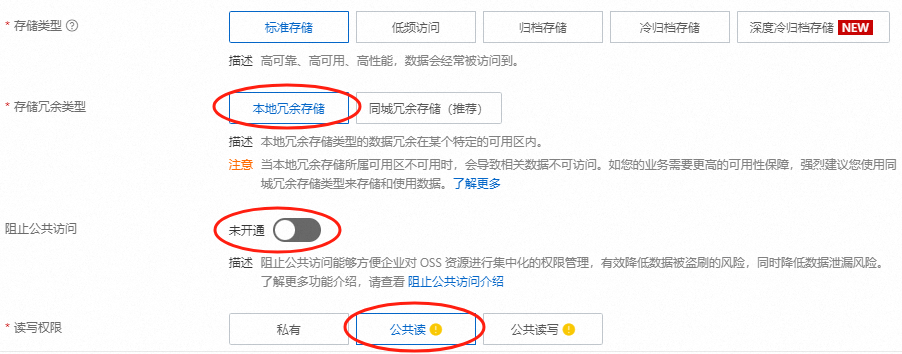


### <font style="color:rgb(0, 0, 0);">上传默认头像</font>
<font style="color:rgb(0, 0, 0);">创建文件夹 avatar，上传默认的用户头像。头像在今天的</font>**<font style="color:rgb(0, 0, 0);">软件文件夹</font>**<font style="color:rgb(0, 0, 0);">中有。</font>


### <font style="color:rgb(0, 0, 0);">创建 AccessKey</font>


## <font style="color:rgb(0, 0, 0);">使用 SDK</font>
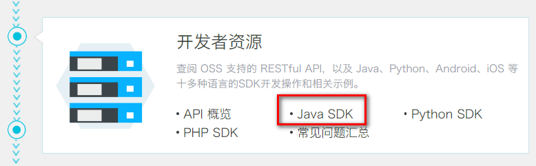

### <font style="color:rgb(0, 0, 0);">创建 Maven 项目</font>
<font style="color:rgb(0, 0, 0);">com.xszx</font>

<font style="color:rgb(0, 0, 0);">aliyun-oss</font>

### <font style="color:rgb(0, 0, 0);">添加依赖</font>
```xml
<dependencies>
    <!--aliyunOSS-->
    <dependency>
        <groupId>com.aliyun.oss</groupId>
        <artifactId>aliyun-sdk-oss</artifactId>
        <version>2.8.3</version>
    </dependency>

    <dependency>
        <groupId>junit</groupId>
        <artifactId>junit</artifactId>
        <version>4.12</version>
    </dependency>
</dependencies>
```

### <font style="color:rgb(0, 0, 0);">找到编码时需要用到的常量值</font>
+ <font style="color:rgb(0, 0, 0);">endpoint，比如：</font><font style="color:rgb(51, 51, 51);">oss-cn-beijing.aliyuncs.com</font>
+ <font style="color:rgb(0, 0, 0);">bucketName，比如：qinxue-test</font>
+ <font style="color:rgb(0, 0, 0);">accessKeyId，比如：xxxx</font>
+ <font style="color:rgb(0, 0, 0);">accessKeySecret，比如：xxxxx</font>

### <font style="color:rgb(0, 0, 0);">测试创建 Bucket 的连接</font>
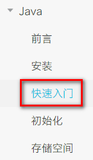

```java
package com.xszx.oss;

public class OSSTest {

    // Endpoint以杭州为例，其它Region请按实际情况填写。
    String endpoint = "your endpoint";
    // 阿里云主账号AccessKey拥有所有API的访问权限，风险很高。强烈建议您创建并使用RAM账号进行API访问或日常运维，请登录 https://ram.console.aliyun.com 创建RAM账号。
    String accessKeyId = "your accessKeyId";
    String accessKeySecret = "your accessKeySecret";
    String bucketName = "qinxue-test";

    @Test
    public void testCreateBucket() {

        // 创建OSSClient实例。
        OSSClient ossClient = new OSSClient(endpoint, accessKeyId, accessKeySecret);

        // 创建存储空间。
        ossClient.createBucket(bucketName);

        // 关闭OSSClient。
        ossClient.shutdown();
    }
}
```

### <font style="color:rgb(0, 0, 0);">判断存储空间是否存在</font>
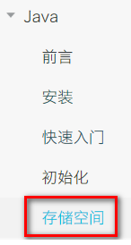

```java
@Test
public void testExist() {
    
    // 创建OSSClient实例。
    OSSClient ossClient = new OSSClient(endpoint, accessKeyId, accessKeySecret);

    boolean exists = ossClient.doesBucketExist(bucketName);
    System.out.println(exists);

    // 关闭OSSClient。
    ossClient.shutdown();
}
```

### <font style="color:rgb(0, 0, 0);">设置存储空间的访问权限</font>
```java
@Test
public void testAccessControl() {

    // 创建OSSClient实例。
    OSSClient ossClient = new OSSClient(endpoint, accessKeyId, accessKeySecret);

    // 设置存储空间的访问权限为：公共读。
    ossClient.setBucketAcl(bucketName, CannedAccessControlList.PublicRead);

    // 关闭OSSClient。
    ossClient.shutdown();
}
```

# 二、后端集成 OSS
## <font style="color:rgb(0, 0, 0);">新建云存储微服务</font>
### <font style="color:rgb(0, 0, 0);">在 service 模块下创建子模块 service-oss</font>
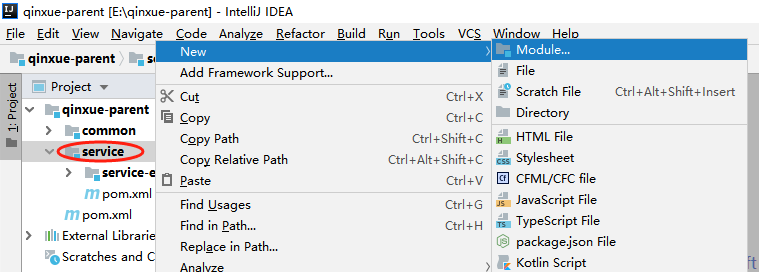

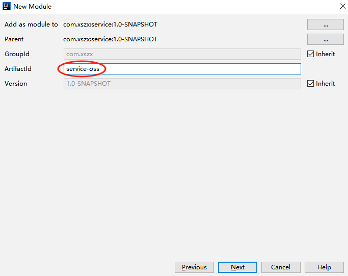

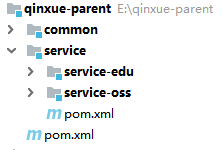

### 添加依赖
<font style="color:rgb(0, 0, 0);">service-oss 上级模块 service 已经引入 service 的公共依赖，所以 service-oss 模块只需引入阿里云 oss相关依赖即可，service 父模块已经引入了 service-base 模块，所以 Swagger 相关默认已经引入。</font>

```xml
<?xml version="1.0" encoding="UTF-8"?>
<project xmlns="http://maven.apache.org/POM/4.0.0"
         xmlns:xsi="http://www.w3.org/2001/XMLSchema-instance"
         xsi:schemaLocation="http://maven.apache.org/POM/4.0.0 http://maven.apache.org/xsd/maven-4.0.0.xsd">
    <parent>
        <artifactId>service</artifactId>
        <groupId>com.xszx</groupId>
        <version>1.0-SNAPSHOT</version>
    </parent>
    <modelVersion>4.0.0</modelVersion>

    <artifactId>service-oss</artifactId>

    <dependencies>
        <!-- 阿里云oss依赖 -->
        <dependency>
            <groupId>com.aliyun.oss</groupId>
            <artifactId>aliyun-sdk-oss</artifactId>
        </dependency>

        <!-- 日期工具栏依赖 -->
        <dependency>
            <groupId>joda-time</groupId>
            <artifactId>joda-time</artifactId>
        </dependency>
    </dependencies>
</project>
```

### <font style="color:rgb(0, 0, 0);">配置 application.properties</font>
```properties
#服务端口
server.port=8002
#服务名
spring.application.name=service-oss

#环境设置：dev、test、prod
spring.profiles.active=dev

#阿里云 OSS
#不同的服务器，地址不同
aliyun.oss.file.endpoint=your endpoint
aliyun.oss.file.keyid=your accessKeyId
aliyun.oss.file.keysecret=your accessKeySecret
#bucket可以在控制台创建，也可以使用java代码创建
aliyun.oss.file.bucketname=qinxue-test
aliyun.oss.file.filehost=avatar
```

### 编写日志配置文件
和 service-edu 模块的一样。logback-spring.xml

### <font style="color:rgb(0, 0, 0);">创建启动类</font>
<font style="color:rgb(0, 0, 0);">创建 OssApplication.java</font>

```java
package com.xszx.oss;

@SpringBootApplication
@ComponentScan({"com.xszx"})
public class OssApplication {

    public static void main(String[] args) {
        SpringApplication.run(OssApplication.class, args);
    }
}
```

### <font style="color:rgb(0, 0, 0);">启动项目</font>
启动项目会报错：

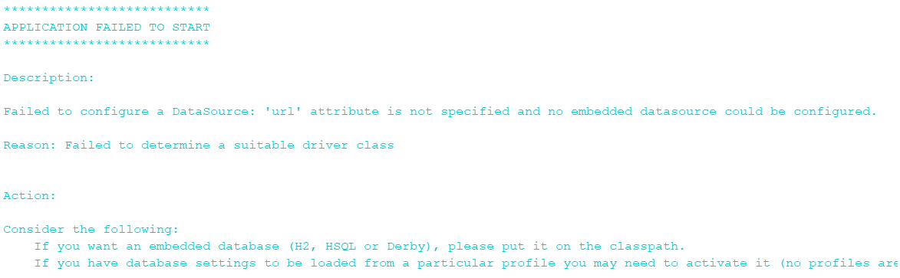

<font style="color:rgb(0, 0, 0);">SpringBoot 会默认加载org.springframework.boot.autoconfigure.jdbc.DataSourceAutoConfiguration 这个类，而DataSourceAutoConfiguration 类使用了 @Configuration 注解向 Spring 注入了 dataSource bean，又因为项目（oss模块）中并没有关于 dataSource 相关的配置信息，所以当 Spring 创建 dataSource bean 时因缺少相关的信息就会报错。</font>

**<font style="color:rgb(255, 0, 0);">解决办法：</font>**

<font style="color:rgb(0, 0, 0);">在 @SpringBootApplication 注解上加上 exclude，解除自动加载 DataSourceAutoConfiguration</font>

```java
@SpringBootApplication(exclude = DataSourceAutoConfiguration.class)
```

## <font style="color:rgb(0, 0, 0);">实现文件上传</font>
### <font style="color:rgb(0, 0, 0);">从配置文件读取常量</font>
<font style="color:rgb(255, 0, 0);">创建常量读取工具类：ConstantPropertiesUtil</font><font style="color:rgb(255, 0, 0);">.java</font>

<font style="color:rgb(0, 0, 0);">使用 @Value 读取 application.properties 里的配置内容</font>

<font style="color:rgb(0, 0, 0);">用 Spring 的 InitializingBean 的 afterPropertiesSet 来初始化配置信息，</font><font style="color:rgb(51, 51, 51);">这个方法将在</font><font style="color:rgb(255, 0, 0);">所有的属性被初始化后</font><font style="color:rgb(51, 51, 51);">调用。</font>

<font style="color:rgb(51, 51, 51);">在 service-oss 模块的 com.xszx.oss.utils 包中编写如下类：</font>

```java
/**
 * 常量类，读取配置文件application.properties中的配置
 */
@Component
//@PropertySource("classpath:application.properties")
public class ConstantPropertiesUtil implements InitializingBean {

    @Value("${aliyun.oss.file.endpoint}")
    private String endpoint;

    @Value("${aliyun.oss.file.keyid}")
    private String keyId;

    @Value("${aliyun.oss.file.keysecret}")
    private String keySecret;

    @Value("${aliyun.oss.file.filehost}")
    private String fileHost;

    @Value("${aliyun.oss.file.bucketname}")
    private String bucketName;

    public static String END_POINT;
    public static String ACCESS_KEY_ID;
    public static String ACCESS_KEY_SECRET;
    public static String BUCKET_NAME;
    public static String FILE_HOST ;

    @Override
    public void afterPropertiesSet() throws Exception {
        END_POINT = endpoint;
        ACCESS_KEY_ID = keyId;
        ACCESS_KEY_SECRET = keySecret;
        BUCKET_NAME = bucketName;
        FILE_HOST = fileHost;
    }
}
```

### <font style="color:rgb(0, 0, 0);">文件上传</font>
<font style="color:rgb(255, 0, 0);">创建 Service 接口：FileService.java</font>

```java
public interface FileService {

    /**
     * 文件上传至阿里云
     * @param file
     * @return
     */
    String upload(MultipartFile file);
}
```

<font style="color:rgb(255, 0, 0);">实现：FileServiceImpl.java</font>

<font style="color:rgb(0, 0, 0);">参考 SDK 中的：Java->上传文件->简单上传->流式上传->上传文件流</font>

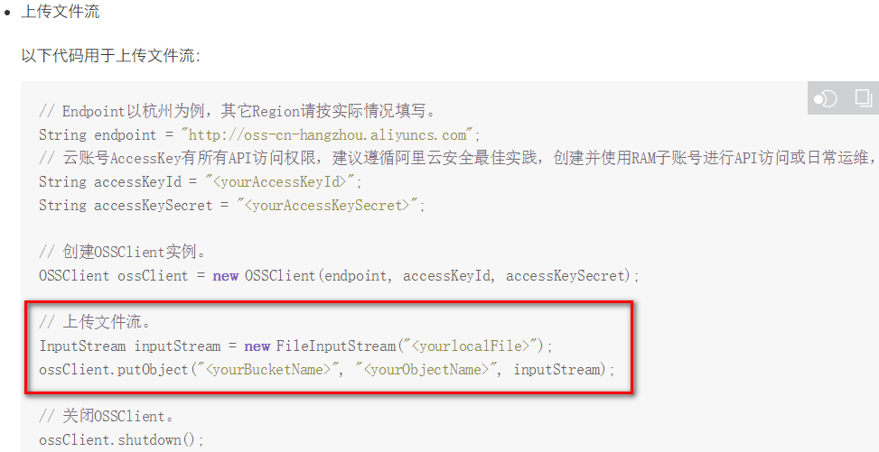

```java
package com.xszx.oss.service.impl;

import com.aliyun.oss.OSSClient;
import com.aliyun.oss.model.CannedAccessControlList;
import com.xszx.oss.service.FileService;
import com.xszx.oss.utils.ConstantPropertiesUtil;
import com.xszx.servicebase.exceptionhandler.QinXueException;
import org.joda.time.DateTime;
import org.springframework.stereotype.Service;
import org.springframework.web.multipart.MultipartFile;

import java.io.IOException;
import java.io.InputStream;
import java.util.UUID;

@Service
public class FileServiceImpl implements FileService {

    @Override
    public String upload(MultipartFile file) {
        //获取阿里云存储相关常量
        String endPoint = ConstantPropertiesUtil.END_POINT;
        String accessKeyId = ConstantPropertiesUtil.ACCESS_KEY_ID;
        String accessKeySecret = ConstantPropertiesUtil.ACCESS_KEY_SECRET;
        String bucketName = ConstantPropertiesUtil.BUCKET_NAME;
        String fileHost = ConstantPropertiesUtil.FILE_HOST;

        String uploadUrl = null;

        try {
            //判断oss实例是否存在：如果不存在则创建，如果存在则获取
            OSSClient ossClient = new OSSClient(endPoint, accessKeyId, accessKeySecret);
            if (!ossClient.doesBucketExist(bucketName)) {
                //创建bucket
                ossClient.createBucket(bucketName);
                //设置oss实例的访问权限：公共读
                ossClient.setBucketAcl(bucketName, CannedAccessControlList.PublicRead);
            }

            //获取上传文件流
            InputStream inputStream = file.getInputStream();

            //构建日期路径：avatar/2019/02/26/文件名
            String filePath = new DateTime().toString("yyyy/MM/dd");

            //文件名：uuid.扩展名
            String original = file.getOriginalFilename();
            String fileName = UUID.randomUUID().toString();
            String fileType = original.substring(original.lastIndexOf("."));
            String newName = fileName + fileType;
            String fileUrl = fileHost + "/" + filePath + "/" + newName;

            //文件上传至阿里云
            ossClient.putObject(bucketName, fileUrl, inputStream);

            // 关闭OSSClient。
            ossClient.shutdown();

            //获取url地址
            uploadUrl = "http://" + bucketName + "." + endPoint + "/" + fileUrl;
        } catch (IOException e) {
            e.printStackTrace();
            throw new QinXueException(20001, "上传文件错误！");
        }

        return uploadUrl;
    }
}
```

### <font style="color:rgb(0, 0, 0);">控制层</font>
<font style="color:rgb(255, 0, 0);">创建 controller：FileUploadController.java</font>

```java
package com.xszx.oss.controller;

import com.xszx.commonutils.R;
import com.xszx.oss.service.FileService;
import io.swagger.annotations.Api;
import io.swagger.annotations.ApiOperation;
import io.swagger.annotations.ApiParam;
import org.springframework.beans.factory.annotation.Autowired;
import org.springframework.web.bind.annotation.*;
import org.springframework.web.multipart.MultipartFile;

@RestController
@RequestMapping("/eduoss/file")
@CrossOrigin
@Api(tags = "阿里云文件管理")
public class FileController {

    @Autowired
    private FileService fileService;

    @ApiOperation("文件上传")
    @PostMapping("/upload")
    public R upload(@ApiParam(name = "file", value = "文件", required = true)
                                @RequestParam("file") MultipartFile file){
        String uploadUrl = fileService.upload(file);
        return R.ok().message("文件上传成功").data("url", uploadUrl);
    }
}
```

### <font style="color:rgb(0, 0, 0);">重启oss服务</font>
### <font style="color:rgb(0, 0, 0);">Swagger 中测试文件上传</font>
### <font style="color:rgb(0, 0, 0);">配置 nginx 反向代理</font>
<font style="color:rgb(0, 0, 0);">将接口地址加入 nginx 配置</font>

```latex
location ~ /eduoss/ {           
    proxy_pass http://localhost:8002;
}
```

# 三、前端整合上传组件
## <font style="color:rgb(0, 0, 0);">前端整合图片上传组件</font>
### <font style="color:rgb(0, 0, 0);">复制头像上传组件</font>
**<font style="color:rgb(0, 0, 0);">从 vue-element-admin 复制组件：</font>**

<font style="color:rgb(0, 0, 0);">vue-element-admin/src/components/ImageCropper</font>

<font style="color:rgb(0, 0, 0);">vue-element-admin/src/components/PanThumb</font>

### <font style="color:rgb(0, 0, 0);">前端参考实现</font>
<font style="color:rgb(0, 0, 0);">src/views/components-demo/avatarUpload.vue</font>

### <font style="color:rgb(0, 0, 0);">前端添加文件上传组件</font>
**<font style="color:rgb(0, 0, 0);">src/views/edu/teacher/form.vue</font>**

<font style="color:rgb(0, 0, 0);">template：</font>

```html
<!-- 讲师头像 -->
<el-form-item label="讲师头像">

    <!-- 头衔缩略图 -->
    <pan-thumb :image="teacher.avatar"/>
    <!-- 文件上传按钮 -->
    <el-button type="primary" icon="el-icon-upload" @click="imagecropperShow=true">更换头像
    </el-button>

    <!--
      v-show：是否显示上传组件
      :key：类似于id，如果一个页面多个图片上传控件，可以做区分
      :url：后台上传的url地址
      @close：关闭上传组件
      @crop-upload-success：上传成功后的回调 
    -->
    <image-cropper
                   v-show="imagecropperShow"
                   :width="300"
                   :height="300"
                   :key="imagecropperKey"
                   :url="BASE_API+'/eduoss/file/upload'"
                   field="file"
                   @close="close"
                   @crop-upload-success="cropSuccess"/>
</el-form-item>
```

<font style="color:rgb(0, 0, 0);">引入组件模块</font>

```latex
import ImageCropper from '@/components/ImageCropper'
import PanThumb from '@/components/PanThumb'
```

### <font style="color:rgb(0, 0, 0);">设置默认头像</font>
<font style="color:rgb(0, 0, 0);">config/dev.env.js 中添加阿里云 oss bucket 地址</font>

```latex
OSS_PATH: '"https://qinxue-test.oss-cn-beijing.aliyuncs.com"'
```

<font style="color:rgb(0, 0, 0);">组件中初始化头像默认地址</font>

```latex
const defaultForm = {
  ......,
  avatar: process.env.OSS_PATH + '/avatar/default.jpg'
}
```

### <font style="color:rgb(0, 0, 0);">js 脚本实现上传和图片回显</font>
```javascript
export default {
  components: { ImageCropper, PanThumb },
  data() {
    return {
      //其它数据模型
      ......,
        
      BASE_API: process.env.BASE_API, // 接口API地址
      imagecropperShow: false, // 是否显示上传组件
      imagecropperKey: 0 // 上传组件id
    }
  },
    
  ......,
    
  methods: {
    //其他函数
    ......,

    // 上传成功后的回调函数
    cropSuccess(data) {
      console.log(data)
      this.imagecropperShow = false
      this.teacher.avatar = data.url
      // 上传成功后，重新打开上传组件时初始化组件，否则显示上一次的上传结果
      this.imagecropperKey = this.imagecropperKey + 1
    },

    // 关闭上传组件
    close() {
      this.imagecropperShow = false
      // 上传失败后，重新打开上传组件时初始化组件，否则显示上一次的上传结果
      this.imagecropperKey = this.imagecropperKey + 1
    }
  }
}
```

## <font style="color:rgb(0, 0, 0);">测试文件上传</font>
<font style="color:rgb(0, 0, 0);">前后端联调</font>

1. 启动 Nginx 服务器
2. 启动后端项目的 edu 模块
3. 启动后端项目的 oss 模块
4. 启动前端项目

# <font style="color:rgb(0, 0, 0);">四、EasyExcel 介绍</font>
## <font style="color:rgb(0, 0, 0);">Excel 导入导出的应用场景</font>
<font style="color:rgb(0, 0, 0);">1、数据导入：减轻录入工作量</font>

<font style="color:rgb(0, 0, 0);">2、数据导出：统计信息归档</font>

<font style="color:rgb(0, 0, 0);">3、数据传输：系统之间数据传输</font>

## <font style="color:rgb(0, 0, 0);">EasyExcel 简介</font>
+ <font style="color:rgb(26, 26, 26);">Java 领域解析、生成 Excel 比较有名的框架有 Apache poi、jxl 等。但他们都存在一个严重的问题就是非常的耗内存。如果你的系统并发量不大的话可能还行，但是一旦并发上来后一定会 OOM 或者JVM 频繁的 full gc。 garbage collection</font>
+ <font style="color:rgb(26, 26, 26);">EasyExcel 是阿里巴巴开源的一个 excel 处理框架，</font>**<font style="color:rgb(26, 26, 26);">以使用简单、节省内存著称</font>**<font style="color:rgb(26, 26, 26);">。EasyExcel 能大大减少占用内存的主要原因是在解析 Excel 时没有将文件数据一次性全部加载到内存中，而是从磁盘上一行行读取数据，逐个解析。</font>
+ <font style="color:rgb(26, 26, 26);">EasyExcel 采用一行一行的解析模式，并将一行的解析结果以观察者的模式通知处理（AnalysisEventListener）。</font>
+ <font style="color:rgb(26, 26, 26);">官网：</font>[https://easyexcel.opensource.alibaba.com/docs/current/](https://easyexcel.opensource.alibaba.com/docs/current/)

# <font style="color:rgb(26, 26, 26);">五、Excel 写入数据</font>
## 需求说明
通过 EasyExcel 实现对 Excel 写入数据的操作。

## <font style="color:rgb(0, 0, 0);">创建一个 maven 项目</font>
<font style="color:rgb(0, 0, 0);">项目名：excel-easydemo</font>

## <font style="color:rgb(0, 0, 0);">引入相关依赖</font>
```xml
<dependencies>
    <!-- https://mvnrepository.com/artifact/com.alibaba/easyexcel -->
    <dependency>
        <groupId>com.alibaba</groupId>
        <artifactId>easyexcel</artifactId>
        <version>2.1.1</version>
    </dependency>

    <dependency>
        <groupId>org.projectlombok</groupId>
        <artifactId>lombok</artifactId>
        <version>1.18.26</version>
    </dependency>
</dependencies>
```

## <font style="color:rgb(0, 0, 0);">创建实体类</font>
<font style="color:rgb(0, 0, 0);">设置表头和添加的数据字段</font>

```java
package com.xszx.bean;

import com.alibaba.excel.annotation.ExcelProperty;
import lombok.AllArgsConstructor;
import lombok.Data;
import lombok.NoArgsConstructor;
import lombok.ToString;

@Data
@AllArgsConstructor
@NoArgsConstructor
@ToString
public class DemoData {

    //设置表头名称
    @ExcelProperty("学生编号")
    private int sno;

    //设置表头名称
    @ExcelProperty("学生姓名")
    private String sname;
}
```

## <font style="color:rgb(0, 0, 0);">实现写操作</font>
**<font style="color:rgb(0, 0, 0);">（1）创建方法循环设置要添加到 Excel 的数据</font>**

```java
//循环设置要添加的数据，最终封装到list集合中
private static List<DemoData> data(){
    List<DemoData> list = new ArrayList<>();
    for(int i = 1; i <= 10; i++){
        DemoData demoData = new DemoData(i, "张三" + i);
        list.add(demoData);
    }
    return list;
}
```

**<font style="color:rgb(0, 0, 0);">（2）实现最终的添加操作（写法一）</font>**

```java
public static void main(String[] args) {
    // 写法1
    String fileName = "E:/111.xlsx";
    // 这里 需要指定写用哪个class去写，然后写到第一个sheet，名字为模板 然后文件流会自动关闭
    // 如果这里想使用03 则 传入excelType参数即可
    EasyExcel.write(fileName, DemoData.class).sheet("写入方法一").doWrite(data());
}
```

**<font style="color:rgb(0, 0, 0);">（3）实现最终的添加操作（写法二）</font>**

```java
public static void main(String[] args) throws Exception {
    // 写法2，方法二需要手动关闭流
    String fileName = "F:\\112.xlsx";
    // 这里 需要指定写用哪个class去写
    ExcelWriter excelWriter = EasyExcel.write(fileName, DemoData.class).build();
    WriteSheet writeSheet = EasyExcel.writerSheet("写入方法二").build();
    excelWriter.write(data(), writeSheet);
    /// 千万别忘记finish 会帮忙关闭流
    excelWriter.finish();
}
```

# 六、Excel 读数据
## 需求说明
通过 EasyExcel 实现对 Excel 读的操作。

## <font style="color:rgb(0, 0, 0);">创建实体类</font>
```java
package com.xszx.bean;

import com.alibaba.excel.annotation.ExcelProperty;
import lombok.AllArgsConstructor;
import lombok.Data;
import lombok.NoArgsConstructor;
import lombok.ToString;

@Data
@AllArgsConstructor
@NoArgsConstructor
@ToString
public class ReadData {

    //设置列对应的属性
    @ExcelProperty(index = 0)
    private int sid;

    //设置列对应的属性
    @ExcelProperty(index = 1)
    private String sname;
}
```

## <font style="color:rgb(0, 0, 0);">创建读取操作的监听器</font>
```java
import com.alibaba.excel.context.AnalysisContext;
import com.alibaba.excel.event.AnalysisEventListener;
import com.alibaba.excel.exception.ExcelDataConvertException;
import com.sun.scenario.effect.impl.sw.sse.SSEBlend_SRC_OUTPeer;
import java.util.ArrayList;
import java.util.List;
import java.util.Map;

//创建读取excel监听器
public class ExcelListener extends AnalysisEventListener<ReadData> {

    //创建list集合封装最终的数据
    List<ReadData> list = new ArrayList<ReadData>();

    //一行一行去读取excle内容
    @Override
    public void invoke(ReadData user, AnalysisContext analysisContext) {
        System.out.println("***"+user);
        list.add(user);
    }

    //读取excel表头信息
    @Override
    public void invokeHeadMap(Map<Integer, String> headMap, AnalysisContext context) {
        System.out.println("表头信息："+headMap);
    }

    //读取完成后执行
    @Override
    public void doAfterAllAnalysed(AnalysisContext analysisContext) {
        
    }
}
```

## <font style="color:rgb(0, 0, 0);">调用实现最终的读取</font>
```java
public static void main(String[] args) throws Exception {

    // 写法1：
    String fileName = "F:\\01.xlsx";
    // 这里 需要指定读用哪个class去读，然后读取第一个sheet 文件流会自动关闭
    EasyExcel.read(fileName, ReadData.class, new ExcelListener()).sheet().doRead();

    // 写法2：
    InputStream in = new BufferedInputStream(new FileInputStream("F:\\01.xlsx"));
    ExcelReader excelReader = EasyExcel.read(in, ReadData.class, new ExcelListener()).build();
    ReadSheet readSheet = EasyExcel.readSheet(0).build();
    excelReader.read(readSheet);

    // 这里千万别忘记关闭，读的时候会创建临时文件，到时磁盘会崩的
    excelReader.finish();
}
```

# 七、前端页面的实现
## <font style="color:rgb(0, 0, 0);">Excel 模板</font>
### <font style="color:rgb(0, 0, 0);">编辑 Excel 模板</font>
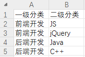

### <font style="color:rgb(0, 0, 0);">将模板文件上传至阿里云 OSS</font>
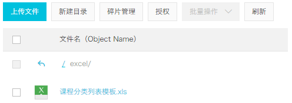

## <font style="color:rgb(0, 0, 0);">配置路由</font>
### <font style="color:rgb(0, 0, 0);">添加路由</font>
```javascript
// 课程分类管理
{
  path: '/edu/subject',
  component: Layout,
  redirect: '/edu/subject/list',
  name: 'Subject',
  meta: { title: '课程分类管理', icon: 'nested' },
  children: [
    {
      path: 'list',
      name: 'EduSubjectList',
      component: () => import('@/views/edu/subject/list'),
      meta: { title: '课程分类列表' }
    },
    {
      path: 'upload',
      name: 'EduSubjectImport',
      component: () => import('@/views/edu/subject/upload'),
      meta: { title: '导入课程分类' }
    }
  ]
},
```

### <font style="color:rgb(0, 0, 0);">添加 vue 组件</font>


## <font style="color:rgb(0, 0, 0);">表单组件 upload.vue</font>
### <font style="color:rgb(0, 0, 0);">js 定义数据</font>
```html
<script>
export default {

  data() {
    return {
      BASE_API: process.env.BASE_API, // 接口API地址
      OSS_PATH: process.env.OSS_PATH, // 阿里云OSS地址
      fileUploadBtnText: '上传到服务器', // 按钮文字
      importBtnDisabled: false, // 按钮是否禁用,
      loading: false
    }
  }
}
</script>
```

### <font style="color:rgb(0, 0, 0);">template</font>
```html
<template>
  <div class="app-container">
    <el-form label-width="120px">
      <el-form-item label="信息描述">
        <el-tag type="info">excel模版说明</el-tag>
        <el-tag>
          <i class="el-icon-download"/>
          <a :href="OSS_PATH + '/excel/%E8%AF%BE%E7%A8%8B%E5%88%86%E7%B1%BB%E5%88%97%E8%A1%A8%E6%A8%A1%E6%9D%BF.xlsx'">点击下载模版</a>
        </el-tag>

      </el-form-item>

      <el-form-item label="选择Excel">
        <el-upload
          ref="upload"
          :auto-upload="false"
          :on-success="fileUploadSuccess"
          :on-error="fileUploadError"
          :disabled="importBtnDisabled"
          :limit="1"
          :action="BASE_API+'/serviceedu/subject/addSubject'"
          name="file"
          accept="application/vnd.openxmlformats-officedocument.spreadsheetml.sheet">
          <el-button slot="trigger" size="small" type="primary">选取文件</el-button>
          <el-button
            :loading="loading"
            style="margin-left: 10px;"
            size="small"
            type="success"
            @click="submitUpload">{{ fileUploadBtnText }}</el-button>
        </el-upload>
      </el-form-item>
    </el-form>
  </div>
</template>
```

### <font style="color:rgb(0, 0, 0);">js 上传方法</font>
```javascript
methods: {
    submitUpload() {
      this.fileUploadBtnText = '正在上传'
      this.importBtnDisabled = true
      this.loading = true
      this.$refs.upload.submit()
    },

    fileUploadSuccess(response) {
      
    },

    fileUploadError(response) {
      
    }
}
```

### <font style="color:rgb(0, 0, 0);">回调函数</font>
```javascript
fileUploadSuccess(response) {
    if (response.success === true) {
      this.fileUploadBtnText = '导入成功'
      this.loading = false
      this.$message({
          type: 'success',
          message: response.message
      })
    } 
},

fileUploadError(response) {
    this.fileUploadBtnText = '导入失败'
    this.loading = false
    this.$message({
      type: 'error',
      message: '导入失败'
    })
}
```

# 八、课程分类管理接口
## <font style="color:rgb(0, 0, 0);">添加依赖</font>
### <font style="color:rgb(0, 0, 0);">service-edu 模块配置依赖</font>
```xml
<dependencies>
    <!-- https://mvnrepository.com/artifact/com.alibaba/easyexcel -->
    <dependency>
        <groupId>com.alibaba</groupId>
        <artifactId>easyexcel</artifactId>
        <version>2.1.1</version>
    </dependency>
</dependencies>
```

## <font style="color:rgb(0, 0, 0);">业务处理</font>
### 课程分类表介绍
课程分类对应的数据库表是：edu_subject

| 字段 | 说明 |
| --- | --- |
| id | 主键，课程类别ID |
| title | 类别名称 |
| parent_id | 父ID |
| sort | 排序字段 |
| gmt_create | 创建时间 |
| gmt_modified | 更新时间 |


### 生成代码
使用代码生成器，生成 edu_subject 表的代码。

注意，修改如下生成的内容：

1. 主键 id 的类型：@TableId(value = "id", type = IdType.<font style="background-color:#FBDE28;">ID_WORKER_STR</font>)
2. 创建日期和修改日期使用自动填充：@TableField(fill = FieldFill.INSERT)、@TableField(fill = FieldFill.INSERT_UPDATE)

### <font style="color:rgb(0, 0, 0);">SubjectController</font>
在 service-edu 模块中写下面的代码：

```java
package com.xszx.serviceedu.controller;


import com.xszx.commonutils.R;
import com.xszx.serviceedu.service.SubjectService;
import io.swagger.annotations.Api;
import io.swagger.annotations.ApiOperation;
import org.springframework.beans.factory.annotation.Autowired;
import org.springframework.web.bind.annotation.CrossOrigin;
import org.springframework.web.bind.annotation.PostMapping;
import org.springframework.web.bind.annotation.RequestMapping;

import org.springframework.web.bind.annotation.RestController;
import org.springframework.web.multipart.MultipartFile;

/**
 * <p>
 * 课程科目 前端控制器
 * </p>
 *
 * @author lhp
 * @since 2024-07-14
 */
@RestController
@RequestMapping("/serviceedu/subject")
@Api(description="课程分类管理")
@CrossOrigin //跨域
public class SubjectController {

    @Autowired
    private SubjectService subjectService;

    //添加课程分类
    @ApiOperation(value = "Excel批量导入")
    @PostMapping("addSubject")
    public R addSubject(MultipartFile file) {
        //1 获取上传的excel文件 MultipartFile
        //返回错误提示信息
        subjectService.batchImport(file,subjectService);
        return R.ok().message("导入成功");
    }
}
```

### <font style="color:rgb(0, 0, 0);">创建和 Excel 对应的实体类</font>
```java
package com.xszx.serviceedu.entity;

import com.alibaba.excel.annotation.ExcelProperty;
import lombok.Data;

@Data
public class ExcelSubjectData {

    @ExcelProperty(index = 0)
    private String oneSubjectName;

    @ExcelProperty(index = 1)
    private String twoSubjectName;
}
```

### <font style="color:rgb(0, 0, 0);">SubjectService</font>
**<font style="color:rgb(0, 0, 0);">（1）接口</font>**

```java
void batchImport(MultipartFile file, SubjectService subjectService);
```

**<font style="color:rgb(0, 0, 0);">（2）实现类</font>**

```java
package com.xszx.serviceedu.service.impl;

import com.alibaba.excel.EasyExcel;
import com.xszx.servicebase.exceptionhandler.QinXueException;
import com.xszx.serviceedu.entity.ExcelSubjectData;
import com.xszx.serviceedu.entity.Subject;
import com.xszx.serviceedu.mapper.SubjectMapper;
import com.xszx.serviceedu.service.SubjectService;
import com.baomidou.mybatisplus.extension.service.impl.ServiceImpl;
import org.springframework.stereotype.Service;
import org.springframework.web.multipart.MultipartFile;

import java.io.InputStream;

/**
 * <p>
 * 课程科目 服务实现类
 * </p>
 *
 * @author lhp
 * @since 2024-07-14
 */
@Service
public class SubjectServiceImpl extends ServiceImpl<SubjectMapper, Subject> implements SubjectService {

    //添加课程分类
    @Override
    public void batchImport(MultipartFile file,SubjectService subjectService) {
        try {
            //1 获取文件输入流
            InputStream inputStream = file.getInputStream();

            // 这里 需要指定读用哪个class去读，然后读取第一个sheet 文件流会自动关闭
            EasyExcel.read(inputStream, ExcelSubjectData.class, new SubjectExcelListener(subjectService)).sheet().doRead();
        }catch(Exception e) {
            e.printStackTrace();
            throw new QinXueException(20001,"添加课程分类失败");
        }
    }
}
```

### <font style="color:rgb(0, 0, 0);">创建读取 Excel 监听器</font>
```java
package com.xszx.serviceedu.listener;

import com.alibaba.excel.context.AnalysisContext;
import com.alibaba.excel.event.AnalysisEventListener;
import com.baomidou.mybatisplus.core.conditions.query.QueryWrapper;
import com.xszx.servicebase.exceptionhandler.QinXueException;
import com.xszx.serviceedu.entity.ExcelSubjectData;
import com.xszx.serviceedu.entity.Subject;
import com.xszx.serviceedu.service.SubjectService;

import java.util.Map;

public class SubjectExcelListener extends AnalysisEventListener<ExcelSubjectData> {

    public SubjectService subjectService;

    public SubjectExcelListener() {}

    //创建有参数构造，传递subjectService用于操作数据库
    public SubjectExcelListener(SubjectService subjectService) {
        this.subjectService = subjectService;
    }

    //一行一行去读取excle内容
    @Override
    public void invoke(ExcelSubjectData user, AnalysisContext analysisContext) {
        if(user == null) {
            throw new QinXueException(20001,"添加失败");
        }
        //添加一级分类
        Subject existOneSubject = this.existOneSubject(subjectService,user.getOneSubjectName());
        if(existOneSubject == null) {//没有相同的
            existOneSubject = new Subject();
            existOneSubject.setTitle(user.getOneSubjectName());
            existOneSubject.setParentId("0");
            subjectService.save(existOneSubject);
        }

        //获取一级分类id值
        String pid = existOneSubject.getId();

        //添加二级分类
        Subject existTwoSubject = this.existTwoSubject(subjectService,user.getTwoSubjectName(), pid);
        if(existTwoSubject == null) {
            existTwoSubject = new Subject();
            existTwoSubject.setTitle(user.getTwoSubjectName());
            existTwoSubject.setParentId(pid);
            subjectService.save(existTwoSubject);
        }
    }

    //读取excel表头信息
    @Override
    public void invokeHeadMap(Map<Integer, String> headMap, AnalysisContext context) {
        System.out.println("表头信息："+headMap);
    }

    //读取完成后执行
    @Override
    public void doAfterAllAnalysed(AnalysisContext analysisContext) {}

    //判断二级分类是否重复
    private Subject existTwoSubject(SubjectService subjectService,String name,String pid) {
        QueryWrapper<Subject> wrapper = new QueryWrapper<>();
        wrapper.eq("title",name);
        wrapper.eq("parent_id",pid);
        Subject subject = subjectService.getOne(wrapper);
        return subject;
    }

    //判断一级分类是否重复
    private Subject existOneSubject(SubjectService subjectService, String name) {
        QueryWrapper<Subject> wrapper = new QueryWrapper<>();
        wrapper.eq("title",name);
        wrapper.eq("parent_id","0");
        Subject subject = subjectService.getOne(wrapper);
        return subject;
    }
}
```

### 联调测试课程分类信息上传功能
前后端联调测试课程分类信息上传功能。

# 九、课程分类列表展示
## <font style="color:rgb(0, 0, 0);">前端实现</font>
### <font style="color:rgb(0, 0, 0);">参考 views/tree/index.vue</font>
通过分析 tree/index.vue，了解到：

+ 前端将数据展示为树形结构，需要数据是：

```json
[
  {
    id:1, 
    label: '后端开发', 
    children: [
      {id: 11, lable: 'Java语言'},
      {id: 12, lable: 'go语言'},
    ]
  },
  {
    id:2, 
    label: '前端开发',
    children: [
       {id: 21, lable: 'Vue'},
       {id: 22, lable: 'jQuery'},
    ]
  },
  {id:3, label: '数据库'}
]
```

+ 属性结构也可以是别的属性名，比如是 id、title、children，如果是别的名字需要在前端指定一下对应关系
+ 所以，我们做后端的时候，应该给前端响应上面结构的数据，响应回来所有的一级分类以及每个一级分类下的二级分类

### <font style="color:rgb(0, 0, 0);">创建 api</font>
<font style="color:rgb(0, 0, 0);">api/edu/subject.js</font>

```javascript
import request from '@/utils/request'

const api_name = '/serviceedu/subject'

export default {

  getNestedTreeList() {
    return request({
      url: `${api_name}`,
      method: 'get'
    })
  }
}
```

### <font style="color:rgb(0, 0, 0);">list.vue</font>
```html
<template>
  <div class="app-container">
    <el-input v-model="filterText" placeholder="Filter keyword" style="margin-bottom:30px;" />

    <el-tree
      ref="subjectTree"
      :data="subjectList"
      :props="defaultProps"
      :filter-node-method="filterNode"
      class="filter-tree"
      default-expand-all
    />

  </div>
</template>

<script>
import subject from '@/api/edu/subject'
export default {

  data() {
    return {
      filterText: '',
      subjectList: [],
      defaultProps: {
        children: 'children',
        label: 'title'
      }
    }
  },

  watch: {
    filterText(val) {
      this.$refs.subjectTree.filter(val)
    }
  },

  created() {
    this.fetchNodeList()
  },

  methods: {
    fetchNodeList() {
      subject.getNestedTreeList().then(response => {
        if (response.success === true) {
          this.subjectList = response.data.items
        }
      })
    },
    
    filterNode(value, data) {
      if (!value) return true
      return data.title.indexOf(value) !== -1
    }
  }
}
</script>
```

## <font style="color:rgb(0, 0, 0);">后端实现</font>
### <font style="color:rgb(0, 0, 0);">创建 vo</font>
```java
package com.xszx.edu.vo;

@Data
public class SubjectVo { // 二级分类

    private String id;
    private String title;
}
```

```java
package com.xszx.edu.vo;

@Data
public class SubjectNestedVo { // nested：嵌套，一级分类

    private String id;
    private String title;
    private List<SubjectVo> children = new ArrayList<>();
}
```

### <font style="color:rgb(0, 0, 0);">创建 controller</font>
```java
@ApiOperation(value = "嵌套数据列表")
@GetMapping
public R nestedList(){

    List<SubjectNestedVo> subjectNestedVoList = subjectService.nestedList();
    return R.ok().data("items", subjectNestedVoList);
}
```

### <font style="color:rgb(0, 0, 0);">创建 service</font>
<font style="color:rgb(0, 0, 0);">接口</font>

```java
List<SubjectNestedVo> nestedList();
```

<font style="color:rgb(0, 0, 0);">实现</font>

```java
@Override
public List<SubjectNestedVo> nestedList() {

    //最终要的到的数据列表
    ArrayList<SubjectNestedVo> subjectNestedVoArrayList = new ArrayList<>();

    //获取一级分类数据记录
    QueryWrapper<Subject> queryWrapper = new QueryWrapper<>();
    queryWrapper.eq("parent_id", 0);
    queryWrapper.orderByAsc("sort", "id");
    List<Subject> subjects = baseMapper.selectList(queryWrapper);

    //获取二级分类数据记录
    QueryWrapper<Subject> queryWrapper2 = new QueryWrapper<>();
    queryWrapper2.ne("parent_id", 0);
    queryWrapper2.orderByAsc("sort", "id");
    List<Subject> subSubjects = baseMapper.selectList(queryWrapper2);

    //填充一级分类vo数据
    int count = subjects.size();
    for (int i = 0; i < count; i++) {
        Subject subject = subjects.get(i);

        //创建一级类别vo对象
        SubjectNestedVo subjectNestedVo = new SubjectNestedVo();
        BeanUtils.copyProperties(subject, subjectNestedVo);
        subjectNestedVoArrayList.add(subjectNestedVo);

        //填充二级分类vo数据
        ArrayList<SubjectVo> subjectVoArrayList = new ArrayList<>();
        int count2 = subSubjects.size();
        for (int j = 0; j < count2; j++) {

            Subject subSubject = subSubjects.get(j);
            if(subject.getId().equals(subSubject.getParentId())){

                //创建二级类别vo对象
                SubjectVo subjectVo = new SubjectVo();
                BeanUtils.copyProperties(subSubject, subjectVo);
                subjectVoArrayList.add(subjectVo);
            }
        }
        subjectNestedVo.setChildren(subjectVoArrayList);
    }

    return subjectNestedVoArrayList;
}
```

## <font style="color:rgb(0, 0, 0);">优化前端过滤功能</font>
```javascript
filterNode(value, data) {
    if (!value) return true
    return data.title.toLowerCase().indexOf(value.toLowerCase()) !== -1
}
```


> 更新: 2024-07-16 10:07:18  
> 原文: <https://www.yuque.com/u41736172/az9urv/bg1uth0iefne3g7u>