# 第十一天【首页数据显示和添加Redis缓存】

# 一、今日内容
1. 搭建项目前端环境（NUXT）
    1. 服务端渲染技术 NUXT-初始化 NUXT
    2. 首页静态效果整合和 NUXT 路由
    3. 名师页面静态效果整合
    4. 课程页面静态效果整合
2. 首页显示数据【前后端实现】
    1. 首页显示 banner 数据【后端】
    2. 首页显示课程名师数据【后端】
    3. 首页显示 banner 和课程名师数据【前端】
3. 首页显示数据添加 Redis 缓存
    1. 首页数据添加 Redis 缓存

# 二、服务端渲染技术 NUXT-初始化 NUXT
## <font style="color:rgb(0, 0, 0);">服务端渲染技术 NUXT</font>
### <font style="color:rgb(0, 0, 0);">什么是服务端渲染</font>
<font style="color:rgb(51, 51, 51);">服务端渲染又称SSR (Server Side Render)是在服务端完成页面的内容，而不是在客户端通过 AJAX 获取数据。</font>

<font style="color:rgb(51, 51, 51);">服务器端渲染(SSR)的优势主要在于：</font>**<font style="color:rgb(51, 51, 51);">更好的 SEO</font>**<font style="color:rgb(51, 51, 51);">，由于搜索引擎爬虫抓取工具可以直接查看完全渲染的页面。</font>

<font style="color:rgb(51, 51, 51);">如果你的应用程序初始展示 loading 菊花图，然后通过 Ajax 获取内容，抓取工具并不会等待异步完成后再进行页面内容的抓取。也就是说，如果 SEO 对你的站点至关重要，而你的页面又是异步获取内容，则你可能需要服务器端渲染(SSR)解决此问题。</font>

<font style="color:rgb(51, 51, 51);">另外，使用服务器端渲染，我们可以获得更快的内容到达时间(time-to-content)，无需等待所有的 JavaScript 都完成下载并执行，产生更好的用户体验，对于那些「内容到达时间(time-to-content)与转化率直接相关」的应用程序而言，服务器端渲染(SSR)至关重要。</font>

### <font style="color:rgb(0, 0, 0);">什么是 NUXT</font>
<font style="color:rgb(51, 51, 51);">Nuxt.js 是一个基于 Vue.js 的轻量级应用框架,可用来创建服务端渲染 (SSR) 应用,也可充当静态站点引擎生成静态站点应用,具有优雅的代码结构分层和热加载等特性。</font>

<font style="color:rgb(51, 51, 51);">官网网站：</font>[<font style="color:rgb(65, 131, 196);">https://zh.nuxtjs.org/</font>](https://zh.nuxtjs.org/)

## <font style="color:rgb(51, 51, 51);">NUXT 环境初始化</font>
### <font style="color:rgb(51, 51, 51);">下载压缩包</font>
[https://github.com/nuxt-community/starter-template/archive/master.zip](https://github.com/nuxt-community/starter-template/archive/master.zip)

### <font style="color:rgb(51, 51, 51);">解压</font>
<font style="color:rgb(51, 51, 51);">将 template 中的内容复制到 </font><font style="color:rgb(255, 0, 0);">qinxue-front</font>

### <font style="color:rgb(0, 0, 0);">安装 ESLint</font>
<font style="color:rgb(0, 0, 0);">将 qinxue-admin 项目下的 .eslintrc.js 配置文件复制到当前项目下</font>

### <font style="color:rgb(51, 51, 51);">修改 package.json</font>
<font style="color:rgb(51, 51, 51);">name、description、author（必须修改这里，否则项目无法安装）</font>

```json
 "name": "qinxue",
 "version": "1.0.0",
 "description": "勤学网前台网站",
 "author": "lhp <523635392@qq.com>",
```

### <font style="color:rgb(51, 51, 51);">修改 nuxt.config.js</font>
<font style="color:rgb(51, 51, 51);">修改 title: '{{ name }}'、content: '{{escape description }}'</font>

<font style="color:rgb(51, 51, 51);">这里的设置最后会显示在页面标题栏和 meta 数据中</font>

```json
head: {
    title: '勤学网 - Java视频|HTML5视频|前端视频|Python视频|大数据视频-自学拿1万+月薪的IT在线视频课程，老粉力挺，老学员为你推荐',
    meta: [
      { charset: 'utf-8' },
      { name: 'viewport', content: 'width=device-width, initial-scale=1' },
      { hid: 'keywords', name: 'keywords', content: '勤学网,IT在线视频教程,Java视频,HTML5视频,前端视频,Python视频,大数据视频' },
      { hid: 'description', name: 'description', content: '勤学网是国内领先的IT在线视频学习平台、职业教育平台。截止目前,勤学网线上、线下学习人次数以万计！会同上百个知名开发团队联合制定的Java、HTML5前端、大数据、Python等视频课程，被广大学习者及IT工程师誉为：业界最适合自学、代码量最大、案例最多、实战性最强、技术最前沿的IT系列视频课程！' }
    ],
    link: [
      { rel: 'icon', type: 'image/x-icon', href: '/favicon.ico' }
    ]
},
```

**添加如下内容：**

options: {fix: true}

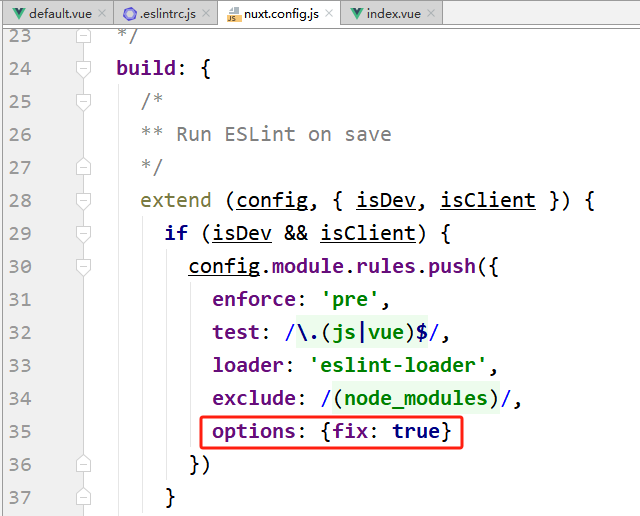

### <font style="color:rgb(0, 0, 0);">在命令提示终端中进入项目目录</font>
### <font style="color:rgb(0, 0, 0);">安装依赖</font>
```shell
npm install
```

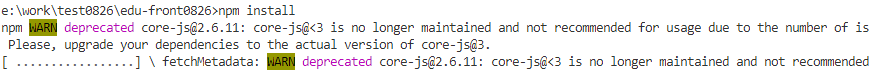

### <font style="color:rgb(0, 0, 0);">测试运行</font>
```shell
npm run dev
```

### <font style="color:rgb(51, 51, 51);">NUXT 目录结构</font>
1. <font style="color:rgb(51, 51, 51);">资源目录 assets</font>

<font style="color:rgb(51, 51, 51);">用于组织未编译的静态资源如 LESS、SASS 或 JavaScript。</font>

2. <font style="color:rgb(51, 51, 51);">组件目录 components</font>

<font style="color:rgb(51, 51, 51);">用于组织应用的 Vue.js 组件。Nuxt.js 不会扩展增强该目录下 Vue.js 组件，即这些组件不会像页面组件那样有 asyncData 方法的特性。</font>

3. <font style="color:rgb(51, 51, 51);">布局目录 layouts</font>

<font style="color:rgb(51, 51, 51);">用于组织应用的布局组件。</font>

4. <font style="color:rgb(51, 51, 51);">页面目录 pages</font>

<font style="color:rgb(51, 51, 51);">用于组织应用的路由及视图。Nuxt.js 框架读取该目录下所有的 .vue 文件并自动生成对应的路由配置。</font>

5. <font style="color:rgb(51, 51, 51);">插件目录 plugins</font>

<font style="color:rgb(51, 51, 51);">用于组织那些需要在根 vue.js 应用 实例化之前需要运行的 Javascript 插件。</font>

6. <font style="color:rgb(51, 51, 51);">nuxt.config.js 文件</font>

<font style="color:rgb(51, 51, 51);">nuxt.config.js 文件用于组织 Nuxt.js 应用的个性化配置，以便覆盖默认配置。</font>

## <font style="color:rgb(0, 0, 0);">幻灯片插件</font>
### <font style="color:rgb(0, 0, 0);">安装插件</font>
目前我们不需要安装了，**给大家发送的前端项目中已经有了**！

```shell
npm install vue-awesome-swiper
```

### <font style="color:rgb(0, 0, 0);">配置插件</font>
<font style="color:rgb(0, 0, 0);">在 plugins 文件夹下新建文件 nuxt-swiper-plugin.js，内容是</font>

```javascript
import Vue from 'vue'
import VueAwesomeSwiper from 'vue-awesome-swiper/dist/ssr'

Vue.use(VueAwesomeSwiper)
```

<font style="color:rgb(0, 0, 0);">关闭 IDEA 中的 Eslint，不然 IDEA 提示有些语法错误！</font>

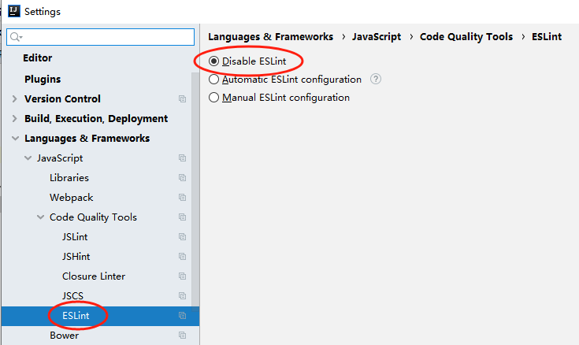

<font style="color:rgb(0, 0, 0);">在 nuxt.config.js 文件中配置插件</font>

<font style="color:rgb(0, 0, 0);">将 plugins 和 css 节点 复制到 module.exports 节点下</font>

```javascript
module.exports = {
  // some nuxt config...
  plugins: [
    { src: '~/plugins/nuxt-swiper-plugin.js', ssr: false }
  ],

  css: [
    'swiper/dist/css/swiper.css'
  ]
}
```

# 三、首页静态效果整合和 NUXT 路由
## <font style="color:rgb(0, 0, 0);">页面布局</font>
### <font style="color:rgb(0, 0, 0);">复制静态资源</font>
<font style="color:rgb(51, 51, 51);">将静态原型中的 css、img、js、photo 目录拷贝至 assets 目录下 </font>

<font style="color:#333333;">将 favicon.ico 复制到 static 目录下</font>

### <font style="color:rgb(0, 0, 0);">定义布局</font>
<font style="color:rgb(51, 51, 51);">我们可以把页头和页尾提取出来，形成布局页</font>

<font style="color:rgb(255, 0, 0);">修改 layouts 目录下 default.vue，</font><font style="color:rgb(51, 51, 51);">从静态页面中复制首页，修改了原始文件中的资源路径为 ~/assets/，将主内容区域的内容替换成 <nuxt /></font>

<font style="color:rgb(51, 51, 51);">内容如下：</font>

```html
<template>
  <div>
    <!-- 页头部分 -->
      
    <!-- 内容的区域 -->
    <nuxt/>
      
    <!-- 页尾部分 -->
  </div>
</template>
```

<font style="color:rgb(0, 0, 0);">完整的内容如下</font>

```html
<template>
  <div class="in-wrap">
    <!-- 公共头引入 -->
    <header id="header">
      <section class="container">
        <h1 id="logo">
          <a href="#" title="勤学网">
            
          </a>
        </h1>
        <div class="h-r-nsl">
          <ul class="nav">
            <router-link to="/" tag="li" active-class="current" exact>
              <a>首页</a>
            </router-link>
            <router-link to="/course" tag="li" active-class="current">
              <a>课程</a>
            </router-link>
            <router-link to="/teacher" tag="li" active-class="current">
              <a>名师</a>
            </router-link>
            <router-link to="/article" tag="li" active-class="current">
              <a>文章</a>
            </router-link>
            <router-link to="/qa" tag="li" active-class="current">
              <a>问答</a>
            </router-link>
          </ul>
          <!-- / nav -->
          <ul class="h-r-login">
            <li id="no-login">
              <a href="/sing_in" title="登录">
                <em class="icon18 login-icon">&nbsp;</em>
                <span class="vam ml5">登录</span>
              </a>
              |
              <a href="/sign_up" title="注册">
                <span class="vam ml5">注册</span>
              </a>
            </li>
            <li class="mr10 undis" id="is-login-one">
              <a href="#" title="消息" id="headerMsgCountId">
                <em class="icon18 news-icon">&nbsp;</em>
              </a>
              <q class="red-point" style="display: none">&nbsp;</q>
            </li>
            <li class="h-r-user undis" id="is-login-two">
              <a href="#" title>
                
                <span class="vam disIb" id="userName"></span>
              </a>
              <a href="javascript:void(0)" title="退出" onclick="exit();" class="ml5">退出</a>
            </li>
            <!-- /未登录显示第1 li；登录后显示第2，3 li -->
          </ul>
          <aside class="h-r-search">
            <form action="#" method="post">
              <label class="h-r-s-box">
                <input type="text" placeholder="输入你想学的课程" name="queryCourse.courseName" value>
                <button type="submit" class="s-btn">
                  <em class="icon18">&nbsp;</em>
                </button>
              </label>
            </form>
          </aside>
        </div>
        <aside class="mw-nav-btn">
          <div class="mw-nav-icon"></div>
        </aside>
        <div class="clear"></div>
      </section>
    </header>
    <!-- /公共头引入 -->

    <nuxt/>

    <!-- 公共底引入 -->
    <footer id="footer">
      <section class="container">
        <div class>
          <h4 class="hLh30">
            <span class="fsize18 f-fM c-999">友情链接</span>
          </h4>
          <ul class="of flink-list">
            <li>
              <a href="http://www.baidu.com/" title="百度" target="_blank">百度</a>
            </li>
          </ul>
          <div class="clear"></div>
        </div>
        <div class="b-foot">
          <section class="fl col-7">
            <section class="mr20">
              <section class="b-f-link">
                <a href="#" title="关于我们" target="_blank">关于我们</a>|
                <a href="#" title="联系我们" target="_blank">联系我们</a>|
                <a href="#" title="帮助中心" target="_blank">帮助中心</a>|
                <a href="#" title="资源下载" target="_blank">资源下载</a>|
                <span>服务热线：010-66666666(北京) 0755-88888888(上海)</span>
                <span>Email：info@qq.com</span>
              </section>
              <section class="b-f-link mt10">
                <span>©2024课程版权均归勤学网所有 京ICP备123456789号</span>
              </section>
            </section>
          </section>
          <aside class="fl col-3 tac mt15">
            <section class="gf-tx">
              <span>
                
              </span>
            </section>
            <section class="gf-tx">
              <span>
                
              </span>
            </section>
          </aside>
          <div class="clear"></div>
        </div>
      </section>
    </footer>
    <!-- /公共底引入 -->
  </div>
</template>
<script>
  import "~/assets/css/reset.css";
  import "~/assets/css/theme.css";
  import "~/assets/css/global.css";
  import "~/assets/css/web.css";
  export default {};
</script>
```

### <font style="color:rgb(0, 0, 0);">定义首页面</font>
<font style="color:rgb(0, 0, 0);">（</font><font style="color:rgb(0, 0, 0);">不包含幻灯片</font><font style="color:rgb(0, 0, 0);">）</font>

<font style="color:rgb(51, 51, 51);">修改 pages/index.vue：</font>

<font style="color:rgb(51, 51, 51);">修改了原始文件中的资源路径为 ~/assets/</font>

<font style="color:rgb(51, 51, 51);">内容如下：</font>

```html
<template>
  
  <div>
    <!-- 幻灯片 开始 -->
    <!-- 幻灯片 结束 -->
    
     <div id="aCoursesList">
      <!-- 网校课程 开始 -->
      <div>
        <section class="container">
          <header class="comm-title">
            <h2 class="tac">
              <span class="c-333">热门课程</span>
            </h2>
          </header>
          <div>
            <article class="comm-course-list">
              <ul class="of" id="bna">
                <li>
                  <div class="cc-l-wrap">
                    <section class="course-img">
                      
                      <div class="cc-mask">
                        <a href="#" title="开始学习" class="comm-btn c-btn-1">开始学习</a>
                      </div>
                    </section>
                    <h3 class="hLh30 txtOf mt10">
                      <a href="#" title="听力口语" class="course-title fsize18 c-333">听力口语</a>
                    </h3>
                    <section class="mt10 hLh20 of">
                      <span class="fr jgTag bg-green">
                        <i class="c-fff fsize12 f-fA">免费</i>
                      </span>
                      <span class="fl jgAttr c-ccc f-fA">
                        <i class="c-999 f-fA">9634人学习</i>
                        |
                        <i class="c-999 f-fA">9634评论</i>
                      </span>
                    </section>
                  </div>
                </li>
                <li>
                  <div class="cc-l-wrap">
                    <section class="course-img">
                      
                      <div class="cc-mask">
                        <a href="#" title="开始学习" class="comm-btn c-btn-1">开始学习</a>
                      </div>
                    </section>
                    <h3 class="hLh30 txtOf mt10">
                      <a href="#" title="Java精品课程" class="course-title fsize18 c-333">Java精品课程</a>
                    </h3>
                    <section class="mt10 hLh20 of">
                      <span class="fr jgTag bg-green">
                        <i class="c-fff fsize12 f-fA">免费</i>
                      </span>
                      <span class="fl jgAttr c-ccc f-fA">
                        <i class="c-999 f-fA">501人学习</i>
                        |
                        <i class="c-999 f-fA">501评论</i>
                      </span>
                    </section>
                  </div>
                </li>
                <li>
                  <div class="cc-l-wrap">
                    <section class="course-img">
                      
                      <div class="cc-mask">
                        <a href="#" title="开始学习" class="comm-btn c-btn-1">开始学习</a>
                      </div>
                    </section>
                    <h3 class="hLh30 txtOf mt10">
                      <a href="#" title="C4D零基础" class="course-title fsize18 c-333">C4D零基础</a>
                    </h3>
                    <section class="mt10 hLh20 of">
                      <span class="fr jgTag bg-green">
                        <i class="c-fff fsize12 f-fA">免费</i>
                      </span>
                      <span class="fl jgAttr c-ccc f-fA">
                        <i class="c-999 f-fA">300人学习</i>
                        |
                        <i class="c-999 f-fA">300评论</i>
                      </span>
                    </section>
                  </div>
                </li>
                <li>
                  <div class="cc-l-wrap">
                    <section class="course-img">
                      
                      <div class="cc-mask">
                        <a href="#" title="开始学习" class="comm-btn c-btn-1">开始学习</a>
                      </div>
                    </section>
                    <h3 class="hLh30 txtOf mt10">
                      <a href="#" title="数学给宝宝带来的兴趣" class="course-title fsize18 c-333">数学给宝宝带来的兴趣</a>
                    </h3>
                    <section class="mt10 hLh20 of">
                      <span class="fr jgTag bg-green">
                        <i class="c-fff fsize12 f-fA">免费</i>
                      </span>
                      <span class="fl jgAttr c-ccc f-fA">
                        <i class="c-999 f-fA">256人学习</i>
                        |
                        <i class="c-999 f-fA">256评论</i>
                      </span>
                    </section>
                  </div>
                </li>
                <li>
                  <div class="cc-l-wrap">
                    <section class="course-img">
                      
                      <div class="cc-mask">
                        <a href="#" title="开始学习" class="comm-btn c-btn-1">开始学习</a>
                      </div>
                    </section>
                    <h3 class="hLh30 txtOf mt10">
                      <a
                        href="#"
                        title="零基础入门学习Python课程学习"
                        class="course-title fsize18 c-333"
                      >零基础入门学习Python课程学习</a>
                    </h3>
                    <section class="mt10 hLh20 of">
                      <span class="fr jgTag bg-green">
                        <i class="c-fff fsize12 f-fA">免费</i>
                      </span>
                      <span class="fl jgAttr c-ccc f-fA">
                        <i class="c-999 f-fA">137人学习</i>
                        |
                        <i class="c-999 f-fA">137评论</i>
                      </span>
                    </section>
                  </div>
                </li>
                <li>
                  <div class="cc-l-wrap">
                    <section class="course-img">
                      
                      <div class="cc-mask">
                        <a href="#" title="开始学习" class="comm-btn c-btn-1">开始学习</a>
                      </div>
                    </section>
                    <h3 class="hLh30 txtOf mt10">
                      <a href="#" title="MySql从入门到精通" class="course-title fsize18 c-333">MySql从入门到精通</a>
                    </h3>
                    <section class="mt10 hLh20 of">
                      <span class="fr jgTag bg-green">
                        <i class="c-fff fsize12 f-fA">免费</i>
                      </span>
                      <span class="fl jgAttr c-ccc f-fA">
                        <i class="c-999 f-fA">125人学习</i>
                        |
                        <i class="c-999 f-fA">125评论</i>
                      </span>
                    </section>
                  </div>
                </li>
                <li>
                  <div class="cc-l-wrap">
                    <section class="course-img">
                      
                      <div class="cc-mask">
                        <a href="#" title="开始学习" class="comm-btn c-btn-1">开始学习</a>
                      </div>
                    </section>
                    <h3 class="hLh30 txtOf mt10">
                      <a href="#" title="搜索引擎优化技术" class="course-title fsize18 c-333">搜索引擎优化技术</a>
                    </h3>
                    <section class="mt10 hLh20 of">
                      <span class="fr jgTag bg-green">
                        <i class="c-fff fsize12 f-fA">免费</i>
                      </span>
                      <span class="fl jgAttr c-ccc f-fA">
                        <i class="c-999 f-fA">123人学习</i>
                        |
                        <i class="c-999 f-fA">123评论</i>
                      </span>
                    </section>
                  </div>
                </li>
                <li>
                  <div class="cc-l-wrap">
                    <section class="course-img">
                      
                      <div class="cc-mask">
                        <a href="#" title="开始学习" class="comm-btn c-btn-1">开始学习</a>
                      </div>
                    </section>
                    <h3 class="hLh30 txtOf mt10">
                      <a href="#" title="20世纪西方音乐" class="course-title fsize18 c-333">20世纪西方音乐</a>
                    </h3>
                    <section class="mt10 hLh20 of">
                      <span class="fr jgTag bg-green">
                        <i class="c-fff fsize12 f-fA">免费</i>
                      </span>
                      <span class="fl jgAttr c-ccc f-fA">
                        <i class="c-999 f-fA">34人学习</i>
                        |
                        <i class="c-999 f-fA">34评论</i>
                      </span>
                    </section>
                  </div>
                </li>
              </ul>
              <div class="clear"></div>
            </article>
            <section class="tac pt20">
              <a href="#" title="全部课程" class="comm-btn c-btn-2">全部课程</a>
            </section>
          </div>
        </section>
      </div>
      <!-- /网校课程 结束 -->
      <!-- 网校名师 开始 -->
      <div>
        <section class="container">
          <header class="comm-title">
            <h2 class="tac">
              <span class="c-333">名师大咖</span>
            </h2>
          </header>
          <div>
            <article class="i-teacher-list">
              <ul class="of">
                <li>
                  <section class="i-teach-wrap">
                    <div class="i-teach-pic">
                      <a href="/teacher/1" title="姚晨">
                        
                      </a>
                    </div>
                    <div class="mt10 hLh30 txtOf tac">
                      <a href="/teacher/1" title="姚晨" class="fsize18 c-666">姚晨</a>
                    </div>
                    <div class="hLh30 txtOf tac">
                      <span class="fsize14 c-999">北京师范大学法学院副教授</span>
                    </div>
                    <div class="mt15 i-q-txt">
                      <p
                        class="c-999 f-fA"
                      >北京师范大学法学院副教授、清华大学法学博士。自2004年至今已有9年的司法考试培训经验。长期从事司法考试辅导，深知命题规律，了解解题技巧。内容把握准确，授课重点明确，层次分明，调理清晰，将法条法理与案例有机融合，强调综合，深入浅出。</p>
                    </div>
                  </section>
                </li>
                <li>
                  <section class="i-teach-wrap">
                    <div class="i-teach-pic">
                      <a href="/teacher/1" title="谢娜">
                        
                      </a>
                    </div>
                    <div class="mt10 hLh30 txtOf tac">
                      <a href="/teacher/1" title="谢娜" class="fsize18 c-666">谢娜</a>
                    </div>
                    <div class="hLh30 txtOf tac">
                      <span class="fsize14 c-999">资深课程设计专家，专注10年AACTP美国培训协会认证导师</span>
                    </div>
                    <div class="mt15 i-q-txt">
                      <p
                        class="c-999 f-fA"
                      >十年课程研发和培训咨询经验，曾任国企人力资源经理、大型外企培训经理，负责企业大学和培训体系搭建；曾任专业培训机构高级顾问、研发部总监，为包括广东移动、东莞移动、深圳移动、南方电网、工商银行、农业银行、民生银行、邮储银行、TCL集团、清华大学继续教育学院、中天路桥、广西扬翔股份等超过200家企业提供过培训与咨询服务，并担任近50个大型项目的总负责人。</p>
                    </div>
                  </section>
                </li>
                <li>
                  <section class="i-teach-wrap">
                    <div class="i-teach-pic">
                      <a href="/teacher/1" title="刘德华">
                        
                      </a>
                    </div>
                    <div class="mt10 hLh30 txtOf tac">
                      <a href="/teacher/1" title="刘德华" class="fsize18 c-666">刘德华</a>
                    </div>
                    <div class="hLh30 txtOf tac">
                      <span class="fsize14 c-999">上海师范大学法学院副教授</span>
                    </div>
                    <div class="mt15 i-q-txt">
                      <p
                        class="c-999 f-fA"
                      >上海师范大学法学院副教授、清华大学法学博士。自2004年至今已有9年的司法考试培训经验。长期从事司法考试辅导，深知命题规律，了解解题技巧。内容把握准确，授课重点明确，层次分明，调理清晰，将法条法理与案例有机融合，强调综合，深入浅出。</p>
                    </div>
                  </section>
                </li>
                <li>
                  <section class="i-teach-wrap">
                    <div class="i-teach-pic">
                      <a href="/teacher/1" title="周润发">
                        
                      </a>
                    </div>
                    <div class="mt10 hLh30 txtOf tac">
                      <a href="/teacher/1" title="周润发" class="fsize18 c-666">周润发</a>
                    </div>
                    <div class="hLh30 txtOf tac">
                      <span class="fsize14 c-999">考研政治辅导实战派专家，全国考研政治命题研究组核心成员。</span>
                    </div>
                    <div class="mt15 i-q-txt">
                      <p
                        class="c-999 f-fA"
                      >法学博士，北京师范大学马克思主义学院副教授，专攻毛泽东思想概论、邓小平理论，长期从事考研辅导。出版著作两部，发表学术论文30余篇，主持国家社会科学基金项目和教育部重大课题子课题各一项，参与中央实施马克思主义理论研究和建设工程项目。</p>
                    </div>
                  </section>
                </li>
              </ul>
              <div class="clear"></div>
            </article>
            <section class="tac pt20">
              <a href="#" title="全部讲师" class="comm-btn c-btn-2">全部讲师</a>
            </section>
          </div>
        </section>
      </div>
      <!-- /网校名师 结束 -->
    </div>
  </div>
</template>
<script>
export default {
  
}
</script>
```

### <font style="color:rgb(0, 0, 0);">幻灯片插件</font>
```html
<!-- 幻灯片 开始 -->
<div v-swiper:mySwiper="swiperOption">
    <div class="swiper-wrapper">
        <div class="swiper-slide" style="background: #040B1B;">
            <a target="_blank" href="/">
                
            </a>
        </div>
        <div class="swiper-slide" style="background: #040B1B;">
            <a target="_blank" href="/">
                
            </a>
        </div>
    </div>
    <div class="swiper-pagination swiper-pagination-white"></div>
    <div class="swiper-button-prev swiper-button-white" slot="button-prev"></div>
    <div class="swiper-button-next swiper-button-white" slot="button-next"></div>
</div>
<!-- 幻灯片 结束 -->
```

<font style="color:rgb(0, 0, 0);">script</font>

```html
<script>
export default {
  data () {
    return {
      swiperOption: {
        //配置分页
        pagination: {
          el: '.swiper-pagination'//分页的dom节点
        },
        //配置导航
        navigation: {
          nextEl: '.swiper-button-next',//下一页dom节点
          prevEl: '.swiper-button-prev'//前一页dom节点
        }
      }
    }
  }
}
</script>
```

## <font style="color:rgb(0, 0, 0);">路由</font>
### <font style="color:rgb(0, 0, 0);">固定路由</font>
**<font style="color:rgb(0, 0, 0);">（1）使用 router-link 构建路由，地址是 /course。（目前 default.vue 页面中已经写好该路由）</font>**

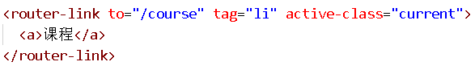

**<font style="color:rgb(51, 51, 51);">（2）在 pages 目录创建文件夹 course ，在 course 目录创建 index.vue</font>**

```html
<template>
  <div>
    课程列表
  </div>
</template>
```

**<font style="color:rgb(0, 0, 0);">点</font>****<font style="color:rgb(51, 51, 51);">击导航，测试路由</font>**

### <font style="color:rgb(0, 0, 0);">动态路由</font>
**<font style="color:rgb(0, 0, 0);">创建方式</font>**

<font style="color:rgb(51, 51, 51);">如果我们需要根据 id 查询一条记录，就需要使用动态路由。</font><font style="color:rgb(255, 0, 0);">NUXT 的动态路由是以下划线开头的 vue 文件，参数名为下划线后边的文件名</font>

<font style="color:rgb(51, 51, 51);">在 pages 下的 course 目录下创建 </font><font style="color:rgb(255, 0, 0);">_id.vue</font>

```html
<template>
  <div>
    讲师详情
  </div>
</template>
```

## <font style="color:rgb(51, 51, 51);">封装 axios</font>
<font style="color:rgb(0, 0, 0);">我们可以参考 qinxue-admin 将 axios 操作封装起来</font>

<font style="color:rgb(0, 0, 0);">下载 axios ，使用命令 </font>**<font style="color:rgb(0, 0, 0);">npm install axios@0.18.0</font>**

<font style="color:rgb(51, 51, 51);">创建 utils 文件夹，utils 下创建 request.js</font>

```javascript
import axios from 'axios'

// 创建axios实例
const service = axios.create({
  baseURL: 'http://localhost:8201', // api的base_url
  timeout: 20000 // 请求超时时间
})
export default service
```

# 四、名师页面静态效果整合
## <font style="color:rgb(0, 0, 0);">列表页面</font>
<font style="color:rgb(0, 0, 0);">创建 pages/teacher/index.vue</font>

```html
<template>
  <div id="aCoursesList" class="bg-fa of">
    <!-- 讲师列表 开始 -->
    <section class="container">
      <header class="comm-title all-teacher-title">
        <h2 class="fl tac">
          <span class="c-333">全部讲师</span>
        </h2>
        <section class="c-tab-title">
          <a id="subjectAll" title="全部" href="#">全部</a>
          <!-- <c:forEach var="subject" items="${subjectList }">
                            <a id="${subject.subjectId}" title="${subject.subjectName }" href="javascript:void(0)" onclick="submitForm(${subject.subjectId})">${subject.subjectName }</a>
          </c:forEach>-->
        </section>
      </header>
      <section class="c-sort-box unBr">
        <div>
          <!-- /无数据提示 开始-->
          <section class="no-data-wrap">
            <em class="icon30 no-data-ico">&nbsp;</em>
            <span class="c-666 fsize14 ml10 vam">没有相关数据，小编正在努力整理中...</span>
          </section>
          <!-- /无数据提示 结束-->
          <article class="i-teacher-list">
            <ul class="of">
              <li>
                <section class="i-teach-wrap">
                  <div class="i-teach-pic">
                    <a href="/teacher/1" title="姚晨" target="_blank">
                      
                    </a>
                  </div>
                  <div class="mt10 hLh30 txtOf tac">
                    <a href="/teacher/1" title="姚晨" target="_blank" class="fsize18 c-666">姚晨</a>
                  </div>
                  <div class="hLh30 txtOf tac">
                    <span class="fsize14 c-999">北京师范大学法学院副教授、清华大学法学博士。自2004年至今已有9年的司法考试培训经验。长期从事司法考试辅导，深知命题规律，了解解题技巧。内容把握准确，授课重点明确，层次分明，调理清晰，将法条法理与案例有机融合，强调综合，深入浅出。</span>
                  </div>
                  <div class="mt15 i-q-txt">
                    <p class="c-999 f-fA">北京师范大学法学院副教授</p>
                  </div>
                </section>
              </li>
              <li>
                <section class="i-teach-wrap">
                  <div class="i-teach-pic">
                    <a href="/teacher/1" title="谢娜" target="_blank">
                      
                    </a>
                  </div>
                  <div class="mt10 hLh30 txtOf tac">
                    <a href="/teacher/1" title="谢娜" target="_blank" class="fsize18 c-666">谢娜</a>
                  </div>
                  <div class="hLh30 txtOf tac">
                    <span class="fsize14 c-999">十年课程研发和培训咨询经验，曾任国企人力资源经理、大型外企培训经理，负责企业大学和培训体系搭建；曾任专业培训机构高级顾问、研发部总监，为包括广东移动、东莞移动、深圳移动、南方电网、工商银行、农业银行、民生银行、邮储银行、TCL集团、清华大学继续教育学院、中天路桥、广西扬翔股份等超过200家企业提供过培训与咨询服务，并担任近50个大型项目的总负责人。</span>
                  </div>
                  <div class="mt15 i-q-txt">
                    <p class="c-999 f-fA">资深课程设计专家，专注10年AACTP美国培训协会认证导师</p>
                  </div>
                </section>
              </li>
              <li>
                <section class="i-teach-wrap">
                  <div class="i-teach-pic">
                    <a href="/teacher/1" title="刘德华" target="_blank">
                      
                    </a>
                  </div>
                  <div class="mt10 hLh30 txtOf tac">
                    <a href="/teacher/1" title="刘德华" target="_blank" class="fsize18 c-666">刘德华</a>
                  </div>
                  <div class="hLh30 txtOf tac">
                    <span class="fsize14 c-999">上海师范大学法学院副教授、清华大学法学博士。自2004年至今已有9年的司法考试培训经验。长期从事司法考试辅导，深知命题规律，了解解题技巧。内容把握准确，授课重点明确，层次分明，调理清晰，将法条法理与案例有机融合，强调综合，深入浅出。</span>
                  </div>
                  <div class="mt15 i-q-txt">
                    <p class="c-999 f-fA">上海师范大学法学院副教授</p>
                  </div>
                </section>
              </li>
              <li>
                <section class="i-teach-wrap">
                  <div class="i-teach-pic">
                    <a href="/teacher/1" title="周润发" target="_blank">
                      
                    </a>
                  </div>
                  <div class="mt10 hLh30 txtOf tac">
                    <a href="/teacher/1" title="周润发" target="_blank" class="fsize18 c-666">周润发</a>
                  </div>
                  <div class="hLh30 txtOf tac">
                    <span class="fsize14 c-999">法学博士，北京师范大学马克思主义学院副教授，专攻毛泽东思想概论、邓小平理论，长期从事考研辅导。出版著作两部，发表学术论文30余篇，主持国家社会科学基金项目和教育部重大课题子课题各一项，参与中央实施马克思主义理论研究和建设工程项目。</span>
                  </div>
                  <div class="mt15 i-q-txt">
                    <p class="c-999 f-fA">考研政治辅导实战派专家，全国考研政治命题研究组核心成员。</p>
                  </div>
                </section>
              </li>
              <li>
                <section class="i-teach-wrap">
                  <div class="i-teach-pic">
                    <a href="/teacher/1" title="钟汉良" target="_blank">
                      
                    </a>
                  </div>
                  <div class="mt10 hLh30 txtOf tac">
                    <a href="/teacher/1" title="钟汉良" target="_blank" class="fsize18 c-666">钟汉良</a>
                  </div>
                  <div class="hLh30 txtOf tac">
                    <span class="fsize14 c-999">具备深厚的数学思维功底、丰富的小学教育经验，授课风格生动活泼，擅长用形象生动的比喻帮助理解、简单易懂的语言讲解难题，深受学生喜欢</span>
                  </div>
                  <div class="mt15 i-q-txt">
                    <p class="c-999 f-fA">毕业于师范大学数学系，热爱教育事业，执教数学思维6年有余</p>
                  </div>
                </section>
              </li>
              <li>
                <section class="i-teach-wrap">
                  <div class="i-teach-pic">
                    <a href="/teacher/1" title="唐嫣" target="_blank">
                      
                    </a>
                  </div>
                  <div class="mt10 hLh30 txtOf tac">
                    <a href="/teacher/1" title="唐嫣" target="_blank" class="fsize18 c-666">唐嫣</a>
                  </div>
                  <div class="hLh30 txtOf tac">
                    <span class="fsize14 c-999">中国科学院数学与系统科学研究院应用数学专业博士，研究方向为数字图像处理，中国工业与应用数学学会会员。参与全国教育科学“十五”规划重点课题“信息化进程中的教育技术发展研究”的子课题“基与课程改革的资源开发与应用”，以及全国“十五”科研规划全国重点项目“掌上型信息技术产品在教学中的运用和开发研究”的子课题“用技术学数学”。</span>
                  </div>
                  <div class="mt15 i-q-txt">
                    <p class="c-999 f-fA">中国人民大学附属中学数学一级教师</p>
                  </div>
                </section>
              </li>
              <li>
                <section class="i-teach-wrap">
                  <div class="i-teach-pic">
                    <a href="/teacher/1" title="周杰伦" target="_blank">
                      
                    </a>
                  </div>
                  <div class="mt10 hLh30 txtOf tac">
                    <a href="/teacher/1" title="周杰伦" target="_blank" class="fsize18 c-666">周杰伦</a>
                  </div>
                  <div class="hLh30 txtOf tac">
                    <span class="fsize14 c-999">中教一级职称。讲课极具亲和力。</span>
                  </div>
                  <div class="mt15 i-q-txt">
                    <p class="c-999 f-fA">毕业于北京大学数学系</p>
                  </div>
                </section>
              </li>
              <li>
                <section class="i-teach-wrap">
                  <div class="i-teach-pic">
                    <a href="/teacher/1" title="陈伟霆" target="_blank">
                      
                    </a>
                  </div>
                  <div class="mt10 hLh30 txtOf tac">
                    <a href="/teacher/1" title="陈伟霆" target="_blank" class="fsize18 c-666">陈伟霆</a>
                  </div>
                  <div class="hLh30 txtOf tac">
                    <span
                      class="fsize14 c-999"
                    >政治学博士、管理学博士后，北京师范大学马克思主义学院副教授。多年来总结出了一套行之有效的应试技巧与答题方法，针对性和实用性极强，能帮助考生在轻松中应考，在激励的竞争中取得高分，脱颖而出。</span>
                  </div>
                  <div class="mt15 i-q-txt">
                    <p class="c-999 f-fA">长期从事考研政治课讲授和考研命题趋势与应试对策研究。考研辅导新锐派的代表。</p>
                  </div>
                </section>
              </li>
            </ul>
            <div class="clear"></div>
          </article>
        </div>
        <!-- 公共分页 开始 -->
        <div>
          <div class="paging">
            <!-- undisable这个class是否存在，取决于数据属性hasPrevious -->
            <a href="#" title="首页">首</a>
            <a href="#" title="前一页">&lt;</a>
            <a href="#" title="第1页" class="current undisable">1</a>
            <a href="#" title="第2页">2</a>
            <a href="#" title="后一页">&gt;</a>
            <a href="#" title="末页">末</a>
            <div class="clear"></div>
          </div>
        </div>
        <!-- 公共分页 结束 -->
      </section>
    </section>
    <!-- /讲师列表 结束 -->
  </div>
</template>
<script>
export default {};
</script>
```

## <font style="color:rgb(0, 0, 0);">详情页面</font>
<font style="color:rgb(0, 0, 0);">创建 pages/teacher/_id.vue</font>

<font style="color:rgb(51, 51, 51);">修改资源路径为 ~/assets/</font>

```html
<template>
  <div id="aCoursesList" class="bg-fa of">
    <!-- 讲师介绍 开始 -->
    <section class="container">
      <header class="comm-title">
        <h2 class="fl tac">
          <span class="c-333">讲师介绍</span>
        </h2>
      </header>
      <div class="t-infor-wrap">
        <!-- 讲师基本信息 -->
        <section class="fl t-infor-box c-desc-content">
          <div class="mt20 ml20">
            <section class="t-infor-pic">
              
            </section>
            <h3 class="hLh30">
              <span class="fsize24 c-333">姚晨&nbsp;高级讲师</span>
            </h3>
            <section class="mt10">
              <span class="t-tag-bg">北京师范大学法学院副教授</span>
            </section>
            <section class="t-infor-txt">
              <p
                class="mt20"
              >北京师范大学法学院副教授、清华大学法学博士。自2004年至今已有9年的司法考试培训经验。长期从事司法考试辅导，深知命题规律，了解解题技巧。内容把握准确，授课重点明确，层次分明，调理清晰，将法条法理与案例有机融合，强调综合，深入浅出。</p>
            </section>
            <div class="clear"></div>
          </div>
        </section>
        <div class="clear"></div>
      </div>
      <section class="mt30">
        <div>
          <header class="comm-title all-teacher-title c-course-content">
            <h2 class="fl tac">
              <span class="c-333">主讲课程</span>
            </h2>
            <section class="c-tab-title">
              <a href="javascript: void(0)">&nbsp;</a>
            </section>
          </header>
          <!-- /无数据提示 开始-->
          <section class="no-data-wrap">
            <em class="icon30 no-data-ico">&nbsp;</em>
            <span class="c-666 fsize14 ml10 vam">没有相关数据，小编正在努力整理中...</span>
          </section>
          <!-- /无数据提示 结束-->
          <article class="comm-course-list">
            <ul class="of">
              <li>
                <div class="cc-l-wrap">
                  <section class="course-img">
                    
                    <div class="cc-mask">
                      <a href="#" title="开始学习" target="_blank" class="comm-btn c-btn-1">开始学习</a>
                    </div>
                  </section>
                  <h3 class="hLh30 txtOf mt10">
                    <a href="#" title="零基础入门学习Python课程学习" target="_blank" class="course-title fsize18 c-333">零基础入门学习Python课程学习</a>
                  </h3>
                </div>
              </li>
              <li>
                <div class="cc-l-wrap">
                  <section class="course-img">
                    
                    <div class="cc-mask">
                      <a href="#" title="开始学习" target="_blank" class="comm-btn c-btn-1">开始学习</a>
                    </div>
                  </section>
                  <h3 class="hLh30 txtOf mt10">
                    <a href="#" title="影想力摄影小课堂" target="_blank" class="course-title fsize18 c-333">影想力摄影小课堂</a>
                  </h3>
                </div>
              </li>
              <li>
                <div class="cc-l-wrap">
                  <section class="course-img">
                    
                    <div class="cc-mask">
                      <a href="#" title="开始学习" target="_blank" class="comm-btn c-btn-1">开始学习</a>
                    </div>
                  </section>
                  <h3 class="hLh30 txtOf mt10">
                    <a href="#" title="数学给宝宝带来的兴趣" target="_blank" class="course-title fsize18 c-333">数学给宝宝带来的兴趣</a>
                  </h3>
                </div>
              </li>
              <li>
                <div class="cc-l-wrap">
                  <section class="course-img">
                    
                    <div class="cc-mask">
                      <a href="#" title="开始学习" target="_blank" class="comm-btn c-btn-1">开始学习</a>
                    </div>
                  </section>
                  <h3 class="hLh30 txtOf mt10">
                    <a href="#" title="国家教师资格考试专用" target="_blank" class="course-title fsize18 c-333">国家教师资格考试专用</a>
                  </h3>
                </div>
              </li>
            </ul>
            <div class="clear"></div>
          </article>
        </div>
      </section>
    </section>
    <!-- /讲师介绍 结束 -->
  </div>
</template>
<script>
export default {};
</script>
```

# 五、课程页面静态效果整合
## <font style="color:rgb(0, 0, 0);">列表页面</font>
<font style="color:rgb(0, 0, 0);">创建 pages/course/index.vue</font>

```html
<template>
  <div id="aCoursesList" class="bg-fa of">
    <!-- /课程列表 开始 -->
    <section class="container">
      <header class="comm-title">
        <h2 class="fl tac">
          <span class="c-333">全部课程</span>
        </h2>
      </header>
      <section class="c-sort-box">
        <section class="c-s-dl">
          <dl>
            <dt>
              <span class="c-999 fsize14">课程类别</span>
            </dt>
            <dd class="c-s-dl-li">
              <ul class="clearfix">
                <li>
                  <a title="全部" href="#">全部</a>
                </li>
                <li>
                  <a title="数据库" href="#">数据库</a>
                </li>
                <li class="current">
                  <a title="外语考试" href="#">外语考试</a>
                </li>
                <li>
                  <a title="教师资格证" href="#">教师资格证</a>
                </li>
                <li>
                  <a title="公务员" href="#">公务员</a>
                </li>
                <li>
                  <a title="移动开发" href="#">移动开发</a>
                </li>
                <li>
                  <a title="操作系统" href="#">操作系统</a>
                </li>
              </ul>
            </dd>
          </dl>
          <dl>
            <dt>
              <span class="c-999 fsize14"></span>
            </dt>
            <dd class="c-s-dl-li">
              <ul class="clearfix">
                <li>
                  <a title="职称英语" href="#">职称英语</a>
                </li>
                <li>
                  <a title="英语四级" href="#">英语四级</a>
                </li>
                <li>
                  <a title="英语六级" href="#">英语六级</a>
                </li>
              </ul>
            </dd>
          </dl>
          <div class="clear"></div>
        </section>
        <div class="js-wrap">
          <section class="fr">
            <span class="c-ccc">
              <i class="c-master f-fM">1</i>/
              <i class="c-666 f-fM">1</i>
            </span>
          </section>
          <section class="fl">
            <ol class="js-tap clearfix">
              <li>
                <a title="关注度" href="#">关注度</a>
              </li>
              <li>
                <a title="最新" href="#">最新</a>
              </li>
              <li class="current bg-orange">
                <a title="价格" href="#">价格&nbsp;
                  <span>↓</span>
                </a>
              </li>
            </ol>
          </section>
        </div>
        <div class="mt40">
          <!-- /无数据提示 开始-->
          <section class="no-data-wrap">
            <em class="icon30 no-data-ico">&nbsp;</em>
            <span class="c-666 fsize14 ml10 vam">没有相关数据，小编正在努力整理中...</span>
          </section>
          <!-- /无数据提示 结束-->
          <article class="comm-course-list">
            <ul class="of" id="bna">
              <li>
                <div class="cc-l-wrap">
                  <section class="course-img">
                    
                    <div class="cc-mask">
                      <a href="/course/1" title="开始学习" class="comm-btn c-btn-1">开始学习</a>
                    </div>
                  </section>
                  <h3 class="hLh30 txtOf mt10">
                    <a href="/course/1" title="听力口语" class="course-title fsize18 c-333">听力口语</a>
                  </h3>
                  <section class="mt10 hLh20 of">
                    <span class="fr jgTag bg-green">
                      <i class="c-fff fsize12 f-fA">免费</i>
                    </span>
                    <span class="fl jgAttr c-ccc f-fA">
                      <i class="c-999 f-fA">9634人学习</i>
                      |
                      <i class="c-999 f-fA">9634评论</i>
                    </span>
                  </section>
                </div>
              </li>
              <li>
                <div class="cc-l-wrap">
                  <section class="course-img">
                    
                    <div class="cc-mask">
                      <a href="/course/1" title="开始学习" class="comm-btn c-btn-1">开始学习</a>
                    </div>
                  </section>
                  <h3 class="hLh30 txtOf mt10">
                    <a href="/course/1" title="Java精品课程" class="course-title fsize18 c-333">Java精品课程</a>
                  </h3>
                  <section class="mt10 hLh20 of">
                    <span class="fr jgTag bg-green">
                      <i class="c-fff fsize12 f-fA">免费</i>
                    </span>
                    <span class="fl jgAttr c-ccc f-fA">
                      <i class="c-999 f-fA">501人学习</i>
                      |
                      <i class="c-999 f-fA">501评论</i>
                    </span>
                  </section>
                </div>
              </li>
              <li>
                <div class="cc-l-wrap">
                  <section class="course-img">
                    
                    <div class="cc-mask">
                      <a href="/course/1" title="开始学习" class="comm-btn c-btn-1">开始学习</a>
                    </div>
                  </section>
                  <h3 class="hLh30 txtOf mt10">
                    <a href="/course/1" title="C4D零基础" class="course-title fsize18 c-333">C4D零基础</a>
                  </h3>
                  <section class="mt10 hLh20 of">
                    <span class="fr jgTag bg-green">
                      <i class="c-fff fsize12 f-fA">免费</i>
                    </span>
                    <span class="fl jgAttr c-ccc f-fA">
                      <i class="c-999 f-fA">300人学习</i>
                      |
                      <i class="c-999 f-fA">300评论</i>
                    </span>
                  </section>
                </div>
              </li>
              <li>
                <div class="cc-l-wrap">
                  <section class="course-img">
                    
                    <div class="cc-mask">
                      <a href="/course/1" title="开始学习" class="comm-btn c-btn-1">开始学习</a>
                    </div>
                  </section>
                  <h3 class="hLh30 txtOf mt10">
                    <a href="/course/1" title="数学给宝宝带来的兴趣" class="course-title fsize18 c-333">数学给宝宝带来的兴趣</a>
                  </h3>
                  <section class="mt10 hLh20 of">
                    <span class="fr jgTag bg-green">
                      <i class="c-fff fsize12 f-fA">免费</i>
                    </span>
                    <span class="fl jgAttr c-ccc f-fA">
                      <i class="c-999 f-fA">256人学习</i>
                      |
                      <i class="c-999 f-fA">256评论</i>
                    </span>
                  </section>
                </div>
              </li>
              <li>
                <div class="cc-l-wrap">
                  <section class="course-img">
                    
                    <div class="cc-mask">
                      <a href="/course/1" title="开始学习" class="comm-btn c-btn-1">开始学习</a>
                    </div>
                  </section>
                  <h3 class="hLh30 txtOf mt10">
                    <a
                      href="/course/1"
                      title="零基础入门学习Python课程学习"
                      class="course-title fsize18 c-333"
                    >零基础入门学习Python课程学习</a>
                  </h3>
                  <section class="mt10 hLh20 of">
                    <span class="fr jgTag bg-green">
                      <i class="c-fff fsize12 f-fA">免费</i>
                    </span>
                    <span class="fl jgAttr c-ccc f-fA">
                      <i class="c-999 f-fA">137人学习</i>
                      |
                      <i class="c-999 f-fA">137评论</i>
                    </span>
                  </section>
                </div>
              </li>
              <li>
                <div class="cc-l-wrap">
                  <section class="course-img">
                    
                    <div class="cc-mask">
                      <a href="/course/1" title="开始学习" class="comm-btn c-btn-1">开始学习</a>
                    </div>
                  </section>
                  <h3 class="hLh30 txtOf mt10">
                    <a href="/course/1" title="MySql从入门到精通" class="course-title fsize18 c-333">MySql从入门到精通</a>
                  </h3>
                  <section class="mt10 hLh20 of">
                    <span class="fr jgTag bg-green">
                      <i class="c-fff fsize12 f-fA">免费</i>
                    </span>
                    <span class="fl jgAttr c-ccc f-fA">
                      <i class="c-999 f-fA">125人学习</i>
                      |
                      <i class="c-999 f-fA">125评论</i>
                    </span>
                  </section>
                </div>
              </li>
              <li>
                <div class="cc-l-wrap">
                  <section class="course-img">
                    
                    <div class="cc-mask">
                      <a href="/course/1" title="开始学习" class="comm-btn c-btn-1">开始学习</a>
                    </div>
                  </section>
                  <h3 class="hLh30 txtOf mt10">
                    <a href="/course/1" title="搜索引擎优化技术" class="course-title fsize18 c-333">搜索引擎优化技术</a>
                  </h3>
                  <section class="mt10 hLh20 of">
                    <span class="fr jgTag bg-green">
                      <i class="c-fff fsize12 f-fA">免费</i>
                    </span>
                    <span class="fl jgAttr c-ccc f-fA">
                      <i class="c-999 f-fA">123人学习</i>
                      |
                      <i class="c-999 f-fA">123评论</i>
                    </span>
                  </section>
                </div>
              </li>
              <li>
                <div class="cc-l-wrap">
                  <section class="course-img">
                    
                    <div class="cc-mask">
                      <a href="/course/1" title="开始学习" class="comm-btn c-btn-1">开始学习</a>
                    </div>
                  </section>
                  <h3 class="hLh30 txtOf mt10">
                    <a href="/course/1" title="20世纪西方音乐" class="course-title fsize18 c-333">20世纪西方音乐</a>
                  </h3>
                  <section class="mt10 hLh20 of">
                    <span class="fr jgTag bg-green">
                      <i class="c-fff fsize12 f-fA">免费</i>
                    </span>
                    <span class="fl jgAttr c-ccc f-fA">
                      <i class="c-999 f-fA">34人学习</i>
                      |
                      <i class="c-999 f-fA">34评论</i>
                    </span>
                  </section>
                </div>
              </li>
            </ul>
            <div class="clear"></div>
          </article>
        </div>
        <!-- 公共分页 开始 -->
        <div>
          <div class="paging">
            <a class="undisable" title>首</a>
            <a id="backpage" class="undisable" href="#" title>&lt;</a>
            <a href="#" title class="current undisable">1</a>
            <a href="#" title>2</a>
            <a id="nextpage" href="#" title>&gt;</a>
            <a href="#" title>末</a>
            <div class="clear"></div>
          </div>
        </div>
        <!-- 公共分页 结束 -->
      </section>
    </section>
    <!-- /课程列表 结束 -->
  </div>
</template>
<script>
export default {};
</script>
```

## <font style="color:rgb(0, 0, 0);">详情页面</font>
<font style="color:rgb(0, 0, 0);">创建 pages/course/_id.vue</font>

```html
<template>
  <div id="aCoursesList" class="bg-fa of">
    <!-- /课程详情 开始 -->
    <section class="container">
      <section class="path-wrap txtOf hLh30">
        <a href="#" title class="c-999 fsize14">首页</a>
        \
        <a href="#" title class="c-999 fsize14">课程列表</a>
        \
        <span class="c-333 fsize14">Java精品课程</span>
      </section>
      <div>
        <article class="c-v-pic-wrap" style="height: 357px;">
          <section class="p-h-video-box" id="videoPlay">
            
          </section>
        </article>
        <aside class="c-attr-wrap">
          <section class="ml20 mr15">
            <h2 class="hLh30 txtOf mt15">
              <span class="c-fff fsize24">Java精品课程</span>
            </h2>
            <section class="c-attr-jg">
              <span class="c-fff">价格：</span>
              <b class="c-yellow" style="font-size:24px;">￥0.00</b>
            </section>
            <section class="c-attr-mt c-attr-undis">
              <span class="c-fff fsize14">主讲： 唐嫣&nbsp;&nbsp;&nbsp;</span>
            </section>
            <section class="c-attr-mt of">
              <span class="ml10 vam">
                <em class="icon18 scIcon"></em>
                <a class="c-fff vam" title="收藏" href="#" >收藏</a>
              </span>
            </section>
            <section class="c-attr-mt">
              <a href="#" title="立即观看" class="comm-btn c-btn-3">立即观看</a>
            </section>
          </section>
        </aside>
        <aside class="thr-attr-box">
          <ol class="thr-attr-ol clearfix">
            <li>
              <p>&nbsp;</p>
              <aside>
                <span class="c-fff f-fM">购买数</span>
                <br>
                <h6 class="c-fff f-fM mt10">150</h6>
              </aside>
            </li>
            <li>
              <p>&nbsp;</p>
              <aside>
                <span class="c-fff f-fM">课时数</span>
                <br>
                <h6 class="c-fff f-fM mt10">20</h6>
              </aside>
            </li>
            <li>
              <p>&nbsp;</p>
              <aside>
                <span class="c-fff f-fM">浏览数</span>
                <br>
                <h6 class="c-fff f-fM mt10">501</h6>
              </aside>
            </li>
          </ol>
        </aside>
        <div class="clear"></div>
      </div>
      <!-- /课程封面介绍 -->
      <div class="mt20 c-infor-box">
        <article class="fl col-7">
          <section class="mr30">
            <div class="i-box">
              <div>
                <section id="c-i-tabTitle" class="c-infor-tabTitle c-tab-title">
                  <a name="c-i" class="current" title="课程详情">课程详情</a>
                </section>
              </div>
              <article class="ml10 mr10 pt20">
                <div>
                  <h6 class="c-i-content c-infor-title">
                    <span>课程介绍</span>
                  </h6>
                  <div class="course-txt-body-wrap">
                    <section class="course-txt-body">
                      <p>
                        Java的发展历史，可追溯到1990年。当时Sun&nbsp;Microsystem公司为了发展消费性电子产品而进行了一个名为Green的项目计划。该计划
                        负责人是James&nbsp;Gosling。起初他以C++来写一种内嵌式软件，可以放在烤面包机或PAD等小型电子消费设备里，使得机器更聪明，具有人工智
                        能。但他发现C++并不适合完成这类任务！因为C++常会有使系统失效的程序错误，尤其是内存管理，需要程序设计师记录并管理内存资源。这给设计师们造成
                        极大的负担，并可能产生许多bugs。&nbsp;
                        <br>为了解决所遇到的问题，Gosling决定要发展一种新的语言，来解决C++的潜在性危险问题，这个语言名叫Oak。Oak是一种可移植性语言，也就是一种平台独立语言，能够在各种芯片上运行。
                        <br>1994年，Oak技术日趋成熟，这时网络正开始蓬勃发展。Oak研发小组发现Oak很适合作为一种网络程序语言。因此发展了一个能与Oak配合的浏
                        览器--WebRunner，后更名为HotJava，它证明了Oak是一种能在网络上发展的程序语言。由于Oak商标已被注册，工程师们便想到以自己常
                        享用的咖啡(Java)来重新命名，并于Sun&nbsp;World&nbsp;95中被发表出来。
                      </p>
                    </section>
                  </div>
                </div>
                <!-- /课程介绍 -->
                <div class="mt50">
                  <h6 class="c-g-content c-infor-title">
                    <span>课程大纲</span>
                  </h6>
                  <section class="mt20">
                    <div class="lh-menu-wrap">
                      <menu id="lh-menu" class="lh-menu mt10 mr10">
                        <ul>
                          <!-- 文件目录 -->
                          <li class="lh-menu-stair">
                            <a href="javascript: void(0)" title="第一章" class="current-1">
                              <em class="lh-menu-i-1 icon18 mr10"></em>第一章
                            </a>
                            <ol class="lh-menu-ol" style="display: block;">
                              <li class="lh-menu-second ml30">
                                <a href="#" title>
                                  <span class="fr">
                                    <i class="free-icon vam mr10">免费试听</i>
                                  </span>
                                  <em class="lh-menu-i-2 icon16 mr5">&nbsp;</em>第一节
                                </a>
                              </li>
                              <li class="lh-menu-second ml30">
                                <a href="#" title class="current-2">
                                  <em class="lh-menu-i-2 icon16 mr5">&nbsp;</em>第二节
                                </a>
                              </li>
                            </ol>
                          </li>
                        </ul>
                      </menu>
                    </div>
                  </section>
                </div>
                <!-- /课程大纲 -->
              </article>
            </div>
          </section>
        </article>
        <aside class="fl col-3">
          <div class="i-box">
            <div>
              <section class="c-infor-tabTitle c-tab-title">
                <a title href="javascript:void(0)">主讲讲师</a>
              </section>
              <section class="stud-act-list">
                <ul style="height: auto;">
                  <li>
                    <div class="u-face">
                      <a href="#">
                        
                      </a>
                    </div>
                    <section class="hLh30 txtOf">
                      <a class="c-333 fsize16 fl" href="#">周杰伦</a>
                    </section>
                    <section class="hLh20 txtOf">
                      <span class="c-999">毕业于北京大学数学系</span>
                    </section>
                  </li>
                </ul>
              </section>
            </div>
          </div>
        </aside>
        <div class="clear"></div>
      </div>
    </section>
    <!-- /课程详情 结束 -->
  </div>
</template>
<script>
export default {};
</script>
```

# 六、首页显示 banner 数据【后端】
## <font style="color:rgb(0, 0, 0);">新建 banner 微服务</font>
### <font style="color:rgb(0, 0, 0);">在 service 模块下创建子模块 service-cms</font>
### <font style="color:rgb(0, 0, 0);">使用代码生成器生成 banner 代码</font>
+ 先创建好 cms 表，根据提供的资料创建  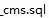
+ 再生成代码
+ 修改主键生成策略、填充日期、逻辑删

### <font style="color:rgb(0, 0, 0);">配置 application.properties</font>
```properties
# 服务端口
server.port=8004

# 服务名
spring.application.name=service-cms

# mysql数据库连接
spring.datasource.driver-class-name=com.mysql.cj.jdbc.Driver
spring.datasource.url=jdbc:mysql://localhost:3306/qinxue?serverTimezone=GMT%2B8
spring.datasource.username=root
spring.datasource.password=root

#返回json的全局时间格式
spring.jackson.date-format=yyyy-MM-dd HH:mm:ss
spring.jackson.time-zone=GMT+8

#配置mapper xml文件的路径
mybatis-plus.mapper-locations=classpath:com/xszx/cmsservice/mapper/xml/*.xml
#mybatis日志
mybatis-plus.configuration.log-impl=org.apache.ibatis.logging.stdout.StdOutImpl
```

### <font style="color:rgb(0, 0, 0);">创建启动类</font>
<font style="color:rgb(0, 0, 0);">创建 CmsApplication.java</font>

```java
@SpringBootApplication
@ComponentScan({"com.xszx"}) //指定扫描位置
@MapperScan("com.xszx.cmsservice.mapper")
public class CmsApplication {
    public static void main(String[] args) {
        SpringApplication.run(CmsApplication.class, args);
    }
}
```

## <font style="color:rgb(0, 0, 0);">创建 banner 服务接口</font>
### <font style="color:rgb(0, 0, 0);">创建 banner 前台查询接口</font>
**<font style="color:rgb(0, 0, 0);">首页获取 banner 数据接口</font>**

```java
@RestController
@RequestMapping("/cms/bannerfront")
@Api(tags = "网站首页Banner列表")
@CrossOrigin //跨域
public class BannerFrontController {

    @Autowired
    private BannerService bannerService;

    @ApiOperation(value = "获取首页banner")
    @GetMapping("getAllBanner")
    public R index() {
        List<Banner> list = bannerService.selectAllBanner();
        return R.ok().data("bannerList", list);
    }
}
```

```java
public interface BannerService extends IService<Banner> {

    List<Banner> selectAllBanner();
}
```

```java
@Service
public class BannerServiceImpl extends ServiceImpl<BannerMapper, Banner> implements BannerService {

    @Override
    public List<Banner> selectAllBanner() {
        //根据id进行降序排列，显示排列之后前两条记录
        QueryWrapper<Banner> wrapper = new QueryWrapper<>();
        wrapper.orderByDesc("id");
        //last方法，拼接sql语句
        wrapper.last("limit 2");
        List<Banner> list = baseMapper.selectList(null);
        return list;
    }
}
```

### <font style="color:rgb(0, 0, 0);">创建 banner 后台管理接口</font>
**<font style="color:rgb(0, 0, 0);">banner 后台分页查询、添加、修改、删除接口</font>**

```java
package com.xszx.cms.controller;

import com.baomidou.mybatisplus.extension.plugins.pagination.Page;
import com.xszx.cms.entity.Banner;
import com.xszx.cms.service.BannerService;
import com.xszx.commonutils.R;
import io.swagger.annotations.Api;
import io.swagger.annotations.ApiOperation;
import io.swagger.annotations.ApiParam;
import org.springframework.beans.factory.annotation.Autowired;
import org.springframework.web.bind.annotation.*;

@RestController
@RequestMapping("/cms/banneradmin")
@CrossOrigin
@Api(tags = "banner后台管理")
public class BannerAdminController {

    @Autowired
    private BannerService bannerService;

    @ApiOperation(value = "获取Banner分页列表")
    @GetMapping("{page}/{limit}")
    public R index(
            @ApiParam(name = "page", value = "当前页码", required = true)
            @PathVariable Long page,
            @ApiParam(name = "limit", value = "每页记录数", required = true)
            @PathVariable Long limit) {

        Page<Banner> pageParam = new Page<>(page, limit);
        bannerService.page(pageParam,null);
        return R.ok().data("items", pageParam.getRecords()).data("total", pageParam.getTotal());
    }

    @ApiOperation(value = "获取Banner")
    @GetMapping("get/{id}")
    public R get(@PathVariable String id) {
        Banner banner = bannerService.getById(id);
        return R.ok().data("item", banner);
    }

    @ApiOperation(value = "新增Banner")
    @PostMapping("save")
    public R save(@RequestBody Banner banner) {
        bannerService.save(banner);
        return R.ok();
    }

    @ApiOperation(value = "修改Banner")
    @PutMapping("update")
    public R updateById(@RequestBody Banner banner) {
        bannerService.updateById(banner);
        return R.ok();
    }

    @ApiOperation(value = "删除Banner")
    @DeleteMapping("remove/{id}")
    public R remove(@PathVariable String id) {
        bannerService.removeById(id);
        return R.ok();
    }
}
```

## <font style="color:rgb(0, 0, 0);">实现 banner 后台管理前端</font>
<font style="color:rgb(165, 42, 0);">实现 banner 后台的添加修改删除和分页查询操作，和其他后台管理模块类似</font>

# 七、首页显示课程名师数据【后端】
## <font style="color:rgb(0, 0, 0);">新建前端查询课程名师接口</font>
### <font style="color:rgb(0, 0, 0);">在 service-edu 模块创建 controller</font>
**<font style="color:rgb(0, 0, 0);">（1）查询最新前4条讲师数据</font>**

**<font style="color:rgb(0, 0, 0);">（2）查询最新前8条课程数据</font>**

```java
package com.xszx.serviceedu.controller;

import com.baomidou.mybatisplus.core.conditions.query.QueryWrapper;
import com.xszx.commonutils.R;
import com.xszx.serviceedu.entity.Course;
import com.xszx.serviceedu.entity.Teacher;
import com.xszx.serviceedu.service.CourseService;
import com.xszx.serviceedu.service.TeacherService;
import io.swagger.annotations.Api;
import io.swagger.annotations.ApiOperation;
import org.springframework.beans.factory.annotation.Autowired;
import org.springframework.web.bind.annotation.CrossOrigin;
import org.springframework.web.bind.annotation.GetMapping;
import org.springframework.web.bind.annotation.RequestMapping;
import org.springframework.web.bind.annotation.RestController;

import java.util.List;

@RestController
@RequestMapping("/serviceedu/index")
@CrossOrigin
@Api(tags = "首页讲师和课程的展示管理")
public class IndexController {

    @Autowired
    private CourseService courseService;

    @Autowired
    private TeacherService teacherService;

    //查询前8条热门课程，查询前4条名师
    @GetMapping("index")
    @ApiOperation("查询前8条热门课程，查询前4条名师")
    public R index() {
        //查询前8条热门课程
        QueryWrapper<Course> wrapper = new QueryWrapper<>();
        wrapper.orderByDesc("id");
        wrapper.last("limit 8");
        List<Course> courseList = courseService.list(wrapper);

        //查询前4条名师
        QueryWrapper<Teacher> wrapperTeacher = new QueryWrapper<>();
        wrapperTeacher.orderByDesc("id");
        wrapperTeacher.last("limit 4");
        List<Teacher> teacherList = teacherService.list(wrapperTeacher);

        return R.ok().data("courseList",courseList).data("teacherList",teacherList);
    }
}
```

# 八、首页显示 banner 和课程名师数据【前端】
## <font style="color:rgb(0, 0, 0);">首页 banner 数据显示</font>
### <font style="color:rgb(0, 0, 0);">创建 api 文件夹，创建 banner.js 文件</font>
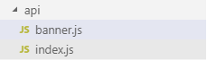

**<font style="color:rgb(0, 0, 0);">banner.js</font>**

```javascript
import request from '@/utils/request'

export default {
  getList() {
    return request({
      url: `/educms/banner/getAllBanner`,
      method: 'get'
    })
  }
}
```

### <font style="color:rgb(0, 0, 0);">在首页面引入，调用实现</font>
在 pages/ index.vue 页面中写如下内容。

```html
<script>
import banner from "@/api/banner"
export default {
  data () {
    return {
      swiperOption: {
        //配置分页
        pagination: {
          el: '.swiper-pagination'//分页的dom节点
        },
        //配置导航
        navigation: {
          nextEl: '.swiper-button-next',//下一页dom节点
          prevEl: '.swiper-button-prev'//前一页dom节点
        }
      },
      bannerList: {}
    }
  },
  created() {
    this.initDataBanner()
  },
  methods:{
    initDataBanner() {
      banner.getList().then(response => {
        this.bannerList = response.data.data.bannerList
      })
    }
  }
}
</script>
```

### <font style="color:rgb(0, 0, 0);">在页面遍历显示 banner</font>
```html
<!-- 幻灯片 开始 -->
<div v-swiper:mySwiper="swiperOption">
    <div class="swiper-wrapper">
        <div v-for="banner in bannerList" :key="banner.id" class="swiper-slide" style="background: #040B1B;">
            <a target="_blank" :href="banner.linkUrl">
              
            </a>
        </div>
 
    </div>
    <div class="swiper-pagination swiper-pagination-white"></div>
    <div class="swiper-button-prev swiper-button-white" slot="button-prev"></div>
    <div class="swiper-button-next swiper-button-white" slot="button-next"></div>
</div>
<!-- 幻灯片 结束 -->
```

### 添加 nginx 反向代理配置
添加如下配置，添加完要重启 nginx。

```latex
location ~ /cms/ {           
  proxy_pass http://localhost:8004;
}
```

### 手动上传图片到阿里云 OSS
手动上传静态原型中 banner 中的两张图片到 阿里云 OSS。

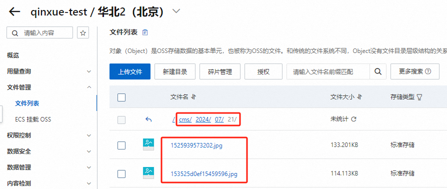

### 修改数据库中图片地址
将数据库中 banner 表中的两条数据的图片地址改为上面两张图片的地址。

### 测试


## <font style="color:rgb(0, 0, 0);">首页显示课程和名师数据</font>
### <font style="color:rgb(0, 0, 0);">创建 api 文件夹，创建 index.js 文件</font>
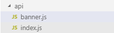

**<font style="color:rgb(0, 0, 0);">index.js</font>**

```javascript
import request from '@/utils/request'

export default {
  getList() {
    return request({
      url: `/eduservice/index`,
      method: 'get'
    })
  }
}
```

### <font style="color:rgb(0, 0, 0);">在首页面引入，调用实现</font>
在 pages/index.vue 页面中写如下代码。

```html
<script>
import index from '@/api/index'
import banner from "@/api/banner"
export default {
  data () {
    return {
      swiperOption: {
        //配置分页
        pagination: {
          el: '.swiper-pagination'//分页的dom节点
        },
        //配置导航
        navigation: {
          nextEl: '.swiper-button-next',//下一页dom节点
          prevEl: '.swiper-button-prev'//前一页dom节点
        }
      },
      teacherList: {},
      courseList: {},
      bannerList: {}
    }
  },
  created() {
    this.initDataBanner()
    this.initDataObj()
  },
  methods:{
    initDataBanner() {
      banner.getList().then(response => {
        this.bannerList = response.data.data.bannerList
      })
    },
    initDataObj() {
      index.getList().then(response => {
        this.teacherList = response.data.data.teacherList
        this.courseList = response.data.data.courseList
      })
    }
  }
}
</script>
```

### <font style="color:rgb(0, 0, 0);">在页面遍历显示课程和名师</font>
```html
<div id="aCoursesList">
<!-- 网校课程 开始 -->
<div>
  <section class="container">
    <header class="comm-title">
      <h2 class="tac">
        <span class="c-333">热门课程</span>
      </h2>
    </header>
    <div>
      <article class="comm-course-list">
        <ul class="of" id="bna">
          <li v-for="(course, index) in courseList" v-bind:key="index">
          <div class="cc-l-wrap">
              <section class="course-img">
<!-- ~/assets/photo/course/01.jpg -->
                  
  <div class="cc-mask">
      <a :href="'/course/'+course.id" title="开始学习" class="comm-btn c-btn-1">开始学习</a>
      </div>
  </section>
              <h3 class="hLh30 txtOf mt10">
          <a href="#" :title="course.title" class="course-title fsize18 c-333">{{course.title}}</a>
              </h3>
              <section class="mt10 hLh20 of">
              <span class="fr jgTag bg-green" v-if="Number(course.price) === 0">
              <i class="c-fff fsize12 f-fA">免费</i>
              </span>
              <span class="fr jgTag bg-green" v-else>
              <i class="c-fff fsize12 f-fA"> ￥{{course.price}}</i>
              </span>
              <span class="fl jgAttr c-ccc f-fA">
              <i class="c-999 f-fA">{{course.buyCount}} 人学习</i>
                                      |
              <i class="c-999 f-fA">{{course.viewCount}} 人浏览</i>
              </span>
              </section>
              </div>
              </li>
        </ul>
        <div class="clear"></div>
      </article>
      <section class="tac pt20">
        <a href="#" title="全部课程" class="comm-btn c-btn-2">全部课程</a>
      </section>
    </div>
  </section>
</div>
<!-- /网校课程 结束 -->
<!-- 网校名师 开始 -->
<div>
  <section class="container">
    <header class="comm-title">
      <h2 class="tac">
        <span class="c-333">名师大咖</span>
      </h2>
    </header>
    <div>
      <article class="i-teacher-list">
        <ul class="of">
         <li v-for="(teacher,index) in teacherList" v-bind:key="index">
          <section class="i-teach-wrap">
          <div class="i-teach-pic">
          <a :href='"/teacher/"+teacher.id' :title="teacher.name">
          
          </a>
          </div>
          <div class="mt10 hLh30 txtOf tac">
          <a :href='"/teacher/"+teacher.id' :title="teacher.name" class="fsize18 c-666">{{teacher.name}}</a>
          </div>
          <div class="hLh30 txtOf tac">
          <span class="fsize14 c-999">{{teacher.intro}}</span>
          </div>
          <div class="mt15 i-q-txt">
          <p
                                  class="c-999 f-fA"
          >{{teacher.career}}</p>
          </div>
          </section>
          </li>
        </ul>
        <div class="clear"></div>
      </article>
      <section class="tac pt20">
        <a href="#" title="全部讲师" class="comm-btn c-btn-2">全部讲师</a>
      </section>
    </div>
  </section>
</div>
```

# 九、首页数据添加 Redis 缓存
## <font style="color:rgb(0, 0, 0);">Redis 介绍</font>
<font style="color:rgb(0, 0, 0);">Redis 是当前比较热门的 NOSQL 系统之一，它是一个开源的使用 ANSI c 语言编写的 key-value 存储系统（区别于 MySQL 的二维表格的形式存储。）。和 Memcache 类似，但很大程度补偿了 Memcache 的不足。和 Memcache 一样，Redis 数据都是缓存在计算机内存中，不同的是，Memcache 只能将数据缓存到内存中，无法自动定期写入硬盘，这就表示，一断电或重启，内存清空，数据丢失。所以 Memcache的应用场景适用于缓存无需持久化的数据。而 Redis 不同的是它会周期性的把更新的数据写入磁盘或者把修改操作写入追加的记录文件，实现数据的持久化。</font>

<font style="color:rgb(0, 0, 0);">Redis 的特点：</font>

1. <font style="color:rgb(0, 0, 0);">Redis 读取的速度是110000次/s，写的速度是81000次/s；</font>
2. <font style="color:rgb(0, 0, 0);">原子 。Redis 的所有操作都是原子性的，同时 Redis 还支持对几个操作全并后的原子性执行。</font>
3. <font style="color:rgb(0, 0, 0);">支持多种数据结构：string（字符串）；list（列表）；hash（哈希），set（集合）；zset(有序集合)</font>
4. <font style="color:rgb(0, 0, 0);">持久化，集群部署</font>
5. <font style="color:rgb(0, 0, 0);">支持过期时间，支持事务，消息订阅</font>

## <font style="color:rgb(0, 0, 0);">项目集成 Redis</font>
### <font style="color:rgb(0, 0, 0);">在 common 模块添加依赖</font>
**<font style="color:rgb(0, 0, 0);background-color:#FFFFFF;">由于 redis 缓存是公共应用，所以我们把依赖与配置添加到了 </font>****<font style="color:rgb(0, 0, 0);">common </font>****<font style="color:rgb(0, 0, 0);background-color:#FFFFFF;">模块下面，在 </font>****<font style="color:rgb(0, 0, 0);">common </font>****<font style="color:rgb(0, 0, 0);background-color:#FFFFFF;">模块 </font>****<font style="color:rgb(0, 0, 0);">pom.xml</font>****<font style="color:rgb(0, 0, 0);background-color:#FFFFFF;">下添加以下依赖</font>**

```xml
<!-- redis -->
<dependency>
    <groupId>org.springframework.boot</groupId>
    <artifactId>spring-boot-starter-data-redis</artifactId>
</dependency>

<!-- spring2.X集成redis所需common-pool2-->
<dependency>
    <groupId>org.apache.commons</groupId>
    <artifactId>commons-pool2</artifactId>
    <version>2.6.0</version>
</dependency>
```

### <font style="color:rgb(0, 0, 0);">在 service-base 模块添加 redis 配置类</font>
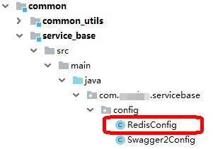

**<font style="color:rgb(0, 0, 0);">RedisConfig.java</font>**

```java
@EnableCaching
@Configuration
public class RedisConfig extends CachingConfigurerSupport {
    
    @Bean
    public RedisTemplate<String, Object> redisTemplate(RedisConnectionFactory factory) {
        RedisTemplate<String, Object> template = new RedisTemplate<>();
        RedisSerializer<String> redisSerializer = new StringRedisSerializer();
        Jackson2JsonRedisSerializer jackson2JsonRedisSerializer = new Jackson2JsonRedisSerializer(Object.class);
        ObjectMapper om = new ObjectMapper();
        om.setVisibility(PropertyAccessor.ALL, JsonAutoDetect.Visibility.ANY);
        om.enableDefaultTyping(ObjectMapper.DefaultTyping.NON_FINAL);
        jackson2JsonRedisSerializer.setObjectMapper(om);
        template.setConnectionFactory(factory);
        //key序列化方式
        template.setKeySerializer(redisSerializer);
        //value序列化
        template.setValueSerializer(jackson2JsonRedisSerializer);
        //value hashmap序列化
        template.setHashValueSerializer(jackson2JsonRedisSerializer);
        return template;
    }
    
    @Bean
    public CacheManager cacheManager(RedisConnectionFactory factory) {
        RedisSerializer<String> redisSerializer = new StringRedisSerializer();
        Jackson2JsonRedisSerializer jackson2JsonRedisSerializer = new Jackson2JsonRedisSerializer(Object.class);
        //解决查询缓存转换异常的问题
        ObjectMapper om = new ObjectMapper();
        om.setVisibility(PropertyAccessor.ALL, JsonAutoDetect.Visibility.ANY);
        om.enableDefaultTyping(ObjectMapper.DefaultTyping.NON_FINAL);
        jackson2JsonRedisSerializer.setObjectMapper(om);
        // 配置序列化（解决乱码的问题）,过期时间600秒
        RedisCacheConfiguration config = RedisCacheConfiguration.defaultCacheConfig()
                .entryTtl(Duration.ofSeconds(600))
              .serializeKeysWith(RedisSerializationContext.SerializationPair.fromSerializer(redisSerializer))
                .serializeValuesWith(RedisSerializationContext.SerializationPair.fromSerializer(jackson2JsonRedisSerializer))
                .disableCachingNullValues();
        RedisCacheManager cacheManager = RedisCacheManager.builder(factory)
                .cacheDefaults(config)
                .build();
        return cacheManager;
    }
}
```

### <font style="color:rgb(0, 0, 0);">在接口中添加 redis 缓存</font>
<font style="color:rgb(0, 0, 0);">由于首页数据变化不是很频繁，而且首页访问量相对较大，所以我们有必要把首页接口数据缓存到 redis 缓存中，减少数据库压力和提高访问速度。</font>

<font style="color:rgb(0, 0, 0);">改造 service-cms 模块首页 banner 接口，首页课程与讲师接口类似</font>

#### <font style="color:rgb(0, 0, 0);">SpringBoot 缓存注解</font>
**<font style="color:rgb(0, 0, 0);">缓存 @Cacheable</font>**

<font style="color:rgb(0, 0, 0);">根据方法对其返回结果进行缓存，下次请求时，如果缓存存在，则直接读取缓存数据返回；如果缓存不存在，则执行方法，并把方法的执行结果存入缓存中。一般用在查询方法上。</font>

<font style="color:rgb(0, 0, 0);">查看源码，属性值如下：</font>

| **<font style="color:rgb(0, 0, 0);">属性</font>****<font style="color:rgb(0, 0, 0);">/</font>****<font style="color:rgb(0, 0, 0);">方法名</font>** | **<font style="color:rgb(0, 0, 0);">解释</font>** |
| --- | --- |
| <font style="color:rgb(0, 0, 0);">value</font> | <font style="color:rgb(0, 0, 0);">缓存名，必填，它指定了你的缓存存放在哪块命名空间</font> |
| <font style="color:rgb(0, 0, 0);">cacheNames</font> | <font style="color:rgb(0, 0, 0);">与</font><font style="color:rgb(0, 0, 0);"> </font><font style="color:rgb(0, 0, 0);">value</font><font style="color:rgb(0, 0, 0);"> </font><font style="color:rgb(0, 0, 0);">差不多，二选一即可</font> |
| <font style="color:rgb(0, 0, 0);">key</font> | <font style="color:rgb(0, 0, 0);">可选属性，可以使用 SpEL 标签自定义缓存的 key</font> |


**<font style="color:rgb(0, 0, 0);">缓存 @CachePut</font>**

<font style="color:rgb(0, 0, 0);">使用该注解标志的方法，方法体内容每次都会执行，并将结果存入指定的缓存中。其他方法可以直接从相应的缓存中读取缓存数据，而不需要再去查询数据库。一般用在新增、修改方法上。</font>

<font style="color:rgb(0, 0, 0);">查看源码，属性值如下：</font>

| **<font style="color:rgb(0, 0, 0);">属性</font>****<font style="color:rgb(0, 0, 0);">/</font>****<font style="color:rgb(0, 0, 0);">方法名</font>** | **<font style="color:rgb(0, 0, 0);">解释</font>** |
| --- | --- |
| <font style="color:rgb(0, 0, 0);">value</font> | <font style="color:rgb(0, 0, 0);">缓存名，必填，它指定了你的缓存存放在哪块命名空间</font> |
| <font style="color:rgb(0, 0, 0);">cacheNames</font> | <font style="color:rgb(0, 0, 0);">与</font><font style="color:rgb(0, 0, 0);"> </font><font style="color:rgb(0, 0, 0);">value</font><font style="color:rgb(0, 0, 0);"> </font><font style="color:rgb(0, 0, 0);">差不多，二选一即可</font> |
| <font style="color:rgb(0, 0, 0);">key</font> | <font style="color:rgb(0, 0, 0);">可选属性，可以使用</font><font style="color:rgb(0, 0, 0);"> </font><font style="color:rgb(0, 0, 0);">SpEL</font><font style="color:rgb(0, 0, 0);"> </font><font style="color:rgb(0, 0, 0);">标签自定义缓存的</font><font style="color:rgb(0, 0, 0);">key</font> |


**<font style="color:rgb(0, 0, 0);">缓存 @CacheEvict</font>**

<font style="color:rgb(0, 0, 0);">使用该注解标志的方法，会清空指定的缓存。一般用在更新或者删除方法上</font>

<font style="color:rgb(0, 0, 0);">查看源码，属性值如下：</font>

| **<font style="color:rgb(0, 0, 0);">属性</font>****<font style="color:rgb(0, 0, 0);">/</font>****<font style="color:rgb(0, 0, 0);">方法名</font>** | **<font style="color:rgb(0, 0, 0);">解释</font>** |
| --- | --- |
| <font style="color:rgb(0, 0, 0);">value</font> | <font style="color:rgb(0, 0, 0);">缓存名，必填，它指定了你的缓存存放在哪块命名空间</font> |
| <font style="color:rgb(0, 0, 0);">cacheNames</font> | <font style="color:rgb(0, 0, 0);">与</font><font style="color:rgb(0, 0, 0);"> </font><font style="color:rgb(0, 0, 0);">value</font><font style="color:rgb(0, 0, 0);"> </font><font style="color:rgb(0, 0, 0);">差不多，二选一即可</font> |
| <font style="color:rgb(0, 0, 0);">key</font> | <font style="color:rgb(0, 0, 0);">可选属性，可以使用</font><font style="color:rgb(0, 0, 0);"> </font><font style="color:rgb(0, 0, 0);">SpEL</font><font style="color:rgb(0, 0, 0);"> </font><font style="color:rgb(0, 0, 0);">标签自定义缓存的</font><font style="color:rgb(0, 0, 0);">key</font> |
| <font style="color:rgb(0, 0, 0);">allEntries</font> | <font style="color:rgb(0, 0, 0);">是否清空所有缓存，默认为</font><font style="color:rgb(0, 0, 0);"> </font><font style="color:rgb(0, 0, 0);">false</font><font style="color:rgb(0, 0, 0);">。如果指定为</font><font style="color:rgb(0, 0, 0);"> </font><font style="color:rgb(0, 0, 0);">true</font><font style="color:rgb(0, 0, 0);">，则方法调用后将立即清空所有的缓存</font> |
| <font style="color:rgb(0, 0, 0);">beforeInvocation</font> | <font style="color:rgb(0, 0, 0);">是否在方法执行前就清空，默认为</font><font style="color:rgb(0, 0, 0);"> </font><font style="color:rgb(0, 0, 0);">false</font><font style="color:rgb(0, 0, 0);">。如果指定为</font><font style="color:rgb(0, 0, 0);"> </font><font style="color:rgb(0, 0, 0);">true</font><font style="color:rgb(0, 0, 0);">，则在方法执行前就会清空缓存</font> |


#### <font style="color:rgb(0, 0, 0);">启动 redis 服务</font>
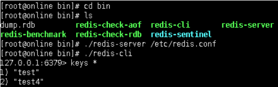

#### <font style="color:rgb(0, 0, 0);">连接 redis 服务可能遇到的问题</font>
**<font style="color:rgb(0, 0, 0);">（1）关闭 linux 防火墙</font>**

**<font style="color:rgb(0, 0, 0);">（2）找到 redis 配置文件， 注释一行配置</font>**

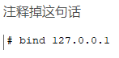

**<font style="color:rgb(0, 0, 0);">（3）如果出现下面错误提示</font>**

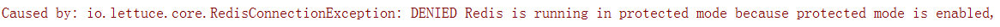

**<font style="color:rgb(0, 0, 0);">修改：protected-mode  yes</font>**

**<font style="color:rgb(0, 0, 0);">改为：</font>****<font style="color:rgb(255, 0, 0);">protected-mode no</font>**

#### <font style="color:rgb(0, 0, 0);">banner 接口改造</font>
<font style="color:rgb(0, 0, 0);">（1）在 service-cms 模块配置文件添加 redis 配置</font>

```properties
spring.redis.host=192.168.44.132
spring.redis.port=6379
spring.redis.database= 0
spring.redis.timeout=1800000

spring.redis.lettuce.pool.max-active=20
spring.redis.lettuce.pool.max-wait=-1
#最大阻塞等待时间(负数表示没限制)
spring.redis.lettuce.pool.max-idle=5
spring.redis.lettuce.pool.min-idle=0
```

**<font style="color:rgb(0, 0, 0);">（2）修改 CrmBannerServiceImpl，添加 redis 缓存注解</font>**

```java

@Service
public class CrmBannerServiceImpl extends ServiceImpl<CrmBannerMapper, CrmBanner> implements CrmBannerService {
    
    @Cacheable(value = "banner", key = "'selectIndexList'")
    @Override
    public List<CrmBanner> selectIndexList() {
        List<CrmBanner> list = baseMapper.selectList(new QueryWrapper<CrmBanner>().orderByDesc("sort"));
        return list;
    }
    
    @Override
    public void pageBanner(Page<CrmBanner> pageParam, Object o) {
        baseMapper.selectPage(pageParam,null);
    }
    
    @Override
    public CrmBanner getBannerById(String id) {
        return baseMapper.selectById(id);
    }
    
    @CacheEvict(value = "banner", allEntries=true)
    @Override
    public void saveBanner(CrmBanner banner) {
        baseMapper.insert(banner);
    }
    
    @CacheEvict(value = "banner", allEntries=true)
    @Override
    public void updateBannerById(CrmBanner banner) {
        baseMapper.updateById(banner);
    }
    
    @CacheEvict(value = "banner", allEntries=true)
    @Override
    public void removeBannerById(String id) {
        baseMapper.deleteById(id);
    }
}
```

**<font style="color:rgb(0, 0, 0);">（3）在 redis 添加了 key</font>**

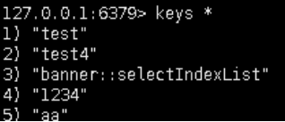

**<font style="color:rgb(0, 0, 0);">（4）通过源码查看到 key 生成的规则</font>**

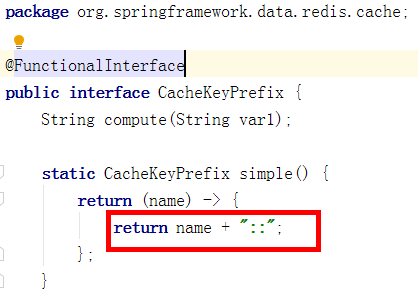


> 更新: 2024-07-23 14:01:18  
> 原文: <https://www.yuque.com/u41736172/az9urv/bz07nxntccdoy6tg>