# 第十七天【权限管理】

# 一、今日内容
+ SpringCloud GateWay 网关
+ 权限管理功能（接口）
    - 权限管理需求描述
    - 开发权限管理接口

# 二、SpringCloud GateWay 网关
## <font style="color:rgb(51, 51, 51);">网关基本概念</font>


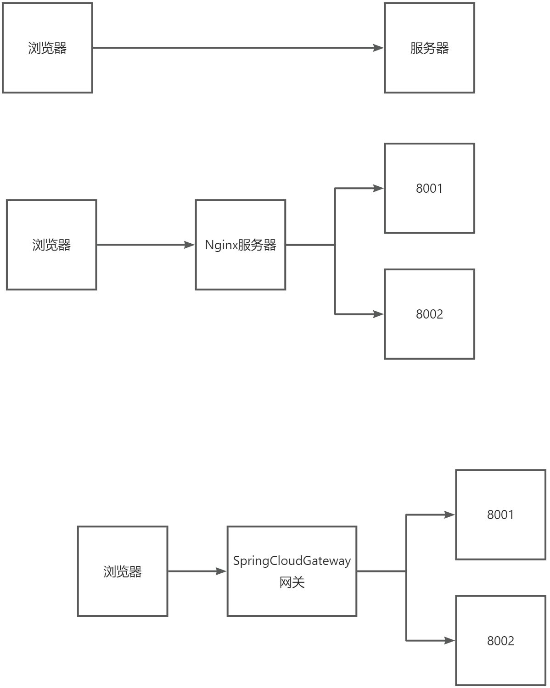

### <font style="color:rgb(51, 51, 51);">API 网关介绍</font>
<font style="color:rgb(0, 0, 0);">API</font><font style="color:rgb(0, 0, 0);"> </font><font style="color:rgb(0, 0, 0);">网关出现的原因是微服务架构的出现，不同的微服务一般会有不同的网络地址，而外部客户端可能需要调用多个服务的接口才能完成一个业务需求，如果让客户端直接与各个微服务通信，会有以下的问题：</font>

<font style="color:rgb(0, 0, 0);">（1）</font><font style="color:rgb(0, 0, 0);">客户端会多次请求不同的微服务，增加了客户端的复杂性。</font>

<font style="color:rgb(0, 0, 0);">（2）</font><font style="color:rgb(0, 0, 0);">存在跨域请求，在一定场景下处理相对复杂。</font>

<font style="color:rgb(0, 0, 0);">（3）</font><font style="color:rgb(0, 0, 0);">认证复杂，每个服务都需要独立认证。</font>

<font style="color:rgb(0, 0, 0);">（4）</font><font style="color:rgb(0, 0, 0);">难以重构，随着项目的迭代，可能需要重新划分微服务。例如，可能将多个服务合并成一个或者将一个服务拆分成多个。如果客户端直接与微服务通信，那么重构将会很难实施。</font>

<font style="color:rgb(0, 0, 0);">（5）</font><font style="color:rgb(0, 0, 0);">某些微服务可能使用了防火墙</font><font style="color:rgb(0, 0, 0);"> </font><font style="color:rgb(0, 0, 0);">/</font><font style="color:rgb(0, 0, 0);"> </font><font style="color:rgb(0, 0, 0);">浏览器不友好的协议，直接访问会有一定的困难。</font>

<font style="color:rgb(0, 0, 0);">以上这些问题可以借助 API 网关解决。API 网关是介于客户端和服务器端之间的中间层，所有的外部请求都会先经过 API 网关这一层。也就是说，API 的实现方面更多的考虑业务逻辑，而安全、性能、监控可以交由 API 网关来做，这样既提高业务灵活性又不缺安全性</font>

### <font style="color:rgb(0, 0, 0);">Spring Cloud Gateway</font>
**<font style="color:rgb(0, 0, 0);">Spring cloud gateway </font>**<font style="color:rgb(0, 0, 0);">是 Spring 官方基于 Spring 5.0、Spring Boot2.0 和 Project Reactor 等技术开发的网关，Spring Cloud Gateway 旨在为微服务架构提供简单、有效和统一的 API 路由管理方式，Spring Cloud Gateway 作为 Spring Cloud 生态系统中的网关，目标是替代 Netflix Zuul，其不仅提供统一的路由方式，并且还基于 Filer 链的方式提供了网关基本的功能，例如：安全、监控/埋点、限流等。</font>

<font style="color:rgb(0, 0, 0);">load balance lb</font>

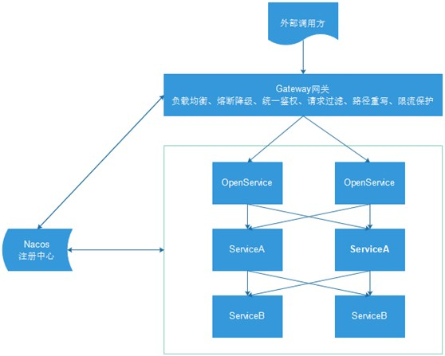

### <font style="color:rgb(0, 0, 0);">Spring Cloud Gateway 核心概念</font>
<font style="color:rgb(0, 0, 0);">网关提供 API 全托管服务，丰富的API管理功能，辅助企业管理大规模的 API，以降低管理成本和安全风险，包括协议适配、协议转发、安全策略、防刷、流量、监控日志等贡呢。一般来说网关对外暴露的 URL 或者接口信息，我们统称为路由信息。如果研发过网关中间件或者使用过Zuul的人，会知道网关的核心是 Filter 以及 Filter Chain（Filter 责任链）。Spring Cloud Gateway 也具有路由和 Filter 的概念。下面介绍一下 Spring Cloud Gateway 中几个重要的概念。</font>

<font style="color:rgb(0, 0, 0);">（1）路由。路由是网关最基础的部分，路由信息有一个 ID、一个目的 URL、一组断言和一组 Filter 组成。如果断言路由为真，则说明请求的 URL 和配置匹配</font>

<font style="color:rgb(0, 0, 0);">（2）断言。Java8 中的断言函数。Spring Cloud Gateway 中的断言函数输入类型是 Spring5.0 框架中的ServerWebExchange。Spring Cloud Gateway 中的断言函数允许开发者去定义匹配来自于 http request 中的任何信息，比如请求头和参数等。</font>

<font style="color:rgb(0, 0, 0);">（3）过滤器。一个标准的 Spring webFilter。Spring cloud gateway 中的 filter 分为两种类型的 Filter，分别是 Gateway Filter 和 Global Filter。过滤器 Filter 将会对请求和响应进行修改处理</font>


<font style="color:rgb(0, 0, 0);">如上图所示，Spring cloud Gateway 发出请求。然后再由 Gateway Handler Mapping 中找到与请求相匹配的路由，将其发送到 Gateway web handler。Handler 再通过指定的过滤器链将请求发送到我们实际的服务执行业务逻辑，然后返回。</font>

## <font style="color:rgb(0, 0, 0);">创建 api-gateway 模块（网关服务）</font>
### <font style="color:rgb(0, 0, 0);">在 infrastructure 模块下创建 api_gateway 模块</font>
artifactId：api-gateway

### <font style="color:rgb(0, 0, 0);">在 pom.xml 引入依赖</font>
```xml
<dependencies>
    <dependency>
        <groupId>com.xszx</groupId>
        <artifactId>common_utils</artifactId>
        <version>0.0.1-SNAPSHOT</version>
    </dependency>

    <dependency>
        <groupId>org.springframework.cloud</groupId>
        <artifactId>spring-cloud-starter-alibaba-nacos-discovery</artifactId>
    </dependency>

    <dependency>
        <groupId>org.springframework.cloud</groupId>
        <artifactId>spring-cloud-starter-gateway</artifactId>
    </dependency>

    <!--gson-->
    <dependency>
        <groupId>com.google.code.gson</groupId>
        <artifactId>gson</artifactId>
    </dependency>

    <!--服务调用-->
    <dependency>
        <groupId>org.springframework.cloud</groupId>
        <artifactId>spring-cloud-starter-openfeign</artifactId>
    </dependency>
</dependencies>
```

### <font style="color:rgb(51, 51, 51);">编写 application.properties 配置文件</font>
```properties
# 服务端口
server.port=8222

# 服务名
spring.application.name=service-gateway

# nacos服务地址
spring.cloud.nacos.discovery.server-addr=127.0.0.1:8848

#使用服务发现路由
spring.cloud.gateway.discovery.locator.enabled=true

#服务路由名小写
#spring.cloud.gateway.discovery.locator.lower-case-service-id=true

#设置路由id
spring.cloud.gateway.routes[0].id=service-acl

#设置路由的uri
spring.cloud.gateway.routes[0].uri=lb://service-acl

#设置路由断言,代理servicerId为auth-service的/auth/路径
spring.cloud.gateway.routes[0].predicates= Path=/*/acl/**

#配置service-edu服务
spring.cloud.gateway.routes[1].id=service-edu
spring.cloud.gateway.routes[1].uri=lb://service-edu
spring.cloud.gateway.routes[1].predicates= Path=/eduservice/**

#配置service-ucenter服务
spring.cloud.gateway.routes[2].id=service-ucenter
spring.cloud.gateway.routes[2].uri=lb://service-ucenter
spring.cloud.gateway.routes[2].predicates= Path=/ucenterservice/**

#配置service-ucenter服务
spring.cloud.gateway.routes[3].id=service-cms
spring.cloud.gateway.routes[3].uri=lb://service-cms
spring.cloud.gateway.routes[3].predicates= Path=/cmsservice/**

spring.cloud.gateway.routes[4].id=service-msm
spring.cloud.gateway.routes[4].uri=lb://service-msm
spring.cloud.gateway.routes[4].predicates= Path=/edumsm/**

spring.cloud.gateway.routes[5].id=service-order
spring.cloud.gateway.routes[5].uri=lb://service-order
spring.cloud.gateway.routes[5].predicates= Path=/orderservice/**

spring.cloud.gateway.routes[6].id=service-order
spring.cloud.gateway.routes[6].uri=lb://service-order
spring.cloud.gateway.routes[6].predicates= Path=/orderservice/**

spring.cloud.gateway.routes[7].id=service-oss
spring.cloud.gateway.routes[7].uri=lb://service-oss
spring.cloud.gateway.routes[7].predicates= Path=/eduoss/**

spring.cloud.gateway.routes[8].id=service-statistic
spring.cloud.gateway.routes[8].uri=lb://service-statistic
spring.cloud.gateway.routes[8].predicates= Path=/staservice/**

spring.cloud.gateway.routes[9].id=service-vod
spring.cloud.gateway.routes[9].uri=lb://service-vod
spring.cloud.gateway.routes[9].predicates= Path=/eduvod/**

spring.cloud.gateway.routes[10].id=service-edu
spring.cloud.gateway.routes[10].uri=lb://service-edu
spring.cloud.gateway.routes[10].predicates= Path=/eduuser/**
```

**<font style="color:#333333;">yml 文件：</font>**

```yaml
server:
  port: 8222

spring:
  application:
  cloud:
    gateway:
      discovery:
        locator:
          enabled: true
      routes:
      - id: SERVICE-ACL
        uri: lb://SERVICE-ACL
        predicates:
        - Path=/*/acl/** # 路径匹配
      - id: SERVICE-EDU
        uri: lb://SERVICE-EDU
        predicates:
        - Path=/eduservice/** # 路径匹配
      - id: SERVICE-UCENTER
        uri: lb://SERVICE-UCENTER
        predicates:
        - Path=/ucenter/** # 路径匹配
    nacos:
      discovery:
        server-addr: 127.0.0.1:8848
```

### <font style="color:rgb(0, 0, 0);">编写启动类</font>
```java
@SpringBootApplication
public class ApiGatewayApplication {

    public static void main(String[] args) {
        SpringApplication.run(ApiGatewayApplication.class, args);
    }
}
```

### 测试
配置好网关后，我们可以将网关模块启动起来，将其他模块启动起来，比如启动 edu。

然后通过访问网关去访问 edu 模块。

## <font style="color:rgb(0, 0, 0);">网关相关配置</font>
<font style="color:rgb(0, 0, 0);">在网关服务模块做如下操作。</font>

### <font style="color:rgb(0, 0, 0);">网关解决跨域问题</font>
**<font style="color:rgb(0, 0, 0);">（1）创建配置类</font>**

```java
@Configuration
public class CorsConfig {
    
    @Bean
    public CorsWebFilter corsFilter() {
        CorsConfiguration config = new CorsConfiguration();
        config.addAllowedMethod("*");
        config.addAllowedOrigin("*");
        config.addAllowedHeader("*");

        UrlBasedCorsConfigurationSource source = new UrlBasedCorsConfigurationSource(new PathPatternParser());
        source.registerCorsConfiguration("/**", config);

        return new CorsWebFilter(source);
    }
}
```

### <font style="color:rgb(0, 0, 0);">全局 Filter，统一处理会员登录与外部不允许访问的服务</font>
```java
import com.google.gson.JsonObject;
import org.springframework.cloud.gateway.filter.GatewayFilterChain;
import org.springframework.cloud.gateway.filter.GlobalFilter;
import org.springframework.core.Ordered;
import org.springframework.core.io.buffer.DataBuffer;
import org.springframework.http.server.reactive.ServerHttpRequest;
import org.springframework.http.server.reactive.ServerHttpResponse;
import org.springframework.stereotype.Component;
import org.springframework.util.AntPathMatcher;
import org.springframework.web.server.ServerWebExchange;
import reactor.core.publisher.Mono;

import java.nio.charset.StandardCharsets;
import java.util.List;

/**
 * <p>
 * 全局Filter，统一处理会员登录与外部不允许访问的服务
 * </p>
 */
@Component
public class AuthGlobalFilter implements GlobalFilter, Ordered {

    private AntPathMatcher antPathMatcher = new AntPathMatcher();

    @Override
    public Mono<Void> filter(ServerWebExchange exchange, GatewayFilterChain chain) {
        ServerHttpRequest request = exchange.getRequest();
        String path = request.getURI().getPath();
        //勤学网api接口，校验用户必须登录
        if(antPathMatcher.match("/api/**/auth/**", path)) {
            List<String> tokenList = request.getHeaders().get("token");
            if(null == tokenList) {
                ServerHttpResponse response = exchange.getResponse();
                return out(response);
            } else {
//                Boolean isCheck = JwtUtils.checkToken(tokenList.get(0));
//                if(!isCheck) {
                    ServerHttpResponse response = exchange.getResponse();
                    return out(response);
//                }
            }
        }
        //内部服务接口，不允许外部访问
        if(antPathMatcher.match("/**/inner/**", path)) {
            ServerHttpResponse response = exchange.getResponse();
            return out(response);
        }

        return chain.filter(exchange);
    }

    @Override
    public int getOrder() {
        return 0;
    }

    private Mono<Void> out(ServerHttpResponse response) {
        JsonObject message = new JsonObject();
        message.addProperty("success", false);
        message.addProperty("code", 28004);
        message.addProperty("data", "鉴权失败");
        byte[] bits = message.toString().getBytes(StandardCharsets.UTF_8);
        DataBuffer buffer = response.bufferFactory().wrap(bits);
        //response.setStatusCode(HttpStatus.UNAUTHORIZED);
        //指定编码，否则在浏览器中会中文乱码
        response.getHeaders().add("Content-Type", "application/json;charset=UTF-8");
        return response.writeWith(Mono.just(buffer));
    }
}
```

### <font style="color:rgb(0, 0, 0);">自定义异常处理</font>
**<font style="color:rgb(0, 0, 0);">服务网关调用服务时可能会有一些异常或服务不可用，它返回错误信息不友好，需要我们覆盖处理</font>**

**<font style="color:rgb(0, 0, 0);">ErrorHandlerConfig：</font>**

```java
import org.springframework.beans.factory.ObjectProvider;
import org.springframework.boot.autoconfigure.web.ResourceProperties;
import org.springframework.boot.autoconfigure.web.ServerProperties;
import org.springframework.boot.context.properties.EnableConfigurationProperties;
import org.springframework.boot.web.reactive.error.ErrorAttributes;
import org.springframework.boot.web.reactive.error.ErrorWebExceptionHandler;
import org.springframework.context.ApplicationContext;
import org.springframework.context.annotation.Bean;
import org.springframework.context.annotation.Configuration;
import org.springframework.core.Ordered;
import org.springframework.core.annotation.Order;
import org.springframework.http.codec.ServerCodecConfigurer;
import org.springframework.web.reactive.result.view.ViewResolver;
import java.util.Collections;
import java.util.List;

/**
 * 覆盖默认的异常处理
 *
 */
@Configuration
@EnableConfigurationProperties({ServerProperties.class, ResourceProperties.class})
public class ErrorHandlerConfig {

    private final ServerProperties serverProperties;

    private final ApplicationContext applicationContext;

    private final ResourceProperties resourceProperties;

    private final List<ViewResolver> viewResolvers;

    private final ServerCodecConfigurer serverCodecConfigurer;

    public ErrorHandlerConfig(ServerProperties serverProperties,
                                     ResourceProperties resourceProperties,
                                     ObjectProvider<List<ViewResolver>> viewResolversProvider,
                                        ServerCodecConfigurer serverCodecConfigurer,
                                     ApplicationContext applicationContext) {
        this.serverProperties = serverProperties;
        this.applicationContext = applicationContext;
        this.resourceProperties = resourceProperties;
        this.viewResolvers = viewResolversProvider.getIfAvailable(Collections::emptyList);
        this.serverCodecConfigurer = serverCodecConfigurer;
    }

    @Bean
    @Order(Ordered.HIGHEST_PRECEDENCE)
    public ErrorWebExceptionHandler errorWebExceptionHandler(ErrorAttributes errorAttributes) {
        JsonExceptionHandler exceptionHandler = new JsonExceptionHandler(
                errorAttributes,
                this.resourceProperties,
                this.serverProperties.getError(),
                this.applicationContext);
        exceptionHandler.setViewResolvers(this.viewResolvers);
        exceptionHandler.setMessageWriters(this.serverCodecConfigurer.getWriters());
        exceptionHandler.setMessageReaders(this.serverCodecConfigurer.getReaders());
        return exceptionHandler;
    }
}
```

JsonExceptionHandler：

```java
import org.springframework.boot.autoconfigure.web.ErrorProperties;
import org.springframework.boot.autoconfigure.web.ResourceProperties;
import org.springframework.boot.autoconfigure.web.reactive.error.DefaultErrorWebExceptionHandler;
import org.springframework.boot.web.reactive.error.ErrorAttributes;
import org.springframework.context.ApplicationContext;
import org.springframework.http.HttpStatus;
import org.springframework.web.reactive.function.server.*;
import java.util.HashMap;
import java.util.Map;

/**
 * 自定义异常处理
 *
 * <p>异常时用JSON代替HTML异常信息<p>
 *
 */
public class JsonExceptionHandler extends DefaultErrorWebExceptionHandler {

    public JsonExceptionHandler(ErrorAttributes errorAttributes, ResourceProperties resourceProperties,
                                ErrorProperties errorProperties, ApplicationContext applicationContext) {
        super(errorAttributes, resourceProperties, errorProperties, applicationContext);
    }

    /**
     * 获取异常属性
     */
    @Override
    protected Map<String, Object> getErrorAttributes(ServerRequest request, boolean includeStackTrace) {

        Map<String, Object> map = new HashMap<>();
        map.put("success", false);
        map.put("code", 20005);
        map.put("message", "网关失败");
        map.put("data", null);
        return map;
    }

    /**
     * 指定响应处理方法为JSON处理的方法
     * @param errorAttributes
     */
    @Override
    protected RouterFunction<ServerResponse> getRoutingFunction(ErrorAttributes errorAttributes) {
        return RouterFunctions.route(RequestPredicates.all(), this::renderErrorResponse);
    }

    /**
     * 根据code获取对应的HttpStatus
     * @param errorAttributes
     */
    @Override
    protected HttpStatus getHttpStatus(Map<String, Object> errorAttributes) {
        return HttpStatus.OK;
    }
}
```

### 测试
配置好网关后，我们就不需要使用 Nginx 服务器进行代理我们的微服务了。

前端项目的 base_url 地址直接是网关的地址，通过网关进行请求的分发。

另外，如果使用了网关进行跨域的处理后，我们每个 controller 上的跨域注解就必须去掉，不然报错！！！

# 三、权限管理需求描述
## <font style="color:rgb(51, 51, 51);">权限管理需求描述</font>
**<font style="color:rgb(0, 0, 0);">不同角色的用户登录后台管理系统拥有不同的菜单权限与功能权限，权限管理包含三个功能模块：菜单管理、角色管理和用户管理</font>**

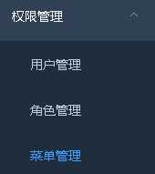

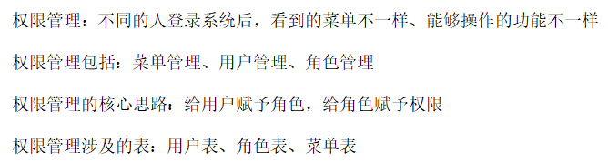

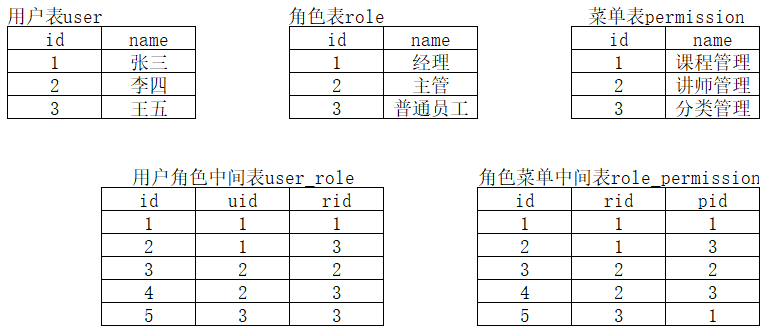

### <font style="color:rgb(0, 0, 0);">菜单管理</font>
**<font style="color:rgb(51, 51, 51);">（1）菜单列表：使用树形结构显示菜单列表</font>**

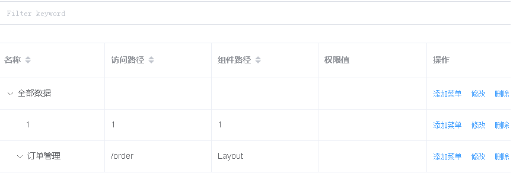

**<font style="color:rgb(0, 0, 0);">（2）添加菜单：点击添加菜单，弹框进行添加</font>**

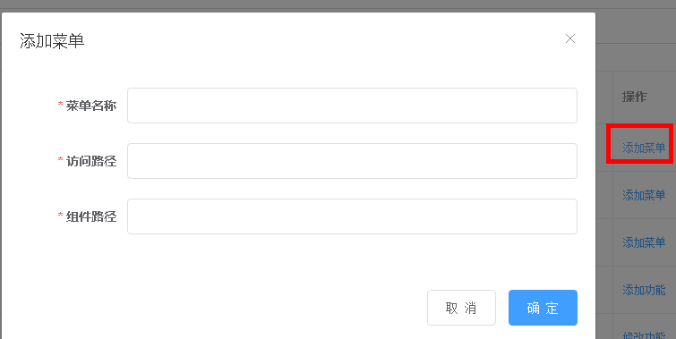

**<font style="color:rgb(0, 0, 0);">（3）修改菜单</font>**

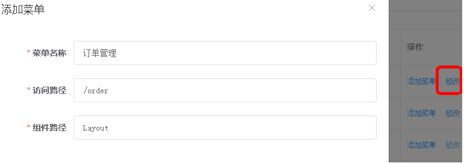

**<font style="color:rgb(0, 0, 0);">（4）删除菜单</font>**

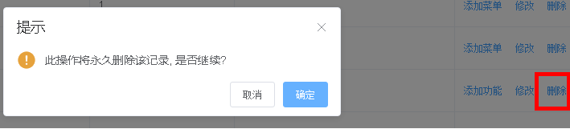

### <font style="color:rgb(0, 0, 0);">角色管理</font>
**<font style="color:rgb(51, 51, 51);">（1）角色列表：实现角色的条件查询带分页功能</font>**

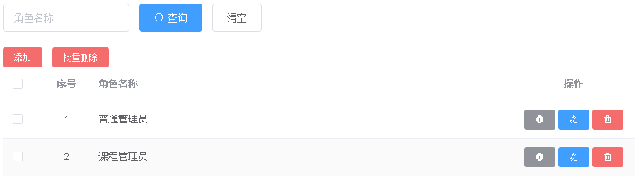

**<font style="color:rgb(0, 0, 0);">（2）角色添加</font>**

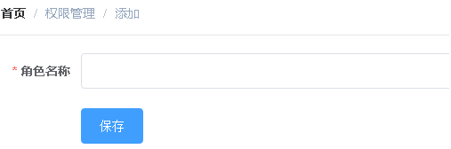

**<font style="color:rgb(0, 0, 0);">（3）角色修改</font>**

**<font style="color:rgb(0, 0, 0);">点击修改按钮</font>**

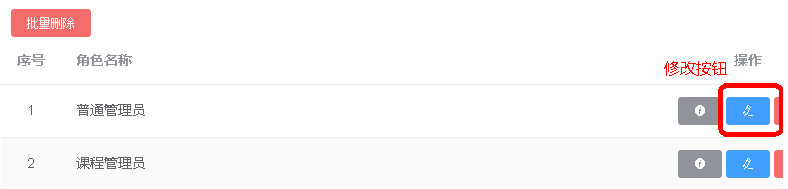

**<font style="color:rgb(0, 0, 0);">数据回显，进行修改</font>**

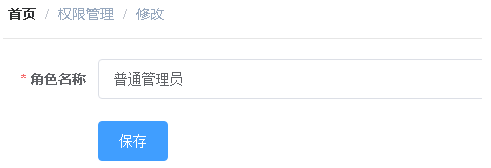

**<font style="color:rgb(0, 0, 0);">（4）角色删除</font>**

**<font style="color:rgb(0, 0, 0);">普通删除</font>**

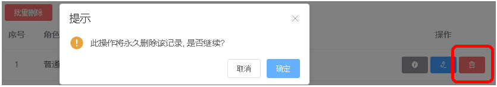

**<font style="color:rgb(0, 0, 0);">批量删除</font>**

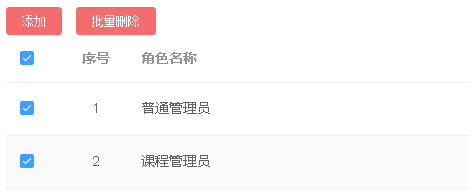

**<font style="color:rgb(0, 0, 0);">（5）角色分配菜单</font>**

**<font style="color:rgb(0, 0, 0);">点击分配按钮</font>**

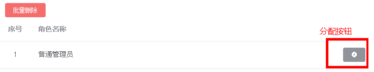

**<font style="color:rgb(0, 0, 0);">给角色分配菜单</font>**

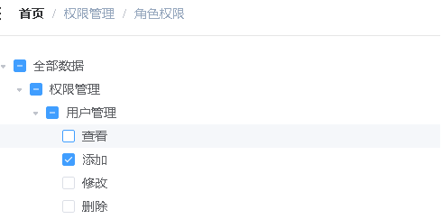

### <font style="color:rgb(0, 0, 0);">用户管理</font>
**<font style="color:rgb(51, 51, 51);">（1）用户列表</font>**

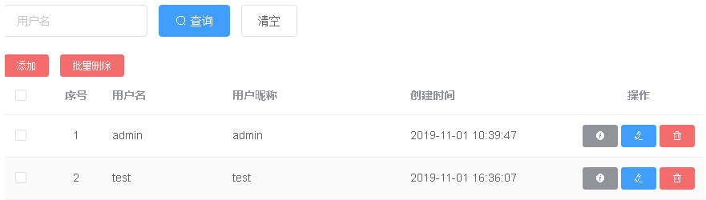

**<font style="color:rgb(0, 0, 0);">（2）用户添加</font>**

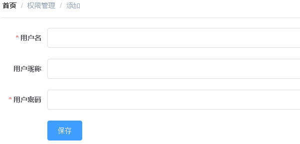

**<font style="color:rgb(0, 0, 0);">（3）用户修改</font>**

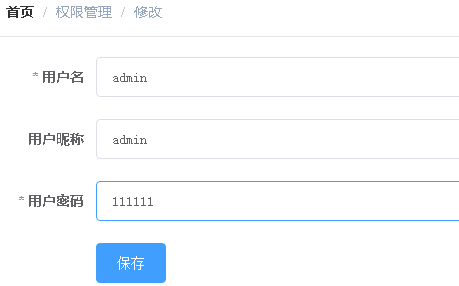

**<font style="color:rgb(0, 0, 0);">（4）用户删除</font>**

**<font style="color:rgb(0, 0, 0);">普通删除和批量删除</font>**

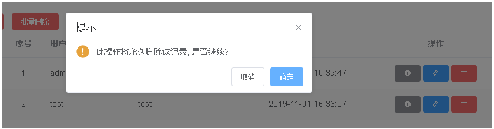

**<font style="color:rgb(0, 0, 0);">（5）用户分配角色</font>**

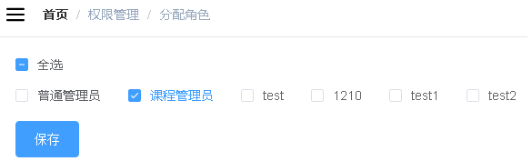

# 四、开发权限管理接口
## <font style="color:rgb(51, 51, 51);">创建权限管理服务</font>
### <font style="color:rgb(0, 0, 0);">在 service 模块下创建子模块 service-acl</font>
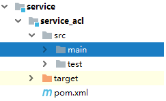

### <font style="color:rgb(0, 0, 0);">在 service_acl 模块中引入依赖</font>
```xml
<dependencies>
    <dependency>
        <groupId>com.xszx</groupId>
        <artifactId>spring_security</artifactId>
        <version>0.0.1-SNAPSHOT</version>
    </dependency>

    <dependency>
        <groupId>com.alibaba</groupId>
        <artifactId>fastjson</artifactId>
    </dependency>
</dependencies>
```

### <font style="color:rgb(51, 51, 51);">创建权限管理相关的表</font>
qinxue_acl.sql

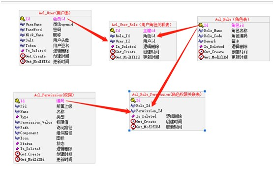

### <font style="color:rgb(51, 51, 51);">复制权限管理接口代码</font>
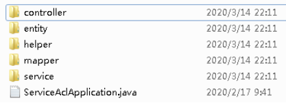

### <font style="color:rgb(51, 51, 51);">复制整合 Spring Security 代码</font>
**<font style="color:rgb(51, 51, 51);">（1）在 common 模块下创建子模块 spring_security</font>**

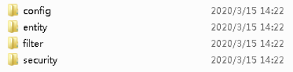

### <font style="color:rgb(51, 51, 51);">编写 application.properties 配置文件</font>
```properties
# 服务端口
server.port=8009

# 服务名
spring.application.name=service-acl

# nacos服务地址
spring.cloud.nacos.discovery.server-addr=127.0.0.1:8848

# mysql数据库连接
spring.datasource.driver-class-name=com.mysql.cj.jdbc.Driver
spring.datasource.url=jdbc:mysql://localhost:3306/qinxue_edu?serverTimezone=GMT%2B8
spring.datasource.username=root
spring.datasource.password=root

#返回json的全局时间格式
spring.jackson.date-format=yyyy-MM-dd HH:mm:ss
spring.jackson.time-zone=GMT+8

spring.redis.host=127.0.0.1
spring.redis.port=6379
spring.redis.database= 0
spring.redis.timeout=1800000

spring.redis.lettuce.pool.max-active=20
spring.redis.lettuce.pool.max-wait=-1
#最大阻塞等待时间(负数表示没限制)

spring.redis.lettuce.pool.max-idle=5
spring.redis.lettuce.pool.min-idle=0
#最小空闲

#配置mapper xml文件的路径
mybatis-plus.mapper-locations=classpath:com/xszx/aclservice/mapper/xml/*.xml

#mybatis日志
mybatis-plus.configuration.log-impl=org.apache.ibatis.logging.stdout.StdOutImpl
```

## <font style="color:rgb(51, 51, 51);">开发权限管理接口</font>
递归：对于某个问题的解决，可以将该问题拆分成一个个小问题，而且这些小问题也是类似的操作接着拆分

递归：不能是无穷尽的，得有结束的时候！

### <font style="color:rgb(0, 0, 0);">获取所有菜单</font>
**<font style="color:rgb(0, 0, 0);">（1）controller</font>**

```java
@RestController
@RequestMapping("/admin/acl/permission")
@CrossOrigin
public class PermissionController {

    @Autowired
    private PermissionService permissionService;

    //获取全部菜单
    @GetMapping
    public R indexAllPermission() {
        List<Permission> list =  permissionService.queryAllMenu();
        return R.ok().data("children",list);
    }
}
```

**<font style="color:rgb(0, 0, 0);">（2）service</font>**

```java
//获取全部菜单
@Override
public List<Permission> queryAllMenu() {

    QueryWrapper<Permission> wrapper = new QueryWrapper<>();
    wrapper.orderByDesc("id");
    List<Permission> permissionList = baseMapper.selectList(wrapper);

    List<Permission> result = bulid(permissionList);
    return result;
}
```

**<font style="color:rgb(0, 0, 0);">（3）在 Permission 实体类添加属性</font>**

```java
@ApiModelProperty(value = "层级")
@TableField(exist = false)
private Integer level;

@ApiModelProperty(value = "下级")
@TableField(exist = false)
private List<Permission> children;

@ApiModelProperty(value = "是否选中")
@TableField(exist = false)
private boolean isSelect;
```

**<font style="color:rgb(0, 0, 0);">（4）编写工具类，根据菜单构建数据</font>**

```java
package com.xszx.aclservice.helper;

import com.atguigu.aclservice.entity.Permission;
import java.util.ArrayList;
import java.util.List;
/**
 * <p>
 * 根据权限数据构建菜单数据
 * </p>
 */
public class PermissionHelper {

    /**
     * 使用递归方法建菜单
     * @param treeNodes
     * @return
     */
    public static List<Permission> bulid(List<Permission> treeNodes) {
        List<Permission> trees = new ArrayList<>();
        for (Permission treeNode : treeNodes) {
            if ("0".equals(treeNode.getPid())) {
                treeNode.setLevel(1);
                trees.add(findChildren(treeNode,treeNodes));
            }
        }
        return trees;
    }

    /**
     * 递归查找子节点
     * @param treeNodes
     * @return
     */
    public static Permission findChildren(Permission treeNode,List<Permission> treeNodes) {

        treeNode.setChildren(new ArrayList<Permission>());
        for (Permission it : treeNodes) {
            if(treeNode.getId().equals(it.getPid())) {
                int level = treeNode.getLevel() + 1;
                it.setLevel(level);
                if (treeNode.getChildren() == null) {
                    treeNode.setChildren(new ArrayList<>());
                }
                treeNode.getChildren().add(findChildren(it,treeNodes));
            }
        }
        return treeNode;
    }
}
```

### <font style="color:rgb(0, 0, 0);">递归删除菜单</font>
**<font style="color:rgb(0, 0, 0);">（1）controller</font>**

```java
@ApiOperation(value = "递归删除菜单")
@DeleteMapping("remove/{id}")
public R remove(@PathVariable String id) {
    permissionService.removeChildById(id);
    return R.ok();
}
```

**<font style="color:rgb(0, 0, 0);">（2）service</font>**

```java
//递归删除菜单
@Override
public void removeChildById(String id) {
    List<String> idList = new ArrayList<>();
    this.selectChildListById(id, idList);
    //把根据节点id放到list中
    idList.add(id);
    baseMapper.deleteBatchIds(idList);
}

/**
 *  递归获取子节点
 * @param id
 * @param idList
 */
private void selectChildListById(String id, List<String> idList) {

    List<Permission> childList = baseMapper.selectList(new QueryWrapper<Permission>().eq("pid", id).select("id"));
    childList.stream().forEach(item -> {
        idList.add(item.getId());
        this.selectChildListById(item.getId(), idList);
    });
}
```

### <font style="color:rgb(0, 0, 0);">给角色分配权限</font>
**<font style="color:rgb(0, 0, 0);">（1）controller</font>**

```java
@ApiOperation(value = "给角色分配权限")
@PostMapping("/doAssign")
public R doAssign(String roleId,String[] permissionId) {
    permissionService.saveRolePermissionRealtionShip(roleId,permissionId);
    return R.ok();
}
```

**<font style="color:rgb(0, 0, 0);">（2）service</font>**

```java
//给角色分配权限
@Override
public void saveRolePermissionRealtionShip(String roleId, String[] permissionIds) {

    rolePermissionService.remove(new QueryWrapper<RolePermission>().eq("role_id", roleId));

    List<RolePermission> rolePermissionList = new ArrayList<>();
    for(String permissionId : permissionIds) {
        if(StringUtils.isEmpty(permissionId)) continue;
        RolePermission rolePermission = new RolePermission();
        rolePermission.setRoleId(roleId);
        rolePermission.setPermissionId(permissionId);
        rolePermissionList.add(rolePermission);
    }
    rolePermissionService.saveBatch(rolePermissionList);
}
```

### 使用 swagger 测试
注释掉：

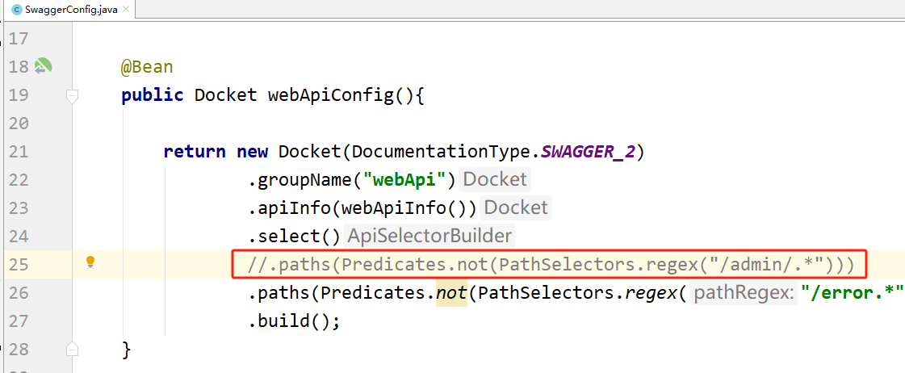


> 更新: 2024-08-13 17:01:36  
> 原文: <https://www.yuque.com/u41736172/az9urv/svhvgdvpp3tqg3af>