# 第十三天【微信扫描登录】

# 一、主要内容
+ OAuth2
    - OAuth2 的使用场景
    - OAuth2 的正式定义
+ 微信扫描登录
    - 生成授权 URL
    - 开发回调 URL
    - JWT 令牌
    - 前端整合和显示用户登录信息

# 二、OAuth2 的使用场景
## <font style="color:rgb(0, 0, 0);">OAuth2 解决什么问题</font>
OAuth2 主要解决两类问题：

+ 系统之间授权的问题
+ 分布式项目登录的问题

### <font style="color:rgb(0, 0, 0);">OAuth2 提出的背景</font>
<font style="color:rgb(0, 0, 0);">照片拥有者想要在云冲印服务上打印照片，云冲印服务需要访问云存储服务上的资源</font>

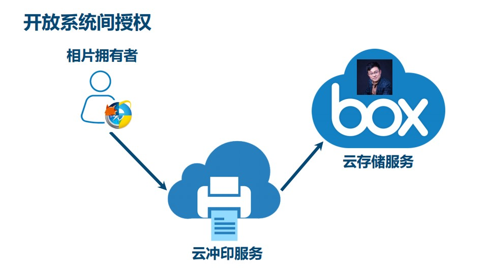

### <font style="color:rgb(0, 0, 0);">图例</font>
<font style="color:rgb(0, 0, 0);">资源拥有者：照片拥有者</font>

<font style="color:rgb(0, 0, 0);">客户应用：云冲印</font>

<font style="color:rgb(0, 0, 0);">受保护的资源：照片</font>

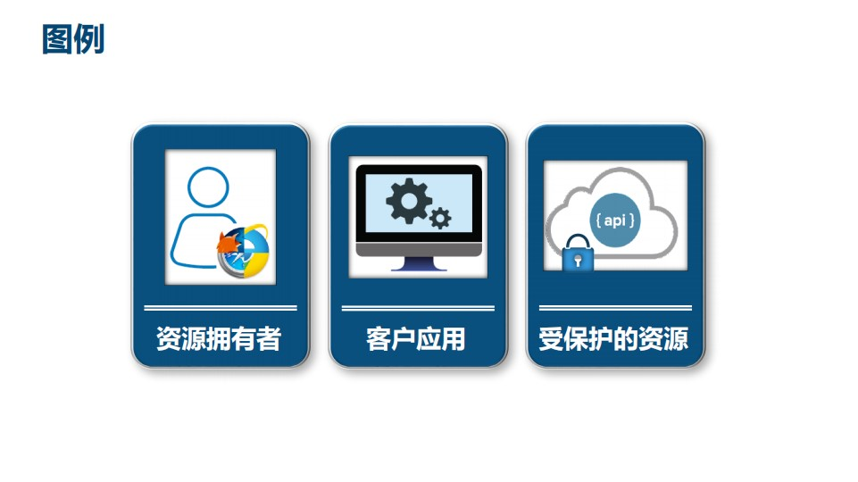

### <font style="color:rgb(0, 0, 0);">方式一：用户名密码复制</font>
<font style="color:rgb(0, 0, 0);">适用于同一公司内部的多个系统，不适用于不受信的第三方应用</font>

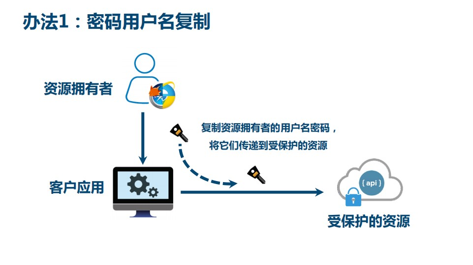

### <font style="color:rgb(0, 0, 0);">方式二：通用开发者 key</font>
<font style="color:rgb(0, 0, 0);">适用于合作商或者授信的不同业务部门之间</font>

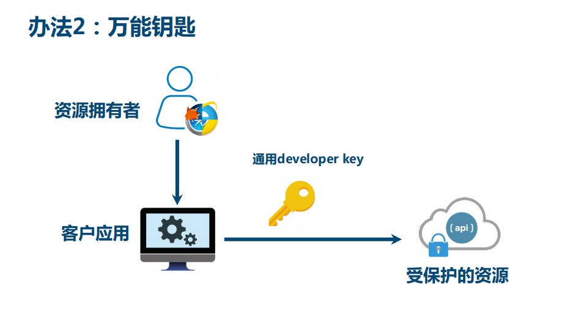

### <font style="color:rgb(0, 0, 0);">方式三：办法令牌</font>
<font style="color:rgb(0, 0, 0);">接近 OAuth2 方式，需要考虑如何管理令牌、颁发令牌、吊销令牌，需要统一的协议，因此就有了OAuth2 协议</font>

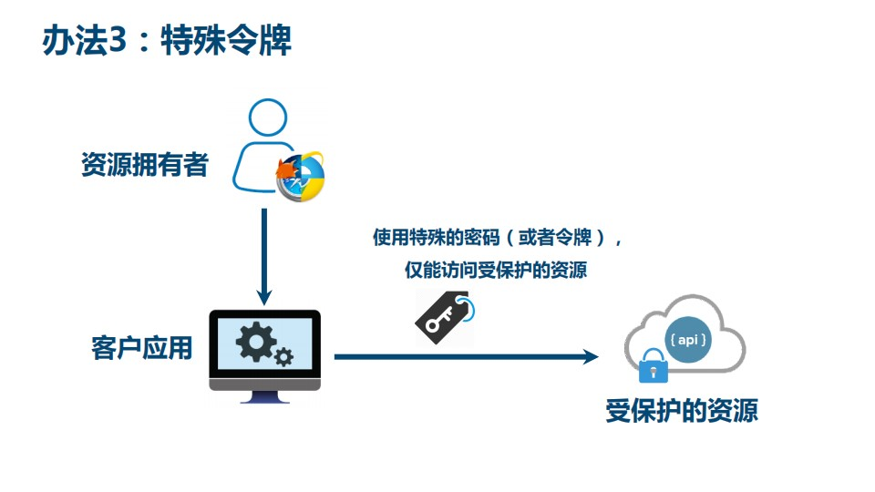

## <font style="color:rgb(0, 0, 0);">现代微服务安全</font>
<font style="color:rgb(0, 0, 0);">除了开放系统授权，OAuth2 还可以应用于现代微服务安全</font>

### <font style="color:rgb(0, 0, 0);">传统单块应用的安全</font>
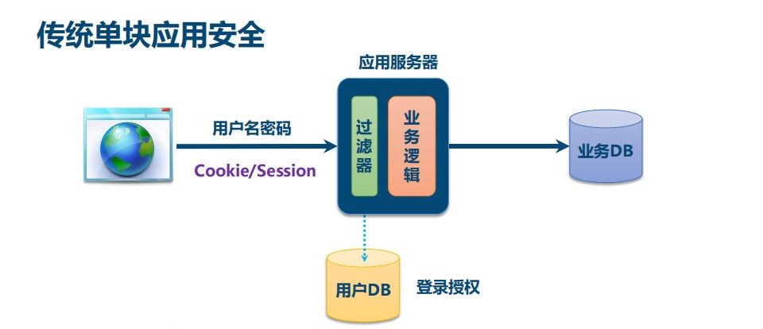

### <font style="color:rgb(0, 0, 0);">现代微服务安全</font>
<font style="color:rgb(0, 0, 0);">现代微服务中系统微服务化以及</font><font style="color:rgb(0, 0, 0);">应用的形态和设备类型增多，不能用传统的登录方式</font>

<font style="color:rgb(0, 0, 0);">核心的技术不是用户名和密码，而是 token，由 AuthServer 颁发 token，用户使用 token 进行登录</font>

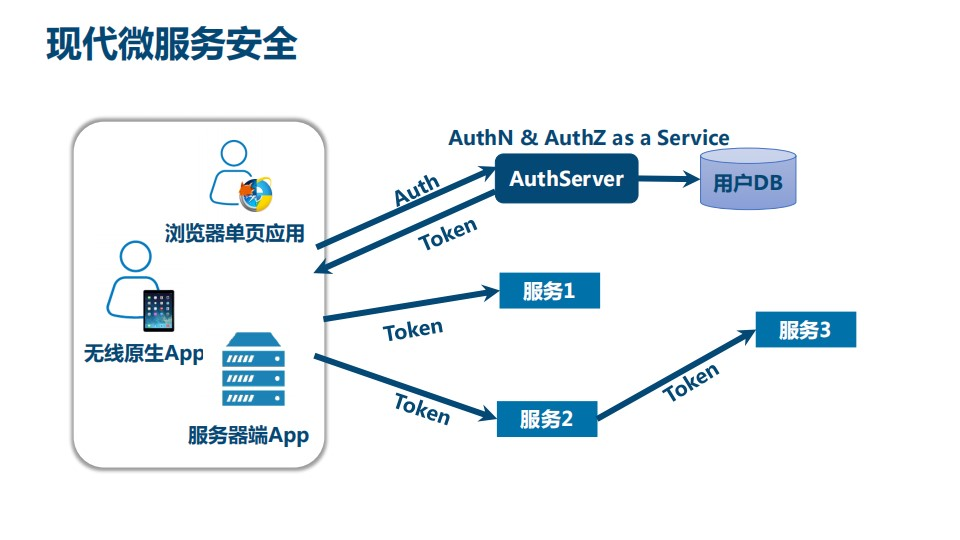

### <font style="color:rgb(0, 0, 0);">典型的 OAuth2 应用</font>
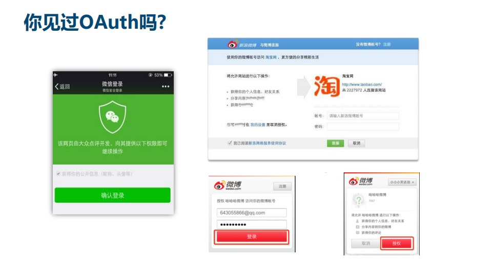

## <font style="color:rgb(0, 0, 0);">总结</font>
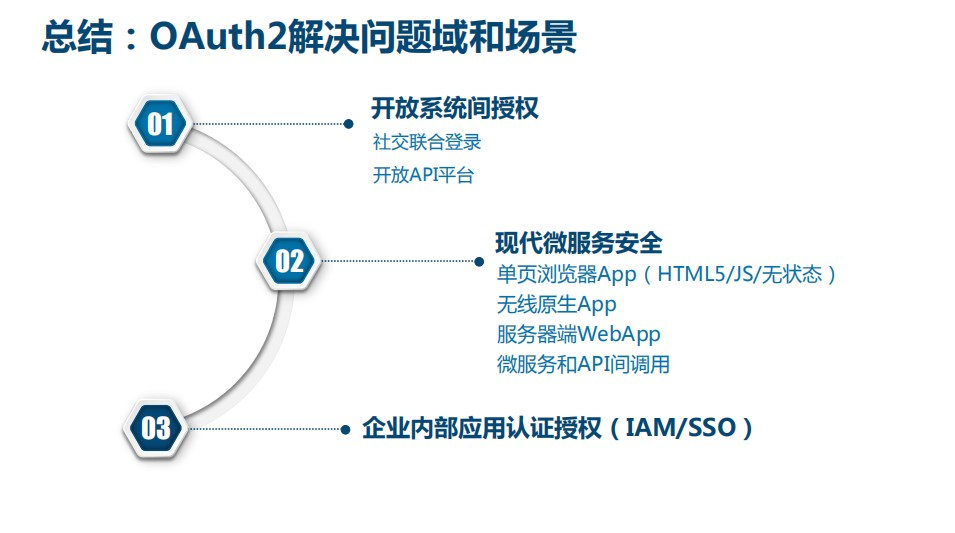

## <font style="color:rgb(0, 0, 0);">OAuth2 最简向导</font>
<font style="color:rgb(0, 0, 0);">川崎高彦：OAuth2 领域专家，开发了一个 OAuth2 sass 服务，OAuth2 as Service，并且做成了一个公司</font>

<font style="color:rgb(0, 0, 0);">在融资的过程中为了向投资人解释 OAuth2 是什么，于是写了一篇文章，《OAuth2最简向导》</font>

# 三、OAuth2 的正式定义
## <font style="color:rgb(0, 0, 0);">什么是 OAuth2</font>
### <font style="color:rgb(0, 0, 0);">OAuth2 正式定义</font>
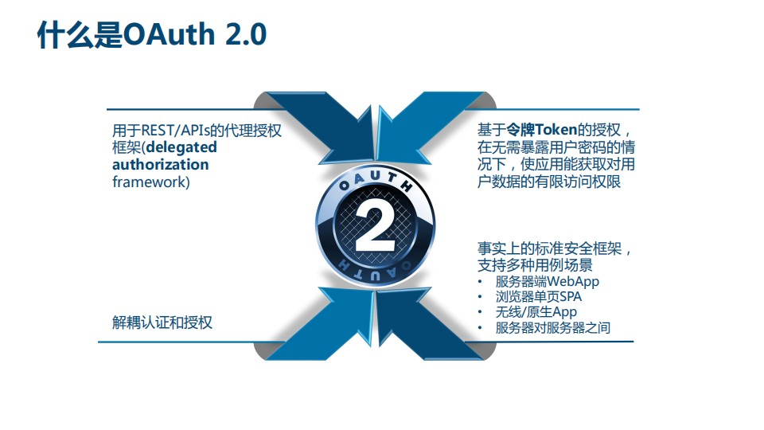

### <font style="color:rgb(0, 0, 0);">令牌的核心</font>
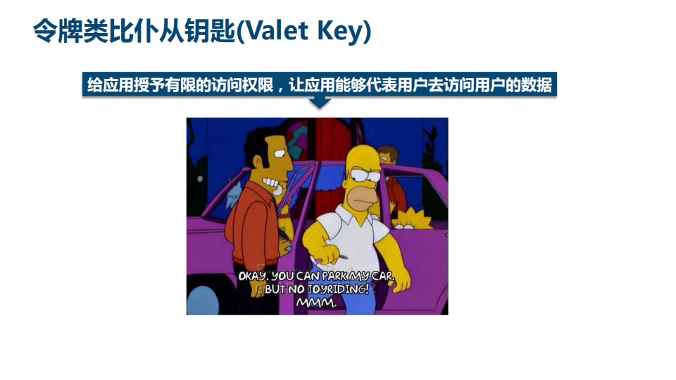

### <font style="color:rgb(0, 0, 0);">OAuth2 的历史</font>
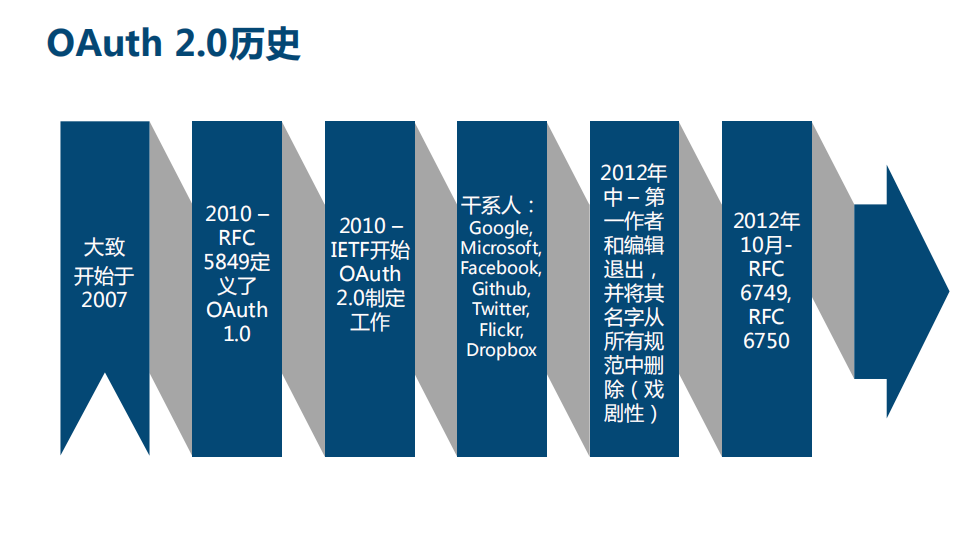

### <font style="color:rgb(0, 0, 0);">OAuth2 的优势</font>
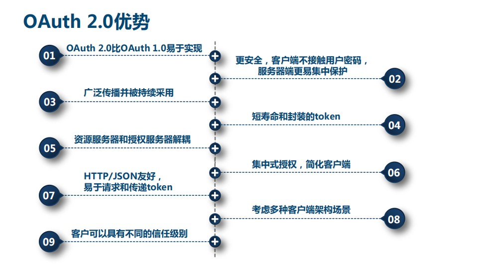

### <font style="color:rgb(0, 0, 0);">OAuth2 的不足</font>
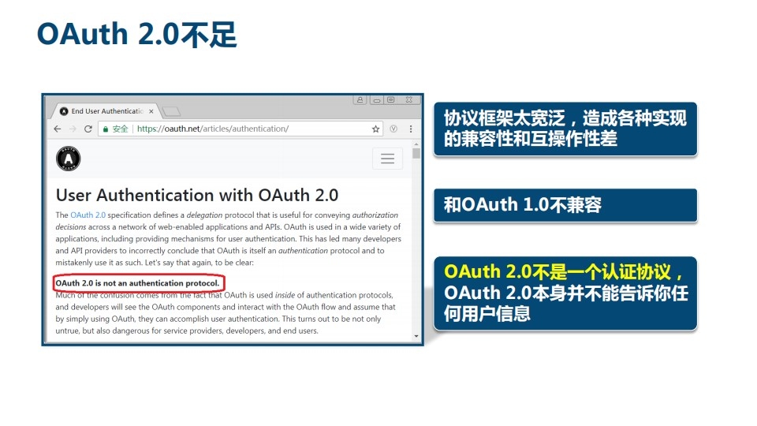

### <font style="color:rgb(0, 0, 0);">OAuth2 涉及的角色</font>
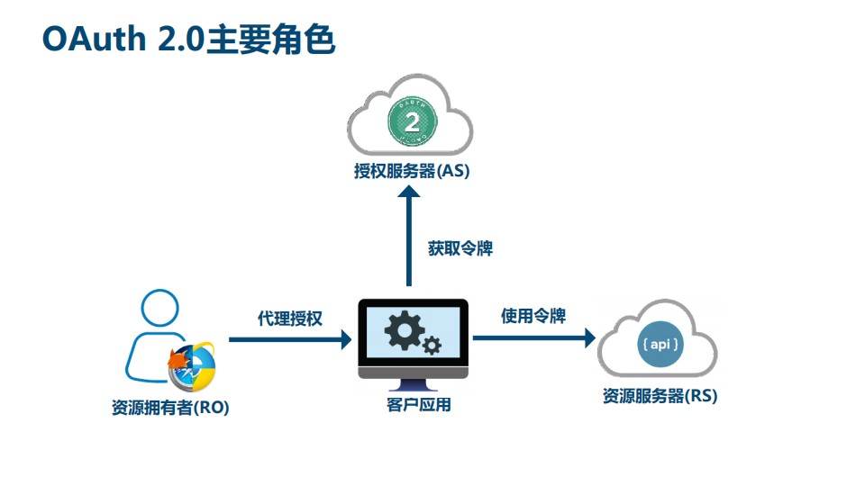

### <font style="color:rgb(0, 0, 0);">OAuth2 术语</font>
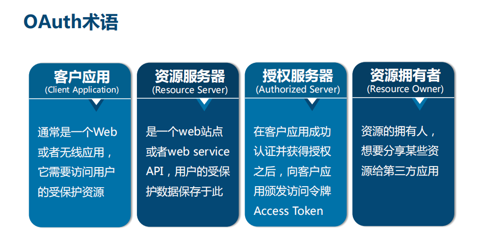

### <font style="color:rgb(0, 0, 0);">OAuth2 令牌的类型</font>
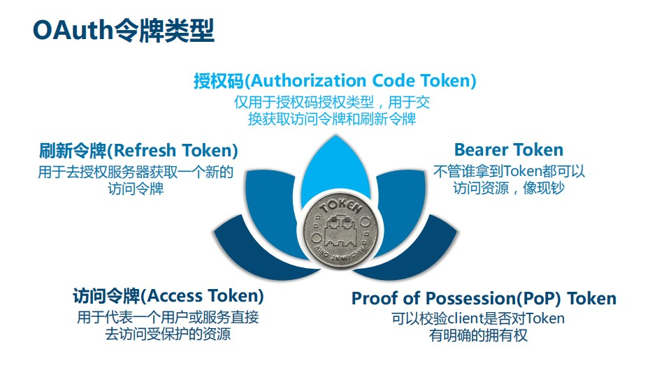

### <font style="color:rgb(0, 0, 0);">OAuth2 的误解</font>
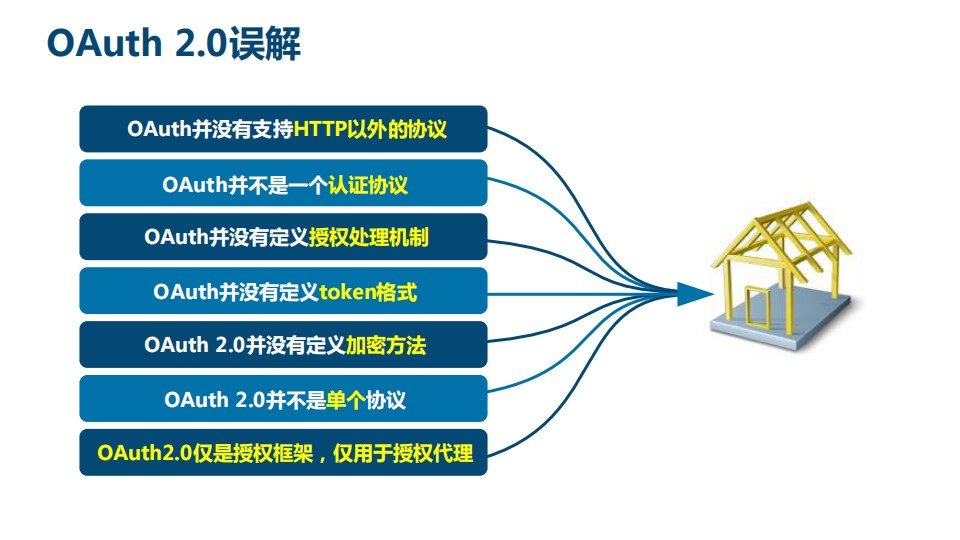

## <font style="color:rgb(0, 0, 0);">回顾</font>
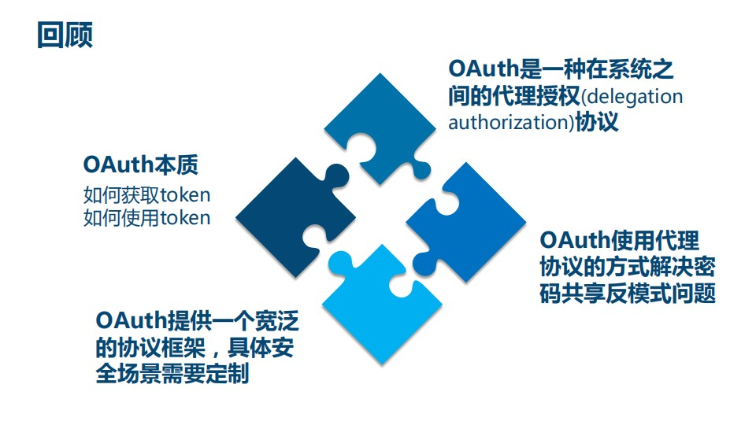

# 四、生成授权 URL
## <font style="color:rgb(0, 0, 0);">准备工作</font>
[https://open.weixin.qq.com](https://open.weixin.qq.com)

### <font style="color:rgb(0, 0, 0);">注册</font>
### <font style="color:rgb(0, 0, 0);">邮箱激活</font>
### <font style="color:rgb(0, 0, 0);">完善开发者资料</font>
### <font style="color:rgb(0, 0, 0);">开发者资质认证</font>
<font style="color:rgb(0, 0, 0);">准备营业执照，1-2个工作日审批、300元</font>

### <font style="color:rgb(0, 0, 0);">创建网站应用</font>
<font style="color:rgb(0, 0, 0);">提交审核，7个工作日审批</font>

### <font style="color:rgb(0, 0, 0);">熟悉微信登录流程</font>
<font style="color:rgb(0, 0, 0);">参考文档：</font>[<font style="color:rgb(0, 0, 0);">https://open.weixin.qq.com/cgi-bin/showdocument?action=dir_list&t=resource/res_list&verify=1&id=open1419316505&token=e547653f995d8f402704d5cb2945177dc8aa4e7e&lang=zh_CN</font>](https://open.weixin.qq.com/cgi-bin/showdocument?action=dir_list&t=resource/res_list&verify=1&id=open1419316505&token=e547653f995d8f402704d5cb2945177dc8aa4e7e&lang=zh_CN)

**<font style="color:rgb(34, 34, 34);">获取 access_token 时序图</font>**

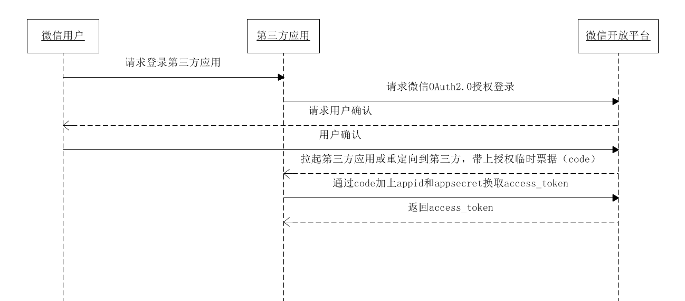

## <font style="color:rgb(0, 0, 0);">后端开发</font>
在 service-ucenter 模块中做如下操作。

### <font style="color:rgb(0, 0, 0);">添加配置</font>
<font style="color:rgb(0, 0, 0);">application.properties 添加相关配置信息</font>

```properties
# 微信开放平台 appid
wx.open.app_id=你的appid

# 微信开放平台 appsecret
wx.open.app_secret=你的appsecret

# 微信开放平台 重定向url
wx.open.redirect_url=http://你的服务器名称/api/ucenter/wx/callback
```

```properties
# 微信开放平台 appid
wx.open.app_id=wxed9954c01bb89b47

# 微信开放平台 appsecret
wx.open.app_secret=a7482517235173ddb4083788de60b90e

# 微信开放平台 重定向url
wx.open.redirect_url=http://localhost:8006/ucenter/wx/callback
```

### <font style="color:rgb(0, 0, 0);">创建常量类</font>
<font style="color:rgb(0, 0, 0);">创建 util 包，创建 ConstantPropertiesUtil.java 常量类</font>

```java
package com.xszx.ucenter.util;

@Component
//@PropertySource("classpath:application.properties")
public class ConstantPropertiesUtil implements InitializingBean {

    @Value("${wx.open.app_id}")
    private String appId;

    @Value("${wx.open.app_secret}")
    private String appSecret;

    @Value("${wx.open.redirect_url}")
    private String redirectUrl;

    public static String WX_OPEN_APP_ID;
    public static String WX_OPEN_APP_SECRET;
    public static String WX_OPEN_REDIRECT_URL;

    @Override
    public void afterPropertiesSet() throws Exception {
        WX_OPEN_APP_ID = appId;
        WX_OPEN_APP_SECRET = appSecret;
        WX_OPEN_REDIRECT_URL = redirectUrl;
    }
}
```

### <font style="color:rgb(0, 0, 0);">创建 controller</font>
<font style="color:rgb(0, 0, 0);">service-ucenter 微服务中创建 api 包</font>

<font style="color:rgb(0, 0, 0);">api 包中创建 WxApiController</font>

```java
package com.xszx.ucenter.controller.api;

@CrossOrigin
@Controller//注意这里没有配置 @RestController
@RequestMapping("/api/ucenter/wx")
public class WxApiController {

    @GetMapping("login")
    public String genQrConnect(HttpSession session) {

        // 微信开放平台授权baseUrl
        String baseUrl = "https://open.weixin.qq.com/connect/qrconnect" +
                "?appid=%s" +
                "&redirect_uri=%s" +
                "&response_type=code" +
                "&scope=snsapi_login" +
                "&state=%s" +
                "#wechat_redirect";

        // 回调地址
        String redirectUrl = ConstantPropertiesUtil.WX_OPEN_REDIRECT_URL; //获取业务服务器重定向地址
        try {
            redirectUrl = URLEncoder.encode(redirectUrl, "UTF-8"); //url编码
        } catch (UnsupportedEncodingException e) {
            throw new QinXueException(20001, e.getMessage());
        }

        // 防止csrf攻击（跨站请求伪造攻击）
        //String state = UUID.randomUUID().toString().replaceAll("-", "");//一般情况下会使用一个随机数
        String state = "imhelen";//为了让大家能够使用我搭建的外网的微信回调跳转服务器，这里填写你在ngrok的前置域名
        System.out.println("state = " + state);

        // 采用redis等进行缓存state 使用sessionId为key 30分钟后过期，可配置
        //键："wechar-open-state-" + httpServletRequest.getSession().getId()
        //值：satte
        //过期时间：30分钟
        
        //生成qrcodeUrl
        String qrcodeUrl = String.format(
                baseUrl,
                ConstantPropertiesUtil.WX_OPEN_APP_ID,
                redirectUrl,
                state);

        return "redirect:" + qrcodeUrl;
    }
}
```

<font style="color:rgb(0, 0, 0);">授权 url 参数说明</font>

| <font style="color:rgb(34, 34, 34);">参数</font> | <font style="color:rgb(34, 34, 34);">是否必须</font> | <font style="color:rgb(34, 34, 34);">说明</font> |
| --- | --- | --- |
| <font style="color:rgb(34, 34, 34);">appid</font> | <font style="color:rgb(34, 34, 34);">是</font> | <font style="color:rgb(34, 34, 34);">应用唯一标识</font> |
| <font style="color:rgb(34, 34, 34);">redirect_uri</font> | <font style="color:rgb(34, 34, 34);">是</font> | <font style="color:rgb(34, 34, 34);">请使用urlEncode对链接进行处理</font> |
| <font style="color:rgb(34, 34, 34);">response_type</font> | <font style="color:rgb(34, 34, 34);">是</font> | <font style="color:rgb(34, 34, 34);">填code</font> |
| <font style="color:rgb(34, 34, 34);">scope</font> | <font style="color:rgb(34, 34, 34);">是</font> | <font style="color:rgb(34, 34, 34);">应用授权作用域，拥有多个作用域用逗号（,）分隔，网页应用目前仅填写snsapi_login即</font> |
| <font style="color:rgb(34, 34, 34);">state</font> | <font style="color:rgb(34, 34, 34);">否</font> | <font style="color:rgb(34, 34, 34);">用于保持请求和回调的状态，授权请求后原样带回给第三方。该参数可用于防止csrf攻击（跨站请求伪造攻击），建议第三方带上该参数，可设置为简单的随机数加session进行校验</font> |


### <font style="color:rgb(0, 0, 0);">测试</font>
<font style="color:rgb(0, 0, 0);">访问：</font>[<font style="color:rgb(0, 0, 0);">http://localhost:8201/api/ucenter/wx/login</font>](http://localhost:8104/api/ucenter/wx/login)

<font style="color:rgb(0, 0, 0);">访问授权 url 后会得到一个微信登录二维码</font>

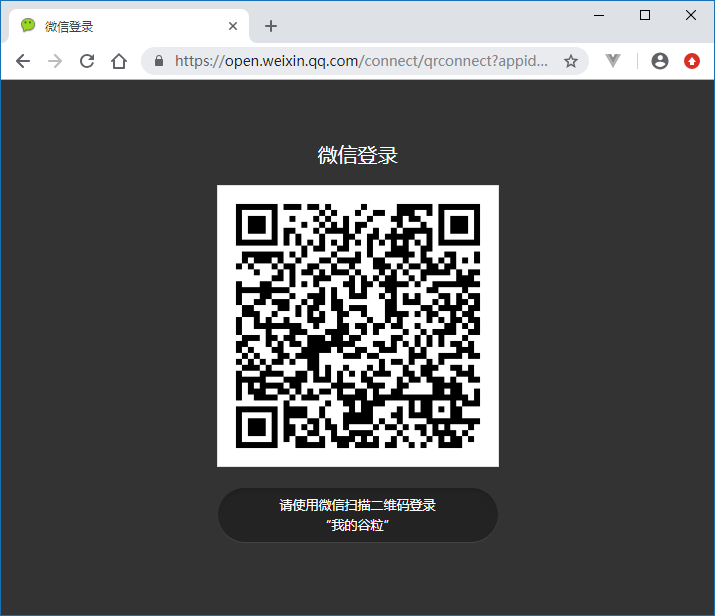

<font style="color:rgb(0, 0, 0);">用户扫描二维码会看到确认登录的页面</font>

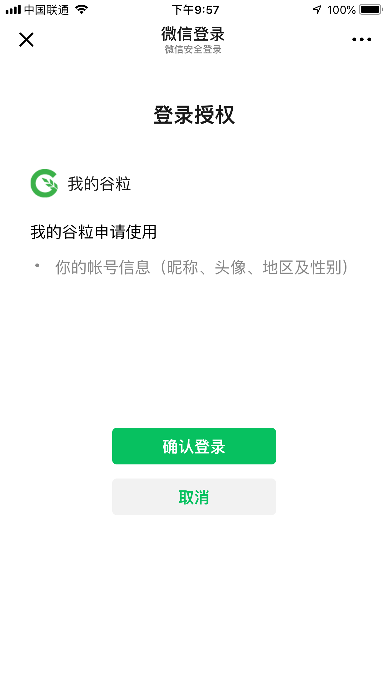

<font style="color:rgb(0, 0, 0);">用户点击“确认登录”后，微信服务器会向谷粒学院的业务服务器发起回调，因此接下来我们需要开发回调 controller</font>

**<font style="color:rgb(255, 0, 0);">注意：</font>**<font style="color:rgb(0, 0, 0);">如果没有正确的配置业务服务器的回调 url，则会看到以下错误提示</font>

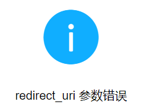

# 五、开发回调 URL
## <font style="color:rgb(0, 0, 0);">准备工作</font>
### <font style="color:rgb(0, 0, 0);">全局配置的跳转路径</font>
```properties
# 微信开放平台 重定向url
wx.open.redirect_url=http://回调地址/api/ucenter/wx/callback
```

### <font style="color:rgb(0, 0, 0);">修改当前项目启动端口号为8160</font>
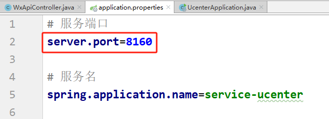

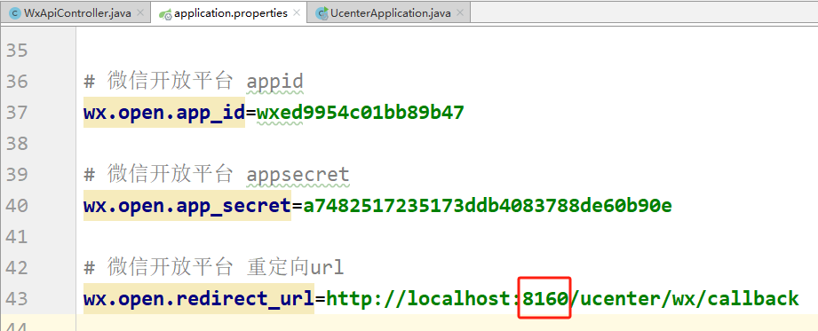

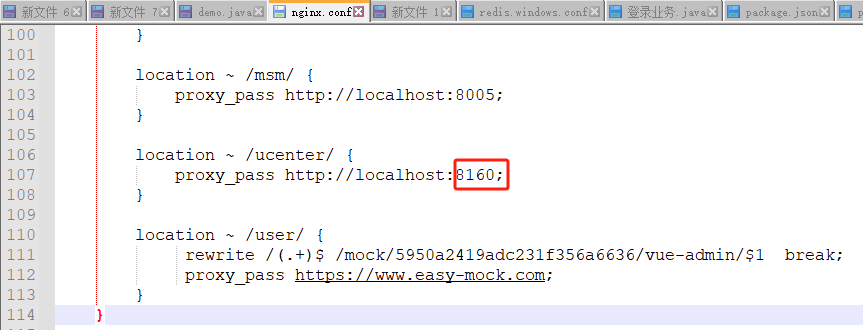

### <font style="color:rgb(0, 0, 0);">测试回调是否可用</font>
<font style="color:rgb(0, 0, 0);">在 WxApiController 中添加方法</font>

```java
@GetMapping("callback")
public void callback(String code, String state, HttpSession session) {

    //得到授权临时票据code
    System.out.println("code = " + code);
    System.out.println("state = " + state);
}
```

## <font style="color:rgb(0, 0, 0);">后台开发</font>
### <font style="color:rgb(0, 0, 0);">添加依赖</font>
```xml
<!--httpclient-->
<dependency>
    <groupId>org.apache.httpcomponents</groupId>
    <artifactId>httpclient</artifactId>
</dependency>

<!--commons-io-->
<dependency>
    <groupId>commons-io</groupId>
    <artifactId>commons-io</artifactId>
</dependency>

<!--gson-->
<dependency>
    <groupId>com.google.code.gson</groupId>
    <artifactId>gson</artifactId>
</dependency>
```

### <font style="color:rgb(0, 0, 0);">创建 httpclient 工具类</font>
<font style="color:rgb(0, 0, 0);">放入 util 包</font>

```latex
HttpClientUtils.java
```

### <font style="color:rgb(0, 0, 0);">创建回调 controller 方法</font>
<font style="color:rgb(0, 0, 0);">在 WxApiController.java 中添加如下方法</font>

```java
/**
* @param code
* @param state
* @return
*/
@GetMapping("callback")
public String callback(String code, String state){
    //得到授权临时票据code
    System.out.println(code);
    System.out.println(state);
    //从redis中将state获取出来，和当前传入的state作比较
    //如果一致则放行，如果不一致则抛出异常：非法访问
    //向认证服务器发送请求换取access_token
    String baseAccessTokenUrl = "https://api.weixin.qq.com/sns/oauth2/access_token" +
        "?appid=%s" +
        "&secret=%s" +
        "&code=%s" +
        "&grant_type=authorization_code";
    String accessTokenUrl = String.format(baseAccessTokenUrl,
                                          ConstantPropertiesUtil.WX_OPEN_APP_ID,
                                          ConstantPropertiesUtil.WX_OPEN_APP_SECRET,
                                          code);
    String result = null;
    try {
        result = HttpClientUtils.get(accessTokenUrl);
        System.out.println("accessToken=============" + result);
    } catch (Exception e) {
        throw new QinXueException(20001, "获取access_token失败");
    }
    
    //解析json字符串
    Gson gson = new Gson();
    HashMap map = gson.fromJson(result, HashMap.class);
    String accessToken = (String)map.get("access_token");
    String openid = (String)map.get("openid");
    
    //查询数据库当前用用户是否曾经使用过微信登录
    Member member = memberService.getByOpenid(openid);
    if(member == null){
        System.out.println("新用户注册");
        //访问微信的资源服务器，获取用户信息
        
        String baseUserInfoUrl = "https://api.weixin.qq.com/sns/userinfo" +
            "?access_token=%s" +
            "&openid=%s";
        String userInfoUrl = String.format(baseUserInfoUrl, accessToken, openid);
        String resultUserInfo = null;
        try {
            resultUserInfo = HttpClientUtils.get(userInfoUrl);
            System.out.println("resultUserInfo==========" + resultUserInfo);
        } catch (Exception e) {
            throw new QinXueException(20001, "获取用户信息失败");
        }
        
        //解析json
        HashMap<String, Object> mapUserInfo = gson.fromJson(resultUserInfo, HashMap.class);
        String nickname = (String)mapUserInfo.get("nickname");
        String headimgurl = (String)mapUserInfo.get("headimgurl");
        
        //向数据库中插入一条记录
        member = new Member();
        member.setNickname(nickname);
        member.setOpenid(openid);
        member.setAvatar(headimgurl);
        memberService.save(member);
    }
    //TODO 登录
    return "redirect:http://localhost:3000";
}
```

### <font style="color:rgb(0, 0, 0);">业务层</font>
<font style="color:rgb(34, 34, 34);">业务接口：MemberService.java</font>

```java
Member getByOpenid(String openid);
```

<font style="color:rgb(34, 34, 34);">业务实现：MemberServiceImpl.java</font>

```java
@Override
public Member getByOpenid(String openid) {

    QueryWrapper<Member> queryWrapper = new QueryWrapper<>();
    queryWrapper.eq("openid", openid);

    Member member = baseMapper.selectOne(queryWrapper);
    return member;
}
```

# 六、JWT 令牌
## <font style="color:rgb(0, 0, 0);">整合 JWT 令牌</font>
### <font style="color:rgb(0, 0, 0);">callback 中生成 jwt</font>
<font style="color:rgb(0, 0, 0);">在 WxApiController.java 的 callback 方法的最后添加如下代码</font>

```java
// 生成jwt
String token = JwtUtils.geneJsonWebToken(member.getId(),member.getNickName());

//这里使用url重写将token带给前端
return "redirect:http://localhost:3000?token=" + token;
```

### <font style="color:rgb(0, 0, 0);">前端打印 token</font>
<font style="color:rgb(0, 0, 0);">在 layout/defaullt.vue 中打印获取的 token 值</font>

```javascript
export default {

  created() {
    console.log(this.$route.query.token)
  }
}
```

# 七、前端整合和显示用户登录信息
## <font style="color:rgb(0, 0, 0);">修改 default.vue 页面脚本</font>
```javascript
export default {
  data() {
    return {
      token: '',
      loginInfo: {
        id: '',
        age: '',
        avatar: '',
        mobile: '',
        nickname: '',
        sex: ''
      }
    }
  },
  
  created() {
    this.token = this.$route.query.token
    if (this.token) {
      this.wxLogin()
    }
    this.showInfo()
  },
  
  methods: {
    showInfo() {
      //debugger
      var jsonStr = cookie.get("qinxue_ucenter");
      if (jsonStr) {
        this.loginInfo = JSON.parse(jsonStr)
      }
    },
    
    logout() {
      //debugger
      cookie.set('qinxue_ucenter', "", {domain: 'localhost'})
      cookie.set('qinxue_token', "", {domain: 'localhost'})
      //跳转页面
      window.location.href = "/"
    },
    
    wxLogin() {
      if (this.token == '') return
      //把token存在cookie中、也可以放在localStorage中
      cookie.set('qinxue_token', this.token, {domain: 'localhost'})
      cookie.set('qinxue_ucenter', '', {domain: 'localhost'})
      //登录成功根据token获取用户信息
      userApi.getLoginInfo().then(response => {
        this.loginInfo = response.data.data.item
        //将用户信息记录cookie
        cookie.set('qinxue_ucenter', this.loginInfo, {domain: 'localhost'})
      })
    }
  }
}
```

## 修改 login.vue 页面
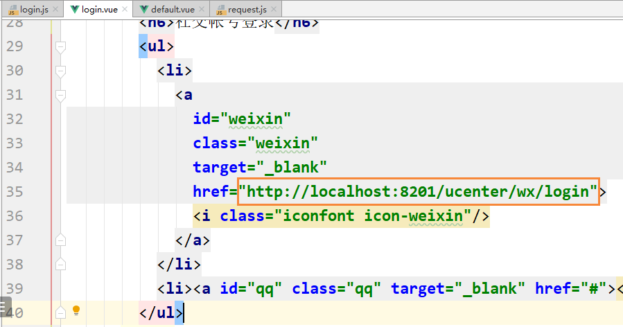

[http://localhost:8201/ucenter/wx/login](http://localhost:8201/ucenter/wx/login)


> 更新: 2024-07-24 15:23:00  
> 原文: <https://www.yuque.com/u41736172/az9urv/czocofwqo8gdc699>