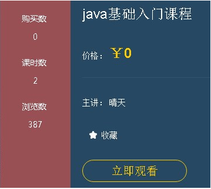
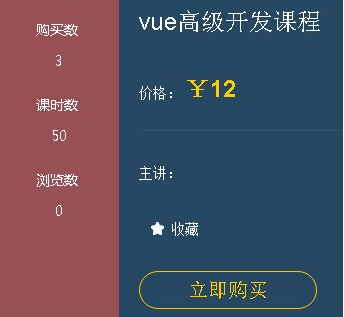
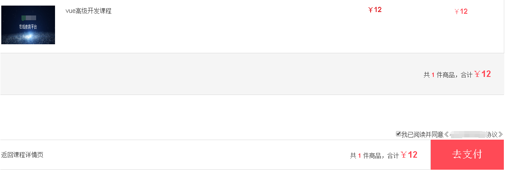
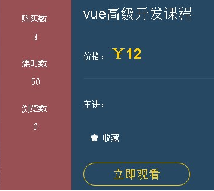
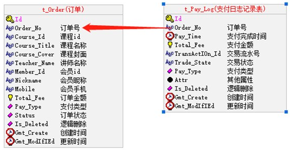
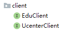
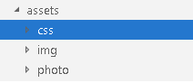
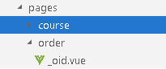
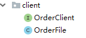

# 第十五天【微信支付】

# 一、课程支付功能需求描述
## <font style="color:rgb(0, 0, 0);">课程支付说明</font>
<font style="color:rgb(51, 51, 51);">（1）课程分为免费课程和付费课程，如果是免费课程可以直接观看，如果是付费观看的课程，用户需下单支付后才可以观看</font>


<font style="color:rgb(0, 0, 0);">（2）如果是免费课程，在用户选择课程，进入到课程详情页面时候，直接显示 “立即观看”，用户点击立即观看，可以切换到播放列表进行视频播放</font>



## <font style="color:rgb(0, 0, 0);">付费课程流程</font>
**<font style="color:rgb(0, 0, 0);">（1）如果是付费课程，在用户选择课程，进入到课程详情页面时候，会显示 “立即购买”</font>**



**<font style="color:rgb(0, 0, 0);">（2）点击“立即购买”，会生成课程的订单，跳转到订单页面</font>**



**<font style="color:rgb(0, 0, 0);">（3）点击“去支付”，会跳转到支付页面，生成微信扫描的二维码</font>**


**<font style="color:rgb(0, 0, 0);">（4）使用微信扫描支付后，会跳转回到课程详情页面，同时显示“立即观看”</font>**



# 二、创建支付模块和开发订单接口
## <font style="color:rgb(51, 51, 51);">创建支付模块和准备</font>
### <font style="color:rgb(0, 0, 0);">在 service 模块下创建子模块 service_order</font>
artifactId：service-order

### <font style="color:rgb(0, 0, 0);">在 service_order 模块中引入依赖</font>
```xml
<dependencies>
    <dependency>
        <groupId>com.github.wxpay</groupId>
        <artifactId>wxpay-sdk</artifactId>
        <version>0.0.3</version>
    </dependency>

    <dependency>
        <groupId>com.alibaba</groupId>
        <artifactId>fastjson</artifactId>
    </dependency>
</dependencies>
```

### <font style="color:rgb(51, 51, 51);">创建支付相关的表</font>
导入 order.sql



### <font style="color:rgb(51, 51, 51);">使用代码生成器生成相关代码</font>
生成 order、pay_log 表的代码。

### <font style="color:rgb(51, 51, 51);">编写 application.properties 配置文件</font>
```properties
# 服务端口
server.port=8007

# 服务名
spring.application.name=service-order

# mysql数据库连接
spring.datasource.driver-class-name=com.mysql.cj.jdbc.Driver
spring.datasource.url=jdbc:mysql://localhost:3306/qinxue_edu?serverTimezone=GMT%2B8
spring.datasource.username=root
spring.datasource.password=root

#返回json的全局时间格式
spring.jackson.date-format=yyyy-MM-dd HH:mm:ss
spring.jackson.time-zone=GMT+8

#配置mapper xml文件的路径
mybatis-plus.mapper-locations=classpath:com/xszx/order/mapper/xml/*.xml

#mybatis日志
mybatis-plus.configuration.log-impl=org.apache.ibatis.logging.stdout.StdOutImpl

# nacos服务地址
spring.cloud.nacos.discovery.server-addr=127.0.0.1:8848

#开启熔断机制
feign.hystrix.enabled=true
# 设置hystrix超时时间，默认1000ms
hystrix.command.default.execution.isolation.thread.timeoutInMilliseconds=3000
```

### 编写启动类
```java
package com.xszx.order;

import org.mybatis.spring.annotation.MapperScan;
import org.springframework.boot.SpringApplication;
import org.springframework.boot.autoconfigure.SpringBootApplication;
import org.springframework.cloud.client.discovery.EnableDiscoveryClient;
import org.springframework.context.annotation.ComponentScan;

@SpringBootApplication
@MapperScan("com.xszx.order.mapper")
@ComponentScan("com.xszx")
@EnableDiscoveryClient
public class OrderApplication {

    public static void main(String[] args) {
        SpringApplication.run(OrderApplication.class, args);
    }
}
```

## <font style="color:rgb(51, 51, 51);">开发创建订单接口</font>
### <font style="color:rgb(0, 0, 0);">编写订单 controller</font>
```java
@RestController
@RequestMapping("/orderservice/order")
@CrossOrigin
public class TOrderController {

    @Autowired
    private TOrderService orderService;
    
    //根据课程id和用户id创建订单，返回订单id
    @PostMapping("createOrder/{courseId}")
    public R save(@PathVariable String courseId, HttpServletRequest request) {
        String orderId = orderService.saveOrder(courseId, JwtUtils.getMemberIdByJwtToken(request));
        return R.ok().data("orderId", orderId);
    }
}
```

### <font style="color:rgb(0, 0, 0);">在 service_edu 创建接口</font>
<font style="color:rgb(0, 0, 0);">（1）实现根据课程 id 获取课程信息，返回课程信息对象</font>

```java
//根据课程id查询课程信息
@GetMapping("getDto/{courseId}")
public CourseInfoForm getCourseInfoDto(@PathVariable String courseId) {

        CourseInfoForm courseInfoForm = courseService.getCourseInfo(courseId);
        CourseInfoForm courseInfo = new CourseInfoForm();
        BeanUtils.copyProperties(courseInfoForm,courseInfo);
        return courseInfo;
}
```

### <font style="color:rgb(0, 0, 0);">在 service_ucenter 创建接口</font>
<font style="color:rgb(0, 0, 0);">（1）实现用户 id 获取用户信息，返回用户信息对象</font>

```java
//根据token字符串获取用户信息
@PostMapping("getInfoUc/{id}")
public UcenterMember getInfo(@PathVariable String id) {

        //根据用户id获取用户信息
        UcenterMember ucenterMember = memberService.getById(id);
        UcenterMember memeber = new UcenterMember();
        BeanUtils.copyProperties(ucenterMember,memeber);
        return memeber;
}
```

### <font style="color:rgb(0, 0, 0);">编写订单 service</font>
**<font style="color:rgb(0, 0, 0);">（1）在service_order 模块创建接口，实现远程调用</font>**



**<font style="color:rgb(0, 0, 0);">EduClient</font>**

```java
@Component
@FeignClient("service-edu")
public interface EduClient {

    //根据课程id查询课程信息
    @GetMapping("/eduservice/course/getDto/{courseId}")
    public CourseInfoForm getCourseInfoDto(@PathVariable("courseId") String courseId);
}
```

**<font style="color:rgb(0, 0, 0);">UcenterClient</font>**

```java
@Component
@FeignClient("service-ucenter")
public interface UcenterClient {

    //根据课程id查询课程信息
    @PostMapping("/ucenterservice/member/getInfoUc/{id}")
    public UcenterMember getInfo(@PathVariable("id") String id);
}
```

**<font style="color:rgb(0, 0, 0);">（2）在 service_order 模块编写创建订单 service</font>**

```java
@Service
public class TOrderServiceImpl extends ServiceImpl<TOrderMapper, TOrder> implements TOrderService {

    @Autowired
    private EduClient eduClient;

    @Autowired
    private UcenterClient ucenterClient;

    //创建订单
    @Override
    public String saveOrder(String courseId, String memberId) {
        //远程调用课程服务，根据课程id获取课程信息
        CourseInfoForm courseDto = eduClient.getCourseInfoDto(courseId);

        //远程调用用户服务，根据用户id获取用户信息
        UcenterMember ucenterMember = ucenterClient.getInfo(memberId);

        //创建订单
        TOrder order = new TOrder();
        order.setOrderNo(OrderNoUtil.getOrderNo());
        order.setCourseId(courseId);
        order.setCourseTitle(courseDto.getTitle());
        order.setCourseCover(courseDto.getCover());
        order.setTeacherName("test");
        order.setTotalFee(courseDto.getPrice());
        order.setMemberId(memberId);
        order.setMobile(ucenterMember.getMobile());
        order.setNickname(ucenterMember.getNickname());
        order.setStatus(0);
        order.setPayType(1);
        baseMapper.insert(order);

        return order.getOrderNo();
    }
}
```

## <font style="color:rgb(0, 0, 0);">开发获取订单接口</font>
### <font style="color:rgb(0, 0, 0);">在订单 controller 创建根据 id 获取订单信息接口</font>
```java
@GetMapping("getOrder/{orderId}")
public R get(@PathVariable String orderId) {

    QueryWrapper<TOrder> wrapper = new QueryWrapper<>();
    wrapper.eq("order_no",orderId);
    TOrder order = orderService.getOne(wrapper);
    return R.ok().data("item", order);
}
```

# 三、开发微信支付接口
## <font style="color:rgb(51, 51, 51);">生成微信支付二维码</font>
### <font style="color:rgb(51, 51, 51);">编写 controller</font>
```java
@RestController
@RequestMapping("/orderservice/log")
@CrossOrigin
public class PayLogController {

    @Autowired
    private PayLogService payService;
    /**
     * 生成二维码
     *
     * @return
     */
    @GetMapping("/createNative/{orderNo}")
    public R createNative(@PathVariable String orderNo) {

        Map map = payService.createNative(orderNo);
        return R.ok().data(map);
    }
}
```

### <font style="color:rgb(51, 51, 51);">编写 service</font>
```java
@Service
public class PayLogServiceImpl extends ServiceImpl<PayLogMapper, PayLog> implements PayLogService {

    @Autowired
    private TOrderService orderService;

    @Override
    public Map createNative(String orderNo) {
        try {
            //根据订单id获取订单信息
            QueryWrapper<TOrder> wrapper = new QueryWrapper<>();
            wrapper.eq("order_no",orderNo);
            TOrder order = orderService.getOne(wrapper);

            Map m = new HashMap();
            //1、设置支付参数
            m.put("appid", "wx74862e0dfcf69954"); // 我们的项目在微信中的id
            m.put("mch_id", "1558950191"); // 商户号
            m.put("nonce_str", WXPayUtil.generateNonceStr()); // 生成一个随机的字符串
            m.put("body", order.getCourseTitle()); // 商品的信息
            m.put("out_trade_no", orderNo); // 订单号
            m.put("total_fee", order.getTotalFee().multiply(new BigDecimal("100")).longValue()+""); // 总金额
            m.put("spbill_create_ip", "127.0.0.1"); // 支付的ip地址
            m.put("notify_url", "http://guli.shop/api/order/weixinPay/weixinNotify\n"); // 支付的回调地址，没什么用
            m.put("trade_type", "NATIVE"); // 支付的类型

            //2、HTTPClient来根据URL访问第三方接口并且传递参数
            HttpClient client = new HttpClient("https://api.mch.weixin.qq.com/pay/unifiedorder");

            //client设置参数
            client.setXmlParam(WXPayUtil.generateSignedXml(m, "T6m9iK73b0kn9g5v426MKfHQH7X8rKwb"));
            client.setHttps(true);
            client.post();
            //3、返回第三方的数据
            String xml = client.getContent();
            Map<String, String> resultMap = WXPayUtil.xmlToMap(xml);
            //4、封装返回结果集

            Map map = new HashMap<>();
            map.put("out_trade_no", orderNo);
            map.put("course_id", order.getCourseId());
            map.put("total_fee", order.getTotalFee());
            map.put("result_code", resultMap.get("result_code"));
            map.put("code_url", resultMap.get("code_url"));

            //微信支付二维码2小时过期，可采取2小时未支付取消订单
            //redisTemplate.opsForValue().set(orderNo, map, 120, TimeUnit.MINUTES);
            return map;
        } catch (Exception e) {
            e.printStackTrace();
            return new HashMap<>();
        }
    }
}
```

## <font style="color:rgb(51, 51, 51);">获取支付状态接口</font>
### <font style="color:rgb(0, 0, 0);">编写 controller</font>
```java
@GetMapping("/queryPayStatus/{orderNo}")
public R queryPayStatus(@PathVariable String orderNo) {

    //调用查询接口
    Map<String, String> map = payService.queryPayStatus(orderNo);
    if (map == null) {//出错
        return R.error().message("支付出错");
    }
    if (map.get("trade_state").equals("SUCCESS")) {//如果成功
        //更改订单状态
        payService.updateOrderStatus(map);
        return R.ok().message("支付成功");
    }

    return R.ok().code(25000).message("支付中");
}
```

### <font style="color:#333333;">编写 service，更新订单状态</font>
```java
@Override
public void updateOrderStatus(Map<String, String> map) {

    //获取订单id
    String orderNo = map.get("out_trade_no");

    //根据订单id查询订单信息
    QueryWrapper<TOrder> wrapper = new QueryWrapper<>();
    wrapper.eq("order_no",orderNo);
    TOrder order = orderService.getOne(wrapper);

    if(order.getStatus().intValue() == 1) return;
    order.setStatus(1);
    orderService.updateById(order);

    //记录支付日志
    PayLog payLog=new PayLog();
    payLog.setOrderNo(order.getOrderNo());//支付订单号
    payLog.setPayTime(new Date());
    payLog.setPayType(1);//支付类型
    payLog.setTotalFee(order.getTotalFee());//总金额(分)
    payLog.setTradeState(map.get("trade_state"));//支付状态
    payLog.setTransactionId(map.get("transaction_id"));
    payLog.setAttr(JSONObject.toJSONString(map));
    baseMapper.insert(payLog);//插入到支付日志表
}

@Override
public Map queryPayStatus(String orderNo) {
    try {
        //1、封装参数
        Map m = new HashMap<>();
        m.put("appid", "wx74862e0dfcf69954");
        m.put("mch_id", "1558950191");
        m.put("out_trade_no", orderNo);
        m.put("nonce_str", WXPayUtil.generateNonceStr());

        //2、设置请求
        HttpClient client = new HttpClient("https://api.mch.weixin.qq.com/pay/orderquery");
        client.setXmlParam(WXPayUtil.generateSignedXml(m, "T6m9iK73b0kn9g5v426MKfHQH7X8rKwb"));
        client.setHttps(true);
        client.post();
        //3、返回第三方的数据
        String xml = client.getContent();
        Map<String, String> resultMap = WXPayUtil.xmlToMap(xml);
        //6、转成Map
        //7、返回
        return resultMap;
    } catch (Exception e) {
        e.printStackTrace();
    }
    return null;
}
```

## 配置 Nginx 反向代理
```latex
location ~ /order/ {           
  proxy_pass http://localhost:8007;
}
```

# 四、课程支付前端整合
## <font style="color:rgb(51, 51, 51);">页面样式修改</font>
### <font style="color:rgb(0, 0, 0);">复制样式文件到 assets</font>


### <font style="color:rgb(0, 0, 0);">修改 default.vue 页面</font>
```html
import '~/assets/css/reset.css'
import '~/assets/css/theme.css'
import '~/assets/css/global.css'
import '~/assets/css/web.css'
import '~/assets/css/base.css'
import '~/assets/css/activity_tab.css'
import '~/assets/css/bottom_rec.css'
import '~/assets/css/nice_select.css'
import '~/assets/css/order.css'
import '~/assets/css/swiper-3.3.1.min.css'
import "~/assets/css/pages-weixinpay.css"
```

## <font style="color:rgb(51, 51, 51);">课程支付前端</font>
### <font style="color:rgb(51, 51, 51);">在 api 文件夹下创建 order.js 文件</font>
```javascript
import request from '@/utils/request'

export default {

    //1、创建订单
    createOrder(cid) {
        return request({
            url: '/orderservice/order/createOrder/'+cid,
            method: 'post'
        })
    },

    //2、根据id获取订单
    getById(cid) {
        return request({
            url: '/orderservice/order/getOrder/'+cid,
            method: 'get'
        })
    },

    //3、生成微信支付二维码
    createNative(cid) {
        return request({
            url: '/orderservice/log/createNative/'+cid,
            method: 'get'
        })
    },

    //4、根据id获取订单支付状态
    queryPayStatus(cid) {
        return request({
            url: '/orderservice/log/queryPayStatus/'+cid,
            method: 'get'
        })
    }
}
```

### <font style="color:rgb(51, 51, 51);">在课程详情页面中添加创建订单方法</font>
**<font style="color:#333333;">在“立即购买”位置添加事件</font>**


```javascript
methods:{
    //根据课程id，调用接口方法生成订单
    createOrder(){
        order.createOrder(this.courseId).then(response => {
            if(response.data.success){
                //订单创建成功，跳转到订单页面
                this.$router.push({ path: '/order/'+ response.data.data.orderId })
            }
        })
    },
}
```

### <font style="color:rgb(51, 51, 51);">创建订单页面，显示订单信息</font>
**<font style="color:rgb(51, 51, 51);">在 pages 下面创建 order 文件夹，创建 _oid.vue 页面</font>**



**<font style="color:rgb(51, 51, 51);">在 _oid.vue 页面调用方法，获取订单信息</font>**

**<font style="color:rgb(51, 51, 51);">（1）页面部分</font>**

```html
<template>
  <div class="Page Confirm">
    <div class="Title">
      <h1 class="fl f18">订单确认</h1>
      
      <div class="clear"></div>
    </div>
    <form name="flowForm" id="flowForm" method="post" action="">
      <table class="GoodList">
        <tbody>
        <tr>
          <th class="name">商品</th>
          <th class="price">原价</th>
          <th class="priceNew">价格</th>
        </tr>
        </tbody>
        <tbody>
        <!-- <tr>
          <td colspan="3" class="Title red f18 fb"><p>限时折扣</p></td>
        </tr> -->
        <tr>
          <td colspan="3" class="teacher">讲师：{{order.teacherName}}</td>
        </tr>
        <tr class="good">
          <td class="name First">
            <a target="_blank" :href="'https://localhost:3000/course/'+order.courseId">
              </a>
            <div class="goodInfo">
              <input type="hidden" class="ids ids_14502" value="14502">
              <a target="_blank" :href="'https://localhost:3000/course/'+ order.courseId">{{order.courseTitle}}</a>
            </div>
          </td>
          <td class="price">
            <p>￥<strong>{{order.totalFee}}</strong></p>
            <!-- <span class="discName red">限时8折</span> -->
          </td>
          <td class="red priceNew Last">￥<strong>{{order.totalFee}}</strong></td>
        </tr>
        <tr>
          <td class="Billing tr" colspan="3">
            <div class="tr">
              <p>共 <strong class="red">1</strong> 件商品，合计<span
                class="red f20">￥<strong>{{order.totalFee}}</strong></span></p>
            </div>
          </td>
        </tr>
        </tbody>
      </table>
      <div class="Finish">
        <div class="fr" id="AgreeDiv">
          
          <label for="Agree"><p class="on"><input type="checkbox" checked="checked">我已阅读并同意<a href="javascript:" target="_blank">《勤学网购买协议》</a></p></label>
        </div>
        <div class="clear"></div>
        <div class="Main fl">
          <div class="fl">
            <a :href="'/course/'+order.courseId">返回课程详情页</a>
          </div>
          <div class="fr">
            <p>共 <strong class="red">1</strong> 件商品，合计<span class="red f20">￥<strong
              id="AllPrice">{{order.totalFee}}</strong></span></p>
          </div>
        </div>
        <input name="score" value="0" type="hidden" id="usedScore">
        <button class="fr redb" type="button" id="submitPay" @click="toPay()">去支付</button>
        <div class="clear"></div>
      </div>
    </form>
  </div>
</template>
```

**<font style="color:rgb(51, 51, 51);">（2）调用部分</font>**

```html
<script>
import orderApi from '@/api/order'

export default {
  //根据订单id获取订单信息
  asyncData({params, error}) {
      return orderApi.getById(params.oid).then(response => {
        return {
            order: response.data.data.item
            }
      })
  },

  methods: {
    //点击去支付，跳转到支付页面
    toPay() {
      this.$router.push({path: '/pay/' + this.order.orderNo})
    }
  }
}
</script>
```

**测试的时候记得登录！！！**

### <font style="color:rgb(0, 0, 0);">创建支付页面，生成二维码完成支付</font>
**<font style="color:rgb(0, 0, 0);">（1）页面部分</font>**

```html
<template>
  <div class="cart py-container">
    <!--主内容-->
    <div class="checkout py-container  pay">
      <div class="checkout-tit">
        <h4 class="fl tit-txt"><span class="success-icon"></span><span class="success-info">订单提交成功，请您及时付款！订单号：{{payObj.out_trade_no}}</span>
        </h4>
        <span class="fr"><em class="sui-lead">应付金额：</em><em class="orange money">￥{{payObj.total_fee}}</em></span>
        <div class="clearfix"></div>
      </div>
      <div class="checkout-steps">
        <div class="fl weixin">微信支付</div>
        <div class="fl sao">
          <p class="red">请使用微信扫一扫。</p>
          <div class="fl code">
            <!--  -->
            <!-- <qriously value="weixin://wxpay/bizpayurl?pr=R7tnDpZ" :size="338"/> -->
            <qriously :value="payObj.code_url" :size="338"/>
            <div class="saosao">
              <p>请使用微信扫一扫</p>
              <p>扫描二维码支付</p>
            </div>
          </div>
        </div>
        <div class="clearfix"></div>
        <!-- <p><a href="pay.html" target="_blank">> 其他支付方式</a></p> -->
      </div>
    </div>
  </div>
</template>
```

**<font style="color:rgb(0, 0, 0);">（2）调用部分</font>**

```html
<script>
  import orderApi from '@/api/course'
  export default {
    //根据订单id生成微信支付二维码
    asyncData({params, error}) {
      return orderApi.createNative(params.pid).then(response => {
        return {
          payObj: response.data.data
        }
      })
    },
    data() {
      return {
        timer: null,  // 定时器名称
        initQCode: '',
        timer1:''
      }
    },
    mounted() {
      //在页面渲染之后执行
      //每隔三秒，去查询一次支付状态
      this.timer1 = setInterval(() => {
        this.queryPayStatus(this.payObj.out_trade_no)
      }, 3000);
    },
    methods: {
      //查询支付状态的方法
      queryPayStatus(out_trade_no) {
        orderApi.queryPayStatus(out_trade_no).then(response => {
          if (response.data.success) {
              //如果支付成功，清除定时器
              clearInterval(this.timer1)
            this.$message({
              type: 'success',
              message: '支付成功!'
            })
            //跳转到课程详情页面观看视频
            this.$router.push({path: '/course/' + this.payObj.course_id})
          }
        })
      }
    }
  }
</script>
```

# 五、课程详情页面功能完善
## <font style="color:rgb(51, 51, 51);">修改课程详情接口</font>
### <font style="color:rgb(51, 51, 51);">在 service_order 模块添加接口</font>
**<font style="color:rgb(0, 0, 0);">根据用户 id 和课程 id 查询订单信息</font>**

```java
@GetMapping("isBuyCourse/{memberid}/{id}")
public boolean isBuyCourse(@PathVariable String memberid,
                           @PathVariable String id) {
    //订单状态是1表示支付成功
    int count = orderService.count(new QueryWrapper<TOrder>().eq("member_id", memberid).eq("course_id", id).eq("status", 1));
    if(count>0) {
        return true;
    } else {
        return false;
    }
}
```

### <font style="color:rgb(51, 51, 51);">在 service_edu 模块课程详情接口远程调用</font>
**<font style="color:rgb(51, 51, 51);">（1）创建 OrderClient 接口</font>**



```java
@Component
@FeignClient(value = "service-order", fallback = OrderFile.class)
public interface OrderClient {

    //查询订单信息
    @GetMapping("/orderservice/order/isBuyCourse/{memberid}/{id}")
    public boolean isBuyCourse(@PathVariable("memberid") String memberid, @PathVariable("id") String id);
}
```

**<font style="color:rgb(51, 51, 51);">（2）</font>****<font style="color:rgb(51, 51, 51);">在课程详情接口调用</font>**

```java
//根据id查询课程详情信息
@GetMapping("getCourseInfo/{id}")
public R getCourseInfo(@PathVariable String id, HttpServletRequest request) {

    //课程查询课程基本信息
    CourseFrontInfo courseFrontInfo = courseService.getFrontCourseInfo(id);
    //查询课程里面大纲数据
    List<ChapterVo> chapterVideoList = chapterService.getChapterVideoById(id);

    //远程调用，判断课程是否被购买
    boolean buyCourse = orderClient.isBuyCourse(JwtUtils.getMemberIdByJwtToken(request), id);

    return R.ok().data("courseFrontInfo",courseFrontInfo).data("chapterVideoList",chapterVideoList).data("isbuy",buyCourse);
}
```

## <font style="color:rgb(51, 51, 51);">修改课程详情页面</font>
### <font style="color:rgb(0, 0, 0);">页面内容修改</font>
```html
<section v-if="isbuy || Number(courseInfo.price)===0" class="c-attr-mt">
              <a href="#" title="立即观看" class="comm-btn c-btn-3" >立即观看</a>
</section>

<section v-else class="c-attr-mt">
    <a href="#" title="立即购买" class="comm-btn c-btn-3" @click="createOrder()">立即购买</a>
</section>
```

### <font style="color:rgb(0, 0, 0);">调用方法修改</font>
```html
<script>
import course from '@/api/course'

export default {
  // asyncData({ params, error }) {
  //   return course.getCourseInfo(params.id)
  //     .then(response => {
  //       return {
  //         courseInfo: response.data.data.courseFrontInfo,
  //         chapterVideoList: response.data.data.chapterVideoList,
  //         isbuy: response.data.data.isbuy,
  //         courseId:params.id
  //       }
  //     })
  // },
   //和页面异步开始的
  asyncData({ params, error }) {
    return {courseId: params.id}
  },

  data() {
    return {
      courseInfo: {},
          chapterVideoList: [],
          isbuy: false,
    }
  },

  created() {
    this.initCourseInfo()
  },

  methods:{
    initCourseInfo() {
      course.getCourseInfo(this.courseId)
        .then(response => {
          this.courseInfo=response.data.data.courseFrontInfo,
          this.chapterVideoList=response.data.data.chapterVideoList,
          this.isbuy=response.data.data.isbuy
        })
    },

    createOrder(){
      course.createOrder(this.courseId).then(response => {
        if(response.data.success){
            this.$router.push({ path: '/order/'+ response.data.data.orderId })
        }
      })
    }
  }
};
</script>
```


> 更新: 2024-07-26 14:08:28  
> 原文: <https://www.yuque.com/u41736172/az9urv/ru0fogs5vvw2lv45>