# 第十八天【权限管理和配置服务】

# 一、整合 Spring Security
## <font style="color:rgb(51, 51, 51);">Spring Security 介绍</font>
### <font style="color:rgb(0, 0, 0);">框架介绍</font>
<font style="color:rgb(0, 0, 0);">Spring</font><font style="color:rgb(0, 0, 0);"> </font><font style="color:rgb(0, 0, 0);">是一个非常流行和成功的</font><font style="color:rgb(0, 0, 0);"> </font><font style="color:rgb(0, 0, 0);">Java</font><font style="color:rgb(0, 0, 0);"> </font><font style="color:rgb(0, 0, 0);">应用开发框架。</font><font style="color:rgb(0, 0, 0);">Spring Security</font><font style="color:rgb(0, 0, 0);"> </font><font style="color:rgb(0, 0, 0);">基于</font><font style="color:rgb(0, 0, 0);"> </font><font style="color:rgb(0, 0, 0);">Spring</font><font style="color:rgb(0, 0, 0);"> </font><font style="color:rgb(0, 0, 0);">框架，提供了一套</font><font style="color:rgb(0, 0, 0);"> </font><font style="color:rgb(0, 0, 0);">Web</font><font style="color:rgb(0, 0, 0);"> </font><font style="color:rgb(0, 0, 0);">应用安全性的完整解决方案。一般来说，</font><font style="color:rgb(0, 0, 0);">Web</font><font style="color:rgb(0, 0, 0);"> </font><font style="color:rgb(0, 0, 0);">应用的安全性包括</font>**<font style="color:rgb(255, 0, 0);">用户认证</font>****<font style="color:rgb(255, 0, 0);">（</font>****<font style="color:rgb(255, 0, 0);">Authentication</font>****<font style="color:rgb(255, 0, 0);">）和用户授权（</font>****<font style="color:rgb(255, 0, 0);">Authorization</font>****<font style="color:rgb(255, 0, 0);">）</font>**<font style="color:rgb(0, 0, 0);">两个部分。</font>

<font style="color:rgb(0, 0, 0);">（1）用户认证指的是：验证某个用户是否为系统中的合法主体，也就是说用户能否访问该系统。用户认证一般要求用户提供用户名和密码。系统通过校验用户名和密码来完成认证过程。</font>

<font style="color:rgb(0, 0, 0);">（2）用户授权指的是验证某个用户是否有权限执行某个操作。在一个系统中，不同用户所具有的权限是不同的。比如对一个文件来说，有的用户只能进行读取，而有的用户可以进行修改。一般来说，系统会为不同的用户分配不同的角色，而每个角色则对应一系列的权限。</font>

**<font style="color:rgb(0, 0, 0);">Spring Security 其实就是用 filter，对请求的路径进行过滤。</font>**

<font style="color:rgb(0, 0, 0);">（1）如果是基于 Session，那么Spring-security 会对 cookie 里的 sessionid 进行解析，找到服务器存储的 sesion 信息，然后判断当前用户是否符合请求的要求。</font>

<font style="color:rgb(0, 0, 0);">（2）如果是 token，则是解析出 token，然后将当前请求加入到 Spring-security 管理的权限信息中去</font>

### <font style="color:rgb(0, 0, 0);">认证与授权实现思路</font>
<font style="color:rgb(0, 0, 0);">如果系统的模块众多，每个模块都需要就行授权与认证，所以我们选择基于 token 的形式进行授权与认证，用户根据用户名密码认证成功，然后获取当前用户角色的一系列权限值，并以用户名为 key，权限列表为 value 的形式存入 redis 缓存中，根据用户名相关信息生成 token 返回，浏览器将 token 记录到cookie 中，每次调用 api 接口都默认将 token 携带到 header 请求头中，Spring-security 解析 header 头获取 token 信息，解析 token 获取当前用户名，根据用户名就可以从 redis 中获取权限列表，这样Spring-security 就能够判断当前请求是否有权限访问</font>

+ 用户输入用户名和密码，将这些信息交给 SpringSecurity
+ SpringSecurity 负责认证，看该用户名和密码是否能够登录
+ 认证通过之后，根据该用户信息查询到该用户拥有的权限信息
+ 将用户的用户名作为键，权限信息作为值存储到 Redis 中
+ 将用户的信息生成 token 返回给前端
+ 前端会将 token 放入到 cookie 中，以后再次发送请求给后端时，都会在请求头中带上该 cookie 信息
+ 后端收到请求后，将 token 从请求头中取出来，再解析 token 获取到用户的信息，再根据用户名从 Redis 中查询到该用户的权限信息，判断本次请求该用户是否具备权限

## <font style="color:rgb(51, 51, 51);">整合 Spring Security</font>
### <font style="color:rgb(0, 0, 0);">在 common 下创建 spring_security 模块</font>
artifactId：spring_security

### <font style="color:rgb(0, 0, 0);">在 spring_security 引入相关依赖</font>
```xml
<dependencies>
    <dependency>
        <groupId>com.xszx</groupId>
        <artifactId>common_utils</artifactId>
        <version>0.0.1-SNAPSHOT</version>
    </dependency>

    <!-- Spring Security依赖 -->
    <dependency>
        <groupId>org.springframework.boot</groupId>
        <artifactId>spring-boot-starter-security</artifactId>
    </dependency>

    <dependency>
        <groupId>io.jsonwebtoken</groupId>
        <artifactId>jjwt</artifactId>
    </dependency>
</dependencies>
```

### <font style="color:rgb(0, 0, 0);">在 service_acl 引入 spring_security 依赖</font>
```xml
<dependency>
    <groupId>com.xszx</groupId>
    <artifactId>spring_security</artifactId>
    <version>0.0.1-SNAPSHOT</version>
</dependency>
```

### 代码结构说明
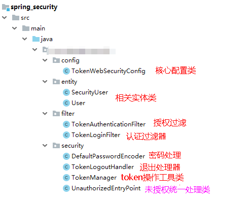

### <font style="color:rgb(0, 0, 0);">创建 spring security 核心配置类</font>
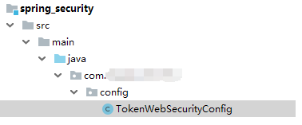

<font style="color:rgb(0, 0, 0);">Spring Security 的核心配置就是继承 </font><font style="color:rgb(255, 0, 0);">WebSecurityConfigurerAdapter </font><font style="color:rgb(0, 0, 0);">并注解 </font><font style="color:rgb(255, 0, 0);">@EnableWebSecurity </font><font style="color:rgb(0, 0, 0);">的配置。</font>

<font style="color:rgb(0, 0, 0);">这个配置指明了用户名密码的处理方式、请求路径的开合、登录登出控制等和安全相关的配置</font>

```java
import com.xszx.serurity.filter.TokenAuthenticationFilter;
import com.xszx.serurity.filter.TokenLoginFilter;
import com.xszx.serurity.security.DefaultPasswordEncoder;
import com.xszx.serurity.security.TokenLogoutHandler;
import com.xszx.serurity.security.TokenManager;
import com.xszx.serurity.security.UnauthorizedEntryPoint;
import org.springframework.beans.factory.annotation.Autowired;
import org.springframework.context.annotation.Configuration;
import org.springframework.data.redis.core.RedisTemplate;
import org.springframework.security.config.annotation.authentication.builders.AuthenticationManagerBuilder;
import org.springframework.security.config.annotation.method.configuration.EnableGlobalMethodSecurity;
import org.springframework.security.config.annotation.web.builders.HttpSecurity;
import org.springframework.security.config.annotation.web.builders.WebSecurity;
import org.springframework.security.config.annotation.web.configuration.EnableWebSecurity;
import org.springframework.security.config.annotation.web.configuration.WebSecurityConfigurerAdapter;
import org.springframework.security.core.userdetails.UserDetailsService;

/**
 * <p>
 * Security配置类
 * </p>
 */
@Configuration
@EnableWebSecurity
@EnableGlobalMethodSecurity(prePostEnabled = true)
public class TokenWebSecurityConfig extends WebSecurityConfigurerAdapter {

    private UserDetailsService userDetailsService;
    private TokenManager tokenManager;
    private DefaultPasswordEncoder defaultPasswordEncoder;
    private RedisTemplate redisTemplate;

    @Autowired
    public TokenWebSecurityConfig(UserDetailsService userDetailsService, DefaultPasswordEncoder defaultPasswordEncoder,
                                  TokenManager tokenManager, RedisTemplate redisTemplate) {
        this.userDetailsService = userDetailsService;
        this.defaultPasswordEncoder = defaultPasswordEncoder;
        this.tokenManager = tokenManager;
        this.redisTemplate = redisTemplate;
    }

    /**
     * 配置设置
     * @param http
     * @throws Exception
     */
    @Override
    protected void configure(HttpSecurity http) throws Exception {
        http.exceptionHandling()
                .authenticationEntryPoint(new UnauthorizedEntryPoint())
                .and().csrf().disable()
                .authorizeRequests()
                .anyRequest().authenticated()
                .and().logout().logoutUrl("/admin/acl/index/logout")
                .addLogoutHandler(new TokenLogoutHandler(tokenManager,redisTemplate)).and()
                .addFilter(new TokenLoginFilter(authenticationManager(), tokenManager, redisTemplate))
                .addFilter(new TokenAuthenticationFilter(authenticationManager(), tokenManager, redisTemplate)).httpBasic();
    }

    /**
     * 密码处理
     * @param auth
     * @throws Exception
     */
    @Override
    public void configure(AuthenticationManagerBuilder auth) throws Exception {
        auth.userDetailsService(userDetailsService).passwordEncoder(defaultPasswordEncoder);
    }

    /**
     * 配置哪些请求不拦截
     * @param web
     * @throws Exception
     */
    @Override
    public void configure(WebSecurity web) throws Exception {
        web.ignoring().antMatchers("/api/**",
                "/swagger-resources/**", "/webjars/**", "/v2/**", "/swagger-ui.html/**"
               );
    }
}
```

### <font style="color:rgb(0, 0, 0);">创建认证授权相关的工具类</font>
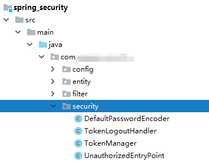

**（1）DefaultPasswordEncoder：密码处理的方法**

```java
package com.xszx.serurity.security;

import com.xszx.commonutils.utils.MD5;
import org.springframework.security.crypto.password.PasswordEncoder;
import org.springframework.stereotype.Component;

/**
 * <p>
 * 密码的处理方法类型
 * </p>
 */
@Component
public class DefaultPasswordEncoder implements PasswordEncoder {

    public DefaultPasswordEncoder() {
        this(-1);
    }

    /**
     * @param strength
     *            the log rounds to use, between 4 and 31
     */
    public DefaultPasswordEncoder(int strength) {

    }

    public String encode(CharSequence rawPassword) {
        return MD5.encrypt(rawPassword.toString());
    }

    public boolean matches(CharSequence rawPassword, String encodedPassword) {
        return encodedPassword.equals(MD5.encrypt(rawPassword.toString()));
    }
}
```

**<font style="color:rgb(0, 0, 0);">（2）TokenManager：token 操作的工具类</font>**

```java
import io.jsonwebtoken.CompressionCodecs;
import io.jsonwebtoken.Jwts;
import io.jsonwebtoken.SignatureAlgorithm;
import org.springframework.stereotype.Component;
import java.util.Date;

/**
 * <p>
 * token管理
 * </p>
 */
@Component
public class TokenManager {

    private long tokenExpiration = 24*60*60*1000;
    private String tokenSignKey = "123456";

    public String createToken(String username) {
        String token = Jwts.builder().setSubject(username)
                .setExpiration(new Date(System.currentTimeMillis() + tokenExpiration))
                .signWith(SignatureAlgorithm.HS512, tokenSignKey).compressWith(CompressionCodecs.GZIP).compact();
        return token;
    }

    public String getUserFromToken(String token) {
        String user = Jwts.parser().setSigningKey(tokenSignKey).parseClaimsJws(token).getBody().getSubject();
        return user;
    }

    public void removeToken(String token) {
        //jwttoken无需删除，客户端扔掉即可。
    }
}
```

**<font style="color:rgb(0, 0, 0);">（3）TokenLogoutHandler：退出实现</font>**

```java
import com.xszx.commonutils.R;
import com.xszx.commonutils.utils.ResponseUtil;
import org.springframework.data.redis.core.RedisTemplate;
import org.springframework.security.core.Authentication;
import org.springframework.security.web.authentication.logout.LogoutHandler;
import javax.servlet.http.HttpServletRequest;
import javax.servlet.http.HttpServletResponse;

/**
 * <p>
 * 登出业务逻辑类
 * </p>
 */
public class TokenLogoutHandler implements LogoutHandler {

    private TokenManager tokenManager;
    private RedisTemplate redisTemplate;

    public TokenLogoutHandler(TokenManager tokenManager, RedisTemplate redisTemplate) {
        this.tokenManager = tokenManager;
        this.redisTemplate = redisTemplate;
    }

    @Override
    public void logout(HttpServletRequest request, HttpServletResponse response, Authentication authentication) {
        String token = request.getHeader("token");
        if (token != null) {
            tokenManager.removeToken(token);

            //清空当前用户缓存中的权限数据
            String userName = tokenManager.getUserFromToken(token);
            redisTemplate.delete(userName);
        }
        ResponseUtil.out(response, R.ok());
    }
}
```

**<font style="color:rgb(0, 0, 0);">（4）UnauthorizedEntryPoint：未授权统一处理</font>**

```java
import com.xszx.commonutils.R;
import com.xszx.commonutils.utils.ResponseUtil;
import org.springframework.security.core.AuthenticationException;
import org.springframework.security.web.AuthenticationEntryPoint;
import javax.servlet.ServletException;
import javax.servlet.http.HttpServletRequest;
import javax.servlet.http.HttpServletResponse;
import java.io.IOException;

/**
 * <p>
 * 未授权的统一处理方式
 * </p>
 */
public class UnauthorizedEntryPoint implements AuthenticationEntryPoint {

    @Override
    public void commence(HttpServletRequest request, HttpServletResponse response,
                         AuthenticationException authException) throws IOException, ServletException {

        ResponseUtil.out(response, R.error());
    }
}
```

### <font style="color:rgb(0, 0, 0);">创建认证授权实体类</font>
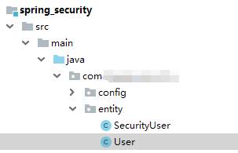

**<font style="color:rgb(0, 0, 0);">（1）SecutityUser</font>**

```java
import lombok.Data;
import lombok.extern.slf4j.Slf4j;
import org.springframework.security.core.GrantedAuthority;
import org.springframework.security.core.authority.SimpleGrantedAuthority;
import org.springframework.security.core.userdetails.UserDetails;
import org.springframework.util.StringUtils;
import java.util.ArrayList;
import java.util.Collection;
import java.util.List;

/**
 * <p>
 * 安全认证用户详情信息
 * </p>
 */
@Data
@Slf4j
public class SecurityUser implements UserDetails {

    //当前登录用户
    private transient User currentUserInfo;
    
    //当前权限
    private List<String> permissionValueList;

    public SecurityUser() {
        
    }

    public SecurityUser(User user) {
        if (user != null) {
            this.currentUserInfo = user;
        }
    }

    @Override
    public Collection<? extends GrantedAuthority> getAuthorities() {
        Collection<GrantedAuthority> authorities = new ArrayList<>();
        for(String permissionValue : permissionValueList) {
            if(StringUtils.isEmpty(permissionValue)) continue;
            SimpleGrantedAuthority authority = new SimpleGrantedAuthority(permissionValue);
            authorities.add(authority);
        }

        return authorities;
    }

    @Override
    public String getPassword() {
        return currentUserInfo.getPassword();
    }

    @Override
    public String getUsername() {
        return currentUserInfo.getUsername();
    }

    @Override
    public boolean isAccountNonExpired() {
        return true;
    }

    @Override
    public boolean isAccountNonLocked() {
        return true;
    }

    @Override
    public boolean isCredentialsNonExpired() {
        return true;
    }

    @Override
    public boolean isEnabled() {
        return true;
    }
}
```

**<font style="color:rgb(0, 0, 0);">（2）User</font>**

```java
import io.swagger.annotations.ApiModel;
import io.swagger.annotations.ApiModelProperty;
import lombok.Data;
import java.io.Serializable;

/**
 * <p>
 * 用户实体类
 * </p>
 */
@Data
@ApiModel(description = "用户实体类")
public class User implements Serializable {

    private static final long serialVersionUID = 1L;

    @ApiModelProperty(value = "微信openid")
    private String username;

    @ApiModelProperty(value = "密码")
    private String password;

    @ApiModelProperty(value = "昵称")
    private String nickName;

    @ApiModelProperty(value = "用户头像")
    private String salt;

    @ApiModelProperty(value = "用户签名")
    private String token;
}
```

### <font style="color:rgb(0, 0, 0);">创建认证和授权的 filter</font>
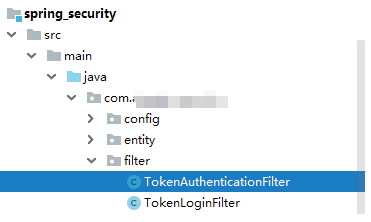

**<font style="color:rgb(0, 0, 0);">（1）TokenLoginFilter：认证的 filter</font>**

```java
import com.xszx.commonutils.R;
import com.xszx.commonutils.utils.ResponseUtil;
import com.xszx.serurity.entity.SecurityUser;
import com.xszx.serurity.entity.User;
import com.xszx.serurity.security.TokenManager;
import com.fasterxml.jackson.databind.ObjectMapper;
import org.springframework.data.redis.core.RedisTemplate;
import org.springframework.security.authentication.AuthenticationManager;
import org.springframework.security.authentication.UsernamePasswordAuthenticationToken;
import org.springframework.security.core.Authentication;
import org.springframework.security.core.AuthenticationException;
import org.springframework.security.web.authentication.UsernamePasswordAuthenticationFilter;
import org.springframework.security.web.util.matcher.AntPathRequestMatcher;
import javax.servlet.FilterChain;
import javax.servlet.ServletException;
import javax.servlet.http.HttpServletRequest;
import javax.servlet.http.HttpServletResponse;
import java.io.IOException;
import java.util.ArrayList;

/**
 * <p>
 * 登录过滤器，继承UsernamePasswordAuthenticationFilter，对用户名密码进行登录校验
 * </p>
 */
public class TokenLoginFilter extends UsernamePasswordAuthenticationFilter {

    private AuthenticationManager authenticationManager;
    private TokenManager tokenManager;
    private RedisTemplate redisTemplate;

    public TokenLoginFilter(AuthenticationManager authenticationManager, TokenManager tokenManager, RedisTemplate redisTemplate) {
        this.authenticationManager = authenticationManager;
        this.tokenManager = tokenManager;
        this.redisTemplate = redisTemplate;
        this.setPostOnly(false);
        this.setRequiresAuthenticationRequestMatcher(new AntPathRequestMatcher("/admin/acl/login","POST"));
    }

    @Override
    public Authentication attemptAuthentication(HttpServletRequest req, HttpServletResponse res)
            throws AuthenticationException {
        try {
            User user = new ObjectMapper().readValue(req.getInputStream(), User.class);

            return authenticationManager.authenticate(new UsernamePasswordAuthenticationToken(user.getUsername(), user.getPassword(), new ArrayList<>()));
        } catch (IOException e) {
            throw new RuntimeException(e);
        }

    }

    /**
     * 登录成功
     * @param req
     * @param res
     * @param chain
     * @param auth
     * @throws IOException
     * @throws ServletException
     */
    @Override
    protected void successfulAuthentication(HttpServletRequest req, HttpServletResponse res, FilterChain chain,
                                            Authentication auth) throws IOException, ServletException {
        SecurityUser user = (SecurityUser) auth.getPrincipal();
        String token = tokenManager.createToken(user.getCurrentUserInfo().getUsername());
        redisTemplate.opsForValue().set(user.getCurrentUserInfo().getUsername(), user.getPermissionValueList());

        ResponseUtil.out(res, R.ok().data("token", token));
    }

    /**
     * 登录失败
     * @param request
     * @param response
     * @param e
     * @throws IOException
     * @throws ServletException
     */
    @Override
    protected void unsuccessfulAuthentication(HttpServletRequest request, HttpServletResponse response,
                                              AuthenticationException e) throws IOException, ServletException {
        ResponseUtil.out(response, R.error());
    }
}
```

**<font style="color:rgb(0, 0, 0);">（2）TokenAuthenticationFilter：</font>**

**<font style="color:rgb(0, 0, 0);">授权 filter</font>**

```java
package com.xszx.serurity.filter;

import com.xszx.commonutils.R;
import com.xszx.commonutils.utils.ResponseUtil;
import com.xszx.serurity.security.TokenManager;
import org.springframework.data.redis.core.RedisTemplate;
import org.springframework.security.authentication.AuthenticationManager;
import org.springframework.security.authentication.UsernamePasswordAuthenticationToken;
import org.springframework.security.core.GrantedAuthority;
import org.springframework.security.core.authority.SimpleGrantedAuthority;
import org.springframework.security.core.context.SecurityContextHolder;
import org.springframework.security.web.authentication.www.BasicAuthenticationFilter;
import org.springframework.util.StringUtils;
import javax.servlet.FilterChain;
import javax.servlet.ServletException;
import javax.servlet.http.HttpServletRequest;
import javax.servlet.http.HttpServletResponse;
import java.io.IOException;
import java.util.ArrayList;
import java.util.Collection;
import java.util.List;

/**
 * <p>
 * 访问过滤器
 * </p>
 */
public class TokenAuthenticationFilter extends BasicAuthenticationFilter {

    private TokenManager tokenManager;
    private RedisTemplate redisTemplate;

    public TokenAuthenticationFilter(AuthenticationManager authManager, TokenManager tokenManager,RedisTemplate redisTemplate) {
        super(authManager);
        this.tokenManager = tokenManager;
        this.redisTemplate = redisTemplate;
    }

    @Override
    protected void doFilterInternal(HttpServletRequest req, HttpServletResponse res, FilterChain chain)
            throws IOException, ServletException {
        logger.info("================="+req.getRequestURI());
        if(req.getRequestURI().indexOf("admin") == -1) {
            chain.doFilter(req, res);
            return;
        }

        UsernamePasswordAuthenticationToken authentication = null;
        try {
            authentication = getAuthentication(req);
        } catch (Exception e) {
            ResponseUtil.out(res, R.error());
        }

        if (authentication != null) {
            SecurityContextHolder.getContext().setAuthentication(authentication);
        } else {
            ResponseUtil.out(res, R.error());
        }
        chain.doFilter(req, res);
    }

    private UsernamePasswordAuthenticationToken getAuthentication(HttpServletRequest request) {
        // token置于header里
        String token = request.getHeader("token");
        if (token != null && !"".equals(token.trim())) {
            String userName = tokenManager.getUserFromToken(token);

            List<String> permissionValueList = (List<String>) redisTemplate.opsForValue().get(userName);
            Collection<GrantedAuthority> authorities = new ArrayList<>();
            for(String permissionValue : permissionValueList) {
                if(StringUtils.isEmpty(permissionValue)) continue;
                SimpleGrantedAuthority authority = new SimpleGrantedAuthority(permissionValue);
                authorities.add(authority);
            }

            if (!StringUtils.isEmpty(userName)) {
                return new UsernamePasswordAuthenticationToken(userName, token, authorities);
            }
            return null;
        }
        return null;
    }
}
```

# 二、创建查询用户类和前端对接
## <font style="color:rgb(0, 0, 0);">创建自定义查询用户类</font>
**<font style="color:rgb(0, 0, 0);">在 service_acl 模块创建，因为其他模板不会用到</font>**

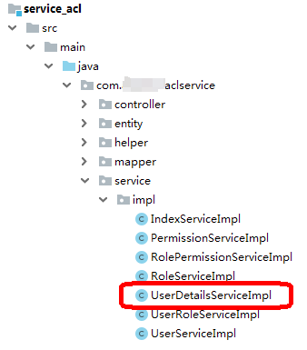

## <font style="color:rgb(51, 51, 51);">后端接口和前端页面对接</font>
**<font style="color:rgb(0, 0, 0);">1、在前端项目中下载依赖</font>**

<font style="color:rgb(255, 0, 0);">npm install --save vuex-persistedstate@3.1.0</font>

**<font style="color:rgb(0, 0, 0);">2、替换相关文件</font>**

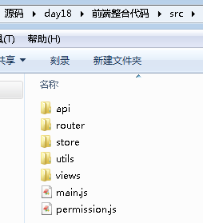

注意，替换完路由文件后，需要将新的路由文件中的组件修改成和我们自己的组件匹配上。

**<font style="color:rgb(0, 0, 0);">3、在 node_modules 文件夹中替换 element-ui 依赖</font>**

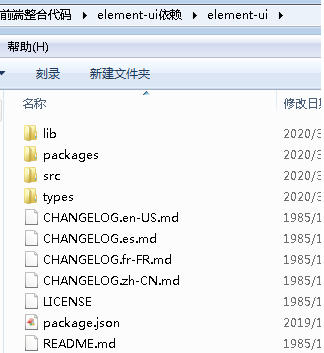

```latex
将目前项目中的 ELementUI 移除
npm uninstall element-ui
再安装最新的ELementUI
npm install element-ui
```

**4、修改数据库中菜单表的数据，将每条数据的 path 和 component 字段值改为你项目中路由里面写的值！（权限相关的不能改，因为我们就是复制进来的，能对上）**

**5、将前端项目中基本地址改为网关的地址**

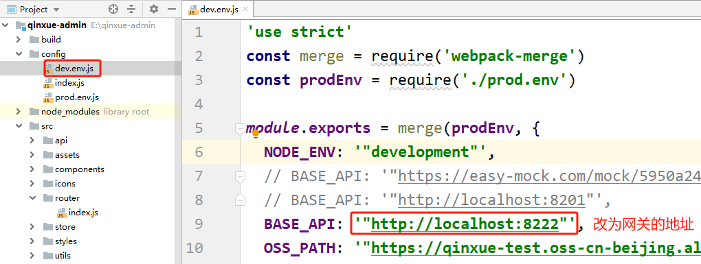

## 测试
1. 启动前台系统的前端项目
2. 启动 nacos、redis
3. 启动后端的各个模块（网关别忘记启动了）
4. 测试登录功能。账号 admin，密码 111111
5. 测试添加角色，给角色赋权限
6. 测试添加用户，给用户赋角色

**从讲义、资料中复制的代码应该是有问题的，给某个用户赋予了权限，但是登录后看不到菜单信息！！！是角色权限表中数据应该有缺失，手动添加一些合适的尝试一下。比如在角色权限表中：少全部数据这个权限、少赋予权限的某个子菜单的父菜单的数据等！！！！**

# 三、Nacos 配置中心
## <font style="color:rgb(51, 51, 51);">配置中心介绍</font>


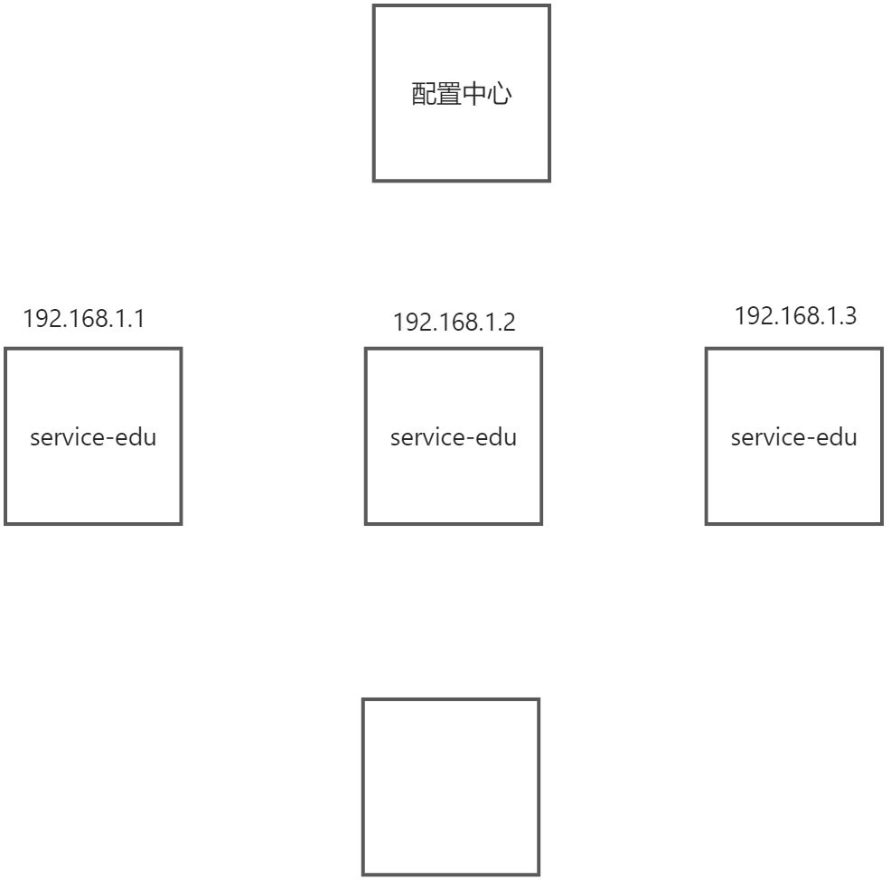

### <font style="color:rgb(0, 0, 0);">Spring Cloud Config</font>
<font style="color:rgb(0, 0, 0);">Spring Cloud Config 为分布式系统的外部配置提供了服务端和客户端的支持方案。在配置的服务端您可以在所有环境中为应用程序管理外部属性的中心位置。客户端和服务端概念上的 Spring Environment 和 PropertySource 抽象保持同步, 它们非常适合Spring应用程序，但是可以与任何语言中运行的应用程序一起使用。当应用程序在部署管道中从一个开发到测试直至进入生产时，您可以管理这些环境之间的配置，并确保应用程序在迁移时具有它们需要运行的所有内容。服务器存储后端的默认实现使用 git，因此它很容易支持标记版本的配置环境，并且能够被管理内容的各种工具访问。很容易添加替代的实现，并用 Spring配置将它们插入。</font>

<font style="color:rgb(0, 0, 0);">Spring Cloud Config 包含了 Client 和 Server 两个部分，server 提供配置文件的存储、以接口的形式将配置文件的内容提供出去，client 通过接口获取数据、并依据此数据初始化自己的应用。Spring cloud 使用 git 或 svn 存放配置文件，默认情况下使用 git。</font>

**<font style="color:rgb(0, 0, 0);">通俗来说，目前我们的项目模块，以后部署后，会用到集群，比如 edu 模块会部署10份，每份中都有 application.properties 配置文件，如果要改配置文件信息，就需要改10份，很麻烦。</font>**

**<font style="color:rgb(0, 0, 0);">所以我们可以使用配置中心，将 edu 模块的配置文件放入配置中心，所有的 edu 的集群服务都从配置中心获取配置文件即可。要修改的话只需要修改一次！</font>**

### <font style="color:rgb(0, 0, 0);">Nacos 替换 Config</font>
<font style="color:rgb(0, 0, 0);">Nacos</font><font style="color:rgb(0, 0, 0);"> </font><font style="color:rgb(0, 0, 0);">可以与</font><font style="color:rgb(0, 0, 0);"> </font><font style="color:rgb(0, 0, 0);">Spring, Spring Boot, Spring Cloud</font><font style="color:rgb(0, 0, 0);"> </font><font style="color:rgb(0, 0, 0);">集成，并能代替</font><font style="color:rgb(0, 0, 0);"> </font><font style="color:rgb(0, 0, 0);">Spring Cloud Eureka, Spring Cloud Config</font><font style="color:rgb(0, 0, 0);">。</font><font style="color:rgb(0, 0, 0);">通过</font><font style="color:rgb(0, 0, 0);"> </font><font style="color:rgb(0, 0, 0);">Nacos Server</font><font style="color:rgb(0, 0, 0);"> </font><font style="color:rgb(0, 0, 0);">和</font><font style="color:rgb(0, 0, 0);"> </font><font style="color:rgb(0, 0, 0);">spring-cloud-starter-alibaba-nacos-config</font><font style="color:rgb(0, 0, 0);"> </font><font style="color:rgb(0, 0, 0);">实现配置的动态变更。</font>

**<font style="color:rgb(0, 0, 0);">应用场景</font>**

<font style="color:rgb(0, 0, 0);">在系统开发过程中，开发者通常会将一些需要变更的参数、变量等从代码中分离出来独立管理，以独立的配置文件的形式存在。目的是让静态的系统工件或者交付物（如</font><font style="color:rgb(0, 0, 0);"> </font><font style="color:rgb(0, 0, 0);">WAR</font><font style="color:rgb(0, 0, 0);">，</font><font style="color:rgb(0, 0, 0);">JAR</font><font style="color:rgb(0, 0, 0);"> </font><font style="color:rgb(0, 0, 0);">包等）更好地和实际的物理运行环境进行适配。配置管理一般包含在系统部署的过程中，由系统管理员或者运维人员完成。配置变更是调整系统运行时的行为的有效手段。</font>

<font style="color:rgb(0, 0, 0);">如果微服务架构中没有使用统一配置中心时，所存在的问题：</font>

+ <font style="color:rgb(0, 0, 0);">配置文件分散在各个项目里，不方便维护</font>
+ <font style="color:rgb(0, 0, 0);">配置内容安全与权限</font>
+ <font style="color:rgb(0, 0, 0);">更新配置后，项目需要重启</font>

<font style="color:rgb(0, 0, 0);">nacos 配置中心：系统配置的集中管理（编辑、存储、分发）、动态更新不重启、回滚配置（变更管理、历史版本管理、变更审计）等所有与配置相关的活动。</font>

<font style="color:rgb(0, 0, 0);">负载均衡策略：</font>

+ 轮询
+ 随机
+ 权重
+ 最少响应时间

## <font style="color:rgb(51, 51, 51);">读取 Nacos 配置中心的配置文件</font>
### <font style="color:rgb(0, 0, 0);">在 Nacos 创建统一配置文件</font>
**<font style="color:rgb(0, 0, 0);">（1）点击创建按钮</font>**

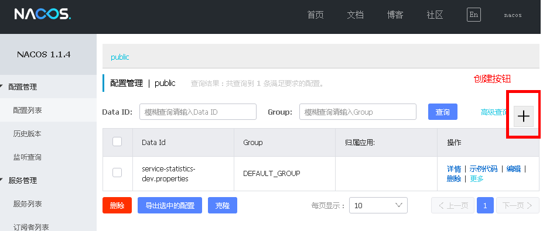

**<font style="color:rgb(0, 0, 0);">（2）输入配置信息</font>**

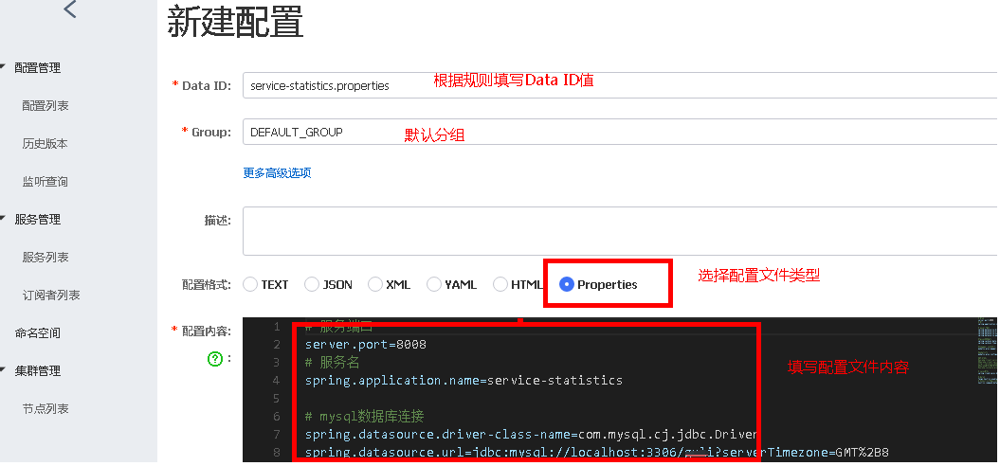

**<font style="color:rgb(0, 0, 0);">说明：Data ID 的完整规则格式如下</font>**

**<font style="color:rgb(0, 0, 0);">微服务名称-环境名称.后缀</font>**

**<font style="color:rgb(255, 0, 0);">${prefix}-${spring.profile.active}.${file-extension}</font>**

+ **<font style="color:rgb(0, 0, 0);">prefix</font>**<font style="color:rgb(0, 0, 0);"> 默认为所属工程配置spring.application.name 的值（即：nacos-provider），也可以通过配置项 spring.cloud.nacos.config.prefix来配置。</font>
+ **<font style="color:rgb(0, 0, 0);">spring.profiles.active=dev </font>**<font style="color:rgb(0, 0, 0);">即为当前环境对应的 profile。 注意：当 spring.profiles.active 为空时，对应的连接符 - 也将不存在，dataId 的拼接格式变成 ${prefix}.${file-extension}</font>
+ **<font style="color:rgb(0, 0, 0);">file-exetension</font>**<font style="color:rgb(0, 0, 0);"> 为配置内容的数据格式，可以通过配置项 spring.cloud.nacos.config.file-extension 来配置。目前只支持 properties 和 yaml 类型。</font>

### <font style="color:rgb(0, 0, 0);">以 service-statistics 模块为例</font>
**<font style="color:rgb(0, 0, 0);">（1）在 service 中引入依赖</font>**

```xml
<dependency>
    <groupId>org.springframework.cloud</groupId>
    <artifactId>spring-cloud-starter-alibaba-nacos-config</artifactId>
</dependency>
```

**<font style="color:#333333;">（2）创建 bootstrap.properties 配置文件</font>**

```properties
#配置中心地址
spring.cloud.nacos.config.server-addr=127.0.0.1:8848

spring.profiles.active=dev

# 该配置影响统一配置中心中的dataId
spring.application.name=service-statistics
```

**<font style="color:rgb(0, 0, 0);">（3）把项目之前的 application.properties 内容注释，启动项目查看效果</font>**

### <font style="color:rgb(255, 0, 0);">补充：springboot 配置文件加载顺序</font>
<font style="color:rgb(0, 0, 0);">其实 yml 和 properties 文件是一样的原理，且一个项目上要么 yml 或者 properties，二选一的存在。推荐使用 yml，更简洁。</font>

<font style="color:rgb(0, 0, 0);">bootstrap 与 application  
</font>**<font style="color:rgb(0, 0, 0);">（1）加载顺序</font>**<font style="color:rgb(0, 0, 0);">  
</font><font style="color:rgb(0, 0, 0);">这里主要是说明 application 和 bootstrap 的加载顺序。</font>

<font style="color:rgb(0, 0, 0);">bootstrap.yml（bootstrap.properties）先加载  
</font><font style="color:rgb(0, 0, 0);">application.yml（application.properties）后加载  
</font><font style="color:rgb(0, 0, 0);">bootstrap.yml 用于应用程序上下文的引导阶段。</font>

<font style="color:rgb(0, 0, 0);">bootstrap.yml 由父 Spring ApplicationContext 加载。</font>

<font style="color:rgb(0, 0, 0);">父 ApplicationContext 被加载到使用 application.yml 的之前。</font>

**<font style="color:rgb(0, 0, 0);">（2）配置区别</font>**<font style="color:rgb(0, 0, 0);">  
</font><font style="color:rgb(0, 0, 0);">bootstrap.yml 和 application.yml 都可以用来配置参数。</font>

<font style="color:rgb(0, 0, 0);">bootstrap.yml 可以理解成系统级别的一些参数配置，这些参数一般是不会变动的。  
</font><font style="color:rgb(0, 0, 0);">application.yml 可以用来定义应用级别的。</font>


> 更新: 2025-06-24 18:03:01  
> 原文: <https://www.yuque.com/u41736172/az9urv/mn91dn050isz0xs7>