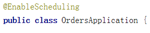

# 第十六天【统计分析】

# 一、统计分析功能（生成统计数据）

## <font style="color:rgb(0, 0, 0);">数据库设计</font>

### <font style="color:rgb(0, 0, 0);">数据库</font>

<font style="color:rgb(0, 0, 0);">qinxue\_statistics</font>

### <font style="color:rgb(0, 0, 0);">数据表</font>

qinxue\_statistics.sql

## <font style="color:rgb(0, 0, 0);">创建微服务</font>

### <font style="color:rgb(0, 0, 0);">在 service 模块下创建子模块</font>

artifactId：<font style="color:rgb(0, 0, 0);">service-statistics</font>

### <font style="color:rgb(0, 0, 0);">application.properties</font>

<font style="color:rgb(0, 0, 0);">resources 目录下创建文件</font>

```properties
# 服务端口
server.port=8008

# 服务名
spring.application.name=service-statistics

# mysql数据库连接
spring.datasource.driver-class-name=com.mysql.cj.jdbc.Driver
spring.datasource.url=jdbc:mysql://localhost:3306/qinxue_statistics?serverTimezone=GMT%2B8
spring.datasource.username=root
spring.datasource.password=root

#返回json的全局时间格式
spring.jackson.date-format=yyyy-MM-dd HH:mm:ss
spring.jackson.time-zone=GMT+8

#配置mapper xml文件的路径
mybatis-plus.mapper-locations=classpath:com/xszx/staservice/mapper/xml/*.xml

#mybatis日志
mybatis-plus.configuration.log-impl=org.apache.ibatis.logging.stdout.StdOutImpl

# nacos服务地址
spring.cloud.nacos.discovery.server-addr=127.0.0.1:8848

#开启熔断机制
feign.hystrix.enabled=true
# 设置hystrix超时时间，默认1000ms
hystrix.command.default.execution.isolation.thread.timeoutInMilliseconds=3000
```

### <font style="color:rgb(0, 0, 0);">MP 代码生成器生成代码</font>

生成 qinxue\_statistics 表相关代码。

### <font style="color:rgb(0, 0, 0);">创建 SpringBoot 启动类</font>

```java
@SpringBootApplication
@MapperScan("com.xszx.staservice.mapper")
@ComponentScan("com.xszx")
@EnableDiscoveryClient
@EnableFeignClients
public class StaApplication {

    public static void main(String[] args) {
        SpringApplication.run(StaApplication.class, args);
    }
}
```

## <font style="color:rgb(0, 0, 0);">实现服务调用</font>

### <font style="color:rgb(0, 0, 0);">在 service\_ucenter 模块创建接口，统计某一天的注册人数</font>

**<font style="color:rgb(0, 0, 0);">controller</font>**

```java
@GetMapping(value = "countregister/{day}")
public R registerCount(
        @PathVariable String day){
    Integer count = memberService.countRegisterByDay(day);
    return R.ok().data("countRegister", count);
}
```

**<font style="color:rgb(0, 0, 0);">service</font>**

```java
@Override
public Integer countRegisterByDay(String day) {
    return baseMapper.selectRegisterCount(day);
}
```

**<font style="color:rgb(0, 0, 0);">mapper</font>**

```xml
<select id="selectRegisterCount" resultType="java.lang.Integer">
    SELECT COUNT(1)
    FROM ucenter_member
    WHERE DATE(gmt_create) = #{value}
</select>
```

### <font style="color:rgb(0, 0, 0);">在 service\_statistics 模块创建远程调用接口</font>

<font style="color:rgb(0, 0, 0);">创建 client 包和 UcenterClient 接口</font>

```java
@Component
@FeignClient("service-ucenter")
public interface UcenterClient {

    @GetMapping(value = "/ucenterservice/member/countregister/{day}")
    public R registerCount(@PathVariable("day") String day);
}
```

### <font style="color:rgb(0, 0, 0);">在 service\_statistics 模块调用微服务</font>

**<font style="color:rgb(0, 0, 0);">service</font>**

```java
@Service
public class StatisticsDailyServiceImpl extends ServiceImpl<StatisticsDailyMapper, StatisticsDaily> implements StatisticsDailyService {

    @Autowired
    private UcenterClient ucenterClient;

    @Override
    public void createStatisticsByDay(String day) {
        //删除已存在的统计对象
        QueryWrapper<StatisticsDaily> dayQueryWrapper = new QueryWrapper<>();
        dayQueryWrapper.eq("date_calculated", day);
        baseMapper.delete(dayQueryWrapper);

        //获取统计信息
        Integer registerNum = (Integer) ucenterClient.registerCount(day).getData().get("countRegister");
        Integer loginNum = RandomUtils.nextInt(100, 200);//TODO
        Integer videoViewNum = RandomUtils.nextInt(100, 200);//TODO
        Integer courseNum = RandomUtils.nextInt(100, 200);//TODO

        //创建统计对象
        StatisticsDaily daily = new StatisticsDaily();
        daily.setRegisterNum(registerNum);
        daily.setLoginNum(loginNum);
        daily.setVideoViewNum(videoViewNum);
        daily.setCourseNum(courseNum);
        daily.setDateCalculated(day);

        baseMapper.insert(daily);
    }
}
```

**<font style="color:rgb(0, 0, 0);">controller</font>**

```java
@PostMapping("{day}")
public R createStatisticsByDate(@PathVariable String day) {
    dailyService.createStatisticsByDay(day);
    return R.ok();
}
```

## <font style="color:rgb(0, 0, 0);">添加定时任务</font>

**<font style="color:rgb(0, 0, 0);">第一步：创建定时任务类，使用 cron 表达式</font>**

<font style="color:rgb(0, 0, 0);">复制日期工具类</font>

```java
@Component
public class ScheduledTask {

    @Autowired
    private StatisticsDailyService dailyService;

    /**
     * 测试
     * 每天七点到二十三点每五秒执行一次
     */
    @Scheduled(cron = "0/5 * * * * ?")
    public void task1() {
        System.out.println("*********++++++++++++*****执行了");
    }

    /**
     * 每天凌晨1点执行定时
     */
    @Scheduled(cron = "0 0 1 * * ?")
    public void task2() {
        //获取上一天的日期
        String day = DateUtil.formatDate(DateUtil.addDays(new Date(), -1));
        dailyService.createStatisticsByDay(day);
    }
}
```

**第二步：\*\*\*\*<font style="color:rgb(0, 0, 0);">在启动类上添加注解</font>**



**第三步：\*\*\*\*<font style="color:rgb(0, 0, 0);">在线生成 cron 表达式</font>**

[**http://cron.qqe2.com/**](http://cron.qqe2.com/)

# <font style="color:rgb(0, 0, 0);">二、生成统计数据前端整合</font>

## <font style="color:rgb(0, 0, 0);">nginx 配置</font>

```latex
location ~ /staservice/ {           
    proxy_pass http://localhost:8008;
}
```

## <font style="color:rgb(0, 0, 0);">前端页面实现</font>

### <font style="color:rgb(0, 0, 0);">创建 api</font>

<font style="color:rgb(0, 0, 0);">创建 src/api/sta.js</font>

```javascript
import request from '@/utils/request'

const api_name = '/admin/statistics/daily'
export default {

  createStatistics(day) {
    return request({
      url: `${api_name}/${day}`,
      method: 'post'
    })
  }
}
```

### <font style="color:rgb(0, 0, 0);">增加路由</font>

<font style="color:rgb(0, 0, 0);">src/router/index.js</font>

```javascript
{
  path: '/statistics/daily',
  component: Layout,
  redirect: '/statistics/daily/create',
  name: 'Statistics',
  meta: { title: '统计分析', icon: 'chart' },
  children: [
    {
      path: 'create',
      name: 'StatisticsDailyCreate',
      component: () => import('@/views/statistics/daily/create'),
      meta: { title: '生成统计' }
    }
  ]
},
```

### <font style="color:rgb(0, 0, 0);">创建组件</font>

<font style="color:rgb(0, 0, 0);">src/views/</font><font style="color:rgb(0, 0, 0);">statistics</font><font style="color:rgb(0, 0, 0);">/daily/create.vue</font>

<font style="color:rgb(0, 0, 0);">模板部分</font>

```html
<template>
  <div class="app-container">
    <!--表单-->
    <el-form :inline="true" class="demo-form-inline">

      <el-form-item label="日期">
        <el-date-picker
          v-model="day"
          type="date"
          placeholder="选择要统计的日期"
          value-format="yyyy-MM-dd" />
      </el-form-item>

      <el-button
        :disabled="btnDisabled"
        type="primary"
        @click="create()">生成</el-button>
    </el-form>

  </div>
</template>
```

<font style="color:rgb(0, 0, 0);">script 部分</font>

```html
<script>
import daily from '@/api/sta'

export default {
  data() {
    return {
      day: '',
      btnDisabled: false
    }
  },

  methods: {
    create() {
      this.btnDisabled = true
      daily.createStatistics(this.day).then(response => {
        this.btnDisabled = false
        this.$message({
          type: 'success',
          message: '生成成功'
        })
      })
    }
  }
}
</script>
```

# 三、统计数据图表显示

## <font style="color:rgb(0, 0, 0);">ECharts</font>

### <font style="color:rgb(0, 0, 0);">简介</font>

<font style="color:rgb(0, 0, 0);">ECharts 是百度的一个项目，后来百度把 Echart 捐给 apache，用于图表展示，提供了常规的</font>[<font style="color:rgb(0, 0, 0);">折线图</font>](https://echarts.baidu.com/option.html#series-line)<font style="color:rgb(51, 51, 51);">、</font>[<font style="color:rgb(0, 0, 0);">柱状图</font>](https://echarts.baidu.com/option.html#series-line)<font style="color:rgb(51, 51, 51);">、</font>[<font style="color:rgb(0, 0, 0);">散点图</font>](https://echarts.baidu.com/option.html#series-scatter)<font style="color:rgb(51, 51, 51);">、</font>[<font style="color:rgb(0, 0, 0);">饼图</font>](https://echarts.baidu.com/option.html#series-pie)<font style="color:rgb(51, 51, 51);">、</font>[<font style="color:rgb(0, 0, 0);">K线图</font>](https://echarts.baidu.com/option.html#series-candlestick)<font style="color:rgb(51, 51, 51);">，用于统计的</font>[<font style="color:rgb(0, 0, 0);">盒形图</font>](https://echarts.baidu.com/option.html#series-boxplot)<font style="color:rgb(51, 51, 51);">，用于地理数据可视化的</font>[<font style="color:rgb(0, 0, 0);">地图</font>](https://echarts.baidu.com/option.html#series-map)<font style="color:rgb(51, 51, 51);">、</font>[<font style="color:rgb(0, 0, 0);">热力图</font>](https://echarts.baidu.com/option.html#series-heatmap)<font style="color:rgb(51, 51, 51);">、</font>[<font style="color:rgb(0, 0, 0);">线图</font>](https://echarts.baidu.com/option.html#series-lines)<font style="color:rgb(51, 51, 51);">，用于关系数据可视化的</font>[<font style="color:rgb(0, 0, 0);">关系图</font>](https://echarts.baidu.com/option.html#series-graph)<font style="color:rgb(51, 51, 51);">、</font>[<font style="color:rgb(0, 0, 0);">treemap</font>](https://echarts.baidu.com/option.html#series-treemap)<font style="color:rgb(51, 51, 51);">、</font>[<font style="color:rgb(0, 0, 0);">旭日图</font>](https://echarts.baidu.com/option.html#series-sunburst)<font style="color:rgb(51, 51, 51);">，多维数据可视化的</font>[<font style="color:rgb(0, 0, 0);">平行坐标</font>](https://echarts.baidu.com/option.html#series-parallel)<font style="color:rgb(51, 51, 51);">，还有用于 BI 的</font>[<font style="color:rgb(0, 0, 0);">漏斗图</font>](https://echarts.baidu.com/option.html#series-funnel)<font style="color:rgb(51, 51, 51);">，</font>[<font style="color:rgb(0, 0, 0);">仪表盘</font>](https://echarts.baidu.com/option.html#series-gauge)<font style="color:rgb(51, 51, 51);">，并且支持图与图之间的混搭。</font>

<font style="color:#333333;">官方网站：</font>[<font style="color:#333333;">https://echarts.baidu.com/</font>](https://echarts.baidu.com/)

### <font style="color:rgb(0, 0, 0);">基本使用</font>

<font style="color:rgb(0, 0, 0);">入门参考：官网->文档->教程->5分钟上手ECharts</font>

<font style="color:rgb(0, 0, 0);">（1）创建html页面：柱图.html</font>

<font style="color:rgb(0, 0, 0);">（2）引入 ECharts</font>

```html
<!-- 引入 ECharts 文件 -->
<script src="echarts.min.js"></script>
```

<font style="color:rgb(0, 0, 0);">（3）定义图表区域</font>

```html
<!-- 为ECharts准备一个具备大小（宽高）的Dom -->
<div id="main" style="width: 600px;height:400px;"></div> 
```

<font style="color:rgb(0, 0, 0);">（4）渲染图表</font>

```html
<script type="text/javascript">
    // 基于准备好的dom，初始化echarts实例
    var myChart = echarts.init(document.getElementById('main'));

    // 指定图表的配置项和数据
    var option = {
        title: {
            text: 'ECharts 入门示例'
        },
        tooltip: {},
        legend: {
            data:['销量']
        },
        xAxis: {
            data: ["衬衫","羊毛衫","雪纺衫","裤子","高跟鞋","袜子"]
        },
        yAxis: {},
        series: [{
            name: '销量',
            type: 'bar',
            data: [5, 20, 36, 10, 10, 20]
        }]
    };

    // 使用刚指定的配置项和数据显示图表。
    myChart.setOption(option);
</script>
```

### <font style="color:rgb(0, 0, 0);">折线图</font>

<font style="color:rgb(0, 0, 0);">实例参考：官网->实例->官方实例 </font>[<font style="color:rgb(0, 0, 0);">https://echarts.baidu.com/examples/</font>](https://echarts.baidu.com/examples/)

<font style="color:rgb(0, 0, 0);">折线图.html</font>

```html
<script>
    var myChart = echarts.init(document.getElementById('main'));
    var option = {
        //x轴是类目轴（离散数据）,必须通过data设置类目数据
        xAxis: {
            type: 'category',
            data: ['Mon', 'Tue', 'Wed', 'Thu', 'Fri', 'Sat', 'Sun']
        },
        //y轴是数据轴（连续数据）
        yAxis: {
            type: 'value'
        },
        //系列列表。每个系列通过 type 决定自己的图表类型
        series: [{
            //系列中的数据内容数组
            data: [820, 932, 901, 934, 1290, 1330, 1320],
            //折线图
            type: 'line'
        }]
    };
    myChart.setOption(option);
</script>
```

## <font style="color:rgb(0, 0, 0);">项目中集成 ECharts</font>

### <font style="color:rgb(0, 0, 0);">安装 ECharts</font>

```latex
npm install --save echarts@4.1.0
```

### <font style="color:rgb(0, 0, 0);">增加路由</font>

<font style="color:rgb(0, 0, 0);">src/router/index.js</font>

<font style="color:rgb(0, 0, 0);">在统计分析路由中增加子路由</font>

```javascript
{
  path: 'chart',
    name: 'StatisticsDayChart',
    component: () => import('@/views/statistics/daily/chart'),
    meta: { title: '统计图表' }
}  
```

### <font style="color:rgb(0, 0, 0);">创建组件</font>

<font style="color:rgb(0, 0, 0);">src/views/</font><font style="color:rgb(0, 0, 0);">statistics</font><font style="color:rgb(0, 0, 0);">/daily/chart.vue</font>

**<font style="color:rgb(0, 0, 0);">模板</font>**

```html
<template>
  <div class="app-container">
    <!--表单-->
    <el-form :inline="true" class="demo-form-inline">

      <el-form-item>
        <el-select v-model="searchObj.type" clearable placeholder="请选择">
          <el-option label="学员登录数统计" value="login_num"/>
          <el-option label="学员注册数统计" value="register_num"/>
          <el-option label="课程播放数统计" value="video_view_num"/>
          <el-option label="每日课程数统计" value="course_num"/>
        </el-select>
      </el-form-item>

      <el-form-item>
        <el-date-picker
          v-model="searchObj.begin"
          type="date"
          placeholder="选择开始日期"
          value-format="yyyy-MM-dd" />
      </el-form-item>
      <el-form-item>
        <el-date-picker
          v-model="searchObj.end"
          type="date"
          placeholder="选择截止日期"
          value-format="yyyy-MM-dd" />
      </el-form-item>
      <el-button
        :disabled="btnDisabled"
        type="primary"
        icon="el-icon-search"
        @click="showChart()">查询</el-button>
    </el-form>

    <div class="chart-container">
      <div id="chart" class="chart" style="height:500px;width:100%" />
    </div>
  </div>
</template>
```

**<font style="color:rgb(0, 0, 0);">js：暂时显示临时数据</font>**

```html
<script>
import echarts from 'echarts'

export default {
  data() {
    return {
      searchObj: {
        type: '',
        begin: '',
        end: ''
      },
      btnDisabled: false,
      chart: null,
      title: '',
      xData: [],
      yData: []
    }
  },
  methods: {
    showChart() {
      this.initChartData()
      this.setChart()
    },

    // 准备图表数据
    initChartData() {

    },

    // 设置图标参数
    setChart() {
      // 基于准备好的dom，初始化echarts实例
      this.chart = echarts.init(document.getElementById('chart'))
      // console.log(this.chart)

      // 指定图表的配置项和数据
      var option = {
        // x轴是类目轴（离散数据）,必须通过data设置类目数据
        xAxis: {
          type: 'category',
          data: ['Mon', 'Tue', 'Wed', 'Thu', 'Fri', 'Sat', 'Sun']
        },
        // y轴是数据轴（连续数据）
        yAxis: {
          type: 'value'
        },
        // 系列列表。每个系列通过 type 决定自己的图表类型
        series: [{
          // 系列中的数据内容数组
          data: [820, 932, 901, 934, 1290, 1330, 1320],
          // 折线图
          type: 'line'
        }]
      }

      this.chart.setOption(option)
    }
  }
}
</script>
```

## <font style="color:rgb(0, 0, 0);">完成后端业务</font>

### <font style="color:rgb(0, 0, 0);">controller</font>

```java
@GetMapping("show-chart/{begin}/{end}/{type}")
public R showChart(@PathVariable String begin,@PathVariable String end,@PathVariable String type){

    Map<String, Object> map = dailyService.getChartData(begin, end, type);
    return R.ok().data(map);
}
```

### <font style="color:rgb(0, 0, 0);">service</font>

**<font style="color:rgb(0, 0, 0);">接口</font>**

```java
Map<String, Object> getChartData(String begin, String end, String type);
```

**<font style="color:rgb(0, 0, 0);">实现</font>**

```java
@Override
public Map<String, Object> getChartData(String begin, String end, String type) {

    QueryWrapper<Daily> dayQueryWrapper = new QueryWrapper<>();
    dayQueryWrapper.select(type, "date_calculated");
    dayQueryWrapper.between("date_calculated", begin, end);

    List<Daily> dayList = baseMapper.selectList(dayQueryWrapper);

    Map<String, Object> map = new HashMap<>();
    List<Integer> dataList = new ArrayList<Integer>();
    List<String> dateList = new ArrayList<String>();
    map.put("dataList", dataList);
    map.put("dateList", dateList);

    for (int i = 0; i < dayList.size(); i++) {
        Daily daily = dayList.get(i);
        dateList.add(daily.getDateCalculated());
        switch (type) {
            case "register_num":
                dataList.add(daily.getRegisterNum());
                break;
            case "login_num":
                dataList.add(daily.getLoginNum());
                break;
            case "video_view_num":
                dataList.add(daily.getVideoViewNum());
                break;
            case "course_num":
                dataList.add(daily.getCourseNum());
                break;
            default:
                break;
        }
    }

    return map;
}
```

## <font style="color:rgb(0, 0, 0);">前后端整合</font>

### <font style="color:rgb(0, 0, 0);">创建 api</font>

<font style="color:rgb(0, 0, 0);">src/api/statistics/daily.js 中添加方法</font>

```javascript
showChart(searchObj) {
    return request({
        url: `${api_name}/show-chart/${searchObj.begin}/${searchObj.end}/${searchObj.type}`,
        method: 'get'
    })
}
```

### <font style="color:rgb(0, 0, 0);">chart.vue 中引入 api 模块</font>

```javascript
import daily from '@/api/statistics/daily'

......
```

### <font style="color:rgb(0, 0, 0);">修改 initChartData 方法</font>

```javascript
showChart() {
  this.initChartData()
  // this.setChart()//放在initChartData回调中执行
},

// 准备图表数据
initChartData() {
  daily.showChart(this.searchObj).then(response => {
    // 数据
    this.yData = response.data.dataList

    // 横轴时间
    this.xData = response.data.dateList

    // 当前统计类别
    switch (this.searchObj.type) {
      case 'register_num':
        this.title = '学员注册数统计'
        break
      case 'login_num':
        this.title = '学员登录数统计'
        break
      case 'video_view_num':
        this.title = '课程播放数统计'
        break
      case 'course_num':
        this.title = '每日课程数统计'
        break
    }

    this.setChart()
  })
},
```

### <font style="color:rgb(0, 0, 0);">修改 options 中的数据</font>

```javascript
xAxis: {
    type: 'category',
    data: this.xData//-------绑定数据
},

// y轴是数据轴（连续数据）
yAxis: {
    type: 'value'
},

// 系列列表。每个系列通过 type 决定自己的图表类型
series: [{
    // 系列中的数据内容数组
    data: this.yData,//-------绑定数据
    // 折线图
    type: 'line'
}],
```

## <font style="color:rgb(0, 0, 0);">样式调整</font>

<font style="color:rgb(0, 0, 0);">参考配置手册：</font><https://echarts.baidu.com/option.html#title>

### <font style="color:rgb(0, 0, 0);">显示标题</font>

```json
title: {
    text: this.title
},
```

### <font style="color:rgb(0, 0, 0);">x 坐标轴触发提示</font>

```json
tooltip: {
    trigger: 'axis'
},
```

### <font style="color:rgb(0, 0, 0);">区域缩放</font>

```json
dataZoom: [{
  show: true,
  height: 30,
  xAxisIndex: [
    0
  ],
  bottom: 30,
  start: 10,
  end: 80,
  handleIcon: 'path://M306.1,413c0,2.2-1.8,4-4,4h-59.8c-2.2,0-4-1.8-4-4V200.8c0-2.2,1.8-4,4-4h59.8c2.2,0,4,1.8,4,4V413z',
  handleSize: '110%',
  handleStyle: {
    color: '#d3dee5'

  },
  textStyle: {
    color: '#fff'
  },
  borderColor: '#90979c'
},
{
  type: 'inside',
  show: true,
  height: 15,
  start: 1,
  end: 35
}]
```

# 四、Canal 数据同步工具

Canal 可以将两个数据库中的数据进行同步。前提是：这两个数据库库的名字一样；数据库表名一样、表的结构也要一样。

比如：我们在 Linux 系统安装了 MySQL 数据库，创建了数据库名字是 emp\_manage，里面有表 emp，字段 id、name、age

我们在 windows 系统安装了 MySQL 数据库，创建了数据库名字是 emp\_manage，里面有表 emp，字段 id、name、age

如果我们在 Linux 系统的 MySQL 中配置了 Canal 相关内容，就可以实现当 Linux 中的 MySQL 中的数据发生变化后会同步到我们 windows 中的 MySQL 中。

## <font style="color:rgb(0, 0, 0);">Canal 介绍</font>

### <font style="color:rgb(0, 0, 0);">应用场景</font>

<font style="color:rgb(0, 0, 0);">在前面的统计分析功能中，我们采取了服务调用获取统计数据，这样耦合度高，效率相对较低，目前我采取另一种实现方式，通过实时同步数据库表的方式实现，例如我们要统计每天注册与登录人数，我们只需把会员表同步到统计库中，实现本地统计就可以了，这样效率更高，耦合度更低，Canal 就是一个很好的数据库同步工具。canal 是阿里巴巴旗下的一款开源项目，纯 Java 开发。基于数据库增量日志解析，提供增量数据订阅&消费，目前主要支持了 MySQL。</font>

### <font style="color:rgb(0, 0, 0);">Canal 环境搭建</font>

**<font style="color:rgb(0, 0, 0);">canal 的原理是基于mysql binlog 技术，所以这里一定需要开启 mysql 的 binlog 写入功能</font>**

**<font style="color:rgb(0, 0, 0);">开启 mysql 服务：</font>**<font style="color:rgb(0, 0, 0);">  service mysql start</font>

**<font style="color:rgb(0, 0, 0);">（1）检查 binlog 功能是否有开启</font>**

```latex
mysql> show variables like 'log_bin';
+---------------+-------+
| Variable_name | Value |
+---------------+-------+
| log_bin       | OFF    |
+---------------+-------+
1 row in set (0.00 sec)
```

**<font style="color:rgb(0, 0, 0);">（2）如果显示状态为 OFF 表示该功能未开启，开启 binlog 功能</font>**

```latex
1. 修改 mysql 的配置文件 my.cnf
vi /etc/my.cnf 

追加内容：
log-bin=mysql-bin     #binlog文件名
binlog_format=ROW     #选择row模式
server_id=1           #mysql实例id,不能和canal的slaveId重复

2. 重启 mysql：
service mysql restart   

3. 登录 mysql 客户端，查看 log_bin 变量
mysql> show variables like 'log_bin';
+---------------+-------+
| Variable_name | Value |
+---------------+-------+
| log_bin       | ON		|
+---------------+-------+
1 row in set (0.00 sec)
————————————————
如果显示状态为ON表示该功能已开启
```

**<font style="color:rgb(0, 0, 0);">（3）在 mysql 里面添加以下的相关用户和权限</font>**

```latex
CREATE USER 'canal'@'%' IDENTIFIED BY 'canal';
GRANT SHOW VIEW, SELECT, REPLICATION SLAVE, REPLICATION CLIENT ON *.* TO 'canal'@'%';
FLUSH PRIVILEGES;
```

### <font style="color:rgb(0, 0, 0);">下载安装 Canal 服务</font>

<font style="color:rgb(0, 0, 0);">下载地址：</font>

[<font style="color:rgb(0, 0, 0);">https://github.com/alibaba/canal/releases</font>](https://github.com/alibaba/canal/releases)

**<font style="color:rgb(0, 0, 0);">（1）下载之后，放到目录中，解压文件</font>**

<font style="color:rgb(0, 0, 0);">cd</font><font style="color:rgb(0, 0, 0);"> </font><code><font style="color:rgb(0, 0, 0);">/usr/local/canal</font></code>

<font style="color:rgb(0, 0, 0);">canal.deployer-1.1.4.tar.gz</font>

<font style="color:rgb(0, 0, 0);">tar zxvf canal.deployer-1.1.4.tar.gz</font>

**<font style="color:rgb(0, 0, 0);">（2）修改配置文件</font>**

```plain
vi conf/example/instance.properties
```

```latex
#需要改成自己的数据库信息
canal.instance.master.address=192.168.44.132:3306

#需要改成自己的数据库用户名与密码

canal.instance.dbUsername=canal
canal.instance.dbPassword=canal

#需要改成同步的数据库表规则，例如只是同步一下表
#canal.instance.filter.regex=.*\\..*
canal.instance.filter.regex=qinxue_ucenter.ucenter_member
```

注：

mysql 数据解析关注的表，Perl 正则表达式.

多个正则之间以逗号(,)分隔，转义符需要双斜杠(\\)

常见例子：

1. 所有表：.\*   or  .*\\..*

2. canal schema下所有表： canal\\..\*

3. canal 下的以 canal 打头的表：canal\\.canal.\*

4. canal schema下的一张表：canal.test1

5. 多个规则组合使用：canal\\..\*,mysql.test1,mysql.test2 (逗号分隔)

注意：此过滤条件只针对row模式的数据有效(ps. mixed/statement因为不解析sql，所以无法准确提取tableName进行过滤)

**<font style="color:rgb(0, 0, 0);">（3）进入 bin 目录下启动</font>**

**<font style="color:rgb(0, 0, 0);">sh bin/startup.sh</font>**

## <font style="color:rgb(0, 0, 0);">创建 canal\_client 模块</font>

### <font style="color:rgb(0, 0, 0);">在 qinxue\_parent 下创建 canal\_client 模块</font>

### <font style="color:rgb(0, 0, 0);">引入相关依赖</font>

```xml
<dependencies>
    <dependency>
        <groupId>org.springframework.boot</groupId>
        <artifactId>spring-boot-starter-web</artifactId>
    </dependency>

    <!--mysql-->
    <dependency>
        <groupId>mysql</groupId>
        <artifactId>mysql-connector-java</artifactId>
    </dependency>

    <dependency>
        <groupId>commons-dbutils</groupId>
        <artifactId>commons-dbutils</artifactId>
    </dependency>

    <dependency>
        <groupId>org.springframework.boot</groupId>
        <artifactId>spring-boot-starter-jdbc</artifactId>
    </dependency>

    <dependency>
        <groupId>com.alibaba.otter</groupId>
        <artifactId>canal.client</artifactId>
    </dependency>
</dependencies>
```

### <font style="color:rgb(0, 0, 0);">创建 application.properties 配置文件</font>

```properties
# 服务端口
server.port=10000

# 服务名
spring.application.name=canal-client

# 环境设置：dev、test、prod
spring.profiles.active=dev

# mysql数据库连接
spring.datasource.driver-class-name=com.mysql.cj.jdbc.Driver
spring.datasource.url=jdbc:mysql://localhost:3306/qinxue_edu?serverTimezone=GMT%2B8
spring.datasource.username=root
spring.datasource.password=root
```

### <font style="color:rgb(0, 0, 0);">编写 canal 客户端类</font>

```java
import com.alibaba.otter.canal.client.CanalConnector;
import com.alibaba.otter.canal.client.CanalConnectors;
import com.alibaba.otter.canal.protocol.CanalEntry.*;
import com.alibaba.otter.canal.protocol.Message;
import com.google.protobuf.InvalidProtocolBufferException;
import org.apache.commons.dbutils.DbUtils;
import org.apache.commons.dbutils.QueryRunner;
import org.springframework.stereotype.Component;
import javax.annotation.Resource;
import javax.sql.DataSource;
import java.net.InetSocketAddress;
import java.sql.Connection;
import java.sql.SQLException;
import java.util.Iterator;
import java.util.List;
import java.util.Queue;
import java.util.concurrent.ConcurrentLinkedQueue;

@Component
public class CanalClient {
    //sql队列
    private Queue<String> SQL_QUEUE = new ConcurrentLinkedQueue<>();
    
    @Resource
    private DataSource dataSource;
    
    /**
     * canal入库方法
     */
    public void run() {
        CanalConnector connector = CanalConnectors.newSingleConnector(new InetSocketAddress("192.168.44.132",
                11111), "example", "", "");
        int batchSize = 1000;
        try {
            connector.connect();
            connector.subscribe(".*\\..*");
            connector.rollback();
            try {
                while (true) {
                    //尝试从master那边拉去数据batchSize条记录，有多少取多少
                    Message message = connector.getWithoutAck(batchSize);
                    long batchId = message.getId();
                    int size = message.getEntries().size();
                    if (batchId == -1 || size == 0) {
                        Thread.sleep(1000);
                    } else {
                        dataHandle(message.getEntries());
                    }
                    connector.ack(batchId);
                    //当队列里面堆积的sql大于一定数值的时候就模拟执行
                    if (SQL_QUEUE.size() >= 1) {
                        executeQueueSql();
                    }
                }
            } catch (InterruptedException e) {
                e.printStackTrace();
            } catch (InvalidProtocolBufferException e) {
                e.printStackTrace();
            }
        } finally {
            connector.disconnect();
        }
    }
    
    /**
     * 模拟执行队列里面的sql语句
     */
    public void executeQueueSql() {
        int size = SQL_QUEUE.size();
        for (int i = 0; i < size; i++) {
            String sql = SQL_QUEUE.poll();
            System.out.println("[sql]----> " + sql);
            this.execute(sql.toString());
        }
    }
    
    /**
     * 数据处理
     *
     * @param entrys
     */
    private void dataHandle(List<Entry> entrys) throws InvalidProtocolBufferException {
        for (Entry entry : entrys) {
            if (EntryType.ROWDATA == entry.getEntryType()) {
                RowChange rowChange = RowChange.parseFrom(entry.getStoreValue());
                EventType eventType = rowChange.getEventType();
                if (eventType == EventType.DELETE) {
                    saveDeleteSql(entry);
                } else if (eventType == EventType.UPDATE) {
                    saveUpdateSql(entry);
                } else if (eventType == EventType.INSERT) {
                    saveInsertSql(entry);
                }
            }
        }
    }
    
    /**
     * 保存更新语句
     *
     * @param entry
     */
    private void saveUpdateSql(Entry entry) {
        try {
            RowChange rowChange = RowChange.parseFrom(entry.getStoreValue());
            List<RowData> rowDatasList = rowChange.getRowDatasList();
            for (RowData rowData : rowDatasList) {
                List<Column> newColumnList = rowData.getAfterColumnsList();
                StringBuffer sql = new StringBuffer("update " + entry.getHeader().getTableName() + " set ");
                for (int i = 0; i < newColumnList.size(); i++) {
                    sql.append(" " + newColumnList.get(i).getName()
                            + " = '" + newColumnList.get(i).getValue() + "'");
                    if (i != newColumnList.size() - 1) {
                        sql.append(",");
                    }
                }
                sql.append(" where ");
                List<Column> oldColumnList = rowData.getBeforeColumnsList();
                for (Column column : oldColumnList) {
                    if (column.getIsKey()) {
                        //暂时只支持单一主键
                        sql.append(column.getName() + "=" + column.getValue());
                        break;
                    }
                }
                SQL_QUEUE.add(sql.toString());
            }
        } catch (InvalidProtocolBufferException e) {
            e.printStackTrace();
        }
    }
    
    /**
     * 保存删除语句
     *
     * @param entry
     */
    private void saveDeleteSql(Entry entry) {
        try {
            RowChange rowChange = RowChange.parseFrom(entry.getStoreValue());
            List<RowData> rowDatasList = rowChange.getRowDatasList();
            for (RowData rowData : rowDatasList) {
                List<Column> columnList = rowData.getBeforeColumnsList();
                StringBuffer sql = new StringBuffer("delete from " + entry.getHeader().getTableName() + " where ");
                for (Column column : columnList) {
                    if (column.getIsKey()) {
                        //暂时只支持单一主键
                        sql.append(column.getName() + "=" + column.getValue());
                        break;
                    }
                }
                SQL_QUEUE.add(sql.toString());
            }
        } catch (InvalidProtocolBufferException e) {
            e.printStackTrace();
        }
    }
    
    /**
     * 保存插入语句
     *
     * @param entry
     */
    private void saveInsertSql(Entry entry) {
        try {
            RowChange rowChange = RowChange.parseFrom(entry.getStoreValue());
            List<RowData> rowDatasList = rowChange.getRowDatasList();
            for (RowData rowData : rowDatasList) {
                List<Column> columnList = rowData.getAfterColumnsList();
                StringBuffer sql = new StringBuffer("insert into " + entry.getHeader().getTableName() + " (");
                for (int i = 0; i < columnList.size(); i++) {
                    sql.append(columnList.get(i).getName());
                    if (i != columnList.size() - 1) {
                        sql.append(",");
                    }
                }
                sql.append(") VALUES (");
                for (int i = 0; i < columnList.size(); i++) {
                    sql.append("'" + columnList.get(i).getValue() + "'");
                    if (i != columnList.size() - 1) {
                        sql.append(",");
                    }
                }
                sql.append(")");
                SQL_QUEUE.add(sql.toString());
            }
        } catch (InvalidProtocolBufferException e) {
            e.printStackTrace();
        }
    }
    
    /**
     * 入库
     * @param sql
     */
    public void execute(String sql) {
        Connection con = null;
        try {
            if(null == sql) return;
            con = dataSource.getConnection();
            QueryRunner qr = new QueryRunner();
            int row = qr.execute(con, sql);
            System.out.println("update: "+ row);
        } catch (SQLException e) {
            e.printStackTrace();
        } finally {
            DbUtils.closeQuietly(con);
        }
    }
}
```

### <font style="color:rgb(0, 0, 0);">创建启动类</font>

```java
@SpringBootApplication
public class CanalApplication implements CommandLineRunner {

    @Resource
    private CanalClient canalClient;

    public static void main(String[] args) {
        SpringApplication.run(CanalApplication.class, args);
    }

    @Override
    public void run(String... strings) throws Exception {
        //项目启动，执行canal客户端监听
        canalClient.run();
    }
}
```

## 案例

1. 在 Linux 系统中安装一个 MySQL 数据库，同时创建 emp\_manage 数据库，创建表 emp，字段 id name age
2. 开启 Linux 系统中 MySQL 数据库的 bin\_log 功能
3. 在 Linux 中配置好 Canal，并启动
4. 在 Windows 系统的 MySQL 数据库中也创建 emp\_manage 数据库，创建表 emp，字段 id name age
5. 编写 Java 相关代码，创建一个微服务模块，引入相关依赖，编写 application 配置文件
6. 编写 Canal 相关代码
7. 将该微服务模块启动，如果 Linux 系统那边的 MySQL 数据库发生变化，则 windows 中的 数据库也会跟着发生变化。


> 更新: 2024-07-29 14:34:42  
> 原文: <https://www.yuque.com/u41736172/az9urv/ufhs01xhdtcft8lm>