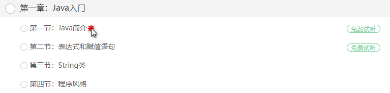
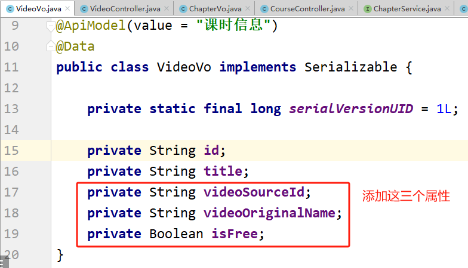
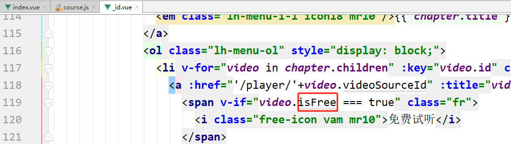
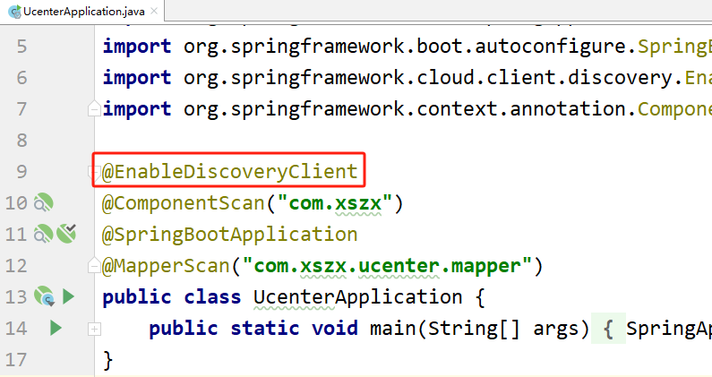

# 第十四天【首页课程和名师功能】

# 一、今日内容
+ 首页名师功能
    - 名师页面静态效果整合
    - 讲师列表页
    - 讲师详情页
+ 首页课程功能
    - 课程页面静态效果整合
    - 课程列表页面
    - 课程详情页
    - 视频播放测试
    - 整合阿里云视频播放器
+ 课程评论功能

# 二、名师页面静态效果整合
## <font style="color:rgb(0, 0, 0);">列表页面</font>
<font style="color:rgb(0, 0, 0);">创建 pages/teacher/index.vue</font>

```html
<template>
  <div id="aCoursesList" class="bg-fa of">
    <!-- 讲师列表 开始 -->
    <section class="container">
      <header class="comm-title all-teacher-title">
        <h2 class="fl tac">
          <span class="c-333">全部讲师</span>
        </h2>
        <section class="c-tab-title">
          <a id="subjectAll" title="全部" href="#">全部</a>
          <!-- <c:forEach var="subject" items="${subjectList }">
                            <a id="${subject.subjectId}" title="${subject.subjectName }" href="javascript:void(0)" onclick="submitForm(${subject.subjectId})">${subject.subjectName }</a>
          </c:forEach>-->
        </section>
      </header>
      <section class="c-sort-box unBr">
        <div>
          <!-- /无数据提示 开始-->
          <section class="no-data-wrap">
            <em class="icon30 no-data-ico">&nbsp;</em>
            <span class="c-666 fsize14 ml10 vam">没有相关数据，小编正在努力整理中...</span>
          </section>
          <!-- /无数据提示 结束-->
          <article class="i-teacher-list">
            <ul class="of">
              <li>
                <section class="i-teach-wrap">
                  <div class="i-teach-pic">
                    <a href="/teacher/1" title="姚晨" target="_blank">
                      
                    </a>
                  </div>
                  <div class="mt10 hLh30 txtOf tac">
                    <a href="/teacher/1" title="姚晨" target="_blank" class="fsize18 c-666">姚晨</a>
                  </div>
                  <div class="hLh30 txtOf tac">
                    <span class="fsize14 c-999">北京师范大学法学院副教授、清华大学法学博士。自2004年至今已有9年的司法考试培训经验。长期从事司法考试辅导，深知命题规律，了解解题技巧。内容把握准确，授课重点明确，层次分明，调理清晰，将法条法理与案例有机融合，强调综合，深入浅出。</span>
                  </div>
                  <div class="mt15 i-q-txt">
                    <p class="c-999 f-fA">北京师范大学法学院副教授</p>
                  </div>
                </section>
              </li>
              <li>
                <section class="i-teach-wrap">
                  <div class="i-teach-pic">
                    <a href="/teacher/1" title="谢娜" target="_blank">
                      
                    </a>
                  </div>
                  <div class="mt10 hLh30 txtOf tac">
                    <a href="/teacher/1" title="谢娜" target="_blank" class="fsize18 c-666">谢娜</a>
                  </div>
                  <div class="hLh30 txtOf tac">
                    <span class="fsize14 c-999">十年课程研发和培训咨询经验，曾任国企人力资源经理、大型外企培训经理，负责企业大学和培训体系搭建；曾任专业培训机构高级顾问、研发部总监，为包括广东移动、东莞移动、深圳移动、南方电网、工商银行、农业银行、民生银行、邮储银行、TCL集团、清华大学继续教育学院、中天路桥、广西扬翔股份等超过200家企业提供过培训与咨询服务，并担任近50个大型项目的总负责人。</span>
                  </div>
                  <div class="mt15 i-q-txt">
                    <p class="c-999 f-fA">资深课程设计专家，专注10年AACTP美国培训协会认证导师</p>
                  </div>
                </section>
              </li>
              <li>
                <section class="i-teach-wrap">
                  <div class="i-teach-pic">
                    <a href="/teacher/1" title="刘德华" target="_blank">
                      
                    </a>
                  </div>
                  <div class="mt10 hLh30 txtOf tac">
                    <a href="/teacher/1" title="刘德华" target="_blank" class="fsize18 c-666">刘德华</a>
                  </div>
                  <div class="hLh30 txtOf tac">
                    <span class="fsize14 c-999">上海师范大学法学院副教授、清华大学法学博士。自2004年至今已有9年的司法考试培训经验。长期从事司法考试辅导，深知命题规律，了解解题技巧。内容把握准确，授课重点明确，层次分明，调理清晰，将法条法理与案例有机融合，强调综合，深入浅出。</span>
                  </div>
                  <div class="mt15 i-q-txt">
                    <p class="c-999 f-fA">上海师范大学法学院副教授</p>
                  </div>
                </section>
              </li>
              <li>
                <section class="i-teach-wrap">
                  <div class="i-teach-pic">
                    <a href="/teacher/1" title="周润发" target="_blank">
                      
                    </a>
                  </div>
                  <div class="mt10 hLh30 txtOf tac">
                    <a href="/teacher/1" title="周润发" target="_blank" class="fsize18 c-666">周润发</a>
                  </div>
                  <div class="hLh30 txtOf tac">
                    <span class="fsize14 c-999">法学博士，北京师范大学马克思主义学院副教授，专攻毛泽东思想概论、邓小平理论，长期从事考研辅导。出版著作两部，发表学术论文30余篇，主持国家社会科学基金项目和教育部重大课题子课题各一项，参与中央实施马克思主义理论研究和建设工程项目。</span>
                  </div>
                  <div class="mt15 i-q-txt">
                    <p class="c-999 f-fA">考研政治辅导实战派专家，全国考研政治命题研究组核心成员。</p>
                  </div>
                </section>
              </li>
              <li>
                <section class="i-teach-wrap">
                  <div class="i-teach-pic">
                    <a href="/teacher/1" title="钟汉良" target="_blank">
                      
                    </a>
                  </div>
                  <div class="mt10 hLh30 txtOf tac">
                    <a href="/teacher/1" title="钟汉良" target="_blank" class="fsize18 c-666">钟汉良</a>
                  </div>
                  <div class="hLh30 txtOf tac">
                    <span class="fsize14 c-999">具备深厚的数学思维功底、丰富的小学教育经验，授课风格生动活泼，擅长用形象生动的比喻帮助理解、简单易懂的语言讲解难题，深受学生喜欢</span>
                  </div>
                  <div class="mt15 i-q-txt">
                    <p class="c-999 f-fA">毕业于师范大学数学系，热爱教育事业，执教数学思维6年有余</p>
                  </div>
                </section>
              </li>
              <li>
                <section class="i-teach-wrap">
                  <div class="i-teach-pic">
                    <a href="/teacher/1" title="唐嫣" target="_blank">
                      
                    </a>
                  </div>
                  <div class="mt10 hLh30 txtOf tac">
                    <a href="/teacher/1" title="唐嫣" target="_blank" class="fsize18 c-666">唐嫣</a>
                  </div>
                  <div class="hLh30 txtOf tac">
                    <span class="fsize14 c-999">中国科学院数学与系统科学研究院应用数学专业博士，研究方向为数字图像处理，中国工业与应用数学学会会员。参与全国教育科学“十五”规划重点课题“信息化进程中的教育技术发展研究”的子课题“基与课程改革的资源开发与应用”，以及全国“十五”科研规划全国重点项目“掌上型信息技术产品在教学中的运用和开发研究”的子课题“用技术学数学”。</span>
                  </div>
                  <div class="mt15 i-q-txt">
                    <p class="c-999 f-fA">中国人民大学附属中学数学一级教师</p>
                  </div>
                </section>
              </li>
              <li>
                <section class="i-teach-wrap">
                  <div class="i-teach-pic">
                    <a href="/teacher/1" title="周杰伦" target="_blank">
                      
                    </a>
                  </div>
                  <div class="mt10 hLh30 txtOf tac">
                    <a href="/teacher/1" title="周杰伦" target="_blank" class="fsize18 c-666">周杰伦</a>
                  </div>
                  <div class="hLh30 txtOf tac">
                    <span class="fsize14 c-999">中教一级职称。讲课极具亲和力。</span>
                  </div>
                  <div class="mt15 i-q-txt">
                    <p class="c-999 f-fA">毕业于北京大学数学系</p>
                  </div>
                </section>
              </li>
              <li>
                <section class="i-teach-wrap">
                  <div class="i-teach-pic">
                    <a href="/teacher/1" title="陈伟霆" target="_blank">
                      
                    </a>
                  </div>
                  <div class="mt10 hLh30 txtOf tac">
                    <a href="/teacher/1" title="陈伟霆" target="_blank" class="fsize18 c-666">陈伟霆</a>
                  </div>
                  <div class="hLh30 txtOf tac">
                    <span
                      class="fsize14 c-999"
                    >政治学博士、管理学博士后，北京师范大学马克思主义学院副教授。多年来总结出了一套行之有效的应试技巧与答题方法，针对性和实用性极强，能帮助考生在轻松中应考，在激励的竞争中取得高分，脱颖而出。</span>
                  </div>
                  <div class="mt15 i-q-txt">
                    <p class="c-999 f-fA">长期从事考研政治课讲授和考研命题趋势与应试对策研究。考研辅导新锐派的代表。</p>
                  </div>
                </section>
              </li>
            </ul>
            <div class="clear"></div>
          </article>
        </div>
        <!-- 公共分页 开始 -->
        <div>
          <div class="paging">
            <!-- undisable这个class是否存在，取决于数据属性hasPrevious -->
            <a href="#" title="首页">首</a>
            <a href="#" title="前一页">&lt;</a>
            <a href="#" title="第1页" class="current undisable">1</a>
            <a href="#" title="第2页">2</a>
            <a href="#" title="后一页">&gt;</a>
            <a href="#" title="末页">末</a>
            <div class="clear"></div>
          </div>
        </div>
        <!-- 公共分页 结束 -->
      </section>
    </section>
    <!-- /讲师列表 结束 -->
  </div>
</template>
<script>
export default {};
</script>
```

## <font style="color:rgb(0, 0, 0);">详情页面</font>
<font style="color:rgb(0, 0, 0);">创建 pages/teacher/_id.vue</font>

<font style="color:rgb(51, 51, 51);">修改资源路径为~/assets/</font>

```html
<template>
  <div id="aCoursesList" class="bg-fa of">
    <!-- 讲师介绍 开始 -->
    <section class="container">
      <header class="comm-title">
        <h2 class="fl tac">
          <span class="c-333">讲师介绍</span>
        </h2>
      </header>
      <div class="t-infor-wrap">
        <!-- 讲师基本信息 -->
        <section class="fl t-infor-box c-desc-content">
          <div class="mt20 ml20">
            <section class="t-infor-pic">
              
            </section>
            <h3 class="hLh30">
              <span class="fsize24 c-333">姚晨&nbsp;高级讲师</span>
            </h3>
            <section class="mt10">
              <span class="t-tag-bg">北京师范大学法学院副教授</span>
            </section>
            <section class="t-infor-txt">
              <p
                class="mt20"
              >北京师范大学法学院副教授、清华大学法学博士。自2004年至今已有9年的司法考试培训经验。长期从事司法考试辅导，深知命题规律，了解解题技巧。内容把握准确，授课重点明确，层次分明，调理清晰，将法条法理与案例有机融合，强调综合，深入浅出。</p>
            </section>
            <div class="clear"></div>
          </div>
        </section>
        <div class="clear"></div>
      </div>
      <section class="mt30">
        <div>
          <header class="comm-title all-teacher-title c-course-content">
            <h2 class="fl tac">
              <span class="c-333">主讲课程</span>
            </h2>
            <section class="c-tab-title">
              <a href="javascript: void(0)">&nbsp;</a>
            </section>
          </header>
          <!-- /无数据提示 开始-->
          <section class="no-data-wrap">
            <em class="icon30 no-data-ico">&nbsp;</em>
            <span class="c-666 fsize14 ml10 vam">没有相关数据，小编正在努力整理中...</span>
          </section>
          <!-- /无数据提示 结束-->
          <article class="comm-course-list">
            <ul class="of">
              <li>
                <div class="cc-l-wrap">
                  <section class="course-img">
                    
                    <div class="cc-mask">
                      <a href="#" title="开始学习" target="_blank" class="comm-btn c-btn-1">开始学习</a>
                    </div>
                  </section>
                  <h3 class="hLh30 txtOf mt10">
                    <a href="#" title="零基础入门学习Python课程学习" target="_blank" class="course-title fsize18 c-333">零基础入门学习Python课程学习</a>
                  </h3>
                </div>
              </li>
              <li>
                <div class="cc-l-wrap">
                  <section class="course-img">
                    
                    <div class="cc-mask">
                      <a href="#" title="开始学习" target="_blank" class="comm-btn c-btn-1">开始学习</a>
                    </div>
                  </section>
                  <h3 class="hLh30 txtOf mt10">
                    <a href="#" title="影想力摄影小课堂" target="_blank" class="course-title fsize18 c-333">影想力摄影小课堂</a>
                  </h3>
                </div>
              </li>
              <li>
                <div class="cc-l-wrap">
                  <section class="course-img">
                    
                    <div class="cc-mask">
                      <a href="#" title="开始学习" target="_blank" class="comm-btn c-btn-1">开始学习</a>
                    </div>
                  </section>
                  <h3 class="hLh30 txtOf mt10">
                    <a href="#" title="数学给宝宝带来的兴趣" target="_blank" class="course-title fsize18 c-333">数学给宝宝带来的兴趣</a>
                  </h3>
                </div>
              </li>
              <li>
                <div class="cc-l-wrap">
                  <section class="course-img">
                    
                    <div class="cc-mask">
                      <a href="#" title="开始学习" target="_blank" class="comm-btn c-btn-1">开始学习</a>
                    </div>
                  </section>
                  <h3 class="hLh30 txtOf mt10">
                    <a href="#" title="国家教师资格考试专用" target="_blank" class="course-title fsize18 c-333">国家教师资格考试专用</a>
                  </h3>
                </div>
              </li>
            </ul>
            <div class="clear"></div>
          </article>
        </div>
      </section>
    </section>
    <!-- /讲师介绍 结束 -->
  </div>
</template>
<script>
export default {};
</script>
```

# 三、讲师列表页
## <font style="color:rgb(51, 51, 51);">后端</font>
### <font style="color:rgb(51, 51, 51);">TeacherService</font>
<font style="color:rgb(0, 0, 0);">接口</font>

```java
public Map<String, Object> pageListWeb(Page<Teacher> pageParam);
```

<font style="color:rgb(51, 51, 51);">实现</font>

```java
@Override
public Map<String, Object> pageListWeb(Page<Teacher> pageParam) {

    QueryWrapper<Teacher> queryWrapper = new QueryWrapper<>();
    queryWrapper.orderByAsc("sort");

    baseMapper.selectPage(pageParam, queryWrapper);

    List<Teacher> records = pageParam.getRecords();
    long current = pageParam.getCurrent();
    long pages = pageParam.getPages();
    long size = pageParam.getSize();
    long total = pageParam.getTotal();
    boolean hasNext = pageParam.hasNext();
    boolean hasPrevious = pageParam.hasPrevious();

    Map<String, Object> map = new HashMap<String, Object>();
    map.put("items", records);
    map.put("current", current);
    map.put("pages", pages);
    map.put("size", size);
    map.put("total", total);
    map.put("hasNext", hasNext);
    map.put("hasPrevious", hasPrevious);

    return map;
}
```

### <font style="color:rgb(51, 51, 51);">TeacherController</font>
```java
@ApiOperation(value = "分页讲师列表")
@GetMapping(value = "{page}/{limit}")
public R pageList(
    @ApiParam(name = "page", value = "当前页码", required = true)
    @PathVariable Long page,

    @ApiParam(name = "limit", value = "每页记录数", required = true)
    @PathVariable Long limit){

    Page<Teacher> pageParam = new Page<Teacher>(page, limit);

    Map<String, Object> map = teacherService.pageListWeb(pageParam);

    return  R.ok().data(map);
}
```

### <font style="color:rgb(51, 51, 51);">swagger测试</font>
## <font style="color:rgb(51, 51, 51);">前端列表 js</font>
### <font style="color:rgb(51, 51, 51);">创建 api</font>
<font style="color:rgb(51, 51, 51);">创建文件夹 api，api下创建 teacher.js，用于封装讲师模块的请求</font>

```javascript
import request from '@/utils/request'

const api_name = '/edu/teacher'
export default {
  getPageList(page, limit) {   
    return request({
      url: `${api_name}/${page}/${limit}`,
      method: 'get'
    })
  }
}
```

### <font style="color:rgb(0, 0, 0);">讲师列表组件中调用 api</font>
<font style="color:rgb(0, 0, 0);">pages/teacher/index.vue</font>

```html
<script>
import teacher from "@/api/teacher"

export default {
  asyncData({ params, error }) {
    return teacher.getPageList(1, 8).then(response => {
      console.log(response.data.data);
      return { data: response.data.data }
    });
  },
};
</script>
```

## <font style="color:rgb(0, 0, 0);">页面渲染</font>
### <font style="color:rgb(0, 0, 0);">页面模板</font>
```html
<template>
  <div id="aCoursesList" class="bg-fa of">
    <!-- 讲师列表 开始 -->
    <section class="container">
      <section class="c-sort-box unBr">
        <div>
          <!-- 无数据提示 开始-->

          <!-- /无数据提示 结束-->

          <!-- 数据列表 开始-->

          <!-- /数据列表 结束-->
        </div>
        <!-- 公共分页 开始 -->

        <!-- /公共分页 结束 -->
      </section>
    </section>
    <!-- /讲师列表 结束 -->
  </div>
</template>
```

### <font style="color:rgb(0, 0, 0);">无数据提示</font>
<font style="color:rgb(0, 0, 0);">添加：v-if="data.total==0"</font>

```html
<!-- /无数据提示 开始-->
<section class="no-data-wrap" v-if="data.total==0">
    <em class="icon30 no-data-ico">&nbsp;</em>
    <span class="c-666 fsize14 ml10 vam">没有相关数据，小编正在努力整理中...</span>
</section>
<!-- /无数据提示 结束-->
```

### <font style="color:rgb(0, 0, 0);">列表</font>
```html
<!-- /数据列表 开始-->
<article v-if="data.total>0" class="i-teacher-list">
    <ul class="of">
        <li v-for="item in data.items" :key="item.id">
            <section class="i-teach-wrap">
                <div class="i-teach-pic">
                    <a :href="'/teacher/'+item.id" :title="item.name">
                        
                    </a>
                </div>
                <div class="mt10 hLh30 txtOf tac">
                    <a :href="'/teacher/'+item.id" :title="item.name" class="fsize18 c-666">{{ item.name }}</a>
                </div>
                <div class="hLh30 txtOf tac">
                    <span class="fsize14 c-999" >{{ item.career }}</span>
                </div>
                <div class="mt15 i-q-txt">
                    <p class="c-999 f-fA">{{ item.intro }}</p>
                </div>
            </section>
        </li>
    </ul>
    <div class="clear"/>
</article>
<!-- /数据列表 结束-->
```

### <font style="color:rgb(0, 0, 0);">测试</font>
## <font style="color:rgb(51, 51, 51);">分页</font>
### <font style="color:rgb(0, 0, 0);">分页方法</font>
```haskell
methods: {
    gotoPage(page){
        teacher.getPageList(page, 8).then(response => {
            this.data = response.data.data
        })
    }
}
```

### <font style="color:rgb(0, 0, 0);">分页页面渲染</font>
```html
<!-- 公共分页 开始 -->
<div>
  <div class="paging">
    <!-- undisable这个class是否存在，取决于数据属性hasPrevious -->
    <a
      :class="{undisable: !data.hasPrevious}"
      href="#"
      title="首页"
      @click.prevent="gotoPage(1)">首</a>
    <a
      :class="{undisable: !data.hasPrevious}"
      href="#"
      title="前一页"
      @click.prevent="gotoPage(data.current-1)">&lt;</a>
    <a
      v-for="page in data.pages"
      :key="page"
      :class="{current: data.current == page, undisable: data.current == page}"
      :title="'第'+page+'页'"
      href="#"
      @click.prevent="gotoPage(page)">{{ page }}</a>
    <a
      :class="{undisable: !data.hasNext}"
      href="#"
      title="后一页"
      @click.prevent="gotoPage(data.current+1)">&gt;</a>
    <a
      :class="{undisable: !data.hasNext}"
      href="#"
      title="末页"
      @click.prevent="gotoPage(data.pages)">末</a>
    <div class="clear"/>
  </div>
</div>
<!-- 公共分页 结束 -->
```

### <font style="color:rgb(0, 0, 0);">测试</font>
# 四、讲师详情页
## <font style="color:rgb(0, 0, 0);">后端</font>
### <font style="color:rgb(0, 0, 0);">CourseService</font>
<font style="color:rgb(0, 0, 0);">根据讲师 id 查询讲师所讲课程列表</font>

<font style="color:rgb(0, 0, 0);">接口</font>

```java
List<Course> selectByTeacherId(String teacherId);
```

<font style="color:rgb(0, 0, 0);">实现</font>

```java
/**
 * 根据讲师id查询当前讲师的课程列表
 * @param teacherId
 * @return
 */
@Override
public List<Course> selectByTeacherId(String teacherId) {

    QueryWrapper<Course> queryWrapper = new QueryWrapper<Course>();

    queryWrapper.eq("teacher_id", teacherId);
    //按照最后更新时间倒序排列
    queryWrapper.orderByDesc("gmt_modified");

    List<Course> courses = baseMapper.selectList(queryWrapper);
    return courses;
}
```

### <font style="color:rgb(0, 0, 0);">TeacherController</font>
```java
@Autowired
private CourseService courseService;
```

<font style="color:rgb(0, 0, 0);">修改 getById 方法：</font>

```java
@ApiOperation(value = "根据ID查询讲师")
@GetMapping(value = "{id}")
public R getById(
        @ApiParam(name = "id", value = "讲师ID", required = true)
        @PathVariable String id){

    //查询讲师信息
    Teacher teacher = teacherService.getById(id);

    //根据讲师id查询这个讲师的课程列表
    List<Course> courseList = courseService.selectByTeacherId(id);

    return R.ok().data("teacher", teacher).data("courseList", courseList);
}
```

### <font style="color:rgb(0, 0, 0);">swagger 测试</font>
## <font style="color:rgb(0, 0, 0);">前端详情 js</font>
### <font style="color:rgb(0, 0, 0);">teacher api</font>
<font style="color:rgb(0, 0, 0);">api/teacher.js</font>

```javascript
getById(teacherId) {
    return request({
        url: `${api_name}/${teacherId}`,
        method: 'get'
    })
}
```

### <font style="color:rgb(0, 0, 0);">讲师详情页中调用 api</font>
<font style="color:rgb(0, 0, 0);">pages/teacher/_id.vue</font>

```html
<script>
import teacher from "@/api/teacher"

export default {
  asyncData({ params, error }) {
    return teacher.getById(params.id).then(response => {
      console.log(response);
      return { 
        teacher: response.data.data.teacher,
        courseList: response.data.data.courseList
      }
    })
  }
}
</script>
```

## <font style="color:rgb(0, 0, 0);">页面渲染</font>
### <font style="color:rgb(0, 0, 0);">讲师基本信息模板</font>
```html
<template>
  <div id="aCoursesList" class="bg-fa of">
    <!-- 讲师介绍 开始 -->
    <section class="container">
      <header class="comm-title">
        <h2 class="fl tac">
          <span class="c-333">讲师介绍</span>
        </h2>
      </header>
      <div class="t-infor-wrap">
        <!-- 讲师基本信息 开始 -->
        <!-- /讲师基本信息 结束 -->
        <div class="clear"/>
      </div>
      <section class="mt30">
        <div>
          <header class="comm-title all-teacher-title c-course-content">
            <h2 class="fl tac">
              <span class="c-333">主讲课程</span>
            </h2>
            <section class="c-tab-title">
              <a href="javascript: void(0)">&nbsp;</a>
            </section>
          </header>
          <!-- 无数据提示 开始-->
          <!-- /无数据提示 结束-->
          <!-- 课程列表 开始-->
          <!-- /课程列表 结束-->
        </div>
      </section>
    </section>
    <!-- /讲师介绍 结束 -->
  </div>
</template>
```

### <font style="color:rgb(0, 0, 0);">讲师详情显示</font>
```html
<!-- 讲师基本信息 开始 -->
<section class="fl t-infor-box c-desc-content">
    <div class="mt20 ml20">
        <section class="t-infor-pic">
            
        </section>
        <h3 class="hLh30">
            <span class="fsize24 c-333">{{ teacher.name }}
                &nbsp;
                {{ teacher.level===1?'高级讲师':'首席讲师' }}
            </span>
        </h3>
        <section class="mt10">
            <span class="t-tag-bg">{{ teacher.intro }}</span>
        </section>
        <section class="t-infor-txt">
            <p class="mt20">{{ teacher.career }}</p>
        </section>
        <div class="clear"/>
    </div>
</section>
<!-- /讲师基本信息 结束 -->
```

### <font style="color:rgb(0, 0, 0);">无数据提示</font>
```html
<!-- 无数据提示 开始-->
<section class="no-data-wrap" v-if="courseList.total==0">
    <em class="icon30 no-data-ico">&nbsp;</em>
    <span class="c-666 fsize14 ml10 vam">没有相关数据，小编正在努力整理中...</span>
</section>
<!-- /无数据提示 结束-->
```

### <font style="color:rgb(0, 0, 0);">当前讲师课程列表</font>
```html
<!-- 课程列表 开始-->
<article class="comm-course-list">
  <ul class="of">
    <li v-for="course in courseList" :key="course.id">
      <div class="cc-l-wrap">
        <section class="course-img">
          
          <div class="cc-mask">
            <a :href="'/course/'+course.id" title="开始学习" target="_blank" class="comm-btn c-btn-1">开始学习</a>
          </div>
        </section>
        <h3 class="hLh30 txtOf mt10">
          <a
            :href="'/course/'+course.id"
            :title="course.title"
            target="_blank"
            class="course-title fsize18 c-333">{{ course.title }}</a>
        </h3>
      </div>
    </li>
  </ul>
  <div class="clear"/>
</article>
<!-- /课程列表 结束-->
```

### <font style="color:rgb(0, 0, 0);">测试</font>
# 五、课程页面静态效果整合
## <font style="color:rgb(0, 0, 0);">列表页面</font>
<font style="color:rgb(0, 0, 0);">创建 pages/course/index.vue</font>

```html

<template>
  <div id="aCoursesList" class="bg-fa of">
    <!-- /课程列表 开始 -->
    <section class="container">
      <header class="comm-title">
        <h2 class="fl tac">
          <span class="c-333">全部课程</span>
        </h2>
      </header>
      <section class="c-sort-box">
        <section class="c-s-dl">
          <dl>
            <dt>
              <span class="c-999 fsize14">课程类别</span>
            </dt>
            <dd class="c-s-dl-li">
              <ul class="clearfix">
                <li>
                  <a title="全部" href="#">全部</a>
                </li>
                <li>
                  <a title="数据库" href="#">数据库</a>
                </li>
                <li class="current">
                  <a title="外语考试" href="#">外语考试</a>
                </li>
                <li>
                  <a title="教师资格证" href="#">教师资格证</a>
                </li>
                <li>
                  <a title="公务员" href="#">公务员</a>
                </li>
                <li>
                  <a title="移动开发" href="#">移动开发</a>
                </li>
                <li>
                  <a title="操作系统" href="#">操作系统</a>
                </li>
              </ul>
            </dd>
          </dl>
          <dl>
            <dt>
              <span class="c-999 fsize14"></span>
            </dt>
            <dd class="c-s-dl-li">
              <ul class="clearfix">
                <li>
                  <a title="职称英语" href="#">职称英语</a>
                </li>
                <li>
                  <a title="英语四级" href="#">英语四级</a>
                </li>
                <li>
                  <a title="英语六级" href="#">英语六级</a>
                </li>
              </ul>
            </dd>
          </dl>
          <div class="clear"></div>
        </section>
        <div class="js-wrap">
          <section class="fr">
            <span class="c-ccc">
              <i class="c-master f-fM">1</i>/
              <i class="c-666 f-fM">1</i>
            </span>
          </section>
          <section class="fl">
            <ol class="js-tap clearfix">
              <li>
                <a title="关注度" href="#">关注度</a>
              </li>
              <li>
                <a title="最新" href="#">最新</a>
              </li>
              <li class="current bg-orange">
                <a title="价格" href="#">价格&nbsp;
                  <span>↓</span>
                </a>
              </li>
            </ol>
          </section>
        </div>
        <div class="mt40">
          <!-- /无数据提示 开始-->
          <section class="no-data-wrap">
            <em class="icon30 no-data-ico">&nbsp;</em>
            <span class="c-666 fsize14 ml10 vam">没有相关数据，小编正在努力整理中...</span>
          </section>
          <!-- /无数据提示 结束-->
          <article class="comm-course-list">
            <ul class="of" id="bna">
              <li>
                <div class="cc-l-wrap">
                  <section class="course-img">
                    
                    <div class="cc-mask">
                      <a href="/course/1" title="开始学习" class="comm-btn c-btn-1">开始学习</a>
                    </div>
                  </section>
                  <h3 class="hLh30 txtOf mt10">
                    <a href="/course/1" title="听力口语" class="course-title fsize18 c-333">听力口语</a>
                  </h3>
                  <section class="mt10 hLh20 of">
                    <span class="fr jgTag bg-green">
                      <i class="c-fff fsize12 f-fA">免费</i>
                    </span>
                    <span class="fl jgAttr c-ccc f-fA">
                      <i class="c-999 f-fA">9634人学习</i>
                      |
                      <i class="c-999 f-fA">9634评论</i>
                    </span>
                  </section>
                </div>
              </li>
              <li>
                <div class="cc-l-wrap">
                  <section class="course-img">
                    
                    <div class="cc-mask">
                      <a href="/course/1" title="开始学习" class="comm-btn c-btn-1">开始学习</a>
                    </div>
                  </section>
                  <h3 class="hLh30 txtOf mt10">
                    <a href="/course/1" title="Java精品课程" class="course-title fsize18 c-333">Java精品课程</a>
                  </h3>
                  <section class="mt10 hLh20 of">
                    <span class="fr jgTag bg-green">
                      <i class="c-fff fsize12 f-fA">免费</i>
                    </span>
                    <span class="fl jgAttr c-ccc f-fA">
                      <i class="c-999 f-fA">501人学习</i>
                      |
                      <i class="c-999 f-fA">501评论</i>
                    </span>
                  </section>
                </div>
              </li>
              <li>
                <div class="cc-l-wrap">
                  <section class="course-img">
                    
                    <div class="cc-mask">
                      <a href="/course/1" title="开始学习" class="comm-btn c-btn-1">开始学习</a>
                    </div>
                  </section>
                  <h3 class="hLh30 txtOf mt10">
                    <a href="/course/1" title="C4D零基础" class="course-title fsize18 c-333">C4D零基础</a>
                  </h3>
                  <section class="mt10 hLh20 of">
                    <span class="fr jgTag bg-green">
                      <i class="c-fff fsize12 f-fA">免费</i>
                    </span>
                    <span class="fl jgAttr c-ccc f-fA">
                      <i class="c-999 f-fA">300人学习</i>
                      |
                      <i class="c-999 f-fA">300评论</i>
                    </span>
                  </section>
                </div>
              </li>
              <li>
                <div class="cc-l-wrap">
                  <section class="course-img">
                    
                    <div class="cc-mask">
                      <a href="/course/1" title="开始学习" class="comm-btn c-btn-1">开始学习</a>
                    </div>
                  </section>
                  <h3 class="hLh30 txtOf mt10">
                    <a href="/course/1" title="数学给宝宝带来的兴趣" class="course-title fsize18 c-333">数学给宝宝带来的兴趣</a>
                  </h3>
                  <section class="mt10 hLh20 of">
                    <span class="fr jgTag bg-green">
                      <i class="c-fff fsize12 f-fA">免费</i>
                    </span>
                    <span class="fl jgAttr c-ccc f-fA">
                      <i class="c-999 f-fA">256人学习</i>
                      |
                      <i class="c-999 f-fA">256评论</i>
                    </span>
                  </section>
                </div>
              </li>
              <li>
                <div class="cc-l-wrap">
                  <section class="course-img">
                    
                    <div class="cc-mask">
                      <a href="/course/1" title="开始学习" class="comm-btn c-btn-1">开始学习</a>
                    </div>
                  </section>
                  <h3 class="hLh30 txtOf mt10">
                    <a
                      href="/course/1"
                      title="零基础入门学习Python课程学习"
                      class="course-title fsize18 c-333"
                    >零基础入门学习Python课程学习</a>
                  </h3>
                  <section class="mt10 hLh20 of">
                    <span class="fr jgTag bg-green">
                      <i class="c-fff fsize12 f-fA">免费</i>
                    </span>
                    <span class="fl jgAttr c-ccc f-fA">
                      <i class="c-999 f-fA">137人学习</i>
                      |
                      <i class="c-999 f-fA">137评论</i>
                    </span>
                  </section>
                </div>
              </li>
              <li>
                <div class="cc-l-wrap">
                  <section class="course-img">
                    
                    <div class="cc-mask">
                      <a href="/course/1" title="开始学习" class="comm-btn c-btn-1">开始学习</a>
                    </div>
                  </section>
                  <h3 class="hLh30 txtOf mt10">
                    <a href="/course/1" title="MySql从入门到精通" class="course-title fsize18 c-333">MySql从入门到精通</a>
                  </h3>
                  <section class="mt10 hLh20 of">
                    <span class="fr jgTag bg-green">
                      <i class="c-fff fsize12 f-fA">免费</i>
                    </span>
                    <span class="fl jgAttr c-ccc f-fA">
                      <i class="c-999 f-fA">125人学习</i>
                      |
                      <i class="c-999 f-fA">125评论</i>
                    </span>
                  </section>
                </div>
              </li>
              <li>
                <div class="cc-l-wrap">
                  <section class="course-img">
                    
                    <div class="cc-mask">
                      <a href="/course/1" title="开始学习" class="comm-btn c-btn-1">开始学习</a>
                    </div>
                  </section>
                  <h3 class="hLh30 txtOf mt10">
                    <a href="/course/1" title="搜索引擎优化技术" class="course-title fsize18 c-333">搜索引擎优化技术</a>
                  </h3>
                  <section class="mt10 hLh20 of">
                    <span class="fr jgTag bg-green">
                      <i class="c-fff fsize12 f-fA">免费</i>
                    </span>
                    <span class="fl jgAttr c-ccc f-fA">
                      <i class="c-999 f-fA">123人学习</i>
                      |
                      <i class="c-999 f-fA">123评论</i>
                    </span>
                  </section>
                </div>
              </li>
              <li>
                <div class="cc-l-wrap">
                  <section class="course-img">
                    
                    <div class="cc-mask">
                      <a href="/course/1" title="开始学习" class="comm-btn c-btn-1">开始学习</a>
                    </div>
                  </section>
                  <h3 class="hLh30 txtOf mt10">
                    <a href="/course/1" title="20世纪西方音乐" class="course-title fsize18 c-333">20世纪西方音乐</a>
                  </h3>
                  <section class="mt10 hLh20 of">
                    <span class="fr jgTag bg-green">
                      <i class="c-fff fsize12 f-fA">免费</i>
                    </span>
                    <span class="fl jgAttr c-ccc f-fA">
                      <i class="c-999 f-fA">34人学习</i>
                      |
                      <i class="c-999 f-fA">34评论</i>
                    </span>
                  </section>
                </div>
              </li>
            </ul>
            <div class="clear"></div>
          </article>
        </div>
        <!-- 公共分页 开始 -->
        <div>
          <div class="paging">
            <a class="undisable" title>首</a>
            <a id="backpage" class="undisable" href="#" title>&lt;</a>
            <a href="#" title class="current undisable">1</a>
            <a href="#" title>2</a>
            <a id="nextpage" href="#" title>&gt;</a>
            <a href="#" title>末</a>
            <div class="clear"></div>
          </div>
        </div>
        <!-- 公共分页 结束 -->
      </section>
    </section>
    <!-- /课程列表 结束 -->
  </div>
</template>
<script>
export default {};
</script>
```

## <font style="color:rgb(0, 0, 0);">详情页面</font>
<font style="color:rgb(0, 0, 0);">创建 pages/course/_id.vue</font>

```html
<template>
  <div id="aCoursesList" class="bg-fa of">
    <!-- /课程详情 开始 -->
    <section class="container">
      <section class="path-wrap txtOf hLh30">
        <a href="#" title class="c-999 fsize14">首页</a>
        \
        <a href="#" title class="c-999 fsize14">课程列表</a>
        \
        <span class="c-333 fsize14">Java精品课程</span>
      </section>
      <div>
        <article class="c-v-pic-wrap" style="height: 357px;">
          <section class="p-h-video-box" id="videoPlay">
            
          </section>
        </article>
        <aside class="c-attr-wrap">
          <section class="ml20 mr15">
            <h2 class="hLh30 txtOf mt15">
              <span class="c-fff fsize24">Java精品课程</span>
            </h2>
            <section class="c-attr-jg">
              <span class="c-fff">价格：</span>
              <b class="c-yellow" style="font-size:24px;">￥0.00</b>
            </section>
            <section class="c-attr-mt c-attr-undis">
              <span class="c-fff fsize14">主讲： 唐嫣&nbsp;&nbsp;&nbsp;</span>
            </section>
            <section class="c-attr-mt of">
              <span class="ml10 vam">
                <em class="icon18 scIcon"></em>
                <a class="c-fff vam" title="收藏" href="#" >收藏</a>
              </span>
            </section>
            <section class="c-attr-mt">
              <a href="#" title="立即观看" class="comm-btn c-btn-3">立即观看</a>
            </section>
          </section>
        </aside>
        <aside class="thr-attr-box">
          <ol class="thr-attr-ol clearfix">
            <li>
              <p>&nbsp;</p>
              <aside>
                <span class="c-fff f-fM">购买数</span>
                <br>
                <h6 class="c-fff f-fM mt10">150</h6>
              </aside>
            </li>
            <li>
              <p>&nbsp;</p>
              <aside>
                <span class="c-fff f-fM">课时数</span>
                <br>
                <h6 class="c-fff f-fM mt10">20</h6>
              </aside>
            </li>
            <li>
              <p>&nbsp;</p>
              <aside>
                <span class="c-fff f-fM">浏览数</span>
                <br>
                <h6 class="c-fff f-fM mt10">501</h6>
              </aside>
            </li>
          </ol>
        </aside>
        <div class="clear"></div>
      </div>
      <!-- /课程封面介绍 -->
      <div class="mt20 c-infor-box">
        <article class="fl col-7">
          <section class="mr30">
            <div class="i-box">
              <div>
                <section id="c-i-tabTitle" class="c-infor-tabTitle c-tab-title">
                  <a name="c-i" class="current" title="课程详情">课程详情</a>
                </section>
              </div>
              <article class="ml10 mr10 pt20">
                <div>
                  <h6 class="c-i-content c-infor-title">
                    <span>课程介绍</span>
                  </h6>
                  <div class="course-txt-body-wrap">
                    <section class="course-txt-body">
                      <p>
                        Java的发展历史，可追溯到1990年。当时Sun&nbsp;Microsystem公司为了发展消费性电子产品而进行了一个名为Green的项目计划。该计划
                        负责人是James&nbsp;Gosling。起初他以C++来写一种内嵌式软件，可以放在烤面包机或PAD等小型电子消费设备里，使得机器更聪明，具有人工智
                        能。但他发现C++并不适合完成这类任务！因为C++常会有使系统失效的程序错误，尤其是内存管理，需要程序设计师记录并管理内存资源。这给设计师们造成
                        极大的负担，并可能产生许多bugs。&nbsp;
                        <br>为了解决所遇到的问题，Gosling决定要发展一种新的语言，来解决C++的潜在性危险问题，这个语言名叫Oak。Oak是一种可移植性语言，也就是一种平台独立语言，能够在各种芯片上运行。
                        <br>1994年，Oak技术日趋成熟，这时网络正开始蓬勃发展。Oak研发小组发现Oak很适合作为一种网络程序语言。因此发展了一个能与Oak配合的浏
                        览器--WebRunner，后更名为HotJava，它证明了Oak是一种能在网络上发展的程序语言。由于Oak商标已被注册，工程师们便想到以自己常
                        享用的咖啡(Java)来重新命名，并于Sun&nbsp;World&nbsp;95中被发表出来。
                      </p>
                    </section>
                  </div>
                </div>
                <!-- /课程介绍 -->
                <div class="mt50">
                  <h6 class="c-g-content c-infor-title">
                    <span>课程大纲</span>
                  </h6>
                  <section class="mt20">
                    <div class="lh-menu-wrap">
                      <menu id="lh-menu" class="lh-menu mt10 mr10">
                        <ul>
                          <!-- 文件目录 -->
                          <li class="lh-menu-stair">
                            <a href="javascript: void(0)" title="第一章" class="current-1">
                              <em class="lh-menu-i-1 icon18 mr10"></em>第一章
                            </a>
                            <ol class="lh-menu-ol" style="display: block;">
                              <li class="lh-menu-second ml30">
                                <a href="#" title>
                                  <span class="fr">
                                    <i class="free-icon vam mr10">免费试听</i>
                                  </span>
                                  <em class="lh-menu-i-2 icon16 mr5">&nbsp;</em>第一节
                                </a>
                              </li>
                              <li class="lh-menu-second ml30">
                                <a href="#" title class="current-2">
                                  <em class="lh-menu-i-2 icon16 mr5">&nbsp;</em>第二节
                                </a>
                              </li>
                            </ol>
                          </li>
                        </ul>
                      </menu>
                    </div>
                  </section>
                </div>
                <!-- /课程大纲 -->
              </article>
            </div>
          </section>
        </article>
        <aside class="fl col-3">
          <div class="i-box">
            <div>
              <section class="c-infor-tabTitle c-tab-title">
                <a title href="javascript:void(0)">主讲讲师</a>
              </section>
              <section class="stud-act-list">
                <ul style="height: auto;">
                  <li>
                    <div class="u-face">
                      <a href="#">
                        
                      </a>
                    </div>
                    <section class="hLh30 txtOf">
                      <a class="c-333 fsize16 fl" href="#">周杰伦</a>
                    </section>
                    <section class="hLh20 txtOf">
                      <span class="c-999">毕业于北京大学数学系</span>
                    </section>
                  </li>
                </ul>
              </section>
            </div>
          </div>
        </aside>
        <div class="clear"></div>
      </div>
    </section>
    <!-- /课程详情 结束 -->
  </div>
</template>
<script>
export default {};
</script>
```

# 六、课程列表页面
## <font style="color:rgb(0, 0, 0);">课程后端接口</font>
### <font style="color:rgb(0, 0, 0);">课程列表</font>
<font style="color:rgb(0, 0, 0);">（1）课程列表 vo 类</font>

```java
@ApiModel(value = "课程查询对象", description = "课程查询对象封装")
@Data
public class CourseQueryVo implements Serializable {

    private static final long serialVersionUID = 1L;

    @ApiModelProperty(value = "课程名称")
    private String title;

    @ApiModelProperty(value = "讲师id")
    private String teacherId;

    @ApiModelProperty(value = "一级类别id")
    private String subjectParentId;

    @ApiModelProperty(value = "二级类别id")
    private String subjectId;

    @ApiModelProperty(value = "销量排序")
    private String buyCountSort;

    @ApiModelProperty(value = "最新时间排序")
    private String gmtCreateSort;

    @ApiModelProperty(value = "价格排序")
    private String priceSort;
}
```

<font style="color:rgb(0, 0, 0);">（2）课程列表 controller</font>

```java
@ApiOperation(value = "分页课程列表")
@PostMapping(value = "{page}/{limit}")
public R pageList(
        @ApiParam(name = "page", value = "当前页码", required = true)
        @PathVariable Long page,

        @ApiParam(name = "limit", value = "每页记录数", required = true)
        @PathVariable Long limit,

        @ApiParam(name = "courseQuery", value = "查询对象", required = false)
                @RequestBody(required = false) CourseQueryVo courseQuery){
    Page<EduCourse> pageParam = new Page<EduCourse>(page, limit);
    Map<String, Object> map = courseService.pageListWeb(pageParam, courseQuery);
    return  R.ok().data(map);
}
```

<font style="color:rgb(0, 0, 0);">（3）课程列表 service</font>

```java
@Override
public Map<String, Object> pageListWeb(Page<EduCourse> pageParam, CourseQueryVo courseQuery) {

        QueryWrapper<EduCourse> queryWrapper = new QueryWrapper<>();
        if (!StringUtils.isEmpty(courseQuery.getSubjectParentId())) {
            queryWrapper.eq("subject_parent_id", courseQuery.getSubjectParentId());
        }

        if (!StringUtils.isEmpty(courseQuery.getSubjectId())) {
            queryWrapper.eq("subject_id", courseQuery.getSubjectId());
        }

        if (!StringUtils.isEmpty(courseQuery.getBuyCountSort())) {
            queryWrapper.orderByDesc("buy_count");
        }

        if (!StringUtils.isEmpty(courseQuery.getGmtCreateSort())) {
            queryWrapper.orderByDesc("gmt_create");
        }

        if (!StringUtils.isEmpty(courseQuery.getPriceSort())) {
            queryWrapper.orderByDesc("price");
        }

        baseMapper.selectPage(pageParam, queryWrapper);

        List<EduCourse> records = pageParam.getRecords();
        long current = pageParam.getCurrent();
        long pages = pageParam.getPages();
        long size = pageParam.getSize();
        long total = pageParam.getTotal();
        boolean hasNext = pageParam.hasNext();
        boolean hasPrevious = pageParam.hasPrevious();

        Map<String, Object> map = new HashMap<String, Object>();
        map.put("items", records);
        map.put("current", current);
        map.put("pages", pages);
        map.put("size", size);
        map.put("total", total);
        map.put("hasNext", hasNext);
        map.put("hasPrevious", hasPrevious);

        return map;
}
```

## <font style="color:rgb(0, 0, 0);">课程列表前端</font>
### <font style="color:rgb(0, 0, 0);">定义 api</font>
<font style="color:rgb(0, 0, 0);">api/course.js</font>

```javascript
import request from '@/utils/request'

export default {
  getPageList(page, limit, searchObj) {
    return request({
      url: `/eduservice/edu/course/${page}/${limit}`,
      method: 'post',
      data: searchObj
    })
  },

  // 获取课程二级分类
  getNestedTreeList2() {
    return request({
      url: `/eduservice/edu/course/list2`,
      method: 'get'
    })
  }
}
```

### <font style="color:rgb(0, 0, 0);">页面调用接口</font>
<font style="color:rgb(0, 0, 0);">pages/course/index.vue</font>

```html
<script>
import course from '@/api/course'
export default {
  data () {
    return {
      page:1,
      data:{},
      subjectNestedList: [], // 一级分类列表
      subSubjectList: [], // 二级分类列表
      searchObj: {}, // 查询表单对象
      oneIndex:-1,
      twoIndex:-1,
      buyCountSort:"",
      gmtCreateSort:"",
      priceSort:""
    }
  },
  //加载完渲染时
  created () {
    //获取课程列表
    this.initCourse()
    //获取分类
    this.initSubject()
  },
  methods: {
    //查询课程列表
    initCourse(){
      course.getPageList(1, 8,this.searchObj).then(response => {
        this.data = response.data.data
      })
    },
    //查询所有一级分类
    initSubject(){
      //debugger
      course.getNestedTreeList2().then(response => {
        this.subjectNestedList = response.data.data.items
      })
    },
    
    //点击一级分类，显示对应的二级分类，查询数据
    searchOne(subjectParentId, index) {
      //debugger
      this.oneIndex = index
      this.twoIndex = -1
      this.searchObj.subjectId = "";
      this.subSubjectList = [];
      this.searchObj.subjectParentId = subjectParentId;
      this.gotoPage(this.page)
      for (let i = 0; i < this.subjectNestedList.length; i++) {
        if (this.subjectNestedList[i].id === subjectParentId) {
          this.subSubjectList = this.subjectNestedList[i].children
        }
      }
    },
    //点击二级分类，查询数据
    searchTwo(subjectId, index) {
      this.twoIndex = index
      this.searchObj.subjectId = subjectId;
      this.gotoPage(this.page)
    },
    //购买量查询
    searchBuyCount() {
      this.buyCountSort = "1";
      this.gmtCreateSort = "";
      this.priceSort = "";
      this.searchObj.buyCountSort = this.buyCountSort;
      this.searchObj.gmtCreateSort = this.gmtCreateSort;
      this.searchObj.priceSort = this.priceSort;
      this.gotoPage(this.page)
    },
    //更新时间查询
    searchGmtCreate() {
      debugger
      this.buyCountSort = "";
      this.gmtCreateSort = "1";
      this.priceSort = "";
      this.searchObj.buyCountSort = this.buyCountSort;
      this.searchObj.gmtCreateSort = this.gmtCreateSort;
      this.searchObj.priceSort = this.priceSort;
      this.gotoPage(this.page)
    },
    //价格查询
    searchPrice() {
      this.buyCountSort = "";
      this.gmtCreateSort = "";
      this.priceSort = "1";
      this.searchObj.buyCountSort = this.buyCountSort;
      this.searchObj.gmtCreateSort = this.gmtCreateSort;
      this.searchObj.priceSort = this.priceSort;
      this.gotoPage(this.page)
    },
    //分页查询
    gotoPage(page) {
      this.page = page
      course.getPageList(page, 8, this.searchObj).then(response => {
        this.data = response.data.data
      })
    }
  }
}
</script>
<style scoped>
  .active {
    background: #bdbdbd;
  }
  .hide {
    display: none;
  }
  .show {
    display: block;
  }
</style>
```

## <font style="color:rgb(0, 0, 0);">课程列表渲染</font>
### <font style="color:rgb(0, 0, 0);">课程类别显示</font>
```html
<section class="c-s-dl">
  <dl>
    <dt>
      <span class="c-999 fsize14">课程类别</span>
    </dt>
    <dd class="c-s-dl-li">
      <ul class="clearfix">
        <li>
          <a title="全部" href="javascript:void(0);" @click="searchOne('')">全部</a>
        </li>
        <li v-for="(item,index) in subjectNestedList" v-bind:key="index" :class="{active:oneIndex==index}">
          <a :title="item.title" href="javascript:void(0);" @click="searchOne(item.id, index)">{{item.title}}</a>
        </li>
      </ul>
    </dd>
  </dl>
  <dl>
    <dt>
      <span class="c-999 fsize14"/>
    </dt>
    <dd class="c-s-dl-li">
      <ul class="clearfix">
        <li v-for="(item,index) in subSubjectList" v-bind:key="index" :class="{active:twoIndex==index}">
          <a :title="item.title" href="javascript:void(0);" @click="searchTwo(item.id, index)">{{item.title}}</a>
        </li>
      </ul>
    </dd>
  </dl>
  <div class="clear"/>
</section>
```

### <font style="color:rgb(0, 0, 0);">排序方式显示</font>
```html
<section class="fl">
  <ol class="js-tap clearfix">
    <li :class="{'current bg-orange':buyCountSort!=''}">
      <a title="销量" href="javascript:void(0);" @click="searchBuyCount()">销量
      <span :class="{hide:buyCountSort==''}">↓</span>
      </a>
    </li>
    <li :class="{'current bg-orange':gmtCreateSort!=''}">
      <a title="最新" href="javascript:void(0);" @click="searchGmtCreate()">最新
      <span :class="{hide:gmtCreateSort==''}">↓</span>
      </a>
    </li>
    <li :class="{'current bg-orange':priceSort!=''}">
      <a title="价格" href="javascript:void(0);" @click="searchPrice()">价格&nbsp;
        <span :class="{hide:priceSort==''}">↓</span>
      </a>
    </li>
  </ol>
</section>
```

### <font style="color:rgb(0, 0, 0);">无数据提示</font>
<font style="color:rgb(0, 0, 0);">添加：v-if="data.total==0"</font>

```html
<!-- /无数据提示 开始-->
<section class="no-data-wrap" v-if="data.total==0">
    <em class="icon30 no-data-ico">&nbsp;</em>
    <span class="c-666 fsize14 ml10 vam">没有相关数据，小编正在努力整理中...</span>
</section>
<!-- /无数据提示 结束-->
```

### <font style="color:rgb(0, 0, 0);">列表</font>
```html
<!-- 数据列表 开始-->
<article v-if="data.total>0" class="comm-course-list">
    <ul id="bna" class="of">
        <li v-for="item in data.items" :key="item.id">
            <div class="cc-l-wrap">
                <section class="course-img">
                    
                    <div class="cc-mask">
                        <a :href="'/course/'+item.id" title="开始学习" class="comm-btn c-btn-1">开始学习</a>
                    </div>
                </section>
                <h3 class="hLh30 txtOf mt10">
                    <a :href="'/course/'+item.id" :title="item.title" class="course-title fsize18 c-333">{{ item.title }}</a>
                </h3>
                <section class="mt10 hLh20 of">
                    <span v-if="Number(item.price) === 0" class="fr jgTag bg-green">
                        <i class="c-fff fsize12 f-fA">免费</i>
                    </span>
                    <span class="fl jgAttr c-ccc f-fA">
                        <i class="c-999 f-fA">{{ item.viewCount }}人学习</i>
                        |
                        <i class="c-999 f-fA">9634评论</i>
                    </span>
                </section>
            </div>
        </li>
    </ul>
    <div class="clear"/>
</article>
<!-- /数据列表 结束-->
```

### <font style="color:rgb(0, 0, 0);">分页页面渲染</font>
```html
<div>
  <div class="paging">
    <!-- undisable这个class是否存在，取决于数据属性hasPrevious -->
    <a
      :class="{undisable: !data.hasPrevious}"
      href="#"
      title="首页"
      @click.prevent="gotoPage(1)">首</a>
    <a
      :class="{undisable: !data.hasPrevious}"
      href="#"
      title="前一页"
      @click.prevent="gotoPage(data.current-1)">&lt;</a>
    <a
      v-for="page in data.pages"
      :key="page"
      :class="{current: data.current == page, undisable: data.current == page}"
      :title="'第'+page+'页'"
      href="#"
      @click.prevent="gotoPage(page)">{{ page }}</a>
    <a
      :class="{undisable: !data.hasNext}"
      href="#"
      title="后一页"
      @click.prevent="gotoPage(data.current+1)">&gt;</a>
    <a
      :class="{undisable: !data.hasNext}"
      href="#"
      title="末页"
      @click.prevent="gotoPage(data.pages)">末</a>
    <div class="clear"/>
  </div>
</div>
```

# 七、课程详情页
## <font style="color:rgb(0, 0, 0);">vo 对象的定义</font>
<font style="color:rgb(0, 0, 0);">在项目中很多时候需要把 model 转换成 dto 用于网站信息的展示，按前端的需要传递对象的数据，保证model 对外是隐私的，例如密码之类的属性能很好地避免暴露在外，同时也会减小数据传输的体积。</font>

<font style="color:rgb(0, 0, 0);">CourseWebVo.java</font>

```java
package com.xszx.edu.vo;

@ApiModel(value="课程信息", description="网站课程详情页需要的相关字段")
@Data
public class CourseWebVo implements Serializable {
    
    private static final long serialVersionUID = 1L;
    private String id;
    
    @ApiModelProperty(value = "课程标题")
    private String title;
    
    @ApiModelProperty(value = "课程销售价格，设置为0则可免费观看")
    private BigDecimal price;
    
    @ApiModelProperty(value = "总课时")
    private Integer lessonNum;
    
    @ApiModelProperty(value = "课程封面图片路径")
    private String cover;
    
    @ApiModelProperty(value = "销售数量")
    private Long buyCount;
    
    @ApiModelProperty(value = "浏览数量")
    private Long viewCount;
    
    @ApiModelProperty(value = "课程简介")
    private String description;
    
    @ApiModelProperty(value = "讲师ID")
    private String teacherId;
    
    @ApiModelProperty(value = "讲师姓名")
    private String teacherName;
    
    @ApiModelProperty(value = "讲师资历,一句话说明讲师")
    private String intro;
    
    @ApiModelProperty(value = "讲师头像")
    private String avatar;
    
    @ApiModelProperty(value = "课程类别ID")
    private String subjectLevelOneId;
    
    @ApiModelProperty(value = "类别名称")
    private String subjectLevelOne;
    
    @ApiModelProperty(value = "课程类别ID")
    private String subjectLevelTwoId;
    
    @ApiModelProperty(value = "类别名称")
    private String subjectLevelTwo;
}
```

## <font style="color:rgb(0, 0, 0);">课程和讲师信息的获取</font>
### <font style="color:rgb(0, 0, 0);">Mapper 中关联查询课程和讲师信息</font>
<font style="color:rgb(0, 0, 0);">CourseMapper.java</font>

```java
CourseWebVo selectInfoWebById(String courseId);
```

<font style="color:rgb(0, 0, 0);">CourseMapper.xml</font>

```xml
<select id="selectInfoWebById" resultType="com.xszx.edu.vo.CourseWebVo">
  SELECT
    c.id,
    c.title,
    c.cover,
    CONVERT(c.price, DECIMAL(8,2)) AS price,
    c.lesson_num AS lessonNum,
    c.cover,
    c.buy_count AS buyCount,
    c.view_count AS viewCount,
    cd.description,
    t.id AS teacherId,
    t.name AS teacherName,
    t.intro,
    t.avatar,
    
    s1.id AS subjectLevelOneId,
    s1.title AS subjectLevelOne,
    s2.id AS subjectLevelTwoId,
    s2.title AS subjectLevelTwo
  FROM
    edu_course c
    LEFT JOIN edu_course_description cd ON c.id = cd.id
    LEFT JOIN edu_teacher t ON c.teacher_id = t.id
    LEFT JOIN edu_subject s1 ON c.subject_parent_id = s1.id
    LEFT JOIN edu_subject s2 ON c.subject_id = s2.id
  WHERE
    c.id = #{id}
</select>
```

### <font style="color:rgb(0, 0, 0);">业务层获取数据并更新浏览量</font>
<font style="color:rgb(0, 0, 0);">CourseService</font>

<font style="color:rgb(0, 0, 0);">接口</font>

```java
/**
 * 获取课程信息
 * @param id
 * @return
 */
CourseWebVo selectInfoWebById(String id);

/**
 * 更新课程浏览数
 * @param id
 */
void updatePageViewCount(String id);
```

<font style="color:rgb(0, 0, 0);">实现</font>

```java
@Override
public CourseWebVo selectInfoWebById(String id) {

    this.updatePageViewCount(id);
    return baseMapper.selectInfoWebById(id);
}

@Override
public void updatePageViewCount(String id) {
    Course course = baseMapper.selectById(id);
    course.setViewCount(course.getViewCount() + 1);
    baseMapper.updateById(course);
}
```

### <font style="color:rgb(0, 0, 0);">接口层</font>
<font style="color:rgb(0, 0, 0);">CourseController</font>

```java
@Autowired
private ChapterService chapterService;

@ApiOperation(value = "根据ID查询课程")
@GetMapping(value = "{courseId}")
public R getById(
    @ApiParam(name = "courseId", value = "课程ID", required = true)
    @PathVariable String courseId){

    //查询课程信息和讲师信息
    CourseWebVo courseWebVo = courseService.selectInfoWebById(courseId);

    //查询当前课程的章节信息
    List<ChapterVo> chapterVoList = chapterService.nestedList(courseId);

    return R.ok().data("course", courseWebVo).data("chapterVoList", chapterVoList);
}
```

### <font style="color:rgb(0, 0, 0);">swagger 测试</font>
## <font style="color:rgb(0, 0, 0);">前端 js</font>
### <font style="color:rgb(0, 0, 0);">api/course.js</font>
```javascript
getById(courseId) {
    return request({
        url: `${api_name}/${courseId}`,
        method: 'get'
    })
}
```

### <font style="color:rgb(0, 0, 0);">pages/course/_id.vue</font>
```html
<script>
import course from "@/api/course"

export default {
  asyncData({ params, error }) {
    return course.getById(params.id).then(response => {
      console.log(response);
      return { 
        course: response.data.data.course,
        chapterList: response.data.data.chapterVoList
      }
    })
  }
}
</script>
```

## <font style="color:rgb(0, 0, 0);">页面模板</font>
<font style="color:rgb(0, 0, 0);">pages/course/_id.vue</font>

### <font style="color:rgb(0, 0, 0);">template</font>
```html
<template>
  <div id="aCoursesList" class="bg-fa of">
    <!-- 课程详情 开始 -->
    <section class="container">
      <!-- 课程所属分类 开始 -->
      <!-- /课程所属分类 结束 -->
      <!-- 课程基本信息 开始 -->
      <!-- /课程基本信息 结束 -->
      <div class="mt20 c-infor-box">
        <article class="fl col-7">
          <section class="mr30">
            <div class="i-box">
              <div>
                <section id="c-i-tabTitle" class="c-infor-tabTitle c-tab-title">
                  <a name="c-i" class="current" title="课程详情">课程详情</a>
                </section>
              </div>
              <article class="ml10 mr10 pt20">
                <!-- 课程详情介绍 开始 -->
                <!-- /课程详情介绍 结束 -->
                <!-- 课程大纲 开始-->
                <!-- /课程大纲 结束 -->
              </article>
            </div>
          </section>
        </article>
        <aside class="fl col-3">
          <div class="i-box">
            <!-- 主讲讲师 开始-->
            <!-- /主讲讲师 结束 -->
          </div>
        </aside>
        <div class="clear"/>
      </div>
    </section>
    <!-- /课程详情 结束 -->
  </div>
</template>
```

### <font style="color:rgb(0, 0, 0);">课程所属分类</font>
```html
<!-- 课程所属分类 开始 -->
<section class="path-wrap txtOf hLh30">
    <a href="#" title class="c-999 fsize14">首页</a>
    \
    <a href="/course" title class="c-999 fsize14">课程列表</a>
    \
    <span class="c-333 fsize14">{{ course.subjectLevelOne }}</span>
    \
    <span class="c-333 fsize14">{{ course.subjectLevelTwo }}</span>
</section>
<!-- /课程所属分类 结束 -->
```

### <font style="color:rgb(0, 0, 0);">课程基本信息</font>
```html
<!-- 课程基本信息 开始 -->
<div>
    <article class="c-v-pic-wrap" style="height: 357px;">
        <section id="videoPlay" class="p-h-video-box">
            
        </section>
    </article>
    <aside class="c-attr-wrap">
        <section class="ml20 mr15">
            <h2 class="hLh30 txtOf mt15">
                <span class="c-fff fsize24">{{ course.title }}</span>
            </h2>
            <section class="c-attr-jg">
                <span class="c-fff">价格：</span>
                <b class="c-yellow" style="font-size:24px;">￥{{ course.price }}</b>
            </section>
            <section class="c-attr-mt c-attr-undis">
                <span class="c-fff fsize14">主讲： {{ course.teacherName }}&nbsp;&nbsp;&nbsp;</span>
            </section>
            <section class="c-attr-mt of">
                <span class="ml10 vam">
                    <em class="icon18 scIcon"/>
                    <a class="c-fff vam" title="收藏" href="#" >收藏</a>
                </span>
            </section>
            <section class="c-attr-mt">
                <a href="#" title="立即观看" class="comm-btn c-btn-3">立即观看</a>
            </section>
        </section>
    </aside>
    <aside class="thr-attr-box">
        <ol class="thr-attr-ol clearfix">
            <li>
                <p>&nbsp;</p>
                <aside>
                    <span class="c-fff f-fM">购买数</span>
                    <br>
                    <h6 class="c-fff f-fM mt10">{{ course.buyCount }}</h6>
                </aside>
            </li>
            <li>
                <p>&nbsp;</p>
                <aside>
                    <span class="c-fff f-fM">课时数</span>
                    <br>
                    <h6 class="c-fff f-fM mt10">{{ course.lessonNum }}</h6>
                </aside>
            </li>
            <li>
                <p>&nbsp;</p>
                <aside>
                    <span class="c-fff f-fM">浏览数</span>
                    <br>
                    <h6 class="c-fff f-fM mt10">{{ course.viewCount }}</h6>
                </aside>
            </li>
        </ol>
    </aside>
    <div class="clear"/>
</div>
<!-- /课程基本信息 结束 -->
```

### <font style="color:rgb(0, 0, 0);">课程详情介绍</font>
```html
<!-- 课程详情介绍 开始 -->
<div>
    <h6 class="c-i-content c-infor-title">
        <span>课程介绍</span>
    </h6>
    <div class="course-txt-body-wrap">
        <section class="course-txt-body">
            <!-- 将内容中的html翻译过来 -->
            <p v-html="course.description">{{ course.description }}</p>
        </section>
    </div>
</div>
<!-- /课程详情介绍 结束 -->
```

### <font style="color:rgb(0, 0, 0);">课程大纲</font>
```html
<!-- 课程大纲 开始-->
<div class="mt50">
    <h6 class="c-g-content c-infor-title">
        <span>课程大纲</span>
    </h6>
    <section class="mt20">
        <div class="lh-menu-wrap">
            <menu id="lh-menu" class="lh-menu mt10 mr10">
                <ul>
                    <!-- 课程章节目录 -->
                    <li v-for="chapter in chapterList" :key="chapter.id" class="lh-menu-stair">
                        <a :title="chapter.title" href="javascript: void(0)" class="current-1">
                            <em class="lh-menu-i-1 icon18 mr10"/>{{ chapter.title }}
                        </a>
                        <ol class="lh-menu-ol" style="display: block;">
                            <li v-for="video in chapter.children" :key="video.id" class="lh-menu-second ml30">
                                <a href="#" title>
                                    <span v-if="video.free === true" class="fr">
                                        <i class="free-icon vam mr10">免费试听</i>
                                    </span>
                                    <em class="lh-menu-i-2 icon16 mr5">&nbsp;</em>{{ video.title }}
                                </a>
                            </li>
                        </ol>
                    </li>
                </ul>
            </menu>
        </div>
    </section>
    <!-- /课程大纲 结束 -->
</div>
```

### <font style="color:rgb(0, 0, 0);">主讲讲师</font>
```html
<!-- 主讲讲师 开始-->
<div>
    <section class="c-infor-tabTitle c-tab-title">
        <a title href="javascript:void(0)">主讲讲师</a>
    </section>
    <section class="stud-act-list">
        <ul style="height: auto;">
            <li>
                <div class="u-face">
                    <a :href="'/teacher/'+course.teacherId" target="_blank">
                        
                    </a>
                </div>
                <section class="hLh30 txtOf">
                    <a :href="'/teacher/'+course.teacherId" class="c-333 fsize16 fl" target="_blank">{{ course.teacherName }}</a>
                </section>
                <section class="hLh20 txtOf">
                    <span class="c-999">{{ course.intro }}</span>
                </section>
            </li>
        </ul>
    </section>
</div>
<!-- /主讲讲师 结束 -->
```

# 八、视频播放测试
## <font style="color:rgb(0, 0, 0);">获取播放地址播放</font>
<font style="color:rgb(0, 0, 0);">参考文档：</font>[<font style="color:rgb(0, 0, 0);">https://help.aliyun.com/document_detail/61064.html</font>](https://help.aliyun.com/document_detail/61064.html?spm=a2c4g.11186623.6.828.554d58fcATFiz3#h2--div-id-getplayinfo-div-)

<font style="color:rgb(0, 0, 0);">前面的 </font><font style="color:rgb(0, 0, 255);">使用服务端SDK</font><font style="color:rgb(0, 0, 0);"> 介绍了如何获取非加密视频的播放地址。直接使用03节的例子获取加密视频播放地址会返回如下错误信息</font>

<font style="color:rgb(255, 0, 0);background-color:rgb(247, 248, 250);">Currently only the AliyunVoDEncryption stream exists, you must use the Aliyun player to play or set the value of ResultType to Multiple.</font>

<font style="color:rgb(255, 0, 0);background-color:rgb(247, 248, 250);">目前只有AliyunVoDEncryption流存在，您必须使用Aliyun player来播放或将ResultType的值设置为Multiple。</font><font style="color:rgb(51, 51, 51);background-color:rgb(247, 248, 250);">  
</font>

<font style="color:rgb(0, 0, 0);">因此在 testGetPlayInfo 测试方法中添加 </font><font style="color:rgb(255, 0, 0);">ResultType </font><font style="color:rgb(0, 0, 0);">参数，并设置为 </font><font style="color:rgb(255, 0, 0);">true</font>

```java
privateParams.put("ResultType", "Multiple");
```

<font style="color:rgb(0, 0, 0);">此种方式获取的视频文件不能直接播放，必须使用阿里云播放器播放</font>

## <font style="color:rgb(0, 0, 0);">视频播放器</font>
<font style="color:rgb(0, 0, 0);">参考文档：</font>[https://help.aliyun.com/document_detail/61109.html](https://help.aliyun.com/document_detail/61109.html?spm=a2c4g.11186623.6.975.9ea624d8CwyqYN)

### <font style="color:rgb(0, 0, 0);">视频播放器介绍</font>
<font style="color:rgb(0, 0, 0);">阿里云播放器 SDK（ApsaraVideo Player SDK）是阿里视频服务的重要一环，除了支持点播和直播的基础播放功能外，深度融合视频云业务，如支持视频的加密播放、安全下载、清晰度切换、直播答题等业务场景，为用户提供简单、快速、安全、稳定的视频播放服务。</font>

### <font style="color:rgb(0, 0, 0);">集成视频播放器</font>
<font style="color:rgb(0, 0, 0);">参考文档：</font>[<font style="color:rgb(0, 0, 0);">https://help.aliyun.com/document_detail/51991.html</font>](https://help.aliyun.com/document_detail/51991.html)

<font style="color:rgb(0, 0, 0);">参考 【</font>**<font style="color:rgb(102, 102, 102);">播放器简单使用说明】</font>**<font style="color:rgb(0, 0, 0);">一节</font>

<font style="color:rgb(0, 0, 0);">引入脚本文件和 css 文件</font>

```html
<link rel="stylesheet" href="https://g.alicdn.com/de/prismplayer/2.8.1/skins/default/aliplayer-min.css" />
<script charset="utf-8" type="text/javascript" src="https://g.alicdn.com/de/prismplayer/2.8.1/aliplayer-min.js"></script>
```

<font style="color:rgb(0, 0, 0);">初始化视频播放器</font>

```html
<body>
    <div  class="prism-player" id="J_prismPlayer"></div>
    <script>
        var player = new Aliplayer({
            id: 'J_prismPlayer',
            width: '100%',
            autoplay: false,
            cover: 'http://liveroom-img.oss-cn-qingdao.aliyuncs.com/logo.png',  
            //播放配置
        },function(player){
            console.log('播放器创建好了。')
        });
    </script>
</body>
```

### <font style="color:rgb(0, 0, 0);">播放地址播放</font>
<font style="color:rgb(0, 0, 0);">在 Aliplayer 的配置参数中添加如下属性</font>

```json
//播放方式一：支持播放地址播放,此播放优先级最高，此种方式不能播放加密视频
source : '你的视频播放地址',
```

<font style="color:rgb(0, 0, 0);">启动浏览器运行，测试视频的播放</font>

### <font style="color:rgb(0, 0, 0);">播放凭证播放（推荐）</font>
<font style="color:rgb(0, 0, 0);">阿里云播放器支持通过播放凭证自动换取播放地址进行播放，接入方式更为简单，且安全性更高。播放凭证默认时效为100秒（最大为3000秒），只能用于获取指定视频的播放地址，不能混用或重复使用。如果凭证过期则无法获取播放地址，需要重新获取凭证。</font>

```json
encryptType:'1',//如果播放加密视频，则需设置encryptType=1，非加密视频无需设置此项
vid : '视频id',
playauth : '视频授权码',
```

<font style="color:rgb(255, 0, 0);">注意：播放凭证有</font><font style="color:rgb(255, 0, 0);">过期时间</font><font style="color:rgb(255, 0, 0);">，</font><font style="color:rgb(255, 0, 0);">默认值：100秒</font><font style="color:rgb(255, 0, 0);"> </font><font style="color:rgb(255, 0, 0);">。取值范围：</font>**<font style="color:rgb(255, 0, 0);">100~3000</font>**<font style="color:rgb(255, 0, 0);">。</font>

<font style="color:rgb(0, 0, 0);">设置播放凭证的有效期</font>

<font style="color:rgb(0, 0, 0);">在获取播放凭证的测试用例中添加如下代码</font>

```java
request.setAuthInfoTimeout(200L);
```

<font style="color:rgb(0, 0, 0);">在线配置参考：</font>[https://player.alicdn.com/aliplayer/setting/setting.html](https://player.alicdn.com/aliplayer/setting/setting.html?spm=a2c4g.11186623.2.16.242c6782Kdc4Za)

# 九、整合阿里云视频播放器
## <font style="color:rgb(0, 0, 0);">后端获取播放凭证</font>
### <font style="color:rgb(0, 0, 0);">VideoController</font>
<font style="color:rgb(0, 0, 0);">service-vod 微服务中创建 VideoController.java</font>

<font style="color:rgb(0, 0, 0);">controller 中创建 getVideoPlayAuth 接口方法</font>

```java
package com.xszx.vod.controller;

@Api(description="阿里云视频点播微服务")
@CrossOrigin //跨域
@RestController
@RequestMapping("/vod/video")
public class VideoController {

    @GetMapping("get-play-auth/{videoId}")
    public R getVideoPlayAuth(@PathVariable("videoId") String videoId) throws Exception {

        //获取阿里云存储相关常量
        String accessKeyId = ConstantPropertiesUtil.ACCESS_KEY_ID;
        String accessKeySecret = ConstantPropertiesUtil.ACCESS_KEY_SECRET;

        //初始化
        DefaultAcsClient client = AliyunVodSDKUtils.initVodClient(accessKeyId, accessKeySecret);

        //请求
        GetVideoPlayAuthRequest request = new GetVideoPlayAuthRequest();
        request.setVideoId(videoId);

        //响应
        GetVideoPlayAuthResponse response = client.getAcsResponse(request);

        //得到播放凭证
        String playAuth = response.getPlayAuth();

        //返回结果
        return R.ok().message("获取凭证成功").data("playAuth", playAuth);
    }   
}
```

### <font style="color:rgb(0, 0, 0);">Swagger 测试</font>
## <font style="color:rgb(0, 0, 0);">前端播放器整合</font>
### <font style="color:rgb(0, 0, 0);">点击播放超链接</font>
<font style="color:rgb(0, 0, 0);">course/_id.vue</font>

<font style="color:rgb(0, 0, 0);">修改课时目录超链接</font>



```html
<a
   :href="'/player/'+video.videoSourceId"
   :title="video.title"
   target="_blank">
```

上面的超链接中要用到小节对应的视频资源ID，但是目前我们在后端查询章节和小节的时候，并没有查询视频资源ID，需要改造一下后端的查询。





### <font style="color:rgb(0, 0, 0);">layout</font>
<font style="color:rgb(0, 0, 0);">因为播放器的布局和其他页面的基本布局不一致，因此创建新的布局容器 layouts/video.vue</font>

```html
<template>
  <div class="guli-player">
    <div class="head">
      <a href="#" title="勤学网">
        
    </a></div>
    <div class="body">
      <div class="content"><nuxt/></div>
    </div>
  </div>
</template>
<script>
export default {}
</script>

<style>
html,body{
  height:100%;
}
</style>

<style scoped>
.head {
  height: 50px;
  position: absolute;
  top: 0;
  left: 0;
  width: 100%;
}

.head .logo{
  height: 50px;
  margin-left: 10px;
}

.body {
  position: absolute;
  top: 50px;
  left: 0;
  right: 0;
  bottom: 0;
  overflow: hidden;
}
</style>
```

### <font style="color:rgb(0, 0, 0);">api</font>
<font style="color:rgb(0, 0, 0);">创建 api 模块 api/vod.js，从后端获取播放凭证</font>

```javascript
import request from '@/utils/request'

const api_name = '/vod/video'

export default {

  getPlayAuth(vid) {
    return request({
      url: `${api_name}/get-play-auth/${vid}`,
      method: 'get'
    })
  }
}
```

### <font style="color:rgb(0, 0, 0);">播放组件相关文档</font>
**<font style="color:rgb(255, 0, 0);">集成文档：</font>**[<font style="color:rgb(0, 0, 0);">https://help.aliyun.com/document_detail/51991.html?spm=a2c4g.11186623.2.39.478e192b8VSdEn</font>](https://help.aliyun.com/document_detail/51991.html?spm=a2c4g.11186623.2.39.478e192b8VSdEn)

**<font style="color:rgb(255, 0, 0);">在线配置：</font>**[<font style="color:rgb(0, 0, 0);">https://player.alicdn.com/aliplayer/setting/setting.html</font>](https://player.alicdn.com/aliplayer/setting/setting.html)

**<font style="color:rgb(255, 0, 0);">功能展示：</font>**[<font style="color:rgb(0, 0, 0);">https://player.alicdn.com/aliplayer/presentation/index.html</font>](https://player.alicdn.com/aliplayer/presentation/index.html)

### <font style="color:rgb(0, 0, 0);">创建播放页面</font>
<font style="color:rgb(0, 0, 0);">创建 </font><font style="color:rgb(0, 0, 0);">pages/player/_vid.vue</font>

<font style="color:rgb(0, 0, 0);">（1）引入播放器 js 库和 css 样式</font>

```html
<template>
  <div>

    <!-- 阿里云视频播放器样式 -->
    <link rel="stylesheet" href="https://g.alicdn.com/de/prismplayer/2.8.1/skins/default/aliplayer-min.css" >
    <!-- 阿里云视频播放器脚本 -->
    <script charset="utf-8" type="text/javascript" src="https://g.alicdn.com/de/prismplayer/2.8.1/aliplayer-min.js" />

    <!-- 定义播放器dom -->
    <div id="J_prismPlayer" class="prism-player" />
  </div>
</template>
```

<font style="color:rgb(0, 0, 0);">（2）获取播放凭证</font>

```html
<script>
import vod from '@/api/vod'

export default {

  layout: 'video',//应用video布局
  asyncData({ params, error }) {
    return vod.getPlayAuth(params.vid).then(response => {
      // console.log(response.data.data)
      return {
        vid: params.vid,
        playAuth: response.data.data.playAuth
      }
    })
  }
}
</script>
```

<font style="color:rgb(0, 0, 0);">（3）创建播放器</font>

```javascript
/**
 * 页面渲染完成时：此时js脚本已加载，Aliplayer已定义，可以使用
 * 如果在created生命周期函数中使用，Aliplayer is not defined错误
 */
mounted() {

    new Aliplayer({
        id: 'J_prismPlayer',
        vid: this.vid, // 视频id
        playauth: this.playAuth, // 播放凭证
        encryptType: '1', // 如果播放加密视频，则需设置encryptType=1，非加密视频无需设置此项
        width: '100%',
        height: '500px'
    }, function(player) {
        console.log('播放器创建成功')
    })
}
```

<font style="color:rgb(0, 0, 0);">（4）其他常见的可选配置</font>

```javascript
// 以下可选设置
cover: 'http://qinxue.shop/photo/banner/1525939573202.jpg', // 封面

qualitySort: 'asc', // 清晰度排序
mediaType: 'video', // 返回音频还是视频
autoplay: false, // 自动播放
isLive: false, // 直播
rePlay: false, // 循环播放
preload: true,
controlBarVisibility: 'hover', // 控制条的显示方式：鼠标悬停
useH5Prism: true, // 播放器类型：html5
```

### <font style="color:rgb(0, 0, 0);">加入播放组件</font>
**<font style="color:red;">功能展示：</font>**[<font style="color:rgb(0, 0, 0);">https://player.alicdn.com/aliplayer/presentation/index.html</font>](https://player.alicdn.com/aliplayer/presentation/index.html)

# <font style="color:rgb(0, 0, 0);">十、课程评论功能</font>
## <font style="color:rgb(0, 0, 0);">数据库设计</font>
### <font style="color:rgb(0, 0, 0);">数据库</font>
<font style="color:rgb(0, 0, 0);">edu_comment</font>

### <font style="color:rgb(0, 0, 0);">数据表</font>
qinxue_edu.sql

## <font style="color:rgb(0, 0, 0);">创建课程评论接口</font>
### <font style="color:rgb(0, 0, 0);">在 service-edu 模块，生成课程评论代码</font>
**<font style="color:rgb(0, 0, 0);">使用 mp 代码生成器生成</font>**

### <font style="color:rgb(0, 0, 0);">在 service-ucenter 模块，创建接口</font>
**<font style="color:rgb(0, 0, 0);">实现用户 id 获取用户信息，返回用户信息对象</font>**

```java
@PostMapping("getInfoUc/{id}")
public R getInfo(@PathVariable("id") String id) {
    //根据用户id获取用户信息
    Member member = memberService.getById(id);
    return R.ok().data("item", member);
}
```

### <font style="color:rgb(0, 0, 0);">创建课程评论 controller</font>
1. **<font style="color:rgb(0, 0, 0);">在 service-edu 模块创建 client，实现微服务调用</font>**

```java
package com.xszx.serviceedu.client;

import com.xszx.commonutils.R;
import org.springframework.cloud.openfeign.FeignClient;
import org.springframework.web.bind.annotation.PathVariable;
import org.springframework.web.bind.annotation.PostMapping;

@FeignClient(value = "service-ucenter", fallback = UcenterClientImpl.class)
public interface UcenterClient {

    @PostMapping("/ucenter/member/getInfoUc/{id}")
    R getInfo(@PathVariable("id") String id);
}
```



2. **<font style="color:rgb(0, 0, 0);">创建评论列表和添加评论接口</font>**

需要添加一个 hutool 依赖

```java
@Autowired
private CommentService commentService;

@Autowired
private UcenterClient ucenterClient;

//根据课程id查询评论列表
@ApiOperation(value = "评论分页列表")
@GetMapping("{page}/{limit}")
public R index(
        @ApiParam(name = "page", value = "当前页码", required = true)
        @PathVariable Long page,
        @ApiParam(name = "limit", value = "每页记录数", required = true)
        @PathVariable Long limit,
        @ApiParam(name = "courseId", value = "课程ID", required = false)
                String courseId) {
    Page<Comment> pageParam = new Page<>(page, limit);
    QueryWrapper<Comment> wrapper = new QueryWrapper<>();
    wrapper.eq("course_id",courseId);
    commentService.page(pageParam,wrapper);
    List<Comment> commentList = pageParam.getRecords();
    Map<String, Object> map = new HashMap<>();
    map.put("items", commentList);
    map.put("current", pageParam.getCurrent());
    map.put("pages", pageParam.getPages());
    map.put("size", pageParam.getSize());
    map.put("total", pageParam.getTotal());
    map.put("hasNext", pageParam.hasNext());
    map.put("hasPrevious", pageParam.hasPrevious());
    return R.ok().data(map);
}

@ApiOperation(value = "添加评论")
@PostMapping("save")
public R save(@RequestBody Comment comment, HttpServletRequest request) {
    String memberId = JwtUtils.getMemberIdByJwtToken(request);
    if(StringUtils.isEmpty(memberId)) {
        return R.error().code(28004).message("请登录");
    }
    comment.setMemberId(memberId);
    R r = ucenterClient.getInfo(memberId);

    // Object 在这里本质上是 Member类的对象，但是edu模块没有Member这个实体类，所以没发强转
    Object item = r.getData().get("item"); // {avatar:'xxxx', nickname:'xxxxx'}
    // 利用 hutool 工具类将该对象转为json字符串
    String s = JSONUtil.toJsonStr(item); // '{avatar:'xxxx', nickname:'xxxxx'}'
    // 利用 hutool 将上面的json字符串转为 Map
    Map map = JSONUtil.toBean(s, Map.class);

    comment.setNickname(map.get("nickname").toString());
    comment.setAvatar(map.get("avatar").toString());
    commentService.save(comment);
    return R.ok();
}
```

## <font style="color:rgb(0, 0, 0);">课程评论前端整合</font>
### <font style="color:rgb(0, 0, 0);">在 api 创建 comment.js</font>
```javascript
import request from '@/utils/request'

export default {

  getPageList(page, limit, courseId) {
    return request({
      url: `/serviceedu/comment/${page}/${limit}`,
      method: 'get',
      params: { courseId } // contentType = "application/form"
    })
  },

  addComment(comment) {
    return request({
      url: `/serviceedu/comment/save`,
      method: 'post',
      data: comment // contentType = "application/json"
    })
  }
}
```

### <font style="color:rgb(0, 0, 0);">在课程详情页面，调用方法 _id.vue</font>
```html
<script>
import course from '@/api/course'
import comment from '@/api/comment'

export default {

  asyncData({ params, error }) {
    return { courseId: params.id }
  },
  data() {
    return {
      data: {},
      page: 1,
      limit: 4,
      total: 10,
      comment: {
        content: '',
        courseId: ''
      },
      course: {},
      chapterList: [],
      isbuyCourse: false
    }
  },
  created() {
    this.initCourseInfo()
    this.initComment()
  },
  methods: {
    // 获取课程详情
    initCourseInfo() {
      course.getById(this.courseId).then(response => {
        this.course = response.data.data.course
        this.chapterList = response.data.data.chapterVoList
      })
    },
    initComment() {
      comment.getPageList(this.page, this.limit, this.courseId).then(response => {
        this.data = response.data.data
      })
    },

    addComment() {
      this.comment.courseId = this.courseId
      this.comment.teacherId = this.course.teacherId
      comment.addComment(this.comment).then(response => {
        if (response.data.success) {
          this.comment.content = ''
          this.initComment()
        }
      })
    },
    gotoPage(page) {
      comment.getPageList(page, this.limit, this.courseId).then(response => {
        this.data = response.data.data
      })
    }
  }
}
</script>
```

### <font style="color:rgb(0, 0, 0);">在课程详情页面 _id.vue显示评论</font>
```html
<div class="mt50 commentHtml"><div>
  <h6 class="c-c-content c-infor-title" id="i-art-comment">
    <span class="commentTitle">课程评论</span>
  </h6>
  <section class="lh-bj-list pr mt20 replyhtml">
    <ul>
      <li class="unBr">
        <aside class="noter-pic">
          
          </aside>
        <div class="of">
          <section class="n-reply-wrap">
            <fieldset>
              <textarea name="" v-model="comment.content" placeholder="输入您要评论的文字" id="commentContent"></textarea>
            </fieldset>
            <p class="of mt5 tar pl10 pr10">
              <span class="fl "><tt class="c-red commentContentmeg" style="display: none;"></tt></span>
              <input type="button" @click="addComment()" value="回复" class="lh-reply-btn">
            </p>
          </section>
        </div>
      </li>
    </ul>
  </section>
  <section class="">
      <section class="question-list lh-bj-list pr">
        <ul class="pr10">
          <li v-for="(comment,index) in data.items" v-bind:key="index">
              <aside class="noter-pic">
                
                </aside>
              <div class="of">
                <span class="fl"> 
                <font class="fsize12 c-blue"> 
                  {{comment.nickname}}</font>
                <font class="fsize12 c-999 ml5">评论：</font></span>
              </div>
              <div class="noter-txt mt5">
                <p>{{comment.content}}</p>
              </div>
              <div class="of mt5">
                <span class="fr"><font class="fsize12 c-999 ml5">{{comment.gmtCreate}}</font></span>
              </div>
            </li>
          
          </ul>
      </section>
    </section>
    
    <!-- 公共分页 开始 -->
    <div class="paging">
        <!-- undisable这个class是否存在，取决于数据属性hasPrevious -->
        <a
        :class="{undisable: !data.hasPrevious}"
        href="#"
        title="首页"
        @click.prevent="gotoPage(1)">首</a>
        <a
        :class="{undisable: !data.hasPrevious}"
        href="#"
        title="前一页"
        @click.prevent="gotoPage(data.current-1)">&lt;</a>
        <a
        v-for="page in data.pages"
        :key="page"
        :class="{current: data.current == page, undisable: data.current == page}"
        :title="'第'+page+'页'"
        href="#"
        @click.prevent="gotoPage(page)">{{ page }}</a>
        <a
        :class="{undisable: !data.hasNext}"
        href="#"
        title="后一页"
        @click.prevent="gotoPage(data.current+1)">&gt;</a>
        <a
        :class="{undisable: !data.hasNext}"
        href="#"
        title="末页"
        @click.prevent="gotoPage(data.pages)">末</a>
        <div class="clear"/>
    </div>
    <!-- 公共分页 结束 -->
  </div>
</div>
```


> 更新: 2024-07-25 16:10:27  
> 原文: <https://www.yuque.com/u41736172/az9urv/xlu96hmiatbpuhxi>