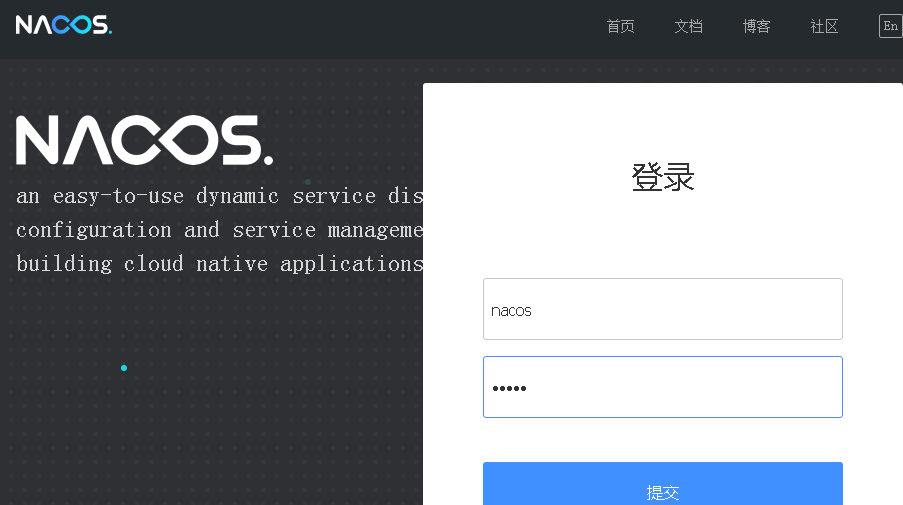
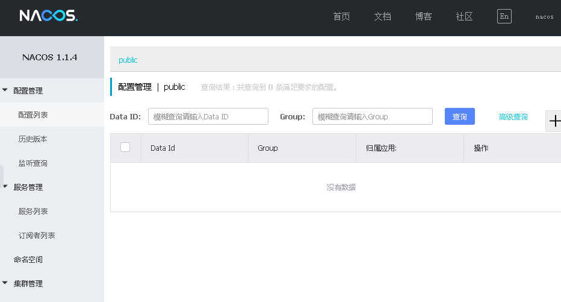
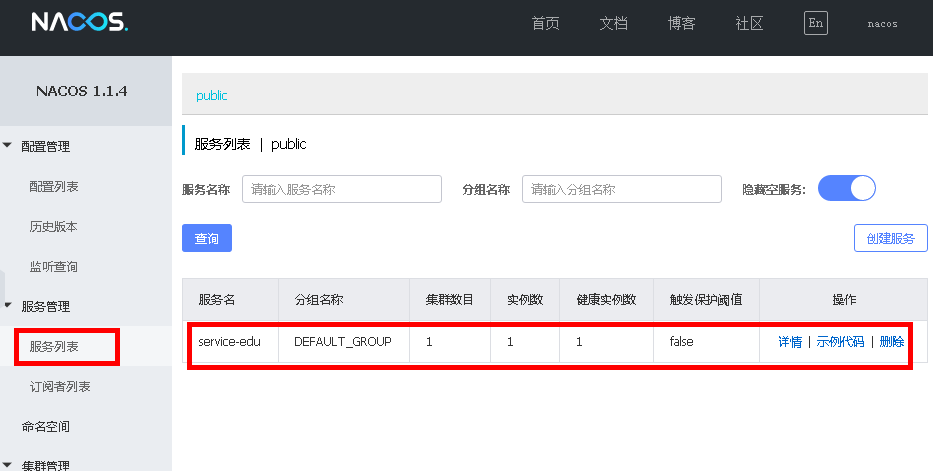
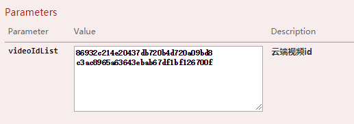
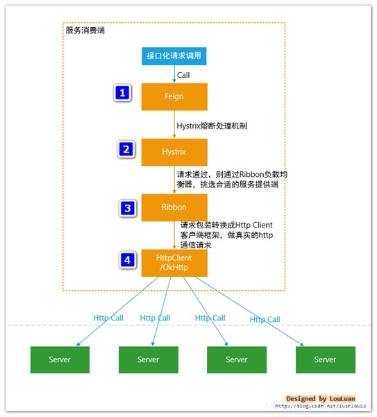
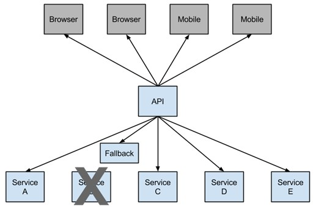
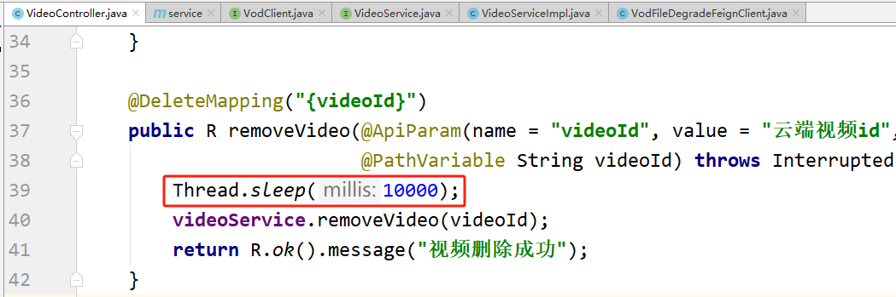
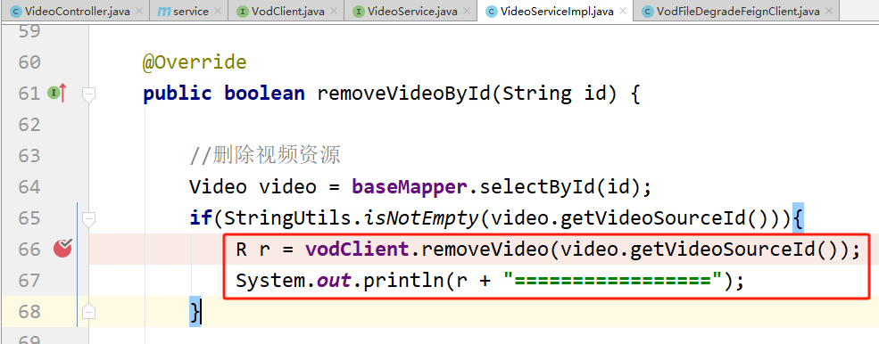
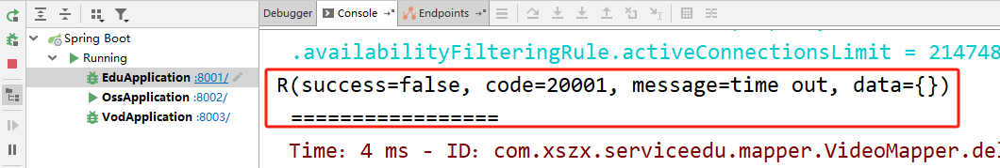

# 第十天【微服务调用】

# 一、SpringCloud 相关概念介绍

spring cloud netflix	里面的好多组件不维护了！

spring cloud alibaba √

Beyond乐队

集群：有多台服务器，每个服务器中都部署相同的模块，它们做的都是同一件事情，那么这些服务器之间就属于集群的关系。

分布式：有多台服务器，每个服务器中部署不同的模块，它们共同完成一件事情，那么这些服务器之间就属于分布式的关系。

## <font style="color:rgb(0, 0, 0);">微服务的由来</font>

<font style="color:rgb(77, 77, 77);">微服务最早由 Martin Fowler 与 James Lewis 于 2014 年共同提出，微服务架构风格是一种使用一套小服务来开发单个应用的方式途径，</font>**<font style="color:rgb(77, 77, 77);">每个服务运行在自己的进程中</font>**<font style="color:rgb(77, 77, 77);">，并使用轻量级机制通信，通常是 HTTP API，这些服务基于业务能力构建，并能够通过自动化部署机制来</font>**<font style="color:rgb(77, 77, 77);">独立部署</font>**<font style="color:rgb(77, 77, 77);">，这些服务可以使用不同的编程语言实现，以及不同数据存储技术，并保持最低限度的集中式管理</font><font style="color:rgb(0, 0, 0);">。 </font>

## <font style="color:rgb(0, 0, 0);">为什么需要微服务</font>

<font style="color:rgb(77, 77, 77);">在传统的 IT 行业软件大多都是各种独立系统的堆砌，这些系统的问题总结来说就是扩展性差，可靠性不高，维护成本高。到后面引入了 SOA 服务化，但是，由于 SOA 早期均使用了总线模式，这种总线模式是与某种技术栈强绑定的，比如：J2EE。这导致很多企业的遗留系统很难对接，切换时间太长，成本太高，新系统稳定性的收敛也需要一些时间</font><font style="color:rgb(0, 0, 0);">。 </font>

## <font style="color:rgb(0, 0, 0);">微服务与单体架构区别</font>

1. <font style="color:rgb(77, 77, 77);">单体架构所有的模块全都耦合在一块，代码量大，维护困难。</font>

<font style="color:rgb(77, 77, 77);">微服务每个模块就相当于一个单独的项目，代码量明显减少，遇到问题也相对来说比较好解决。</font>

2. <font style="color:rgb(77, 77, 77);">单体架构所有的模块都共用一个数据库，存储方式比较单一。</font>

<font style="color:rgb(77, 77, 77);">微服务每个模块都可以使用不同的存储方式（比如有的用 redis，有的用 mysql 等），数据库也是单个模块对应自己的数据库。</font>

3. <font style="color:rgb(77, 77, 77);">单体架构所有的模块开发所使用的技术一样。</font>

<font style="color:rgb(77, 77, 77);">微服务每个模块都可以使用不同的开发技术，开发模式更灵活</font><font style="color:rgb(0, 0, 0);">。 </font>

## <font style="color:rgb(0, 0, 0);">微服务本质</font>

1. <font style="color:rgb(77, 77, 77);">微服务，关键其实不仅仅是微服务本身，而是系统要提供一套基础的架构，这种架构使得微服务可以独立的部署、运行、升级，不仅如此，这个系统架构还让微服务与微服务之间在结构上“松耦合”，而在功能上则表现为一个统一的整体。这种所谓的“统一的整体”表现出来的是统一风格的界面，统一的权限管理，统一的安全策略，统一的上线过程，统一的日志和审计方法，统一的调度方式，统一的访问入口等等。</font>
2. <font style="color:rgb(77, 77, 77);">微服务的目的是有效的拆分应用，实现敏捷开发和部署 。</font>
3. <font style="color:rgb(77, 77, 77);">微服务提倡的理念团队间应该是 inter-operate, not integrate 。inter-operate 是定义好系统的边界和接口，在一个团队内全栈，让团队自治，原因就是因为如果团队按照这样的方式组建，将沟通的成本维持在系统内部，每个子系统就会更加内聚，彼此的依赖耦合能变弱，跨系统的沟通成本也就能降低。</font>

## <font style="color:rgb(0, 0, 0);">什么样的项目适合微服务</font>

<font style="color:rgb(77, 77, 77);">微服务可以按照业务功能本身的独立性来划分，如果系统提供的业务是非常底层的，如：操作系统内核、存储系统、网络系统、数据库系统等等，这类系统都偏底层，功能和功能之间有着紧密的配合关系，如果强制拆分为较小的服务单元，会让集成工作量急剧上升，并且这种人为的切割无法带来业务上的真正的隔离，所以无法做到独立部署和运行，也就不适合做成微服务了。</font>

## <font style="color:rgb(0, 0, 0);">微服务开发框架</font>

<font style="color:rgb(77, 77, 77);">目前微服务的开发框架，最常用的有以下四个：</font>

<font style="color:rgb(77, 77, 77);">SpringCloud：http://projects.spring.io/spring-cloud（现在非常流行的微服务架构）</font>

<font style="color:rgb(77, 77, 77);">Dubbo：http：//dubbo.io</font>

<font style="color:rgb(77, 77, 77);">Dropwizard：http://www.dropwizard.io （关注单个微服务的开发）</font>

<font style="color:rgb(77, 77, 77);">Consul、etcd\&etc.（微服务的模块）</font>

## <font style="color:rgb(0, 0, 0);">什么是 SpringCloud</font>

<font style="color:rgb(0, 0, 0);">SpringCloud 是一系列框架的集合。它利用 SpringBoot 的开发便利性简化了分布式系统基础设施的开发，如服务发现、服务注册、配置中心、消息总线、负载均衡、 熔断器、数据监控等，都可以用 Spring Boot 的开发风格做到一键启动和部署。Spring 并没有重复制造轮子，它只是将目前各家公司开发的比较成熟、经得起实际考验的服务框架组合起来，通过 SpringBoot 风格进行再封装屏蔽掉了复杂的配置和实现原理，最终给开发者留出了一套简单易懂、易部署和易维护的分布式系统开发工具包</font>

## <font style="color:rgb(0, 0, 0);">SpringCloud 和 SpringBoot 是什么关系</font>

<font style="color:rgb(0, 0, 0);">SpringBoot 是 Spring 的一套快速配置脚手架，可以基于 SpringBoot 快速开发单个微服务，Spring Cloud 是一个基于 SpringBoot 实现的开发工具；</font>

<font style="color:rgb(0, 0, 0);">SpringBoot 专注于快速、方便集成的单个微服务个体，SpringCloud 关注全局的服务治理框架； SpringBoot 使用了默认大于配置的理念，很多集成方案已经帮你选择好了，能不配置就不配置，SpringCloud 很大的一部分是基于 SpringBoot 来实现，必须基于SpringBoot 开发。</font>

<font style="color:rgb(0, 0, 0);">可以单独使用 SpringBoot 开发项目，但是 SpringCloud 离不开 SpringBoot。</font>

## <font style="color:rgb(0, 0, 0);">SpringCloud 相关基础服务组件</font>

<font style="color:rgb(0, 0, 0);">服务发现——</font><font style="color:rgb(0, 0, 0);">Netflix Eureka</font><font style="color:rgb(0, 0, 255);"> </font><font style="color:rgb(0, 0, 0);"> </font><font style="color:rgb(255, 0, 0);">（Nacos）</font>

<font style="color:rgb(0, 0, 0);">服务调用——Netflix Feign </font>

<font style="color:rgb(0, 0, 0);">熔断器——Netflix Hystrix </font>

<font style="color:rgb(0, 0, 0);">服务网关——</font><font style="color:rgb(0, 0, 0);">Spring Cloud</font><font style="color:rgb(0, 0, 0);">  </font><font style="color:rgb(0, 0, 0);">GateWay </font>

<font style="color:rgb(0, 0, 0);">分布式配置——Spring Cloud Config  </font><font style="color:rgb(255, 0, 0);">（Nacos）</font>

<font style="color:rgb(0, 0, 0);">消息总线 —— Spring Cloud Bus </font><font style="color:rgb(255, 0, 0);">（Nacos）</font>

## <font style="color:rgb(0, 0, 0);">SpringCloud 的版本</font>

<font style="color:rgb(0, 0, 0);">SpringCloud 并没有熟悉的数字版本号，而是对应一个开发代号。</font>

| <font style="color:rgb(0, 0, 0);">Cloud代号</font> | <font style="color:rgb(0, 0, 0);">Boot版本(train)</font> | <font style="color:rgb(0, 0, 0);">Boot版本(tested)</font> | <font style="color:rgb(0, 0, 0);">lifecycle</font> |
| --- | --- | --- | --- |
| <font style="color:rgb(0, 0, 0);">Angle</font> | <font style="color:rgb(0, 0, 0);">1.2.x</font> | <font style="color:rgb(0, 0, 0);">incompatible with 1.3</font> | <font style="color:rgb(0, 0, 0);">EOL in July 2017</font> |
| <font style="color:rgb(0, 0, 0);">Brixton</font> | <font style="color:rgb(0, 0, 0);">1.3.x</font> | <font style="color:rgb(0, 0, 0);">1.4.x</font> | <font style="color:rgb(0, 0, 0);">2017-07卒</font> |
| <font style="color:rgb(0, 0, 0);">Camden</font> | <font style="color:rgb(0, 0, 0);">1.4.x</font> | <font style="color:rgb(0, 0, 0);">1.5.x</font> | <font style="color:rgb(0, 0, 0);">-</font> |
| <font style="color:rgb(0, 0, 0);">Dalston</font> | <font style="color:rgb(0, 0, 0);">1.5.x</font> | <font style="color:rgb(0, 0, 0);">not expected 2.x</font> | <font style="color:rgb(0, 0, 0);">-</font> |
| <font style="color:rgb(0, 0, 0);">Edgware</font> | <font style="color:rgb(0, 0, 0);">1.5.x</font> | <font style="color:rgb(0, 0, 0);">not expected 2.x</font> | <font style="color:rgb(0, 0, 0);">-</font> |
| <font style="color:rgb(0, 0, 0);">Finchley</font> | <font style="color:rgb(0, 0, 0);">2.0.x</font> | <font style="color:rgb(0, 0, 0);">not expected 1.5.x</font> | <font style="color:rgb(0, 0, 0);">-</font> |
| <font style="color:rgb(69, 69, 69);">Greenwich</font> | **<font style="color:rgb(69, 69, 69);">2.1.x</font>** | <font style="color:rgb(0, 0, 0);"></font> | <font style="color:rgb(0, 0, 0);"></font> |
| <font style="color:rgb(69, 69, 69);">Hoxton</font> | <font style="color:rgb(0, 0, 0);">2.2.x</font> | <font style="color:rgb(0, 0, 0);"></font> | <font style="color:rgb(0, 0, 0);"></font> |

<font style="color:rgb(0, 0, 0);">开发代号看似没有什么规律，但实际上首字母是有顺序的，比如：Dalston 版本，我们可以简称 D 版本，对应的 Edgware 版本我们可以简称 E 版本。</font>

**<font style="color:rgb(0, 0, 0);">小版本</font>**

<font style="color:rgb(0, 0, 0);">SpringCloud 小版本分为：</font>

* <font style="color:rgb(0, 0, 0);">SNAPSHOT： 快照版本，随时可能修改</font>
* <font style="color:rgb(0, 0, 0);">M： MileStone，M1 表示第1个里程碑版本，一般同时标注 PRE，表示预览版版。</font>
* <font style="color:rgb(0, 0, 0);">SR： Service Release，SR1 表示第1个正式版本，一般同时标注 GA：(Generally Available)，表示稳定版本。</font>

# 二、服务发现-搭建 Nacos 服务

注册中心！！！

## <font style="color:rgb(0, 0, 0);">Nacos 介绍</font>

### <font style="color:rgb(0, 0, 0);">基本概念</font>

<font style="color:rgb(0, 0, 0);">Nacos 是阿里巴巴推出来的一个新开源项目，是一个更易于构建云原生应用的动态服务发现、配置管理和服务管理平台。</font>

<font style="color:rgb(0, 0, 0);">Nacos 致力于帮助您发现、配置和管理微服务。</font>

<font style="color:rgb(0, 0, 0);">Nacos 提供了一组简单易用的特性集，帮助您快速实现动态服务发现、服务配置、服务元数据及流量管理。</font>

<font style="color:rgb(0, 0, 0);">Nacos 帮助您更敏捷和容易地构建、交付和管理微服务平台。 </font>

<font style="color:rgb(0, 0, 0);">Nacos 是构建以“服务”为中心的现代应用架构 (例如微服务范式、云原生范式) 的服务基础设施。</font>

### <font style="color:rgb(0, 0, 0);">常见的注册中心</font>

1. <font style="color:rgb(0, 0, 0);">Eureka（原生，2.0遇到性能瓶颈，停止维护）</font>
2. <font style="color:rgb(0, 0, 0);">Zookeeper（支持，专业的独立产品。例如：dubbo）</font>
3. <font style="color:rgb(0, 0, 0);">Consul（原生，GO 语言开发）</font>
4. <font style="color:rgb(0, 0, 0);">Nacos</font>

### <font style="color:rgb(0, 0, 0);">Nacos 的优点</font>

* <font style="color:rgb(0, 0, 0);">相对于 Spring Cloud Eureka 来说，Nacos 更强大。</font>
* <font style="color:rgb(0, 0, 0);">Nacos = Spring Cloud Eureka + Spring Cloud Config</font>
* <font style="color:rgb(0, 0, 0);">Nacos 可以与 Spring, Spring Boot, Spring Cloud 集成，并能代替 Spring Cloud Eureka, Spring Cloud Config</font>
* <font style="color:rgb(0, 0, 0);">通过 Nacos Server 和 spring-cloud-starter-alibaba-nacos-discovery 实现服务的注册与发现。</font>

### <font style="color:rgb(0, 0, 0);">Nacos 功能</font>

<font style="color:rgb(0, 0, 0);">Nacos 是以服务为主要服务对象的中间件，Nacos 支持所有主流的服务发现、配置和管理。</font>

<font style="color:rgb(0, 0, 0);">Nacos 主要提供以下四大功能：</font>

1. <font style="color:rgb(0, 0, 0);">服务发现和服务健康监测</font>
2. <font style="color:rgb(0, 0, 0);">动态配置服务</font>
3. <font style="color:rgb(0, 0, 0);">动态 DNS 服务</font>
4. <font style="color:rgb(0, 0, 0);">服务及其元数据管理</font>

### <font style="color:rgb(0, 0, 0);">Nacos 结构图</font>


## <font style="color:rgb(0, 0, 0);">Nacos 下载和安装</font>

**<font style="color:rgb(0, 0, 0);">（1）下载地址和版本</font>**

<font style="color:rgb(0, 0, 0);">下载地址：</font>[<font style="color:rgb(0, 0, 0);">https://github.com/alibaba/nacos/releases</font>](https://github.com/alibaba/nacos/releases)

<font style="color:rgb(0, 0, 0);">下载版本：nacos-server-1.1.4.tar.gz 或 nacos-server-1.1.4.zip，解压任意目录即可</font>

**<font style="color:rgb(0, 0, 0);">（2）启动 nacos 服务</font>**

* <font style="color:rgb(0, 0, 0);">Linux/Unix/Mac</font>
  * <font style="color:rgb(0, 0, 0);">启动命令（standalone 代表着单机模式运行，非集群模式）</font>
  * <font style="color:rgb(0, 0, 0);">启动命令：sh startup.sh -m standalone</font>
* <font style="color:rgb(0, 0, 0);">Windows</font>
  * <font style="color:rgb(0, 0, 0);">启动命令：cmd startup.cmd 或者双击 startup.cmd 运行文件。</font>

**<font style="color:rgb(0, 0, 0);">（3）访问：</font>**[**<font style="color:rgb(0, 0, 0);">http://localhost:8848/nacos</font>**](http://localhost:8848/nacos)

**<font style="color:rgb(0, 0, 0);">（4）用户名密码：nacos/nacos</font>**





## <font style="color:rgb(0, 0, 0);">服务注册（service\_edu为例）</font>

<font style="color:rgb(255, 0, 0);">把 service-edu 微服务注册到注册中心中，service-vod 步骤相同</font>

### <font style="color:rgb(0, 0, 0);">在 service 模块配置 pom</font>

<font style="color:rgb(0, 0, 0);">配置 Nacos 客户端的 pom 依赖</font>

```xml
<!--服务注册-->
<dependency>
    <groupId>org.springframework.cloud</groupId>
    <artifactId>spring-cloud-starter-alibaba-nacos-discovery</artifactId>
</dependency>
```

### <font style="color:rgb(0, 0, 0);">添加服务配置信息</font>

<font style="color:rgb(0, 0, 0);">配置 application.properties，在客户端微服务中添加注册 Nacos 服务的配置信息</font>

```properties
# nacos服务地址
spring.cloud.nacos.discovery.server-addr=127.0.0.1:8848
```

### <font style="color:rgb(0, 0, 0);">添加 Nacos 客户端注解</font>

<font style="color:rgb(0, 0, 0);">在客户端微服务启动类中添加注解</font>

```latex
@EnableDiscoveryClient
```

### <font style="color:rgb(0, 0, 0);">启动客户端微服务</font>

<font style="color:rgb(0, 0, 0);">启动注册中心</font>

<font style="color:rgb(0, 0, 0);">启动已注册的微服务，可以在 Nacos 服务列表中看到被注册的微服务</font>



# 三、服务调用-Feign

## <font style="color:rgb(0, 0, 0);">Feign 介绍</font>

* <font style="color:rgb(0, 0, 0);">Feign 是 Netflix 开发的声明式、模板化的 HTTP 客户端， Feign 可以帮助我们更快捷、优雅地调用HTTP API。</font>
* <font style="color:rgb(0, 0, 0);">Feign 支持多种注解，例如 Feign 自带的注解或者 JAX-RS 注解等。</font>
* <font style="color:rgb(0, 0, 0);">SpringCloud 对 Feign 进行了增强，使 Feign 支持了 SpringMVC 注解，并整合了 Ribbon 和Eureka，从而让 Feign 的使用更加方便。</font>
* <font style="color:rgb(0, 0, 0);">SpringCloud Feign 是基于 Netflix feign 实现，整合了 SpringCloud Ribbon 和 SpringCloud Hystrix，除了提供这两者的强大功能外，还提供了一种声明式的 Web 服务客户端定义的方式。</font>
* <font style="color:rgb(0, 0, 0);">SpringCloud Feign 帮助我们定义和实现依赖服务接口的定义。在 SpringCloud Feign 的实现下，只需要创建一个接口并用注解方式配置它，即可完成服务提供方的接口绑定，简化了在使用 SpringCloud Ribbon 时自行封装服务调用客户端的开发量。</font>

## <font style="color:rgb(0, 0, 0);">实现服务调用</font>

### 需求

<font style="color:rgb(255, 0, 0);">删除课时的同时删除云端视频</font>

### <font style="color:rgb(0, 0, 0);">在 service 模块添加 pom 依赖</font>

```xml
<!--服务调用-->
<dependency>
    <groupId>org.springframework.cloud</groupId>
    <artifactId>spring-cloud-starter-openfeign</artifactId>
</dependency>
```

### <font style="color:rgb(0, 0, 0);">在调用端的启动类添加注解</font>

在 service-edu 的启动类上方添加下面的注解：

```latex
@EnableFeignClients
```

### <font style="color:rgb(0, 0, 0);">创建包和</font><font style="color:rgb(255, 0, 0);">接口</font>

**在 service-edu 模块中做下面的操作：**

<font style="color:rgb(0, 0, 0);">创建 client 包</font>

<font style="color:rgb(0, 0, 0);">@FeignClient 注解用于指定从哪个服务中调用功能 ，名称与被调用的服务名保持一致。</font>

<font style="color:rgb(0, 0, 0);">@GetMapping 注解用于对被调用的微服务进行地址映射。</font>**<font style="color:rgb(0, 0, 0);">路径要写全了！！</font>**

**<font style="color:rgb(255, 0, 0);">@PathVariable 注解一定要指定参数名称，否则出错</font>**

<font style="color:rgb(0, 0, 0);">@Component 注解防止，在其他位置注入 VodClient 时 idea 报错</font>

```java
package com.xszx.edu.client;

@FeignClient("service-vod")
@Component
public interface VodClient {

    @DeleteMapping(value = "/eduvod/vod/video/{videoId}")
    public R removeVideo(@PathVariable("videoId") String videoId);
}
```

### <font style="color:rgb(0, 0, 0);">调用微服务</font>

<font style="color:rgb(0, 0, 0);">在调用端的 VideoServiceImpl 中调用 client 中的方法</font>

```java
@Override
public boolean removeVideoById(String id) {

    //查询云端视频id
    Video video = baseMapper.selectById(id);
    String videoSourceId = video.getVideoSourceId();
    //删除视频资源
    if(!StringUtils.isEmpty(videoSourceId)){
        vodClient.removeVideo(videoSourceId);
    }

    Integer result = baseMapper.deleteById(id);
    return null != result && result > 0;
}
```

### <font style="color:rgb(0, 0, 0);">测试</font>

<font style="color:rgb(0, 0, 0);">启动相关微服务</font>

<font style="color:rgb(0, 0, 0);">测试删除课时的功能</font>

# 四、完善删除课程业务

## 需求

<font style="color:rgb(255, 0, 0);">删除课程的同时删除云端视频</font>

## <font style="color:rgb(0, 0, 0);">vod 服务</font>

### <font style="color:rgb(0, 0, 0);">业务</font>

<font style="color:rgb(0, 0, 0);">业务接口：VideoService.java</font>

```java
void removeVideoList(List<String> videoIdList);
```

<font style="color:rgb(0, 0, 0);">业务实现：VideoServiceImpl.java</font>

```java
@Override
public void removeVideoList(List<String> videoIdList) {
    try {
        //初始化
        DefaultAcsClient client = AliyunVodSDKUtils.initVodClient(
            ConstantPropertiesUtil.ACCESS_KEY_ID,
            ConstantPropertiesUtil.ACCESS_KEY_SECRET);

        //创建请求对象
        //一次只能批量删20个
        String str = org.apache.commons.lang.StringUtils.join(videoIdList.toArray(), ",");
        DeleteVideoRequest request = new DeleteVideoRequest();
        request.setVideoIds(str);

        //获取响应
        DeleteVideoResponse response = client.getAcsResponse(request);

        System.out.print("RequestId = " + response.getRequestId() + "\n");
    } catch (ClientException e) {
        throw new QinXueException(20001, "视频删除失败");
    }
}
```

### <font style="color:rgb(0, 0, 0);">web 层接口</font>

<font style="color:rgb(0, 0, 0);">controller：VideoAdminController.java</font>

```java
/**
 * 批量删除视频
 * @param videoIdList
 * @return
 */
@DeleteMapping("delete-batch")
public R removeVideoList(

    @ApiParam(name = "videoIdList", value = "云端视频id", required = true)
    @RequestParam("videoIdList") List videoIdList){

    videoService.removeVideoList(videoIdList);
    return R.ok().message("视频删除成功");
}
```

### <font style="color:rgb(0, 0, 0);">Swagger 测试</font>

<font style="color:rgb(0, 0, 0);">输入多个 id，每个一行</font>



## <font style="color:rgb(0, 0, 0);">edu 服务</font>

### <font style="color:rgb(0, 0, 0);">client</font>

<font style="color:rgb(0, 0, 0);">VodClient.java</font>

```java
@DeleteMapping(value = "/admin/vod/video/delete-batch")
public R removeVideoList(@RequestParam("videoIdList") List<String> videoIdList);
```

### <font style="color:rgb(0, 0, 0);">业务</font>

<font style="color:rgb(0, 0, 0);">VideoServiceImpl.java</font>

```java
@Override
public boolean removeByCourseId(String courseId) {

    //根据课程id查询所有视频列表
    QueryWrapper<Video> queryWrapper = new QueryWrapper<>();
    queryWrapper.eq("course_id", courseId);
    queryWrapper.select("video_source_id");
    List<Video> videoList = baseMapper.selectList(queryWrapper);

    //得到所有视频列表的云端原始视频id
    List<String> videoSourceIdList = new ArrayList<>();
    for (int i = 0; i < videoList.size(); i++) {
        Video video = videoList.get(i);
        String videoSourceId = video.getVideoSourceId();
        if(!StringUtils.isEmpty(videoSourceId)){
            videoSourceIdList.add(videoSourceId);
        }
    }

    //调用vod服务删除远程视频
    if(videoSourceIdList.size() > 0){
        vodClient.removeVideoList(videoSourceIdList);
    }

    //删除video表示的记录
    QueryWrapper<Video> queryWrapper2 = new QueryWrapper<>();
    queryWrapper2.eq("course_id", courseId);
    Integer count = baseMapper.delete(queryWrapper2);
    return null != count && count > 0;
}
```

<font style="color:rgb(0, 0, 0);">CourseServiceImpl.java</font>

```java
@Override
public boolean removeCourseById(String id) {

    //根据id删除所有视频
    videoService.removeByCourseId(id);

    //根据id删除所有章节
    chapterService.removeByCourseId(id);

    //根据id删除所有课程详情
    courseDescriptionService.removeById(id);

    //删除封面 TODO 独立完成
    Integer result = baseMapper.deleteById(id);
    return null != result && result > 0;
}
```

# 五、熔断器

## <font style="color:rgb(0, 0, 0);">Hystrix 基本概念</font>

### <font style="color:rgb(0, 0, 0);">SpringCloud 调用接口过程</font>

<font style="color:rgb(0, 0, 0);">SpringCloud 在接口调用上，大致会经过如下几个组件配合：</font>

<code>**<font style="color:rgb(0, 0, 0);">Feign</font>**</code>**<font style="color:rgb(0, 0, 0);"> -----></font>**<code>**<font style="color:rgb(0, 0, 0);">Hystrix</font>**</code>**<font style="color:rgb(0, 0, 0);"> -----> </font>**<code>**<font style="color:rgb(0, 0, 0);">Ribbon</font>**</code>**<font style="color:rgb(0, 0, 0);"> -----> </font>**<code>**<font style="color:rgb(0, 0, 0);">Http Client</font>**``**<font style="color:rgb(0, 0, 0);">（apache http components 或者 Okhttp）</font>**</code>**<font style="color:rgb(0, 0, 0);"> </font>**<font style="color:rgb(0, 0, 0);">具体交互流程上，如下图所示：</font>



**<font style="color:rgb(0, 0, 0);">（1）接口化请求调用</font>**<font style="color:rgb(0, 0, 0);">当调用被</font><code><font style="color:rgb(0, 0, 0);">@FeignClient</font></code><font style="color:rgb(0, 0, 0);">注解修饰的接口时，在框架内部，将请求转换成 Feign 的请求实例</font><code><font style="color:rgb(0, 0, 0);">feign.Request</font></code><font style="color:rgb(0, 0, 0);">，交由 Feign 框架处理。</font>

**<font style="color:rgb(0, 0, 0);">（2）Feign </font>**<font style="color:rgb(0, 0, 0);">：转化请求 Feign 是一个 http 请求调用的轻量级框架，可以以 Java 接口注解的方式调用 Http 请求，封装了 Http 调用流程。</font>

**<font style="color:rgb(0, 0, 0);">（3）Hystrix</font>**<font style="color:rgb(0, 0, 0);">：熔断处理机制 Feign 的调用关系，会被 Hystrix 代理拦截，对每一个 Feign 调用请求，Hystrix 都会将其包装成</font><code><font style="color:rgb(0, 0, 0);">HystrixCommand</font></code><font style="color:rgb(0, 0, 0);">,参与 Hystrix 的流控和熔断规则。如果请求判断需要熔断，则Hystrix 直接熔断，抛出异常或者使用</font><code><font style="color:rgb(0, 0, 0);">FallbackFactory</font></code><font style="color:rgb(0, 0, 0);">返回熔断</font><code><font style="color:rgb(0, 0, 0);">Fallback</font></code><font style="color:rgb(0, 0, 0);">结果；如果通过，则将调用请求传递给</font><code><font style="color:rgb(0, 0, 0);">Ribbon</font></code><font style="color:rgb(0, 0, 0);">组件。</font>

**<font style="color:rgb(0, 0, 0);">（4）Ribbon</font>**<font style="color:rgb(0, 0, 0);">：服务地址选择 当请求传递到</font><code><font style="color:rgb(0, 0, 0);">Ribbon</font></code><font style="color:rgb(0, 0, 0);">之后,</font><code><font style="color:rgb(0, 0, 0);">Ribbon</font></code><font style="color:rgb(0, 0, 0);">会根据自身维护的服务列表，根据服务的服务质量，如平均响应时间，Load 等，结合特定的规则，从列表中挑选合适的服务实例，选择好机器之后，然后将机器实例的信息请求传递给</font><code><font style="color:rgb(0, 0, 0);">Http Client</font></code><font style="color:rgb(0, 0, 0);">客户端，</font><code><font style="color:rgb(0, 0, 0);">HttpClient</font></code><font style="color:rgb(0, 0, 0);">客户端来执行真正的 Http 接口调用；</font>

**<font style="color:rgb(0, 0, 0);">（5）HttpClient </font>**<font style="color:rgb(0, 0, 0);">：Http 客户端，真正执行 Http 调用根据上层</font><code><font style="color:rgb(0, 0, 0);">Ribbon</font></code><font style="color:rgb(0, 0, 0);">传递过来的请求，已经指定了服务地址，则 HttpClient 开始执行真正的 Http 请求</font>

### <font style="color:rgb(0, 0, 0);">Hystrix 概念</font>

<font style="color:rgb(0, 0, 0);">Hystrix</font><font style="color:rgb(0, 0, 0);"> </font><font style="color:rgb(0, 0, 0);">是一个供分布式系统使用，提供延迟和容错功能，保证复杂的分布系统在面临不可避免的失败时，仍能有其弹性。</font>

<font style="color:rgb(0, 0, 0);">比如系统中有很多服务，当某些服务不稳定的时候，使用这些服务的用户线程将会阻塞，如果没有隔离机制，系统随时就有可能会挂掉，从而带来很大的风险。SpringCloud 使用 Hystrix 组件提供断路器、资源隔离与自我修复功能。下图表示服务B触发了断路器，阻止了级联失败</font>



load balance

## <font style="color:rgb(0, 0, 0);">feign 结合 Hystrix 使用</font>

<font style="color:rgb(0, 0, 0);">改造 service-edu 模块</font>

### <font style="color:rgb(0, 0, 0);">在 service 的 pom 中添加依赖</font>

```xml
<dependency>
    <groupId>org.springframework.cloud</groupId>
    <artifactId>spring-cloud-starter-netflix-ribbon</artifactId>
</dependency>

<!--hystrix依赖，主要是用  @HystrixCommand -->
<dependency>
    <groupId>org.springframework.cloud</groupId>
    <artifactId>spring-cloud-starter-netflix-hystrix</artifactId>
</dependency>

<!--服务注册-->
<dependency>
    <groupId>org.springframework.cloud</groupId>
    <artifactId>spring-cloud-starter-alibaba-nacos-discovery</artifactId>
</dependency>
<!--服务调用-->

<dependency>
    <groupId>org.springframework.cloud</groupId>
    <artifactId>spring-cloud-starter-openfeign</artifactId>
</dependency>
```

### <font style="color:rgb(0, 0, 0);">在配置文件中添加 hystrix 配置</font>

```properties
#开启熔断机制
feign.hystrix.enabled=true
# 设置hystrix超时时间，默认1000ms
hystrix.command.default.execution.isolation.thread.timeoutInMilliseconds=6000
```

### <font style="color:rgb(0, 0, 0);">在 service-edu 的 client 包里面创建熔断器的实现类</font>

```java
@Component
public class VodFileDegradeFeignClient implements VodClient {

    @Override
    public R removeVideo(String videoId) {
        return R.error().message("time out");
    }

    @Override
    public R removeVideoList(List videoIdList) {
        return R.error().message("time out");
    }
}
```

### <font style="color:rgb(0, 0, 0);">修改 VodClient 接口的注解</font>

```java
@FeignClient(name = "service-vod", fallback = VodFileDegradeFeignClient.class)
@Component
public interface VodClient {
    @DeleteMapping(value = "/eduvod/vod/{videoId}")
    public R removeVideo(@PathVariable("videoId") String videoId);

    @DeleteMapping(value = "/eduvod/vod/delete-batch")
    public R removeVideoList(@RequestParam("videoIdList") List videoIdList);
}
```

### <font style="color:rgb(0, 0, 0);">测试熔断器效果</font>

* 在 service-vod 服务端设置睡眠时间为 10s



* 在 service-edu 服务端修改返回值，并输出返回结果
* 使用 Swagger 测试 service-edu 中删除小节的方法，看控制台打印的信息




> 更新: 2024-07-22 09:11:18  
> 原文: <https://www.yuque.com/u41736172/az9urv/ohqraypan7o9cn37>