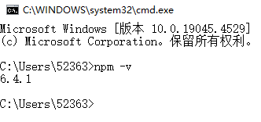
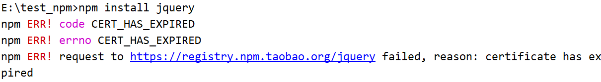
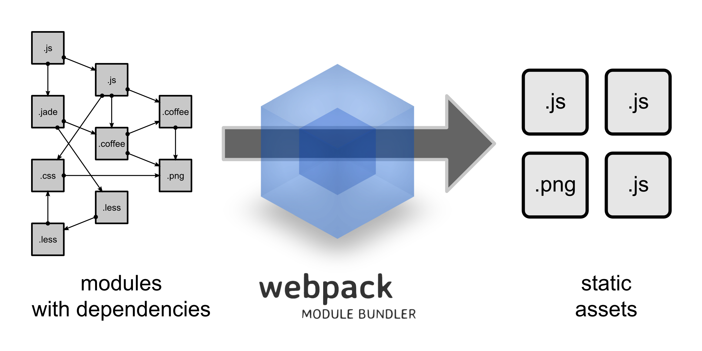
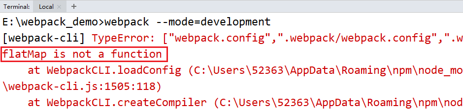
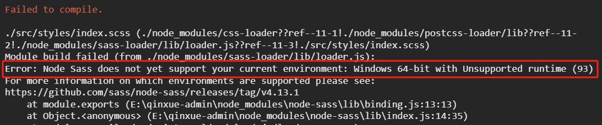
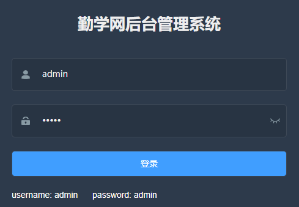

# 第四天【项目前端相关基础知识二】

# 一、NPM
## 概述
### <font style="color:rgb(0, 0, 0);">什么是 NPM</font>
<font style="color:rgb(0, 0, 0);">NPM 全称 Node Package Manager，是 Node.js 包管理工具，是全球最大的模块生态系统，里面所有的模块都是开源免费的；相当于前端的 Maven 。</font>

<font style="color:rgb(0, 0, 0);">我们通过 NPM 可以很方便地下载 js 库，管理前端工程。</font>

### <font style="color:rgb(0, 0, 0);">NPM 工具的安装位置</font>
安装了 node 后，就会默认也安装了 NPM。

<font style="color:rgb(51, 51, 51);">Node.js 默认安装的 npm 包和工具的位置：Node.js目录\node_modules。</font><font style="color:rgb(0, 0, 0);">在这个目录下你可以看见 npm 目录，npm 本身就是被 NPM 包管理器管理的一个工具，</font><font style="color:rgb(51, 51, 51);">说明 Node.js 已经集成了 npm 工具。</font>

```shell
#在命令提示符输入 npm -v 可查看当前npm版本
npm -v
```



## <font style="color:rgb(0, 0, 0);">使用 NPM 管理项目</font>
### 创建项目
使用 IDEA 创建一个前端项目。

### <font style="color:rgb(0, 0, 0);">项目初始化</font>
```shell
#建立一个空文件夹，在命令提示符进入该文件夹  执行命令初始化
npm init
#按照提示输入相关信息，如果使用默认值则直接回车即可。
#name: 项目名称
#version: 项目版本号
#description: 项目描述
#keywords: {Array}关键词，便于用户搜索到我们的项目
#最后会生成package.json文件，这个是包的配置文件，相当于maven的pom.xml
#我们之后也可以根据需要进行修改。
```

```shell
#如果想直接生成 package.json 文件，那么可以使用命令
npm init -y
```

### <font style="color:rgb(0, 0, 0);">修改 NPM 镜像</font>
<font style="color:rgb(0, 0, 0);">NPM 官方管理的包都是从 </font>[http://npmjs.com](http://npmjs.com)<font style="color:rgb(0, 0, 0);">下载的，但是这个网站在国内速度很慢。</font>

<font style="color:rgb(0, 0, 0);">这里推荐使用淘宝 NPM 镜像</font><font style="color:rgb(0, 0, 0);"> </font>[http://npm.taobao.org/](http://npm.taobao.org/)<font style="color:rgb(0, 0, 0);"> ，</font><font style="color:rgb(0, 0, 0);">淘宝 NPM 镜像是一个完整 npmjs.com 镜像，同步频率目前为 10分钟一次，以保证尽量与官方服务同步。</font>

**<font style="color:rgb(0, 0, 0);">设置镜像地址：</font>**

```shell
#经过下面的配置，以后所有的 npm install 都会经过淘宝的镜像地址下载
npm config set registry https://registry.npm.taobao.org 

#查看npm配置信息
npm config list
```

### <font style="color:rgb(0, 0, 0);">npm install 命令的使用</font>
```shell
#使用 npm install 安装依赖包的最新版，
#模块安装的位置：项目目录\node_modules
#安装会自动在项目目录下添加 package-lock.json文件，这个文件帮助锁定安装包的版本
#同时package.json 文件中，依赖包会被添加到dependencies节点下，类似maven中的 <dependencies>
npm install jquery

#npm管理的项目在备份和传输的时候一般不携带node_modules文件夹
npm install #根据package.json中的配置下载依赖，初始化项目

#如果安装时想指定特定的版本
npm install jquery@2.1.x

#devDependencies节点：开发时的依赖包，项目打包到生产环境的时候不包含的依赖
#使用 -D参数将依赖添加到devDependencies节点
npm install --save-dev eslint
#或
npm install -D eslint

#全局安装
#Node.js全局安装的npm包和工具的位置：用户目录\AppData\Roaming\npm\node_modules
#一些命令行工具常使用全局安装的方式
npm install -g webpack
```

**问题：执行上面的安装命令时，报错如下：**



**原因：https自签名失败**

**解决：执行下面的两个命令后，然后再次安装即可**

```shell
npm cache clean --force
npm config set strict-ssl false
```

### <font style="color:rgb(0, 0, 0);">其它命令</font>
```shell
#更新包（更新到最新版本）
npm update 包名

#全局更新
npm update -g 包名

#卸载包
npm uninstall 包名

#全局卸载
npm uninstall -g 包名
```

# 二、Babel
## 概述
<font style="color:rgb(0, 0, 0);">Babel 是一个广泛使用的转码器，可以将 ES6 代码转为 ES5 代码，从而在现有环境执行。</font>

<font style="color:rgb(0, 0, 0);">这意味着，你可以现在就用 ES6 编写程序，而不用担心现有环境是否支持。</font>

## <font style="color:rgb(0, 0, 0);">安装</font>
<font style="color:rgb(0, 0, 0);">Babel 提供 babel-cli 工具，用于命令行转码。它的安装命令如下：</font>

```shell
npm install --global babel-cli
#或者
npm i -g babel-cli

#查看是否安装成功
babel --version
```

## <font style="color:rgb(0, 0, 0);">Babel 的使用</font>
### 创建项目
使用 IDEA 创建一个前端项目。

### <font style="color:rgb(0, 0, 0);">初始化项目</font>
```shell
npm init -y
```

### <font style="color:rgb(0, 0, 0);">编写 js</font>
<font style="color:rgb(255, 0, 255);">src/example.js</font>

<font style="color:rgb(0, 0, 0);">下面是一段 ES6 代码：</font>

```javascript
// 转码前
// 定义数据
let input = [1, 2, 3]
// 将数组的每个元素 +1
input = input.map(item => item + 1)
console.log(input)
```

### <font style="color:rgb(0, 0, 0);">配置 .babelrc</font>
<font style="color:rgb(0, 0, 0);">Babel 的配置文件是 .babelrc，存放在项目的根目录下，该文件用来设置转码规则和插件，基本格式如下。</font>

```json
{
    "presets": [],
    "plugins": []
}
```

<font style="color:rgb(0, 0, 0);">presets 字段设定转码规则，将 es2015 规则加入 .babelrc：</font>

```json
{
    "presets": ["es2015"],
    "plugins": []
}
```

### <font style="color:rgb(0, 0, 0);">安装转码器</font>
<font style="color:rgb(0, 0, 0);">在项目中安装</font>

```shell
npm install --save-dev babel-preset-es2015
```

### <font style="color:rgb(0, 0, 0);">转码</font>
```shell
# 转码结果写入一个文件
mkdir dist1

# --out-file 或 -o 参数指定输出文件
babel src/example.js --out-file dist1/compiled.js

# 或者
babel src/example.js -o dist1/compiled.js

# 整个目录转码
mkdir dist2

# --out-dir 或 -d 参数指定输出目录
babel src --out-dir dist2

# 或者
babel src -d dist2
```

# 三、模块化
## 概述
### <font style="color:rgb(0, 0, 0);">模块化产生的背景</font>
<font style="color:rgb(0, 0, 0);">随着网站逐渐变成"互联网应用程序"，嵌入网页的 JavaScript 代码越来越庞大，越来越复杂。</font>


<font style="color:rgb(0, 0, 0);">Javascript 模块化编程，已经成为一个迫切的需求。理想情况下，开发者只需要实现核心的业务逻辑，其他都可以加载别人已经写好的模块。</font>

<font style="color:rgb(0, 0, 0);">但是，JavaScript 不是一种模块化编程语言，它不支持"类"（class），包（package）等概念，更遑论"模块"（module）了。</font>

### <font style="color:rgb(0, 0, 0);">什么是模块化开发</font>
<font style="color:rgb(0, 0, 0);">传统非模块化开发有如下的缺点：</font>

+ <font style="color:rgb(0, 0, 0);">命名冲突</font>
+ <font style="color:rgb(0, 0, 0);">文件依赖</font>

<font style="color:rgb(0, 0, 0);">模块化规范：</font>

+ <font style="color:rgb(0, 0, 0);">CommonJS 模块化规范</font>
+ <font style="color:rgb(0, 0, 0);">ES6 模块化规范</font>

## <font style="color:rgb(0, 0, 0);">CommonJS 模块规范</font>
<font style="color:rgb(0, 0, 0);">每个文件就是一个模块，有自己的作用域。在一个文件里面定义的变量、函数、类，都是私有的，对其他文件不可见。</font>

### <font style="color:rgb(0, 0, 0);">创建 module 文件夹</font>
### <font style="color:rgb(0, 0, 0);">导出模块</font>
<font style="color:rgb(255, 0, 255);">创建 common-js模块化/四则运算.js</font>

```javascript
// 定义成员：
const sum = function(a,b){
    return parseInt(a) + parseInt(b)
}

const subtract = function(a,b){
    return parseInt(a) - parseInt(b)
}

const multiply = function(a,b){
    return parseInt(a) * parseInt(b)
}

const divide = function(a,b){
    return parseInt(a) / parseInt(b)
}
```

<font style="color:rgb(0, 0, 0);">导出模块中的成员</font>

```javascript
// 导出成员：
module.exports = {
    sum: sum,
    subtract: subtract,
    multiply: multiply,
    divide: divide
}
```

<font style="color:rgb(0, 0, 0);">简写</font>

```javascript
//简写
module.exports = {
    sum,
    subtract,
    multiply,
    divide
}
```

### <font style="color:rgb(0, 0, 0);">导入模块</font>
<font style="color:rgb(255, 0, 255);">创建 common-js模块化/引入模块.js</font>

```javascript
//引入模块，注意：当前路径必须写 ./
const m = require('./四则运算.js')
console.log(m)

const result1 = m.sum(1, 2)
const result2 = m.subtract(1, 2)
console.log(result1, result2)
```

### <font style="color:rgb(0, 0, 0);">运行程序</font>
```javascript
node common-js模块化/引入模块.js
```

<font style="color:rgb(255, 0, 0);">CommonJS 使用 exports 和 require 来导出、导入模块。</font>

## <font style="color:rgb(0, 0, 0);">ES6 模块化规范</font>
<font style="color:rgb(255, 0, 0);">ES6 使用 export 和 import 来导出、导入模块。</font>

### <font style="color:rgb(0, 0, 0);">导出模块</font>
<font style="color:rgb(255, 0, 255);">创建 es6模块化/userApi.js</font>

```javascript
export function getList() {
    console.log('获取数据列表')
}

export function save() {
    console.log('保存数据')
}
```

### <font style="color:rgb(0, 0, 0);">导入模块</font>
<font style="color:rgb(255, 0, 255);">创建 es6模块化/userComponent.js</font>

```javascript
//只取需要的方法即可，多个方法用逗号分隔
import { getList, save } from "./userApi.js"
getList()
save()
```

**<font style="color:rgb(255, 0, 0);">注意：这时的程序无法运行的，因为 ES6 的模块化无法在 Node.js 中执行，需要用 Babel 编辑成 ES5 后再执行。</font>**

### <font style="color:rgb(0, 0, 0);">运行程序</font>
```shell
node es6模块化-dist/userComponent.js
```

## <font style="color:rgb(0, 0, 0);">ES6 模块化的另一种写法</font>
### <font style="color:rgb(0, 0, 0);">导出模块</font>
<font style="color:rgb(255, 0, 255);">创建 es6模块化/userApi2.js</font>

```javascript
export default {
    getList() {
        console.log('获取数据列表2')
    },

    save() {
        console.log('保存数据2')
    }
}
```

### <font style="color:rgb(0, 0, 0);">导入模块</font>
<font style="color:rgb(255, 0, 255);">创建 es6模块化/userComponent2.js</font>

```javascript
import user from "./userApi2.js"

user.getList()
user.save()
```

# 四、Webpack
## <font style="color:rgb(0, 0, 0);">什么是 Webpack</font>
<font style="color:rgb(51, 51, 51);">Webpack 是一个前端资源加载/打包工具。它将根据模块的依赖关系进行静态分析，然后将这些模块按照指定的规则生成对应的静态资源。</font>

<font style="color:rgb(0, 0, 0);">从图中我们可以看出，Webpack 可以将多种静态资源 js、css、less 转换成一个静态文件，减少了页面的请求。 </font>



## <font style="color:rgb(0, 0, 0);">Webpack 安装</font>
### <font style="color:rgb(0, 0, 0);">全局安装</font>
```shell
npm install -g webpack webpack-cli
```

### <font style="color:rgb(0, 0, 0);">安装后查看版本号</font>
```shell
webpack -v
```

## <font style="color:rgb(0, 0, 0);">初始化项目</font>
### <font style="color:rgb(0, 0, 0);">创建 webpack 文件夹</font>
<font style="color:rgb(0, 0, 0);">进入 webpack 目录，执行命令</font>

```javascript
npm init -y
```

### <font style="color:rgb(51, 51, 51);">创建 src 文件夹</font>
### <font style="color:rgb(51, 51, 51);">src 下创建 common.js</font>
```javascript
exports.info = function (str) {
    document.write(str);
}
```

### <font style="color:rgb(0, 0, 0);">src 下创建 utils.js</font>
```javascript
exports.add = function (a, b) {
    return a + b;
}
```

### <font style="color:rgb(0, 0, 0);">src 下创建 main.js</font>
```javascript
const common = require('./common');
const utils = require('./utils');

common.info('Hello world!' + utils.add(100, 200));
```

## <font style="color:rgb(0, 0, 0);">JS 打包</font>
### <font style="color:rgb(0, 0, 0);">webpack 目录下创建配置文件 webpack.config.js</font>
<font style="color:rgb(51, 51, 51);">以下配置的意思是：读取当前项目目录下 src 文件夹中的 main.js（入口文件）内容，分析资源依赖，把相关的 js 文件打包，打包后的文件放入当前目录的 dist 文件夹下，打包后的 js 文件名为 bundle.js。</font>

```javascript
const path = require("path"); //Node.js内置模块
module.exports = {
    entry: './src/main.js', //配置入口文件
    output: {
        path: path.resolve(__dirname, './dist'), //输出路径，__dirname：当前文件所在路径
        filename: 'bundle.js' //输出文件
    }
}
```

### <font style="color:rgb(0, 0, 0);">命令行执行编译命令</font>
```shell
webpack #有黄色警告
webpack --mode=development #没有警告
#执行后查看bundle.js 里面包含了上面两个js文件的内容并进行了代码压缩
```

**<font style="color:rgb(0, 0, 0);">说明：执行打包命令后，报错如下：</font>**



**原因：**是因为我们的 node 版本低了，而 webpack 的版本比较高！

**解决：升级 node 版本。卸载之前的 node 版本，安装一个高点的版本即可。这里我们安装 node-v16.17.0-x64.msi。**

****

**<font style="background-color:#FBDE28;">打包的第二种方式：</font>**

<font style="color:rgb(0, 0, 0);">也可以配置项目的 npm 运行命令，</font><font style="color:rgb(51, 51, 51);">修改 package.json 文件</font>

```json
"scripts": {
    //...,
    "dev": "webpack --mode=development"
}
```

<font style="color:rgb(51, 51, 51);">运行 npm 命令执行打包</font>

```shell
npm run dev
```

### <font style="color:rgb(0, 0, 0);">webpack 目录下创建 index.html</font>
<font style="color:rgb(0, 0, 0);">引用 bundle.js</font>

```html
<body>
    <script src="dist/bundle.js"></script>
</body>
```

### <font style="color:rgb(0, 0, 0);">浏览器中查看 index.html</font>
可以看到，引入打包后的 js 文件确实是没问题的！

## <font style="color:rgb(0, 0, 0);">CSS 打包</font>
### <font style="color:rgb(0, 0, 0);">安装 style-loader 和 css-loader</font>
<font style="color:rgb(0, 0, 0);">Webpack 本身只能处理 JavaScript 模块，如果要处理其他类型的文件，就需要使用 loader 进行转换。</font>

<font style="color:rgb(0, 0, 0);">Loader 可以理解为是模块和资源的转换器。</font>

<font style="color:rgb(0, 0, 0);">首先我们需要安装相关 Loader 插件，css-loader 是将 css 装载到 javascript；style-loader 是让 javascript 认识 css。</font>

```shell
npm install --save-dev style-loader css-loader 
```

### <font style="color:rgb(0, 0, 0);">修改 webpack.config.js</font>
```javascript
const path = require("path"); //Node.js内置模块
module.exports = {
    //...,
    output:{},
    module: {
        rules: [  
            {  
                test: /\.css$/,    //打包规则应用到以css结尾的文件上
                use: ['style-loader', 'css-loader']
            }  
        ]  
    }
}
```

### <font style="color:rgb(0, 0, 0);">在 src 文件夹创建 style.css</font>
```css
body{
    background:pink;
}
```

### <font style="color:rgb(0, 0, 0);">修改 main.js </font>
<font style="color:rgb(51, 51, 51);">在第一行引入style.css</font>

```javascript
require('./style.css');
```

### 重新打包
因为改了 main.js，所以需要重新打包，重新生成最新的打包后的文件，

### <font style="color:rgb(0, 0, 0);">浏览器中查看 index.html</font>
<font style="color:rgb(51, 51, 51);">看看背景是不是变成粉色啦？</font>

# <font style="color:rgb(51, 51, 51);">五、vue-element-admin</font>
## **<font style="color:rgb(0, 0, 0);">简介</font>**
<font style="color:rgb(51, 51, 51);">vue-element-admin 是基于 element-ui 的一套后台管理</font><font style="color:rgb(255, 0, 0);">系统集成方案。</font>

**<font style="color:rgb(0, 0, 0);">功能：</font>**[https://panjiachen.github.io/vue-element-admin-site/zh/guide/#功能](https://panjiachen.github.io/vue-element-admin-site/zh/guide/#%E5%8A%9F%E8%83%BD)

**<font style="color:rgb(51, 51, 51);">GitHub地址：</font>**[https://github.com/PanJiaChen/vue-element-admin](https://github.com/PanJiaChen/vue-element-admin)

**<font style="color:rgb(51, 51, 51);">项目在线预览：</font>**[https://panjiachen.gitee.io/vue-element-admin](https://panjiachen.gitee.io/vue-element-admin/#/login?redirect=%2Fdashboard)

## <font style="color:rgb(0, 0, 0);">安装</font>
```shell
# 解压压缩包
# 进入目录
cd vue-element-admin-master

# 安装依赖
npm install

# 启动。执行后，浏览器自动弹出并访问http://localhost:9527/
npm run dev
```

# <font style="color:rgb(0, 0, 0);">六、vue-admin-template</font>
## <font style="color:rgb(0, 0, 0);">简介</font>
<font style="color:rgb(51, 51, 51);">vue-admin-template 是基于 vue-element-admin 的一套后台管理系统</font><font style="color:rgb(255, 0, 0);">基础模板（最少精简版）</font><font style="color:rgb(0, 0, 0);">，可作为模板进行二次开发。</font>

**<font style="color:rgb(51, 51, 51);">GitHub地址：</font>**[https://github.com/PanJiaChen/vue-admin-template](https://github.com/PanJiaChen/vue-admin-template)

**<font style="color:rgb(44, 62, 80);">建议：</font>**<font style="color:rgb(44, 62, 80);">你可以在 </font><font style="color:rgb(71, 101, 130);">vue-admin-template</font><font style="color:rgb(44, 62, 80);"> 的基础上进行二次开发，把 </font><font style="color:rgb(71, 101, 130);">vue-element-admin </font><font style="color:rgb(44, 62, 80);">当做工具箱，想要什么功能或者组件就去 </font><font style="color:rgb(71, 101, 130);">vue-element-admin</font><font style="color:rgb(44, 62, 80);"> 那里复制过来。</font>

## <font style="color:rgb(0, 0, 0);">安装</font>
```shell

# 解压压缩包
# 进入目录
cd vue-admin-template-master

# 安装依赖
npm install

# 启动。执行后，浏览器自动弹出并访问http://localhost:9528/
npm run dev
```

# 七、后台系统前端项目创建
## <font style="color:rgb(0, 0, 0);">项目的创建和基本配置</font>
### <font style="color:rgb(0, 0, 0);">创建项目</font>
<font style="color:rgb(51, 51, 51);">将 vue-admin-template-master 重命名为 qinxue-admin</font>

### <font style="color:rgb(0, 0, 0);">修改项目信息</font>
<font style="color:rgb(0, 0, 0);">package.json</font>

```json
{
    "name": "qinxue-admin",
    ......
    "description": "勤学网后台管理系统",
    "author": "lhp <523635392@qq.com>",
    ......
}
```

### <font style="color:rgb(0, 0, 0);">如果需要修改端口号</font>
<font style="color:rgb(0, 0, 0);">config/index.js 中修改</font>

```javascript
port: 9528
```

### <font style="color:rgb(0, 0, 0);">项目的目录结构</font>
```latex
. 
├── build // 构建脚本
├── config // 全局配置 
├── node_modules // 项目依赖模块
├── src //项目源代码
├── static // 静态资源
└── package.jspon // 项目信息和依赖配置
```

```latex
src 
├── api // 各种接口 
├── assets // 图片等资源 
├── components // 各种公共组件，非公共组件在各自view下维护 
├── icons //svg icon 
├── router // 路由表 
├── store // 存储 
├── styles // 各种样式 
├── utils // 公共工具，非公共工具，在各自view下维护 
├── views // 各种layout
├── App.vue //***项目顶层组件*** 
├── main.js //***项目入口文件***
└── permission.js //认证入口
```

### <font style="color:rgb(0, 0, 0);">运行项目</font>
```shell
npm run dev
```

**运行项目后，报错如下：**



**原因：当前 node 版本过高，和 node-sass 版本匹配不上，所以，我们需要降低 node 的版本。我们需要将目前的 node 卸载掉，再安装之前的 node-v10.14.2-x64.msi 就好了！**



## <font style="color:rgb(0, 0, 0);">登录页修改</font>
<font style="color:rgb(0, 0, 0);">src/views/login/index.vue</font><font style="color:rgb(255, 0, 0);">（登录组件）</font>

<font style="color:rgb(0, 0, 0);">4行</font>

```html
<h3 class="title">勤学网后台管理系统</h3>
```

<font style="color:rgb(0, 0, 0);">28行</font>

```html
<el-button :loading="loading" type="primary" style="width:100%;" @click.native.prevent="handleLogin">
    登录
</el-button>
```

## <font style="color:rgb(0, 0, 0);">页面零星修改</font>
### <font style="color:rgb(0, 0, 0);">标题</font>
<font style="color:rgb(51, 51, 51);">index.html</font><font style="color:rgb(255, 0, 0);">（项目的html入口）</font>

```html
<title>勤学网后台管理系统</title>
```

<font style="color:rgb(51, 51, 51);">修改后热部署功能，浏览器自动刷新。</font>

### <font style="color:rgb(0, 0, 0);">国际化设置</font>
<font style="color:rgb(0, 0, 0);">打开 src/main.js</font><font style="color:rgb(255, 0, 0);">（项目的js入口）</font><font style="color:rgb(0, 0, 0);">，第7行，修改语言为 </font><font style="color:rgb(255, 0, 0);">zh-CN</font><font style="color:rgb(0, 0, 0);">，使用中文语言环境，例如：日期时间组件</font>

```javascript
import locale from 'element-ui/lib/locale/lang/zh-CN' // lang i18n
```

### <font style="color:rgb(0, 0, 0);">icon</font>
<font style="color:rgb(51, 51, 51);">复制 </font><font style="color:rgb(0, 0, 0);">favicon.ico 到根目录</font>

### <font style="color:rgb(0, 0, 0);">导航栏文字</font>
<font style="color:rgb(0, 0, 0);">src/views/layout/components</font><font style="color:rgb(255, 0, 0);">（当前项目的布局组件）</font>

<font style="color:rgb(0, 0, 0);">src/views/layout/components/Navbar.vue</font>

<font style="color:rgb(0, 0, 0);">13行</font>

```html
<el-dropdown-item>
    首页
</el-dropdown-item>
```

<font style="color:rgb(0, 0, 0);">17行</font>

```html
<span style="display:block;" @click="logout">退出</span>
```

### <font style="color:rgb(0, 0, 0);">面包屑文字</font>
<font style="color:rgb(0, 0, 0);">src/</font><font style="color:rgb(0, 0, 0);">components</font><font style="color:rgb(255, 0, 0);">（可以在很多项目中复用的通用组件）</font>

<font style="color:rgb(0, 0, 0);">src/</font><font style="color:rgb(0, 0, 0);">components/Breadcrumb/index.vue</font>

<font style="color:rgb(0, 0, 0);">38行</font>

```javascript
meta: { title: '首页' }
```

## <font style="color:rgb(0, 0, 0);">Eslint 语法规范型检查</font>
### <font style="color:rgb(0, 0, 0);">ESLint 简介</font>
<font style="color:rgb(0, 0, 0);">JavaScript 是一个动态的弱类型语言，在开发中比较容易出错。因为没有编译程序，为了寻找 JavaScript 代码错误通常需要在执行过程中不断调试。</font>

<font style="color:rgb(0, 0, 0);">ESLint 是一个语法规则和代码风格的检查工具，可以用来保证写出语法正确、风格统一的代码。让程序员在编码的过程中发现问题而不是在执行的过程中。</font>

### <font style="color:rgb(0, 0, 0);">语法规则</font>
<font style="color:rgb(0, 0, 0);">ESLint 内置了一些规则，也可以在使用过程中自定义规则。</font>

<font style="color:rgb(0, 0, 0);">本项目的语法规则包括：两个字符缩进，必须使用单引号，不能使用双引号，语句后不可以写分号，代码段之间必须有一个空行等。</font>

### <font style="color:rgb(0, 0, 0);">确认开启语法检查</font>
<font style="color:rgb(0, 0, 0);">打开 config/index.js，配置是否开启语法检查</font>

```javascript
useEslint: true,
```

<font style="color:rgb(0, 0, 0);">可以关闭语法检查，建议开启，养成良好的编程习惯。</font>

### <font style="color:rgb(0, 0, 0);">ESLint 插件安装</font>
之前该前端项目是使用 VScode 开发的，需要安装该插件，目前我们使用 IDEA 开发，确定一下是否需要安装。


> 更新: 2024-07-11 09:26:48  
> 原文: <https://www.yuque.com/u41736172/az9urv/vps32fs1chqk5y5t>