# 山西科技学院 JavaEE 实训

# 一、MVC 设计思想
## 落地实现
该思想实际落地后，我们需要在项目中创建这些包：

+ bean 包：用来编写实体类的包
+ dao 包：用来编写操作数据库代码的包
+ service 包：用来编写业务功能的包
+ controller 包：用来编写接收请求、响应请求代码的包
+ util 包：用来编写工具类的包

## 执行流程
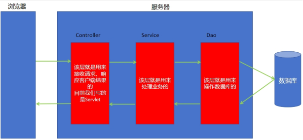

# 二、JDBC 技术
## Navicat 创建数据库
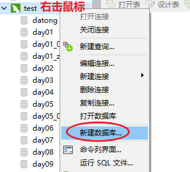

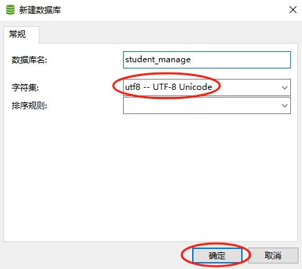

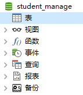

## Navicat 创建数据库表
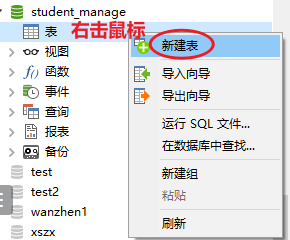

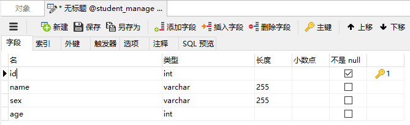

**注意：id 字段需要设置为主键、自增**

按 ctrl + s 保存，弹出下面对话框，输入表名。

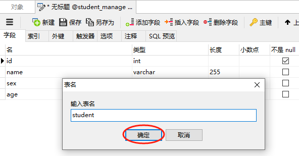

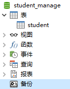

## Navicat 中编写 sql 语句
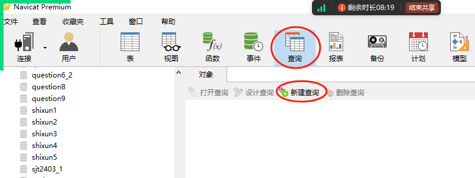

```sql
-- 给student表添加数据
insert into student values(null, '刘备', '男', 58);

-- 查询student表中所有的数据
select * from student;

-- 修改id=2的数据
update student set name='貂蝉', sex='女', age=18 where id=2;

-- 删除id=3的数据
delete from student where id=3;
```

## JDBC 介绍
JDBC 就是使用 Java 操作数据库的一门技术。

## JDBC 入门案例1
### 案例需求
使用 JDBC 能够连接到数据库。

### 创建项目
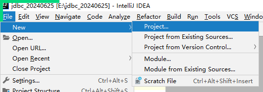

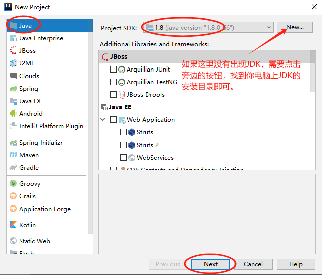

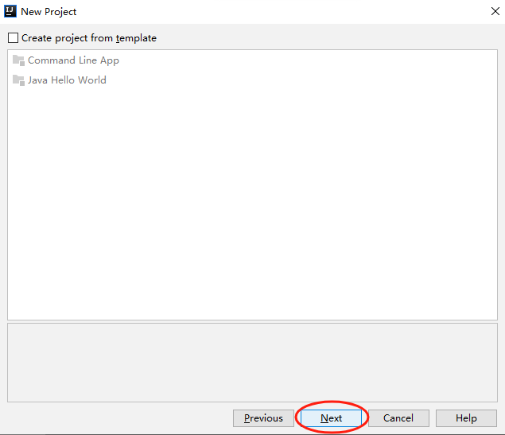

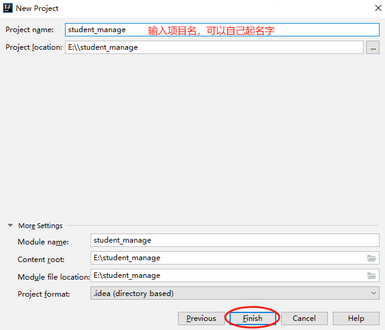


### 导入 MySQL 数据库驱动包
如果你电脑上的 MySQL 是 8.xxx 版本的，需要导入 mysql-connector-j-8.0.32.jar

如果你电脑上的 MySQL 是 5.xxx 版本的，需要导入 mysql-connector-java-5.0.5-bin.jar

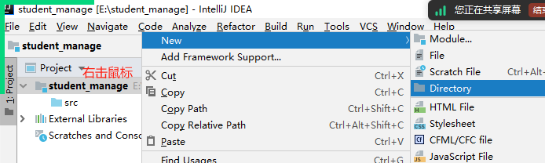

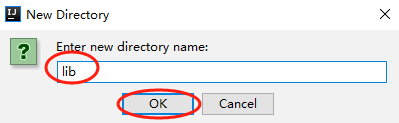

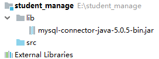

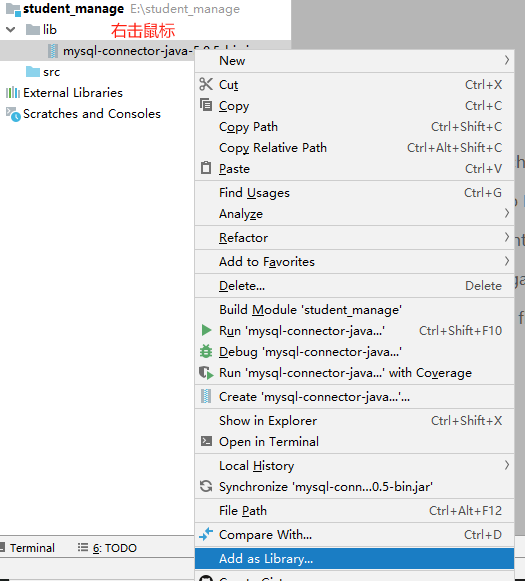

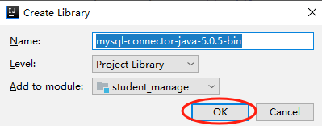

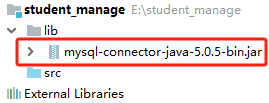

### 编写代码
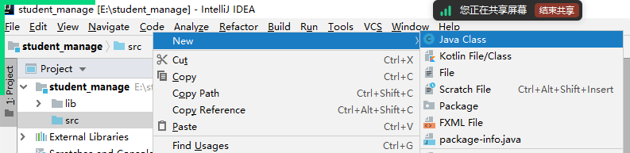

```java
package com.xszx.dao;

import java.sql.Connection;
import java.sql.DriverManager;

// 连接数据库
public class Demo1 {

    public static void main(String[] args) throws Exception{

        // 加载数据库驱动，如果是 mysql 5.xxx 版本
        Class.forName("com.mysql.jdbc.Driver");
        // 加载数据库驱动，如果是 mysql 8.xxx 版本
        // Class.forName("com.mysql.cj.jdbc.Driver");

        // 获取数据库连接，注意数据库名要写成自己的数据库名字
        String url = "jdbc:mysql://localhost:3306/student_manage?useUnicode=true&characterEncoding=utf-8";
        String user = "root";
        String password = "root"; // 注意密码改为自己数据库的密码
        Connection connection = DriverManager.getConnection(url, user, password);

        System.out.println(connection);
    }
}
```

### 运行结果
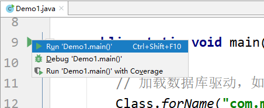

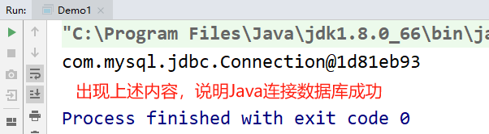

## JDBC 入门案例2
### 案例需求
使用 Java 代码从数据库表中查询所有的数据，打印到控制台。

接着上面的项目中去编写即可。

### 编写代码
```java
package com.xszx.dao;

import java.sql.Connection;
import java.sql.DriverManager;
import java.sql.PreparedStatement;
import java.sql.ResultSet;

// 从数据库中查询所有的数据，打印到控制台
public class Demo2 {

    public static void main(String[] args) throws Exception{

        // 加载数据库驱动
        Class.forName("com.mysql.jdbc.Driver");
        // Class.forName("com.mysql.cj.jdbc.Driver"); // mysql 8.xxx 要这样写

        // 获取数据库连接
        String url = "jdbc:mysql://localhost:3306/student_manage?useUnicode=true&characterEncoding=utf-8";
        String user = "root";
        String password = "root"; // 注意密码改为自己的
        Connection connection = DriverManager.getConnection(url, user, password);

        // 编写sql语句
        String sql = "select * from student";

        // 创建预编译语句对象
        PreparedStatement ps = connection.prepareStatement(sql);

        // 执行sql语句，得到一个结果集
        ResultSet rs = ps.executeQuery();

        // 使用while循环遍历结果集，打印到控制台
        while(rs.next()){
            int id = rs.getInt("id");
            String name = rs.getString("name");
            String sex = rs.getString("sex");
            int age = rs.getInt("age");
            System.out.println("id：" + id + ", name：" + name + ", sex：" + sex + ", age：" + age);
        }

        // 关闭连接
        if(connection != null){
            connection.close();
        }
    }
}
```

### 运行结果
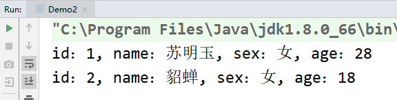

## JDBC 入门案例3
### 案例需求
实现 Java 代码将数据添加到数据库中。

### 编写代码
```java
package com.xszx.dao;

import java.sql.Connection;
import java.sql.DriverManager;
import java.sql.PreparedStatement;

// 将数据添加到数据库
public class Demo3 {

    public static void main(String[] args) throws Exception{

        // 加载数据库驱动
        Class.forName("com.mysql.jdbc.Driver");

        // 获取数据库连接
        String url = "jdbc:mysql://localhost:3306/student_manage?useUnicode=true&characterEncoding=utf-8";
        String user = "root";
        String password = "root";
        Connection connection = DriverManager.getConnection(url, user, password);

        // 编写sql语句
        String sql = "insert into student values(null, ?, ?, ?)";

        // 创建预编译语句对象
        PreparedStatement ps = connection.prepareStatement(sql);

        // 设置sql语句中的占位符
        ps.setString(1, "曹操");
        ps.setString(2, "男");
        ps.setInt(3, 28);

        // 执行sql语句，执行增删改的sql语句都是调用executeUpdate()，执行查询的sql语句调用executeQuery()
        int i = ps.executeUpdate();

        System.out.println("i = " + i);

        // 关闭数据库连接
        if(connection != null){
            connection.close();
        }
    }
}
```

### 运行结果
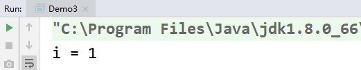

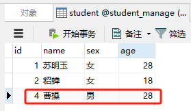

# 三、Servlet
## Tomcat 服务器
### 介绍
Tomcat 服务器是一个开源免费的 JavaEE 服务器，也就是说，后面我们写的 Java EE 项目需要放在 Tomcat 服务器中去运行。所以，我们需要将 IDEA 和 Tomcat 服务器集成在一块，方便我们写完代码后直接启动服务器运行。

### 安装
Tomcat 服务器直接解压即可使用。

### IDEA 集成 Tomcat 服务器
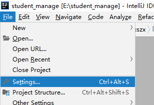

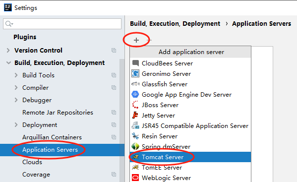

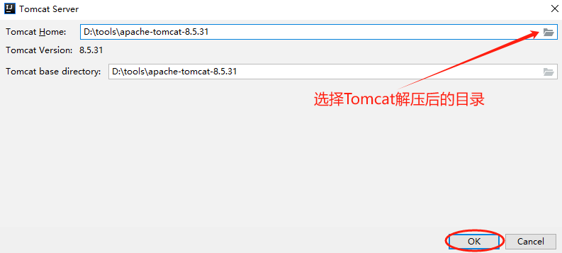

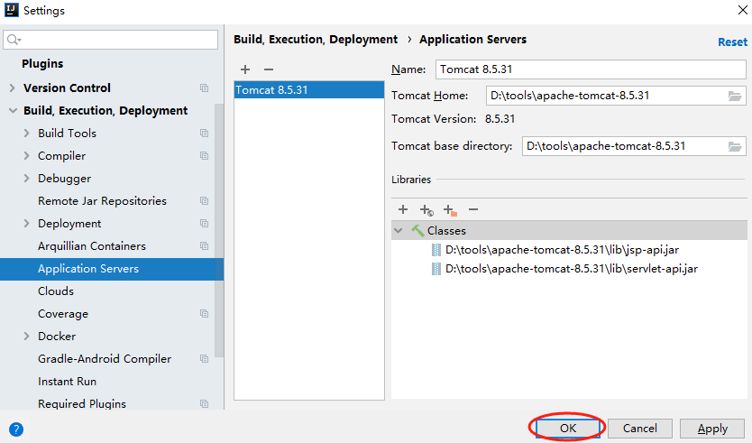

这样以后我们使用 IDEA 创建 Java EE 项目后就可以使用 Tomcat 服务器来运行项目了。

## Servlet 介绍
+ <font style="color:rgb(51,51,51);">Servlet 是 Server Applet 的简称，称为服务端小程序，用 Java 编写的服务器端程序。</font>
+ <font style="color:rgb(51,51,51);">Servlet 是 JavaWeb 的三大组件 Servlet，Filter，Listener 之一，它属于动态资源。</font>
+ <font style="color:rgb(51,51,51);">Servlet 的作用：</font>
    - <font style="color:rgb(51,51,51);">接收请求</font>
    - <font style="color:rgb(51,51,51);">处理请求</font>
    - <font style="color:rgb(51,51,51);">完成响应</font>

## **<font style="color:rgb(51,51,51);">编写 Servlet 的步骤</font>**
1. <font style="color:rgb(0,0,0);">编写一个类继承 HttpServlet</font>
2. <font style="color:rgb(0,0,0);">重写 service 方法</font>
3. <font style="color:rgb(0,0,0);">配置 Servlet 的映射路径</font>

## <font style="color:rgb(0,0,0);">Servlet 案例1</font>
### 案例需求
实现：Servlet 入门案例。

编写一个 Servlet，启动之后，浏览器发请求访问 Servlet，Servlet 给浏览器响应一句话！

### 创建 JavaEE 项目
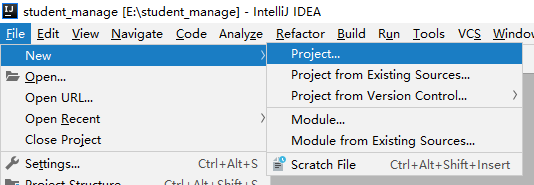

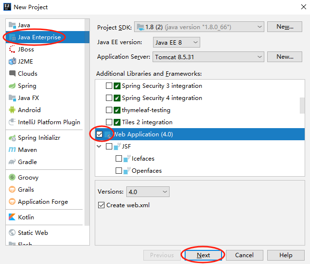

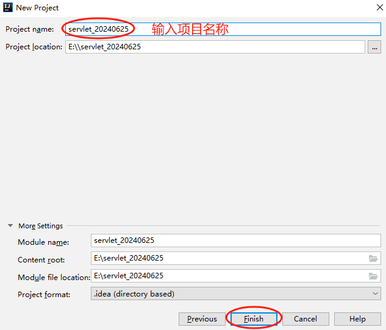

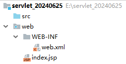

### 编写 Servlet 代码
Servlet 用来接收请求，处理请求，并响应结果给浏览器。

Servlet 需要写在 controller 包中。

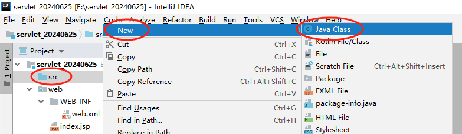

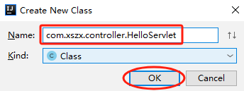

```java
package com.xszx.controller;

import javax.servlet.ServletException;
import javax.servlet.annotation.WebServlet;
import javax.servlet.http.HttpServlet;
import javax.servlet.http.HttpServletRequest;
import javax.servlet.http.HttpServletResponse;
import java.io.IOException;

@WebServlet("/hello") // 配置 Servlet 的访问路径
public class HelloServlet extends HttpServlet {

    @Override
    protected void service(HttpServletRequest req, HttpServletResponse resp) throws ServletException, IOException {
        System.out.println("servlet.......");

        // 给浏览器响应一句话
        resp.getWriter().write("hello servlet~~~");
    }
}
```

### 启动服务器
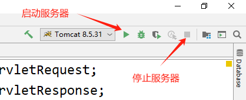

启动服务器后，IDEA 会打开浏览器，并出现如下网址：

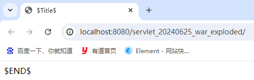

然后我们接着网址路径后面写访问我们 Servlet 的路径：

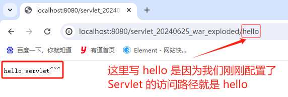

### 问题解决
启动会报如下错误：

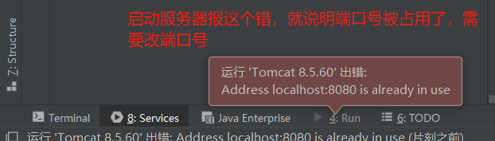

原因：Tomcat 服务器的 8080 端口号被占用了。

解决：修改 Tomcat 服务器的端口号：

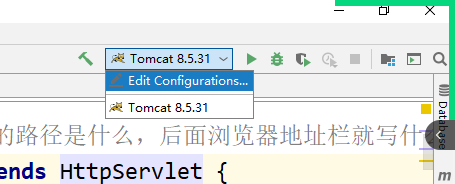

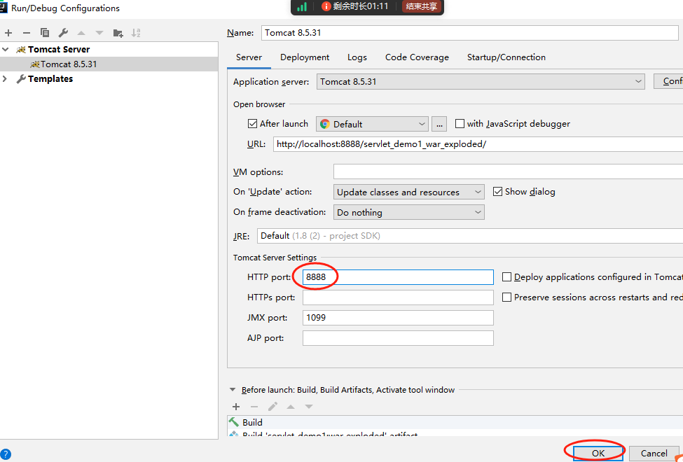

## Servlet 案例2
### 案例需求
实现：Servlet 接收请求参数，并响应结果给浏览器；另外设置请求与响应的编码方式。

### 编写 Servlet
```java
package com.xszx.controller;

import javax.servlet.ServletException;
import javax.servlet.annotation.WebServlet;
import javax.servlet.http.HttpServlet;
import javax.servlet.http.HttpServletRequest;
import javax.servlet.http.HttpServletResponse;
import java.io.IOException;

@WebServlet("/hello2")
public class HelloServlet2 extends HttpServlet {

    @Override
    protected void service(HttpServletRequest req, HttpServletResponse resp) throws ServletException, IOException {

        // 1. 设置编码方式
        req.setCharacterEncoding("utf-8");
        resp.setCharacterEncoding("utf-8");
        resp.setContentType("text/html;characterEncoding=utf-8");

        // 2. 获取请求参数
        String name = req.getParameter("name");

        // 3. 给浏览器输入一句话
        resp.getWriter().write("hello, " + name);
    }
}
```

### 启动服务器访问
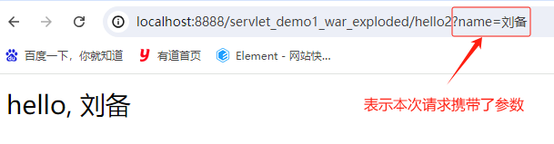

## Servlet 案例3
### 案例需求
实现：Servlet 将请求转发到 jsp 页面。

### 编写 Servlet
```java
package com.xszx.controller;

import javax.servlet.ServletException;
import javax.servlet.annotation.WebServlet;
import javax.servlet.http.HttpServlet;
import javax.servlet.http.HttpServletRequest;
import javax.servlet.http.HttpServletResponse;
import java.io.IOException;

@WebServlet("/hello3")
public class HelloServlet3 extends HttpServlet {

    @Override
    protected void service(HttpServletRequest req, HttpServletResponse resp) throws ServletException, IOException {
        // 设置编码
        req.setCharacterEncoding("utf-8");
        resp.setCharacterEncoding("utf-8");
        resp.setContentType("text/html;charset=utf-8");

        // 将请求转发到 success.jsp 页面，浏览器就能看到这个页面中的内容了！
        req.getRequestDispatcher("success.jsp").forward(req, resp);
    }
}
```

### 编写页面
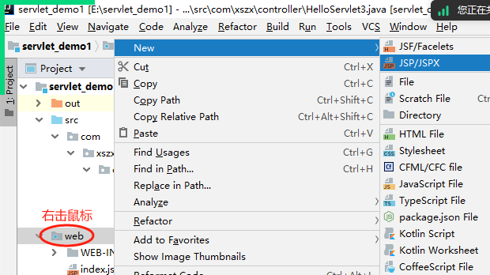

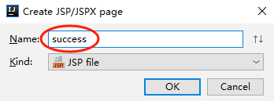

```html
<%@ page contentType="text/html;charset=UTF-8" language="java" %>
<html>
<head>
    <title>Title</title>
</head>
<body>
    <h1>哈哈</h1>
    <h3>你好坏！</h3>
    <a href="https://www.baidu.com">点我跳转到百度</a>
</body>
</html>
```

### 启动服务器访问
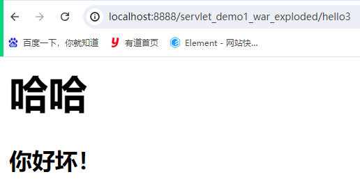

## Servlet 案例4
### 案例需求
实现：Servlet 将请求转发到 jsp 页面，并在 request 域对象中携带简单数据，将数据展示在页面中。

### 编写 Servlet
```java
package com.xszx.controller;

import javax.servlet.ServletException;
import javax.servlet.annotation.WebServlet;
import javax.servlet.http.HttpServlet;
import javax.servlet.http.HttpServletRequest;
import javax.servlet.http.HttpServletResponse;
import java.io.IOException;

@WebServlet("/hello4")
public class HelloServlet4 extends HttpServlet {

    @Override
    protected void service(HttpServletRequest req, HttpServletResponse resp) throws ServletException, IOException {
        
        // 设置编码方式
        req.setCharacterEncoding("utf-8");
        resp.setCharacterEncoding("utf-8");
        resp.setContentType("text/html;charset=utf-8");
        
        // 往 request 域对象中放一些数据
        req.setAttribute("name", "周芷若");
        
        // 将请求转发到 demo1.jsp 页面
        req.getRequestDispatcher("demo1.jsp").forward(req, resp);
    }
}
```

### 编写页面
```html
<%@ page contentType="text/html;charset=UTF-8" language="java" %>
<html>
<head>
    <title>Title</title>
</head>
<body>
    <%-- ${xxx} 可以从域对象中根据键取值 --%>
    你好，${name}!
</body>
</html>
```

### 启动服务器访问
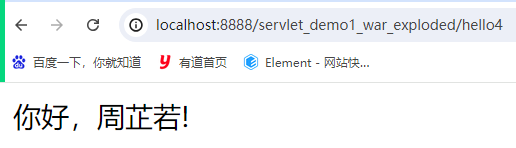

jsp 页面就是负责展示数据的！

## Servlet 案例5
### 案例需求
实现：Servlet 将请求转发到 jsp 页面，并在 request 域对象中携带对象数据，将数据展示在页面中。

### 编写实体类
#### 编写实体类属性
```java
package com.xszx.bean;

public class Student {
    private Integer id;
    private String name;
    private String sex;
    private Integer age;
}
```

#### 生成无参构造方法
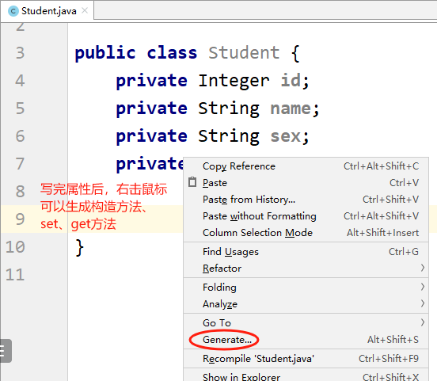

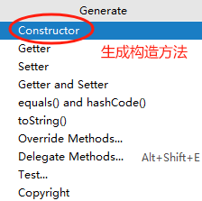

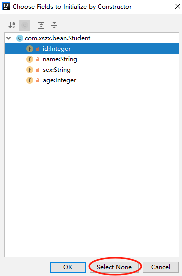

#### 生成有参构造方法
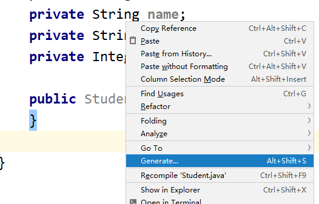


#### 生成 set、get 方法


#### 最终实体类效果
```java
package com.xszx.bean;

public class Student {
    private Integer id;
    private String name;
    private String sex;
    private Integer age;

    public Student() {
    }

    public Student(Integer id, String name, String sex, Integer age) {
        this.id = id;
        this.name = name;
        this.sex = sex;
        this.age = age;
    }

    public Integer getId() {
        return id;
    }

    public void setId(Integer id) {
        this.id = id;
    }

    public String getName() {
        return name;
    }

    public void setName(String name) {
        this.name = name;
    }

    public String getSex() {
        return sex;
    }

    public void setSex(String sex) {
        this.sex = sex;
    }

    public Integer getAge() {
        return age;
    }

    public void setAge(Integer age) {
        this.age = age;
    }
}
```

### 编写 Servlet
```java
package com.xszx.controller;

import com.xszx.bean.Student;

import javax.servlet.ServletException;
import javax.servlet.http.HttpServlet;
import javax.servlet.http.HttpServletRequest;
import javax.servlet.http.HttpServletResponse;
import java.io.IOException;

public class HelloServlet5 extends HttpServlet {

    @Override
    protected void service(HttpServletRequest req, HttpServletResponse resp) throws ServletException, IOException {
        // 设置编码方式
        req.setCharacterEncoding("utf-8");
        resp.setCharacterEncoding("utf-8");
        resp.setContentType("text/html;charset=utf-8");

        // 创建 Student 对象
        Student student = new Student(1, "吕布", "男", 28);

        // 往request域对象中放入一个学生对象
        req.setAttribute("student", student);

        // 将请求转发到 demo2.jsp 页面
        req.getRequestDispatcher("demo2.jsp").forward(req, resp);
    }
}
```

### 编写页面
```html
<%@ page contentType="text/html;charset=UTF-8" language="java" %>
<html>
<head>
    <title>Title</title>
</head>
<body>
    <p>学生编号：${student.id}</p>
    <p>学生姓名：${student.name}</p>
    <p>学生性别：${student.sex}</p>
    <p>学生年龄：${student.age}</p>
</body>
</html>
```

### 启动服务器访问


## Servlet 案例6
### 案例需求
实现：Servlet 将请求转发到 jsp 页面，并在 request 域对象中携带集合数据，将数据通过 jstl 标签循环展示在页面的表格中。

### 导入 jar 包


然后给 lib 中粘贴我们用的 jar 包。


让 jar 包生效：


### 编写 Servlet
```java
package com.xszx.controller;

import com.xszx.bean.Student;
import javax.servlet.ServletException;
import javax.servlet.annotation.WebServlet;
import javax.servlet.http.HttpServlet;
import javax.servlet.http.HttpServletRequest;
import javax.servlet.http.HttpServletResponse;
import java.io.IOException;
import java.util.ArrayList;
import java.util.List;

@WebServlet("/hello6")
public class HelloServlet6 extends HttpServlet {

    @Override
    protected void service(HttpServletRequest req, HttpServletResponse resp) throws ServletException, IOException {
        // 设置编码方式
        req.setCharacterEncoding("utf-8");
        resp.setCharacterEncoding("utf-8");
        resp.setContentType("text/html;charset=utf-8");

        // 创建一个List集合，往集合中放入许多学生对象
        List<Student> list = new ArrayList<>();
        list.add(new Student(1, "张无忌", "男", 26));
        list.add(new Student(2, "赵敏", "女", 18));
        list.add(new Student(3, "周芷若", "女", 22));
        list.add(new Student(4, "蛛儿", "女", 19));

        // 将list集合放入request域对象中
        req.setAttribute("list", list);

        // 将请求转发到 demo3.jsp 页面
        req.getRequestDispatcher("demo3.jsp").forward(req, resp);
    }
}
```

### 编写页面
```html
<%@ page contentType="text/html;charset=UTF-8" language="java" %>

<%-- 引入 jstl 标签库 --%>
<%@taglib prefix="c" uri="http://java.sun.com/jsp/jstl/core" %>
<html>
<head>
    <title>Title</title>
</head>
<body>
    <!-- table 表格标签 -->
    <table border="1">
        <!-- tr 表示行标签 -->
        <tr>
            <!-- td 表示单元格标签 -->
            <td>编号</td>
            <td>姓名</td>
            <td>性别</td>
            <td>年龄</td>
        </tr>

        <!--
            c:forEach 就是循环标签，可以循环集合
            items 表示你要循环集合是谁
            var 表示每次循环得到的数据赋值给哪个变量
        -->
        <c:forEach items="${list}" var="s">
            <tr>
                <td>${s.id}</td>
                <td>${s.name}</td>
                <td>${s.sex}</td>
                <td>${s.age}</td>
            </tr>
        </c:forEach>
    </table>
</body>
</html>
```

### 启动服务器访问


# 四、课题-基于 JavaEE 的商城项目
## 项目介绍
+ <font style="color:rgb(51, 51, 51);">该商城是一个全品类的电商购物网站（B2C）</font>
+ <font style="color:rgb(51, 51, 51);">用户可以在线购买商品、加入购物车、下单、支付</font>
+ <font style="color:rgb(51, 51, 51);">用户可以对商品进行点赞以及评论已购买商品</font>
+ <font style="color:rgb(51, 51, 51);">管理员可以在后台管理商品的上下架、促销活动</font>
+ <font style="color:rgb(51, 51, 51);">管理员可以监控商品销售状况</font>
+ <font style="color:rgb(51, 51, 51);">客服可以在后台处理退款操作</font>
+ <font style="color:rgb(51, 51, 51);">希望未来 3 到 5 年可以支持千万用户的使用</font>

## <font style="color:rgb(51, 51, 51);">项目效果</font>


等等。

## 技术选型
### 前端技术
+ HTML：用于表示页面的结构，使用它里面常用的标签，比如：div、a、img 标签等等
+ CSS：用于给页面加样式，对页面进行美化
+ JavaScript：用于给页面加一些动作行为，比如：购物车数量的加减、总金额的计算等等
+ JSP：本质上是 Servlet，是一个动态的网页技术，可以动态展示后端传递的数据

### 后端技术
+ Servlet：服务端小程序，用于接收请求、响应结果
+ JDBC：用户操作数据库，对于数据库进行增删改查的操作

## 开发环境
+ IDEA：2019
+ JDK：1.8
+ MySQL：5.6
+ Tomcat：8.5

## 数据库设计
### 分析


分析页面中商品信息，我们需要设计一张商品表 goods，字段应该有：

| 字段名称 | 字段类型 | 说明 |
| --- | --- | --- |
| id | int | 主键、自增，商品编号 |
| name | varchar | 商品名称 |
| original_price | int | 原价 |
| current_price | int | 现价 |
| picture | varchar | 商品图片的路径 |
| create_date | date | 创建日期 |


### 创建数据库及表


## 功能实现
### 创建 JavaEE 项目


### 导入 jar 包
**在 WEB-INF 文件夹中创建 lib 文件夹：**


**粘贴我们用的 3 个 jar 包到 lib 文件夹：**


**使 jar 包生效：**


**jar 包变成下图效果，说明生效：**


### 导入静态资源
将我们每个人选择的模板页面及资源复制粘贴到项目的 **web** 目录中。


最终效果：


### 编写实体类
实体类写在 com.xszx.bean 包中。

#### 编写实体类属性
```java
package com.xszx.bean;

import java.util.Date;

public class Goods {

    private Integer id;
    private String name;
    private Integer originalPrice;
    private Integer currentPrice;
    private String picture;
    private Date createDate;
}
```

#### 生成 set、get 方法


#### 最终效果
```java
package com.xszx.bean;

import java.util.Date;

public class Goods {

    private Integer id;
    private String name;
    private Integer originalPrice;
    private Integer currentPrice;
    private String picture;
    private Date createDate;

    public Integer getId() {
        return id;
    }

    public void setId(Integer id) {
        this.id = id;
    }

    public String getName() {
        return name;
    }

    public void setName(String name) {
        this.name = name;
    }

    public Integer getOriginalPrice() {
        return originalPrice;
    }

    public void setOriginalPrice(Integer originalPrice) {
        this.originalPrice = originalPrice;
    }

    public Integer getCurrentPrice() {
        return currentPrice;
    }

    public void setCurrentPrice(Integer currentPrice) {
        this.currentPrice = currentPrice;
    }

    public String getPicture() {
        return picture;
    }

    public void setPicture(String picture) {
        this.picture = picture;
    }

    public Date getCreateDate() {
        return createDate;
    }

    public void setCreateDate(Date createDate) {
        this.createDate = createDate;
    }
}
```

### 编写 dao 层代码
```java
package com.xszx.dao;

import com.xszx.bean.Goods;

import java.sql.*;
import java.util.ArrayList;
import java.util.List;

public class GoodsDao {

    public List<Goods> findAll(){
        Connection connection = null;
        List<Goods> list = null;
        try {
            // 加载数据库驱动
            Class.forName("com.mysql.jdbc.Driver");

            // 获取数据库连接, 数据库名称要改为自己的
            String url = "jdbc:mysql://localhost:3306/sxkj?useUnicode=true&characterEncoding=utf-8";
            String user = "root";
            String password = "root"; // 密码要改为自己的
            connection = DriverManager.getConnection(url, user, password);

            // 编写sql语句
            String sql = "select * from goods order by create_date desc limit 8";

            // 创建预编译语句对象
            PreparedStatement ps = connection.prepareStatement(sql);

            // 执行sql语句，得到结果集
            ResultSet rs = ps.executeQuery();

            // 遍历结果集，封装数据到list集合中
            list = new ArrayList<>();
            while(rs.next()){
                Goods goods = new Goods();
                goods.setId(rs.getInt("id"));
                goods.setName(rs.getString("name"));
                goods.setOriginalPrice(rs.getInt("original_price"));
                goods.setCurrentPrice(rs.getInt("current_price"));
                goods.setPicture(rs.getString("picture"));
                goods.setCreateDate(rs.getDate("create_date"));
                list.add(goods);
            }
        } catch (ClassNotFoundException e) {
            e.printStackTrace();
        } catch (SQLException e) {
            e.printStackTrace();
        } finally {
            // 关闭连接
            if(connection != null){
                try {
                    connection.close();
                } catch (SQLException e) {
                    e.printStackTrace();
                }
            }
        }

        return list;
    }
}
```

### 编写 controller 层代码
```java
package com.xszx.controller;

import com.xszx.bean.Goods;
import com.xszx.dao.GoodsDao;

import javax.servlet.ServletException;
import javax.servlet.annotation.WebServlet;
import javax.servlet.http.HttpServlet;
import javax.servlet.http.HttpServletRequest;
import javax.servlet.http.HttpServletResponse;
import java.io.IOException;
import java.util.List;

@WebServlet("/findAll")
public class FindAllServlet extends HttpServlet {

    @Override
    protected void service(HttpServletRequest req, HttpServletResponse resp) throws ServletException, IOException {

        // 设置编码方式，防止中文乱码
        req.setCharacterEncoding("utf-8");
        resp.setContentType("text/html;charset=utf-8");
        resp.setCharacterEncoding("utf-8");

        // 调用 dao 层方法
        GoodsDao goodsDao = new GoodsDao();
        List<Goods> list = goodsDao.findAll();

        // 将数据放入到 request 域对象中
        req.setAttribute("list", list);

        // 将请求转发到 index.jsp 页面
        req.getRequestDispatcher("index.jsp").forward(req, resp);
    }
}
```

### 删除页面及更改后缀
删除原有的 index.jsp 页面。


修改 index.html 文件的后缀，改为 index.jsp


### 修改页面代码
在 index.jsp 页面中顶部加入下面两行代码：

```html
<%@ page contentType="text/html;charset=UTF-8" language="java" %>
<%@ taglib prefix="c" uri="http://java.sun.com/jsp/jstl/core" %>
```


删除多余的 li 元素：


使用 c:forEach 循环展示数据：

```html
<c:forEach items="${list}" var="g">
  <li class="product design">
    <a href="#">
      
      <h5>${g.name}</h5>
      <span class="price"><del>￥${g.originalPrice}</del>￥${g.currentPrice}</span>
    </a>
    <div class="wishlist-box">
      <a href="#"><i class="fa fa-arrows-alt"></i></a>
      <a href="#"><i class="fa fa-heart-o"></i></a>
      <a href="#"><i class="fa fa-search"></i></a>
    </div>
    <a href="#" class="addto-cart" title="Add To Cart">加入购物车</a>
  </li><!-- Product /- -->
</c:forEach>
```

images/product-1.jpg

### 数据库插入测试数据


### 启动服务器访问


# 五、提交的资料
## 项目源码


将项目复制到桌面，然后将项目打包，比如：xxx.zip、xxx.rar

## 数据库文件


## 实训报告\答辩的 PPT
如果学校发了《实训报告》，那我们就只需要写好《实训报告》，根据它答辩就行。

如果学校没发《实训报告》，那需要每个同学写一份答辩的 PPT。包含但不限于：项目背景、项目介绍、技术选型、实现功能、遇到的问题及解决办法、总结、感悟、心得等等。


> 更新: 2024-06-28 18:06:12  
> 原文: <https://www.yuque.com/u41736172/az9urv/oq6hzg9uyy5anoy9>