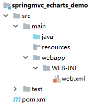
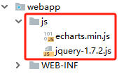
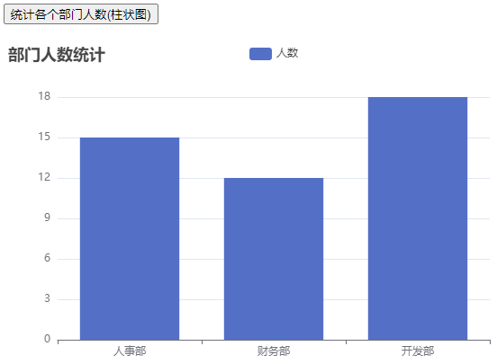
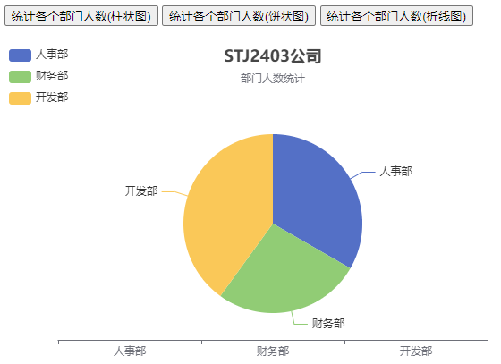
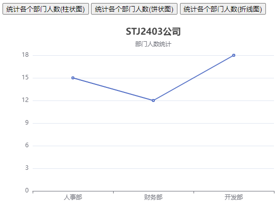
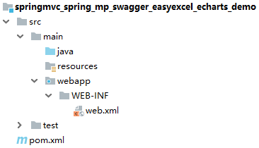
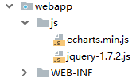

# Echarts & 综合案例

# 一、Echarts
## 概述
<font style="color:rgb(51, 51, 51);">ECharts，一个使用 JavaScript 实现的开源可视化库，可以流畅的运行在 PC 和移动设备上，兼容当前绝大部分浏览器（IE8/9/10/11，Chrome，Firefox，Safari 等），底层依赖矢量图形库 </font>ZRender<font style="color:rgb(51, 51, 51);">，提供直观，交互丰富，可高度个性化定制的数据可视化图表。</font>

<font style="color:rgb(51, 51, 51);">Echarts官网：</font>[https://echarts.apache.org/zh/index.html](https://echarts.apache.org/zh/index.html)

<font style="color:rgb(51, 51, 51);">ECharts 提供了常规的折线图、柱状图、 散点图、饼图、K线图，用于统计的盒形图 ，用于地理数据可视化的地图、热力图、线图，用于关系数据可视化的关系图 、treemap、旭日图，多维数据可视化的平行坐标，还有用于BI的漏斗图， 仪表盘，并且支持图与图之间的混搭。</font>

<font style="color:rgb(51, 51, 51);">可以从官网点击快速入门，快速学习和了解 Echarts 使用。也可以通过查看“所有示例”，查询 Echarts 提供的功能图表。</font>


## 静态资源
使用 Echarts 需要导入下面的静态资源：

+ jquery.js
+ echarts.min.js

## 案例
### 需求说明
使用 SpringMVC + Echarts，实现对部门人数的统计(静态数据)，分别使用柱状图、饼状图、折线图来展示各个部门的人数信息。

### 环境准备
#### 创建 Maven 项目
创建一个 Maven web 项目，打包方式为 war 包，修改目录结构。



#### 添加依赖
```xml
<?xml version="1.0" encoding="UTF-8"?>
<project xmlns="http://maven.apache.org/POM/4.0.0"
         xmlns:xsi="http://www.w3.org/2001/XMLSchema-instance"
         xsi:schemaLocation="http://maven.apache.org/POM/4.0.0 http://maven.apache.org/xsd/maven-4.0.0.xsd">
    <modelVersion>4.0.0</modelVersion>

    <groupId>com.xszx</groupId>
    <artifactId>springmvc_echarts_demo</artifactId>
    <version>1.0-SNAPSHOT</version>
    <packaging>war</packaging>

    <dependencies>
        <!-- SpringMVC -->
        <dependency>
            <groupId>org.springframework</groupId>
            <artifactId>spring-webmvc</artifactId>
            <version>5.3.1</version>
        </dependency>

        <!-- ServletAPI -->
        <dependency>
            <groupId>javax.servlet</groupId>
            <artifactId>javax.servlet-api</artifactId>
            <version>3.1.0</version>
            <scope>provided</scope>
        </dependency>

        <dependency>
            <groupId>org.projectlombok</groupId>
            <artifactId>lombok</artifactId>
            <version>1.18.26</version>
        </dependency>

        <dependency>
            <groupId>com.fasterxml.jackson.core</groupId>
            <artifactId>jackson-databind</artifactId>
            <version>2.9.8</version>
        </dependency>
    </dependencies>

    <build>
        <plugins>
            <plugin>
                <groupId>org.apache.tomcat.maven</groupId>
                <artifactId>tomcat7-maven-plugin</artifactId>
                <version>2.2</version>
                <configuration>
                    <port>8080</port>
                    <path>/</path>
                    <uriEncoding>UTF-8</uriEncoding>
                    <server>tomcat7</server>
                </configuration>
            </plugin>
        </plugins>
    </build>
</project>
```

#### 编写 SpringMVC 配置文件
```xml
<?xml version="1.0" encoding="UTF-8"?>
<beans xmlns="http://www.springframework.org/schema/beans"
       xmlns:xsi="http://www.w3.org/2001/XMLSchema-instance"
       xmlns:context="http://www.springframework.org/schema/context"
       xmlns:mvc="http://www.springframework.org/schema/mvc"
       xsi:schemaLocation="http://www.springframework.org/schema/beans
  http://www.springframework.org/schema/beans/spring-beans.xsd
  http://www.springframework.org/schema/context
  https://www.springframework.org/schema/context/spring-context.xsd
  http://www.springframework.org/schema/mvc
  https://www.springframework.org/schema/mvc/spring-mvc.xsd">

    <!-- 配置扫描 -->
    <context:component-scan base-package="com.xszx.controller"></context:component-scan>

    <!-- 配置注解驱动 -->
    <mvc:annotation-driven></mvc:annotation-driven>

    <mvc:default-servlet-handler></mvc:default-servlet-handler>
</beans>
```

#### 编写 web.xml 配置文件
```xml
<?xml version="1.0" encoding="UTF-8"?>
<web-app xmlns="http://xmlns.jcp.org/xml/ns/javaee"
         xmlns:xsi="http://www.w3.org/2001/XMLSchema-instance"
         xsi:schemaLocation="http://xmlns.jcp.org/xml/ns/javaee
        http://xmlns.jcp.org/xml/ns/javaee/web-app_4_0.xsd"
         version="4.0">

    <servlet>
        <servlet-name>dispatcherServlet</servlet-name>
        <servlet-class>org.springframework.web.servlet.DispatcherServlet</servlet-class>
        <init-param>
            <param-name>contextConfigLocation</param-name>
            <param-value>classpath:springMVC.xml</param-value>
        </init-param>
        <load-on-startup>1</load-on-startup>
    </servlet>

    <servlet-mapping>
        <servlet-name>dispatcherServlet</servlet-name>
        <url-pattern>/</url-pattern>
    </servlet-mapping>
</web-app>
```

#### 导入静态资源


#### 编写实体类
```java
package com.xszx.bean;

import lombok.AllArgsConstructor;
import lombok.Data;
import lombok.NoArgsConstructor;

@Data
@AllArgsConstructor
@NoArgsConstructor
public class DeptStat {

    private String deptName; // 部门名称
    private Integer count; // 部门人数
}
```

### 柱状图案例
#### 编写 controller 层代码
```java
package com.xszx.controller;

import com.xszx.bean.DeptStat;
import org.springframework.stereotype.Controller;
import org.springframework.web.bind.annotation.GetMapping;
import org.springframework.web.bind.annotation.RequestMapping;
import org.springframework.web.bind.annotation.ResponseBody;
import java.util.ArrayList;
import java.util.List;

@Controller
@RequestMapping("dept")
public class DeptController {

    // 获取部门统计数据
    @GetMapping("getDeptStatData")
    @ResponseBody
    public List<DeptStat> getDeptStatData(){
        List<DeptStat> list = new ArrayList<>();
        list.add(new DeptStat("人事部", 15));
        list.add(new DeptStat("财务部", 12));
        list.add(new DeptStat("开发部", 18));
        return list;
    }
}
```

#### 编写页面代码
```html
<!DOCTYPE html>
<html lang="en">
<head>
    <meta charset="UTF-8">
    <title>Title</title>
    <script src="js/jquery-1.7.2.js"></script>
    <script src="js/echarts.min.js"></script>
    <script>
        $(function(){
            $('#btn1').click(function(){
                $.get('dept/getDeptStatData', {}, function(res){
                    console.log(res);

                    var xdata = [];
                    var ydata = [];

                    for(var i = 0; i < res.length; i++){
                        xdata[i] = res[i].deptName;
                        ydata[i] = res[i].count;
                    }

                    // 基于准备好的dom，初始化echarts实例
                    var myChart = echarts.init(document.getElementById('main'));

                    // 指定图表的配置项和数据
                    var option = {
                        title: {
                            text: '部门人数统计'
                        },
                        tooltip: {},
                        legend: {
                            data: ['人数']
                        },
                        xAxis: {
                            data: xdata
                        },
                        yAxis: {},
                        series: [
                            {
                                name: '人数',
                                type: 'bar',
                                data: ydata
                            }
                        ]
                    };

                    // 使用刚指定的配置项和数据显示图表。
                    myChart.setOption(option);
                }, 'json');
            });
        })
    </script>
</head>
<body>
    <button id="btn1">统计各个部门人数(柱状图)</button>
    <br><br>

    <div id="main" style="width: 600px; height: 400px">

    </div>
</body>
</html>
```

#### 启动运行


### 饼状图案例
#### 编写页面代码
```html
<!DOCTYPE html>
<html lang="en">
<head>
    <meta charset="UTF-8">
    <title>Title</title>
    <script src="js/jquery-1.7.2.js"></script>
    <script src="js/echarts.min.js"></script>
    <script>
        $(function(){
            $('#btn1').click(function(){
                $.get('dept/getDeptStatData', {}, function(res){
                    console.log(res);

                    var xdata = [];
                    var ydata = [];

                    for(var i = 0; i < res.length; i++){
                        xdata[i] = res[i].deptName;
                        ydata[i] = res[i].count;
                    }

                    // 基于准备好的dom，初始化echarts实例
                    var myChart = echarts.init(document.getElementById('main'));

                    // 指定图表的配置项和数据
                    var option = {
                        title: {
                            text: '部门人数统计'
                        },
                        tooltip: {},
                        legend: {
                            data: ['人数']
                        },
                        xAxis: {
                            data: xdata
                        },
                        yAxis: {},
                        series: [
                            {
                                name: '人数',
                                type: 'bar',
                                data: ydata
                            }
                        ]
                    };

                    // 使用刚指定的配置项和数据显示图表。
                    myChart.setOption(option);
                }, 'json');
            });

            $('#btn2').click(function(){
                $.get('dept/getDeptStatData', {}, function(res){

                    var xdata = [];
                    var ydata = [];
                    for(var i = 0; i < res.length; i++){
                        xdata[i] = res[i].deptName;
                        ydata[i] = {value: res[i].count, name: res[i].deptName};
                    }

                    // 基于准备好的dom，初始化echarts实例
                    var myChart = echarts.init(document.getElementById('main'));

                    option = {
                        title: {
                            text: 'STJ2403公司',
                            subtext: '部门人数统计',
                            left: 'center'
                        },
                        tooltip: {
                            trigger: 'item'
                        },
                        legend: {
                            orient: 'vertical',
                            left: 'left'
                        },
                        series: [
                            {
                                // name: 'Access From',
                                type: 'pie',
                                radius: '50%',
                                data: ydata,
                                emphasis: {
                                    itemStyle: {
                                        shadowBlur: 10,
                                        shadowOffsetX: 0,
                                        shadowColor: 'rgba(0, 0, 0, 0.5)'
                                    }
                                }
                            }
                        ]
                    };

                    // 使用刚指定的配置项和数据显示图表。
                    myChart.setOption(option);
                }, 'json');
            });
        })
    </script>
</head>
<body>
    <button id="btn1">统计各个部门人数(柱状图)</button>
    <button id="btn2">统计各个部门人数(饼状图)</button>
    <br><br>

    <div id="main" style="width: 600px; height: 400px">

    </div>
</body>
</html>
```

#### 效果图


### 折线图案例
#### 编写页面代码
```html
<!DOCTYPE html>
<html lang="en">
<head>
    <meta charset="UTF-8">
    <title>Title</title>
    <script src="js/jquery-1.7.2.js"></script>
    <script src="js/echarts.min.js"></script>
    <script>
        $(function(){
            $('#btn1').click(function(){
                $.get('dept/getDeptStatData', {}, function(res){
                    console.log(res);

                    var xdata = [];
                    var ydata = [];

                    for(var i = 0; i < res.length; i++){
                        xdata[i] = res[i].deptName;
                        ydata[i] = res[i].count;
                    }

                    // 基于准备好的dom，初始化echarts实例
                    var myChart = echarts.init(document.getElementById('main'));

                    // 指定图表的配置项和数据
                    var option = {
                        title: {
                            text: '部门人数统计'
                        },
                        tooltip: {},
                        legend: {
                            data: ['人数']
                        },
                        xAxis: {
                            data: xdata
                        },
                        yAxis: {},
                        series: [
                            {
                                name: '人数',
                                type: 'bar',
                                data: ydata
                            }
                        ]
                    };

                    // 使用刚指定的配置项和数据显示图表。
                    myChart.setOption(option);
                }, 'json');
            });

            $('#btn2').click(function(){
                $.get('dept/getDeptStatData', {}, function(res){

                    var xdata = [];
                    var ydata = [];
                    for(var i = 0; i < res.length; i++){
                        xdata[i] = res[i].deptName;
                        ydata[i] = {value: res[i].count, name: res[i].deptName};
                    }

                    // 基于准备好的dom，初始化echarts实例
                    var myChart = echarts.init(document.getElementById('main'));

                    option = {
                        title: {
                            text: 'STJ2403公司',
                            subtext: '部门人数统计',
                            left: 'center'
                        },
                        tooltip: {
                            trigger: 'item'
                        },
                        legend: {
                            orient: 'vertical',
                            left: 'left'
                        },
                        series: [
                            {
                                // name: 'Access From',
                                type: 'pie',
                                radius: '50%',
                                data: ydata,
                                emphasis: {
                                    itemStyle: {
                                        shadowBlur: 10,
                                        shadowOffsetX: 0,
                                        shadowColor: 'rgba(0, 0, 0, 0.5)'
                                    }
                                }
                            }
                        ]
                    };

                    // 使用刚指定的配置项和数据显示图表。
                    myChart.setOption(option);
                }, 'json');
            });

            $('#btn3').click(function(){
                $.get('dept/getDeptStatData', {}, function(res){

                    var xdata = [];
                    var ydata = [];

                    for(var i = 0; i < res.length; i++){
                        xdata[i] = res[i].deptName;
                        ydata[i] = res[i].count;
                    }

                    // 基于准备好的dom，初始化echarts实例
                    var myChart = echarts.init(document.getElementById('main'));

                    option = {
                        xAxis: {
                            type: 'category',
                            data: xdata
                        },
                        yAxis: {
                            type: 'value'
                        },
                        series: [
                            {
                                data: ydata,
                                type: 'line'
                            }
                        ]
                    };

                    // 使用刚指定的配置项和数据显示图表。
                    myChart.setOption(option);
                }, 'json');
            });
        })
    </script>
</head>
<body>
    <button id="btn1">统计各个部门人数(柱状图)</button>
    <button id="btn2">统计各个部门人数(饼状图)</button>
    <button id="btn3">统计各个部门人数(折线图)</button>
    <br><br>

    <div id="main" style="width: 600px; height: 400px">

    </div>
</body>
</html>
```

#### 效果图


# 二、综合案例
## 需求说明
整合 SpringMVC + Spring + MP + Thymeleaf + EasyExcel + Swagger + Echarts，实现增删改查、导入导出、图片上传、图表统计等功能。

## 创建数据库及表
```sql
DROP TABLE IF EXISTS `dept`;
CREATE TABLE `dept` (
  `did` int(11) NOT NULL AUTO_INCREMENT,
  `dname` varchar(255) DEFAULT NULL,
  PRIMARY KEY (`did`)
) ENGINE=InnoDB AUTO_INCREMENT=4 DEFAULT CHARSET=utf8;

INSERT INTO `dept` VALUES ('1', '人事部');
INSERT INTO `dept` VALUES ('2', '财务部');
INSERT INTO `dept` VALUES ('3', '开发部');

DROP TABLE IF EXISTS `emp`;
CREATE TABLE `emp` (
  `id` bigint(20) NOT NULL,
  `name` varchar(255) DEFAULT NULL,
  `sex` varchar(255) DEFAULT NULL,
  `age` int(11) DEFAULT NULL,
  `birthday` date DEFAULT NULL,
  `hobby` varchar(255) DEFAULT NULL,
  `photo` varchar(255) DEFAULT NULL,
  `did` int(11) DEFAULT NULL,
  PRIMARY KEY (`id`)
) ENGINE=InnoDB DEFAULT CHARSET=utf8;
```

## 项目搭建
### 创建 Maven 项目


### 添加依赖
```xml
<?xml version="1.0" encoding="UTF-8"?>
<project xmlns="http://maven.apache.org/POM/4.0.0"
         xmlns:xsi="http://www.w3.org/2001/XMLSchema-instance"
         xsi:schemaLocation="http://maven.apache.org/POM/4.0.0 http://maven.apache.org/xsd/maven-4.0.0.xsd">
    <modelVersion>4.0.0</modelVersion>

    <groupId>com.xszx</groupId>
    <artifactId>springmvc_spring_mp_swagger_easyexcel_echarts_demo</artifactId>
    <version>1.0-SNAPSHOT</version>
    <packaging>war</packaging>

    <dependencies>
        <dependency>
            <groupId>org.springframework</groupId>
            <artifactId>spring-webmvc</artifactId>
            <version>5.3.20</version>
        </dependency>

        <!-- ServletAPI -->
        <dependency>
            <groupId>javax.servlet</groupId>
            <artifactId>javax.servlet-api</artifactId>
            <version>3.1.0</version>
            <scope>provided</scope>
        </dependency>

        <!--spring context依赖-->
        <!--当你引入Spring Context依赖之后，表示将Spring的基础依赖引入了-->
        <dependency>
            <groupId>org.springframework</groupId>
            <artifactId>spring-context</artifactId>
            <version>5.3.20</version>
        </dependency>

        <!--spring对junit的支持相关依赖-->
        <dependency>
            <groupId>org.springframework</groupId>
            <artifactId>spring-test</artifactId>
            <version>5.3.20</version>
        </dependency>

        <!--spring jdbc  Spring 持久化层支持jar包-->
        <dependency>
            <groupId>org.springframework</groupId>
            <artifactId>spring-jdbc</artifactId>
            <version>5.3.20</version>
        </dependency>
        <!-- MySQL驱动 -->
        <dependency>
            <groupId>mysql</groupId>
            <artifactId>mysql-connector-java</artifactId>
            <version>5.1.47</version>
        </dependency>
        <!-- 数据源 -->
        <dependency>
            <groupId>com.alibaba</groupId>
            <artifactId>druid</artifactId>
            <version>1.2.15</version>
        </dependency>

        <!--MyBatis-Plus的核心依赖-->
        <dependency>
            <groupId>com.baomidou</groupId>
            <artifactId>mybatis-plus</artifactId>
            <version>3.4.3.4</version>
        </dependency>

        <!--junit5测试-->
        <dependency>
            <groupId>org.junit.jupiter</groupId>
            <artifactId>junit-jupiter-api</artifactId>
            <version>5.3.1</version>
        </dependency>

        <!--log4j2的依赖-->
        <dependency>
            <groupId>org.apache.logging.log4j</groupId>
            <artifactId>log4j-core</artifactId>
            <version>2.19.0</version>
        </dependency>
        <dependency>
            <groupId>org.apache.logging.log4j</groupId>
            <artifactId>log4j-slf4j2-impl</artifactId>
            <version>2.19.0</version>
        </dependency>

        <dependency>
            <groupId>com.fasterxml.jackson.core</groupId>
            <artifactId>jackson-databind</artifactId>
            <version>2.9.8</version>
        </dependency>

        <dependency>
            <groupId>org.projectlombok</groupId>
            <artifactId>lombok</artifactId>
            <version>1.18.26</version>
        </dependency>

        <dependency>
            <groupId>com.github.pagehelper</groupId>
            <artifactId>pagehelper</artifactId>
            <version>5.2.0</version>
        </dependency>

        <dependency>
            <groupId>io.springfox</groupId>
            <artifactId>springfox-swagger2</artifactId>
            <version>2.9.2</version>
            <exclusions>
                <exclusion>
                    <groupId>org.slf4j</groupId>
                    <artifactId>slf4j-api</artifactId>
                </exclusion>
                <exclusion>
                    <groupId>com.fasterxml.jackson.core</groupId>
                    <artifactId>jackson-annotations</artifactId>
                </exclusion>
                <exclusion>
                    <groupId>org.springframework</groupId>
                    <artifactId>spring-aop</artifactId>
                </exclusion>
                <exclusion>
                    <groupId>org.springframework</groupId>
                    <artifactId>spring-beans</artifactId>
                </exclusion>
                <exclusion>
                    <groupId>org.springframework</groupId>
                    <artifactId>spring-context</artifactId>
                </exclusion>
                <exclusion>
                    <groupId>io.swagger</groupId>
                    <artifactId>swagger-models</artifactId>
                </exclusion>
            </exclusions>
        </dependency>

        <dependency>
            <groupId>io.swagger</groupId>
            <artifactId>swagger-models</artifactId>
            <version>1.5.22</version>
        </dependency>
        <!--swagger ui-->
        <dependency>
            <groupId>io.springfox</groupId>
            <artifactId>springfox-swagger-ui</artifactId>
            <version>2.9.2</version>
        </dependency>

        <dependency>
            <groupId>com.alibaba</groupId>
            <artifactId>easyexcel</artifactId>
            <version>3.1.1</version>
        </dependency>

        <dependency>
            <groupId>commons-fileupload</groupId>
            <artifactId>commons-fileupload</artifactId>
            <version>1.3.1</version>
        </dependency>

        <!-- Spring5和Thymeleaf整合包 -->
        <dependency>
            <groupId>org.thymeleaf</groupId>
            <artifactId>thymeleaf-spring5</artifactId>
            <version>3.0.12.RELEASE</version>
        </dependency>
    </dependencies>

    <build>
        <plugins>
            <plugin>
                <groupId>org.apache.tomcat.maven</groupId>
                <artifactId>tomcat7-maven-plugin</artifactId>
                <version>2.2</version>
                <configuration>
                    <port>8080</port>
                    <path>/</path>
                    <uriEncoding>UTF-8</uriEncoding>
                    <server>tomcat7</server>
                </configuration>
            </plugin>
        </plugins>
    </build>
</project>
```

### 编写日志配置文件
```xml
<?xml version="1.0" encoding="UTF-8"?>
<configuration>
    <loggers>
        <!--
            level指定日志级别，从低到高的优先级：
                TRACE < DEBUG < INFO < WARN < ERROR < FATAL
                trace：追踪，是最低的日志级别，相当于追踪程序的执行
                debug：调试，一般在开发中，都将其设置为最低的日志级别
                info：信息，输出重要的信息，使用较多
                warn：警告，输出警告的信息
                error：错误，输出错误信息
                fatal：严重错误
        -->
        <root level="debug">
            <appender-ref ref="springlog"/>
            <appender-ref ref="RollingFile"/>
            <appender-ref ref="log"/>
        </root>
    </loggers>

    <appenders>
        <!--输出日志信息到控制台-->
        <console name="springlog" target="SYSTEM_OUT">
            <!--控制日志输出的格式-->
            <PatternLayout pattern="%d{yyyy-MM-dd HH:mm:ss SSS} [%t] %-3level %logger{1024} - %msg%n"/>
        </console>

        <!--文件会打印出所有信息，这个log每次运行程序会自动清空，由append属性决定，适合临时测试用-->
        <File name="log" fileName="d:/spring_log/test.log" append="false">
            <PatternLayout pattern="%d{HH:mm:ss.SSS} %-5level %class{36} %L %M - %msg%xEx%n"/>
        </File>

        <!-- 这个会打印出所有的信息，
            每次大小超过size，
            则这size大小的日志会自动存入按年份-月份建立的文件夹下面并进行压缩，
            作为存档-->
        <RollingFile name="RollingFile" fileName="d:/spring_log/app.log"
                     filePattern="log/$${date:yyyy-MM}/app-%d{MM-dd-yyyy}-%i.log.gz">
            <PatternLayout pattern="%d{yyyy-MM-dd 'at' HH:mm:ss z} %-5level %class{36} %L %M - %msg%xEx%n"/>
            <SizeBasedTriggeringPolicy size="50MB"/>
            <!-- DefaultRolloverStrategy属性如不设置，
            则默认为最多同一文件夹下7个文件，这里设置了20 -->
            <DefaultRolloverStrategy max="20"/>
        </RollingFile>
    </appenders>
</configuration>
```

### 编写数据库配置文件
```properties
jdbc.user=root
jdbc.password=root
jdbc.url=jdbc:mysql://localhost:3306/xszx?useUnicode=true&characterEncoding=utf-8
jdbc.driver=com.mysql.jdbc.Driver
```

### 编写 SpringMVC 配置文件
```xml
<?xml version="1.0" encoding="UTF-8"?>
<beans xmlns="http://www.springframework.org/schema/beans"
       xmlns:xsi="http://www.w3.org/2001/XMLSchema-instance"
       xmlns:context="http://www.springframework.org/schema/context"
       xmlns:mvc="http://www.springframework.org/schema/mvc"
       xsi:schemaLocation="http://www.springframework.org/schema/beans http://www.springframework.org/schema/beans/spring-beans.xsd http://www.springframework.org/schema/context https://www.springframework.org/schema/context/spring-context.xsd http://www.springframework.org/schema/mvc https://www.springframework.org/schema/mvc/spring-mvc.xsd">

    <!-- 扫描Controller层 -->
    <context:component-scan base-package="com.xszx.controller"></context:component-scan>

    <!-- 开启注解驱动 -->
    <mvc:annotation-driven></mvc:annotation-driven>

    <mvc:default-servlet-handler></mvc:default-servlet-handler>

    <!-- 配置Thymeleaf视图解析器 -->
    <bean id="viewResolver" class="org.thymeleaf.spring5.view.ThymeleafViewResolver">
        <property name="order" value="1"/>
        <property name="characterEncoding" value="UTF-8"/>
        <property name="templateEngine">
            <bean class="org.thymeleaf.spring5.SpringTemplateEngine">
                <property name="templateResolver">
                    <bean class="org.thymeleaf.spring5.templateresolver.SpringResourceTemplateResolver">
                        <!-- 视图前缀 -->
                        <property name="prefix" value="/templates/"/>
                        <!-- 视图后缀 -->
                        <property name="suffix" value=".html"/>
                        <property name="templateMode" value="HTML5"/>
                        <property name="characterEncoding" value="UTF-8" />

                        <!-- 关闭缓存 -->
                        <property name="cacheable" value="false"></property>
                    </bean>
                </property>
            </bean>
        </property>
    </bean>

    <!--必须通过文件解析器的解析才能将文件转换为MultipartFile对象-->
    <bean id="multipartResolver" class="org.springframework.web.multipart.commons.CommonsMultipartResolver"></bean>
</beans>
```

### 编写 Spring 配置文件
```xml
<?xml version="1.0" encoding="UTF-8"?>
<beans xmlns="http://www.springframework.org/schema/beans"
       xmlns:xsi="http://www.w3.org/2001/XMLSchema-instance"
       xmlns:context="http://www.springframework.org/schema/context" xmlns:tx="http://www.springframework.org/schema/tx"
       xsi:schemaLocation="http://www.springframework.org/schema/beans http://www.springframework.org/schema/beans/spring-beans.xsd http://www.springframework.org/schema/context https://www.springframework.org/schema/context/spring-context.xsd http://www.springframework.org/schema/tx http://www.springframework.org/schema/tx/spring-tx.xsd">

    <!-- 开启包扫描功能 -->
    <context:component-scan base-package="com.xszx">
        <!-- Spring扫描时排除标注了@Controller注解的类，因为Controller类都交给SpringMVC容器管理了 -->
        <context:exclude-filter type="annotation" expression="org.springframework.stereotype.Controller"/>
    </context:component-scan>

    <!-- 引入外部的属性配置文件 -->
    <context:property-placeholder location="classpath:jdbc.properties"></context:property-placeholder>

    <!-- 配置数据源 -->
    <bean id="dataSource" class="com.alibaba.druid.pool.DruidDataSource">
        <property name="driverClassName" value="${jdbc.driver}"></property>
        <property name="url" value="${jdbc.url}"></property>
        <property name="username" value="${jdbc.user}"></property>
        <property name="password" value="${jdbc.password}"></property>
    </bean>

    <!-- 整合MP -->
    <bean class="com.baomidou.mybatisplus.extension.spring.MybatisSqlSessionFactoryBean">
        <!-- 设置数据源 -->
        <property name="dataSource" ref="dataSource"></property>
        <!-- 设置类型别名所对应的包 -->
        <property name="typeAliasesPackage" value="com.xszx.bean"></property>
        <!-- 设置映射文件的路径 -->
        <property name="mapperLocations" value="classpath:mapper/*.xml"></property>

        <!--配置插件-->
        <property name="plugins">
            <array>
                <bean class="com.github.pagehelper.PageInterceptor"></bean>
            </array>
        </property>
    </bean>

    <!--
       配置mapper接口的扫描配置
       由mybatis-spring提供，可以将指定包下所有的mapper接口创建动态代理
       并将这些动态代理作为IOC容器的bean管理
    -->
    <bean class="org.mybatis.spring.mapper.MapperScannerConfigurer">
        <property name="basePackage" value="com.xszx.mapper"></property>
    </bean>

    <!-- 配置事务管理器 -->
    <bean id="transactionManager" class="org.springframework.jdbc.support.JdbcTransactionManager">
        <property name="dataSource" ref="dataSource"></property>
    </bean>

    <!-- 开启事务注解驱动 -->
    <tx:annotation-driven></tx:annotation-driven>
</beans>
```

### 编写 web.xml 配置文件
```xml
<?xml version="1.0" encoding="UTF-8"?>
<web-app xmlns="http://xmlns.jcp.org/xml/ns/javaee"
         xmlns:xsi="http://www.w3.org/2001/XMLSchema-instance"
         xsi:schemaLocation="http://xmlns.jcp.org/xml/ns/javaee http://xmlns.jcp.org/xml/ns/javaee/web-app_4_0.xsd"
         version="4.0">

    <!-- 监听服务器启动后，就加载Spring配置文件 -->
    <listener>
        <listener-class>org.springframework.web.context.ContextLoaderListener</listener-class>
    </listener>
    <context-param>
        <param-name>contextConfigLocation</param-name>
        <param-value>classpath:applicationContext.xml</param-value>
    </context-param>

    <servlet>
        <servlet-name>dispatcherServlet</servlet-name>
        <servlet-class>org.springframework.web.servlet.DispatcherServlet</servlet-class>
        <init-param>
            <param-name>contextConfigLocation</param-name>
            <param-value>classpath:springMVC.xml</param-value>
        </init-param>
        <load-on-startup>1</load-on-startup>
    </servlet>

    <servlet-mapping>
        <servlet-name>dispatcherServlet</servlet-name>
        <url-pattern>/</url-pattern>
    </servlet-mapping>

    <filter>
        <filter-name>characterEncodingFilter</filter-name>
        <filter-class>org.springframework.web.filter.CharacterEncodingFilter</filter-class>
        <init-param>
            <param-name>encoding</param-name>
            <param-value>utf-8</param-value>
        </init-param>
        <init-param>
            <param-name>forceResponseEncoding</param-name>
            <param-value>true</param-value>
        </init-param>
    </filter>

    <filter-mapping>
        <filter-name>characterEncodingFilter</filter-name>
        <url-pattern>/*</url-pattern>
    </filter-mapping>

    <filter>
        <filter-name>HiddenHttpMethodFilter</filter-name>
        <filter-class>org.springframework.web.filter.HiddenHttpMethodFilter</filter-class>
    </filter>
    <filter-mapping>
        <filter-name>HiddenHttpMethodFilter</filter-name>
        <url-pattern>/*</url-pattern>
    </filter-mapping>
</web-app>
```

### 导入静态资源


### 编写 Swagger 配置类
```java
package com.xszx.controller.config;

import org.springframework.context.annotation.Bean;
import org.springframework.context.annotation.Configuration;
import springfox.documentation.builders.ApiInfoBuilder;
import springfox.documentation.builders.PathSelectors;
import springfox.documentation.builders.RequestHandlerSelectors;
import springfox.documentation.service.ApiInfo;
import springfox.documentation.spi.DocumentationType;
import springfox.documentation.spring.web.plugins.Docket;
import springfox.documentation.swagger2.annotations.EnableSwagger2;

@Configuration
@EnableSwagger2
public class Swagger2Config {

    @Bean
    public Docket createRestApi() {
        return new Docket(DocumentationType.SWAGGER_2)
        .apiInfo(apiInfo())
        .select()
        .apis(RequestHandlerSelectors.any())
        .paths(PathSelectors.any())
        .build();
    }

    private ApiInfo apiInfo() {
        return new ApiInfoBuilder()
        .title("SSMP整合")
        .description("SSMP整合后端接口文档")
        .termsOfServiceUrl("http://127.0.0.1:8080/")
        .version("1.0")
        .build();
    }
}
```

### 编写实体类
```java
package com.xszx.bean;

import com.baomidou.mybatisplus.annotation.IdType;
import com.baomidou.mybatisplus.annotation.TableId;
import lombok.Data;

@Data
public class Dept {

    @TableId(value = "did", type = IdType.AUTO)
    private Integer did;
    private String dname;
}
```

```java
package com.xszx.bean;

import com.baomidou.mybatisplus.annotation.IdType;
import com.baomidou.mybatisplus.annotation.TableId;
import lombok.Data;
import org.springframework.format.annotation.DateTimeFormat;

import java.util.Date;

@Data
public class Emp {

    @TableId(value = "id", type = IdType.ASSIGN_ID)
    private Integer id;
    private String name;
    private String sex;
    private Integer age;

    @DateTimeFormat(pattern = "yyyy-MM-dd")
    private Date birthday;
    private String hobby;
    private String photo;
    private Integer did;
}
```

### 编写 mapper 层代码
```java
package com.xszx.mapper;

import com.baomidou.mybatisplus.core.mapper.BaseMapper;
import com.xszx.bean.Dept;

public interface DeptMapper extends BaseMapper<Dept> {
    
}
```

```xml
<?xml version="1.0" encoding="UTF-8" ?>
<!DOCTYPE mapper
        PUBLIC "-//mybatis.org//DTD Mapper 3.0//EN"
        "http://mybatis.org/dtd/mybatis-3-mapper.dtd">
<mapper namespace="com.xszx.mapper.DeptMapper">
    
</mapper>
```

```java
package com.xszx.mapper;

import com.baomidou.mybatisplus.core.mapper.BaseMapper;
import com.xszx.bean.Emp;

public interface EmpMapper extends BaseMapper<Emp> {
    
}
```

```xml
<?xml version="1.0" encoding="UTF-8" ?>
<!DOCTYPE mapper
        PUBLIC "-//mybatis.org//DTD Mapper 3.0//EN"
        "http://mybatis.org/dtd/mybatis-3-mapper.dtd">
<mapper namespace="com.xszx.mapper.EmpMapper">

</mapper>
```

### 编写 service 层代码
```java
package com.xszx.service;

import com.baomidou.mybatisplus.extension.service.IService;
import com.xszx.bean.Dept;

public interface DeptService extends IService<Dept> {
    
}
```

```java
package com.xszx.service.impl;

import com.baomidou.mybatisplus.extension.service.impl.ServiceImpl;
import com.xszx.bean.Dept;
import com.xszx.mapper.DeptMapper;
import com.xszx.service.DeptService;
import org.springframework.stereotype.Service;

@Service
public class DeptServiceImpl extends ServiceImpl<DeptMapper, Dept> implements DeptService {
    
}
```

```java
package com.xszx.service;

import com.baomidou.mybatisplus.extension.service.IService;
import com.xszx.bean.Emp;

public interface EmpService extends IService<Emp> {
    
}
```

```java
package com.xszx.service.impl;

import com.baomidou.mybatisplus.extension.service.impl.ServiceImpl;
import com.xszx.bean.Emp;
import com.xszx.mapper.EmpMapper;
import com.xszx.service.EmpService;
import org.springframework.stereotype.Service;

@Service
public class EmpServiceImpl extends ServiceImpl<EmpMapper, Emp> implements EmpService {
    
}
```

### 编写 controller 层代码
```java
package com.xszx.controller;

import com.xszx.service.DeptService;
import org.springframework.beans.factory.annotation.Autowired;
import org.springframework.stereotype.Controller;
import org.springframework.web.bind.annotation.RequestMapping;

@Controller
@RequestMapping("dept")
public class DeptController {
    
    @Autowired
    private DeptService deptService;
}
```

```java
package com.xszx.controller;

import com.xszx.service.EmpService;
import org.springframework.beans.factory.annotation.Autowired;
import org.springframework.stereotype.Controller;
import org.springframework.web.bind.annotation.RequestMapping;

@Controller
@RequestMapping("emp")
public class EmpController {
    
    @Autowired
    private EmpService empService;
}
```


> 更新: 2024-07-04 09:32:24  
> 原文: <https://www.yuque.com/u41736172/az9urv/ghbpmva2uo8qfc71>