# Git

# 一、Git 简介
## 团队开发
在实际工作中，我们都是一个团队在完成项目的开发，每个成员负责项目中的一部分模块。每个人将自己的模块开发完后，需要将团队所有成员的代码给整合起来。

在这个过程中，会涉及到如下**问题：**

1. 什么时候进行代码的整合

2. 怎样进行代码的整合，并且整合后怎样将代码同步给所有团队成员

3. 怎样有选择性的将我们本地部分开发好的功能和其他成员的代码整合起来，并且如果整合后有问题的话，还可以回退到之前的状态

**解决：**

1. 一般团队每个成员在完整某个功能后，并且测试没问题的话，就可以将代码进行整合；也就是边开发边整合。

2. 我们可以搞一个类似百度云盘的东西，然后，每个人将自己开发完没问题的功能代码上传到上面。然后所有人都可以从上面再下载整合之后的代码。

3. 我们需要有一款软件，它可以将我们本地的代码给管理起来，然后可以有选择性的上传我们想上传的代码到类似百度云盘的功能，并且会做一个记录，而且还可以从百度云盘去下载整合后的代码，而且如果发现下载的整合后的代码有问题，可以回退到之前的状态。

**简单来说，我们就是需要一款管理代码的软件 + 能够存储代码的公共空间。**

该软件具备如下特点：

1. 管理本地代码

2. 管理公共空间的代码

3. 能够实现代码的整合和回退

那这款工具其实就是我们要学习的版本控制工具。常见的有：SVN 和 Git 等。

## **Git 介绍**
Git 是一个免费的、开源的分布式版本控制系统，可以快速高效地处理从小型到大型的项目。

本质：项目开发的管理工具，使用 Git 可以方便的完成团队的协作开发。以及项目开发过程中的代码管理。实现团队协作时候的资源共享。

## 常见的版本控制工具
CVS、SVN 和 Git 等。

## **版本控制工具的作用**
+ 协同修改：多人并行不悖的修改服务器端的同一个文件。 
+ 数据备份：不仅保存目录和文件的当前状态，还能够保存每一个提交过的历史状态。 
+ 版本管理：在保存每一个版本的文件信息的时候要做到不保存重复数据，以节约存储空间，提高运行效率。这方面 SVN 采用的是增量式管理的方式，而 Git 采取了文件系统快照的方式。 
+ 权限控制：对团队中参与开发的人员进行权限控制。 对团队外开发者贡献的代码进行审核——Git 独有。 
+ 历史记录：可以查看修改人、修改时间、修改内容、日志信息。 可以将本地文件恢复到某一个历史状态。 
+ 分支管理：允许开发团队在工作过程中多条生产线同时推进任务，进一步提高效率。 

## 版本控制工具分类
### 集中式版本控制工具
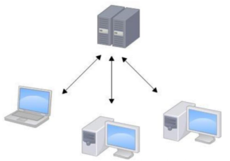

### 分布式版本控制工具
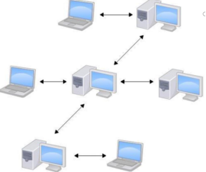

## Git 官网
[https://git-scm.com/](https://git-scm.com/)

logo:

## **Git 的优势 **
+ 大部分操作在本地完成，不需要联网
+ 尽可能添加数据而不是删除或修改数据
+ 分支操作非常快捷流畅
+ 与 Linux 命令全面兼容

## Git 的代码托管中心
+ 代码托管中心的任务：维护远程库，也就是我们之前所说的公共空间。
+ 局域网环境下：使用 GitLab 服务器 作为代码托管中心
+ 外网环境下：使用 GitHub 或者码云（gitee）作为代码托管中心

# 二、Git 的基本使用
## 安装

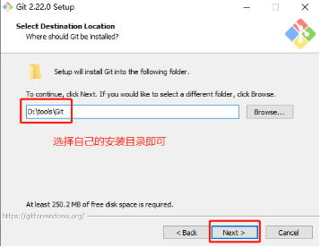

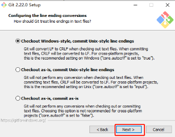

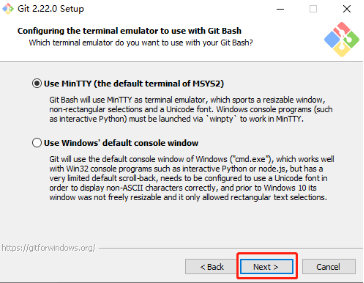

## 准备工作
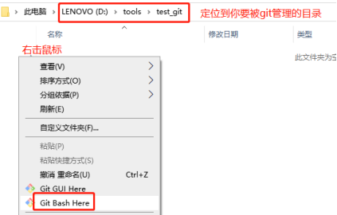

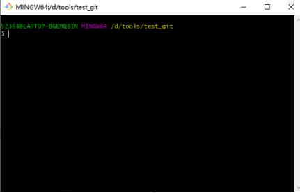

## 初始化本地仓库
命令：git init

效果：

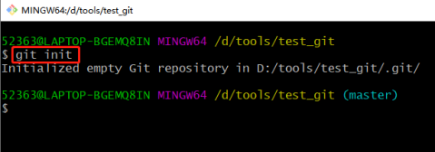

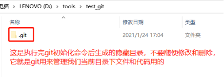

## 设置签名
+ 形式
    - 用户名：lihupeng
    - email 地址：[lihupeng@qq.com](mailto:lihupeng@qq.com)
+ 作用：区分不同开发人员的身份
+ 注意：这里设置的签名和登录远程仓库（代码托管中心）的账号、密码没有任何关系
+ 命令：
    - git config user.name lihupeng
    - git config user.email [lihupeng@qq.com](mailto:lihupeng@qq.com)

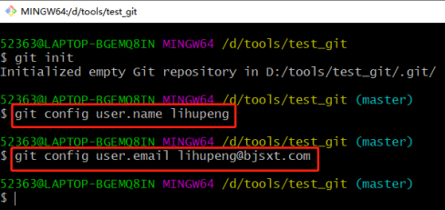

+ 签名信息保存位置：./git/config 文件

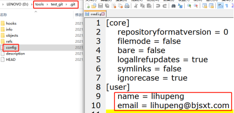

+ 说明：上面设置的签名是项目级别的，如果我们换了本地仓库目录后，还需要重新设置。所以可以直接设置一个全局的签名，以后就不用设置了。
    - git config --global user.name lihupeng
    - git config --global user.email [lihupeng@qq.com](mailto:lihupeng@qq.com)
    - 信息保存位置：家目录/.gitconfig 文件

## 存储流程
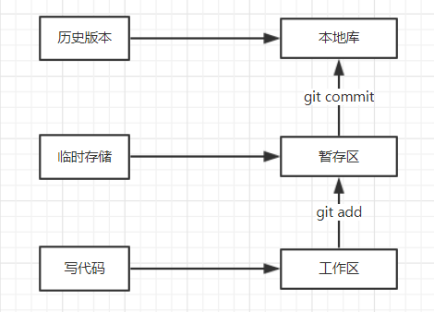

1. 工作区、暂存区和本地仓库，说的其实都是我们本地电脑。

2. 我们可以在工作区创建文件写代码，写完后，该文件处于已修改状态（modified）。已修改状态就表明文件进行了修改，但还没有提交保存。

3. 使用命令git add 可以将处于 modified 状态的文件添加到暂存区，这时文件处于已暂存状态（staged）。已暂存状态就表示将已修改的文件放到了暂存区，下次提交代码时要提交它。

4. 使用命令 git commit 可以将暂存区的文件提交到本地仓库，这时文件处于已提交状态（commited）。已提交状态就表示该文件已经被保存在了本地仓库中，并且生成一个新的版本。

## **常用命令**
### 查看状态
命令：git status

作用：查看工作区、暂存区文件状态

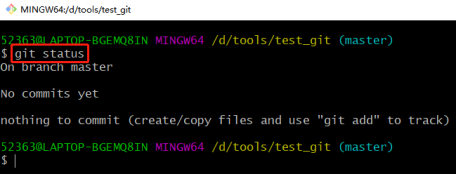

### 添加文件
命令：git add [file_name]

作用：将工作区的“新建/修改”添加到暂存区

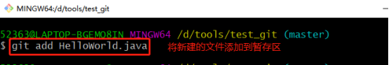

### 提交文件
命令：git commit -m “提交的注释说明” [file_name]

作用：将暂存区的文件提交到本地仓库中

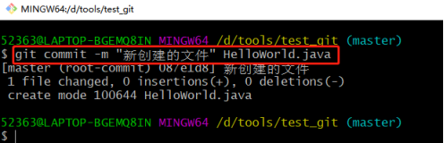

## **分支操作**
### **什么是分支**
在版本控制过程中，使用多条线同时推进多个任务，这多条线其实就是多个分支。

分支的英文：branch。

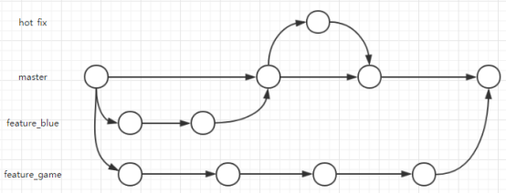

### **分支的好处**
+ 同时并行推进多个功能开发，提高开发效率
+ 各个分支在开发过程中，如果某一个分支开发失败，不会对其他分支有任何影响。失败的分支删除重新开发即可

### 创建分支
命令：git branch [分支名]

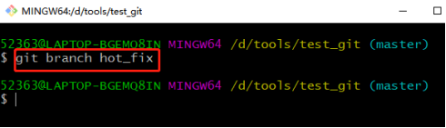

### **查看分支**
命令：git branch -v

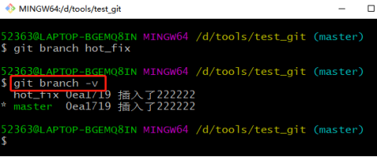

### 切换分支
命令：git checkout [分支名]

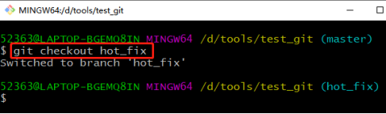

### 合并分支
第一步：切换到接收修改的分支上，比如说我们要合并当前分支 yyy 到 xxx 分支，那么就切换到 xxx 分支上，使用命令 git checkout xxx

第二步：执行 merge 命令，比如 git merge yyy

### **删除分支**
命令：git branch -d [分支名]

### 解决冲突
在合并分支的时候，特别容易出现冲突，导致合并失败！

造成冲突的原因：两个分支可能修改了同一个文件的某一行或某几行。

冲突表现：

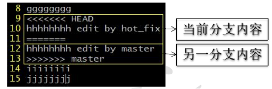

冲突的解决：

1. 编辑文件，删除特殊符号

2. 把文件修改到满意的程度，保存退出

3. git add [文件名]

4. git commit -m “日志信息”  （注意，此时 commit 提交一定不能带具体文件名）

# **三、远程仓库操作（码云）**
## **概述**
+ 我们每个人写的代码，都是要提交到远程仓库中进行管理的。
+ 远程仓库有：GitHub、码云或者自己公司的服务器。
+ 这里我们学习码云的操作。

## **注册码云账号**
网址：[https://gitee.com/](https://gitee.com/)

## 创建 SSH Key
我们之后要让本地电脑去远程连接服务器，服务器需要对我们的身份进行识别，SSH key 可以让本地电脑和码云之间建立安全的加密连接。

步骤如下：

1. 在 Git 窗口中运行命令 ssh-keygen -t rsa -C "lihupeng@qq.com"，会有三次提示输入，直接回车即可。
2. 在用户目录下生成 .ssh 目录，里面有一个 id_rsa.pub 文件，保存的就是公钥。

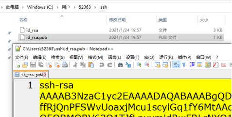

3. 登录码云，设置公钥：

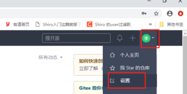

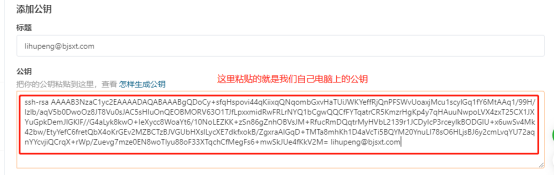

4. 验证 key 是否添加成功
+ 在 Git 窗口中，执行命令 ssh -T git@git.oschina.net 
+ Git 使用 SSH 连接第一次验证服务器的 key 时，需要你进行确认，此时输入 yes 回车即可。 
+ 再次执行 ssh -T git@git.oschina.net 

## **创建远程仓库**
目前我们已经在码云注册了账号了，就可以在码云上创建我们自己的一个仓库，然后拉取这个仓库中的代码或者往仓库中上传代码！

填写好仓库名称、公有/私有、语言，点击创建即可！

## **克隆远程仓库到本地**
在开发中，我们需要将远程仓库中的所有内容给克隆到本地电脑上。

步骤如下：

1. 复制远程仓库地址

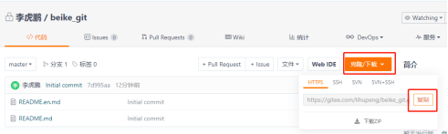

2. 在电脑的一个新目录（不要在之前已经初始化仓库的目录），执行命令：

git clone 远程仓库地址

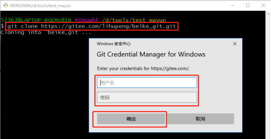

第一次有可能需要输入连接码云的用户名和密码，输入就好了。

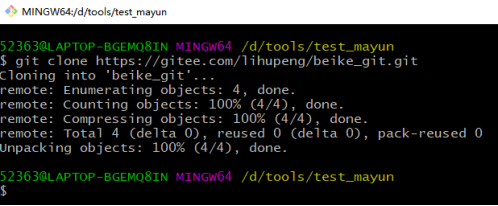

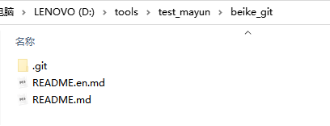

## **推送文件到远程仓库**
写完代码后，我们可以向远程仓库推送我们的代码。

1. 在本地仓库创建文件，添加到缓存区，并提交到本地仓库

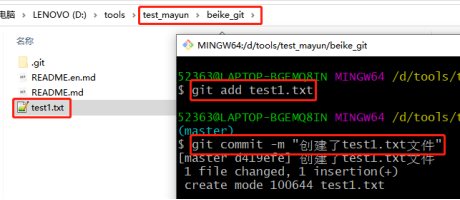

2. 推送本地仓库中的文件到远程仓库，使用命令：

git push [远程仓库路径] [分支名]

如果目前要提交的文件所在的本地仓库就是从该远程仓库克隆下来的，那可以省略远程仓库，如果要提交到 master，则也可以省略分支名。

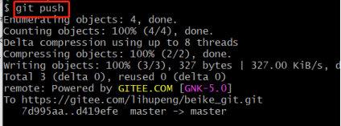

3. 刷新远程仓库，就可以看到刚刚提交的文件了。

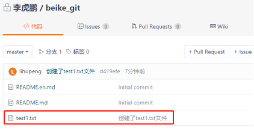

## **从远程仓库拉取文件**
我们可以从远程仓库拉取别人推送上去的文件。

使用命令：git pull

在远程仓库上新建一个文件：

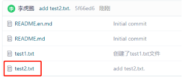

在本地仓库拉取远程仓库中的文件：

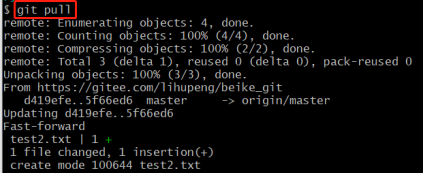

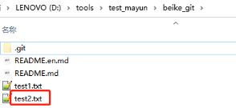

## 远程仓库邀请成员
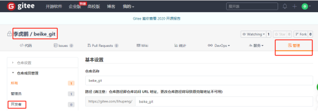

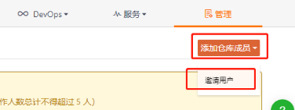

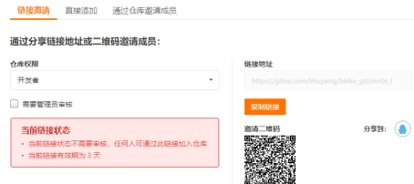

# 四、IDEA 中使用 Git
## IDEA 和 Git 集成

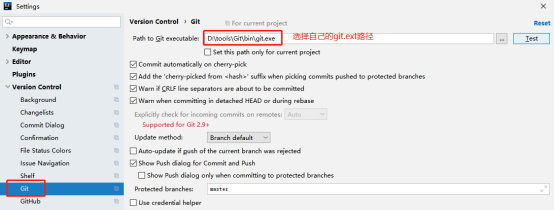

## **创建远程仓库**
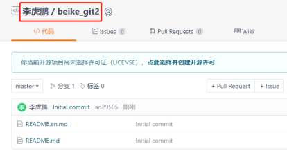

## **创建项目，搭建环境**
在 IDEA 中创建一个普通的 java 项目，然后创建个模块，将基本的开发环境给搭建好。

## 设置当前项目为 Git 工作区
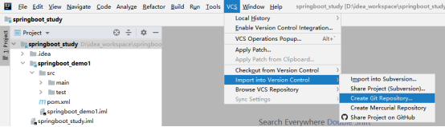

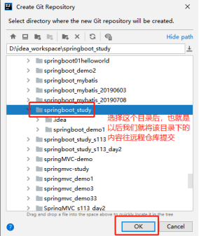

## 添加项目到暂存区
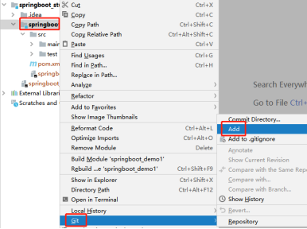

## 提交并推送
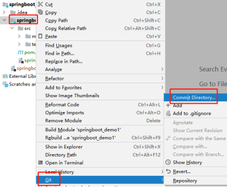

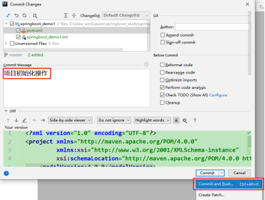

填写远程仓库的地址：

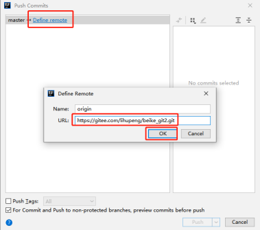

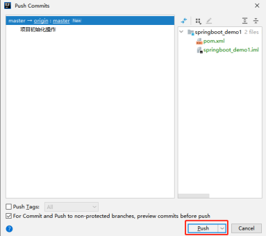

填写登录远程仓库的用户名和密码：

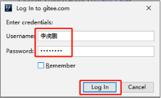

到此提交成功！！！

然后可以去远程仓库中查看，发现已经有了代码了！

## 推送失败问题解决
如果上传时出现 Push rejected: Push to origin/master was rejected 

解决办法：

1. 选择你要上传代码的文件夹，鼠标右键 git Bash Here
2. 输入下面两行命令

git pull origin master --allow-unrelated-histories 作用就是把远程仓库中的内容 pull 到本地工作目录

git push -u origin master -f  作用就是在 pull 下来的项目中做修改，然后再执行上面的操作 push 到远程仓库

## **初始提交项目的总结**
1. 在远程仓库中创建一个仓库，名字就是我们要做的项目的名字

2. 在 IDEA 中集成好本机上的 git.exe 文件

3. 使用 IDEA 创建一个项目，名字就和远程仓库的一样

4. 在项目中创建模块、搭建环境

5. 添加项目中的各个模块和文件到暂存区

6. 提交并推送各个模块

7. 推送的时候需要填写登录远程仓库的用户名密码

## IDEA 中从远程仓库克隆代码
刚加入到项目组的成员，需要从远程仓库中去获取完整的项目代码。操作如下：

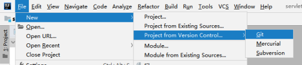

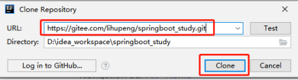

# **五、解决冲突**
## 冲突的原因
冲突产生的根本原因是：

两个人修改了同一个文件的同一块区域，在前者已经将代码推送到远程仓库的情况下，后者在推送的时候发现推送出错，产生了冲突。这也是最常见的冲突，下面介绍解决冲突的办法也主要针对这种冲突。

## 解决冲突
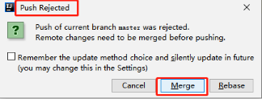

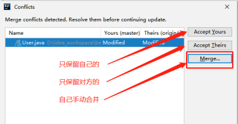

## 预防冲突
在修改代码前，使用 pull 命令更新代码，能够保证在开始修改代码前本地的代码与远程仓库中的版本一致，这样能够大大降低冲突发生的概率。

> 更新: 2024-07-02 13:55:44  
> 原文: <https://www.yuque.com/u41736172/az9urv/tkxb6zbnuu2zuypx>