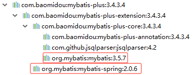
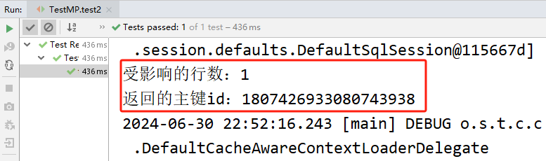
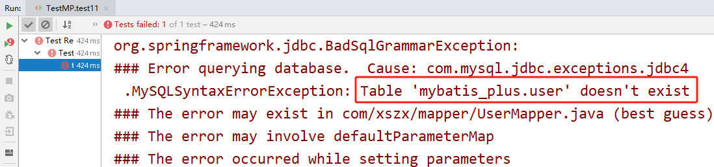
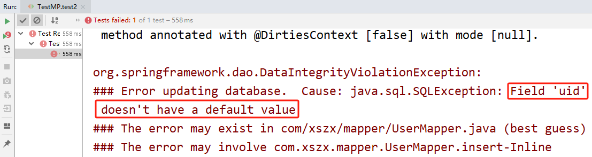
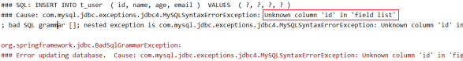
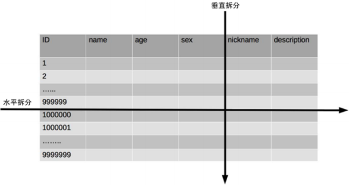
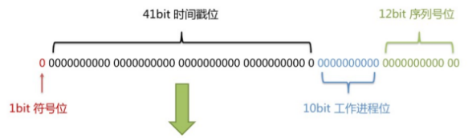
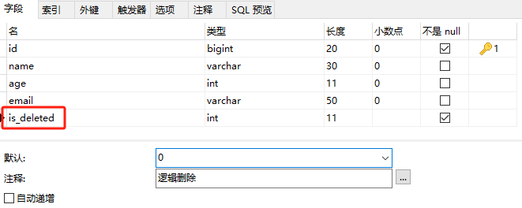
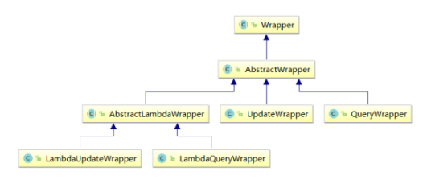

# MyBatis-Plus

# 一、MyBatis-Plus 介绍
## 概述
**<font style="color:rgb(51,51,51);">MyBatis-Plus</font>**<font style="color:rgb(51,51,51);">（简称 MP）是一个 </font>**<font style="color:rgb(51,51,51);">MyBatis 的增强工具</font>**<font style="color:rgb(51,51,51);">，在 MyBatis 的基础上</font>**<font style="color:rgb(51,51,51);">只做增强不做改变</font>**<font style="color:rgb(51,51,51);">，为</font>**<font style="color:rgb(51,51,51);">简化开发、提高效率而生</font>**<font style="color:rgb(51,51,51);">。</font>


## 特性
+ **<font style="color:rgb(51,51,51);">无侵入</font>**<font style="color:rgb(51,51,51);">：只做增强不做改变，引入它不会对现有工程产生影响，如丝般顺滑 </font>
+ **<font style="color:rgb(51,51,51);">损耗小</font>**<font style="color:rgb(51,51,51);">：启动即会自动注入基本 CURD，性能基本无损耗，直接面向对象操作 </font>
+ **<font style="color:rgb(51,51,51);">强大的 CRUD 操作</font>**<font style="color:rgb(51,51,51);">：内置通用 Mapper、通用 Service，仅仅通过少量配置即可实现单表大部分CRUD 操作，更有强大的条件构造器，满足各类使用需求 </font>
+ **<font style="color:rgb(51,51,51);">支持 Lambda 形式调用</font>**<font style="color:rgb(51,51,51);">：通过 Lambda 表达式，方便的编写各类查询条件，无需再担心字段写错 </font>
+ **<font style="color:rgb(51,51,51);">支持主键自动生成</font>**<font style="color:rgb(51,51,51);">：支持多达 4 种主键策略（内含分布式唯一 ID 生成器 - Sequence），可自由配置，完美解决主键问题</font>
+ **<font style="color:rgb(51,51,51);">支持自定义全局通用操作</font>**<font style="color:rgb(51,51,51);">：支持全局通用方法注入（ Write once, use anywhere ） </font>
+ **<font style="color:rgb(51,51,51);">内置代码生成器</font>**<font style="color:rgb(51,51,51);">：采用代码或者 Maven 插件可快速生成 Mapper 、Model 、Service 、Controller 层代码，支持模板引擎，更有超多自定义配置等您来使用 </font>
+ **<font style="color:rgb(51,51,51);">内置分页插件</font>**<font style="color:rgb(51,51,51);">：基于 MyBatis 物理分页，开发者无需关心具体操作，配置好插件之后，写分页等同于普通 List 查询</font>
+ **<font style="color:rgb(51,51,51);">分页插件支持多种数据库</font>**<font style="color:rgb(51,51,51);">：支持 MySQL、MariaDB、Oracle、DB2、H2、HSQL、SQLite、 Postgre、SQLServer 等多种数据库 </font>
+ **<font style="color:rgb(51,51,51);">内置性能分析插件</font>**<font style="color:rgb(51,51,51);">：可输出 SQL 语句以及其执行时间，建议开发测试时启用该功能，能快速揪出慢查询</font>
+ **<font style="color:rgb(51,51,51);">内置全局拦截插件</font>**<font style="color:rgb(51,51,51);">：提供全表 delete 、 update 操作智能分析阻断，也可自定义拦截规则，预防误操作</font>

## <font style="color:rgb(51,51,51);">官网</font>
+ 官网地址：[https://baomidou.com/](https://baomidou.com/)

# 二、入门案例
## 需求说明
<font style="color:rgb(119,119,119);">MyBatis-Plus 官方推荐使用 Spring Boot 进行整合，在此我们以 Spring 整合 MyBatis-Plus 来学习 Mybatis-Plus。</font>

## 开发环境
+ IDEA 2019
+ JDK 8
+ Maven 3.5.2
+ MySQL 5.7
+ Spring 5.3.20
+ MyBatis-Plus 3.4.3.4

## 创建数据库及表
```sql
CREATE DATABASE `mybatis_plus` /*!40100 DEFAULT CHARACTER SET utf8mb4 */;
use `mybatis_plus`;
CREATE TABLE `user` (
  `id` bigint(20) NOT NULL COMMENT '主键ID',
  `name` varchar(30) DEFAULT NULL COMMENT '姓名',
  `age` int(11) DEFAULT NULL COMMENT '年龄',
  `email` varchar(50) DEFAULT NULL COMMENT '邮箱',
  PRIMARY KEY (`id`)
) ENGINE=InnoDB DEFAULT CHARSET=utf8;
```

```sql
INSERT INTO user (id, name, age, email) VALUES
(1, 'Jone', 18, 'test1@baomidou.com'),
(2, 'Jack', 20, 'test2@baomidou.com'),
(3, 'Tom', 28, 'test3@baomidou.com'),
(4, 'Sandy', 21, 'test4@baomidou.com'),
(5, 'Billie', 24, 'test5@baomidou.com');
```

## 创建 Maven 项目
创建 Maven 项目，打包方式为 jar。

## 添加依赖
```xml
<?xml version="1.0" encoding="UTF-8"?>
<project xmlns="http://maven.apache.org/POM/4.0.0"
         xmlns:xsi="http://www.w3.org/2001/XMLSchema-instance"
         xsi:schemaLocation="http://maven.apache.org/POM/4.0.0 http://maven.apache.org/xsd/maven-4.0.0.xsd">
    <modelVersion>4.0.0</modelVersion>

    <groupId>com.xszx</groupId>
    <artifactId>spring_mp_demo</artifactId>
    <version>1.0-SNAPSHOT</version>

    <dependencies>
        <dependency>
            <groupId>org.springframework</groupId>
            <artifactId>spring-context</artifactId>
            <version>5.3.20</version>
        </dependency>
        <dependency>
            <groupId>org.springframework</groupId>
            <artifactId>spring-jdbc</artifactId>
            <version>5.3.20</version>
        </dependency>
        <dependency>
            <groupId>org.springframework</groupId>
            <artifactId>spring-test</artifactId>
            <version>5.3.20</version>
        </dependency>
        <!-- 连接池 -->
        <dependency>
            <groupId>com.alibaba</groupId>
            <artifactId>druid</artifactId>
            <version>1.2.8</version>
        </dependency>
        <!--junit5测试-->
        <dependency>
            <groupId>org.junit.jupiter</groupId>
            <artifactId>junit-jupiter-api</artifactId>
            <version>5.3.1</version>
        </dependency>
        <!-- MySQL驱动 -->
        <dependency>
            <groupId>mysql</groupId>
            <artifactId>mysql-connector-java</artifactId>
            <version>5.1.47</version>
        </dependency>
        <!-- 日志 -->
        <dependency>
            <groupId>org.slf4j</groupId>
            <artifactId>slf4j-api</artifactId>
            <version>1.7.30</version>
        </dependency>
        <dependency>
            <groupId>ch.qos.logback</groupId>
            <artifactId>logback-classic</artifactId>
            <version>1.2.3</version>
        </dependency>
        <!-- lombok用来简化实体类 -->
        <dependency>
            <groupId>org.projectlombok</groupId>
            <artifactId>lombok</artifactId>
            <version>1.16.16</version>
        </dependency>
        <!--MyBatis-Plus的核心依赖-->
        <dependency>
            <groupId>com.baomidou</groupId>
            <artifactId>mybatis-plus</artifactId>
            <version>3.4.3.4</version>
        </dependency>
    </dependencies>
</project>
```

**说明：**

<font style="color:rgb(119,119,119);">Spring 整合 MyBatis，需要 MyBatis 以及 Spring 整合 MyBatis 的依赖：</font>

```xml
 <!-- Mybatis核心 -->
<dependency>
    <groupId>org.mybatis</groupId>
    <artifactId>mybatis</artifactId>
    <version>3.5.7</version>
</dependency>

<!-- Spring 整合 MyBatis 的依赖 -->
<dependency>
    <groupId>org.mybatis</groupId>
    <artifactId>mybatis-spring</artifactId>
    <version>1.3.2</version>
</dependency>
```

<font style="color:rgb(119,119,119);">但是，在以上的依赖列表中，并没有 MyBatis 以及 Spring 整合 MyBatis 的依赖，因为当我们引入了MyBatis-Plus 的依赖时，就可以间接的引入这些依赖：</font>



<font style="color:rgb(119,119,119);">并且依赖和依赖之间的版本必须兼容，</font>**<font style="color:rgb(119,119,119);">所以我们不能随便引入其他版本的依赖，以免发生冲突。</font>**

## 编写数据库配置文件
```properties
jdbc.driver=com.mysql.jdbc.Driver
jdbc.url=jdbc:mysql://localhost:3306/mybatis_plus?useUnicode=true&characterEncoding=utf-8
jdbc.username=root
jdbc.password=root
```

## 编写日志配置文件
```xml
<?xml version="1.0" encoding="UTF-8"?>
<configuration debug="false">
    <!--定义日志文件的存储地址 logs为当前项目的logs目录 还可以设置为../logs -->
    <property name="LOG_HOME" value="logs" />
    <!--控制台日志， 控制台输出 -->
    <appender name="STDOUT" class="ch.qos.logback.core.ConsoleAppender">
        <encoder class="ch.qos.logback.classic.encoder.PatternLayoutEncoder">
            <!--格式化输出：%d表示日期，%thread表示线程名，%-5level：级别从左显示5个字符
            宽度,%msg：日志消息，%n是换行符-->
            <pattern>%d{yyyy-MM-dd HH:mm:ss.SSS} [%thread] %-5level %logger{50}
                - %msg%n</pattern>
        </encoder>
    </appender>
    <!--myibatis log configure-->
    <logger name="com.apache.ibatis" level="TRACE"/>
    <logger name="java.sql.Connection" level="DEBUG"/>
    <logger name="java.sql.Statement" level="DEBUG"/>
    <logger name="java.sql.PreparedStatement" level="DEBUG"/>
    <!-- 日志输出级别 -->
    <root level="DEBUG">
        <appender-ref ref="STDOUT" />
    </root>
</configuration>
```

## 编写 Spring 的配置文件
```xml
<?xml version="1.0" encoding="UTF-8"?>
<beans xmlns="http://www.springframework.org/schema/beans"
       xmlns:xsi="http://www.w3.org/2001/XMLSchema-instance"
       xmlns:context="http://www.springframework.org/schema/context"
       xsi:schemaLocation="http://www.springframework.org/schema/beans http://www.springframework.org/schema/beans/spring-beans.xsd http://www.springframework.org/schema/context https://www.springframework.org/schema/context/spring-context.xsd">

    <!-- 配置包扫描 -->
    <context:component-scan base-package="com.xszx"></context:component-scan>

    <!-- 引入jdbc.properties -->
    <context:property-placeholder location="classpath:jdbc.properties"></context:property-placeholder>

    <!-- 配置Druid数据源 -->
    <bean id="dataSource" class="com.alibaba.druid.pool.DruidDataSource">
        <property name="driverClassName" value="${jdbc.driver}"></property>
        <property name="url" value="${jdbc.url}"></property>
        <property name="username" value="${jdbc.username}"></property>
        <property name="password" value="${jdbc.password}"></property>
    </bean>

    <!-- 此处使用的是MybatisSqlSessionFactoryBean -->
    <bean class="com.baomidou.mybatisplus.extension.spring.MybatisSqlSessionFactoryBean">
        <!-- 设置数据源 -->
        <property name="dataSource" ref="dataSource"></property>
        <!-- 设置类型别名所对应的包 -->
        <property name="typeAliasesPackage" value="com.xszx.bean"></property>
        <!-- 设置映射文件的路径 -->
<!--        <property name="mapperLocations" value="classpath:mapper/*.xml"></property>-->
    </bean>

    <!--
        配置mapper接口的扫描配置
        由mybatis-spring提供，可以将指定包下所有的mapper接口创建动态代理
        并将这些动态代理作为IOC容器的bean管理
    -->
    <bean class="org.mybatis.spring.mapper.MapperScannerConfigurer">
        <property name="basePackage" value="com.xszx.mapper"></property>
    </bean>
</beans>
```

## 编写实体类
```java
package com.xszx.bean;

import lombok.AllArgsConstructor;
import lombok.Data;
import lombok.NoArgsConstructor;

@Data
@AllArgsConstructor
@NoArgsConstructor
public class User {

    private Long id;
    private String name;
    private Integer age;
    private String email;
}
```

## 编写 mapper 接口
```java
package com.xszx.mapper;

import com.baomidou.mybatisplus.core.mapper.BaseMapper;
import com.xszx.bean.User;

public interface UserMapper extends BaseMapper<User> {
    
}
```

> <font style="color:rgb(119,119,119);">BaseMapper 是 MyBatis-Plus 提供的基础 mapper 接口，泛型为所操作的实体类型，其中包含 CRUD 的各个方法，我们的 mapper 继承了 BaseMapper 之后，就可以直接使用 BaseMapper 所提供的各种方法，而不需要编写映射文件以及 SQL 语句，大大的提高了开发效率。</font>
>

## 编写测试方法
```java
package com.xszx;

import com.xszx.bean.User;
import com.xszx.mapper.UserMapper;
import org.junit.jupiter.api.Test;
import org.springframework.beans.factory.annotation.Autowired;
import org.springframework.test.context.junit.jupiter.SpringJUnitConfig;

@SpringJUnitConfig(locations = "classpath:applicationContext.xml")
public class TestMP {

    @Autowired
    private UserMapper userMapper;

    @Test
    public void test1(){
        User user = userMapper.selectById(1);
        System.out.println(user);
    }
}
```

## 总结
<font style="color:rgb(51,51,51);">在 Spring 整合 MyBatis-Plus 后，我们就可以使用 MyBatis-Plus 所提供的 BaseMapper 实现 CRUD，并不需要编写映射文件以及 SQL 语句。但是若要自定义 SQL 语句，仍然可以编写映射文件而不造成任何影响，因为 MyBatis-Plus 只做增强，而不做改变。</font>

# <font style="color:rgb(51,51,51);">三、基本 CRUD</font>
## <font style="color:rgb(51,51,51);">BaseMapper</font>
<font style="color:rgb(51,51,51);">MyBatis-Plus 中的基本 CRUD 在内置的 BaseMapper 中都已得到了实现，我们可以直接使用，接口如 </font>

<font style="color:rgb(51,51,51);">下：</font>

```java
//
// Source code recreated from a .class file by IntelliJ IDEA
// (powered by Fernflower decompiler)
//

package com.baomidou.mybatisplus.core.mapper;

import com.baomidou.mybatisplus.core.conditions.Wrapper;
import com.baomidou.mybatisplus.core.metadata.IPage;
import com.baomidou.mybatisplus.core.toolkit.CollectionUtils;
import com.baomidou.mybatisplus.core.toolkit.ExceptionUtils;
import java.io.Serializable;
import java.util.Collection;
import java.util.List;
import java.util.Map;
import org.apache.ibatis.annotations.Param;

public interface BaseMapper<T> extends Mapper<T> {
    int insert(T entity);

    int deleteById(Serializable id);

    int deleteById(T entity);

    int deleteByMap(@Param("cm") Map<String, Object> columnMap);

    int delete(@Param("ew") Wrapper<T> queryWrapper);

    int deleteBatchIds(@Param("coll") Collection<? extends Serializable> idList);

    int updateById(@Param("et") T entity);

    int update(@Param("et") T entity, @Param("ew") Wrapper<T> updateWrapper);

    T selectById(Serializable id);

    List<T> selectBatchIds(@Param("coll") Collection<? extends Serializable> idList);

    List<T> selectByMap(@Param("cm") Map<String, Object> columnMap);

    default T selectOne(@Param("ew") Wrapper<T> queryWrapper) {
        List<T> ts = this.selectList(queryWrapper);
        if (CollectionUtils.isNotEmpty(ts)) {
            if (ts.size() != 1) {
                throw ExceptionUtils.mpe("One record is expected, but the query result is multiple records", new Object[0]);
            } else {
                return ts.get(0);
            }
        } else {
            return null;
        }
    }

    Long selectCount(@Param("ew") Wrapper<T> queryWrapper);

    List<T> selectList(@Param("ew") Wrapper<T> queryWrapper);

    List<Map<String, Object>> selectMaps(@Param("ew") Wrapper<T> queryWrapper);

    List<Object> selectObjs(@Param("ew") Wrapper<T> queryWrapper);

    <P extends IPage<T>> P selectPage(P page, @Param("ew") Wrapper<T> queryWrapper);

    <P extends IPage<Map<String, Object>>> P selectMapsPage(P page, @Param("ew") Wrapper<T> queryWrapper);
}
```

## <font style="color:rgb(51,51,51);">插入</font>
```java
package com.xszx;

import com.xszx.bean.User;
import com.xszx.mapper.UserMapper;
import org.junit.jupiter.api.Test;
import org.springframework.beans.factory.annotation.Autowired;
import org.springframework.test.context.junit.jupiter.SpringJUnitConfig;

@SpringJUnitConfig(locations = "classpath:applicationContext.xml")
public class TestMP {

    @Autowired
    private UserMapper userMapper;

    // 测试添加
    @Test
    public void test2(){
        User user = new User(null, "苏明玉", 28, "sumingyu@qq.com");
        int i = userMapper.insert(user);
        System.out.println("受影响的行数：" + i);
        System.out.println("返回的主键id：" + user.getId());
    }

    // 测试根据id查询
    @Test
    public void test1(){
        User user = userMapper.selectById(1);
        System.out.println(user);
    }
}
```



最终执行的结果，所获取的 id 为 1475754982694199298，这是因为 MyBatis-Plus 在实现插入数据时，会默认基于雪花算法的策略生成 id。

## <font style="color:rgb(51,51,51);">删除</font>
### <font style="color:rgb(51,51,51);">通过 id 删除记录</font>
```java
// 测试通过id删除记录
@Test
public void test3(){
    int i = userMapper.deleteById(1807426933080743938L);
    System.out.println("受影响的行数：" + i);
}
```

### <font style="color:rgb(51,51,51);">通过 id 批量删除记录</font>
```java
// 测试通过id批量删除记录
@Test
public void test4(){
    List<Long> list = Arrays.asList(1L, 2L);
    int i = userMapper.deleteBatchIds(list);
    System.out.println("受影响的行数：" + i);
}
```

### <font style="color:rgb(51,51,51);">通过 map 条件删除记录</font>
```java
// 测试通过map条件删除记录
@Test
public void test5(){
    Map<String, Object> map = new HashMap<>();
    map.put("name", "Tom");
    map.put("age", 28);
    int i = userMapper.deleteByMap(map);
    System.out.println("受影响的行数：" + i);
}
```

## <font style="color:rgb(51,51,51);">修改</font>
```java
// 测试修改
@Test
public void test6(){

    User user = new User(4L, "吕布", 19, "lvbu@qq.com");
    int i = userMapper.updateById(user);
    System.out.println("受影响的行数：" + i);
}
```

## <font style="color:rgb(51,51,51);">查询</font>
### <font style="color:rgb(51,51,51);">根据 id 查询用户信息</font>
```java
// 测试根据id查询数据
@Test
public void test7(){
    User user = userMapper.selectById(4L);
    System.out.println(user);
}
```

### <font style="color:rgb(51,51,51);">根据多个 id 查询多个用户信息</font>
```java
// 测试根据多个id查询多个用户信息
@Test
public void test8(){
    List<Long> list = Arrays.asList(4L, 5L);
    List<User> res = userMapper.selectBatchIds(list);
    for (User re : res) {
        System.out.println(re);
    }
}
```

### <font style="color:rgb(51,51,51);">通过 map 条件查询用户信息</font>
```java
//测试通过map条件查询用户信息
@Test
public void test9(){
    Map<String, Object> map = new HashMap<>();
    map.put("name", "Billie");
    map.put("age", 24);

    List<User> list = userMapper.selectByMap(map);
    for (User user : list) {
        System.out.println(user);
    }
}
```

### <font style="color:rgb(51,51,51);">查询所有数据</font>
```java
// 测试查询所有数据
@Test
public void test10(){
    List<User> list = userMapper.selectList(null);
    for (User user : list) {
        System.out.println(user);
    }
}
```

> <font style="color:rgb(119,119,119);">通过观察 BaseMapper 中的方法，大多方法中都有 Wrapper 类型的形参，此为条件构造器，可针对于SQL 语句设置不同的条件，若没有条件，则可以为该形参赋值 null，即查询（删除/修改）所有数据。</font>
>

## <font style="color:rgb(51,51,51);">通用 Service</font>
+ 通用 Service CRUD 封装到 IService 接口，进一步封装 CRUD
+ 采用 get 查询单行，remove 删除，list 查询集合，page 分页前缀命名方式区分 Mapper 层避免混淆
+ 泛型 T 为任意实体对象

### 编写 service 层代码
```java
package com.xszx.service;

import com.baomidou.mybatisplus.extension.service.IService;
import com.xszx.bean.User;

public interface UserService extends IService<User> {
    
}
```

```java
package com.xszx.service.impl;

import com.baomidou.mybatisplus.extension.service.impl.ServiceImpl;
import com.xszx.bean.User;
import com.xszx.mapper.UserMapper;
import com.xszx.service.UserService;
import org.springframework.stereotype.Service;

@Service
public class UserServiceImpl extends ServiceImpl<UserMapper, User> implements UserService {

}
```

### <font style="color:rgb(51,51,51);">测试查询记录数</font>
```java
// 测试查询记录数
@Test
public void test11(){
    long count = userService.count();
    System.out.println("总记录数：" + count);
}
```

### <font style="color:rgb(51,51,51);">测试批量插入</font>
```java
// 测试批量插入
@Test
public void test12(){
    // SQL长度有限制，海量数据插入单条SQL无法实行，
    // 因此MP将批量插入放在了通用Service中实现，而不是通用Mapper
    List<User> list = new ArrayList<>();
    list.add(new User(null, "曹操", 28, "caocao@qq.com"));
    list.add(new User(null, "刘备", 25, "liubei@qq.com"));
    list.add(new User(null, "关羽", 32, "guanyu@qq.com"));

    boolean b = userService.saveBatch(list);
    System.out.println("结果：" + b);
}
```

# <font style="color:rgb(51,51,51);">四、常用注解</font>
## <font style="color:rgb(51,51,51);">@TableName</font>
经过以上的测试，在使用 MyBatis-Plus 实现基本的 CRUD 时，我们并没有指定要操作的表，只是在 Mapper 接口继承 BaseMapper 时，设置了泛型 User，而操作的表为 user 表。由此得出结论，MyBatis-Plus 在确定操作的表时，由 BaseMapper 的泛型决定，即实体类型决定，且默认操作的表名和实体类型的类名一致。

### <font style="color:rgb(51,51,51);">问题</font>
若实体类类型的类名和要操作的表的表名不一致，会出现什么问题？

我们将表 user 更名为 t_user，测试查询功能，程序抛出异常，Table 'mybatis_plus.user' doesn't exist，因为现在的表名为 t_user，而默认操作的表名和实体类型的类名一致，即 user 表。



### <font style="color:rgb(51,51,51);">通过 @TableName 解决问题</font>
在实体类类型上添加 @TableName("t_user")，标识实体类对应的表，即可成功执行 SQL 语句。

```java
package com.xszx.bean;

import com.baomidou.mybatisplus.annotation.TableName;
import lombok.AllArgsConstructor;
import lombok.Data;
import lombok.NoArgsConstructor;

@Data
@AllArgsConstructor
@NoArgsConstructor
@TableName("t_user") // 表示该实体类对应的表名
public class User {

    private Long id;
    private String name;
    private Integer age;
    private String email;
}
```

### <font style="color:rgb(51,51,51);">通过 GlobalConfig 解决问题</font>
在开发的过程中，我们经常遇到以上的问题，即实体类所对应的表都有固定的前缀，例如 t_ 或 tbl_ 此时，可以使用 MyBatis-Plus 提供的全局配置，为实体类所对应的表名设置默认的前缀，那么就不需要在每个实体类上通过@TableName 标识实体类对应的表。

```xml
<!-- 此处使用的是MybatisSqlSessionFactoryBean -->
  <bean class="com.baomidou.mybatisplus.extension.spring.MybatisSqlSessionFactoryBean">
      <!-- 设置数据源 -->
      <property name="dataSource" ref="dataSource"></property>
      <!-- 设置类型别名所对应的包 -->
      <property name="typeAliasesPackage" value="com.xszx.bean"></property>
      <!-- 设置映射文件的路径 -->
<!--        <property name="mapperLocations" value="classpath:mapper/*.xml"></property>-->
      <!-- 设置MyBatis-Plus的全局配置 -->
      <property name="globalConfig" ref="globalConfig"></property>
  </bean>

  <bean id="globalConfig" class="com.baomidou.mybatisplus.core.config.GlobalConfig">
      <property name="dbConfig">
          <bean class="com.baomidou.mybatisplus.core.config.GlobalConfig$DbConfig">
              <!-- 设置实体类所对应的表的前缀 -->
              <property name="tablePrefix" value="t_"></property>
          </bean>
      </property>
  </bean>
```

## <font style="color:rgb(51,51,51);">@TableId</font>
经过以上的测试，MyBatis-Plus 在实现 CRUD 时，会默认将 id 作为主键列，并在插入数据时，默认基于雪花算法的策略生成 id。

### 问题
若实体类和表中表示主键的不是 id，而是其他字段，例如 uid，MyBatis-Plus 会自动识别 uid 为主键列吗？

我们实体类中的属性 id 改为 uid，将表中的字段 id 也改为 uid，测试添加功能，程序抛出异常，Field 'uid' doesn't have a default value，说明 MyBatis-Plus 没有将 uid 作为主键赋值。



### <font style="color:rgb(51,51,51);">通过 @TableId 解决问题</font>
在实体类中 uid 属性上通过 @TableId 将其标识为主键，即可成功执行 SQL 语句。

```java
package com.xszx.bean;

import com.baomidou.mybatisplus.annotation.TableId;
import com.baomidou.mybatisplus.annotation.TableName;
import lombok.AllArgsConstructor;
import lombok.Data;
import lombok.NoArgsConstructor;

@Data
@AllArgsConstructor
@NoArgsConstructor
@TableName("t_user") // 表示该实体类对应的表名
public class User {

    @TableId // 表示该属性对应的字段是表中的主键
    private Long uid;
    private String name;
    private Integer age;
    private String email;
}
```

### <font style="color:rgb(51,51,51);">@TableId 的 value 属性</font>
若实体类中主键对应的属性为 id，而表中表示主键的字段为 uid，此时若只在属性 id 上添加注解 @TableId，则抛出异常 Unknown column 'id' in 'field list'，即 MyBatis-Plus 仍然会将 id 作为表的主键操作，而表中表示主键的是字段 uid，此时需要通过 @TableId 注解的 value 属性，指定表中的主键字段，@TableId("uid") 或@TableId(value="uid")



### <font style="color:rgb(51,51,51);">@TableId 的 type 属性</font>
type 属性用来定义主键策略。

**<font style="color:rgb(51,51,51);">常用的主键策略：</font>**

| 值 | 描述 |
| --- | --- |
| <font style="color:rgb(51,51,51);">IdType.ASSIGN_ID（默 认） </font> | <font style="color:rgb(51,51,51);">基于雪花算法的策略生成数据 id，与数据库 id 是否设置自增无关</font> |
| <font style="color:rgb(51,51,51);">IdType.AUTO </font> | <font style="color:rgb(51,51,51);">使用数据库的自增策略，注意，该类型请确保数据库设置了 id 自增， 否则无效</font> |


**<font style="color:rgb(51,51,51);">配置全局主键策略：</font>**

```xml
<bean id="globalConfig" class="com.baomidou.mybatisplus.core.config.GlobalConfig">
    <property name="dbConfig">
        <bean class="com.baomidou.mybatisplus.core.config.GlobalConfig$DbConfig">
            <!-- 设置实体类所对应的表的前缀 -->
            <property name="tablePrefix" value="t_"></property>
            <!-- 设置全局主键策略 -->
            <property name="idType" value="ASSIGN_ID"></property>
        </bean>
    </property>
</bean>
```

### <font style="color:rgb(51,51,51);">雪花算法</font>
**背景**

<font style="color:rgb(51,51,51);">需要选择合适的方案去应对数据规模的增长，以应对逐渐增长的访问压力和数据量。 </font>

<font style="color:rgb(51,51,51);">数据库的扩展方式主要包括：业务分库、主从复制，数据库分表。</font>

**<font style="color:rgb(51,51,51);">数据库分表</font>**

<font style="color:rgb(51,51,51);">将不同业务数据分散存储到不同的数据库服务器，能够支撑百万甚至千万用户规模的业务，但如果业务继续发展，同一业务的单表数据也会达到单台数据库服务器的处理瓶颈。例如，淘宝的几亿用户数据，如果全部存放在一台数据库服务器的一张表中，肯定是无法满足性能要求的，此时就需要对单表数据进行分。 </font>

<font style="color:rgb(51,51,51);">单表数据拆分有两种方式：垂直分表和水平分表。示意图如下：</font>



+ **<font style="color:rgb(51,51,51);">垂直分表</font>**

<font style="color:rgb(51,51,51);">垂直分表适合将表中某些不常用且占了大量空间的列拆分出去。 例如，前面示意图中的 nickname 和description 字段，假设我们是一个婚恋网站，用户在筛选其他用户的时候，主要是用 age 和 sex 两个字段进行查询，而 nickname 和 description 两个字段主要用于展示，一般不会在业务查询中用到。description 本身又比较长，因此我们可以将这两个字段独立到另外一张表中，这样在查询 age 和 sex 时，就能带来一定的性能提升。</font>

+ **<font style="color:rgb(51,51,51);">水平分表</font>**

<font style="color:rgb(51,51,51);">水平分表适合表行数特别大的表，有的公司要求单表行数超过 5000 万就必须进行分表，这个数字可以作为参考，但并不是绝对标准，关键还是要看表的访问性能。对于一些比较复杂的表，可能超过 1000 </font>

<font style="color:rgb(51,51,51);">万就要分表了；而对于一些简单的表，即使存储数据超过 1 亿行，也可以不分表。</font>

<font style="color:rgb(51,51,51);">但不管怎样，当看到表的数据量达到千万级别时，作为架构师就要警觉起来，因为这很可能是架构的性能瓶颈或者隐患。</font>

<font style="color:rgb(51,51,51);">水平分表相比垂直分表，会引入更多的复杂性，例如要求全局唯一的数据 id 该如何处理。</font>

    - **主键自增**

<font style="color:rgb(51,51,51);">① 以最常见的用户 ID 为例，可以按照 1000000 的范围大小进行分段，1 ~ 999999 放到表中， 1000000 ~ 1999999 放到表2中，以此类推。 </font>

<font style="color:rgb(51,51,51);">② 复杂点：分段大小的选取。分段太小会导致切分后子表数量过多，增加维护复杂度；分段太大可能会导致单表依然存在性能问题，一般建议分段大小在 100 万至 2000 万之间，具体需要根据业务选取合适的分段大小。 </font>

<font style="color:rgb(51,51,51);">③ 优点：可以随着数据的增加平滑地扩充新的表。例如，现在的用户是 100 万，如果增加到1000 万，只需要增加新的表就可以了，原有的数据不需要动。 </font>

<font style="color:rgb(51,51,51);">④ 缺点：分布不均匀。假如按照 1000 万来进行分表，有可能某个分段实际存储的数据量只有 1条，而另外一个分段实际存储的数据量有 1000 万条。</font>

    - **取模**

<font style="color:rgb(51,51,51);">① 同样以用户 ID 为例，假如我们一开始就规划了 10 个数据库表，可以简单地用 user_id % 10 的值来表示数据所属的数据库表编号，ID 为 985 的用户放到编号为 5 的子表中，ID 为 10086 的用户放到编号为 6 的子表中。 </font>

<font style="color:rgb(51,51,51);">② 复杂点：初始表数量的确定。表数量太多维护比较麻烦，表数量太少又可能导致单表性能存在问题。</font>

<font style="color:rgb(51,51,51);">③ 优点：表分布比较均匀。 </font>

<font style="color:rgb(51,51,51);">④ 缺点：扩充新的表很麻烦，所有数据都要重分布</font>

    - **雪花算法**

雪花算法是由 Twitter 公布的分布式主键生成算法，它能够保证不同表的主键的不重复性，以及相同表的主键的有序性。

<font style="color:rgb(51,51,51);">① 核心思想： </font>

<font style="color:rgb(51,51,51);">长度共64bit（一个 long 型）。 </font>

<font style="color:rgb(51,51,51);">首先是一个符号位，1bit标识，由于long基本类型在Java中是带符号的，最高位是符号位，正数是0，负数是1，所以id一般是正数，最高位是0。 </font>

<font style="color:rgb(51,51,51);">41bit时间截(毫秒级)，存储的是时间截的差值（当前时间截 - 开始时间截)，结果约等于69.7年。</font>

<font style="color:rgb(51,51,51);">10bit作为机器的ID（5个bit是数据中心，5个bit的机器ID，可以部署在1024个节点）。 </font>

<font style="color:rgb(51,51,51);">12bit作为毫秒内的流水号（意味着每个节点在每毫秒可以产生 4096 个 ID）。</font>



<font style="color:rgb(51,51,51);">② 优点：整体上按照时间自增排序，并且整个分布式系统内不会产生 ID 碰撞，并且效率较高。</font>

## <font style="color:rgb(51,51,51);">@TableField</font>
经过以上的测试，我们可以发现，MyBatis-Plus 在执行 SQL 语句时，要保证实体类中的属性名和表中的字段名一致。如果实体类中的属性名和字段名不一致的情况，会出现什么问题呢？

### <font style="color:rgb(51,51,51);">情况1</font>
若实体类中的属性使用的是驼峰命名风格，而表中的字段使用的是下划线命名风格。例如实体类属性 userName，表中字段 user_name。此时 MyBatis-Plus 会自动将下划线命名风格转化为驼峰命名风格，相当于在 MyBatis 中配置了开启驼峰命名规则。

### <font style="color:rgb(51,51,51);">情况2</font>
若实体类中的属性和表中的字段不满足情况1。例如实体类属性 name，表中字段 username，此时需要在实体类属性上使用 @TableField("username") 设置属性所对应的字段名。

```java
@Data
@AllArgsConstructor
@NoArgsConstructor
@TableName("t_user") // 表示该实体类对应的表名
public class User {

    @TableId(value = "id", type = IdType.ASSIGN_ID) // 表示该属性对应的字段是表中的主键
    private Long uid;

    @TableField("username") // 指定该属性对应的表字段是哪个
    private String name;
    private Integer age;
    private String email;
}
```

## <font style="color:rgb(51,51,51);">@TableLogic</font>
### <font style="color:rgb(51,51,51);">逻辑删除</font>
+ <font style="color:rgb(51,51,51);">物理删除：真实删除，将对应数据从数据库中删除，之后查询不到此条被删除的数据 </font>
+ <font style="color:rgb(51,51,51);">逻辑删除：假删除，将对应数据中代表是否被删除字段的状态修改为“被删除状态”，之后在数据库 中仍旧能看到此条数据记录 </font>
+ <font style="color:rgb(51,51,51);">使用场景：可以进行数据恢复</font>

### <font style="color:rgb(51,51,51);">实现逻辑删除</font>
step1：数据库中创建逻辑删除状态列，设置默认值为0



step2：实体类中添加逻辑删除属性

```java
@Data
@AllArgsConstructor
@NoArgsConstructor
@TableName("t_user") // 表示该实体类对应的表名
public class User {

    @TableId(value = "id", type = IdType.ASSIGN_ID) // 表示该属性对应的字段是表中的主键
    private Long uid;

    @TableField("username") // 指定该属性对应的表字段是哪个
    private String name;
    private Integer age;
    private String email;

    @TableLogic // 表示该字段对应的是逻辑删除字段
    private Integer isDeleted;
}
```

step3：测试

测试删除功能，真正执行的是修改：

UPDATE t_user SET is_deleted=1 WHERE id=? AND is_deleted=0

测试查询功能，被逻辑删除的数据默认不会被查询

SELECT id,username AS name,age,email,is_deleted FROM t_user WHERE is_deleted=0

# <font style="color:rgb(51,51,51);">五、条件构造器和常用接口</font>
## <font style="color:rgb(51,51,51);">wapper 介绍</font>


+ <font style="color:rgb(51,51,51);">Wrapper：条件构造抽象类，最顶端父类 </font>
    - <font style="color:rgb(51,51,51);">AbstractWrapper： 用于查询条件封装，生成 sql 的 where 条件 </font>
        * <font style="color:rgb(51,51,51);">QueryWrapper： 查询条件封装 </font>
        * <font style="color:rgb(51,51,51);">UpdateWrapper：Update 条件封装 </font>
        * <font style="color:rgb(51,51,51);">AbstractLambdaWrapper： 使用 Lambda 语法 </font>
            + <font style="color:rgb(51,51,51);">LambdaQueryWrapper：用于 Lambda 语法使用的查询 Wrapper </font>
            + <font style="color:rgb(51,51,51);">LambdaUpdateWrapper：Lambda 更新封装 Wrapper</font>

## <font style="color:rgb(51,51,51);">QueryWrapper</font>
### <font style="color:rgb(51,51,51);">组装查询条件</font>
```java
// 测试组装查询条件
@Test
public void test13(){
    // 查询用户名包含a，年龄在20到30之间，并且邮箱不为null的用户信息
    QueryWrapper<User> wrapper = new QueryWrapper<>();
    wrapper.like("username", "a")
            .between("age", 20, 30)
            .isNotNull("email");
    List<User> list = userMapper.selectList(wrapper);
    list.forEach(System.out::println);
}
```

### <font style="color:rgb(51,51,51);">组装排序条件</font>
```java
// 测试组装排序条件
@Test
public void test14(){
    // 按年龄降序查询用户，如果年龄相同则按id升序排列
    QueryWrapper<User> wrapper = new QueryWrapper<>();
    wrapper.orderByDesc("age")
            .orderByAsc("id");
    List<User> list = userMapper.selectList(wrapper);
    list.forEach(System.out::println);
}
```

### <font style="color:rgb(51,51,51);">组装删除条件</font>
```java
// 测试组装删除条件
@Test
public void test15(){
    // 删除email为空的用户
    QueryWrapper<User> wrapper = new QueryWrapper<>();
    wrapper.isNull("email");
    // 条件构造器也可以构建删除语句的条件
    int i = userMapper.delete(wrapper);
    System.out.println("受影响的行数：" + i);
}
```

### <font style="color:rgb(51,51,51);">条件的优先级</font>
```java
// 测试条件的优先级
@Test
public void test16(){
    // 将（年龄大于20并且用户名中包含有a）或邮箱为null的用户信息修改
    QueryWrapper<User> wrapper = new QueryWrapper<>();
    wrapper.gt("age", 20)
            .like("username", "a")
            .or()
            .isNull("email");
    User user = new User();
    user.setAge(35);
    user.setEmail("abc@qq.com");
    int i = userMapper.update(user, wrapper);
    System.out.println("受影响的行数：" + i);
}
```

### <font style="color:rgb(51,51,51);">组装 select 子句</font>
```java
// 测试组装select子句
@Test
public void test17(){
    // 查询用户信息的username和age字段
    QueryWrapper<User> wrapper = new QueryWrapper<>();
    wrapper.select("username", "age");
    // selectMaps()返回Map集合列表，通常配合select()使用，避免User对象中没有被查询到的列值为null
    List<Map<String, Object>> list = userMapper.selectMaps(wrapper);
    list.forEach(System.out::println);
}
```

## <font style="color:rgb(51,51,51);">condition</font>
在真正开发的过程中，组装条件是常见的功能，而这些条件数据来源于用户输入，是可选的，因此我们在组装这些条件时，必须先判断用户是否选择了这些条件，若选择则需要组装该条件，若没有选择则一定不能组装，以免影响 SQL 执行的结果。

### 方式一
```java
@Test
public void test18(){
    //定义查询条件，有可能为null（用户未输入或未选择）
    String username = null;
    Integer ageBegin = 10;
    Integer ageEnd = 24;
    QueryWrapper<User> queryWrapper = new QueryWrapper<>();
    //StringUtils.isNotBlank()判断某字符串是否不为空且长度不为0且不由空白符(whitespace)构成
    if(StringUtils.isNotBlank(username)){
        queryWrapper.like("username","a");
    }
    if(ageBegin != null){
        queryWrapper.ge("age", ageBegin);
    }
    if(ageEnd != null){
        queryWrapper.le("age", ageEnd);
    }
    //SELECT id,username AS name,age,email,is_deleted FROM t_user WHERE (age >=? AND age <= ?)
    List<User> users = userMapper.selectList(queryWrapper);
    users.forEach(System.out::println);
}
```

### 方式二
```java
@Test
public void test18(){
    String username = "";
    Integer age1 = 18;
    Integer age2 = 45;
    
    QueryWrapper<User> wrapper = new QueryWrapper<>();
    wrapper.like(StringUtils.isNotBlank(username), "username", username)
            .ge(age1 != null, "age", age1)
            .le(age2 != null, "age", age2);

    List<User> list = userService.list(wrapper);
    list.forEach(System.out::println);
}
```

## UpdateWrapper
```java
@Test
public void test19(){
    UpdateWrapper<User> wrapper = new UpdateWrapper<>();
    wrapper.set("username", "呵呵")
            .set("age", 25)
            .eq("uid", 5L);
    int i = userMapper.update(null, wrapper);
    System.out.println("受影响的行数：" + i);
}
```

## <font style="color:rgb(51,51,51);">LambdaQueryWrapper</font>
```java
@Test
public void test20(){
    LambdaQueryWrapper<User> wrapper = new LambdaQueryWrapper<>();
    wrapper.like(User::getName, "张")
            .ge(User::getAge, 18);
    List<User> list = userMapper.selectList(wrapper);
    list.forEach(System.out::println);
}
```

## <font style="color:rgb(51,51,51);">LambdaUpdateWrapper</font>
```java
@Test
public void test21(){
    LambdaUpdateWrapper<User> wrapper = new LambdaUpdateWrapper<>();
    wrapper.set(User::getAge, 35)
            .set(User::getEmail, "abc@qq.com")
            .ge(User::getUid, 12345);
    int i = userMapper.update(null, wrapper);
    System.out.println("受影响的行数：" + i);
}
```

# 六、插件
## <font style="color:rgb(51,51,51);">分页插件</font>
MyBatis-Plus 自带分页插件，只要简单的配置即可实现分页功能。

## 添加配置
```xml
<!-- 此处使用的是MybatisSqlSessionFactoryBean -->
<bean class="com.baomidou.mybatisplus.extension.spring.MybatisSqlSessionFactoryBean">
    <!-- 设置数据源 -->
    <property name="dataSource" ref="dataSource"></property>
    <!-- 设置类型别名所对应的包 -->
    <property name="typeAliasesPackage" value="com.xszx.bean"></property>
    <!-- 设置映射文件的路径 -->
<!--        <property name="mapperLocations" value="classpath:mapper/*.xml"></property>-->
    <!-- 设置MyBatis-Plus的全局配置 -->
    <property name="globalConfig" ref="globalConfig"></property>

    <!--配置插件-->
    <property name="plugins">
        <array>
            <ref bean="mybatisPlusInterceptor"></ref>
        </array>
    </property>
</bean>

<!--配置MyBatis-Plus插件-->
<bean id="mybatisPlusInterceptor"
      class="com.baomidou.mybatisplus.extension.plugins.MybatisPlusInterceptor">
    <property name="interceptors">
        <list>
            <ref bean="paginationInnerInterceptor"></ref>
        </list>
    </property>
</bean>

<!--配置MyBatis-Plus分页插件的bean-->
<bean id="paginationInnerInterceptor" class="com.baomidou.mybatisplus.extension.plugins.inner.PaginationInnerInterceptor">
    <!--设置数据库类型-->
    <property name="dbType" value="MYSQL"></property>
</bean>
```

## 测试
```java
@Test
public void test22(){
    // 设置分页参数
    Page<User> page = new Page<>(1, 3);
    userMapper.selectPage(page, null);

    // 获取分页信息
    List<User> list = page.getRecords();
    list.forEach(System.out::println);
    System.out.println("当前页：" + page.getCurrent());
    System.out.println("每页记录数：" + page.getSize());
    System.out.println("总页数：" + page.getPages());
    System.out.println("总条数：" + page.getTotal());
    System.out.println("是否有上一页：" + page.hasPrevious());
    System.out.println("是否有下一页：" + page.hasNext());
}
```

# 七、代码生成器
## 添加依赖
```xml
<dependency>
      <groupId>com.baomidou</groupId>
      <artifactId>mybatis-plus-generator</artifactId>
      <version>3.5.1</version>
  </dependency>
  <dependency>
      <groupId>org.freemarker</groupId>
      <artifactId>freemarker</artifactId>
      <version>2.3.31</version>
  </dependency>
```

## 代码生成器
```java
package com.xszx;

import com.baomidou.mybatisplus.generator.FastAutoGenerator;
import com.baomidou.mybatisplus.generator.config.OutputFile;
import com.baomidou.mybatisplus.generator.engine.FreemarkerTemplateEngine;

import java.util.Collections;

public class FastAutoGeneratorTest {
    public static void main(String[] args) {
        FastAutoGenerator.create("jdbc:mysql://127.0.0.1:3306/mybatis_plus",
                "root", "root")
                .globalConfig(builder -> {
                    builder.author("lhp") // 设置作者
                            //.enableSwagger() // 开启 swagger 模式
                            .fileOverride() // 覆盖已生成文件
                            .outputDir("D://mybatis_plus"); // 指定输出目录
                })
                .packageConfig(builder -> {
                    builder.parent("com.xszx") // 设置父包名
                            //.moduleName("mybatisplus") // 设置父包模块名
                            .pathInfo(Collections.singletonMap(OutputFile.mapperXml, "D://mybatis_plus"));
                            // 设置mapperXml生成路径
                })
                .strategyConfig(builder -> {
                            builder.addInclude("t_user") // 设置需要生成的表名
                            .addTablePrefix("t_", "c_"); // 设置过滤表前缀
                })
                .templateEngine(new FreemarkerTemplateEngine()) // 使用Freemarker引擎模板，默认的是Velocity引擎模板
                .execute();
    }
}
```


> 更新: 2024-08-12 23:11:12  
> 原文: <https://www.yuque.com/u41736172/az9urv/mhretmgz9gl06sih>