# SpringMVC 框架

# <font style="color:rgb(51, 51, 51);">一、SpringMVC 简介</font>
## <font style="color:rgb(51, 51, 51);">什么是 MVC</font>
+ <font style="color:rgb(51, 51, 51);">MVC 是一种软件架构的思想，将软件按照模型、视图、控制器来划分</font>
+ <font style="color:rgb(51, 51, 51);">M：Model，模型层，指工程中的 JavaBean，作用是处理数据。JavaBean 分为两类：</font>
    - <font style="color:rgb(51, 51, 51);">一类称为实体类 Bean：专门存储业务数据的，如 Student、User 等</font>
    - <font style="color:rgb(51, 51, 51);">一类称为业务处理 Bean：指 Service 或 Dao 对象，专门用于处理业务逻辑和数据访问。</font>
+ <font style="color:rgb(51, 51, 51);">V：View，视图层，指工程中的 html 或 jsp 等页面，作用是与用户进行交互，展示数据</font>
+ <font style="color:rgb(51, 51, 51);">C：Controller，控制层，指工程中的 servlet，作用是接收请求和响应浏览器</font>
+ <font style="color:rgb(51, 51, 51);">MVC 的工作流程：用户通过视图层发送请求到服务器，在服务器中请求被 Controller 接收，Controller 调用相应的 Model 层处理请求，处理完毕将结果返回到 Controller，Controller 再根据请求处理的结果找到相应的 View 视图，渲染数据后最终响应给浏览器</font>

## <font style="color:rgb(51, 51, 51);">什么是 SpringMVC</font>
+ <font style="color:rgb(51, 51, 51);">SpringMVC 是 Spring 的一个后续产品，是 Spring 的一个子项目</font>
+ <font style="color:rgb(51, 51, 51);">SpringMVC 是 Spring 为表述层开发提供的一整套完备的解决方案。在表述层框架历经 Strust、WebWork、Strust2 等诸多产品的历代更迭之后，目前业界普遍选择了 SpringMVC 作为 Java EE 项目表述层开发的</font>**<font style="color:rgb(51, 51, 51);">首选方案</font>**<font style="color:rgb(51, 51, 51);">。</font>

> <font style="color:rgb(119, 119, 119);">注：三层架构分为表述层（或表示层）、业务逻辑层、数据访问层，表述层表示前台页面和后台 servlet</font>
>

## <font style="color:rgb(51, 51, 51);">SpringMVC 的特点</font>
+ **<font style="color:rgb(51, 51, 51);">Spring 家族原生产品</font>**<font style="color:rgb(51, 51, 51);">，与 IOC 容器等基础设施无缝对接</font>
+ **<font style="color:rgb(51, 51, 51);">基于原生的 Servlet</font>**<font style="color:rgb(51, 51, 51);">，通过了功能强大的</font>**<font style="color:rgb(51, 51, 51);">前端控制器 DispatcherServlet</font>**<font style="color:rgb(51, 51, 51);">，对请求和响应进行统一处理</font>
+ <font style="color:rgb(51, 51, 51);">表述层各细分领域需要解决的问题</font>**<font style="color:rgb(51, 51, 51);">全方位覆盖</font>**<font style="color:rgb(51, 51, 51);">，提供</font>**<font style="color:rgb(51, 51, 51);">全面解决方案</font>**
+ **<font style="color:rgb(51, 51, 51);">代码清新简洁</font>**<font style="color:rgb(51, 51, 51);">，大幅度提升开发效率</font>
+ <font style="color:rgb(51, 51, 51);">内部组件化程度高，可插拔式组件</font>**<font style="color:rgb(51, 51, 51);">即插即用</font>**<font style="color:rgb(51, 51, 51);">，想要什么功能配置相应组件即可</font>
+ **<font style="color:rgb(51, 51, 51);">性能卓著</font>**<font style="color:rgb(51, 51, 51);">，尤其适合现代大型、超大型互联网项目要求</font>

# <font style="color:rgb(51, 51, 51);">二、SpringMVC 入门案例</font>
## 创建 Maven 项目
+ 创建 Maven web 项目
+ 打包方式是 war 
+ 完善目录结构
+ 目录结构如下：

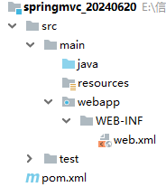

## 添加依赖
```xml
<?xml version="1.0" encoding="UTF-8"?>
<project xmlns="http://maven.apache.org/POM/4.0.0"
         xmlns:xsi="http://www.w3.org/2001/XMLSchema-instance"
         xsi:schemaLocation="http://maven.apache.org/POM/4.0.0 
      http://maven.apache.org/xsd/maven-4.0.0.xsd">
    <modelVersion>4.0.0</modelVersion>

    <groupId>com.xszx</groupId>
    <artifactId>springmvc_20240620</artifactId>
    <version>1.0-SNAPSHOT</version>
    <packaging>war</packaging>

    <dependencies>
        <!-- SpringMVC -->
        <dependency>
            <groupId>org.springframework</groupId>
            <artifactId>spring-webmvc</artifactId>
            <version>5.3.1</version>
        </dependency>

        <!-- 日志 -->
        <dependency>
            <groupId>ch.qos.logback</groupId>
            <artifactId>logback-classic</artifactId>
            <version>1.2.3</version>
        </dependency>

        <!-- ServletAPI -->
        <dependency>
            <groupId>javax.servlet</groupId>
            <artifactId>javax.servlet-api</artifactId>
            <version>3.1.0</version>
            <scope>provided</scope>
        </dependency>
    </dependencies>

    <build>
        <plugins>
            <plugin>
                <groupId>org.apache.tomcat.maven</groupId>
                <artifactId>tomcat7-maven-plugin</artifactId>
                <version>2.2</version>
                <configuration>
                    <port>8080</port>
                    <path>/</path>
                    <uriEncoding>UTF-8</uriEncoding>
                    <server>tomcat7</server>
                </configuration>
            </plugin>
        </plugins>
    </build>
</project>
```

> <font style="color:rgb(51, 51, 51);">注：由于 Maven 的传递性，我们不必将所有需要的包全部配置依赖，而是配置最顶端的依赖，其他靠传递性导入。</font>
>

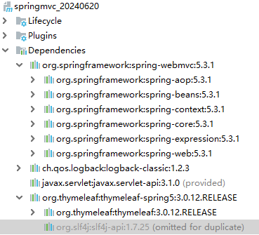

## 配置 web.xml
<font style="color:rgb(51, 51, 51);">注册 SpringMVC 的前端控制器 DispatcherServlet。</font>

```xml
<?xml version="1.0" encoding="UTF-8"?>
<web-app xmlns="http://xmlns.jcp.org/xml/ns/javaee"
         xmlns:xsi="http://www.w3.org/2001/XMLSchema-instance"
         xsi:schemaLocation="http://xmlns.jcp.org/xml/ns/javaee 
        http://xmlns.jcp.org/xml/ns/javaee/web-app_4_0.xsd"
         version="4.0">

    <!-- 配置SpringMVC的前端控制器，对浏览器发起的请求进行统一处理 -->
    <servlet>
        <servlet-name>dispatcherServlet</servlet-name>
        <servlet-class>org.springframework.web.servlet.DispatcherServlet</servlet-class>
        <!-- 通过初始化参数指定SpringMVC配置文件的路径和名称 -->
        <init-param>
            <!-- 参数名contextConfigLocation是固定值 -->
            <param-name>contextConfigLocation</param-name>
            <param-value>classpath:springMVC.xml</param-value>
        </init-param>
        <!-- 表示服务器一启动就会加载该Servlet -->
        <load-on-startup>1</load-on-startup>
    </servlet>
    
    <servlet-mapping>
        <servlet-name>dispatcherServlet</servlet-name>
        <!--
            / 所匹配的请求可以是/login或.html或.js或.css方式的请求路径
            但是/不能匹配.jsp请求路径的请求
        -->
        <url-pattern>/</url-pattern>
    </servlet-mapping>
</web-app>
```

> 注：
>
> <url-pattern> 标签中使用 / 和 /* 的区别：
>
> / 所匹配的请求可以是 /login 或 .html 或 .js 或 .css 方式的请求路径，但是 / 不能匹配 .jsp 请求路径的请求
>
> 因此就可以避免在访问 jsp 页面时，该请求被 DispatcherServlet 处理，从而找不到相应的页面
>
> /* 则能够匹配所有请求，例如在使用过滤器时，若需要对所有请求进行过滤，就需要使用 \* 的写法
>

## 编写 SpringMVC 的配置文件
```xml
<?xml version="1.0" encoding="UTF-8"?>
<beans xmlns="http://www.springframework.org/schema/beans"
       xmlns:xsi="http://www.w3.org/2001/XMLSchema-instance"
       xmlns:context="http://www.springframework.org/schema/context"
       xmlns:mvc="http://www.springframework.org/schema/mvc"
       xsi:schemaLocation="http://www.springframework.org/schema/beans 
  http://www.springframework.org/schema/beans/spring-beans.xsd 
  http://www.springframework.org/schema/context 
  https://www.springframework.org/schema/context/spring-context.xsd 
  http://www.springframework.org/schema/mvc 
  https://www.springframework.org/schema/mvc/spring-mvc.xsd">

    <!-- 配置扫描 -->
    <context:component-scan base-package="com.xszx.controller"></context:component-scan>

    <!-- 配置注解驱动 -->
    <mvc:annotation-driven></mvc:annotation-driven>
</beans>
```

## 编写 controller 层代码
```java
package com.xszx.controller;

import org.springframework.stereotype.Controller;
import org.springframework.web.bind.annotation.RequestMapping;

@Controller // 将该类交给SpringMVC容器管理
@RequestMapping("/hello") // 请求映射路径
public class HelloController {

    @RequestMapping("/say") // 请求映射路径
    public String say(){
        System.out.println("say...");
        return "/abc.jsp"; // 转发到根目录底下的abc.jsp页面
    }
}
```

## 编写 abc.jsp 页面
```html
<%@ page contentType="text/html;charset=UTF-8" language="java" %>
<html>
<head>
    <title>Title</title>
</head>
<body>
  <h1>我是abc.jsp页面中的内容！</h1>
</body>
</html>
```

## 启动项目访问
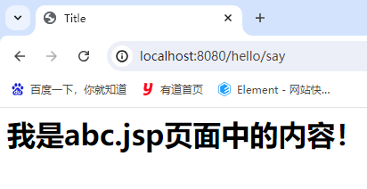

## 运行流程总结
1. Tomcat 启动后，会加载解析项目中的 web.xml 文件，就会创建好 DispatcherServlet 对象
2. DispatcherServlet 对象创建后就会执行 init 初始化方法
3. 在初始化方法中启动 SpringMVC 容器
4. SpringMVC 容器会扫描标注了 @Controller 注解的类
5. 浏览器发起请求：[http://localhost:8080/hello/say](http://localhost:8080/hello/say) 就会到达 DispatcherServlet，DispatcherServlet 会根据 /hello 找到 HelloController，根据 /say 就找到了 HelloController 中的 say 方法，然后执行
6. 方法执行完后，响应浏览器

# <font style="color:rgb(51, 51, 51);">三、@RequestMapping 注解</font>
## @RequestMapping 注解的功能
+ <font style="color:rgb(51, 51, 51);">从注解名称上我们可以看到，@RequestMapping 注解的作用就是将请求和处理请求的控制器方法关联起来，建立映射关系。</font>
+ <font style="color:rgb(51, 51, 51);">SpringMVC 接收到指定的请求，就会来找到在映射关系中对应的控制器方法来处理这个请求。</font>

## <font style="color:rgb(51, 51, 51);">@RequestMapping 注解的位置</font>
+ <font style="color:rgb(51, 51, 51);">@RequestMapping 标识一个类：设置映射请求的请求路径的初始信息</font>
+ <font style="color:rgb(51, 51, 51);">@RequestMapping 标识一个方法：设置映射请求的请求路径的具体信息</font>
+ <font style="color:rgb(51, 51, 51);">案例：</font>

```java
@Controller
@RequestMapping("/test")
public class RequestMappingController {

	//此时请求映射所映射的请求的请求路径为：/test/testRequestMapping
    @RequestMapping("/testRequestMapping")
    public String testRequestMapping(){
        return "/success.jsp";
    }
}
```

## <font style="color:rgb(51, 51, 51);">@RequestMapping 注解的 value 属性</font>
+ <font style="color:rgb(51, 51, 51);">@RequestMapping 注解的 value 属性通过请求的请求地址匹配请求映射</font>
+ <font style="color:rgb(51, 51, 51);">@RequestMapping 注解的 value 属性是一个字符串类型的数组，表示该请求映射能够匹配多个请求地址所对应的请求</font>
+ <font style="color:rgb(51, 51, 51);">@RequestMapping 注解的 value 属性必须设置，至少通过请求地址匹配请求映射</font>
+ <font style="color:rgb(51, 51, 51);">案例：</font>

```java
package com.xszx.controller;

import org.springframework.stereotype.Controller;
import org.springframework.web.bind.annotation.RequestMapping;

@Controller // 将该类交给SpringMVC容器管理
@RequestMapping("/hello") // 请求映射路径
public class HelloController {

    @RequestMapping(value = {"/say", "/hi"}) // 请求映射路径可以是 say 或者 hi
    public String say(){
        System.out.println("say...");
        return "/abc.jsp"; // 转发到根目录底下的abc.jsp页面
    }
}
```

## <font style="color:rgb(51, 51, 51);">@RequestMapping 注解的 method 属性</font>
+ <font style="color:rgb(51, 51, 51);">@RequestMapping 注解的 method 属性通过请求的请求方式（get 或 post）匹配请求映射</font>
+ <font style="color:rgb(51, 51, 51);">@RequestMapping 注解的 method 属性是一个 RequestMethod 类型的数组，表示该请求映射能够匹配多种请求方式的请求</font>
+ <font style="color:rgb(51, 51, 51);">若当前请求的请求地址满足请求映射的value属性，但是请求方式不满足 method 属性，则浏览器报错405：Request method 'POST' not supported</font>
+ <font style="color:rgb(51, 51, 51);">案例：</font>

```java
package com.xszx.controller;

import org.springframework.http.HttpMethod;
import org.springframework.stereotype.Controller;
import org.springframework.web.bind.annotation.RequestMapping;
import org.springframework.web.bind.annotation.RequestMethod;

@Controller // 将该类交给SpringMVC容器管理
@RequestMapping("/hello") // 请求映射路径
public class HelloController {

    // 表示请求路径是 /test2，请求方式是 get 或者 post
    @RequestMapping(value = "/test2", method = {RequestMethod.GET, RequestMethod.POST})
    public String test2(){
        return "/abc.jsp";
    }		
}

```

+ 注意：
    - 对于处理指定请求方式的控制器方法，SpringMVC 中提供了 @RequestMapping 的派生注解
        * 处理 get 请求的映射-->@GetMapping
        * 处理 post 请求的映射-->@PostMapping
        * 处理 put 请求的映射-->@PutMapping
        * 处理 delete 请求的映射-->@DeleteMapping
    - 常用的请求方式有 get，post，put，delete，但是目前浏览器只支持 get 和 post，若在 form 表单提交时，为 method 设置了其他请求方式的字符串（put 或 delete），则按照默认的请求方式get 处理
    - 若要发送 put 和 delete 请求，则需要通过 Spring 提供的过滤器 HiddenHttpMethodFilter，在RESTful 部分会讲到

# <font style="color:rgb(51, 51, 51);">四、SpringMVC 获取请求参数</font>
## <font style="color:rgb(51, 51, 51);">通过 Servlet API 获取</font>
<font style="color:rgb(51, 51, 51);">将 HttpServletRequest 作为控制器方法的形参，此时 HttpServletRequest 类型的参数表示封装了当前请求的请求报文的对象。</font>

```java
@Controller // 将该类交给SpringMVC容器管理
@RequestMapping("/hello") // 请求映射路径
public class HelloController {

    @RequestMapping("/test3")
    public String test3(HttpServletRequest request){
        String username = request.getParameter("username");
        String password = request.getParameter("password");
        System.out.println("username = " + username + ", password = " + password);
        return "/abc.jsp";
    }
}
```

## <font style="color:rgb(51, 51, 51);">通过控制器方法的形参获取请求参数</font>
<font style="color:rgb(51, 51, 51);">在控制器方法的形参位置，设置和请求参数同名的形参，当浏览器发送请求，匹配到请求映射时，在DispatcherServlet 中就会将请求参数赋值给相应的形参。</font>

```java
@Controller // 将该类交给SpringMVC容器管理
@RequestMapping("/hello") // 请求映射路径
public class HelloController {
    
    @RequestMapping("/test4")
    public String test4(String name, Integer age){
        System.out.println("name = " + name + ", age = " + age);
        return "/abc.jsp";
    }
}
```

说明：

+ 若请求所传输的请求参数中有多个同名的请求参数，此时可以在控制器方法的形参中设置字符串数组或者字符串类型的形参接收此请求参数
+ 若使用字符串数组类型的形参，此参数的数组中包含了每一个数据
+ 若使用字符串类型的形参，此参数的值为每个数据中间使用逗号拼接的结果

## <font style="color:rgb(51, 51, 51);">@RequestParam</font>
+ <font style="color:rgb(51, 51, 51);">@RequestParam 是将请求参数和控制器方法的形参创建映射关系</font>
+ <font style="color:rgb(51, 51, 51);">@RequestParam 注解一共有三个属性：</font>
    - <font style="color:rgb(51, 51, 51);">value：指定为形参赋值的请求参数的参数名</font>
    - <font style="color:rgb(51, 51, 51);">required：设置是否必须传输此请求参数，默认值为 true</font>
        * <font style="color:rgb(51, 51, 51);">若设置为 true 时，则当前请求必须传输 value 所指定的请求参数，若没有传输该请求参数，且没有设置 defaultValue 属性，则页面报错 400：Required String parameter 'xxx' is not present；</font>
        * <font style="color:rgb(51, 51, 51);">若设置为 false，则当前请求不是必须传输 value 所指定的请求参数，若没有传输，则注解所标识的形参的值为 null</font>
    - <font style="color:rgb(51, 51, 51);">defaultValue：不管 required 属性值为 true 或 false，当 value 所指定的请求参数没有传输或传输的值为""时，则使用默认值为形参赋值</font>
+ 案例：

```java
@Controller // 将该类交给SpringMVC容器管理
@RequestMapping("/hello") // 请求映射路径
public class HelloController {

    @RequestMapping("/test5")
    public String test5(@RequestParam(value = "id", required = true, defaultValue = "1") String userId){
        System.out.println("userId = " + userId);
        return "/abc.jsp";
    }
}
```

## <font style="color:rgb(51, 51, 51);">通过实体类获取请求参数</font>
<font style="color:rgb(51, 51, 51);">可以在控制器方法的形参位置设置一个实体类类型的形参，此时若浏览器传输的请求参数的参数名和实体类中的属性名一致，那么请求参数就会为此属性赋值。</font>

```java
package com.xszx.bean;

public class User {
    
    private String name;
    private String sex;
    private Integer age;

    public String getName() {
        return name;
    }

    public void setName(String name) {
        this.name = name;
    }

    public String getSex() {
        return sex;
    }

    public void setSex(String sex) {
        this.sex = sex;
    }

    public Integer getAge() {
        return age;
    }

    public void setAge(Integer age) {
        this.age = age;
    }

    @Override
    public String toString() {
        return "User{" +
                "name='" + name + '\'' +
                ", sex='" + sex + '\'' +
                ", age=" + age +
                '}';
    }
}
```

```html
<%@ page contentType="text/html;charset=UTF-8" language="java" %>
<html>
<head>
    <title>Title</title>
</head>
<body>
<form action="hello/test6" method="post">
    <p>
        姓名：<input type="text" name="name">
    </p>
    <p>
        性别：
        <input type="radio" value="男" name="sex">男
        <input type="radio" value="女" name="sex">女
    </p>
    <p>
        年龄：<input type="text" name="age">
    </p>
    <p>
        <input type="submit" value="保存">
    </p>
</form>
</body>
</html>
```

```java
@Controller // 将该类交给SpringMVC容器管理
@RequestMapping("/hello") // 请求映射路径
public class HelloController {

    @RequestMapping("/test6")
    public String test6(User user){
        System.out.println(user);
        return "/abc.jsp";
    }
}
```

## <font style="color:rgb(51, 51, 51);">解决获取请求参数的乱码问题</font>
<font style="color:rgb(51, 51, 51);">解决获取请求参数的乱码问题，可以使用 SpringMVC 提供的编码过滤器 CharacterEncodingFilter，只需要在 web.xml 中进行注册。</font>

```xml
<filter>
    <filter-name>characterEncodingFilter</filter-name>
    <filter-class>org.springframework.web.filter.CharacterEncodingFilter</filter-class>
    <init-param>
        <param-name>encoding</param-name>
        <param-value>utf-8</param-value>
    </init-param>
    <init-param>
        <param-name>forceResponseEncoding</param-name>
        <param-value>true</param-value>
    </init-param>
</filter>

<filter-mapping>
    <filter-name>characterEncodingFilter</filter-name>
    <url-pattern>/*</url-pattern>
</filter-mapping>
```

# <font style="color:rgb(51, 51, 51);">五、域对象共享数据</font>
## <font style="color:rgb(51, 51, 51);">使用 ServletAPI 向 request 域对象共享数据</font>
```java
@Controller // 将该类交给SpringMVC容器管理
@RequestMapping("/hello") // 请求映射路径
public class HelloController {

    @RequestMapping("/test7")
    public String test7(HttpServletRequest request){
        request.setAttribute("name", "吕布");
        return "/abc.jsp";
    }
}
```

```html
<%@ page contentType="text/html;charset=UTF-8" language="java" %>
<html>
<head>
    <title>Title</title>
</head>
<body>
<h1>我是abc.jsp页面中的内容！</h1>
<p>姓名：${name}</p>
</body>
</html>
```

## <font style="color:rgb(51, 51, 51);">使用 ModelAndView 向 request 域对象共享数据</font>
```java
@Controller // 将该类交给SpringMVC容器管理
@RequestMapping("/hello") // 请求映射路径
public class HelloController {

    @RequestMapping("/test8")
    public ModelAndView test8(){
        // ModelAndView 可以设置要往request域中放的数据和设置视图
        ModelAndView mav = new ModelAndView();
        mav.addObject("age", 20);
        mav.setViewName("/abc.jsp");
        return mav;
    }
}
```

```html
<%@ page contentType="text/html;charset=UTF-8" language="java" %>
<html>
<head>
    <title>Title</title>
</head>
<body>
<h1>我是abc.jsp页面中的内容！</h1>
<p>姓名：${name}</p>
<p>年龄：${age}</p>
</body>
</html>
```

## <font style="color:rgb(51, 51, 51);">使用 Model 向 request 域对象共享数据</font>
```java
@Controller // 将该类交给SpringMVC容器管理
@RequestMapping("/hello") // 请求映射路径
public class HelloController {

    @RequestMapping("/test9")
    public String test9(Model model){
        model.addAttribute("sex", "男");
        return "/abc.jsp";
    }
}
```

```html
<%@ page contentType="text/html;charset=UTF-8" language="java" %>
<html>
<head>
    <title>Title</title>
</head>
<body>
<h1>我是abc.jsp页面中的内容！</h1>
<p>姓名：${name}</p>
<p>年龄：${age}</p>
<p>性别：${sex}</p>
</body>
</html>
```

## <font style="color:rgb(51, 51, 51);">使用 map 向 request 域对象共享数据</font>
```java
@Controller // 将该类交给SpringMVC容器管理
@RequestMapping("/hello") // 请求映射路径
public class HelloController {

    @RequestMapping("/test10")
    public String test10(Map<String, Object> map){
        map.put("address", "山西");
        return "/abc.jsp";
    }
}
```

```html
<%@ page contentType="text/html;charset=UTF-8" language="java" %>
<html>
<head>
    <title>Title</title>
</head>
<body>
<h1>我是abc.jsp页面中的内容！</h1>
<p>姓名：${name}</p>
<p>年龄：${age}</p>
<p>性别：${sex}</p>
<p>地址：${address}</p>
</body>
</html>
```

## <font style="color:rgb(51, 51, 51);">使用 ModelMap 向 request 域对象共享数据</font>
```java
@Controller // 将该类交给SpringMVC容器管理
@RequestMapping("/hello") // 请求映射路径
public class HelloController {

    @RequestMapping("/test11")
    public String test11(ModelMap modelMap){
        modelMap.addAttribute("birthday", new Date());
        return "/abc.jsp";
    }
}
```

```html
<%@ page contentType="text/html;charset=UTF-8" language="java" %>
<html>
<head>
    <title>Title</title>
</head>
<body>
<h1>我是abc.jsp页面中的内容！</h1>
<p>姓名：${name}</p>
<p>年龄：${age}</p>
<p>性别：${sex}</p>
<p>地址：${address}</p>
<p>生日：${birthday}</p>
</body>
</html>
```

## <font style="color:rgb(51, 51, 51);">Model、ModelMap、Map 的关系</font>
<font style="color:rgb(51, 51, 51);">Model、ModelMap、Map 类型的参数其实本质上都是 BindingAwareModelMap 类型的.</font>

```java
public interface Model{}
public class ModelMap extends LinkedHashMap<String, Object> {}
public class ExtendedModelMap extends ModelMap implements Model {}
public class BindingAwareModelMap extends ExtendedModelMap {}
```

## <font style="color:rgb(51, 51, 51);">向 session 域共享数据</font>
```java
@Controller // 将该类交给SpringMVC容器管理
@RequestMapping("/hello") // 请求映射路径
public class HelloController {

    @RequestMapping("/test12")
    public String test12(HttpSession session){
        session.setAttribute("hobby", "抽烟,喝酒,烫头");
        return "/abc.jsp";
    }
}
```

```html
<%@ page contentType="text/html;charset=UTF-8" language="java" %>
<html>
<head>
    <title>Title</title>
</head>
<body>
<h1>我是abc.jsp页面中的内容！</h1>
<p>姓名：${name}</p>
<p>年龄：${age}</p>
<p>性别：${sex}</p>
<p>地址：${address}</p>
<p>生日：${birthday}</p>
<p>爱好：${hobby}</p>
</body>
</html>
```

## <font style="color:rgb(51, 51, 51);">向 application 域共享数据</font>
```java
@Controller // 将该类交给SpringMVC容器管理
@RequestMapping("/hello") // 请求映射路径
public class HelloController {

    @RequestMapping("/test13")
    public String test13(HttpSession session){
        ServletContext application = session.getServletContext();
        application.setAttribute("desc", "啦啦啦");
        return "/abc.jsp";
    }
}
```

```html
<%@ page contentType="text/html;charset=UTF-8" language="java" %>
<html>
<head>
    <title>Title</title>
</head>
<body>
<h1>我是abc.jsp页面中的内容！</h1>
<p>姓名：${name}</p>
<p>年龄：${age}</p>
<p>性别：${sex}</p>
<p>地址：${address}</p>
<p>生日：${birthday}</p>
<p>爱好：${hobby}</p>
<p>介绍：${desc}</p>
</body>
</html>
```

# <font style="color:rgb(51, 51, 51);">六、SpringMVC 的视图解析器</font>
## 概述
+ 控制层的方法处理完请求后，对请求的响应可以是转发、重定向或直接响应。
+ 对于转发和重定向，在 SpringMVC 中我们是通过返回值来告诉 DispatcherServlet 如何处理此次请求的响应的。
+ 我们返回值中是 forward 前缀，则表示要转发，如果是 redirect 前缀，则表示要重定向。
+ DispatcherServlet 收到返回值后根据前缀来进行判断是如何处理响应，它将处理响应的代码封装到了一个对象中，那这个对象就是视图解析器。

## 分类
视图解析器分为3种：

+ InternalResourceView：用来做请求转发
+ RedirectView：用来做重定向
+ ModelAndView：用来做请求转发和重定向

我们也可以在控制层方法处理完请求进行响应的时候，直接 return 某个视图！

## 案例
### 请求转发案例
```java
@Controller // 将该类交给SpringMVC容器管理
@RequestMapping("/hello") // 请求映射路径
public class HelloController {

    @RequestMapping("/test14")
    public View test14(){
        System.out.println("test14.........");
        // 请求转发到根目录下的abc.jsp页面
        return new InternalResourceView("/abc.jsp");
    }
}
```

### 请求重定向案例
```java
@Controller // 将该类交给SpringMVC容器管理
@RequestMapping("/hello") // 请求映射路径
public class HelloController {

    @RequestMapping("/test15")
    public View test15(){
        System.out.println("test15.........");
        // 重定向到根目录下的abc.jsp页面
        return new RedirectView("/abc.jsp");
    }
}
```

### ModelAndView 案例
```java
@Controller // 将该类交给SpringMVC容器管理
@RequestMapping("/hello") // 请求映射路径
public class HelloController {

    @RequestMapping("/test16")
    public ModelAndView test16(){
        ModelAndView mav = new ModelAndView();
        mav.addObject("msg", "哈哈");
        // 将请求转发到根目录下的abc.jsp页面
        // mav.setViewName("forward:/abc.jsp");
        // 将请求重定向到根目录下的abc.jsp页面
        mav.setViewName("redirect:/abc.jsp");
        return mav;
    }
}
```

## <font style="color:rgb(0,0,0);">自定义视图解析器</font>
### 概述
在实际开发中，我们的页面一般是按照模块功能来进行存放的，会有多级目录。

比如将页面放在 webapp/personManager/empManager/empList.jsp。

这样的话，我们在控制层方法中处理完请求后，要转发到一个页面的话，是要写比较长的路径的，还是比较麻烦的，怎么处理？

我们可以在 SpringMVC 现有的视图解析器上进行扩展，可以指定一个前缀和后缀，前缀就是这个多级目录，后缀就是 .jsp，这样我们方法的返回值只需要写页面名字即可！

前缀：prefix

后缀：suffix

### 案例
#### 编写 SpringMVC 配置文件
在 SpringMVC 的配置文件中添加如下内容：

```xml
<!-- 配置视图解析器，转发用 -->
  <bean class="org.springframework.web.servlet.view.InternalResourceViewResolver">

      <!-- 配置页面的前缀，注意开始和结尾的 / 不要丢掉 -->
      <property name="prefix" value="/personManager/empManager/"></property>
      <!-- 配置页面的后缀 -->
      <property name="suffix" value=".jsp"></property>
  </bean>
```

#### 编写 Controller 方法
```java
@Controller // 将该类交给SpringMVC容器管理
@RequestMapping("/hello") // 请求映射路径
public class HelloController {

    @RequestMapping("/test17")
    public String test17(){
        System.out.println("test17.......");
        return "empList"; // 这里写的是视图的名字
    }
}
```

#### 编写页面
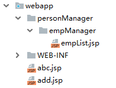

### 说明
+ 如果在 Controller 方法的返回值是这样写的：return "forward: /emp/list.jsp"，就不会执行我们配置好的视图解析器了，会直接根据这个路径去走转发。
+ 如果在 Controller 方法的返回值是这样写的：return "redirect: /emp/list.jsp"，表示重定向到指定的页面，也不会执行我们配置的视图解析器。

## <font style="color:rgb(0,0,0);">WEB-INF 目录中的页面</font>
### 概述
WEB-INF 目录是一个受保护的目录，这个目录下的资源是不能直接被浏览器发请求访问到的，只能是通过服务器内部转发才能访问到！

在实际开发中，我们往往会将页面放在 WEB-INF 目录中，而且会根据不同的模块功能，在 WEB-INF 目录中创建多级目录来存放页面！

### 案例
#### 编写 SpringMVC 配置文件
```xml
<!-- 配置视图解析器，转发用 -->
  <bean class="org.springframework.web.servlet.view.InternalResourceViewResolver">

      <!-- 配置页面的前缀，注意开始和结尾的 / 不要丢掉 -->
      <property name="prefix" value="/WEB-INF/test1/test2/"></property>
      <!-- 配置页面的后缀 -->
      <property name="suffix" value=".jsp"></property>
  </bean>
```

#### 编写 Controller 方法
```java
@Controller // 将该类交给SpringMVC容器管理
@RequestMapping("/hello") // 请求映射路径
public class HelloController {

    @RequestMapping("/test18")
    public String test18(){
        System.out.println("test18.....");
        return "demo";
    }
}
```

#### 编写页面
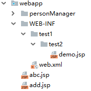

# <font style="color:rgb(51, 51, 51);">七、RESTful</font>
## RESTful 简介
<font style="color:rgb(51, 51, 51);">REST：</font>**<font style="color:rgb(51, 51, 51);">Re</font>**<font style="color:rgb(51, 51, 51);">presentational </font>**<font style="color:rgb(51, 51, 51);">S</font>**<font style="color:rgb(51, 51, 51);">tate </font>**<font style="color:rgb(51, 51, 51);">T</font>**<font style="color:rgb(51, 51, 51);">ransfer，表现层资源状态转移。</font>

**<font style="color:rgb(51, 51, 51);">a>资源</font>**

<font style="color:rgb(51, 51, 51);">资源是一种看待服务器的方式，即，将服务器看作是由很多离散的资源组成。每个资源是服务器上一个可命名的抽象概念。因为资源是一个抽象的概念，所以它不仅仅能代表服务器文件系统中的一个文件、数据库中的一张表等等具体的东西，可以将资源设计的要多抽象有多抽象，只要想象力允许而且客户端应用开发者能够理解。与面向对象设计类似，资源是以名词为核心来组织的，首先关注的是名词。一个资源可以由一个或多个 URI 来标识。URI 既是资源的名称，也是资源在 Web 上的地址。对某个资源感兴趣的客户端应用，可以通过资源的URI与其进行交互。</font>

**<font style="color:rgb(51, 51, 51);">b>资源的表述</font>**

<font style="color:rgb(51, 51, 51);">资源的表述是一段对于资源在某个特定时刻的状态的描述。可以在客户端-服务器端之间转移（交换）。资源的表述可以有多种格式，例如 HTML/XML/JSON/纯文本/图片/视频/音频 等等。资源的表述格式可以通过协商机制来确定。请求-响应方向的表述通常使用不同的格式。</font>

**<font style="color:rgb(51, 51, 51);">c>状态转移</font>**

<font style="color:rgb(51, 51, 51);">状态转移说的是：在客户端和服务器端之间转移（transfer）代表资源状态的表述。通过转移和操作资源的表述，来间接实现操作资源的目的。</font>

## <font style="color:rgb(51, 51, 51);">RESTful 的实现</font>
<font style="color:rgb(51, 51, 51);">具体说，就是 HTTP 协议里面，四个表示操作方式的动词：GET、POST、PUT、DELETE。</font>

<font style="color:rgb(51, 51, 51);">它们分别对应四种基本操作：GET 用来获取资源，POST 用来新建资源，PUT 用来更新资源，DELETE 用来删除资源。</font>

<font style="color:rgb(51, 51, 51);">REST 风格提倡 URL 地址使用统一的风格设计，从前到后各个单词使用斜杠分开，不使用问号键值对方式携带请求参数，而是将要发送给服务器的数据作为 URL 地址的一部分，以保证整体风格的一致性。</font>

| **<font style="color:rgb(51, 51, 51);">操作</font>** | **<font style="color:rgb(51, 51, 51);">传统方式</font>** | **<font style="color:rgb(51, 51, 51);">REST风格</font>** |
| :--- | :--- | :--- |
| <font style="color:rgb(51, 51, 51);">查询操作</font> | <font style="color:rgb(51, 51, 51);">getUserById?id=1</font> | <font style="color:rgb(51, 51, 51);">user/1-->get请求方式</font> |
| <font style="color:rgb(51, 51, 51);">保存操作</font> | <font style="color:rgb(51, 51, 51);">saveUser</font> | <font style="color:rgb(51, 51, 51);">user-->post请求方式</font> |
| <font style="color:rgb(51, 51, 51);">删除操作</font> | <font style="color:rgb(51, 51, 51);">deleteUser?id=1</font> | <font style="color:rgb(51, 51, 51);">user/1-->delete请求方式</font> |
| <font style="color:rgb(51, 51, 51);">更新操作</font> | <font style="color:rgb(51, 51, 51);">updateUser</font> | <font style="color:rgb(51, 51, 51);">user-->put请求方式</font> |


## <font style="color:rgb(51, 51, 51);">HiddenHttpMethodFilter</font>
<font style="color:rgb(51, 51, 51);">由于浏览器只支持发送 get 和 post 方式的请求，那么该如何发送 put 和 delete 请求呢？</font>

<font style="color:rgb(51, 51, 51);">SpringMVC 提供了 </font>**<font style="color:rgb(51, 51, 51);">HiddenHttpMethodFilter</font>**<font style="color:rgb(51, 51, 51);"> 帮助我们</font>**<font style="color:rgb(51, 51, 51);">将 POST 请求转换为 DELETE 或 PUT 请求</font>**

**<font style="color:rgb(51, 51, 51);">HiddenHttpMethodFilter</font>**<font style="color:rgb(51, 51, 51);"> 处理 put 和 delete 请求的条件：</font>

<font style="color:rgb(51, 51, 51);">a>当前请求的请求方式必须为 post</font>

<font style="color:rgb(51, 51, 51);">b>当前请求必须传输请求参数 _method</font>

<font style="color:rgb(51, 51, 51);">满足以上条件，</font>**<font style="color:rgb(51, 51, 51);">HiddenHttpMethodFilter</font>**<font style="color:rgb(51, 51, 51);"> 过滤器就会将当前请求的请求方式转换为请求参数 _method的值，因此请求参数 _method 的值才是最终的请求方式</font>

<font style="color:rgb(51, 51, 51);">在 web.xml 中注册 </font>**<font style="color:rgb(51, 51, 51);">HiddenHttpMethodFilter</font>**

```xml
<filter>
    <filter-name>HiddenHttpMethodFilter</filter-name>
    <filter-class>org.springframework.web.filter.HiddenHttpMethodFilter</filter-class>
</filter>
<filter-mapping>
    <filter-name>HiddenHttpMethodFilter</filter-name>
    <url-pattern>/*</url-pattern>
</filter-mapping>
```

注意：

+ 目前为止，SpringMVC 中提供了两个过滤器：CharacterEncodingFilter 和 HiddenHttpMethodFilter
+ 在web.xml 中注册时，必须先注册 CharacterEncodingFilter，再注册 HiddenHttpMethodFilter

原因：

+ 在 CharacterEncodingFilter 中通过 request.setCharacterEncoding(encoding) 方法设置字符集的
+ request.setCharacterEncoding(encoding) 方法要求前面不能有任何获取请求参数的操作
+ 而 HiddenHttpMethodFilter 恰恰有一个获取请求方式的操作：

```java
String paramValue = request.getParameter(this.methodParam);
```

# 八、SSM 整合
## 说明
SSM 三个框架整合之后：

SpringMVC 框架负责 Controller 层的管理

Spring 框架负责 service 层 和 dao 层的管理

MyBatis 框架负责 dao 层操作数据库

SpringMVC 容器是子容器，Spring 容器是父容器，子容器可以从父容器中获取内容，但是父容器可不能从子容器中获取内容。

## 项目搭建
### 创建数据库及表
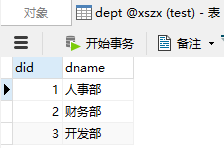

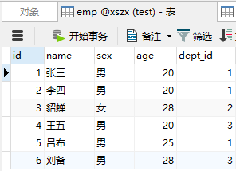

### 创建 Maven 项目
创建一个 Maven web 项目，打包方式是 war，注意项目的目录结构。

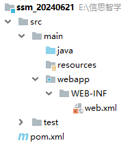

### 添加依赖
```xml
<?xml version="1.0" encoding="UTF-8"?>
<project xmlns="http://maven.apache.org/POM/4.0.0"
         xmlns:xsi="http://www.w3.org/2001/XMLSchema-instance"
         xsi:schemaLocation="http://maven.apache.org/POM/4.0.0 http://maven.apache.org/xsd/maven-4.0.0.xsd">
    <modelVersion>4.0.0</modelVersion>

    <groupId>com.xszx</groupId>
    <artifactId>ssm_20240621</artifactId>
    <version>1.0-SNAPSHOT</version>
    <packaging>war</packaging>

    <dependencies>

        <dependency>
            <groupId>org.springframework</groupId>
            <artifactId>spring-webmvc</artifactId>
            <version>5.3.20</version>
        </dependency>

        <!-- ServletAPI -->
        <dependency>
            <groupId>javax.servlet</groupId>
            <artifactId>javax.servlet-api</artifactId>
            <version>3.1.0</version>
            <scope>provided</scope>
        </dependency>

        <!--spring context依赖-->
        <!--当你引入Spring Context依赖之后，表示将Spring的基础依赖引入了-->
        <dependency>
            <groupId>org.springframework</groupId>
            <artifactId>spring-context</artifactId>
            <version>5.3.20</version>
        </dependency>

        <!--spring对junit的支持相关依赖-->
        <dependency>
            <groupId>org.springframework</groupId>
            <artifactId>spring-test</artifactId>
            <version>5.3.20</version>
        </dependency>

        <!--spring jdbc  Spring 持久化层支持jar包-->
        <dependency>
            <groupId>org.springframework</groupId>
            <artifactId>spring-jdbc</artifactId>
            <version>5.3.20</version>
        </dependency>
        <!-- MySQL驱动 -->
        <dependency>
            <groupId>mysql</groupId>
            <artifactId>mysql-connector-java</artifactId>
            <version>5.1.47</version>
        </dependency>
        <!-- 数据源 -->
        <dependency>
            <groupId>com.alibaba</groupId>
            <artifactId>druid</artifactId>
            <version>1.2.15</version>
        </dependency>

        <!--junit5测试-->
        <dependency>
            <groupId>org.junit.jupiter</groupId>
            <artifactId>junit-jupiter-api</artifactId>
            <version>5.3.1</version>
        </dependency>

        <!--log4j2的依赖-->
        <dependency>
            <groupId>org.apache.logging.log4j</groupId>
            <artifactId>log4j-core</artifactId>
            <version>2.19.0</version>
        </dependency>
        <dependency>
            <groupId>org.apache.logging.log4j</groupId>
            <artifactId>log4j-slf4j2-impl</artifactId>
            <version>2.19.0</version>
        </dependency>

        <!-- Mybatis核心 -->
        <dependency>
            <groupId>org.mybatis</groupId>
            <artifactId>mybatis</artifactId>
            <version>3.5.7</version>
        </dependency>

        <!-- Spring 整合 MyBatis 的依赖 -->
        <dependency>
            <groupId>org.mybatis</groupId>
            <artifactId>mybatis-spring</artifactId>
            <version>1.3.2</version>
        </dependency>

        <dependency>
            <groupId>org.projectlombok</groupId>
            <artifactId>lombok</artifactId>
            <version>1.18.26</version>
        </dependency>

        <dependency>
            <groupId>com.github.pagehelper</groupId>
            <artifactId>pagehelper</artifactId>
            <version>5.2.0</version>
        </dependency>

        <dependency>
            <groupId>javax.servlet</groupId>
            <artifactId>jstl</artifactId>
            <version>1.2</version>
        </dependency>

        <dependency>
            <groupId>taglibs</groupId>
            <artifactId>standard</artifactId>
            <version>1.1.2</version>
        </dependency>
    </dependencies>

    <build>
        <plugins>
            <plugin>
                <groupId>org.apache.tomcat.maven</groupId>
                <artifactId>tomcat7-maven-plugin</artifactId>
                <version>2.2</version>
                <configuration>
                    <port>8080</port>
                    <path>/</path>
                    <uriEncoding>UTF-8</uriEncoding>
                    <server>tomcat7</server>
                </configuration>
            </plugin>
        </plugins>
    </build>
</project>
```

### 编写日志配置文件
```xml
<?xml version="1.0" encoding="UTF-8"?>
<configuration>
    <loggers>
        <!--
            level指定日志级别，从低到高的优先级：
                TRACE < DEBUG < INFO < WARN < ERROR < FATAL
                trace：追踪，是最低的日志级别，相当于追踪程序的执行
                debug：调试，一般在开发中，都将其设置为最低的日志级别
                info：信息，输出重要的信息，使用较多
                warn：警告，输出警告的信息
                error：错误，输出错误信息
                fatal：严重错误
        -->
        <root level="debug">
            <appender-ref ref="springlog"/>
            <appender-ref ref="RollingFile"/>
            <appender-ref ref="log"/>
        </root>
    </loggers>

    <appenders>
        <!--输出日志信息到控制台-->
        <console name="springlog" target="SYSTEM_OUT">
            <!--控制日志输出的格式-->
            <PatternLayout pattern="%d{yyyy-MM-dd HH:mm:ss SSS} [%t] %-3level %logger{1024} - %msg%n"/>
        </console>

        <!--文件会打印出所有信息，这个log每次运行程序会自动清空，由append属性决定，适合临时测试用-->
        <File name="log" fileName="d:/spring_log/test.log" append="false">
            <PatternLayout pattern="%d{HH:mm:ss.SSS} %-5level %class{36} %L %M - %msg%xEx%n"/>
        </File>

        <!-- 这个会打印出所有的信息，
            每次大小超过size，
            则这size大小的日志会自动存入按年份-月份建立的文件夹下面并进行压缩，
            作为存档-->
        <RollingFile name="RollingFile" fileName="d:/spring_log/app.log"
                     filePattern="log/$${date:yyyy-MM}/app-%d{MM-dd-yyyy}-%i.log.gz">
            <PatternLayout pattern="%d{yyyy-MM-dd 'at' HH:mm:ss z} %-5level %class{36} %L %M - %msg%xEx%n"/>
            <SizeBasedTriggeringPolicy size="50MB"/>
            <!-- DefaultRolloverStrategy属性如不设置，
            则默认为最多同一文件夹下7个文件，这里设置了20 -->
            <DefaultRolloverStrategy max="20"/>
        </RollingFile>
    </appenders>
</configuration>
```

### 编写数据库配置文件
```properties
jdbc.user=root
jdbc.password=root
jdbc.url=jdbc:mysql://localhost:3306/xszx?useUnicode=true&characterEncoding=utf-8
jdbc.driver=com.mysql.jdbc.Driver
```

### 编写 Spring 的配置文件
```xml
<?xml version="1.0" encoding="UTF-8"?>
<beans xmlns="http://www.springframework.org/schema/beans"
       xmlns:xsi="http://www.w3.org/2001/XMLSchema-instance"
       xmlns:context="http://www.springframework.org/schema/context" xmlns:tx="http://www.springframework.org/schema/tx"
       xsi:schemaLocation="http://www.springframework.org/schema/beans http://www.springframework.org/schema/beans/spring-beans.xsd http://www.springframework.org/schema/context https://www.springframework.org/schema/context/spring-context.xsd http://www.springframework.org/schema/tx http://www.springframework.org/schema/tx/spring-tx.xsd">

    <!-- 开启包扫描功能 -->
    <context:component-scan base-package="com.xszx">
        <!-- Spring扫描时排除标注了@Controller注解的类，因为Controller类都交给SpringMVC容器管理了 -->
        <context:exclude-filter type="annotation" expression="org.springframework.stereotype.Controller"/>
    </context:component-scan>

    <!-- 引入外部的属性配置文件 -->
    <context:property-placeholder location="classpath:jdbc.properties"></context:property-placeholder>

    <!-- 配置数据源 -->
    <bean id="dataSource" class="com.alibaba.druid.pool.DruidDataSource">
        <property name="driverClassName" value="${jdbc.driver}"></property>
        <property name="url" value="${jdbc.url}"></property>
        <property name="username" value="${jdbc.user}"></property>
        <property name="password" value="${jdbc.password}"></property>
    </bean>

    <!-- 整合MyBatis -->
    <bean id="sqlSessionFactory" class="org.mybatis.spring.SqlSessionFactoryBean">
        <property name="dataSource" ref="dataSource"></property>
        <!-- 设置映射文件的地址 -->
        <property name="mapperLocations" value="classpath:mapper/*.xml"></property>
        <!-- 给实体类起别名 -->
        <property name="typeAliasesPackage" value="com.xszx.bean"></property>
        <!-- 分页插件 -->
        <property name="plugins">
            <bean class="com.github.pagehelper.PageInterceptor"></bean>
        </property>
        <property name="configuration">
            <bean class="org.apache.ibatis.session.Configuration">
                <!-- 开启驼峰命名 -->
                <property name="mapUnderscoreToCamelCase" value="true"></property>
            </bean>
        </property>
    </bean>

    <!-- 扫描Mapper接口 -->
    <bean id="mapperScannerConfigurer" class="org.mybatis.spring.mapper.MapperScannerConfigurer">
        <property name="basePackage" value="com.xszx.mapper"></property>
    </bean>

    <!-- 配置事务管理器 -->
    <bean id="transactionManager" class="org.springframework.jdbc.support.JdbcTransactionManager">
        <property name="dataSource" ref="dataSource"></property>
    </bean>

    <!-- 开启事务注解驱动 -->
    <tx:annotation-driven></tx:annotation-driven>
</beans>
```

### 编写 SpringMVC 的配置文件
```xml
<?xml version="1.0" encoding="UTF-8"?>
<beans xmlns="http://www.springframework.org/schema/beans"
       xmlns:xsi="http://www.w3.org/2001/XMLSchema-instance"
       xmlns:context="http://www.springframework.org/schema/context"
       xmlns:mvc="http://www.springframework.org/schema/mvc"
       xsi:schemaLocation="http://www.springframework.org/schema/beans http://www.springframework.org/schema/beans/spring-beans.xsd http://www.springframework.org/schema/context https://www.springframework.org/schema/context/spring-context.xsd http://www.springframework.org/schema/mvc https://www.springframework.org/schema/mvc/spring-mvc.xsd">

    <!-- 扫描Controller层 -->
    <context:component-scan base-package="com.xszx.controller"></context:component-scan>

    <!-- 开启注解驱动 -->
    <mvc:annotation-driven></mvc:annotation-driven>

    <!-- 配置视图解析器 -->
    <bean class="org.springframework.web.servlet.view.InternalResourceViewResolver">
        <property name="prefix" value="/page/"></property>
        <property name="suffix" value=".jsp"></property>
    </bean>
</beans>
```

### 编写 web.xml 配置文件
```xml
<?xml version="1.0" encoding="UTF-8"?>
<web-app xmlns="http://xmlns.jcp.org/xml/ns/javaee"
         xmlns:xsi="http://www.w3.org/2001/XMLSchema-instance"
         xsi:schemaLocation="http://xmlns.jcp.org/xml/ns/javaee http://xmlns.jcp.org/xml/ns/javaee/web-app_4_0.xsd"
         version="4.0">

    <!-- 监听服务器启动后，就加载Spring配置文件 -->
    <listener>
        <listener-class>org.springframework.web.context.ContextLoaderListener</listener-class>
    </listener>
    <context-param>
        <param-name>contextConfigLocation</param-name>
        <param-value>classpath:applicationContext.xml</param-value>
    </context-param>

    <servlet>
        <servlet-name>dispatcherServlet</servlet-name>
        <servlet-class>org.springframework.web.servlet.DispatcherServlet</servlet-class>
        <init-param>
            <param-name>contextConfigLocation</param-name>
            <param-value>classpath:springMVC.xml</param-value>
        </init-param>
        <load-on-startup>1</load-on-startup>
    </servlet>

    <servlet-mapping>
        <servlet-name>dispatcherServlet</servlet-name>
        <url-pattern>/</url-pattern>
    </servlet-mapping>

    <filter>
        <filter-name>characterEncodingFilter</filter-name>
        <filter-class>org.springframework.web.filter.CharacterEncodingFilter</filter-class>
        <init-param>
            <param-name>encoding</param-name>
            <param-value>utf-8</param-value>
        </init-param>
        <init-param>
            <param-name>forceResponseEncoding</param-name>
            <param-value>true</param-value>
        </init-param>
    </filter>

    <filter-mapping>
        <filter-name>characterEncodingFilter</filter-name>
        <url-pattern>/*</url-pattern>
    </filter-mapping>

    <filter>
        <filter-name>HiddenHttpMethodFilter</filter-name>
        <filter-class>org.springframework.web.filter.HiddenHttpMethodFilter</filter-class>
    </filter>
    <filter-mapping>
        <filter-name>HiddenHttpMethodFilter</filter-name>
        <url-pattern>/*</url-pattern>
    </filter-mapping>
</web-app>
```

### 编写实体类
```java
package com.xszx.bean;

import lombok.Data;

@Data
public class Dept {
    
    private Integer did;
    private String dname;
}
```

```java
package com.xszx.bean;

import lombok.Data;

@Data
public class Emp {
    private Integer id;
    private String name;
    private String sex;
    private Integer age;
    private Dept dept;
}
```

### 导入 jQuery 文件
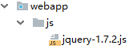

## 实现列表展示功能
### 编写 mapper 层代码
```java
package com.xszx.mapper;

import com.xszx.bean.Emp;
import java.util.List;

public interface EmpMapper {
    
    List<Emp> findAll();
}
```

```xml
<?xml version="1.0" encoding="UTF-8" ?>
<!DOCTYPE mapper
        PUBLIC "-//mybatis.org//DTD Mapper 3.0//EN"
        "http://mybatis.org/dtd/mybatis-3-mapper.dtd">
<mapper namespace="com.xszx.mapper.EmpMapper">
    
    <resultMap id="empList" type="emp">
        <id property="id" column="id"></id>
        <result property="name" column="name"></result>
        <result property="sex" column="sex"></result>
        <result property="age" column="age"></result>
        <association property="dept" javaType="dept">
            <id column="did" property="did"></id>
            <result column="dname" property="dname"></result>
        </association>
    </resultMap>

    <select id="findAll" resultMap="empList">
        select * 
        from emp e
        left join dept d 
        on e.dept_id = d.did
        order by e.id
    </select>
</mapper>
```

### 编写 service 层代码
```java
package com.xszx.service;

import com.github.pagehelper.PageInfo;
import com.xszx.bean.Emp;

public interface EmpService {
    
    PageInfo<Emp> findAll(Integer pageNum, Integer pageSize);
}
```

```java
package com.xszx.service.impl;

import com.github.pagehelper.PageHelper;
import com.github.pagehelper.PageInfo;
import com.xszx.bean.Emp;
import com.xszx.mapper.EmpMapper;
import com.xszx.service.EmpService;
import org.springframework.beans.factory.annotation.Autowired;
import org.springframework.stereotype.Service;

import java.util.List;

@Service
public class EmpServiceImpl implements EmpService {
    
    @Autowired
    private EmpMapper empMapper;
    
    @Override
    public PageInfo<Emp> findAll(Integer pageNum, Integer pageSize) {
        PageHelper.startPage(pageNum, pageSize);
        List<Emp> list = empMapper.findAll();
        return new PageInfo<>(list);
    }
}
```

### 编写 controller 层代码
```java
package com.xszx.controller;

import com.github.pagehelper.PageInfo;
import com.xszx.bean.Emp;
import com.xszx.service.EmpService;
import org.springframework.beans.factory.annotation.Autowired;
import org.springframework.stereotype.Controller;
import org.springframework.ui.Model;
import org.springframework.web.bind.annotation.GetMapping;
import org.springframework.web.bind.annotation.RequestMapping;
import org.springframework.web.bind.annotation.RequestParam;

@Controller
@RequestMapping("emp")
public class EmpController {
    
    @Autowired
    private EmpService empService;
    
    @GetMapping("findAll")
    public String findAll(@RequestParam(defaultValue = "1") Integer pageNum,
                          @RequestParam(defaultValue = "3") Integer pageSize,
                          Model model){
        PageInfo<Emp> pageInfo = empService.findAll(pageNum, pageSize);
        model.addAttribute("pageInfo", pageInfo);
        return "empList";
    }
}
```

### 编写页面
```html
<%@ page contentType="text/html;charset=UTF-8" language="java" %>
<%@ taglib prefix="c" uri="http://java.sun.com/jsp/jstl/core" %>
<html>
<head>
    <title>Title</title>
</head>
<body>
    <h1>员工列表展示</h1>
    <table border="1">
        <tr>
            <td>编号</td>
            <td>姓名</td>
            <td>性别</td>
            <td>年龄</td>
            <td>部门</td>
            <td>操作</td>
        </tr>
        <c:forEach items="${pageInfo.list}" var="emp">
            <tr>
                <td>${emp.id}</td>
                <td>${emp.name}</td>
                <td>${emp.sex}</td>
                <td>${emp.age}</td>
                <td>${emp.dept.dname}</td>
                <td></td>
            </tr>
        </c:forEach>
    </table>

    第${pageInfo.pageNum}页/共${pageInfo.pages}页
    <a href="../emp/findAll?pageNum=1&pageSize=3">首页</a>
    <c:if test="${pageInfo.hasPreviousPage}">
        <a href="../emp/findAll?pageNum=${pageInfo.pageNum-1}&pageSize=3">上一页</a>
    </c:if>
    <c:if test="${pageInfo.hasNextPage}">
        <a href="../emp/findAll?pageNum=${pageInfo.pageNum+1}&pageSize=3">下一页</a>
    </c:if>
    <a href="../emp/findAll?pageNum=${pageInfo.pages}&pageSize=3">尾页</a>
    共${pageInfo.total}条
</body>
</html>
```

## 实现添加功能
### 编写 mapper 层代码
```java
package com.xszx.mapper;

import com.xszx.bean.Emp;
import java.util.List;

public interface EmpMapper {
    
    int addEmp(Emp emp);

    List<Emp> findAll();
}
```

```xml
<?xml version="1.0" encoding="UTF-8" ?>
<!DOCTYPE mapper
        PUBLIC "-//mybatis.org//DTD Mapper 3.0//EN"
        "http://mybatis.org/dtd/mybatis-3-mapper.dtd">
<mapper namespace="com.xszx.mapper.EmpMapper">
    
    <insert id="addEmp">
        insert into emp values(null, #{name}, #{sex}, #{age}, #{dept.did})
    </insert>

    <resultMap id="empList" type="emp">
        <id property="id" column="id"></id>
        <result property="name" column="name"></result>
        <result property="sex" column="sex"></result>
        <result property="age" column="age"></result>
        <association property="dept" javaType="dept">
            <id column="did" property="did"></id>
            <result column="dname" property="dname"></result>
        </association>
    </resultMap>

    <select id="findAll" resultMap="empList">
        select *
        from emp e
        left join dept d
        on e.dept_id = d.did
        order by e.id
    </select>
</mapper>
```

```java
package com.xszx.mapper;

import com.xszx.bean.Dept;

import java.util.List;

public interface DeptMapper {
    
    List<Dept> findAllDept();
}
```

```xml
<?xml version="1.0" encoding="UTF-8" ?>
<!DOCTYPE mapper
        PUBLIC "-//mybatis.org//DTD Mapper 3.0//EN"
        "http://mybatis.org/dtd/mybatis-3-mapper.dtd">
<mapper namespace="com.xszx.mapper.DeptMapper">

    <select id="findAllDept" resultType="com.xszx.bean.Dept">
        select * from dept
    </select>
</mapper>
```

### 编写 service 层代码
```java
package com.xszx.service;

import com.github.pagehelper.PageInfo;
import com.xszx.bean.Emp;

public interface EmpService {
    
    int addEmp(Emp emp);

    PageInfo<Emp> findAll(Integer pageNum, Integer pageSize);
}
```

```java
package com.xszx.service.impl;

import com.github.pagehelper.PageHelper;
import com.github.pagehelper.PageInfo;
import com.xszx.bean.Emp;
import com.xszx.mapper.EmpMapper;
import com.xszx.service.EmpService;
import org.springframework.beans.factory.annotation.Autowired;
import org.springframework.stereotype.Service;

import java.util.List;

@Service
public class EmpServiceImpl implements EmpService {

    @Autowired
    private EmpMapper empMapper;

    @Override
    public int addEmp(Emp emp) {
        return empMapper.addEmp(emp);
    }

    @Override
    public PageInfo<Emp> findAll(Integer pageNum, Integer pageSize) {
        PageHelper.startPage(pageNum, pageSize);
        List<Emp> list = empMapper.findAll();
        return new PageInfo<>(list);
    }
}
```

```java
package com.xszx.service;

import com.xszx.bean.Dept;

import java.util.List;

public interface DeptService {
    
    List<Dept> findAllDept();
}
```

```java
package com.xszx.service.impl;

import com.xszx.bean.Dept;
import com.xszx.mapper.DeptMapper;
import com.xszx.service.DeptService;
import org.springframework.beans.factory.annotation.Autowired;
import org.springframework.stereotype.Service;

import java.util.List;

@Service
public class DeptServiceImpl implements DeptService {
    
    @Autowired
    private DeptMapper deptMapper;
    
    @Override
    public List<Dept> findAllDept() {
        return deptMapper.findAllDept();
    }
}
```

### 编写 controller 层代码
```java
package com.xszx.controller;

import com.github.pagehelper.PageInfo;
import com.xszx.bean.Dept;
import com.xszx.bean.Emp;
import com.xszx.service.DeptService;
import com.xszx.service.EmpService;
import org.springframework.beans.factory.annotation.Autowired;
import org.springframework.stereotype.Controller;
import org.springframework.ui.Model;
import org.springframework.web.bind.annotation.GetMapping;
import org.springframework.web.bind.annotation.PostMapping;
import org.springframework.web.bind.annotation.RequestMapping;
import org.springframework.web.bind.annotation.RequestParam;

import java.util.List;

@Controller
@RequestMapping("emp")
public class EmpController {

    @Autowired
    private EmpService empService;
    
    @Autowired
    private DeptService deptService;
    
    @GetMapping("toAdd")
    public String toAdd(Model model){
        List<Dept> list = deptService.findAllDept();
        model.addAttribute("list", list);
        return "empAdd";
    }

    @PostMapping("addEmp")
    public String addEmp(Emp emp){
        empService.addEmp(emp);
        return "redirect:/emp/findAll"; // 重定向到列表展示的方法
    }

    @GetMapping("findAll")
    public String findAll(@RequestParam(defaultValue = "1") Integer pageNum,
                          @RequestParam(defaultValue = "3") Integer pageSize,
                          Model model){
        PageInfo<Emp> pageInfo = empService.findAll(pageNum, pageSize);
        model.addAttribute("pageInfo", pageInfo);
        return "empList";
    }
}
```

### 编写页面
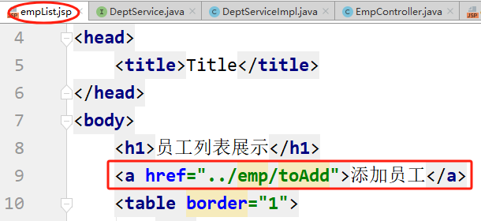

```html
<%@ page contentType="text/html;charset=UTF-8" language="java" %>
<%@ taglib prefix="c" uri="http://java.sun.com/jsp/jstl/core" %>
<html>
<head>
    <title>Title</title>
</head>
<body>
<form action="../emp/addEmp" method="post">
    <p>
        姓名：<input type="text" name="name">
    </p>
    <p>
        性别：
        <input type="radio" value="男" name="sex">男
        <input type="radio" value="女" name="sex">女
    </p>
    <p>
        年龄：<input type="text" name="age">
    </p>
    <p>
        部门：
        <select name="dept.did">
            <option value="">请选择部门</option>
            <c:forEach items="${list}" var="dept">
                <option value="${dept.did}">${dept.dname}</option>
            </c:forEach>
        </select>
    </p>
    <p>
        <input type="submit" value="保存">
    </p>
</form>
</body>
</html>
```

## 实现修改功能
## 实现删除功能
# 九、SpringMVC 对于 json 和 Ajax 请求的处理
## @RequestBody 注解
+ 该注解标注在控制层方法的形参上，表示获取请求体中的参数
+ 一般该注解配合 @PostMapping 和 @PutMapping 注解使用
+ 如果前端发送 ajax 方式请求时，指定了 contentType 为: application/json，则此时请求将以 json 格式对请求数据进行编码，此时后端控制层方法参数中必须使用 @RequestBody 注解，否则请求参数将无法映射到参数实体的属性中

## @ResponseBody 注解
+ 该注解标注在控制层方法上或者控制层类上，表示将控制层方法的对象返回值转为 json 格式的字符串，响应给前端
+ 一般用于处理前端发送 Ajax 请求过来后，我们处理完请求后，使用该注解将返回值响应给 Ajax 的回调函数

## @RestController 注解
+ 该注解标注在控制层类上，等价于 @Controller + @ResponseBody 注解，表示该类中所有方法的对象返回值都以 json 格式的字符串返回。

## 案例
### 添加依赖
```xml
<dependency>
    <groupId>com.fasterxml.jackson.core</groupId>
    <artifactId>jackson-databind</artifactId>
    <version>2.9.8</version>
</dependency>
```

### 编写 controller 层代码
```java
@Controller
@RequestMapping("emp")
public class EmpController {

    @PostMapping("demo")
    @ResponseBody
    public String demo(@RequestBody Emp emp){
        System.out.println(emp);
        return "success";
    }
}
```

### 编写页面代码
```html
<%@ page contentType="text/html;charset=UTF-8" language="java" %>
<html>
<head>
    <title>Title</title>
    <script src="../js/jquery-1.7.2.js"></script>
    <script>
        $(function(){
            $('#btn').click(function(){
                $.ajax({
                    type: 'post',
                    url: '../emp/demo',
                    data: JSON.stringify({name:'lucy', sex:'女', age:20}),
                    contentType: 'application/json',
                    success: function(res){
                        alert(res);
                    }
                });
            });
        })
    </script>
</head>
<body>
    <button id="btn">发送Ajax请求</button>
</body>
</html>
```

### 测试
因为我们一直用的是 Maven 的 Tomcat 插件，而这个插件版本比较低，所以导致我们一会运行是要报错的。

所以我们需要使用外部的 8.5 的Tomcat 才行。

# 十、文件上传
## 介绍
+ <font style="color:rgb(51, 51, 51);">文件上传要求 form 表单的请求方式必须为 post，并且添加属性 enctype="multipart/form-data"</font>
+ <font style="color:rgb(51, 51, 51);">SpringMVC 中将上传的文件封装到 MultipartFile 对象中，通过此对象可以获取文件相关信息</font>

## <font style="color:rgb(51, 51, 51);">案例</font>
### 添加依赖
```xml
<dependency>
    <groupId>commons-fileupload</groupId>
    <artifactId>commons-fileupload</artifactId>
    <version>1.3.1</version>
</dependency>
```

### 编写 SpringMVC 配置文件
```xml
<!--必须通过文件解析器的解析才能将文件转换为MultipartFile对象-->
<bean id="multipartResolver" class="org.springframework.web.multipart.commons.CommonsMultipartResolver"></bean>
```

### 编写 controller 方法
```java
@RequestMapping("/testUp")
public String testUp(MultipartFile photo, HttpSession session) throws IOException {
    //获取上传的文件的文件名
    String fileName = photo.getOriginalFilename();
    //处理文件重名问题
    String hzName = fileName.substring(fileName.lastIndexOf("."));
    fileName = UUID.randomUUID().toString() + hzName;
    //获取服务器中photo目录的路径
    ServletContext servletContext = session.getServletContext();
    String photoPath = servletContext.getRealPath("/photo");
    File file = new File(photoPath);
    String finalPath = photoPath + File.separator + fileName;
    //实现上传功能
    photo.transferTo(new File(finalPath));
    return "success";
}
```

### 编写页面
```html
<%@ page contentType="text/html;charset=UTF-8" language="java" %>
<html>
<head>
    <title>Title</title>
</head>
<body>
<form action="../emp/testUp" method="post" enctype="multipart/form-data">
    头像：<input type="file" name="photo">
    <input type="submit" value="保存">
</form>
</body>
</html>
```

# 十一、拦截器（Interceptor）
## 拦截器介绍
之前，我们学习过过滤器 Filter，过滤器可以对浏览器发出的请求进行判断，判断请求是否合理，如果合理，则放行，继续向后走，访问 Servlet 去处理请求；如果不合理，则可以重定向或者转发到某个页面！

注意，过滤器是在 Servlet 之前执行的。

对于 SpringMVC 框架来说，Servlet 就一个，而且这个 Servlet 本身就是要接收所有请求（除 jsp 外），那么我们就没有必要在它前面再加上一个过滤器了，但是还是需要对某些请求进行拦截判断，怎么办？可以在其之后加一个拦截器（Interceptor）即可！

**过滤器的流程：**

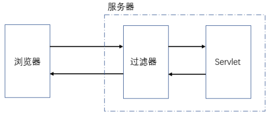

**拦截器的流程：**

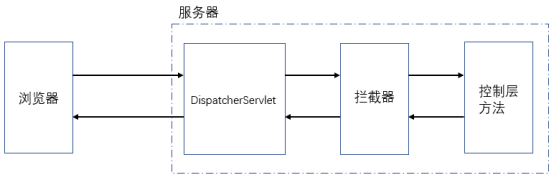

## **<font style="color:rgb(0,0,0);">拦截器的执行时机</font>**
在 DispatcherServlet 之后，在控制层方法之前。

## **<font style="color:rgb(0,0,0);">拦截器的使用步骤</font>**
1. 编写一个类实现拦截器接口

2. 重写接口中的方法

3. 在 SpringMVC 的配置文件中配置拦截器的 bean 及其拦截范围

## 案例
### 编写控制层方法
```java
package com.xszx.controller;

import org.springframework.stereotype.Controller;
import org.springframework.web.bind.annotation.RequestMapping;

@Controller
@RequestMapping("/hello")
public class HelloController {

    @RequestMapping("/test1")
    public String test1(){
        System.out.println("test1......");
        return "/abc.jsp";
    }

    @RequestMapping("/test2")
    public String test2(){
        System.out.println("test2......");
        return "/abc.jsp";
    }
}
```

### 编写拦截器
```java
package com.xszx.interceptor;

import org.springframework.web.servlet.HandlerInterceptor;
import org.springframework.web.servlet.ModelAndView;
import javax.servlet.http.HttpServletRequest;
import javax.servlet.http.HttpServletResponse;

public class MyInterceptor implements HandlerInterceptor {

    /**
     * 在控制层方法之前执行
     * @param handler 控制层方法对象
     * @return 返回true表示放行，返回false表示不放行
     */
    @Override
    public boolean preHandle(HttpServletRequest request, HttpServletResponse response, Object handler) throws Exception {
        System.out.println("preHandle..........");
        return true;
    }

    /**
     * 在控制层方法执行之后执行，如果控制层方法发生异常则不执行
     * @param handler 控制层方法对象
     * @param modelAndView 控制层方法的返回值及页面信息
     */
    @Override
    public void postHandle(HttpServletRequest request, HttpServletResponse response, Object handler, ModelAndView modelAndView) throws Exception {
        System.out.println("postHandle..........");
    }

    /**
     * 在控制层方法之后执行, 不论控制层方法是否发生异常都会执行
     * @param handler 控制层方法对象
     * @param ex
     * @throws Exception
     */
    @Override
    public void afterCompletion(HttpServletRequest request, HttpServletResponse response, Object handler, Exception ex) throws Exception {
        System.out.println("afterCompletion.............");
    }
}
```

### 配置拦截规则
```xml
<?xml version="1.0" encoding="UTF-8"?>
<beans xmlns="http://www.springframework.org/schema/beans"
       xmlns:xsi="http://www.w3.org/2001/XMLSchema-instance"
       xmlns:context="http://www.springframework.org/schema/context"
       xmlns:mvc="http://www.springframework.org/schema/mvc"
       xsi:schemaLocation="http://www.springframework.org/schema/beans
  http://www.springframework.org/schema/beans/spring-beans.xsd
  http://www.springframework.org/schema/context
  https://www.springframework.org/schema/context/spring-context.xsd
  http://www.springframework.org/schema/mvc
  https://www.springframework.org/schema/mvc/spring-mvc.xsd">

    <!-- 配置扫描 -->
    <context:component-scan base-package="com.xszx.controller"></context:component-scan>

    <!-- 配置注解驱动 -->
    <mvc:annotation-driven></mvc:annotation-driven>

    <!-- 配置拦截器 -->
    <mvc:interceptors>
        <mvc:interceptor>
            <!-- /** 表示拦截所有的请求 -->
            <mvc:mapping path="/**"/>
            <!-- 配置不拦截的请求 -->
            <mvc:exclude-mapping path="/hello/test2"/>
            <bean class="com.xszx.interceptor.MyInterceptor"></bean>
        </mvc:interceptor>
    </mvc:interceptors>
</beans>
```

# 十二、异常处理器
## 介绍
+ SpringMVC 框架中提供了异常处理机制，可以**统一**处理**所有控制层方法**出现的异常。
+ @ControllerAdvice：标注在类上，表示该类用于处理控制层中出现的所有异常
+ @ExceptionHandler：标注在方法上，表示该方法用来处理指定的异常

## 案例
```java
package com.xszx.controller;

import org.springframework.ui.Model;
import org.springframework.web.bind.annotation.ControllerAdvice;
import org.springframework.web.bind.annotation.ExceptionHandler;

@ControllerAdvice // 异常处理的类
public class ExceptionController {

    @ExceptionHandler(Exception.class) // 表示处理异常的方法，这里写的是可以处理所有的异常
    public String handlerException(Exception ex, Model model){
        System.out.println(ex);
        model.addAttribute("msg", "出错了，请联系管理员！");
        return "forward:/error.jsp";
    }
}
```

```html
<%@ page contentType="text/html;charset=UTF-8" language="java" %>
<html>
<head>
    <title>Title</title>
</head>
<body>
    ${msg}
</body>
</html>
```

```java
@Controller
@RequestMapping("/hello")
public class HelloController {

    @RequestMapping("/test1")
    public String test1(){
        System.out.println("test1......");
        System.out.println(1 / 0); // 制造一个异常代码
        return "/abc.jsp";
    }
}
```

# 十三、SpringMVC 执行流程（面试题）
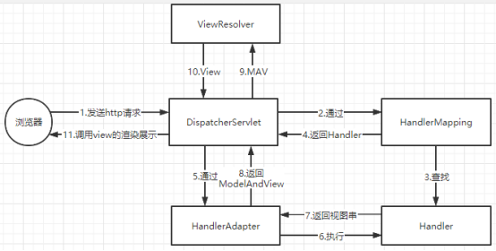

1. 浏览器发送请求到服务器，服务器收到请求后调用 DispatcherServlet 的方法处理请求

2. DispatcherServlet 通过 HandlerMapping 找到对应的 Handler（控制层方法）

3. DispatcherServlet 通过 HandlerAdapter 调用执行 Handler 方法

4. Handler 方法执行完后返回一个视图字符串

5. HandlerAdapter 会将其包装为 ModelAndView 对象

6. DispatcherServlet 将 ModelAndView 对象交给 ViewResolver 去解析得到 View 对象

7. 通过执行 View 对象的 render 方法对数据进行渲染展示


> 更新: 2024-06-22 16:15:16  
> 原文: <https://www.yuque.com/u41736172/az9urv/zw9pvpitpgl8kxkt>