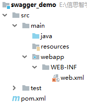
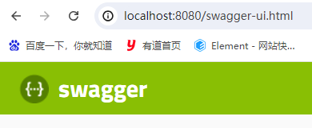
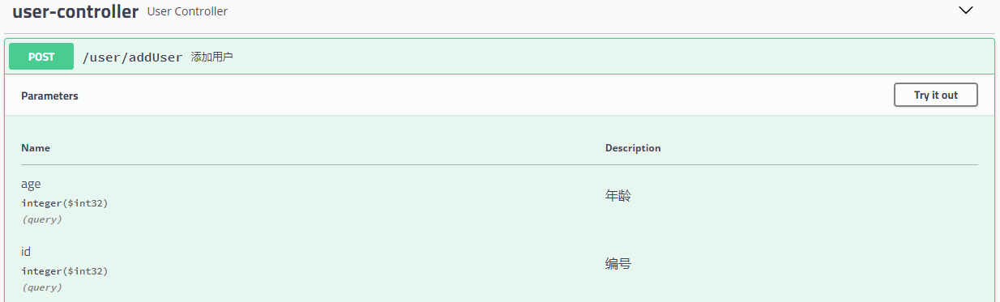
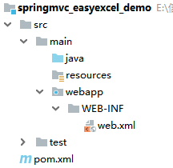
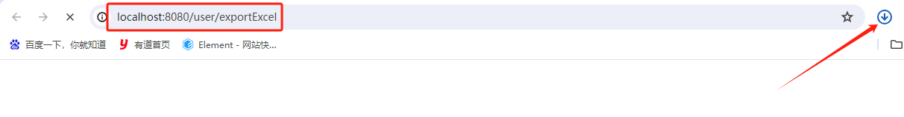
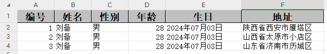

# Swagger & EasyExcel

# 一、Swagger
## 背景
<font style="color:rgb(25, 27, 31);">作为一个以前后端分离为模式开发小组，我们每隔一段时间都进行这样一个场景：前端人员和后端开发在一起热烈的讨论"哎，你这参数又变了啊"，"接口怎么又请求不通了啊"，"你再试试,我打个断点调试一下.."。可以看到在前后端沟通中出现了不少问题。</font>

<font style="color:rgb(25, 27, 31);">对于这样的问题,之前一直没有很好的解决方案，直到它的出现，没错...这就是我们今天要讨论的神器：Swagger，一款致力于解决接口规范化、标准化、文档化的开源库，一款真正的开发神器。</font>

## <font style="color:rgb(25, 27, 31);">概述</font>
<font style="color:rgb(25, 27, 31);">Swagger 是一款 RESTFUL 接口的文档在线自动生成+功能 功能软件。Swagger 是一个规范和完整的框架,用于生成、描述、调用和可视化 RESTful 风格的 Web 服务。目标是使客户端和文件系统作为服务器以同样的速度来更新文件的方法,参数和模型紧密集成到服务器。</font>

**<font style="color:rgb(25, 27, 31);">这个解释简单点来讲就是说，Swagger 是一款可以根据 resutful 风格生成的接口开发文档，并且支持做测试的一款中间软件。</font>**

## <font style="color:rgb(25, 27, 31);">为什么要使用 Swagger</font>
### <font style="color:rgb(25, 27, 31);">对于后端开发来说</font>
+ <font style="color:rgb(25, 27, 31);">不用再手写 WiKi 接口拼大量的参数，避免手写错误</font>
+ <font style="color:rgb(25, 27, 31);">对代码侵入性低，采用全注解的方式，开发简单</font>
+ <font style="color:rgb(25, 27, 31);">方法参数名修改、增加、减少参数都可以直接生效，不用手动维护</font>
+ <font style="color:rgb(25, 27, 31);">缺点：增加了开发成本，写接口还得再写一套参数配置</font>

### <font style="color:rgb(25, 27, 31);">对于前端开发来说</font>
+ <font style="color:rgb(25, 27, 31);">后端只需要定义好接口，会自动生成文档，接口功能、参数一目了然</font>
+ <font style="color:rgb(25, 27, 31);">联调方便，如果出问题，直接测试接口，实时检查参数和返回值,就可以快速定位是前端还是后端的问题</font>

### <font style="color:rgb(25, 27, 31);">对于测试来说</font>
+ <font style="color:rgb(25, 27, 31);">对于某些没有前端界面的功能，可以用它来测试接口</font>
+ <font style="color:rgb(25, 27, 31);">操作简单，不用了解具体代码就可以操作</font>

## <font style="color:rgb(25, 27, 31);">Swagger 的注解</font>
| **<font style="color:rgb(51, 51, 51);">注解</font>** | **<font style="color:rgb(51, 51, 51);">作用</font>** | **<font style="color:rgb(51, 51, 51);">主要属性</font>** |
| :--- | :--- | :--- |
| <font style="color:rgb(51, 51, 51);">@Api</font> | <font style="color:rgb(51, 51, 51);">用在类上，该注解将一个Controller（Class）标注为一个swagger资源（API）。</font> | <font style="color:rgb(51, 51, 51);">① tags API分组标签。具有相同标签的API将会被归并在一组内展示。</font><br/><font style="color:rgb(51, 51, 51);">② value 如果tags没有定义，value将作为Api的tags使用</font> |
| <font style="color:rgb(51, 51, 51);">@ApiOperation</font> | <font style="color:rgb(51, 51, 51);">用在方法上，对一个操作或HTTP方法进行描述。</font> | <font style="color:rgb(51, 51, 51);">① value 对操作的简单说明。</font><br/><font style="color:rgb(51, 51, 51);">② notes 对操作的详细说明。</font><br/><font style="color:rgb(51, 51, 51);">③ httpMethod HTTP请求的动作名，可选值有："GET", "HEAD", "POST", "PUT", "DELETE", "OPTIONS" and "PATCH"。</font> |
| <font style="color:rgb(51, 51, 51);">@ApiModel</font> | <font style="color:rgb(51, 51, 51);">用在类上，将一个类描述为参数资源。</font> | <font style="color:rgb(51, 51, 51);">① value，对实体类(model)的描述，model的别名，默认为类名</font><br/><font style="color:rgb(51, 51, 51);">② description，实体类(model)的详细描述</font> |
| <font style="color:rgb(51, 51, 51);">@ApiModelProperty</font> | <font style="color:rgb(51, 51, 51);">用在字段属性上，描述一个类(model)的属性</font> | <font style="color:rgb(51, 51, 51);">① value 属性简短描述</font><br/><font style="color:rgb(51, 51, 51);">② example 属性的示例值</font><br/><font style="color:rgb(51, 51, 51);">③ required 是否为必须值</font> |


## <font style="color:rgb(25, 27, 31);">案例</font>
### 需求说明
+ 整合 SpringMVC + Swagger，根据 controller 层的代码生成对应的接口文档。

### 创建 Maven 项目
创建一个 Maven 项目，打包方式为 war。

调整项目的目录结构。



### 添加依赖
```xml
<?xml version="1.0" encoding="UTF-8"?>
<project xmlns="http://maven.apache.org/POM/4.0.0"
         xmlns:xsi="http://www.w3.org/2001/XMLSchema-instance"
         xsi:schemaLocation="http://maven.apache.org/POM/4.0.0 http://maven.apache.org/xsd/maven-4.0.0.xsd">
    <modelVersion>4.0.0</modelVersion>

    <groupId>com.xszx</groupId>
    <artifactId>swagger_demo</artifactId>
    <version>1.0-SNAPSHOT</version>
    <packaging>war</packaging>

    <dependencies>
        <!-- SpringMVC -->
        <dependency>
            <groupId>org.springframework</groupId>
            <artifactId>spring-webmvc</artifactId>
            <version>5.3.1</version>
        </dependency>

        <!-- 日志 -->
        <dependency>
            <groupId>ch.qos.logback</groupId>
            <artifactId>logback-classic</artifactId>
            <version>1.2.3</version>
        </dependency>

        <!-- ServletAPI -->
        <dependency>
            <groupId>javax.servlet</groupId>
            <artifactId>javax.servlet-api</artifactId>
            <version>3.1.0</version>
            <scope>provided</scope>
        </dependency>

        <dependency>
            <groupId>org.projectlombok</groupId>
            <artifactId>lombok</artifactId>
            <version>1.18.26</version>
        </dependency>

        <dependency>
            <groupId>io.springfox</groupId>
            <artifactId>springfox-swagger2</artifactId>
            <version>2.9.2</version>
            <exclusions>
                <exclusion>
                    <groupId>org.slf4j</groupId>
                    <artifactId>slf4j-api</artifactId>
                </exclusion>
                <exclusion>
                    <groupId>com.fasterxml.jackson.core</groupId>
                    <artifactId>jackson-annotations</artifactId>
                </exclusion>
                <exclusion>
                    <groupId>org.springframework</groupId>
                    <artifactId>spring-aop</artifactId>
                </exclusion>
                <exclusion>
                    <groupId>org.springframework</groupId>
                    <artifactId>spring-beans</artifactId>
                </exclusion>
                <exclusion>
                    <groupId>org.springframework</groupId>
                    <artifactId>spring-context</artifactId>
                </exclusion>
                <exclusion>
                    <groupId>io.swagger</groupId>
                    <artifactId>swagger-models</artifactId>
                </exclusion>
            </exclusions>
        </dependency>

        <dependency>
            <groupId>io.swagger</groupId>
            <artifactId>swagger-models</artifactId>
            <version>1.5.22</version>
        </dependency>
        <!--swagger ui-->
        <dependency>
            <groupId>io.springfox</groupId>
            <artifactId>springfox-swagger-ui</artifactId>
            <version>2.9.2</version>
        </dependency>

        <dependency>
            <groupId>com.fasterxml.jackson.core</groupId>
            <artifactId>jackson-databind</artifactId>
            <version>2.9.8</version>
        </dependency>
    </dependencies>

    <build>
        <plugins>
            <plugin>
                <groupId>org.apache.tomcat.maven</groupId>
                <artifactId>tomcat7-maven-plugin</artifactId>
                <version>2.2</version>
                <configuration>
                    <port>8080</port>
                    <path>/</path>
                    <uriEncoding>UTF-8</uriEncoding>
                    <server>tomcat7</server>
                </configuration>
            </plugin>
        </plugins>
    </build>
</project>
```

### 编写 SpringMVC 配置文件
```xml
<?xml version="1.0" encoding="UTF-8"?>
<beans xmlns="http://www.springframework.org/schema/beans"
       xmlns:xsi="http://www.w3.org/2001/XMLSchema-instance"
       xmlns:context="http://www.springframework.org/schema/context"
       xmlns:mvc="http://www.springframework.org/schema/mvc"
       xsi:schemaLocation="http://www.springframework.org/schema/beans
  http://www.springframework.org/schema/beans/spring-beans.xsd
  http://www.springframework.org/schema/context
  https://www.springframework.org/schema/context/spring-context.xsd
  http://www.springframework.org/schema/mvc
  https://www.springframework.org/schema/mvc/spring-mvc.xsd">

    <!-- 配置扫描 -->
    <context:component-scan base-package="com.xszx"></context:component-scan>

    <!-- 配置注解驱动 -->
    <mvc:annotation-driven></mvc:annotation-driven>

    <mvc:default-servlet-handler></mvc:default-servlet-handler>
</beans>
```

### 编写 web.xml 配置文件
```xml
<?xml version="1.0" encoding="UTF-8"?>
<web-app xmlns="http://xmlns.jcp.org/xml/ns/javaee"
         xmlns:xsi="http://www.w3.org/2001/XMLSchema-instance"
         xsi:schemaLocation="http://xmlns.jcp.org/xml/ns/javaee
        http://xmlns.jcp.org/xml/ns/javaee/web-app_4_0.xsd"
         version="4.0">

    <!-- 配置SpringMVC的前端控制器，对浏览器发起的请求进行统一处理 -->
    <servlet>
        <servlet-name>dispatcherServlet</servlet-name>
        <servlet-class>org.springframework.web.servlet.DispatcherServlet</servlet-class>
        <!-- 通过初始化参数指定SpringMVC配置文件的路径和名称 -->
        <init-param>
            <!-- 参数名contextConfigLocation是固定值 -->
            <param-name>contextConfigLocation</param-name>
            <param-value>classpath:springMVC.xml</param-value>
        </init-param>
        <!-- 表示服务器一启动就会加载该Servlet -->
        <load-on-startup>1</load-on-startup>
    </servlet>

    <servlet-mapping>
        <servlet-name>dispatcherServlet</servlet-name>
        <!--
            / 所匹配的请求可以是/login或.html或.js或.css方式的请求路径
            但是/不能匹配.jsp请求路径的请求
        -->
        <url-pattern>/</url-pattern>
    </servlet-mapping>
</web-app>
```

### 编写 Swagger 配置类
```java
package com.xszx.config;

import org.springframework.context.annotation.Bean;
import org.springframework.context.annotation.Configuration;
import org.springframework.web.servlet.config.annotation.ResourceHandlerRegistry;
import org.springframework.web.servlet.config.annotation.ViewControllerRegistry;
import org.springframework.web.servlet.config.annotation.WebMvcConfigurer;
import springfox.documentation.builders.ApiInfoBuilder;
import springfox.documentation.builders.PathSelectors;
import springfox.documentation.builders.RequestHandlerSelectors;
import springfox.documentation.service.ApiInfo;
import springfox.documentation.spi.DocumentationType;
import springfox.documentation.spring.web.plugins.Docket;
import springfox.documentation.swagger2.annotations.EnableSwagger2;

@Configuration
@EnableSwagger2
public class Swagger2Config {

    @Bean
    public Docket createRestApi() {
        return new Docket(DocumentationType.SWAGGER_2)
                .apiInfo(apiInfo())
                .select()
                .apis(RequestHandlerSelectors.any())
                .paths(PathSelectors.any())
                .build();
    }

    private ApiInfo apiInfo() {
        return new ApiInfoBuilder()
                .title("SJT2304管理系统")
                .description("SJT2304管理系统后端接口文档")
                .termsOfServiceUrl("http://127.0.0.1:8080/")
                .version("1.0")
                .build();
    }
}
```

### 编写实体类
```java
package com.xszx.bean;

import io.swagger.annotations.ApiModel;
import io.swagger.annotations.ApiModelProperty;
import lombok.Data;

@Data
@ApiModel("用户实体类")
public class User {

    @ApiModelProperty(value = "编号")
    private Integer id;

    @ApiModelProperty(value = "姓名", required = true)
    private String name;

    @ApiModelProperty(value = "性别", example = "男或者女")
    private String sex;

    @ApiModelProperty("年龄")
    private Integer age;
}
```

### 编写 controller 代码
```java
package com.xszx.controller;

import com.xszx.bean.User;
import io.swagger.annotations.Api;
import io.swagger.annotations.ApiOperation;
import io.swagger.annotations.ApiParam;
import org.springframework.web.bind.annotation.PostMapping;
import org.springframework.web.bind.annotation.RequestMapping;
import org.springframework.web.bind.annotation.RestController;

@RestController
@RequestMapping("user")
@Api("用户管理")
public class UserController {

    @ApiOperation(value = "添加用户", httpMethod = "POST")
    @PostMapping("addUser")
    public String addUser(@ApiParam("用户对象") User user){
        return "添加成功";
    }
}
```

### 启动测试
[http://localhost:8080/swagger-ui.html](http://localhost:8080/swagger-ui.html)





## 说明
Swagger 需要整合 SpringMVC 使用，所以后面我们在 SSM 整合的项目中使用 Swagger 时，应该需要让 SpringMVC 容器扫描到 Swagger 的配置类，让 Spring 容器扫描不行。

# 二、EasyExcel
## 概述
<font style="color:rgb(51, 51, 51);">在 Java 领域，操作 Excel 文件比较有名的框架有 Apache poi、jxl 等。但他们都存在一个严重的问题就是非常的耗内存。如果你的系统并发量不大的话可能还行，但是一旦并发上来后一定会 OOM 或者 JVM 频繁的 full gc。并且代码书写较为繁琐。</font>

<font style="color:rgb(51, 51, 51);">EasyExcel 是一款阿里开源的 Excel 操作(导入导出)工具，具有处理快速、占用内存小、代码简洁，使用方便的特点，在 Github 上已有22k+Star，可见其非常流行。</font>

<font style="color:rgb(51, 51, 51);">相比于 POI：</font>

| **<font style="color:rgb(51, 51, 51);">工具</font>** | **<font style="color:rgb(51, 51, 51);">上手难易程度</font>** |
| :--- | :--- |
| <font style="color:rgb(51, 51, 51);">POI</font> | <font style="color:rgb(51, 51, 51);">比较难（需要对源码有所研究，需要写workbook），使用完必须手动关闭流，导出功能代码非常繁琐</font> |
| <font style="color:rgb(51, 51, 51);">EasyExcel</font> | <font style="color:rgb(51, 51, 51);">简单，只需要提供数据和模板，不需要关闭流</font> |


官网：[https://easyexcel.opensource.alibaba.com/](https://easyexcel.opensource.alibaba.com/)

## <font style="color:rgb(51, 51, 51);">案例--导出 Excel 文件</font>
### 需求说明
使用 SpringMVC 整合 EasyExcel，实现导出数据到 Excel 文件的功能。

### 创建项目
创建一个 Maven web 项目，打包方式为 war，修改其目录结构。



### 添加依赖
```xml
<?xml version="1.0" encoding="UTF-8"?>
<project xmlns="http://maven.apache.org/POM/4.0.0"
         xmlns:xsi="http://www.w3.org/2001/XMLSchema-instance"
         xsi:schemaLocation="http://maven.apache.org/POM/4.0.0 http://maven.apache.org/xsd/maven-4.0.0.xsd">
    <modelVersion>4.0.0</modelVersion>

    <groupId>com.xszx</groupId>
    <artifactId>springmvc_easyexcel_demo</artifactId>
    <version>1.0-SNAPSHOT</version>
    <packaging>war</packaging>

    <dependencies>
        <!-- SpringMVC -->
        <dependency>
            <groupId>org.springframework</groupId>
            <artifactId>spring-webmvc</artifactId>
            <version>5.3.1</version>
        </dependency>

        <!-- ServletAPI -->
        <dependency>
            <groupId>javax.servlet</groupId>
            <artifactId>javax.servlet-api</artifactId>
            <version>3.1.0</version>
            <scope>provided</scope>
        </dependency>

        <dependency>
            <groupId>org.projectlombok</groupId>
            <artifactId>lombok</artifactId>
            <version>1.18.26</version>
        </dependency>

        <dependency>
            <groupId>com.alibaba</groupId>
            <artifactId>easyexcel</artifactId>
            <version>3.1.1</version>
        </dependency>

        <dependency>
            <groupId>commons-fileupload</groupId>
            <artifactId>commons-fileupload</artifactId>
            <version>1.3.1</version>
        </dependency>
    </dependencies>

    <build>
        <plugins>
            <plugin>
                <groupId>org.apache.tomcat.maven</groupId>
                <artifactId>tomcat7-maven-plugin</artifactId>
                <version>2.2</version>
                <configuration>
                    <port>8080</port>
                    <path>/</path>
                    <uriEncoding>UTF-8</uriEncoding>
                    <server>tomcat7</server>
                </configuration>
            </plugin>
        </plugins>
    </build>
</project>
```

### 编写 SpringMVC 配置文件
```xml
<?xml version="1.0" encoding="UTF-8"?>
<beans xmlns="http://www.springframework.org/schema/beans"
       xmlns:xsi="http://www.w3.org/2001/XMLSchema-instance"
       xmlns:context="http://www.springframework.org/schema/context"
       xmlns:mvc="http://www.springframework.org/schema/mvc"
       xsi:schemaLocation="http://www.springframework.org/schema/beans
  http://www.springframework.org/schema/beans/spring-beans.xsd
  http://www.springframework.org/schema/context
  https://www.springframework.org/schema/context/spring-context.xsd
  http://www.springframework.org/schema/mvc
  https://www.springframework.org/schema/mvc/spring-mvc.xsd">

    <!-- 配置扫描 -->
    <context:component-scan base-package="com.xszx.controller"></context:component-scan>

    <!-- 配置注解驱动 -->
    <mvc:annotation-driven></mvc:annotation-driven>

    <mvc:default-servlet-handler></mvc:default-servlet-handler>

    <!--必须通过文件解析器的解析才能将文件转换为MultipartFile对象-->
    <bean id="multipartResolver" class="org.springframework.web.multipart.commons.CommonsMultipartResolver"></bean>
</beans>
```

### 编写 web.xml 配置文件
```xml
<?xml version="1.0" encoding="UTF-8"?>
<web-app xmlns="http://xmlns.jcp.org/xml/ns/javaee"
         xmlns:xsi="http://www.w3.org/2001/XMLSchema-instance"
         xsi:schemaLocation="http://xmlns.jcp.org/xml/ns/javaee
        http://xmlns.jcp.org/xml/ns/javaee/web-app_4_0.xsd"
         version="4.0">

    <!-- 配置SpringMVC的前端控制器，对浏览器发起的请求进行统一处理 -->
    <servlet>
        <servlet-name>dispatcherServlet</servlet-name>
        <servlet-class>org.springframework.web.servlet.DispatcherServlet</servlet-class>
        <!-- 通过初始化参数指定SpringMVC配置文件的路径和名称 -->
        <init-param>
            <!-- 参数名contextConfigLocation是固定值 -->
            <param-name>contextConfigLocation</param-name>
            <param-value>classpath:springMVC.xml</param-value>
        </init-param>
        <!-- 表示服务器一启动就会加载该Servlet -->
        <load-on-startup>1</load-on-startup>
    </servlet>

    <servlet-mapping>
        <servlet-name>dispatcherServlet</servlet-name>
        <!--
            / 所匹配的请求可以是/login或.html或.js或.css方式的请求路径
            但是/不能匹配.jsp请求路径的请求
        -->
        <url-pattern>/</url-pattern>
    </servlet-mapping>
</web-app>
```

### 编写实体类
```java
package com.xszx.bean;

import com.alibaba.excel.annotation.ExcelIgnore;
import com.alibaba.excel.annotation.ExcelProperty;
import com.alibaba.excel.annotation.format.DateTimeFormat;
import com.alibaba.excel.annotation.write.style.ColumnWidth;
import lombok.AllArgsConstructor;
import lombok.Data;
import lombok.NoArgsConstructor;

import java.util.Date;

@Data
@AllArgsConstructor
@NoArgsConstructor
public class User {

    @ExcelProperty("编号")
    private Integer id;

    @ExcelProperty("姓名")
    private String name;

    @ExcelProperty("性别")
    private String sex;

    @ExcelProperty("年龄")
    private Integer age;

    @ExcelProperty("生日")
    @DateTimeFormat("yyyy年MM月dd日")
    private Date birthday;

    @ExcelProperty("地址")
    @ColumnWidth(20)
    private String address;

    @ExcelIgnore
    private String hobby;
}
```

### 编写 controller 代码
```java
package com.xszx.controller;

import com.alibaba.excel.EasyExcel;
import com.alibaba.excel.support.ExcelTypeEnum;
import com.xszx.bean.User;
import org.springframework.stereotype.Controller;
import org.springframework.web.bind.annotation.GetMapping;
import org.springframework.web.bind.annotation.RequestMapping;

import javax.servlet.http.HttpServletResponse;
import java.io.IOException;
import java.io.UnsupportedEncodingException;
import java.net.URLEncoder;
import java.util.ArrayList;
import java.util.Date;
import java.util.List;

@Controller
@RequestMapping("user")
public class UserController {

    @GetMapping("exportExcel")
    public void exportExcel(HttpServletResponse response) throws IOException {

        setExcelRespProp(response, "用户信息", ExcelTypeEnum.XLSX.getValue());

        List<User> list = new ArrayList<>();
        list.add(new User(1, "刘备", "男", 28, new Date(), "陕西省西安市雁塔区", "抽烟"));
        list.add(new User(2, "刘备", "男", 28, new Date(), "山西省太原市小店区", "喝酒"));
        list.add(new User(3, "刘备", "男", 28, new Date(), "山东省济南市历城区", "烫头"));

        EasyExcel.write(response.getOutputStream())
                .head(User.class)
                .excelType(ExcelTypeEnum.XLSX)
                .sheet("用户信息")
                .doWrite(list);
    }

    private void setExcelRespProp(HttpServletResponse response, String rawFileName, String excelType) throws UnsupportedEncodingException {
        response.setContentType("application/vnd.openxmlformats-officedocument.spreadsheetml.sheet");
        response.setCharacterEncoding("utf-8");
        String fileName = URLEncoder.encode(rawFileName, "UTF-8").replaceAll("/+", "%20");
        response.setHeader("Content-disposition", "attachment;filename*=utf-8''" + fileName + excelType);
    }
}
```

### 启动服务器访问




## 案例--导入 Excel 文件	
### 需求说明
+ 在浏览器中选择一个 Excel 文件进行导入
+ 导入 Excel 和 之前上传图片的道理一样
+ 接着上面的案例编写

### 编写 controller 代码
```java
package com.xszx.controller;

import com.alibaba.excel.EasyExcel;
import com.alibaba.excel.read.listener.PageReadListener;
import com.alibaba.excel.support.ExcelTypeEnum;
import com.xszx.bean.User;
import org.springframework.stereotype.Controller;
import org.springframework.web.bind.annotation.GetMapping;
import org.springframework.web.bind.annotation.PostMapping;
import org.springframework.web.bind.annotation.RequestMapping;
import org.springframework.web.bind.annotation.ResponseBody;
import org.springframework.web.multipart.MultipartFile;
import javax.servlet.http.HttpServletResponse;
import java.io.IOException;
import java.io.UnsupportedEncodingException;
import java.net.URLEncoder;
import java.util.ArrayList;
import java.util.Date;
import java.util.List;

@Controller
@RequestMapping("user")
public class UserController {

    @PostMapping("importExcel")
    @ResponseBody
    public String importExcel(MultipartFile file) throws IOException {
        EasyExcel.read(file.getInputStream(), User.class, new PageReadListener<User>(dataList -> {
            dataList.forEach(System.out::println);
        })).sheet().doRead();
        return "success";
    }


    @GetMapping("exportExcel")
    public void exportExcel(HttpServletResponse response) throws IOException {

        setExcelRespProp(response, "用户信息", ExcelTypeEnum.XLSX.getValue());

        List<User> list = new ArrayList<>();
        list.add(new User(1, "刘备", "男", 28, new Date(), "陕西省西安市雁塔区", "抽烟"));
        list.add(new User(2, "刘备", "男", 28, new Date(), "山西省太原市小店区", "喝酒"));
        list.add(new User(3, "刘备", "男", 28, new Date(), "山东省济南市历城区", "烫头"));

        EasyExcel.write(response.getOutputStream())
                .head(User.class)
                .excelType(ExcelTypeEnum.XLSX)
                .sheet("用户信息")
                .doWrite(list);
    }

    private void setExcelRespProp(HttpServletResponse response, String rawFileName, String excelType) throws UnsupportedEncodingException {
        response.setContentType("application/vnd.openxmlformats-officedocument.spreadsheetml.sheet");
        response.setCharacterEncoding("utf-8");
        String fileName = URLEncoder.encode(rawFileName, "UTF-8").replaceAll("/+", "%20");
        response.setHeader("Content-disposition", "attachment;filename*=utf-8''" + fileName + excelType);
    }
}
```

### 编写页面代码
```html
<!DOCTYPE html>
<html lang="en">
<head>
    <meta charset="UTF-8">
    <title>Title</title>
</head>
<body>
<form action="user/importExcel" method="post" enctype="multipart/form-data">
    Excel文件：<input type="file" name="file">
    <input type="submit" value="上传">
</form>
</body>
</html>
```


> 更新: 2024-07-03 21:44:10  
> 原文: <https://www.yuque.com/u41736172/az9urv/nvglufo6of76vqk1>