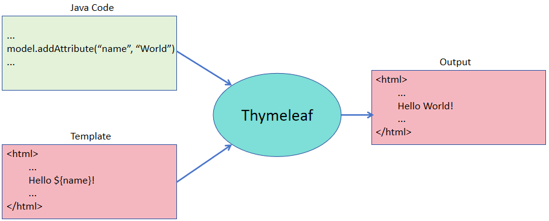
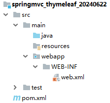
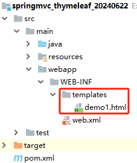
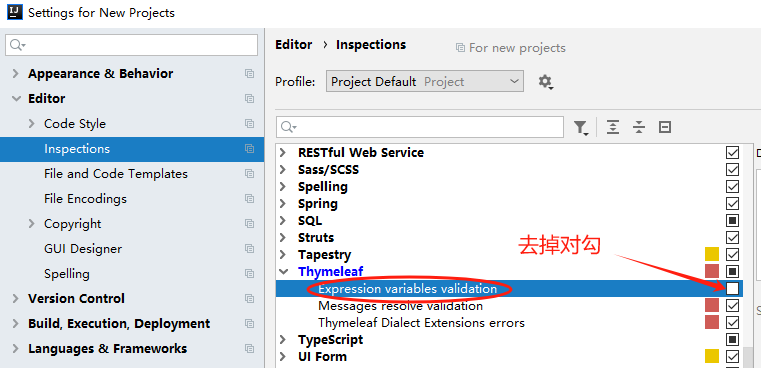

# Thymeleaf 模板引擎技术

# 一、Thymeleaf 介绍
## 概述
Thymeleaf 的主要目标是将优雅的自然模板带到开发工作流程中，并将 HTML 在浏览器中正确显示，并且可以作为静态原型，让开发团队能更容易地协作。

Thymeleaf 能够处理 HTML，XML，JavaScript，CSS 甚至纯文本。

长期以来，jsp 在视图领域有非常重要的地位，随着时间的变迁，出现了一位新的挑战者：Thymeleaf，Thymeleaf 是原生的,不依赖于标签库。它能够在接受原始 HTML 的地方进行编辑和渲染。因为它没有与Servelet 规范耦合，因此 Thymeleaf 模板能进入 jsp 所无法涉足的领域。

Thymeleaf 在 SpringMVC 项目中放入到 WEB-INF/templates 中。这个文件夹中的内容是无法通过浏览器 URL 直接访问的，所有 Thymeleaf 页面必须先走控制器。

简单来说：

1. Thymeleaf 是一款模板引擎技术
2. Thymeleaf 的使用很优雅，它的模板文件后缀就是 .html
3. Thymeleaf 模板文件是要放在 WEB-INF/templates 下的，需要我们访问控制层方法，然后转发到模板中，模板引擎再负责将数据填充进去，展示给用户

## 原理


## 常用的模板技术
Jsp、Freemarker、Thymeleaf 、Velocity 等。 

# 二、入门案例
## 需求
我们将 SpringMVC 整合 Thymeleaf 去实现功能，将 Thymeleaf 代替了之前的 jsp。

## 创建 Maven 项目
创建一个 Maven web 项目，打包方式是 war，注意修改目录结构。



## 添加依赖
```xml
<?xml version="1.0" encoding="UTF-8"?>
<project xmlns="http://maven.apache.org/POM/4.0.0"
         xmlns:xsi="http://www.w3.org/2001/XMLSchema-instance"
         xsi:schemaLocation="http://maven.apache.org/POM/4.0.0 http://maven.apache.org/xsd/maven-4.0.0.xsd">
    <modelVersion>4.0.0</modelVersion>

    <groupId>com.xszx</groupId>
    <artifactId>springmvc_thymeleaf_20240622</artifactId>
    <version>1.0-SNAPSHOT</version>
    <packaging>war</packaging>

    <dependencies>
        <!-- SpringMVC -->
        <dependency>
            <groupId>org.springframework</groupId>
            <artifactId>spring-webmvc</artifactId>
            <version>5.3.1</version>
        </dependency>

        <!-- 日志 -->
        <dependency>
            <groupId>ch.qos.logback</groupId>
            <artifactId>logback-classic</artifactId>
            <version>1.2.3</version>
        </dependency>

        <!-- ServletAPI -->
        <dependency>
            <groupId>javax.servlet</groupId>
            <artifactId>javax.servlet-api</artifactId>
            <version>3.1.0</version>
            <scope>provided</scope>
        </dependency>

        <!-- Spring5和Thymeleaf整合包 -->
        <dependency>
            <groupId>org.thymeleaf</groupId>
            <artifactId>thymeleaf-spring5</artifactId>
            <version>3.0.12.RELEASE</version>
        </dependency>
    </dependencies>

    <build>
        <plugins>
            <plugin>
                <groupId>org.apache.tomcat.maven</groupId>
                <artifactId>tomcat7-maven-plugin</artifactId>
                <version>2.2</version>
                <configuration>
                    <port>8080</port>
                    <path>/</path>
                    <uriEncoding>UTF-8</uriEncoding>
                    <server>tomcat7</server>
                </configuration>
            </plugin>
        </plugins>
    </build>
</project>
```

## 编写 SpringMVC 配置文件
```xml
<?xml version="1.0" encoding="UTF-8"?>
<beans xmlns="http://www.springframework.org/schema/beans"
       xmlns:xsi="http://www.w3.org/2001/XMLSchema-instance"
       xmlns:context="http://www.springframework.org/schema/context"
       xmlns:mvc="http://www.springframework.org/schema/mvc"
       xsi:schemaLocation="http://www.springframework.org/schema/beans http://www.springframework.org/schema/beans/spring-beans.xsd http://www.springframework.org/schema/context https://www.springframework.org/schema/context/spring-context.xsd http://www.springframework.org/schema/mvc https://www.springframework.org/schema/mvc/spring-mvc.xsd">

    <context:component-scan base-package="com.xszx.controller"></context:component-scan>

    <!-- 配置Thymeleaf视图解析器 -->
    <bean id="viewResolver" class="org.thymeleaf.spring5.view.ThymeleafViewResolver">
        <property name="order" value="1"/>
        <property name="characterEncoding" value="UTF-8"/>
        <property name="templateEngine">
            <bean class="org.thymeleaf.spring5.SpringTemplateEngine">
                <property name="templateResolver">
                    <bean class="org.thymeleaf.spring5.templateresolver.SpringResourceTemplateResolver">
                        <!-- 视图前缀 -->
                        <property name="prefix" value="/WEB-INF/templates/"/>
                        <!-- 视图后缀 -->
                        <property name="suffix" value=".html"/>
                        <property name="templateMode" value="HTML5"/>
                        <property name="characterEncoding" value="UTF-8" />
                    </bean>
                </property>
            </bean>
        </property>
    </bean>

    <mvc:annotation-driven></mvc:annotation-driven>

    <!-- SpringMVC 的 DispatcherServlet 处理不了的请求交给Tomcat处理，也就是静态资源请求交给Tomcat服务器处理 -->
    <mvc:default-servlet-handler></mvc:default-servlet-handler>
</beans>
```

## 编写 web.xml 配置文件
```xml
<?xml version="1.0" encoding="UTF-8"?>
<web-app xmlns="http://xmlns.jcp.org/xml/ns/javaee"
         xmlns:xsi="http://www.w3.org/2001/XMLSchema-instance"
         xsi:schemaLocation="http://xmlns.jcp.org/xml/ns/javaee http://xmlns.jcp.org/xml/ns/javaee/web-app_4_0.xsd"
         version="4.0">

    <servlet>
        <servlet-name>springMVC</servlet-name>
        <servlet-class>org.springframework.web.servlet.DispatcherServlet</servlet-class>
        <init-param>
            <param-name>contextConfigLocation</param-name>
            <param-value>classpath:springMVC.xml</param-value>
        </init-param>
        <load-on-startup>1</load-on-startup>
    </servlet>

    <servlet-mapping>
        <servlet-name>springMVC</servlet-name>
        <url-pattern>/</url-pattern>
    </servlet-mapping>

    <filter>
        <filter-name>characterEncodingFilter</filter-name>
        <filter-class>org.springframework.web.filter.CharacterEncodingFilter</filter-class>
        <init-param>
            <param-name>encoding</param-name>
            <param-value>utf-8</param-value>
        </init-param>
        <init-param>
            <param-name>forceResponseEncoding</param-name>
            <param-value>true</param-value>
        </init-param>
    </filter>

    <filter-mapping>
        <filter-name>characterEncodingFilter</filter-name>
        <url-pattern>/*</url-pattern>
    </filter-mapping>
</web-app>
```

## 编写 controller 层代码
```java
package com.xszx.controller;

import org.springframework.stereotype.Controller;
import org.springframework.ui.Model;
import org.springframework.web.bind.annotation.GetMapping;
import org.springframework.web.bind.annotation.RequestMapping;

@Controller
@RequestMapping("hello")
public class HelloController {

    @GetMapping("test1")
    public String test1(Model model){
        model.addAttribute("name", "lucy");
        return "demo1"; // 转发到demo1模板页面
    }
}
```

## 编写模板页面
+ Thymeleaf 模板页面我们是放在 webapp/WEB-INF 中的
+ Thymeleaf 模板页面的后缀是 .html

```html
<!DOCTYPE html>
<html lang="en">
<head>
    <meta charset="UTF-8">
    <title>Title</title>
</head>
<body>
    姓名：<span th:text="${name}"></span>
</body>
</html>
```



# 三、Thymeleaf 语法
## 概述
学习 thymeleaf，主要是学习它的各种指令。

thymeleaf 的指令基本格式：th:xxx="表达式"

在模板文件中编写 thymeleaf 的指令时，为了有提示，需要将 HTML 标签修改为：

```html
<html xmlns:th="http://www.thymeleaf.org">
```

说明：引入上述标签后，页面的表达式内容会报错，其实是没问题的，我们可以去掉 IDEA 对于 Thymeleaf 的检查功能。



## th:text 指令
作用：向 HTML 标签内部输出信息。

```java
@Controller
@RequestMapping("hello")
public class HelloController {

    @GetMapping("test2")
    public String test2(Model model, HttpSession session){
        model.addAttribute("name", "request域对象中的数据");
        session.setAttribute("name", "session域对象中的数据");
        return "demo1";
    }
}
```

```html
<!DOCTYPE html>
<html xmlns:th="http://www.thymeleaf.org">
<head>
    <meta charset="UTF-8">
    <title>Title</title>
</head>
<body>
    从域对象取值，默认从小到大的取：<span th:text="${name}"></span><br>
    从指定的session域对象取值：<span th:text="${session.name}"></span><br>
</body>
</html>
```

## th:value 指令
作用：设置 HTML 标签中表单元素的 value 属性时使用。

```java
@Controller
@RequestMapping("hello")
public class HelloController {

    @GetMapping("test3")
    public String test3(Model model){
        model.addAttribute("name", "苏明玉");
        return "demo1";
    }
}
```

```html
<!DOCTYPE html>
<html xmlns:th="http://www.thymeleaf.org">
<head>
    <meta charset="UTF-8">
    <title>Title</title>
</head>
<body>
    姓名：<input type="text" th:value="${name}">
</body>
</html>
```

## th:if 指令
作用：进行逻辑判断。如果成立该标签生效（显示），如果不成立，此标签无效（不显示）。

注意：判断条件中逻辑判断符号写在 ${} 外面的。

```java
@Controller
@RequestMapping("hello")
public class HelloController {

    @GetMapping("test4")
    public String test4(Model model){
        model.addAttribute("score", 95);
        return "demo1";
    }
}
```

```html
<!DOCTYPE html>
<html xmlns:th="http://www.thymeleaf.org">
<head>
    <meta charset="UTF-8">
    <title>Title</title>
</head>
<body>
    <span th:if="${score} >= 90">你的成绩很优秀！</span>
</body>
</html>
```

## th:each 指令
作用：用来遍历集合数据的。它的语法使用格式特别类似于 Java 中的增强 for 循环。

### 案例1
常规的循环使用方式。

```java
package com.xszx.bean;

import lombok.Data;

import java.util.Date;

@Data
public class Emp {
    
    private Integer id;
    private String name;
    private String sex;
    private Integer age;
    private Date birthday;
}
```

```java
@Controller
@RequestMapping("hello")
public class HelloController {
    
    @GetMapping("test5")
    public String test5(Model model){
        List<Emp> list = new ArrayList<>();
        list.add(new Emp(1, "贾宝玉", "男", 28, new Date()));
        list.add(new Emp(2, "林黛玉", "女", 32, new Date()));
        list.add(new Emp(3, "元春", "女", 18, new Date()));
        
        model.addAttribute("list", list);
        return "demo1";
    }
}
```

```html
<!DOCTYPE html>
<html xmlns:th="http://www.thymeleaf.org">
<head>
    <meta charset="UTF-8">
    <title>Title</title>
</head>
<body>
    <table border="1">
        <tr>
            <td>编号</td>
            <td>姓名</td>
            <td>性别</td>
            <td>年龄</td>
            <td>生日</td>
        </tr>
        <tr th:each="emp : ${list}">
            <td th:text="${emp.id}"></td>
            <td th:text="${emp.name}"></td>
            <td th:text="${emp.sex}"></td>
            <td th:text="${emp.age}"></td>
            <td th:text="${emp.birthday}"></td>
        </tr>
    </table>
</body>
</html>
```

### 案例2
> 该指令还可以这么写：<font style="background-color:#FBDE28;">th:each="user, i : ${list}"</font>
>

这里的 i 中存储了遍历的一些状态信息：

+ index：当前迭代器的索引，从0开始
+ count：当前迭代对象的计数，从1开始
+ size：被迭代对象的长度
+ even/odd：布尔值，当前循环是否是偶数/奇数，从1开始
+ first：布尔值，当前循环的是否是第一条，如果是返回 true，否则返回 false
+ last：布尔值，当前循环的是否是最后一条，如果是则返回 true，否则返回 false

```html
<!DOCTYPE html>
<html xmlns:th="http://www.thymeleaf.org">
<head>
    <meta charset="UTF-8">
    <title>Title</title>
</head>
<body>
    <table border="1">
        <tr>
            <td>编号</td>
            <td>姓名</td>
            <td>性别</td>
            <td>年龄</td>
            <td>生日</td>
            <td>当前的索引</td>
            <td>当前序号</td>
            <td>集合长度</td>
            <td>当前循环是奇数？</td>
            <td>当前循环是偶数？</td>
            <td>当前循环是第一行？</td>
            <td>当前循环是最后一行？</td>
        </tr>
        <tr th:each="emp, i : ${list}">
            <td th:text="${emp.id}"></td>
            <td th:text="${emp.name}"></td>
            <td th:text="${emp.sex}"></td>
            <td th:text="${emp.age}"></td>
            <td th:text="${emp.birthday}"></td>
            <td th:text="${i.index}"></td>
            <td th:text="${i.count}"></td>
            <td th:text="${i.size}"></td>
            <td th:text="${i.odd}"></td>
            <td th:text="${i.even}"></td>
            <td th:text="${i.first}"></td>
            <td th:text="${i.last}"></td>
        </tr>
    </table>
</body>
</html>
```

## 禁用 Thymeleaf 缓存
目前情况，我们仅修改完 html 模板文件后，都需要重启 Tomcat 服务器才能生效，没有达到实时生效的效果。

这是因为，SpringMVC 整合 Thymeleaf 模板后，默认开启了缓存，只有重启服务器后项目中的 html 模板的文件才会重新编译生成新的缓存文件。

关闭 Thymeleaf 的缓存：

```xml
<?xml version="1.0" encoding="UTF-8"?>
<beans xmlns="http://www.springframework.org/schema/beans"
       xmlns:xsi="http://www.w3.org/2001/XMLSchema-instance"
       xmlns:context="http://www.springframework.org/schema/context"
       xmlns:mvc="http://www.springframework.org/schema/mvc"
       xsi:schemaLocation="http://www.springframework.org/schema/beans http://www.springframework.org/schema/beans/spring-beans.xsd http://www.springframework.org/schema/context https://www.springframework.org/schema/context/spring-context.xsd http://www.springframework.org/schema/mvc https://www.springframework.org/schema/mvc/spring-mvc.xsd">

    <context:component-scan base-package="com.xszx.controller"></context:component-scan>

    <!-- 配置Thymeleaf视图解析器 -->
    <bean id="viewResolver" class="org.thymeleaf.spring5.view.ThymeleafViewResolver">
        <property name="order" value="1"/>
        <property name="characterEncoding" value="UTF-8"/>
        <property name="templateEngine">
            <bean class="org.thymeleaf.spring5.SpringTemplateEngine">
                <property name="templateResolver">
                    <bean class="org.thymeleaf.spring5.templateresolver.SpringResourceTemplateResolver">
                        <!-- 视图前缀 -->
                        <property name="prefix" value="/WEB-INF/templates/"/>
                        <!-- 视图后缀 -->
                        <property name="suffix" value=".html"/>
                        <property name="templateMode" value="HTML5"/>
                        <property name="characterEncoding" value="UTF-8" />
                        <!-- 关闭thymeleaf的缓存 -->
                        <property name="cacheable" value="false"/>
                    </bean>
                </property>
            </bean>
        </property>
    </bean>

    <mvc:annotation-driven></mvc:annotation-driven>

    <!-- SpringMVC 的 DispatcherServlet 处理不了的请求交给Tomcat处理，也就是静态资源请求交给Tomcat服务器处理 -->
    <mvc:default-servlet-handler></mvc:default-servlet-handler>
</beans>
```

关闭 Thymeleaf 的缓存后，以后我们只是改了 html 模版文件，则不需要重启服务器，立马就生效了！

## th:href 指令
作用：设置 href 属性的值。格式是：th:href="@{}"，注意是 @。

```java
package com.xszx.controller;

import com.xszx.bean.Emp;
import org.springframework.stereotype.Controller;
import org.springframework.ui.Model;
import org.springframework.web.bind.annotation.GetMapping;
import org.springframework.web.bind.annotation.PathVariable;
import org.springframework.web.bind.annotation.RequestMapping;
import org.springframework.web.bind.annotation.ResponseBody;
import java.util.ArrayList;
import java.util.Date;
import java.util.List;

@Controller
@RequestMapping("hello")
public class HelloController {

    @ResponseBody
    @RequestMapping("deleteEmp3")
    public String deleteEmp3(Integer id, String name){
        System.out.println("要删除的数据的id：" + id + ", name: " + name);
        return "success";
    }

    @ResponseBody
    @RequestMapping("deleteEmp2/{id}") // restful 风格
    public String deleteEmp2(@PathVariable Integer id){
        System.out.println("要删除的数据的id：" + id);
        return "success";
    }

    @ResponseBody
    @RequestMapping("deleteEmp1")
    public String deleteEmp1(Integer id){
        System.out.println("要删除的数据的id：" + id);
        return "success";
    }


    @GetMapping("findAll")
    public String findAll(Model model){
        List<Emp> list = new ArrayList<>();
        list.add(new Emp(1, "贾宝玉", "男", 28, new Date()));
        list.add(new Emp(2, "林黛玉", "女", 32, new Date()));
        list.add(new Emp(3, "元春", "女", 18, new Date()));

        model.addAttribute("list", list);
        return "demo1";
    }
}
```

```html
<!DOCTYPE html>
<html xmlns:th="http://www.thymeleaf.org">
<head>
    <meta charset="UTF-8">
    <title>Title</title>
</head>
<body>
    <table border="1">
        <tr>
            <td>编号</td>
            <td>姓名</td>
            <td>性别</td>
            <td>年龄</td>
            <td>生日</td>
            <td>操作</td>
        </tr>
        <tr th:each="emp, i : ${list}">
            <td th:text="${emp.id}"></td>
            <td th:text="${emp.name}"></td>
            <td th:text="${emp.sex}"></td>
            <td th:text="${emp.age}"></td>
            <td th:text="${emp.birthday}"></td>
            <td>
                <a th:href="@{/hello/deleteEmp1(id=${emp.id})}">删除1</a>
                <a th:href="@{/hello/deleteEmp2/{id}(id=${emp.id})}">删除2</a>
                <a th:href="@{/hello/deleteEmp3(id=${emp.id}, name=${emp.name})}">删除3</a>
            </td>
        </tr>
    </table>
</body>
</html>
```

## th:onclick 指令（了解）
作用：点击事件。一般我们不使用，我们都是通过在 js 代码中直接获取按钮，然后再给按钮绑定事件的。

```html
<!DOCTYPE html>
<html xmlns:th="http://www.thymeleaf.org">
<head>
    <meta charset="UTF-8">
    <title>Title</title>
    <script>
        function fun1(){
            alert('无参的方法');
        }

        function fun2(name){
            alert('有一个参数的方法，name=' + name);
        }

        function fun3(name, sex){
            alert('有两个参数的方法，name=' + name + ', sex=' + sex);
        }
    </script>
</head>
<body>
    <table border="1">
        <tr>
            <td>编号</td>
            <td>姓名</td>
            <td>性别</td>
            <td>年龄</td>
            <td>生日</td>
            <td>操作</td>
        </tr>
        <tr th:each="emp, i : ${list}">
            <td th:text="${emp.id}"></td>
            <td th:text="${emp.name}"></td>
            <td th:text="${emp.sex}"></td>
            <td th:text="${emp.age}"></td>
            <td th:text="${emp.birthday}"></td>
            <td>
                <button th:onclick="fun1()">点我1</button>
                <button th:onclick="fun2([[${emp.name}]])">点我2</button>
                <button th:onclick="fun3([[${emp.name}]], [[${emp.sex}]])">点我3</button>
            </td>
        </tr>
    </table>
</body>
</html>
```

## 字符串操作（了解）
Thymeleaf 提供了一些内置对象，内置对象可直接在模板中使用。这些对象是以 # 引用的。

语法：

1. 引用内置对象需要使用 #

2. 大部分内置对象的名称都以 s 结尾。如：strings、numbers、dates 

| 语法 | 含义 |
| --- | --- |
| ${#strings.isEmpty(key)} | 判断字符串是否为空，如果为空返回 true，否则返回 false |
| ${#strings.contains(msg,'T')} | 判断字符串是否包含指定的子串，如果包含返回 true，否则返回false |
| ${#strings.startsWith(msg,'a')} | 判断当前字符串是否以子串开头，如果是返回 true，否则返回 false |
| ${#strings.endsWith(msg,'a')} | 判断当前字符串是否以子串结尾，如果是返回 true，否则返回 false |
| ${#strings.length(msg)} | 返回字符串的长度 |
| ${#strings.indexOf(msg,'h')} | 查找子串的位置，并返回该子串的下标，如果没找到则返回-1 |


```java
@Controller
@RequestMapping("hello")
public class HelloController {

    @GetMapping("test1")
    public String test1(Model model){
        model.addAttribute("name", "abcxyz");
        return "demo1";
    }
}
```

```html
<!DOCTYPE html>
<html xmlns:th="http://www.thymeleaf.org">
<head>
    <meta charset="UTF-8">
    <title>Title</title>
</head>
<body>
    <span th:text="${#strings.length(name)}"></span>
</body>
</html>
```

## 日期格式化处理
+ ${#dates.format(key)}：格式化日期，默认的以浏览器默认语言为格式化标准
+ ${#dates.format(key, 'yyyy/MM/dd')}：按照自定义的格式做日期转换
+ ${#dates.year(key)}：获取日期中的年
+ ${#dates.month(key)}：获取日期中的月
+ ${#dates.day(key)}：获取日期中的日

```java
@Controller
@RequestMapping("hello")
public class HelloController {

    @GetMapping("test2")
    public String test2(Model model){
        model.addAttribute("now", new Date());
        return "demo1";
    }
}
```

```html
<!DOCTYPE html>
<html xmlns:th="http://www.thymeleaf.org">
<head>
    <meta charset="UTF-8">
    <title>Title</title>
</head>
<body>
    <span th:text="${#dates.format(now, 'yyyy年MM月dd日')}"></span>
</body>
</html>
```

## 操作域对象
我们常用的域对象：request、session、application。

```java
@Controller
@RequestMapping("hello")
public class HelloController {

    @GetMapping("test3")
    public String test3(HttpServletRequest request, HttpSession session){
        request.setAttribute("name", "request域对象中的值");
        session.setAttribute("name", "session域对象中的值");
        ServletContext application = session.getServletContext();
        application.setAttribute("name", "application域对象中的值");
        return "demo1";
    }
}
```

```html
<!DOCTYPE html>
<html xmlns:th="http://www.thymeleaf.org">
<head>
    <meta charset="UTF-8">
    <title>Title</title>
</head>
<body>
    <!-- 默认就是从request域对象中取值 -->
    <p th:text="${name}"></p>
    <p th:text="${session.name}"></p>
    <p th:text="${application.name}"></p>
</body>
</html>
```


> 更新: 2024-06-24 09:28:36  
> 原文: <https://www.yuque.com/u41736172/az9urv/qh4qi0tuggbo48gu>