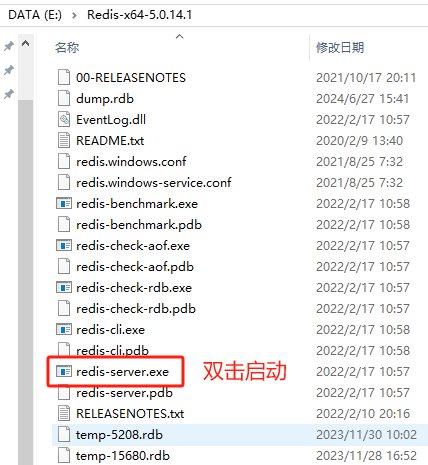
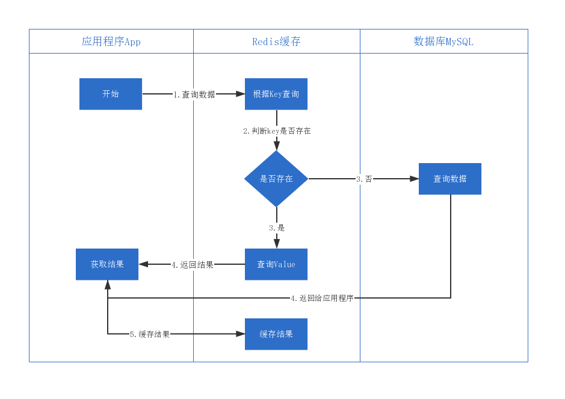
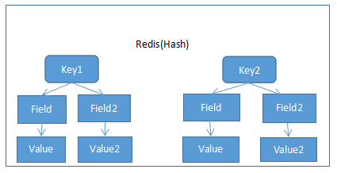

# Redis

# 一、Redis 简介
## NoSQL 简介
目前市场主流数据存储都是使用关系型数据库。每次操作关系型数据库时都是 I/O 操作，I/O 操作是主要影响程序执行性能原因之一，连接数据库关闭数据库都是消耗性能的过程。关系型数据库索引数据结构都是树状结构，当数据量特别大时，导致树深度比较深，当深度深时查询性能会大大降低。尽量减少对数据库的操作，能够明显的提升程序运行效率。

针对上面的问题，市场上就出现了各种 NoSQL(Not Only SQL,不仅仅可以使用关系型数据库)数据库，它们的宣传口号：不是什么样的场景都必须使用关系型数据库，一些特定的场景使用 NoSQL 数据库更好。

常见 NoSQL 数据库：

+ memcached：键值对，内存型数据库，所有数据都在内存中。
+ Redis：和 Memcached 类似，还具备持久化能力。
+ HBase：以列作为存储。
+ MongoDB：以 Document 做存储。

## Redis 简介
Redis 是以 Key-Value 形式进行存储的 NoSQL 数据库。

Redis 是使用 C 语言进行编写的。

平时操作的数据都在内存中，效率特高，读的效率110000次/s，写81000次/s，所以多把 Redis 当做缓存工具使用（在一些框架中还把 Redis 当做临时数据存储工具）。缓存工具：把数据库中数据缓存到 Redis 中，由于 Redis 读写性能较好，访问 Redis 中数据，而不是频繁访问数据库中数据。

Redis 以 slot（槽）作为数据存储单元，每个槽中可以存储N多个键值对。Redis 中固定具有16384。理论上可以实现一个槽是一个 Redis。每个向 Redis 存储数据的 key 都会进行 crc16算法得出一个值后对16384取余就是这个 key 存放的 solt 位置。

虽然槽的大小是不固定的，但是 Redis 一个键值对最大大小为512M（String 类型 Value）

## Redis 的安装与启动
解压：Redis-x64-5.0.14.1.zip 即可安装 Redis。

启动方式：



# 二、Redis 作为缓存工具时的流程


1. 应用程序向 Redis 查询数据
2. 判断 Key 是否存在
3. 是否存在
    1. 存在
        1. 把结果查询出来
        2. 返回数据给应用程序
    2. 不存在
        1. 向 MySQL 查询数据
        2. 把数据返回给应用程序
        3. 把结果缓存到 Redis 中

# 三、Redis 数据类型
Redis 中数据是 key-value 形式。不同类型 Value 是有不同的命令进行操作。key 和 value 都支持下面类型（在代码中多把 key 设置为 String 类型）：

+ String 字符串
+ Hash 哈希表
+ List 列表
+ Set 集合
+ Sorted Set 有序集合

## key 操作
### exists
判断 key 是否存在。

语法：exists key名称

返回值：存在返回数字，不存在返回0

### expire
设置 key 的过期时间，单位秒

语法：expire key 秒数

返回值：成功返回1，失败返回0

### ttl
查看 key 的剩余过期时间

语法：ttl key

返回值：返回剩余时间，如果不过期返回-1

### del
根据 key 删除键值对。

语法：del key

返回值：被删除 key 的数量

### keys
命令：keys *

查看所有存在的 key

## 字符串值(String)
### set
设置指定 key 的值。如果 key 不存在是新增效果，如果 key 存在是修改效果。键值对是永久存在的。

语法：set key value

返回值：成功 OK

### get
获取指定 key 的值

语法：get key

返回值：key 的值。不存在返回 nil

### setnx
当且仅当 key 不存在时才新增。恒新增，无修改功能。

语法：setnx key value

返回值：不存在时返回1，存在返回0

### setex
设置 key 的存活时间，无论是否存在指定 key 都能新增，如果存在 key 覆盖旧值。同时必须指定过期时间。

语法：

语法：setex key seconds value

返回值：OK

## 哈希表(Hash)
Hash 类型的值中包含多组 field value。



### hset
给 key 中 field 设置值。

语法：hset key field value

返回值：成功1，失败0

### hget
获取 key 中某个 field 的值

语法：hget key field

返回值：返回 field 的内容

### hmset
给 key 中多个 filed 设置值

语法：hmset key field value field value

返回值：成功OK

### hmget
一次获取 key 中多个 field 的值

语法：hmget key field field

返回值：value 列表

### hvals
获取 key 中所有 field 的值

语法：hvals key

返回值：value 列表

### hgetall
获取所有 field 和 value

语法：hgetall key

返回值：field 和 value 交替显示列表

### hdel
删除 key 中任意个 field

语法：hdel key field field

返回值：成功删除 field 的数量

## 列表(List)
key value1 value2 value3 value4

### rpush
向列表末尾中插入一个或多个值

语法；rpush key value value

返回值：列表长度

### lrange
返回列表中指定区间内的值。可以使用-1代表列表末尾

语法：lrange list 0 -1

返回值：查询到的值

### lpush
将一个或多个值插入到列表前面

语法：lpush key value value

返回值：列表长度

### llen
获取列表长度

语法：llen key

返回值：列表长度

### lrem
删除列表中元素。count 为正数表示从左往右删除的数量。负数从右往左删除的数量。

语法：lrem key count value

返回值：删除数量。

## 集合(Set)
set 和 java 中集合一样。不允许重复值，如果插入重复值后新增返回结果为0。

### sadd
向集合中添加内容。不允许重复。

语法：sadd key value value value

返回值：集合长度

### scard
返回集合元素数量

语法：scard key

返回值：集合长度

### smembers
查看集合中元素内容

语法：smembers key

返回值：集合中元素

## 有序集合(Sorted Set)
有序集合中每个 value 都有一个分数（score），根据分数进行排序。

### zadd
向有序集合中添加数据

语法：zadd key score value score value

返回值：长度

### zrange
返回区间内容，withscores 表示带有分数

语法：zrange key 区间 [withscores]

返回值：值列表

说明：上面的区间指的是元素的索引区间

# 四、Jedis(了解)
## 概述
Redis 给 Java 语言提供了客户端 API，称之为 Jedis。

Jedis API 和 Redis 命令几乎是一样的。

例如：Redis 对 String 值新增时 set 命令，Jedis 中也是 set 方法。所以本课程中没有重点把所有方法进行演示，重要演示 Jedis 如何使用。

Jedis API 特别简单，基本上都是创建对象调用方法即可。由于 Jedis 不具备把对象转换为字符串的能力，所以每次都需要借助 Json 转换工具进行转换，这个功能在 Spring Data Redis 中已经具备，推荐使用Spring Data Redis。

## 添加依赖
```xml
<?xml version="1.0" encoding="UTF-8"?>
<project xmlns="http://maven.apache.org/POM/4.0.0"
         xmlns:xsi="http://www.w3.org/2001/XMLSchema-instance"
         xsi:schemaLocation="http://maven.apache.org/POM/4.0.0 http://maven.apache.org/xsd/maven-4.0.0.xsd">
    <modelVersion>4.0.0</modelVersion>

    <groupId>com.xszx</groupId>
    <artifactId>springboot_redis_demo</artifactId>
    <version>1.0-SNAPSHOT</version>

    <parent>
        <groupId>org.springframework.boot</groupId>
        <artifactId>spring-boot-starter-parent</artifactId>
        <version>2.2.1.RELEASE</version>
    </parent>

    <dependencies>
        <dependency>
            <groupId>redis.clients</groupId>
            <artifactId>jedis</artifactId>
            <version>3.3.0</version>
        </dependency>
        <dependency>
            <groupId>org.springframework.boot</groupId>
            <artifactId>spring-boot-starter-test</artifactId>
            <scope>test</scope>
        </dependency>
    </dependencies>
</project>
```

## 不带连接池
```java
import org.junit.Test;
import redis.clients.jedis.Jedis;

public class Demo {

    @Test
    public void test1(){
        Jedis jedis = new Jedis("127.0.0.1",6379);
        jedis.set("name","哈哈");
        String value = jedis.get("name");
        System.out.println(value);
    }
}
```

## 带有连接池
```java
@Test
public void test2(){
    JedisPoolConfig jedisPoolConfig = new JedisPoolConfig();
    jedisPoolConfig.setMaxTotal(20);
    jedisPoolConfig.setMaxIdle(5);
    jedisPoolConfig.setMinIdle(3);
    JedisPool jedisPool = new JedisPool(jedisPoolConfig,"127.0.0.1",6379);
    Jedis jedis = jedisPool.getResource();
    jedis.set("name","呵呵");
    String value = jedis.get("name");
    System.out.println(value);
}
```

# 五、SpringBoot 整合 SpringDataRedis 操作 Redis
## SpringData 简介
SpringData 是 Spring 公司的顶级项目，里面包含了N多个二级子项目，这些子项目都是相对独立的项目。每个子项目是对不同 API 的封装。

所有 SpringBoot 整合 SpringData xxxx 的启动器都叫做 spring-boot-starter-data-xxxx

SpringData 好处很方便操作对象类型（基于 POJO 模型）。

只要是 SpringData  的子项目被 SpringBoot 整合后都会有一个 XXXXTemplate 示实例。

把 Redis 不同值的类型放到一个 opsForXXX 方法中。

+ opsForValue：String 值（最常用），如果存储 Java 对象或 Java 中集合时就需要使用序列化器，进行序列化成 JSON 字符串。
+ opsForList：列表 List
+ opsForHash：哈希表 Hash
+ opsForZSet：有序集合 Sorted Set
+ opsForSet：集合

## SpringDataRedis 序列化器介绍
经常需要向 Redis 中保存 Java 中 Object 或 List 等类型，这个时候就需要通过序列化器把 Java 中对象转换为字符串进行存储。

### StringRedisSerializer
只能对 String 类型序列化操作。

### GenericJackson2JsonRedisSerializer
该序列化器可以将对象自动转换为 Json 的形式存储，效率高且对调用者友好。底层依然使用 Jackson 工具包。转换后的结果中多了 _class 列，列里面存储类(新增时类型)的全限定路径，从 Redis 取出时根据_class 类型进行转换，解决了泛型问题。

## 案例
### 添加依赖
```xml
<parent>
  <groupId>org.springframework.boot</groupId>
  <artifactId>spring-boot-starter-parent</artifactId>
  <version>2.2.6.RELEASE</version>
</parent>

<dependencies>
  <!-- 为了要在项目中jackson工具包 -->
  <dependency>
    <groupId>org.springframework.boot</groupId>
    <artifactId>spring-boot-starter-web</artifactId>
  </dependency>
  <dependency>
    <groupId>org.springframework.boot</groupId>
    <artifactId>spring-boot-starter-test</artifactId>
  </dependency>
  <dependency>
    <groupId>org.springframework.boot</groupId>
    <artifactId>spring-boot-starter-data-redis</artifactId>
  </dependency>
</dependencies>
```

### 编写配置文件
使用默认的 Redis 配置即可。

### 编写配置类
```java
@Configuration
public class RedisConfig {
    @Bean
    public RedisTemplate<String,Object> redisTemplate(RedisConnectionFactory factory){
        RedisTemplate<String,Object> redisTemplate = new RedisTemplate<>();
        redisTemplate.setConnectionFactory(factory);
        redisTemplate.setKeySerializer(new StringRedisSerializer());
        redisTemplate.setValueSerializer(new GenericJackson2JsonRedisSerializer());
        return redisTemplate;
    }
}
```

### 编写启动类
```java
package com.xszx;

import org.springframework.boot.SpringApplication;
import org.springframework.boot.autoconfigure.SpringBootApplication;

@SpringBootApplication
public class MainApplication {

    public static void main(String[] args) {
        SpringApplication.run(MainApplication.class, args);
    }
}
```

### 代码1
```java
@Autowired
private RedisTemplate<String, Object> redisTemplate;

@Test
public void testString() {
    People peo = new People(1, "张三");
    redisTemplate.opsForValue().set("peo1", peo);
}
```

```java
@Test
public void testGetString() {
    People peo = (People) redisTemplate.opsForValue().get("peo1");
    System.out.println(peo);
}
```

### 代码2
```java
@Test
public void testList() {
    List<People> list = new ArrayList<>();
    list.add(new People(1, "张三"));
    list.add(new People(2, "李四"));
    redisTemplate.opsForValue().set("list2", list);
}
```

```java
@Test
public void testGetList(){
    List<People> list2 = (List<People>) redisTemplate.opsForValue().get("list2");
    System.out.println(list2);
}
```

### 代码3
```java
@Test
void hasKey(){
    Boolean result = redisTemplate.hasKey("name");
    System.out.println(result);
}
```

```java
@Test
void del(){
    Boolean result = redisTemplate.delete("name");
    System.out.println(result);
}
```

# 六、Redis 持久化策略
## 概述
Redis 不仅仅是一个内存型数据库，还具备持久化能力。

<font style="color:rgb(255,0,0);">Redis 每次启动时都会从硬盘存储文件中把数据读取到内存中。运行过程中操作的数据都是内存中的数据</font>。

一共包含两种持久化策略：RDB 和 AOF

## RDB（Redis DataBase）
rdb 模式是<font style="color:rgb(31,73,125);">默认模式</font>，可以在指定的时间间隔内生成数据快照（snapshot），默认保存到 dump.rdb 文件中。当 redis 重启后会自动加载 dump.rdb 文件中内容到内存中。

用户可以使用 SAVE（同步）或 BGSAVE（异步）手动保存数据。

可以设置服务器配置的 save 选项，让服务器每隔一段时间自动执行一次 BGSAVE 命令，可以通过 save 选项设置多个保存条件，但只要其中任意一个条件被满足，服务器就会执行 BGSAVE 命令。  
例如：  
save 900 1  
save 300 10  
save 60 10000  
那么只要满足以下三个条件中的任意一个，BGSAVE 命令就会被执行。计时单位是必须要执行的时间，save 900 1 ，每900秒检测一次。在并发量越高的项目中 Redis 的时间参数设置的值要越小。  
服务器在900秒之内，对数据库进行了至少1次修改  
服务器在300秒之内，对数据库进行了至少10次修改  
服务器在60秒之内，对数据库进行了至少10000次修改。

**优点：**

rdb 文件是一个紧凑文件，直接使用 rdb 文件就可以还原数据。

数据保存会由一个子进程进行保存，不影响父进程做其他事情。

恢复数据的效率要高于 aof

<font style="color:rgb(255,0,0);">总结：性能要高于 AOF</font>

**缺点：**

每次保存点之间导致 redis 不可意料的关闭，可能会<font style="color:rgb(255,0,0);">丢失数据</font>。

由于每次保存数据都需要 fork() 子进程，在数据量比较大时可能会比较耗费性能。

## AOF（AppendOnly File）
AOF 默认是关闭的，需要在配置文件 redis.conf 中开启 AOF。Redis 支持 AOF 和 RDB 同时生效，如果同时存在，AOF 优先级高于 RDB（Redis 重新启动时会使用 AOF 进行数据恢复）

AOF 原理：监听执行的命令，如果发现执行了修改数据的操作，同时直接同步到数据库文件中，同时会把命令记录到日志中。即使突然出现问题，由于日志文件中已经记录命令，下一次启动时也可以按照日志进行恢复数据，由于内存数据和硬盘数据实时同步，即使出现意外情况也需要担心。

**优点:**

相对 RDB 数据更加安全。

**缺点:**

相同数据集 AOF 要大于 RDB。

相对 RDB 可能会慢一些。

**开启办法:**

修改 redis.conf 中。

appendonly yes 开启 aof

appendfilename 设置 aof 数据文件，名称随意。

```shell
# 默认no
appendonly yes
# aof文件名
appendfilename "appendonly.aof"
```


> 更新: 2024-07-23 10:37:28  
> 原文: <https://www.yuque.com/u41736172/az9urv/lfv4g9spry778gm4>