# SpringBoot

# 一、SpringBoot 简介
## <font style="color:rgb(0,0,0);">Spring 框架优缺点分析</font>
### 优点
Spring 是 Java 企业版（Java Enterprise Edition，JEE，也称J2EE）的**轻量级**代替品。无需开发重量级的Enterprise JavaBean（EJB），Spring 为企业级 Java 开发提供了一种相对简单的方法，通过**依赖注入和面向切面编程**，用简单的 Java 对象（Plain Old Java Object，POJO）实现了 EJB 的功能。

### 缺点
虽然 Spring 的组件**代码是轻量级**的，但它的**配置却是重量级**的。一开始，Spring 用 XML 配置，而且是**很多 XML 配置**。Spring 2.5 引入了**基于注解**的组件扫描，这消除了大量针对应用程序自身组件的显式 XML配置。Spring 3.0 引入了**基于 Java 的配置**，这是一种类型安全的可重构配置方式，可以代替 XML。 所有这些配置都代表了开发时的损耗。因为在思考 Spring 特性配置和解决业务问题之间需要进行思维切换，所以**编写配置挤占了编写应用程序逻辑的时间**。和所有框架一样，Spring 实用，但与此同时它要求的回报也不少。 

除此之外，项目的依赖管理也是一件耗时耗力的事情。在环境搭建时，**需要分析要导入哪些库的坐标**，而且还需要分析导入与之有依赖关系的其他库的坐标，一旦选错了依赖的版本，随之而来的不兼容问题就会严重阻碍项目的开发进度。

## SpringBoot 概述
+ SpringBoot 是 Spring 家族的一个顶级项目，和 Spring Framework 是一个级别的。
+ SpringBoot 实际上是利用 Spring Framework 4 自动配置特性完成。编写项目时不需要编写 xml 文件。发展到现在，SpringBoot 已经具有很大的生态圈，各种主流技术已经都提供了 SpringBoot 的启动器(starter)。
+ 启动器？Spring 框架在项目中作用是 Spring 整合各种其他技术，让其他技术使用更加方便。Spring Boot 的启动器实际上就是一个依赖。这个依赖中包含了整个这个技术的相关 jar 包，还包含了这个技术的自动配置，以前绝大多数 XML 配置都不需要配置了。当然了，启动器中自动配置无法实现所有内容的自动配置，在使用 SpringBoot 时还需要进行少量的配置（这个配置不是在 xml 中了，而是在 properties 或 yml 中即可）。如果是 SpringBoot 自己封装的启动器的 artifactId 名字满足：spring-boot-starter-xxxx，如果是第三方公司提供的启动器满足：xxxx-spring-boot-starter。以后每次使用 SpringBoot 整合其他技术时首先需要考虑导入启动器。

## SpringBoot 特征
+ 使用 SpringBoot 可以快速的创建独立的 Spring 应用程序
+ 在 SpringBoot 中直接嵌入了 Tomcat、Jetty、Undertow 等 Web 容器，所以在使用 SpringBoot 做 Web开发时不需要部署 WAR 文件
+ 通过提供自己的启动器依赖，简化项目构建配置
+ 尽量的自动配置 Spring 和第三方库
+ 绝对没有代码生成，也不需要 XML 配置文件

## **<font style="color:rgb(0,0,0);">SpringBoot 版本介绍</font>**
+ SNAPSHOT：快照版，即开发版。
+ CURRENT：最新版，但是不一定是稳定版。
+ GA：General Availability，正式发布的版本。
+ SpringBoot 参考文档：[https://docs.spring.io/spring-boot/docs/2.2.13.RELEASE/reference/html/getting-started.html#getting-started](https://docs.spring.io/spring-boot/docs/2.2.13.RELEASE/reference/html/getting-started.html#getting-started)

## **<font style="color:rgb(0,0,0);">SpringBoot 的核心</font>**
+ 起步依赖：起步依赖本质上是一个 Maven 项目对象模型（Project Object Model，POM），定义了对其他库的传递依赖，这些东西加在一起即支持某项功能。 简单的说，起步依赖就是将具备某种功能的坐标打包到一起，并提供一些默认的功能。
+ 自动配置：SpringBoot 的自动配置是一个运行时（更准确地说，是应用程序启动时）的过程，考虑了众多因素，才决定 SpringBoot 配置应该用哪个，不该用哪个。该过程是 SpringBoot 自动完成的。

# **<font style="color:rgb(0,0,0);">二、SpringBoot 入门案例</font>**
## <font style="color:rgb(0,0,0);">需求</font>
使用 SpringBoot 编写入门案例，实现浏览器发送请求到服务器，服务器处理完请求后响应一句话给浏览器。

通过案例，要理解：

+ SpringBoot 确实可以使我们的 Spring 应用开发变得很简单，不需要写各种 xml 配置
+ 使用了 SpringBoot 框架后，之前的 SSM 代码该怎么写还是怎么写
+ SpringBoot 开发 web 应用，不需要打成 war 包，jar 包的方式即可，因为其内嵌了 tomcat

## 创建 Maven 项目
创建一个 Maven 项目，打包方式使用默认的 jar 即可。

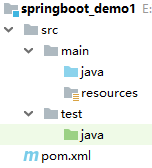

## 添加依赖
```xml
<?xml version="1.0" encoding="UTF-8"?>
<project xmlns="http://maven.apache.org/POM/4.0.0"
         xmlns:xsi="http://www.w3.org/2001/XMLSchema-instance"
         xsi:schemaLocation="http://maven.apache.org/POM/4.0.0 http://maven.apache.org/xsd/maven-4.0.0.xsd">
    <modelVersion>4.0.0</modelVersion>

    <groupId>com.xszx</groupId>
    <artifactId>springboot_demo1</artifactId>
    <version>1.0-SNAPSHOT</version>

    <!--继承父项目，这个父项目是SpringBoot提供的，它就是定义好了各种依赖的版本-->
    <parent>
        <groupId>org.springframework.boot</groupId>
        <artifactId>spring-boot-starter-parent</artifactId>
        <version>2.1.13.RELEASE</version>
    </parent>

    <dependencies>
        <!--引入web模块的启动器-->
        <dependency>
            <groupId>org.springframework.boot</groupId>
            <artifactId>spring-boot-starter-web</artifactId>
        </dependency>
    </dependencies>
</project>
```

## **<font style="color:rgb(0,0,0);">编写启动类</font>**
SpringBoot 项目是一个 jar 类型的项目，那它启动的时候是需要一个启动类来启动的，其实也就是一个普通类中，写上 main 方法、注解。

但是这个启动类所在的包的级别需要高点，因为启动类在哪个包中，就会自动扫描该包，及其后代包下的类。

在 com.xszx 包下面编写：

```java
package com.xszx;

import org.springframework.boot.SpringApplication;
import org.springframework.boot.autoconfigure.SpringBootApplication;

@SpringBootApplication // 表示这是一个SpringBoot应用，开启了SpringBoot的自动配置、组件扫描等
public class MainApplication {

    public static void main(String[] args) {
        // 启动SpringBoot应用
        SpringApplication.run(MainApplication.class, args);
    }
}
```

## **<font style="color:rgb(0,0,0);">编写 controller 层代码</font>**
```java
package com.xszx.controller;

import org.springframework.web.bind.annotation.GetMapping;
import org.springframework.web.bind.annotation.RestController;

@RestController
public class HelloController {

    @GetMapping("hello01")
    public String hello01(){
        System.out.println("hello01.............");
        return "hello springboot~~";
    }
}
```

## **<font style="color:rgb(0,0,0);">启动测试</font>**
启动 SpringBoot 项目，只需要运行启动类即可！

项目默认运行在 tomcat 服务器中，端口号是 8080，访问路径是 /

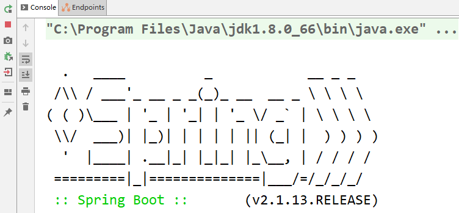


## **<font style="color:rgb(0,0,0);">总结</font>**
+ 编写 SpringBoot 项目的 pom 文件时，需要让该项目继承 SpringBoot 的项目，继承之后就有了各种依赖的版本。
+ 在项目中使用什么技术，就引入该技术的启动器
    - SpringBoot 官方提供的启动器命名：spring-boot-starter-xxx
    - 非官方的启动器命名：xxx-spring-boot-starter
+ SpringBoot 开发 web 项目时，用的也是 jar 工程，因为其内嵌了tomcat
+ SpringBoot 需要写一个启动类去启动项目，该类需要放在包级别较高的位置，它会自动扫描所在的包及其后代包中的类。启动类的命名规范：xxxApplication
+ 如果我们的项目已经继承了某个项目，那就不能再继承 SpringBoot 项目了，可以通过添加依赖的方式引入SpringBoot 父项目：

```xml
<dependencyManagement>
    <dependencies>
        <dependency>
            <groupId>org.springframework.boot</groupId>
            <artifactId>spring-boot-dependencies</artifactId>
            <version>2.1.13.RELEASE</version>
            <type>pom</type>
            <scope>import</scope>
        </dependency>
    </dependencies>
</dependencyManagement>
```

+ 启动类与启动器的区别：
    - 启动类是用来启动项目是，是一个入口
    - 启动器可以理解为是一堆依赖的集合，而且帮我们写好了自动配置的信息
+ SpringBoot 项目默认用的是 tomcat 服务器，端口号默认是 8080，项目访问路径默认是 /

# 三、IDEA 快速创建 SpringBoot 项目
## **<font style="color:rgb(0,0,0);">概述</font>**
使用 IDEA，我们可以快速的去创建一个 SpringBoot 项目，它给我们自动的继承了 SpringBoot 父项目，可以选择添加指定的启动器，比如 web 启动器，也帮我们编写了启动类。

## **<font style="color:rgb(0,0,0);">案例</font>**
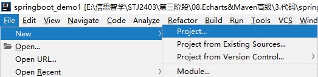

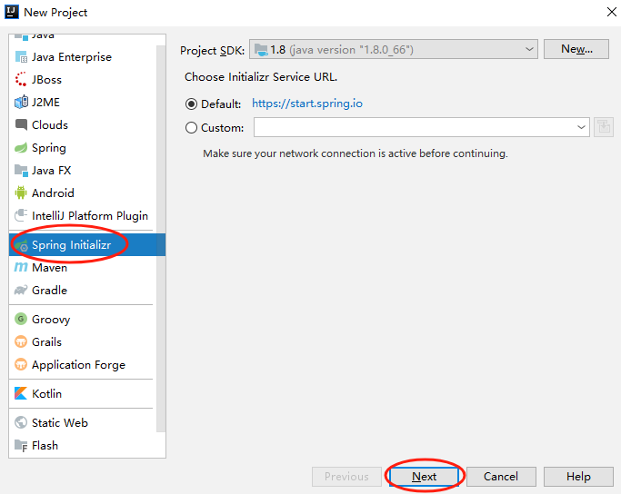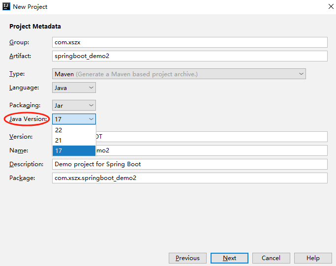

我们开发环境中用的是 JDK8，这里要求的 JDK 比较高，所以不再此继续演示了。

注意：这种方式需要联网！

其实我们自己创建更好，多熟悉熟悉 SpringBoot。

## **<font style="color:rgb(0,0,0);">说明</font>**
使用 IDEA 自动创建的 SpringBoot 项目中多了很多没用的文件，可以删掉！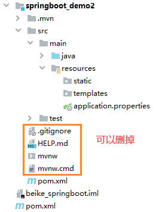

# **<font style="color:rgb(0,0,0);">四、SpringBoot 配置文件</font>**
## **<font style="color:rgb(0,0,0);">概述</font>**
SpringBoot 项目中需要一个配置文件，名字为 application，后缀可以是 properties 或者 yml（yaml）。

## **<font style="color:rgb(0,0,0);">properties 格式</font>**
也就是 application.properties。这种 properties 配置文件我们用过多次了，里面写的就是键值对的数据。

比如：我们要修改 SpringBoot 项目的 Tomcat 端口号和项目访问路径：

```properties
server.port=10086
server.servlet.context-path=/abc
```

可以发现，用 properties 的话，每项配置的键都需要写完整！也就是有些冗余！

## **<font style="color:rgb(0,0,0);">yml 格式</font>**
也就是 application.yml 或者 application.yaml。这种格式使用的相对 properties 来说比较多！

### **<font style="color:rgb(0,0,0);">基本要求</font>**
+ 大小写敏感
+ 使用缩进代表层级关系（严格注意缩进，多一个空格都不行）
+ 相同的部分只出现一次，不会有冗余
+ 注意空格

### **<font style="color:rgb(0,0,0);">书写格式</font>**
修改 SpringBoot 项目的 Tomcat 端口号和项目访问路径：

```yaml
server:
  port: 10086
  servlet:
    context-path: /abc
```

对象数据：

```yaml
user:
  id: 1
  name: 吕布
  sex: 男

# 或者
emp: {id: 1, name: 曹操, sex: 男}
```

数组：

```yaml
city:
  - 北京
  - 上海
  - 广州
  - 深圳

# 或者
city2: [山西, 河南, 河北, 山东]
```

## **<font style="color:rgb(0,0,0);">配置文件存放位置</font>**
+ 当前项目下
+ 当前项目下的一个 config 目录中
+ 项目的 resources 目录中
+ 项目的 resources 下的 config 目录中

## **<font style="color:rgb(0,0,0);">配置文件加载顺序</font>**
既然有两种配置文件格式，有多种配置文件存放位置，那不同的格式，不同的位置，他们的加载顺序是不同的。

### **<font style="color:rgb(0,0,0);">不同格式的加载顺序</font>**
如果同一个目录下，application.properties 和 application.yml 都存在，那么，先读取application.properties 文件，再读取 application.yml 文件。

如果两种格式中都配置了同一个属性的值，以第一个读取到的为准，后面读取的是不会覆盖前面的！

### **<font style="color:rgb(0,0,0);">不同位置的加载顺序</font>**
application 配置文件可以放在以下的各个位置上，优先级就是图中标出的顺序。

优先级高的，会被先加载，优先级低的会后加载；相同的属性配置，以先加载的为主，不同的属性配置形成互补！

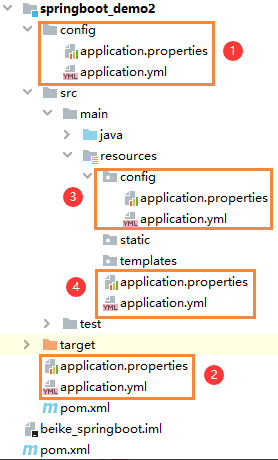

## **<font style="color:rgb(0,0,0);">总结</font>**
一般我们在项目中也不会同时用两种格式的 application 文件，也不会将他们放在多个位置。

常用的就是 application.yml 文件，放的位置是直接在 resources 目录下。

# **<font style="color:rgb(0,0,0);">五、SpringBoot 项目目录结构</font>**
## **<font style="color:rgb(0,0,0);">目录结构</font>**
标准的 SpringBoot 项目目录结构是：

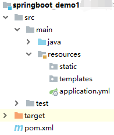

+ java 目录：存放 java 代码的
+ resouces/static 目录：存放静态资源的，比如 HTML、css、js 等等
+ resources/templates 目录：存放模板页面的，比如 thymeleaf 模板
+ application.yml：SpringBoot 项目的配置文件
+ 我们还可以在 resources 目录下创建一个 public 目录，也可以将静态资源放在 public 目录下

> 注意：无论是将静态资源放在 static 还是 public 目录中，我们在浏览器访问的时候路径都不需要加 static或者 public。 格式：http://ip:port/项目路径/资源名。
>
> 当然了，我们如果使用 jsp 来做为页面开发的话，还需要创建一个 webapp 目录及 WEB-INF 目录，但以后我们是不会使用 jsp 来开发的。
>

# 六、SpringBoot 整合 MyBatis
## **<font style="color:rgb(0,0,0);">需求</font>**
使用 SpringBoot 整合 Mybatis 框架，要明确：

+ SpringBoot 可以快速的构建一个 Spring 应用，也就是说我们使用了 SpringBoot 后，Spring 框架的配置和依赖不需要我们自己搞了，SpringMVC 框架相关的配置不需要写了、依赖的话只需要添加 web 启动器即可
+ 使用 SpringBoot 后，SSM 相关的代码该怎么写还是怎么写，只是依赖和配置少了而已！

## **<font style="color:rgb(0,0,0);">创建数据库及表</font>**
```sql
DROP TABLE IF EXISTS `dept`;
CREATE TABLE `dept` (
  `did` int(11) NOT NULL AUTO_INCREMENT,
  `dname` varchar(255) DEFAULT NULL,
  PRIMARY KEY (`did`)
) ENGINE=InnoDB AUTO_INCREMENT=4 DEFAULT CHARSET=utf8;

INSERT INTO `dept` VALUES ('1', '人事部');
INSERT INTO `dept` VALUES ('2', '财务部');
INSERT INTO `dept` VALUES ('3', '开发部');
```

## 创建项目
创建一个 Maven 项目，打包方式是 jar。

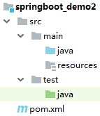

## 添加依赖
在 pom.xml 文件中，主要写如下内容：

+ 继承 SpringBoot 父项目
+ 引入 web 启动器
+ 引入 mybatis 启动器（注意 maven 镜像可能下载不了，那就从远程仓库下！！！）
+ 引入 mysql 数据库驱动包
+ 引入 lombok 依赖

```xml
<?xml version="1.0" encoding="UTF-8"?>
<project xmlns="http://maven.apache.org/POM/4.0.0"
         xmlns:xsi="http://www.w3.org/2001/XMLSchema-instance"
         xsi:schemaLocation="http://maven.apache.org/POM/4.0.0 http://maven.apache.org/xsd/maven-4.0.0.xsd">
    <modelVersion>4.0.0</modelVersion>

    <groupId>com.xszx</groupId>
    <artifactId>springboot_demo2</artifactId>
    <version>1.0-SNAPSHOT</version>

    <parent>
        <groupId>org.springframework.boot</groupId>
        <artifactId>spring-boot-starter-parent</artifactId>
        <version>2.1.13.RELEASE</version>
    </parent>

    <dependencies>

        <!--引入web启动器-->
        <dependency>
            <groupId>org.springframework.boot</groupId>
            <artifactId>spring-boot-starter-web</artifactId>
        </dependency>

        <!--引入mybatis启动器-->
        <dependency>
            <groupId>org.mybatis.spring.boot</groupId>
            <artifactId>mybatis-spring-boot-starter</artifactId>
            <version>2.1.1</version>
        </dependency>

        <!--引入数据库驱动-->
        <dependency>
            <groupId>mysql</groupId>
            <artifactId>mysql-connector-java</artifactId>
            <version>5.1.47</version>
        </dependency>

        <!--引入lombok依赖-->
        <dependency>
            <groupId>org.projectlombok</groupId>
            <artifactId>lombok</artifactId>
            <version>1.18.12</version>
            <scope>provided</scope>
        </dependency>
    </dependencies>
</project>
```

## 编写 SpringBoot 配置文件
```yaml
# 数据库连接信息
spring:
  datasource:
    driver-class-name: com.mysql.jdbc.Driver
    url: jdbc:mysql://localhost:3306/xszx?useUnicode=true&characterEncoding=utf-8
    username: root
    password: root

# MyBatis相关配置，指定mapper映射文件的位置
mybatis:
  mapper-locations: classpath:mapper/*.xml
```

## 编写启动类
注意：要在启动类上再加一个注解 @MapperScan("mapper接口所在的包")，该注解的作用就是扫描mapper 接口。

```java
package com.xszx;

import org.mybatis.spring.annotation.MapperScan;
import org.springframework.boot.SpringApplication;
import org.springframework.boot.autoconfigure.SpringBootApplication;

@SpringBootApplication
@MapperScan("com.xszx.mapper")
public class MainApplication {

    public static void main(String[] args) {
        SpringApplication.run(MainApplication.class, args);
    }
}
```

## 编写实体类代码
```java
package com.xszx.bean;

import lombok.Data;

@Data
public class Dept {
    
    private Integer did;
    private String dname;
}
```

## 编写 mapper 层代码
```java
package com.xszx.mapper;

import com.xszx.bean.Dept;
import java.util.List;

public interface DeptMapper {
    
    List<Dept> findAll();
}
```

```xml
<?xml version="1.0" encoding="UTF-8" ?>
<!DOCTYPE mapper
        PUBLIC "-//mybatis.org//DTD Mapper 3.0//EN"
        "http://mybatis.org/dtd/mybatis-3-mapper.dtd">
<mapper namespace="com.xszx.mapper.DeptMapper">

    <select id="findAll" resultType="com.xszx.bean.Dept">
        select * from dept
    </select>
</mapper>
```

## 编写 service 层代码
```java
package com.xszx.service;

import com.xszx.bean.Dept;
import java.util.List;

public interface DeptService {
    
    List<Dept> findAll();
}

```

```java
package com.xszx.service.impl;

import com.xszx.bean.Dept;
import com.xszx.mapper.DeptMapper;
import com.xszx.service.DeptService;
import org.springframework.beans.factory.annotation.Autowired;
import org.springframework.stereotype.Service;
import java.util.List;

@Service
public class DeptServiceImpl implements DeptService {

    @Autowired
    private DeptMapper deptMapper;

    @Override
    public List<Dept> findAll() {
        return deptMapper.findAll();
    }
}
```

## 编写 controller 层代码
```java
package com.xszx.controller;

import com.xszx.bean.Dept;
import com.xszx.service.DeptService;
import org.springframework.beans.factory.annotation.Autowired;
import org.springframework.web.bind.annotation.GetMapping;
import org.springframework.web.bind.annotation.RequestMapping;
import org.springframework.web.bind.annotation.RestController;

import java.util.List;

@RestController
@RequestMapping("dept")
public class DeptController {
    
    @Autowired
    private DeptService deptService;
    
    @GetMapping("findAll")
    public List<Dept> findAll(){
        return deptService.findAll();
    }
}
```

## 启动测试
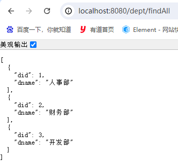

# 七、SpringBoot 整合 Druid
## 数据库连接池概述
数据库连接池就是用来创建、管理数据库连接的。不使用数据库连接池的话，我们在每次用的时候都需要自己去创建连接，使用完后再关闭连接，这样是比较耗费资源的，效率不高。

而数据库连接池，是在一开始就为我们创建了多个连接，用的时候直接从池子中获取，用完后，连接池再将连接收回去供下次使用！

连接池中连接的状态有：空闲状态（Idle）、活动状态（Active）

使用连接池技术可以使项目更高效！

## Druid 介绍
Druid 是由阿里巴巴推出的数据库连接池。它结合了 C3P0、DBCP、PROXOOL 等数据库连接池的优点。之所以从众多数据库连接池中脱颖而出，还有一个重要的原因就是它包含控制台(可视化管理界面)。

## 整合说明
接着在上面的案例中整合 Druid 数据库连接池即可。

## 添加依赖
```xml
<!--引入Druid启动器-->
<dependency>
    <groupId>com.alibaba</groupId>
    <artifactId>druid-spring-boot-starter</artifactId>
    <version>1.1.10</version>
</dependency>
```

## 修改配置文件
加入连接池的配置，最终配置如下：

```yaml
# 数据库连接信息
spring:
  datasource:
    type: com.alibaba.druid.pool.DruidDataSource
    driver-class-name: com.mysql.jdbc.Driver
    url: jdbc:mysql://localhost:3306/xszx?useUnicode=true&characterEncoding=utf-8
    username: root
    password: root
    druid:
      initial-size: 5
      min-idle: 5
      max-active: 20
      max-wait: 60000
      stat-view-servlet:
        login-username: admin
        login-password: 123456

# MyBatis相关配置，指定mapper映射文件的位置
mybatis:
  mapper-locations: classpath:mapper/*.xml
```

## 启动测试
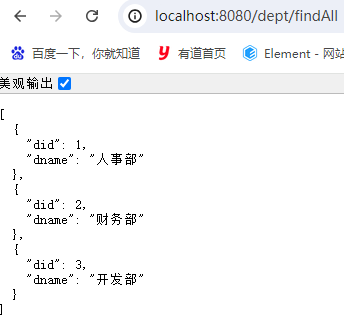

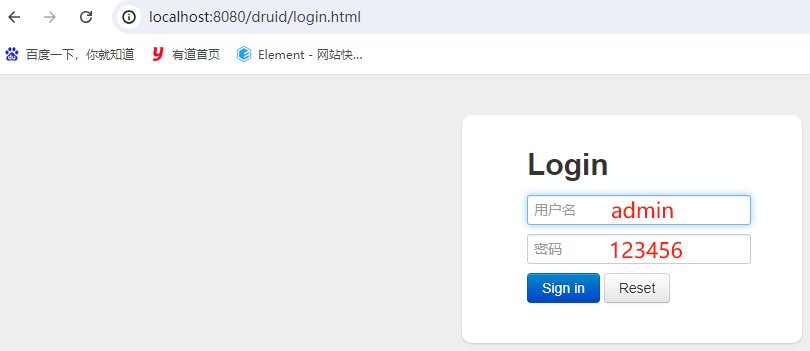

# 八、SpringBoot 整合 MP
## 创建数据库及表
同上面 SpringBoot 整合 Mybatis 的表一样。

## 创建项目
创建一个 Maven 项目，打包方式是 jar。

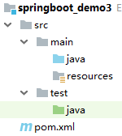

## 添加依赖
```xml
<?xml version="1.0" encoding="UTF-8"?>
<project xmlns="http://maven.apache.org/POM/4.0.0"
         xmlns:xsi="http://www.w3.org/2001/XMLSchema-instance"
         xsi:schemaLocation="http://maven.apache.org/POM/4.0.0 http://maven.apache.org/xsd/maven-4.0.0.xsd">
    <modelVersion>4.0.0</modelVersion>

    <groupId>com.xszx</groupId>
    <artifactId>springboot_demo3</artifactId>
    <version>1.0-SNAPSHOT</version>

    <parent>
        <groupId>org.springframework.boot</groupId>
        <artifactId>spring-boot-starter-parent</artifactId>
        <version>2.1.13.RELEASE</version>
    </parent>

    <dependencies>

        <!--引入web启动器-->
        <dependency>
            <groupId>org.springframework.boot</groupId>
            <artifactId>spring-boot-starter-web</artifactId>
        </dependency>

        <!--引入mp启动器-->
        <dependency>
            <groupId>com.baomidou</groupId>
            <artifactId>mybatis-plus-boot-starter</artifactId>
            <version>3.5.2</version>
        </dependency>

        <!--引入数据库驱动-->
        <dependency>
            <groupId>mysql</groupId>
            <artifactId>mysql-connector-java</artifactId>
            <version>5.1.47</version>
        </dependency>

        <!--引入lombok依赖-->
        <dependency>
            <groupId>org.projectlombok</groupId>
            <artifactId>lombok</artifactId>
            <version>1.18.12</version>
            <scope>provided</scope>
        </dependency>

        <!--引入Druid启动器-->
        <dependency>
            <groupId>com.alibaba</groupId>
            <artifactId>druid-spring-boot-starter</artifactId>
            <version>1.1.10</version>
        </dependency>
    </dependencies>
</project>
```

## 编写 SpringBoot 配置文件
```yaml
# 数据库连接信息
spring:
  datasource:
    type: com.alibaba.druid.pool.DruidDataSource
    driver-class-name: com.mysql.jdbc.Driver
    url: jdbc:mysql://localhost:3306/xszx?useUnicode=true&characterEncoding=utf-8
    username: root
    password: root
    druid:
      initial-size: 5
      min-idle: 5
      max-active: 20
      max-wait: 60000
      stat-view-servlet:
        login-username: admin
        login-password: 123456

# MP相关配置
mybatis-plus:
  mapper-locations: classpath:mapper/*.xml
  type-aliases-package: com.xszx.bean
  configuration:
    log-impl: org.apache.ibatis.logging.stdout.StdOutImpl
```

## 编写启动类
```java
package com.xszx;

import org.mybatis.spring.annotation.MapperScan;
import org.springframework.boot.SpringApplication;
import org.springframework.boot.autoconfigure.SpringBootApplication;

@SpringBootApplication
@MapperScan("com.xszx.mapper")
public class MainApplication {

    public static void main(String[] args) {
        SpringApplication.run(MainApplication.class, args);
    }
}
```

## 编写实体类
```java
package com.xszx.bean;

import com.baomidou.mybatisplus.annotation.IdType;
import com.baomidou.mybatisplus.annotation.TableId;
import lombok.Data;

@Data
public class Dept {
    
    @TableId(value = "did", type = IdType.AUTO)
    private Integer did;
    private String dname;
}
```

## 编写 mapper 层代码
```java
package com.xszx.mapper;

import com.baomidou.mybatisplus.core.mapper.BaseMapper;
import com.xszx.bean.Dept;

public interface DeptMapper extends BaseMapper<Dept> {
    
}
```

## 编写 service 层代码
```java
package com.xszx.service;

import com.baomidou.mybatisplus.extension.service.IService;
import com.xszx.bean.Dept;

public interface DeptService extends IService<Dept> {
    
}
```

```java
package com.xszx.service.impl;

import com.baomidou.mybatisplus.extension.service.impl.ServiceImpl;
import com.xszx.bean.Dept;
import com.xszx.mapper.DeptMapper;
import com.xszx.service.DeptService;
import org.springframework.stereotype.Service;

@Service
public class DeptServiceImpl extends ServiceImpl<DeptMapper, Dept> implements DeptService {
    
}
```

## 编写 controller 层代码
```java
package com.xszx.controller;

import com.xszx.bean.Dept;
import com.xszx.service.DeptService;
import org.springframework.beans.factory.annotation.Autowired;
import org.springframework.web.bind.annotation.GetMapping;
import org.springframework.web.bind.annotation.RequestMapping;
import org.springframework.web.bind.annotation.RestController;

import java.util.List;

@RestController
@RequestMapping("dept")
public class DeptController {
    
    @Autowired
    private DeptService deptService;
    
    @GetMapping("findAll")
    public List<Dept> findAll(){
        return deptService.list();
    }
}
```

## 启动测试
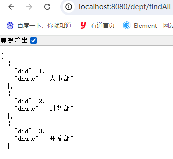

# 九、SpringBoot 整合 PageHelper
## **<font style="color:rgb(0,0,0);">分页插件回顾</font>**
之前我们已经学习过分页插件 PageHelper，使用它之后，对于分页我们正常查询即可。

插件会自动在我们查询的时候给正常查询的 SQL 后面拼上 limit xx,xx；

而且它还会多发一条 SQL，用来查询总记录数。

## 需求说明
接着在上面 SpringBoot 整合 MP 的案例基础上整合 PageHelper。

## 添加依赖
```xml
<!--引入PageHelper启动器-->
<dependency>
    <groupId>com.github.pagehelper</groupId>
    <artifactId>pagehelper-spring-boot-starter</artifactId>
    <version>1.2.12</version>
</dependency>
```

## 编写 service 层代码
```java
package com.xszx.service;

import com.baomidou.mybatisplus.extension.service.IService;
import com.github.pagehelper.PageInfo;
import com.xszx.bean.Dept;

public interface DeptService extends IService<Dept> {

    PageInfo<Dept> findAll(Integer pageNum, Integer pageSize);
}
```

```java
package com.xszx.service.impl;

import com.baomidou.mybatisplus.extension.service.impl.ServiceImpl;
import com.github.pagehelper.PageHelper;
import com.github.pagehelper.PageInfo;
import com.xszx.bean.Dept;
import com.xszx.mapper.DeptMapper;
import com.xszx.service.DeptService;
import org.springframework.stereotype.Service;

import java.util.List;

@Service
public class DeptServiceImpl extends ServiceImpl<DeptMapper, Dept> implements DeptService {

    @Override
    public PageInfo<Dept> findAll(Integer pageNum, Integer pageSize) {
        PageHelper.startPage(pageNum, pageSize);
        List<Dept> list = baseMapper.selectList(null);
        return new PageInfo<>(list);
    }
}
```

## 编写 controller 层代码
```java
package com.xszx.controller;

import com.github.pagehelper.PageInfo;
import com.xszx.bean.Dept;
import com.xszx.service.DeptService;
import org.springframework.beans.factory.annotation.Autowired;
import org.springframework.web.bind.annotation.GetMapping;
import org.springframework.web.bind.annotation.RequestMapping;
import org.springframework.web.bind.annotation.RequestParam;
import org.springframework.web.bind.annotation.RestController;

@RestController
@RequestMapping("dept")
public class DeptController {

    @Autowired
    private DeptService deptService;

    @GetMapping("findAll")
    public PageInfo<Dept> findAll(@RequestParam(defaultValue = "1") Integer pageNum,
                                  @RequestParam(defaultValue = "2") Integer pageSize){
        return deptService.findAll(pageNum, pageSize);
    }
}
```

## 启动测试
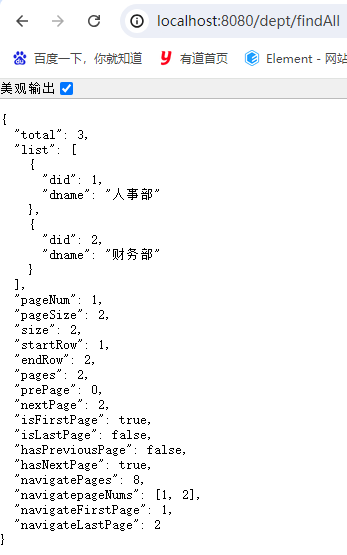

# 十、SpringBoot 整合 logback
## 概述
日志框架有好多，比如：log4j、commons-logging、JDK 的 logging、logback 等。

在 SpringBoot 框架中默认使用的是 logback 日志。

在 SpringBoot 项目中我们不需要额外的添加 Logback 的依赖，因为在 spring-boot-starter 或者 spring-boot-starter-web 中已经包含了 Logback 的依赖。

## **<font style="color:rgb(0,0,0);">整合案例</font>**
接着在上面的 SpringBoot 整合 PageHelper 的案例基础上写。

SpringBoot 整合 logback 日志，其实只需要在 application.yml 文件中添加一些自己的设置即可。当然，不加也行，那使用的都是默认的配置。

```yaml
logging:
  level:
    root: info # 设置全局日志级别
    com.xszx: debug # 设置某个包的级别
  pattern:
    console: "%d - %msg%n" # 设置日志的格式，可以不指定，使用默认的
  file: D:\\test.log # 设置日志内容输出到指定文件
```

如果觉得在 application.yml 文件中配置日志比较麻烦，也可以写一个专门的日志配置文件 logback.xml，然后直接运行项目也是可以生效的！（这个文件要放在 resources 目录下，名字是固定的）。

```xml
<?xml version="1.0" encoding="UTF-8"?>
<configuration debug="false">
    <!--定义日志文件的存储地址 logs为当前项目的logs目录 还可以设置为../logs -->
    <property name="LOG_HOME" value="logs" />
    <!--控制台日志， 控制台输出 -->
    <appender name="STDOUT" class="ch.qos.logback.core.ConsoleAppender">
        <encoder class="ch.qos.logback.classic.encoder.PatternLayoutEncoder">
            <!--格式化输出：%d表示日期，%thread表示线程名，%-5level：级别从左显示5个字符
            宽度,%msg：日志消息，%n是换行符-->
            <pattern>%d{yyyy-MM-dd HH:mm:ss.SSS} [%thread] %-5level %logger{50}
                - %msg%n</pattern>
        </encoder>
    </appender>
    <!--myibatis log configure-->
    <logger name="com.apache.ibatis" level="TRACE"/>
    <logger name="java.sql.Connection" level="DEBUG"/>
    <logger name="java.sql.Statement" level="DEBUG"/>
    <logger name="java.sql.PreparedStatement" level="DEBUG"/>
    <!-- 日志输出级别 -->
    <root level="DEBUG">
        <appender-ref ref="STDOUT" />
    </root>
</configuration>
```

# **<font style="color:rgb(0,0,0);">十一、SpringBoot 整合 Thymeleaf</font>**
## Thymeleaf 回顾
+ Thymeleaf 的主要目标是将优雅的自然模板带到开发工作流程中，并将 HTML 在浏览器中正确显示，并且可以作为静态原型，让开发团队能更容易地协作。
+ Thymeleaf 能够处理 HTML，XML，JavaScript，CSS 甚至纯文本。
+ 长期以来，jsp 在视图领域有非常重要的地位,随着时间的变迁,出现了一位新的挑者：Thymeleaf，Thymeleaf 是原生的,不依赖于标签库。它能够在接受原始 HTML 的地方进行编辑和渲染。因为它没有与Servelet 规范耦合，因此 Thymeleaf 模板能进入 jsp 所无法涉足的领域。
+ Thymeleaf 在 SpringBoot 项目中放入到 resources/templates 中。这个文件夹中的内容是无法通过浏览器 URL 直接访问的（和 WEB-INF 效果一样），所有 Thymeleaf 页面必须先走控制器。

> 简单来说：
>
> + Thymeleaf 是一款模板引擎技术
> + Thymeleaf 的使用比起 Freemarker 更优雅，它的模板文件后缀就是 .html
> + Thymeleaf 模板文件也是要放在 templates 下的，需要我们访问控制层方法，然后转发到模板中，模板引擎再负责将数据填充进去，展示给用户
>

## 整合案例
### 需求说明
接着在上面的 SpringBoot 整合 logback 的案例基础上写，实现列表展示功能。

### 添加依赖
```xml
<!--引入thymeleaf启动器-->
<dependency>
    <groupId>org.springframework.boot</groupId>
    <artifactId>spring-boot-starter-thymeleaf</artifactId>
</dependency>
```

### 编写模板页面
编写 thymeleaf 的模板文件，该文件要放在 resources/templates 下，后缀是 .html。

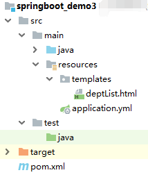

```html
<!DOCTYPE html>
<html xmlns:th="http://www.thymeleaf.org" >
<head>
    <meta charset="UTF-8">
    <title>Title</title>
</head>
<body>
    <h1>部门列表展示</h1>
    <table border="1" cellspacing="0">
        <tr>
            <td>序号</td>
            <td>部门名称</td>
        </tr>
        <tr th:each="dept,i : ${pageInfo.list}">
            <td th:text="${i.count}"></td>
            <td th:text="${dept.dname}"></td>
        </tr>
    </table>
</body>
</html>
```

### 编写 controller 层代码
```java
package com.xszx.controller;

import com.github.pagehelper.PageInfo;
import com.xszx.bean.Dept;
import com.xszx.service.DeptService;
import lombok.extern.slf4j.Slf4j;
import org.springframework.beans.factory.annotation.Autowired;
import org.springframework.stereotype.Controller;
import org.springframework.ui.Model;
import org.springframework.web.bind.annotation.GetMapping;
import org.springframework.web.bind.annotation.RequestMapping;
import org.springframework.web.bind.annotation.RequestParam;

@Controller
@RequestMapping("dept")
@Slf4j
public class DeptController {

    @Autowired
    private DeptService deptService;

    @GetMapping("findAll")
    public String findAll(@RequestParam(defaultValue = "1") Integer pageNum,
                          @RequestParam(defaultValue = "2") Integer pageSize,
                          Model model){
        PageInfo<Dept> pageInfo = deptService.findAll(pageNum, pageSize);
        model.addAttribute("pageInfo", pageInfo);

        // 默认就是转发，前缀默认配置的就是到 templates 目录，后缀默认就是 .html
        // 所以只需要写模板名称
        return "deptList";
    }
}
```

### 启动测试
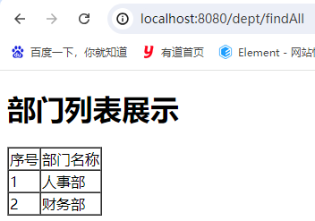

# 十二、SpringBoot 整合拦截器
## 概述
之前学习 SpringMVC 的时候，学习过拦截器。

拦截器的编写步骤：

1. 编写一个类，实现拦截器接口 HandlerInterceptor

2. 重写其中的方法 preHandle

3. 配置拦截器类 

目前我们没有 SpringMVC 的 xml 配置文件，所以配置拦截器的话，需要用到之前学习的配置类。

## 编写拦截器类
```java
package com.xszx.interceptor;

import org.springframework.stereotype.Component;
import org.springframework.web.servlet.HandlerInterceptor;

import javax.servlet.http.HttpServletRequest;
import javax.servlet.http.HttpServletResponse;

@Component
public class MyInterceptor implements HandlerInterceptor {

    @Override
    public boolean preHandle(HttpServletRequest request, HttpServletResponse response, Object handler) throws Exception {
        System.out.println("interceptor..........");
        return true; // 放行
    }
}
```

## 编写配置类
1. 实现 <font style="color:rgb(0,0,0);background-color:rgb(255,255,255);">WebMvcConfigurer 接口</font>

2. 重写 <font style="color:rgb(0,0,0);background-color:rgb(255,255,255);">addInterceptors 方法</font>

```java
package com.xszx.config;

import com.xszx.interceptor.MyInterceptor;
import org.springframework.beans.factory.annotation.Autowired;
import org.springframework.context.annotation.Configuration;
import org.springframework.web.servlet.config.annotation.InterceptorRegistry;
import org.springframework.web.servlet.config.annotation.WebMvcConfigurer;

@Configuration
public class MyConfig implements WebMvcConfigurer {

    @Autowired
    private MyInterceptor myInterceptor;

    @Override
    public void addInterceptors(InterceptorRegistry registry) {
        registry.addInterceptor(myInterceptor)
                .addPathPatterns("/**") // 表示拦截所有请求
                .excludePathPatterns("/dept/hello1"); // 表示排除 /hello1 请求
    }
}
```

## 编写 controller 层代码
```java
package com.xszx.controller;

import com.github.pagehelper.PageInfo;
import com.xszx.bean.Dept;
import com.xszx.service.DeptService;
import lombok.extern.slf4j.Slf4j;
import org.springframework.beans.factory.annotation.Autowired;
import org.springframework.stereotype.Controller;
import org.springframework.ui.Model;
import org.springframework.web.bind.annotation.GetMapping;
import org.springframework.web.bind.annotation.RequestMapping;
import org.springframework.web.bind.annotation.RequestParam;
import org.springframework.web.bind.annotation.ResponseBody;

@Controller
@RequestMapping("dept")
@Slf4j
public class DeptController {

    @Autowired
    private DeptService deptService;
    
    @ResponseBody
    @GetMapping("hello1")
    public String hello1(){
        System.out.println("hello1..........");
        return "success";
    }

    @GetMapping("findAll")
    public String findAll(@RequestParam(defaultValue = "1") Integer pageNum,
                          @RequestParam(defaultValue = "2") Integer pageSize,
                          Model model){
        PageInfo<Dept> pageInfo = deptService.findAll(pageNum, pageSize);
        model.addAttribute("pageInfo", pageInfo);

        // 默认就是转发，前缀默认配置的就是到 templates 目录，后缀默认就是 .html
        // 所以只需要写模板名称
        return "deptList";
    }
}
```

## 启动测试
访问 findAll 方法，观察控制台，会执行拦截器方法。

访问 hello1 方法，观察控制台，不会执行拦截器方法。

# **<font style="color:rgb(0,0,0);">十三、SpringBoot 整合 Junit4</font>**
## 概述
Junit 是用来做单元测试的，我们可以让 SpringBoot 整合 Junit 去做单元测试。

接着在上面的案例中编写即可。

## 添加依赖
```xml
<!--添加测试启动器-->
<dependency>
    <groupId>org.springframework.boot</groupId>
    <artifactId>spring-boot-starter-test</artifactId>
</dependency>
```

## 编写测试方法
```java
package com.xszx;

import com.github.pagehelper.PageInfo;
import com.xszx.bean.Dept;
import com.xszx.service.DeptService;
import org.junit.Test;
import org.junit.runner.RunWith;
import org.springframework.beans.factory.annotation.Autowired;
import org.springframework.boot.test.context.SpringBootTest;
import org.springframework.test.context.junit4.SpringJUnit4ClassRunner;

@RunWith(SpringJUnit4ClassRunner.class)
@SpringBootTest(classes = MainApplication.class)
public class TestDeptService {

    @Autowired
    private DeptService deptService;

    @Test
    public void test1(){
        PageInfo<Dept> pageInfo = deptService.findAll(1, 2);
        System.out.println(pageInfo);
    }
}
```

## 运行结果
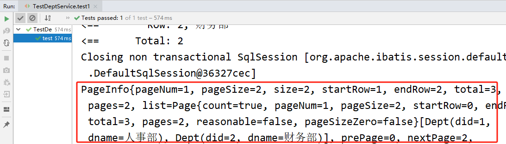

# **<font style="color:rgb(0,0,0);">十四、SpringBoot 项目打包部署</font>**
## 概述
我们开发好的项目最终是要部署在一台服务器硬件上的服务器软件上去跑！因此，我们需要将项目进行打包，然后上传到服务器。

我们做的 SpringBoot 项目可以是 jar 类型的，也可以是 war 类型的，那么打包方式就有两种了。

+ 将 jar 类型的 SpringBoot 项目打成 jar 包**（推荐）**

打好 jar 包之后，将 jar 包上传到服务器，在服务器中要有 jre，那我们就可以直接运行 jar 包（该 jar包内部内嵌了 tomcat 服务器），我们就可以在浏览器中访问项目了！

+ 将 war 类型的 SpringBoot 项目打成 war 包

打好 war 包之后（打包的时候需要将内嵌的 tomcat 服务器给去掉），将 war 包上传到服务器，在服务器中要有 jre，而且 war 包是需要部署在 tomcat 服务器中运行，所以服务器上需要安装一个 tomcat 服务器，然后将 war 包部署到 tomcat 服务器即可！

## jar 包方式部署项目
### 添加插件
```xml
<build>
    <plugins>
        <!-- 打包插件，可以将SpringBoot项目打成可执行jar包 -->
        <plugin>
            <groupId>org.springframework.boot</groupId>
            <artifactId>spring-boot-maven-plugin</artifactId>
        </plugin>
    </plugins>
</build>
```

### 打包项目
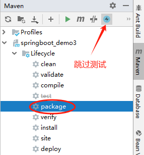

点击跳过测试按钮，然后再执行 package 命令，这样打包后没有测试相关的代码。

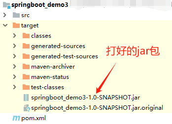

### 运行 jar 包
1. 将 jar 包放在服务器随便复制粘贴到哪个位置：

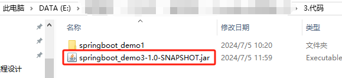

2. 打开 cmd，输入命令如下：

java -jar springboot_demo3-1.0-SNAPSHOT.jar

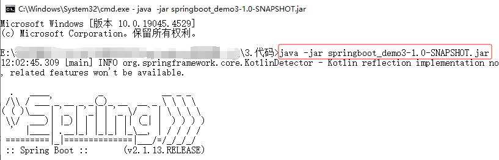

3. 然后就可以打开浏览器访问了！

# **<font style="color:rgb(0,0,0);">十五、SpringBoot 开发者工具</font>**
## 概述
我们在 IDEA 中写代码时，写完代码之后，启动服务器即可访问。如果我们更改了后端代码，需要再次重启服务器，才会生效。

如果项目中使用了开发者工具包的话，修改完后端代码就不需要手动重启服务器就可以直接生效，它会监听内容改变自动进行服务器重启。（电脑配置不好的话，不建议使用）也就是大家常说的热部署功能。

## 添加依赖
```xml
<!--添加热部署依赖-->
<dependency>
    <groupId>org.springframework.boot</groupId>
    <artifactId>spring-boot-devtools</artifactId>
    <optional>true</optional>
</dependency>
```

## 设置 IDEA 自动编译
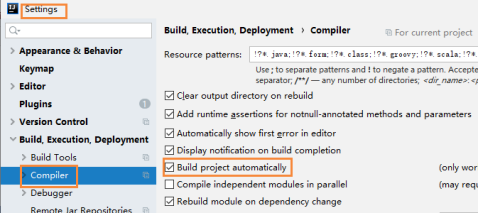

## 修改 Registry
使用快捷键：Ctrl+Shift+Alt+/， 然后点击弹出框中 Registry...

勾选：

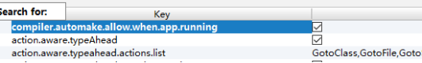

# 十六、SpringBoot 原理分析
SpringBoot 项目从代码上来看的话，我们就是比 SSM 多了一个启动类，然后就帮我们省了很多事情！

所以这个启动类很重要，从该类上就能看到 SpringBoot 相关的原理。

下面是启动类涉及到的几个重要注解，通过对这几个注解的了解，可以帮我们了解到 SpringBoot 的原理：

+ @SpringBootApplication：SpringBoot 应用，标注在某个类上，说明这个类是 SpringBoot 的主配置类，SpringBoot 就应该运行这个类的 main 方法来启动 SpringBoot 应用。
+ @SpringBootConfiguration：SpringBoot 的配置类，标注在某个类上，表示这是一个 SpringBoot的配置类
+ @Configuration：配置类上来标注这个注解
+ @EnableAutoConfiguration：开启自动配置功能，以前需要我们配置的东西，SpringBoot 帮我们自动配置了
+ @AutoConfigurationPackage：将主程序类所在的包作为自动配置包管理起来
+ @Import：会给容器中导入非常多的自动配置类 xxxAutoConfiguration，SpringBoot 在启动的时候从类路径下的 META-INF/spring.factories 文件中加载很多的 XxxAutoConfiguration 自动配置类，但不是所有的自动配置类都会进行配置，因为每个自动配置类上方存在 @ConditionalOnClass 等注解，符合条件的自动配置类才会生效。而且每个自动配置类都对应一个配置信息类 xxxProperties，我们平时在 yml 中配置的相关属性，其实都可以在这里面看到。
+ @ComponentScan：扫描自动配置包下面的所有标注了注解的类到容器中管理
+ 参考博客：[https://blog.csdn.net/qq_36625757/article/details/84065718](https://blog.csdn.net/qq_36625757/article/details/84065718)

# 十七、作业
## 作业1
+ 搭建 SpringBoot + MP + Druid + Thymeleaf 项目
+ 创建数据库及表：emp 表、dept 表，要有关联关系
+ 完成功能：
    - 员工及对应部门的列表展示 + 条件查询(员工姓名模糊、年龄区间)
    - 员工的添加功能
    - 员工的修改功能
    - 员工的删除功能
    - 员工的导出功能
    - 统计各个部门的员工数量

## 作业2
+ 搭建 SpringBoot + MP + Druid + PageHelper + Thymeleaf，完成作业1的功能
+ 删除使用逻辑删除


> 更新: 2026-03-03 20:50:29  
> 原文: <https://www.yuque.com/u41736172/az9urv/qvovrmuh3t36pmfb>