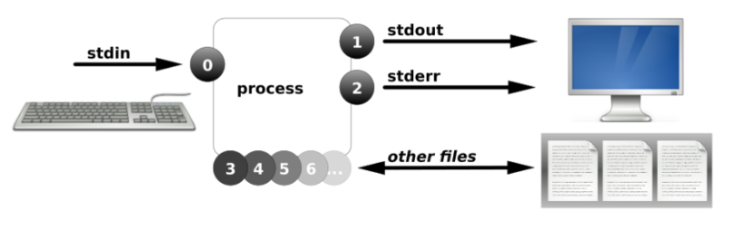
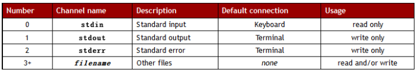
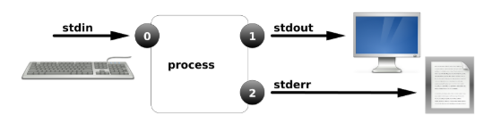
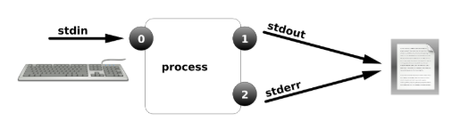
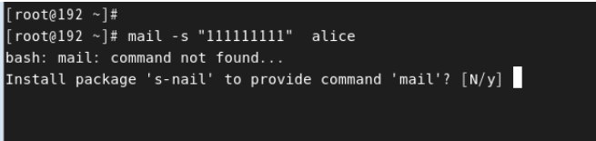
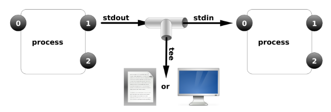

# 05.重定向与管道

# 一、重定向

## FD简介

### FD简介

file descriptors ，FD，文件描述符，文件句柄进程使用文件描述符来管理打开的文件

### 图示





FD是访问文件的标识，即链接文件：

* 0是键盘只读
* 1,2是终端可以理解是屏幕
* 3+是文件，可读可写

### 示例

通过我们非常熟悉的VIM程序。来观察一个进程的FD信息。

1.通过一个终端，打开一个文本。

```shell
# vim 1.txt
```

2.通过另一个终端，查询文本程序的进程号

```shell
# ps aux | grep vim
```

3.在/proc目录中查看文本程序的FD

通常在`/proc/PID/fd` 就能看到文件的FD调用情况。

```shell
# ls /proc/5606/fd
感觉好像没什么。用用ls -l呢？
# ll /proc/5606/fd
总用量 0

lrwx------. 1 root root 64 10月 10 07:37 0 -> /dev/pts/2				标准输入
lrwx------. 1 root root 64 10月 10 07:37 1 -> /dev/pts/2				标准输出
lrwx------. 1 root root 64 10月 10 07:37 2 -> /dev/pts/2				标准错误输出
lrwx------. 1 root root 64 10月 10 07:37 3 -> /root/.1.txt.swp	常规文件	
```

4.总结

看到的0124就是FD，程序通过描述符访问文件，可以是常规文件，也可以是设备文件。

## 输出重定向

### 简介

FD：1和2

输出重定向分为：

* 正确输出
  * `1>`等价于`>` ，表示覆盖
  * `1>>`等价于`>>`，表示追加
* 错误输出
  * `2>`，表示覆盖
  * `2>>`，表示追加

### 案例1：输出重定向

```shell
# ls 1> abc.txt
# cat abc.txt

# ls /tmp 1> abc.txt
# cat abc.txt

# ls /usr/local > abc.txt
# cat abc.txt

# ls /abcdefg > abc.txt
# cat abc.txt
```

```shell
# date 1> date.txt
# cat date.txt

# date > date.txt
# cat date.txt

# date 1>> date.txt 
# cat date.txt

# date >> date.txt
# cat date.txt
```

检验

```shell
# cat date.txt 
2020年 05月 29日 星期五 11:30:14 CST
```


其他程序可以吗？

`mkdir`可以吗？

程序本身需要输出。

### 案例2：错误输出重定向

错误示范：

```shell
# ls /home/ 2> list.txt 

观察list.txt文件中有没有内容？
因为没有错误信息
```

正确示范：

当某条命令产生错误时，才会有错误输出。

```shell
# ls /aaaaaaaaa 2> list.txt 
# cat list.txt 
ls: 无法访问/aaaaaaaaa: 没有那个文件或目录

# ls /abcde 2>> list.txt
# cat list.txt
```



### 案例3：正确和错误都输入到相同位置

```shell
&> 会将正确输出和错误输出都重定向到一个文件中
# ls /home/ /aaaaaaaaa &> list.txt
```



生产环境：

如下命令不需要操作

```shell
# yum -y install httpd &> /dev/null

说明：
/dev/null是一个特殊的设备文件，被称为“空设备”或“黑洞”‌。它的核心功能是丢弃所有写入的数据。
```

## 输入重定向

### 简介

标准输入：`<`等价于`0<`

### 案例：输入重定向发送邮件

#### 观察默认发送邮件的过程

:::info
**编写邮件**

:::

```shell
# mail -s "ssss" alice
111
222
333 
然后输入ctrl+d，表示发送邮件
```

如果程序未安装，请根据提示安装即可：



再用yum工具安装邮局程序（稍后讲解）

```shell
# 安装sendmail软件
# yum -y install sendmail

# 启动sendmail
# systemctl start sendmail
```

**命令解释**

```shell
mail				电子邮件
-s					标题
ssssssss		标题内容
alice				邮件接收人
```

:::info
**查看邮件**

:::

```shell
# su - alice
$ mail
Mail version 8.1 6/6/93. Type ? for help.
"/var/spool/mail/alice": 1 message 1 new
>N 1 root@lhp.local Mon Oct 29 14:09 18/657 "ssss"
& 
按邮件编号：1		即可看邮件。
按q 退出。
```

#### 使用重定向快速创建邮件

如果已经有了现成的邮件内容呢，如何快速输入邮件内容。

就可以用重定向创建邮件！！！

先准备一段邮件内容

```shell
# vim word.txt
```

```shell
# mail -s "test01" alice < word.txt
```

原理：利用输入重定向，把文件内容代替人为的输入。

## 补充：date命令

date命令可以获取到当前系统的日期和时间。date命令也提供了一些参数，我们根据这些参数可以获取指定的日期内容，比如：单独获取年、单独获取时间等等。

```shell
获取当前系统的日期时间
# date

date命令可以有一些参数
%Y：获取4位数的年			year 年
%y：获取2位数的年
%m：获取到月份				month 月份
%d：获取到日					day 日
%H：获取到时					hour 小时
%M：获取到分钟				minute 分钟
%S：获取到秒					second 秒

获取日期，并将结果输出为： xxxx年xx月xx日 xx:xx:xx
# date "+%Y年%m月%d日 %H:%M:%S"
如果要获取的日期格式是：yyyy-mm-dd，那就直接使用 %F 即可
# date +%F
```

# 二、管道 |

## 进程管道 Piping

### 简介

管道命令可以将多条命令组合起来，一次性完成复杂的处理任务。

### 语法

语法：

```shell
command1 | command2 |command3 |...
```


指令1的标准输出作为指令2的标准输入

### 案例

```shell
# 查看/etc/passwd文件的后3行
# cat /etc/passwd | tail -3

# 查看sshd进程是否启动
# ps aux | grep 'sshd'

# 查看所有进程信息中的前5行
# ps aux | head -5

# 查看ftpd进程是否启动
# ps aux | grep ftpd

# 查看根目录下的子目录，将子目录名字中包含y的给输出
# ls / | grep y

# 查看/etc/passwd文件中的第5-8行
# head -8 /etc/passwd | tail -4

# 查看 /etc/passwd 文件中的第16行
# head -16 /etc/passwd | tail -1
```

有了管道后，之后我们如果想要看某个程序是否启动，就可以使用`ps aux | grep 程序`

## tee管道

### 简介

三通管道，既交给另一个程序处理，又保存一份副本。



### 案例

```shell
# cat /etc/passwd | tee 888.txt
# cat 888.txt
```

888.txt文本中是什么内容呢？一行还是所有行？所有行，因为是命令1 (cat)处理的结果

## 参数传递 xargs

有些命令是不支持管道符的，这时候需要使用到

案例：

1 环境准备，准备一些文件。

```shell
# touch /home/file{1..5}
# ls /home
```

2 接到消息，部分文件需要删除。

```shell
# vim files.txt 
/home/file1
/home/file3
/home/file5
```

3 使用管道

```shell
# cat files.txt | rm -rf
```

失败

4 貌似之前的不行。下面加上xargs

```shell
# cat files.txt | xargs rm -rf 

# ls   /home
```

通过`| xargs`成功连接`rm`命令。

# 三、统计命令

## <font style="color:rgb(51, 51, 51);">基本语法</font>

```shell
# wc [选项] 文件名称
选项说明：
-l：表示lines，行数（以回车/换行符为标准）
-w：表示words，单词数 依照空格来判断单词数量
-c：表示bytes，字节数（空格，回车，换行）
```

## <font style="color:rgb(51, 51, 51);">案例</font>

<font style="color:rgb(51, 51, 51);">案例：统计linux.txt文件的总行数</font>

```shell
# wc -l linux.txt
```

<font style="color:rgb(51, 51, 51);">案例：统计linux.txt文件中的单词数</font>

```shell
# wc -w linux.txt
```

<font style="color:rgb(51, 51, 51);">案例：统计文件的字节数（数字、字母一般1个字符=1个字节，中文和编码格式有关，如utf-8编码格式，1个汉字占用3个字节）</font>

```shell
# wc -c linux.txt
```

> <font style="color:rgb(119, 119, 119);">扩展：wc \[选项] 文件的名称可以统计一个文件的信息，实际情况下，我们选项还可以一起使用</font>

<font style="color:rgb(51, 51, 51);">案例：统计一个文件的总行数、总单词数以及总字节数</font>

```shell
# wc -wlc linux.txt
或
# wc -lwc linux.txt
或
# wc -clw linux.txt
```

<font style="color:rgb(51, 51, 51);">案例：统计/根目录下一共有多少个文件</font>

```shell
# ls / | wc -l
```

<font style="color:rgb(51, 51, 51);">案例：统计目前Linux系统中进程有多少个</font>

```shell
# ps aux | wc -l
```

<font style="color:rgb(51, 51, 51);">案例：用户在计算机中有一个配置文件（/etc/passwd），一般情况下，一个用户会占用一行配置，请你使用现学的管道统计当前计算机中一共有多少个用户个信息（一个用户一行）</font>

```shell
# cat /etc/passwd | wc -l
```


> 更新: 2026-02-06 20:27:47  
> 原文: <https://www.yuque.com/u41736172/az9urv/ueoyfwif3no7757l>