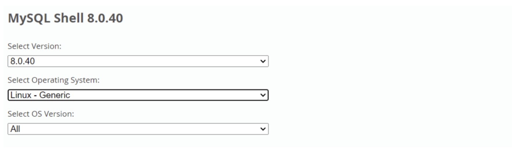
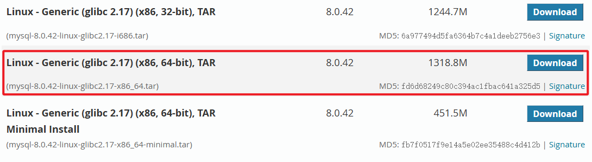
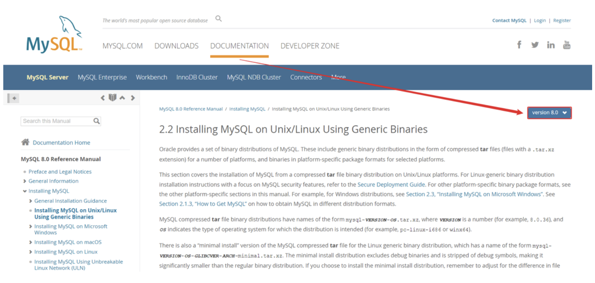
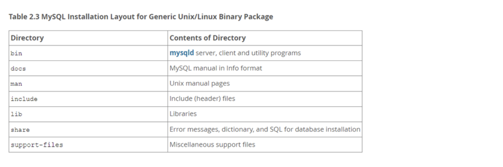
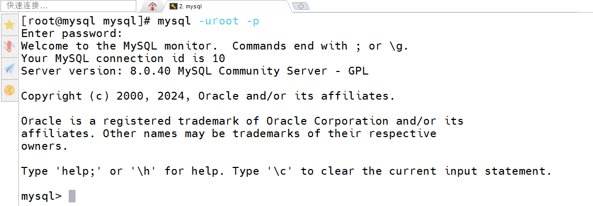
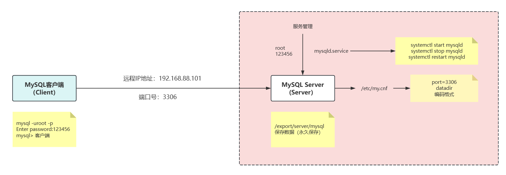
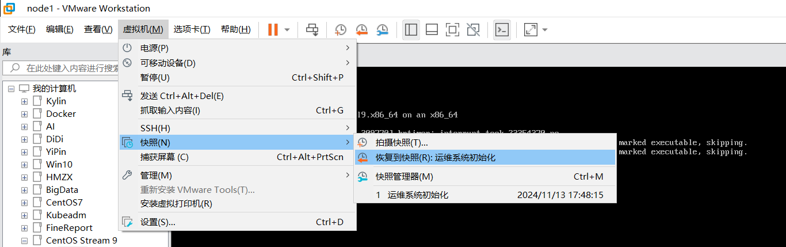
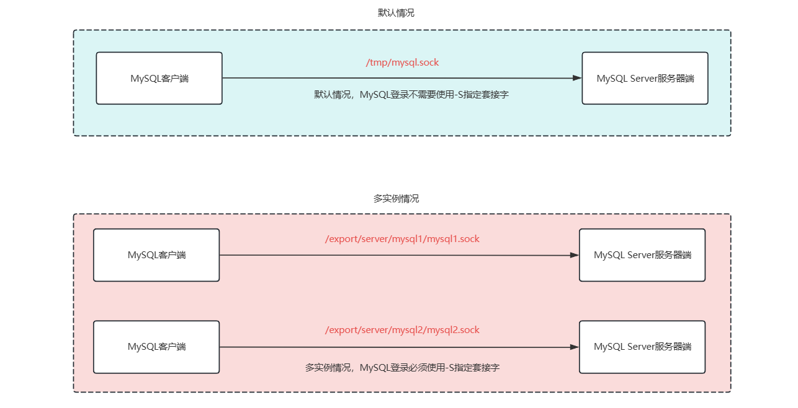

# 01.MySQL8安装与配置

# 任务背景

某互联网初创公司核心业务数据运行在 **MySQL 5.7** 版本的数据库中，已经稳定运行了几年。但随着业务扩展和新功能的上线，现有 **MySQL 5.7** 版本已经无法满足需求，主要问题包括：

* **部分新功能依赖于 MySQL 8.0**（如<font style="color:rgb(216,57,49);">窗口函数</font>、<font style="color:rgb(216,57,49);">通用表达式 CTE</font>、<font style="color:rgb(216,57,49);">JSON 增强</font>、<font style="color:rgb(216,57,49);">角色管理</font>等）。
* **MySQL 5.7 版本存在已知 Bug**，影响查询性能和数据一致性。
* **官方支持问题**：MySQL 5.7 将于 **2023 年 10 月 结束支持（EOL）**，升级到 MySQL 8.0 以获得长期支持和安全更新。

因此，公司决定将 **MySQL 5.7 迁移到 MySQL 8.0**，并确保数据库的可用性和数据完整性，以支持业务持续增长。

***

目前 MySQL 有几个经典版本：MySQL5.5、<font style="color:rgb(216,57,49);">MySQL5.6、MySQL5.7</font>

目前 MySQL 最新版本：<font style="color:rgb(216,57,49);">MySQL8.0</font> => MySQL9.0

# 任务拆解

* 在 <font style="color:rgb(216,57,49);">CentOS Stream 9 </font>上安装 MySQL 8.0
* 能够把 MySQL 8.0 软件安装部署封装为一个 <font style="color:rgb(216,57,49);">Shell 脚本</font>

# 课程目标

* 了解数据库概念
* 了解 MySQL 数据库基本概念
* 掌握 CentOS Stream 9 基础环境准备
* 掌握数据库的 <font style="color:rgb(216,57,49);">yum 安装，二进制安装</font>以及源码安装实现
* 掌握数据库多实例配置与实现

# 一、数据库概述（理解）

## 数据库概述

数据库就是<font style="color:rgb(216,57,49);">存储数据的仓库</font>，其本质是一个<font style="color:rgb(216,57,49);">文件系统</font>，按照特定的格式将数据存储起来，用户可以对数据库中的数据进行<font style="color:rgb(216,57,49);">增加，修改，删除及查询操作（增删改查）。</font>

随着互联网的高速发展，大量的数据在不断的产生，伴随而来的是如何高效安全的存储数据和处理数据，而这一问题成为了信息时代的一个非常大的问题，而使用数据库可以高效的有条理的储存数据。

* 可以<font style="color:rgb(216,57,49);">结构化（有行有列）存储大量的数据</font>；
* 可以有效的保持<font style="color:rgb(216,57,49);">数据的一致性、完整性</font>；
* <font style="color:rgb(216,57,49);">读写效率极高</font>。


## 数据库分类

数据库又分为<font style="color:rgb(216,57,49);">关系型数据库</font>和<font style="color:rgb(216,57,49);">非关系型数据库</font>

### <font style="color:#000000;">关系型数据库</font>

<font style="color:#000000;">关系型数据库：指采用了</font><font style="color:rgb(216,57,49);">关系模型（二维结构，有行有列）</font><font style="color:#000000;">来组织数据的数据库。</font>

<font style="color:#000000;">关系模型指的就是二维表格模型，而一个关系型数据库就是由二维表及其之间的联系所组成的一个数据组织。</font>

<font style="color:#000000;">初学阶段，我们可以先简单的将关系型数据库理解为一个 Excel 表格：</font>


### 非关系型数据库 NoSQL

非关系型数据库：又被称为 <font style="color:rgb(216,57,49);">NoSQL</font>（Not Only SQL )，意为不仅仅是 SQL，对 NoSQL 最普遍的定义是“<font style="color:rgb(216,57,49);">非关联型的</font>”，强调<font style="color:rgb(216,57,49);"> Key-Value 的方式存储数据</font>。

> 类似 Python 中字典结构：{"name":"张三", "age":25, "gender":"male",...}
>
> key（键）：value（值），组合在一起 key：value 键值对！！！

Key-Value 结构存储： Key-value 数据库是一种以<font style="color:rgb(216,57,49);">键值对存储数据的一种数据库</font>，类似 Java 中的 map。可以将整个数据库理解为一个大的 map，每个键都会对应一个唯一的值。


> key:value 键值对型应用，常应用于内存型数据库，如 Redis、MongoDB、Elasticsearch、HBase 等等。

小结：关系型和非关系型数据库区别？

关系型：通过<font style="color:rgb(216,57,49);">二维表维持数据关系</font>（有行有列），大部分存储在<font style="color:rgb(216,57,49);">硬盘</font>，查询速度上<font style="color:rgb(216,57,49);">关系型要慢一些，相对而言，安全性更高</font>。

非关系型：通过 <font style="color:rgb(216,57,49);">key:value 键值对维持数据</font>关系，大部分存储在<font style="color:rgb(216,57,49);">内存</font>，查询速度上要<font style="color:rgb(216,57,49);">相对于关系型数据库更快一些，安全系数相对关系型而言不高。</font>

## 常见数据库介绍

### 关系型数据库

| **数据库** | **介绍** |
| --- | --- |
| **MySQL** | 开源免费的数据库，中型的数据库.已经被Oracle收购了.MySQL8.x版本也开始收费。 |
| Oracle | 收费的大型数据库，Oracle公司的产品。Oracle收购SUN公司，收购MYSQL。 |
| DB2 | IBM公司的数据库产品,收费的。常应用在银行系统中。 |
| SQL Server | MicroSoft 公司收费的中型的数据库。C#、.net等语言常使用。 |
| SQLite | 嵌入式的小型数据库，应用在手机端。 |

### 非关系型数据库

| **数据库** | **介绍** |
| --- | --- |
| **Redis** | 是一个小而美的数据库，主要用在key-value 的内存缓存，读写性能极佳。 |
| HBase | HBase是列式数据库，目标是高效存储大量数据。 |
| **MongoDB** | MongoDB是文档型数据库，非常接近关系型数据库的。 |

## 小结

① 数据库就是（<font style="color:rgb(216,57,49);">存储数据的仓库</font>），用户可以对数据库中的数据进行（<font style="color:rgb(216,57,49);">增删改查</font>）操作

② 数据库分为（<font style="color:rgb(216,57,49);">关系型数据库</font>）和（<font style="color:rgb(216,57,49);">非关系型数据库</font>）。

③ 常用的关系型数据库有：<font style="color:rgb(216,57,49);">MySQL、Oracle</font>

④ 常用的非关系型数据库有：<font style="color:rgb(216,57,49);">Redis、MongoDB</font>

# 二、MySQL 数据库（了解）

## MySQL 概述

MySQL 是一种广泛使用的<font style="color:rgb(216,57,49);">开源免费的关系型数据库管理系统</font>，以其高性能、可靠性和易用性著称。它基于<font style="color:rgb(216,57,49);">结构化查询语言（SQL）</font>来管理和查询数据，常用于 Web 应用开发和各类企业级应用。

MySQL 支持<font style="color:rgb(216,57,49);">跨平台</font>运行，能够在<font style="color:rgb(216,57,49);"> Linux、Windows、macOS</font> 等操作系统上执行。它提供了丰富的功能，如<font style="color:rgb(216,57,49);">事务处理</font>、<font style="color:rgb(216,57,49);">主从复制</font>、<font style="color:rgb(216,57,49);">存储引擎选择</font>（如 InnoDB 和 MyISAM）、<font style="color:rgb(216,57,49);">高可用性配置</font>等，适合从<font style="color:rgb(216,57,49);">小型项目到大规模分布式系统</font>的不同需求。

瑞典AB公司（latin1拉丁）=> Sun公司（Java） => Oracle（甲骨文）

> Linux 操作系统强调开源、免费，MySQL 被 Oracle 收购后，社区很多 MySQL 开发者以及使用者非常担忧，后来 MySQL 创始人之一，出来带领了一堆社区人员开发了一个全新的数据库版本 => MariaDB（MySQL替代版）

MySQL 数据库可能涉及两个版本：Oracle MySQL（官方）、MariaDB（MySQL替代版，一直强调开源、免费）。

## MySQL 的特点

<font style="color:rgb(216,57,49);">开源、免费</font>

MySQL 是开源的，所以你不需要支付额外的费用。

MySQL 支持<font style="color:rgb(216,57,49);">大型的数据库</font>。可以处理拥有<font style="color:rgb(216,57,49);">上千万条记录的大型数据库</font>。

MySQL 使用<font style="color:rgb(216,57,49);">标准的 SQL 数据语言</font>形式。 => show databases; create user; grant all; 这些都属于 SQL 语句

MySQL 可以安装在<font style="color:rgb(216,57,49);">不同的操作系统</font>，并且<font style="color:rgb(216,57,49);">提供多种编程语言的操作接口</font>。这些编程语言包括 <font style="color:rgb(216,57,49);">C、C++、Python、Java、Ruby </font>等等。

## MySQL 版本

<font style="color:rgb(216,57,49);">MySQL Community Server：社区版本，开源免费</font>，但不提供官方技术支持。

MySQL Enterprise Edition：企业版本，需付费，可以试用30天。

MySQL Cluster：集群版，开源免费。可将几个 MySQL Server 封装成一个 Server。

MySQL NDB Cluster CGE：高级集群版，需付费。

MySQL Workbench（GUITOOL）：一款专为 MySQL 设计的 ER/数据库建模工具。它是著名的数据库设计工具 DBDesigner4 的继任者。MySQL Workbench 又分为两个版本，分别是社区版（MySQL Workbench OSS）、商用版（MySQL WorkbenchSE）。

> 本次课程，我们使用 MySQL8.0.40 版本（GA版本），不要选择最新版，往前推 1-2 个小版本， MySQL Community Server 进行学习。

## MySQL 数据库服务器

MySQL 数据库：全称叫做 <font style="color:rgb(216,57,49);">MySQL 数据库管理系统</font>！！！

MySQL 数据库管理系统是一个 C/S 架构的软件，C 全称（Client）客户端，S 全称（Server）服务器端。

MySQL 数据库服务器是运行 <font style="color:rgb(216,57,49);">MySQL 数据库管理系统的主机</font>，它负责处理<font style="color:rgb(216,57,49);">客户端发出的数据库请求，包括数据查询、插入、更新和删除操作。</font>

MySQL 数据库服务器通常由<font style="color:rgb(216,57,49);">一个或多个 MySQL 实例</font>组成，这些实例<font style="color:rgb(216,57,49);">管理数据库和处理 SQL 语句，确保数据的存储、读取和安全性</font>。

> MySQL 数据库服务器（Linux 操作系统） => MySQL 数据库管理系统（实例）=> 数据库 => 数据表 => 数据

## MySQL 官网

MySQL 官网：[www.mysql.com](https://www.mysql.com)

## MySQL 安装方式

① yum 安装（略）

② 二进制安装（相当于 Windows 中的绿色软件）

③ 源码包编译安装

三种安装方式的区别：

| 安装方式 | 优点 | 缺点 |
| --- | --- | --- |
| yum 安装 | 安装卸载简单 | 可定制性差 |
| <font style="color:rgb(216,57,49);">二进制安装</font> | <font style="color:rgb(216,57,49);">可定制性相比 rpm 包灵活些</font> | <font style="color:rgb(216,57,49);">安装相比 rpm 包复杂些，需要手动初始化数据库</font> |
| 源码编译安装 | 可定制性最强，根据需求和功能定制 | 安装麻烦，需要手动初始化数据库 |

> 有时我们也把二进制安装，称之为 glibc 安装，因为必须基于 glibc 实现 mysql 安装操作！
>
> 回顾：中州养老 mysql 安装部署 => yum install mysql-server mysql，很多内容如数据目录固定的 => /var/lib/mysql

# 三、MySQL8 数据库安装部署（重点）

## 环境准备

第一步：克隆一台最小化的服务器

第二步：设置内存大小，尽量不低于 6G（我这里确实没那么大的内存，设置为 4G 了，处理器设置为 2 核心了）

设置服务器的内存大小为6G（官方建议最小不低于 6G），否则会导致后期配置出现异常！！！


第三步：设置 IP 地址、主机名称（符合 FQDN 规范）、关闭防火墙与 SELinux（安装环境之前需要关闭，安装后再启动，配置防火墙规则，释放 3306 端口）

```shell
# vim /etc/NetworkManager/system-connections/ens33.nmconnection
address1=192.168.126.101/24

# nmcli connection reload
# nmcli connection up ens33

# hostnamectl set-hostname mysql.lhp.cn
# su

# 防火墙已关闭，并且开机不启动
# SELinux已关闭，并且开机不启动
```

第四步：设置完成后，重启服务器

```shell
# reboot
```

## 下载 MySQL 软件包

下载地址：<https://dev.mysql.com/downloads/mysql/>

> 大家可以直接使用资料中提供的。



查看 GLIBC 版本，如下图所示


下载对应版本的 MySQL 软件包



## 查看 MySQL GLIBC 安装文档

官方地址：<https://dev.mysql.com/doc/refman/8.0/en/binary-installation.html>



## 安装 MySQL 软件

安装 MySQL 依赖包：

```shell
# dnf -y install libaio

注：libaio 是 Linux 的异步 I/O (Asynchronous Input/Output) 库，全称是 Linux Asynchronous I/O Library。它的主要作用是允许程序在不阻塞 CPU 的情况下发起 I/O 操作，即 I/O 请求可以异步地进行，程序不需要等待 I/O 操作完成后再进行下一步操作，从而提高了 I/O 性能。在 MySQL 中，libaio 被用于处理磁盘的读写操作，尤其是在高负载和高并发的情况下，可以提高数据库的性能和响应速度。
```

上传 MySQL 安装包到 Linux 服务器，对 MySQL 压缩包进行解压缩操作：

```shell
# tar -xf mysql-8.0.40-linux-glibc2.17-x86_64.tar.xz
# ll mysql-8.0.40-linux-glibc2.17-x86_64
总用量 272
drwxr-xr-x  2 7161 31415   4096  9月 18  2024 bin
drwxr-xr-x  2 7161 31415     38  9月 18  2024 docs
drwxr-xr-x  3 7161 31415   4096  9月 18  2024 include
drwxr-xr-x  6 7161 31415   4096  9月 18  2024 lib
-rw-r--r--  1 7161 31415 257478  9月 18  2024 LICENSE
drwxr-xr-x  4 7161 31415     30  9月 18  2024 man
-rw-r--r--  1 7161 31415    666  9月 18  2024 README
drwxr-xr-x 28 7161 31415   4096  9月 18  2024 share
drwxr-xr-x  2 7161 31415     77  9月 18  2024 support-files

-xf：可以解压任何tar类型的压缩包，如.tar.gz或.tar.xz格式压缩包
```

解压后的 MySQL 文件夹目录结构说明：



软件安装路径、数据路径以及端口设置：

| **选项** | **值（自定义也可以采用默认形式）** |
| --- | --- |
| 安装路径 | /export/server/mysql |
| 数据路径 | /export/server/mysql/data |
| 端口号 | 3306 |

具体安装步骤：

准备工作，提前卸载与 mariadb 相关软件包

```shell
# rpm -qa | grep mariadb
```

第一步：创建一个数据库专用账号 mysql（其所属组也为 mysql） => -r 系统账号，-s 指定 shell 类型

```shell
# useradd -r -s /sbin/nologin mysql
# id mysql

参数说明：
-r ：系统参数
-s ：shell缩写，用于指定shell解析器，需要登录系统账号，用/bin/bash；不需要登录系统的账号（系统账号），用/sbin/nologin
```

第二步：清空系统中的原有 mariadb 的配置文件(/etc/my.cnf)

```shell
# rm -rf /etc/my.cnf
```

第三步：把 mysql 解压后的文件夹（GBLIC 版本）移动到指定目录下，然后更名为 mysql

```shell
# mkdir -p /export/server
# mv mysql-8.0.40-linux-glibc2.17-x86_64 /export/server/mysql
```

第四步：切换到 mysql 工作目录 /export/server/mysql

```shell
# cd /export/server/mysql
```

第五步：<font style="color:rgb(216,57,49);">初始化数据库（可以实现数据库的初始化，而且会产生一个随机密码）</font>

```shell
# bin/mysqld --initialize --user=mysql --basedir=/export/server/mysql &> /tmp/mysqld.log

选项说明：
--initialize   初始化（真正开始干活）
--user=mysql   以mysql用户的身份初始化数据库，产生文件都是mysql作为拥有者
--basedir=xxx  mysql其安装目录，非常重要
```

运行完毕后，观察`/tmp/mysqld.log`中的最后一行，保存 root 账号的密码，以备后期使用。

```shell
A temporary password is generated for root@localhost: synNE*skt4ts
经验之谈：想查看mysql软件有没有初始化成功，主要看mysql目录下有没有产生data文件夹且文件夹中至少要有一个mysql的文件夹。

延伸一下：有一个文件/tmp/mysqld.log，里面保存了数据库密码信息，如何提取出这个密码？
答：grep password /tmp/mysqld.log | awk '{print $NF}'
```

第六步：设置安全加密连接（SSL），数据传输会采用加密形式，适合敏感数据

```shell
# cd /export/server/mysql
# bin/mysql_ssl_rsa_setup --datadir=/export/server/mysql/data
```

第七步：创建mysqld.service

```shell
# vim /etc/systemd/system/mysqld.service
[Unit]
Description=MySQL Server
After=network.target

[Service]
User=mysql
Group=mysql
Type=forking

# MySQL 执行命令及路径
ExecStart=/export/server/mysql/bin/mysqld --daemonize --pid-file=/export/server/mysql/data/mysqld.pid
ExecStop=/export/server/mysql/bin/mysqladmin --defaults-file=/export/server/mysql/my.cnf shutdown

# Ensure MySQL has sufficient time to start up
TimeoutSec=600

# PID 文件路径
PIDFile=/export/server/mysql/data/mysqld.pid

# Enable these options to auto-restart the service if it crashes
Restart=on-failure
RestartSec=5

[Install]
WantedBy=multi-user.target
```

服务创建完成后，重新加载 systemd 服务

```shell
# systemctl daemon-reload
```

第八步：启动 MySQL 数据库

```shell
# systemctl start mysqld
# systemctl status mysqld

也可以通过查看端口号的占用情况来检测MySQL是否正常启动了！
# netstat -tnlp 或者 ss -tnlp
```

## 安装后续配置

第一步：修改 MySQL 密码

```shell
# cd /export/server/mysql
# bin/mysqladmin -uroot password '123456' -p
Enter password：输入初始化时获取的临时密码
```

第二步：把 MySQL 客户端添加到环境变量

```shell
# echo 'export PATH=$PATH:/export/server/mysql/bin' >> /etc/profile
# source /etc/profile

# 使用MySQL客户端登录MySQL数据库
# mysql -uroot -p
mysql: error while loading shared libraries: libncurses.so.5: cannot open shared object file: No such file or directory
```

首次连接 MySQL 数据库会报错：

mysql: error while loading shared libraries: **libncurses.so.5**: cannot open shared object file: No such file or directory

解决方案：

```shell
# ln -s /lib64/libncurses.so.6 /lib64/libncurses.so.5
```

mysql: error while loading shared libraries: libtinfo.so.5: cannot open shared object file: No such file or directory

解决方案：

```shell
# ln -s /lib64/libtinfo.so.6 /lib64/libtinfo.so.5
```

然后再次登录

```shell
# mysql -uroot -p
Enter password: 123456
```



退出登录

```properties
mysql> exit
Bye
```

第三步：手动定制 my.cnf 配置文件

```shell
# vim /etc/my.cnf
添加如下内容：
[mysqld]
basedir=/export/server/mysql
datadir=/export/server/mysql/data
socket=/tmp/mysql.sock
character_set_server=utf8
collation-server=utf8_unicode_ci

选项说明：
[mysqld]  代表针对服务器端进行配置
basedir   代表数据库的安装目录
datadir   代表数据目录，以后专门用于存放数据文件的（核心目录）
socket    代表套接字文件，专门为客户端与服务器端连接提供一个桥梁 => mysql 连接（桥梁：mysql.sock） mysqld服务器端
character_set_server  字符集
collation-server      校对集，和SQL语句有关，匹配内容时是否区分大小写等等
```

普及：数据库编码格式

MySQL 最早诞生于瑞典 AB 公司，默认编码为 latin1，支持 256 个字符（0-9、a-z、A-Z，还有一些键盘支持的字符等等），字符有限。

后来 MySQL 越来越流行，传入中国，由于 latin1 无法保存汉字，所以汉字会出现中文乱码，为了解决以上问题，开发一套专用数据库编码 gb2312，在 latin1 基础上增加汉字支持。近几年版本又升级了一次，gbk。

后来 MySQL 又传入中国台湾省，使用繁体中文较多，所以也开发了一套独立的编码，big5

后期 MySQL 传入一个国家，就会有一套专门的编码格式，比如传入中国日本省，jp编码，俄罗斯也有自己的编码，德国也有自己的编码。

发现问题：开发一个软件，需要开发多套程序，满足不同的编码格式。

W3C 组织：开发一套统一编码格式 => utf8 编码，一统江湖。近几年也做过一次升级，utf8mb4 格式。

第四步：安全配置

```shell
# mysql_secure_installation

① 输入密码
② 直接回车，不开启密码插件
③ 直接回车，不改变root密码
④ Y，移除默认匿名账号（不移除有安全隐患）
⑤ Disallow root login remotely?禁用root远程连接 => 输入Y，禁用远程登录
⑥ Y，移除默认数据库
⑦ Y，刷新权限
```

第五步：把 MySQL 服务器添加到开机启动项

```shell
# systemctl restart mysqld
# systemctl enable mysqld

# systemctl status mysqld
● mysqld.service - MySQL Server
     Loaded: loaded (/etc/systemd/system/mysqld.service; enabled; preset: disabled)
     Active: active (running) since Mon 2026-04-20 09:56:08 CST; 49s ago
   Main PID: 1572 (mysqld)
      Tasks: 38 (limit: 24536)
     Memory: 363.2M
        CPU: 1.430s
     CGroup: /system.slice/mysqld.service
             └─1572 /export/server/mysql/bin/mysqld --daemonize --pid-file=/export/>

4月 20 09:56:07 mysql.lhp.cn mysqld[1572]: 2026-04-20T01:56:07.756352Z 0 [System] [>
4月 20 09:56:07 mysql.lhp.cn mysqld[1572]: 2026-04-20T01:56:07.759743Z 0 [Warning] >
4月 20 09:56:07 mysql.lhp.cn mysqld[1572]: 2026-04-20T01:56:07.759800Z 0 [Warning] >
4月 20 09:56:07 mysql.lhp.cn mysqld[1572]: 2026-04-20T01:56:07.774590Z 1 [System] [>
4月 20 09:56:07 mysql.lhp.cn mysqld[1572]: 2026-04-20T01:56:07.994995Z 1 [System] [>
4月 20 09:56:08 mysql.lhp.cn mysqld[1572]: 2026-04-20T01:56:08.435351Z 0 [Warning] >
4月 20 09:56:08 mysql.lhp.cn mysqld[1572]: 2026-04-20T01:56:08.435546Z 0 [System] [>
4月 20 09:56:08 mysql.lhp.cn mysqld[1572]: 2026-04-20T01:56:08.470156Z 0 [System] [>
lines 1-18
```

## 常见 MySQL 错误解决

**问题1：**<font style="color:rgb(216,57,49);">MySQL 安装后，在 /tmp/mysqld.log 中找不到 MySQL 密码？</font>

答：出现以上问题的主要原因有两种情况：

① 计算机本身安装过 MySQL 软件，重复安装导致初始化失败

② 数据库配置异常，忘记创建账号，目录异常等等都可能初始化失败了

初始化成功后，会在 MySQL 内部，会产生一个 data 目录，里面最少要包含 mysql 文件夹（其实就是内置的 mysql 数据库，包含账号、系统等信息）

```shell
# cd /export/server/mysql
# ll data
drwxr-x--- 2 mysql mysql     4096 Apr 20 14:34 '#innodb_redo'
drwxr-x--- 2 mysql mysql      187 Apr 20 14:34 '#innodb_temp'
drwxr-x--- 2 mysql mysql      143 Apr 20 11:06  mysql
-rw-r----- 1 mysql mysql        6 Apr 20 14:34  mysqld.pid
-rw-r----- 1 mysql mysql 26214400 Apr 20 14:34  mysql.ibd
drwxr-x--- 2 mysql mysql     8192 Apr 20 11:06  performance_schema
......
```

如果没有这些目录或者文件，就是初始化失败了。

解决方案：删除 data 目录，然后重新初始化

```shell
# cd /export/server/mysql
# rm -rf data
# bin/mysqld --initialize --user=mysql --basedir=/export/server/mysql &> /tmp/mysqld.log
```

***

\*\*问题2：\*\*MySQL 连接报错，ERROR 2002 (HY000): <font style="color:rgb(216,57,49);">Can't connect to local MySQL server through socket '/tmp/mysql.sock'</font> (2)

答：出现以上问题的主要原因，可能是 <font style="color:rgb(216,57,49);">MySQL 软件没有启动</font> 或者<font style="color:rgb(216,57,49);"> MySQL 已经异常启动，但是没有产生套接字</font>。

MySQL 软件没有启动

```shell
# systemctl status mysqld
# ll /tmp
# systemctl start mysqld
```

MySQL 已经异常启动，但是没有产生套接字

```shell
先尝试使用systemctl终止mysqld服务
# systemctl stop mysqld

强制终止mysqld（生产环境慎用）
# pkill mysqld

# systemctl start mysqld
```

***

\*\*问题3：\*\*MySQL 登录报错 ERROR <font style="background-color:rgba(255,246,122,0.8);">1045</font> (28000): <font style="color:rgb(216,57,49);">Access denied for user 'root'@'localhost' (using password: NO)</font>

答：1045 是一个比较经典的报错编号，代表密码输入错误，密码不正确。

\*\*问题4：\*\*mysql、mysql-server、mysqld.service、/etc/my.cnf 之间关系



## MySQL 服务管理

因为 mysqld 已经封装为 mysqld.service 服务，所以我们可以采用 systemctl 对其进行服务管理操作。

> `vim /etc/systemd/system/mysqld.service`

启动 MySQL 服务

```shell
# systemctl start mysqld
```

重启 MySQL 服务

```shell
# systemctl stop mysqld
# systemctl start mysqld

或

# systemctl restart mysqld
```

检查 MySQL 状态

```shell
# systemctl status mysqld
```

关闭 MySQL 服务

```shell
# systemctl stop mysqld
```

添加到开机启动项

```shell
# systemctl enable mysqld
```

取消开机启动项

```shell
# systemctl disable mysqld
```

## MySQL 版本与账号管理（重点）

问题1：如何查看 MySQL 版本

```shell
# mysql --version
```

问题2：如何在 MySQL 终端重置 MySQL 密码？（MySQL 终端也就是 MySQL 的客户端）

为什么要学习在终端重置密码，使用 mysqladmin 不是也能重置密码么？

```shell
# cd /export/server/mysql
# bin/mysqladmin -uroot password '123456' -p
Enter password：输入初始化时获取的临时密码
```

以上操作方式相当于明文操作，而且以上命令会写入到 history 日志中，这会导致泄露风险，带来一些安全隐患！！！

**终端重置密码（记下来）：**

```shell
使用MySQL客户端连接MySQL之后执行下面的操作：
> ALTER USER 'root'@'localhost' IDENTIFIED BY '新密码'; 或 set password='新密码';
> flush privileges;

但是root@localhost这个账号，只允许本机访问，不允许外部连接！！！
```

问题3：开启 MySQL 管理员账号管理权限（IDEA => 连接 => MySQL） => **（记下来）**

```shell
> CREATE USER 'root'@'%' IDENTIFIED BY '123456';
> GRANT ALL PRIVILEGES ON *.* TO 'root'@'%';
> flush privileges;

参数说明：
CREATE USER：创建账号
GRANT授权
ALL PRIVILEGES：所有权限（管理员）
*.* ：所有数据库.所有数据表
flush privileges：刷新权限，让以上配置立即生效

注意：
① 'root'@'%'，root管理员名称，%相当于任意主机，两者结合在一起代表，我们在任意主机上都可以通过root账号连接MySQL Server。
② 光有账号还不行，远程连接也需要有权限，管理数据库也需要有权限，所以创建账号后，还必须进行授权，否则这个账号无法使用的。

查看mysql中有哪些账号？
select user,host from mysql.user;
说明：
mysql系统层面数据库，保存了所有系统信息
user属于数据库中的一个数据表（类似Excel），存放账号信息
```

注意：

`create user '账号'@'允许登录的主机IP，%代表任意主机均可登录' IDENTIFIED BY '密码';`

`grant 权限 on 数据库.数据表 to 用户;`

> ALL PRIVILEGES：拥有所有权限（超管）
>
> **.**：所有数据库的所有数据表

## 登陆 MySQL 数据库

MySQL 是一个需要账户名密码登录的数据库，登陆后使用，它提供了一个默认的 root 账号，使用安装时设置的密码即可登录，目前有两种登录场景。

### 本地（针对本地 MySQL）

```shell
# mysql -uroot -p 回车  
password：输入密码

说明：
-u 后面是登录的用户名
-p 后面是登录密码, 如果不填写, 回车之后会提示输入密码
```

### 远程（针对远程 MySQL）

```shell
# 在另一台服务器中先安装MySQL的客户端
yum -y install mysql

# mysql -h远程服务器IP地址 -P端口号 -u用户名 -p 回车
password：输入密码

案例：
# 找一个主机，如node2，安装mysql客户端
# yum -y install mysql
# mysql -h192.168.126.101 -P3306 -uroot -p
Enter password:123456

注意：远程登录不仅需要指定远程主机IP、端口号，还需要提前在远程MySQL服务器上开通这个用户的访问权限，否则无法访问！
mysql> create user 'root'@'%' identified by '123456';
mysql> grant all on *.* to 'root'@'%';
mysql> flush privileges;
grant分配权限
all代表所有权限
*.*代表数据库.数据表
to 'root'@'%'代表，把这个mysql中所有数据库的所有权限分配给root@%这个用户
```

### 退出

MySQL 客户端连接 MySQL 服务端后，退出的方式有三种：

```shell
① mysql> exit
② mysql> quit
③ 快捷键Ctrl + d
```

## MySQL 脚本程序封装

前置条件

第一步：恢复快照



第二步：重新上传 MySQL 软件到到 /root 目录


***

<code><font style="color:rgb(216,57,49);">vim /root/mysql.sh</font></code>

课堂代码（最少写2遍，加深巩固）

```shell
#!/bin/bash
#1.安装依赖软件
echo "正在安装依赖软件..."
yum -y install libaio &> /dev/null
if [ $? -ne 0 ];then
    echo "libaio安装失败"
    exit 1
fi
#2.判断是否有压缩包，如果有，则执行解压缩操作
echo "正在判断是否有压缩包，如果有进行解压缩操作..."
if [ -f mysql-8.0.40-linux-glibc2.17-x86_64.tar.xz ]; then
    tar -xf mysql-8.0.40-linux-glibc2.17-x86_64.tar.xz
    ls -l mysql-8.0.40-linux-glibc2.17-x86_64
fi
#3.判断系统中是否安装过mariadb软件，如果有对其进行卸载操作
echo "正在判断系统中是否安装过mariadb软件，如果有对其进行卸载操作..."
rpm -qa | grep mariadb | xargs -r dnf remove -y
[ -f /etc/my.cnf ] && rm -rf /etc/my.cnf
#4.创建mysql系统账号
id mysql &> /dev/null
[ $? -ne 0 ] && useradd -r -s /sbin/nologin mysql
#5.创建/export/server目录，然后移动mysql压缩包解压后的文件到/export/server目录下
rm -rf /export/server
mkdir -p /export/server
mv mysql-8.0.40-linux-glibc2.17-x86_64 /export/server/mysql
#6.进入mysql目录，对其进行初始化操作
echo "正在进入mysql目录，对其进行初始化操作..."
cd /export/server/mysql
bin/mysqld --initialize --user=mysql --basedir=/export/server/mysql --datadir=/export/server/mysql/data 2>&1 | tee /tmp/mysqld.log | grep password | awk '{print $NF}' > /tmp/mysql_temp_password.txt
#7.设置ssl加密传输连接
bin/mysql_ssl_rsa_setup --datadir=/export/server/mysql/data &> /dev/null
#8.设置my.cnf与mysqld.service文件
echo "正在设置my.cnf与mysqld.service文件..."
cat > /etc/my.cnf <<EOF
[mysqld]
port=3306
basedir=/export/server/mysql
datadir=/export/server/mysql/data
socket=/tmp/mysql.sock
character_set_server=utf8
collation-server=utf8_unicode_ci
EOF

cat > /etc/systemd/system/mysqld.service <<EOF
[Unit]
Description=MySQL Server
After=network.target

[Service]
User=mysql
Group=mysql
Type=forking

# MySQL 执行命令及路径
ExecStart=/export/server/mysql/bin/mysqld --daemonize --pid-file=/export/server/mysql/data/mysqld.pid
ExecStop=/export/server/mysql/bin/mysqladmin --defaults-file=/export/server/mysql/my.cnf shutdown

# Ensure MySQL has sufficient time to start up
TimeoutSec=600

# PID 文件路径
PIDFile=/export/server/mysql/data/mysqld.pid

# Enable these options to auto-restart the service if it crashes
Restart=on-failure
RestartSec=5

[Install]
WantedBy=multi-user.target
EOF
#9.刷新后台服务，然后启动mysqld
echo "正在刷新后台服务，然后启动mysqld..."
systemctl daemon-reload
systemctl start mysqld
systemctl enable mysqld
#10.重置mysql管理员密码为123456
echo "正在重置mysql管理员密码..."
cd /export/server/mysql
temp_password=`cat /tmp/mysql_temp_password.txt`
bin/mysqladmin -uroot password '123456' -p$temp_password
#11.把mysql的bin目录添加到环境变量中
echo 'export PATH=$PATH:/export/server/mysql/bin' >> /etc/profile
source /etc/profile
#12.解决mysql客户端首次无法登录问题
[ ! -f /lib64/libncurses.so.5 ] && ln -s /lib64/libncurses.so.6 /lib64/libncurses.so.5
[ ! -f /lib64/libtinfo.so.5 ] && ln -s /lib64/libtinfo.so.6 /lib64/libtinfo.so.5
#13.弹出提示，MySQL安装成功
echo "MySQL安装成功，软件安装路径：/export/server/mysql，数据库初始密码：123456！"
```

xargs：相当于|管道命令的补充符号，并不是所有的命令都支持|管道符号，但是如果一个命令不支持|管道，我们可以使用 xargs 让其强制支持。

<code><font style="color:rgb(216,57,49);">xargs -r</font></code><font style="color:rgb(216,57,49);"> 的作用是确保只有在 </font><code><font style="color:rgb(216,57,49);">grep mariadb</font></code><font style="color:rgb(216,57,49);"> 查找到匹配的包名时，才会执行 </font><code><font style="color:rgb(216,57,49);">dnf remove -y</font></code><font style="color:rgb(216,57,49);"> 命令。如果 </font><code><font style="color:rgb(216,57,49);">grep</font></code><font style="color:rgb(216,57,49);"> 没有找到任何匹配项，</font><code><font style="color:rgb(216,57,49);">xargs -r</font></code><font style="color:rgb(216,57,49);"> 会防止 </font><code><font style="color:rgb(216,57,49);">dnf remove</font></code><font style="color:rgb(216,57,49);"> 命令被执行。</font>

> 普及xargs应用场景：① <font style="background-color:rgba(255,246,122,0.8);">rpm -qa 搜索软件然后通过 xargs 协助 yum/dnf 强制卸载</font> ② <font style="background-color:rgba(255,246,122,0.8);">find 指令搜索文件并通过 xargs 协助 rm 实现删除文件</font>

```shell
sudo $INSTALL_PATH/bin/mysqld --initialize --user=mysql --datadir=$DATA_PATH 2>&1 | tee /tmp/mysqld.log | grep 'temporary password' | awk '{print $NF}' > /tmp/mysql_temp_password.txt
```

<font style="color:rgb(216,57,49);">2>&1 代表将标准错误输出（stderr）重定向到标准输出（stdout）的地方，即将标准错误输出也重定向到与标准输出相同的位置。</font>

> 温馨提示：记得关闭 SELinux，否则会导致初始化失败！！！

设置完成后，运行以上脚本

```shell
# source mysql.sh
```

到此 MySQL 就已经安装完毕了，后续各位小伙伴可以通过 firewall-cmd，把 3306、33060 添加到防火墙规则中，允许通过防火墙。从而保证 MySQL 可连接性以及安全性。

## 忘记密码解决方案

前置知识点：

前台 与 后台：

```shell
前台进程：直接运行在终端，阻塞用户输入，必须通过退出或者Ctrl + C来终止服务，如top命令
后台进程：在命令的后面添加一个&符号，代表后台运行，把正在运行的服务放入系统后台，不会阻塞用户输入，我们可以通过jobs命令查看后台服务，如mysqld_safe --skip-grant-tables &
```

扩展：查看后台服务 以及 如何关闭后台服务（记住）

```shell
① 内置参数$!  =>  显示最近的一个后台服务的进程编号PID
② jobs命令   =>  用于查看后台运行进程信息
③ kill %后台进程序号  =>  后台进程序号，非PID编号，序号一般是[序号]，如[1]
```

kill 命令有多个参数：

```shell
kill 89090  =>  等价于kill -15 89090，-15代表正常杀死进程，底层实际上是发送一个结束信号给进程，让进程正常结束。
kill -9 89090  =>  强制杀死进程，不管进程正在处理的任务是否结束，有丢失数据的风险
kill %序号 => 杀死后台进程
```

**<font style="background-color:#FBDE28;">忘记密码解决方案：</font>**

第一步：停止 mysqld 服务

```shell
# systemctl stop mysqld
```

第二步：以无授权模式启动 mysqld

无授权模式，就是客户端连接 mysql 服务器端不进行密码验证。

```shell
# mysqld_safe --skip-grant-tables &

mysqld_safe：其实就是mysql进程，systemctl start mysqld相当于授权模式启动mysqld_safe
--skip-grant-tables：跳过密码验证
&：后台运行，不会影响命令行其他命令运行

&：发音and符号，如果写在某个命令的后面，代表后台运行

注意：用这种方式启动的MySQL，不要去通过systemctl status mysqld查看mysql服务的状态，是看不到的！
也不要通过 netstat -tnlp 查看3306端口号占用情况，也是看不到的！这是正常情况！
```

第三步：登录 mysql 并重置密码（只能把密码置空！！！）

mysql8.0.40 版本，不允许在非授权模式直接更改密码，我们只能把密码置空！！！

```shell
# mysql -u root
回车

mysql> UPDATE mysql.user SET authentication_string='' WHERE user='root';
mysql> FLUSH PRIVILEGES;
```

123叫做明文密码，特别不安全，密码存储在数据库中MySQL可以采用加密保存方式！！！

第四步：关闭 mysqld 服务，正常启动 mysqld

```shell
1. 查看后台运行进程
# jobs

2. 终止后台编号为1的进程
# kill %1

3. 正常启动MySQL
# systemctl start mysqld
```

第五步：重置密码

```shell
# mysql -uroot -p
直接回车（不需要输入密码，因为我们已经将密码置为空了）

mysql> ALTER USER 'root'@'localhost' IDENTIFIED BY '123456';  或 set password='123456';
mysql> flush privileges;
```

# 四、MySQL8 数据库多实例（扩展）

## 什么是数据库多实例

**<font style="color:rgb(216,57,49);">数据库实例</font>\*\*\*\*（Database Instance）= 数据库运行的“大脑”**，负责<font style="color:rgb(216,57,49);">存储、管理和处理数据</font>。

当你在服务器上安装并启动 MySQL、Oracle、PostgreSQL 这些数据库软件时，系统会**运行\*\*\*\*<font style="color:rgb(216,57,49);">一个数据库实例</font>**，这个实例管理数据库的数据、查询和存储操作。

## 数据库实例的核心组成

一个\*\*<font style="color:rgb(216,57,49);">数据库实例</font>\*\* 主要由以下<font style="color:rgb(216,57,49);"> 3 部分</font>组成。

### 进程（Processes）

数据库实例会启动 **多个进程**，这些进程会管理<font style="color:rgb(216,57,49);"> SQL 查询、事务处理、缓存和数据同步</font>。

**MySQL 实例的主要进程**

* `mysqld`：MySQL 的主进程，负责处理所有数据库操作
* `binlog`：记录所有数据变更（主要是对数据的增删改操作），用于数据恢复和主从复制
* `InnoDB Buffer Pool`：InnoDB 缓存池（放在内存中的），负责缓存数据，加速查询

### 内存（Memory Structures）

数据库实例会在 **RAM（内存）** 中分配一部分空间，用于提高查询效率：

* \*\*缓存（Buffer Pool）：\*\*存储常用的数据，减少磁盘读写，提高速度
* \*\*查询缓存（Query Cache）：\*\*记住最近执行过的 SQL 语句和结果，加速查询
* **事务日志缓冲区（Redo Log Buffer）**：记录事务信息，防止数据丢失

### 物理存储（Storage）

数据库实例管理的数据存储在 **<font style="color:rgb(216,57,49);">数据库文件</font>** 中，包括：

* **数据文件（Data Files）**：存储表、索引等数据库对象
* **日志文件（Log Files）**：记录数据库的事务日志，用于数据恢复
* **临时文件（Temp Files）**：用于存放临时查询结果，加速 SQL 执行

***

什么是数据库多实例？

<font style="color:rgb(216,57,49);">多实例类似微信双开，端口号类比微信账号，数据库类比聊天窗口，表类比聊天记录。</font>

MySQL 多实例就是在<font style="color:rgb(216,57,49);">一台服务器上同时开启多个不同的服务端口（如：3306、3307等）</font>，同时运行多个 MySQL 服务进

程，这些服务进程通过不同的 Socket 监听不同的服务端口来提供服务。

多实例可能是 MySQL 的不同版本，也可能是 MySQL 的同一版本实现。

> 简单来说：数据库多实例就是在一台服务器上同时运行多个 MySQL 数据库！

## 多实例的好处

<font style="color:rgb(216,57,49);">可有效利用服务器资源</font>。当单个服务器资源有剩余时，可以充分利用剩余资源提供更多的服务，且可以实现资源的逻辑隔

离节约服务器资源。例如公司服务器资源紧张，但是数据库又需要各自尽量独立的提供服务，并且还需要到主从复制等技

术，多实例就是最佳选择。

## 多实例弊端

<font style="color:rgb(216,57,49);">存在资源互相抢占的问题</font>。比如：当某个数据库实例并发很高或者 SQL 查询慢时，整个实例会消耗大量的 CPU、磁盘I/O 等资源，导致服务器上面其他的数据库实例在提供服务的质量也会下降，所以具体的需求要根据自己的实际情况而定。

## MySQL 多实例常见的配置方案

* 单一的配置文件、单一启动程序多实例部署方式
  * MySQL 官方文档提到的单一配置文件、单一启动程序多实例部署方式
  * 耦合度太高，一个配置文件不好管理。不是很推荐。
  * 简单来说：就是一个配置文件，同时管理多个数据库实例（耦合性太高，一个配置文件也不好管理！）
* <font style="color:rgb(216,57,49);">多配置文件、多启动程序部署方式（重点）</font>
  * 多配置文件、多启动程序部署方式是针对每个实例都有独立的配置文件和目录,管理灵活,此方案耦合度较低
  * 工作开发和运维的统一原则：<font style="color:rgb(216,57,49);">降低耦合度</font>。所以建议的此方式。
  * 简单来说：安装多个 MySQL，每个 MySQL 拥有独立的安装目录、数据目录以及独立的配置文件，耦合度较低，比较推荐使用。

> 数据库服务器 => 安装 1 个甚至多个 MySQL 实例 => 每个 MySQL 实例就相当于一套独立的数据库管理系统 => 每个实例中又可以拥有非常非常多的数据库 => 每个数据库中又可以包含 1 到多个数据表。

## MySQL 多实例配置实践

创建 mysql 账号以及自定义安装目录

```shell
useradd -r -s /sbin/nologin mysql
mkdir -p /export/server
```

解压并安装到自定义目录

```shell
tar -xf mysql-8.0.40-linux-glibc2.17-x86_64.tar.xz
cp -r mysql-8.0.40-linux-glibc2.17-x86_64 /export/server/mysql1
cp -r mysql-8.0.40-linux-glibc2.17-x86_64 /export/server/mysql2
```

初始化各个实例的数据目录，为每个实例创建独立的数据目录，并初始化数据库文件

```shell
mkdir -p /export/server/mysql1/data 
mkdir -p /export/server/mysql2/data

mkdir /export/server/mysql1/logs
mkdir /export/server/mysql2/logs

chown -R mysql:mysql /export/server/mysql1 /export/server/mysql2

注意：
chown更改文件拥有者和所属组
-R递归修改，不仅修改文件夹本身，还要修改文件夹中的子文件
mysql.mysql 或 mysql:mysql，左边的名称代表文件拥有者，右边的名称代表文件的所属组
```

初始化 MySQL 实例，使用`mysqld --initialize`命令初始化两个实例的数据目录：

```shell
# 初始化第一个实例
/export/server/mysql1/bin/mysqld --initialize --datadir=/export/server/mysql1/data --basedir=/export/server/mysql1 --user=mysql
临时密码：9Fh6%f<PCuBg

# 初始化第二个实例
/export/server/mysql2/bin/mysqld --initialize --datadir=/export/server/mysql2/data --basedir=/export/server/mysql2 --user=mysql
临时密码：N:KSEssfe9Ja
```

为每个实例创建单独的配置文件，每个 MySQL 实例都需要一个独立的配置文件来指定数据目录、端口、日志文件等参数。我们将在`/etc`目录下创建两个配置文件。

为第一个实例创建配置文件`/etc/mysql1.cnf`

```shell
[mysqld]
basedir = /export/server/mysql1
datadir = /export/server/mysql1/data
socket = /export/server/mysql1/mysql1.sock
pid-file = /export/server/mysql1/mysql1.pid

log-error = /export/server/mysql1/logs/error.log
slow-query-log-file = /export/server/mysql1/logs/mysql-slow.log
port = 3306

innodb_buffer_pool_size = 1G
innodb_log_file_size = 128M

说明：
slow-query-log-file：慢查询日志，MySQL实现数据存储的，对MySQL操作需要通过SQL语句，SQL语句有快有慢，慢查询日志就是把查询比较缓慢的SQL语句写入到日志文件中
innodb_buffer_pool_size：内存缓存池大小，加快查询
innodb_log_file_size：轮转大小为128M
```

为第二个实例创建配置文件 `/etc/mysql2.cnf`

```shell
[mysqld]
basedir = /export/server/mysql2
datadir = /export/server/mysql2/data
socket = /export/server/mysql2/mysql2.sock
pid-file = /export/server/mysql2/mysql2.pid

log-error = /export/server/mysql2/logs/error.log
slow-query-log-file = /export/server/mysql2/logs/mysql-slow.log
port = 3307

innodb_buffer_pool_size = 1G
innodb_log_file_size = 128M
```

创建启动脚本，为了方便管理每个实例，建议为每个实例创建单独的启动和停止脚本。

创建第一个实例的启动脚本：

```shell
vim /etc/systemd/system/mysqld1.service
[Unit]
Description=MySQL 1 Database Server
After=network.target

[Service]
User=mysql
Group=mysql
Type=forking

# MySQL 执行命令及路径
ExecStart=/export/server/mysql1/bin/mysqld --defaults-file=/etc/mysql1.cnf --daemonize --pid-file=/export/server/mysql1/data/mysqld.pid
ExecStop=/export/server/mysql1/bin/mysqladmin --defaults-file=/etc/mysql1.cnf shutdown

# Ensure MySQL has sufficient time to start up
TimeoutSec=600

# PID 文件路径
PIDFile=/export/server/mysql1/data/mysqld.pid

# Enable these options to auto-restart the service if it crashes
Restart=on-failure
RestartSec=5

[Install]
WantedBy=multi-user.target
```

创建第二个实例的启动脚本：

```shell
vim /etc/systemd/system/mysqld2.service
[Unit]
Description=MySQL 2 Database Server
After=network.target

[Service]
User=mysql
Group=mysql
Type=forking

# MySQL 执行命令及路径
ExecStart=/export/server/mysql2/bin/mysqld --defaults-file=/etc/mysql2.cnf --daemonize --pid-file=/export/server/mysql2/data/mysqld.pid
ExecStop=/export/server/mysql2/bin/mysqladmin --defaults-file=/etc/mysql2.cnf shutdown

# Ensure MySQL has sufficient time to start up
TimeoutSec=600

# PID 文件路径
PIDFile=/export/server/mysql2/data/mysqld.pid

# Enable these options to auto-restart the service if it crashes
Restart=on-failure
RestartSec=5

[Install]
WantedBy=multi-user.target
```

刷新并启动 MySQL 实例：

```shell
systemctl daemon-reload
systemctl start mysqld1
systemctl start mysqld2
```

通过`mysql`客户端分别连接到不同端口的实例来验证。

创建软链接，解决 mysql 无法登录问题：

```shell
ln -s /lib64/libncurses.so.6 /lib64/libncurses.so.5
ln -s /lib64/libtinfo.so.6 /lib64/libtinfo.so.5
```

连接到第一个实例（端口 3306）：

```shell
/export/server/mysql1/bin/mysql -uroot -S /export/server/mysql1/mysql1.sock -p
9Fh6%f<PCuBg

如果需要更改密码，可以通过如下方式：
mysql> set password='123456';
```

连接到第二个实例（端口 3307）：

```shell
/export/server/mysql2/bin/mysql -uroot -S /export/server/mysql2/mysql2.sock -p
N:KSEssfe9Ja

如果需要更改密码，可以通过如下方式：
mysql> set password='123456';
```

> 注意：-S 代表指定套接字文件，由于多实例，所以连接时必须手工指定套接字，避免管理混乱。

图解 socket 套接字：




> 更新: 2026-04-20 14:26:27  
> 原文: <https://www.yuque.com/u41736172/az9urv/gpwsvr7c6thx45vr>