# 02.MySQL数据服务管理

# 一、MySQL 图形化开发工具 DataGrip

Jetbrain 捷克  IDEA、PyCharm  Web Strom

前置知识点：在 mysql 中学会创建远程账号

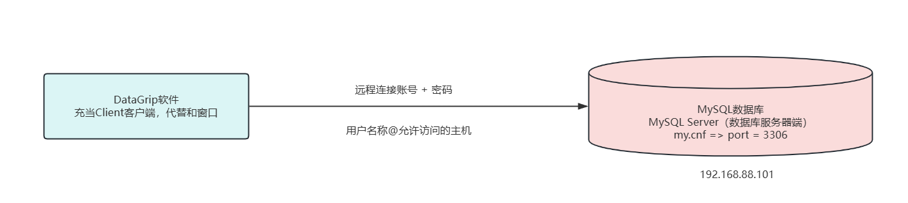

登录虚拟机中的 mysql 数据库（3306 端口）

```shell
# mysql -uroot -p
Enter password: 123456

mysql> drop user 'root'@'%';
mysql> create user 'root'@'%' identified by '123456';
mysql> grant all on *.* to 'root'@'%' with grant option;
说明：
grant => 分配权限
all => 所有权限
on => 针对哪个数据库的哪个数据表
*.* => 左边的*代表所有数据库，右边的*代表所有数据表
to => 这个权限分配给哪个用户

mysql> select user,host from mysql.user;
+------------------+-----------+
| user             | host      |
+------------------+-----------+
| root             | %         |
| mysql.infoschema | localhost |
| mysql.session    | localhost |
| mysql.sys        | localhost |
| root             | localhost |
+------------------+-----------+
5 rows in set (0.00 sec)
```

## DataGrip 介绍

DataGrip 是 JetBrains 公司推出的管理数据库的产品，功能非常强大，可以兼容各种数据库，另外，JetBrains 公司还有一款知名的 IDE 开发工具 IDEA，用户体验非常不错。

下载地址：[https://www.jetbrains.com/datagrip/download/#section=windows](https://www.jetbrains.com/datagrip/download/)

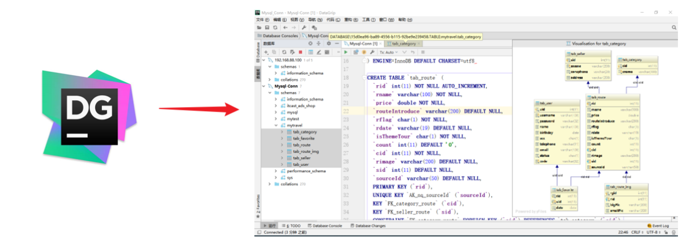

## DataGrip 安装

下载完成后打开安装程序，选择安装路径，一直点击 Next 即可安装。 直到 Finish 点击完成安装，并打开应用。 选择 <font style="color:rgb(216,57,49);">Evaluate for free</font> 免费试用 30 天。

> 如果 DataGrip 软件使用比较好，有条件的可以支持一下正版^\_^

## 创建工程

点击 File->New->Project 新建 DataGrip 工程

输入项目名称，点击确定。

选择新项目打开方式：This Windows（在本窗口中打开），New Windows（在新窗口中打开）， Attach（附加模式）

## 连接数据库

选择 Database 下的➕，点击 DataSource 菜单下的 MySQL。 填写对应的参数，连接数据库：连接名，IP，用户名，密码等，点击OK 完成连接。 **注意：如果第一次使用，需要下载 mysql 驱动文件**。

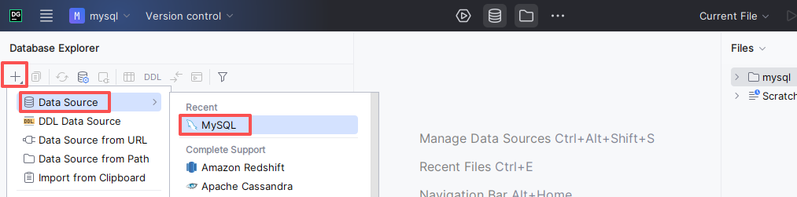

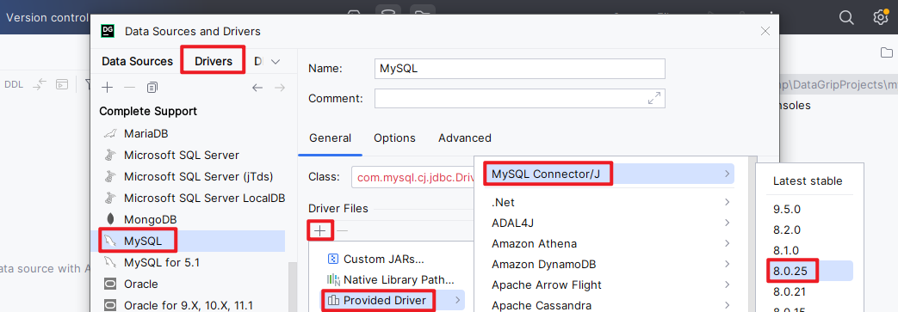

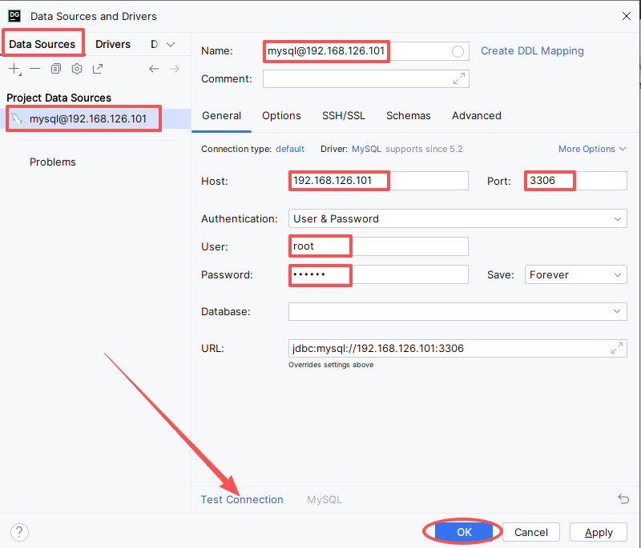

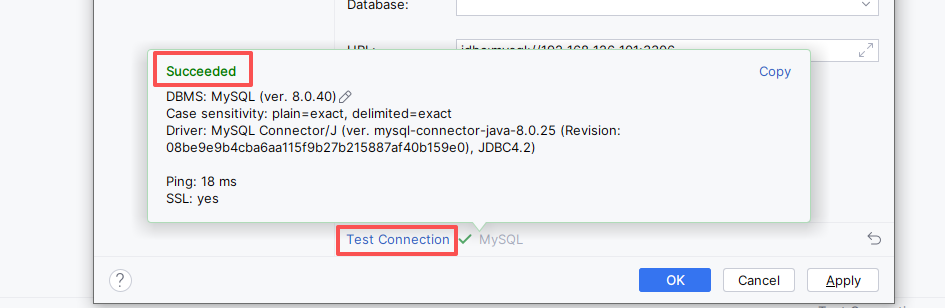

> 上面的下载驱动包只需要在第一次使用 DataGrip 连接 MySQL 数据库时操作，后面就不需要再操作了！

***

简单使用：

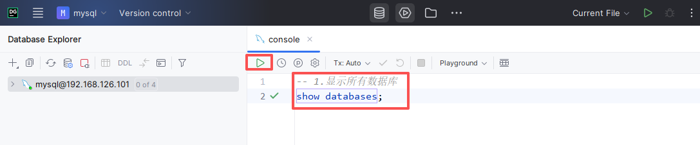

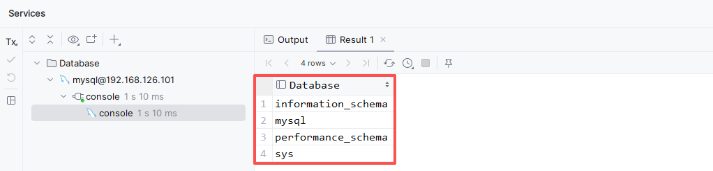

***

常见连接异常说明：

排查1：排查 IP 地址是否可以 ping 通

Windows，cmd：

```shell
ping 192.168.126.101
```

排查2：查看 MySQL 端口是否被占用

```shell
ss -nltp

查看mysqld进程是否占用了3306端口
```

特殊：MySQL 软件可以正常使用，但是 ss 查看没有端口，这就是 MySQL 启动异常（有进程，没有端口），解决思路

```shell
pkill mysqld
systemctl start mysqld
systemctl enable mysqld
```

排查3：查看服务器防火墙是否开启，如果开启，是否放行 3306、33060 端口

```shell
systemctl stop firewalld
systemctl disable firewalld
```

排查4：除了以上配置以外，还需要有一个远程账号 root@%

```shell
mysql> select user,host from mysql.user;
```

## DataGrip 软件设置

### 设置字体大小

设置文字大小： File--->settings--->Editor---->Font

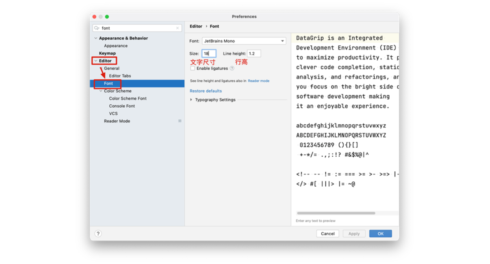

### 设置关键字大小写

设置关键字大写： File--->settings--->Editor---->Code Style--->SQL--->MySql(需要设置的数据库)--->Case

使用默认即可，默认都是小写的字母，小写的便于我们识别。

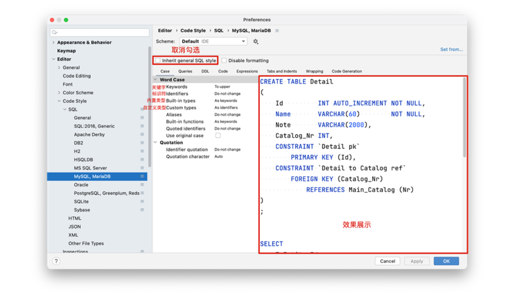

### 自动排版（了解）

自动排版布局： File--->settings--->Editor---->Code Style--->SQL--->MySql(需要设置的数据库)--->Queries 自动排版快捷键：Ctrl+ Alt + L

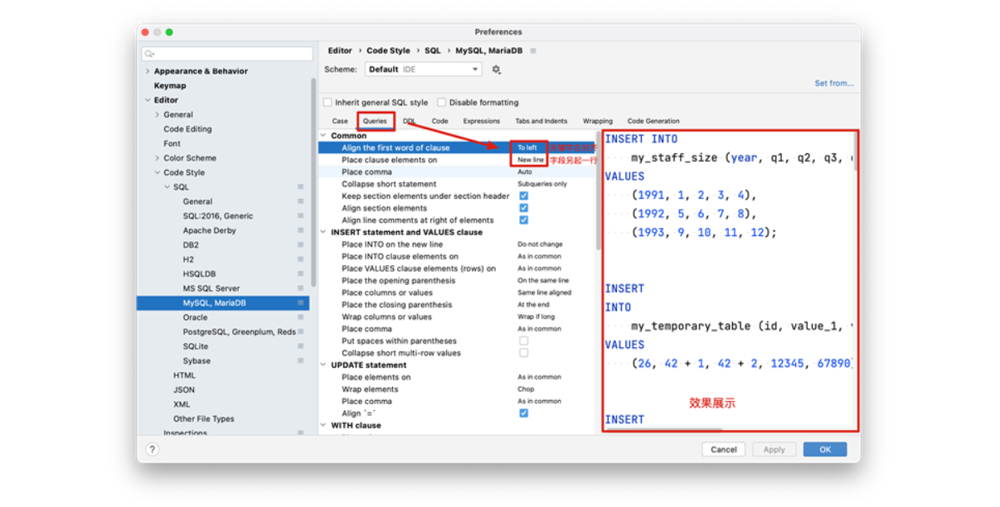

### 设置 SQL 代码存储位置

我们目前在 console 中写的 sql 语句保存到哪里了呢？

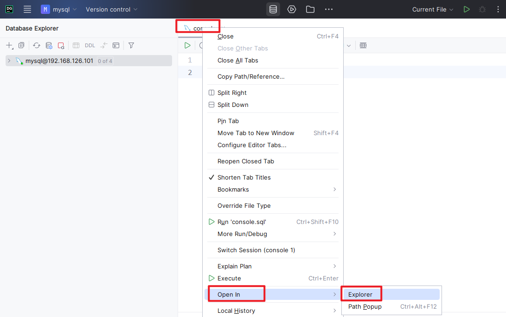

也可以给我们写的 sql 语句换个存储位置。

第一步：显示 Files 菜单

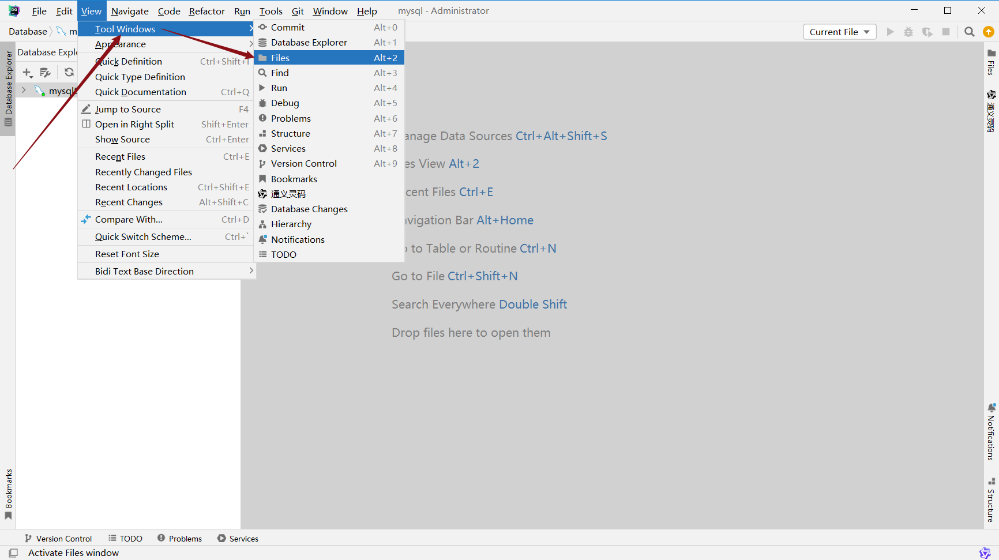

第二步：找到右侧的 Files 菜单，展开，鼠标右键

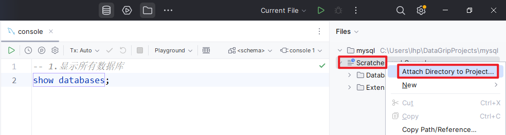

第三步：选择你要存储 SQL 脚本文件的位置

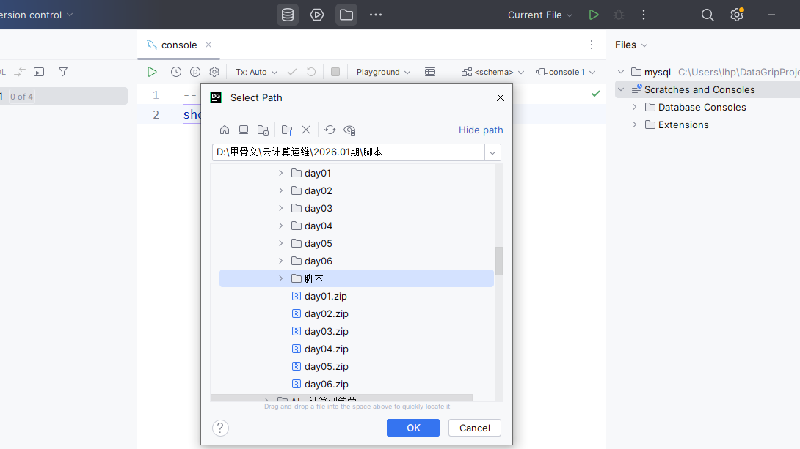

确定，创建 SQL 代码文件（在脚本文件夹右击 => New => SQL File => 课堂脚本.sql）

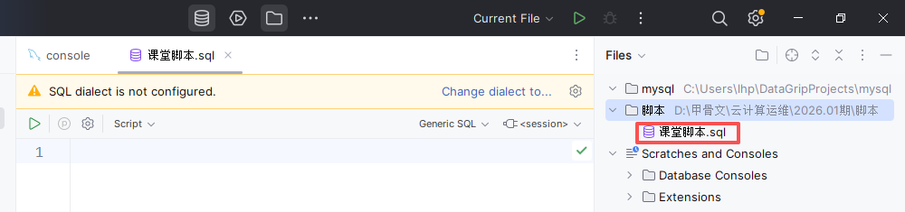

双击展开，然后选择创建 New Session，让这个文件可以连接到我们的 MySQL 项目中，这样 SQL 代码就可以正常解析了

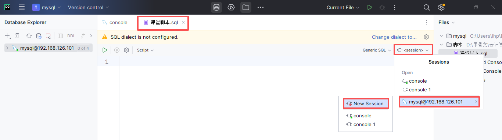

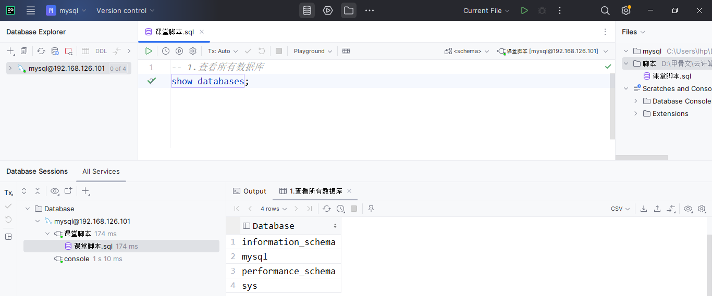

# 二、SQL 语句（重点）

## SQL 语句概述

<font style="color:rgb(216,57,49);">结构化查询语言</font>(Structured Query Language)简称 <font style="color:rgb(216,57,49);">SQL</font>，是<font style="color:rgb(216,57,49);">关系型数据库管理系统</font>都需要遵循的<font style="color:rgb(216,57,49);">规范</font>，是数据库认识的语句。不同的数据库生产厂商都<font style="color:rgb(216,57,49);">支持 SQL 语句</font>，但都有<font style="color:rgb(216,57,49);">特有内容</font>。

**举例：**

普通话：各数据库厂商都遵循的 ISO 标准。

方言：数据库特有的关键字。

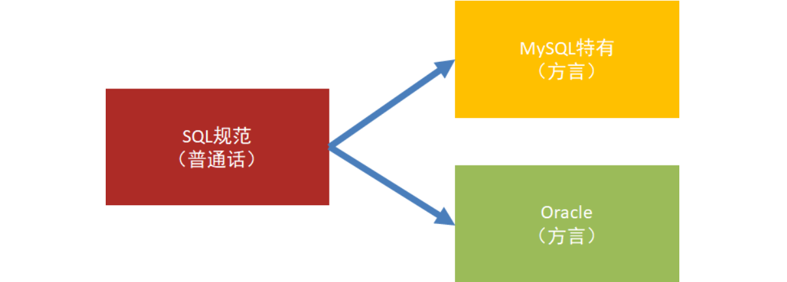

## SQL 语句分类（记住）

### DDL

<font style="color:rgb(216,57,49);">数据定义语言</font>：简称 DDL（Data Definition Language）

用来定义数据库对象：<font style="color:rgb(216,57,49);">数据库，表，列等</font>。

关键字：<font style="color:rgb(216,57,49);">create，alter，drop </font>等

> 搭建数据存储的框架，如管理数据库、管理数据表、管理字段

### DML

<font style="color:rgb(216,57,49);">数据操作语言</font>：简称 DML（Data Manipulation Language）

用来对数据库中表的记录进行更新（<font style="color:rgb(216,57,49);">增加、修改、删除</font>）。

关键字：<font style="color:rgb(216,57,49);">insert，delete，update </font>等

### DQL

<font style="color:rgb(216,57,49);">数据查询语言</font>：简称 DQL（Data Query Language）

用来查询数据库中表的记录（<font style="color:rgb(216,57,49);">查询</font>）。

关键字：select，from，where 等

### DCL

<font style="color:rgb(216,57,49);">数据控制语言</font>：简称 DCL（Data Control Language）

用来定义数据库的<font style="color:rgb(216,57,49);">访问权限和安全级别及创建用户（账号管理、权限管理）</font>。

## SQL 基本语法

① SQL 语句可以单行或多行书写，但是最终需要以<font style="color:rgb(216,57,49);">分号结尾</font>。

```sql
select * from students;
```

② 可使用<font style="color:rgb(216,57,49);">空格和缩进</font>来<font style="color:rgb(216,57,49);">增强</font>语句的<font style="color:rgb(216,57,49);">可读性</font>

```sql
select
  *
from students;
```

③ MySQL 数据库的 SQL 语句默认<font style="color:rgb(216,57,49);">不区分大小写</font>

```sql
SELECT * FROM user;
等价于
select * from user; 
```

④ 可以使用<font style="color:rgb(216,57,49);">单行与多行注释</font>

```sql
#  单行注释
-- 单行注释，注意：--后面有一个空格

/*
  ...
  多行注释
  ...
*/
```

## 小结

SQL：（<font style="color:rgb(216,57,49);">结构化查询语言</font>），是关系型数据库管理系统都需要遵循的规范，不同的数据库生产厂商都支持 SQL 语句，但都有特有内容。

SQL 语句分为：数据定义语言（DDL），数据操作语言（DML），数据查询语言（DQL），数据控制语言（DCL）。

SQL 通用语法：① 分号结尾 ② 空格或者缩进 ③ 不区分大小写 ④ 注释：单行注释 与 多行注释

# 三、DDL 数据库操作

## MySQL 的组成结构（理解）

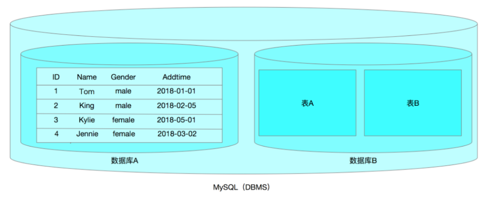

> 注：我们平常说的 MySQL，其实主要指的是 MySQL 数据库管理软件。

<font style="color:rgb(216,57,49);">一个 MySQL DBMS 可以同时存放多个数据库</font>，理论上<font style="color:rgb(216,57,49);">一个项目就对应一个数据库</font>。如博客项目 blog 数据库、商城项目 shop 数据库、微信项目 wechat 数据库。

<font style="color:rgb(216,57,49);">一个数据库中还可以同时包含多个数据表，而数据表才是真正用于存放数据的位置</font>。（类似我们 Office 软件中的 Excel 表格），理论上<font style="color:rgb(216,57,49);">一个功能就对应一个数据表</font>。如博客系统中的用户管理功能，就需要一个 user 数据表、博客中的文章就需要一个 article 数据表、博客中的评论就需要一个 message 数据表。

<font style="color:rgb(216,57,49);">一个数据表又可以拆分为多个字段</font>，每个字段就是一个<font style="color:rgb(216,57,49);">属性</font>。一个用户表，需要保存用户账号、用户的密码等信息。

<font style="color:rgb(216,57,49);">一个数据表除了字段以外，还有很多行，每一行都是一条完整的数据</font>（<font style="color:rgb(216,57,49);">记录</font>）。

## 数据库的基本操作

### 创建数据库

普及英语小课堂：

创建 => <font style="color:rgb(216,57,49);">create</font>

数据库 => <font style="color:rgb(216,57,49);">database</font>

创建 + 数据库 = create database 数据库名称(字母+数字+下划线组成，以字母开头，不能出现中文以及特殊字符)

基本语法：

```sql
mysql> create database 数据库名称 [设置编码格式];
```

> 特别注意：在 MySQL 中，当一条 SQL 语句编写完毕后，一定要使用分号;进行结尾，否则系统认为这条语句还没有结束。

案例：创建数据库的相关案例

```sql
创建db_lhp库
create database db_lhp;

创建db1库并指定默认字符集
create database db1 default charset gbk;

如果存在不报错(if not exists)
create database if not exists db_lhp default character set utf8;
说明：不能创建相同名字的数据库！
```

> 扩展：编码格式，常见的 gbk（中国的编码格式）与 utf8（国际通用编码格式）

latin1：这是早期的字符编码格式，支持 256 个字符，适用于基本的西方语言字符集。

gb2312/gbk：由于 latin1 的字符集无法表示汉字，中国开发了自己的编码格式 gb2312，后来升级为 gbk，以支持更多汉字和扩展字符集。

big5：中国台湾也开发了一套用于表示繁体中文的字符编码格式，称为 big5，适用于繁体中文字符集。

utf8：为了支持多语言环境，国际标准化组织开发了 utf8 编码，能够表示几乎所有已知语言的字符。由于早期版本的 utf8 不完全支持某些特殊符号和表情符号，MySQL5.6 版本以后推出了 utf8mb4，用于支持更多字符（如 Emoji 表情），每个字符最多使用 4 个字节。

### 查询数据库

英语小课堂：

显示 => <font style="color:rgb(216,57,49);">show</font>

数据库 => <font style="color:rgb(216,57,49);">database</font>

显示 + 所有数据库 = show databases;

基本语法：显示所有数据库

```sql
mysql> show databases;
```

### 删除数据库

英语小课堂：

删除 => <font style="color:rgb(216,57,49);">drop</font>

数据库 => <font style="color:rgb(216,57,49);">database</font>

删除 + 数据库 = drop database 数据库名称;

基本语法：

```sql
mysql> drop database 数据库名称;
```

案例：删除 db\_lhp 数据库

```sql
mysql> drop database db_lhp;
```

### 选择数据库

从数据库列表中查找需要使用的数据库

格式：

```sql
mysql> use db_lhp;
```

查看正在使用的数据库（8.0 以后版本需要基于 select 查询来获取当前数据库）

```sql
mysql> select database();
```

## 小结

创建数据库：CREATE DATABASE 数据库名；

查看数据库：SHOW DATABASES;

删除数据库：DROP DATABASE 数据库名； -- 慎重

使用数据库：USE 数据库名；

# 四、DDL 数据表操作

DDL 要学<font style="color:rgb(216,57,49);">4个</font>关键字：<font style="color:rgb(216,57,49);">create（创建）、drop（删除）、alter（修改）、show（查询）</font>

特别注意：<font style="color:rgb(216,57,49);">创建数据表必须有一个前提，首先要明确选择某一个数据库。</font>

## 数据表的基本操作

### 数据表的创建

英语小课堂：

创建 => <font style="color:rgb(216,57,49);">create</font>

数据表 => <font style="color:rgb(216,57,49);">table</font>

创建 + 数据表 = create table 数据表名称

基本语法：

```sql
mysql> create table 数据表名称(
        字段1 字段类型 [字段约束],
        字段2 字段类型 [字段约束],
        ...
); 

常用字段类型
整数：int（-21亿 ~ 21亿）
浮点：decimal(M,N)，M代表整数长度 + 小数总长度，N代表小数点后保留几位小数，decimal(5,2) => 999.99
字符串类型：固定长度用char(M)，变化长度用varchar(M) => M代表最大字符数
枚举类型：enum('男','女')，插入值要么为男，要么为女
```

案例：创建一个 admin 管理员表，拥有 3 个字段（编号、用户名称、用户密码）

```sql
mysql> create database db_lhp;
mysql> use db_lhp;
```

> use 在 MySQL 中的含义代表选择，use 数据库名称相当于选择指定的数据库。而且 use 比较特殊，其选择结束后，其尾部可以不加分号；但是强烈建议所有的 SQL 语句都要加分号，养成一个好习惯。

```sql
mysql> create table tb_admin(
    id int,
    username varchar(20),
    password varchar(20)
) default charset=utf8;
```

案例：创建一个 article 文章表，拥有4个字段（编号、标题、作者、内容）

```sql
mysql> use db_lhp;
mysql> create table tb_article(
    id int,
    title varchar(50),
    author varchar(20),
    content text
) default charset=utf8;
```

> text：文本类型，一般情况下，用 varchar 存储不了的字符串信息，都建议使用 text 文本进行处理。
>
> varchar 存储的最大长度，理论值 65535 个字节。但是实际上，有几个字节是用于存放内容的长度的，所以真正可以使用的不足65535 个字节，另外 varchar 类型存储的字符长度还和编码格式有关。1个 GBK 格式的占用2个字节长度，1个 UTF8 格式的字符占用3个字节长度。GBK = 65532~65533/2，UTF8 = 65532~65533/3

案例：创建一个 student 表，字段：编号、姓名、性别、年龄、体重

```properties
create table student(
  id int,
  name varchar(10),
  sex enum("男", "女"),
  age int,
  weight decimal(5,2)
);
```

### 查询已创建数据表

英语小课堂：

显示 => show

数据表 => table

显示所有数据表（当前数据库）

```sql
mysql> use 数据库名称;
mysql> show tables;
```

显示数据表的创建过程（编码格式、字段等信息）

```sql
mysql> desc 数据表名称;
mysql> show create table 数据表名称;
```

### 删除数据表

英语小课堂：

删除 => drop

数据表 => table

```sql
mysql> drop table 数据表名称;
```

扩展：查看数据库 与 数据表对应的编码格式

```sql
-- 查看数据库编码格式
show create database 数据库名称;
-- 查看数据表编码格式
show create table 数据表名称;

show create database db_lhp;
show create table tb_article;
```

### 修改数据表信息

#### 数据表字段添加

英语小课堂：

修改 => alter

数据表 => table

基本语法：

```sql
mysql> alter table 数据表名称 add 新字段名称 字段类型 first;
mysql> alter table 数据表名称 add 新字段名称 字段类型 after 其他字段名称;
选项说明：
first：把新添加字段放在第一位
after 字段名称：把新添加字段放在指定字段的后面
```

案例：在 tb\_article 文章表中添加一个 addtime 字段，类型为 date(年-月-日)

日期类型有两个：date（<font style="color:rgb(216,57,49);">年-月-日</font>）、time（<font style="color:rgb(216,57,49);">小时:分钟:秒</font>）、datetime（<font style="color:rgb(216,57,49);">年-月-日 小时:分钟:秒</font>）

```sql
mysql> alter table tb_article add addtime date after content;
mysql> desc tb_article;
```

#### 修改字段名称或字段类型

修改字段名称与字段类型（也可以只修改名称）

```sql
mysql> alter table tb_admin change username name varchar(40);
mysql> desc tb_admin;

说明：
change比较神奇，既可以修改字段名称，又可以修改字段类型！
change 源字段名称 修改后字段名称 修改后的字段类型（这个也可以不改，但是必须要写）
```

仅修改字段的类型

```sql
mysql> alter table tb_admin modify name varchar(20);
mysql> desc tb_admin;

说明：
modify 字段名称 新字段类型（仅可以修改字段类型）
```

#### 删除某个字段

```sql
mysql> alter table tb_article drop 字段名称;
mysql> desc tb_article;
```

#### 修改数据表名称

```sql
rename table 旧名称 to 新名称;
```

## 字段类型详解（重点）

整数 int、浮点数 decimal、字符串 char/varchar/text、枚举类型 enum、日期时间类型 date、time、datetime

<https://dev.mysql.com/doc/refman/8.0/en/data-types.html>

① 整数类型

| **分类** | **类型名称** | **说明** |
| --- | --- | --- |
| <font style="color:rgb(216,57,49);">tinyint</font> | 很小的整数 | -128 ~ 127 |
| smallint | 小的整数 | -32768 ~ 32767 |
| mediumint | 中等大小的整数 | -8388608 ~ 8388607 |
| <font style="color:rgb(216,57,49);">int(integer)</font> | 普通大小的整数 | -2147483648 ~ 2147483647 |
| <font style="color:rgb(216,57,49);">long</font> | 长整型 |  |

选择整数类型，往往需要考虑存储范围！

age <font style="color:rgb(216,57,49);">tinyint unsigned</font> => 0 - 255，只需要记住 <font style="color:rgb(216,57,49);">tinyint </font>和 <font style="color:rgb(216,57,49);">int </font>即可！！！

举个例子：

```sql
create table tb_student(
    id int,
    name varchar(20),
    age tinyint unsigned
) default charset=utf8;
```

SQL 优化手段：<font style="color:rgb(216,57,49);">尽量选择满足这个字段范围区间的数据类型</font>！！！

② 浮点类型（小数类型）

<font style="color:rgb(216,57,49);">浮点类型</font>（精度失真情况）和<font style="color:rgb(216,57,49);">定点类型</font>（推荐使用定点类型）

| 分类 | 类型名称 |
| --- | --- |
| float | 单精度浮点数 |
| double | 双精度浮点数 |
| <font style="color:rgb(216,57,49);">decimal(m,d)</font> | 定点数，decimal(10,2) |

> decimal(10,2) ：代表这个数的总长度为10 = <font style="color:rgb(216,57,49);">整数长度 + 小数长度</font>，<font style="color:rgb(216,57,49);">2代表保留2位小数</font>
>
> decimal(5,2) ：999.99

建议：① 精度要求不高（2-4位小数的情况，影响不大），可以使用 float/double

```
  ② <font style="color:rgb(216,57,49);">如果精度要求比较高的情况，可以使用 decimal</font>
```

参考阅读：<https://blog.csdn.net/weixin_45729934/article/details/121389109>

案例：

```sql
create table tb_product(
    id int,
    name varchar(100),
    price decimal(11,2)
) default charset=utf8;
```

③ 日期类型

| 分类 | 类型名称 |
| --- | --- |
| year | YYYY 1901~2155 |
| time | HH:MM:SS -838:59:59~838:59:59 |
| <font style="color:rgb(216,57,49);">date</font> | <font style="color:rgb(216,57,49);">YYYY-MM-DD 1000-01-01~9999-12-3</font> |
| <font style="color:rgb(216,57,49);">datetime</font> | <font style="color:rgb(216,57,49);">YYYY-MM-DD HH:MM:SS 1000-01-01 00:00:00~ 9999-12-31 23:59:59</font> |
| timestamp | YYYY-MM-DD HH:MM:SS 1970-01-01 00:00:01 UTC~2038-01-19 03:14:07UTC |

选日期类型看格式，用的最多的是 => <font style="color:rgb(216,57,49);">date、datetime</font>

date：年-月-日

time：小时：分钟：秒数

datetime = date + time 合并

案例：

```sql
create table tb_news(
    id int,
    title varchar(100),
    addtime datetime
) default charset=utf8;
```

④ 文本（字符串类型）

| **类型名称** | **说明** |
| --- | --- |
| <font style="color:rgb(216,57,49);">char(m)</font> | m为0~255之间的整数定长（固定长度），m代表字符长度，255代表不能超过255个字符 |
| <font style="color:rgb(216,57,49);">varchar(m)</font> | m为0~65535之间的整数变长（变化长度），65535代表字节长度，和编码有关，utf8最多2万多个汉字 |
| <font style="color:rgb(216,57,49);">text</font> | 允许长度0~65535字节 |
| mediumtext | 允许长度0~167772150字节 |
| <font style="color:rgb(216,57,49);">longtext（扩展）</font> | 允许长度0~4294967295字节 |

选择文本，主要长度，固定 <font style="color:rgb(216,57,49);">char</font>、变化 <font style="color:rgb(216,57,49);">varchar</font>、很长的就是 <font style="color:rgb(216,57,49);">text</font>。

varchar(m)：理论上底层最大能存储的字节数是65535。但是如果是汉字，和编码格式有关，gbk 模式下，1个汉字2个字节，理论上大概能3万左右个汉字。utf8 模式下，1个汉字3个字节，理论值就是2万多个汉字。m 指的就是字符的个数。一个字母是一个字符，一个汉字也是一个字符。一个字母占用 1 个字节，一个汉字占用 2 或者 3 个字节。

补充：<font style="color:rgb(216,57,49);">enum('值1','值2','值3')</font>，多选一，从多个值中选择其中的某一个！！！

案例：

```sql
create table tb_student(
  id int,
  name varchar(20),
  gender enum('男', '女'),
  phone char(11),
  remark text
) default charset=utf8;
```

综合案例：

```sql
-- 创建tb_emp员工表
create table tb_emp(
	id int,
	name varchar(10),
	sex enum('男','女'),
	age tinyint unsigned,
	birthday date,
	weight decimal(5,2),
	introduce text,
	hire_date datetime
);
```

## 字段约束详解（重点）

字段约束：在<font style="color:rgb(216,57,49);">数据类型</font>的基础上，给字段添加<font style="color:rgb(216,57,49);">约束行为</font>（如不能为空等等）

基本语法：

```sql
create table 数据表名称(
     字段名称  字段类型  [可选，字段约束]
) default charset=utf8mb4;
```

在 MySQL 中，字段约束一共有五种约束：<font style="color:rgb(216,57,49);">① 主键约束 ② 唯一约束 ③ 非空约束 ④ 默认值约束 ⑤ 外键约束</font>

### 主键约束

强调：<font style="color:rgb(216,57,49);">非空、唯一、一个表中有且仅有1个主键</font>，在 MySQL 中，往往 <font style="color:rgb(216,57,49);">id 字段</font>都是主键（<font style="color:rgb(216,57,49);">primary key</font>）

article 文章表（id 主键，title 标题，author 作者，addtime 发布时间）

```sql
use db_lhp;
create table article(
    id int primary key,
    title varchar(80),
    author varchar(20),
    addtime date
) default charset=utf8mb4;

或

create table article(
    id int,
    title varchar(80),
    author varchar(20),
    addtime date,
    primary key(id)
) default charset=utf8mb4;
```

案例：

```sql
use db_lhp;
create table article(
    id int primary key,
    title varchar(80),
    author varchar(20),
    addtime date
) default charset=utf8mb4;

-- 查看数据表
desc article;

-- 向表中插入数据
insert into article values (1, 'MySQL数据库运维', '张三', '2025-02-10');

-- 主键强制为null（错误演示）
insert into article values (null, 'Python运维开发', '李四', '2025-02-10');

-- 主键强制重复（错误演示）
insert into article values (1, 'Python运维开发', '李四', '2025-02-10');
```

### 唯一约束

强调：<font style="color:rgb(216,57,49);">唯一，可以为空，一个表中可以同时拥有多个唯一约束</font>

unique

主键约束 与 唯一约束区别？

和主键约束相同点：<font style="color:rgb(216,57,49);">都是唯一的</font>

和主键约束不同点：<font style="color:rgb(216,57,49);">主键非空、有且仅有1个</font>；<font style="color:rgb(216,57,49);">唯一可以为空，在一个表中也可以同时拥有多个</font>

案例：创建一个用户表，id 主键，name，age，code（身份证号码，要求唯一）

```sql
create table users(
    id int primary key,
    name varchar(20),
    age tinyint unsigned,
    code char(18) unique
) default charset=utf8;

-- 插入数据
insert into users values (1, '张三', 18, '123456789012345678');

-- 插入重复数据（错误演示）
insert into users values (2, '李四', 18, '123456789012345678');

-- 插入数据，但是唯一列为null
insert into users values (2, '王五', 18, null);
```

### 非空约束

强调：<font style="color:rgb(216,57,49);">非空</font>，这个列不允许出现 null 空值

<font style="color:rgb(216,57,49);">not null</font>

案例：创建一个商品表 goods，有 id 主键，name 商品名称，price 商品价格，name 和 price 都必须为非空！

```sql
create table goods(
    id int primary key,
    name varchar(80) not null,
    price decimal(11,2) not null
) default charset=utf8mb4;

-- 插入数据
insert into goods values (1, 'Python从入门到放弃', 99.99);

-- 插入数据（错误演示）
insert into goods values (2, 'Java从入门到放弃', null);
```

### 默认值约束

强调：<font style="color:rgb(216,57,49);">默认值</font>，插入数据时，如果没有指定对应的值，则其自动使用默认值做为最终结果

<font style="color:rgb(216,57,49);">default 默认值</font>

案例：创建一个用户表 users，id 主键、name 用户名、age 年龄、gender 性别，要求 gender 默认值为 male

```sql
drop table users;

create table users(
  id int primary key,
  name varchar(20),
  age tinyint unsigned,
  gender enum('male', 'female') default 'male'
) default charset=utf8mb4;

desc users;

-- 插入数据
insert into users values (1, '张三', 18, 'male');

-- 插入数据（触发默认值）
insert into users(id, name, age) values (2, '李四', 18);
insert into users values (3, '王五', 18, default);

-- 插入数据（不使用默认值）
insert into users values (4, '赵六', 18, 'female');
```

### 外键约束（了解）

强调：<font style="color:rgb(216,57,49);">多表，级联操作</font>

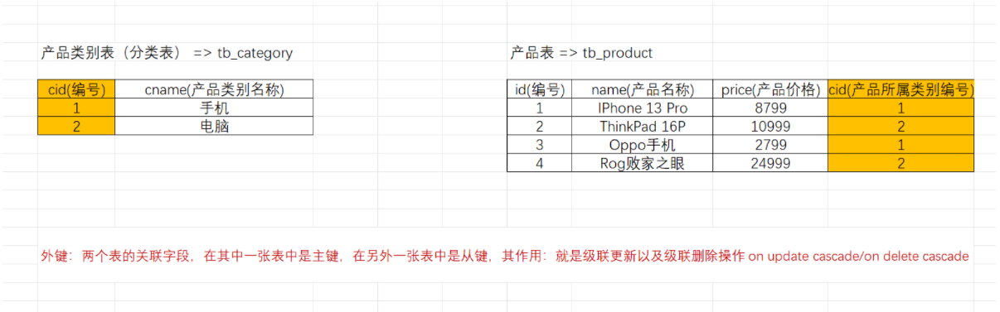

外键约束前提：<font style="color:rgb(216,57,49);">① 多表 ② 数据表引擎必须为 InnoDB 引擎</font>

小结：

MySQL 语句中，一共有5种：（<font style="color:rgb(216,57,49);">主键约束、唯一约束、非空约束、默认值约束、外键约束</font>）

## auto\_increment 自动增长（重点）

作用：<font style="color:rgb(216,57,49);">自动增长，往往用于设置在主键字段上，可以让其值自动增长，默认从1开始，依次递增。</font>

```sql
drop table users;

create table users(
  id int auto_increment primary key,
  name varchar(20),
  age tinyint unsigned,
  gender enum('male', 'female') default 'male'
) default charset=utf8mb4;

insert into users values (null, '张三', 23, 'male');
insert into users values (null, '李四', 24, 'male');
delete from users where id = 2;
insert into users values (null, '王五', 25, 'male');
```

# 五、DML 数据操作语言

## DML 包括哪些 SQL 语句

<font style="color:rgb(216,57,49);">insert </font>插入、<font style="color:rgb(216,57,49);">update </font>更新、<font style="color:rgb(216,57,49);">delete </font>删除

## 数据的增删改（重点）

英语小课堂：

增加：insert

删除：delete

修改：update

### 数据的增加操作

基本语法：

```sql
mysql> insert into 数据表名称([字段1,字段2,字段3...]) values (字段1的值,字段2的值,字段3的值...);
```

> 特别注意：<font style="color:rgb(216,57,49);">在 SQL 语句中，除了数字，其他类型的值，都需要使用引号引起来，否则插入时会报错。</font>

<font style="color:#000000;">第一步：准备一个数据表</font>

```sql
mysql> use db_lhp;
mysql> create table tb_user(
      id int primary key auto_increment,
      name varchar(20),
      age tinyint unsigned,
      gender enum('男','女','保密'),
      address varchar(255)
) default charset=utf8;
```

> unsigned 代表无符号型，只有0到正数。tinyint unsigned 无符号型，范围 0 ~ 255
>
> enum 枚举类型，多选一。只能从给定的值中选择一个

第二步：使用 insert 语句插入数据

```sql
mysql> insert into tb_user values (null,'刘备',34,'男','广州市天河区');
mysql> insert into tb_user(id,name,age) values (null,'关羽',33);

-- 查询所有数据
mysql> select * from tb_user;
```

第三步：批量插入多条数据

```sql
mysql> insert into tb_user values (null,'大乔',19,'女','上海市浦东新区'),(null,'小乔',18,'女','上海市浦东新区'),(null,'马超',26,'男','北京市昌平区');
```

### 数据的修改操作

基本语法：

```sql
mysql> update 数据表名称 set 字段1=更新后的值,字段2=更新后的值,... [where 更新条件];

where：更新条件，满足条件的才会被更新，如果不写where则默认修改所有记录！
```

> 特别说明：如果在更新数据时，不指定更新条件，则其会把这个数据表的所有记录全部更新一遍。

案例：修改 name='赵飞' 这条记录，将其性别更新为男，家庭住址更新为广东省深圳市

```sql
mysql> update tb_user set gender='男',address='广东省深圳市' where name='赵飞';
```

案例：今年是2025年，假设到了2026年，现在存储的学员年龄都差1岁，整体进行一次更新

```sql
mysql> update tb_user set age=age+1;
```

### 数据的删除操作

基本语法：

```sql
mysql> delete from 数据表名称 [where 删除条件];
```

案例：删除 tb\_user 表中，id=1 的用户信息

```sql
mysql> delete from tb_user where id=1;
```

delete from 与 truncate 清空数据表操作

```sql
mysql> delete from 数据表;
或
mysql> truncate 数据表;
```

面试题：<font style="color:rgb(216,57,49);">delete from 与 truncate 区别在哪里？</font>

* delete：删除数据记录
  * <font style="color:rgb(216,57,49);">数据操作语言（DML）</font>
  * <font style="color:rgb(216,57,49);">删除大量记录速度慢，只删除数据，主键自增序列不清零</font>，1-100 => 新插入 => 101
  * 可以带条件删除
* truncate：删除所有数据记录
  * <font style="color:rgb(216,57,49);">数据定义语言（DDL）</font>
  * <font style="color:rgb(216,57,49);">清理大量数据速度快，主键自增序列清零</font>, 1-100 => 新插入 => 1
  * 不能带条件删除

小结：

DML：数据操作语言，主要涉及增加（<font style="color:rgb(216,57,49);">INSERT</font>）、修改（<font style="color:rgb(216,57,49);">UPDATE</font>）、删除（<font style="color:rgb(216,57,49);">DELETE</font>）

# 六、DQL 数据查询语言（核心）

## 数据集准备

```sql
CREATE TABLE product
(
    pid         INT PRIMARY KEY,
    pname       VARCHAR(20),
    price       DOUBLE,
    category_id VARCHAR(32)
) DEFAULT CHARSET=utf8;

pid：p==product，pid==产品id编号
pname：产品名称
price：产品价格
category_id：产品所属分类编号（c001电子产品，c002服装）
```

插入数据：

```sql
INSERT INTO product VALUES (1,'联想',5000,'c001');
INSERT INTO product VALUES (2,'海尔',3000,'c001');
INSERT INTO product VALUES (3,'雷神',5000,'c001');
INSERT INTO product VALUES (4,'杰克琼斯',800,'c002');
INSERT INTO product VALUES (5,'真维斯',200,'c002');
INSERT INTO product VALUES (6,'花花公子',440,'c002');
INSERT INTO product VALUES (7,'劲霸',2000,'c002');
INSERT INTO product VALUES (8,'香奈儿',800,'c003');
INSERT INTO product VALUES (9,'相宜本草',200,'c003');
INSERT INTO product VALUES (10,'面霸',5,'c003');
INSERT INTO product VALUES (11,'好想你枣',56,'c004');
INSERT INTO product VALUES (12,'香飘飘奶茶',1,'c005');
INSERT INTO product VALUES (13,'海澜之家',1,'c002');
```

## select 查询（核心）

```sql
# 根据某些条件从某个表中查询指定字段的内容
格式：select [distinct]*| 列名,列名 from 表 where 条件

select 查询哪些列多个列用逗号隔开 from 数据表 where 查询条件（满足条件的就显示，不满足的就忽略）
```

## 简单查询

```sql
# 1.查询所有的商品.  
select * from product;

# 2.查询商品名和商品价格. 
select pname,price from product;

# 3.查询结果是表达式（运算查询）：将所有商品的价格+10元进行显示.
select pname,price+10 from product;

# 4.查询所有商品对应的商品分类信息（不能重复）
select distinct category_id from product;
```

SQL 除了简单查询以外，还支持五子句查询（SQL 查询五子句）

```sql
select */字段 from 数据表 ① where子句 ② group by子句 ③ having子句 ④ order by子句 ⑤ limit子句

① where：条件查询
② group by：分组查询
③ having：条件查询，只不过发生在分组之后，可以对分组后结果进行筛选
④ order by：排序子句，用于排序操作
⑤ limit：限制查询，用于限制查询数量
五子句可以单独出现，也可以多个关键词一起出现。但是不管多少个关键字都必须严格按照五子句顺序进行书写，否则报错！！！
```

## 条件查询（where 子句）

作用：五子句的一部分

select \* from 数据表 where子句 group by分组子句 having子句 order by子句 limit子句

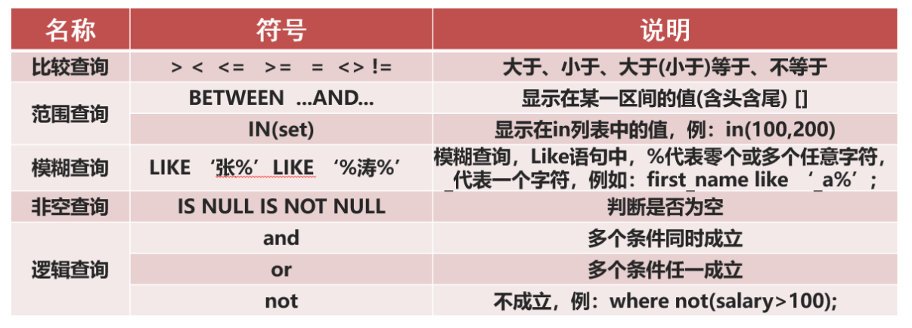

### 比较查询

```sql
# 查询商品名称为“花花公子”的商品所有信息：
SELECT * FROM product WHERE pname = '花花公子';

# 查询价格为800商品
SELECT * FROM product WHERE price = 800;

# 查询价格不是800的所有商品
SELECT * FROM product WHERE price != 800;
SELECT * FROM product WHERE price <> 800;

# 查询商品价格大于60元的所有商品信息
SELECT * FROM product WHERE price > 60;

# 查询商品价格小于等于800元的所有商品信息
SELECT * FROM product WHERE price <= 800;
```

### 范围查询

```sql
# 查询商品价格在200到1000之间所有商品
SELECT * FROM product WHERE price BETWEEN 200 AND 1000;

# 查询商品价格是200或800的所有商品
SELECT * FROM product WHERE price IN (200,800);
```

### 逻辑查询

```sql
# 查询商品价格在200到1000之间所有商品
SELECT * FROM product WHERE price >= 200 AND price <= 1000;

# 查询商品价格是200或800的所有商品
SELECT * FROM product WHERE price = 200 OR price = 800;

# 查询价格不是800的所有商品
SELECT * FROM product WHERE NOT(price = 800);
```

### 模糊查询

字段 like '匹配条件'

匹配条件有两个符号：<font style="color:rgb(216,57,49);">%任意个任意字符</font>，<font style="color:rgb(216,57,49);">\_只匹配任意某1个字符</font>

```sql
# 查询以'香'开头的所有商品
SELECT * FROM product WHERE pname LIKE '香%';

# 查询第二个字为'想'的所有商品
SELECT * FROM product WHERE pname LIKE '_想%';

# 查询商品名称中最后一个字是"斯"的
select * from product where pname like "%斯";

# 查询商品名称中包含"飘"的
select * from product where pname like "%飘%";
```

### 空值查询 与 非空查询

where 字段=null（<font style="color:rgb(216,57,49);">错误</font>）

where 字段<font style="color:rgb(216,57,49);"> is null</font>（<font style="color:rgb(216,57,49);">正确</font>）

```sql
insert into product values(14, "联想拯救者", 7999, null);
insert into product values(15, "MacBook M5", 12999, null);

# 查询没有分类的商品
SELECT * FROM product WHERE category_id IS NULL;

# 查询有分类的商品
SELECT * FROM product WHERE category_id IS NOT NULL;
```

## 聚合查询

**<font style="background-color:#FBDE28;">前置知识点：as 关键词，用于给数据表 或 数据表中的字段定义别名</font>**

```sql
# 数据表定义别名
select 别名.A,别名.B from 数据表 [as] 别名;

# 字段定义别名
select name, (chinese+english+math) as 别名 from 数据表;
```

作用：之前我们做的查询都是横向查询，它们都是根据条件一行一行的进行判断，而使用聚合函数查询是纵向查询，它是对一列的值进行计算，然后返回一个单一的值；另外聚合函数会忽略空值。

聚合查询：<font style="color:rgb(216,57,49);">① 纵向查询（按列查询） ② 默认会忽略空值</font>

今天我们学习如下五个聚合函数：

| **聚合函数** | **作用** |
| --- | --- |
| count() | 统计指定列不为NULL的记录行数； |
| sum() | 计算指定列的数值和，如果指定列类型不是数值类型，则计算结果为0 |
| max() | 计算指定列的最大值，如果指定列是字符串类型，使用字符串排序运算； |
| min() | 计算指定列的最小值，如果指定列是字符串类型，使用字符串排序运算； |
| avg() | 计算指定列的平均值，如果指定列类型不是数值类型，则计算结果为0 |

实现原理：

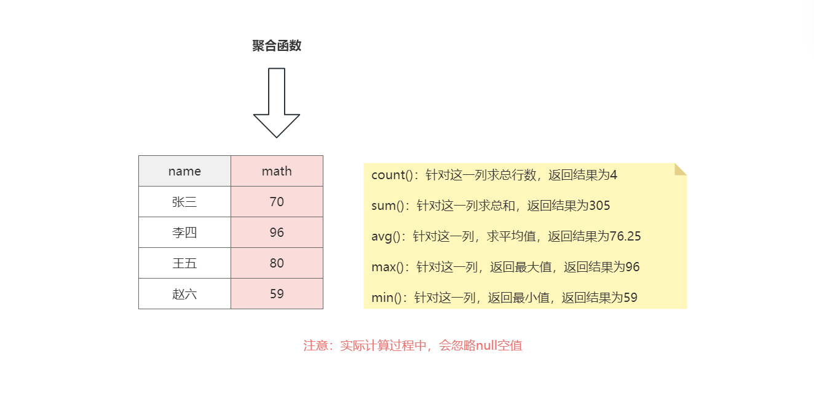

案例演示：

```sql
# 1、查询商品的总条数
SELECT COUNT(*) FROM product;

# 2、查询价格大于200商品的总条数
SELECT COUNT(*) FROM product WHERE price > 200;

# 3、查询分类为'c001'的所有商品的价格总和
SELECT SUM(price) FROM product WHERE category_id = 'c001';

# 4、查询分类为'c002'所有商品的平均价格
SELECT AVG(price) FROM product WHERE category_id = 'c002';

# 5、查询商品的最大价格和最小价格
SELECT MAX(price),MIN(price) FROM product;

注意：使用avg()函数计算平均值的时候，可能结果是无理数，我们可以对结果设置小数点后保留几位小数！
使用 round() 函数可以设置保留几位小数！
select round(avg(price), 2) from product where category_id = 'c001';
```

## 分组查询（重点）

作用：分组就是<font style="color:rgb(216,57,49);">为了更好的进行数据的统计</font>，分组 + 聚合。

按性别分组、按学科分组、按部门分组、按年级分组 => group by 分组字段（按这个字段进行划分分组）

光有分组一般没有特别的意义，但是有一个特性：去重

面试过程中：介绍一下，在 SQL 语句中，如何实现去重操作？

答：我了解的一共有两种方式，<font style="color:rgb(216,57,49);">distinct</font> 或 <font style="color:rgb(216,57,49);">group by</font>

### 分组查询介绍

分组查询就是将查询结果按照指定字段进行分组，字段中数据相等的分为一组。

**分组查询基本的语法格式如下：**

<font style="color:rgb(216,57,49);">GROUP BY 列名</font> \[<font style="color:rgb(216,57,49);">HAVING 条件表达式</font>]

**说明:**

* 列名: 是指按照指定字段的值进行分组。
* HAVING 条件表达式: 用来过滤分组后的数据。

### group by 的使用

group by 可用于单个字段分组，也可用于多个字段分组

```sql
-- 准备学生表student
create table student(
    id int auto_increment,
    name varchar(20),
    age tinyint unsigned,
    gender enum('男', '女'),
    score tinyint,
    primary key(id)
) default charset=utf8;

insert into student values (null, 'Tom', 23, '男', 97);
insert into student values (null, 'Jack', 24, '男', 88);
insert into student values (null, 'Rose', 26, '女', 99);
insert into student values (null, 'Eric', 27, '男', 59);
insert into student values (null, 'Jennifer', 22, '女', 76);

-- 根据gender字段来分组
select gender from student group by gender;

-- 根据name和gender字段进行分组
select name, gender from student group by name, gender;
```

① group by 可以实现去重操作

② group by 的作用是为了实现分组统计（group by + 聚合函数）

### group by + 聚合函数的使用

```sql
-- 统计不同性别的人的平均年龄
select gender,avg(age) from students group by gender;

-- 统计不同性别的人的个数
select gender,count(*) from students group by gender;
```

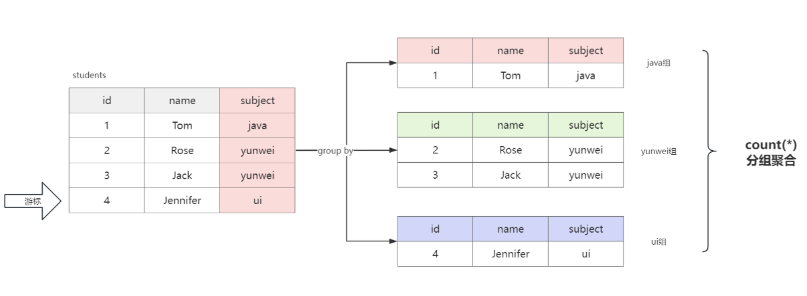

group by 使用注意事项：

```sql
select 分组字段,聚合函数 from student group by 分组字段;

SQL官方文档：在有group by出现的情况下，select后面的字段要么只能出现在分组中，要么只能出现在聚合函数中
```

案例：

```sql
1. 创建数据库demo666，指定字符编码为utf8

2. 使用demo666数据库

3. 创建emp员工表，字段有：
id-主键、自增
name-非空
sex-默认值是男
age
birthday-date类型
dept-部门，非空
major-专业
salary-decimal(7,2)

4. 给员工表中插入一些数据。
(null, "刘备", "男", 25, "2000-05-09", "人事部", "计算机", 8999);
(null, "关羽", "男", 23, "2000-03-09", "财务部", "计算机", 9500);
(null, "貂蝉", "女", 28, "2000-05-09", "开发部", "软件工程", 7600);
(null, "马云", "男", 35, "2000-02-09", "人事部", "财务管理", 5000);
(null, "林黛玉", "女", 27, "2000-05-09", "人事部", "计算机", 6000);
(null, "马化腾", "男", 35, "2000-08-09", "财务部", "软件工程", 9000);
(null, "元春", "女", 42, "2000-06-09", "财务部", "财务管理", 12000);

5. 统计员工表中男女员工的人数各多少？

6. 统计每个部门有多少人？

7. 统计每个部门每月发放多少工资？

8. 统计各个专业的平均年龄？

9. 统计每个部门的最高薪资是多少？
```

## having 的使用

having 作用和 where 类似都是<font style="color:rgb(216,57,49);">过滤数据</font>的，但是两者之间的<font style="color:rgb(216,57,49);">执行顺序不同</font>

<font style="color:rgb(216,57,49);">① where 子句（发生在分组之前）</font> ② group by 子句 <font style="color:rgb(216,57,49);">③ having 子句（发生在分组之后）</font>

第一种情况：如果只是简单的查询操作（<font style="color:rgb(216,57,49);">没有 group by 的情况</font>），<font style="color:rgb(216,57,49);">大部分时间 having 是可以直接替代 where 子句</font>

```sql
select * from product where price > 800;
```

以上语句等价于

```sql
select * from product having price > 800;
```

第二种情况：

```sql
-- 根据gender字段进行分组，统计分组条数大于2的
select gender,count(*) from students group by gender having count(*)>2;
```

案例演示：

```sql
#1 统计各个分类商品的个数
SELECT category_id ,COUNT(*) FROM product GROUP BY category_id ;

#2 统计各个分类商品的个数,且只显示个数大于1的信息
SELECT category_id ,COUNT(*) FROM product GROUP BY category_id HAVING COUNT(*) > 1;

#3 统计各个商品分类中，商品的价格大于500的商品的个数
select category_id, count(*) from product where price>500 group by category_id;
```

## 排序查询（order by 子句）

```sql
# 通过order by语句，可以将查询出的结果进行排序。暂时放置在select语句的最后。
格式：SELECT * FROM 表名 ORDER BY 排序字段 ASC|DESC;
ASC  升序 (默认)，默认情况下，ASC关键词可以省略不写
DESC 降序

# 1.使用价格排序(降序)
SELECT * FROM product ORDER BY price DESC;

# 2.在价格排序(降序)的基础上，以分类排序(降序)
SELECT * FROM product ORDER BY price DESC,category_id DESC;
# 首先按照第一个字段排序，如果第一个字段能比较出大小，则不需要进行字段2排序；如果第一个字段值相同，则系统会继续按照第二个字段进行排序


# 3.统计商品表中价格大于500的各个分类中的商品数量，并且将数量降序显示。
select category_id, count(*) from product where price > 500 group by category_id order by count(*) desc;
```

## limit 子句的使用

应用场景：① <font style="color:rgb(216,57,49);">限制查询 </font>② <font style="color:rgb(216,57,49);">分页查询</font>

限制查询：主要限制数据查询的数量（获取数据表中的前3条数据）

`select * from 数据表 limit 查询数量;`

`select * from 数据表 limit 偏移量(从哪查默认为 0，类似索引下标), 查询数量`

偏移量：索引下标，默认从0开始

0 第一条记录

1 第二条记录

2 第三条记录

```sql
-- 基本语法1：select * from 数据表 limit 查询数量;
-- 案例1：查询学生表中，成绩最高的学生信息（只查1个）
select * from student order by score desc limit 0,1;
select * from student order by score desc limit 1;
-- 缺点说明：如果一个学生表有多个同学成绩相同，可能会导致，只能查出1名同学。

-- 基本语法2：select * from 数据表 limit 偏移量(从哪查默认为0，类似索引下标)，查询数量;
-- 案例2：查询学生表中，成绩第2高（第2名）的学生信息
select * from student order by score desc limit 1,1;

-- 案例3: 找出学生中成绩是倒数后3名同学的信息
select * from student order by score asc limit 0,3;
```

分页查询：实际特别接近，因为只要有分页的地方，底层100%都是使用limit子句实现的


分页查询在项目开发中常见，由于数据量很大，显示屏长度有限，因此对数据需要采取分页显示方式。例如数据共有30条，每页显示5条，第一页显示1-5条，第二页显示6-10条。

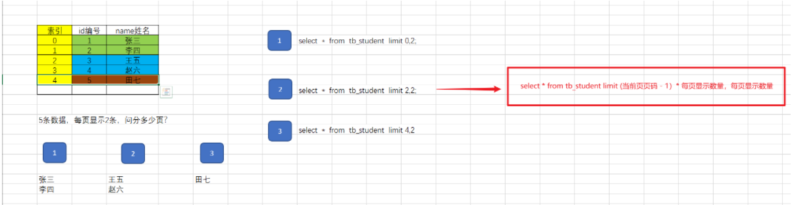

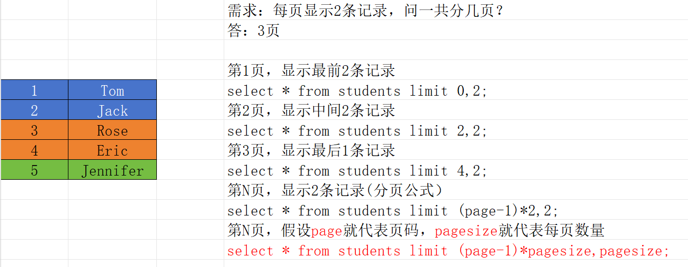

格式：

```sql
SELECT 字段1，字段2... FROM 表名 LIMIT M,N
M: 整数，表示从第几条索引开始，计算方式 （当前页-1）* 每页显示条数
N: 整数，表示每页显示条数
SELECT 字段1，字段2... FROM 表明 LIMIT 0,5
SELECT 字段1，字段2... FROM 表明 LIMIT 5,5
```

## 小结

```sql
SQL查询五子句分别为：（where子句）、（group by子句）、（having子句）、（order by子句）、（limit子句）

----------------------------------------------------------------------
条件查询：select *|字段名 form 表名 where 条件；
聚合查询函数：count()，sum()，max()，min()，avg()。
分组查询：SELECT 字段1,字段2… FROM 表名 GROUP BY 分组字段 HAVING 分组条件;
排序查询：SELECT * FROM 表名 ORDER BY 排序字段 ASC|DESC;
分页查询：
SELECT 字段1，字段2... FROM 表名 LIMIT M,N
M: 整数，表示从第几条索引开始，计算方式 （当前页-1）*每页显示条数
N: 整数，表示查询多少条数据
```

## 综合练习

```properties
1. 创建一个数据库demo999,字符编码为utf8(如果数据库不存在，你再创建，存在就别创建)

2. 在demo999数据库中创建一张emp表，字段如下：
id：主键、自增
name：字符串，不能为空
sex：枚举类型，只能是男、女、保密，默认是保密
age：微整型
birthday：日期类型
salary：decimal(7,2)
dept：部门
major：专业
idcard：身份证号，唯一约束

3. 插入一些数据
人事部、财务部、开发部，  计算机科学、软件工程、财务管理
(null, "刘备", "男", 25, "2020-05-05", 8000, "人事部", "计算机科学", "123456");
(null, "刘备", "男", 25, "2020-05-05", 8000, "人事部", "计算机科学", "123456");
(null, "刘备", "男", 25, "2020-05-05", 8000, "人事部", "计算机科学", "123456");
(null, "刘备", "男", 25, "2020-05-05", 8000, "人事部", "计算机科学", "123456");
(null, "刘备", "男", 25, "2020-05-05", 8000, "人事部", "计算机科学", "123456");

4. 查询年龄等于25岁的员工的id、name、age信息

5. 查询薪资大于8000的并且部门是财务部的员工信息

6. 查询年龄小于30岁并且部门是人事部且工资大于10000的员工信息

7. 查询专业是计算机科学、财务管理的学生信息

8. 查询姓张的员工的名字及其薪资

9. 查询名字中包含"空"，并且薪资介于8000到10000之间的员工信息

10. 查询"李某"的员工信息，并且显示薪资的时候给薪资加上1000显示

11. 查询没有部门的员工信息

12. 查询每个部门中年龄最大的分别是多少？

13. 统计每个专业中薪资最低的分别是多少？

14. 计算年龄大于28岁，每个部门的人数是多少？

15. 查询薪资介于3000-8000之间，并且性别为男的 各个 专业的平均薪资

16. 统计各个部门的薪资的平均值，将薪资平均值大于8000的给显示出来，并且按照降序显示

17. 查询所有员工中，薪资最高的3名员工的信息

18. 查询年龄介于25-30，部门是人事部、财务部中薪资最低的2名员工信息

19. 修改id=3的数据，将其性别改为男，薪资改为9000，年龄在现有基础上+5岁！

20. 修改部门是财务部，薪资大于12000的员工信息，将他们的性别改为女

21. 删除专业是计算机科学，并且性别为男，生日是在2010年及以后的员工信息

22. 删除表中所有的数据
```

# 七、多表查询（重点）

## 表与表之间的关系

在 SQL 语句中，数据表与数据表之间，如果存在关系，一般一共有3种情况：

① <font style="color:rgb(216,57,49);">1：1，一对一关系（高级）</font>

比如有A、B两张表，A表中的每一条数据，在B表中有一条唯一的数据与之对应。

用户表 user

| user\_id（用户编号） | 账号username | 密码password |
| --- | --- | --- |
| 001 | zhangsan | 888888 |
| 002 | lisi | 123456 |

用户详情表 user\_items

| user\_id（用户编号） | 真实姓名 | 年龄 | 联系方式 |
| --- | --- | --- | --- |
| 001 | 张三 | 16 | 10086 |
| 002 | 李四 | 18 | 10010 |

我们把用户表与用户详情表之间的关系就称之为一对一关系。

② <font style="color:rgb(216,57,49);">1：N，一对多关系</font>（<font style="color:rgb(216,57,49);">重点</font>）

比如有A、B两张表，A表中的<font style="color:rgb(216,57,49);">每一条数据</font>，在B表中<font style="color:rgb(216,57,49);">都有多条数据与之对应</font>，我们把这种关系就称之为<font style="color:rgb(216,57,49);">一对多</font>关系

产品分类表

| 分类id编号 | 分类名称 |
| --- | --- |
| 1 | 手机 |
| 2 | 电脑 |

产品信息表

| 产品id编号 | 产品名称 | 产品价格 | 所属分类id编号 |
| --- | --- | --- | --- |
| 1 | Apple iPhone 13 | 6799.00 | 1 |
| 2 | Redmi Note 9 | 3499.00 | 1 |

我们把产品分类表与产品表之间的关系就称之为一对多关系。

③ <font style="color:rgb(216,57,49);">M：N，多对多关系</font>（<font style="color:rgb(216,57,49);">高级</font>）

用户表

| 用户编号 | 登录账号 | 登录密码 |
| --- | --- | --- |
| 1 | zhangsan | 888888 |
| 2 | lisi | 123456 |

权限表

| 权限id编号 | 权限名称 |
| --- | --- |
| 1 | 增加 |
| 2 | 删除 |
| 3 | 修改 |
| 4 | 查询 |

虽然从以上图解来看，两者之间好像没有任何联系，但是两者之间其实是有关系的，这种关系需要通过一张临时表进行呈现。

每个用户，应该有对应的权限，zhangsan 账号可以做增删改查，lisi 账号可以做查询

反过来

每个权限都应该对应多个用户，查询权限 => zhangsan/lisi

<font style="color:rgb(216,57,49);">注意：如果两张表之间的关联关系为多对多关系，则必须建立一个中间表，在中间表中体现两者的关系。</font>

<font style="color:rgb(216,57,49);">中间表 ：用户\_权限表</font>

| 用户id编号 | 权限的id编号 |
| --- | --- |
| 1（zhangsan） | 1（增加） |
| 1 | 2（删除） |
| 1 | 3（修改） |
| 1 | 4（查询） |
| 2 | 4（查询） |

## 交叉连接(了解)

准备数据集：

```sql
-- 1. 准备数据集
-- 数据表classes，拥有两个字段，cls_id代表班级编号，cls_name代表班级名称
use db_lhp;
drop table classes;
create table classes(
    cls_id int,
    cls_name varchar(20)
) default charset=utf8mb4;

-- 插入数据，ui、java、python
insert into classes values
(1, 'UI'),
(2, 'Java'),
(3, 'Python');

-- 数据表students，拥有id、name、age、gender值使用male和female、score、cls_id
drop table students;

create table students(
    id int,
    name varchar(20),
    age int,
    gender enum('male', 'female'),
    score decimal(11,2),
    cls_id int
) default charset=utf8mb4;

-- 插入数据，刘备属于Java，貂蝉属于UI，赵云属于Python，关羽属于Python，大乔属于UI
insert into students values
(1, '刘备', 18, 'male', 100.00, 2),
(2, '貂蝉', 18, 'female', 99.00, 1),
(3, '赵云', 18, 'male', 98.00, 3),
(4, '关羽', 18, 'male', 96.00, 3),
(5, '大乔', 18, 'female', 97.00, 1);
```

<font style="color:rgb(216,57,49);">没有意义，但是它是所有连接的基础</font>。其功能就是将表1和表2中的每一条数据进行连接。

结果：

字段数 = <font style="color:rgb(216,57,49);">表1字段 + 表2的字段</font>

记录数 = <font style="color:rgb(216,57,49);">表1中的总数量 \* 表2中的总数量</font>（笛卡尔积）

交叉连接也称之为笛卡尔积连接

```sql
select * from students cross join classes;
或
select * from students, classes;
```

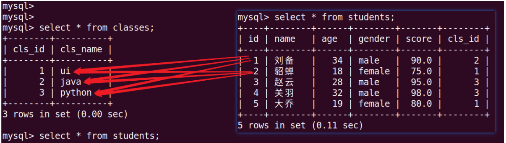

## 内连接（重点）

### 连接查询的介绍

连接查询可以实现多个表的查询，当查询的<font style="color:rgb(216,57,49);">字段数据</font>来自不同的表就可以使用连接查询来完成。

连接查询可以分为:

1. <font style="color:rgb(216,57,49);">内连接查询</font>
2. <font style="color:rgb(216,57,49);">左外连接查询</font>
3. <font style="color:rgb(216,57,49);">右外连接查询</font>
4. <font style="color:rgb(216,57,49);">自连接查询（自己关联自己）</font>

### 内连接查询

查询两个表中符合条件的共有记录


**内连接查询语法格式: inner join ... on 关联条件**

```sql
select 字段 from 表1 inner join 表2 on 表1.字段1 = 表2.字段2
```

**说明:**

* inner join 就是内连接查询关键字
* on 就是连接查询条件

**例1：使用内连接查询学生表与班级表，查询每个学生对应的具体班级信息。**

```sql
-- 案例：求每个学生所属的班级信息（学生所有字段 + 班级名称）
select * from students inner join classes on students.cls_id = classes.cls_id;

-- 内连接基础上可以筛选想要的字段
select students.*, classes.cls_name from students inner join classes on students.cls_id = classes.cls_id;

-- 引入表别名机制，数据表名称 [as] 别名
select s.name, s.age, s.gender, c.cls_name from students s inner join classes c on s.cls_id = c.cls_id;

-- 通过换行+缩进提升可读性，inner join on还可以简写为join on
select
  s.name,
  s.age,
  s.gender,
  c.cls_name
from students as s
join classes as c
on s.cls_id = c.cls_id;
```

### 小结

* 内连接使用 inner join .. on .., on 表示两个表的连接查询条件
* 内连接根据连接<font style="color:rgb(216,57,49);">查询条件</font>取出两个表的 “<font style="color:rgb(216,57,49);">交集</font>”，也就是满足关联条件的结果。

## 左外连接

### 左连接查询

> 有一个主表概念，默认情况下，关联后会保留主表的所有记录。

以左表为主根据条件查询右表数据，如果根据条件查询右表数据不存在使用 null 值填充

商品分类表

| 编号 | 分类名称 |
| --- | --- |
| 1 | 手机 |
| 2 | 电脑 |

商品表

| 编号 | 商品名称 | 商品分类编号 |
| --- | --- | --- |
| 1 | Vivo手机 | 1 |
| 2 | Xiaomi手机 | 1 |

左外连接查询：select \* from <font style="color:rgb(216,57,49);">分类表（主表）</font> left join 商品表 on 分类表.编号 = 商品表.分类编号;

| 编号 | 分类名称 | 编号 | 商品名称 | 商品分类编号 |
| --- | --- | --- | --- | --- |
| 1 | 手机 | 1 | Vivo手机 | 1 |
| 1 | 手机 | 2 | Xiaomi手机 | 1 |
| 2 | 电脑 | null | null | null |

<font style="color:rgb(216,57,49);">左外连接默认会保留左表，然后与右边的表进行匹配；如果匹配到，则显示右表对应的数据；匹配不到，也要显示。只不过右表的所有字段使用 null 进行填充！</font>


**左连接查询语法格式:**

```sql
select 字段 from 表1 left join 表2 on 表1.字段1 = 表2.字段2
```

**说明:**

* left join 就是左连接查询关键字
* on 就是连接查询条件
* 表1 是左表
* 表2 是右表

**例1：使用左连接查询学生表与班级表，获取每一学生对应的班级信息，要求没有对应的班级也要显示。**

```sql
-- 使用左连接查询学生表与班级表，获取每一学生对应的班级信息，要求没有对应的班级也要显示。
insert into students values (6, '曹操', 30, 'male', 98, 9);

select s.*,c.cls_name from students s left join classes c on s.cls_id = c.cls_id;
```

### 小结

* 左连接使用 left join .. on .., on 表示两个表的连接查询条件
* 左连接以左表为主根据条件查询右表数据，右表数据不存在使用 null 值填充。

## 右外连接

### 右连接查询

以<font style="color:rgb(216,57,49);">右表为主</font>根据条件查询左表数据，如果<font style="color:rgb(216,57,49);">根据条件查询左表数据</font>不存在则使用 <font style="color:rgb(216,57,49);">null 值</font>填充


**右连接查询语法格式:**

```sql
select 字段 from 表1 right join 表2（主表） on 表1.字段1 = 表2.字段2
```

**说明:**

* right join 就是右连接查询关键字
* on 就是连接查询条件
* 表1 是左表
* 表2 是右表

**例1：使用右连接查询学生表与班级表:**

```sql
-- 查看班级中对应的学生信息，如果某个班级没有对应的学生也要显示。（既可以用左外连接也可以用右外连接）
select s.*,c.cls_name from students s right join classes c on s.cls_id = c.cls_id;
select s.*,c.cls_name from classes c right join students s on c.cls_id = s.cls_id;
```

### 小结

* 右连接使用 right join .. on .., on 表示两个表的连接查询条件
* 右连接以右表为主根据条件查询左表数据，左表数据不存在使用 null 值填充。

## 自连接查询(扩展)

自连接查询：<font style="color:rgb(216,57,49);">数据表自己连接自己</font>，本质只有1张数据表，表内部数据有层级关系。

前提：<font style="color:rgb(216,57,49);">连接操作时必须为数据表定义别名！</font>

左表和右表是同一个表，根据连接查询条件查询两个表中的数据。

两个实际的工作场景：求<font style="color:rgb(216,57,49);">省市区</font>信息，求<font style="color:rgb(216,57,49);">分类导航</font>信息

<font style="color:rgb(216,57,49);">① 省份表 + 城市表 + 区域表（理论，实际设计表的过程中，通常只有1张数据表）</font>

<font style="color:rgb(216,57,49);">② 大类 + 中类 + 小类（理论，实际设计表的过程中，通常只有1张数据表）</font>

***

地域：title

pid 全称 <font style="color:rgb(216,57,49);">parent id</font>（父级ID编号），如果pid值为null代表本身就是父级，如果pid是一个具体的数值，则代表其属于子级

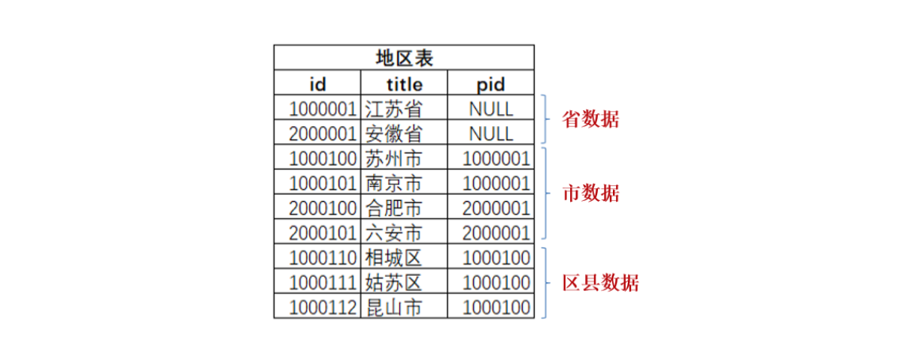

**例1：查询省的名称为“广东省”的所有城市**

**创建 areas 表:**

```sql
use db_lhp;
create table areas(
    aid int not null AUTO_INCREMENT,
    atitle varchar(20),
    pid int,
    primary key(aid)
) default charset=utf8;
```

**执行 sql 文件给 areas 表导入数据:**

```sql
insert into areas values (null, '广东省', null),(null, '山西省', null),(null, '深圳市', 1), (null, '广州市', 1), (null, '太原市', 2), (null, '大同市', 2);
```

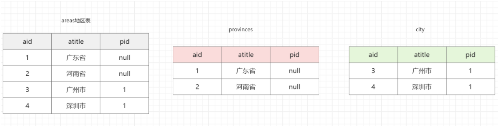

**自连接查询的用法:**

```sql
-- 第一步：把两张表关联查询（内连接）
select * from areas p inner join areas c on p.aid = c.pid;

-- 第二步：在以上查询基础上，获取省份名称为广东省
select * from areas p inner join areas c on p.aid = c.pid where p.atitle = '广东省';

-- 第三步：只显示城市信息
select c.* from areas p inner join areas c on p.aid = c.pid where p.atitle = '广东省';
```

**说明:**

* 自连接查询必须对表起别名

### 小结

* 自连接查询就是把一张表模拟成左右两张表，然后进行连表查询。
* 自连接就是一种特殊的连接方式，连接的表还是本身这张表

# 八、子查询（了解）

## 子查询（嵌套查询）的介绍

在一个 select 语句中，<font style="color:rgb(216,57,49);">嵌入了另外一个 select 语句</font>，那么被嵌入的 select 语句称之为<font style="color:rgb(216,57,49);">子查询语句</font>，外部那个 select 语句则称为<font style="color:rgb(216,57,49);">主查询语句。</font>

<code>select * from (<font style="color:rgb(216,57,49);">select * from xxx)</font> as t;</code>

```
			子查询
```

主查询

作用：子查询比较适合复杂查询以及多层级查询结构。

**主查询和子查询的关系:**

1. 子查询是<font style="color:rgb(216,57,49);">嵌入</font>到主查询中
2. 子查询是辅助主查询的，要么充当<font style="color:rgb(216,57,49);">条件</font>，要么充当数据源(<font style="color:rgb(216,57,49);">数据表</font>) => 要么出现在 where，要么出现在 from 位置
3. 子查询是可以<font style="color:rgb(216,57,49);">独立存在</font>的语句，是一条完整的 select 语句

了解：子查询的应用场景

答：在我们需求的基础上，如果这个需求需要通过多条 SQL 语句<font style="color:rgb(216,57,49);">分步查询</font>的情况，一般都需要基于<font style="color:rgb(216,57,49);">子查询</font>。

## 子查询的使用（三步走）

数据集：

```sql
-- 1. 准备数据集
drop table student;

-- 创建student学生表，包含id、name、age、gender、score
create table student(
    id int,
    name varchar(20),
    age int,
    gender enum('male', 'female'),
    score decimal(11,2)
) default charset=utf8mb4;

-- 插入7条测试数据
insert into student values
(1, '张三', 18, 'male', 100.00),
(2, '李四', 19, 'male', 99.00),
(3, '王五', 20, 'male', 98.00),
(4, '赵六', 22, 'male', 97.00),
(5, '钱七', 24, 'male', 96.00),
(6, '孙八', 30, 'male', 95.00),
(7, '周九', 26, 'male', 94.00);
```

**例1. 查询学生表中大于平均年龄的所有学生:**

需求：查询年龄 > 平均年龄的所有学生

前提：① 获取班级的平均年龄值

② 查询表中的所有记录，判断哪个同学 > 平均年龄值

第一步：写子查询

```sql
select avg(age) from students;
```

第二步：写主查询

```sql
select * from students where age > (平均值);
```

第三步：第一步和第二步进行合并

```sql
select * from students where age > (select avg(age) from students);
```

**例2. 查询 goods 产品表中具有分类信息的产品**

数据集：

```sql
create table category(
    cid int,
    cname varchar(20)
) default charset=utf8mb4;

insert into category values
    (1, '手机'),
    (2, '电脑'),
    (3, '图书');

create table goods(
    id int,
    name varchar(20),
    price decimal(11,2),
    cid int
) default charset=utf8mb4;

insert into goods values
    (1, '华为手机', 5000.00, 1),
    (2, '小米手机', 3000.00, 1),
    (3, '苹果手机', 10000.00, 1),
    (4, '华硕电脑', 12000.00, 2),
    (5, '戴尔电脑', 11000.00, 2),
    (6, 'Surface电脑', 13000.00, 2),
    (7, 'Java从入门到放弃',100.00, 3),
    (8, 'HP激光打印机',999.00, 9);
```

需求：查询产品表中具有分类信息的产品（没有与之对应分类信息的产品不显示）

前提：

① 查询分类表中，到底有哪些分类（获取 cid 编号）

② 到产品表中进行判断，判断这个商品的 cid 编号与 ①中的是否相等

第一步：编写子查询

```sql
select cid from category;
```

第二步：编写主查询

```sql
select * from goods where cid in (所有分类cid编号)
```

第三步：把主查询和子查询合并

```sql
select * from goods where cid in (select cid from category);
```

**例3. 查找年龄最小且成绩最高的学生**

注意：<font style="color:rgb(216,57,49);">同时满足以上条件（年龄</font>**<font style="color:rgb(216,57,49);">最小且成绩最高</font>**<font style="color:rgb(216,57,49);">）的数据可能并不存在，此题主要是为了介绍子查询的特殊用法。</font>

第一步：获取年龄最小值和成绩最高值

```sql
select min(age), max(score) from student;
```

第二步：查询所有学员信息（主查询）

```sql
select * from students where (age, score) = (最小年龄, 最高成绩);
```

第三步：把第一步和第二步合并

```sql
select * from student where (age, score) = (select min(age), max(score) from student);
```

> 注：数据表中必须有这样一条记录，否则可能查询不到结果，重点练习子查询返回多个结果情况。

## 小结

子查询是一个<font style="color:rgb(216,57,49);">完整的 SQL 语句</font>，子查询被嵌入到<font style="color:rgb(216,57,49);">一对小括号里面，子查询可以充当条件，也可以充当数据表使用。</font>

掌握子查询编写三步走：<font style="color:rgb(216,57,49);">① 编写子查询 ② 编写主查询并融合伪代码 ③ 伪代码替换为子查询 </font>

# <font style="color:#000000;">九、DCL 用户与权限管理（重点）</font>

## <font style="color:#000000;">创建用户(create user)</font>

注意：MySQL 中不能单纯通过用户名来说明用户，必须要加上主机，如 jack@10.1.1.1

语法

```sql
创建用户设置密码
create user 'user'@'host' identified by 'password';

说明：用户的信息保存在mysql数据库中的user表中，验证用户是否创建成功如下：
select user,host from mysql.user; 

说明：SQL中的点号
select 数据表.字段 from 数据表;
select * from 数据库.数据表;
```

示例

```sql
create user 'tom'@'localhost' identified by '123456';
create user 'harry'@'localhost' identified by '123456';
create user 'tom'@'192.168.88.100' identified by '123456';
create user 'jack'@'%' identified by '123456';
```

用户主机表示方式

```sql
'user'@'localhost'                     表示user只能在本地通过socket登录数据库
'user'@'192.168.0.1'                   表示user用户只能在192.168.0.1登录数据库
'user'@'192.168.0.0/24'                表示user用户可以在该网络任意的主机登录数据库
'user'@'%'                             表示user用户可以在所有的机器上登录数据库;本机为匿名用户
```

## 修改用户(alter user)

使用 `ALTER USER` 语句来修改现有<font style="color:rgb(216,57,49);">用户的信息</font>，如<font style="color:rgb(216,57,49);">更改密码、主机</font>等。

前提：必须要保证账号存在。

修改用户密码

```sql
alter user 'username'@'host' identified by 'new_password';
```

示例

```sql
alter user 'tom'@'localhost' identified by '654321';
```

## <font style="color:#000000;">删除用户(drop user)</font>

语法

```sql
drop user 用户@主机;
```

示例

```sql
删除'user01'@'localhost'用户
mysql> drop user 'user01'@'localhost';

重命名用户名
mysql> rename user 'harry'@'10.1.1.%' to 'harry'@'10.1.1.1';

删除一个匿名用户
mysql> drop user ''@'localhost';

删除mysql中的匿名用户
mysql> delete from mysql.user where user='';
删除root用户从本机::1登录（::1表示IPv6地址）
mysql> delete from mysql.user where user='root' and host='::1';
mysql> flush privileges;

注意：如果tcp/ip登录，服务器端口不是默认3306，则需要加端口号
```

## <font style="color:#000000;">用户权限管理(grant)</font>

本地连接：

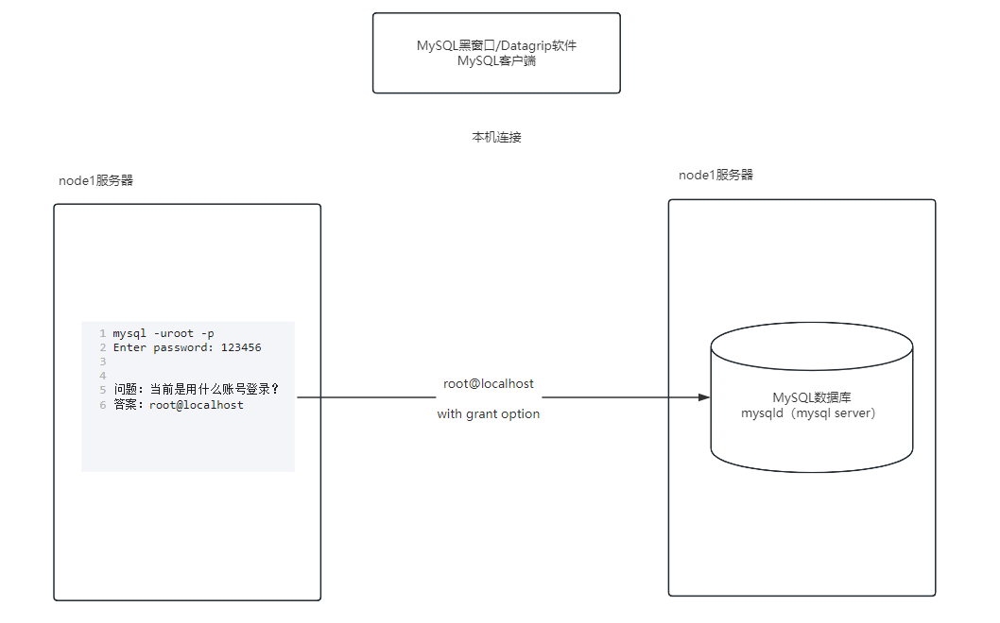

远程连接：

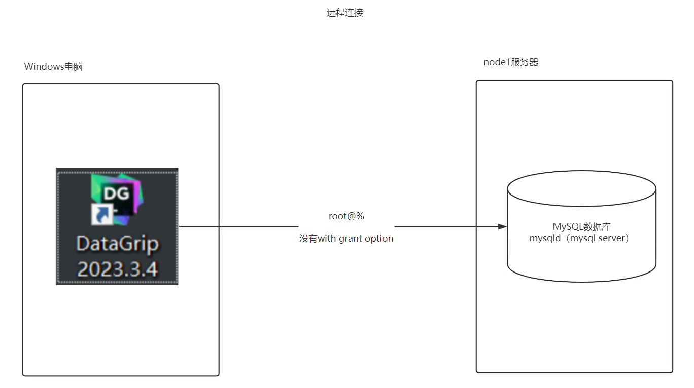

所有权限说明 <https://dev.mysql.com/doc/refman/8.0/en/privileges-provided.html>

```shell
USAGE        无权限,只有登录数据库,只可以使用test或test_*数据库
ALL          所有权限

以下权限为指定权限
select/update/delete/super/replication slave/reload...

with grant option 选项表示允许把自己的权限授予其它用户或者从其他用户收回自己的权限
```

创建一个 admin 管理员（要求回到黑窗口执行，不要在 DataGrip 执行，因为默认 root@% 没有 with grant option 权限）

```shell
create user 'admin'@'%' identified by '123456';
grant all on *.* to 'admin'@'%' with grant option;

注意：分配权限时只能分配<=当前用户的权限，比如当前账号只有insert/delete/update/select，则这个账号只能给其他用户分配insert/delete/update/select。
```

权限保存位置

```shell
mysql.user：记录全局权限（影响所有数据库和表）的用户账号信息。
mysql.db：记录数据库级权限，控制用户对某个数据库（db.*）的操作权限。
mysql.tables_priv：记录表级权限，控制用户对特定表（db.table）的权限。
mysql.columns_priv：记录列级权限，控制用户对特定列（db.table.col）的权限。
mysql.procs_priv：记录存储过程和存储函数的权限，控制用户对存储过程或函数的执行和修改权限。
```

给用户授权

① 语法

```shell
grant 权限1,权限2 on 库.表 to 用户@主机
grant 权限(列1,列2,...) on 库.表 to 用户@主机
```

② 用户授权示例

```sql
给tom@localhost用户授予查看db_lhp库里所有表权限
mysql> grant select on db_lhp.* to 'tom'@'localhost';

刷新权限表
mysql> flush privileges;

给tom@localhost用户授予修改db_lhp库的ID字段的权限
mysql> grant update(id) on db_lhp.student to 'tom'@'localhost';
mysql> flush privileges;

查看当前用户权限
mysql> show grants;

查看指定用户权限
mysql> show grants for 'tom'@'localhost';
```

③ 总结

创建用户方法

* `create user...`<font style="color:rgb(216,57,49);">需要单独 grant 授权</font>
* `grant xxx`<font style="color:rgb(216,57,49);">直接创建用户并授权，添加 with grant option 就可以给其他用户分配小于等于自身的权限了。</font>

## <font style="color:#000000;">回收用户权限</font>

```sql
revoke 权限 on 库.表 from 用户@主机;

撤消指定的权限
mysql> revoke update on db_lhp.student from 'tom'@'localhost';

撤消所有的权限
mysql> revoke all privileges, grant option from 'admin'@'%';
```

工作中使用最多的就是2个功能：① 创建用户 ② grant 分配权限

```sql
create user 'xxx'@'允许访问的主机地址' identified by '密码';
grant all on *.* to 'xxx'@'允许访问的主机地址' with grant option;
```

DDL、DML、DQL、DCL（SQL 体系讲解完毕了！）

# 十、MySQL体系结构（理解）

面试题：MySQL 底层，一条 SQL 语句的执行流程/原理？

答：经过四层，<font style="color:rgb(216,57,49);">分别是连接层（连接池）、服务层（查询缓存、分析器、优化器、执行器）、引擎层、存储层。</font>

索引：相当于以前的汉语词典中的目录

数据：相当于以前的汉语词典中的汉字

没有经过索引的操作，叫做全表扫描

走索引（主键索引、唯一索引、普通索引、前缀索引、联合索引...）

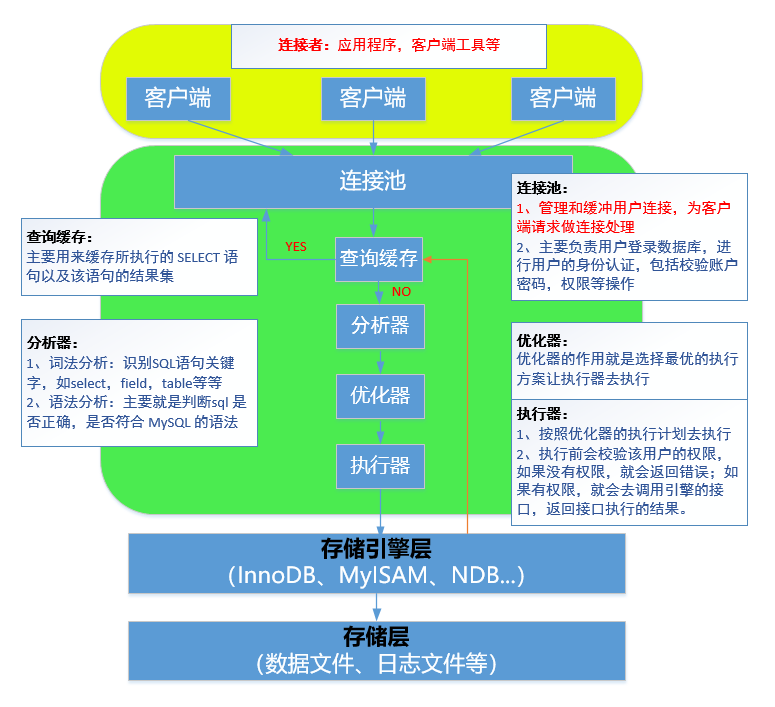

## 客户端(连接者)

* MySQL 的客户端可以是某个客户端软件
* MySQL 的客户端可以是不同的编程语言(Python/Java 等)编写的<font style="color:rgb(216,57,49);">应用程序（DataGrip）</font>
* MySQL 的客户端还可以是一些 <font style="color:rgb(216,57,49);">API 的接口</font>

## 连接层

主要作用：<font style="color:rgb(216,57,49);">管理和缓冲用户连接，为客户端请求做连接处理；身份认证</font>等。

连接层中的**缓存池**，就是为了<font style="color:rgb(216,57,49);">优化数据库连接而设置的机制，专门用来</font>**<font style="color:rgb(216,57,49);">缓存和复用</font>**<font style="color:rgb(216,57,49);">已建立的连接</font>。其主要作用是：

1. **<font style="color:rgb(216,57,49);">减少连接开销</font>**：避免每次新建连接带来的系统负担，提升性能。
2. **<font style="color:rgb(216,57,49);">提升响应速度</font>**：连接池里有现成的连接，随取随用，减少等待时间。
3. **<font style="color:rgb(216,57,49);">优化资源利用</font>**：通过控制最大连接数，防止过多连接耗尽系统资源。

工作流程很简单：创建连接→用完放回池中→再次复用，保持高效循环。

总结就是：连接池通过<font style="color:rgb(216,57,49);">缓存连接，减少开销、加快响应、合理利用资源，让数据库更高效应对高并发</font>。

连接池配置相关参数：

1. **max\_connections**：指定 MySQL 可以同时处理的最大连接数，控制最大连接数目。
2. **wait\_timeout**：定义一个连接在闲置状态下最多可以等待的时间，超过这个时间将被关闭。
3. **thread\_cache\_size**：控制线程缓存池的大小，以缓存空闲线程，避免频繁创建和销毁线程所带来的开销。

> thread\_cache\_size：根据系统并发情况设置，通常可设置为 **CPU 核心数的2倍**，以便高效处理并发请求

## 服务层（核心层）

主要作用：<font style="color:rgb(216,57,49);">接受用户的 SQL 请求，查询分析，权限处理，优化，结果缓存</font>等。

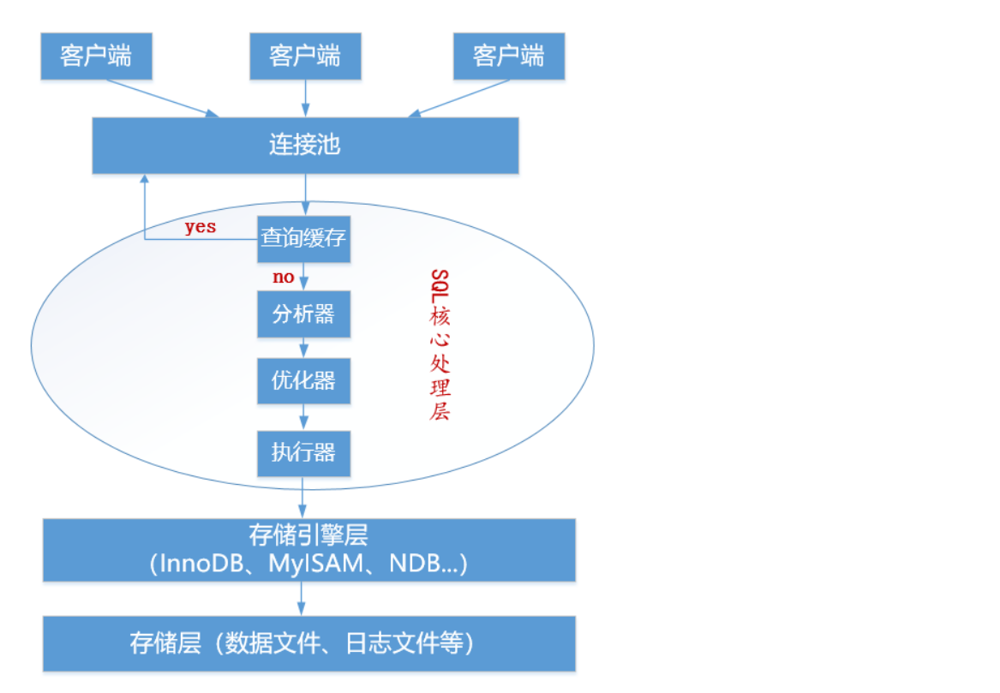

## 引擎层

什么是存储引擎？

* 存储引擎说白了就是 如何<font style="color:rgb(216,57,49);">管理操作数据</font>(存储数据、如何更新、查询数据等)的 一种方法和机制。
* 在 MySQL 数据库中提供了多种存储引擎，<font style="color:rgb(216,57,49);">各个存储引擎的优势各不一样</font> => <code><font style="color:rgb(216,57,49);">show engines</font></code>
* 用户可以根据不同需求为数据表选择不同的存储引擎，也可以根据自己需要编写自己的存储引擎。
* 甚至一个库中不同的表使用不同的存储引擎，这些都是允许的。

常用的存储引擎有哪些？

* 最常用的存储引擎是 InnoDB 和 MyISAM

| 存储引擎 | 描述 |
| --- | --- |
| InnoDB（MySQL5.6版本及以后） | 支持拥有<font style="color:rgb(216,57,49);">ACID特性事务</font>的存储引擎，并且提供<font style="color:rgb(216,57,49);">行级的锁</font>定，支持<font style="color:rgb(216,57,49);">外键</font>、应用广泛。侧重于数据安全，默认引擎 |
| MyISAM（MySQL5.5及之前版本） | <font style="color:rgb(216,57,49);">查询速度快，有较好的索引优化和数据压缩技术</font>；但不支持事务、不支持外键约束。 适用于<font style="color:rgb(216,57,49);">读多写少</font>的应用场景 |
| NDB | 用于MySQL Cluster的集群存储引擎，提供数据层面的高可用性 |
| MEMORY | 存储数据的位置是<font style="color:rgb(216,57,49);">内存</font>，因此<font style="color:rgb(216,57,49);">访问速度最快</font>，但是安全上没有保障。 适合于需要<font style="color:rgb(216,57,49);">快速的访问或临时表</font>。 |
| BLACKHOLE | 黑洞存储引擎，写入的任何数据都会消失，应用于主备复制中的分发主库（中继slave） |

面试：你用过哪些数据库引擎？各自特点？

答：早期 MySQL5.5 版本使用过 MyISAM 引擎，后期 MySQL5.7、MySQL8.0 等等都是使用 InnoDB 引擎，偶尔也了解 MEMORY引擎。

① MyISAM 引擎，<font style="color:rgb(216,57,49);">擅长数据查询，支持较好的索引优化、数据压缩、支持表级锁以及全文索引技术，安全性相对于 InnoDB 略差一些。</font>

索引优化 => 主键索引（图书目录），有索引，查询速度会更快

数据压缩 => 减少存储空间占用

表级锁 => 只能进行表级锁，就是锁表时，要锁定整个数据表，在这个过程中，这个表只能进行查询操作，而不能进行增删改等操作，但是粒度太大，对并发有一定的影响。

全文索引 => 从一篇文章中搜索指定内容，类似模糊查询，更加强大一些。

② InnoDB 引擎，<font style="color:rgb(216,57,49);">擅长数据安全，支持行级锁，支持事务处理，支持外键约束等等，强调安全性。</font>

行级锁 => 只会对某一行进行锁定，不会全表锁定，粒度更细，并发能力更强。

事务处理 => 一种数据安全策略，保证数据安全

外键约束

③ Memory 引擎，<font style="color:rgb(216,57,49);">擅长数据缓存，加快数据查询，但是由于数据放置于内存，所以安全性没有 MyISAM 以及 InnoDB 好。</font>

***

扩展：InnoDB 事务处理

<font style="color:#000000;">应用场景：银行转账（最典型）</font>

<font style="color:#000000;">我的银行卡：0.10</font>

<font style="color:#000000;">张三的银行卡：2000.00</font>

<font style="color:#000000;">发生一系列操作：① 张三发起转账，扣款1000，余额-1000 ② 银行接收任务，处理（ATM） ③ 我的银行卡接收到1000，余额+1000</font>

***

update bank set money=money-1000 where name = "李文凯"

ATM停电了

update bank set money=money+1000 where name = "我"

***

操作步骤：事务处理配合 Python/Java 程序一起使用，就是把所有要执行的 SQL 语句当做一个整体，要么全部成功，要么全部失败。

① 开启事务处理功能 => <font style="color:rgb(216,57,49);">start transaction;</font>

② 执行一系列的 SQL 语句（多条）

update bank set money=money-1000 where name = "李文凯"

update bank set money=money+1000 where name = "我"

③ 判断 SQL 语句是否全部执行成功，如果成功则提交事务 =><font style="color:rgb(216,57,49);"> commit; </font>失败，则回滚事务 => <font style="color:rgb(216,57,49);">rollback;</font>。

## 存储层（物理层）

核心作用：<font style="color:rgb(216,57,49);">物理层负责与底层的操作系统交互，将数据存储到磁盘上，并确保数据的物理安全</font>。

默认存储在 /export/server/mysql/data 数据目录下

**工作方式**：

* <font style="color:rgb(216,57,49);">将数据以物理文件的形式存储在磁盘上（如表空间文件、数据文件、日志文件等）。</font>
* <font style="color:rgb(216,57,49);">通过文件系统与操作系统进行交互，管理数据的读写、缓存、索引文件等。</font>

## MySQL 体系结构总结

* MySQL 体系结构分为哪几层？四层
* 每一层是如何工作的？
* MySQL8.0 版本以后默认的存储引擎是哪个？有什么特点？除了这种引擎，你还了解哪些其他引擎？（至少说出2-3种）

扩展：生产环境下，MySQL 到底应该如何配置呢？

答：这里所谓的配置主要是针对 /etc/my.cnf（MySQL 优化、处理等等都是由 my.cnf 决定的）。

# 十一、查询性能监控与分析（重点）

## 启动慢查询日志（重点）

SQL 语句：执行过程中，有快有慢，找出慢查询 SQL。

**作用**：<font style="color:rgb(216,57,49);">慢查询日志</font>记录了<font style="color:rgb(216,57,49);">所有执行时间超过设定阈值的查询</font>，帮助你发现需要优化的慢查询 SQL 语句，辅助优化。

**如何启用**：

```sql
vim /etc/my.cnf
[mysqld]
# 开启慢查询日志
slow_query_log=1
# 指定慢查询日志文件存放路径
slow_query_log_file=/export/server/mysql/logs/mysql-slow.log
# 设置超过 1 秒的查询被记录
long_query_time=1
# 记录未使用索引的查询（可选）
log_queries_not_using_indexes=0
```

```sql
mkdir /export/server/mysql/logs
touch /export/server/mysql/logs/mysql-slow.log
chown -R mysql.mysql /export/server/mysql
```

重启 mysql

```sql
systemctl restart mysqld
```

**分析日志**：慢查询日志可以显示查询的执行时间、锁等待时间、以及查询的详细内容。分析日志后，优化这些慢查询是提升性能的首要任务。

添加 200 万条数据到数据表中，做测试（不要求掌握以下，只是为了做测试）

> SQL 高级：类似 Python/Shell 代码，支持 if 结构、循环结构以及函数或者存储过程等等。
>
> 利用 AI 大模型生成一个存储过程， Prompt 提示词：传入表结构，根据 simple\_table 表结构，编写一个存储过程，循环向数据表中插入 200 万条测试数据。

```sql
CREATE TABLE simple_table (
    id INT AUTO_INCREMENT PRIMARY KEY,
    name VARCHAR(50),
    age INT
);

DROP PROCEDURE InsertData;
-- 存储过程
DELIMITER //
CREATE PROCEDURE InsertData()
BEGIN
    DECLARE i INT DEFAULT 1;
    START TRANSACTION;
    WHILE i <= 4000000 DO
        INSERT INTO simple_table (name, age)
        VALUES (CONCAT('User', i), FLOOR(18 + (RAND() * 42)));
        SET i = i + 1;
    END WHILE;
    COMMIT;
END //
DELIMITER ;

-- 调用存储过程
CALL InsertData();
```

> 执行上面的存储过程，可能得需要 3-5 分钟。

做一个查询，然后查看效果（在 MX 客户端中进行查询，能看到消耗的时间）

```sql
select * from simple_table where id = 1990000;

可以看到消耗的时间几乎忽略不计，因为我们在id字段上添加了主键索引，那么，根据id条件查询的话速度就很快！
```

```sql
-- 移除自动增长，因为有自动增长的情况，主键无法移除的，因为自动增长所在字段要求必须是一个key索引
alter table simple_table change id id int;
-- 移除主键
alter table simple_table drop primary key;

注意：主键也是索引，可以加快查询
```

然后再次执行查询语句

```sql
select * from simple_table where id = 1990000;

可以看到消耗的时间大于了1秒！本次的查询语句会作为慢查询记录到日志中 /export/server/mysql/logs/mysql-slow.log
```

## 使用 explain 分析执行计划（重点）

简单来说：explain 执行计划就是用于分析一个 SQL 语句如何执行的，核心作用：<font style="color:rgb(216,57,49);">帮助我们提升 SQL 查询效率，加快查询速度。</font>

***

前置知识点：索引优化

学不认识的汉字

传统：一页一页进行查找，如果要查的数据在最后一页，整体要翻一遍 => 全表扫描

索引：给所有的汉字添加一个目录页（拼音、偏旁部首），以后在查找汉字的时候，不是一页一页翻，而是先查找目录页，然后在根据目录页快速定位汉字 => 走索引（索引优化）=> 快速定位我们要查找的内容

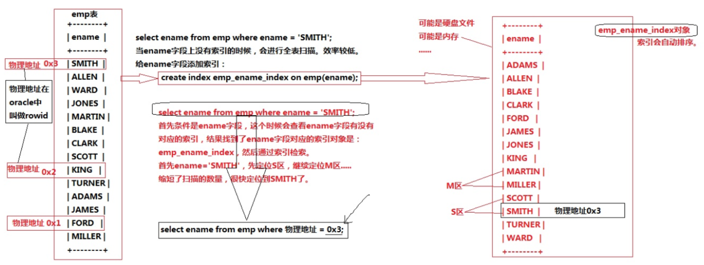

***

什么是 explain？

简单来说，`EXPLAIN` 是用来 **查看数据库如何执行一个 SQL 查询** 的工具。它能告诉你数据库在执行查询时，选择了什么样的操作步骤（比如是扫描整个表还是使用索引等），并且通过这些信息你可以判断查询是否高效。

作用：假设你写了一个 SQL 查询来查询数据，如果查询效率低下（比如很慢），你可能想知道数据库是怎么执行的，找出瓶颈在哪。`EXPLAIN` 就是用来帮你“拆解”查询，了解数据库是如何处理每一步的。

如何使用：

```shell
EXPLAIN SELECT * FROM orders WHERE user_id = 123;
```

**分析重点**：

当你在查询前加上 `EXPLAIN` 时，它会显示一个执行计划的表格，这个表格给出了执行查询时的每一个细节。每一行代表 SQL 查询执行的一部分，通常包含这些信息：

* **id**: 这个数字表示查询的执行顺序。对于复杂的查询，可能会有多个查询步骤，`id` 就帮助你理解它们的顺序。
* **select\_type**: 表示查询的类型，是普通查询还是复杂查询（比如涉及子查询等）。
* **table**: 代表查询是从哪张表中获取数据。
* **<font style="color:rgb(216,57,49);">type</font>**<font style="color:rgb(216,57,49);">: 查询是如何连接数据的。这个字段非常重要，它告诉你查询效率的高低，越高效的查询方式类型通常是 </font><code><font style="color:rgb(216,57,49);">ref</font></code><font style="color:rgb(216,57,49);">、</font><code><font style="color:rgb(216,57,49);">range</font></code><font style="color:rgb(216,57,49);"> 等。</font>
* **<font style="color:rgb(216,57,49);">possible\_keys</font>**<font style="color:rgb(216,57,49);">: 查询可能会使用到哪些索引。索引就像数据的“目录”，使用索引可以加速数据查找。</font>
* **<font style="color:rgb(216,57,49);">key</font>**<font style="color:rgb(216,57,49);">: 实际使用了哪个索引。</font>
* **key\_len**: 使用的索引的长度（表示数据库选择了多长的索引）。
* **ref**: 显示与哪个列进行匹配来获取数据。
* **<font style="color:rgb(216,57,49);">rows</font>**<font style="color:rgb(216,57,49);">: 数据库估算的需要扫描的行数。越少的行数，意味着查询越高效。</font>
* **Extra**: 额外信息，比如是否使用了临时表或者文件排序等。

案例1：

```sql
-- primary key主键索引
-- unique唯一索引
-- key/index普通索引
-- create index 索引名称 on 数据表(字段);
create index student_name_index on student(name);
desc student;
-- 前缀索引：就是一个字段，不需要所有值，只需要把字符值前几个字符取出就能实现数据区分
-- 联合索引：可以针对多个字段建立索引 on 数据表(字段1,字段2)

-- 案例：根据慢查询日志中的SQL使用explain执行计划分析为什么执行缓慢？
-- 没加索引情况
explain select * from simple_table where id = 1990000;
alter table simple_table add primary key(id);
desc simple_table;
-- 添加索引情况
explain select * from simple_table where id = 1990000;
```

没有索引：

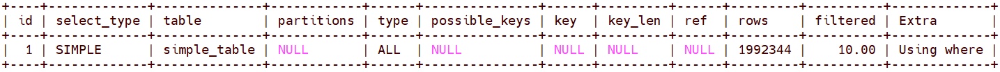

添加了索引：

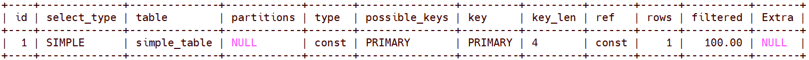

这个输出告诉我们：

* **id**: `1`，表示这是查询的第一步。
* **select\_type**: `SIMPLE`，表示这是一个简单查询，没有复杂的连接操作。
* **table**: `simple_table`，表示查询的数据表是`simple_table`。
* **type**: `const`，表示数据库用的是“常量”的方式来查找数据，这通常比全表扫描（`ALL`）更高效。
* **possible\_keys**: `primary`，表示数据库考虑过使用主键索引。
* **key**: `primary`，表示数据库实际使用了 `primary`主键索引。
* **key\_len**: `4`，表示数据库使用了该索引的 4 字节。
* **ref**: `const`，表示查询使用了常量来查找数据。
* **rows**: `1`，表示数据库预计需要扫描 1 行数据。
* **Extra**: 没有额外的信息。

<font style="color:rgb(216,57,49);">核心列 type 说明：</font>

<code><font style="color:rgb(216,57,49);">type</font></code><font style="color:rgb(216,57,49);"> 列非常关键，它反映了查询的效率。这里列出常见的几种类型，效率从高到低排序：</font>

* **<font style="color:rgb(216,57,49);">const</font>**<font style="color:rgb(216,57,49);">：最优，表示数据库通过常量查找一个行。</font>
* **<font style="color:rgb(216,57,49);">ref</font>**<font style="color:rgb(216,57,49);">：比较高效，表示数据库通过索引查找匹配行。</font>
* **<font style="color:rgb(216,57,49);">range</font>**<font style="color:rgb(216,57,49);">：表示数据库通过范围扫描索引来查找数据。</font>
* **<font style="color:rgb(216,57,49);">index</font>**<font style="color:rgb(216,57,49);">：表示数据库扫描整个索引（但不会读取数据表），效率不如 </font><code><font style="color:rgb(216,57,49);">range</font></code><font style="color:rgb(216,57,49);">。</font>

<font style="color:rgb(216,57,49);">索引=字段目录，数据=记录</font>

* **<font style="color:rgb(216,57,49);">ALL</font>**<font style="color:rgb(216,57,49);">：最差，表示数据库执行了全表扫描，效率最低。</font>

**总结对比**

| **<font style="color:rgb(0, 0, 0);">类型</font>** | **<font style="color:rgb(0, 0, 0);">类比</font>** | **<font style="color:rgb(0, 0, 0);">速度</font>** | **<font style="color:rgb(0, 0, 0);">适用场景</font>** |
| :---: | --- | :---: | :---: |
| <font style="color:#f54a45;">const</font> | <font style="color:rgb(0, 0, 0);">直接翻到指定页码</font> | <font style="color:rgb(0, 0, 0);">最快</font> | <font style="color:#f54a45;">主键/唯一索引的等值查询</font> |
| <font style="color:#f54a45;">ref</font> | <font style="color:rgb(0, 0, 0);">按目录查几个名字</font> | <font style="color:rgb(0, 0, 0);">快</font> | <font style="color:#f54a45;">普通索引的等值查询</font> |
| <font style="color:#f54a45;">range</font> | <font style="color:rgb(0, 0, 0);">按目录查一个连续区间（如 20~30 岁）</font> | <font style="color:rgb(0, 0, 0);">较快</font> | <font style="color:#f54a45;">索引范围查询</font> |
| <font style="color:#f54a45;">index</font> | <font style="color:rgb(0, 0, 0);">扫完整本目录（不读正文）</font> | <font style="color:rgb(0, 0, 0);">较慢</font> | <font style="color:rgb(0, 0, 0);">只需索引字段，不查数据</font> |
| <font style="color:#f54a45;">ALL</font> | <font style="color:rgb(0, 0, 0);">一页一页翻完整本书</font> | <font style="color:rgb(0, 0, 0);">最慢</font> | <font style="color:rgb(0, 0, 0);">无索引或强制全表扫描</font> |

key\_ken 长度说明：

`INT` 类型通常占 4 字节

`VARCHAR(n)` 类型占用的字节数是 `n`（最大长度）

`DATE` 类型占用 3 字节

`CHAR(n)` 类型占用 `n` 字节

***

<font style="color:rgb(216,57,49);">面试题：在运维环境中，发现 MySQL 运行缓慢，如何去解决？</font>

<font style="color:rgb(216,57,49);">答：</font>

<font style="color:rgb(216,57,49);">① 从系统层面，检查系统资源使用情况，如 CPU 负载（top）、检查内存占用（free -h）、检查磁盘空间使用（df -h），因为 mysql 把数据写入到磁盘，读写都涉及磁盘 io（iostat）</font>

<font style="color:rgb(216,57,49);">② 从日志层面，开启慢查询日志，把查询缓慢的 SQL 写入到慢查询日志中，进行捕获</font>

<font style="color:rgb(216,57,49);">③ 从 SQL 语句层面，使用 explain 执行计划分析 SQL 执行过程，是否有走缓存等等，查看具体慢的原因。如果是全表扫描，可以考虑引入索引（如主键索引、唯一索引、普通索引）等等实现优化操作</font>

## 实时监控 SQL 查询

**作用**：`SHOW PROCESSLIST`可以显示<font style="color:rgb(216,57,49);">当前正在执行的 SQL 语句及其状态，帮助你发现正在运行的长时间查询</font>。

注意：适合执行时间较长的 SQL 语句

```sql
SHOW PROCESSLIST;
```

分析重点：

**Command**：表示查询的状态，比如<code><font style="color:rgb(216,57,49);">Query</font></code><font style="color:rgb(216,57,49);">表示正在执行查询</font>，<code><font style="color:rgb(216,57,49);">Sleep</font></code><font style="color:rgb(216,57,49);">表示连接空闲</font>。

**Time**：表示<font style="color:rgb(216,57,49);">查询的执行时间，时间较长的查询可能是性能瓶颈</font>。

**State**：显示当前查询执行的阶段，帮助<font style="color:rgb(216,57,49);">定位查询的卡顿点</font>（如`Copying to tmp table`表示查询在使用临时表）。

> 通过上面实时监控的操作，我们可以监测到目前 MySQL 数据库中是否有正在执行的 sql 查询操作。

## 使用<code><font style="color:rgb(216,57,49);">SHOW PROFILES</font></code>查看查询的详细耗时（重点）

**作用**：`SHOW PROFILES`可以显示最近<font style="color:rgb(216,57,49);">执行的 SQL 查询的执行时间，以及每个阶段的耗时，帮助你了解查询在执行时哪个环节耗时最长。</font>

```sql
SET profiling = 1;                                         -- 开启性能分析（开关）
alter table simple_table change id id int;
alter table simple_table drop primary key;
select * from simple_table where id = 1990000;

SHOW PROFILES;                                             -- 查看所有SQL的执行情况
SHOW PROFILE FOR QUERY 1;                                  -- 查看第一个查询的详细耗时
```

小结：

如果我们想捕获 SQL 语句详细执行以及底层执行过程以及耗时都可以使用(show profiles;)


> 更新: 2026-04-27 08:44:31  
> 原文: <https://www.yuque.com/u41736172/az9urv/tzr9mah4xlbv4np9>