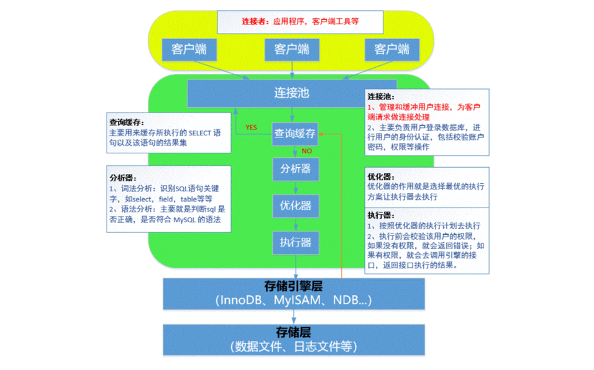
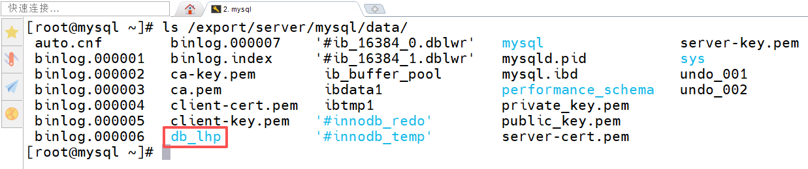
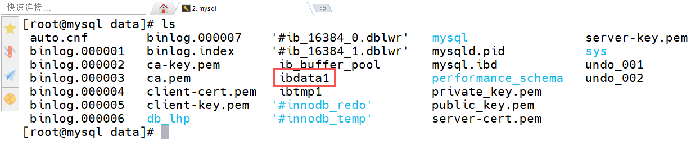
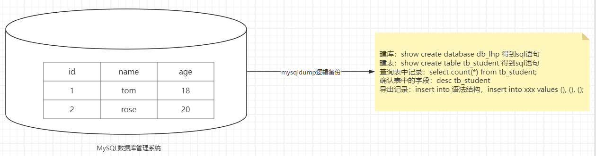
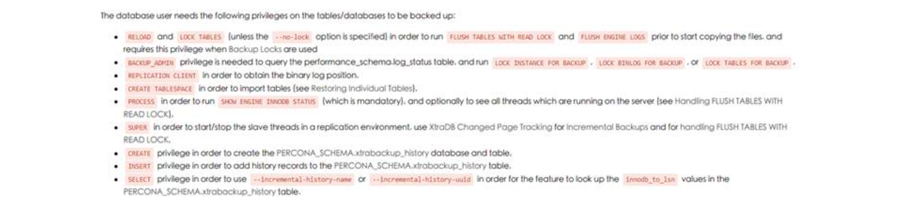
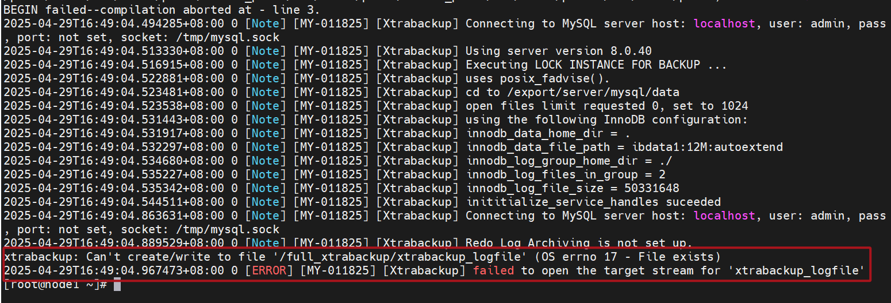
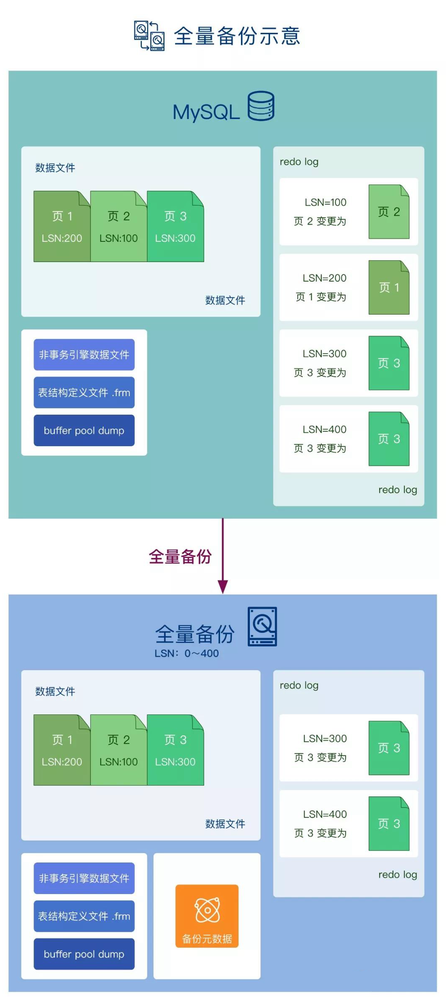
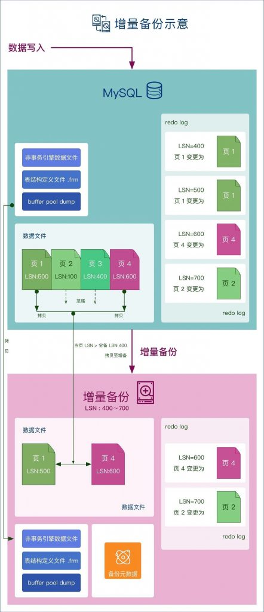
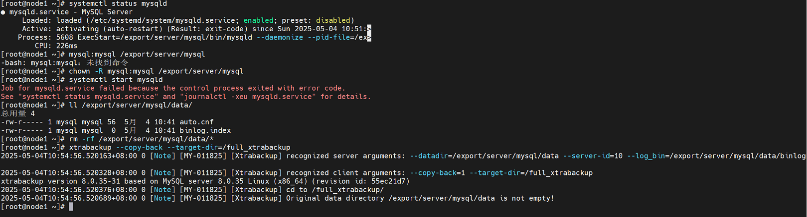
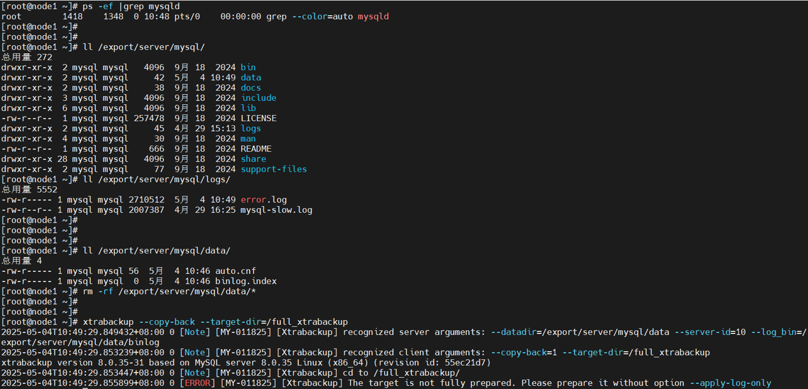

# 03.MySQL数据备份与恢复

# 一、学习目标

## 引言

俗话说"<font style="color:rgb(216,57,49);">手里有粮，心里不慌</font>"，这句话应用在数据库运维领域同样有效。对于重要的数据做好备份，是我们每个系统运维以及数据库运维的重要职责。备份只是一种手段，我们最终目的是<font style="color:rgb(216,57,49);">当数据出现问题时能够及时的通过备份进行恢复。</font>

## 课程目标

* 了解 MySQL 常见的备份方式和类型
* 能够使用 <font style="color:rgb(216,57,49);">mysqldump 工具</font>进行数据库的备份。如<font style="color:rgb(216,57,49);">全库备份，库级别备份，表级别备份</font>
* 能够使用 <font style="color:rgb(216,57,49);">mysqldump 工具+ binlog 日志</font>实现<font style="color:rgb(216,57,49);">增量备份</font>
* 理解 <font style="color:rgb(216,57,49);">xtrabackup 工具</font>实现增量备份的原理和方法
* 能够使用 <font style="color:rgb(216,57,49);">xtrabackup 工具</font>对数据库进行<font style="color:rgb(216,57,49);">全备和增备</font>
* 重点：逻辑备份（mysqldump）+ 物理备份（xtrabackup）

# 二、MySQL 备份与还原

## 什么是数据库备份？

数据库备份是指对数据库中的数据进行复制和存储，以便在数据丢失或损坏时进行恢复。数据库备份通常包括表、记录、索引、配置等关键数据和结构。


## 数据库备份的常用方式

数据库备份的常用方式：<font style="color:rgb(216,57,49);">逻辑备份 与 物理备份</font>

逻辑备份：

**内容**：备份的是数据库的<font style="color:rgb(216,57,49);">结构和数据</font>

**工具**：常用 <code><font style="color:rgb(216,57,49);">mysqldump</font></code>

**特点**：<font style="color:rgb(216,57,49);">可读性强，跨平台，可用于部分恢复和迁移</font>

**场景**：适合中小型数据库

***

物理备份：

**内容**：备份的是<font style="color:rgb(216,57,49);">数据库文件（物理数据文件、日志文件、binlog 二进制日志以及配置文件 my.cnf）</font>

**工具**：常用 <code><font style="color:rgb(216,57,49);">xtrabackup</font></code>

**特点**：<font style="color:rgb(216,57,49);">备份速度快，恢复效率高</font>

**场景**：适合大规模数据库

> binlog：二进制日志，可以手工配置 log-bin，这个日志主要负责把用户<font style="color:rgb(216,57,49);">对数据库的增、删、改等事务型的 SQL 语句记录在 binlog 日志中</font>，方便未来对数据进行查找与恢复！

## 数据库备份核心

数据库：可以简单理解为<font style="color:rgb(216,57,49);">一堆物理文件的集合</font> => 数据文件 + 日志文件 + 配置文件

<font style="color:rgb(216,57,49);">① 数据文件</font>

<font style="color:rgb(216,57,49);">② 配置文件 => my.cnf</font>

<font style="color:rgb(216,57,49);">③ 日志文件（主要是二进制日志文件） => binlog 日志（MySQL8 以后默认开始） => 记录对数据库的增删改操作</font>

## 数据引擎与备份的关系

MySQL 体系结构



### 存储引擎层

存储引擎层：简单来说，就是数据的存储方式。在 MySQL 中，我们可以使用 `show engines` 查看当前数据库版本支持哪些引擎，常见的数据存储引擎：InnoDB、MyISAM 等等

MyISAM 与 InnoDB 引擎的对比表：

| 特性 | MyISAM | InnoDB |
| --- | --- | --- |
| **事务支持** | 不支持 | 支持（ACID特性） |
| **外键支持** | 不支持 | 支持 |
| **锁机制** | 表级锁 | 行级锁 |
| **适用场景** | 读多写少的应用，查询性能好 | 高并发写操作的应用 |
| **崩溃恢复** | 数据损坏风险高，无法自动恢复 | 自动恢复，数据更安全 |
| **存储结构** | 每个表有单独的文件 | 表和索引存储在共享表空间 |
| **性能** | 查询性能较好，但不支持事务处理 | 支持事务处理，写操作性能较高 |

> 面试题：MySQL 中，MyISAM、InnoDB 引擎的区别？

### 数据文件存储

问题：数据库到底是如何保存数据文件的？

```sql
mysql> create database db_lhp default charset=utf8;
```

当数据库创建完毕后，查看 /export/server/mysql/data 文件夹：



### MyISAM 引擎

```sql
mysql> use db_lhp;
mysql> create table tb_user1(id int, name char(1)) engine=myisam default charset=utf8;
```

查看 db\_lhp 目录结构，如下图所示：


MyISAM 引擎：

`*.sdi`=> 表的<font style="color:rgb(216,57,49);">元数据信息</font>，主要用于数据字典管理；<font style="color:rgb(216,57,49);">数据表结构、字段、类型</font>等等

`*.MYI`=> INDEX 索引，主要用于存放 <font style="color:rgb(216,57,49);">索引 </font>文件；

`*.MYD`=> 数据文件，主要用于存储 <font style="color:rgb(216,57,49);">数据 </font>文件；

> 早期 MySQL5.7 及以前版本，没有\*.sdi文件，只有\*.frm文件
>
> 早期 MySQL5.7 及以前版本，我们可以通过 cp *.frm、*.MYI、\*.MYD 这三个文件来实现 MyISAM 引擎表的备份，MySQL8.0 以后引入更多复杂的功能，导致没有办法直接 copy，只能通过物理备份或逻辑备份！！！

### InnoDB 引擎

```sql
mysql> use db_lhp;
mysql> create table tb_user2(id int, name char(1)) default charset=utf8;
```

InnoDB 引擎：




`.ibd`：每个表都会有一个独立的 `.ibd` 文件，存储该表的表数据和索引。

`ibdata1`：用于存储全局的表空间、数据字典和事务日志等。

`redo log 日志文件（ib_logfile0, ib_logfile1 等）`：用于存储事务日志，确保数据一致性和恢复能力。

redo log 配置：

```sql
[mysqld]
innodb_log_file_size = 50M
innodb_log_files_in_group = 2
innodb_log_group_home_dir = /export/server/mysql/data  # redo log 文件存放路径
```

> **对于中等负载的数据库**，`innodb_log_file_size` 可以设置为 50M 到 256M 之间。
>
> **对于高负载数据库**，可以考虑将 `innodb_log_file_size` 设置为 1GB 或更大。

### 不同引擎采用何种备份？

**逻辑备份**：

适用于 <font style="color:rgb(216,57,49);">MyISAM 和 InnoDB</font>，可以通过工具如 <code><font style="color:rgb(216,57,49);">mysqldump</font></code>导出<font style="color:rgb(216,57,49);">表结构和数据为 SQL 语句</font>。备份文件为文本格式，便于跨平台迁移和恢复。

InnoDB 支持事务和外键，备份时需要注意数据一致性，可以用 `--single-transaction` 实现无锁备份。

**物理备份**：

MyISAM：MySQL5.7 及之前版本可以简单复制数据库文件（如 `.frm`、`.MYI`文件、`.MYD` 文件）进行物理备份，MySQL8.0 引入了更多复杂的功能，导致摒弃了这种操作。

InnoDB：物理备份需要包括表数据、日志文件等，适用工具如 `xtrabackup`，确保数据的一致性和完整性，特别是在大规模数据环境下。

# 三、MySQL 逻辑备份


## mysqldump 基本语法

> 强调：mysqldump 不是 SQL 语句，而是一个 MySQL 命令。所以在终端执行！！！

mysqldump 逻辑备份图解：



表级别备份

```sql
mysqldump [OPTIONS] database [tables]
```

库级别备份

```sql
mysqldump [OPTIONS] --databases [OPTIONS] DB1 [DB2 DB3...]
```

全库级别备份

```sql
mysqldump [OPTIONS] --all-databases [OPTIONS]
```

准备一些数据集

```sql
mysql> create database db_lhp default charset=utf8;
mysql> use db_lhp;
mysql> create table tb_student(
  id int not null auto_increment,
  name varchar(20),
  age tinyint unsigned default 0,
  gender enum('male','female'),
  subject enum('ui','java','bigdata','yunwei'),
  primary key(id)
) engine=innodb default charset=utf8;

insert into tb_student values (null,'刘备',33,'male','java');
insert into tb_student values (null,'关羽',32,'male','yunwei');
insert into tb_student values (null,'张飞',30,'male','yunwei');
insert into tb_student values (null,'貂蝉',18,'female','ui');
insert into tb_student values (null,'大乔',18,'female','ui');

mysql> exit;
```

## 表级备份与还原

数据表备份

案例：把 db\_lhp 数据库中的 tb\_student 数据表进行备份

```sql
mkdir /tmp/sqlbak
mysqldump db_lhp tb_student > /tmp/sqlbak/tb_student.sql -p
Enter password:123456
```

数据表还原

```sql
mysql 数据库名称 < .sql文件位置 -p
Enter password:123456
或
mysql -uroot -p
Enter password:123456
mysql> use db_lhp
mysql> source .sql文件的位置
```

案例：对 /tmp/sqlbak/tb\_student.sql 文件进行还原（还原之前需要先将之前的表删除 `drop table tb_student`）

```sql
mysql db_lhp < /tmp/sqlbak/tb_student.sql -p
Enter password:123456
```

确认是否还原成功

```sql
mysql -e "use db_lhp; show tables;" -p
Enter password:123456
```

<code><font style="color:rgb(216,57,49);">mysql -e</font></code>代表在命令行执行 SQL 语句（好处：可以不需要进入 mysql 终端，就可以执行 SQL 语句）

## 库级备份与还原（重点）

备份数据库，包含数据表

```sql
mysqldump --databases db_lhp > /tmp/sqlbak/db_lhp.sql -p
Enter password:123456
```

库级还原

```sql
mysql < .sql文件位置 -p
Enter password:123

或

mysql -uroot -p
Enter password:123
mysql> source .sql文件的位置
```

案例：还原 db\_lhp.sql 文件到 MySQL 数据库

```sql
mysql < /tmp/sqlbak/db_lhp.sql -p
Enter password:123456
```

确认是否还原成功

```sql
mysql -e "show databases;" -p
Enter password:123456
```

***

第一步：备份<font style="color:rgb(216,57,49);">数据库</font>、<font style="color:rgb(216,57,49);">视图</font>以及<font style="color:rgb(216,57,49);">存储过程</font>

比较特殊的情况：数据库中除了数据库、数据表以外，还包含视图、存储过程。

添加视图（虚拟表），<font style="color:rgb(216,57,49);">底层就是一个 SQL 语句（select 查询语句）</font>。作用：<font style="color:rgb(216,57,49);">简化 SQL 查询，保护数据</font>

employee

id name age dept salary薪资

```sql
create view vm_employee as select id,name,age,dept from employee;
```

案例：数据库备份与视图备份

```sql
create view vm_tb_student as select id,name,gender,subject from tb_student;

mysqldump --databases db_lhp > /tmp/sqlbak/db_lhp.sql -p
Enter password:123456

mysql < /tmp/sqlbak/db_lhp.sql -p
Enter password:123456
```

> 备份数据库的时候，会将数据库中的视图也进行备份。

***

添加存储过程（开发需要掌握）：

存储过程类似 Shell 脚本中的函数，相当于把某些功能封装起来。

以后需要使用的时候直接通过`call 存储过程名称()`

procedure ：存储过程

```sql
-- 存储过程
DELIMITER //
CREATE PROCEDURE InsertData()
BEGIN
    DECLARE i INT DEFAULT 1;
    START TRANSACTION;
    WHILE i <= 2000000 DO
        INSERT INTO simple_table (name, age)
        VALUES (CONCAT('User', i), FLOOR(18 + (RAND() * 42)));
        SET i = i + 1;
    END WHILE;
    COMMIT;
END //
DELIMITER ;
```

第二步：备份存储过程（和数据库、视图有所不同，**存储过程需要单独备份**）

```sql
mysqldump --routines --no-create-info --no-data --all-databases > /tmp/sqlbak/backup.sql -p

参数说明：
--routines：包括存储过程和存储函数
--no-create-info：不备份表结构
--no-data：不备份表中的数据
--all-databases：备份所有数据库（如果只备份某个数据库，改成 --databases dbname）
```

案例：备份 db\_lhp 数据库下的存储过程

只备份存储过程

```sql
mysqldump --routines --no-create-info --no-data --databases db_lhp > /tmp/sqlbak/backup.sql -p
```

既想备份数据库、视图还要备份存储过程

```sql
mysqldump --routines --databases db_lhp > /tmp/sqlbak/db_lhp.sql -p
```

答疑：mysqldump 不是只要备份数据库就可以了，为什么还需要备份视图、存储过程呢？

答：虽然我们使用视图、存储过程较少，但是开发人员需要大量使用视图、存储过程等操作，mysqldump 本身只能对数据库以及视图进行备份，如果一个项目中使用了大量的存储过程，在备份过程中，就需要单独备份。

## 全库备份与还原（重点）

在 MySQL 中，如果想使用 mysqldump 进行全库级备份，必须<code><font style="color:rgb(216,57,49);">开启二进制日志</font></code>！！！

开启二进制日志

```sql
vim /etc/my.cnf
添加如下内容：
[mysqld]
在文件最末端追加以下内容：
server-id=10
log_error=/export/server/mysql/logs/error.log
log-bin=/export/server/mysql/data/binlog
```

> mysql8.0 及以后版本，二进制日志默认处于开启状态！

如果 myql 目录下不存在 logs 文件夹，需要提前创建，而且文件拥有者以及所属组必须为 mysql

```sql
mkdir /export/server/mysql/logs
chown -R mysql.mysql /export/server/mysql
```

重启 mysql 数据库

```sql
systemctl restart mysqld
ll /export/server/mysql/data/
binlog.000001
...
```

mysqldump 高级选项说明：

| **常用选项** | **描述说明** |
| --- | --- |
| --flush-logs, -F | 开始备份前刷新日志（二进制日志）binlog.000001 => binlog.000002 |
| --flush-privileges | 备份包含mysql数据库时刷新授权表 => 刷新用户和授权信息 |
| --lock-all-tables, -x | MyISAM一致性，服务可用性（针对所有库所有表） |
| --lock-tables, -l | 备份前锁表（针对要备份的库） |
| --single-transaction | 适用InnoDB引擎，保证一致性，服务可用性 |

案例：全库备份实现

```sql
mysqldump --all-databases --master-data --single-transaction > /tmp/sqlbak/all.sql -p
Enter password:123456

--master-data：在导出文件中标记二进制文件位置，默认为1（只标注，但是标注内容已注释）；如果值为2，则会把二进制文件的位置写入到备份文件中，不注释，主要应用于主从复制。

主服务器 => 定时同步数据 => 从服务器

如果需要备份存储过程，需要添加--routines
mysqldump --routines --all-databases --master-data --single-transaction > /tmp/sqlbak/all.sql -p
Enter password:123456
```

> 注：在 mysqldump 工具中，--single-transaction 选项是一个很有用的功能，它主要用于支持事务的存储引擎（如 InnoDB）。当你使用此选项时，mysqldump 会启动一个单独的事务来转储数据，这样可以在不锁定整个表的情况下获取表的一致性快照。
>
> 在 MySQL 中，大部分使用 InnoDB 引擎，InnoDB 引擎在执行增删改的时候，都会开启事务，执行结束，提交事务，如果失败了，则回滚事务。

案例：全库还原实现

```sql
mysql -e "drop database db_lhp;" -p

mysql < /tmp/sqlbak/all.sql -p
Enter password:123456

mysql -e "show databases;" -p
```

**补充：全库还原只能还原业务相关的业务数据，而不能还原 mysql 系统数据，所以千万不要删 mysql 这些系统数据库，一旦删除，后果自负。**

## 总结

1. mysqldump 工具备份的是 SQL 语句，最终结果是一个 SQL 文件，故备份不需要停服务（<font style="color:rgb(216,57,49);">热备</font>）
2. 使用备份文件 恢复 时，要保证 <font style="color:rgb(216,57,49);">数据库处于运行状态</font>
3. 只能实现<font style="color:rgb(216,57,49);">全库，指定库，表级别的</font> 某一时刻的备份，本身 <font style="color:rgb(216,57,49);">不能增量备份</font>
4. 适用于<font style="color:rgb(216,57,49);">中小型数据库</font>

## <font style="color:#000000;">扩展：mysqldump + binlog 增量备份</font>

<font style="color:#000000;">备份策略：每周会做一次全量备份，以后每天就是增量备份（只备份增加的那一部分数据）</font>

<font style="color:#000000;">周天：全量备份，周一 ~ 周六：增量备份</font>

***

使用 `mysqldump` 进行全量备份，它能帮助我们将整个数据库的当前状态保存下来。但如果数据库不断更新，进行全量备份可能会占用大量的时间和资源。


所以，在这时候我们引入了增量备份，它只备份自上次全量备份以来的变化部分。通过结合全量备份和二进制日志（binlog），我们可以高效地还原出完整的数据状态，这就是 `mysqldump + binlog` 的增量备份还原方案。

什么是增量备份？

增量备份是指在<code><font style="color:rgb(216,57,49);">全量备份</font></code>的基础上，只备份<font style="color:rgb(216,57,49);">自上次备份以来发生变化的数据</font>（<font style="color:rgb(216,57,49);">新增、修改或删除</font>的内容）。相比于全量备份，增量备份的优点在于<font style="color:rgb(216,57,49);">速度更快、占用空间更小</font>，恢复时则需要<font style="color:rgb(216,57,49);">先恢复全量备份</font>，再<font style="color:rgb(216,57,49);">依次应用增量备份</font>文件。增量备份常用于提高备份效率，特别是在数据量大且频繁更新的场景中。


现有数据情况说明：

数据库名称：db\_lhp

客户表名称：tb\_student

增量备份实施步骤：

<font style="color:rgb(216,57,49);">第一步：先准备数据（前提）</font>

<font style="color:rgb(216,57,49);">第二步：开启二进制日志，然后做全量备份（全库备份）=> 1、2、3</font>

<font style="color:rgb(216,57,49);">第三步：继续对数据库进行增删改操作（还未备份）=> 4、5 => 写入到 binlog，然后写入磁盘</font>

<font style="color:rgb(216,57,49);">第四步：突然发生了硬件故障，数据库丢失了</font>

<font style="color:rgb(216,57,49);">第五步：备份二进制日志</font>

<font style="color:rgb(216,57,49);">第六步：恢复全量备份导出的数据（不完整，可能只有90%）+ 根据二进制日志信息导入剩余的10%的数据</font>

> <font style="color:#000000;">binlog 二进制日志：主要用于保存用户对数据库的增删改操作！！！每重启一次数据库，就会生成一份新的 binlog 文件。</font>
>
> <font style="color:#000000;">通过 show master status; 可以查看到目前用的是哪个 binlog 文件了，现在处于哪个位置了。</font>

***

第一步：准备数据集

```sql
mysql> drop database db_lhp;
mysql> create database db_lhp default charset=utf8;
mysql> use db_lhp;

mysql> create table tb_student(
  id int not null auto_increment,
  name varchar(20),
  age tinyint unsigned default 0,
  gender enum('male','female'),
  subject enum('ui', 'java', 'yunwei', 'bigdata'),
  primary key(id)
) engine=innodb default charset=utf8;

insert into tb_student values (null,'刘备',33,'male','bigdata');
insert into tb_student values (null,'关羽',32,'male','yunwei');
insert into tb_student values (null,'张飞',30,'male','yunwei');
insert into tb_student values (null,'貂蝉',18,'female','ui');
insert into tb_student values (null,'大乔',18,'female','ui');
```

第二步：开启二进制以及格式化 binlog 日志输出格式，然后做全量备份

```sql
# vim /etc/my.cnf

[mysqld]
尾部追加内容：
server-id=10
log-bin=/export/server/mysql/data/binlog
# 设置binlog日志存储格式，默认对sql语句进行编码，无法直观查看对应SQL语句
binlog_format=statement
# 设置密码验证插件，从mysql5.7密码验证发生了改变，可能会导致很多客户端无法连接MySQL服务器端
default_authentication_plugin=mysql_native_password


# systemctl restart mysqld
# rm -rf /tmp/sqlbak/*
# mysqldump --routines --single-transaction --flush-logs --master-data --all-databases > /tmp/sqlbak/all.sql -p

--flush-logs 表示刷新日志，其实就是备份完成后，重新生成一个干净的二进制日志，后续的写操作都会记录在最新的二进制日志文件中。
从这个位置开始，后期增删改数据就相当于增量数据，最好单独保存在一个独立的binlog日志文件中，方便后期管理与数据恢复


可以查看目前使用的二进制日志文件
mysql> show master status;
```

备份完成后，一定要确认你最新的二进制文件是哪一个 => 如 binlog.000013

> 注意：--flush-logs 会让系统重新生成一个新的二进制文件，以后增量数据都会写入到新二进制文件

第三步：继续对数据库进行增删改操作

```sql
mysql> insert into tb_student values (null,'小乔',16,'female','ui');
mysql> delete from tb_student where id = 3;

mysql> show master status;
```

突然发生了硬件故障，数据库丢失了

<font style="color:rgb(216,57,49);">情况一：服务器故障，导致数据库异常或丢失</font>

<font style="color:rgb(216,57,49);">情况二：误删或故删（删库到跑路）</font>

```sql
# mysql -e "drop database db_lhp;" -p
Enter password:123456
```

第四步：马上把最新的二进制文件进行备份（其实也就是自从上次全量备份完之后，生成的新的二进制日志文件备份一下）

```sql
# cp /export/server/mysql/data/binlog.000013 /tmp/sqlbak/
```

第五步：先进行全库恢复

```sql
# mysql < /tmp/sqlbak/all.sql -p
Enter password:123456
```

第六步：通过 binlog 增量备份还原数据到 100% => at 157 ~ at 952 => 增量数据

```sql
# mysqlbinlog /tmp/sqlbak/binlog.000013 | less
# mysqlbinlog /tmp/sqlbak/binlog.000013 => 重点找事故的临界点

确认at位置
# mysqlbinlog --start-position=157 --stop-position=952 /tmp/sqlbak/binlog.000013 | mysql -p

或

注：除了按照位置进行恢复，还可以按照时间点进行恢复
# mysqlbinlog --start-datetime="2025-04-28 17:57:11" --stop-datetime="2025-04-28 17:58:35" /tmp/sqlbak/binlog.000013 | mysql -p
```

最后验证数据是否100%恢复

```sql
mysql> use db_lhp;
mysql> select * from tb_student;
```

小结：mysqldump + binlog 增量备份具体作用？

答：

① 可以实现增量备份，周天（全量），周一~周六（增量），减少空间占用，备份恢复速度快

② 防止误删，因为有全量、还有增量，可以对误删数据进行恢复

## 综合案例

1. 周日晚上凌晨 2 点进行全量备份
2. 周一晚上凌晨 2 点进程增量备份
3. 周二晚上凌晨 2 点进程增量备份
4. 周三晚上凌晨 2 点进程增量备份
5. 周四白天的时候出故障了..............
6. 周四晚上凌晨 2 点进程增量备份
7. 周五晚上凌晨 2 点进程增量备份
8. 周六晚上凌晨 2 点进程增量备份

第一步：实现周日晚上凌晨 2 点的全量备份

```properties
rm -rf /tmp/sqlbak/*
mysqldump --routines --single-transaction --flush-logs --master-data --all-databases > /tmp/sqlbak/all.sql -p
```

第二步：周一晚上的凌晨 2 点了，进程增量备份

```properties
# 生成一份新的二进制日志文件
mysql> flush logs;

# 将上一份的二进制日志给复制到备份目录中
cp /export/server/mysql/data/binlog.000013 /tmp/sqlbak/
```

第三步：周二晚上的凌晨 2 点了，进程增量备份

```properties
# 生成一份新的二进制日志文件
mysql> flush logs;

cp /export/server/mysql/data/binlog.000014 /tmp/sqlbak/
```

第四步：周三的白天，我们对数据库又做了改动，但是接下来数据库损坏了！！！！

```properties
cp /export/server/mysql/data/binlog.000015 /tmp/sqlbak/
```

第五步：先恢复周日的全量的数据

```properties
mysql < /tmp/sqlbak/all.sql -p123456
```

第六步：恢复周一的增量的数据

```properties
mysqlbinlog /tmp/sqlbak/binlog.000013 | mysql -p123456
```

第七步：恢复周二的增量的数据

```properties
mysqlbinlog /tmp/sqlbak/binlog.000014 | mysql -p123456
```

第八步：恢复周三的白天的在故障出现的数据。

```properties
mysqlbinlog /tmp/sqlbak/binlog.000015 --stop-position=1131 | mysql -p123456
```

# 四、Xtrabackup 物理备份

区别：物理备份比较适合超大型数据库备份操作，逻辑备份就是把数据导出成一个 .sql 文件，物理备份直接针对物理文件、binlog 二进制日志、/etc/my.cnf 也会进行备份。

## Xtrabackup 概述

Xtrabackup 是一个由 Percona 开发的开源 MySQL 备份工具，旨在提供高性能、低影响的备份和恢复解决方案。

Xtrabackup 可以在线备份 InnoDB、XtraDB 和其他支持 XtraBackup 协议的存储引擎的 MySQL 数据库，而不会锁定表。

Xtrabackup 8 是 Xtrabackup 的一个重要版本，它在前一版本的基础上引入了一些新功能和改进。一些 Xtrabackup 8 的亮点包括：

* 支持 MySQL 8.x：Xtrabackup 8 支持备份和恢复 MySQL 8.x 版本的数据库。
* 并行备份和恢复：引入了并行备份和恢复功能，可以加快备份和恢复速度。
* 支持新的 MySQL 特性：Xtrabackup 8 适配了 MySQL 8.x 中的新功能和改进，如数据字典。
* 改进的故障恢复：在故障恢复方面进行了改进，提高了数据完整性和可靠性。
* 性能优化：对备份和恢复过程进行了性能优化，使其更加高效。
* 支持流式备份和恢复：Xtrabackup 8 支持流式备份和恢复，可以将备份直接发送到另一个服务器，从而简化了备份和恢复的流程。

总的来说，Xtrabackup 8 提供了一种快速、高效、低成本的备份和恢复解决方案，适用于 MySQL 数据库管理员。

## Xtrabackup 优点

* <font style="color:rgb(216,57,49);">支持完全备份和增量备份</font>
* 备份过程<font style="color:rgb(216,57,49);">快速</font>、<font style="color:rgb(216,57,49);">可靠</font>；
* 备份过程不会打断正在执行的事务（<font style="color:rgb(216,57,49);">不停机备份，热备</font>）；
* 能够基于<font style="color:rgb(216,57,49);">压缩</font>等功能<font style="color:rgb(216,57,49);">节约磁盘空间</font>和<font style="color:rgb(216,57,49);">流量</font>；
* 自动实现<font style="color:rgb(216,57,49);">备份检验</font>；
* 还原<font style="color:rgb(216,57,49);">速度快</font>；

官方下载地址：[www.percona.com/](http://www.percona.com/)


大家可以使用资料中提供的安装包。

## Xtrabackup 软件安装

Xtrabackup 工具版本 8.0.35 软件安装：

```sql
# dnf install percona-xtrabackup-80-8.0.35-31.1.el9.x86_64.rpm -y
```

## 创建备份用户并授权

需要的权限：\


<https://docs.percona.com/percona-xtrabackup/8.0/privileges.html>

flush tables with read lock ：锁表

backup\_admin：备份权限

REPLICATION CLIENT：备份时，需要读取二进制文件位置

进入到 MySQL 终端（先登录）：

```sql
mysql> create user 'admin'@'localhost' identified with mysql_native_password by '123';
mysql> GRANT BACKUP_ADMIN, PROCESS, RELOAD, LOCK TABLES, REPLICATION CLIENT ON *.* TO 'admin'@'localhost';
mysql> GRANT SELECT ON performance_schema.log_status TO 'admin'@'localhost';
mysql> GRANT SELECT ON performance_schema.replication_group_members TO 'admin'@'localhost';
mysql> GRANT SELECT ON performance_schema.keyring_component_status TO 'admin'@'localhost';
mysql> flush privileges;

performance_schema.log_status：该表存储有关 MySQL 服务器日志（如错误日志、查询日志、慢查询日志等）的状态信息。授权访问该表，可以使用户查询当前日志的状态信息。

performance_schema.replication_group_members：这个表包含有关 MySQL 复制组成员的信息，尤其是在 MySQL 8.0 及以上版本的组复制（Group Replication）设置中。如果你正在使用组复制，授权访问该表能让用户查看与复制成员相关的状态。

performance_schema.keyring_component_status：该表存储有关 MySQL 加密密钥管理的信息。如果启用了 MySQL 密钥环（Keyring）插件并且配置了加密功能，授权访问此表可以让用户查看密钥环组件的状态。
```

说明：

在数据库中需要以下权限：

RELOAD 和 LOCK TABLES 权限：为了执行 FLUSH TABLES WITH READ LOCK（针对 MyISAM 引擎）

REPLICATION CLIENT 权限：为了获取 binary log 位置

PROCESS 权限：显示有关在服务器中执行的线程的信息（即有关会话执行的语句的信息），允许使用 SHOW ENGINE

## Xtrabackup 全量备份与恢复

Xtrabackup 全量备份原理图：

<https://opensource.actionsky.com/blog/>

作用1：熟悉数据库底层（成为数据库专家）

作用2：分享了很多故障案例，这些案例都可以作为面试中印象比较深刻问题！


凌晨 02:00 开始备份，整个备份需要 30 分钟！

备份开始实际上只备份截止到 02:00 这段时间内的所有数据

问题：02:00 ~ 02:30 这段时间，也可能会有增删改操作 => <font style="color:rgb(216,57,49);">redo log 重写日志中</font>

解决：Xtrabackup 不仅会备份截止到 02:00 这段时间内的所有数据，备份结束，其会把 2:00-2:30 这段时间的重写日志也执行一遍，写入到备份文件中。这样咱们得到的备份数据就是截止到 02:30 的所有内容。

***

Xtrabackup 全量备份实施步骤：

第一步：创建全量备份，使用 `xtrabackup` 创建数据库的全量备份。

第二步：预备阶段，整合备份期间生成的 redo log 日志。

第三步：模拟数据库故障，<font style="color:rgb(216,57,49);">删除数据文件</font>并<font style="color:rgb(216,57,49);">停止 MySQL 服务</font>。

第四步：恢复数据库，使用 <code><font style="color:rgb(216,57,49);">--copy-back</font></code> 命令恢复备份，并确保指定<font style="color:rgb(216,57,49);">数据目录</font>。=> datadir

第五步：更改权限，更改数据目录下文件的所有者和组权限为 <code><font style="color:rgb(216,57,49);">mysql.mysql</font></code>。

第六步：启动 MySQL 并测试，确保还原后的 MySQL 可以正常工作。


具体实施方案：

第一步：创建全量备份

```sql
# xtrabackup --user=admin --password=123 --backup --target-dir=/full_xtrabackup
```

如果报错：

原因1：可能在 /etc 目录下还有 my.cnf 文件，影响了 xtrabackup 的执行。

原因2：xtrabackup 拥有自己的默认配置，默认读取了 /var/lib/mysql/mysql.sock 文件

解决方案：

方案1：把你的套接字文件创建一个软链接，放置于 /var/lib/mysql/mysql.sock 文件中（不推荐）

```sql
# mkdir /var/lib/mysql
# ln -s /tmp/mysql.sock /var/lib/mysql/mysql.sock
```

<font style="color:rgb(216,57,49);background-color:#FBDE28;">方案2：在 xtrabackup 中添加一个 -S 选项，执行套接字（推荐方案二）</font>

```sql
# xtrabackup -S /tmp/mysql.sock --user=admin --password=123 --backup --target-dir=/full_xtrabackup
```

第二步：预备阶段，把备份这段时间内产生的日志整合到全量备份中

```sql
# xtrabackup --user=admin --password=123 --prepare --target-dir=/full_xtrabackup
```

第三步：模拟数据库故障

```sql
# rm -rf /export/server/mysql/data
# systemctl stop mysqld

# 如果以上命令无法停止mysql，可以通过pkill强制杀死进程
# pkill mysqld
```

如果还不能杀死 mysqld 进程，则需要手工重启 Linux 服务器！！！

第四步：快速的恢复数据库中的数据

```sql
# mkdir /export/server/mysql/data
# xtrabackup --copy-back --target-dir=/full_xtrabackup

第一次恢复报错
...
Error: datadir must be specified.
出现以上问题的主要原因在于，xtrabackup 工具无法找到MySQL中的数据目录
```

解决方案：把 my.cnf 配置文件传递给 xtrabackup ，让其自动识别这个文件中的 datadir

```sql
# xtrabackup --defaults-file=/etc/my.cnf --copy-back --target-dir=/full_xtrabackup
```

如果 xtrabackup --copy-back 返回结果为`Completed OK!`，代表数据真正恢复成功

```sql
# ll /export/server/mysql/data
```

第五步：恢复数据时，一定要记得更改 /export/server/mysql/data 目录下的文件拥有者以及所属组权限，否则 mysql 无法启动

```sql
# chown -R mysql.mysql /export/server/mysql/data
```

第六步：启动 MySQL，测试其是否正常

```sql
记得创建.err日志并设置权限为mysql.mysql（这部分可以忽略）
# touch /export/server/mysql/主机名称.err
# chown mysql.mysql /export/server/mysql/主机名称.err
 
# systemctl start mysqld

# mysql -p
Enter password:123456
```

## 常见问题说明

问题1：不喜欢读错误



解决方案：遇到问题时，往前或者往后预读1-2行，往往都能找到问题！！！

问题2：喜欢按照自己想法去修改文件，如 <font style="color:rgb(216,57,49);">/etc/my.cnf </font>文件

```sql
[mysqld]
port=3306
basedir=/export/server/mysql
datadir=/export/server/mysql/data
socket=/tmp/mysql.sock
character_set_server=utf8
collation-server=utf8_unicode_ci
# 开启慢查询日志
slow_query_log=1
# 指定慢查询日志文件存放路径
slow_query_log_file=/export/server/mysql/logs/mysql-slow.log
# 设置超过 1 秒的查询被记录
long_query_time=1
# 记录未使用索引的查询（可选）
log_queries_not_using_indexes=0
server-id=10
log_error=/export/server/mysql/logs/error.log
log-bin=/export/server/mysql/data/binlog
# 设置binlog日志存储格式，默认对sql语句进行编码，无法直观查看对应SQL语句
binlog_format=statement
# 设置密码验证插件，从mysql5.7密码验证发生了改变，可能会导致很多客户端无法连接MySQL服务器端
default_authentication_plugin=mysql_native_password
```

问题3：要确认最终文件以及权限

备份：备份完成后，确认备份目录下有没有生成备份文件，终端有没有提示 Complete Ok!

还原：xtrabackup 软件会到 /etc/my.cnf 中找 datadir 目录，所以必须要有这一行

还原后：我们的 data 文件夹中的所有数据都是 root.root，必须更改为 mysql.mysql，否则 mysqld 无法启动！！！

## Xtrabackup 增量备份与恢复

生产环境下：每周做一次全备（周天），以后每天都是增量（周一~周六）。

***

由于增量备份是在<font style="color:rgb(216,57,49);">全量备份</font>的基础上进行备份，先来做一个全量备份：



讨论1：现在我们开始做一个增量备份，那么如何识别 InnoDB 的哪些数据是增量的？

从全量备份的示意图里，可以看到数据文件中的数据页都有 LSN 号，LSN 可以看做是数据页的<font style="color:rgb(216,57,49);">变更时间戳</font>。

那么通过这个时间戳，就可以识别数据页在全量备份后是否修改过，即通过 LSN 可以识别数据是否是增量的。

***

从下图中，可以看到增量备份时，\*\*<font style="color:rgb(216,57,49);">LSN>400 </font>\*\*的数据页才会进行备份。



讨论2：如果一个数据页原本不是增量范围内的，在增量备份的过程中，数据页更新了，那么增量备份是否会涵盖这个数据页？

这个问题的本质，与全量备份中的数据页新旧不一致的问题相同，解决方案也相同：通过恢复时回放 redo log，解决数据新旧不一致的问题。

也就是说：增量备份过程中，如果数据页被更新了，那数据文件中的这个数据页有可能被拷贝到备份中，也可能没有被拷贝到备份中，但这个更新信息一定会被 redo log 记录，并被记录在备份中。在恢复过程中，redo log 会被”安全地“回放成功，达成数据的新旧一致。

***

下面我们来看看增量备份的流程，如下图：

1. <font style="color:rgb(216,57,49);">先进行全量备份。（周天）</font>
2. 模拟向数据库中添加一些新数据。
3. <font style="color:rgb(216,57,49);">模拟第一次增量备份（周一）</font>
4. 模拟向数据库中添加一些新数据。
5. <font style="color:rgb(216,57,49);">模拟第二次增量备份（周二）</font>
6. 模拟数据库故障
7. <font style="color:rgb(216,57,49);">预备阶段（保存在 xtrabackup），把全量备份期间、增量备份期间产生的事务操作数据合并到备份数据中</font>
8. 马上利用已备份数据进行紧急恢复


第一步：进行全量备份

```sql
# rm -rf /full_xtrabackup/*
# xtrabackup --user=admin --password=123 --backup --target-dir=/full_xtrabackup
```

原因1：可能在 /etc 目录下还有 my.cnf 文件，影响了 xtrabackup 的执行。

原因2：xtrabackup 拥有自己的默认配置，默认读取了 /var/lib/mysql/mysql.sock 文件

解决方案：

<font style="background-color:#FBDE28;">方案：在 xtrabackup 中添加一个 -S 选项，执行套接字</font>

```sql
# xtrabackup -S /tmp/mysql.sock --user=admin --password=123 --backup --target-dir=/full_xtrabackup
```

第二步：全量备份之后增加些数据

```sql
mysql> use db_lhp;
mysql> insert into tb_student values (null,'曹操',35,'male','yunwei');
mysql> insert into tb_student values (null,'典韦',30,'male','java');
mysql> insert into tb_student values (null,'张辽',30,'male','yunwei');
```

第三步：第一次增量备份

查看全量备份的 to\_lsn

```sql
# cd /full_xtrabackup
# cat xtrabackup_checkpoints 
返回结果：
backup_type = full-backuped
from_lsn = 0
to_lsn = 20328125
last_lsn = 20328125
flushed_lsn = 20328125
redo_memory = 0
redo_frames = 0
```

第一次增量备份的命令

```sql
# rm -rf /incre_xtrabackup
# mkdir /incre_xtrabackup
# xtrabackup -S /tmp/mysql.sock --user=admin --password=123 --backup --target-dir=/incre_xtrabackup/inc1 --incremental-basedir=/full_xtrabackup/

说明：
--incremental-basedir：指定本次增量是相对于谁做增量操作，由于是第一次增量备份，所以其一定依赖于上一次的全量备份，指定全量目录，读取lsn，从这个位置开始做增量
```

第四步：第二次增量备份

再次增加些数据

```sql
mysql> insert into tb_student values (null,'许诸',33,'male','java');
mysql> insert into tb_student values (null,'于禁',30,'male','yunwei');
```

第二次增量备份的命令

```sql
# xtrabackup -S /tmp/mysql.sock --user=admin --password=123  --backup --target-dir=/incre_xtrabackup/inc2 --incremental-basedir=/incre_xtrabackup/inc1
```

第五步：模拟数据库故障（还未到周三增量备份，突然出现故障）

```sql
# rm -rf /export/server/mysql/data/*

# systemctl stop mysqld
或
# pkill mysqld

注意：新版本mysql8，引入了保护进程，有的时候pkill不一定能终止mysqld服务。可能需要通过systemctl stop mysqld尝试正常结束或者通过reboot重启计算机来终止mysqld服务
```

第六步：预备阶段：把完全备份、第1次增量备份、第2次增量备份（整合）

```sql
# xtrabackup --prepare --apply-log-only --target-dir=/full_xtrabackup
```

```sql
# xtrabackup --prepare --apply-log-only --target-dir=/full_xtrabackup --incremental-dir=/incre_xtrabackup/inc1
```

```sql
# xtrabackup --prepare --target-dir=/full_xtrabackup --incremental-dir=/incre_xtrabackup/inc2
```

> **<font style="background-color:#FBDE28;">最后一次还原不需要加选项 --apply-log-only</font>**

第七步：恢复数据库数据

```sql
# rm -rf /export/server/mysql/data/*	(这个data目录中的东西，有的同学删除完后，又会自动出来2个文件，一个是auto.cnf文件，一个是binlog.index文件，那么我们可以直接将data目录给干掉，然后再创建一个data目录就好了。这下就不会自动出来文件了)
# xtrabackup --copy-back --target-dir=/full_xtrabackup
# ll /export/server/mysql/data/
total 116772
-rw-r----- 1 root root      157 May  4 10:13  binlog.000022
-rw-r----- 1 root root       14 May  4 10:13  binlog.index
drwxr-x--- 2 root root       28 May  4 10:13  db_lhp
drwxr-x--- 2 root root       20 May  4 10:13  db_test
-rw-r----- 1 root root     8699 May  4 10:13  ib_buffer_pool
-rw-r----- 1 root root 12582912 May  4 10:13  ibdata1
-rw-r----- 1 root root 12582912 May  4 10:13  ibtmp1
drwxr-x--- 2 root root        6 May  4 10:13 '#innodb_redo'
drwxr-x--- 2 root root      143 May  4 10:13  mysql
-rw-r----- 1 root root 27262976 May  4 10:13  mysql.ibd
drwxr-x--- 2 root root     8192 May  4 10:13  performance_schema
drwxr-x--- 2 root root       28 May  4 10:13  sys
-rw-r----- 1 root root 16777216 May  4 10:13  undo_001
-rw-r----- 1 root root 50331648 May  4 10:13  undo_002
-rw-r----- 1 root root      564 May  4 10:13  xtrabackup_info

注意：每个人数据目录数据文件可能有所不同，但是一般像mysql文件夹、binlog日志等等应该都是具备的，而且相对而言，文件可能超过5个！！！
```

创建日志目录以及错误日志

```sql
# mkdir -p /export/server/mysql/logs
# touch /export/server/mysql/logs/error.log
```

由于恢复的数据权限是 root:root，新创建的日志目录以及日志文件权限也是 root:root

设置权限

```sql
# chown -R mysql:mysql /export/server/mysql
```

启动 MySQL 服务

```sql
# systemctl start mysqld
```

查看数据，验证数据恢复情况

```sql
# mysql -uroot -p
Enter password:123456

mysql> use db_lhp;
mysql> select * from tb_student;
```

到此，完成增量备份与恢复！

## 常见问题说明

问题1：MySQL 无法启动

在 MySQL 正常启动时，在 MySQL 终端（mysql>）中，查看错误日志位置。

```sql
SHOW VARIABLES LIKE 'log_error';
```

如果是在 /etc/my.cnf 中配置了 log\_error 则可以通过配置路径查看未启动原因或者通过 journalctl -xe 查看错误信息，大部分是权限或者错误日志不存在或者权限不足。

问题2：查看 xtrabackup 错误日志

xtrabackup 在备份目录会生成日志文件，例如 xtrabackup\_logfile 或 xtrabackup\_checkpoints。可以使用 grep -i error /备份目录 /xtrabackup\_logfile

问题3：尝试准备（--prepare）或恢复时，备份文件损坏。

错误示例：InnoDB: Page checksum mismatch。

解决方案：<font style="color:rgb(216,57,49);">备份可能已损坏，删除全量备份以及增量备份，重新备份（预备阶段出故障，会导致原有备份出现异常，也就是数据损坏了）</font>

<font style="color:rgb(216,57,49);"></font>

问题4：增量备份依赖错误：

<font style="color:rgb(216,57,49);">增量备份的 --incremental-basedir 指向错误或损坏的备份目录。</font>

<font style="color:rgb(216,57,49);">错误示例：xtrabackup: error: failed to read metadata from basedir。</font>

<font style="color:rgb(216,57,49);">解决方案：确认 --incremental-basedir 指向正确的全量或增量备份目录</font>

<font style="color:rgb(216,57,49);"></font>

问题5：重置 xtrabackup

<font style="color:#000000;">重置 xtrabackup，并不是指卸载或重装 XtraBackup 软件，而是清理失败的备份文件、临时文件或状态，确保下次操作干净无干扰。以下是具体步骤：</font>

<font style="color:#000000;">步骤 1：停止正在运行的 XtraBackup 进程</font>

```sql
ps aux | grep xtrabackup
kill -9 xtrabackup的pid号
```

步骤 2：清理失败的备份文件

失败的备份目录可能包含不完整或损坏的文件，需删除：

全量备份失败，删除全量目录

增量备份失败，删除增量目录

**注意**：

* 确保删除的是失败的备份目录，不要误删有效备份。
* 如果备份目录被其他进程占用，检查并终止相关进程

步骤 3：清理 XtraBackup 临时文件

XtraBackup 可能生成临时文件（例如 xtrabackup\_logfile），通常在备份目录中。清理失败的备份目录（如步骤 2）已包含这些文件。若有其他临时文件：

```sql
find /tmp -name "xtrabackup*" -delete
```

问题4：数据恢复时报 /export/server/mysql/data is not empty！



出现以上界面，代表数据恢复没有成功，ll /export/server/mysql/data 目录查看是否有超过5个文件，肯定没有！！！

记住：在备份、预备、还原时只要没有看到 <font style="color:rgb(216,57,49);">complete ok</font>！都代表操作失败了，不要往后继续了，排查问题，然后在继续。

产生以上问题的主要原因：mysqld进程没有结束或者mysql服务器重启，都会导致初始化了几个文件到 /export/server/mysql/data目录，最终这个目录不干净，还存在文件就会导致 Xtrabackup 软件无法正常恢复。

解决方案：

① 进程没有结束

```shell
ps -ef |grep mysqld
kill -9 mysqld进程编号 或者 pkill mysqld
再次确认是否正常结束
ps -ef |grep mysqld
然后手工删除data数据目录
rm -rf /export/server/mysql/data/*
然后在执行xtrabackup数据恢复操作
xtrabackup --copy-back --target-dir=/full_xtrabackup
再次确认数据目录是否产生了超过5个文件
ll /export/server/mysql/data
```

② 进程已经结束，但是数据目录仍有文件，重启 mysqld 服务器，也会产生这个问题

```shell
然后手工删除data数据目录
rm -rf /export/server/mysql/data/*
然后在执行xtrabackup数据恢复操作
xtrabackup --copy-back --target-dir=/full_xtrabackup
再次确认数据目录是否产生了超过5个文件
ll /export/server/mysql/data
```

问题5：The target is not fully prepared. Please prepare is without option --apply-log-only



产生原因：

① 备份之前没有删除 /full\_xtrabackup，也没有删除增量目录 /incre\_xtrabackup，导致新的备份是基于之前备份生成的，最后老的备份和新的备份混合在一起，xtrabackup 无法正确的整合 redo log 日志，导致备份文件有异常。

解决方案：<font style="color:rgb(216,57,49);">必须删除 /full\_xtrabackup 和 /incre\_xtrabackup，从增量备份的第一步，重新进行全量备份以及增量备份。</font>

② 预备阶段，正常只有前面的整合需要添加 --apply-log-only，但是有的小伙伴把所有整合步骤都添加 --apply-log-only，导致最后一次整合数据和预期备份有出入，所以出现异常。

解决方案：<font style="color:rgb(216,57,49);">必须删除 /full\_xtrabackup 和 /incre\_xtrabackup，从增量备份的第一步，重新进行全量备份以及增量备份。</font>

<font style="color:rgb(216,57,49);"></font>

问题6：不理解 --apply-log-only？为什么最后一次整合不需要添加此参数？

<font style="color:rgb(216,57,49);">参考如下知识点补充</font>

## 综合案例

需求：

周日晚上全量备份，周一晚上增量备份，周二白天的时候搞了一大堆数据，然后下午的时候数据库坏了！

怎么办？？？

第一步：准备数据

```properties
# mysql -uroot -p123456

mysql> drop database db_lhp;
mysql> create database db_lhp;
mysql> use db_lhp;
mysql> create table t1(id int primary key auto_increment, name varchar(50));
mysql> insert into t1 values(null, "周日的数据1");
mysql> insert into t1 values(null, "周日的数据2");
```

第二步：周日晚上凌晨 2 点，进行全量备份

```properties
# rm -rf /full_xtrabackup/*
# xtrabackup -S /tmp/mysql.sock --user=admin --password=123 --backup --target-dir=/full_xtrabackup
```

第三步：周一白天改改数据，然后到晚上 2 点的时候进行增量备份

```properties
mysql> insert into t1 values(null, "周一的数 1");
mysql> insert into t1 values(null, "周一的数据2");

# rm -rf /incre_xtrabackup
# mkdir /incre_xtrabackup
# xtrabackup -S /tmp/mysql.sock --user=admin --password=123 --backup --target-dir=/incre_xtrabackup/inc1 --incremental-basedir=/full_xtrabackup/
```

第四步：周二白天的时候，加了几条数据，对数据库做了改动，下午 3 点的时候数据库坏了！！！

```properties
mysql> insert into t1 values(null, "周二的数据1");
mysql> insert into t1 values(null, "周二的数据2");
mysql> update t1 set name='周日的数据1被我在周二白天改了' where id=1;

数据库故障了，有人删库跑路了！！！！
mysql> drop database db_lhp;
```

第五步：先将 data 目录中的编号最大的二进制日志文件保存到一个目录中

```properties
# cp /export/server/mysql/data/binlog.000024 .
```

第六步：停止 MySQL 数据库，然后将 data 目录清空

```properties
# systemctl stop mysqld
# ps aux | grep mysqld

# rm -rf /export/server/mysql/data/*
# ll /export/server/mysql/data/
```

第七步：预备阶段，将增量的备份数据都整合到全量的当中。一定要注意，将最后一个增量备份的东西整合到全量备份中时，不要加 --apply-log-only

```properties
# xtrabackup --prepare --apply-log-only --target-dir=/full_xtrabackup

# xtrabackup --prepare --target-dir=/full_xtrabackup --incremental-dir=/incre_xtrabackup/inc1
```

第八步：将第七步中整合好的数据进行恢复！

```properties
# rm -rf /export/server/mysql/data/*
# xtrabackup --copy-back --target-dir=/full_xtrabackup
# ll /export/server/mysql/data/
```

第九步：修改刚刚备份还原回来的 data 目录中的文件的拥有者、所属组

```properties
# chown -R mysql.mysql /export/server/mysql/data/
```

第十步：启动 MySQL 数据库，查看数据，会发现周日、周一的都没问题，但是没有周二白天的！

```properties
# systemctl start mysqld

mysql> show databases;
mysql> use db_lhp;
mysql> select * from t1;
+----+------------------+
| id | name             |
+----+------------------+
|  1 | 周日的数据1      |
|  2 | 周日的数据2      |
|  3 | 周一的数据1      |
|  4 | 周一的数据2      |
+----+------------------+
```

第十一步：通过二进制日志文件还原周二的数据

```properties
# mysqlbinlog binlog.000024 --stop-position=1239 | mysql -p123456
```

第十二步：检查一下数据是否 100%还原了

```properties
mysql> select * from t1;
+----+---------------------------------------------+
| id | name                                        |
+----+---------------------------------------------+
|  1 | 周日的数据1被我在周二白天改了               	|
|  2 | 周日的数据2                                 |
|  3 | 周一的数据1                                 |
|  4 | 周一的数据2                                 |
|  5 | 周二的数据1                                 |
|  6 | 周二的数据2                                 |
+----+---------------------------------------------+
```

其实，我们使用 xtrabackup 进行全量备份、增量备份，他们在每次备份完之后其实都会重新生成一份最新的二进制日志文件。（其实也就是 flush logs）

## <font style="color:#000000;">xtrabackup 知识点补充</font>

**什么是 --apply-log-only ?**

<font style="color:#000000;">在准备备份时，XtraBackup 需要处理数据库的"日志"（类似于一个记录本，记录了数据库的所有操作）。这个日志包含：</font>

* <font style="color:#000000;">已完成的操作（比如"用户注册成功"）。</font>
* <font style="color:#000000;">未完成的操作（比如"用户正在注册，但还没点提交"）。</font>

<font style="color:#000000;"></font>

**--apply-log-only 的作用:**

<font style="color:#000000;">它告诉 XtraBackup："只把日志里已完成的操作应用到数据库，暂时不要管未完成的操作。"</font>

<font style="color:#000000;">为什么要留着未完成的操作？因为这些操作可能在后面的增量备份里会继续处理（比如"用户终于点提交了"）。</font>

<font style="color:#000000;"></font>

**为什么"除最后一个增量备份外"都要用它？**

<font style="color:#000000;">想象你有以下备份：</font>

<font style="color:#000000;">全量备份（周日）：整个数据库的完整副本。</font>

<font style="color:#000000;">增量备份1（周一）：周日之后的变化。</font>

<font style="color:#000000;">增量备份2（周二）：周一之后的变化。</font>

<font style="color:#000000;">在恢复时，你需要把这些备份合并成一个完整的数据库，就像把一本书的原始版本和所有的修改记录合并成一本新书。</font>

<font style="color:#000000;"></font>

**准备备份的过程**

* <font style="color:#000000;">处理全量备份：</font>
  * <font style="color:#000000;">你先把全量备份（书的原始版本）拿出来。</font>
  * <font style="color:#000000;">里面可能有些未完成的操作（比如"有人在写第5页，但没写完"）。</font>
  * <font style="color:#000000;">你用 --apply-log-only，只把已完成的操作写入书里，留下未完成的操作（因为周一的增量备份可能会继续写第5页）。</font>
* <font style="color:#000000;">处理增量备份1：增量备份1是周一的修改记录（比如"第5页加了几句话"）。</font>
  * <font style="color:#000000;">你还是用 --apply-log-only，把这些修改加到书里，但继续保留未完成的操作（因为周二的增量备份可能还有后续修改）。</font>
* <font style="color:#000000;">处理增量备份2（最后一个）：</font>
  * <font style="color:#000000;">增量备份2是周二的修改记录（比如"第5页终于写完了"），这是最后一个增量备份，没有后续备份了。</font>
  * <font style="color:#000000;">这时候，你不用 --apply-log-only，而是让 XtraBackup 做完整的处理：把所有修改写入书里，并且清理掉未完成的操作（比如把没写完的草稿删掉）。</font>
  * <font style="color:#000000;">结果是一本完整的、正确的书，可以直接拿来用。</font>

<font style="color:#000000;"></font>

**用生活化的比喻**

<font style="color:#000000;">假设你在写一本小说：</font>

* <font style="color:#000000;">全量备份：周日，你把整本小说（草稿）备份了一份。</font>
* <font style="color:#000000;">增量备份1：周一，你改了几页，记录了这些变化。</font>
* <font style="color:#000000;">增量备份2：周二，你又改了几页，记录了更多变化。</font>

<font style="color:#000000;">现在你想把小说恢复到周二的状态：</font>

**处理全量备份**

* <font style="color:#000000;">你拿出周日的草稿，里面有些句子没写完。</font>
* <font style="color:#000000;">用 --apply-log-only，只把写完的句子整理好，留着没写完的句子（因为周一可能接着写）。</font>

**处理增量备份1**

* <font style="color:#000000;">周一的记录说"加了几段"。</font>
* <font style="color:#000000;">还是用 --apply-log-only，把这些段落加进去，但不删没写完的句子（因为周二可能有后续）。</font>

**处理增量备份2**

* <font style="color:#000000;">周二的记录是最后的修改。</font>
* <font style="color:#000000;">不用 --apply-log-only，把所有修改都加进去，并且把没写完的句子清理掉（因为没有后续记录了)。</font>
* <font style="color:#000000;">最后得到一本完整的小说。</font>

<font style="color:#000000;"></font>

**为什么不能一直用 --apply-log-only？**

<font style="color:#000000;">如果一直用 --apply-log-only，未完成的操作（</font><font style="color:rgb(216,57,49);">未提交的事务</font><font style="color:#000000;">）会一直留在备份里。数据库恢复后可能会出现不一致的情况（比如订单记录显示"正在支付"，但实际上没完成）。只有在最后一个增量备份时，XtraBackup 需要"整理干净"（回滚未完成的操作），确保备份是完整的、可以直接用的。</font>

<font style="color:#000000;"></font>

小结：

<font style="color:#000000;">围绕增量备份 => xtrabackup 工具</font>

<font style="color:#000000;">xtrabackup 工具属于</font><font style="color:rgb(216,57,49);">物理备份</font><font style="color:#000000;">，适合</font><font style="color:rgb(216,57,49);">大型及超大型数据库备份</font>

<font style="color:#000000;">增量备份前提必须现有一个（全量备份）=> 依靠谁（</font><font style="color:rgb(216,57,49);">LSN</font><font style="color:#000000;">）来判断这个数据是否为增量？</font>


> 更新: 2026-04-29 08:34:14  
> 原文: <https://www.yuque.com/u41736172/az9urv/ayzwrqiphwc0xzz9>