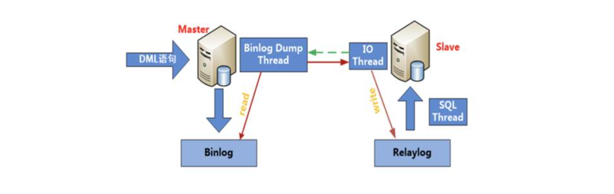
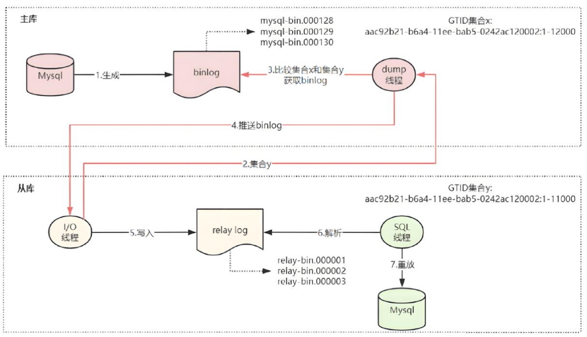

# 04.MySQL主从架构设计

# 一、主从架构概述

## 场景说明

某同学刚入职公司，在熟悉公司业务环境的时候，发现他们的数据库架构是一主两从，但是两台从数据库和主库不同步。询问得知，已经好几个月不同步了，但是每天会全库备份主服务器上的数据到从服务器上，由于数据量不是很大，所以一直没有人处理主从不同步的问题。这次正好问到了，于是乎就安排该同学处理一下这个主从不同步的问题。

> 主服务器对外提供业务数据，负责业务数据的增删改查操作。从服务器默认不对外提供服务，和主服务器一样，都处于长时间运行状态，在运行过程中，从服务器会自动从主服务器拉取并同步数据，提供了一个<font style="color:rgb(216,57,49);">在线热备</font>解决方案。

## 主从架构学习目标

① 熟悉 MySQL 数据库常见的主从架构

② <font style="color:rgb(216,57,49);">理解 MySQL 主从架构的实现原理</font>（背诵、记忆）

③ <font style="color:rgb(216,57,49);">掌握 MySQL 主从架构的搭建</font>（重点掌握）

## 什么是主从复制？

主从复制可以实现将数据从一台数据库服务器（master）复制到一台到多台数据库服务器(slave)

默认情况下，属于<font style="color:rgb(216,57,49);">异步复制</font>，所以无需维持长连接

解决问题：① 数据实时备份 ② 缓解服务器压力（读操作可以分散到slave服务器）=> MyCAT（读写分离软件）

简单来说，master 将数据库的改变写入二进制日志，slave 同步这些二进制日志，并根据这些二进制日志进行数据重演操作，实现数据异步同步。

> 同步复制：从服务器拉取主服务器的数据时，主服务器增删改数据时，从服务器必须马上同步，等待从服务器同步完成后，主服务器才能继续新的事务操作。优点：两端数据高度一致；缺点：阻塞主服务器的事务操作
>
> 异步复制：从服务器拉取主服务器的数据时，主服务器增删改数据时，从服务器可以异步复制，等待空闲时间在进行拉取，在这个过程中，不会阻塞主服务器业务。优点：不会阻塞主服务器的事务操作；缺点：可能会出现主从同步延迟的情况。

## MySQL 复制原理（<font style="color:rgb(216,57,49);">背诵</font>）



> binlog 二进制日志，relaylog 重写日志（负责把主服务器的 DML 在 slave 服务器重写执行一遍）
>
> binlog 保存了<font style="color:rgb(216,57,49);">用户对数据库的增删改事务操作</font>（SQL 语句）、relaylog <font style="color:rgb(216,57,49);">重写日志</font>（中继日志），<font style="color:rgb(216,57,49);">当从服务器从主服务器拉取到二进制日志数据时，会首先写入到 relaylog 重写日志中</font>。

mysqldump --single-transaction --master-data

详细描述：

前提：主服务器开启 binlog 二进制日志，从服务器开启 relaylog 中继日志。

<font style="color:rgb(216,57,49);">① slave 端的 IO 线程发送请求给 master 端的 binlog dump 线程</font>

<font style="color:rgb(216,57,49);">② master 端 binlog dump 线程获取二进制日志信息(文件名和位置信息)发送给 slave 端的 IO 线程</font>

<font style="color:rgb(216,57,49);">③ salve 端 IO 线程获取到的内容依次写到 slave 端 relay log 里，并把 master 端的 bin-log 文件名和位置记录到 master.info 里</font>

<font style="color:rgb(216,57,49);">④ salve 端的 SQL 线程，检测到 relay log 中内容更新，就会解析 relay log 里更新的内容，并执行这些操作，从而达到和 master 数据一致</font>

> <font style="color:#000000;">master：主服务器；slave：从服务器。</font>
>
> <font style="color:#000000;">注：主从复制也是备份的一种，属于在线热备。到这里就学过3种备份了：逻辑备份、物理备份、在线热备。</font>

# <font style="color:#000000;">二、传统主从复制（AB复制）设计</font>

## MySQL 主从复制环境准备

传统 AB 复制架构(M-S)，说明：mysql 数据库，版本为 8.0.40

环境说明：

| IP | 主机名 | 角色 |
| --- | --- | --- |
| 192.168.126.101 | node1.lhp.cn | master(主) |
| 192.168.126.102 | node2.lhp.cn | slave(从) |

安装前准备：① 配置 IP、主机名 ② 配置 IP 与主机映射 => /etc/hosts ③ 关闭防火墙与 SELinux ④ 时间同步 ⑤ 安装必备软件，如vim、wget、rsync

设置主机名称

```shell
hostnamectl set-hostname node1.lhp.cn
hostnamectl set-hostname node2.lhp.cn

su或者bash指令
```

配置 IP 与主机映射

```shell
vim /etc/hosts
尾部追加如下内容
192.168.126.101 node1 node1.lhp.cn
192.168.126.102 node2 node2.lhp.cn
```

关闭防火墙与 SELinux

```shell
systemctl stop firewalld
systemctl disable firewalld

setenforce 0
vim /etc/selinux/config
```

安装一些依赖软件（系统必备软件）

```shell
dnf install vim wget rsync -y
```

时间同步

## 搭建主从复制思路

1. master、slave 必须安装<font style="color:rgb(216,57,49);">相同版本的 mysq</font>l 数据库软件
2. master 端必须开启<font style="color:rgb(216,57,49);">二进制日志</font>；slave 端必须开启 <font style="color:rgb(216,57,49);">relay log 中继日志</font>
3. master 端和 slave 端的 <font style="color:rgb(216,57,49);">server-id </font>号不能一致 => my.cnf => server-id = 10
4. 同步 master 端数据之前，要<font style="color:rgb(216,57,49);">删除 data 数据目录下的 auto.cnf 文件</font> => uuid 编号（每个 mysql 实例都是唯一的）

master => mysql(uuid 编号 => 数据库初始化自动生成) => /export/server/mysql/data/auto.cnf

slave 数据目录是把master中的data同步过来，导致两个 MySQL 共用同一个 uuid 编号

5. slave 端配置向 master 来同步数据
   1. master 端必须创建<font style="color:rgb(216,57,49);">一个复制用户</font>
   2. 保证 master 和 slave 端<font style="color:rgb(216,57,49);">初始数据一致</font>
   3. 配置<font style="color:rgb(216,57,49);">主从复制</font>（slave 端）

## MySQL8 主从复制实践

### 配置 Master 主服务器

既要安装 MySQL 软件，也要初始化 MySQL 数据库

下面的脚本其实就是我们之前安装 MySQL 时的脚本拿过来的。

```shell
#!/bin/bash
#1.安装依赖软件
echo "正在安装依赖软件..."
yum -y install libaio &> /dev/null
if [ $? -ne 0 ];then
    echo "libaio安装失败"
    exit 1
fi
#2.判断是否有压缩包，如果有，则执行解压缩操作
echo "正在判断是否有压缩包，如果有进行解压缩操作..."
if [ -f mysql-8.0.40-linux-glibc2.17-x86_64.tar.xz ]; then
    tar -xf mysql-8.0.40-linux-glibc2.17-x86_64.tar.xz
    ls -l mysql-8.0.40-linux-glibc2.17-x86_64
fi
#3.判断系统中是否安装过mariadb软件，如果有对其进行卸载操作
echo "正在判断系统中是否安装过mariadb软件，如果有对其进行卸载操作..."
rpm -qa | grep mariadb | xargs -r dnf remove -y
[ -f /etc/my.cnf ] && rm -rf /etc/my.cnf
#4.创建mysql系统账号
id mysql &> /dev/null
[ $? -ne 0 ] && useradd -r -s /sbin/nologin mysql
#5.创建/export/server目录，然后移动mysql压缩包解压后的文件到/export/server目录下
rm -rf /export/server
mkdir -p /export/server
mv mysql-8.0.40-linux-glibc2.17-x86_64 /export/server/mysql
#6.进入mysql目录，对其进行初始化操作
echo "正在进入mysql目录，对其进行初始化操作..."
cd /export/server/mysql
bin/mysqld --initialize --user=mysql --basedir=/export/server/mysql --datadir=/export/server/mysql/data 2>&1 | tee /tmp/mysqld.log | grep password | awk '{print $NF}' > /tmp/mysql_temp_password.txt
#7.设置ssl加密传输连接
bin/mysql_ssl_rsa_setup --datadir=/export/server/mysql/data &> /dev/null
#8.设置my.cnf与mysqld.service文件
echo "正在设置my.cnf与mysqld.service文件..."
cat > /etc/my.cnf <<EOF
[mysqld]
port=3306
basedir=/export/server/mysql
datadir=/export/server/mysql/data
socket=/tmp/mysql.sock
character_set_server=utf8
collation-server=utf8_unicode_ci
EOF

cat > /etc/systemd/system/mysqld.service <<EOF
[Unit]
Description=MySQL Server
After=network.target

[Service]
User=mysql
Group=mysql
Type=forking

# MySQL 执行命令及路径
ExecStart=/export/server/mysql/bin/mysqld --daemonize --pid-file=/export/server/mysql/data/mysqld.pid
ExecStop=/export/server/mysql/bin/mysqladmin --defaults-file=/export/server/mysql/my.cnf shutdown

# Ensure MySQL has sufficient time to start up
TimeoutSec=600

# PID 文件路径
PIDFile=/export/server/mysql/data/mysqld.pid

# Enable these options to auto-restart the service if it crashes
Restart=on-failure
RestartSec=5

[Install]
WantedBy=multi-user.target
EOF
#9.刷新后台服务，然后启动mysqld
echo "正在刷新后台服务，然后启动mysqld..."
systemctl daemon-reload
systemctl start mysqld
systemctl enable mysqld
#10.重置mysql管理员密码为123456
echo "正在重置mysql管理员密码..."
cd /export/server/mysql
temp_password=`cat /tmp/mysql_temp_password.txt`
bin/mysqladmin -uroot password '123456' -p$temp_password
#11.把mysql的bin目录添加到环境变量中
echo 'export PATH=$PATH:/export/server/mysql/bin' >> /etc/profile
source /etc/profile
#12.解决mysql客户端首次无法登录问题
[ ! -f /lib64/libncurses.so.5 ] && ln -s /lib64/libncurses.so.6 /lib64/libncurses.so.5
[ ! -f /lib64/libtinfo.so.5 ] && ln -s /lib64/libtinfo.so.6 /lib64/libtinfo.so.5
#13.弹出提示，MySQL安装成功
echo "MySQL安装成功，软件安装路径：/export/server/mysql，数据库初始密码：123456！"
```

具体操作：

1. 上传 MySQL 安装包到 master 服务器
2. 编写脚本文件，粘贴上面的脚本内容
3. 通过 source 命令执行脚本

### 配置 Slave 从服务器

只需要安装 MySQL 软件，不需要初始化也不需要启动 MySQL 软件。

```shell
#!/bin/bash
#1.安装依赖软件
echo "正在安装依赖软件..."
yum -y install libaio &> /dev/null
if [ $? -ne 0 ];then
    echo "libaio安装失败"
    exit 1
fi
#2.判断是否有压缩包，如果有，则执行解压缩操作
echo "正在判断是否有压缩包，如果有进行解压缩操作..."
if [ -f mysql-8.0.40-linux-glibc2.17-x86_64.tar.xz ]; then
    tar -xf mysql-8.0.40-linux-glibc2.17-x86_64.tar.xz
    ls -l mysql-8.0.40-linux-glibc2.17-x86_64
fi
#3.判断系统中是否安装过mariadb软件，如果有对其进行卸载操作
echo "正在判断系统中是否安装过mariadb软件，如果有对其进行卸载操作..."
rpm -qa | grep mariadb | xargs -r dnf remove -y
[ -f /etc/my.cnf ] && rm -rf /etc/my.cnf
#4.创建mysql系统账号
id mysql &> /dev/null
[ $? -ne 0 ] && useradd -r -s /sbin/nologin mysql
#5.创建/export/server目录，然后移动mysql压缩包解压后的文件到/export/server目录下
rm -rf /export/server
mkdir -p /export/server
mv mysql-8.0.40-linux-glibc2.17-x86_64 /export/server/mysql
#6.进入mysql目录，对其进行初始化操作
echo "正在进入mysql目录，从服务器无需进行初始化操作..."
cd /export/server/mysql
#7.设置ssl加密传输连接
bin/mysql_ssl_rsa_setup --datadir=/export/server/mysql/data &> /dev/null
#8.设置my.cnf与mysqld.service文件
echo "正在设置my.cnf与mysqld.service文件..."
cat > /etc/my.cnf <<EOF
[mysqld]
port=3306
basedir=/export/server/mysql
datadir=/export/server/mysql/data
socket=/tmp/mysql.sock
character_set_server=utf8
collation-server=utf8_unicode_ci
EOF

cat > /etc/systemd/system/mysqld.service <<EOF
[Unit]
Description=MySQL Server
After=network.target

[Service]
User=mysql
Group=mysql
Type=forking

# MySQL 执行命令及路径
ExecStart=/export/server/mysql/bin/mysqld --daemonize --pid-file=/export/server/mysql/data/mysqld.pid
ExecStop=/export/server/mysql/bin/mysqladmin --defaults-file=/export/server/mysql/my.cnf shutdown

# Ensure MySQL has sufficient time to start up
TimeoutSec=600

# PID 文件路径
PIDFile=/export/server/mysql/data/mysqld.pid

# Enable these options to auto-restart the service if it crashes
Restart=on-failure
RestartSec=5

[Install]
WantedBy=multi-user.target
EOF
#9.刷新后台服务，然后启动mysqld
echo "正在刷新后台服务，暂不启动mysqld..."
systemctl daemon-reload
systemctl enable mysqld
#10.把mysql的bin目录添加到环境变量中
echo 'export PATH=$PATH:/export/server/mysql/bin' >> /etc/profile
source /etc/profile
#11.解决mysql客户端首次无法登录问题
[ ! -f /lib64/libncurses.so.5 ] && ln -s /lib64/libncurses.so.6 /lib64/libncurses.so.5
[ ! -f /lib64/libtinfo.so.5 ] && ln -s /lib64/libtinfo.so.6 /lib64/libtinfo.so.5
#13.弹出提示，MySQL安装成功
echo "MySQL安装成功，软件安装路径：/export/server/mysql，数据库暂未初始化，数据库暂未启动！"
```

注意：暂时不需要初始化数据库文件，只是安装好了和 master 相同版本的 mysql 数据库软件；后面向 master 来同步所有数据。

master：<font style="color:rgb(216,57,49);">从0-1安装 MySQL，需要初始化，需要 start 启动服务！</font>

slave：从0-1安装，但是又<font style="color:rgb(216,57,49);">和 master 有所不同，不需要初始化，因为数据来源于 master，不需要启动 mysqld，没有数据目录本身也无法启动！</font>

***

注意：<font style="color:rgb(216,57,49);">以上两个脚本执行都必须通过 source mysql8.sh</font>

问题：./mysql8.sh、sh/bash mysql8.sh 与 source mysql8.sh 执行有何不同？

./mysql8.sh、sh/bash mysql8.sh 都代表直接运行脚本，这两种方式运行脚本都会产生一个子进程，程序所在终端（主进程），两者之间相互独立，子进程环境变量无法影响父进程中的环境变量。

source 执行脚本时，虽然也会产生一个子进程，但是<font style="color:rgb(216,57,49);">不仅会影响子进程中的环境变量，也会影响父进程中的环境变量。</font>

### <font style="color:#000000;">修改 MySQL 主从配置（核心）</font>

<font style="color:#000000;">master 服务器 => my.cnf</font>

```shell
cat > /etc/my.cnf <<EOF
[mysqld]
basedir=/export/server/mysql
datadir=/export/server/mysql/data
socket=/tmp/mysql.sock
port=3306
log-error=/export/server/mysql/master.err
log-bin=/export/server/mysql/data/binlog
server-id=10
character_set_server=utf8mb4
collation-server=utf8mb4_unicode_ci
EOF
```

master 主服务器配置完成后，先在主服务器端为其创建一个 master.err 的日志文件并授权

```shell
touch /export/server/mysql/master.err
chown mysql.mysql /export/server/mysql/master.err
systemctl restart mysqld
```

slave 服务器 => my.cnf => 开启了 relaylog（重写日志 => 把主服务器 binlog 重写）

```shell
cat > /etc/my.cnf <<EOF
[mysqld]
basedir=/export/server/mysql
datadir=/export/server/mysql/data
socket=/tmp/mysql.sock
port=3306
log-error=/export/server/mysql/slave.err
log-bin=/export/server/mysql/data/binlog
relay-log=/export/server/mysql/data/relaylog
server-id=20
character_set_server=utf8mb4
collation-server=utf8mb4_unicode_ci
EOF
```

从服务器配置完成后，也需要提前创建 slave.err 错误日志文件

```shell
touch /export/server/mysql/slave.err
chown mysql.mysql /export/server/mysql/slave.err
```

### 启动 Master 主服务器并创建同步账号

在 <font style="color:rgb(216,57,49);">master 主数据库中</font>，创建同步账号

```shell
CREATE USER 'slave'@'%' IDENTIFIED WITH mysql_native_password BY '123';

with mysql_native_password：为了兼容早期MySQL版本以前方便一些第三方软件，如DataGrip、Navicat等等进行远程连接
```

授予用户 slave REPLICATION SLAVE 权限和 REPLICATION CLIENT 权限，用于在主从库之间同步数据。

```shell
GRANT REPLICATION SLAVE, REPLICATION CLIENT ON *.* TO 'slave'@'%';

权限的目的是为了读取二进制日志以及拉取二进制中的数据信息
REPLICATION SLAVE, REPLICATION CLIENT

flush privileges;
```

查看主 MySQL 状态

```shell
mysql> show master status;
```

记录下 File 和 Position 的值，并且不进行其他操作以免引起 Position 的变化。

运行效果：

```shell
mysql> show master status;
+---------------+----------+--------------+------------------+-------------------+
| File     | Position | Binlog_Do_DB | Binlog_Ignore_DB | Executed_Gtid_Set |
+---------------+----------+--------------+------------------+-------------------+
| binlog.000003 |   682 |       |         |          |
+---------------+----------+--------------+------------------+-------------------+
1 row in set (0.00 sec)
```

### 同步 master 数据目录到 slave

停止 <font style="color:rgb(216,57,49);">master 服务器</font>上的 mysql

```shell
systemctl stop mysqld
```

切换到 mysql 目录

```shell
cd /export/server/mysql
```

删除 auto.cnf 文件

```shell
rm -f data/auto.cnf
```

说明：<font style="color:rgb(216,57,49);">auto.cnf 文件里保存的是每个数据库实例的 UUID 信息，代表数据库的唯一标识</font>

同步 master 数据到 slave

```shell
rsync -av /export/server/mysql/data node2:/export/server/mysql/

yum -y install rsync
```

新知识点：早期数据同步都是通过 scp 实现上传下载，scp 底层是 SSH 协议。scp 上传下载效率较低

新命令：rsync 同步指令，实现 Linux 与 Linux 之间的数据同步，rsync -av

启动 master 和 slave 数据库

master:

```shell
systemctl start mysqld
```

slave:

```shell
chown -R mysql.mysql /export/server/mysql
systemctl start mysqld
```

注意：<font style="color:rgb(216,57,49);">我们启动 master 和 slave 机器上的 mysqld 时，都容易出现启动不了的情况，遇到这种情况不要急，一定先要 .err 错误日志 => 只要环境问题，通过日志几乎100%可以解决。</font>

### <font style="color:#000000;">在 slave 端同步 master 数据</font>

<font style="color:rgb(216,57,49);">master 加琐</font>

<font style="color:#000000;">master 先加锁，防止两边数据不一致</font>

```shell
mysql> flush tables with read lock;
```

查看当前数据库的二进制日志写到什么位置（只有打开二进制日志，这句命令才有结果）

```shell
mysql> show master status;
+---------------+----------+--------------+------------------+-------------------+
| File          | Position | Binlog_Do_DB | Binlog_Ignore_DB | Executed_Gtid_Set |
+---------------+----------+--------------+------------------+-------------------+
| binlog.000004 |      1207|              |                  |                   |
+---------------+----------+--------------+------------------+-------------------+
1 row in set (0.00 sec)
```

slave 服务器执行以下操作：配置主从信息，但还未开始真正同步。

slave 实现同步到 master => change replication source

```shell
mysql> CHANGE REPLICATION SOURCE TO 
  SOURCE_HOST='192.168.126.101',
  SOURCE_USER='slave',
  SOURCE_PASSWORD='123',
  SOURCE_LOG_FILE='binlog.000004',
  SOURCE_LOG_POS=1207;
```

在 slave 服务器上启动同步

```shell
mysql> start slave;

怎样查看主从复制的状态？？？
mysql> show slave status\G
        ......
        Slave_IO_Running: Yes       代表成功连接到master并且下载日志
        Slave_SQL_Running: Yes      代表成功执行日志中的SQL语句
        Seconds_Behind_Master: 0    代表主从延迟的秒数，如果为0，代表状态最佳，主从没有延迟
        
;与\G都代表SQL的结尾，有所不同在于分号是横向展示，而\G把每一列纵向显示，适合大数据展示！
```

回到 master 主服务器，在 mysql 里面，进行解锁操作

```shell
mysql> unlock tables;
```

### 测试主从复制结果

master 中创建数据库、数据表并插入数据

```shell
create database db_lhp;
use db_lhp;

create table students(
    id int primary key,
    name varchar(20)
) default charset=utf8;

insert into students values (1, 'Tom');
insert into students values (2, 'Rose');
```

在 slave 端验证：

```shell
mysql> show databases;
mysql> use db_lhp;
mysql> show tables;
mysql> select * from students;
```

特别注意：一旦两者配置为主从以后，主 master 节点既可以读数据也可以写数据，但是一定一定要注意 slave 服务器只能读数据，不能写数据，一旦写入，集群主从马上报错！！！

### 常见问题

如果启动 slave 报如下错误：

```shell
mysql> start slave;
ERROR 1872 (HY000): Slave failed to initialize relay log info structure from the repository
```

> 解决方案：在 node2 服务器上，删除 relay-log.info，重启 mysqld 服务然后重新配置 CHANGE REPLICATION SOURCE TO 重新同步，重新启动 slave。

***

① 两个线程都是 No，这不是错误，一般是因为没有启动主从 => <code><font style="color:rgb(216,57,49);">start slave;</font></code>

② 某一个错误，可能是由于之前配置有问题 => <code><font style="color:rgb(216,57,49);">stop slave; reset slave;</font></code>重新 change replication

注意：mysql8.0.40 版本，停止操作官方添加一个新的指令<code><font style="color:rgb(216,57,49);">stop replica; start replica;</font></code>

③ <font style="color:rgb(216,57,49);">uuid 相同，auto.cnf 之前忘记删除了</font> => <font style="color:rgb(216,57,49);">IO 错误</font> => uuid => 更改完成后，重启 mysqld

④ <font style="color:rgb(216,57,49);">server-id 也要不同，server-id</font> => <font style="color:rgb(216,57,49);">IO 错误</font> => server-id => 更改完成后，重启 mysqld

⑤ <font style="color:rgb(216,57,49);">两边数据不一致导致同步一直失败</font> => <font style="color:rgb(216,57,49);">SQL 错误 </font>=> <font style="color:rgb(216,57,49);">小数据量，只有1-2条不同步，可以考虑跳过这个操作；如果不同步内容较多，就只能把data目录下文件删除，重新同步，重新配置</font>

⑥ 防火墙没关 => <font style="color:rgb(216,57,49);">IO 错误（Connecting）</font>

## <font style="color:#000000;">预留作业</font>

<font style="color:rgb(216,57,49);">☆ xtrabackup 增量备份，操作明白</font>

<font style="color:rgb(216,57,49);">☆ 把 node1、node2 恢复快照，重新搭建传统主从复制（AB 复制）</font>

<font style="color:rgb(216,57,49);">☆ 主从同步中，Seconds\_Behind\_Master 代表主从延迟，查询一下，如果从库主从延迟特别高，可能原因以及解决方案有哪些（面试题）</font>

# <font style="color:#000000;">三、基于全局事务标识符 GTID 主从复制（重点）</font>

<font style="color:#000000;">作用：主从复制在工作中可能会有两种形式（</font><font style="color:rgb(216,57,49);">传统 AB 复制</font><font style="color:#000000;">，</font><font style="color:rgb(216,57,49);">基于 binlog 日志 + pos 点位实现复制</font><font style="color:#000000;">）+ （</font><font style="color:rgb(216,57,49);">mysql5.7 及以后版本新增的基于 GTID 的主从复制</font><font style="color:#000000;">），相对于传统 AB 复制，基于 GTID 的主从复制在两方面比较灵活：</font>

<font style="color:#000000;">配置灵活，</font><font style="color:rgb(216,57,49);">不需要关心 binlog 及点位，直接配置，自动追踪</font>

<font style="color:#000000;">跳过异常，也比较灵活，</font><font style="color:rgb(216,57,49);">简单操作就可以解决主从复制中的异常信息（SQL 异常）</font>

## <font style="color:#000000;">基于 binlog 点位主从复制痛点分析</font>

**痛点 1：首次开启主从复制的步骤复杂**

* <font style="color:#000000;">第一次开启主从同步时，要求从库和主库是一致的。</font>
* <font style="color:#000000;">找到主库的 binlog 位点。</font>
* <font style="color:#000000;">设置从库的 binlog 位点。</font>
* <font style="color:#000000;">开启从库的复制线程。</font>

**痛点 2：恢复主从复制的步骤复杂**

* <font style="color:#000000;">找到从库复制线程停止时的位点。</font>
* <font style="color:#000000;">解决复制异常的事务。无法解决时就需要手动跳过指定类型的错误，比如通过设置 slave\_skip\_errors=1032,1062。当然这个前提条件是跳过这类错误是无损的。（1062 错误是插入数据时唯一键冲突；1032 错误是删除数据时找不到行）</font>

<font style="color:#000000;">不论是首次开启同步时需要找位点和设置位点，还是恢复主从复制时，设置位点和忽略错误，</font>**这些步骤都显得过于复杂，而且容易出错**<font style="color:#000000;">。所以 MySQL 5.6 版本引入了 GTID，彻底解决了这个困难。</font>

## <font style="color:#000000;">基于</font><font style="color:rgb(216,57,49);">全局事务标识符</font><font style="color:#000000;">（GTID）复制</font>

<font style="color:#000000;">官网：https://dev.mysql.com/doc/refman/8.0/en/replication-gtids.html</font>

<font style="color:#000000;">事务：增、删、改操作</font>

<font style="color:#000000;">事务标识符：每执行一次事务操作（增、删、改），系统都会给其定义一个唯一编号，往往是一个很长的字符串。</font>

<font style="color:#000000;">GTID 是一个基于原始 mysql 服务器生成的一个</font><font style="color:rgb(216,57,49);">已经被成功执行的全局事务 ID，它由服务器 ID 以及事务 ID 组合而成</font><font style="color:#000000;">。这个全局事务ID 不仅仅在原始服务器上唯一，在所有存在主从关系的 mysql 服务器上也是唯一的。正是因为这样一个特性使得 mysql 的主从复制变得更加简单，以及数据库一致性更可靠。</font>

* <font style="color:#000000;">一个 GTID 在一个服务器上只执行一次，避免重复执行导致数据混乱或者主从不一致。</font>
* <font style="color:#000000;">GTID 用来代替传统 AB 复制方法，不再使用 MASTER\_LOG\_FILE+MASTER\_LOG\_POS 开启复制。而是使用</font><font style="color:rgb(216,57,49);">MASTER\_AUTO\_POSTION=1 </font><font style="color:#000000;">的方式开始复制。</font>
* <font style="color:#000000;">在传统的 replica（从服务器）端，binlog 是不用开启的，但是在 GTID 中 replica 端的 binlog 是必须开启的，目的是记录执行过的 GTID（强制）。</font>

<font style="color:rgb(216,57,49);">master 主服务器：开启 binlog 二进制日志</font>

<font style="color:rgb(216,57,49);">slave 从服务器：既要开启 relaylog 中继日志，也需要开启 binlog 二进制日志（获取 GTID 编号）</font>

## <font style="color:#000000;">GTID 的优势</font>

* <font style="color:#000000;">更简单的实现 failover，</font><font style="color:rgb(216,57,49);">不用以前那样在需要找位点（log\_file 和 log\_pos）</font><font style="color:#000000;">。</font>
* <font style="color:#000000;">更简单的搭建主从复制。</font>
* <font style="color:#000000;">比传统的 AB 复制更加安全。</font>
* <font style="color:#000000;">GTID 是连续的没有空洞的，保证数据的一致性，零丢失。</font>

## <font style="color:#000000;">GTID 结构（学会阅读GTID）</font>

<font style="color:#000000;">GTID 表示为一对坐标，由冒号(:)分隔，如下所示:</font>

```shell
GTID = source_id:transaction_id
```

* source\_id 标识 source 服务器，即源服务器唯一的 server\_uuid，由于 GTID 会传递到 replica，所以也可以理解为源 ID。
* transaction\_id 是一个序列号，由事务在源上提交的顺序决定。序列号的上限是有符号64位整数（2^63-1）

例如，最初要在 UUID 为`3E11FA47-71CA-11E1-9E33-C80AA9429562`的服务器上提交的第23个事务具有此 GTID

```shell
3E11FA47-71CA-11E1-9E33-C80AA9429562:23
```

GTID 集合是由一个或多个 GTID 或 GTID 范围组成的集合。来自同一服务器的一系列 gtid 可以折叠成单个表达式，如下所示:

```shell
3E11FA47-71CA-11E1-9E33-C80AA9429562:1-5
```

源自同一服务器的多个单一 gtid 或 gtid 范围也可以包含在单个表达式中，gtid 范围以冒号分隔，如下例所示:

```shell
3E11FA47-71CA-11E1-9E33-C80AA9429562:1-3:11:47-49

1-3：事务1-3
11：第11个事务
47-49：事务47-49
```

GTID 集合可以包括单个 GTID 和 GTID 范围的任意组合，也可以包括来自不同服务器的 GTID。

```shell
2174B383-5441-11E8-B90A-C80AA9429562:1-3, 24DA167-0C0C-11E8-8442-00059A3C7B00:1-19

2174B383-5441-11E8-B90A-C80AA9429562:1-3代表第1台服务器事务1-3
24DA167-0C0C-11E8-8442-00059A3C7B00：1-19代表第2台服务器事务1-19
```

GTID 存储在 <font style="color:rgb(216,57,49);">mysql 数据库中名为 gtid\_executed </font>的表中。该表中的一行包含它所代表的每个 GTID 或 GTID 集合的起始服务器的UUID，以及该集合的开始和结束事务 id。


## GTID 工作原理（理解）

GTID：全局事务 ID 编号，server\_uuid + 事务序号，单独 MySQL 服务器还是主从集群环境中，都是唯一的。

***

作用：帮助各位小伙伴更好理解GTID相对于传统AB复制的不同！！！

问题：基于 GTID 的主从复制，既不需要指定二进制文件名称，也不需要指定二进制文件位置？那 GTID 的主从复制是如何捕获差异内容，实现主从同步呢？

<font style="color:rgb(216,57,49);">主库</font>计算<font style="color:rgb(216,57,49);">主库 GTID 集合</font>和<font style="color:rgb(216,57,49);">从库 GTID 的集合</font>的<font style="color:rgb(216,57,49);">差集</font>，主库推送<font style="color:rgb(216,57,49);">差集 binlog 给从库</font>。

当从库设置完同步参数后，主库 A 的 GTID 集合记为集合 x，从库 B 的 GTID 集合记为 y。从库同步的逻辑如下：



* 从库 B 指定主库 A，基于主备协议建立连接（AB服务器首先建立主从复制）。
* 从库 B 把集合 y 发给主库 A。
* 主库 A 计算出集合 x 和集合 y 的差集，也就是集合 x 中存在，集合 y 中不存在的 GTID 集合。比如集合 x 是 1~100，集合 y 是 1~90，那么这个差集就是 91~100。这里会判断集合 x 是不是包含有集合 y 的所有 GTID，如果不是则说明主库 A 删除了从库 B 需要的 binlog，主库 A 直接返回错误。
* 主库 A 从自己的 binlog 文件里面，找到第一个不在集合 y 中的事务 GTID，也就是找到了 91。
* 主库 A 从 GTID = 91 的事务开始，往后读 binlog 文件，按顺序取 binlog，然后发给 B。
* 从库 B 的 I/O 线程读取 binlog 文件生成 relay log，SQL 线程解析 relay log，然后执行 SQL 语句。

**GTID 同步方案和位点同步的方案区别是：**

* 位点同步方案是通过人工在从库上指定哪个位点，主库就发哪个位点，不做日志的完整性判断。
* 而 GTID 方案是通过主库来自动计算位点的，不需要人工去设置位点，对运维人员友好。

## GTID 的配置与实现

作用：基于 GTID 实现主从复制（<font style="color:rgb(216,57,49);">重点</font>）

文档：https://dev.mysql.com/doc/refman/8.0/en/replication-gtids-howto.html

环境说明：

关闭防火墙+SELINUX、配置IP与主机映射、时间同步、安装依赖包

| IP | 主机名 | 角色 |
| --- | --- | --- |
| 192.168.126.101 | node1.lhp.cn | master(主) |
| 192.168.126.102 | node2.lhp.cn | slave(从) |

安装前准备：① 配置IP、主机名 ② 配置IP与主机映射 => /etc/hosts ③ 关闭防火墙与SELinux ④ 时间同步 ⑤ 安装必备软件，如vim、wget、rsync

设置主机名称

```shell
hostnamectl set-hostname node1.lhp.cn
hostnamectl set-hostname node2.lhp.cn

su或者bash指令
```

配置IP与主机映射

```shell
vim /etc/hosts
尾部追加如下内容
192.168.126.101 node1 node1.lhp.cn
192.168.126.102 node2 node2.lhp.cn
```

关闭防火墙与 SELinux

```shell
systemctl stop firewalld
systemctl disable firewalld

setenforce 0
vim /etc/selinux/config
```

安装一些依赖软件（系统必备软件）

```shell
dnf install vim wget rsync -y
```

时间同步参考时间同步文档 => CentOS9 时间同步

到此环境准备完毕了！

***

数据库环境准备：请基于 master.sh 以及 slave.sh 自行安装 mysql8 软件，并进行数据同步

master：安装 mysql 并进行初始化

```shell
source master.sh
```

slave：只安装 mysql 不进行初始化

```shell
source slave.sh
```

停止 mysqld，然后同步数据到 slave 中

master：

```shell
systemctl stop mysqld
rm -rf /export/server/mysql/data/auto.cnf
rsync -av /export/server/mysql/data node2:/export/server/mysql/
```

第一步：修改主库配置

```shell
cat > /etc/my.cnf <<EOF
[mysqld]
basedir=/export/server/mysql
datadir=/export/server/mysql/data
socket=/tmp/mysql.sock
port=3306
log-error=/export/server/mysql/master.err
log-bin=/export/server/mysql/data/binlog
server-id=10
character_set_server=utf8mb4
collation-server=utf8mb4_unicode_ci
gtid_mode=on
enforce_gtid_consistency=on
log_slave_updates=1
EOF
```

GTID 配置说明:

启用全局事务标识符（GTID）模式

<font style="color:rgb(216,57,49);">gtid\_mode=on</font>

<font style="color:#000000;"></font>

强制 GTID 的一致性。这意味着在执行事务时，MySQL 将确保所有涉及的服务器都使用相同的 GTID 集。

<font style="color:rgb(216,57,49);">enforce\_gtid\_consistency=on</font>

<font style="color:rgb(216,57,49);">log\_slave\_updates=1</font>

> <code><font style="color:#000000;">log_slave_updates=1</font></code><font style="color:#000000;">是 MySQL 主从复制中的一个关键参数，它决定了从库（Slave）是否将</font>**<font style="color:#000000;">从主库（</font>**<font style="color:#000000;">master</font>**<font style="color:#000000;">）同步过来的数据变更事件</font>**<font style="color:#000000;">记录到自己的二进制日志（binlog）</font>

第二步：修改从库配置

```shell
cat > /etc/my.cnf <<EOF
[mysqld]
basedir=/export/server/mysql
datadir=/export/server/mysql/data
socket=/tmp/mysql.sock
port=3306
log-error=/export/server/mysql/slave.err
log-bin=/export/server/mysql/data/binlog
relay-log=/export/server/mysql/data/relaylog
server-id=20
character_set_server=utf8mb4
collation-server=utf8mb4_unicode_ci
gtid_mode=on  
enforce_gtid_consistency=on
log_slave_updates=1
read-only=on
EOF
```

<font style="color:#000000;">master 节点 / slave 节点，重启 MySQL</font>

```shell
# 主服务器
touch /export/server/mysql/master.err
chown -R mysql.mysql /export/server/mysql
systemctl start mysqld

# 从服务器
touch /export/server/mysql/slave.err
chown -R mysql.mysql /export/server/mysql
systemctl start mysqld
```

从节点设置主库信息

以下是官网提供的设置参考（仅参考，需要调整为自己 master 服务器信息）

https://dev.mysql.com/doc/refman/8.0/en/replication-gtids-howto.html

```shell
mysql> CHANGE REPLICATION SOURCE TO
     >     SOURCE_HOST = host,
     >     SOURCE_PORT = port,
     >     SOURCE_USER = user,
     >     SOURCE_PASSWORD = password,
     >     SOURCE_AUTO_POSITION = 1;
```

> SOURCE\_AUTO\_POSITION = 1： 这告诉从服务器使用自动位置跟踪功能，以便它可以自动从主服务器获取最新的二进制日志事件，而无需手动指定位置。

具体配置代码：

master 主服务器创建同步账号：

```shell
mysql> CREATE USER 'slave'@'%' IDENTIFIED WITH mysql_native_password BY '123';
mysql> GRANT REPLICATION SLAVE, REPLICATION CLIENT ON *.* TO 'slave'@'%';
```

slave 从服务器基于 change replication source 进行同步操作

```shell
mysql> change replication source to
  source_host='192.168.126.101',
  source_port=3306,
  source_user='slave',
  source_password='123',
  source_auto_position=1;
```

> 和 AB 复制最大的不同就是不需要寻找 binlog 以及对应的 pos 点位，只需要 source\_auto\_position=1 就可以自动同步！

第三步：开启从库复制

```shell
mysql> start replica;
```

查看复制状态

```shell
mysql> show slave status\G
...
Slave_IO_Running: Yes
Slave_SQL_Running: Yes
...
```

第四步：测试主从复制

master 数据库中：

```shell
create database db_lhp;
use db_lhp;

create table students(
    id int primary key,
    name varchar(20)
) default charset=utf8;

insert into students values (1, 'Tom');
insert into students values (2, 'Rose');
```

slave 数据库中：

```shell
show databases;
use db_lhp;
select * from students;
发现和主库的数据是一样的！
```

## 主从复制报错修复

编辑 slave 服务器中的 /etc/my.cnf 文件

```shell
删除最后一行 => read-only=on	也就是说从库目前也是可以写入数据的
然后重启mysqld（这时候查看主从复制的状态的话，发现是两个yes，主从复制还是正常的）
systemctl restart mysqld
```

slave 数据库中，错误的插入一条记录

```shell
insert into students values (3, 'Jack');
```

回到 master 数据库，也重新插入一条记录

```shell
insert into students values (3, 'Jennifer');
```

slave 从服务器查看同步状态：

```shell
show slave status\G
```

观察从库复制是否报错

查看从库同步状态：

```shell
mysql> show slave status \G
...
Slave_IO_Running: Yes
Slave_SQL_Running: No
Replicate_Do_DB:
Replicate_Ignore_DB:
Replicate_Do_Table:
Replicate_Ignore_Table:
Replicate_Wild_Do_Table:
Replicate_Wild_Ignore_Table:
Last_Errno: 1146
Last_Error: Coordinator stopped because there were error(s) in the worker(s). The most recent failure being: Worker 1 failed executing transaction 'f1b88047-a5ea-11ed-8ee1-246e9657f7a0:7' at master log mysql-bin.000011, end_log_pos 868. See error log and/or performance_schema.replication_applier_status_by_worker table for more details about this failure or others, if any.
Skip_Counter: 0
Exec_Master_Log_Pos: 550
Relay_Log_Space: 1285
Until_Condition: None
Until_Log_File:
Until_Log_Pos: 0
Master_SSL_Allowed: No
Master_SSL_CA_File:
Master_SSL_CA_Path:
Master_SSL_Cert:
Master_SSL_Cipher:
Master_SSL_Key:
Seconds_Behind_Master: NULL
Master_SSL_Verify_Server_Cert: No
Last_IO_Errno: 0
Last_IO_Error:
Last_SQL_Errno: 1146
Last_SQL_Error: Coordinator stopped because there were error(s) in the worker(s). The most recent failure being: Worker 1 failed executing transaction 'f1b88047-a5ea-11ed-8ee1-246e9657f7a0:7' at master log mysql-bin.000011, end_log_pos 868. See error log and/or performance_schema.replication_applier_status_by_worker table for more details about this failure or others, if any.
Replicate_Ignore_Server_Ids:
Master_Server_Id: 1
Master_UUID: f1b88047-a5ea-11ed-8ee1-246e9657f7a0
Master_Info_File: mysql.slave_master_info
SQL_Delay: 0
SQL_Remaining_Delay: NULL
Slave_SQL_Running_State:
Master_Retry_Count: 86400
Master_Bind:
Last_IO_Error_Timestamp:
Last_SQL_Error_Timestamp: 230227 14:53:19
Master_SSL_Crl:
Master_SSL_Crlpath:
Retrieved_Gtid_Set: f1b88047-a5ea-11ed-8ee1-246e9657f7a0:1-7
Executed_Gtid_Set: f1b88047-a5ea-11ed-8ee1-246e9657f7a0:1-6
Auto_Position: 1
Replicate_Rewrite_DB:
Channel_Name:
Master_TLS_Version:
Master_public_key_path:
Get_master_public_key: 0
Network_Namespace:
1 row in set, 1 warning (0.01 sec)
```

复制报错信息

```shell
Retrieved_Gtid_Set: f1b88047-a5ea-11ed-8ee1-246e9657f7a0:1-7
Executed_Gtid_Set: f1b88047-a5ea-11ed-8ee1-246e9657f7a0:1-6
事务接收了1-7，但7没有执行成功。f1b88047-a5ea-11ed-8ee1-246e9657f7a0:7
```

在主库继续进行其他事务，观察 gitd 是否复制成功

```shell
mysql> create table test02_01(id int ,name varchar(10));
Query OK, 0 rows affected (0.08 sec)
mysql> insert into test02_01 values(1,'jkl');
Query OK, 1 row affected (0.00 sec)
```

从库状态

```shell
mysql> show replica status\G
...
Slave_IO_Running: Yes
Slave_SQL_Running: No
Replicate_Do_DB:
Replicate_Ignore_DB:
Replicate_Do_Table:
Replicate_Ignore_Table:
Replicate_Wild_Do_Table:
Replicate_Wild_Ignore_Table:
Last_Errno: 1146
Last_Error: Coordinator stopped because there were error(s) in the worker(s). The most recent failure being: Worker 1 failed executing transaction 'f1b88047-a5ea-11ed-8ee1-246e9657f7a0:7' at master log mysql-bin.000011, end_log_pos 868. See error log and/or performance_schema.replication_applier_status_by_worker table for more details about this failure or others, if any.
Skip_Counter: 0
Exec_Master_Log_Pos: 550
Relay_Log_Space: 1851
Until_Condition: None
Until_Log_File:
Until_Log_Pos: 0
Master_SSL_Allowed: No
Master_SSL_CA_File:
Master_SSL_CA_Path:
Master_SSL_Cert:
Master_SSL_Cipher:
Master_SSL_Key:
Seconds_Behind_Master: NULL
Master_SSL_Verify_Server_Cert: No
Last_IO_Errno: 0
Last_IO_Error:
Last_SQL_Errno: 1146
Last_SQL_Error: Coordinator stopped because there were error(s) in the worker(s). The most recent failure being: Worker 1 failed executing transaction 'f1b88047-a5ea-11ed-8ee1-246e9657f7a0:7' at master log mysql-bin.000011, end_log_pos 868. See error log and/or performance_schema.replication_applier_status_by_worker table for more details about this failure or others, if any.
Replicate_Ignore_Server_Ids:
Master_Server_Id: 1
Master_UUID: f1b88047-a5ea-11ed-8ee1-246e9657f7a0
Master_Info_File: mysql.slave_master_info
SQL_Delay: 0
SQL_Remaining_Delay: NULL
Slave_SQL_Running_State:
Master_Retry_Count: 86400
Master_Bind:
Last_IO_Error_Timestamp:
Last_SQL_Error_Timestamp: 230227 14:53:19
Master_SSL_Crl:
Master_SSL_Crlpath:
Retrieved_Gtid_Set: f1b88047-a5ea-11ed-8ee1-246e9657f7a0:1-9
Executed_Gtid_Set: f1b88047-a5ea-11ed-8ee1-246e9657f7a0:1-6
Auto_Position: 1
Replicate_Rewrite_DB:
Channel_Name:
Master_TLS_Version:
Master_public_key_path:
Get_master_public_key: 0
Network_Namespace:
1 row in set, 1 warning (0.00 sec)
```

事务，7-9未备执行，也就是说后续复制中断

```shell
Retrieved_Gtid_Set: f1b88047-a5ea-11ed-8ee1-246e9657f7a0:1-9
Executed_Gtid_Set: f1b88047-a5ea-11ed-8ee1-246e9657f7a0:1-6
```

解决方案：

在实际工作中，如果主从配置不同步，出现了异常情况，解决方案有二

<font style="color:rgb(216,57,49);">情况一：如果错误事务较少，可以尝试跳过错误事务，进行修复。（我们演示它）</font>

情况二：如果错误事务较多，必须要重新配置了主从同步，把主服务器数据进行导出，然后在从服务器进行重新导入，然后重新配置主从。

采用从库跳过错误事务修复

停止 slave 进程

```shell
mysql> STOP REPLICA;
```

设置事务号，事务号从 Retrieved\_Gtid\_Set 获取，在 session 里设置 gtid\_next，即跳过这个 GTID

```shell
mysql> SET @@SESSION.GTID_NEXT= 'f1b88047-a5ea-11ed-8ee1-246e9657f7a0:7';

案例演示（实际改成你们自己的事务）：
set @@SESSION.GTID_NEXT='这个位置到底如何编写';

Retrieved_Gtid_Set: 0883a39c-eb54-11ef-879d-000c29d9e0c0:1-12
Executed_Gtid_Set: 08817f5d-eb54-11ef-9fcd-000c296d8526:1-2
第一步：找两者差异
接收到1-12，实际执行1-2，从第3个事务开始同步异常，所以要尝试跳过事务编号3的事务
第二步：找主机uuid
主机uuid主要看接收端uuid编号 => Retrieved_Gtid_Set
set @@SESSION.GTID_NEXT='0883a39c-eb54-11ef-879d-000c29d9e0c0:3';
```

设置空事务，填充跳过的事务（让事务编号连续）

```shell
mysql> BEGIN; COMMIT;
```

恢复自增事务号

```shell
mysql> SET SESSION GTID_NEXT = AUTOMATIC;
```

启动 slave 进程（然后可以再看一下同步的状态，应该已经是正常的了）

```shell
mysql> START REPLICA;
```

事务已经跳过，创建表已经同步

```shell
mysql> show tables;
```

重新同步以后，可以在主节点，删除冲突数据或者异常数据，重新插入，让两端高度一致！

> 我们在实际工作中，数据库可能是一主一从或者一主两从的！

# 四、面试题：MySQL 主从延迟的原因

面试题：MySQL 主从延迟比较高通常有哪些原因，如何解决？

可能原因

1. **<font style="color:rgb(216,57,49);">网络延迟</font>**：

网络不稳定或带宽不足会导致从库接收主库的复制数据缓慢。

2. **磁盘 I/O 性能**：

<font style="color:rgb(216,57,49);">从库磁盘 I/O 性能差，导致 SQL 线程写入数据耗时较长</font>。

3. **<font style="color:rgb(216,57,49);">从库负载高</font>**：

从库处理大量查询导致 SQL 线程的同步速度减缓。

4. **<font style="color:rgb(216,57,49);">大事务处理</font>**：

主库上的大事务会导致生成二进制日志速度过快，<font style="color:rgb(216,57,49);">从库无法及时应用这些更改。 </font>

5. **主库变更频率高**：

<font style="color:rgb(216,57,49);">主库频繁的写入操作诱发过多的数据需复制</font>。

主从复制延迟的时长，是通过查看主从复制状态中的 Secondes\_Behind\_Master 字段的值。


解决方案

1. **<font style="color:rgb(216,57,49);">优化网络配置</font>**：

<font style="color:rgb(216,57,49);">增加网络带宽，减少主从之间的网络延迟</font>。

2. **提高硬件性能**：

升级从库的硬件配置，<font style="color:rgb(216,57,49);">例如使用 SSD 提高磁盘 I/O</font>。

3. **减少从库负载**：

<font style="color:rgb(216,57,49);">使用多个从库实现读写分离如mycat读写分离操作，保证复制线程不受查询处理影响</font>。

4. **优化事务处理**：

<font style="color:rgb(216,57,49);">尽量减少主库大事务频率，将操作分解成多个小事务。</font>

例如：如果需要插入大量记录，可将其拆分为多个较小的批量插入。

5. **调优MySQL配置**：

* 调整<code><font style="color:rgb(216,57,49);">innodb_flush_log_at_trx_commit</font></code>等参数以提高写入效率，<font style="color:rgb(216,57,49);">增加复制线程数量</font>，如调整<code><font style="color:rgb(216,57,49);">slave_parallel_workers</font></code>。
* `innodb_flush_log_at_trx_commit`\*\* 参数调整\*\*
  * 默认值为`1`，表示每次事务提交都会同步日志到磁盘。为了降低磁盘 I/O，提高性能，可以设置为`2`，表示在<font style="color:rgb(216,57,49);">事务提交时只写入日志缓存</font>，<font style="color:rgb(216,57,49);">定期刷入磁盘</font>。
* **增加复制线程数量 (**`slave_parallel_workers`\*\*) \*\*
  * MySQL 5.7 及以上版本支持并行复制。通过增加从库复制线程数可以加速从库应用事务。
  * 在 /etc/my.cnf 中设置 <font style="color:rgb(216,57,49);">slave\_parallel\_workers=4</font> # 根据服务器性能调整（最小为4，一般可以设置为CPU核心数的1/2或1/4），16核CPU => 4/8，32核CPU => 8/16


> 更新: 2026-04-29 14:18:10  
> 原文: <https://www.yuque.com/u41736172/az9urv/nvfvfgaub1wsdfgl>