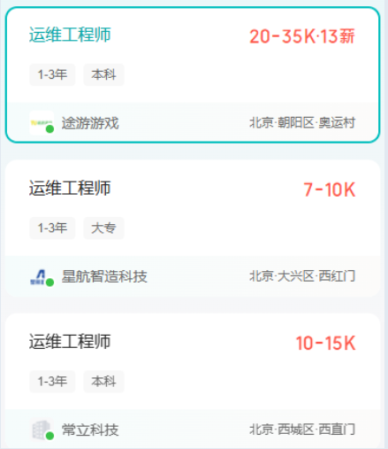
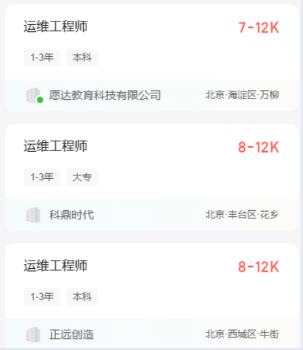
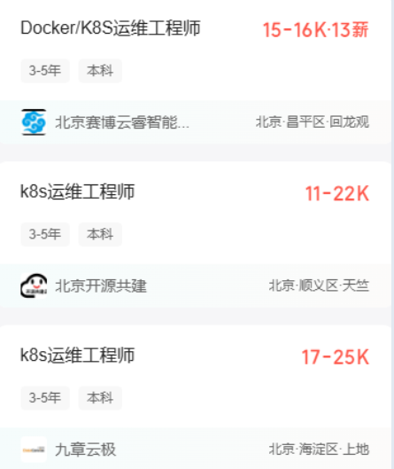

# 00.云计算运维简单介绍

# 一、什么是云计算运维？
云计算运维的定义是通过标准化流程和自动化工具，对云计算环境中的各种资源进行全面管理，确保系统的稳定运行和高效服务。

简单来说，就是在阿里云等云平台上进行业务系统软件的安装、配置、监控、优化、故障排查等操作。

服务器就是配置特别好的一台电脑！

云：云厂商，阿里云、百度云、华为云

计算：处理数据的能力，分布式计算、弹性式计算

运维：运行、维护

# 二、云计算运维人员的主要职责
+ 搭建项目环境：就是项目代码在运行过程中需要的一些软件，就类似于找了一个戏班子过来唱戏，我们需要给人搭建戏台、准备话筒、音响等等
+ 部署项目：就是将项目代码放在服务器（阿里云）正常跑起来的过程
+ 项目监控：有监控软件，只需要查看监控软件即可
+ 故障排查：就是发现项目运行有问题、服务器有问题、网络有问题等等，去解决问题
+ 日常巡检：比如：看看项目是否正常运行、数据库是否正确备份等等
+ 解决客户问题：运维人员是在维护项目， 如果客户在使用项目软件的时候发现有些问题，就会找运维人员
+ 运维手册的编写：主要是记录一些问题的描述、原因、解决方案，方便后期使用
+ 对客户进行一些简单的培训工作（实施工程师）

# 三、云计算运维的发展前景
云计算蓝皮书（2025）：[https://mp.weixin.qq.com/s/YEEfN1yPHxMnk094cL1TVg](https://mp.weixin.qq.com/s/YEEfN1yPHxMnk094cL1TVg)

# 四、云计算运维可从事的岗位
+ Linux系统运维工程师
+ 网络工程师（基础）
+ 数据库管理员（DBA）、数据库运维
+ CICD方向DevOps运维开发工程师
+ 容器运维工程师
+ K8S运维工程师
+ 技术支持工程师
+ 实施工程师
+ 服务器运维工程师
+ 桌面运维工程师

# 五、云计算运维的薪资待遇
感兴趣的同学，可以自己去**Boss直聘**去搜索运维工程师岗位等。

# 六、云计算运维学习哪些内容
Linux：操作系统

网络基础：交换机、路由器、OSI七层网络模型

shell脚本：一门计算机语言

Python：一门计算机语言

MySQL数据库：关系型数据库，用来存储数据，存储在硬盘上

Redis：非关系型数据库，用来存储数据，存储在内存中

Nginx：web服务器、反向代理、负载均衡，负责运行前端代码

Tomcat：服务器，负责运行Java代码

Keepalived：高可用，虚拟路由冗余协议

LVS、HAProxy：负载均衡

MongoDB：非关系型数据库

Ansible：自动化运维工具，可以管理成百上千台服务器

Zabbix、Prometheus：监控项目运行情况，服务器的情况

Grafana：做展示监控指标的情况

AlertManager：告警用的，钉钉、微信、邮件

ELK：elasticsearch、logstash、kibana，日志搜集、分析的

CICD：云计算人员和开发人员打交道，持续集成、持续交付

安全加固：系统安全、网络安全

KVM：虚拟机

阿里云：云服务器

Docker：容器技术，就是负责将Java代码打包成一个镜像，然后将镜像创建并启动成一个容器

K8S：kubernetes负责做容器编排的技术，自动部署容器项目，自动扩缩容等。

部署AI大模型项目（百度千帆大模型）、常用国产信创系统（麒麟、达梦）。

Kimi  DeepSeek 等等

阿里通义灵码

# 七、云计算运维的优势
+ 工资高、福利待遇好
+ 发展前景好
+ 大部分技术学习相对简单
+ 天花板高
+ 较少写代码、对思维逻辑要求不高（通义灵码、Kimi、百度千帆大模型、DeepSeek）
+ 不卷、对新人友好
+ 职业生涯长，可长期发展

工作效率

40-50云计算运维工程师   服务器软件

40-50开发人员

选择大于努力！

> 更新: 2026-06-01 19:30:01  
> 原文: <https://www.yuque.com/u41736172/az9urv/dbgxlqlizhz60eq0>