# 01.CentOS9系统部署

# 一、云计算运维概述

## 什么是Linux云计算运维 ?

* “云”实质上就是一个网络，狭义上讲，云计算就是一种提供云计算:"资源的网络，使用者可以随时获取“云”上的资源，按需求量使用。
* 运维：一个互联网产品的生成一般经历的过程是:产品经理、需求分析研发部门开发、测试部门测试、运维部门部署发布以及长期的运行维护，
* Linux：全称GNU/Linux，是一套免费使用和自由传播的类UNIX操作系统。
* 云：指云服务器，比如：阿里云、百度云、腾讯云等云服务器。
* 计算：指数据处理的能力，分为分布式计算和弹性计算。
* 运维：运行与维护。
* 我们以后的工作主要职责是：
  * 搭建一些项目环境
  * 部署项目
  * 配置优化
  * 项目监控
  * 故障处理
  * 手册编写
* 服务器：其实就是配置特别高的电脑
  * 物理服务器
  * 云服务器

## Linux系统的应用方向

* android
* 大数据
* 物联网
* 人工智能
* 移动互联网


## 云计算运维的薪资待遇

云计算开发工程师岗位月均薪22160元，云计算高端开发岗位，例如Python全栈工程师、企业容器云架构研发，岗位待遇飙升至30K以上。

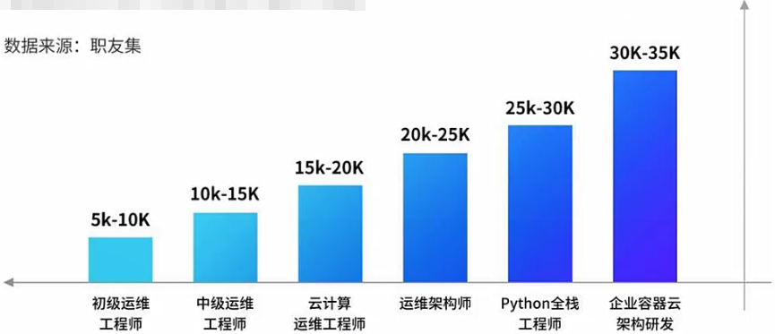

## 云计算工程师的优势

* 更少的代码
* 更长的职业生涯
* 更有价值的经验
* 无失业之忧

## 云计算学习技术架构

* 操作系统：让云计算工程师能够操作硬件设备
* 编程语言：帮助快速完成重复性工作
* 云服务搭建与管理：将计算、存储和网络能力进行整合与管理
* 网络安全：防止系统被破解

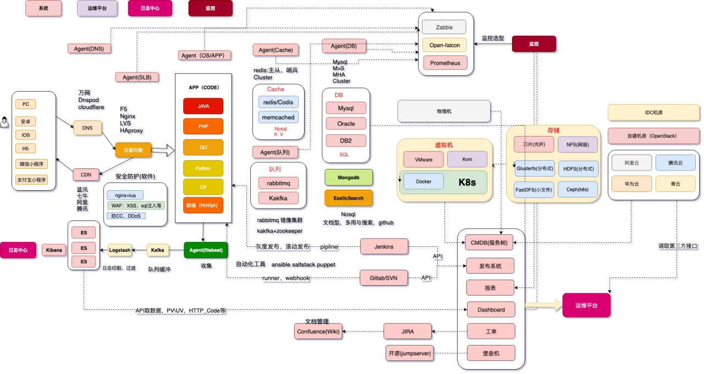

## 总体课程设计

* Linux系统管理和网络管理：Linux系统、LAMP架构、网络通信等
* 企业数据库MySQL实战、shell编程：数据库应用、运维开发、shell语言等
* 大型网站高并发架构：Nginx、ELK、MQ、Redis等
* Python自动化运维开发：Python编程、搜集系统信息等
* Web安全渗透攻防：文件攻击、sql注入、XSS
* 公有云和私有云容器架构：KVM、Docker、Kubernetes等

# 二、GNU/Linux 的历史

## 自由软件之父


GPL，是GNU General Public License的缩写，是GNU通用公共授权非正式的中文翻译。它并非由自由软件基金会所发表，亦非使用GNU通用公共授权的软件的法定发布条款─只有GNU通用公共授权英文原文的版本始具有此等效力。

GNU，是一个自由的操作系统，其内容软件完全以GPL方式发布。这个操作系统是GNU计划的主要目标，名称来自GNU's Not Unix!的递归缩写，因为GNU的设计类似Unix，但它不包含具著作权的Unix代码。GNU的创始人，理查德·马修·斯托曼，将GNU视为“达成社会目的技术方法”。

## Linux之父


林纳斯•本纳第克特•托瓦兹（Linus Benedict Torvalds, 1969年~ ），著名的电脑程序员、黑客。Linux内核的发明人及该计划的合作者。托瓦兹利用个人时间及器材创造出了这套当今全球最流行的操作系统（作业系统）内核之一。现受聘于开放源代码开发实验室（OSDL：Open Source Development Labs, Inc），全力开发Linux内核。

# 三、Linux发行版介绍

Linux发行版：就是指各个公司（厂商）针对Linux的内核做了一些加工、完善后，形成它们自己的系统！

## <font style="color:rgb(51, 51, 51);">RHEL</font>

<font style="color:rgb(51, 51, 51);">RHEL是Red Hat Enterprise Linux的缩写，是Red Hat公司的Linux系统。</font>

## <font style="color:rgb(51, 51, 51);">CentOS</font>

<font style="color:rgb(51, 51, 51);">CentOS（Community Enterprise Operating System，中文意思是：社区企业操作系统）是Linux发行版之一，它是来自于Red Hat Enterprise Linux依照开放源代码规定释出的源代码所编译而成。由于出自同样的源代码，因此有些要求高度稳定性的服务器以CentOS替代商业版的Red Hat Enterprise Linux使用。两者的不同，在于CentOS并不包含封闭源代码软件。</font>

<font style="color:rgb(51, 51, 51);">CentOS Stream 9 </font>

## <font style="color:rgb(51, 51, 51);">Ubuntu</font>

<font style="color:rgb(51, 51, 51);">Ubuntu（友帮拓、优般图、乌班图）是一个以桌面应用为主的开源GNU/Linux操作系统，Ubuntu 是基于Debian GNU/Linux，支持x86、amd64（即x64）和ppc架构，由全球化的专业开发团队（Canonical Ltd）打造的。</font>

## <font style="color:rgb(51, 51, 51);">Debian</font>

<font style="color:rgb(51, 51, 51);">广义的Debian是指一个致力于创建自由操作系统的合作组织及其作品，由于Debian项目众多内核分支中以Linux宏内核为主，而且 Debian开发者所创建的操作系统中绝大部分基础工具来自于GNU工程 ，因此 “Debian” 常指Debian GNU/Linux。</font>

<font style="color:rgb(51, 51, 51);"></font>

<font style="color:rgb(51, 51, 51);">麒麟、欧拉</font>

<font style="color:rgb(51, 51, 51);">学习Linux操作系统，前期主要学习的就是Linux操作系统中命令！！！</font>

<font style="color:rgb(51, 51, 51);"></font>

<font style="color:rgb(51, 51, 51);">Linux的概念：</font>

<font style="color:rgb(51, 51, 51);">狭义：指林纳斯开发出的Linux内核代码！</font>

<font style="color:rgb(51, 51, 51);">广义：指基于Linux内核衍生的Linux操作系统！</font>

<font style="color:rgb(51, 51, 51);">一般情况下，我们说的Linux，其实都是广义上的概念！</font>

# <font style="color:rgb(51, 51, 51);">四、Linux相关认证介绍</font>

## 红帽认证

### RHCA

* Red Hat Certified Architect ，中文全称：红帽认证架构师
* 在Linux和开源方面的技术和架构领军人物
* 从数据中心到终端桌面的Linux系统的设计、计划、部署及全面管理

### RHCE

* Red Hat Certified Engineer ，中文全称： 红帽认证工程师
* 安装和配置Linux服务器、网络设备、网络安全、实际问题的诊断和解决

### RHCSA

* Red Hat Certified System Administrator ，中文全称：红帽认证系统管理员
* 安装和调试Linux系统、安全性，并连接局域网和广域网

### RHCSS

* 红帽最新推出的安全进阶认证，New advanced-level security certification，为满足企业环境下的安装要求进行配置红帽企业版Linux和红帽目录服务

## 华为认证

### HCIE

Huawei Certified ICT Expert，华为认证ICT专家

### HCIP

Huawei Certified ICT Professional 华为认证ICT高级工程师

### HCIA

Huawei Certified ICT Associate 华为认证ICT工程师

软考证书！ 中级

# 五、Linux系统部署（掌握）

## 获取Linux 常用发行版的方式

* CentOS官网


我们下载的是：CentOS-Stream-9-latest-x86\_64-dvd1.iso

国内下载CentOS9的网址：<https://mirrors.ustc.edu.cn/centos-stream/9-stream/BaseOS/x86_64/iso/CentOS-Stream-9-latest-x86_64-dvd1.iso>

服务器其实就是配置特别好的一台电脑！

## 服务器介绍

### IDC


互联⽹数据中⼼（Internet Data Center）简称IDC，就是电信部利⽤已有的互联⽹通信线路、带宽资源，建⽴标准化的电信专业级机房环境，为企业、政府提供服务器托管、租⽤以及相关增值等⽅⾯的全⽅位服务。

:::info
北京⼏个IDC机房：

:::

北京皂君庙机房

北京酒仙桥机房

北京三元桥机房

北京苏州桥机房

北京中关村机房

北京亦庄联通数据中⼼

北京惠普机房

北京雍和宫机房

北京⼴渠⻔机房

北京⽯景⼭京⻄机房

北京华威桥机房

北京京东机房

北京万寿路总参机房

北京⼯体机房

### 服务器机柜

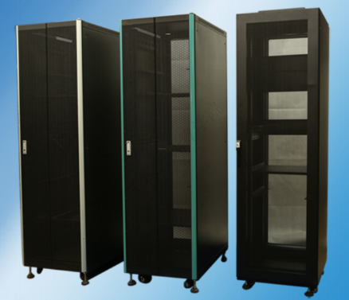

服务器机柜，⽤来组合安装⾯板、插件、插箱、电⼦元件、器件和机械零件与部件，使其构成⼀个整体的安装箱。服务器机柜由框架和盖板组成，一般具有矩体的外形，落地放置。它为电⼦设备正常⼯作提供相适应的环境和安全防护。

这是仅次于系统级的⼀级组装。不具备封闭结构的机柜称为机架。服务器机柜具有良好的技术性能。机柜的结构应具有良好的刚度和强度以及良好的电磁隔离、接地、噪声隔离、通风散热等性能。

此外，服务器机柜应具有抗振动、抗冲击、耐腐蚀、防尘、防⽔、防辐射等性能，以便保证设备稳定可靠地⼯作。

### 物理服务器

#### 塔式服务器


塔式服务器是我们生活中见得比较多的，

主要是因为塔式服务器的外形结构和普通PC比较类似。

塔式服务器尺寸没有统一标准，由于塔式服务器的机箱比较大，服务器的配置也可以很高，冗余扩展更可以很齐备，所以它的应用范围非常广，应该说目前使用率最高的一种服务器就是塔式服务器。

#### 机架式服务器

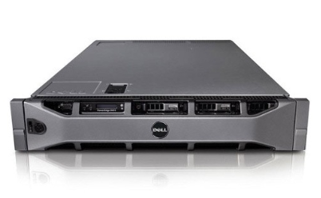

机架式服务器的外形看来不像计算机，而像交换机，有1U（1U=1.75英寸）、2U、4U等规格。

机架式服务器安装在标准的19英寸机柜里面。

这种结构的多为功能型服务器。

#### 刀片式服务器


刀片服务器是指在标准高度的机架式机箱内可插装多个卡式的服务器单元，是一种实现HAHD(高可用高密度)的低成本服务器平台，为特殊应用行业和高密度计算环境专门设计。

刀片服务器就像“刀片”一样，每一块“刀片”实际上就是一块系统主板。

#### 云服务器

后面介绍。

## 通过VMware部署CentOS系统

我们要学习Linux操作系统，需要在电脑上安装Linux操作系统。如果直接在自己的笔记本上安装Linux操作系统，那我们的Windows就用不了了，不方便我们以后的学习和工作。

所以我们是通过虚拟机软件安装Linux的。


1. 在自己笔记本上安装一个VMware软件（虚拟机软件）
2. 通过VMware软件模拟出一台干净的电脑（虚拟机）
3. 在模拟出来的干净的电脑上安装CentOS9系统

### <font style="color:rgb(51, 51, 51);">虚拟机介绍及安装</font>

:::info
**<font style="color:rgb(51, 51, 51);">什么是虚拟机软件？</font>**

:::

<font style="color:rgb(51, 51, 51);">虚拟机，有些时候想模拟出一个真实的电脑环境，碍于使用真机安装代价太大，因此而诞生的一款可以模拟操作系统运行的软件。</font>

<font style="color:rgb(51, 51, 51);">虚拟机目前有2 个比较有名的产品：vmware 出品的vmware workstation、oracle 出品的virtual Box。</font>

:::info
**<font style="color:rgb(51, 51, 51);">虚拟机软件的安装</font>**

:::

<font style="color:rgb(51, 51, 51);">第一步：复制VMware软件包到Windows系统中</font>


<font style="color:rgb(51, 51, 51);">第二步：双击VMware安装包，进行软件的安装</font>

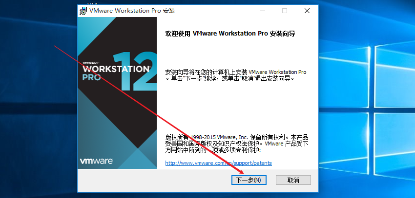

<font style="color:rgb(51, 51, 51);">第三步：勾选软件的许可协议</font>


<font style="color:rgb(51, 51, 51);">第四步：设置VMware安装路径以及勾选增强型的键盘程序</font>


<font style="color:rgb(51, 51, 51);">第五步：用户体验设置</font>


<font style="color:rgb(51, 51, 51);">下一步、下一步，直到软件安装完成即可。</font>

<font style="color:rgb(51, 51, 51);">第六步：安装完成后，输入许可证密钥，破解VMware软件</font>


<font style="color:rgb(51, 51, 51);">输入密钥：</font><code><font style="color:rgb(51, 51, 51);">ZF3R0-FHED2-M80TY-8QYGC-NPKYF</font></code>


> <font style="color:rgb(119, 119, 119);">特别注意：VMware WorkStation安装完毕后，其在网络适配器中会产生两张虚拟网卡。</font>
>
> <font style="color:rgb(119, 119, 119);">VMnet1与VMnet8，如果没有产生这</font>**<font style="color:rgb(119, 119, 119);">两张网卡</font>**<font style="color:rgb(119, 119, 119);">，则操作系统必须重装！</font>

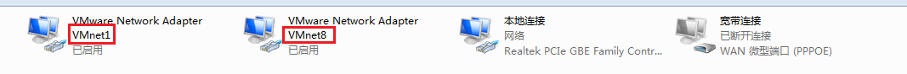

通过多出来的这两张网卡，我们就可以实现虚拟机和Windows电脑进行通信。而且虚拟机也可以上网了。

宿主机、真机、物理机

虚拟机

### <font style="color:rgb(51, 51, 51);">Linux系统环境部署</font>

<font style="color:rgb(51, 51, 51);">第一步：创建新的虚拟机</font>


<font style="color:rgb(51, 51, 51);">第二步：选择自定义设置</font>


<font style="color:rgb(51, 51, 51);">第三步：选择稍后安装操作系统</font>


<font style="color:rgb(51, 51, 51);">第四步：选择要安装的操作系统类型</font>


<font style="color:rgb(51, 51, 51);">第五步：设置操作系统的名称与安装路径</font>


<font style="color:rgb(51, 51, 51);">第六步：CPU选择1颗2核</font>


<font style="color:rgb(51, 51, 51);">第七步：内存设置为2048MB（2GB）</font>


<font style="color:rgb(51, 51, 51);">第八步：设置网络模式为NAT模式（共享上网）</font>

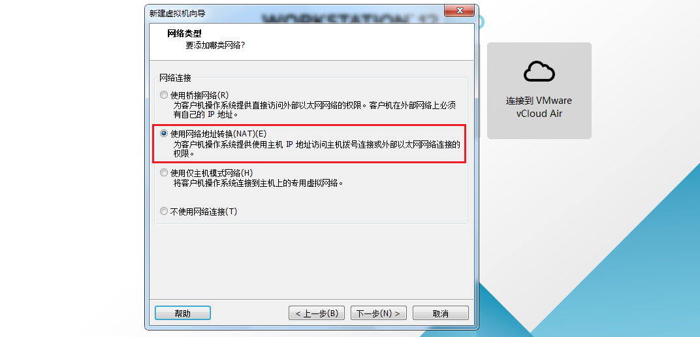

<font style="color:rgb(51, 51, 51);">设置完毕后，下一步、下一步、下一步...直到虚拟机创建完成。</font>


### <font style="color:rgb(51, 51, 51);">安装CentOS9操作系统(上)</font>

<font style="color:rgb(51, 51, 51);">第一步：选择CD/DVD光驱，如下图所示</font>


<font style="color:rgb(51, 51, 51);">第二步：选择CentOS-Stream-9-latest-x86\_64-dvd1.iso光盘文件</font>


<font style="color:rgb(51, 51, 51);">第三步：启动CentOS9操作系统光盘镜像</font>

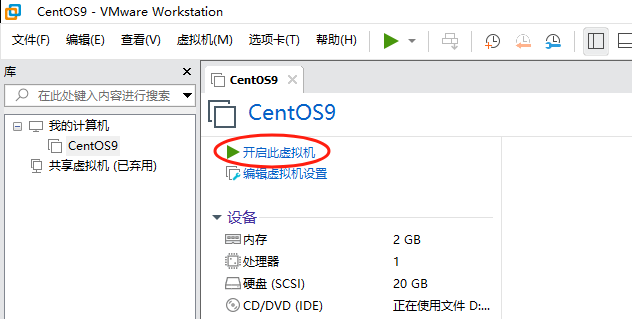


<font style="color:rgb(51, 51, 51);">使用方向键向上移动到第一个菜单</font>


如果你的鼠标想要从虚拟机电脑中出来，按ctrl + alt

### <font style="color:rgb(51, 51, 51);">安装CentOS9操作系统(中)</font>

<font style="color:rgb(51, 51, 51);">第一步：选择安装时使用的语言（中文）</font>


<font style="color:rgb(51, 51, 51);">第二步：设置安装目标位置（使用默认的就好，点进去，然后再点出来即可）</font>


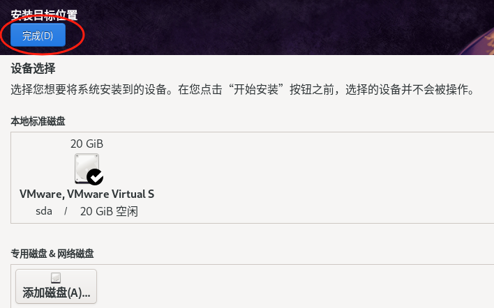

<font style="color:rgb(51, 51, 51);">第三步：设置软件选择</font>

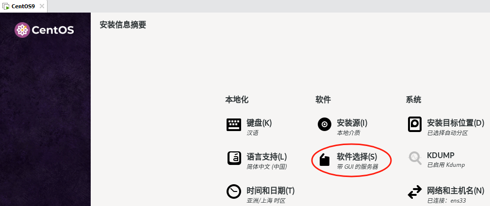


<font style="color:rgb(51, 51, 51);">第四步：给root管理员设置密码以及创建一个普通的用户</font>


<font style="color:rgb(51, 51, 51);">root账号默认已经存在，但是没有密码，需要人为设置。设置完成后，还需要创建一个普通的账号如lhp。</font>

> <font style="color:rgb(119, 119, 119);">root密码：123456，超级管理员，实际工作中越复杂越好</font>
>
> <font style="color:rgb(119, 119, 119);">lhp密码：123456，普通账号</font>

第五步：其他设置


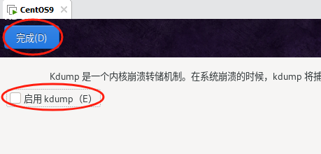


第六步：开始安装

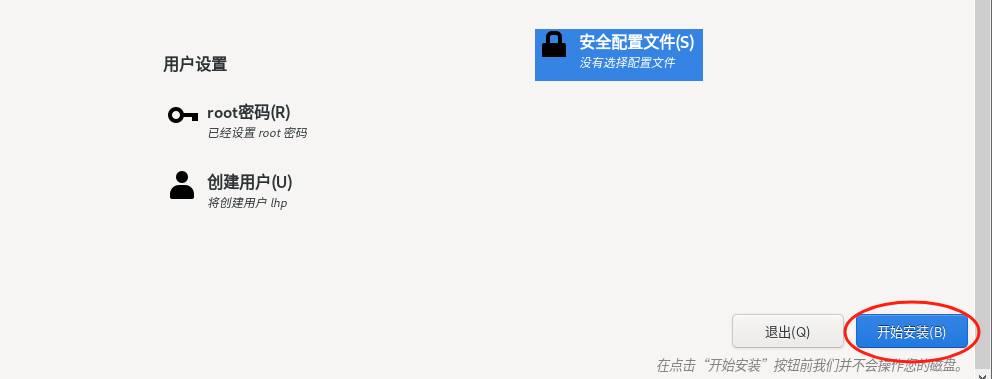

### <font style="color:rgb(51, 51, 51);">安装CentOS9操作系统(下)</font>

<font style="color:rgb(51, 51, 51);">第一步：安装完成后，单击重启系统</font>

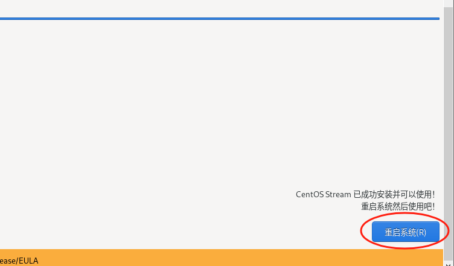

<font style="color:rgb(51, 51, 51);">第二步：登录CentOS9系统</font>


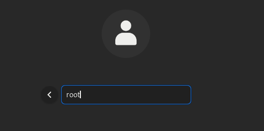

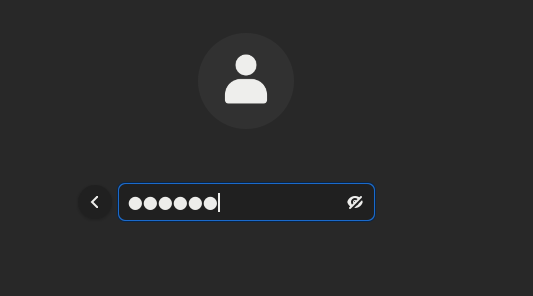

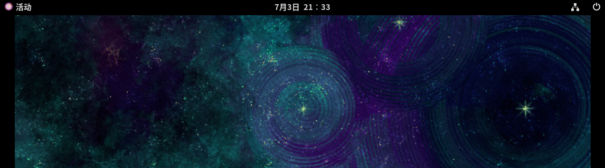

<font style="color:rgb(51, 51, 51);">到此CentOS9就全部安装完成了！</font>

### <font style="color:rgb(51, 51, 51);">解除5分钟锁屏限制</font>

装好Linux操作系统后，它有5分钟锁屏限制，5分钟不动它，就自动锁屏。下次用还得输入密码，太繁琐！

我们最好取消锁屏限制：

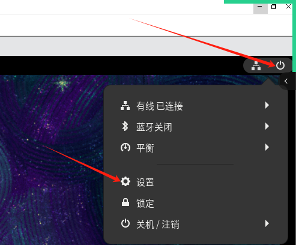


### <font style="color:rgb(51, 51, 51);">给CentOS9操作系统拍摄快照</font>

#### <font style="color:rgb(51, 51, 51);">什么是快照</font>

<font style="color:rgb(51, 51, 51);">快照可以理解就是一个快速的备份操作。</font>

<font style="color:rgb(51, 51, 51);">为什么要拍摄快照：就是为了做一个系统的备份，防止小伙伴们误操作，导致系统不可用。</font>

#### <font style="color:rgb(51, 51, 51);">VMware实现快照</font>

<font style="color:rgb(51, 51, 51);">第一步：选择虚拟机=>快照=>拍摄快照（拍摄快照时Linux系统可以关机拍摄也可以开机拍摄）</font>


<font style="color:rgb(51, 51, 51);">第二步：设置快照的名称</font>


<font style="color:rgb(51, 51, 51);">设置完成后，单击拍摄快照，一闪，备份完成。</font>

#### <font style="color:rgb(51, 51, 51);">恢复快照</font>

<font style="color:rgb(51, 51, 51);">当有一天，我们的Linux系统不小心损坏了，不用单击。单击虚拟机菜单=>快照=>恢复到快照即可立即恢复。</font>


#### 问题

部分同学的电脑，在Linux系统处于开机的状态下拍摄快照时会报错！！！

解决办法：

将Linux系统关机，然后再拍摄快照！

# 六、Linux系统基本操作（了解）

## 打开终端

终端就是我们输Linux命令的地方。


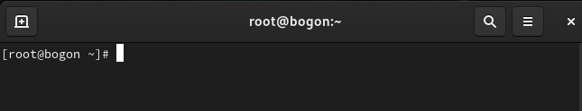

**调整终端字体大小：**

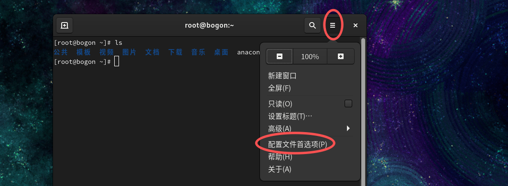

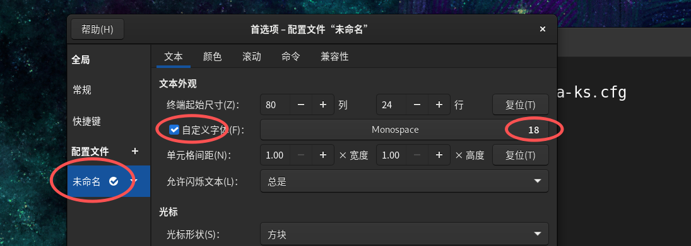

也可以使用快捷键方式去调整字体：但是快捷键调整，属于临时设置，在Linux系统关机重启后就失效了！

调大字体：`ctrl + shift + 加号`

调小字体：`ctrl + 减号`

**终端中符号说明：**

root：表示当前登录的用户

@：分隔符

bogon：主机名称

\~：当前所在目录

\#：表示当前是系统超级管理员，如果是普通用户则显示$

## 查看当前登录人


## 可视化界面创建目录并删除

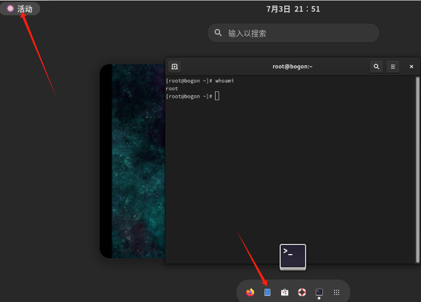

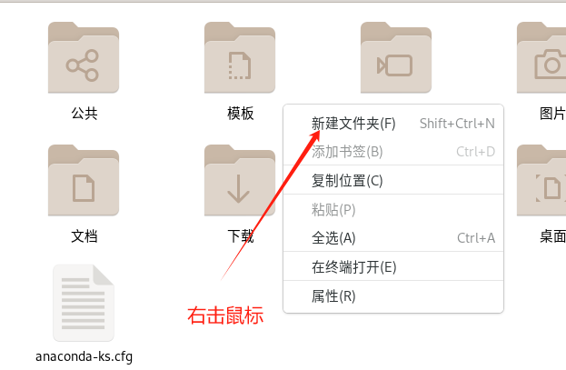


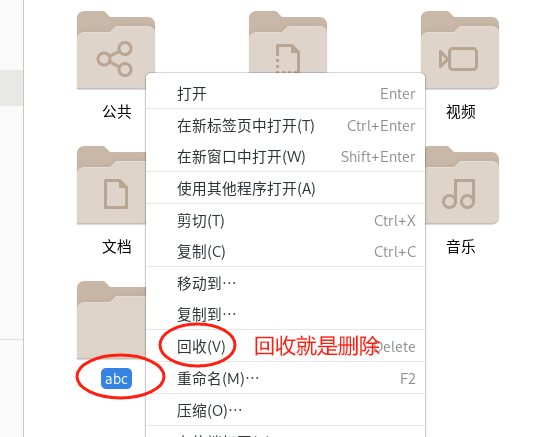

## 使用命令创建文件


## 使用命令删除文件


## 使用命令修改文件名称

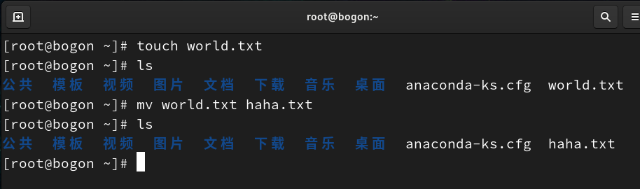

* 使用命令关机

```shell
# init 0
```

# 七、常见报错说明

## <font style="color:rgb(51, 51, 51);">拍摄快照报错</font>

<font style="color:rgb(51, 51, 51);">VMware拍摄快照报错：</font>

```shell
VMware Workstation 不可恢复错误:(vcpu-0)
Exception 0xc0000005(access violation) hasoccurred.
日志文件位于"D:\inux\centos9\vmware.log"中.
您可以请求支持。
要收集数据提交给 VMware 技术支持，请选择"帮助"菜单中的“收集支持数据"。
也可以直接在 Workstation 文件夹中运行“vm-support"脚本。
我们将根据您的技术支持权利做出回应。
```

解决办法：

<font style="color:rgb(51, 51, 51);">Windows系统若启用了Hyper-V，可能与VMware产生虚拟化冲突。以管理员身份运行CMD并执行：</font>

```shell
bcdedit /set hypervisorlaunchtype off
```

<font style="color:rgb(51, 51, 51);">完成后重启电脑。此方法可解决80%的类似问题，但少数情况可能导致蓝屏‌。</font>


> 更新: 2026-06-03 19:42:50  
> 原文: <https://www.yuque.com/u41736172/az9urv/ip7ro8orwg3e2vib>