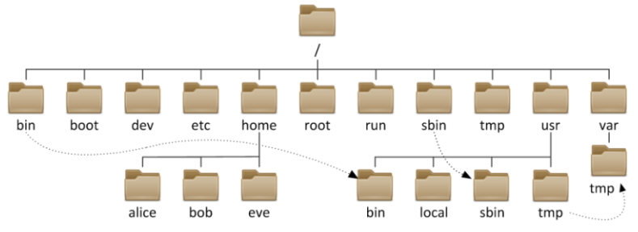
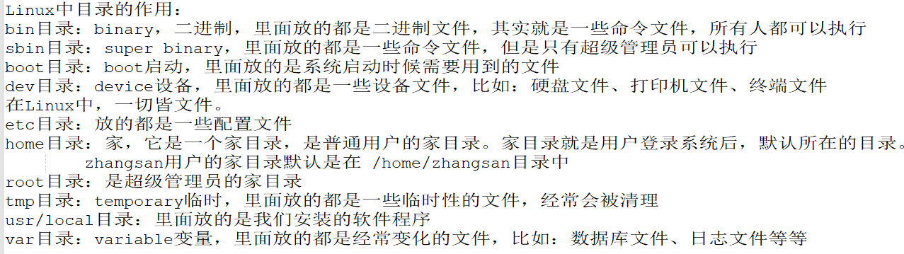
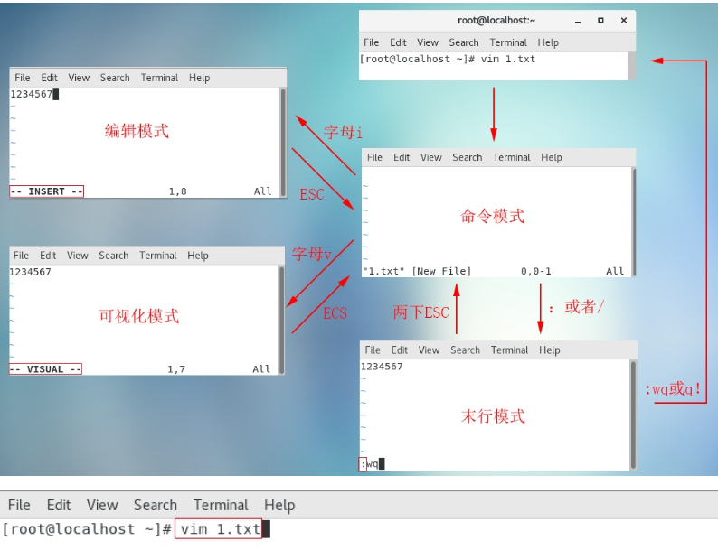
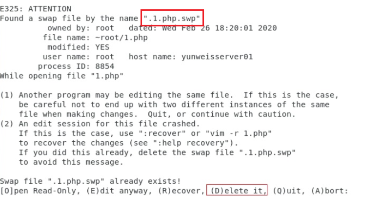

# 02.文件和用户管理

# 一、Linux目录结构

## Windows/Linux目录对比

Windows: 以多根的方式组织文件 C:\ D:\ E:\\

Linux: 以单根的方式组织文件 /

## Linux目录简介

目录结构： FSH (Filesystem Hierarchy Standard)

\[root@localhost ~]# ls /

bin dev lib media net root srv usr

boot etc lib64 misc opt sbin sys var

cgroup home lost+found mnt proc selinux tmp

## Linux目录图示



## 目录功能

下图所示的需要记住：



bin 普通用户使用的命令 /bin/ls, /bin/date

sbin 管理员使用的命令 /sbin/service

dev 设备文件 /dev/sda,/dev/sda1

root root用户的HOME

home 存储普通用户家目录

tmp 临时文件(全局可写：进程产生的临时文件)

var 存放的是一些变化文件，比如数据库，日志，邮件....

设备（主要指存储设备）挂载目录

media 移动设备默认的挂载点

mnt 手工挂载设备的挂载点

etc 配置文件（系统相关如网络/etc/sysconfig/network）

proc 虚拟的文件系统，反映出来的是内核，进程信息或实时状态 ,硬件的状态

usr 系统文件，相当于C:\Windows

/usr/local 软件安装的目录，相当于C:\Program

boot 存放的系统启动相关的文件，例如kernel,grub(引导装载程序)

lib 库文件Glibc

lib64 库文件Glibc

lost+found fsck修复时，存储没有链接的文件或目录

## 家目录说明

* 在Linux系统中每个用户都有他的家目录
* 家目录：就是每个用户登录Linux系统后，默认所在的目录
* 超级管理员的家目录在`/root`
* 普通用户的家目录在`/home/xxxx`，比如zhangsan用户的家目录是在`/home/zhangsan`，lisi用户的家目录是在`/home/lisi`

# 二、文件管理

## 几个入门命令

### pwd命令

<font style="color:rgb(51, 51, 51);">主要功能：pwd=print working directory，打印当前工作目录（告诉我们，我们当前位置）</font>

<font style="color:rgb(51, 51, 51);">基本语法：</font>

```shell
# pwd
```

### cd命令

<font style="color:rgb(51, 51, 51);">主要功能：cd全称change directory，切换目录（从一个目录跳转到另外一个目录）</font>

<font style="color:rgb(51, 51, 51);">基本语法：</font>

```shell
# cd [路径]
选项说明：
路径既可以是绝对路径，也可以是相对路径
```

路径分为：

* 绝对路径：从根目录开始描述路径
* 相对路径：不以根目录开始描述路径
  * ./ 当前文件所在目录，可以省略
  * ../ 上级目录

<font style="color:rgb(51, 51, 51);">案例一：切换到/usr/local这个程序目录</font>

```shell
# cd /usr/local
```

<font style="color:rgb(51, 51, 51);">案例二：比如我们当前在/home/lhp下，切换到根目录/下</font>

```shell
# cd /home/lhp
# cd ../../
```

<font style="color:rgb(51, 51, 51);">案例三：当我们在某个路径下，如何快速回到自己的家目录</font>

```shell
# cd
或
# cd ~
```

练习：

```properties
1. 回到家目录

2. 切换到 /var 目录

3. 切换到 /usr/local 目录

4. 切换到 /usr 目录（可以尝试着使用相对路径的写法）

5. 回到家目录
```

### ls命令

#### <font style="color:rgb(51, 51, 51);">用法一</font>

<font style="color:rgb(51, 51, 51);">主要功能：ls 完整写法 list show，以平铺的形式显示当前所在目录下的文件信息</font>

<font style="color:rgb(51, 51, 51);">基本语法：</font>

```shell
# ls
```

案例：

```shell
1. 查看家目录中有哪些东西

2. 查看/usr/local目录中有哪些东西

3. 查看/tmp目录中有哪些东西

4. 查看/var目录中有哪些东西

5. 查看/etc目录中有哪些东西
```

#### <font style="color:rgb(51, 51, 51);">用法二</font>

<font style="color:rgb(51, 51, 51);">主要功能：显示其他目录下的文件信息</font>

```shell
# ls 其他目录的绝对路径或相对路径
```

<font style="color:rgb(119, 119, 119);">扩展：ls后面跟的路径既可以是绝对路径也可以是相对路径</font>

```shell
# ls /home/lhp
```

案例：

```shell
1. 查看/usr/local目录中的内容
# ls /usr/local

2. 查看/tmp目录中的内容
# ls /tmp

3. 查看/var目录中的内容
# ls /var

4. 当前是在/usr目录中，我要查看/usr/local中的内容
# ls /usr/local
或者
# ls ./local
或者
# ls local
```

> 快捷键：按tab键可以补全路径、文件名

#### <font style="color:rgb(51, 51, 51);">用法三</font>

<font style="color:rgb(51, 51, 51);">基本语法：</font>

```shell
# ls [选项] [路径]
选项说明：
-l ：ls -l，代表以详细列表的形式显示当前或其他目录下的文件信息(简写命令=>ll)
-h ：ls -lh，通常与-l结合一起使用，代表以较高的可读性显示文件的大小(kb/mb/gb)
-a ：ls -a，a是all缩写，代表显示所有文件（也包含隐藏文件=>大部分以.开头）
```

<font style="color:rgb(51, 51, 51);">计算机中的单位：</font>

```shell
# 1TB = 1024GB
# 1GB = 1024MB
# 1MB = 1024KB
# 1KB（千字节） = 1024B（字节）
```

案例：

```shell
查看家目录中的内容
# ls

详细查看家目录中的内容
# ls -l

详细查看/usr/local目录中的内容
# ls -l /usr/local

详细查看/etc目录中的内容
# ls -l /etc

详细查看/etc目录中的内容，并且单位换算好
# ls -lh /etc
# ls -hl /etc
说明：选项一般没有先后顺序（后面个别命令会有先后顺序）

查看家目录中所有的文件、目录包括隐藏的
# ls -a
```

### <font style="color:rgb(51, 51, 51);">clear命令</font>

<font style="color:rgb(51, 51, 51);">主要功能：清屏</font>

<font style="color:rgb(51, 51, 51);">基本语法：</font>

```shell
# clear
```

清屏的快捷键：`ctrl + l`

按↑↓箭头可以查看之前输入的命令

tab键可以补全路径、命令

## 创建文件

语法：

```shell
# 命令 空格  文件名.后缀
# touch    文件名字
```

示例：

创建一个文件

```shell
# touch file1.txt
```

查看文件

```shell
# ls
看到文件即可
```

在/usr/local目录中创建hello.txt文件

```shell
# touch /usr/local/hello.txt
# ls /usr/local/
```

案例：

```shell
1. 在家目录中创建一个hello.txt文件

2. 在/usr/local中创建一个abc.txt文件
# cd /usr/local
# touch abc.txt

或者
# touch /usr/local/abc.txt


3. 在/tmp目录中创建test1.txt  test2.txt  test3.txt
# touch /tmp/test1.txt  /tmp/test2.txt  /tmp/test3.txt
# ls /tmp

4. 在家目录中创建hello1.txt hello2.txt ... hello100.txt
# touch hello{1..100}.txt
```

## 创建目录

语法：make directory

```shell
# mkdir 路径和目录名
```

选项说明：

```shell
# mkdir -p
父系，当创建目录没有上一级时，自动创建
```

示例：

创建一个目录

```shell
# mkdir /root/dir1
```

查看目录

```shell
# ls
```

显示当前所在位置路径

```shell
# pwd
```

递归创建目录

```shell
# mkdir -p /root/aaa/bbb/ccc
```

案例：

```shell
1. 在家目录中创建一个dir1的目录
# mkdir dir1
# ls


2. 在/usr/local目录中创建一个dir2的目录
# cd /usr/local
# mkdir dir2
或者
# mkdir /usr/local/dir3

3. 在/tmp目录中创建一个aaa目录，然后在aaa中创建一个bbb目录

# mkdir -p /tmp/aaa/bbb
选项说明：
-p：表示递归创建多级目录


4. 在/usr/local目录中创建b1，然后在b1中创建b2目录，然后在b2中创建b3目录


5. 使用tree命令，也可以查看指定目录中的内容，而且会以树型的结构列出来！
```

## 复制

语法：

```shell
命令   参数1   参数2
cp 源文件路径 目标文件夹

选项
cp -r 源目录 目标目录
```

示例：

```shell
# cp file1.txt dir1/
# ls dir1/
看到复制的文件即可

# cp hello.txt /usr/local

# cp -r dir1 /usr/local
```

案例1：

```properties
1. 在家目录中创建zhangsan.txt文件

2. 将zhangsan.txt复制到/usr/local目录中

3. 在/tmp中创建一个lisi.txt文件

4. 将/tmp中的lisi.txt文件复制到 /usr/local 目录中

5. 将/tmp中的lisi.txt文件复制到 家目录 中
```

案例2：

```shell
1. 在家目录中创建一个abc.txt文件，然后将其复制到 /tmp 中
# touch abc.txt
# cp abc.txt /tmp

2. 复制/tmp中的abc.txt文件到/usr/local中
# cp /tmp/abc.txt /usr/local

3. 在家目录中创建shop目录，在shop目录中创建3个文件，a1.txt a2.txt a3.txt，
将shop目录复制到/usr/local中

# mkdir shop
# touch shop/a1.txt shop/a2.txt shop/a3.txt
# cp -r shop /usr/local
```

## 移动

语法：

```shell
命令  参数1   参数2
mv 源文件路径 目标文件路径
```

示例：

```shell
# mv file3.txt dir1/
# ls
```

mv命令除了可以移动文件，还可以修改文件、目录名称。

示例：

```shell
# mv abc.txt xyz.txt
# mv dir1 dir222

# mv hello.txt /usr/local
# mv dir222 /usr/local
```

案例：

```shell
1. 在家目录中创建b1.txt文件，将其移动到 /usr/local中
# touch b1.txt
# mv b1.txt /usr/local

2. 将/usr/local/b1.txt 文件移动到/tmp中
# mv /usr/local/b1.txt /tmp

3. 将家目录中的shop目录移动到/tmp中
# mv shop /tmp

mv命令除了有移动的功能，还可以进行重命名操作！

4. 在家目录中创建文件aaa.java，然后将文件重命名为bbb.java
# touch aaa.java
# mv aaa.java bbb.java

5. 在家目录中创建目录haha，然后将目录重命名为hehe
# mkdir haha
# mv haha hehe
```

## 删除

语法：

```shell
rm -rf 文件或目录的路径
```

示例：

```shell
# rm -rf file5.txt file7.txt
# ls

# rm -rf file1.txt
# rm -rf dir1
# rm -rf /usr/local/abc.txt
# rm -rf /usr/local/haha
# rm -rf *.txt			会删除当前目录中以.txt结尾的文件
```

> 注意：使用`rm -rf`命令删除文件或目录后，是找不回来的，所以在删除前要确认好！
>
> ctrl + c 操作可以中断当前的操作！

案例：

```shell
1. 在家目录中创建aabb.txt文件，然后将其删除
# touch aabb.txt
# rm -rf aabb.txt

2. 在家目录中创建zhangsan.txt文件，然后将其移动到/usr/local中，然后删除/usr/local/zhangsan.txt
# touch zhangsan.txt
# mv zhangsan.txt /usr/local
# ls /usr/local
# rm -rf /usr/local/zhangsan.txt

3. 在家目录中创建wechat目录，然后在该目录中创建a1.txt a2.txt，然后将该目录复制到/tmp中，然后删除/tmp/wechat
# mkdir wechat
# touch wechat/a1.txt wechat/a2.txt
# cp wechat /tmp
# ls /tmp
# rm -rf /tmp/wechat

4. 在家目录中创建hello1.txt ... hello100.txt，然后将这些hello文件再删除
# touch hello{1..100}.txt
# rm -rf hello*
```

## 查看文件内容

使用图形界面，创建一个记事本。并写入大量内容。/root/file1.txt

### cat全部（推荐）

```shell
# cat  /root/file1.txt
```

> cat命令会将文件内容全部打印到终端上，如果这个文件很大，打印出来的内容太多了，不方便我们查看。
>
> 所以，cat命令适合于查看小文件的内容，文件内容在一屏内的。

```properties
# cat /etc/hosts

# cat /etc/yum.repos.d/centos.repo
```

### more翻页

```shell
# more  /root/file1.txt
```

> more命令是可以分页显示文件内容的，但是最终也还是将所有内容都打印到终端了。适合于查看大文件
>
> 下一页：空格	上一页：b

### less翻页（推荐）

```shell
# less /root/file1.txt
```

> less命令适合查看大文件内容，而且可以通过↑↓箭头去一行一行的查看；也可以通过PgUp、PgDn进行翻页查看。
>
> 按q就可以退出查看。quit

### head头部

可以查看文件的前几行内容，如果不指定行数，默认是查看前10行内容。

```shell
# head hello.txt				查看文件的前10行内容

# head -3 hello.txt			查看文件的前3行内容
```

### tail尾部

可以查看文件的后几行内容，如果不指定行数，默认是查看后10行内容。

```shell
# tail hello.txt				查看文件的后10行内容

# tail -3 hello.txt			查看文件的后3行内容
```

### grep过滤关键字

grep命令可以在文件中搜索指定的关键字。比如：我们可以通过grep命令在hello.txt文件中搜索world单词！搜索到关键字后，会将包含关键字的行给打印出来！

语法：

```shell
# grep 关键字 文件名
```

```shell
# grep 'abc' /root/file1.txt		（前提是文件中要有abc）
```

```properties
grep name /etc/yum.repos.d/centos.repo

grep Debug /etc/yum.repos.d/centos.repo

grep haha /etc/yum.repos.d/centos.repo
```

## 文件类型

### 说明

在Windows系统中，区分文件的类型，是通过文件后缀来区分的！比如：xxx.mp3、xxx.mp4、xxx.doc。

在Linux系统中，不是通过文件后缀来区分文件类型的，而是通过权限标识位来区分的！也就意味着在Linux系统中，一个文件写不写后缀是无所谓的！

但是有些情况下，我们在Linux系统中还是需要写后缀的：

* 压缩文件：.tar.gz  .tar.xz  .tar.bz2
* 网页文件：.php  .html
* 软件安装包：.rpm
* 等等

### 常见类型

* * 普通文件（文本文件，二进制文件，压缩文件，电影，图片。。。）
* d 目录文件（蓝色）directory

### 非常见类型

* b 设备文件（块设备）存储设备硬盘，U盘 /dev/sda, /dev/sda1
* c 设备文件（字符设备）打印机，终端 /dev/tty1
* l 链接文件（淡蓝色）
* s 套接字文件
* p 管道文件

示例：

```shell
查看不同的文件类型。你能找出几种呢？
# ll -d   /bin/ls    /dec/sda    /home
-rwxr-xr-x. 1 root root 117616 Nov 20 2022 /bin/ls
brw-rw---- 1 root disk 8, 0 Mar 14 09:03 /dev/sda
drwxr-xr-x. 10 root root 4096 Mar 14 11:00 /home
```

> 注意：通过颜色判断文件的类型是不一定正确的！！！
>
> Linux系统中不是根据文件扩展名来判断文件类型的！！！

## 综合练习

> 扩展：
>
> 往一个文件中写入内容：
>
> `echo 1111111111111 >> hello.txt`
>
> `echo 222222222222 >> hello.txt`
>
> `echo "hello world" >> hello.txt`

需求：

1. 在家目录中创建一个dir1目录
2. 在dir1目录中创建一个dir2目录
3. 在dir2目录中创建一个hello.txt文件和world.txt文件
4. 往hello.txt文件中写入如下内容：

```shell
i have a dream
haha
hehe
```

5. 查看hello.txt文件中的内容
6. 删除world.txt文件
7. 删除dir1目录

# 三、Vim编辑器

## <font style="color:rgb(51, 51, 51);">vi概述</font>

<font style="color:rgb(51, 51, 51);">vi（visual editor）编辑器通常被简称为vi，它是Linux和Unix系统上最基本的文本编辑器，类似于Windows 系统下的notepad（记事本）编辑器。</font>

## <font style="color:rgb(51, 51, 51);">vim编辑器</font>

<font style="color:rgb(51, 51, 51);">Vim(Vi improved)是vi编辑器的加强版，比vi更容易使用。vi的命令几乎全部都可以在vim上使用。</font>

## <font style="color:rgb(51, 51, 51);">vim编辑器的四种模式</font>



## 入门案例

:::info
第一步：打开文件

:::

使用vim打开文件

```shell
# vim  文件名称
```

<font style="color:rgb(51, 51, 51);">① 如果文件已存在，则直接打开</font>

<font style="color:rgb(51, 51, 51);">② 如果文件不存在，则vim编辑器会自动在内存中创建一个新文件</font>

<font style="color:rgb(51, 51, 51);">案例：使用vim命令打开readme.txt文件</font>

```shell
# vim readme.txt
```

:::info
第二步：编辑文件

:::

使用vim命令打开文件后，vim处于命令模式。在命令模式中输入小写字母i，就可以切换到编辑模式，在编辑模式中就可以输入内容。

:::info
第三步：保存文件并退出

:::

输入完内容后，我们按一次ESC键，就可以由编辑模式切换到命令模式，在命令模式中输入`:wq`即可保存退出。

## <font style="color:rgb(51, 51, 51);">命令模式下的相关操作（重点）</font>

### <font style="color:rgb(51, 51, 51);">如何进入命令模式</font>

<font style="color:rgb(51, 51, 51);">在Linux操作系统中，当我们使用vim命令直接打开某个文件时，默认进入的就是命令模式。如果我们处于其他模式（编辑模式、可视化模式以及末行模式）可以连续按两次Esc键也可以返回命令模式。</font>

### <font style="color:rgb(51, 51, 51);">命令模式下我们能做什么</font>

<font style="color:rgb(51, 51, 51);">① 移动光标 ② 复制 粘贴 ③ 剪切 粘贴 删除 ④ 撤销与恢复</font>

### <font style="color:rgb(51, 51, 51);">移动光标到首行或末行</font>

<font style="color:rgb(51, 51, 51);">移动光标到首行 => gg</font>

<font style="color:rgb(51, 51, 51);">移动光标到末行 => G	shift + g</font>

### <font style="color:rgb(51, 51, 51);">翻屏</font>

<font style="color:rgb(51, 51, 51);">向上 翻屏，按键：</font><code><font style="color:rgb(51, 51, 51);background-color:rgb(243, 244, 244);">ctrl + b （before） 或 PgUp</font></code>

<font style="color:rgb(51, 51, 51);">向下 翻屏，按键：</font><code><font style="color:rgb(51, 51, 51);background-color:rgb(243, 244, 244);">ctrl + f （after） 或 PgDn</font></code>

<font style="color:rgb(51, 51, 51);">向上翻半屏，按键：</font><code><font style="color:rgb(51, 51, 51);background-color:rgb(243, 244, 244);">ctrl + u （up）</font></code><font style="color:rgb(51, 51, 51);background-color:rgb(243, 244, 244);">F</font>

<font style="color:rgb(51, 51, 51);">向下翻半屏，按键：</font><code><font style="color:rgb(51, 51, 51);background-color:rgb(243, 244, 244);">ctrl + d （down）</font></code>

### <font style="color:rgb(51, 51, 51);">快速定位光标到指定行</font>

<font style="color:rgb(51, 51, 51);">行号 + G，如150G代表快速移动光标到第150行。</font>

### <font style="color:rgb(51, 51, 51);">复制/粘贴</font>

<font style="color:rgb(51, 51, 51);">① 复制当前行（光标所在那一行）</font>

<font style="color:rgb(51, 51, 51);">按键：yy</font>

<font style="color:rgb(51, 51, 51);">粘贴：在想要粘贴的地方按下 p 键【将粘贴在光标所在行的下一行】,如果想粘贴在光标所在行之前，则使用P键</font>

<font style="color:rgb(51, 51, 51);">② 从当前行开始复制指定的行数，如复制5行，5yy</font>

<font style="color:rgb(51, 51, 51);">粘贴：在想要粘贴的地方按下p 键【将粘贴在光标所在行的下一行】,如果想粘贴在光标所在行之前，则使用P键</font>

### <font style="color:rgb(51, 51, 51);">剪切/删除</font>

<font style="color:rgb(51, 51, 51);">在VIM编辑器中，剪切与删除都是dd</font>

<font style="color:rgb(51, 51, 51);">如果剪切了文件，但是没有使用p进行粘贴，就是删除操作</font>

<font style="color:rgb(51, 51, 51);">如果剪切了文件，然后使用p进行粘贴，这就是剪切操作</font>

<font style="color:rgb(51, 51, 51);">① 剪切/删除当前光标所在行</font>

<font style="color:rgb(51, 51, 51);">按键：dd （删除之后下一行上移）</font>

<font style="color:rgb(51, 51, 51);">粘贴：p</font>

<font style="color:rgb(51, 51, 51);">注意：dd 严格意义上说是剪切命令，但是如果剪切了不粘贴就是删除的效果。</font>

<font style="color:rgb(51, 51, 51);">② 剪切/删除多行（从当前光标所在行开始计算）</font>

<font style="color:rgb(51, 51, 51);">按键：数字dd</font>

<font style="color:rgb(51, 51, 51);">粘贴：p</font>

### <font style="color:rgb(51, 51, 51);">撤销/恢复</font>

<font style="color:rgb(51, 51, 51);">撤销：u（undo）</font>

<font style="color:rgb(51, 51, 51);">恢复：ctrl + r 恢复（取消）之前的撤销操作【重做，redo】</font>

### <font style="color:rgb(51, 51, 51);">删除整个文档内容</font>

删除整个文档：先按gg回到首行，然后按dG

## <font style="color:rgb(51, 51, 51);">末行模式下的相关操作</font>

### <font style="color:rgb(51, 51, 51);">如何进入末行模式</font>

<font style="color:rgb(51, 51, 51);">进入末行模式的方法只有一个，在命令模式下使用冒号：的方式进入。</font>

### <font style="color:rgb(51, 51, 51);">末行模式下我们能做什么</font>

<font style="color:rgb(51, 51, 51);">文件保存、退出、查找与替换、显示行号、paste模式等等。</font>

### <font style="color:rgb(51, 51, 51);">保存/退出（重点）</font>

<font style="color:rgb(51, 51, 51);">:w => 代表对当前文件进行保存操作，但是其保存完成后，并没有退出这个文件</font>

<font style="color:rgb(51, 51, 51);">:q => 代表退出当前正在编辑的文件，但是一定要注意，文件必须先保存，然后才能退出</font>

<font style="color:rgb(51, 51, 51);">:wq => 代表文件先保存后退出（保存并退出）</font>

<font style="color:rgb(51, 51, 51);">如果一个文件在编辑时没有名字，则可以使用:wq 文件名称，代表把当前正在编辑的文件保存到指定的名称中，然后退出</font>

<font style="color:rgb(51, 51, 51);">:q! => 代表强制退出但是文件未保存（不建议使用）</font>

### <font style="color:rgb(51, 51, 51);">查找/搜索（重点）</font>

<font style="color:rgb(51, 51, 51);">切换到命令模式，然后输入斜杠/（也是进入末行模式的方式之一）</font>

<font style="color:rgb(51, 51, 51);">进入到末行模式后，输入要查找或搜索的关键词，然后回车</font>

<font style="color:rgb(51, 51, 51);">如果在一个文件中，存在多个满足条件的结果。在搜索结果中切换上/下一个结果：N/n （大写N代表上一个结果，小写n代表next）</font>

<font style="color:rgb(51, 51, 51);">如果需要</font>**<font style="color:rgb(51, 51, 51);">取消高亮</font>**<font style="color:rgb(51, 51, 51);">，则需要在末行模式中输入</font><code><font style="color:rgb(51, 51, 51);background-color:rgb(243, 244, 244);">:noh</font></code><font style="color:rgb(51, 51, 51);">【no highlight】</font>

<font style="color:rgb(51, 51, 51);"></font>

<code><font style="color:rgb(51, 51, 51);">grep 关键字 文件路径</font></code>

### <font style="color:rgb(51, 51, 51);">文件内容的替换（重点）</font>

<font style="color:rgb(51, 51, 51);">第一步：首先要进入末行模式（在命令模式下输入冒号:）</font>

<font style="color:rgb(51, 51, 51);">第二步：根据需求替换内容</font>

<font style="color:rgb(51, 51, 51);">① 只替换光标所在这一行的第一个满足条件的结果（只能替换1次）</font>

```shell
:s/要替换的关键词/替换后的关键词   +  回车
```

<font style="color:rgb(51, 51, 51);">案例：把hello centos中的centos替换为centos7.6</font>

```shell
切换光标到hello centos这一行
:s/centos/centos7.6
```

<font style="color:rgb(51, 51, 51);">② 替换光标所在这一行中的所有满足条件的结果（替换多次，只能替换一行）</font>

```shell
:s/要替换的关键词/替换后的关键词/g		g=global全局替换
```

<font style="color:rgb(51, 51, 51);">案例：把hello centos中的所有centos都替换为centos7.6</font>

```shell
切换光标到hello centos这一行
:s/centos/centos7.6/g
```

<font style="color:rgb(51, 51, 51);">③ 针对整个文档中的所有行进行替换，只替换每一行中满足条件的第一个结果</font>

```shell
:%s/要替换的关键词/替换后的关键词
```

<font style="color:rgb(51, 51, 51);">案例：把每一行中的第一个hello关键词都替换为hi</font>

```shell
:%s/hello/hi
```

**<font style="color:rgb(51, 51, 51);">④ 针对整个文档中的所有关键词进行替换（只要满足条件就进行替换操作）</font>**

```shell
:%s/要替换的关键词/替换后的关键词/g
```

<font style="color:rgb(51, 51, 51);">案例：替换整个文档中的hello关键词为hi</font>

```shell
:%s/hello/hi/g
```

### <font style="color:rgb(51, 51, 51);">显示行号</font>

<font style="color:rgb(51, 51, 51);">基本语法：</font>

```shell
:set nu
nu = number，行号
```

<font style="color:rgb(119, 119, 119);">取消行号 => :set nonu</font>

## <font style="color:rgb(51, 51, 51);">编辑模式</font>

### <font style="color:rgb(51, 51, 51);">编辑模式的作用</font>

<font style="color:rgb(51, 51, 51);">编辑模式的作用比较简单，主要是实现对文件的内容进行编辑模式。</font>

### <font style="color:rgb(51, 51, 51);">如何进入编辑模式</font>

<font style="color:rgb(51, 51, 51);">首先你需要进入到命令模式，然后使用小写字母a或小写字母i，进入编辑模式。</font>

<font style="color:rgb(51, 51, 51);">命令模式 + i ： insert缩写，代表在光标之前插入内容</font>

<font style="color:rgb(51, 51, 51);">命令模式 + a ： append缩写，代表在光标之后插入内容</font>

### <font style="color:rgb(51, 51, 51);">退出编辑模式</font>

<font style="color:rgb(51, 51, 51);">在编辑模式中，直接按Esc，即可从编辑模式退出到命令模式。</font>

## <font style="color:rgb(51, 51, 51);">异常退出解决方案</font>

<font style="color:rgb(51, 51, 51);">什么是异常退出：在编辑文件之后并没有正常的去wq（保存退出），而是遇到突然关闭终端或者断电的情况，则会显示下面的效果，这个情况称之为异常退出：</font>



> <font style="color:rgb(119, 119, 119);">温馨提示：每个文件的异常文件都会有所不同，其命名规则一般为</font><code><font style="color:rgb(119, 119, 119);background-color:rgb(243, 244, 244);">.文件名称.swp</font></code>

<font style="color:rgb(51, 51, 51);">解决办法：将交换文件（在编程过程中产生的临时文件）删除掉即可【在上述提示界面按下D 键或者使用rm 指令删除交换文件】</font>

```shell
# rm .1.php.swp
```

# 四、用户与用户组的管理

## <font style="color:rgb(51, 51, 51);">为什么要做用户与用户组管理</font>

<font style="color:rgb(51, 51, 51);">服务器要添加多账户的作用：</font>

<font style="color:rgb(51, 51, 51);">针对不同用户分配不同的权限，不同权限可以限制用户可以访问到的系统资源</font>

<font style="color:rgb(51, 51, 51);">提高系统的安全性 </font>

<font style="color:rgb(51, 51, 51);">帮助系统管理员对使用系统的用户进行跟踪</font>

## <font style="color:rgb(51, 51, 51);">用户和组的关系</font>


<font style="color:rgb(51, 51, 51);">理论上Linux系统中的每个用户在创建时都应该有一个对应的用户组，这个组就称之为用户的主组。同时，有些情况下，某个用户需要临时使用某个组的权限，那这个组就称之为这个用户的附属组或附加组。</font>

> <font style="color:rgb(119, 119, 119);">主组只能拥有一个，但是附属组或附加组可以同时拥有多个 => 亲爹，干爹（多个）</font>

## <font style="color:rgb(51, 51, 51);">用户组操作</font>

<font style="color:rgb(51, 51, 51);">用户组的操作无疑三件事：用户组的添加、用户组的修改以及用户组的删除操作</font>

<font style="color:rgb(51, 51, 51);">组：group</font>

<font style="color:rgb(51, 51, 51);">添加：add</font>

<font style="color:rgb(51, 51, 51);">修改：modify-mod</font>

<font style="color:rgb(51, 51, 51);">删除：delete-del</font>

### <font style="color:rgb(51, 51, 51);">用户组的添加</font>

<font style="color:rgb(51, 51, 51);">基本语法：</font>

```shell
# groupadd [选项] 用户组的组名称
选项说明：
-g ：代表用户组的组ID编号，自定义组必须从1000开始，不能重复（1-999是系统用户组的编号）
```

<font style="color:rgb(51, 51, 51);">案例：在系统中添加一个hr的用户组</font>

```shell
# groupadd hr
```

<font style="color:rgb(51, 51, 51);">案例：在系统中添加一个test的用户组并指定编号1100</font>

```shell
# groupadd -g 1100 test
```

<font style="color:rgb(51, 51, 51);">问题：我们刚才创建的hr以及test用户组到底添加到哪里了？</font>

<font style="color:rgb(51, 51, 51);">答：默认情况下，我们添加的用户组都会放在一个系统文件中，文件位置=></font><code><font style="color:rgb(51, 51, 51);">/etc/group</font></code>

```shell
# tail -3 /etc/group
hr:x:1004:
test:x:1100:
```

### <font style="color:rgb(51, 51, 51);">/etc/group文件解析</font>

<font style="color:rgb(51, 51, 51);">由以上命令的执行结果可知，在/etc/group文件中，其一共拥有三个冒号，共四列。每列含义：</font>

```shell
# tail -5 /etc/group 
postfix:x:89:
tcpdump:x:72:
lhp:x:1000:lhp
hr:x:1001:
test:x:1100:

第一列：用户组的组名称
第二列：用户组的组密码，使用一个x占位符
第三列：用户组的组ID编号，1-999代表系统用户组的组编号，1000以后的代表自定义组的组编号
CentOS6 => 1-499,500...
CentOS7 => 1-999,1000...
CentOS9 => 1-999,1000...
第四列：用户组内的用户信息（如果一个用户的附属组或附加组为这个组名，则该用户显示在此位置）
```

### <font style="color:rgb(51, 51, 51);">用户组的修改</font>

<font style="color:rgb(51, 51, 51);">基本语法：</font>

```shell
# groupmod [选项 选项的值] 原来组的组名称
选项说明：
-g ：gid缩写，设置一个自定义的用户组ID数字，1000以后
-n ：name缩写，设置新的用户组的名称
```

<font style="color:rgb(51, 51, 51);">案例：把hr用户组更名为szhr</font>

```shell
# groupmod -n szhr hr
```

<font style="color:rgb(51, 51, 51);">案例：把test用户组的组编号由1100更改为1003</font>

```shell
# groupmod -g 1003 test
```

<font style="color:rgb(51, 51, 51);">案例：把zhangsan组的组名称更改为admin且用户组的组编号更改为1004</font>

```shell
# groupmod -g 1004 -n admin zhangsan

上面的命令执行完可能会报错，应该是你没有zhangsan组！请添加一个zhangsan组，然后再修改！
```

### <font style="color:rgb(51, 51, 51);">用户组的删除</font>

<font style="color:rgb(51, 51, 51);">基本语法：</font>

```shell
# groupdel 用户组名称
```

<font style="color:rgb(51, 51, 51);">案例：使用groupdel删除test用户组</font>

```shell
# groupdel test
```

## <font style="color:rgb(51, 51, 51);">用户操作</font>

<font style="color:rgb(51, 51, 51);">用户：user</font>

<font style="color:rgb(51, 51, 51);">添加：add</font>

<font style="color:rgb(51, 51, 51);">修改：mod</font>

<font style="color:rgb(51, 51, 51);">删除：del</font>

### <font style="color:rgb(51, 51, 51);">用户的添加</font>

<font style="color:rgb(51, 51, 51);">基本语法：</font>

```shell
# useradd [选项 选项的值] 用户名称
选项说明：
-g ：代表添加用户时指定用户所属组的主组，唯一的组信息（重要）
-s ：代表指定用户可以使用的Shell类型，默认为/bin/bash（拥有大部分权限）还可以是/sbin/nologin，代表账号创建成功，但是不能用于登录操作系统。
/bin/bash => 给人使用的（运维工程师）
/sbin/nologin => 给软件使用的
-G ：代表添加用户时指定用户所属组的附属组或附加组，可以指定多个，用逗号隔开即可


-u ：代表添加用户时指定的用户ID编号，CentOS6从500开始，CentOS7中从1000开始(了解)
-c ：代表用户的备注信息，zs:123456:(张三的账号)  comment
-d ：代表用户的家目录，默认为/home/用户名称。可以使用-d进行更改
-n ：取消建立以用户名称为名的群组（了解）
```

<font style="color:rgb(51, 51, 51);">案例：在系统中创建一个linuxuser账号</font>

```shell
# useradd linuxuser
```

<font style="color:rgb(51, 51, 51);">问题：我们并没有为linuxuser账号指定所属的主组，可以成功创建账号么？</font>

<font style="color:rgb(51, 51, 51);">答：可以，因为在创建账号时，如果没有明确指定用户所属的主组，默认情况下，系统会自动在用户组中创建一个与用户linuxuser同名的用户组，这个组就是这个用户的主组。</font>

<font style="color:rgb(51, 51, 51);">问题：刚才创建的linuxuser账号能不能用于登录操作系统</font>

<font style="color:rgb(51, 51, 51);">答：不行，因为Linux的登录账号必须要求有密码，如果一个账号没有密码是无法登录操作系统的。</font>

<font style="color:rgb(51, 51, 51);"></font>

<font style="color:rgb(51, 51, 51);">案例：在系统中创建一个账号zhangsan，指定用户所属的主组为xiaomi</font>

```shell
第一步：查询一下xiaomi的组ID编号
# tail -5 /etc/group
xiaomi:x:1000:
第二步：根据组的编号添加用户
# useradd -g 1000 zhangsan
```

<font style="color:rgb(51, 51, 51);">案例：在系统中创建一个账号lisi，指定主组为xiaomi，此用户只能被软件所使用，不能用于登录操作系统</font>

```shell
# useradd -g 1000 -s /sbin/nologin lisi
```

<font style="color:rgb(51, 51, 51);">案例：在系统中创建一个wangwu，指定主组为wangwu，附属组为xiaomi</font>

```shell
# useradd -G 1000 wangwu
```

### <font style="color:rgb(51, 51, 51);">用户信息查询</font>

<font style="color:rgb(51, 51, 51);">基本语法：</font>

```shell
# id 用户名称
```

<font style="color:rgb(51, 51, 51);">主要功能：查询某个指定的用户信息</font>

<font style="color:rgb(51, 51, 51);">案例：查询linuxuser用户的信息</font>

```shell
# id linuxuser
uid=1002(linuxuser) gid=1005(linuxuser) groups=1005(linuxuser)
uid：用户编号
gid：用户所属的主组的编号
groups：用户的主组以及附属组信息，第一个是主组，后面的都是附属组或附加组信息
```

### <font style="color:rgb(51, 51, 51);">与用户相关的用户文件</font>

<font style="color:rgb(51, 51, 51);">组：</font><code><font style="color:rgb(51, 51, 51);">/etc/group</font></code><font style="color:rgb(51, 51, 51);">文件</font>

<font style="color:rgb(51, 51, 51);">用户：</font><code><font style="color:rgb(51, 51, 51);">/etc/passwd</font></code><font style="color:rgb(51, 51, 51);">文件，每创建一个用户，其就会在此文件中追加一行</font>

```shell
# vim /etc/passwd
root:x:0:0:root:/root:/bin/bash
zhaoliu:x:1005:1010::/home/zhaoliu:/sbin/nologin

由上图可知，一共拥有7列

第1列：用户名称
第2列：用户的密码，使用一个x占位符，真实密码存储在/etc/shadow(1-用户名，2-加密密码)
第3列：数字，用户的ID编号
第4列：数字，用户的主组ID编号
第5列：代表注释信息，useradd -c "备注信息" 用户名称
第6列：用户的家目录，默认在/home/用户名称
第7列：用户可以使用的Shell类型，useradd -s /bin/bash或/sbin/nologin 用户名称
```

### <font style="color:rgb(51, 51, 51);">用户修改操作</font>

<font style="color:rgb(51, 51, 51);">用户：user，添加：add，修改：mod，删除：del</font>

<font style="color:rgb(51, 51, 51);">基本语法：</font>

```shell
# usermod [选项 选项的值] 用户名称
选项说明：
-g ：修改用户所属的主组
-l ：login name修改用户的名称
-s ：修改用户可以使用的Shell类型，如/bin/bash => /sbin/nologin

扩展：
-L：锁定用户，锁定后用户无法登陆系统lock
-U：解锁用户unlock

了解：
-G ：修改用户附属组的编号信息
-d ：修改用户的家目录
-c ：修改用户的备注信息
```

<font style="color:rgb(51, 51, 51);">案例：修改zhangsan账号信息，更名为zs</font>

```shell
# usermod -l zs zhangsan
```

<font style="color:rgb(51, 51, 51);">案例：修改wangwu账号信息，把用户的主组的编号更新为1000（xiaomi）</font>

```shell
# usermod -g 1000 wangwu
```

<font style="color:rgb(51, 51, 51);">案例：禁止linuxuser账号登录Linux操作系统，将其作为软件使用的账号</font>

```shell
# usermod -s /sbin/nologin linuxuser
```

<font style="color:rgb(51, 51, 51);">案例：禁止linux用户登录操作</font>

```shell
# usermod -L linux
```

<font style="color:rgb(51, 51, 51);">案例：解锁linux用户</font>

```shell
# usermod -U linux
```

> <font style="color:rgb(119, 119, 119);">问题：账号已经解锁，但是无法登录</font>
>
> <font style="color:rgb(119, 119, 119);">① 当前账号没有设置密码，因为Linux操作系统不允许没有密码的操作进行登录</font>
>
> <font style="color:rgb(119, 119, 119);">② 当前用户的Shell类型为/sbin/nologin，所以其无法登录</font>

### <font style="color:rgb(51, 51, 51);">passwd命令</font>

<font style="color:rgb(51, 51, 51);">基本语法：</font>

```shell
# passwd 用户名称
```

<font style="color:rgb(51, 51, 51);">主要功能：为某个用户设置密码（添加或修改），可以给自己也可以给别人设置</font>

<font style="color:rgb(51, 51, 51);">案例：修改自己的密码</font>

```shell
# passwd
```

<font style="color:rgb(51, 51, 51);">案例：为linux账号添加一个密码，密码：123456</font>

```shell
# passwd linux
```

> <font style="color:rgb(119, 119, 119);">特别注意：在Linux操作系统中，如果一个账号没有密码，则无法登录操作系统。</font>

存放用户密码的文件`/etc/shadow`

```shell
# tail -3 /etc/shadow
root:$1$MYG2N:15636:0:99999:7:   :   :

guanyu:$6$rounds=100000$YkUNy3IV3UmVN4MJ$FpbWP93Blb/J0rKVrpQrJW4wZmH41IJf1spiIm4gZEwd1a2kTbWLF3:0:99999:7:::

1）“登录名”是与/etc/passwd文件中的登录名相一致的用户账号
2）“口令”字段存放的是加密后的用户口令字，如果为空，则对应用户没有口令，登录时不需要口令；   
星号代表帐号被锁定；
双叹号表示这个密码已经过期了。
$6$开头的，表明是用SHA-512加密的，
$1$ 表明是用MD5加密的
$2$ 是用Blowfish加密的
$5$ 是用 SHA-256加密的。 

3）“最后一次修改时间”表示的是从某个时刻起，到用户最后一次修改口令时的天数。时间起点对不同的系统可能不一样。例如在Linux中，这个时间起点是1970年1月1日。
4）“最小时间间隔”指的是两次修改口令之间所需的最小天数。
5）“最大时间间隔”指的是口令保持有效的最大天数。
6）“警告时间”字段表示的是从系统开始警告用户到用户密码正式失效之间的天数。
7）“不活动时间”表示的是用户没有登录活动但账号仍能保持有效的最大天数。（软限制。到期后多少天就不能用账号了。）
8）“失效时间”字段给出的是一个绝对的天数，如果使用了这个字段，那么就给出相应账号的生存期。期满后，该账号就不再是一个合法的账号，也就不能再用来登录了。（硬限制。）
9) 保留
```

### <font style="color:rgb(51, 51, 51);">su命令</font>

<font style="color:rgb(51, 51, 51);">基本语法：</font>

```shell
# su [-] 用户名称
选项：
- ：横杠（减号），代表切换用户的同时，切换目录到用户的家
```

<font style="color:rgb(51, 51, 51);">主要功能：切换用户的账号</font>

> <font style="color:rgb(119, 119, 119);">从超级管理员切换到普通用户，root => lhp，不需要输入lhp的密码</font>
>
> <font style="color:rgb(119, 119, 119);">从普通账号切换到超级管理员，lhp => root，需要输入root的密码</font>
>
> <font style="color:rgb(119, 119, 119);">从普通账号切换到普通账号，lhp => linuxuser，也需要输入linuxuser密码</font>

### <font style="color:rgb(51, 51, 51);">用户删除操作</font>

<font style="color:rgb(51, 51, 51);">基本语法：</font>

```shell
# userdel [选项] 用户名称
选项说明：
-r ：删除用户的同时，删除用户的家（默认不删除）
```

<font style="color:rgb(51, 51, 51);">案例：删除用户但是不删除用户的家目录</font>

```shell
# userdel zs
```

<font style="color:rgb(51, 51, 51);">案例：删除用户的同时删除用户的家目录</font>

```shell
# userdel -r lisi
```

> <font style="color:rgb(119, 119, 119);">删除账号流程：① 删除账号 ② 确认是否删除用户家 ③ 删除与用户同名的主组（没有其他用户）</font>

```shell
说明：如果某个用户正在使用中，那么正常来说是无法删除的，你可以让该用户退出后再删除；或者使用强制删除用户！

强制删除用户使用 -f 选项。
userdel -rf 用户名
```


> 更新: 2026-06-07 15:20:27  
> 原文: <https://www.yuque.com/u41736172/az9urv/ayywt6ph00lh6r85>