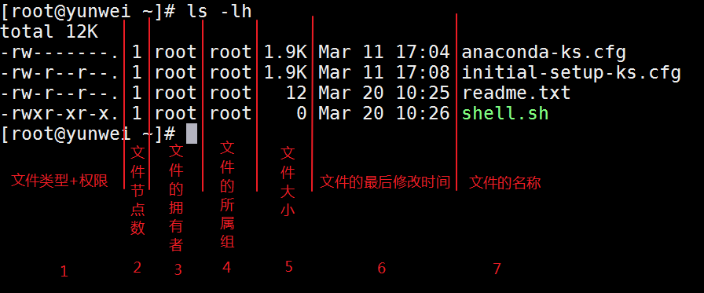
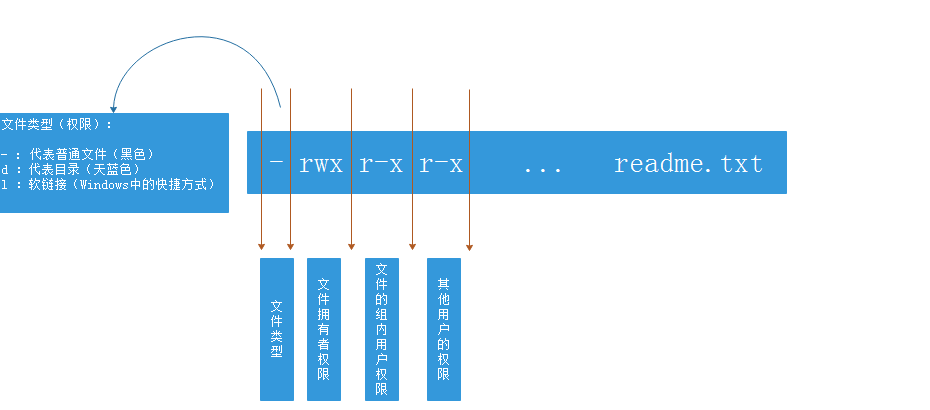
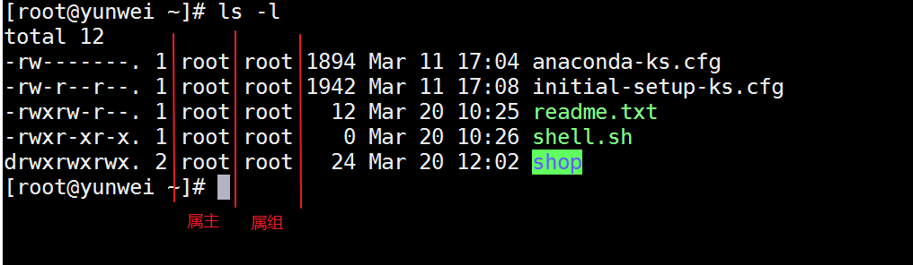
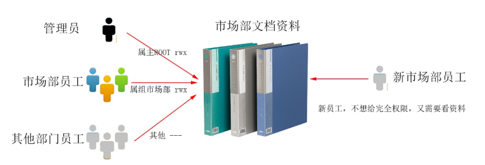
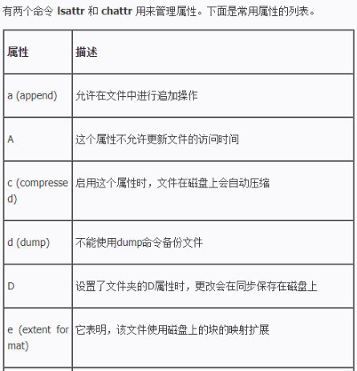
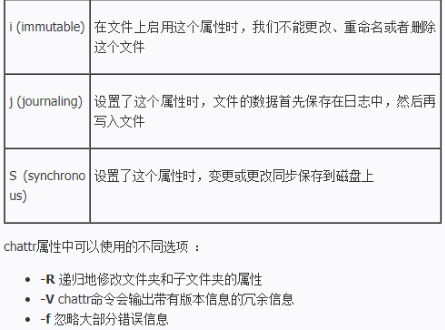

# 03.文件权限管理

# <font style="color:rgb(51, 51, 51);">一、权限概述</font>

## <font style="color:rgb(51, 51, 51);">权限的基本概念</font>

<font style="color:rgb(51, 51, 51);">在多用户计算机系统的管理中，权限是指某个特定的用户具有特定的系统资源使用权利。</font>

<font style="color:rgb(51, 51, 51);">在Linux 中分别有读、写、执行权限：</font>

| **<font style="color:rgb(51, 51, 51);"></font>** | **<font style="color:rgb(51, 51, 51);">权限针对文件</font>** | **<font style="color:rgb(51, 51, 51);">权限针对目录</font>** |
| :--- | :--- | :--- |
| <font style="color:rgb(51, 51, 51);">读r</font> | <font style="color:rgb(51, 51, 51);">表示可以查看文件内容；cat</font> | <font style="color:rgb(51, 51, 51);">表示可以(ls)查看目录中存在的文件名称</font> |
| <font style="color:rgb(51, 51, 51);">写w</font> | <font style="color:rgb(51, 51, 51);">表示可以更改文件的内容；vim 修改，保存退出</font> | <font style="color:rgb(51, 51, 51);">表示是否可以删除目录中的子文件或者新建子目录(rm/touch/mkdir)</font> |
| <font style="color:rgb(51, 51, 51);">执行x</font> | <font style="color:rgb(51, 51, 51);">表示是否可以开启文件当中记录的程序,一般指二进制文件(.sh) => 绿色</font> | <font style="color:rgb(51, 51, 51);">表示是否可以进入目录中(cd)</font> |

> <font style="color:rgb(119, 119, 119);">注：一般给予目录读权限时，也将会给其执行权限，属于“套餐”组合</font>
>
> <font style="color:rgb(119, 119, 119);">可读权限 read => r（简写），可写权限 write => w（简写），可执行权限 execute => x（简写）</font>

## <font style="color:rgb(51, 51, 51);">为什么要设置权限</font>

<font style="color:rgb(51, 51, 51);">1）服务器中的数据价值</font>

<font style="color:rgb(51, 51, 51);">2）员工的工作职责和分工不同</font>

<font style="color:rgb(51, 51, 51);">3）应对自外部的攻击</font>

<font style="color:rgb(51, 51, 51);">4）内部管理的需要</font>

## <font style="color:rgb(51, 51, 51);">Linux用户身份类别</font>

<font style="color:rgb(51, 51, 51);">Linux 系统一般将文件权限分为3 类：</font>

<font style="color:rgb(51, 51, 51);">read（读）</font>

<font style="color:rgb(51, 51, 51);">write（写）</font>

<font style="color:rgb(51, 51, 51);">execute（执行）</font>

**<font style="color:rgb(51, 51, 51);">谁</font>**<font style="color:rgb(51, 51, 51);">对文件有读，写，执行的权限呢？ 答：针对三大类用户</font>

## <font style="color:rgb(51, 51, 51);">user文件拥有者</font>

<font style="color:rgb(51, 51, 51);">文件的拥有者：默认情况下，谁创建了这个文件谁就是文件的拥有者。文件的拥有者可以进行更改并不是一成不变的。</font>

<font style="color:rgb(51, 51, 51);">张三 => linux.txt，默认情况下，张三就是linux.txt文件的拥有者</font>

## <font style="color:rgb(51, 51, 51);">group文件所属组内用户</font>

<font style="color:rgb(51, 51, 51);">group所属组内用户代表与文件的所有者相同的组内用户。</font>

<font style="color:rgb(51, 51, 51);">比如，张三、李四与王五都同属于一个hr的用户组，李四和王五就是这个文件的组内用户。</font>

## <font style="color:rgb(51, 51, 51);">other其他用户</font>

<font style="color:rgb(51, 51, 51);">other其他用户代表这些人既不是文件的拥有者，也不是文件所属组内的用户，我们把这些人就称之为other其他用户。</font>

## <font style="color:rgb(51, 51, 51);">特殊用户root</font>

<font style="color:rgb(51, 51, 51);">在Linux操作系统中，root拥有最高权限（针对所有文件），所以权限设置对root账号没有效果。</font>


> <font style="color:rgb(119, 119, 119);">在Linux系统中，三大类用户也可以拥有简写形式user(u)、group(g)、other(o)</font>

# <font style="color:rgb(51, 51, 51);">二、普通权限管理</font>

## <font style="color:rgb(51, 51, 51);">ls -l命令查看文件权限</font>

<font style="color:rgb(51, 51, 51);">基本语法：</font>

```shell
# ls -l
或
# ll
```

> <font style="color:rgb(119, 119, 119);">备注：ll命令是红帽以及CentOS系统特有的一个命令，在其他操作系统中可能并不支持</font>



## <font style="color:rgb(51, 51, 51);">文件类型+权限解析</font>



<font style="color:rgb(51, 51, 51);">Linux一共有7种文件类型,分别如下:</font>

**<font style="color:rgb(51, 51, 51);">-：普通文件</font>**

**<font style="color:rgb(51, 51, 51);">d：目录文件</font>**

**<font style="color:rgb(51, 51, 51);">l： 软链接（类似Windows的快捷方式）link</font>**

<font style="color:rgb(51, 51, 51);">(下面四种是特殊文件)</font>

<font style="color:rgb(51, 51, 51);">b：block，块设备文件（例如硬盘、光驱等）</font>

<font style="color:rgb(51, 51, 51);">p：管道文件</font>

<font style="color:rgb(51, 51, 51);">c：字符设备文件（例如猫(上网猫)等串口设备）</font>

<font style="color:rgb(51, 51, 51);">s：套接口文件/数据接口文件（例如启动一个MySql服务器时会产生一个mysql.sock文件）</font>

## <font style="color:rgb(51, 51, 51);">文件或文件夹权限设置（字母）</font>

<font style="color:rgb(51, 51, 51);">基本语法：ch = change mod简单理解权限</font>

```shell
# chmod [选项] 权限设置 文件或目录的名称
选项说明：
-R ：递归设置，针对文件夹（目录）
```

> <font style="color:rgb(119, 119, 119);">重点：字母设置并不难，重点看三方面</font>
>
> <font style="color:rgb(119, 119, 119);">第一个：确认要给哪个身份设置权限，u、g、o、ugo(a)</font>
>
> <font style="color:rgb(119, 119, 119);">第二个：确认是添加权限(+)、删除权限(-)还是赋予权限(=) </font>
>
> <font style="color:rgb(119, 119, 119);">第三个：确认给这个用户针对这个文件或文件夹设置什么样的权限，r、w、x</font>

<font style="color:rgb(51, 51, 51);">案例：给readme.txt文件的拥有者，增加一个可执行权限</font>

```shell
# chmod u+x readme.txt
```

<font style="color:rgb(51, 51, 51);">案例：把readme.txt文件的拥有者的可执行权限去除</font>

```shell
# chmod u-x readme.txt
```

<font style="color:rgb(51, 51, 51);">案例：为readme.txt中的所属组内用户赋予rw权限</font>

```shell
# chmod g=rw readme.txt
```

<font style="color:rgb(51, 51, 51);">案例：给shop目录及其内部的文件统一添加w可写权限</font>

```shell
# chmod -R ugo+w shop
或
# chmod -R a+w shop
或
# chmod -R +w shop
```

<font style="color:rgb(51, 51, 51);">案例：给shop目录设置权限，要求拥有者rwx，组内用户rx，其他用户rx</font>

```shell
# chmod -R u=rwx,g=rx,o=rx shop
```

## <font style="color:rgb(51, 51, 51);">文件或文件夹权限设置（数字）</font>

<font style="color:rgb(51, 51, 51);">经常会在技术网站上看到类似于</font><code><font style="color:rgb(51, 51, 51);"># chmod 777 a.txt</font></code><font style="color:rgb(51, 51, 51);">这样的命令，这种形式称之为数字形式权限。</font>

<font style="color:rgb(51, 51, 51);">文件</font>**<font style="color:rgb(51, 51, 51);">权限与数字</font>**<font style="color:rgb(51, 51, 51);">的对应关系，我们会发现</font>**<font style="color:rgb(51, 51, 51);">没有7</font>**<font style="color:rgb(51, 51, 51);">这个数字</font>

| **<font style="color:rgb(51, 51, 51);">权限</font>** | **<font style="color:rgb(51, 51, 51);">对应数字</font>** | **<font style="color:rgb(51, 51, 51);">意义</font>** |
| --- | --- | :--- |
| r | 4 | <font style="color:rgb(51, 51, 51);">可读</font> |
| <font style="color:rgb(51, 51, 51);">w</font> | <font style="color:rgb(51, 51, 51);">2</font> | <font style="color:rgb(51, 51, 51);">可写</font> |
| <font style="color:rgb(51, 51, 51);">x</font> | <font style="color:rgb(51, 51, 51);">1</font> | <font style="color:rgb(51, 51, 51);">可执行</font> |
| <font style="color:rgb(51, 51, 51);">-</font> | <font style="color:rgb(51, 51, 51);">0</font> | <font style="color:rgb(51, 51, 51);">没有权限</font> |

<font style="color:rgb(51, 51, 51);">777 ：</font>

<font style="color:rgb(51, 51, 51);">第一个数字7，代表文件拥有者权限</font>

<font style="color:rgb(51, 51, 51);">第二个数字7，代表文件所属组内用户权限</font>

<font style="color:rgb(51, 51, 51);">第三个数字7，代表其他用户权限</font>

<font style="color:rgb(51, 51, 51);">rwx = 4 + 2 + 1 = 7</font>

<font style="color:rgb(51, 51, 51);">rw = 4 + 2 = 6</font>

<font style="color:rgb(51, 51, 51);">rx = 4 + 1 = 5</font>

<font style="color:rgb(51, 51, 51);">案例：给readme.txt设置权限，文件的拥有者rwx，组内用户rw，其他用户r</font>

```shell
rwx = 7
rw = 6
r = 4
# chmod 764 readme.txt
```

<font style="color:rgb(51, 51, 51);">案例：给shop文件夹设置777权限</font>

```shell
# chmod -R 777 shop
```

## <font style="color:rgb(51, 51, 51);">奇葩权限</font>

<font style="color:rgb(51, 51, 51);">问题：用超级管理员设置文件的权限命令是# chmod -R 731 shop，请问这个命令有没有什么不合理的地方？</font>

<font style="color:rgb(51, 51, 51);">答：731权限进行拆解</font>

<font style="color:rgb(51, 51, 51);">7 = 4 + 2 + 1 = rwx</font>

<font style="color:rgb(51, 51, 51);">3 = 2 + 1 = wx</font>

<font style="color:rgb(51, 51, 51);">1 = x</font>

<font style="color:rgb(51, 51, 51);">问题在权限731中的3权限，3表示写+执行权限，但是写又必须需要能打开之后才可以写，因此必须需要具备可读权限，因此此权限设置不合理。</font>

<font style="color:rgb(51, 51, 51);">注：实际工作中，各位小伙伴在设置权限时一定不要设置这种"奇葩权限"，一般情况下，单独出现2、3的权限数字一般都是有问题的权限。</font>

## <font style="color:rgb(51, 51, 51);">练习题</font>

<font style="color:rgb(51, 51, 51);">1）使用root 用户设置文件夹/root/shop 的权限为：属主全部权限，属组拥有读和执行权限，其他用户没有权限，请使用数字权限的形式设置</font>

```shell
rwx=7,rx=4+1=5,0
# chmod -R 750 /root/shop
```

<font style="color:rgb(51, 51, 51);">2）设置文件/root/readme.txt 的权限，权限要求为：</font>

<font style="color:rgb(51, 51, 51);">属主拥有</font>**<font style="color:rgb(51, 51, 51);">全部</font>**<font style="color:rgb(51, 51, 51);">权限，属组要求可以</font>**<font style="color:rgb(51, 51, 51);">读写</font>**<font style="color:rgb(51, 51, 51);">，其他用户</font>**<font style="color:rgb(51, 51, 51);">只读</font>**<font style="color:rgb(51, 51, 51);">，要求使用数字形式；</font>

```shell
rwx=7,rw=4+2=6,r=4
# chmod 764 /root/readme.txt
```

<font style="color:rgb(51, 51, 51);">3）请设置/root/email.doc权限，权限要求只有属主可以读写，除此之外任何人没有权限；</font>

```shell
rw=6,0,0
# chmod 600 /root/email.doc
```

扩展：ls 命令

```shell
ls 命令可以将指定目录中的内容列出来显示
选项说明：
-l：显示更详细的信息
-a：显示所有的文件目录，包括隐藏的
-h：单位人性化的显示
-d：查看目录本身的信息

比如：
# ls -ld /home		显示home目录的信息

ls 命令中的参数不仅可以是目录，还可以是文件。如果是文件的话，就是查看这个文件权限等信息。
# ls -l /home/abc.txt		显示abc.txt这个文件的详细信息

ls -l 命令用的特别多，简写为 ll
```

## <font style="color:rgb(51, 51, 51);">特殊权限说明</font>

<font style="color:rgb(51, 51, 51);">在Linux 中，如果要删除一个文件，不是看文件有没有对应的权限，而是看文件所在的目录是否有写权限，如果有才可以删除（同时必须具备执行权限）。</font>

```shell
/shell/readme.txt
我们想删除readme.txt文件，必须要对shell目录具有可写权限，否则文件无法删除
```

# <font style="color:rgb(51, 51, 51);">三、文件拥有者以及文件所属组设置</font>

<font style="color:rgb(51, 51, 51);">文件拥有者：属主</font>

<font style="color:rgb(51, 51, 51);">文件所属组：属组</font>

## <font style="color:rgb(51, 51, 51);">什么是属主与属组</font>

<font style="color:rgb(51, 51, 51);">属主：所属的用户，文档所有者，这是一个账户，这是一个人</font>

<font style="color:rgb(51, 51, 51);">属组：所属的用户组，这是一个组</font>

## <font style="color:rgb(51, 51, 51);">文件拥有者与所属组的查看</font>

```shell
# ls -l
或
# ll
```



## <font style="color:rgb(51, 51, 51);">了解文件的拥有者与文件所属组来源</font>

<font style="color:rgb(51, 51, 51);">在Linux操作系统中，每个文件都是由Linux系统用户创建的。</font>

<font style="color:rgb(51, 51, 51);">在Linux操作系统中，每个用户都具有一个用户名称以及一个主组的概念</font>

```shell
# su - lhp
# touch readme.txt
# ll readme.txt
-rw-rw-r--. 1 lhp lhp 0 Mar 20 15:17 readme.txt
```

## <font style="color:rgb(51, 51, 51);">为什么需要更改文件拥有者与所属组</font>

<font style="color:rgb(51, 51, 51);">一个财务表格，以前由唐僧进行更新，他有读写权限，现在唐僧去西天取经去了，改权限没用，需要把属主改成铁扇公主，由铁扇公主更新。</font>

## <font style="color:rgb(51, 51, 51);">文件拥有者设置</font>

<font style="color:rgb(51, 51, 51);">基本语法：ch = change ，own = owner</font>

```shell
# chown [选项] 新的文件拥有者名称 文件名称
选项说明：
-R ：代表递归修改，主要针对文件夹
```

<font style="color:rgb(51, 51, 51);">案例：把/root/readme.txt文件的拥有者更改为lhp</font>

```shell
# chown lhp /root/readme.txt
```

<font style="color:rgb(51, 51, 51);">案例：把/root/shop文件夹的拥有者更改为linuxuser</font>

```shell
# chown -R linuxuser /root/shop
```

案例：

```shell
# 创建一个目录：test
# mkdir test

# 在test目录中创建一个文件：hello.txt
# touch test/hello.txt

# 使用ls -l 命令观察test目录以及hello文件的拥有者都是 root

# 创建一个用户sumingyu，并设置密码为123456
# useradd sumingyu
# passwd sumingyu
123456
123456

# 更改test目录的拥有者，改为 sumingyu
# chown sumingyu test   	仅仅更改test目录本身的拥有者为sumingyu	

# chown -R sumingyu test	不仅更改test目录本身的拥有者，也要更改test目录中所有的文件的拥有者
```

## <font style="color:rgb(51, 51, 51);">文件所属组的设置</font>

<font style="color:rgb(51, 51, 51);">基本语法： ch = change , group，chgrp</font>

```shell
# chgrp [选项] 新的文件所属组名称 文件或文件夹名称
选项说明：
-R : 代表递归修改，主要针对文件夹
```

<font style="color:rgb(51, 51, 51);">案例：把/root/readme.txt文件的所属组名称更改为lhp</font>

```shell
# chgrp lhp /root/readme.txt
```

<font style="color:rgb(51, 51, 51);">案例：把/root/shop文件夹的所属组名称也更改为lhp</font>

```shell
# chgrp -R lhp /root/shop
```

案例：

```shell
# 创建一个组：huawei
# groupadd huawei

# 在/usr/local中创建一个目录：test
# mkdir /usr/local/test

# 在/usr/local/test目录中创建一个文件：file1.txt
# touch /usr/local/test/file1.txt

# 递归修改/usr/local/test目录的所属组为huawei
# chgrp -R huawei /usr/local/test
```

## <font style="color:rgb(51, 51, 51);">chown同时修改属主与属组</font>

<font style="color:rgb(51, 51, 51);">基本语法：</font>

```shell
# chown [选项] 文件拥有者名称:文件所属组名称 文件名称
或
# chown [选项] 文件拥有者名称.文件所属组名称 文件名称
选项说明：
-R : 代表递归修改，主要针对文件夹
```

<font style="color:rgb(51, 51, 51);">案例：readme.txt文件的拥有者与所属组同时更改为root</font>

```shell
# chown root:root readme.txt
或
# chown root.root readme.txt
```

<font style="color:rgb(51, 51, 51);">案例：更改shop目录的拥有者以及所属组为root</font>

```shell
# chown -R root:root shop
或
# chown -R root.root shop
```

# <font style="color:rgb(51, 51, 51);">四、ACL访问控制</font>

## <font style="color:rgb(51, 51, 51);">为什么需要ACL</font>



<font style="color:rgb(51, 51, 51);">ACL，是 Access Control List（访问控制列表）的缩写，在 Linux 系统中， ACL 可实现对单一用户设定访问文件的权限。</font>

> <font style="color:rgb(119, 119, 119);">扩展：ACL权限可以针对某个用户，也可以针对某个组。ACL优势就是让权限控制更加的精准。</font>

## <font style="color:rgb(51, 51, 51);">获取某个文件的ACL权限</font>

<font style="color:rgb(51, 51, 51);">基本语法：</font>

```shell
# getfacl 文件或目录名称
```

## <font style="color:rgb(51, 51, 51);">给某个文件设置ACL权限</font>

```shell
# setfacl [选项] 文件或目录名称
选项说明：
-m ： 修改acl策略
-x ： 去掉某个用户或者某个组的acl权限
-b ： 删除所有的acl策略

-R ：递归,通常用在文件夹
```

<font style="color:rgb(51, 51, 51);">案例：针对readme.txt文件给linuxuser设置一个权限=>可读</font>

```shell
# setfacl -m u:linuxuser:r readme.txt	=>  针对某个用户开通ACL权限
```

<font style="color:rgb(51, 51, 51);">案例：针对shop文件夹给lhp组设置一个权限=>可读可写权限rw</font>

```shell
# setfacl -R -m g:lhp:rw shop	=> 	针对某个用户组开通ACL权限
```

<font style="color:rgb(51, 51, 51);">案例：把linuxuser用户权限从readme.txt中移除掉</font>

```shell
# setfacl -x u:linuxuser readme.txt
```

<font style="color:rgb(51, 51, 51);">案例：把lhp用户组权限从shop中移除掉</font>

```shell
# setfacl -R -x g:lhp shop
```

<font style="color:rgb(51, 51, 51);">案例：把readme.txt文件中的所有ACL权限全部移除</font>

```shell
# setfacl -b readme.txt
```

# 五、特殊权限（了解）

## suid

suid针对文件/程序时，可以使执行文件/程序的用户临时获得文件/程序属主的权限。

问题： 下面的操作，为什么会失败！

```shell
[root@localhost ~]# ll /root/file1.txt 
-rw-r--r-- 1 root root 4 7月  27 14:14 /root/file1.txt
[root@localhost ~]# su - alice
[alice@localhost ~]$ cat /root/file1.txt
cat: /root/file1.txt: 权限不够

分析：root运行是超管的权限，普通用户运行时是普通用户的权限。
root            /usr/bin/cat (root)            /root/file1.txt          OK
alice           /usr/bin/cat (alice)            /root/file1.txt
```

解决：设置suid，使普通用户通过suid临时提权，查看超管root用户的文件

1.为cat程序添加上suid权限。

```shell
[root@localhost ~]# ll  /usr/bin/cat
-rwxr-xr-x. 1 root root 54080 8月  20 2019 /usr/bin/cat
[root@localhost ~]# chmod u+s /usr/bin/cat
[root@localhost ~]# ll  /usr/bin/cat
-rwsr-xr-x. 1 root root 54080 8月  20 2019 /usr/bin/cat
观察输出信息2（这两次有什么不同呢？）
```

2.使用普通用户运行cat。暂时获得root权限

```shell
[root@localhost ~]# su - alice
[alice@localhost ~]$ cat /root/file1.txt
结果，普通用户，看到了root的内容。这个行为很危险
请在试验后，将cat的suid权限除去。
[root@localhost ~]# chmod u-s /usr/bin/cat
[root@localhost ~]# ll  /usr/bin/cat
观察输出信息3（请确认是否删除suid特殊权限）
```

## sgid

针对目录授权，可以使目录下所有用户新建的文件，都继承目录的属组。

1. 创建两个用户

```shell
# useradd zhangsan
# useradd lisi
```

2. 给这两个用户设置密码

```shell
# passwd zhangsan
123
123

# passwd lisi
123
123
```

3. 创建用户组

```shell
# groupadd xiaomi
```

4. 在/tmp目录中创建目录dir，并修改目录dir的属组为xiaomi

```shell
# mkdir /tmp/dir
# chgrp -R xiaomi /tmp/dir
```

5. 给/tmp/dir目录加上其他人写的权限

```shell
# chmod o+w /tmp/dir
```

6. 使用两个用户分别在/tmp/dir目录中创建文件，观察文件的所属组信息

```shell
# su - zhangsan
$ touch /tmp/dir/zhangsan1.txt
$ exit

# su - lisi
$ touch /tmp/dir/lisi1.txt
$ exit
```

7. 查看/tmp/dir中两个文件的属组信息

```shell
# ls -l /tmp/dir
```

8. 给/tmp/dir目录授予sgid权限

```shell
# chmod g+s /tmp/dir
```

9. 再次使用两个用户分别在/tmp/dir目录中创建文件，观察文件的所属组信息

```shell
# su - zhangsan
$ touch /tmp/dir/zhangsan2.txt
$ exit

# su - lisi
$ touch /tmp/dir/lisi2.txt
$ exit

# ll /tmp/dir
```

## stick

针对目录设置，目录内的文件，仅属主能删除。（也就是说自己仅能删除自己创建的文件，删除不了别人的）

```shell
# chmod o+t /tmp/dir
```

切换用户，只能删除自己的文件。

## 文件属性 chattr

用途：常用于锁定某个文件，拒绝修改。

命令：





案例：

1 先创建新文件进行对比。查看默认权限。

```shell
# touch file100
# lsattr file100
-------------- file100
```

2 加上不能删除的属性。

```shell
# chattr +i file100
不能更改，重命名，删除
```

3 查看不同属性

```shell
# lsattr file100
----i--------- file100
```

4 尝试删除

```shell
# rm -rf file100 
rm: cannot remove `file100': Operation not permitted
```

5 将属性还原。

```shell
# chattr -i file100
```

注意：设置文件属性(特别权限)，针对所有用户（包括root）

# <font style="color:rgb(51, 51, 51);">六、umask（了解，不要更改！！！）</font>

## <font style="color:rgb(51, 51, 51);">什么是umask</font>

<font style="color:rgb(51, 51, 51);">umask表示创建文件时的默认权限（即创建文件时不需要设置而天生的权限）</font>

<font style="color:rgb(51, 51, 51);">root用户下，</font><code><font style="color:rgb(51, 51, 51);">touch a</font></code><font style="color:rgb(51, 51, 51);">，文件a的默认权限是644</font>

<font style="color:rgb(51, 51, 51);">普通用户下，</font><code><font style="color:rgb(51, 51, 51);">touch b</font></code><font style="color:rgb(51, 51, 51);">，文件b的默认权限是664</font>

<font style="color:rgb(51, 51, 51);">644和664我们并没有设置，其中的关键因素就是</font>**<font style="color:rgb(51, 51, 51);">umask</font>**

> <font style="color:rgb(119, 119, 119);">扩展：实际上我们创建一个普通文件最高权限666。而创建一个文件夹其最高权限777</font>
>
> <font style="color:rgb(119, 119, 119);">默认文件权限 = 最高权限 - umask的值</font>

## <font style="color:rgb(51, 51, 51);">获取用户的umask值</font>

```shell
# umask
0022
注：0022中第一位0代表特殊权限位，可以不设置。
umask的默认值，在root和普通用户下是不一样的，分别是022和002
```

<font style="color:rgb(51, 51, 51);">为什么文件在root下创建就是644，在lhp下就是664</font>

<font style="color:rgb(51, 51, 51);">root : 666 - 022 = 644</font>

<font style="color:rgb(51, 51, 51);">lhp：666 - 002 = 664</font>

## <font style="color:rgb(51, 51, 51);">修改umask值（一定不要改）</font>

### <font style="color:rgb(51, 51, 51);">临时修改（重启后失效）</font>

```shell
# umask 002
 - 002 = 775
```

### <font style="color:rgb(51, 51, 51);">永久修改</font>

```shell
# vim ~/.bashrc 
① 在文件末尾添加umask 002
② 保存退出 
③ su切换用户则立即生效
```

> 扩展：每个用户的家目录中都有一个`.bashrc`文件，该文件中的内容在该用户每次登录Linux系统后都会执行一次！每次打开终端也会执行一次！


> 更新: 2026-06-14 14:52:33  
> 原文: <https://www.yuque.com/u41736172/az9urv/swz0dfldp2yezgp6>