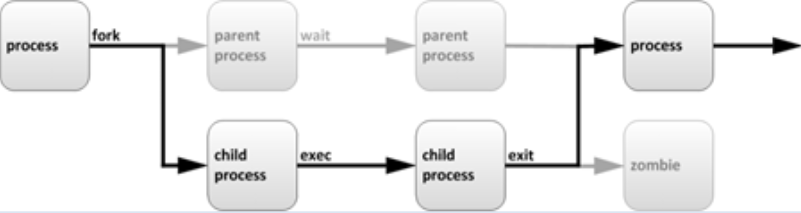
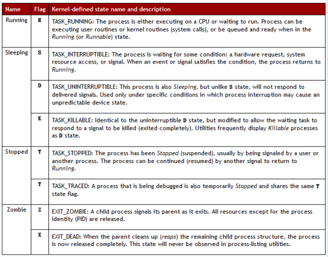
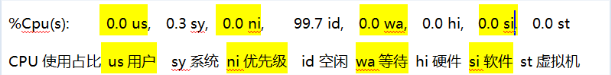
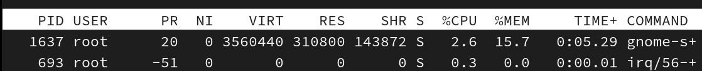
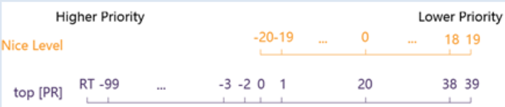

# 04.进程管理

# 一、进程简介

## 什么是进程？

进程是已启动的可执行程序的运行实例。进程-process

程序：二进制文件，静态 /usr/bin/passwd，/usr/sbin/useradd

进程：是程序运行的过程，是动态的，有生命周期及运行状态。

比如：桌面有一个qq程序，它不运行时我们称他为程序，当我们双击qq程序后，他就运行起来了，这时候就会变为一个进程。

进程会占用内存的空间及CPU。

一个进程是由多个线程组成的，比如qq程序运行起来后变为了进程，该进程中有聊天的线程、有看空间的线程、有传输文件的线程等。每个线程做一个事情。

## 进程的生命周期



父进程复制自己的地址空间（fork）创建一个新的（子）进程结构。

每个新进程分配一个，唯一的进程 ID （PID），满足跟踪安全性之需。

任何进程都可以创建子进程。

所有进程都是第一个系统进程的后代：

* CentOS5/6系统进程: init
* CentOS7系统进程: systemd
* CentOS9系统进程：/usr/lib/systemd/systemd

## 进程基础状态

进程状态产生的原因：

在多任务处理操作系统中，每个CPU（或核心）在一个时间点上只能处理一个进程。在进程运行时，它对CPU 时间和资源分配的要求会不断变化，从而为进程分配一个状态，它随着环境要求而改变。



**进程的基础状态：**

* **<font style="color:rgb(51, 51, 51);">运行状态（R）</font>**<font style="color:rgb(51, 51, 51);">‌</font>
  * <font style="color:rgb(51, 51, 51);">正在CPU执行或位于运行队列等待调度‌</font><font style="color:rgb(51, 51, 51);background-color:rgba(223, 223, 245, 0.4);"></font>
  * <font style="color:rgb(51, 51, 51);">即使未实际占用CPU，只要在队列中即属此状态‌</font><font style="color:rgb(51, 51, 51);background-color:rgba(223, 223, 245, 0.4);"></font>
* **<font style="color:rgb(51, 51, 51);">可中断睡眠（S）</font>**<font style="color:rgb(51, 51, 51);">‌</font>
  * <font style="color:rgb(51, 51, 51);">等待事件完成（如I/O操作），可被信号或事件唤醒‌</font><font style="color:rgb(51, 51, 51);background-color:rgba(223, 223, 245, 0.4);"></font>
  * <font style="color:rgb(51, 51, 51);">常见于交互式进程等待用户输入‌</font><font style="color:rgb(51, 51, 51);background-color:rgba(223, 223, 245, 0.4);"></font>
* **<font style="color:rgb(51, 51, 51);">不可中断睡眠（D）</font>**<font style="color:rgb(51, 51, 51);">‌</font>
  * <font style="color:rgb(51, 51, 51);">等待磁盘I/O等关键资源，‌不可被信号中断‌‌</font>
  * <font style="color:rgb(51, 51, 51);">硬件交互时常见，强制终止可能导致数据损坏‌</font><font style="color:rgb(51, 51, 51);background-color:rgba(223, 223, 245, 0.4);"></font>
* **<font style="color:rgb(51, 51, 51);">停止状态（T）</font>**<font style="color:rgb(51, 51, 51);">‌</font>
  * <font style="color:rgb(51, 51, 51);">由</font><code><font style="color:rgb(51, 51, 51);">SIGSTOP</font></code><font style="color:rgb(51, 51, 51);">等信号暂停执行，可通过</font><code><font style="color:rgb(51, 51, 51);">SIGCONT</font></code><font style="color:rgb(51, 51, 51);">恢复‌</font><font style="color:rgb(51, 51, 51);background-color:rgba(223, 223, 245, 0.4);"></font>
  * <font style="color:rgb(51, 51, 51);">调试或进程控制时触发‌</font><font style="color:rgb(51, 51, 51);background-color:rgba(223, 223, 245, 0.4);"></font>
* **<font style="color:rgb(51, 51, 51);background-color:#FBDE28;">僵尸状态（Z）</font>**<font style="color:rgb(51, 51, 51);">‌</font>
  * <font style="color:rgb(51, 51, 51);">进程已终止但父进程未回收资源（如PID、退出状态）‌</font><font style="color:rgb(51, 51, 51);background-color:rgba(223, 223, 245, 0.4);"></font>
  * <font style="color:rgb(51, 51, 51);">长期存在会占用系统资源‌</font><font style="color:rgb(51, 51, 51);background-color:rgba(223, 223, 245, 0.4);"></font>
* **<font style="color:rgb(51, 51, 51);">死亡状态（X）</font>**<font style="color:rgb(51, 51, 51);">‌</font>
  * <font style="color:rgb(51, 51, 51);">进程完全终止后的最终状态，不显示在任务列表‌</font><font style="color:rgb(51, 51, 51);background-color:rgba(223, 223, 245, 0.4);"></font>

# 二、进程管理

## 静态查看进程

### 静态查看进程

Windows中查看进程：


Linux中使用ps命令查看进程，ps 是process  status。

```shell
# ps aux | head -2
USER         PID %CPU %MEM    VSZ   RSS TTY      STAT START   TIME COMMAND
root          1      0.0       0.6   128096   6708 ?         Ss    16:20    0:01  /usr/lib/systemd/systemd

选项说明：
-a  	显示所有用户的进程，包括root的进程
-u   	以用户友好格式输出详细信息（如CPU/内存占用）‌
-x   	包含无控制终端的后台进程（如守护进程）
‌| head -2 后面会讲解
```

ps aux 输出的字段含义：

```shell
USER: 运行进程的用户
PID： 进程ID，我们云工程师靠PID，杀死他
%CPU: CPU占用率
%MEM: 内存占用率
VSZ：	占用虚拟内存
RSS: 	占用实际内存
TTY： 进程运行的终端
STAT：进程状态
	[常见]
		R 运行
		S 睡眠 Sleep
		T 停止的进程 
		Z 僵尸进程
		X 终止的进程
START: 进程的启动时间
TIME： 进程占用CPU的总时间，分钟：秒
COMMAND： 进程文件，进程名
```

### 进程排序

语法：

```shell
# ps aux --sort %cpu
```

示例：

```shell
以CPU占比降序排列（减号是降序）
# ps aux --sort -%cpu
# ps aux --sort %cpu
```

### 进程的父子关系

语法：

```shell
# ps -ef

选项说明：
-e：显示所有进程（包括其他用户进程）
-f：全格式输出，包含父进程ID、启动时间等完整信息‌
```

示例：

```shell
查看进程的父子关系。 请观察PID和PPID
# ps -ef
UID         PID   PPID  C STIME TTY          TIME CMD
root          1      0  0 1月22 ?       00:00:07 /usr/lib/systemd/systemd 
root          2      0  0 1月22 ?       00:00:00 [kthreadd]
root          3      2  0 1月22 ?       00:00:06 [ksoftirqd/0]
```

### 自定义显示字段(了解)

语法：

```shell
# ps axo 自定义字段

选项说明：
-a：显示所有用户的进程，包括root用户的
-x：包括无终端的后台进程
-o：指定输出字段
```

示例：

```shell
# ps axo user,pid,ppid,%mem,command | head -3 
root 8310 1 0.1 /usr/sbin/httpd
apache 8311 8310 0.0 /usr/sbin/httpd
apache 8312 8310 0.0 /usr/sbin/httpd
```

## 动态查看进程

### top命令-上半部分

Linux中使用top命令动态查看进程的信息。

```shell
# top
top - 11:45:08 up 18:54,  4 users,  load average: 0.05, 0.05, 0.05
Tasks: 176 total,   1 running, 175 sleeping,   0 stopped,   0 zombie
%Cpu(s):  0.0 us,  0.3 sy,  0.0 ni, 99.7 id,  0.0 wa,  0.0 hi,  0.0 si,  0.0 st
KiB Mem :  3865520 total,  1100000 free,   580268 used,  2185252 buff/cache
KiB Swap:  4063228 total,  4063228 free,        0 used.  2917828 avail Mem 
```

第一行：


第二行：


第三行：



第四行：


第五行：


### top命令-下半部分

#### 字段介绍



PID：进程唯一标识

USER：进程的所有者用户名

PR：进程优先级

NI：进程优先级

VIRT：虚拟内存总量

RES：实际物理内存使用量

SHR：共享内存大小

S：进程状态

%CPU：进程CPU占用百分比

%MEM：进程物理内存占用百分比

TIME+：<font style="color:rgb(51, 51, 51);">进程累计CPU使用时间（格式</font><code><font style="color:rgb(51, 51, 51);">分:秒.百分秒</font></code><font style="color:rgb(51, 51, 51);">）‌</font>

<font style="color:rgb(51, 51, 51);">COMMAND：启动进程的命令（含参数）‌</font>

#### top常用内部指令

h|?	帮助

M 	按内存的使用排序	memory

P 	按CPU使用排序

N 	以PID的大小排序

< 向前

> 向后

### top技巧

动态查看进程 top，像windows的任务管理器

```shell
# top          //回车，立刻刷新
# top -d 1   //每1秒刷新。
# top -d 1 -p 10126 查看指定进程的动态信息
# top -d 1 -p 10126,1    查看10126和1号进程
```

uptime

## 使用信号控制进程

### 信号种类

给进程发送信号(kill -l列出所有支持的信号)

```shell
# kill -l
```

| 编号 | 信号名 | 说明 |
| --- | --- | --- |
| 1 | SIGHUP | 重新加载配置 |
| 2 | SIGINT | 键盘中断Ctrl+C |
| 3 | SIGQUIT | 键盘退出Ctrl+\，类似SIGINT |
| 9 | SIGKILL | 强制终止，无条件 |
| 15 | SIGTERM | 终止（正常结束），缺省信号 |
| 18 | SIGCONT | 继续 |
| 19 | SIGSTOP | 暂停 |
| 20 | SIGTSTP | 键盘暂停Ctrl+Z |

### 信号9,15

1 创建2个文件

```shell
# touch file1 file2
```

2 通过一个终端，打开一个vim

```shell
# vim file1
```

3 通过另一个终端，打开一个vim

```shell
# vim file2
```

3 再通过另一个终端，查询两个进程。

```shell
# ps aux | grep vim
root 4362 0.0 0.2 11104 2888 pts/1 S+ 23:02 0:00 vim file1
root 4363 0.1 0.2 11068 2948 pts/2 S+ 23:02 0:00 vim file2
```

4 发送信号15 和信号9 ，观察两个终端程序状态。

```shell
# kill -15 4362
# kill -9 4363
```

观察两个终端，一个正常终止，一个非法杀死。

## 进程优先级（了解）

### 简介

Linux系统中，每个CPU在一个时间点上只能处理一个进程，通过时间片技术，来同时运行多个程序。

### 优先级范围和特性



**系统中的两种优先级：**

在top中显示的优先级有两个，PR值和nice值

NI: 实际nice值

PR（+20）: 将nice级别显示为映射到更大优先级队列，-20映射到0，+19映射到39

**优先级特性：**

nice 值越大： 表示优先级越低，例如+19

nice 值越小： 表示优先级越高，例如-20

### 查看进程的nice级别

```shell
# ps axo pid,command,nice --sort=-nice
```

### 启动具有不同nice级别的进程

默认情况：启动进程时，通常会继承父进程的 nice级别，默认为0。

手动启动不同nice：

```shell
# nice -n -5 sleep 6000 &
[1] 2220
# nice -n -10 sleep 7000 &
[2] 2229
# ps axo command,pid,nice | grep sleep
sleep 6000                    2220  -5
sleep 7000                    2229 -10
grep --color=auto sleep       2233   0

说明：
nice -n 5 	表示设置nice值为5去启动进程
sleep 6000 	表示睡眠时间为6000秒，会占用终端
&						表示后台运行
```

### 更改现有进程的nice级别

```shell
使用shell更改nice级别
1  创建一个睡眠示例程序。
# sleep 7000 &
[2] 2669

2  修改他的nice值。
# renice -20 2669
2669 (进程 ID) 旧优先级为 0，新优先级为 -20，观察新旧的nice值。
```

# 三、作业控制 jobs

## 简介

作业控制是一个命令行功能，也叫后台运行。

关键词介绍

foreground：简写为fg，表示前台进程，是在终端中运行的命令，会占领终端。

background：简写为bg，表示后台进程，没有控制终端，它不需要终端的交互。看不见，但是在运行。

## 后台程序控制示例

### 观察占领前台的现象

```shell
# sleep 2000
运行一个程序，当前终端无法输入。观察占领前台的现象。
大部分命令行输入已经无效。
ctrl + c 终止进程
```

### 后台方式运行作业

```shell
# sleep 3000 &

说明：
& 表示在后台运行程序
```

### ps查询所有程序

```shell
# ps axo pid,command

或者

# ps aux | grep sleep
root 8895 0.0 0.0 100900 556 pts/0 S 12:13 0:00 sleep 3000
```

### jobs查看后台作业

```shell
# jobs
[1]+ Running sleep 3000 &

+	‌默认作业‌：最近一次被放入后台或操作的作业，fg/bg命令默认操作此作业
-	‌次默认作业‌：当+对应的作业完成后，-对应的作业会自动升级为新的默认作业

可以列出后台运行的作业信息，包括作业的pid
#‌‌ jobs -l

查看帮助文档
# 命令 --help
比如：
# jobs --help
```

### 调动后台程序至前台

```shell
# fg 1 //将作业1调回到前台
```

### 调用前台程序至后台

```shell
# 将前台程序暂停，并转到后台
# ctrl + z
```

### 恢复后台作业继续运行

```shell
# bg 1
```

### 消灭后台作业

```shell
# 杀死指定作业号的后台作业
# kill %1
```

注意，“kill 1”   和   “kill   %1”  不同，前者终止PID为1的进程，后者杀死作业序号为1的后台程序。

### 总结

* & 后台运行程序
* jobs 查询后台作业
* kill %3  停止指定作业号的后台作业
* fg 作业号 将后台作业转至前台运行
* ctrl + z 将前台作业暂停并转至后台
* bg 作业号 将后台作业恢复运行

# 四、虚拟文件系统 proc （了解）

## 简介

虚拟文件系统：采集服务器自身的内核、进程运行的状态信息   process

## CPU

/proc/cpuinfo

```shell
# cat /proc/cpuinfo

# lscpu
```

## 内存

/proc/meminfo

```shell
# less /proc/meminfo

# free -h
```

## 内核

/proc/cmdline

```shell
# cat /proc/cmdline

# uname -r
```


> 更新: 2026-06-15 19:10:44  
> 原文: <https://www.yuque.com/u41736172/az9urv/aovfgh3snpaglg6f>