# 06.存储管理

# 一、磁盘管理

## 磁盘简介

### 名词

磁盘/硬盘/disk是同一个东西，不同于内存的是容量比较大。

### 存储设备类型

从工作原理区分：

* **机械**：机械硬盘即是传统普通硬盘，主要由：盘片，磁头，盘片转轴及控制电机，磁头控制器，数据转换器，接口，缓存等几个部分组成。

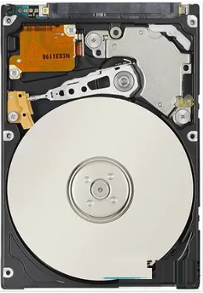

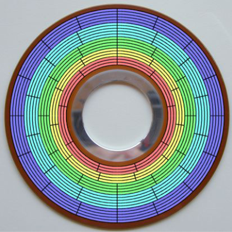

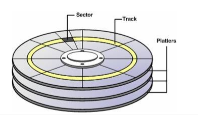

* **固态**：固态驱动器（Solid State Disk或Solid State Drive，简称SSD），俗称固态硬盘，固态硬盘是用固态电子存储芯片阵列而制成的硬盘。下图是拆开的一块固态硬盘。

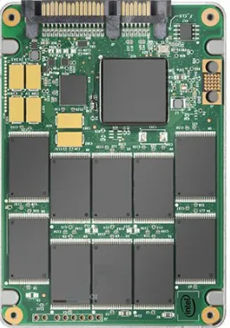

### 尺寸

* 3.5英寸
* 2.5
* 1.8

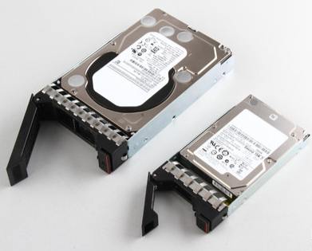

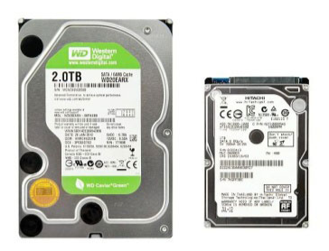

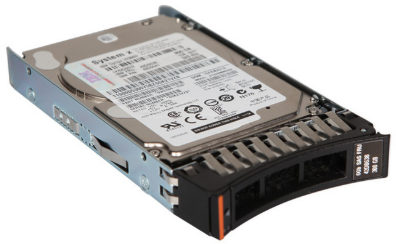

### 磁盘接口类型

早期IDE —— 现在SATA I/II/III

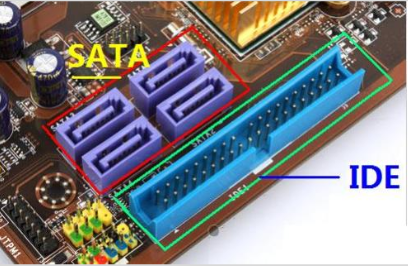

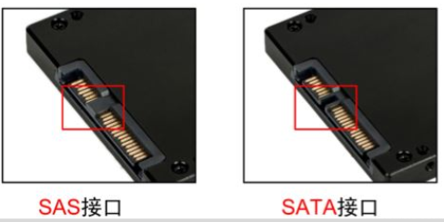

SCSI nvme

### 转速

5400rpm

7200

10000

15000

### 厂商

西部数据

希捷

三星/日立/金士顿

移动硬盘：西部数据！

### 术语

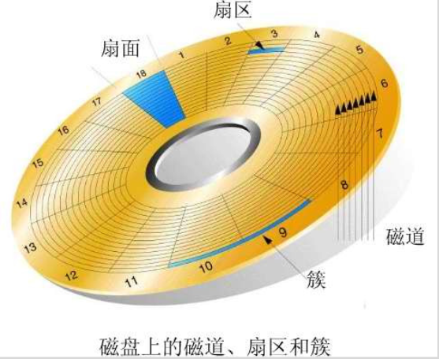

* 盘片

一块硬盘有若干盘片，每个盘片有可以存储数据的上、下两盘面（Side）。这些盘面堆叠在主轴上高速旋转，它们从上至下从“0”开始依次编号。

* 磁道

每个盘面被划分成许多同心圆，这些同心圆轨迹叫做磁道；磁道从外向内从0开始顺序编号。

* 扇区

将一个盘面划分为若干内角相同的扇形，这样盘面上的每个磁道就被分为若干段圆弧，每段圆弧叫做一个扇区。每个扇区中的数据作为一个单元同时读出或写入。硬盘的第一个扇区，叫做引导扇区。

* 柱面

所有盘面上的同一磁道构成一个圆柱，称作柱面

### 命名

**在Linux系统眼中，一切皆文件！**

kernel对不同接口的硬盘命名方式不同。

RHEL9/CentOS9中接口的命名：

* IDE（并口）
  * /dev/hda
  * /dev/hdb
* SATA（串口）
  * /dev/sda
    * /dev设备文件目录
    * sda是一个文件
    * s代表sata就是串口
    * d代表磁盘 disk
    * a第一块
  * /dev/sdb
  * 请问第五块硬盘的全名？ /dev/sde

### 磁盘分区类型

#### MBR

* 主引导记录（MBR，Master Boot Record）是位于磁盘最前边的一段引导
* MBR支持最大的磁盘容量是 <2TB。设计时分配4个主分区
* 如果希望超过4个分区，需放弃主分区，改为扩展分区和逻辑分区
* fdisk命令

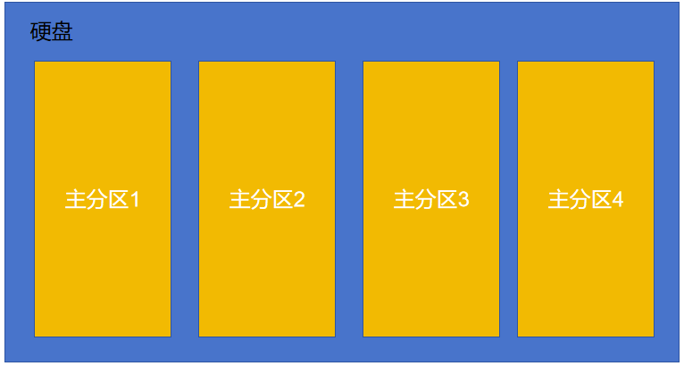

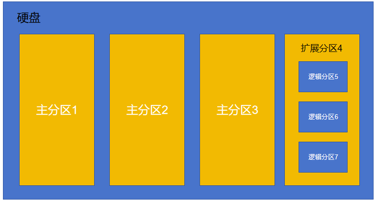

#### GPT

* 全局唯一标识分区表（GUIDPartition Table，缩写：GPT）是一个实体硬盘的分区表的结构布局的标准。
* GPT 支持大于2T的硬盘，支持128个主分区

## 管理磁盘

### 添加磁盘

给虚拟机添加一块磁盘。（**我们多加几块，至少加上5块硬盘，每块5个G大小，多练习**）

1. 先关闭虚拟机电源
2. 编辑虚拟机设置

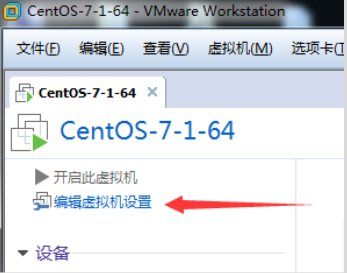

3. 增加磁盘

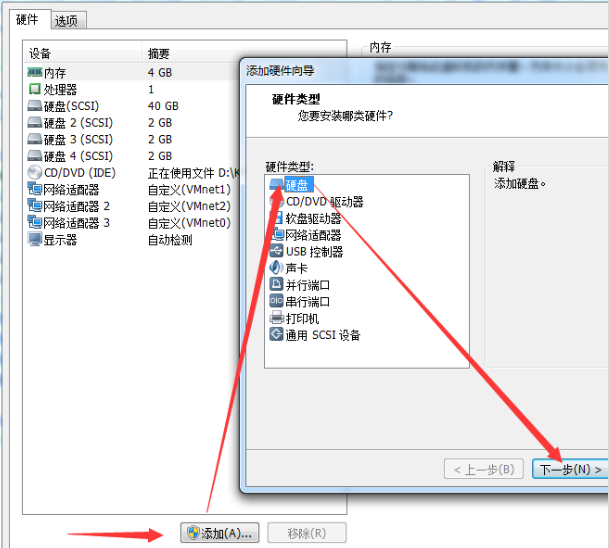

之后一路下一步即可，将磁盘大小添加为5G。

### 管理磁盘流程三部曲

新硬盘：分区(MBR或者GPT) ---->格式化/文件系统 Filesystem ----> 挂载mount

毛坯房：隔间----------->    放家具/打造格子柜----------------> 加个门/目录

对硬盘进行分区、格式化后，是不能直接访问分区的！我们需要创建一个空目录，将这个空目录和分区关联到一块，我们访问这个空目录就相当于访问到分区了！

将空目录和分区关联到一块的过程，称为挂载（mount）！这个空目录称为挂载点！

### 查看磁盘信息

#### 方式一

```shell
# ll /dev/sd*
或者
# ll /dev/nvme*	（同学们的电脑）
brw-rw----. 1 root disk 8,  0 1月  25 09:35 /dev/sda
brw-rw----. 1 root disk 8,  1 1月  25 09:35 /dev/sda1
brw-rw----. 1 root disk 8,  2 1月  25 09:35 /dev/sda2
brw-rw----. 1 root disk 8, 16 1月  25 09:35 /dev/sdb
brw-rw----. 1 root disk 8, 32 1月  25 09:35 /dev/sdc
brw-rw----. 1 root disk 8, 48 1月  25 09:35 /dev/sdd
```

/dev/sdb、/dev/sdc、/dev/sdd 相当于购买的新磁盘。

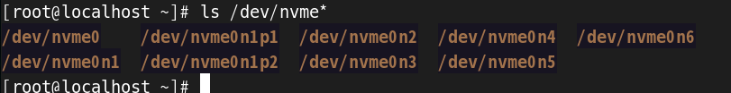

#### 方式二

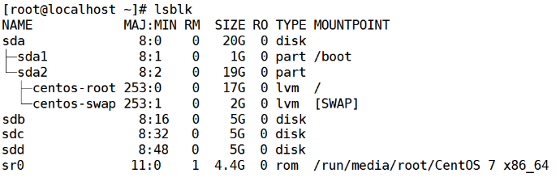

名称 设备类型 序号 是否可移动设备  大小  是否只读  磁盘或分区  挂载点

### 创建分区

MBR：把房子分成卧室和客厅

:::info
**第一步：启动分区工具**

:::

```shell
# fdisk /dev/sdb

或者

# fdisk /dev/nvme0n2
```

:::info
**第二步：进入会话模式**

:::

**提示1：**

```shell
# fdisk /dev/sdb
欢迎使用 fdisk (util-linux 2.37.4)。

更改将停留在内存中，直到您决定将更改写入磁盘。
使用写入命令前请三思。

Device does not contain a recognized partition table
使用磁盘标识符 0xd43058cb 创建新的 DOS 磁盘标签。

命令(输入 m 获取帮助)：
```

敲击字母“n”键，新建分区。（欢迎界面，输入帮助指令或操作指令。）

**提示2：**

```shell
命令(输入 m 获取帮助)：n
Partition type:
   p   primary (0 primary, 0 extended, 4 free)
   e   extended
Select (default p): 
```

敲击字母“p”键，创建主分区。（请选择主分区，或扩展分区）

**提示3：**

```shell
Select (default p): p
分区号 (1-4，默认 1)：
```

敲击数字“1”键，设置主分区号。（选择分区号）

**提示4：**

```shell
分区号 (1-4，默认 1)：1
起始 扇区 (2048-10485759，默认为 2048)：
```

敲击回车键，选择分区从磁盘开始的扇区。（选择磁盘开始的扇区）

**提示5：**

```shell
起始 扇区 (2048-10485759，默认为 2048)：
将使用默认值 2048
Last 扇区, +扇区 or +size{K,M,G} (2048-10485759，默认为 10485759)：
```

输入分区大小“+2G” 后回车，实际环境根据磁盘划分，如4T磁盘，可以500G 一个分区。（选择磁盘分区结束的扇区，即分区大小）

**提示6：**

```shell
Last 扇区, +扇区 or +size{K,M,G} (2048-10485759，默认为 10485759)：+2G
分区 1 已设置为 Linux 类型，大小设为 2 GiB

命令(输入 m 获取帮助)：
```

已经完成 2G 大小分区记录。但未生效

**提示7：**

```shell
命令(输入 m 获取帮助)：w
The partition table has been altered!

Calling ioctl() to re-read partition table.
正在同步磁盘。
[root@localhost ~]# 
```

输入w保存分区信息，自动退出分区工具。

:::info
**第三步：刷新分区表**

:::

```shell
# partprobe /dev/sdb  
```

:::info
**第四步：查看分区结果**

:::

```shell
# fdisk -l /dev/sdb
磁盘 /dev/sdb：5368 MB, 5368709120 字节，10485760 个扇区
Units = 扇区 of 1 * 512 = 512 bytes
扇区大小(逻辑/物理)：512 字节 / 512 字节
I/O 大小(最小/最佳)：512 字节 / 512 字节
磁盘标签类型：dos
磁盘标识符：0xd43058cb

   设备 Boot      Start         End      Blocks   Id  System
/dev/sdb1            2048     4196351     2097152   83  Linux
```

或是使用`lsblk`也可查看

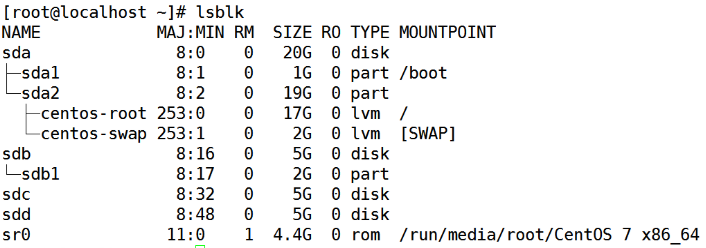

结论：划分磁盘完毕，/dev/sdb1

### 创建文件系统（格式化）

文件系统：房子里的格子柜

```shell
# mkfs.ext4 /dev/sdb1

或者

# mkfs.ext4 /dev/nvme0n2p1

mke2fs 1.46.5 (30-Dec-2021)
创建含有 262144 个块（每块 4k）和 65536 个inode的文件系统
文件系统UUID：e06c092d-8935-4f79-8a41-263a2ea19d12
超级块的备份存储于下列块： 
	32768, 98304, 163840, 229376

正在分配组表： 完成                            
正在写入inode表： 完成                            
创建日志（8192 个块）完成
写入超级块和文件系统账户统计信息： 已完成
```

新创建的分区，sdb2，sdb3 都要格式化

mk = make 创建

fs = file system 文件系统

ext4 指的是文件系统类型，文件系统类型有：ext、ext2、ext3、ext4等

### 挂载mount

将分区的设备文件 和 空目录关联到一块的过程，称为挂载！

这个空目录称为 挂载点！

挂载：mount

挂载点：mount point

手动挂载

```shell
创建挂载点，一个分区一个挂载点		type
# mkdir /mnt/disk1

# mount -t ext4  /dev/sdb1 /mnt/disk1
```

### 查看挂载信息

方法1：`df -hT`

```shell
# df -Th
Filesystem Type Size Used Avail Use% Mounted on

/dev/sdb1 ext4  2G    6M   1.9G  3% /mnt/disk1

分区     文件系统   大小  占用  空闲  占比  挂载点
```

方法2：`mount`

```shell
# mount

/dev/sdb1 on /mysql_data type xfs (rw,relatime,seclabel,attr2,inode64,noquoa)
/dev/sdb3 on /mnt/disk1/disk2/disk3/disk4 type ext4 (rw,relatime,seclabel,dta=ordered)

mount 看的是磁盘有没有特殊属性，具体属性在后续讲解。
```

方法3：`lsblk`

```shell
# lsblk
```

> 扩展命令：

```shell
生成指定大小的文件！比如：生成一个 hello.txt 文件，100M大小
dd if=/dev/zero of=hello.txt bs=1M count=100

if: input file
of: output file
bs：每次读写多大的内容
count：读写多少次
```

### 挂载重启失效的问题

我们上面的挂载方式，属于手动挂载！使用手动挂载方式，系统在重启后，挂载就会失效！（分区、格式化还是在的）

系统能不能帮我们自动挂载？

方式一：永久挂载fstab（略）

方式二：写入自启动文件

```shell
# vim /root/.bashrc 
# mount -t ext4  /dev/sdb1 /mnt/disk1
不要影响文件原先的内容
```

> 每个用户的家目录中都有一个`.bashrc`文件，该文件是一个隐藏文件。这个文件在该用户连接Linux系统之后，系统会自动执行该文件中的命令。

### 磁盘分区的数量可以超过4吗？

MBR分区类型，磁盘的分区数量可以超过4个！需要使用扩展分区。

需求：添加一块硬盘5G，给该硬盘分区，3个主分区，1个扩展分区。主分区每个都是1G大小，扩展分区是剩余的大小（2G）。

在扩展分区中，再分2个逻辑分区，每个1G。

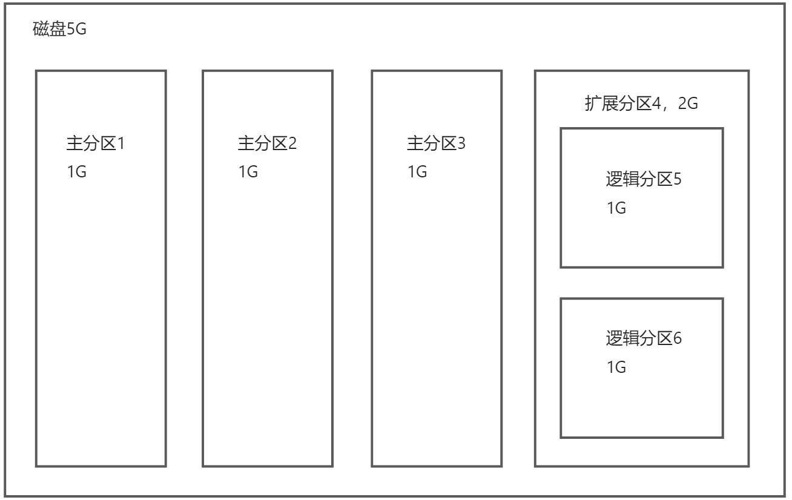

具体操作步骤和上面的案例基本一样！（格式化、挂载等都一样，但是注意扩展分区不能直接使用，所以我们不要对扩展分区进行格式化、挂载的操作！）

### 重启后的影响

mount临时挂载就消失了。需要使用**永久挂载**

```shell
# vim /etc/fstab
/dev/sdb1  /mnt/disk1  ext4 defaults 0 0

字段的含义：
第一列：分区设备文件名
第二列：挂载点
第三列：文件系统类型
第四列：挂载选项，一般用defaults
  defaults(默认选项：rw, suid, dev, exec, auto, nouser, async)
  ro(只读)/rw(读写)
  noauto(不自动挂载)
  user(允许普通用户挂载)
  nouser(只允许root挂载)
  exec/noexec(是否允许执行二进制文件)
  多个选项用逗号分隔
第五列：是否需要备份，一般用0，表示不备份；1表示需要备份
第六列：是否检测文件系统，一般用0，0-不检查，1-优先检查，2-次要检查
```

然后使用立刻挂载命令：`mount -a`

卸载（解除挂载）

```shell
# umount 分区设备文件名或挂载点

# umount /dev/sdd5
或者
# umount /mnt/disk5
```

# 二、逻辑卷管理LVM

## 前言

写满一个磁盘需要几步？

```shell
# dd if=/dev/zero of=/mnt/disk4/1.txt bs=1M count=1000

dd 命令可以用来复制文件，生成一个指定大小的文件！
if：input file输入文件
/dev/zero是Linux系统中一个特殊的虚拟设备文件，它能够无限地提供空字符
of：output file输出文件
bs：块大小
count：复制块的数量
```

基本磁盘，缺点是无法调整大小！！！

## LVM目的

管理磁盘的一种方式，性质与基本磁盘无异

特点：随意扩张大小

## 术语

<font style="color:rgb(0,0,0);">LVM 是 Logical Volume Manager 的简称，中文就是逻辑卷管理。</font>

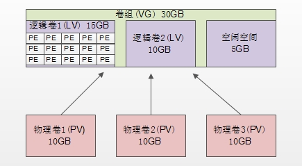

* <font style="color:rgb(0,0,0);">物理卷（PV，Physical Volume）：就是真正的物理硬盘或由物理硬盘分成的分区。</font>
* <font style="color:rgb(0,0,0);">卷组（VG，Volume Group）：将多个物理卷合起来就组成了卷组，组成同一个卷组的物理卷可以是同一个硬盘的不同分区，也可以是不同硬盘上的不同分区。我们可以把卷组想象为一个逻辑硬盘，它是由多个硬盘的多个分区组成。</font>
* <font style="color:rgb(0,0,0);">逻辑卷（LV，Logical Volume）：卷组是一个逻辑硬盘，硬盘必须分区之后才能使用，这个分区我们称作逻辑卷。逻辑卷可以格式化和写入数据。我们可以把逻辑卷想象成为分区。</font>
* <font style="color:rgb(0,0,0);">物理扩展（PE，Physical Extend）：PE 是用来保存数据的最小单元，我们的数据实际上都是写入PE当中，PE 的大小是可以配置的，默认是 4MB。（之前我们做分区的时候，设置的分区大小其实都转换为了占用多少扇区，这里的PE也是一个道理，分成多大的逻辑卷，其实就是转换为了占用多少个PE）</font>

> 注意：/boot分区是不能使用LVM的，必须使用之前的物理分区。其他的分区可以使用LVM。

## 创建LVM

第一步：准备物理磁盘

```shell
# ll /dev/sd*
brw-rw----. 1 root disk 253, 32 Jun 6 17:38 /dev/sdc
brw-rw----. 1 root disk 253, 48 Jun 6 17:38 /dev/sdd
brw-rw----. 1 root disk 253, 64 Jun 6 17:38 /dev/sde
```

第二步：将物理磁盘，转换成物理卷-PV

```shell
# pvcreate /dev/sdc
Physical volume "/dev/sdc" successfully created
```

第三步：创建卷组-VG

```shell
# vgcreate vg1 /dev/sdc
Volume group "vg1" successfully created
```

第四步：创建逻辑卷  -L大小  -n卷名   vg1组名

```shell
# lvcreate -L 200M -n lv1 vg1
指定大小，单位M，G
```

第五步：查看LV

```shell
# lvscan 
ACTIVE '/dev/vg1/lv1' [400.00 MiB] inherit
ACTIVE '/dev/vg1/lv2' [200.00 MiB] inherit
```

第六步：创建文件系统/格式化

```shell
# mkfs.ext4 /dev/vg1/lv1
注意：/dev/卷组名/逻辑卷名
```

第七步：创建挂载点

```shell
# mkdir /mnt/lv1
```

第八步：挂载

```shell
# mount /dev/vg1/lv1 /mnt/lv1
```

第九步：查看挂载结果

```shell
# df -hT
Filesystem 1K-blocks Used Available Use% Mounted on
/dev/mapper/vg1-lv1 651948 32928 619020 6% /mnt/lv1
/dev/mapper/vg1-lv2 245671 2062 226406 1% /mnt/lv2
```

逻辑卷管理完毕，就可以向挂载点写入数据了。

## VG管理

扩大VG vgextend

环境：/dev/vg1 容量由5G 扩容到 10G。

步骤1，创建PV。而后使用第二步，将PV增加到VG中。

```shell
# pvcreate /dev/sdd
```

步骤2：扩展VG

```shell
# vgextend vg1 /dev/sdd
Volume group "vg1" successfully extended
```

查看VG

```shell
# vgs
VG #PV #LV #SN Attr VSize VFree
vg1 2 2 0 wz--n- 3.99g 3.76g
```

## LV管理实战-在线扩容

扩大LV lvextend

### lv扩容

```shell
1.查看VG空间。
# vgs
VG #PV #LV #SN Attr VSize VFree
vg1 2 1 0 wz--n- 9.99g 5.99g
请观察，VG是否有剩余空间。

2.扩容LV。 
# lvextend -L +200M /dev/vg1/lv2
增加200M空间，给lv2
```

### FS扩容   file  system

```shell
先观察文件系统当前容量。
# df -Th 
/dev/mapper/vg1-lv2 ext4 240M 32M 192M 15% /mnt/lv2

# resize2fs /dev/vg1/lv2
再次观察df -hT 的分区大小。和上一次的对比一下。大小已经发生改变。
```

查看FS

```shell
# df -Th
Filesystem Type Size Used Avail Use% Mounted on
/dev/mapper/vg1-lv1 xfs 765M 67M 698M 9% /mnt/lv1
/dev/mapper/vg1-lv2 ext4 488M 32M 429M 7% /mnt/lv2
```

请注意对比，之前的输出结果，文件系统的大小发生改变。

## 命令汇总

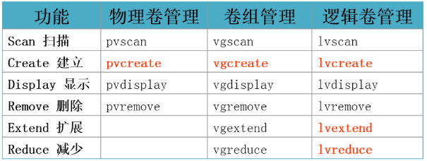

# 三、交换分区管理 Swap

**<font style="background-color:#FBDE28;">/ 根分区、/boot 分区、swap 分区</font>**

## 简介

交换分区的作用：'提升'内存的容量，防止OOM（Out Of Memory）

交换分区其实是将硬盘中划出一部分空间作为交换分区的，充当了虚拟内存。当物理内存空间不够用的时候，可以用交换分区。

swap大小：

* 推荐：设置交换分区大小为内存的2倍
* 生产
  * 大于 4GB 而小于 16GB 内存的系统，最小需要 4GB 交换空间；
  * 大于 16GB 而小于 64GB 内存的系统，最小需要 8GB 交换空间；
  * 大于 64GB 而小于 256GB 内存的系统，最小需要 16GB 交换空间。

## 查看当前的交换分区

```shell
# free -h
              total        used        free      shared  buff/cache   available
Mem:      		1980         704         614          19         661        1110
Swap:     		2047           0        2047
```

## 增加交换分区

目前我们的交换分区是2G。

打算将swap分区扩容一下，扩容到4G。

### 准备分区

准备将/dev/sde磁盘，划分为1G分区为例

```shell
# fdisk /dev/sde 
过程略（可选：划分分区后，将类型设置为82（按t！！！老铁））

# partprobe /dev/sde

# ll /dev/sde*
brw-rw----. 1 root disk 253, 16 12月 6 10:18 /dev/sde
brw-rw----. 1 root disk 253, 17 12月 6 10:18 /dev/sde1
```

### 格式化

```shell
# mkswap /dev/sde1
```

### 挂载

```shell
# swapon /dev/sde1 
```

### 验证

查看增加后的交换分区。是不是变大了？老铁！

```shell
# free -h
```

# 四、扩展：系统启动失败解决

## 问题描述

之前我们在上面的分区练习中，修改了`/etc/fstab`文件，里面加了一些内容，用来做自动挂载的！

`/etc/fstab`文件，在系统启动的时候会加载该文件，如果这个文件里面有问题，那么系统就会启动失败！

效果如下：

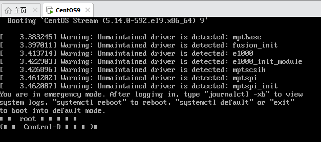

## 解决办法

输入一下root超级管理员，就可以进入到字符界面模式。

然后，修改`/etc/fstab`文件中不合适的地方即可。

重启。

VMware workstation有个问题：

我们之前给`/dev/sdb`硬盘分了3个主分区：sdb1 sdb2 sdb3

给`/dev/sdc`硬盘分了两个主分区、一个扩展分区，扩展分区中分了两个逻辑分区。

但是在本次重启系统的时候，系统将 sdb 硬盘的分区和 sdc 硬盘的分区换了！！！


> 更新: 2026-06-02 19:38:01  
> 原文: <https://www.yuque.com/u41736172/az9urv/rx1l89smy9g7ituc>