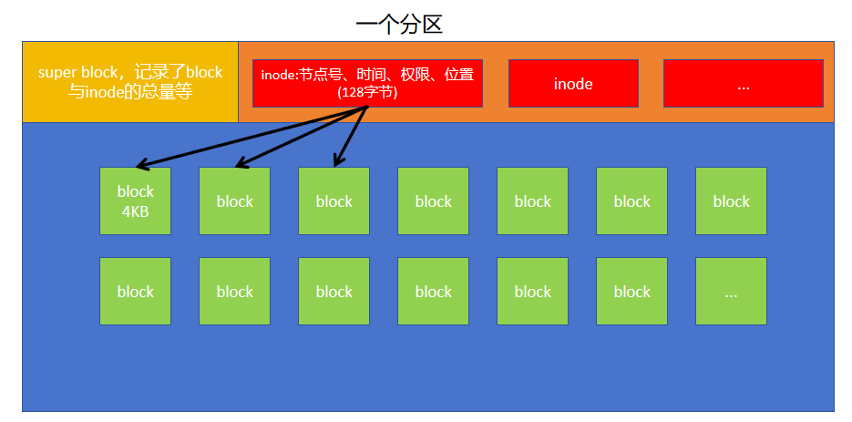
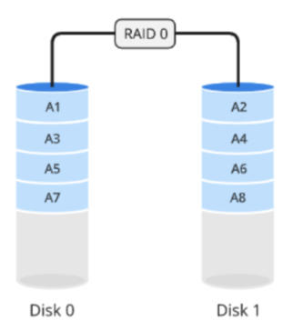
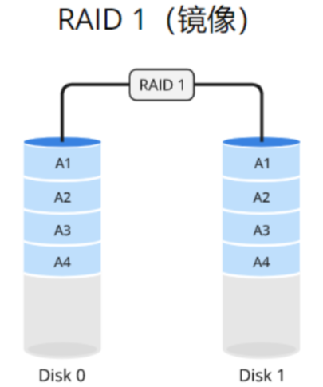
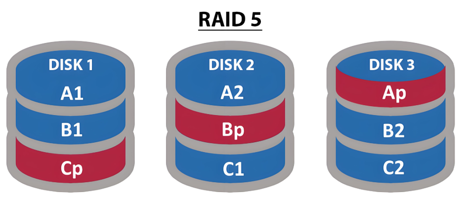
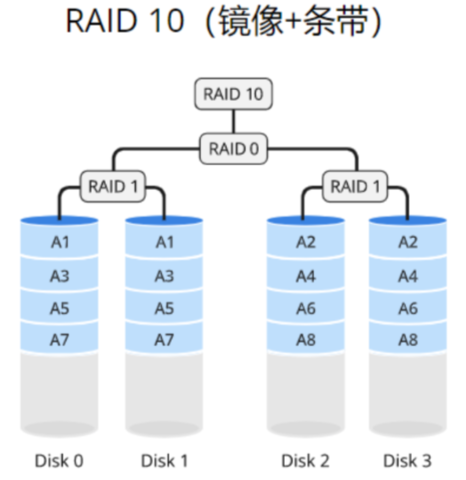
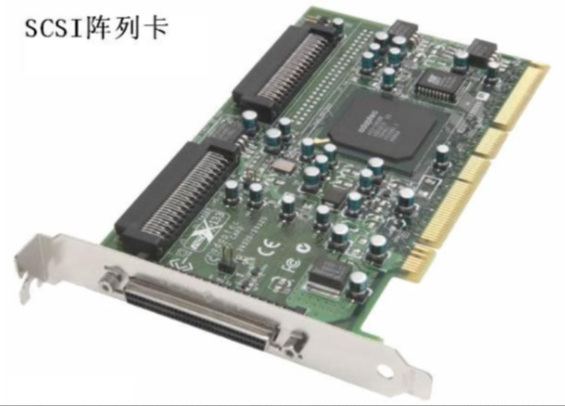
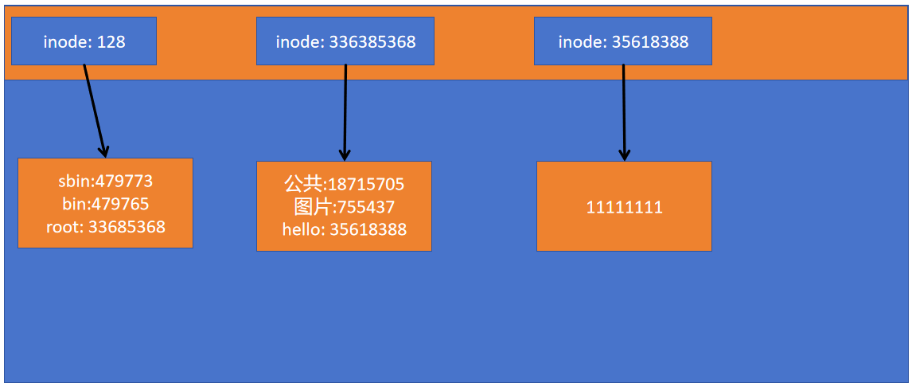

# 07.RAID&文件系统

# 一、文件系统EXT4

## 简介

### 名词解释

#### EXT4

Ext4是第四代扩展文件系统的缩写，它是2008年推出的。它是一个真正可靠的文件系统，它几乎在过去几年的大部分发行版中一直是默认选项，它是由比较老的代码生成的。它是一个日志文件系统，意味着它会对文件在磁盘中的位置以及任何其它对磁盘的更改做记录。如果系统崩溃，得益于journal技术，文件系统很少会损坏。

EXT4是第四代扩展文件系统（英语：Fourth extended filesystem）

CentOS6是ext4

CentOS5是ext3

#### XFS

XFS是一种非常优秀的日志文件系统，它是SGI公司设计的。 XFS具有各种改进，使其能够在文件系统群体列表中脱颖而出，例如用于元数据操作的日志记录，可扩展/并行I / O，挂起/恢复I / O，在线碎片整理，延迟性能分配等等。

XFS一种高性能的日志文件系统

CentOS7.0开始默认文件系统是xfs

CentOS9.0默认文件系统是xfs

#### 区别

单个文件的大小，EXT4可以是16GB到16TB，而XFS可以是16TB到16EB，但我们通常会限制在100TB左右

EXT4受限制于磁盘结构和兼容问题，可扩展性不如XFS

### 名词



#### inode

inode：索引节点

记录文件的属性（文件的元数据metadata）

元数据：文件的属性，大小，权限，属主，属组，连接数，块数量，块的编号

一个文件占用一个inode，同时记录此文件数据所在的block number。

inode大小 为 128 bytes

#### block

存储文件的实际数据。

实际存储文件的内容，若文件较大，会占用多个block。

block大小 为默认为4K

#### superblock

* block 与 inode 的总量；
* 未使用与已使用的 inode 与 block 数量；

#### block group

块组

## 示例1：inode(index  node 索引节点)

```shell
创造一个文件，观察inode信息。
# ll -i 文件名
```

## 示例2：block(块 文件内容）

问题1：新分区中，文件的数量和什么有关系。

1 观察某个分区中的inode节点数

```shell
# df -i
```

2 创建一个文件

```shell
# touch 文件名
```

3 再次观察inode节点数

```shell
# df -i 
```

4 创造大量文件。观察inode使用情况

```shell
# touch file{1..30000}
```

结论：inode决定了文件系统中文件的数量。

但是，能否向已存在的文件中写入内容呢？答案是？

结论：block决定了文件存储的空间。

问题2：当分区空间大小消耗完毕，还能否新增文件？

磁盘空间的限制根据inode和block两方面

# 二、RAID实战

## 简介

RAID：廉价磁盘冗余阵列（Redundant Array of Independent Disks）

作用：容错、提升读写速率

RAID存储提供了不同的级别，比如：RAID 0，RAID 1等等。每个级别具有不同的冗余和性能特性。

## RAID 0（条带）

### 介绍

RAID 0使用数据条带化的方式，将数据分散存储在多个磁盘上，而不进行冗余备份。

在存储数据的时候，是将数据分成固定大小的块，并依次存储在每个磁盘上。

例如：如果是由两个磁盘组成的RAID 0，那么一块数据的第一个部分存储在磁盘A上，第二个部分存储在磁盘B上，以此类推。

这种条带化的方式可以同时从多个硬盘中读取或写入数据，从而提高系统的性能。

图示：



### 特点

* 至少需要两块磁盘
* 数据条带化分布到磁盘，拥有高读写性能，100%的存储空间利用率
* 数据没有冗余策略，一块硬盘故障，数据将无法恢复

> RAID 0适用于那些需要高读写性能而不关心数据冗余的场景。或者说适用在那些需要高读写性能但是数据又不是很重要的场景！

## RAID 1（镜像）

### 介绍

RAID 1使用数据镜像的方式将数据完全复制到两个或多个磁盘上。

当写入数据时，数据同时写入所有磁盘。这样，每个磁盘都具有相同的数据副本，从而实现数据的冗余备份。

如果其中一个磁盘发生故障，系统可以继续从剩余的磁盘中读取数据，确保数据的可用性和完整性。



### 特点

* 至少需要2块磁盘
* 数据镜像备份写到磁盘上，可靠性高，磁盘利用率为50%
* 读性能可以，但写性能不佳
* 一块磁盘故障，不会影响数据的读写

缺点是：

* 成本增加：由于需要额外的磁盘用于数据冗余备份，RAID 1的成本相对较高，需要考虑额外的硬件成本
* 写入性能略低：由于数据需要同时写入到多个磁盘，相对于单个磁盘的写入性能，RAID 1的写入性能略低

> RAID 1适用于对数据冗余和高可用性要求较高的场景。

## RAID 5（奇偶校验）

### 介绍

RAID 5使用数据条带化的方式将数据分散存储在多个磁盘上，并通过分布式的奇偶校验实现数据的冗余备份。

数据和奇偶校验信息被组织成数据块，其中奇偶校验信息被分布式存储在不同的磁盘上，通过奇偶校验提供数据的冗余性。

当写入数据时，奇偶校验信息也会被更新。如果其中一个磁盘发生故障，系统可以通过重新计算奇偶校验信息来恢复丢失的数据。

这种方式可以同时提供性能增强和数据冗余。



### 特点

* RAID 5至少需要3块磁盘
* 数据条带化存储在磁盘，读写性能好，磁盘利用率为（n - 1）/ n
* 以奇偶校验（分散）做数据冗余
* 一块磁盘故障，可根据其他数据块和对应的校验数据重构损坏数据（消耗性能）
* 兼顾了存储性能、数据安全等各方面因素（性价比高）
* 适用于大部分的应用场景

## RAID 6（双奇偶校验）

### 介绍

RAID 6使用数据条带化的方式将数据分散存储在多个磁盘上，并通过分布式奇偶校验和双重奇偶校验实现数据的冗余备份。

数据和奇偶校验信息被组织成数据块，其中奇偶校验信息被分布式存储在不同的磁盘上，并通过双重奇偶校验提供更高的数据冗余性。

当写入数据时，奇偶校验信息也会被更新。如果其中两个磁盘发生故障，系统可以通过重新计算奇偶校验信息来恢复丢失的数据。

这种方式可以同时提供性能增强和更高级别的数据冗余。

### 特点

* 至少需要4块磁盘
* 数据条带化存储在磁盘，读写性能好，容错能力强
* 采用双重校验方式保证数据的安全性
* 如果2块磁盘同时故障，可以通过两个校验数据来重建两个磁盘的数据
* 成本要比其他RAID级别高，并且更复杂
* 一般用于对数据安全性要求非常高的场合

> RAID 6适用于需要更高级别的数据冗余和性能增强的场景。

## RAID 10（镜像+条带）

### 介绍

RAID 10使用条带化的方式将数据分散存储在多个磁盘上，并通过镜像实现数据的冗余备份。

数据被分成固定大小的块，并依次存储在不同的磁盘上，类似于RAID 0。

然而，每个数据块都会被完全复制到另一个磁盘上，实现数据的冗余备份，类似于RAID 1。

这样RAID 10在提供性能增强的同时，也提供了数据的冗余保护。



### 特点

* RAID 10是RAID1 + RAID 0的组合
* 至少需要4块磁盘
* 两块硬盘一组先做RAID 1，再将做好RAID 1的两组做RAID 0
* 兼顾数据的冗余（RAID 1镜像）和读写性能（RAID 0数据条带化）
* 磁盘利用率为50%，成本较高

> RAID 10适用于需要高性能和数据冗余的场景。

## RAID各级别对比

| 对比项 | RAID 0 | RAID 1 | RAID 10 | RAID 5 | RAID 6 |
| --- | --- | --- | --- | --- | --- |
| 磁盘数 | ≥2 | ≥2 | ≥4 | ≥3 | ≥4 |
| 存储利用率 | 100% | 50% | 50% | n-1/n | n-2/n |
| 校验盘 | 无 | 无 | 无 | 1 | 2 |
| 容错性 | 无 | 有 | 有 | 有 | 有 |
| IO性能 | 高 | 低 | 中 | 较高 | 较高 |

## RAID的实现

RAID的实现方式有两种：

* 通过软件方式实现，称为软RAID
* 通过硬件方式实现，称为**硬RAID**

硬件：看得见、摸得着

软件：看得见、摸不着

### 软RAID

软RAID运行于操作系统底层，将SCSI或者IDE控制器提交上来的物理磁盘，虚拟成虚拟磁盘，再提交给管理程序来进行管理。软RAID有以下特点：

* 占用内存空间
* 占用CPU资源
* 如果程序或者操作系统故障就无法运行

总结：基于以上缺陷，所以现在企业很少用软RAID。

### 硬RAID

通过用硬件来实现RAID功能的就是硬RAID，独立的RAID卡、主板集成的RAID芯片都是硬RAID。

RAID卡就是用来实现RAID功能的板卡，通常是由I/O处理器、硬盘控制器、硬盘连接器和缓存等一系列零组件构成的。

不同的RAID卡支持的RAID功能不同，比如支持RAID0、RAID1、RAID5、RAID10不等。



## 软RAID示例

需求：

我们打算在Linux服务器上，实现RAID 5磁盘阵列。

raid 5 至少需要3块磁盘

我们是通过软raid 实现的，可以在实现raid的时候加备用盘。

备用磁盘1块！

也就是总共用4个磁盘，3个用来组成raid5，1个处于热备份的状态！

最终我们能够实现坏1块磁盘后，热备的顶上去，raid5又是完整的，然后还可以再坏1块！

1. 准备4块硬盘

```shell
# ll /dev/sd*
brw-rw---- 1 root disk 8, 48 Jan 13 16:07 /dev/sdd
brw-rw---- 1 root disk 8, 64 Jan 13 16:07 /dev/sde
brw-rw---- 1 root disk 8, 80 Jan 13 16:07 /dev/sdf
brw-rw---- 1 root disk 8, 80 Jan 13 16:07 /dev/sdg
```

RAID5：(3块数据盘) + （1块热备硬盘)

2. 创建RAID

```shell
# mdadm -C /dev/md0 -l5 -n3 -x1 /dev/sd{d,e,f,g}

说明：
mdadm命令用来管理磁盘RAID，multiple disk admin
-C 创建RAID
/dev/md0 第一个RAID设备
-l5 RAID5
-n RAID成员的数量
-x 热备磁盘的数量，表示当磁盘阵列中有磁盘损坏时，该磁盘会顶上去

# yum -y install mdadm     //确保mdadm命令可用
```

3. 格式化，挂载

```shell
# mkfs.ext4 /dev/md0
# mkdir /mnt/raid5
# mount /dev/md0 /mnt/raid5
# cp -r /etc /mnt/raid5
```

4. 查看RAID信息

```shell
# mdadm -D /dev/md0 			//-D 查看详细信息

/dev/md0:
Version : 1.2
Creation Time : Mon Jan 13 16:28:47 2016
Raid Level : raid5		//raid类型
Array Size : 2095104 (2046.34 MiB 2145.39 MB)
Used Dev Size : 1047552 (1023.17 MiB 1072.69 MB)
Raid Devices : 3		//组中设备的数量
Total Devices : 4	//总设备数
Persistence : Superblock is persistent

Update Time : Mon Jan 13 16:34:51 2016
State : clean 	//状态，卫生的，哈哈
Active Devices : 3	//活跃3个
Working Devices : 4  //4个在工作
Failed Devices : 0		//坏了1就危险了，2个就完蛋了
Spare Devices : 1		//热备的1个。

Layout : left-symmetric
Chunk Size : 512K	//校验码大小
Number Major Minor RaidDevice State
0 8 48 0 active sync /dev/sdd		//同步
1 8 64 1 active sync /dev/sde		//同步
4 8 80 2 active sync /dev/sdf		//同步

3 8 96 - spare /dev/sdg
```

5. 模拟一块硬盘损坏，并移除

```shell
终端一：
# watch -n 0.5 'mdadm -D /dev/md0 | tail' //watch持续查看

说明：
watch命令可以定期执行指定的命令，并将输出结果全屏显示，方便用户实时监控命令的输出变化。
watch [选项] 命令
选项说明：
-n：设置刷新间隔时间，-n 5 表示每隔5秒刷新一次


终端二：
# mdadm /dev/md0 -f /dev/sde -r /dev/sde 
//模拟坏了并移除
 -f --fail
 -r --remove
```

# 三、文件链接

## 符号链接/软链接

### 名词解释

symbolic link /软链接

链接：link

软：soft

### 示例

1 创建一个文件，并输入内容。

```shell
# echo 111 > /file1
```

2 创建一个软连接。

```shell
# ln -s /file1 /home/file11
-s  软连接
```

3 观察软连接

```shell
# ll /home/file11 
lrwxrwxrwx 1 root root 6 Dec 20 17:58 /home/file11 -> /file1
```

4 观察软连接文件

```shell
# ll  /file1 /home/file11 
-rw-r--r-- 1 root root 4 Dec 20 17:57 /file1
lrwxrwxrwx 1 root root 6 Dec 20 17:58 /home/file11 -> /file1
```

5 查看两个文件，内容一致。

```shell
# cat /file1 
111
# cat /home/file11 
111
```

6 删除源文件，软连接闪烁，不可用。

```shell
# rm -rf /file1 
# ll /home/file11 
lrwxrwxrwx 1 root root 6 Dec 20 17:58 /home/file11 -> /file1
```

### 总结

软连接像快捷方式，可以跨分区对文件和目录做软连接。

软连接记录的只是源文件的路径。

软连接失去源文件不可用。（最新的CentOS Stream 9 中，如果删除源文件，软链接文件会提示有问题，但是如果你接着操作软链接文件，它会帮你再次创建出源文件）

## 硬链接

1 创建同分区硬链接成功，创建不同分区硬链接失败。

```shell
# echo 222 > /file2
# ln /file2 /file2-h1
# ln /file2 /home/file2-h2	
//将文件已硬链接方式，发送到其他分区。结果是？错误
ln: failed to create hard link ‘/home/file2-h2’ => ‘/file2’: Invalid cross-device link
```

2 删除源文件，硬链接依然可以用

```shell
# rm -rf /file2
# cat /file2-h1
222
```

3 不允许将硬链接指向目录

```shell
# ln /home/ /mnt
ln: “/home/”: 不允许将硬链接指向目录
```

### 总结

硬链接只能针对文件做，不能对目录做。

硬链接只能在同分区做，不能跨分区。

删除源文件后，硬链接文件依然可以使用。

# 四、扩展

下图就说明了：

1. 文件名是放在哪里的？？？
2. 为什么使用`ll -hd /etc`查看到的目录的大小特别小？？？



如何查看到一个目录真实的大小呢？？？

```shell
# du -sh 目录路径
选项说明：
du命令可以统计目录的真实大小
-s：summary，只统计目录本身的大小
-h：人性化的显示单位
```


> 更新: 2026-04-29 20:39:30  
> 原文: <https://www.yuque.com/u41736172/az9urv/vm7fbeiscx7po9ed>