# 08.文件查找与远程管理

# 一、文件查找

## 简介

### which

命令查找，可以查到命令对应的程序文件

### find

文件查找，针对文件名、文件类型等等

### locate

文件查找，依赖数据库

## 命令文件查找

使用which命令，可以查找指定的命令所在的位置。

which查找时，是会根据环境变量$PATH中配置的内容去找。

```shell
查找 ls 命令的位置
# which ls	//从PATH环境变量
或者
# whereis vim

查看目前配置的环境变量
# echo $PATH
/root/.local/bin:/root/bin:/usr/local/sbin:/usr/local/bin:/usr/sbin:/usr/bin

我们在/usr/bin/目录中创建一个文件，也可以通过which找到
# touch /usr/bin/hello
# chmod +x /usr/bin/hello
# which hello
/usr/bin/hello
```

## 任意文件的查找

### locate

locate命令查找是依赖于Linux系统自带的数据库的，这个数据库是系统在开机的时候会自动将系统中所有的文件加载一遍。（locate的数据库是不会加载`/tmp`目录中的文件的）

所以如果是开机之前创建的文件，我们使用locate命令是可以查找到的；

但如果是开机后新创建的文件，我们使用locate命令是无法查找的，需要更新locate数据库或者重启系统才能找到。

#### locate查找文件hosts文件

```shell
# locate hosts
```

#### 更新locate数据库

```shell
# updatedb
```

案例：

```shell
# touch hello.txt
# locate hello.txt
发现找不到这个文件
# updatedb
# locate hello.txt
可以找到文件了
```

### find

#### 语法

```shell
find [path...] [options]  [expression] 				[action]
命令 路径       选项             表达式        动作
```

#### 按文件名

```shell
# find /etc -name "hosts"
# find /etc -iname "hosts" 
# find /etc -iname "hos*"

-i忽略大小写
```

#### 按文件大小

```shell
# find /etc -size +5M
# find /etc -size 5M
# find /etc -size -5M

+5M		文件>5M
5M		文件=5M
-5M		文件<5M

# 生成指定大小的文件 if是从哪个文件中获取内容，of是将获取的内容写入到哪个文件
# bs是每次写入多大的内容，count是写几次
# dd if=/dev/zero of=/etc/1.txt bs=1M count=5

# 需求：查询/etc中大小是3M的文件，并且将查找的文件详细展示出来
# find /etc -size 3M | xargs ls -lh
```

#### 指定查找的目录深度

可查找范围

```shell
# find / -maxdepth 4 -a -name "readme-ifcfg*"
/etc/sysconfig/network-scripts/readme-ifcfg-rh.txt
查询是成功的

说明：
-a 是and的意思，表示逻辑与，如果有多个条件的话，默认就是-a
-o 是or的意思，表示逻辑或
! 是取反，表示非的意思
```

不可查找范围

```shell
# find / -maxdepth 3 -a -name "readme-ifcfg*"

查询是失败的
```

#### 按文件属主、属组找

请同学们注意，查找的用户和组要提前创建好。

```shell
# find /home -user jack     //属主是jack的文件
# find /home -group hr      //属组是hr组的文件
```

案例：

```shell
# useradd jack
# groupadd hr
# su - jack
# cd /home/jack/
# ll
# chgrp hr file1.txt
# chgrp hr file3.txt
# chgrp hr file5.txt
# ll
# cd
# find /home -user jack
# find /home -group hr
```

> 补充：history命令，可以查看历史输入过的命令；!编号，可以执行历史记录中指定编号的命令。

#### 按文件类型

```shell
# find /tmp -type f
# find /dev -type b

f普通文件
b块设备文件
d目录
l链接文件
```

#### 按文件权限

```shell
# find . -perm 644 -ls

-ls   是find的动作之一，精确权限，显示更为详细的信息
```

案例：

```shell
# touch file{1..5}.txt

# chmod 755 file1.txt
# chmod 755 file3.txt
# chmod 755 file5.txt

# find /root -perm 755 -type f

# find /root -perm 644 -type f
```

#### 按照时间查找

```shell
# find 查找的目录 -mtime +30	找30天前的文件
# find 查找的目录 -mtime -30 	找30天内的文件
# find 查找的目录 -mtime 30 	找30天前当天创建的文件

# find /root -type f -name "*.txt" -mtime +3
```

#### 找到后处理的动作 ACTIONS

找到后默认是显示文件，默认动作是`-print`

```shell
# 打印找到的文件名
# find . -perm 715 -print

# 打印找到的文件属性
# find . -perm  715  -ls
```

找到后删除

```shell
# find /etc -name "775*" -delete
```

找到后复制	execution 执行

```shell
# find /etc -name "hosts*" -exec cp -r {} /dir \;

说明:
-exec		表示找到后执行后面的命令  execute
cp 			复制的命令
-r			目录的话递归复制
{}			将前面find找到的每一个文件都放在这里
\;			表示命令的结束
```

# 二、文件打包及压缩

## 简介

tar命令是Unix/Linux系统中备份文件的可靠方法，几乎可以工作于任何环境中，它的使用权限是所有用户。建议针对目录。

## 打包&压缩

### 语法

```shell
# tar 选项 压缩包名称 源目录
```

### 打包&压缩

```shell
# tar -cf etc.tar /etc

# tar -zcvf etc.tar.gz /etc/

# tar -jcf etc.tar.bz2 /etc/

# tar -Jcf etc.tar.xz /etc/

c：表示打包
f：表示打包压缩后的文件名称
z：表示使用gzip压缩工具压缩，后缀是xxx.tar.gz
j：表示使用bz2压缩工具压缩，后缀是xxx.tar.bz
J：表示使用xz压缩工具压缩，后缀是xxx.tar.xz
```

观察三个包的体积。

```shell
# ll -h etc*
-rw-r--r--. 1 root root  11M 10月 14 10:07 etc-gzip.tar.gz
-rw-r--r--. 1 root root 8.9M 10月 14 10:08 etc-bzip.tar.bz
-rw-r--r--. 1 root root 7.6M 10月 14 10:08 etc-xzip.tar.xz
压缩速度和压缩体积成反比。
```

> 补充：如果使用`ls -lhd 目录`看到的目录大小是不准确的！其实目录在文件系统中，目录对应的block块中放的是该目录中的文件名及其i节点号！所以，我们ll命令看到的目录大小会很小！
>
> 如果要准确查看目录的大小，需要使用`du -sh 目录`。
>
> 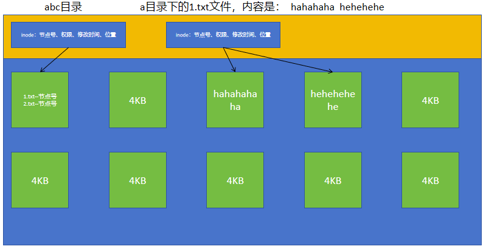

## 解压&解包

### 查看&并没有解压

```shell
# tar -tf etc.tar      //t查看f文件名
```

### 解压缩

```shell
# tar xf etc3.tar.xz

# tar -xvf etc2.tar.bz2 -C /tmp

-C：表示指定解压缩的目录
```

## 补充

我们在Windows中使用xxx.zip压缩包，Linux也是识别的。

在Linux中，我们可以将文件压缩为xxx.zip，也可以对xxx.zip进行解压缩！

```shell
案例：将/etc压缩为 etc.zip
# zip -r etc.zip /etc

解压缩
# unzip etc.zip
```

# 三、网络信息基本管理

## 查看IP网卡信息

```shell
# ifconfig
ens33: flags=4163<UP,BROADCAST,RUNNING,MULTICAST>  mtu 1500
        inet 192.168.126.160  netmask 255.255.255.0  broadcast 192.168.126.255
        inet6 fe80::20c:29ff:fe11:9334  prefixlen 64  scopeid 0x20<link>
        ether 00:0c:29:11:93:34  txqueuelen 1000  (Ethernet)
        RX packets 112907  bytes 108023269 (103.0 MiB)
        RX errors 0  dropped 0  overruns 0  frame 0
        TX packets 110978  bytes 15887696 (15.1 MiB)
        TX errors 0  dropped 17 overruns 0  carrier 0  collisions 0
```

可以看到网卡名字是：ens33

ip地址是：192.168.126.160

## 查看网络状态

```shell
# nmcli device status
DEVICE  TYPE      STATE         CONNECTION
ens33   ethernet  已连接        ens33
```

nmcli => network manage client

## 关闭网络

```shell
# nmcli connection down ens33

# 查看网络状态
# nmcli device status
DEVICE  TYPE      STATE         CONNECTION 
lo      loopback  连接（外部）  lo         
ens33   ethernet  已断开        --
```

## 开启网络

```shell
# nmcli connection up ens33

# 查看网络状态
# nmcli device status
DEVICE  TYPE      STATE         CONNECTION
ens33   ethernet  已连接        ens33
```

# <font style="color:rgb(51, 51, 51);">四、Linux远程连接与文件传输</font>

## <font style="color:rgb(51, 51, 51);">为什么需要远程连接</font>

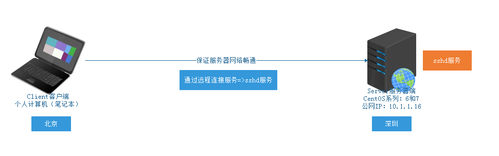

## <font style="color:rgb(51, 51, 51);">SSH协议</font>

<font style="color:rgb(51, 51, 51);">简单说，SSH是一种网络协议，用于计算机之间的加密登录。</font>

## <font style="color:rgb(51, 51, 51);">sshd（软件、程序）服务</font>

<font style="color:rgb(51, 51, 51);">当我们在计算机中安装了sshd软件，启动后，就会在进程中产生一个sshd进程，其遵循计算机的SSH协议。默认情况下，sshd服务随系统自动安装的。</font>

```shell
# systemctl status sshd
```

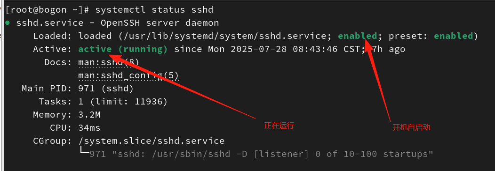

## <font style="color:rgb(51, 51, 51);">sshd服务的端口号</font>

<font style="color:rgb(51, 51, 51);">SSH协议，其规则了远程连接与传输的端口号，所以sshd服务启动后，就会占用计算机的22号端口。</font>

> <font style="color:rgb(119, 119, 119);">端口号能解决什么问题？答：能让我们的计算机区分出不同的服务</font>


我们电脑上启动的、运行的软件，如果这个软件要和外界打交道，那么该软件肯定会占用电脑上的一个端口号！

## <font style="color:rgb(51, 51, 51);">使用MX软件连接Linux服务器</font>

### <font style="color:rgb(51, 51, 51);">Putty</font>

<font style="color:rgb(51, 51, 51);">官网：</font>[<font style="color:rgb(51, 51, 51);">www.putty.org</font>](https://links.jianshu.com/go?to=http%3A%2F%2Fwww.putty.org)

<font style="color:rgb(51, 51, 51);">PuTTY为一开放源代码软件，主要由Simon Tatham维护，使用MIT licence授权。</font>

### <font style="color:rgb(51, 51, 51);">SecureCRT</font>

<font style="color:rgb(51, 51, 51);">官网：</font>[<font style="color:rgb(51, 51, 51);">www.vandyke.com</font>](https://links.jianshu.com/go?to=http%3A%2F%2Fwww.vandyke.com)<font style="color:rgb(51, 51, 51);"> SecureCRT是一款支持SSH(SSH1和SSH2)的终端仿真程序，简单地说是Windows下登录UNIX或Linux服务器主机的软件。（颜色方案不是特别好看）</font>

### <font style="color:rgb(51, 51, 51);">XShell</font>

<font style="color:rgb(51, 51, 51);">官网：</font>[<font style="color:rgb(51, 51, 51);">www.netsarang.com</font>](https://links.jianshu.com/go?to=http%3A%2F%2Fwww.netsarang.com)

<font style="color:rgb(51, 51, 51);">Xshell是一个强大的安全终端模拟软件，它支持SSH1, SSH2, 以及Microsoft Windows 平台的TELNET 协议。Xshell 通过互联网到远程主机的安全连接以及它创新性的设计和特色帮助用户在复杂的网络环境中享受他们的工作。</font>

<font style="color:rgb(51, 51, 51);">缺点：收费</font>

#### <font style="color:rgb(51, 51, 51);">修改Linux服务ssh的配置</font>

因为之前我们在安装Linux系统的时候，设置了不允许root用户远程连接！

现在我们想用root用户通过xshell软件远程连接Linux服务器，需要改ssh的配置文件：

```shell
# 修改sshd服务的配置文件
# vim /etc/ssh/sshd_config
第40行 PermitRootLogin yes    注意去掉注释
改完后保存退出

因为你改了ssh的配置文件，而sshd程序用的还是之前的，需要重启sshd服务。
# systemctl restart sshd
```

#### <font style="color:rgb(51, 51, 51);">安装xshell</font>

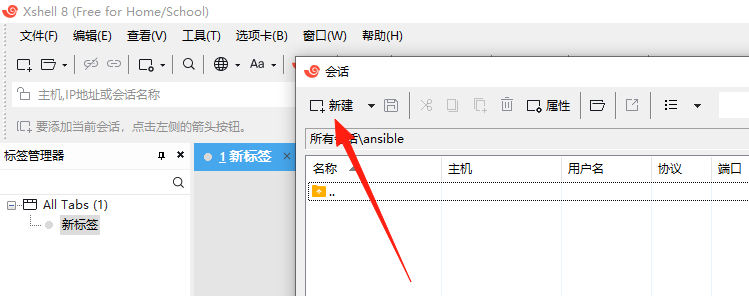

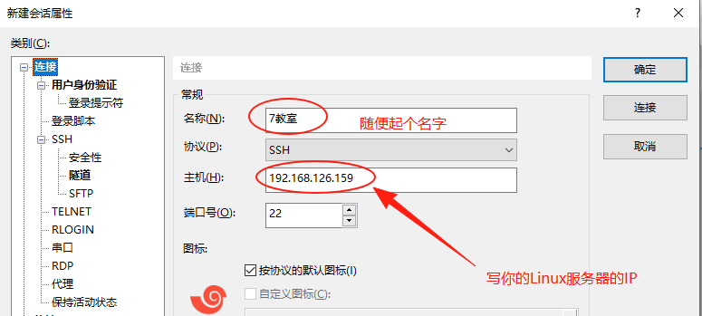

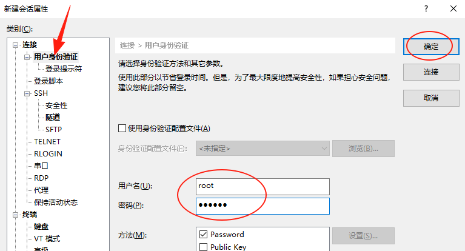

### <font style="color:rgb(51, 51, 51);">MobaXterm</font>

<font style="color:rgb(51, 51, 51);">官网：</font>[<font style="color:rgb(51, 51, 51);">https://mobaxterm.mobatek.net/</font>](https://mobaxterm.mobatek.net/)

<font style="color:rgb(51, 51, 51);">① 获取Linux的的IP地址</font>

```shell
# ifconfig
10.1.1.16
```

<font style="color:rgb(51, 51, 51);">② 打开MX软件，单击Session，创建一个SSH远程连接</font>


<font style="color:rgb(51, 51, 51);">③ 设置书签（给这台服务器起个名字）</font>

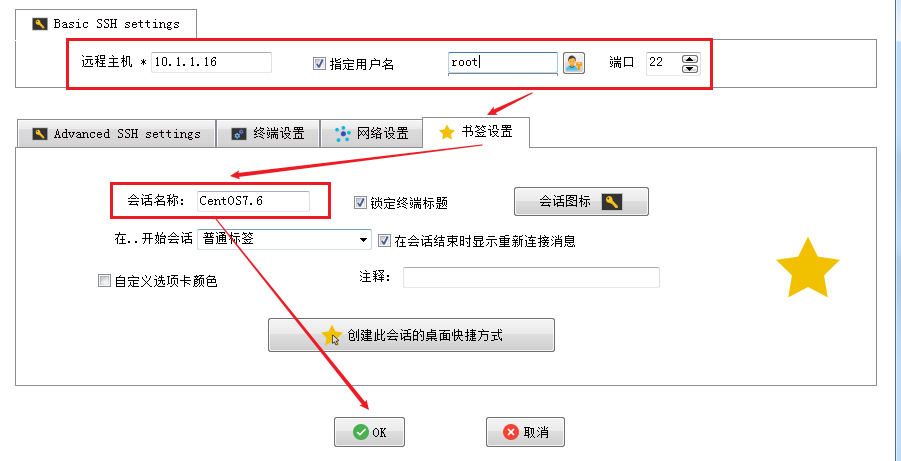

<font style="color:rgb(51, 51, 51);">④ 输入CentOS7.6的root管理员密码</font>

<font style="color:rgb(51, 51, 51);">管理员：root</font>

<font style="color:rgb(51, 51, 51);">密 码：123456</font>


## <font style="color:rgb(51, 51, 51);">使用MX实现文件传输</font>

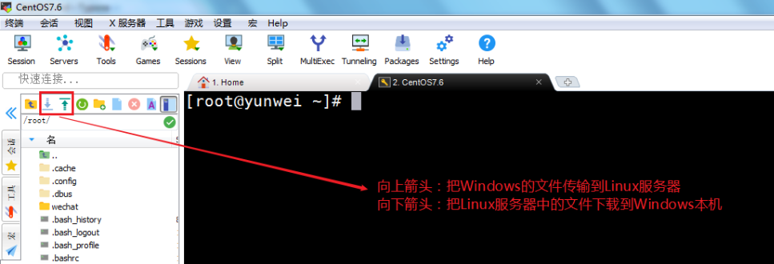

设置字体：


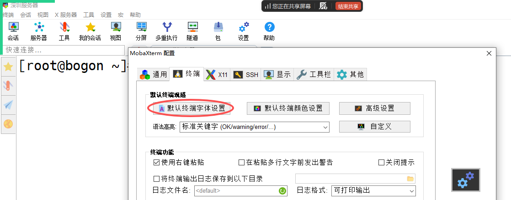

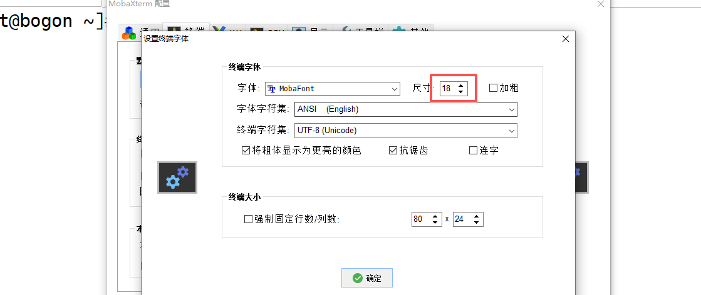

设置背景颜色：


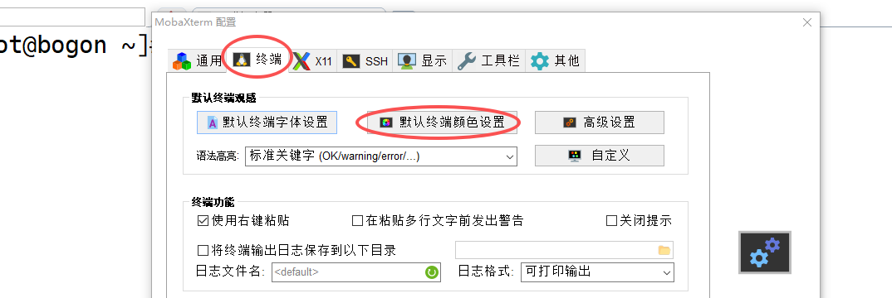

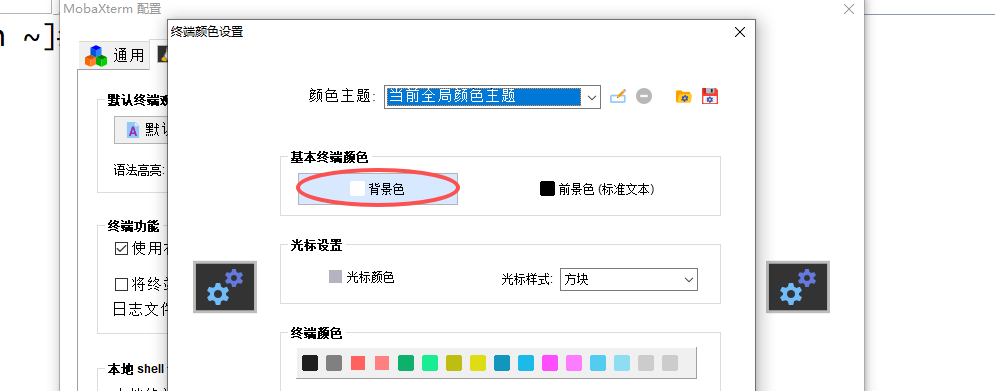

设置完字体大小和背景后，需要重新创建会话，才能生效！


> 更新: 2026-03-25 08:45:53  
> 原文: <https://www.yuque.com/u41736172/az9urv/woq2b5gpk20r6hy5>