# 09.系统服务&软件管理

# <font style="color:rgb(51, 51, 51);">一、自有服务概述</font>

<font style="color:rgb(51, 51, 51);">服务是一些特定的进程，自有服务就是系统开机后就自动运行的一些进程，一旦客户发出请求，这些进程就自动为他们提供服务，windows系统中，把这些自动运行的进程，称为"服务"。</font>

<font style="color:rgb(51, 51, 51);">举例：当我们使用SSH客户端软件连接linux的时候，我们的服务器为什么会对连接做出响应？是因为SSH服务开机就自动运行了。</font>

<font style="color:rgb(51, 51, 51);">所谓自有服务，简单来说，可以理解为Linux系统开机自动运行的服务（程序）。</font>

# <font style="color:rgb(51, 51, 51);">二、systemctl管理系统服务</font>

## <font style="color:rgb(51, 51, 51);">systemctl概述</font>

<font style="color:rgb(51, 51, 51);">CentOS6版本：</font>

<font style="color:rgb(51, 51, 51);">service命令（管理服务开启、停止以及重启）+ chkconfig（定义开机启动项）</font>

```shell
# service 服务名 start|stop|restart
```

<font style="color:rgb(51, 51, 51);">CentOS7以上的版本：</font>

<font style="color:rgb(51, 51, 51);">systemctl命令 = system系统 + control控制（服务管理+开机启动项管理）</font>

```shell
# systemctl start|stop|restart 服务名
```

## <font style="color:rgb(51, 51, 51);">显示系统服务【了解】</font>

<font style="color:rgb(51, 51, 51);">基本语法：</font>

```shell
# systemctl [选项]
选项说明：
list-units --type service --all：列出所有服务（包含启动的和没启动的）
list-units --type service：列出所有启动的服务
```

<font style="color:rgb(51, 51, 51);">案例：列出Linux系统中所有的服务（包含启动的和没启动的）</font>

```shell
# systemctl list-units --type service --all
```

<font style="color:rgb(51, 51, 51);">案例：只列出已经启动的Linux系统服务</font>

```shell
# systemctl list-units --type service
```

<font style="color:rgb(51, 51, 51);">案例：把systemctl显示系统服务与管道命令相结合，筛选我们想要的服务信息</font>

```shell
# systemctl list-units --type service | grep sshd

上面的命令所实现的功能，我们可以使用之前的ps命令代替，ps更好用
# ps aux | grep sshd
```

## <font style="color:rgb(51, 51, 51);">Linux系统服务管理</font>

### <font style="color:rgb(51, 51, 51);">status查看状态</font>

<font style="color:rgb(51, 51, 51);">查看系统服务的状态</font>

```shell
# systemctl status 服务名
```

<font style="color:rgb(51, 51, 51);">案例：查询系统中sshd服务的状态信息</font>

```shell
# systemctl status sshd
```

案例：查看crond服务的状态信息

```shell
# systemctl status crond
```

### <font style="color:rgb(51, 51, 51);">stop停止服务</font>

```shell
# systemctl stop 系统服务的名称
```

<font style="color:rgb(51, 51, 51);">案例：使用systemctl命令停止sshd服务</font>

```shell
# systemctl stop sshd
```

案例：使用systemctl命令停止crond服务

```shell
# systemctl stop crond
```

### <font style="color:rgb(51, 51, 51);">start启动服务</font>

```shell
# systemctl start 系统服务的名称
```

<font style="color:rgb(51, 51, 51);">案例：使用systemctl命令启动sshd网络服务</font>

```shell
# systemctl start sshd
```

案例：使用systemctl命令启动crond服务

```shell
# systemctl start crond
```

### <font style="color:rgb(51, 51, 51);">restart重启服务</font>

```shell
# systemctl restart 系统服务的名称
等价于
# systemctl stop 系统服务的名称
# systemctl start 系统服务的名称
```

<font style="color:rgb(51, 51, 51);">案例：使用systemctl命令重启crond计划任务的服务信息</font>

```shell
# systemctl restart crond
```

<font style="color:rgb(51, 51, 51);">案例：使用systemctl命令重启sshd服务</font>

```shell
# systemctl restart sshd
```

### <font style="color:rgb(51, 51, 51);">reload热重载技术</font>

```shell
# systemctl reload 系统服务名称
```

<font style="color:rgb(51, 51, 51);">reload：重新加载指定服务的配置文件（并非所有服务都支持reload，通常使用restart)</font>

> <font style="color:rgb(119, 119, 119);">有些服务，如Nginx，更改了配置文件，但是不能重启Nginx服务，只是想立即让我们配置文件的更改生效，则就可以使用热重载技术了。</font>

<font style="color:rgb(51, 51, 51);">案例：使用热重载技术重新加载crond服务</font>

```shell
# systemctl reload crond
```

## <font style="color:rgb(51, 51, 51);">服务持久化（开机自启与开机不自启）</font>

<font style="color:rgb(51, 51, 51);"> 所谓服务持久化，就是服务在开机的时候，是否自动启动。</font>

### <font style="color:rgb(51, 51, 51);">开机自启</font>

```shell
# systemctl enable 系统服务的名称
```

<font style="color:rgb(51, 51, 51);">案例：把crond计划任务的服务信息添加到开机自启动中</font>

```shell
# systemctl enable crond
# systemctl status crond
```

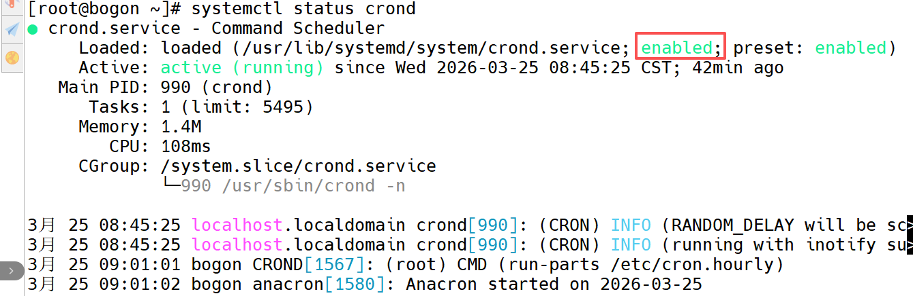

### <font style="color:rgb(51, 51, 51);">开机不自启</font>

```shell
# systemctl disable 系统服务的名称
```

<font style="color:rgb(51, 51, 51);">案例：把crond计划任务的服务信息从开机自启动中移除</font>

```shell
# systemctl disable crond
# systemctl status crond
```

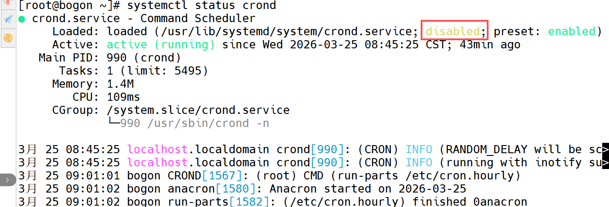

# <font style="color:rgb(51, 51, 51);">三、扩展：系统运行级别</font>

## <font style="color:rgb(51, 51, 51);">什么是运行级别</font>

<font style="color:rgb(51, 51, 51);">运行级别全称（Running Level），代表Linux系统的不同运行模式</font>

## <font style="color:rgb(51, 51, 51);">CentOS6的运行级别</font>

```shell
# vim /etc/inittab
0   系统关机状态   halt (Do NOT set initdefault to this)
1   单用户工作状态   Single user mode (类似Windows的安全模式，Linux忘记密码)
2   多用户状态（没有NFS） Multiuser, without NFS (The same as 3, if you do not have networking)
3   多用户状态（有NFS）   Full multiuser mode (字符模式,服务基本都是此模式)
4   系统未使用，留给用户   unused
5   图形界面    X11 (图形模式，个人计算机都是此模式)
6   系统正常关闭并重新启动   reboot (Do NOT set initdefault to this)
```

## <font style="color:rgb(51, 51, 51);">CentOS7的运行级别</font>

```shell
0   shutdown.target
1   emergency.target
2   rescure.target
3   multi-user.target   字符模式
4   无
5   graphical.target    图形模式
6   系统正常关闭并重新启动
```

## <font style="color:rgb(51, 51, 51);">init命令（临时更改运行模式）</font>

```shell
# init 模式编号
```

<font style="color:rgb(51, 51, 51);">案例：立即关机</font>

```shell
# shutdown -h 0或now
或
# halt -p
或
# init 0
```

<font style="color:rgb(51, 51, 51);">案例：立即重启</font>

```shell
# reboot
或
# init 6
```

<font style="color:rgb(51, 51, 51);">案例：把计算机切换到字符模式（黑窗口）</font>

```shell
# init 3
```

<font style="color:rgb(51, 51, 51);">案例：把计算机切换到图形模式（图形界面）</font>

```shell
# init 5
```

# <font style="color:rgb(51, 51, 51);">四、NTP时间同步服务</font>

## <font style="color:rgb(51, 51, 51);">什么是NTP服务</font>

<font style="color:rgb(51, 51, 51);">NTP是网络时间协议(Network Time Protocol)，它是用来同步网络中各个计算机的时间的协议。</font>

<font style="color:rgb(51, 51, 51);">工作场景：</font>

<font style="color:rgb(51, 51, 51);">公司开发了一个电商网站，由于访问量很大，网站后端由100台服务器组成集群。50台负责接收订单，50台负责安排发货，接收订单的服务器需要记录用户下订单的具体时间，把数据传给负责发货的服务器，由于100台服务器时间各不相同，记录的时间经常不一致，甚至会出现下单时间是明天，发货时间是昨天的情况。</font>

## <font style="color:rgb(51, 51, 51);">NTP时间同步的原理</font>

<font style="color:rgb(51, 51, 51);">问题：标准时间是哪里来的？</font>

<font style="color:rgb(51, 51, 51);">现在的标准时间是由原子钟报时的国际标准时间UTC（Universal Time Coordinated，世界协调时)，所以NTP获得UTC的时间来源可以是原子钟、天文台、卫星，也可以从Internet上获取。</font>

<font style="color:rgb(51, 51, 51);">在NTP中，定义了时间按照服务器的等级传播，</font>**<font style="color:rgb(51, 51, 51);">Stratum层的总数限制在15以内</font>**

<font style="color:rgb(51, 51, 51);">工作中，通常我们会直接使用各个组织提供的，现成的NTP服务器</font>


## <font style="color:rgb(51, 51, 51);">从哪里找合适的NTP服务器呢？</font>

<font style="color:rgb(51, 51, 51);">NTP授时网站：</font>[<font style="color:rgb(51, 51, 51);">http://www.ntp.org.cn</font>](http://www.ntp.org.cn/pool.php)

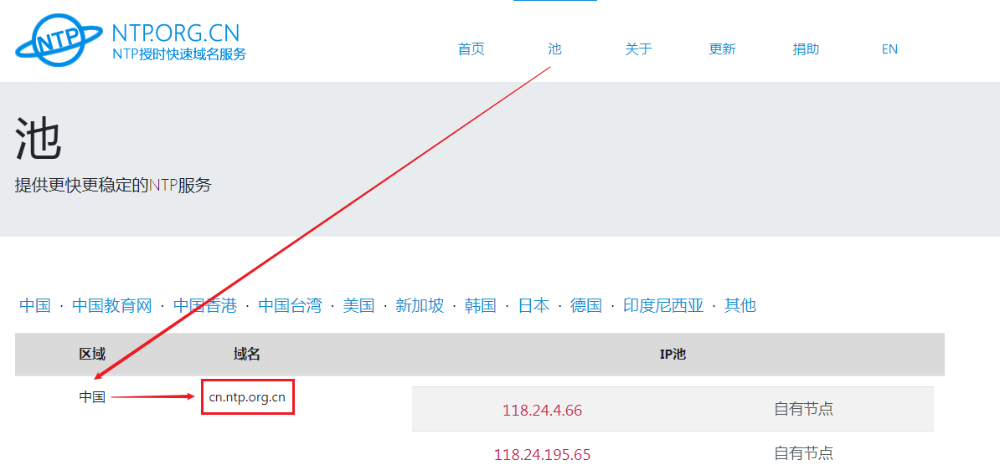

## <font style="color:rgb(51, 51, 51);">CentOS7中NTP时间同步操作</font>

### <font style="color:rgb(51, 51, 51);">手工同步</font>

<font style="color:rgb(51, 51, 51);">基本语法：</font>

```shell
# ntpdate NTP服务器的IP地址或域名
```

<font style="color:rgb(51, 51, 51);">案例：查看Linux系统时间</font>

```shell
# date
```

<font style="color:rgb(51, 51, 51);">案例：从NTP服务器中同步系统时间</font>

```shell
# ntpdate cn.ntp.org.cn
```

### <font style="color:rgb(51, 51, 51);">自动同步</font>

<font style="color:rgb(51, 51, 51);">基本语法：</font>

```shell
① 启动ntpd服务
# systemctl start ntpd
② 把ntpd服务追加到系统开机启动项中
# systemctl enable ntpd
```

<font style="color:rgb(51, 51, 51);">问题1：启动ntpd服务后，是不是时间就自动同步了？</font>

<font style="color:rgb(51, 51, 51);">启动后就自动同步了</font>

<font style="color:rgb(51, 51, 51);">问题2：需不需要让ntpd服务，开机自动运行？</font>

<font style="color:rgb(51, 51, 51);">需要</font>

<font style="color:rgb(51, 51, 51);">ntpd服务配置文件位置 /etc/ntp.conf</font>

## <font style="color:rgb(51, 51, 51);">CentOS9中时间同步操作</font>

CentOS9中使用**chrony**作为默认的时间同步服务，代替了传统的ntpdate。

<font style="color:rgb(51, 51, 51);">chrony默认同步时间的</font>**<font style="color:rgb(51, 51, 51);">轮询范围</font>**<font style="color:rgb(51, 51, 51);">为</font><code><font style="color:rgb(51, 51, 51);">minpoll 6</font></code><font style="color:rgb(51, 51, 51);">（64秒）到</font><code><font style="color:rgb(51, 51, 51);">maxpoll 10</font></code><font style="color:rgb(51, 51, 51);">（1024秒），实际间隔会根据网络状况动态调整‌。</font>

查看chrony运行状态：

```shell
# systemctl status chronyd
```

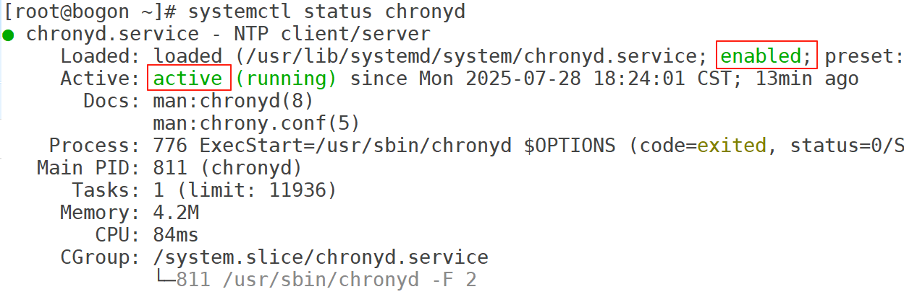

启动chrony服务并设置为开机自启：

```shell
# systemctl start chronyd
# systemctl enable chronyd
```

配置NTP时间服务器，默认配置文件在`/etc/chrony.conf`

```shell
# vim /etc/chrony.conf
server ntp.aliyun.com iburst
server ntp1.tencent.com iburst

iburst 表示在初始同步时快速获取时间，提高同步速度。
```

重启chrony服务：

```shell
# systemctl restart chronyd
```

查看系统当前时间：

```shell
# date
```

重新设置系统时间：

```shell
# date -s "2025-05-05 15:00:00"
```

查看当前系统时间：

```shell
# date
```

手工同步时间：稍等一会就可以了

```shell
# 手动同步时间
# chronyc makestep

# 重启chronyd服务
# systemctl restart chronyd


补充：timedatectl 可以查看到日期时间的同步情况
# timedatectl
               Local time: 二 2025-07-29 11:38:45 CST		当前系统时间
           Universal time: 二 2025-07-29 03:38:45 UTC		世界标准时间
                 RTC time: 二 2025-07-29 03:38:45
                Time zone: Asia/Shanghai (CST, +0800)		时区
System clock synchronized: yes													是否同步了，yes表示我们系统的时间是没问题的
              NTP service: active
          RTC in local TZ: no
```

# 五、软件包管理概述

## RPM包

* RPM（原Red Hat Package Manager，现在是一个递归缩写，红帽包管理器）
* 由 Red Hat 公司提出，被众多 Linux 发行版所采用
* 也称二进制（ binary code）无需编译，可以直接使用
* 无法设定个人设置，开关功能
* 软件包示例（注意后缀）：mysql-community-common-5.7.12-1.el7.x86\_64.rpm
* 认识RPM包

```shell
zip-3.0-11.el7.x86_64.rpm
wget-1.14-15.el7.x86_64.rpm
tcpdump-4.9.0-5.el7.x86_64.rpm

zip  -  3.0-11.    el7.    x86_64.    rpm
软件包名								zip
版本号(Version) 				3.0-11
发布版本(Release5/6/7) 	el7
系统平台(32/64)					x86_64
文件后缀								rpm
```

## 源码包

* source code 需要经过GCC,C++编译环境编译才能运行
* 可以设定个人设置，开关功能
* 软件包示例：nginx-1.8.1.tar.gz
* 认识源码包

```shell
nginx				包名
1.8.1				版本号
.tar.gz 		压缩格式
```

简单来说：源码包就是程序员们写好的某个软件的源代码。

源码包中的源代码是程序员能够看懂的，但是计算机看不懂。

所以，我们通过源码包安装软件，是需要将源码包进行编译后才能安装的。编译后的代码计算机就能看懂了！

# 六、RPM包管理

## YUM工具

### 简介

* Yum（全称为 Yellow dog Updater, Modified）
* 是一个在Fedora和RedHat以及CentOS中的Shell前端软件包管理器
* 基于RPM包管理，能够从指定的服务器自动下载RPM包并且安装
* 可以自动处理依赖性关系，并且一次安装所有依赖的软件包，无须繁琐地一次次下载、安装

### 使用YUM管理RPM包

#### 安装

:::info
**全新安装**

:::

```shell
# 网络测试
# ping www.baidu.com
```

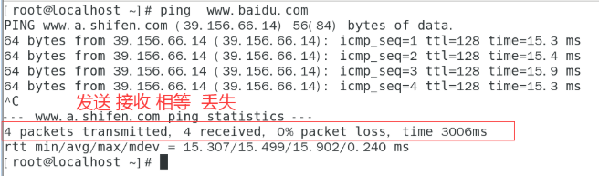

案例：通过yum命令安装httpd软件、vsftpd软件

```shell
# yum -y install httpd vsftpd

yum：使用yum命令管理软件包
-y：自动确认，不需要手动输入
install：安装
httpd：软件包1
vsftpd：软件包2

# 启动软件
# systemctl start httpd

# 关闭防火墙
# systemctl stop firewalld
```

目前我们将httpd服务跑起来了，它其实是一个服务器软件，后面会详细讲解。我们可以通过真机上的浏览器输入网址访问httpd服务器。

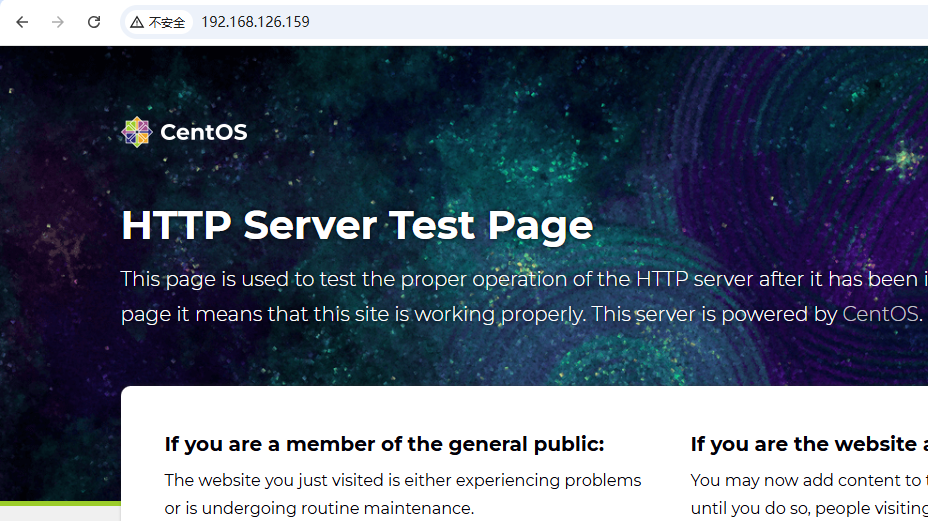

:::info
**重新安装**

:::

当软件缺失文件，可尝试重新安装

```shell
# reinstall 重新安装
# yum -y reinstall httpd
```

:::info
**升级安装**

:::

```shell
# 升级一个程序httpd
# yum -y update httpd

# 批量更新所有已安装的软件包（包括依赖项），不要升级了！！！！
# yum -y update
```

#### 查询

查询YUM源

```shell
# yum repolist
```

查询HTTP程序是否安装

```shell
# yum list httpd
带@ 是已经安装的。
```

#### 卸载

卸载程序

```shell
# remove移除，卸载软件包
# yum -y remove httpd
```

#### 查询工具和软件包的关系

1.当使用ifconfig命令失效时，却又不知道如何安装

2.使用provides查询命令的提供者进行安装

3.查询

```shell
# yum provides ifconfig
已加载插件：fastestmirror, langpacks
Loading mirror speeds from cached hostfile
 * base: mirrors.aliyun.com
 * extras: mirrors.aliyun.com
 * updates: mirrors.aliyun.com
net-tools-2.0-0.25.20131004git.el7.x86_64 : Basic networking tools
源    ：@anaconda
匹配来源：
文件名    ：/usr/sbin/ifconfig
```

4.安装对应工具

```shell
# yum install -y net-tools-2.0-0.25.20131004git.el7.x86_64
```

### 配置YUM仓库/YUM源

我们使用上面的yum命令去下载安装软件，其实是通过yum仓库中配置好的地址去下载的。

yum仓库地址配置：`/etc/yum.repos.d`中，以`.repo`结尾的就是yum仓库的配置文件。

默认的yum仓库配置文件信息：

```shell
# vim /etc/yum.repos.d/centos.repo
# 仓库的唯一标识
[baseos]
# 仓库的描述信息
name=CentOS Stream $releasever - BaseOS
# 仓库的地址
metalink=https://mirrors.centos.org/metalink?repo=centos-baseos-$stream&arch=$basearch&protocol=https,http
# 软件安装包的校验
gpgkey=file:///etc/pki/rpm-gpg/RPM-GPG-KEY-centosofficial
# 是否开启软件安装包校验
gpgcheck=1
# 仓库的校验
repo_gpgcheck=0
# 有效期
metadata_expire=6h
countme=1
enabled=1
...
```

下面我们将yum仓库的地址配置为阿里云的镜像地址，这样下载安装软件更快！

#### 前提：联网

设置虚拟机网络为NAT

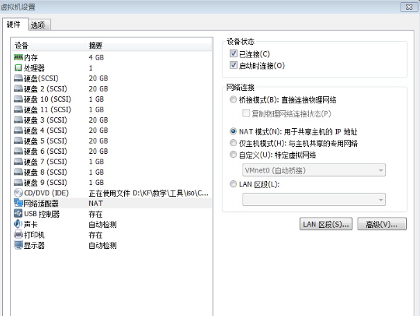

打开Linux网络设置

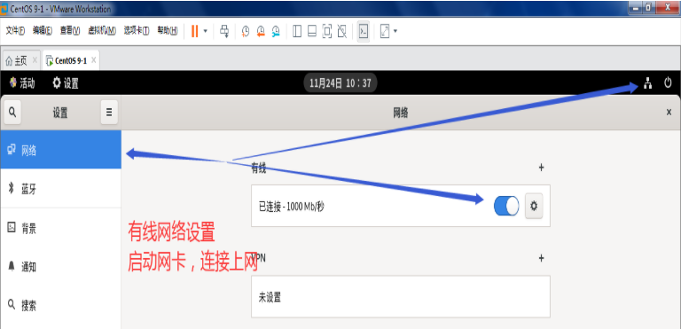

打开浏览器上网测试

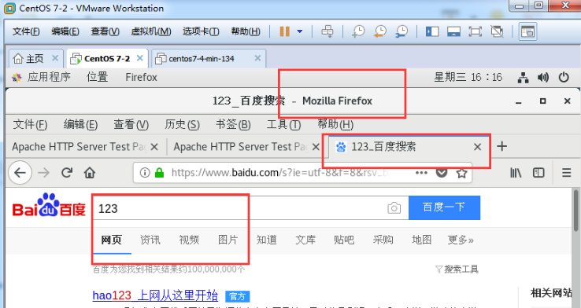

#### 注意

没有满足前提，会导致基本环境无法使用。

#### 目的

使用国内厂商提供的软件包地址，作为YUM的仓库。软件包下载的源头。这样会更快。

镜像站官方地址：<https://developer.aliyun.com/mirror/>

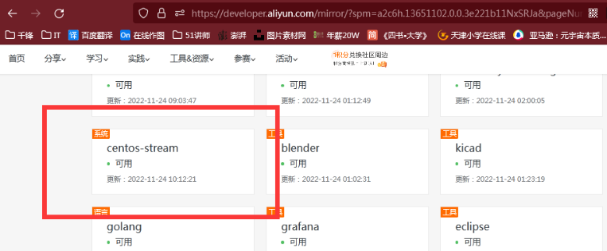

#### 阿里云

观察yum配置文件路径

```shell
/etc/yum.repos.d/centos.repo
```

备份源配置

```shell
# mv /etc/yum.repos.d/centos.repo /etc/yum.repos.d/centos.repo.backup
```

创建阿里仓库文件

```shell
# vim /etc/yum.repos.d/centos.repo
```

**粘贴如下阿里源配置**

```shell
# CentOS-Base.repo
#
# The mirror system uses the connecting IP address of the client and the
# update status of each mirror to pick mirrors that are updated to and
# geographically close to the client.  You should use this for CentOS updates
# unless you are manually picking other mirrors.
#
# If the mirrorlist= does not work for you, as a fall back you can try the 
# remarked out baseurl= line instead.
#
#
 
[base]
name=CentOS-$releasever - Base - mirrors.aliyun.com
#failovermethod=priority
baseurl=https://mirrors.aliyun.com/centos-stream/$stream/BaseOS/$basearch/os/
        http://mirrors.aliyuncs.com/centos-stream/$stream/BaseOS/$basearch/os/
        http://mirrors.cloud.aliyuncs.com/centos-stream/$stream/BaseOS/$basearch/os/
gpgcheck=1
gpgkey=https://mirrors.aliyun.com/centos-stream/RPM-GPG-KEY-CentOS-Official
 
#additional packages that may be useful
#[extras]
#name=CentOS-$releasever - Extras - mirrors.aliyun.com
#failovermethod=priority
#baseurl=https://mirrors.aliyun.com/centos-stream/$stream/extras/$basearch/os/
#        http://mirrors.aliyuncs.com/centos-stream/$stream/extras/$basearch/os/
#        http://mirrors.cloud.aliyuncs.com/centos-stream/$stream/extras/$basearch/os/
#gpgcheck=1
#gpgkey=https://mirrors.aliyun.com/centos-stream/RPM-GPG-KEY-CentOS-Official
 
#additional packages that extend functionality of existing packages
[centosplus]
name=CentOS-$releasever - Plus - mirrors.aliyun.com
#failovermethod=priority
baseurl=https://mirrors.aliyun.com/centos-stream/$stream/centosplus/$basearch/os/
        http://mirrors.aliyuncs.com/centos-stream/$stream/centosplus/$basearch/os/
        http://mirrors.cloud.aliyuncs.com/centos-stream/$stream/centosplus/$basearch/os/
gpgcheck=1
enabled=0
gpgkey=https://mirrors.aliyun.com/centos-stream/RPM-GPG-KEY-CentOS-Official
 
[PowerTools]
name=CentOS-$releasever - PowerTools - mirrors.aliyun.com
#failovermethod=priority
baseurl=https://mirrors.aliyun.com/centos-stream/$stream/PowerTools/$basearch/os/
        http://mirrors.aliyuncs.com/centos-stream/$stream/PowerTools/$basearch/os/
        http://mirrors.cloud.aliyuncs.com/centos-stream/$stream/PowerTools/$basearch/os/
gpgcheck=1
enabled=0
gpgkey=https://mirrors.aliyun.com/centos-stream/RPM-GPG-KEY-CentOS-Official


[AppStream]
name=CentOS-$releasever - AppStream - mirrors.aliyun.com
#failovermethod=priority
baseurl=https://mirrors.aliyun.com/centos-stream/$stream/AppStream/$basearch/os/
        http://mirrors.aliyuncs.com/centos-stream/$stream/AppStream/$basearch/os/
        http://mirrors.cloud.aliyuncs.com/centos-stream/$stream/AppStream/$basearch/os/
gpgcheck=1
gpgkey=https://mirrors.aliyun.com/centos-stream/RPM-GPG-KEY-CentOS-Official
```

注意第一行，和最后一行是否完整

更新缓存（缓存中还是之前的仓库信息，将之前缓存的信息清理掉，使用最新的仓库信息）

```shell
# yum clean all
# yum makecache
```

查看yum仓库

```shell
# yum repolist
```

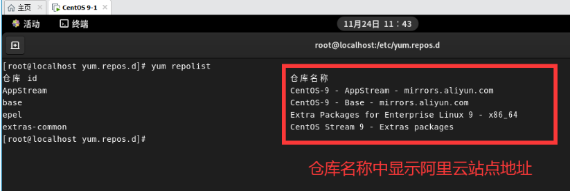

**体验阿里云仓库的速度：**

```shell
查看目前系统中是否安装了httpd
# yum list httpd

如果安装了的话，卸载
# yum -y remove httpd

安装httpd，发现很快！！！
# yum -y install httpd
```

#### 阿里epel源

epel（<font style="color:rgb(51, 51, 51);">Extra Packages for Enterprise Linux</font>），<font style="color:rgb(51, 51, 51);">是为红帽系企业级Linux系统(RHEL/CentOS等)提供额外软件包的补充仓库‌。</font>

安装阿里提供的epel软件包

```shell
# yum install -y https://mirrors.aliyun.com/epel/epel-release-latest-9.noarch.rpm
```

更新缓存（目的是清理之前缓存中的旧内容，重新将新仓库信息建立到缓存中，速度会快）

```shell
 # yum clean all && yum makecache
```

查看yum仓库

```shell
# yum repolist
```

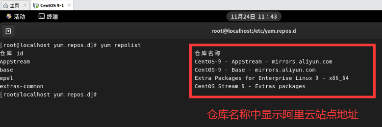

查看到epel源仓库信息即可

案例：

```shell
查找哪个程序能够提供sl命令
# yum provides sl
上次元数据过期检查：0:01:12 前，执行于 2025年07月29日 星期二 15时34分44秒。
sl-5.02-1.el9.x86_64 : Joke command for when you type 'sl' instead of 'ls'
仓库        ：epel
匹配来源：
提供    : sl = 5.02-1.el9

安装sl程序
# yum -y install sl-5.02-1.el9.x86_64

体验sl命令
# sl
```

## RPM工具

### 简介

1.管理红帽系统/CentOS系统，rpm包的基本工具

2.YUM功能相同

3.优点不需要配置，直接使用

4.无法解决依赖关系

5.无法自动下载软件包（需要我们自己下载软件安装包，xxx.rpm）

### 安装软件

> 我们要通过rpm工具安装软件时，需要下载该软件的安装包，格式是：xxx.rpm
>
> 我们可以去某个软件的官网去下载 xxx.rpm，也可以通过其他途径去下载
>
> 但其实，在我们安装系统时用的光盘镜像文件中就已经有很p 软件安装包了，我们只需要将光盘进行挂载就可以使用光盘中已有的rpm软件安装包！

先找到安装包

```shell
# 创建挂载点
# mkdir /mnt/cdrom

# 挂载光盘，光盘的设备文件名是 /dev/cdrom 或者 /dev/sr0
# mount /dev/cdrom /mnt/cdrom

# 查看光盘中的rpm软件安装包
# ls /mnt/cdrom/AppStream/Packages/
```

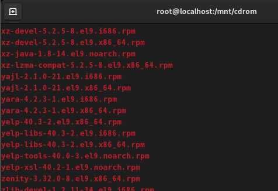

```shell
# cd /mnt/cdrom/AppStream/Packages/

# 我们以安装wget软件包为例，检查软件包是否存在
# wget软件的作用是可以从指定的网址下载内容到本地
# ls wget-1.21.1-8.el9.x86_64.rpm
wget-1.21.1-8.el9.x86_64.rpm
```

安装软件

```shell
# rpm -ivh wget-1.21.1-8.el9.x86_64.rpm

选项说明：
-i  安装
-v  可视 view
-h  百分比
```

提示信息

```shell
Verifying...                          ################################# [100%]
准备中...                          ################################# [100%]
        软件包 wget-1.21.1-8.el9.x86_64 已经安装
```

### 查询

```shell
# rpm -q wget
wget-1.21.1-8.el9.x86_64

选项说明：
-q 查询  query
看到软件包的名字，就说明rpm -q查询成功，已经安装软件。

# rpm -qa | grep 软件包名
```

### 卸载

```shell
# 卸载软件
# rpm -evh wget-1.21.1-8.el9.x86_64
准备中...                          ################################# [100%]
正在清理/删除...
   1:wget-1.21.1-8.el9                ################################# [100%]

再次查询，发现已经卸载
# rpm -q wget-1.21.1-7.el9.x86_64
未安装软件包  wget-1.21.1-7.el9.x86_64
```

> 注意：卸载完wget软件包后再安装上，我们后面要用它去下载东西！

### 查看软件对应的配置文件

```shell
查看软件包对应的配置文件
# rpm -qc 软件包名

选项说明：
-q：query，查询
-c：config，配置

# rpm -qc chrony
/etc/chrony.conf
/etc/chrony.keys
/etc/logrotate.d/chrony
/etc/sysconfig/chronyd
```

### 查看软件安装后生成的所有文件

```shell
# rpm -ql 软件包名

-l：list，列表展示

# rpm -ql chrony
/etc/chrony.conf
/etc/chrony.keys
/etc/dhcp/dhclient.d/chrony.sh
/etc/logrotate.d/chrony
/etc/sysconfig/chronyd
/usr/bin/chronyc
/usr/lib/.build-id
/usr/lib/.build-id/5d
...
```

### 查看文件是哪个安装包产生的

```shell
# rpm -qf 文件名

# rpm -qf /etc/chrony.conf
chrony-4.6.1-2.el9.x86_64
```

# 七、源码包管理

## 获得源码包

官方网站，可以获得最新的软件包

* Apache: www.apache.org
* **Nginx**: www.nginx.org
* Tengine: tengine.taobao.org

## 实战案例--安装nginx1.23.2

说明：本案例是通过源码包的方式安装Nginx软件服务器。

源码包安装软件的核心步骤是：

1. 配置（配置你要将软件安装在哪里、你要安装软件中的哪些模块...）
2. 编译
3. 安装

### 安装编译环境

```shell
# yum -y install make zlib zlib-devel gcc-c++ libtool openssl openssl-devel pcre-devel
```

### 下载源码包

```shell
# wget http://nginx.org/download/nginx-1.23.2.tar.gz

说明：
wget 命令就是通过你提供的地址可以下载文件

如果执行wget命令的时候报错：说明你Linux系统中没有安装wget命令对应的程序
bash: wget: 未找到命令...

解决：
# yum -y install wget
```

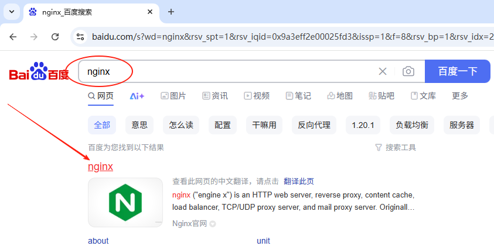

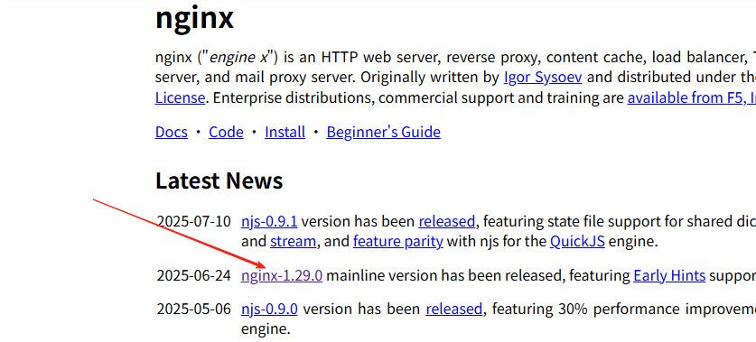

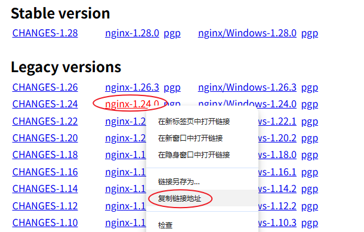

### 准备解压后的源码目录

```shell
# mkdir /nginx
```

### 移动源码包

```shell
# mv nginx-1.23.2.tar.gz /nginx/
```

### 进入源码包

```shell
# cd /nginx/
# ls
```

### 解压源码包

```shell
# tar -xf nginx-1.23.2.tar.gz
# ls
```

### 进入解压后的源码包

```shell
# cd /nginx/nginx-1.23.2/
```

### 配置源码包

```shell
请复制这一步。
# ./configure --user=nginx --group=nginx --prefix=/usr/local/nginx-1.23.2/ --with-http_stub_status_module --with-http_ssl_module

简单说明：（后面我们会专门学习Nginx服务器）
./configure 表示对软件包进行配置
--user 			表示软件使用的Linux系统的用户
--group			表示软件使用的Linux系统的用户组
--prefix		表示软件安装的位置
--with-http_stub_status_module	表示安装Nginx的状态监控模块，比如：Nginx中活跃的连接数、处理的请求数等
--with-http_ssl_module	表示启用Nginx的安全加密功能，使Nginx支持https协议，实现数据加密传输
```

### 编译

```shell
# make
```

### 安装

```shell
# make install
```

### 查看版本号

通过查看Nginx的版本号，就可以检测出我们Nginx安装的是否成功！version

```shell
# 执行Nginx安装目录中sbin下面的nginx文件，查看Nginx的版本号
# /usr/local/nginx-1.23.2/sbin/nginx -V
```

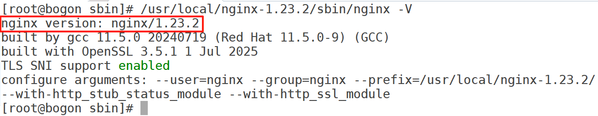

### 准备启动用户

```shell
# 创建Nginx服务器软件使用的用户及用户组
# useradd -s /sbin/nologin -M nginx

选项说明：
-s 指定用户的shell类型，/sbin/nologin 表示不能登录系统，该用户是给软件使用的
-M 表示禁止创建家目录
```

### 启动nginx

能不能用`systemctl start nginx`启动软件呢？？？

```shell
# /usr/local/nginx-1.23.2/sbin/nginx
```

### 本机自我测试nginx服务器

```shell
# curl http://127.0.0.1

说明：
curl 命令就类似于浏览器，可以给指定的地址发送请求
```

看到下图效果，就表示nginx启动成功！

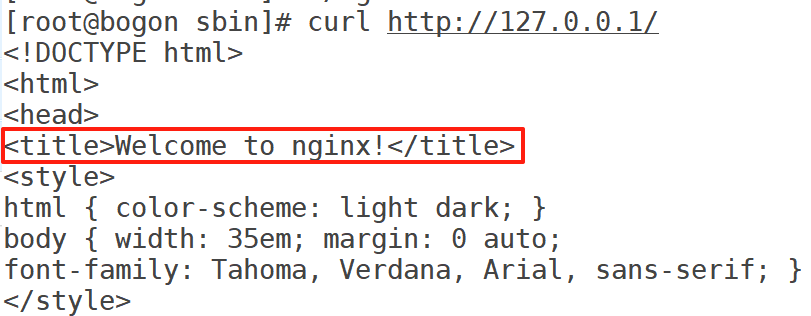

### 关闭防火墙

```shell
# systemctl stop firewalld

说明：
防火墙我们后面学习，目前先关闭防火墙，然后通过真机的浏览器去访问Linux服务器中的Nginx进行测试！
如果不关闭防火墙，那么真机的浏览器访问Linux服务器中的Nginx是会被Linux的防火墙给拦截的，不让访问！
```

### 客户机测试

```shell
真机浏览器访问 服务器的IP地址（查询IP的方法使用ifconfig）
```

查询Linux服务器的ip地址：

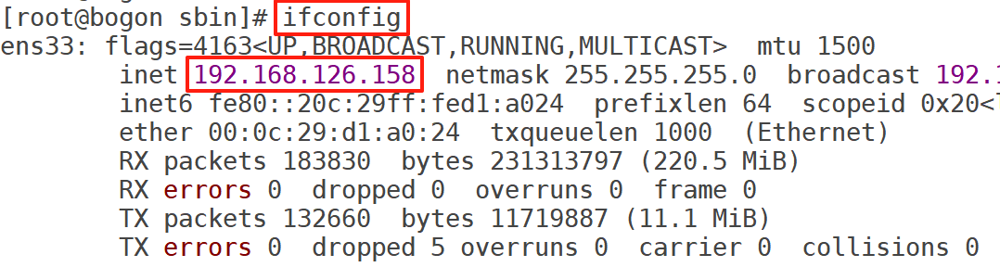

使用真机浏览器访问Linux服务器中的Nginx：

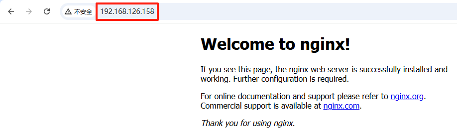

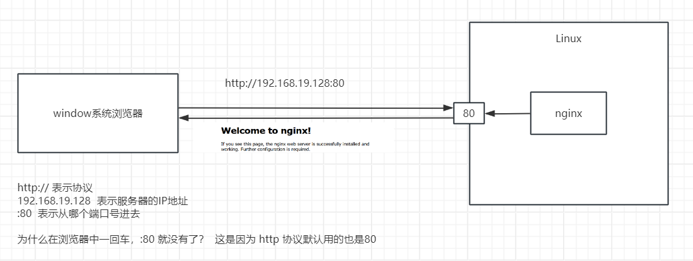


> 更新: 2026-04-17 20:59:37  
> 原文: <https://www.yuque.com/u41736172/az9urv/gh2xstxcyn4bhtov>