# 12.网络配置

# 一、简介

## Linux网络接口名称规则

```shell
Network interface names

Traditionally, network interfaces in Linux are enumerated as eth0, eth1, eth2, and so on. However, the mechanism which 
sets these names can cause changes to which interface gets which name as devices are added and removed. 
The default naming behavior in Red Hat Enterprise Linux 7 is to assign fixed names based on firmware, device topology, 
and device type. 

Interface names have the following characters:
Ethernet interfaces begin with en, WLAN interfaces begin with wl, and WWAN interfaces begin with ww.
The next character(s) represents the type of adapter with an o for on-board, s for hotplug slot, and p for PCI geographic location. 
Not used by default but also available to administrators, an x is used to incorporate a MAC address.
Finally, a number N is used to represent an index, ID, or port.
If the fixed name cannot be determined, the traditional names such as ethN will be used. 

For example, the first embedded network interface may be named eno1 and a PCI card network interface may be named enp2s0. 
The new names make it easier to distinguish the relationship between a port and its name if the user knows both, but the
trade off is that users cannot assume a system with one interface calls that interface eth0. 
```

```shell
en:ethernet 以太网-双绞线
wl:wirelessLAN：无线网卡
ww：WAN广域网：串行线缆

o：on-board板载网卡
s:hotplug热插拔
p：PCI接口

N：序号或者ID

示例：ens33
```

## NetworkManager服务

网络管理器（NetworkManager）是一个动态网络的控制器与配置系统，它用于当网络设备可用时保持设备和连接开启并激活。

默认情况下，从CentOS/RHEL 7开始CentOS9 已安装网络管理器，并处于启用状态。

查看网络管理程序的状态

```shell
# systemctl status NetworkManager 
```

查看网络子管理程序的状态

```shell
# systemctl status network
CentOS9 已经替代了，CentOS9用NetworkManager即可
```

## 配置网络的工具

配置的方法，多种多样。有：图形；命令。

### 命令行配置

配置文件的方式：

```shell
# vim /etc/sysconfig/network-scripts/ifcfg-ens32

今天就有老铁在这里栽跟头。自己本身是33，照着笔记打32
```

命令行的方式：`nmcli`

```shell
如果没有这个命令，可以执行安装
# yum -y install NetworkManager
```

### 图形配置

简易图形： nmtui

图形界面：nm-connection-editor

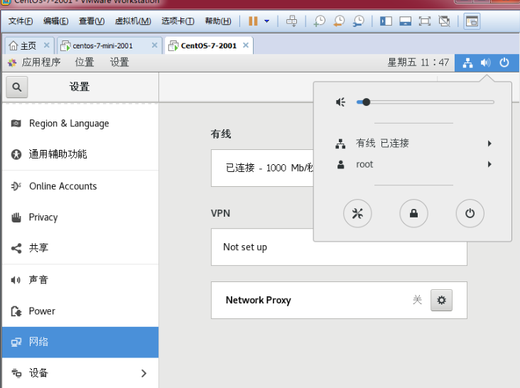

# 二、配置网络参数

## CentOS7配置IP（不讲）

### 方法

#### 配置网卡参数

先备份网卡配置文件，在修改

```shell
# cp /etc/sysconfig/network-scripts/ifcfg-ens33   .
```

查看本机的自动获取的IP截图

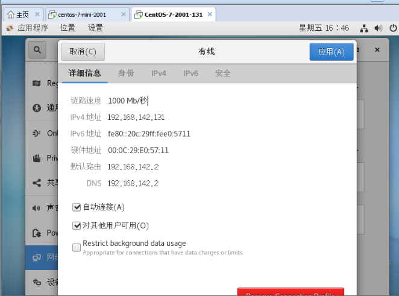

命令行查看IP

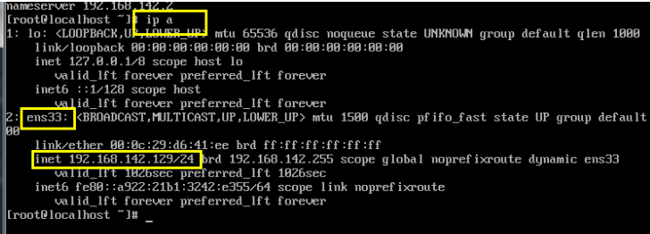

子网掩码

```shell
255.255.255.0
```

命令行查网关/默认路由

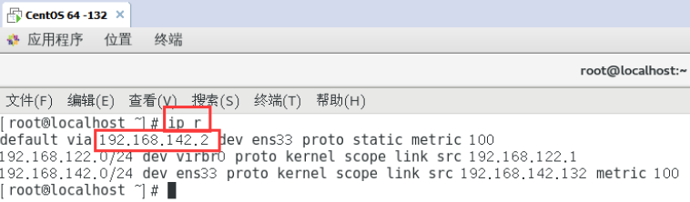

命令行查dns

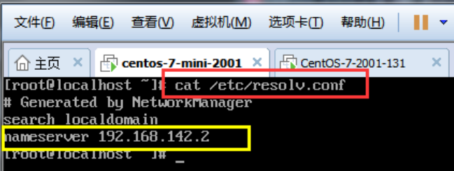

修改网卡配置文件

```shell
# vim /etc/sysconfig/network-scripts/ifcfg-ens33
老铁，修改这个文件要慎重
ONBOOT=yes								//是否启用该设备
BOOTPROTO=none						//手动(none/static)还是自动获取IP(dhcp)
IPADDR=192.168.142.131		//根据自动获取的地址进行配置，用来定位主机。老铁不能跟老师一样哈！！！
NETMASK=255.255.255.0			//子网掩码，用来定义网络，这台主机是192.168.142的网络
GATEWAY=192.168.142.2			//网关，也叫默认路由，带你上网的路由器地址
DNS1=192.168.142.2				这个数字1不要忘了。域名解析。当你输入域名访问网站时，他告诉你IP地址。根据截图配置。

NAME=ens33								网卡名称
UUID=d1769473-dc3c-4cf3-9158-8798994d24bb			UUID不是网卡配置文件中必须的信息
DEVICE=ens33							网卡设备名称
```

#### 重启网络服务

```shell
# systemctl restart network
```

#### 查看IP地址

```shell
# ip a
```

### 问题

windows虚拟网卡是否安装

VMware系统服务是否被优化掉

LINUX网络配置设置为开机启动

## CentOS9配置IP

CentOS Stream 9 的网卡配置文件在`/etc/NetworkManager/system-connections/`目录下，打开对应的网卡配置文件。（说明：我们现在的Linux其实是可以上网的，但是目前使用的IP是自动获取的，我们设置为手动指定的IP！）

**网卡配置**（注意自己的网卡名称）

```shell
打开网络配置文件
# vim /etc/NetworkManager/system-connections/ens33.nmconnection
先将你的内容全部删除（dG或400dd）,然后复制以下内容到你的文件中
[connection]
id=ens18
uuid=8d1ece55-d999-3c97-866b-d2e23832a324
type=ethernet
autoconnect-priority=-999
interface-name=ens18
permissions=
timestamp=1639473429

[ethernet]
mac-address-blacklist=

[ipv4]
address1=192.168.1.92/24,192.168.1.1
dns=8.8.8.8;
dns-search=
method=manual

[ipv6]
addr-gen-mode=eui64
dns-search=
method=auto

[proxy]
```

**将上面的内容复制到自己的Linux服务器中，做如下修改：**

* id改成自己网卡的名字

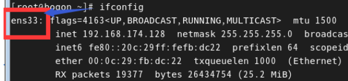

* uuid网卡序号改成自己的序号
* interface-name网卡名改成自己
* address1改成自己自动获得的IP、掩码、网关（将查看到的IP地址的最后一位稍微修改一下，看看一会指定好的IP是否有效！比如：动态IP是：192.168.126.150，这里写为 192.168.126.155）

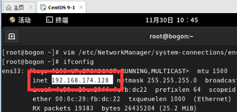

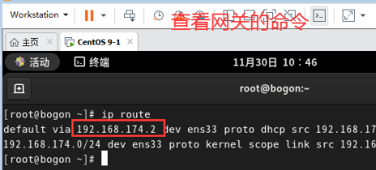

* dns改成8.8.8.8

**查看网卡UUID**

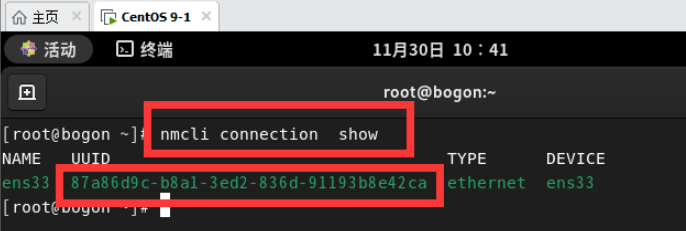

**查看网卡IP地址**

```shell
# ifconfig
```

**查看网关和DNS**

```shell
# 查看网关
# ip route

# 查看DNS
# cat /etc/resolv.conf
```

**重启网络设置**

```shell
# nmcli c reload		完整写法 nmcli connection reload
# nmcli c up ens33	完整写法 nmcli connection up ens33
```

**查看IP地址**

```shell
# ifconfig
```

> 通过上面的配置后，我们就给Linux服务器手动指定好了IP，它的IP以后就不会自动发生改变了。
>
> **说明：上面自己手动指定IP的时候不能随便指定，我们是通过ifconfig命令查看到自动分配的IP是多少，然后把最后一位稍微改动一下进行配置的。最后配置好后，再次使用ifconfig命令查看到的IP应该是和我们自己手动配置好的IP是一样的！如果ifconfig命令查不到IP说明上面的配置文件配置错了！！！**

## nmcli配置IP

上面是通过配置文件的方式来配置IP，其实我们也可以通过命令的方式来配置IP。使用`nmcli`命令即可。其实我们通过`nmcli`命令配置好的IP最后也就写入到了上面的**配置文件**中了！

将 IPv4 地址 (192.168.126.180) 调配给 ens33 网卡上（IP地址不能随便配，查看自己Linux中动态获取的IP是多少，稍微改变最后一位即可）

```shell
# nmcli connection modify ens33 ipv4.addresses 192.168.126.180/24
```

nmcli 命令设置网关

```shell
# nmcli connection modify ens33 ipv4.gateway 192.168.126.2
```

设置手动配置（从 dhcp 到 static）

```shell
# nmcli connection modify ens33 ipv4.method manual
```

设置 DNS 值为 “8.8.8.8”（谷歌的域名解析器）

```shell
# nmcli connection modify ens33 ipv4.dns "114.114.114.114,8.8.8.8"
```

保留上述更改并从新加载

```shell
# nmcli connection up ens33
```

## 主机名

### 改名方式1

#### 查看主机名

```shell
# hostname
localhost.localdomain
```

#### 配置主机名

主机名不要随便设置，一般设置为：功能.域名。满足FQCN，全限定主机名。

mysql.jd.com		web.baidu.com

```shell
# hostnamectl set-hostname haha.example.com
```

#### 立即生效

```shell
# su
```

### 改名方式2

查看和配置主机名

```shell
# cat /etc/hostname 
# vim /etc/hostname
```

重启生效

```shell
# reboot
或者
# init 6
```

## 网络测试工具

### 测试工具

```shell
# ip a				//查看所有IP（ifconfig）
# ip route		//查看路由，查看网关
# ip neighbo 	//（了解）查看邻居，能看到同局域网的其他IP（前提是先和邻居ping过且能连通）
# ping 127.0.0.1
```

PING （Packet Internet Groper），因特网包探索器

两台虚拟机需要通信，vmnet号一定要相同

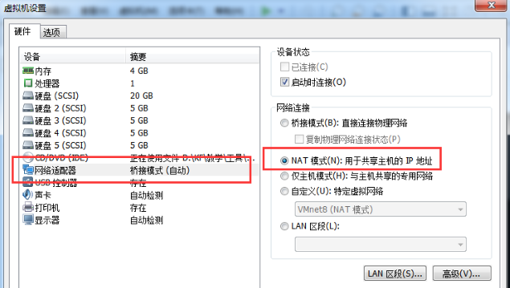

### ports and services

#### 安装示例服务

什么程序不重要

```shell
# yum -y install httpd 
# systemctl start httpd
# systemctl stop firewalld
```

> 注意：在执行上面的命令时，先在自己Linux中查看一下Nginx是否还在启动状态！！！
>
> 因为httpd服务和nginx服务用的端口号都一样，是80端口！！！
>
> ps aux | grep nginx
>
> kill -9 pid

#### 端口号

是一段数字：0-65535

在Linux系统中并非所有的程序启动后都会占用端口，端口号的使用与程序是否涉及网络通信直接相关。

如果该程序需要通过TCP/UDP协议进行网络数据传输（如浏览器、web服务器、FTP客户端等），则会占用端口号以标识自身。

通过检查端口号，可以确认服务是否正确启动

#### Show TCP sockets

什么端口不重要

```shell
# ss -tnl
State Recv-Q Send-Q Local Address:Port Peer Address:Port 
LISTEN 0 128 *:80 *:* 

# ss -tna

# ss -tnlp

说明：
ss：Socket Statistics，是用于显示活动套接字信息的工具
-t：仅显示TCP连接‌
-n：禁用服务名称解析（显示数字端口）‌
-l：显示处于监听状态的套接字
-a：显示所有连接（包括监听和非监听）

State	连接状态
  LISTEN：套接字正在监听连接请求（服务端等待客户端连接）‌
  ESTABLISHED：已建立有效连接，双方可正常通信‌
Recv-Q	接收队列待处理数据量‌
Send-Q	发送队列待处理数据量‌
Local Address:Port	本地IP和端口
Peer Address:Port ‌	表示与当前主机建立通信的‌远程设备IP地址和端口号

也可以用这个查看端口号的占用情况
# netstat -tnlp
-t：显示tcp连接的
-n：以数字的形式显示端口
-l：显示处于listen 监听状态的
-p：显示process进程相关的信息
```

重要的是要知道端口的概念和查看的方法

# 三、初始化服务器

## 最小化安装

后面我们做的实验会涉及很多台服务器，所以我们提前准备好一个服务器的模板，而且是最小化安装的，占用各种资源空间较少！以后再需要服务器时，直接克隆这个最小化的模板机即可！

### 创建虚拟机

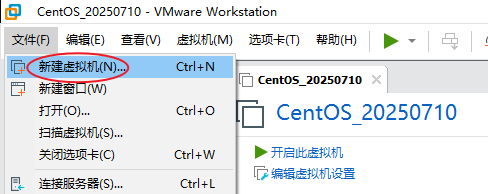

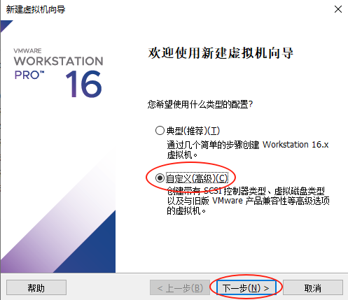

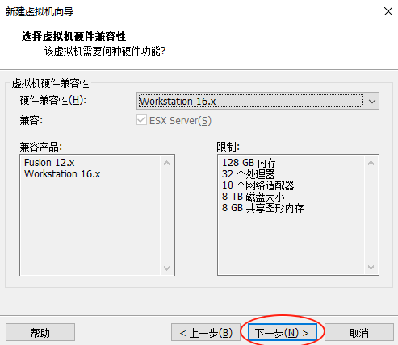

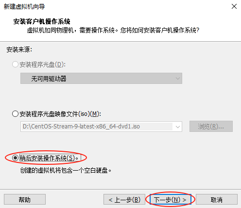

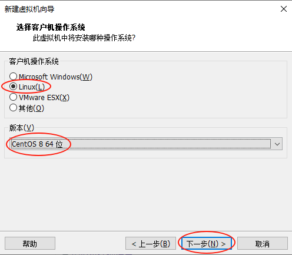

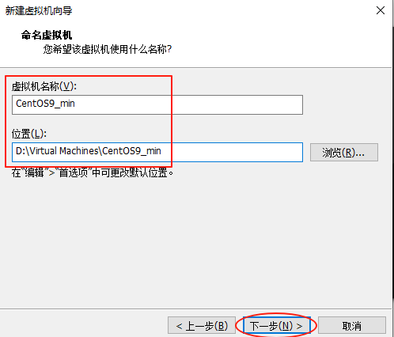

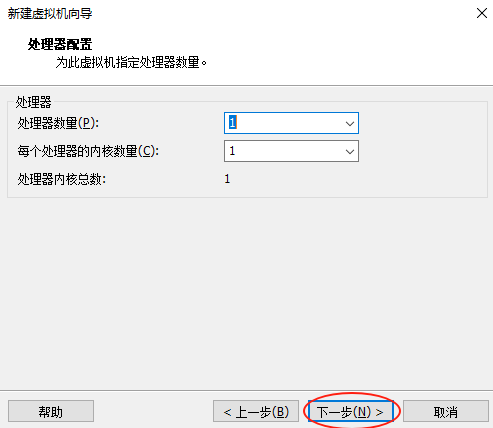

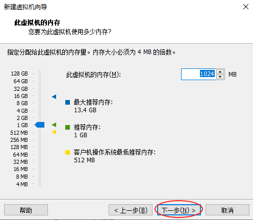

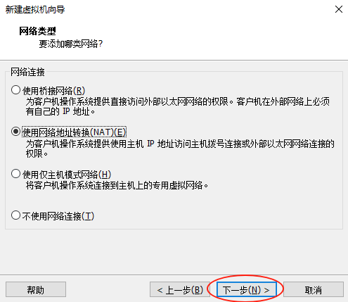

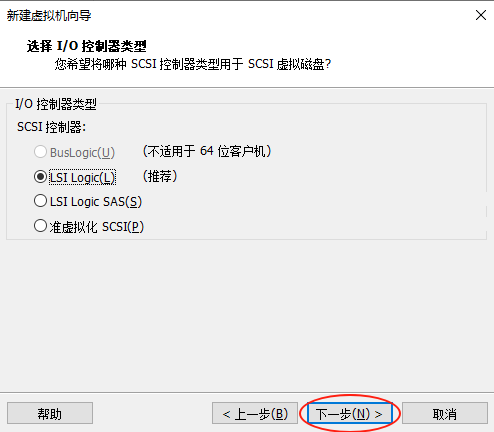

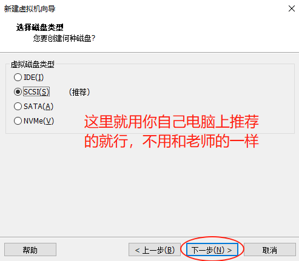

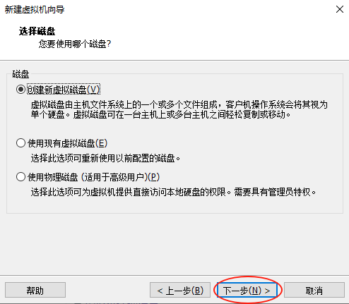

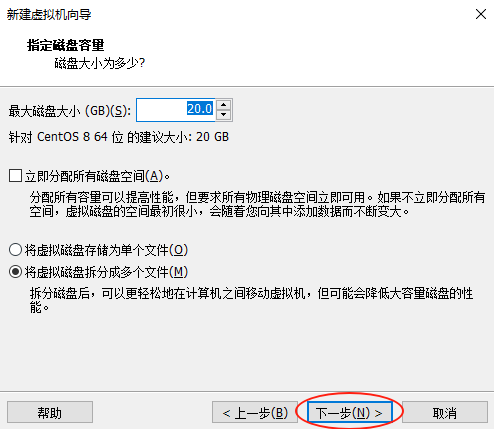

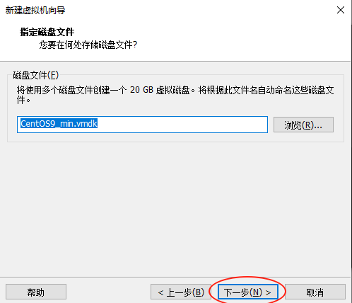

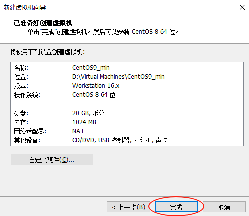

### 安装CentOS系统

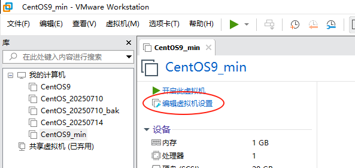

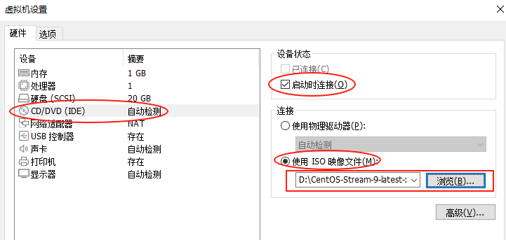

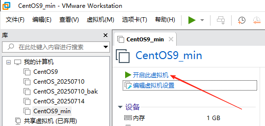

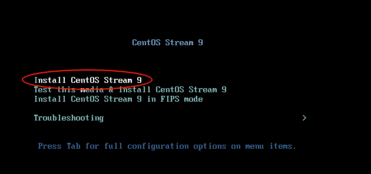

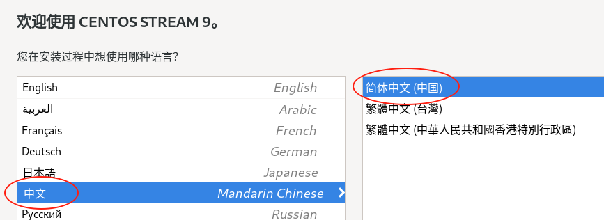

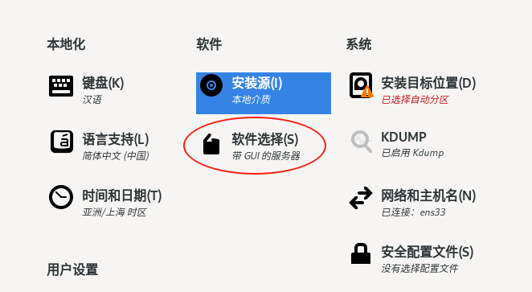

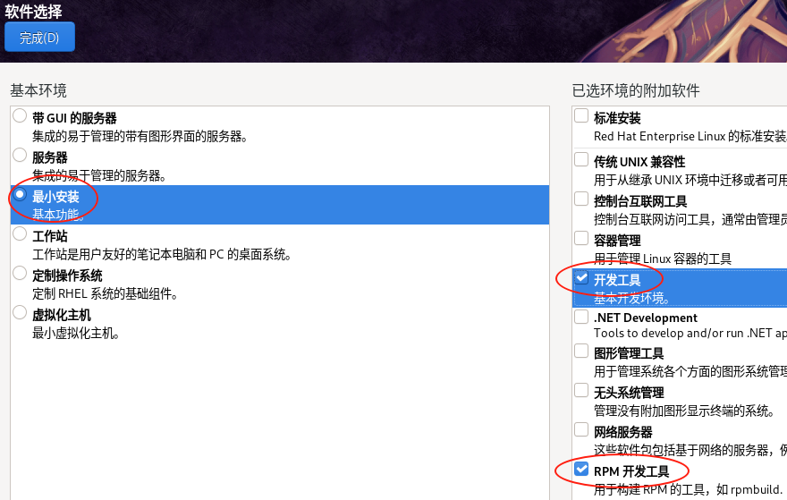


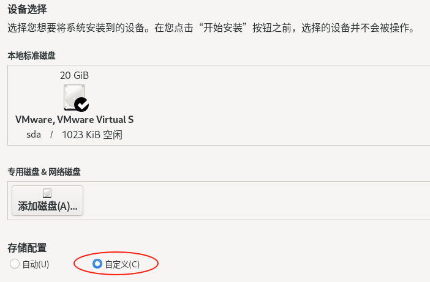

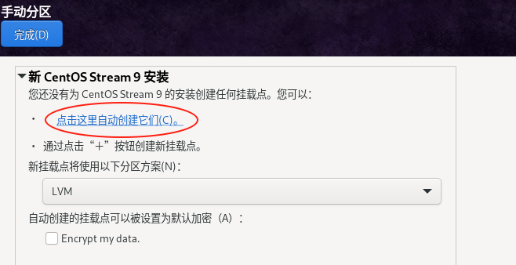

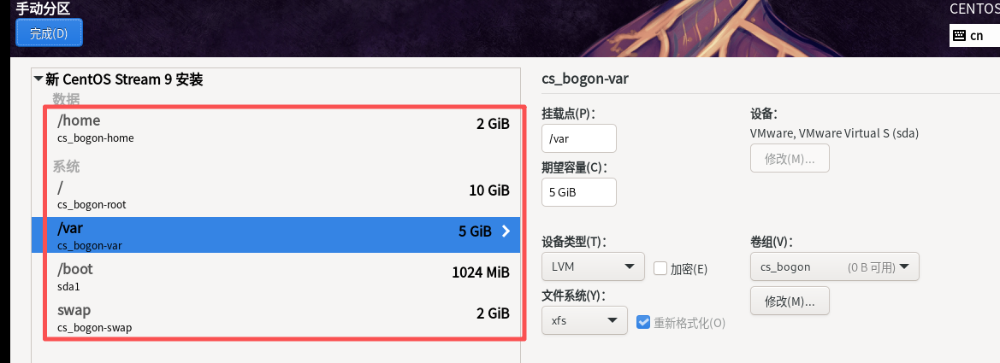

实际工作中，我们根据硬盘大小再调整，并且除了上面的分区，我们工作中还会根据服务器的功能多分出一些分区，比如该服务器是数据库服务器，那么我们会再创建一个 /mysql 分区！

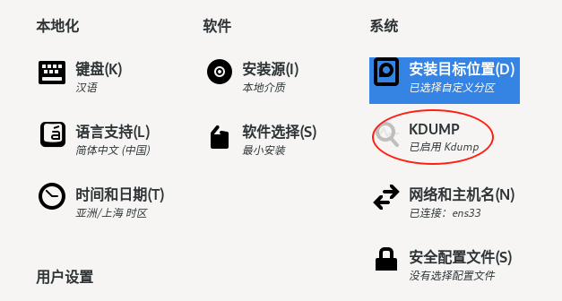


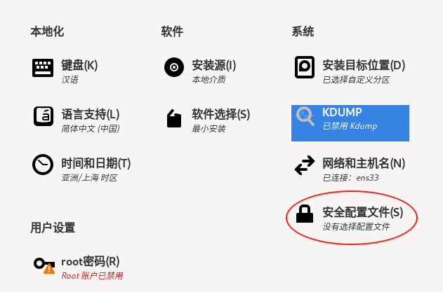

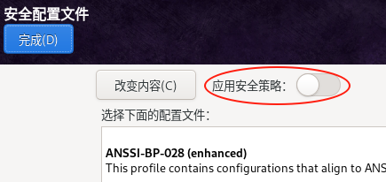

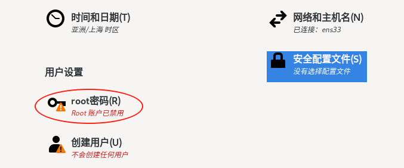

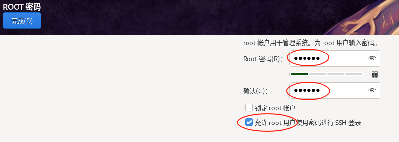

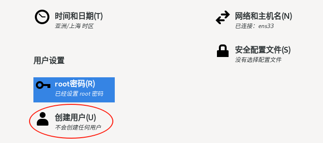


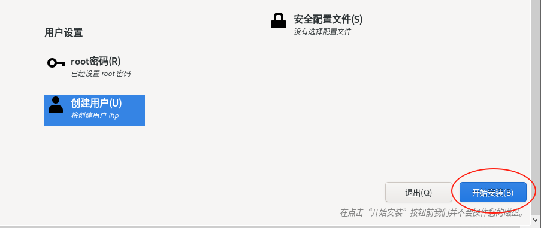

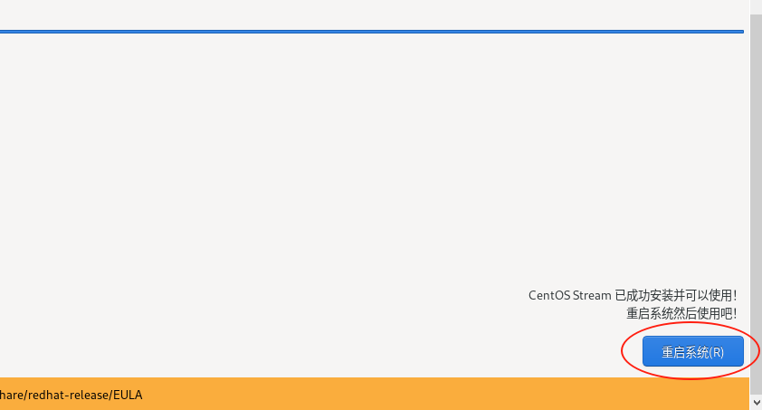

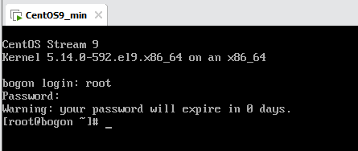

## 使用客户端工具连接服务器

查看IP地址：使用`ip a`命令

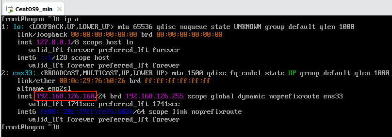

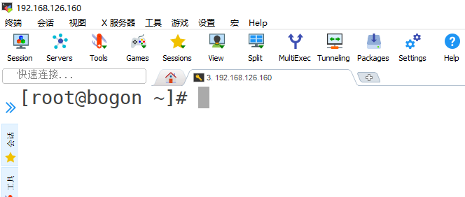

## 配置YUM源

### 阿里云

观察yum配置文件路径

```shell
/etc/yum.repos.d/centos.repo
```

备份源配置

```shell
# mv /etc/yum.repos.d/centos.repo /etc/yum.repos.d/centos.repo.backup
```

创建阿里仓库文件

```shell
# vi /etc/yum.repos.d/centos.repo
```

粘贴如下阿里源配置

```shell
# CentOS-Base.repo
#
# The mirror system uses the connecting IP address of the client and the
# update status of each mirror to pick mirrors that are updated to and
# geographically close to the client.  You should use this for CentOS updates
# unless you are manually picking other mirrors.
#
# If the mirrorlist= does not work for you, as a fall back you can try the 
# remarked out baseurl= line instead.
#
#
 
[base]
name=CentOS-$releasever - Base - mirrors.aliyun.com
#failovermethod=priority
baseurl=https://mirrors.aliyun.com/centos-stream/$stream/BaseOS/$basearch/os/
        http://mirrors.aliyuncs.com/centos-stream/$stream/BaseOS/$basearch/os/
        http://mirrors.cloud.aliyuncs.com/centos-stream/$stream/BaseOS/$basearch/os/
gpgcheck=0
gpgkey=https://mirrors.aliyun.com/centos-stream/RPM-GPG-KEY-CentOS-Official
 
#additional packages that may be useful
#[extras]
#name=CentOS-$releasever - Extras - mirrors.aliyun.com
#failovermethod=priority
#baseurl=https://mirrors.aliyun.com/centos-stream/$stream/extras/$basearch/os/
#        http://mirrors.aliyuncs.com/centos-stream/$stream/extras/$basearch/os/
#        http://mirrors.cloud.aliyuncs.com/centos-stream/$stream/extras/$basearch/os/
#gpgcheck=0
#gpgkey=https://mirrors.aliyun.com/centos-stream/RPM-GPG-KEY-CentOS-Official
 
#additional packages that extend functionality of existing packages
[centosplus]
name=CentOS-$releasever - Plus - mirrors.aliyun.com
#failovermethod=priority
baseurl=https://mirrors.aliyun.com/centos-stream/$stream/centosplus/$basearch/os/
        http://mirrors.aliyuncs.com/centos-stream/$stream/centosplus/$basearch/os/
        http://mirrors.cloud.aliyuncs.com/centos-stream/$stream/centosplus/$basearch/os/
gpgcheck=0
enabled=0
gpgkey=https://mirrors.aliyun.com/centos-stream/RPM-GPG-KEY-CentOS-Official
 
[PowerTools]
name=CentOS-$releasever - PowerTools - mirrors.aliyun.com
#failovermethod=priority
baseurl=https://mirrors.aliyun.com/centos-stream/$stream/PowerTools/$basearch/os/
        http://mirrors.aliyuncs.com/centos-stream/$stream/PowerTools/$basearch/os/
        http://mirrors.cloud.aliyuncs.com/centos-stream/$stream/PowerTools/$basearch/os/
gpgcheck=0
enabled=0
gpgkey=https://mirrors.aliyun.com/centos-stream/RPM-GPG-KEY-CentOS-Official


[AppStream]
name=CentOS-$releasever - AppStream - mirrors.aliyun.com
#failovermethod=priority
baseurl=https://mirrors.aliyun.com/centos-stream/$stream/AppStream/$basearch/os/
        http://mirrors.aliyuncs.com/centos-stream/$stream/AppStream/$basearch/os/
        http://mirrors.cloud.aliyuncs.com/centos-stream/$stream/AppStream/$basearch/os/
gpgcheck=0
gpgkey=https://mirrors.aliyun.com/centos-stream/RPM-GPG-KEY-CentOS-Official
```

注意第一行，和最后一行是否完整

清理并创建缓存

```shell
# yum clean all
# yum makecache
```

查看yum仓库

```shell
# yum repolist
```

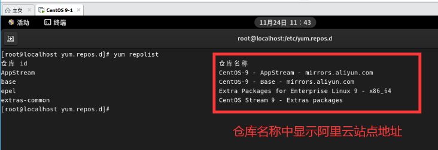

### 阿里epel源

安装阿里提供的epel软件包

```shell
# yum install -y https://mirrors.aliyun.com/epel/epel-release-latest-9.noarch.rpm
```

清理并创建缓存

```shell
# yum clean all && yum makecache
```

查看yum仓库

```shell
# yum repolist
```

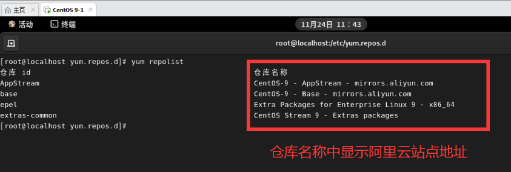

查看到epel源仓库信息即可

## 关防火墙

停止防火墙

```shell
# systemctl stop firewalld
```

开机禁用防火墙

```shell
# systemctl disable firewalld
```

查看防火墙状态

```shell
# systemctl status firewalld
```

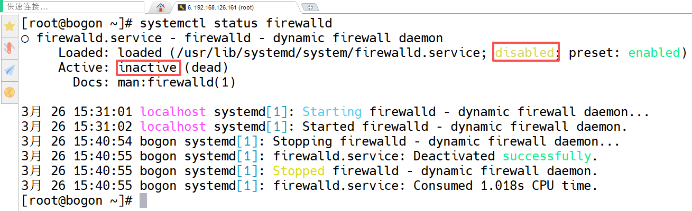

## selinux

### 查看selinux

```shell
# getenforce

enforcing 开启（会阻止你的程序）
permissive 宽松状态
disabled 禁用
```

### 临时关闭

```shell
# setenforce 0		(数字零，不是欧)
```

### 永久关闭

```shell
# vi /etc/sysconfig/selinux
第22行：SELINUX=disabled
```

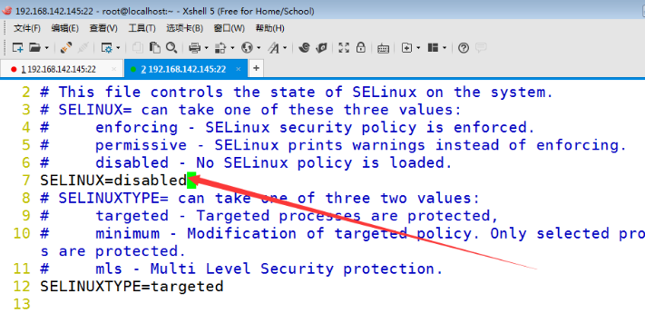

## 安装常用程序

上传下载工具     系统状态   字符浏览器  下载工具  网络工具  自动补全  vim编辑器

```shell
# yum install -y lrzsz sysstat curl wget net-tools bash-completion vim
```

## 配置IP地址

将最小化安装的系统设置为手动指定的IP。

```shell
# nmcli connection modify ens33 ipv4.addresses 192.168.126.180/24
```

nmcli 命令设置网关

```shell
# nmcli connection modify ens33 ipv4.gateway 192.168.126.2
```

设置手动配置（从 dhcp 到 static）

```shell
# nmcli connection modify ens33 ipv4.method manual
```

设置 DNS 值为 “8.8.8.8”（谷歌的域名解析器）

```shell
# nmcli connection modify ens33 ipv4.dns "114.114.114.114,8.8.8.8"
```

保留上述更改并从新加载

```shell
# nmcli connection up ens33
```

## 同步日期时间

查看chrony运行状态：

```shell
# systemctl status chronyd
```


如果chrony服务没有启动或者没有设置为开机自启，就执行下面的命令：

```shell
# systemctl start chronyd
# systemctl enable chronyd
```

配置NTP时间服务器，默认配置文件在`/etc/chrony.conf`

```shell
# vim /etc/chrony.conf
server ntp.aliyun.com iburst
server ntp1.tencent.com iburst
```

重启chrony服务：

```shell
# systemctl restart chronyd
```

查看同步的情况：（等个5秒钟左右再输入这个命令）

```shell
# timedatectl
               Local time: 二 2025-07-29 11:38:45 CST		当前系统时间
           Universal time: 二 2025-07-29 03:38:45 UTC		世界标准时间
                 RTC time: 二 2025-07-29 03:38:45
                Time zone: Asia/Shanghai (CST, +0800)		时区
System clock synchronized: yes													是否同步了，yes表示我们系统的时间是没问题的
              NTP service: active
          RTC in local TZ: no
```

## 关机快照

这个机器就作为我们以后的模板机，做一个快照备份！

# 四、克隆

## 说明

对于刚装好的Linux系统，我们可以做一个备份。

备份的方式有两种：

1. 快照
2. 克隆

## 克隆介绍

克隆一台Linux操作系统，其实就是复制一台Linux操作系统。

前提是Linux系统关机，才能克隆！

## 克隆的操作

先关机，然后执行下面的操作：

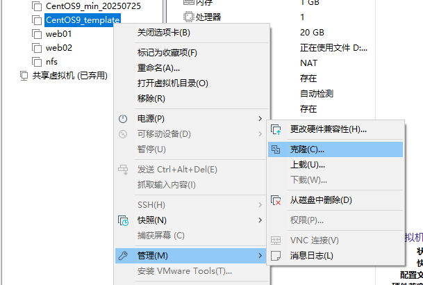

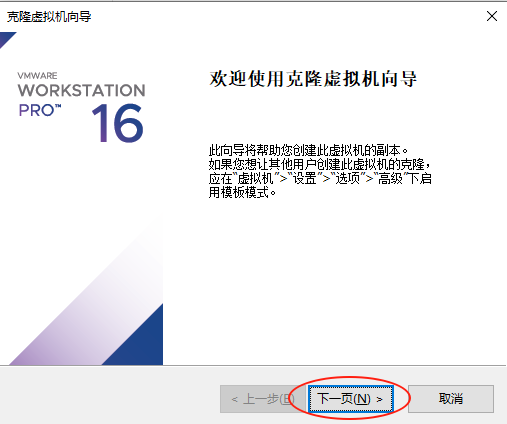

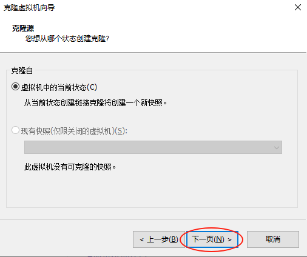

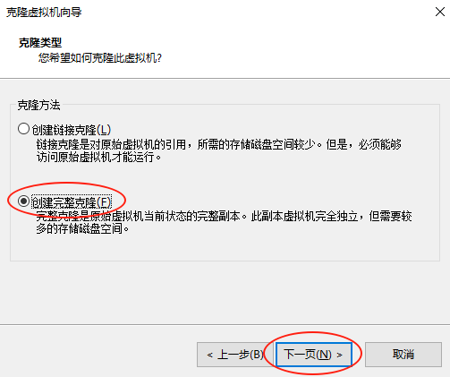

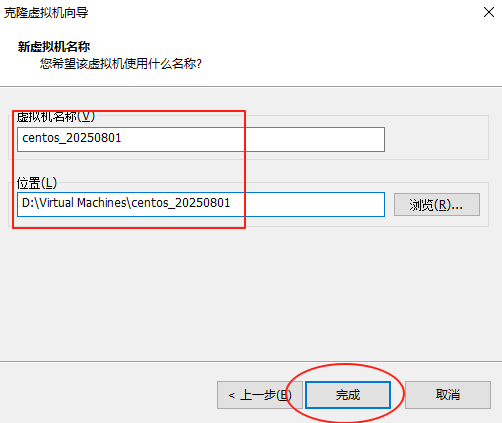

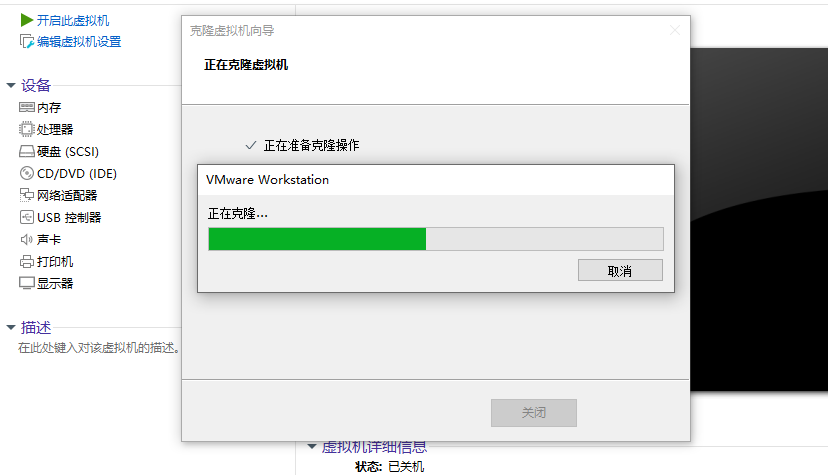

等个5分钟左右就好了！


> 更新: 2026-04-26 20:03:00  
> 原文: <https://www.yuque.com/u41736172/az9urv/mb7146iquw59lwk1>