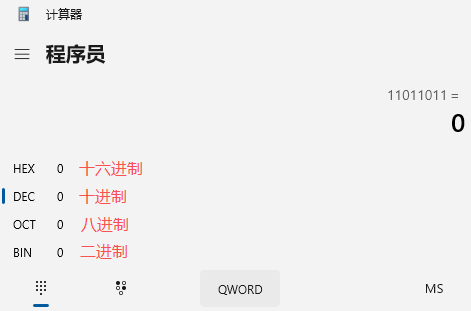
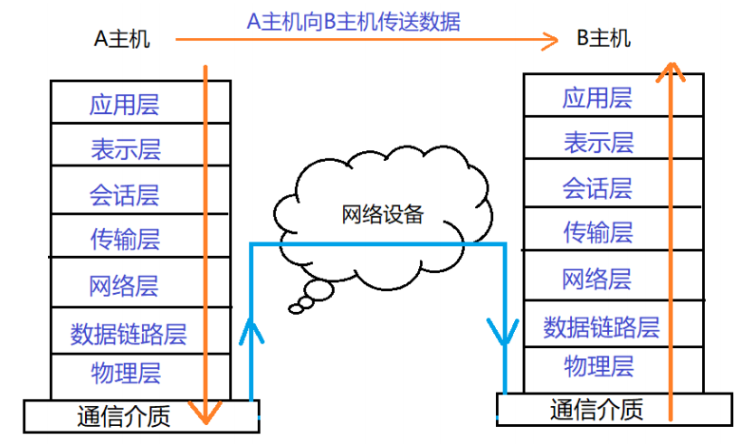
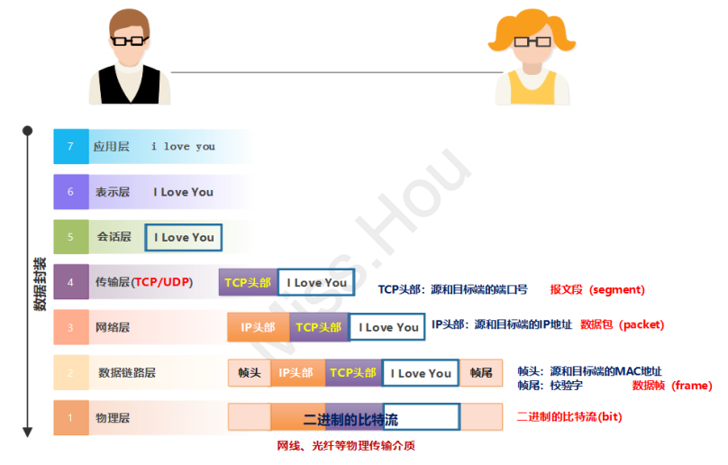
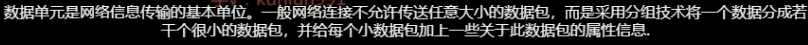
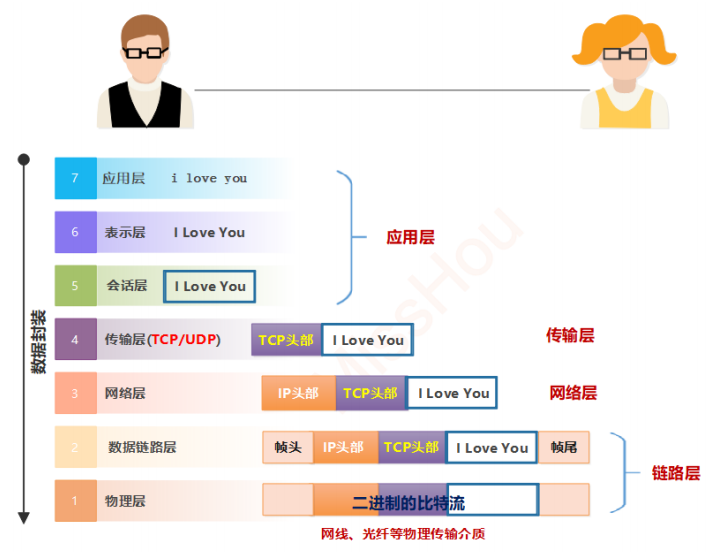
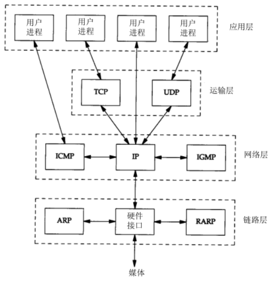
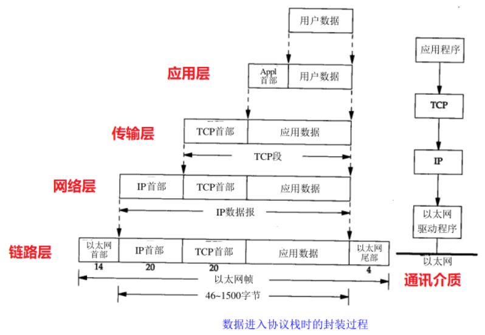

# 13.网络管理实战1

# 一、进制转换

## 十进制

逢十进一

数值：0、1、2、3、4、5、6、7、8、9

* 十进制里能用多少个符号？10个

数位：123 = 1 \* 10^2 + 2 \* 10^1 + 3 \* 10^0

* 数位能不能随便调整？

位权：百位十位个位，1 \* 10^2 + 2 \* 10^1 + 3 \* 10^0 = 123

## 二进制

数值：0、1

* 2进制里能用多少个符号？2个
* 不要问为什么

数位：101

* 数位能不能随便调整？

位权：128-64-32-16-8-4-2-1

## 十六进制

数值

* 0~9，A(10),B(11),C(12),D(13),E(14),F(15)

数位

* 101

位权

* 十六的倍数

## 二进制，十进制互转

10和2互转

```shell
128   64     32    16     8      4      2      1
1     1       1     1     1      1      1      1


位权加减法
十进制转换成2进制

方法：
1  请将8位2进制，每个位置的位权写出来。
2  通过加减法，在2进制位权中取得相应数字。 不足的位置用0填充。

示例：
129=1000 0001
192=1100 0000
130=1000 0010

67=0100 0011
33=0010 0001


二进制转十进制
示例：
1010 1010=170
1111 1110=？
```

## 单位换算

比特=bit=b=1/0

字节=byte=B=8个比特=8位

1KB=1024B

1MB=1024KB

1GB=1024MB

1TB=1024GB



# 二、IP地址

## 简介

internet protocol 互联网协议

32位二进制数

IP用于主机在互联网中的标识

4组十进制表示

* IP地址每八位为一组，用"."分割，用十进制标识
* 192.168.0.1
* 156.86.254.255
* 1.2.3.4
* 25.250.25.110

## 分类

A类（1~126）127:回环地址：我		大型企业

B类（128~191）	中型企业

C类（192~223）	小型企业

D类（224~239）组播

E类（240~255）科研

## 私有IP分类

A类：10.0.0.0~10.255.255.255

B类：172.16.0.0~172.31.255.255

C类：192.168.0.0~192.168.255.255

## 子网掩码

### 作用

32位2进制数字

运算出IP地址的网络部分。（IP地址其实是由网络位和主机位两部分组成的）

### 分类

A类：255.0.0.0

B类：255.255.0.0

C类：255.255.255.0

### 方法

子网掩码中为1部分，对应IP地址的网络位。

IP地址和子网掩码，逻辑与运算

## 网络地址

网络位相同，IP地址是同一网段			直接通信（通过交换机）

网络位不同，IP地址不是同一网段。		不能直接通信，必须经过网关路由器转发

ip address

netmask

gateway

# 三、MAC地址

## 网卡介绍

<font style="color:rgb(51, 51, 51);">网卡是计算机连接网络的硬件设备，负责数据链路层通信，MAC地址是其核心标识‌。</font>

<font style="color:rgb(51, 51, 51);">如果计算机有多个网卡（如有线+无线），每个网卡会拥有独立的MAC地址‌。</font>

## <font style="color:rgb(51, 51, 51);">MAC地址介绍</font>

<font style="color:rgb(51, 51, 51);">MAC地址（Media Access Control Address，媒体访问控制地址）是网络设备的物理标识符，用于在局域网（LAN）中唯一标识设备。</font>

**<font style="color:rgb(51, 51, 51);">作用</font>**<font style="color:rgb(51, 51, 51);">‌：MAC地址用于数据链路层（OSI模型的第2层），确保网络中的数据包能准确送达目标设备。</font>

**<font style="color:rgb(51, 51, 51);">格式</font>**<font style="color:rgb(51, 51, 51);">‌：由48位（6字节）组成，通常表示为12位十六进制数，用冒号或连字符分隔（如 </font><code><font style="color:rgb(51, 51, 51);">00:1A:2B:3C:4D:5E</font></code><font style="color:rgb(51, 51, 51);">）。</font>

* <font style="color:rgb(51, 51, 51);">前24位：‌</font>**<font style="color:rgb(51, 51, 51);">厂商标识符</font>**<font style="color:rgb(51, 51, 51);">‌（OUI），由IEEE分配给设备制造商。</font>
* <font style="color:rgb(51, 51, 51);">后24位：‌</font>**<font style="color:rgb(51, 51, 51);">设备唯一标识符</font>**<font style="color:rgb(51, 51, 51);">‌，由厂商自行分配。</font>

## <font style="color:rgb(51, 51, 51);">查看MAC地址</font>

Windows：

```shell
ipconfig /all
```

Linux：

```shell
ifconfig
或者
ip link show
```

## MAC地址与IP地址区别

| <font style="color:rgb(132, 134, 145);">‌</font>**<font style="color:rgb(132, 134, 145);">特性</font>**<font style="color:rgb(132, 134, 145);">‌</font> | <font style="color:rgb(132, 134, 145);">‌</font>**<font style="color:rgb(132, 134, 145);">MAC地址</font>**<font style="color:rgb(132, 134, 145);">‌</font> | <font style="color:rgb(132, 134, 145);">‌</font>**<font style="color:rgb(132, 134, 145);">IP地址</font>**<font style="color:rgb(132, 134, 145);">‌</font> |
| :--- | :--- | :--- |
| <font style="color:rgb(51, 51, 51);">作用层级</font> | <font style="color:rgb(51, 51, 51);">数据链路层（物理寻址）</font> | <font style="color:rgb(51, 51, 51);">网络层（逻辑寻址）</font> |
| <font style="color:rgb(51, 51, 51);">是否可变</font> | <font style="color:rgb(51, 51, 51);">固化在硬件中（通常不可变）</font> | <font style="color:rgb(51, 51, 51);">可动态分配或更改</font> |
| <font style="color:rgb(51, 51, 51);">地址长度</font> | <font style="color:rgb(51, 51, 51);">48位（十六进制）</font> | <font style="color:rgb(51, 51, 51);">IPv4为32位，IPv6为128位</font> |

# <font style="color:rgb(51,51,51);">四、OSI七层模型</font>

## 思考

<font style="color:rgb(51,51,51);">数据在两台计算机之间是如何传输的？</font>

**<font style="color:rgb(51,51,51);">数据传输过程：</font>**



## <font style="color:rgb(51,51,51);">什么是OSI模型</font>

* 开放系统互连参考模型，是国际标准化组织(ISO)和国际电报电话咨询委员会(CCITT)联合制定的开放系统互连参考模型。
* 目的：为开放式互连信息系统提供了一种功能结构的框架和参考。
* 这里所说的开放系统，实质上指的是遵循OSI参考模型和相关协议能够实现互连的具有各种应用目的的计算机系统。
* OSI采用了分层的结构化技术，共分七层：物理层、数据链路层、网络层、传输层、会话层、表示层、应用层

## OSI模型图示（记住）



## <font style="color:rgb(51,51,51);">OSI的七层介绍</font>

### <font style="color:rgb(51,51,51);">应用层</font>

* <font style="color:rgb(51,51,51);">应用层是计算机用户，以及各种应用程序和网络之间的接口，其功能是直接向用户提供服务，完成用户希望在网络上完成的各种工作。 </font>
* <font style="color:rgb(51,51,51);">应用层为用户提供的</font><font style="color:rgb(0,0,0);">服务和协议</font><font style="color:rgb(51,51,51);">：文件传输服务（FTP）、远程登录服务（ssh）、网络管理服务等。 </font>
* <font style="color:rgb(51,51,51);">上述的各种网络服务由该层的不同应用协议和程序完成。 </font>
* <font style="color:rgb(51,51,51);">应用层的主要功能如下： </font>
  * <font style="color:rgb(0,0,0);">用户接口</font><font style="color:rgb(51,51,51);">：应用层是用户与网络，以及应用程序与网络间的直接接口，使得用户能够与网络进行交互式联系。 </font>
  * <font style="color:rgb(0,0,0);">实现各种服务</font><font style="color:rgb(51,51,51);">：该层具有的各种应用程序可以完成和实现用户请求的各种服务。</font>

### <font style="color:rgb(51,51,51);">表示层</font>

* <font style="color:rgb(51,51,51);">表示层是</font>**<font style="color:rgb(51,51,51);">对来自应用层的命令和数据进行解释，对各种语法赋予相应的含义，并按照一定的格式传送给会话层。 </font>**
* <font style="color:rgb(51,51,51);">其主要功能是</font>**<font style="color:rgb(51,51,51);">处理用户信息的表示问题</font>**<font style="color:rgb(51,51,51);">，如编码、数据格式转换和加密解密等。 </font>
* <font style="color:rgb(51,51,51);">表示层的具体功能如下： </font>
  * <font style="color:rgb(51,51,51);">数据格式处理：协商和建立数据交换的格式，解决各应用程序之间在数据格式表示上的差异。数据的编码：处理字符集和数字的转换。 </font>
  * <font style="color:rgb(51,51,51);">压缩和解压缩：为了减少数据的传输量，这一层还负责数据的压缩与解压缩。 </font>
  * <font style="color:rgb(51,51,51);">数据的加密和解密：可以提高网络的安全性。</font>

### <font style="color:rgb(51,51,51);">会话层</font>

* <font style="color:rgb(51,51,51);">会话层是用户应用程序和网络之间的接口，主要任务是：组织和协调两个会话进程之间的通信，并对数据交换进行管理。 </font>
* <font style="color:rgb(51,51,51);">当建立会话时，用户必须提供他们想要连接的远程地址。</font>

### <font style="color:rgb(51,51,51);">传输层</font>

* <font style="color:rgb(51,51,51);">OSI上3层：应用层、表示层、会话层的主要任务是数据处理——</font>**<font style="color:rgb(51,51,51);">资源子网 </font>**
* <font style="color:rgb(51,51,51);">OSI下3层：网络层、数据链路层、物理层的主要任务是数据通讯——</font>**<font style="color:rgb(51,51,51);">通讯子网 </font>**
* <font style="color:rgb(51,51,51);">传输层是OSI模型的第4层，它是通信子网和资源子网的接口和桥梁，起到承上启下的作用 </font>
* <font style="color:rgb(51,51,51);">传输层的主要任务是：</font>**<font style="color:rgb(51,51,51);">向用户提供可靠的端到端的数据传输，保证报文的正确传输</font>**

**<font style="color:rgb(51,51,51);">报文：</font>**<font style="color:rgb(51,51,51);">报文(</font>**<font style="color:rgb(51,51,51);">message</font>**<font style="color:rgb(51,51,51);">)是网络中交换与传输的数据单元</font>

**<font style="color:rgb(51,51,51);">报文段: </font>**<font style="color:rgb(51,51,51);">组成报文的每个分组。我们将运输层分组称为报文段(</font>**<font style="color:rgb(51,51,51);">segment</font>**<font style="color:rgb(51,51,51);">)</font>



### <font style="color:rgb(51,51,51);">网络层</font>

* <font style="color:rgb(51,51,51);">主要任务是：</font>**<font style="color:rgb(51,51,51);">数据链路层的数据在这一层被转换为</font>****<font style="color:rgb(85,85,85);">数据包</font>****<font style="color:rgb(51,51,51);">，然后通过路径选择、分段组合、顺序、进/出路由等控制，将信息从一个网络设备传送到另一个网络设备。 </font>**
* <font style="color:rgb(51,51,51);">一般情况下，数据链路层是解决</font>**<font style="color:rgb(51,51,51);">同一网络</font>**<font style="color:rgb(51,51,51);">(局域网)内节点之间的通信，而网络层主要解决</font>**<font style="color:rgb(51,51,51);">不同子网</font>**<font style="color:rgb(51,51,51);">间的通信</font>

### <font style="color:rgb(51,51,51);">数据链路层</font>

**<font style="color:rgb(51,51,51);">在计算机网络中由于各种干扰的存在，物理链路是不可靠的。因此，这一层的主要功能是</font>\*\*\*\*<font style="color:rgb(51,51,51);">: </font>**

* <font style="color:rgb(51,51,51);">在物理层提供的</font>**<font style="color:rgb(51,51,51);">比特流</font>**<font style="color:rgb(51,51,51);">的基础上，通过差错控制、流量控制方法，使有差错的物理线路变为无差错的数据链路，即</font><font style="color:rgb(0,0,0);">向网络层提供可靠的通过物理介质传输数据的方法</font><font style="color:rgb(51,51,51);">。 </font>
* <font style="color:rgb(51,51,51);">具体工作是：接收来自物理层的位流（比特流）形式的数据，通过差错控制等方法传到网络层；同样，也将来自上层的数据，封装成帧转发到物理层；并且，还负责处理接收端发回的确认帧的信息，以便提供可靠的数据传输。 </font>

**<font style="color:rgb(51,51,51);">帧：</font>**<font style="color:rgb(51,51,51);">帧(</font>**<font style="color:rgb(51,51,51);">frame</font>**<font style="color:rgb(51,51,51);">)是数据链路层的传输单元。将上层传入的数据添加一个头部和尾部，组成了帧.</font>

### <font style="color:rgb(51,51,51);">物理层</font>

<font style="color:rgb(51,51,51);">主要功能是：利用传输介质为数据链路层提供物理连接，实现</font><font style="color:rgb(0,0,0);">比特流的透明传输</font><font style="color:rgb(51,51,51);">。尽可能屏蔽掉具体传输介质和物理设备的差异。</font>

### <font style="color:rgb(51,51,51);">总结</font>

* <font style="color:rgb(51,51,51);">在7层模型中，每一层都提供一个特殊的网络功能。 </font>
* <font style="color:rgb(51,51,51);">从网络功能的角度观察：</font>
  * <font style="color:rgb(51,51,51);">物理层、数据链路层、网络层：主要提供</font>**<font style="color:rgb(51,51,51);">数据传输和交换功能</font>**<font style="color:rgb(51,51,51);">，即节点到节点之间通信为主；</font>
  * <font style="color:rgb(51,51,51);">传输层（第4层）：作为上下两部分的桥梁，是整个网络体系结构中最关键的部分； </font>
  * <font style="color:rgb(51,51,51);">会话层、表示层和应用层：以提供</font>**<font style="color:rgb(51,51,51);">用户与应用程序之间的信息和数据处理</font>**<font style="color:rgb(51,51,51);">功能为主；</font>

| **<font style="color:rgb(51, 51, 51);">层</font>** | **<font style="color:rgb(51, 51, 51);">功能</font>** |
| :--- | :--- |
| <font style="color:rgb(51, 51, 51);">‌</font>**<font style="color:rgb(51, 51, 51);">应用层</font>**<font style="color:rgb(51, 51, 51);">‌</font> | <font style="color:rgb(51, 51, 51);">提供用户接口，支持应用程序（如浏览器、邮件）的网络服务</font> |
| <font style="color:rgb(51, 51, 51);">‌</font>**<font style="color:rgb(51, 51, 51);">表示层</font>**<font style="color:rgb(51, 51, 51);">‌</font> | <font style="color:rgb(51, 51, 51);">数据格式转换（加密/解密、压缩/解压、编码转换）</font> |
| <font style="color:rgb(51, 51, 51);">‌</font>**<font style="color:rgb(51, 51, 51);">会话层</font>**<font style="color:rgb(51, 51, 51);">‌</font> | <font style="color:rgb(51, 51, 51);">建立、管理和终止会话（如远程登录、文件传输会话）</font> |
| <font style="color:rgb(51, 51, 51);">‌</font>**<font style="color:rgb(51, 51, 51);">传输层</font>**<font style="color:rgb(51, 51, 51);">‌</font> | <font style="color:rgb(51, 51, 51);">提供端到端的数据传输（可靠TCP / 高效UDP）</font> |
| <font style="color:rgb(51, 51, 51);">‌</font>**<font style="color:rgb(51, 51, 51);">网络层</font>**<font style="color:rgb(51, 51, 51);">‌</font> | <font style="color:rgb(51, 51, 51);">逻辑寻址（IP）、路由选择（跨网络传输）</font> |
| <font style="color:rgb(51, 51, 51);">‌</font>**<font style="color:rgb(51, 51, 51);">数据链路层</font>**<font style="color:rgb(51, 51, 51);">‌</font> | <font style="color:rgb(51, 51, 51);">物理寻址（MAC）、帧传输、错误检测</font> |
| <font style="color:rgb(51, 51, 51);">‌</font>**<font style="color:rgb(51, 51, 51);">物理层</font>**<font style="color:rgb(51, 51, 51);">‌</font> | <font style="color:rgb(51, 51, 51);">传输原始比特流（电信号、光信号、无线信号）</font> |

# <font style="color:rgb(51,51,51);">五、TCP/IP协议模型</font>

## <font style="color:rgb(51,51,51);">什么是TCP/IP模型</font>

* **<font style="color:rgb(51,51,51);">TCP/IP协议模型</font>**<font style="color:rgb(51,51,51);">（Transmission Control Protocol/Internet Protocol），包含了一系列构成互联网</font><font style="color:rgb(0,0,0);">基础的网络协议</font><font style="color:rgb(51,51,51);">，是Internet的核心协议，通过20多年的发展已日渐成熟，并被广泛应用于</font>**<font style="color:rgb(51,51,51);">局域网和广域网</font>**<font style="color:rgb(51,51,51);">中，目前已成为一种</font>**<font style="color:rgb(51,51,51);">国际标准</font>**<font style="color:rgb(51,51,51);">。 </font>
* <font style="color:rgb(51,51,51);">TCP/IP协议簇是一组不同层次上的</font>**<font style="color:rgb(51,51,51);">多个协议</font>**<font style="color:rgb(51,51,51);">的组合，该协议采用了4层的层级结构，每一层都</font><font style="color:rgb(0,0,0);">呼叫</font><font style="color:rgb(51,51,51);">它的下一层所提供的</font><font style="color:rgb(0,0,0);">协议</font><font style="color:rgb(51,51,51);">来完成自己的需求，与OSI的七层模型相对应。 </font>
* <font style="color:rgb(51,51,51);">尽管通常称该协议族为TCP/IP，但TCP和IP只是其中的两种协议而已（该协议族的另一个名字是Internet协议族(Internet Protocol Suite)）</font>

## <font style="color:rgb(51,51,51);">TCP/IP的分层结构</font>





### <font style="color:rgb(51,51,51);">应用层</font>

**<font style="color:rgb(51,51,51);">OSI</font>**<font style="color:rgb(51,51,51);">会话层、表示层、应用层 </font>

**<font style="color:rgb(51,51,51);">应用层负责处理特定的应用程序细节。 </font>**

<font style="color:rgb(51,51,51);">HTTP、FTP、SSH、DHCP、DNS.....</font>

### <font style="color:rgb(51,51,51);">传输层</font>

**<font style="color:rgb(51,51,51);">主要为两台主机上的应用程序提供端到端的通信。在TCP/IP协议族中，有两个互不相同的传输协议：</font>**

<font style="color:rgb(51,51,51);">TCP（传输控制协议）和UDP（用户数据报协议） </font>

**<font style="color:rgb(51,51,51);">TCP协议：</font>**<font style="color:rgb(51,51,51);">为两台主机提供高可靠性的数据通信。TCP是</font><font style="color:rgb(0,0,0);">面向连接</font><font style="color:rgb(51,51,51);">的通信协议，通过</font>**<font style="color:rgb(51,51,51);">三次握手</font>**<font style="color:rgb(51,51,51);">建立连接，通讯完成时要断开连接，由于TCP是面向连接的所以只能用于端到端的通讯。 </font>

<font style="color:rgb(51,51,51);">TCP提供的是一种可靠的数据流服务，采用“</font>**<font style="color:rgb(51,51,51);">带重传的肯定确认”</font>**<font style="color:rgb(51,51,51);">技术来实现传输的可靠性。也就是TCP数据包中包括序号（seq）和确认（ack），所以未按照顺序收到的包可以被排序，而损坏的包可以被重传。 </font>**<font style="color:rgb(51,51,51);">UDP协议：</font>**<font style="color:rgb(51,51,51);">则为应用层提供一种非常简单的服务。它是</font><font style="color:rgb(0,0,0);">面向无连接</font><font style="color:rgb(51,51,51);">的通讯协议，UDP数据包括目的端口号和源端口号信息，由于通讯不需要连接，所以可以实现广播发送。 UDP通讯时不需要接收方确认，不保证该数据报能到达另一端，属于不可靠的传输，可能会出现丢包现象。UDP与TCP位于同一层，但它不管数据包的顺序、错误或重发。</font>

### <font style="color:rgb(51,51,51);">网络层</font>

* <font style="color:rgb(51,51,51);">也称作互联网层或网际层，处理分组在网络中的活动，例如分组的选路。 </font>
* <font style="color:rgb(51,51,51);">在TCP/IP协议族中，网络层协议包括IP协议（网际协议），ICMP协议（Internet互联网控制报文协议），以及IGMP协议（Internet组管理协议）。 </font>
  * **<font style="color:rgb(51,51,51);">IP</font>**<font style="color:rgb(51,51,51);">是一种网络层协议，提供的是一种不可靠的服务，它只是尽可能快地把分组从源结点送到目的结点，但是并不提供任何可靠性保证。同时被TCP和UDP使用。 </font>
  * <font style="color:rgb(51,51,51);">TCP和UDP的每组数据都通过端系统和每个中间路由器中的IP层在互联网中进行传输。 </font>
  * **<font style="color:rgb(51,51,51);">ICMP</font>**<font style="color:rgb(51,51,51);">是IP协议的附属协议。IP层用它来与其他主机或路由器</font>**<font style="color:rgb(51,51,51);">交换错误报文和其他重要信息</font>**<font style="color:rgb(51,51,51);">。它主要是用来提供有关通向目的地址的路径信息。Ping和Traceroute工具，它们都使用了ICMP协议。 </font>
  * **<font style="color:rgb(51,51,51);">IGMP</font>**<font style="color:rgb(51,51,51);">是Internet组管理协议。它用来把一个UDP数据报多播到多个主机。该协议运行在主机和组播路由器之间。</font>

### <font style="color:rgb(51,51,51);">链路层</font>

**<font style="color:rgb(51,51,51);">OSI</font>**<font style="color:rgb(51,51,51);">的物理层和数据链路层 </font>

**<font style="color:rgb(51,51,51);">ARP</font>**<font style="color:rgb(51,51,51);">（地址解析协议</font>**<font style="color:rgb(51,51,51);">IP-MAC</font>**<font style="color:rgb(51,51,51);">）和</font>**<font style="color:rgb(51,51,51);">RARP</font>**<font style="color:rgb(51,51,51);">（逆地址解析协议</font>**<font style="color:rgb(51,51,51);">MAC-IP</font>**<font style="color:rgb(51,51,51);">）是某些网络接口（如以太网）使用的特殊协议，用来转换IP层和网络接口层使用的地址。</font>

### <font style="color:rgb(51,51,51);">数据封装过程</font>

**<font style="color:rgb(51,51,51);">数据格式 </font>**

<font style="color:rgb(51,51,51);">TCP</font><font style="color:rgb(51,51,51);">数据信息：</font><font style="color:rgb(51,51,51);">TCP</font><font style="color:rgb(51,51,51);">头部</font><font style="color:rgb(51,51,51);">+</font><font style="color:rgb(51,51,51);">实际数据</font><font style="color:rgb(51,51,51);"> (TCP</font><font style="color:rgb(51,51,51);">头包括源和目标主机</font>**<font style="color:rgb(51,51,51);">端口号</font>**<font style="color:rgb(51,51,51);">、顺序号、确认号、校验字等） </font>

<font style="color:rgb(51,51,51);">IP</font><font style="color:rgb(51,51,51);">数据包：</font><font style="color:rgb(51,51,51);">IP</font><font style="color:rgb(51,51,51);">头部</font><font style="color:rgb(51,51,51);">+TCP</font><font style="color:rgb(51,51,51);">数据信息（</font><font style="color:rgb(51,51,51);">IP</font><font style="color:rgb(51,51,51);">头包括源和目标主机</font>**<font style="color:rgb(51,51,51);">IP</font>\*\*\*\*<font style="color:rgb(51,51,51);">地址</font>**<font style="color:rgb(51,51,51);">、类型、生存期等） </font>

<font style="color:rgb(51,51,51);">数据帧：帧头</font><font style="color:rgb(51,51,51);">+IP</font><font style="color:rgb(51,51,51);">数据包</font><font style="color:rgb(51,51,51);">+</font><font style="color:rgb(51,51,51);">帧尾 （帧头包括源和目标主机</font>**<font style="color:rgb(51,51,51);">MAC</font>\*\*\*\*<font style="color:rgb(51,51,51);">初步地址</font>**<font style="color:rgb(51,51,51);">及类型，帧尾是校验字） </font>

**<font style="color:rgb(51,51,51);">数据的封装与解封装： </font>**<font style="color:rgb(51,51,51);">封装：数据要通过网络进行传输，要从高层一层一层的向下传送，如果一个主机要传送 数据到别的主机，先把数据装到一个特殊协议报头中，这个过程叫-----</font><font style="color:rgb(0,0,0);">封装</font><font style="color:rgb(51,51,51);">。 解封装：上述的逆向过程 </font>

**<font style="color:rgb(51,51,51);">当数据以TCP/IP协议传输时的封装与解封装过程如下图：</font>**




> 更新: 2025-10-14 09:26:08  
> 原文: <https://www.yuque.com/u41736172/az9urv/hshahhtyoaf2x9a2>