# 14.网络管理实战2（数据链路层+物理层）

# 一、物理层

## 信号

信号分为模拟信号和数字信号。

### 模拟信号

不断变换的物理量

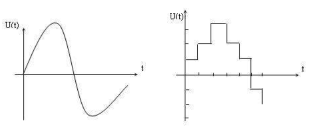

适用电话网络

### 数字信号

两种恒定物理量

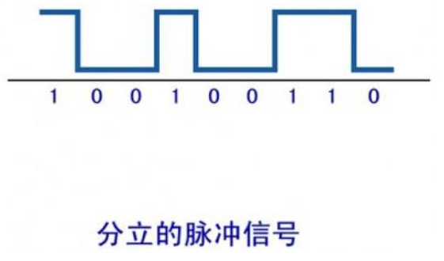

适用计算机网络

优点：抗噪音和抗衰减比较强

## 介质

### 双绞线

EIA/TIA568标准

#### 外形

八根线芯，两两互绞

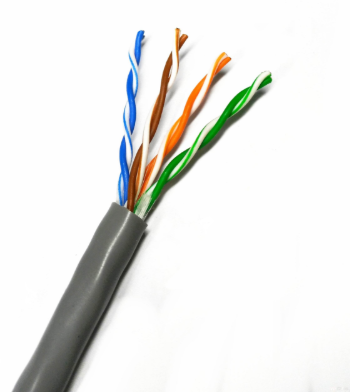

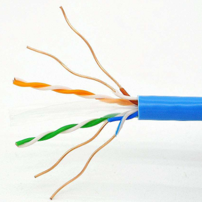

#### 功能分类

屏蔽型

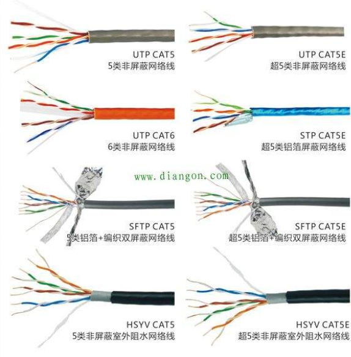

非屏蔽性：UTP

#### 速率分类

cat 5 /5类线/10M100M

cat 5e/超五类线/10M100M

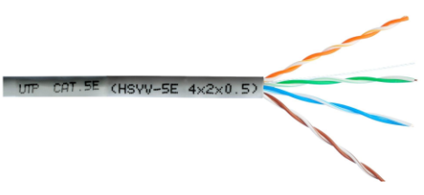

cat 6/六类线/1000M

#### 接口

RJ45/水晶头

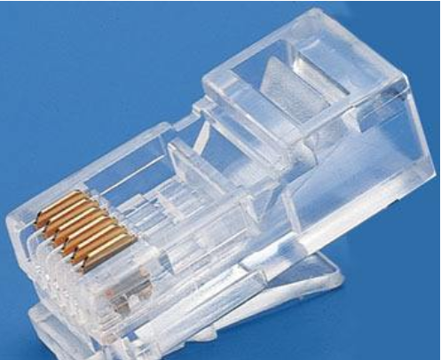

线序：EIA/TIA568B：橙白，橙，绿白，蓝，蓝白，绿，棕白 ，棕

* 标准568A：绿白，绿，橙白，蓝，蓝白，橙，棕白，棕；
* 标准568B：橙白，橙，绿白，蓝，蓝白，绿，棕白，棕。

标准网线：两端线序相同。

#### 制作视频

<https://haokan.baidu.com/v?pd=wisenatural&vid=3324873689274123555>

### 光纤

多模/单模


纤芯粗/纤芯细

低速/高速

近/远

便宜/贵

FC/ST/LC接口类型

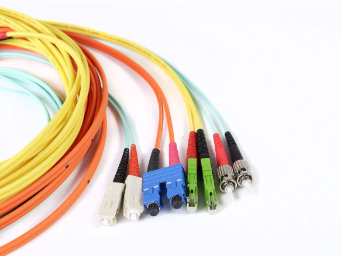

# 二、数据链路层

## 功能

数据链路层在网络层数据的基础上，增加了帧头、帧尾。帧头：源MAC地址、目标MAC地址！

链路创建，维护，管理

帧封装，传输，同步

差错校验

典型的设备：交换机，switch（交换机）、port（端口号）、interface（接口）

## 地址

MAC地址

* 媒体访问控制地址
* Media Access Control Address

结构

* 48位2进制数字
* 12位16进制数字

示例

* 前六位是厂商标识
* 后六位是硬件标识
* 00-21-CC-C3-8C-B0

## 帧封装

MAC 地址是怎么写到信息当中的呢？

目标MAC//源MAC//数据//CRC

图示：

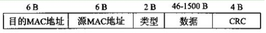

<font style="color:rgb(51, 51, 51);">类型：2 字节字段，标明数据字段的上层协议类型（如 </font><code><font style="color:rgb(51, 51, 51);">0800</font></code><font style="color:rgb(51, 51, 51);"> 表示 IPv4，</font><code><font style="color:rgb(51, 51, 51);">0806</font></code><font style="color:rgb(51, 51, 51);"> 表示 ARP），指导接收端正确解析载荷</font>

<font style="color:rgb(51, 51, 51);">CRC：4 字节循环冗余校验码（FCS），用于检测帧在传输中的完整性（如比特错误），不提供纠错功能</font>

## 交换机工作原理

学习/广播/转发/更新			PC：personal computer

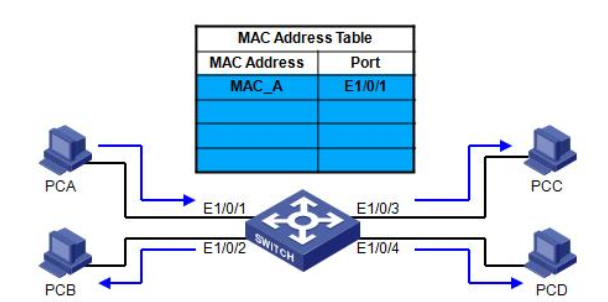

交换机中其实是有一张表-MAC地址表，该表中就会记录连接到交换机中的每台电脑的MAC地址，以后电脑之间进行通信，交换机就是根据这个MAC地址表将数据给传输过去的！

注意：刚开始，交换机中的MAC地址表其实是空的！

**学习**：当PCA要传输数据给PCB的时候，PCA将数据发送给交换机，交换机就会在MAC地址表中记录PCA的MAC地址信息。这就是学习！

**广播**：当PCA给PCB传输数据时，交换机的MAC地址表中没有PCB的MAC地址，这时候交换机就会进行广播（除了PCA），“问你们谁是192.168.126.2IP呀？”对应的IP的机器就会回应交换机，交换机就会记录该机器的MAC地址信息！

**转发**：就是PCA将数据传输给交换机后，交换机将数据转给PCB的过程。

**更新**：就是当PCA连接交换机的端口号发生变化后，交换机中的MAC地址表也会随之更新！

默认交换机中的MAC地址表的信息在5分钟内没有任何通信的话，就会清除掉！

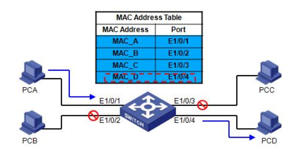

## 组建局域网

### 软件安装

解压`Cisco Packet Tracer 6.0 正式版.zip`，安装思科软件，可以实现模拟路由器、交换机等网络功能。

解压之后，打开文件夹，双击安装：

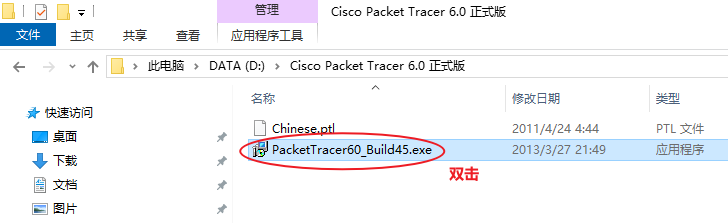

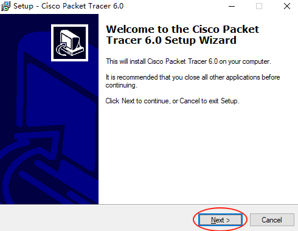

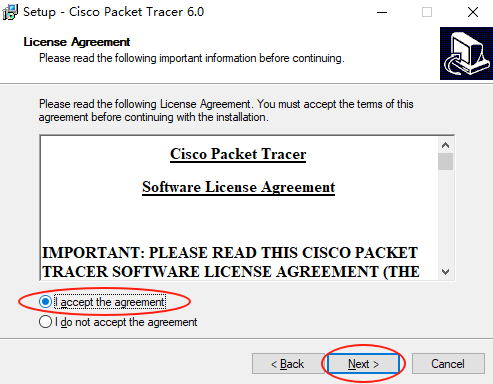

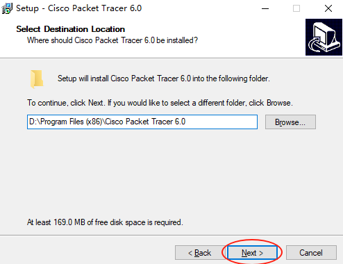

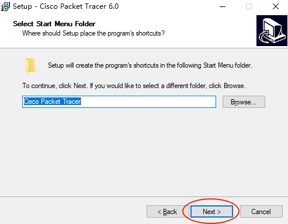

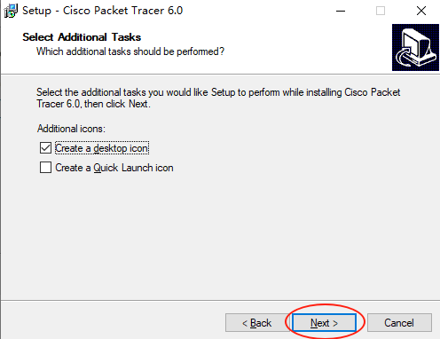

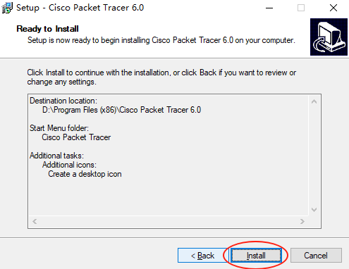

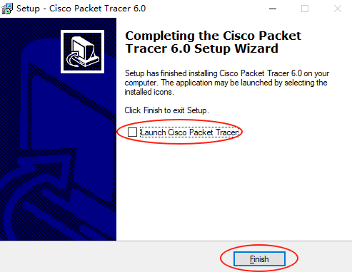

### 汉化

**下面是汉化步骤：**

拷贝解压后的文件夹中的语言包`Chinese.ptl`至安装目录

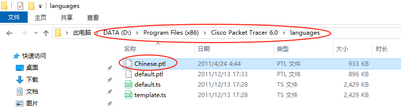

运行软件，找到首选项

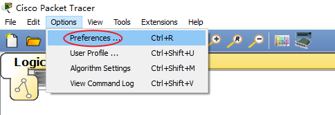

设置中文

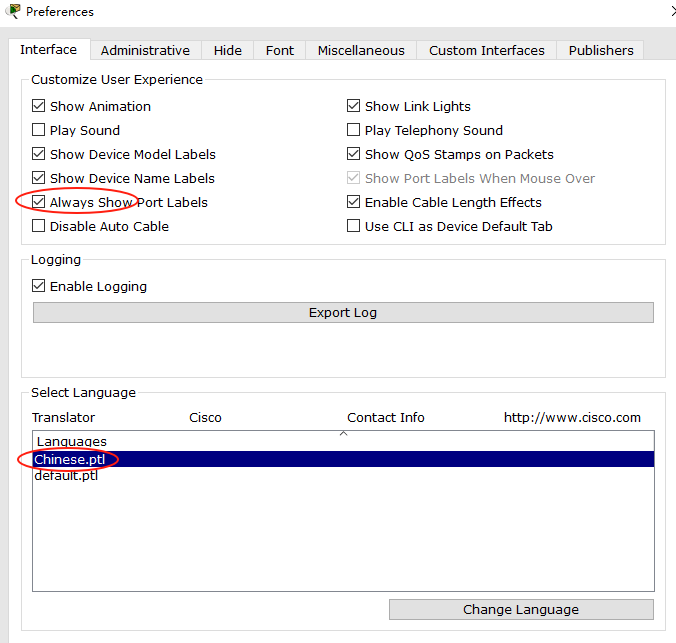

然后关闭软件，重新打开就可以了。（他只能汉化部分，效果如下）

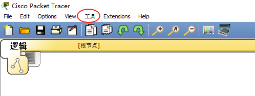

### 入门案例

创建一个交换机

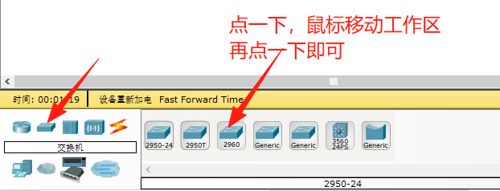

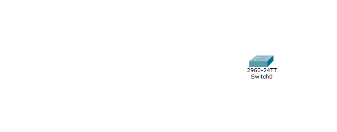

创建一台笔记本电脑

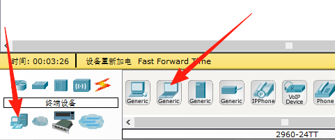

使用网线将交换机和笔记本连接起来

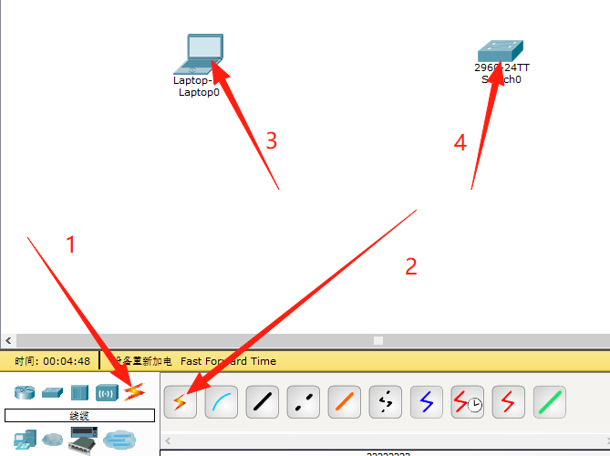

效果如下：

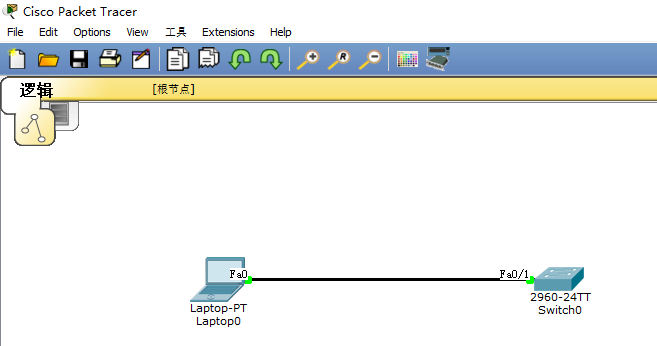

写一个标签说明：

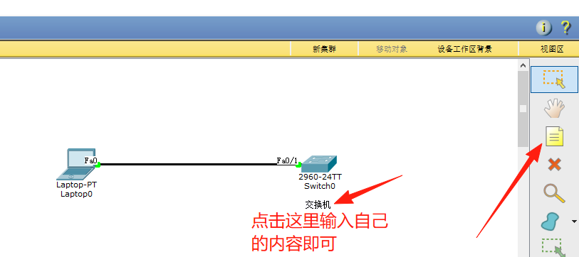

### 组建局域网案例

**思路**

```shell
1 安装cisco cpt软件
2 部署交换机和主机
3 直通线连线，主机和交换机。
4 为每个主机配置IP,互相ping测试
5 通过show  mac-address-table。观察交换机工作原理。
6 更换某个主机与交换机连接的接口，ping测试后， 再次观察交换机的mac地址表更新。
```

#### 效果图

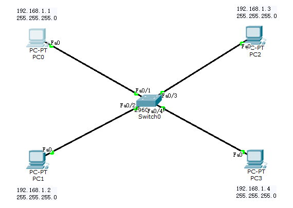

#### 创建交换机

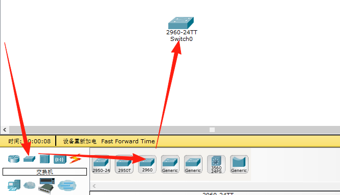

#### 创建4台电脑

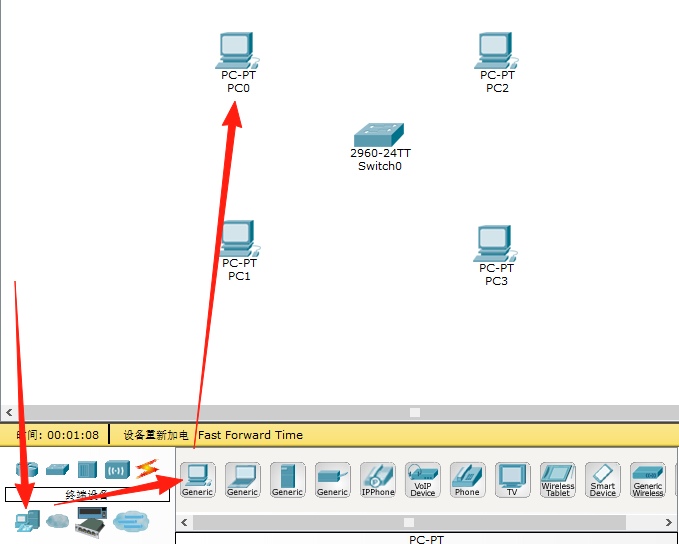

#### 连接电脑和交换机

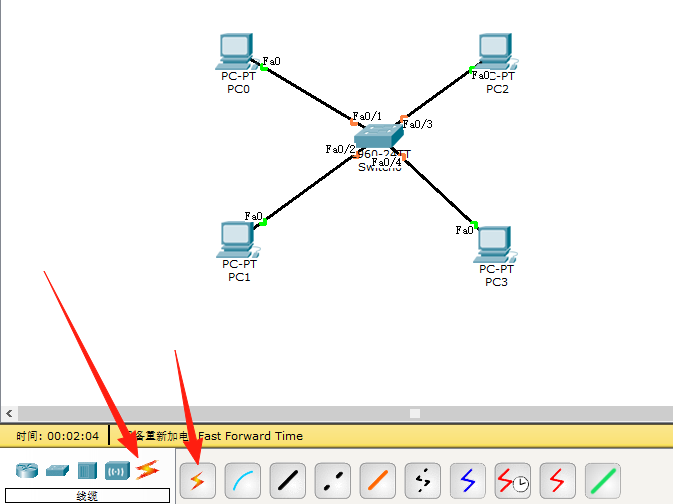

注意我上面连接的顺序，观察每台电脑和交换机的哪个接口连着了。本案例无所谓，后面的案例需要注意主机接口顺序！

#### 给电脑配置IP和子网掩码

给每台电脑都配置上IP和子网掩码：

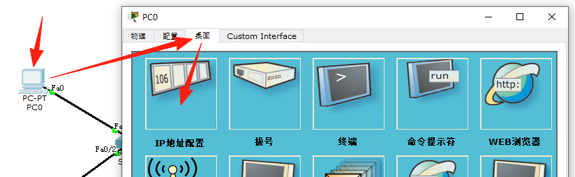

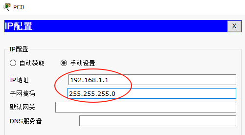

#### 给电脑加上批注

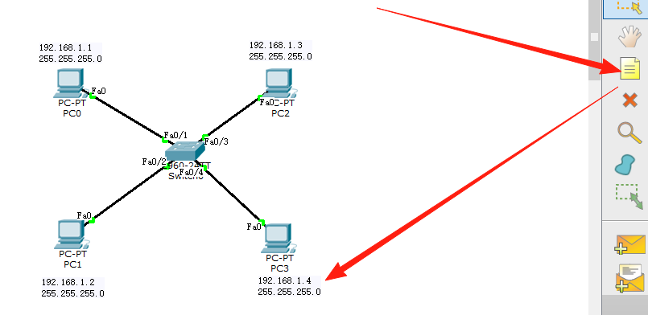

#### 测试网络连通性

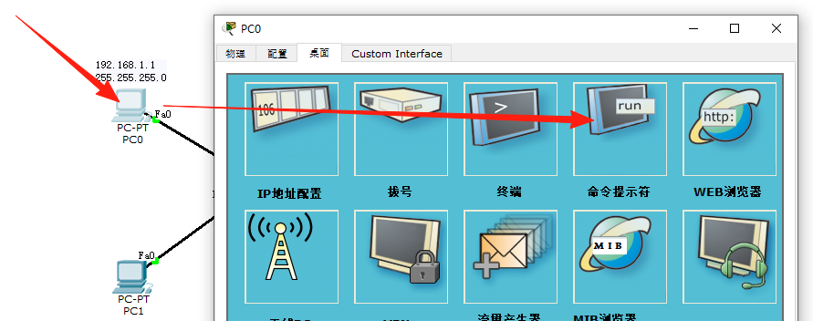

分别ping其余的3台电脑！

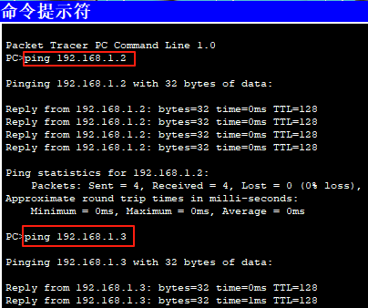

#### 查看交换机的mac地址表

交换机之所以能够将上面的几台机器进行互相通信，就会看mac地址表中的信息。

mac地址表本来是没有信息的，当你通过ping命令执行一次后，交换机的mac地址表就会学习记录你的信息和对方的信息！而且这些信息还会更新，如果你更改了连接交换机的端口号后交换机会自动更新mac地址表！

而且交换机的mac地址表中的信息默认如果5分钟没有人用到，会清理掉！

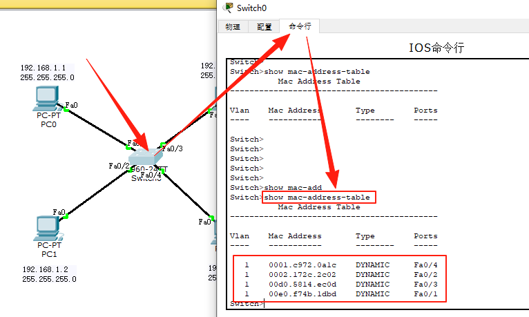

如何查看电脑的mac地址呢？？？这是思科软件给电脑自动分配的，当然了，我们也可以更改！

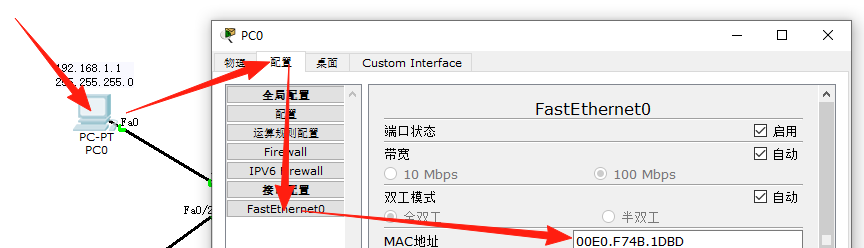

#### 更换电脑连接交换机的端口

我们更换电脑连接交换机的端口，查看交换机的mac地址表是否会更新！

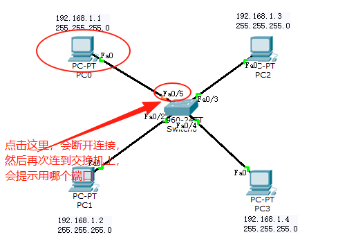

换完端口后，如果直接查看mac地址表中，是没有最新的信息的，需要我们ping一次别的电脑，交换机才能学习和更新！

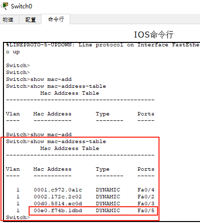

## VLAN

### 名词解释

虚拟局域网络，Virtual Local Area Network

举例：

在一个公司中，有很多部门，比如：人事部、财务部、开发部等等。这些部门的同事的电脑都连接在一台交换机上了，那么他们之间的电脑都是可以互相通信的。

但是，这样不是很安全，比如其他部门的同事也可以和财务部的同事电脑之间进行通信！

我们需要将交换机的端口进行划分，将同一部门的电脑连接的交换机的端口划分在一个区域，这样就可以实现各自区域内的电脑进行通信，但是不能跨区域通信！！！保证了网络安全。

这种将一台交换机的多个端口划分为不同组的技术称为VLAN！

### 图示

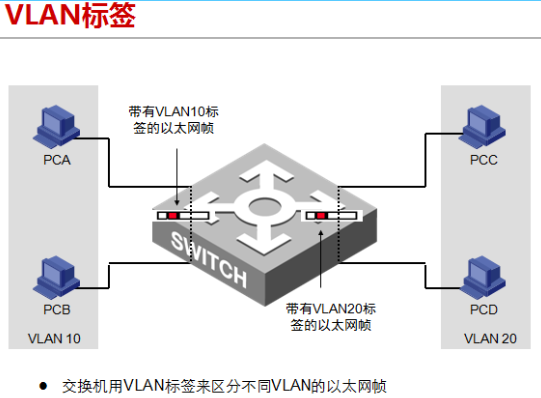

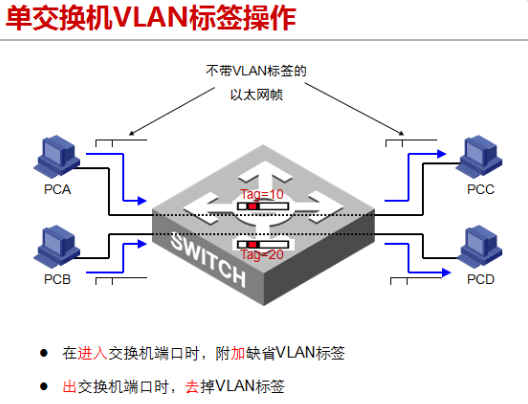

### 划分VLAN的方法

创建VLAN （2~1024）

根据接口和VLAN的关系

* 接口和VLAN
* 比如：F0/1~F0/10   	VLAN 10
* 比如：F0/11~F0/20  	VLAN 20

默认，交换机所有的接口都是在VLAN 1中

### 语法配置

```shell
交换机1上配置
enable											特权
config     t								进入配置模式（config）#
vlan 10											创建局域网10
vlan 20											创建局域网20
interface  fastethernet0/1	必须要在接口模式下才可以输入
switch access vlan 10				将端口加入VLAN
exit
Switch>show vlan brief 
```

接下来我们在交换机中创建两个VLAN，VLAN 10和VLAN 20；然后让交换机的1和2接口加入到VLAN 10中，让交换机的3和4接口加入到VLAN 20中。这样就可以实现电脑1只能和电脑2通信，电脑3只能和电脑4通信！

代码案例：在交换机中输入下面代码，另外注意你的电脑连接的交换机的端口号可能和我的不一样，注意换成自己的。

```shell
Switch> 																		用户执行模式
Switch> enable															进入特权执行模式
Switch# 																		特权执行模式  
Switch# configure terminal									进入全局配置模式
Switch(config)#															全局配置模式

Switch(config)# vlan 10											创建VLAN 10组，并进入VLAN模式
Switch(config-vlan)# vlan 20								创建VLAN 20组
Switch(config-vlan)# exit										退出VLAN模式
Switch(config)#															全局配置模式

Switch(config)# interface fastethernet 0/1	进入0/1接口，进入到接口模式
Switch(config-if)# 													接口模式
Switch(config-if)# switchport access vlan 10	将当前接口加入到VLAN 10
Switch(config-if)# exit											退回到上级
Switch(config)#															全局配置模式

Switch(config)# interface fastEthernet 0/2	进入到0/2接口，进入到接口模式
Switch(config-if)# 													接口模式
Switch(config-if)# switchport access vlan 10	将当前接口加入到VLAN 10
Switch(config-if)# exit											退回到上级
Switch(config)#															全局配置模式

Switch(config)# interface fastEthernet 0/3	进入到0/3接口，进入到接口模式
Switch(config-if)# 													接口模式
Switch(config-if)# switchport access vlan 20	将当前接口加入到VLAN 20
Switch(config-if)# exit											退回到上级
Switch(config)#															全局配置模式

Switch(config)# interface fastEthernet 0/4	进入到0/4接口，进入到接口模式
Switch(config-if)# 													接口模式
Switch(config-if)# switchport access vlan 20	将当前接口加入到VLAN 20
Switch(config-if)# exit											退回到上级
Switch(config)# exit												退回到上级
Switch# exit																退回到上级
Switch> 																		用户执行模式

Switch> show vlan brief 										显示VLAN的摘要信息

VLAN Name                             Status    Ports
---- -------------------------------- --------- -------------------------------
1    default                          active    Fa0/5, Fa0/6, Fa0/7, Fa0/8
                                                Fa0/9, Fa0/10, Fa0/11, Fa0/12
                                                Fa0/13, Fa0/14, Fa0/15, Fa0/16
                                                Fa0/17, Fa0/18, Fa0/19, Fa0/20
                                                Fa0/21, Fa0/22, Fa0/23, Fa0/24
                                                Gig1/1, Gig1/2
10   VLAN0010                         active    Fa0/1, Fa0/2
20   VLAN0020                         active    Fa0/3, Fa0/4
1002 fddi-default                     active    
1003 token-ring-default               active    
1004 fddinet-default                  active    
1005 trnet-default                    active    
Switch>
```

```shell
说明：
Switch> 是用户执行模式，权限最低，这个是用户登录后默认进入的模式，可以执行ping等命令

Switch# 是特权执行模式，可以执行所有查看命令和重启等操作，通过 enable 命令进入

Switch(config)# 是全局配置模式，可以修改全局参数，通过 configure terminal 命令进入

子配置模式（需要从全局配置模式进入）
Switch(config-if)# 是接口配置模式，通过 interface 命令进入
Switch(config-vlan)# 是VLAN配置模式，通过 vlan 命令进入

各个模式之间通过 exit 命令返回上级！

如果某个端口配置VLAN的时候配置错了，比如将0/3端口配置到VLAN 10了，但其实是想配置到VLAN 20，怎么办？ 只需要再次进入到0/3端口，然后执行配置到VLAN 20的命令即可！
```

### 验证

执行完上面的配置命令后，测试发现相同VLAN的主机可以通信，不同VLAN的主机不能通信！

## TRUNK

### 引入

上面的例子中，我们通过VLAN技术，将一台交换机的端口进行划分，处于同一VLAN中的主机是可以通信的，不同VLAN中的主机是不能通信的！

举例：

如果公司有两间办公室，一个在2楼、一个在3楼，那么他们之间怎么通信呢？而且2楼和3楼也不是所有的电脑都可以互相通信，有部分电脑是要互相通信的。

利用之前所学知识：

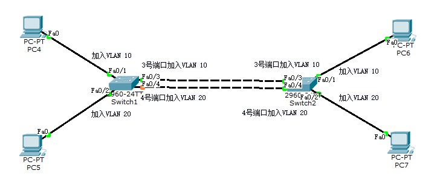

1. 左边交换机中，端口1是VLAN 10，端口2是VLAN 20
2. 右边交换机中，端口1是VLAN 10，端口2是VLAN 20
3. 两台交换机需要使用两根网线连起来
4. 将左边交换机的端口3加入到VLAN 10，端口4加入到VLAN 20
5. 将右边交换机的端口3加入到VLAN 10，端口4加入到VLAN 20
6. 最终我们就可以实现左边VLAN 10的主机可以和右边VLAN 10的主机通信，最终我们就可以实现左边VLAN 20的主机可以和右边VLAN 20的主机通信

但是上面的做法太繁琐了？两个交换机使用一条线连起来不行吗？按目前的做法，如果有3组VLAN，那就需要用3根网线将两台交换机连起来！！！

其实是可以使用一条线将两台交换机连起来的，并且还能够实现两边相同VLAN的主机通信！这就需要使用trunk技术！

### 核心技术

打标签

### 图示

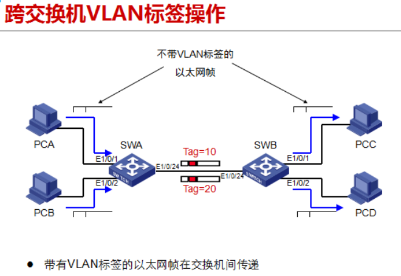

比如：PCA机器是VLAN 10的，PCC机器是VLAN 10的，那么PCA给PCC机器发送消息时，在SWA交换机通过Trunk连接到SWB时，会给本次通信打上标签VLAN 10，到达SWB后，将VLAN 10标签给去掉并将本次通信发送到B交换机的VLAN 10中。

### 目的

通过一根网线，传递不同VLAN 信息。

### 图示

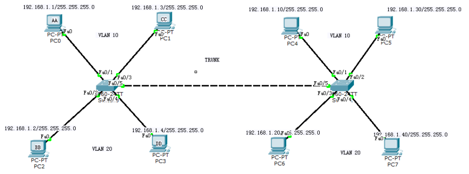

### 案例

实现上图效果：

* 左边一台交换机，4台主机，两个是VLAN 10，两个是VLAN 20
* 右边一台交换机，4台主机，两个是VLAN 10，两个是VLAN 20
* 两台交换机通过一根线连接，使用trunk模式
* 实现左边交换机的VLAN 10的主机能够和右边交换机的VLAN 10的通信
* 实现左边交换机的VLAN 20的主机能够和右边交换机的VLAN 20的通信

#### 环境准备

准备两台交换机，8台电脑，分别连线，如下：

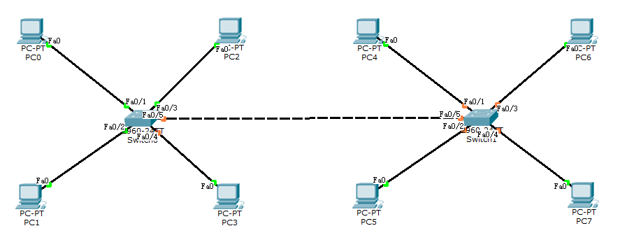

#### 设置IP

分别给8台机器设置IP，并打上标签说明

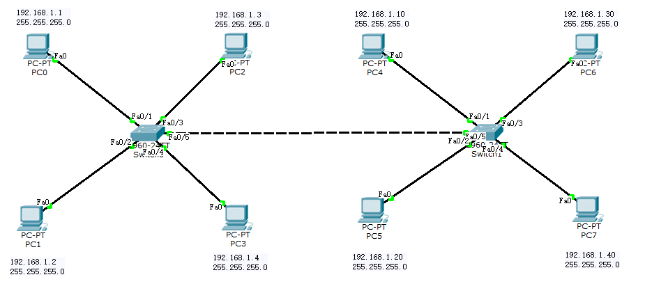

可以背景颜色：

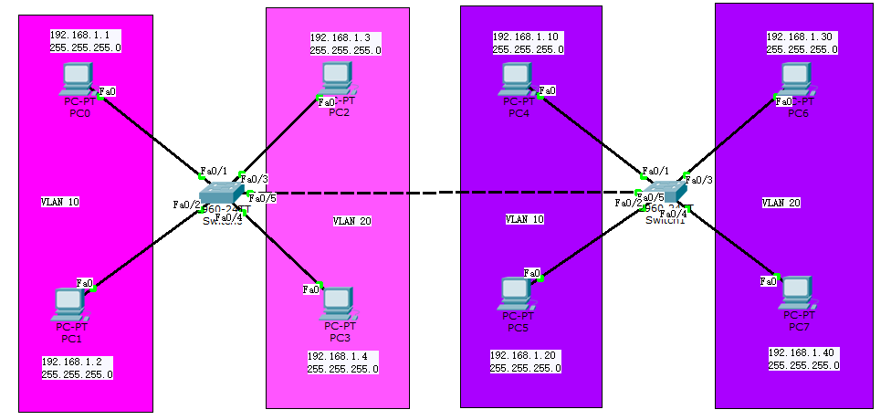

#### 配置左边交换机

```shell
Switch> enable										进入特权执行模式
Switch# configure terminal				进入全局配置模式
Switch(config)# vlan 10						创建VLAN 10
Switch(config-vlan)# vlan 20			创建VLAN 20
Switch(config-vlan)# exit					退出VLAN配置模式

Switch(config)# interface fastEthernet 0/1		进入0/1接口中
Switch(config-if)# switchport access vlan 10	当前接口加入VLAN 10
Switch(config-if)# exit 					退出接口配置模式

Switch(config)# interface fastEthernet 0/2		进入0/2接口中
Switch(config-if)# switchport access vlan 10	当前接口加入VLAN 10
Switch(config-if)# exit						退出接口模式

Switch(config)# interface fastEthernet 0/3		进入0/3接口中
Switch(config-if)# switchport access vlan 20	当前接口加入VLAN 20
Switch(config-if)# exit						退出接口模式

Switch(config)# interface fastEthernet 0/4		进入0/4接口中
Switch(config-if)# switchport access vlan 20	当前接口加入VLAN 20
Switch(config-if)# exit						退出接口模式

Switch(config)# interface fastEthernet 0/5		进入0/5接口中
Switch(config-if)# switchport mode trunk 			设置当前接口为trunk模式
Switch(config-if)# exit						退出接口模式

Switch(config)# exit							退出全局配置模式
Switch# exit											退出特权执行模式

Switch> show vlan brief 					显示VLAN的摘要信息

VLAN Name                             Status    Ports
---- -------------------------------- --------- -------------------------------
1    default                          active    Fa0/6, Fa0/7, Fa0/8, Fa0/9
                                                Fa0/10, Fa0/11, Fa0/12, Fa0/13
                                                Fa0/14, Fa0/15, Fa0/16, Fa0/17
                                                Fa0/18, Fa0/19, Fa0/20, Fa0/21
                                                Fa0/22, Fa0/23, Fa0/24, Gig1/1
                                                Gig1/2
10   VLAN0010                         active    Fa0/1, Fa0/2
20   VLAN0020                         active    Fa0/3, Fa0/4
1002 fddi-default                     active    
1003 token-ring-default               active    
1004 fddinet-default                  active    
1005 trnet-default                    active    
Switch>
```

#### 配置右边交换机

其实左边和右边的交换机配置是一样的！！！ 但是要注意两边的电脑连接的接口是一样的才行，否则要根据自己的情况去写！

```shell
Switch> enable										进入特权执行模式
Switch# configure terminal				进入全局配置模式
Switch(config)# vlan 10						创建VLAN 10
Switch(config-vlan)# vlan 20			创建VLAN 20
Switch(config-vlan)#exit					退出VLAN配置模式

Switch(config)# interface fastEthernet 0/1		进入0/1接口中
Switch(config-if)# switchport access vlan 10	当前接口加入VLAN 10
Switch(config-if)# exit 					退出接口配置模式

Switch(config)# interface fastEthernet 0/2		进入0/2接口中
Switch(config-if)# switchport access vlan 10	当前接口加入VLAN 10
Switch(config-if)# exit						退出接口模式

Switch(config)# interface fastEthernet 0/3		进入0/3接口中
Switch(config-if)# switchport access vlan 20	当前接口加入VLAN 20
Switch(config-if)# exit						退出接口模式

Switch(config)# interface fastEthernet 0/4		进入0/4接口中
Switch(config-if)# switchport access vlan 20	当前接口加入VLAN 20
Switch(config-if)# exit						退出接口模式

Switch(config)# interface fastEthernet 0/5		进入0/5接口中
Switch(config-if)# switchport mode trunk 			设置当前接口为trunk模式
Switch(config-if)# exit						退出接口模式

Switch(config)# exit							退出全局配置模式
Switch# exit											退出特权执行模式

Switch> show vlan brief 					显示VLAN的摘要信息

VLAN Name                             Status    Ports
---- -------------------------------- --------- -------------------------------
1    default                          active    Fa0/6, Fa0/7, Fa0/8, Fa0/9
                                                Fa0/10, Fa0/11, Fa0/12, Fa0/13
                                                Fa0/14, Fa0/15, Fa0/16, Fa0/17
                                                Fa0/18, Fa0/19, Fa0/20, Fa0/21
                                                Fa0/22, Fa0/23, Fa0/24, Gig1/1
                                                Gig1/2
10   VLAN0010                         active    Fa0/1, Fa0/2
20   VLAN0020                         active    Fa0/3, Fa0/4
1002 fddi-default                     active    
1003 token-ring-default               active    
1004 fddinet-default                  active    
1005 trnet-default                    active    
Switch>
```

#### 测试

实现不同交换机上，相同VLAN主机通信成功。

实现不同交换机上，不相同VLAN主机通信不成功。

### 总结

交换机接口工作模式，分为access和trunk

access是指定接口连接的是主机

trunk是指定接口连接的是交换机，需要通过多个VLAN的数据


> 更新: 2025-10-14 11:01:36  
> 原文: <https://www.yuque.com/u41736172/az9urv/bl6x98hwq068vv18>