# 15.网络管理实战3（网络层）

# 一、IP地址回顾

## 简介

internet protocol 互联网协议

32位二进制数

IP用于主机在互联网中的标识

4组十进制表示

* IP地址每八位为一组，用"."分割，用十进制标识
* 192.168.0.1
* 156.86.254.255
* 1.2.3.4
* 25.250.25.110

## 分类

A类（1~126）127:回环地址：我

B类（128~191）

C类（192~223）

D类（224~239）组播

E类（240~255）科研

## 子网掩码

### 作用

32位2进制数字

运算出IP地址的网络部分。（IP地址其实是由网络位和主机位两部分组成的）

### 分类

A类：255.0.0.0

B类：255.255.0.0

C类：255.255.255.0

### 方法

子网掩码中为1部分，对应IP地址的网络位。

IP地址和子网掩码，逻辑与运算

## 网络地址

网络位相同，IP地址是同一网段			直接通信（通过交换机）

网络位不同，IP地址不是同一网段。		不能直接通信，必须经过网关路由器转发

# 二、OSI七层模型回顾


# 三、路由器工作原理

## 概念

我们前面学习了交换机，交换机解决的是同一个局域网内的多台主机通信的问题！

那如果跨局域网通信该怎么办？比如：192.168.1.0 网段的主机要和 192.168.3.0 网段的主机通信？

跨网络的通信就需要使用路由器了！

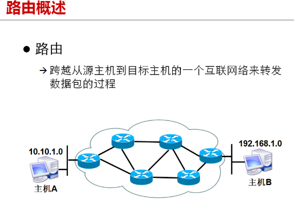

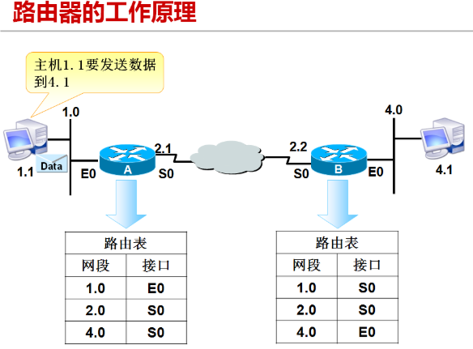

交换机工作时，会根据mac地址表中的信息进行转发数据。

路由器工作时，会根据其内部的路由表信息来进行转发。

直连路由-

## 路由表形成

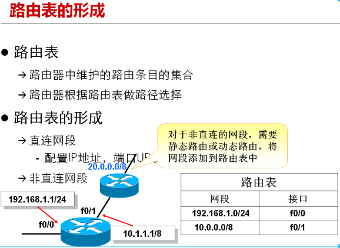

上图中3个网段的主机要通信的话，我们需要给下面的路由器的路由表中添加去往20.0.0.0网段的路由；

需要给上面的路由器的路由表中添加去往192.168.1.0网段的路由。

对于这种非直连的网段，我们可以给路由器添加静态路由，也可以添加动态路由。这里我们重点使用静态路由！（动态路由更省事，但不是我们专业所需的）

# 四、示例

## 练习1

观察下图网络拓扑图，这些主机之间可以通信吗？

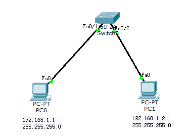

## 练习2

观察下面的网络拓扑图，4台主机是否可以互相通信？哪些主机是可以互相通信的？

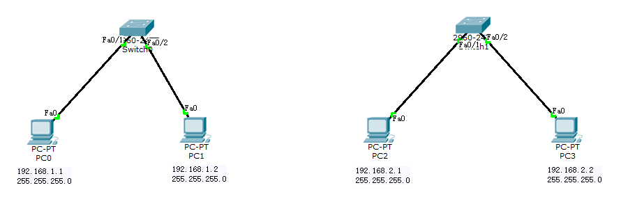

## 练习3

观察下面的网络拓扑图，图中的4台主机是否可以互相通信？为什么？（注意，本图仅是简简单单的交换机和主机，并没有划分什么VLAN、trunk等）

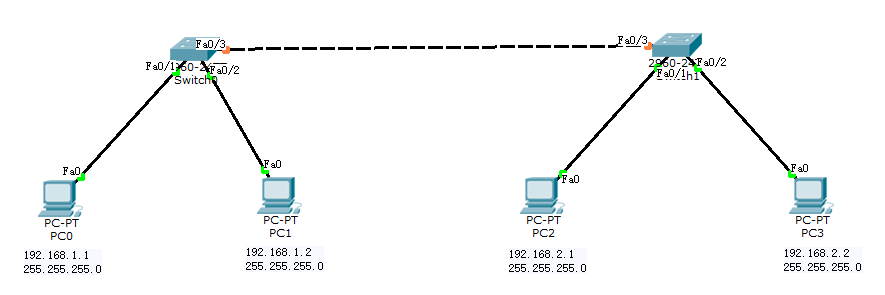

上图中：PC0、PC1之间是可以互相通信的；PC2、PC3之间是可以互相通信的。

但是PC0、PC1、PC2、PC3它们之间是无法互相通信的，因为跨域网络了。

PC0、PC1是属于 192.168.1.0 网络的；

PC2、PC3是属于 192.168.2.0 网络的；

目前，即使使用一根线将两台交换机连接到一起，但是是无法通信的，交换机只能解决同一网络内的通信；

像这种跨网络的通信需要使用路由器来解决！！！

## 创建路由器

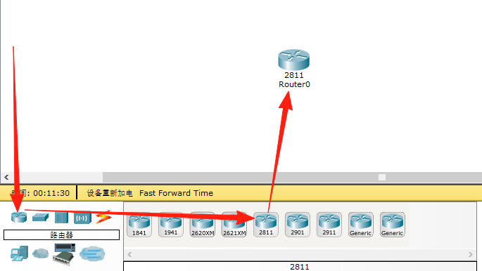

## 案例1（直连路由）

### 需求

目的，解决上面练习3中提出的问题，使用路由器让两个网络中的主机互相通信！

网络拓扑图：

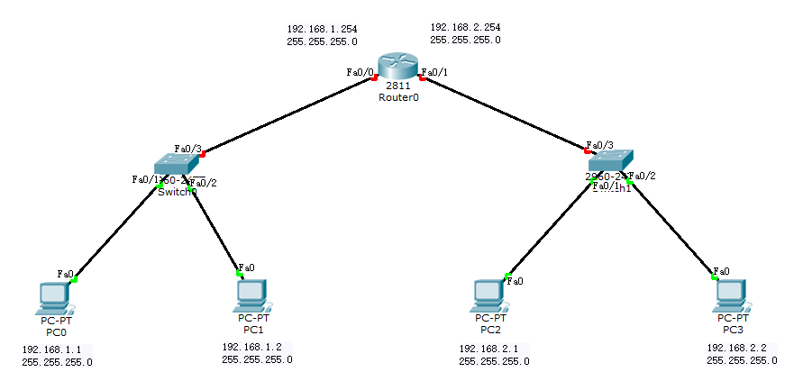

在之前的练习3基础上，创建一个路由器，做出如上的效果图。

需要给上图中路由器的0/0、0/1接口设置IP地址和子网掩码。

0/0接口配置的ip需要注意，必须和左边的交换机是在同一个网络内，并且未被使用的IP。一般我们都设置为这个网络内最大的ip地址254（不是255，255是广播地址）

0/1接口配置的ip地址是和右边交换机在同一个网络内的，并且未被使用的IP，一般都是设置为该网络内最大的ip地址254。

其实我们给路由器的0/0接口配置的ip地址，就称为左边交换机网络的网关！

我们给路由器的0/1接口配置的ip地址，就称为右边交换机网络的网关！

### 给路由器配置IP

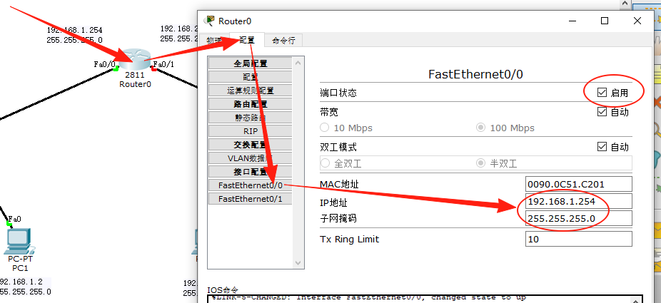

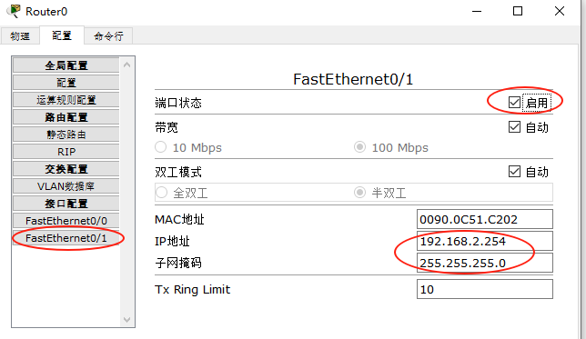

注意，需要给路由器的两个接口都配置上ip地址和子网掩码。

### 给主机配置网关

我们需要给4台主机分别指定他们的网关，网关其实指的就是在某个网络中，需要和别的网络通信，它连接的路由器的端口的IP。

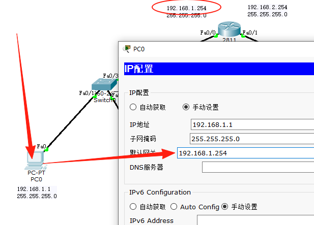

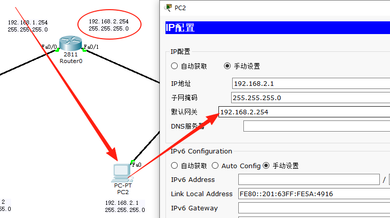

注意：需要给4台主机都配置上网关！两边的网关是不一样的！

### 测试

使用PC0分别和本网段的主机和另一个网段的主机通信，发现没问题！

注意，第一次ping不同网段的主机时，可能会比较慢，第二次开始就好了！

### 查看路由表

我们可以查看路由器中的路由表信息：

```shell
Router> show ip route
Codes: C - connected, S - static, I - IGRP, R - RIP, M - mobile, B - BGP
       D - EIGRP, EX - EIGRP external, O - OSPF, IA - OSPF inter area
       N1 - OSPF NSSA external type 1, N2 - OSPF NSSA external type 2
       E1 - OSPF external type 1, E2 - OSPF external type 2, E - EGP
       i - IS-IS, L1 - IS-IS level-1, L2 - IS-IS level-2, ia - IS-IS inter area
       * - candidate default, U - per-user static route, o - ODR
       P - periodic downloaded static route

Gateway of last resort is not set

C    192.168.1.0/24 is directly connected, FastEthernet0/0
C    192.168.2.0/24 is directly connected, FastEthernet0/1
```

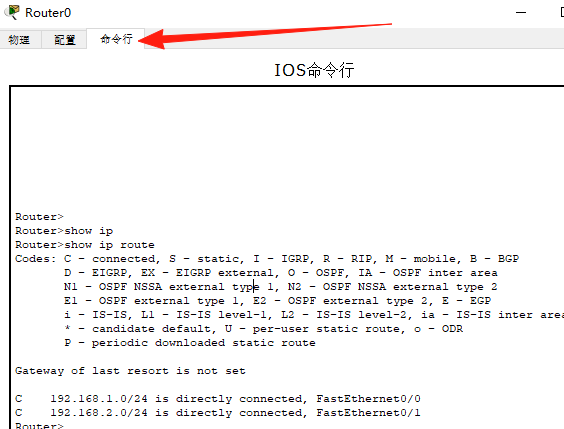

## 案例2（静态路由）

### 需求

实现下图中192.168.1.0网段和192.168.2.0网络的主机通信。

注意：下图中使用了两个路由器相连！而且两个路由器相连的线两端的端口IP需要是同一个网段！

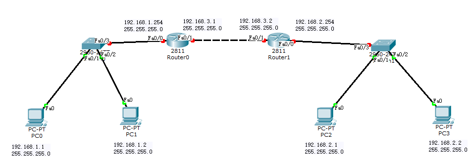

### 实现上图的结构

通过拖拽的形式，实现上图的效果，并标注上ip等信息。

### 配置4个主机的信息

配置4个主机的ip地址、子网掩码、网关。

### 配置两台路由器的地址

分别给两台路由器的两个端口配置ip地址和子网掩码。

注意要启用路由器的端口！！！

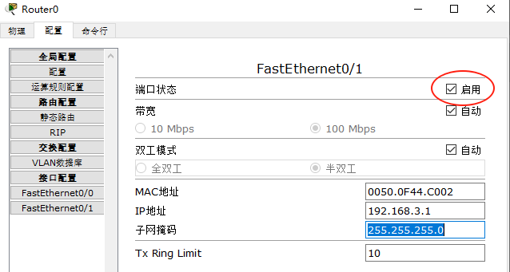

### 问题

使用`192.168.1.1`主机ping`192.168.2.1`主机发现ping不通！

原因在于：

我们目前是两个网段要进行通信，必须通过路由器。而路由器是通过路由表来转发的，但是左边的路由表直连的只有192.168.1.0网段和192.168.3.0网段，它并不知道192.168.2.0网段应该怎么走！

```shell
在左边的路由器中执行
Router>show ip route 
Codes: C - connected, S - static, I - IGRP, R - RIP, M - mobile, B - BGP
       D - EIGRP, EX - EIGRP external, O - OSPF, IA - OSPF inter area
       N1 - OSPF NSSA external type 1, N2 - OSPF NSSA external type 2
       E1 - OSPF external type 1, E2 - OSPF external type 2, E - EGP
       i - IS-IS, L1 - IS-IS level-1, L2 - IS-IS level-2, ia - IS-IS inter area
       * - candidate default, U - per-user static route, o - ODR
       P - periodic downloaded static route

Gateway of last resort is not set

C    192.168.1.0/24 is directly connected, FastEthernet0/0
C    192.168.3.0/24 is directly connected, FastEthernet0/1
```

### 解决

使用静态路由解决上面的问题。也就是让左边路由器能找到192.168.2.0网段，让右边路由器能找到192.168.1.0网段。

给左边路由器设置：（核心就是配置左边的路由器能知道去往192.168.2.0网段应该走哪个接口）

```shell
Router>show ip route			查看路由信息
Codes: C - connected, S - static, I - IGRP, R - RIP, M - mobile, B - BGP
       D - EIGRP, EX - EIGRP external, O - OSPF, IA - OSPF inter area
       N1 - OSPF NSSA external type 1, N2 - OSPF NSSA external type 2
       E1 - OSPF external type 1, E2 - OSPF external type 2, E - EGP
       i - IS-IS, L1 - IS-IS level-1, L2 - IS-IS level-2, ia - IS-IS inter area
       * - candidate default, U - per-user static route, o - ODR
       P - periodic downloaded static route

Gateway of last resort is not set

C    192.168.1.0/24 is directly connected, FastEthernet0/0
C    192.168.3.0/24 is directly connected, FastEthernet0/1
Router>enable				进入特权执行模式
Router#configure terminal 	进入全局配置模式
Enter configuration commands, one per line.  End with CNTL/Z.
Router(config)#ip route 192.168.2.0 255.255.255.0 fastEthernet 0/1  添加去往2.0网段的路由是通过 0/1 接口走

Router(config)#exit
Router#exit

Router>show ip route
Codes: C - connected, S - static, I - IGRP, R - RIP, M - mobile, B - BGP
       D - EIGRP, EX - EIGRP external, O - OSPF, IA - OSPF inter area
       N1 - OSPF NSSA external type 1, N2 - OSPF NSSA external type 2
       E1 - OSPF external type 1, E2 - OSPF external type 2, E - EGP
       i - IS-IS, L1 - IS-IS level-1, L2 - IS-IS level-2, ia - IS-IS inter area
       * - candidate default, U - per-user static route, o - ODR
       P - periodic downloaded static route

Gateway of last resort is not set

C    192.168.1.0/24 is directly connected, FastEthernet0/0
S    192.168.2.0/24 is directly connected, FastEthernet0/1
C    192.168.3.0/24 is directly connected, FastEthernet0/1
```

给右边的路由器配置：（核心就是配置右边的路由器能知道去往192.168.1.0网段应该走哪个接口）

```shell
Router>show ip route
Codes: C - connected, S - static, I - IGRP, R - RIP, M - mobile, B - BGP
       D - EIGRP, EX - EIGRP external, O - OSPF, IA - OSPF inter area
       N1 - OSPF NSSA external type 1, N2 - OSPF NSSA external type 2
       E1 - OSPF external type 1, E2 - OSPF external type 2, E - EGP
       i - IS-IS, L1 - IS-IS level-1, L2 - IS-IS level-2, ia - IS-IS inter area
       * - candidate default, U - per-user static route, o - ODR
       P - periodic downloaded static route

Gateway of last resort is not set

C    192.168.2.0/24 is directly connected, FastEthernet0/0
C    192.168.3.0/24 is directly connected, FastEthernet0/1

Router>enable			进入特权模式
Router#configure terminal 	进入全局配置模式
Enter configuration commands, one per line.  End with CNTL/Z.
Router(config)#ip route 192.168.1.0 255.255.255.0 fastEthernet 0/1 添加去往192.168.1.0网络的路由，走0/1接口可去
Router(config)#exit
Router#exit

Router>show ip route	查看路由信息
Codes: C - connected, S - static, I - IGRP, R - RIP, M - mobile, B - BGP
       D - EIGRP, EX - EIGRP external, O - OSPF, IA - OSPF inter area
       N1 - OSPF NSSA external type 1, N2 - OSPF NSSA external type 2
       E1 - OSPF external type 1, E2 - OSPF external type 2, E - EGP
       i - IS-IS, L1 - IS-IS level-1, L2 - IS-IS level-2, ia - IS-IS inter area
       * - candidate default, U - per-user static route, o - ODR
       P - periodic downloaded static route

Gateway of last resort is not set

S    192.168.1.0/24 is directly connected, FastEthernet0/1
C    192.168.2.0/24 is directly connected, FastEthernet0/0
C    192.168.3.0/24 is directly connected, FastEthernet0/1
```

再次使用192.168.1.1机器ping 192.168.2.1机器，发现可以通了！（第一次ping会丢包，后面就可以了）

为什么要在两个路由器中分别添加对方的网段呢？

因为两台主机要通信的话，是A主机发数据给B主机，B主机也要能回应给A主机。也就是说能够过去，也要能够回来！所以双方都要知道对方的网段应该怎么走！

## 案例3（静态路由）

### 给路由器加网卡接口

默认一个2811的路由器只有两个网卡接口如下图所示：

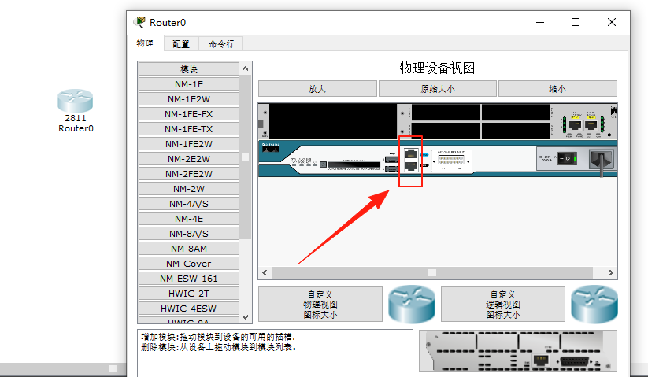

我们可以给路由器多加几个网卡接口：

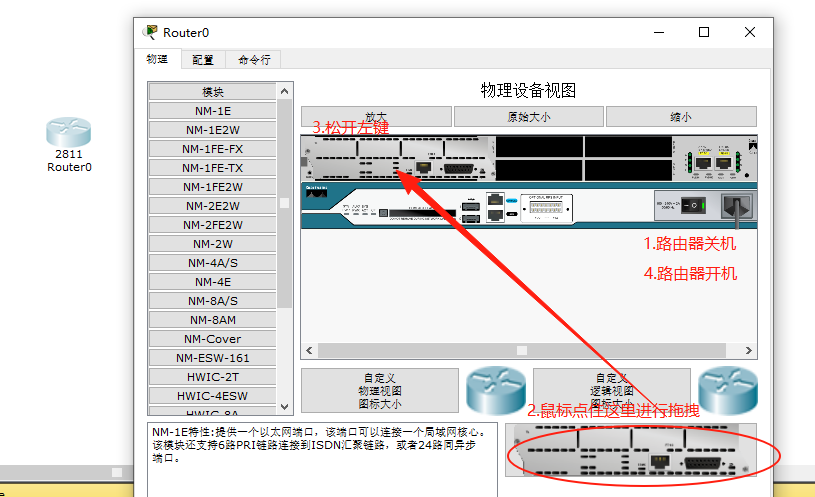

这样就给路由器多加了一个网卡接口。

### 需求

实现下图中所有主机能够互通！

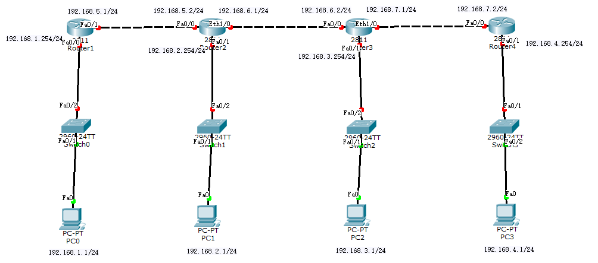

### 实现上图的结构

准备4台电脑、4台交换机、4台路由器

给中间的路由器多加一个网卡接口（注意先关了路由器再加，加上后再开启路由器）

连线

### 配置4个主机的信息

配置4台主机的ip、子网掩码、网关

### 配置4个路由器的信息

配置4台路由器的各个接口的ip地址、子网掩码，并记得开启路由器（千万不要将路由器接口的IP给配置错了！）

### 测试一下配置信息

可以测试路由器的直连网段，互相ping一下是可以联通的！！！如有连不通的，肯定是上面的配置配错了！

比如：使用192.168.1.1去ping 192.168.1.254、192.168.5.1

使用192.168.2.1去ping 192.168.2.254、192.168.5.2、192.168.6.1等等

将4台主机都ping一下他们之间的路由器的ip地址。

### 实现1网段和2网段互通

目前我们使用192.168.1.1去ping 192.168.2.1是不通的，因为1号路由器直连的路由只有1网段和5网段的，他不知道去2网段怎么走！

**给1号路由器配置：**

```shell
Router>show ip route
Codes: C - connected, S - static, I - IGRP, R - RIP, M - mobile, B - BGP
       D - EIGRP, EX - EIGRP external, O - OSPF, IA - OSPF inter area
       N1 - OSPF NSSA external type 1, N2 - OSPF NSSA external type 2
       E1 - OSPF external type 1, E2 - OSPF external type 2, E - EGP
       i - IS-IS, L1 - IS-IS level-1, L2 - IS-IS level-2, ia - IS-IS inter area
       * - candidate default, U - per-user static route, o - ODR
       P - periodic downloaded static route

Gateway of last resort is not set

C    192.168.1.0/24 is directly connected, FastEthernet0/0
C    192.168.5.0/24 is directly connected, FastEthernet0/1

Router>enable

Router#configure terminal 
Enter configuration commands, one per line.  End with CNTL/Z.

Router(config)#ip route 192.168.2.0 255.255.255.0 fastEthernet 0/1
Router(config)#exit

Router#exit

Router>show ip route
Codes: C - connected, S - static, I - IGRP, R - RIP, M - mobile, B - BGP
       D - EIGRP, EX - EIGRP external, O - OSPF, IA - OSPF inter area
       N1 - OSPF NSSA external type 1, N2 - OSPF NSSA external type 2
       E1 - OSPF external type 1, E2 - OSPF external type 2, E - EGP
       i - IS-IS, L1 - IS-IS level-1, L2 - IS-IS level-2, ia - IS-IS inter area
       * - candidate default, U - per-user static route, o - ODR
       P - periodic downloaded static route

Gateway of last resort is not set

C    192.168.1.0/24 is directly connected, FastEthernet0/0
S    192.168.2.0/24 is directly connected, FastEthernet0/1
C    192.168.5.0/24 is directly connected, FastEthernet0/1
Router>
```

**给2号路由器配置：**

```shell
Router>show ip route
Codes: C - connected, S - static, I - IGRP, R - RIP, M - mobile, B - BGP
       D - EIGRP, EX - EIGRP external, O - OSPF, IA - OSPF inter area
       N1 - OSPF NSSA external type 1, N2 - OSPF NSSA external type 2
       E1 - OSPF external type 1, E2 - OSPF external type 2, E - EGP
       i - IS-IS, L1 - IS-IS level-1, L2 - IS-IS level-2, ia - IS-IS inter area
       * - candidate default, U - per-user static route, o - ODR
       P - periodic downloaded static route

Gateway of last resort is not set

C    192.168.2.0/24 is directly connected, FastEthernet0/1
C    192.168.5.0/24 is directly connected, FastEthernet0/0
C    192.168.6.0/24 is directly connected, Ethernet1/0

Router>enable
Router#configure terminal 
Enter configuration commands, one per line.  End with CNTL/Z.

Router(config)#ip route 192.168.1.0 255.255.255.0 fastEthernet 0/0
Router(config)#exit

Router#exit

Router>show ip route
Codes: C - connected, S - static, I - IGRP, R - RIP, M - mobile, B - BGP
       D - EIGRP, EX - EIGRP external, O - OSPF, IA - OSPF inter area
       N1 - OSPF NSSA external type 1, N2 - OSPF NSSA external type 2
       E1 - OSPF external type 1, E2 - OSPF external type 2, E - EGP
       i - IS-IS, L1 - IS-IS level-1, L2 - IS-IS level-2, ia - IS-IS inter area
       * - candidate default, U - per-user static route, o - ODR
       P - periodic downloaded static route

Gateway of last resort is not set

S    192.168.1.0/24 is directly connected, FastEthernet0/0
C    192.168.2.0/24 is directly connected, FastEthernet0/1
C    192.168.5.0/24 is directly connected, FastEthernet0/0
C    192.168.6.0/24 is directly connected, Ethernet1/0
```

测试：192.168.1.1 和 192.168.2.1是否互通

发现没毛病！ 注意，第一次ping会慢一些！

### 实现1网段和3网段互通

现在1号路由器只知道1号网段、2号网段、5号网段怎么走，不知道3网段，我们需要给1号加上3网段怎么走。

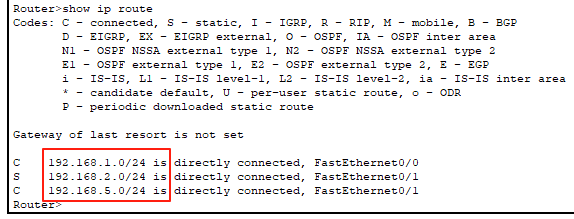

2号路由器只知道1、2、5、6网段怎么走，但是不知道3网段怎么走，我们需要加上3网段的路由。

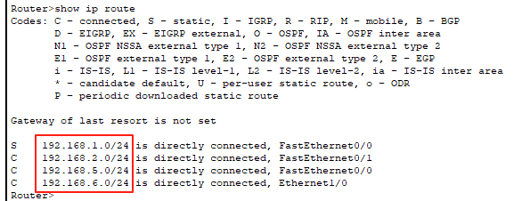

3号路由器只知道3、6、7网段怎么走，不知道1网段怎么走，需要给他加上1号网段怎么走。

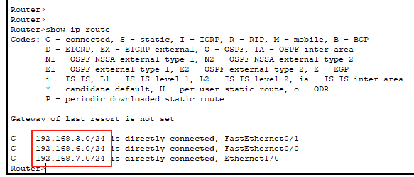

1号路由器做如下配置：

```shell
Router>enable
Router#conf
Router#configure terminal 
Enter configuration commands, one per line.  End with CNTL/Z.
Router(config)#ip route 192.168.3.0 255.255.255.0 fastEthernet 0/1
```

2号路由器做如下配置：

```shell
Router>enable
Router#configure terminal 
Enter configuration commands, one per line.  End with CNTL/Z.
Router(config)#ip route 192.168.3.0 255.255.255.0 ethernet 1/0
Router(config)#
```

3号路由器做如下配置：

```shell
Router>enable
Router#configure terminal 
Enter configuration commands, one per line.  End with CNTL/Z.
Router(config)#ip route 192.168.1.0 255.255.255.0 fastEthernet 0/0
Router(config)#
```

测试：192.168.1.1 和 192.168.3.1 可以互通了！

### 实现1网段和4网段互通

目前大家应该有感觉了吧。要实现1网段和4网段的互通，那么1号路由器需要知道4号网段怎么走，如果不知道，就需要给该路由器添加去往4号网段的路由；同样4号路由器需要知道1号网段怎么走，如果不知道，就需要给改路由器添加去往1号网段的路由。

1号路由器做如下配置：

```shell
Router>show ip route
Codes: C - connected, S - static, I - IGRP, R - RIP, M - mobile, B - BGP
       D - EIGRP, EX - EIGRP external, O - OSPF, IA - OSPF inter area
       N1 - OSPF NSSA external type 1, N2 - OSPF NSSA external type 2
       E1 - OSPF external type 1, E2 - OSPF external type 2, E - EGP
       i - IS-IS, L1 - IS-IS level-1, L2 - IS-IS level-2, ia - IS-IS inter area
       * - candidate default, U - per-user static route, o - ODR
       P - periodic downloaded static route

Gateway of last resort is not set

C    192.168.1.0/24 is directly connected, FastEthernet0/0
S    192.168.2.0/24 is directly connected, FastEthernet0/1
S    192.168.3.0/24 is directly connected, FastEthernet0/1
C    192.168.5.0/24 is directly connected, FastEthernet0/1
Router>
Router>enable

Router#configure terminal 
Enter configuration commands, one per line.  End with CNTL/Z.
Router(config)#ip route 192.168.4.0 255.255.255.0 fastEthernet 0/1
Router(config)#exit
Router#

Router#exit

Router>show ip route
Codes: C - connected, S - static, I - IGRP, R - RIP, M - mobile, B - BGP
       D - EIGRP, EX - EIGRP external, O - OSPF, IA - OSPF inter area
       N1 - OSPF NSSA external type 1, N2 - OSPF NSSA external type 2
       E1 - OSPF external type 1, E2 - OSPF external type 2, E - EGP
       i - IS-IS, L1 - IS-IS level-1, L2 - IS-IS level-2, ia - IS-IS inter area
       * - candidate default, U - per-user static route, o - ODR
       P - periodic downloaded static route

Gateway of last resort is not set

C    192.168.1.0/24 is directly connected, FastEthernet0/0
S    192.168.2.0/24 is directly connected, FastEthernet0/1
S    192.168.3.0/24 is directly connected, FastEthernet0/1
S    192.168.4.0/24 is directly connected, FastEthernet0/1
C    192.168.5.0/24 is directly connected, FastEthernet0/1
Router>
```

2号路由器做如下配置：

```shell
Router>show ip route
Codes: C - connected, S - static, I - IGRP, R - RIP, M - mobile, B - BGP
       D - EIGRP, EX - EIGRP external, O - OSPF, IA - OSPF inter area
       N1 - OSPF NSSA external type 1, N2 - OSPF NSSA external type 2
       E1 - OSPF external type 1, E2 - OSPF external type 2, E - EGP
       i - IS-IS, L1 - IS-IS level-1, L2 - IS-IS level-2, ia - IS-IS inter area
       * - candidate default, U - per-user static route, o - ODR
       P - periodic downloaded static route

Gateway of last resort is not set

S    192.168.1.0/24 is directly connected, FastEthernet0/0
C    192.168.2.0/24 is directly connected, FastEthernet0/1
S    192.168.3.0/24 is directly connected, Ethernet1/0
C    192.168.5.0/24 is directly connected, FastEthernet0/0
C    192.168.6.0/24 is directly connected, Ethernet1/0
Router>
Router>enable
Router#configure terminal 
Router(config)#ip route 192.168.4.0 255.255.255.0 ethernet 1/0
Router(config)#exit

Router#exit

Router>show ip route
Codes: C - connected, S - static, I - IGRP, R - RIP, M - mobile, B - BGP
       D - EIGRP, EX - EIGRP external, O - OSPF, IA - OSPF inter area
       N1 - OSPF NSSA external type 1, N2 - OSPF NSSA external type 2
       E1 - OSPF external type 1, E2 - OSPF external type 2, E - EGP
       i - IS-IS, L1 - IS-IS level-1, L2 - IS-IS level-2, ia - IS-IS inter area
       * - candidate default, U - per-user static route, o - ODR
       P - periodic downloaded static route

Gateway of last resort is not set

S    192.168.1.0/24 is directly connected, FastEthernet0/0
C    192.168.2.0/24 is directly connected, FastEthernet0/1
S    192.168.3.0/24 is directly connected, Ethernet1/0
S    192.168.4.0/24 is directly connected, Ethernet1/0
C    192.168.5.0/24 is directly connected, FastEthernet0/0
C    192.168.6.0/24 is directly connected, Ethernet1/0
Router>
```

3号路由器做如下配置：

```shell
Router>enable

Router#configure terminal 
Enter configuration commands, one per line.  End with CNTL/Z.

Router(config)#ip route 192.168.4.0 255.255.255.0 ethernet 1/0
Router(config)#exit

Router#exit

Router>show ip route
Codes: C - connected, S - static, I - IGRP, R - RIP, M - mobile, B - BGP
       D - EIGRP, EX - EIGRP external, O - OSPF, IA - OSPF inter area
       N1 - OSPF NSSA external type 1, N2 - OSPF NSSA external type 2
       E1 - OSPF external type 1, E2 - OSPF external type 2, E - EGP
       i - IS-IS, L1 - IS-IS level-1, L2 - IS-IS level-2, ia - IS-IS inter area
       * - candidate default, U - per-user static route, o - ODR
       P - periodic downloaded static route

Gateway of last resort is not set

S    192.168.1.0/24 is directly connected, FastEthernet0/0
C    192.168.3.0/24 is directly connected, FastEthernet0/1
S    192.168.4.0/24 is directly connected, Ethernet1/0
C    192.168.6.0/24 is directly connected, FastEthernet0/0
C    192.168.7.0/24 is directly connected, Ethernet1/0
Router>
```

4号路由器做如下配置：

```shell
Router>enable
Router#configure terminal 
Enter configuration commands, one per line.  End with CNTL/Z.

Router(config)#ip route 192.168.1.0 255.255.255.0 fastEthernet 0/0
Router(config)#exit

Router#exit

Router>show ip route
Codes: C - connected, S - static, I - IGRP, R - RIP, M - mobile, B - BGP
       D - EIGRP, EX - EIGRP external, O - OSPF, IA - OSPF inter area
       N1 - OSPF NSSA external type 1, N2 - OSPF NSSA external type 2
       E1 - OSPF external type 1, E2 - OSPF external type 2, E - EGP
       i - IS-IS, L1 - IS-IS level-1, L2 - IS-IS level-2, ia - IS-IS inter area
       * - candidate default, U - per-user static route, o - ODR
       P - periodic downloaded static route

Gateway of last resort is not set

S    192.168.1.0/24 is directly connected, FastEthernet0/0
C    192.168.4.0/24 is directly connected, FastEthernet0/1
C    192.168.7.0/24 is directly connected, FastEthernet0/0
Router>
```

### 总结

* 路由器可以解决不同网段的主机通信的问题
* 路由器中直连的网段是可以直接通信的
* 如果不是直连的网段，需要给路由器配置静态路由，指明去指定的网段应该走哪个路由器接口
* 通信是双向的，我们需要能过去也要能回来！
* 上面案例中，其他网段的通信自己去做！


> 更新: 2025-10-15 09:48:35  
> 原文: <https://www.yuque.com/u41736172/az9urv/vnodr441kvn0krgb>