# 16.文件服务

# 一、FTP Server

## 简介

### 名词解释

FTP（File Transfer Protocol，文件传输协议） 是 TCP/IP 协议组中应用层的协议之一

### logo


### 作用

提供文件共享服务

互联网上许多的媒体资源和软件资源。绝大部分都是通过FTP服务器传递。

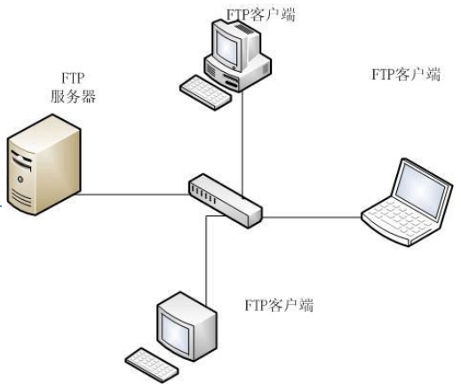

### 软件包

vsftpd

## 端口说明

控制端口 command 21/tcp （登录、退出等身份验证用的端口）

数据端口 data 20/tcp（下载、上传用的端口）

## 安装FTP Server

流程：获取一台Linux服务器；给这个Linux服务器上安装ftp服务；对ftp服务做配置；启动ftp服务！

将之前装好的精简版的服务器，克隆一份出来，我们在这台新的服务器上操作！

1.安装vsftp

```shell
# yum -y install vsftpd				请提前准备好YUM源
```

2.准备分发的文件

```shell
# touch /var/ftp/abc.txt

可以通过真机往 /var/ftp 目录中上传一些图片、视频等文件。
```

注释：FTP服务器的主目录：`/var/ftp/`，是FTP程序共享内容的目录。

3.启动服务

```shell
# systemctl start vsftpd
# systemctl enable vsftpd
# netstat -anpt

说明：
netstat：命令是Linux系统中用于查看网络连接状态的命令
-a：显示所有活动的网络连接和监听端口（包括TCP/UDP）
-n：以数字形式显示IP地址和端口号
-p：显示进程信息（pid和程序名）
-t：仅显示TCP协议相关的连接（默认显示TCP+UDP的）
```

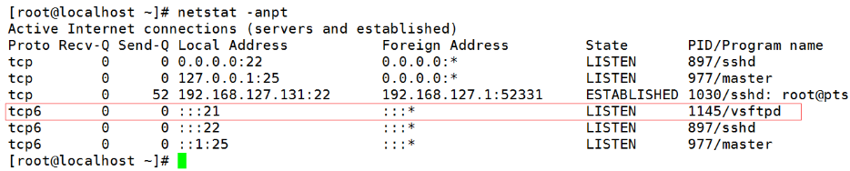

4.关闭防火墙与SELinux

```shell
# systemctl stop firewalld
# systemctl disable firewalld
# setenforce 0
# vim   /etc/selinux/config
修改内容为：SELINUX=disabled
```

## 入门案例

### 简单配置

vsftpd服务的配置文件是在`/etc/vsftpd/vsftpd.conf`，修改配置，可以使用户通过匿名方式访问FTP服务器！

```shell
# vim /etc/vsftpd/vsftpd.conf
第12行 anonymous_enable=YES

重启vsftpd服务
# systemctl restart vsftpd
```

默认FTP的共享目录中的文件我们只能下载，不能往FTP服务器中上传文件。

### Windows系统

打开Windows的**文件资源管理器**，输入地址：`ftp://192.168.126.160`去访问我们的ftp服务器！

提示需要登录ftp服务器的用户和密码，我们勾选匿名登录去访问！

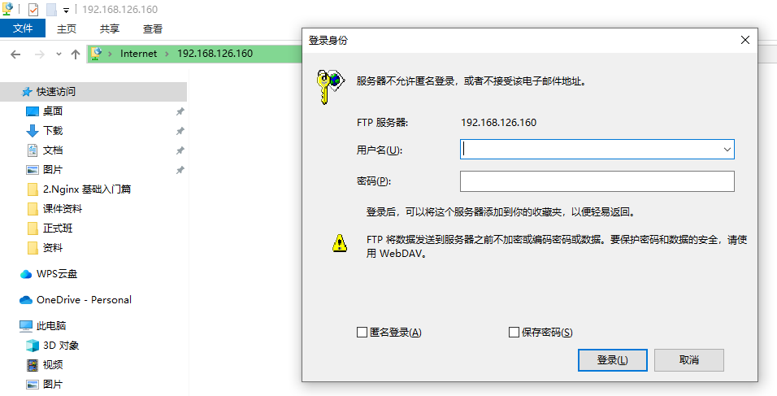

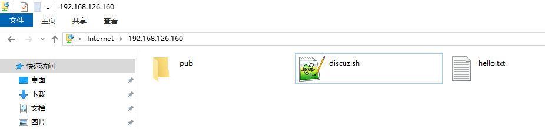

我们可以选中文件然后复制粘贴到自己的Windows系统的目录中，也就是从FTP服务器下载资源。

## 启动上传功能

### 配置文件简介

用于设定FTP服务器的功能开启或关闭的文件

```shell
# vim /etc/vsftpd/vsftpd.conf
```

老规矩，备份一个先

### 检查禁用匿名账户登录开启

```shell
目的：启用/禁用匿名账号
anonymous_enable=YES			//是否允许匿名用户登录ftp
能使  匿名=是
```

### 配置上传指令

```shell
anon_upload_enable=YES				启动上传文件的能力
anon_mkdir_write_enable=YES		启动创建目录的能力
anon_other_write_enable=YES		如果设置为YES，则允许匿名用户执行除上载和创建目录之外的写入操作，例如删除和重命名。
anon_umask=022								默认权限掩码
anon_root=/var/ftp						匿名用户主目录
anon_max_rate=0								匿名用户访问速率，0表示速度不受限制

# systemctl restart vsftpd			重启ftp程序
```

### 创建上传目录

```shell
注意，上传文件时，一定要来这个目录。
# mkdir /var/ftp/upload
# chmod 777 /var/ftp/upload
```

> 也就是说光设置了FTP上传文件的配置还不行，需要在Linux中创建一个专门的目录，并设置好权限才能上传！

### Windows客户端测试

在Windows中对FTP服务器做如下测试：

* 测试是否能够匿名登录FTP服务器
* 测试是否可以上传文件（只能上传到upload目录）
* 测试是否可以创建目录（只能创建到upload目录）
* 测试是否可以删除文件（只能删除upload目录中文件）

因为我们对upload目录做了最大权限，用户可以读、写、执行。而`/var/ftp`目录其他人是只有读和执行的权限，没有写入的权限。（也就是用户要能创建目录、删除文件等操作得看FTP是否允许，还得看Linux是否给他分配了权限）

### Linux客户端的使用

#### Linux中FTP客户端程序1：lftp

安装客户端工具（我们最好换一台Linux服务器去做，不要在FTP服务器自身上去做！）

```shell
# yum -y install lftp
```

**访问FTP服务器**

```shell
# lftp 服务器的IP地址

# lftp 192.168.126.160
```

**查看并下载**

```shell
# 查看FTP服务器中的文件信息
lftp 192.168.126.160:~> ls
-rw-r--r--    1 0        0            1009 Jul 29 12:28 discuz.sh
-rw-r--r--    1 0        0               6 Jul 29 12:25 hello.txt
drwxr-xr-x    2 0        0               6 Aug 20  2024 pub
drwxrwxrwx    3 0        0              17 Jul 30 00:30 upload

# 下载文件
lftp 192.168.126.160:/> get discuz.sh
1009 bytes transferred

# 下载目录
lftp 192.168.126.160:/> mirror upload
Total: 1 directory, 0 files, 0 symlinks

退出FTP服务器
lftp 192.168.126.160:/> exit

查看下载的文件和目录
# ls
公共   图片  upload		discuz.sh
```

**上传文件**

```shell
创建文件并写入内容
# echo hahahahehehe > helloworld.java

连接FTP服务器
# lftp 192.168.126.160

进入到FTP服务器的upload目录
lftp 192.168.126.160:/> cd upload/

上传本地文件到FTP服务器
lftp 192.168.126.160:/upload> put helloworld.java
13 bytes transferred

查看FTP服务器效果
lftp 192.168.126.160:/upload> ls
drwxr-xr-x    2 14       50              6 Jul 30 00:29 aaa
-rw-r--r--    1 14       50             13 Jul 30 03:57 helloworld.java
```

**上传目录**

```shell
在本地创建一个目录
# mkdir dir_test

在目录中创建一个文件
# echo 12345 > dir_test/123.txt

连接FTP服务器
# lftp 192.168.126.160

进入到upload目录
lftp 192.168.126.160:/> cd upload/

上传目录
lftp 192.168.126.160:/upload> mirror -R dir_test
New: 1 file, 0 symlinks
6 bytes transferred

查看目录内容
lftp 192.168.126.160:/upload> ls
drwxr-xr-x    2 14       50              6 Jul 30 00:29 aaa
drwxr-xr-x    2 14       50             21 Jul 30 04:02 dir_test
-rw-r--r--    1 14       50             13 Jul 30 03:57 helloworld.java

查看dir_test目录内容
lftp 192.168.126.160:/upload> ls dir_test/
-rw-r--r--    1 14       50              6 Jul 30 04:02 123.txt
lftp 192.168.126.160:/upload>
```

#### Linux中FTP客户端程序2：wget

```shell
# wget ftp://192.168.126.160/hello.txt
# wget ftp://192.168.126.160/hello.txt -O /tmp/haha.txt
-O 指定文件名和路径。

# wget http://nginx.org/download/nginx-1.10.2.tar.gz
```

## 系统用户的配置

匿名用户的访问，用户之间是没有限制的。可以共同访问资源。系统用户访问就很好的根据用户权限。区分了访问的资源。

* 匿名开放模式

匿名开放模式是一种最不安全的认证模式，任何人都可以无需密码验证而直接登录到FTP服务器。这种模式一般用来访问不重要的公开文件

* 本地用户模式

本地用户模式是通过Linux系统本地的账户密码信息进行认证的模式，相较于匿名开放模式更安全，而且配置起来相对简单。但是如果被黑客破解了账户的信息，就可以畅通无阻地登录FTP服务器，从而完全控制整台服务器。

* 虚拟用户模式

虚拟用户模式是这三种模式中最安全的一种认证模式，它需要为FTP服务单独建立用户数据库文件，虚拟出用来进行口令验证的账户信息，而这些账户信息在服务器系统中实际上是不存在的，仅供FTP服务程序进行认证使用。这样，即使黑客破解了账户信息也无法登录服务器，从而有效降低了破坏范围和影响。

## 本地用户模式演示

### 环境准备

也就是我们使用Linux系统中的用户去访问FTP服务器。一般我们都是在Linux系统中为FTP服务专门创建一个账号，在该用户的家目录中放入那些需要共享的文件，之后我们通过该账号去访问FTP服务器，其实进入的就是该用户的家目录！

以后所有人都是通过该账号进行访问FTP服务器的！不需要给每个人创建一个专属的FTP服务器账号！

1. 修改FTP配置文件：

```shell
# vim /etc/vsftpd/vsftpd.conf
只需要将匿名访问设置为NO即可。（其实我们下面设置的所有的匿名用户相关的配置都可以删掉，没用了！）
```

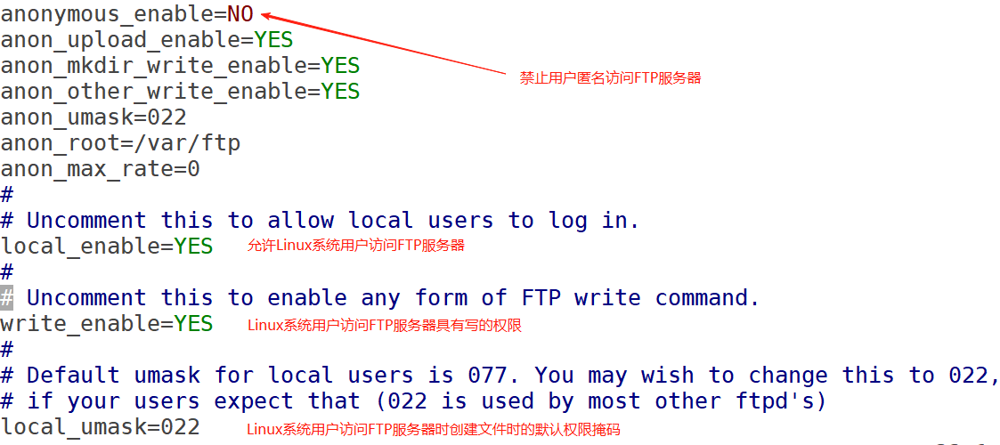

2. 重启FTP服务

```shell
# systemctl restart vsftpd
```

3. 新建一个Linux用户，并设置密码

```shell
# useradd share
# passwd share
123456
123456
```

4. 给share用户的家目录中创建一些文件并写入内容

```shell
# cd /home/share/
# echo 11111111111 > 1.txt
# echo 22222222222 > 2.txt
```

### Windows系统测试

在Windows系统中，使用share用户登录FTP服务器查看

进入到Windows的资源管理器中，如果目前是访问FTP服务器的状态，可以使用F5刷新一下，就会提示我们登录！而且匿名登录已经不好使了！

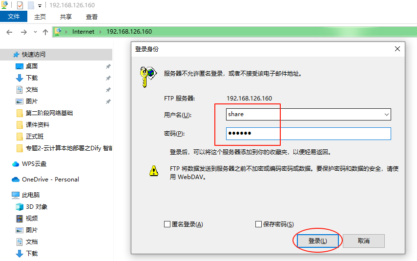

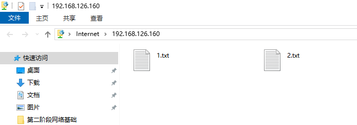

可以发现我们使用share账号登录FTP服务器后，看到的确实是share用户在Linux中的家目录，以后该目录就是我们FTP服务器的共享目录了！我们可以上传下载文件！

### Linux系统FTP客户端测试

```shell
# lftp 192.168.126.160
lftp 192.168.126.160:~> user share
密码: 123456
lftp share@192.168.126.160:~> ls
```

## 主动和被动模式（面试）

<font style="color:rgb(51, 51, 51);">FTP协议支持主动(PORT)和被动(PASV)两种工作模式，主要区别在于数据连接的建立方式：</font>

**<font style="color:rgb(51, 51, 51);">主动模式</font>**<font style="color:rgb(51, 51, 51);">‌：</font>

* <font style="color:rgb(51, 51, 51);">客户端通过随机端口N连接服务器的21端口（控制连接）‌</font><font style="color:rgb(51, 51, 51);background-color:rgba(223, 223, 245, 0.4);"></font>
* <font style="color:rgb(51, 51, 51);">服务器</font>**<font style="color:rgb(51, 51, 51);background-color:#FBDE28;">主动</font>**<font style="color:rgb(51, 51, 51);">用20端口连接客户端的N+1端口建立数据通道‌</font>
* <font style="color:rgb(51, 51, 51);">适用于客户端无防火墙限制的环境，但存在服务器连接被客户端防火墙拦截的风险‌</font>
* <font style="color:rgb(51, 51, 51);">是传统默认模式</font>

**<font style="color:rgb(51, 51, 51);">被动模式</font>**<font style="color:rgb(51, 51, 51);">‌：</font>

* <font style="color:rgb(51, 51, 51);">客户端通过随机端口连接服务器的21端口（控制连接）</font>
* <font style="color:rgb(51, 51, 51);">服务器随机开放高端口P（>1024），并</font>**<font style="color:rgb(51, 51, 51);">通知客户端连接该端口</font>**<font style="color:rgb(51, 51, 51);">建立数据通道‌</font>
* <font style="color:rgb(51, 51, 51);">能有效解决防火墙拦截问题，现已成为主流推荐模式‌</font>
* <font style="color:rgb(51, 51, 51);">需在服务端配置文件</font><code><font style="color:rgb(51, 51, 51);">/etc/vsftpd/vsftpd.conf</font></code><font style="color:rgb(51, 51, 51);">中显式设置</font><code><font style="color:rgb(51, 51, 51);">pasv_enable=YES</font></code><font style="color:rgb(51, 51, 51);">开启</font>

# 二、NFS Server

## 名词解释

NFS：Network File System 网络文件系统，Linux/Unix系统之间共享文件的一种协议

NFS 的客户端主要为Linux

支持多节点同时挂载，以及并发写入

> 之前学习的FTP服务器，也可以共享文件，它针对的是所有的用户系统，只要用户的手机、电脑等有浏览器就可以使用。而NFS也可以共享文件，但它针对的是服务器，是在Linux系统之间共享的。

## 作用

提供文件共享服务

为 Web Server 配置集群中的后端存储

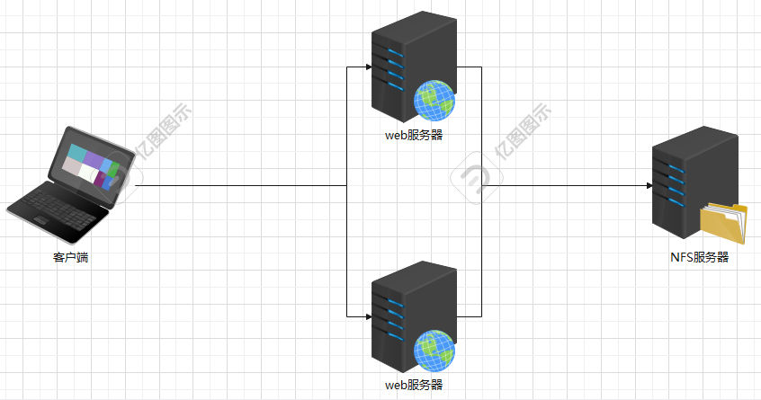

## 案例

### 环境规划

使用模板机，克隆3台服务器。

| 编号 | 主机名 | IP | 描述 |
| --- | --- | --- | --- |
| 1 | nfs.lhp.com | 192.168.126.181 | NFS文件共享服务器 |
| 2 | web01.lhp.com | 192.168.126.182 | web服务器 |
| 3 | web02.lhp.com | 192.168.126.183 | web服务器 |

> NAS（Network Attached Storage：网络附属存储）按字面简单说就是连接在网络上，具备资料存储功能的装置，因此也称为“网络存储器”。

### nfs服务器相关操作

```shell
修改IP地址
# nmcli connection modify ens33 ipv4.addresses 192.168.126.181/24
# nmcli connection up ens33

修改主机名
# hostnamectl set-hostname nfs.lhp.com
# su

安装nfs服务
# yum -y install nfs-utils

创建共享目录，以后我们就共享这个目录
# mkdir /webdata
创建网页文件
# echo "nfs test..." > /webdata/index.html

配置nfs服务
# vim /etc/exports
/webdata		192.168.126.0/24(rw)

说明：
/webdata指的是发布资源的目录
192.168.126.0/24表示允许访问NFS的客户机
(rw)可读可写

启动nfs服务
# systemctl start nfs-server
设置为开机自启动
# systemctl enable nfs-server

检查NFS输出是否正常
# exportfs -v
/webdata 
/webdata        192.168.126.0/24(sync,wdelay,hide,no_subtree_check,sec=sys,rw,secure,root_squash,no_all_squash)
说明：
-v 检查输出的目录
```

### web01服务器相关操作

第一步：修改IP地址和主机名

```shell
修改IP地址
# nmcli connection modify ens33 ipv4.addresses 192.168.126.182/24
# nmcli connection up ens33

修改主机名
# hostnamectl set-hostname web01.lhp.com
# su
```

第二步：安装NFS客户端及httpd服务

```shell
安装nfs客户端、httpd服务
# yum -y install nfs-utils httpd

启动httpd服务
# systemctl start httpd

设置httpd服务开机自启
# systemctl enable httpd
```

第三步：查看NFS服务器共享的内容

```shell
查询NFS服务器可用目录
# showmount -e 192.168.126.181
Export list for 192.168.126.181:
/webdata 192.168.126.0/24
```

第四步：手动挂载

```shell
# mount -t nfs 192.168.126.181:/webdata /var/www/html/

说明：
mount      -t        nfs           192.168.142.133:/webdata        /var/www/html
挂载命令    类型     nfs类型       nfs服务器地址：nfs输出目录       本地目录

因为web服务器httpd的项目目录就是/var/www/html/
```

第五步：查看挂载

```shell
# df -hT
192.168.142.133:/webdata 17811456 4444928 13366528   25% /var/www/html

# ls /var/www/html/
index.html
```

第六步：使用web客户端查看web服务器

真机打开浏览器浏览网页即可.


遇到的问题：

我们将nfs服务器的`/webdata`目录，挂载到了web01服务器的`/var/www/html`目录，那么，`/webdata`目录中的内容我们在`/var/www/html`目录中是可以看到的，如果往`/var/www/html`目录中写入内容，就相当于写入到了`/webdata`中了。

但是我们使用root用户往`/var/www/html`目录中写内容时，说权限不够？？？

是因为：nfs，如果我们没有对其做一些关键配置的话，如果在客户端使用root用户创建文件的话，确实创建不了，因为nfs会将root用户压缩为一个匿名用户来使用，就没有权限操作！

解决：

修改nfs服务器的配置，即可

```shell
# vim /etc/exports
/webdata 192.168.126.0/24(rw,no_root_squash)

# systemctl restart nfs-server
```

### web02服务器相关操作

同上面web01服务器的操作。（但是注意IP等的区别）

最后，我们可以更改NFS服务器中的index.html文件，然后再次通过浏览器分别访问两台web服务器中的httpd服务，查看效果。

# 三、SSH SERVER

## 简介

有没有感觉在服务器的字符界面，进行选取，复制，粘贴，翻页很不方便。

所以就可借助SSH（安全外壳协议）远程操作和管理系统，不仅方便而且安全可靠。

其实我们之前用的xshell、MX等客户端软件，就是实现了ssh协议的软件！！！

## SSH服务案例

### 登录Centos

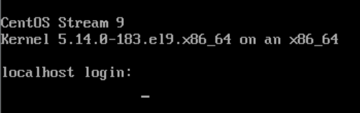

### 查询SSH是否安装

```shell
查看SSH是否安装。
输入命令：rpm -qa | grep ssh

注意：
若没安装SSH则可输入：yum -y install openssh-server安装
```

### SSH服务管理

配置文件管理

```shell
# vim /etc/ssh/sshd_config
PermitRootLogin prohibit-password		禁止root用户远程登录
Port 22															登录端口22
```

启动服务

```shell
（默认启动）
# systemctl start sshd 
```

查看端口

```shell
# netstat -antp | grep sshd
22号端口提供者SSH服务

netsat：显示一些服务的网络状态
-a：显示所有连接（包括已经建立的连接和正在监听的连接）
-n：以数字的形式显示IP和端口号
-t：仅显示TCP协议相关的连接
-p：显示每个连接对应的进程名和PID
```

开机启动

```shell
（默认启动）
# systemctl enable sshd
```

### 使用SSH远程管理

```shell
# ssh 账户名@IP地址

比如：
我们可以在xshell中，随便管理一台Linux服务器后，输入如下内容，可以连接到别的Linux服务器
# ssh root@192.168.126.182
```

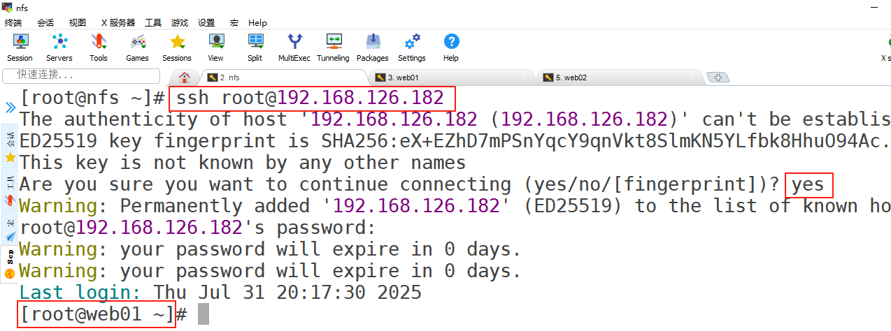

## SSH免密登录

### 需求

在实际工作中，我们可能会管理很多台Linux服务器，比如管理5台。

那么我们需要一个个的输入账号密码分别去连接这5台服务器吗？太麻烦了！每次都要输入密码。而且以后我们需要用到自动化运维工具，通过工具去管理多台服务器，总不能还要一个个输入密码吧？

我们可以设置免密登录的，这样就可以不用每次都输入密码了！

效果图：注意一下**跳板机**，其实就是我们登录跳板机服务器后，通过它就可以免密登录管理其他很多服务器。

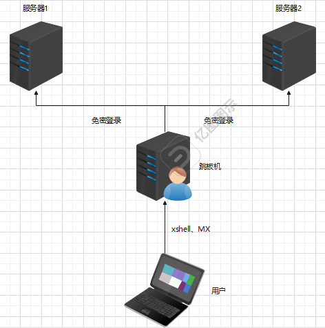

### 环境准备

直接在上面的NFS相关的3台服务器上操作即可

我们将`192.168.126.181`作为跳板机服务器

将`192.168.126.182、192.168.126.183`作为被管理的服务器

实现跳板机服务器可以免密登录到被管理的两台服务器！

### 具体实现

第一步：使用MX连接到`192.168.126.181`跳板机服务器

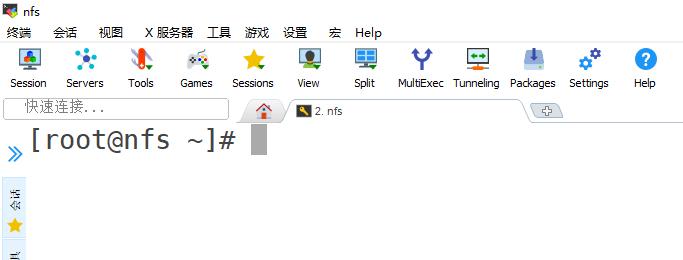

第二步：在跳板机上生成密钥并分别传递给两台被管理的服务器

```shell
生成密钥
# ssh-keygen
Generating public/private rsa key pair.
Enter file in which to save the key (/root/.ssh/id_rsa):
Enter passphrase (empty for no passphrase):直接回车
Enter same passphrase again:直接回车
Your identification has been saved in /root/.ssh/id_rsa
Your public key has been saved in /root/.ssh/id_rsa.pub
The key fingerprint is:
SHA256:D9U3G4d0WZk74W2Tn2jhqlB0X8OPw8L0HwFd+HcG/sY root@nfs.lhp.com
The key's randomart image is:
+---[RSA 3072]----+
|             .o.X|
|           . .=O |
|         ...o.*B*|
|        ...o.=o%@|
|        S.  +.O*O|
|        .o   = +E|
|       .  . o  ..|
|        .  .     |
|         ..      |
+----[SHA256]-----+

将公钥传递给182服务器
# ssh-copy-id 192.168.126.182
/usr/bin/ssh-copy-id: INFO: Source of key(s) to be installed: "/root/.ssh/id_rsa.pub"
/usr/bin/ssh-copy-id: INFO: attempting to log in with the new key(s), to filter out any that are already installed
/usr/bin/ssh-copy-id: INFO: 1 key(s) remain to be installed -- if you are prompted now it is to install the new keys
root@192.168.126.182's password:输入182服务器的密码
Warning: your password will expire in 0 days.

Number of key(s) added: 1

Now try logging into the machine, with:   "ssh '192.168.126.182'"
and check to make sure that only the key(s) you wanted were added.

将公钥传递给183服务器
# ssh-copy-id 192.168.126.183
/usr/bin/ssh-copy-id: INFO: Source of key(s) to be installed: "/root/.ssh/id_rsa.pub"
The authenticity of host '192.168.126.183 (192.168.126.183)' can't be established.
ED25519 key fingerprint is SHA256:eX+EZhD7mPSnYqcY9qnVkt8SlmKN5YLfbk8HhuO94Ac.
This host key is known by the following other names/addresses:
    ~/.ssh/known_hosts:1: 192.168.126.182
Are you sure you want to continue connecting (yes/no/[fingerprint])? yes
/usr/bin/ssh-copy-id: INFO: attempting to log in with the new key(s), to filter out any that are already installed
/usr/bin/ssh-copy-id: INFO: 1 key(s) remain to be installed -- if you are prompted now it is to install the new keys
root@192.168.126.183's password:输入183服务器的密码
Warning: your password will expire in 0 days.

Number of key(s) added: 1

Now try logging into the machine, with:   "ssh '192.168.126.183'"
and check to make sure that only the key(s) you wanted were added.
```

第三步：在跳板机中免密登录到182服务器

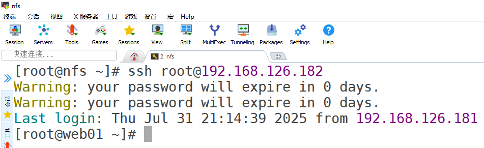

第四步：在跳板机中退出182的登录，免密登录到183服务器

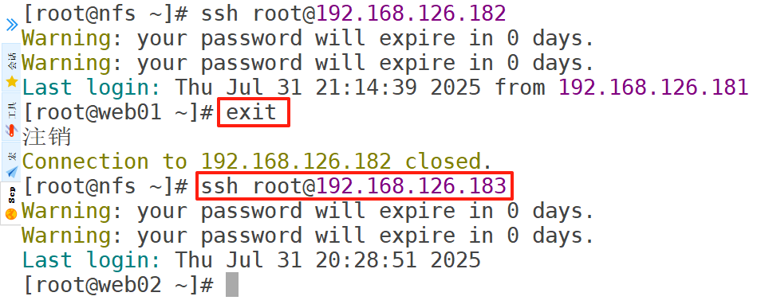

### 免密登录的原理

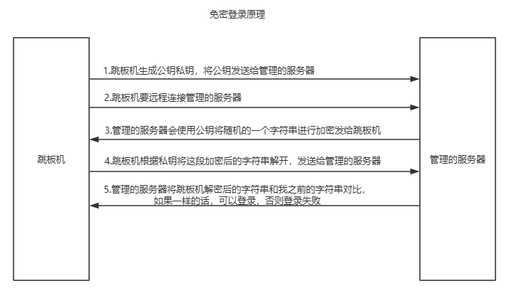


> 更新: 2026-03-31 09:49:08  
> 原文: <https://www.yuque.com/u41736172/az9urv/tcnp1qq56f549lw1>